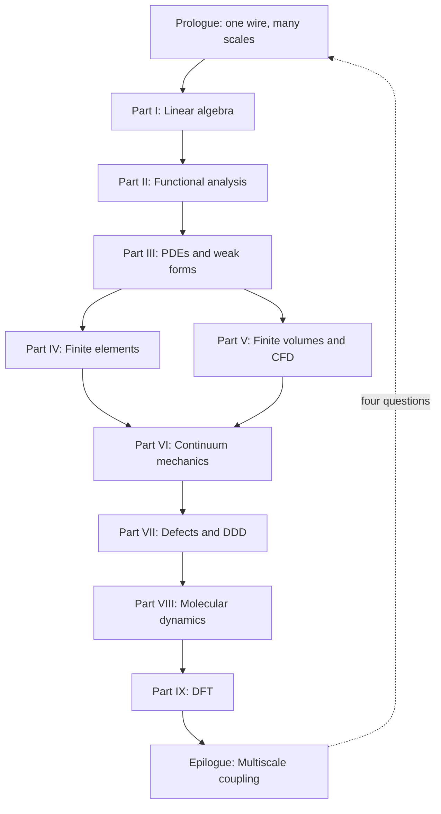

# The Same Material, Many Scales

## Scene

Imagine a single crystal of copper pulled in uniaxial tension. At the engineering scale — centimeters, Newtons — we describe the specimen with Cauchy stress, Hooke's law, and perhaps a finite element mesh of tetrahedra. The wire carries current, heats slightly, and sags under its own weight. None of that physics lives in the crystal lattice alone; it lives in a **continuum** description that treats the material as a smooth field of stress and displacement.

Zoom in to micrometers and the story changes. Dislocation lines glide, multiply, and tangle; the material work-hardens not because of a phenomenological law we inserted by hand, but because of collective motion we can simulate with **dislocation dynamics**. A drawn copper wire owes much of its strength to the dislocation forest left behind by cold working — a mesoscale history written into line defects, invisible to a coarse stress–strain curve until we ask *why* the curve bends upward.

Zoom further, to nanometers, and individual atoms swap neighbors across a grain boundary; **molecular dynamics** tracks each nucleus and its thermal vibrations. A notch in the wire concentrates stress at the atomic scale; bonds stretch, rearrange, and eventually break in ways no elliptic PDE can resolve without regularization.

Zoom once more, to ångströms, and the very notion of an "atom" as a ball on a spring dissolves into the quantum mechanical electron density; **density functional theory** tells us where the electrons live and how much energy the crystal costs to deform. The cohesive energy that holds copper together — the baseline against which every vacancy, dislocation, and surface is measured — begins here.

None of these descriptions is wrong. Each is appropriate at its scale. Computational mechanics is the art of choosing — and connecting — the right description.

## A ladder, not a menu

It is tempting to treat finite elements, finite volumes, molecular dynamics, and DFT as separate courses with separate software packages. That temptation is practical: one does not run Quantum ESPRESSO inside Abaqus. But conceptually, the methods form a **ladder**:

1. **Linear algebra** gives us the syntax for any discrete model: states are vectors, evolution is matrix multiplication, stability is an eigenvalue sign.
2. **Functional analysis** explains why infinite-dimensional field descriptions make sense, why weak formulations exist, and why Galerkin approximations can converge.
3. **Partial differential equations** encode conservation and constitutive physics on continua.
4. **Finite element and finite volume methods** discretize those PDEs with different philosophies — trial functions versus flux balance — suited to elliptic solids and hyperbolic fluids.
5. **Continuum mechanics** supplies the stress–strain–balance language that FEM implementations ultimately approximate.
6. **Defect and dislocation models** explain why continuum elasticity breaks down where singularities live.
7. **Molecular dynamics** resolves atomic motion when continuum fields are too coarse.
8. **Density functional theory** resolves electronic structure when interatomic potentials must be derived rather than assumed.

Each rung supports the one above it. Each rung limits the one below it. Climbing upward, we **homogenize**: we replace microscopic detail with effective laws. Descending downward, we **derive**: we ask where those laws came from and what they omit.

The copper wire is our thread through every rung. At the macro scale it is a structural member; at the mesoscale a polycrystal with texture; at the atomistic scale a lattice of nuclei vibrating in an effective potential; at the electronic scale a sea of valence electrons binding the crystal together.

## The concept map (whole book)

The [Functional Analysis Notes](https://hanfengzhai.github.io/file/teaching/notes/ME412_CourseSummary.pdf) organize each topic with four questions — object, structure, theorem, failure mode. At the scale of the entire book, the same discipline applies:

| Question | Answer for this book |
|----------|----------------------|
| What **object** spans all parts? | The copper wire as a multiscale state — vectors, fields, defects, atoms, electrons |
| What **structure** connects the parts? | The ladder: homogenize upward, derive downward; weak forms at every rung |
| What **theorem** (or principle) makes the story coherent? | Well-posedness and convergence at each discretization; consistent interface data across scales |
| What **breaks** if we ignore the ladder? | Wrong moduli, missing hardening history, unit mismatches, category errors at notches and cores |

The reading order is one continuous arc — not a catalog of methods:

**Baby picture:** climb the mathematical rungs (I–VI) until the wire is a meshed solid with stress and flux; then descend (VII–IX) to learn where yield stress, potentials, and cohesive energy originate; finish by wiring the rungs together in workflows no single code runs alone.

## The same questions at every scale

At each rung we ask the same four questions — whether we are solving a sparse linear system, a weak form, or a self-consistent Kohn–Sham cycle:

| Question | Linear algebra | Continuum FEM | Dislocation dynamics | MD | DFT |
|----------|----------------|---------------|------------------------|-----|-----|
| What is the **state**? | Vector \(\mathbf{x}\) | Displacement field \(\mathbf{u}\) | Dislocation network | Positions \(\{\mathbf{r}_i\}\) | Density \(\rho(\mathbf{r})\) |
| What **equations** govern it? | \(\mathbf{A}\mathbf{x}=\mathbf{b}\) | Virtual work / balance | Peach–Köhler + mobility | Newton / Hamilton | Kohn–Sham SCF |
| What **discretization**? | Matrix assembly | Elements + quadrature | Line segments | Timestep + cutoff | Plane waves + k-points |
| What passes **upward**? | — | Stress, stiffness | Hardening law | Potential parameters | Cohesive energy, moduli |

Recognizing this table early saves years of confusion. The software changes; the pattern does not.

## The experiment as plot

The book reads in **mathematical order** (algebra before atomistics), but the copper wire lives in **laboratory time**. Keeping both orders straight turns a catalog of methods into a story. Picture one afternoon in a mechanics lab — the same specimen, the same afternoon, many models:

| Act | What happens in the lab | What the book computes | Parts (read in order) |
|-----|-------------------------|------------------------|-----------------------|
| **I — Mounting** | A cold-drawn copper cylinder is gripped in wedge jaws; the operator zeros the load cell and thermocouple. | Boundary conditions, a chain of bar elements, the first \(\mathbf{K}\mathbf{u}=\mathbf{f}\). | [Prologue](00-many-scales.md), [Part I](../part01-linear-algebra/00-opening.md) |
| **II — Warming** | Current is switched on. The narrowest cross-section heats; air cools the surface. | Steady heat conduction in the solid (FEM), enthalpy flux in the surrounding air (FVM), Robin coupling at the wall. | [Part III](../part03-pdes/00-opening.md), [Part IV](../part04-fem/00-opening.md), [Part V](../part05-fvm/00-opening.md) |
| **III — Pulling** | Grip displacement ramps. The force–displacement curve climbs almost linearly. | Weak-form elasticity, Galerkin assembly, convergence in \(H^1\); Cauchy stress and virtual work name what the curve measures. | [Part II](../part02-functional-analysis/00-opening.md), [Part III](../part03-pdes/00-opening.md), [Part IV](../part04-fem/00-opening.md), [Part VI](../part06-continuum/00-opening.md) |
| **IV — Hardening** | The curve bends upward: more force for each increment of stretch. | Dislocation forest from cold drawing plus fresh multiplication; DDD and Taylor hardening explain the bend without a magic constant. | [Part VII](../part07-defects/00-opening.md) |
| **V — Notch (optional)** | A scratched wire or a grip corner concentrates stress. | Continuum fields predict *where*; MD at the tip resolves bond breaking and dislocation nucleation. | [Part VI](../part06-continuum/00-opening.md), [Part VIII](../part08-md/00-opening.md) |
| **VI — Foundation (always, in parallel)** | Before any simulation ran, someone chose \(E\), \(\nu\), and a yield stress. | DFT on a small fcc cell supplies cohesive energy and elastic constants; MD fits an EAM potential; those numbers climb the ladder into FEM input decks. | [Part IX](../part09-dft/00-opening.md) → [Part VIII](../part08-md/00-opening.md) → [Part VII](../part07-defects/00-opening.md) → [Part IV](../part04-fem/00-opening.md) |

Acts I–III are what the operator watches on the screen in real time. Act IV is the history written into the material before the test began — cold work — made visible only when load exceeds yield. Act V is the exception that proves the rule: wherever geometry or defects break scale separation, we descend one rung. Act VI is the **prequel** every practitioner runs offline: no wire-scale job starts without parameters whose pedigree traces to finer models or calibration experiments.

Read Parts I–VI as Acts I–III in slow motion — every line of code the operator trusts is justified there. Read Parts VII–IX as Acts IV–VI — where the numbers in the input file came from, and what they omit. The **epilogue** returns to the full afternoon and asks how modern teams wire Acts I–VI into one workflow when no single executable spans the ladder.

When a chapter feels abstract, locate it in this table: *Which act of the experiment am I in, and what question is the model answering right now?* The mathematics changes; the specimen does not.

## Why the ladder has a preferred direction

We read this book **bottom-up** in the mathematical parts (I–VI) because the language of weak forms, assembly, and convergence is easier to learn on elliptic problems with clean energy principles. We then **descend** in Parts VII–IX because continuum parameters — yield stress, hardening modulus, interatomic potential, surface energy — are not free parameters. They are **outputs** of finer models or experiments.

Consider the elastic modulus \(E\) of copper used in a structural wire model. DFT can compute it from the curvature of total energy with respect to strain on a perfect lattice. MD can cross-check it with fluctuation formulas at finite temperature. A tension test on the wire itself measures an **effective** modulus that includes texture, porosity, and processing history. All three numbers are "the modulus of copper," but they answer slightly different questions. Multiscale mechanics is the discipline of making those answers consistent.

## The weak form as recurring character

Along the way, a recurring character appears: the **weak form** of a boundary value problem. Born in Part III as a mathematical convenience — multiply by a test function, integrate by parts, absorb boundary conditions — it becomes in Part IV the foundation of the finite element method. In Part VI it reappears as the **virtual work principle** of elasticity:

\[
\int_\Omega \boldsymbol{\sigma} : \delta\boldsymbol{\varepsilon} \, d\Omega = \int_\Omega \mathbf{f} \cdot \delta\mathbf{u} \, d\Omega + \int_{\Gamma_N} \mathbf{t} \cdot \delta\mathbf{u} \, dS.
\]

By the time we reach molecular dynamics, we will recognize its shadow in the **symplectic structure** of Hamiltonian integrators — different language, same instinct: multiply by a test object, integrate by parts, and let boundary conditions do the heavy lifting. Even DFT has a variational heart: the ground-state density minimizes an energy functional.

The copper wire does not know which chapter we are in. It responds to the same physics whether we write a weak form or a Kohn–Sham equation. Our job is to translate faithfully between languages.

## Processing history matters

Real copper wire is not a perfect single crystal. It is drawn through dies, work-hardened, perhaps annealed partially to recover conductivity. Each process step writes **structure** into the material:

- **Drawing** increases dislocation density and aligns grains — mesoscale and polycrystal effects.
- **Annealing** allows vacancies to diffuse and dislocations to rearrange — atomistic kinetics.
- **Oxidation** at the surface changes local chemistry — electronic structure near interfaces.

A multiscale narrative that jumps straight from DFT bulk modulus to structural FEM without acknowledging processing history predicts the wrong wire. The ladder is not only spatial; it is also **historical**. Internal state variables — dislocation density, back stress, grain size — exist precisely to carry history upward when pure elasticity cannot.

## Scale separation and overlap

Scale separation is both a blessing and a fiction. It is a **blessing** because Born–Oppenheimer, homogenization, and RVE averaging work when a clear gap separates fast and slow degrees of freedom, or fine and coarse spatial structure. It is a **fiction** because real materials exhibit **overlap**: dislocation cores require atoms; crack tips couple quantum chemistry to continuum stress; grain-boundary sliding couples diffusion to polycrystal FEM.

When scales overlap, we do not abandon the ladder — we **refine the handoff**. Concurrent coupling (QM/MM, FE²) and enriched continua (gradient plasticity, nonlocal damage) exist precisely where sequential homogenization with a single constant fails. The copper wire's notch root is a canonical overlap region: continuum stress is well defined a micron away, but bond breaking at the tip is atomistic.

Recognizing overlap early prevents category errors — using bulk DFT modulus to predict notch failure without fracture mechanics or atomistics, for example.

## Software silos vs. intellectual continuity

Practitioners legitimately speak of "the MD person" and "the FEM person" because software ecosystems differ:

- **FEM**: mesh generation, weak form assembly, sparse linear solvers.
- **FVM/CFD**: Riemann solvers, limiters, turbulence closures.
- **MD**: potentials, thermostats, neighbor lists, timestep stability.
- **DFT**: plane waves, SCF mixing, k-meshes, pseudopotential libraries.

No unified executable spans all rungs. **Workflow orchestrators** (Python scripts, workflow engines, Jupyter pipelines) stitch codes together. The intellectual continuity this book emphasizes — state, equations, discretization, upward information — is what makes those scripts more than ad hoc file conversion. When you write `extract_elastic_tensor.py`, you should know whether you are exporting Voigt averages, whether temperature matches, and whether the functional matches the MD potential fit.

## A note on units and conventions

Each community carries its own unit systems: FEM may use SI (Pa, m); MD uses metal units (Å, ps, eV) or real units (kcal/mol); DFT uses Ry or eV with Bohr radii. Multiscale projects fail silently when units convert incorrectly at interfaces. Part VIII's LAMMPS `units metal` and Part IX's Ry cutoff energies do not speak to each other without explicit conversion — a mundane detail that destroys ladders faster than wrong physics.

We will state conventions when they matter and recommend **SI with documented conversion** at workflow boundaries.

## What you should bring

Comfort with multivariable calculus and basic linear algebra is assumed. We will develop functional analysis and Sobolev space ideas as needed, always with an eye toward computation rather than pure generality. Programming experience helps but is not required: the emphasis is on the continuous and discrete mathematics that any implementation must respect.

When you encounter a formula, ask: *What discretization makes this computable? What limit is being taken? What information crosses the scale boundary?* Those three questions will serve you from Part I through the epilogue.

## Reading strategies

This book supports multiple paths:

- **Linear reading** (Parts I → IX → epilogue): best for first exposure; builds language before atomistics.
- **Scale-first reading** (prologue → Part IX → VIII → VII → VI → IV): for readers who already simulate MD or DFT and want the continuum foundation that explains homogenization.
- **Reference reading**: jump to weak forms (Part III), FEM assembly (Part IV), or Kohn–Sham (Part IX) as needed; the prologue and epilogue frame how chapters connect.

Regardless of path, return to the copper wire periodically. If a chapter feels abstract, ask how its equations would appear in a wire tension test, an anneal, or a notch root — grounding prevents methods from floating free of mechanics.

## What lies ahead

Part I refreshes linear algebra and shows how its ideas generalize from vectors to functions. Part II develops the function-space language that makes sense of infinite degrees of freedom. Parts III–V build discretization methods for PDEs — Galerkin FEM for elliptic solids, finite volumes for conservation laws and fluids. Part VI anchors those methods in solid mechanics: kinematics, stress, balance, and variational elasticity.

Parts VII–IX descend. **Part VII** introduces defects and dislocation dynamics — the mesoscale engine of plasticity in our copper wire. **Part VIII** treats molecular dynamics: potentials, ensembles, integrators, and the LAMMPS workflows that connect atomistic simulation to coarser models. **Part IX** covers density functional theory: Born–Oppenheimer separation, Hohenberg–Kohn existence, and the Kohn–Sham equations practitioners solve daily.

The **epilogue** returns to the wire at full scale and asks how modern research couples these rungs — sequentially, concurrently, and through learned surrogates — into workflows that no single code runs unattended, but that disciplined teams use every day.

## Expectations of rigor

We will prove convergence theorems where they illuminate computation (Galerkin best approximation, Lax equivalence for FVM) and state without proof results where full generality would distract (Hohenberg–Kohn existence, spectral theorem in infinite dimensions). The standard is **honest mathematics**: precise hypotheses, explicit discretization parameters, and clear distinction between what is guaranteed and what is validated empirically.

Computational mechanics sits between applied mathematics and engineering. Too much abstraction loses the practitioner; too little loses the analyst. The ladder narrative keeps both readers on the same page — literally.

## Historical perspective (brief)

Multiscale thinking predates modern computing. **Taylor hardening** (1934) connected dislocation density to flow stress before computers tracked individual lines. **Born–Oppenheimer** (1927) separated electronic and nuclear motion before DFT existed. **Finite elements** (Turner, Clough, Argyris; 1950s–60s) discretized the same virtual work principle Cauchy and Lagrange wrote in continuum form.

What changed is **scale of computation**: exascale arithmetic lets DDD, MD, and DFT run at parameters that were pencil-and-paper estimates a generation ago. The ladder's rungs are stable; our ability to climb them is what evolves. Open-source codes democratize that climb — a copper wire study can begin on a laptop (small DFT cell, small MD box) and grow to cluster jobs without changing the underlying equations.

## Notation and conventions used throughout

Vectors are bold (\(\mathbf{u}\), \(\mathbf{F}\)); tensors are bold sans-serif or with double indices (\(\boldsymbol{\sigma}\), \(C_{ijkl}\)). We use Einstein summation where convenient. Partial derivatives appear as \(\partial u/\partial x\) or subscript comma notation \(u_{,x}\) depending on context.

Function spaces (\(H^1\), \(L^2\)) appear from Part II onward; their discrete counterparts are finite element spaces \(V_h\). When we write "convergence," we mean discretization parameters (mesh size \(h\), timestep \(\Delta t\), cutoff energy \(E_{\text{cut}}\)) tending to limits where the discrete model approaches a well-defined continuous or reference problem.

These conventions are standard in computational mechanics literature; deviations are noted locally.

## A promise to the reader

Every part of this book answers, implicitly or explicitly, one question about the copper wire (or any material you substitute): *At this scale, what is the minimal state description that still captures the physics we care about, and what do we export to the scale above?* If a chapter does not change your answer to that question, it has not done its job.

We begin with the grammar of vectors and matrices — not because wires are linear, but because every discretization, at every scale, eventually reduces to finite-dimensional algebra. Part I is where that reduction becomes conscious craft rather than background assumption. The same copper atom that DFT will later describe with electron density first appears here as a node in a graph of coupled degrees of freedom — finite-dimensional long before it is quantum mechanical.

Turn the page when ready. The ladder starts with familiar objects: vectors, matrices, and the linear maps between them.

## Reading compass: two clocks on one wire

The book reads in **mathematical order** (Part I before Part IX). The copper wire lives in **laboratory time** (mounting before hardening). Both clocks describe the same afternoon — the continuity comes from returning to the specimen whenever the symbols change.

| If you need… | Start here |
|--------------|------------|
| Skill checkpoints (competence time) | [Preface: skill navigation](../preface.md#skill-navigation) |
| Opening hinge (prologue → Part I) | [Preface: opening hinge](../preface.md#opening-continuity-hinge) |
| Act I — mounting stitch | [Preface: opening continuity hinge](../preface.md#opening-continuity-hinge) · [Part I mounting Lab act](../part01-linear-algebra/00-opening.md#lab-act-i--mounting) → [I.1 three-node assembly](../part01-linear-algebra/01-vectors-matrices.md#lab-act-three-nodes-one-load-cell-reading-act-i--mounting); epilogue [Act I reunion paragraph](../epilogue/multiscale.md#lab-act-reunion-six-acts-one-afternoon) and [preview Act I row](../epilogue/multiscale.md#reunion-preview-act-i); [prologue Act I preview row](#prologue-preview-act-i) |
| Act II — warming stitch | [Preface: row 8 skill checkpoint](../preface.md#skill-navigation-row-8) · [V.4 Picard loop](../part05-fvm/04-navier-stokes-cfd.md#lab-act-extension-two-domain-picard-loop-with-a-1d-fem-solid) → [Handshake 2](../epilogue/multiscale.md#handshake-2--joule-heating--conjugate-heat-transfer-part-iv--v); epilogue [Act II reunion paragraph](../epilogue/multiscale.md#lab-act-reunion-six-acts-one-afternoon) and [preview Act II row](../epilogue/multiscale.md#reunion-preview-act-ii); [prologue row 8 preview row](#prologue-preview-row-8) |
| Act III — pulling stitch | [Preface: row 13 skill checkpoint](../preface.md#skill-navigation-row-13) · [Handshake 2](../epilogue/multiscale.md#handshake-2--joule-heating--conjugate-heat-transfer-part-iv--v) → [IX.3 \(\alpha\) Lab act](../part09-dft/03-dft-workflows.md#lab-act-quasiharmonic-alpha-handshake-3-pedigree) → [Handshake 3](../epilogue/multiscale.md#handshake-3--thermal-strain--mechanical-stiffness-part-vi--iv); epilogue [Act III reunion paragraph](../epilogue/multiscale.md#lab-act-reunion-six-acts-one-afternoon) and [preview Act III row](../epilogue/multiscale.md#reunion-preview-act-iii); [prologue row 13 preview row](#prologue-preview-row-13) |
| Act IV — hardening stitch | [Preface: row 14 skill checkpoint](../preface.md#skill-navigation-row-14) · [VII.3 rate handshake](../part07-defects/03-polycrystal-and-fem-handoff.md#scale-boundary-handshake-ddd-strain-rate-to-quasi-static-fem) → [Handshake 4a](../epilogue/multiscale.md#handshake-4--rate-dependent-hardening-and-notch-localization-part-vii--vi--viii); epilogue [Act IV reunion paragraph](../epilogue/multiscale.md#lab-act-reunion-six-acts-one-afternoon) and [preview Act IV row](../epilogue/multiscale.md#reunion-preview-act-iv); [prologue row 14 preview row](#prologue-preview-row-14); [prologue Handshake 4a preview row](#prologue-preview-act-iv) |
| Act V — notch stitch | [Preface: row 15 skill checkpoint](../preface.md#skill-navigation-row-15) · [VII.3 Step 4 FE²](../part07-defects/03-polycrystal-and-fem-handoff.md#step-4--when-offline-calibration-fails-fe-at-the-notch) → [Handshake 4b](../epilogue/multiscale.md#4b--when-continuum-fails-at-the-notch-md-subdomain-act-v--notch); epilogue [Act V reunion paragraph](../epilogue/multiscale.md#lab-act-reunion-six-acts-one-afternoon) and [preview Act V row](../epilogue/multiscale.md#reunion-preview-act-v); [prologue Handshake 4b preview row](#prologue-preview-act-v); [prologue row 15 closing stitch](#row-15-closing-stitch); [epilogue row 15 closing loop](../epilogue/multiscale.md#row-15-closing-loop) |
| Act VI — foundation stitch | [Preface: row 16 skill checkpoint](../preface.md#skill-navigation-row-16) · [IX.3 Bridge to epilogue](../part09-dft/03-dft-workflows.md#bridge-to-the-epilogue) → [`parse_multiscale_workflow.sh`](../../scripts/parse_multiscale_workflow.sh); epilogue [Act VI reunion paragraph](../epilogue/multiscale.md#lab-act-reunion-six-acts-one-afternoon) and [preview Act VI row](../epilogue/multiscale.md#reunion-preview-act-vi); [prologue row 16 preview row](#prologue-preview-row-16); [prologue row 16 closing stitch](#row-16-closing-stitch); [epilogue row 16 closing loop](../epilogue/multiscale.md#row-16-closing-loop) |
| The plot in one page | [Preface: story in one page](../preface.md#the-story-in-one-page) |
| Ascent preview (Parts I–VI) | [Preface: ascent preview chain](../preface.md#ascent-preview-chain) |
| Ascent continuity hinges (I.4 → V.4) | [Preface: ascent hinges](../preface.md#ascent-continuity-hinges) |
| Descent preview (Parts VII–IX) | [Preface: descent preview chain](../preface.md#descent-preview-chain) |
| Continuity hinges (midpoint + VI.4) | [Preface: continuity hinges](../preface.md#continuity-hinges-ascent-descent) |
| Descent continuity hinges (VII.3 → IX.3) | [Preface: descent hinges](../preface.md#descent-continuity-hinges) |
| Epilogue continuity hinges (IX → prologue) | [Preface: epilogue hinges](../preface.md#epilogue-continuity-hinges) |
| All hinges in one table | [Memory sheet: master map](../appendix/memory-sheet.md#continuity-hinges-master-map) |
| Row 8 — \(T_w\) pedigree (Act II → MD/DDD) | [Preface: row 8 skill checkpoint](../preface.md#skill-navigation-row-8) · [V.4 CHT](../part05-fvm/04-navier-stokes-cfd.md#lab-act-extension-two-domain-picard-loop-with-a-1d-fem-solid) → [`cht_export.yaml`](../../scripts/parse_cht.sh) → [VIII.0 descent hinge](../part08-md/00-opening.md#descent-hinge-cores-mobility-and-tw-pedigree) → [VIII.3 WHAM at \(T_w\)](../part08-md/03-ab-initio-and-coarse-graining.md#wham-part-vii-mobility-hinge-act-ii-temperature-pedigree); [memory sheet rows 8–9 baby picture](../appendix/memory-sheet.md#rows-8-9-baby-picture-tw-temperature-pedigree) |
| Row 9 — phonon audit at \(T_w\) (MD → DFT) | [Preface: row 9 skill checkpoint](../preface.md#skill-navigation-row-9) — [IX.0 electronic audit hinge](../part09-dft/00-opening.md#electronic-audit-hinge-descent-pedigree-and-tw-phonon) · [thermal phonon audit at \(T_w\)](../part09-dft/00-opening.md#thermal-phonon-audit-at-tw); [`parse_alpha.sh`](../../scripts/parse_alpha.sh) with `--target-t` from `cht_export.yaml`; [memory sheet rows 8–9 baby picture](../appendix/memory-sheet.md#rows-8-9-baby-picture-tw-temperature-pedigree); epilogue [opening hinge from Part IX](../epilogue/multiscale.md#opening-hinge-ix3-to-epilogue), [preview Act III row](../epilogue/multiscale.md#reunion-preview-act-iii), and [preview Act IV row](../epilogue/multiscale.md#reunion-preview-act-iv); [prologue row 9 preview row](#prologue-preview-row-9) |
| Row 10 — coupling hinge (IX.3 → epilogue) | [Preface: row 10 skill checkpoint](../preface.md#skill-navigation-row-10) — [IX.3 Bridge to epilogue](../part09-dft/03-dft-workflows.md#bridge-to-the-epilogue) · [epilogue opening hinge from Part IX](../epilogue/multiscale.md#opening-hinge-ix3-to-epilogue); [IX.3 epilogue pedigree table](../part09-dft/03-dft-workflows.md#ix3-epilogue-pedigree-table); Handshakes **4a** (Act IV bulk hardening) vs **4b** (Act V notch) on the same `hardening.yaml`; [memory sheet row 10](../appendix/memory-sheet.md#continuity-hinges-master-map); [prologue row 10 preview row](#prologue-preview-row-10) |
| Row 11 — six-act reunion (I→IX vs Acts I–VI) | [Preface: row 11 skill checkpoint](../preface.md#skill-navigation-row-11) — [prologue experiment-as-plot](#the-experiment-as-plot) · [epilogue six-act reunion](../epilogue/multiscale.md#lab-act-reunion-six-acts-one-afternoon); [memory sheet one-page recap](../appendix/memory-sheet.md#one-page-copper-wire-recap); Act VI runs **in parallel** with Acts I–V; [memory sheet row 11](../appendix/memory-sheet.md#continuity-hinges-master-map); [prologue row 11 preview row](#prologue-preview-row-11); [prologue row 11 closing stitch](#row-11-closing-stitch); [epilogue row 11 closing loop](../epilogue/multiscale.md#row-11-closing-loop) |
| Row 12 — next project restart (epilogue → prologue) | [Preface: row 12 skill checkpoint](../preface.md#skill-navigation-row-12) — [epilogue Bridge row 12 closing loop](../epilogue/multiscale.md#row-12-closing-loop) · [prologue reopening anchor](#prologue-reopening-anchor); [memory sheet row 12 baby picture](../appendix/memory-sheet.md#row-12-baby-picture-next-project); [prologue row 12 preview row](#prologue-preview-row-12); [prologue row 12 closing stitch](#row-12-closing-stitch); [sources continuity hinges row 12](../appendix/sources.md#continuity-hinges-index-when-the-plot-stutters) |
| Joule heat → fixed-grip stress (row 13) | [Preface: row 13 skill checkpoint](../preface.md#skill-navigation-row-13) — [Handshake 2](../epilogue/multiscale.md#handshake-2--joule-heating--conjugate-heat-transfer-part-iv--v) → [IX.3 \(\alpha\) Lab act](../part09-dft/03-dft-workflows.md#lab-act-quasiharmonic-alpha-handshake-3-pedigree) → [Handshake 3](../epilogue/multiscale.md#handshake-3--thermal-strain--mechanical-stiffness-part-vi--iv); epilogue [Act II reunion paragraph](../epilogue/multiscale.md#lab-act-reunion-six-acts-one-afternoon) (Handshake 2) and [Act III reunion paragraph](../epilogue/multiscale.md#lab-act-reunion-six-acts-one-afternoon) (Handshake 3); [sensitivity derivation opening](../epilogue/multiscale.md#worked-example-sensitivity-ranks) (Handshake 2–3 chain); [prologue row 13 preview row](#prologue-preview-row-13); [prologue row 13 closing stitch](#row-13-closing-stitch); [epilogue row 13 closing loop](../epilogue/multiscale.md#row-13-closing-loop) |
| DDD rate → lab load cell (Handshake 4a) | [Preface: row 14 skill checkpoint](../preface.md#skill-navigation-row-14) — [VII.3 rate handshake](../part07-defects/03-polycrystal-and-fem-handoff.md#scale-boundary-handshake-ddd-strain-rate-to-quasi-static-fem) → [epilogue Handshake 4a](../epilogue/multiscale.md#handshake-4--rate-dependent-hardening-and-notch-localization-part-vii--vi--viii); [`parse_rate.sh`](../../scripts/parse_rate.sh); [sensitivity derivation](../epilogue/multiscale.md#worked-example-sensitivity-ranks) (Handshake 4a column); [memory sheet row 14](../appendix/memory-sheet.md#continuity-hinges-master-map); [prologue row 14 preview row](#prologue-preview-row-14); [prologue row 14 closing stitch](#row-14-closing-stitch); [epilogue row 14 closing loop](../epilogue/multiscale.md#row-14-closing-loop) |
| FE² notch → Act V localization (Handshake 4b) | [Preface: row 15 skill checkpoint](../preface.md#skill-navigation-row-15) — [VII.3 Step 4 FE²](../part07-defects/03-polycrystal-and-fem-handoff.md#step-4--when-offline-calibration-fails-fe-at-the-notch) → [epilogue Handshake 4b](../epilogue/multiscale.md#4b--when-continuum-fails-at-the-notch-md-subdomain-act-v--notch); [`parse_fe2.sh`](../../scripts/parse_fe2.sh); [sensitivity derivation](../epilogue/multiscale.md#worked-example-sensitivity-ranks) (Handshake 4b column); [memory sheet row 15](../appendix/memory-sheet.md#continuity-hinges-master-map); [memory sheet row 15 baby picture](../appendix/memory-sheet.md#row-15-baby-picture-handshake-4b); [prologue Handshake 4b preview row](#prologue-preview-act-v); [prologue row 15 closing stitch](#row-15-closing-stitch); [epilogue row 15 closing loop](../epilogue/multiscale.md#row-15-closing-loop); upstream rate from [row 14](../preface.md#skill-navigation-row-14) |
| Act VI orchestration → multiscale export (row 16) | [Preface: row 16 skill checkpoint](../preface.md#skill-navigation-row-16) · [Preface: epilogue hinges Act VI row](../preface.md#epilogue-continuity-hinges) — [IX.3 Bridge to epilogue](../part09-dft/03-dft-workflows.md#bridge-to-the-epilogue) → [`parse_multiscale_workflow.sh`](../../scripts/parse_multiscale_workflow.sh) → `multiscale_export.yaml`; per-handshake parsers in [epilogue script audit trail](../epilogue/multiscale.md#script-audit-trail-parse-scripts-handshakes); [Part IX coupling ladder](../part09-dft/00-opening.md#the-coupling-ladder-me-412-reunion); epilogue [Act VI reunion paragraph](../epilogue/multiscale.md#lab-act-reunion-six-acts-one-afternoon) and [sensitivity worksheet closing](../epilogue/multiscale.md#worked-example-sensitivity-ranks) (row 16 orchestration stitch); [memory sheet Act VI baby picture](../appendix/memory-sheet.md#act-vi-baby-picture-me-412-coupling-ladder); [prologue row 16 closing stitch](#row-16-closing-stitch); [epilogue row 16 closing loop](../epilogue/multiscale.md#row-16-closing-loop); upstream \(T_w\) pedigree from [rows 8–9](../preface.md#skill-navigation-row-8) and handshakes from [rows 13–15](../preface.md#skill-navigation-row-13) |
| Continuous read-through (row 17) | [Preface: row 17 skill checkpoint](../preface.md#skill-navigation-row-17) · [Continuous read-through guide](../appendix/sources.md#continuous-read-through-guide) · [memory sheet row 17 baby picture](../appendix/memory-sheet.md#row-17-baby-picture-continuous-read-through) · [prologue row 17 preview row](#prologue-preview-row-17); [prologue row 17 closing stitch](#row-17-closing-stitch); [epilogue row 17 closing loop](../epilogue/multiscale.md#row-17-closing-loop) — read Scene → Bridge straight through; pause only at I.4, VI.4, IX.3; open rows 0–16 only when a gate stalls |
| Part-opening plot spine (row 18) | [Preface: row 18 skill checkpoint](../preface.md#skill-navigation-row-18) · [Part-opening plot spine index](../appendix/sources.md#part-opening-plot-spine-index-row-18) · [memory sheet row 18 baby picture](../appendix/memory-sheet.md#row-18-baby-picture-part-opening-plot-spine) · [prologue row 18 preview row](#prologue-preview-row-18); [prologue row 18 closing stitch](#row-18-closing-stitch); [epilogue row 18 closing loop](../epilogue/multiscale.md#row-18-closing-loop) — read one sentence aloud at every part opening when row 17 stalls at a part boundary (III→IV, VI→VII) |
| Numbered-chapter plot spine (row 19) | [Preface: row 19 skill checkpoint](../preface.md#skill-navigation-row-19) · [Numbered-chapter plot spine index](../appendix/sources.md#numbered-chapter-plot-spine-index-row-19) · [memory sheet row 19 baby picture](../appendix/memory-sheet.md#row-19-baby-picture-numbered-chapter-plot-spine) · [prologue row 19 preview row](#prologue-preview-row-19); [prologue row 19 closing stitch](#row-19-closing-stitch); [epilogue row 19 closing loop](../epilogue/multiscale.md#row-19-closing-loop) — read one sentence aloud mid-chapter when row 18's part one-liners did not restore continuity |
| Gate-chapter plot spine (row 20) | [Preface: row 20 skill checkpoint](../preface.md#skill-navigation-row-20) · [Gate-chapter plot spine index](../appendix/sources.md#gate-chapter-plot-spine-index-row-20) · [memory sheet row 20 baby picture](../appendix/memory-sheet.md#row-20-baby-picture-gate-chapter-plot-spine) · [prologue row 20 preview row](#prologue-preview-row-20); [prologue row 20 closing stitch](#row-20-closing-stitch); [epilogue row 20 closing loop](../epilogue/multiscale.md#row-20-closing-loop) · [I.4 plot spine](../part01-linear-algebra/04-toward-infinity.md#plot-spine-one-line) · [VI.4 plot spine](../part06-continuum/04-nonlinear-plasticity-preview.md#plot-spine-one-line) · [IX.3 plot spine](../part09-dft/03-dft-workflows.md#plot-spine-one-line) — recite plot spine one line at I.4, VI.4, IX.3 before Bridge when row 19's chapter one-liners fail at a plot turn |
| Lab act reunion (row 21) | [Preface: row 21 skill checkpoint](../preface.md#skill-navigation-row-21) · [Lab act reunion index](../appendix/sources.md#lab-act-reunion-index-row-21) · [memory sheet row 21 baby picture](../appendix/memory-sheet.md#row-21-baby-picture-lab-act-reunion) · [prologue row 21 preview row](#prologue-preview-row-21); [prologue row 21 closing stitch](#row-21-closing-stitch); [epilogue row 21 closing loop](../epilogue/multiscale.md#row-21-closing-loop) — read one-line move aloud at workflow anchor Lab acts when plot spines restore narrative but code feels like homework |
| Scene reunion (row 22) | [Preface: row 22 skill checkpoint](../preface.md#skill-navigation-row-22) · [Scene reunion index](../appendix/sources.md#scene-reunion-index-row-22) · [memory sheet row 22 baby picture](../appendix/memory-sheet.md#row-22-baby-picture-scene-reunion) · [prologue row 22 preview row](#prologue-preview-row-22); [prologue row 22 closing stitch](#row-22-closing-stitch); [epilogue row 22 closing loop](../epilogue/multiscale.md#row-22-closing-loop) — read Scene one-line visual aloud when plot spines and Lab acts restore vocabulary but symbols hide the wire |
| Bridge reunion (row 23) | [Preface: row 23 skill checkpoint](../preface.md#skill-navigation-row-23) · [Bridge reunion index](../appendix/sources.md#bridge-reunion-index-row-23) · [memory sheet row 23 baby picture](../appendix/memory-sheet.md#row-23-baby-picture-bridge-reunion) · [prologue row 23 preview row](#prologue-preview-row-23); [prologue row 23 closing stitch](#row-23-closing-stitch); [epilogue row 23 closing loop](../epilogue/multiscale.md#row-23-closing-loop) — read the prior chapter's Bridge one-line hinge aloud when Scene, plot spines, and Lab acts all read correctly but chapter transitions feel mechanical |
| Concept map reunion (row 24) | [Preface: row 24 skill checkpoint](../preface.md#skill-navigation-row-24) · [Concept map reunion index](../appendix/sources.md#concept-map-reunion-index-row-24) · [memory sheet row 24 baby picture](../appendix/memory-sheet.md#row-24-baby-picture-concept-map-reunion) · [prologue row 24 preview row](#prologue-preview-row-24); [prologue row 24 closing stitch](#row-24-closing-stitch); [epilogue row 24 closing loop](../epilogue/multiscale.md#row-24-closing-loop) — answer object / structure / theorem / breaks at the part-opening concept map when narrative vocabulary is restored but proofs feel like disconnected theorems |
| Schematic reunion (row 25) | [Preface: row 25 skill checkpoint](../preface.md#skill-navigation-row-25) · [Schematic reunion index](../appendix/sources.md#schematic-reunion-index-row-25) · [memory sheet row 25 baby picture](../appendix/memory-sheet.md#row-25-baby-picture-schematic-reunion) · [prologue row 25 preview row](#prologue-preview-row-25); [prologue row 25 closing stitch](#row-25-closing-stitch); [epilogue row 25 closing loop](../epilogue/multiscale.md#row-25-closing-loop) — locate the matching baby picture from the part-opening representative schematics table when structural vocabulary is restored but proofs feel abstract without a visual anchor |
| Story so far reunion (row 26) | [Preface: row 26 skill checkpoint](../preface.md#skill-navigation-row-26) · [Story so far reunion index](../appendix/sources.md#story-so-far-reunion-index-row-26) · [memory sheet row 26 baby picture](../appendix/memory-sheet.md#row-26-baby-picture-story-so-far-reunion) · [prologue row 26 preview row](#prologue-preview-row-26); [prologue row 26 closing stitch](#row-26-closing-stitch); [epilogue row 26 closing loop](../epilogue/multiscale.md#row-26-closing-loop) — read the part-opening Story so far recap aloud when rows 17–25 all read correctly but you cannot place where the copper wire is in the narrative arc |
| Closing the arc reunion (row 27) | [Preface: row 27 skill checkpoint](../preface.md#skill-navigation-row-27) · [Closing the arc reunion index](../appendix/sources.md#closing-the-arc-reunion-index-row-27) · [memory sheet row 27 baby picture](../appendix/memory-sheet.md#row-27-baby-picture-closing-the-arc-reunion) · [prologue row 27 preview row](#prologue-preview-row-27); [prologue row 27 closing stitch](#row-27-closing-stitch); [epilogue row 27 closing loop](../epilogue/multiscale.md#row-27-closing-loop) — read the part-opening Closing the arc table aloud when rows 17–26 all read correctly but prior-part symbols do not map to current-part vocabulary |
| Scale-boundary reunion (row 28) | [Preface: row 28 skill checkpoint](../preface.md#skill-navigation-row-28) · [Scale-boundary reunion index](../appendix/sources.md#scale-boundary-reunion-index-row-28) · [memory sheet row 28 baby picture](../appendix/memory-sheet.md#row-28-baby-picture-scale-boundary-reunion) · [prologue row 28 preview row](#prologue-preview-row-28); [prologue row 28 closing stitch](#row-28-closing-stitch); [epilogue row 28 closing loop](../epilogue/multiscale.md#row-28-closing-loop) — read the chapter Scale-boundary handshake table aloud when rows 17–27 all read correctly but parameters crossing a scale boundary feel arbitrary |
| Thermoelastic assembly reunion (row 29) | [Preface: row 29 skill checkpoint](../preface.md#skill-navigation-row-29) · [Thermoelastic assembly reunion index](../appendix/sources.md#thermoelastic-assembly-reunion-index-row-29) · [memory sheet row 29 baby picture](../appendix/memory-sheet.md#row-29-baby-picture-thermoelastic-assembly-reunion) · [prologue row 29 preview row](#prologue-preview-row-29); [prologue row 29 closing stitch](#row-29-closing-stitch); [epilogue row 29 closing loop](../epilogue/multiscale.md#row-29-closing-loop) — read the Part IV thermoelastic assembly thread aloud when rows 17–28 all read correctly but Act II heating and Act III pulling feel like separate FEM homework |
| CHT outer-loop reunion (row 30) | [Preface: row 30 skill checkpoint](../preface.md#skill-navigation-row-30) · [CHT outer-loop reunion index](../appendix/sources.md#cht-outer-loop-reunion-index-row-30) · [memory sheet row 30 baby picture](../appendix/memory-sheet.md#row-30-baby-picture-cht-outer-loop-reunion) · [prologue row 30 preview row](#prologue-preview-row-30); [prologue row 30 closing stitch](#row-30-closing-stitch); [epilogue row 30 closing loop](../epilogue/multiscale.md#row-30-closing-loop) — read the IV.5 → V.4 Picard → `cht_export.yaml` chain aloud when rows 17–29 all read correctly but solid FEM and fluid FVM still feel like separate solvers |
| Twin-ladder → virtual work reunion (row 31) | [Preface: row 31 skill checkpoint](../preface.md#skill-navigation-row-31) · [Twin-ladder virtual work reunion index](../appendix/sources.md#twin-ladder-virtual-work-reunion-index-row-31) · [memory sheet row 31 baby picture](../appendix/memory-sheet.md#row-31-baby-picture-twin-ladder-virtual-work-reunion) · [prologue row 31 preview row](#prologue-preview-row-31); [prologue row 31 closing stitch](#row-31-closing-stitch); [epilogue row 31 closing loop](../epilogue/multiscale.md#row-31-closing-loop) — read VI.0 twin-ladder → VI.1 kinematics → VI.3 virtual work aloud when rows 17–30 all read correctly but \(\mathbf{K}\mathbf{U}=\mathbf{F}\) and virtual work still feel like separate subjects |
| Virtual work → plasticity preview reunion (row 32) | [Preface: row 32 skill checkpoint](../preface.md#skill-navigation-row-32) · [Virtual work → plasticity preview reunion index](../appendix/sources.md#virtual-work-plasticity-preview-reunion-index-row-32) · [memory sheet row 32 baby picture](../appendix/memory-sheet.md#row-32-baby-picture-virtual-work-plasticity-preview-reunion) · [prologue row 32 preview row](#prologue-preview-row-32); [prologue row 32 closing stitch](#row-32-closing-stitch); [epilogue row 32 closing loop](../epilogue/multiscale.md#row-32-closing-loop) — read VI.3 virtual work → VI.4 return-mapping → Part VII descent hinge aloud when rows 17–31 all read correctly but \(\delta\Pi = 0\) and return-mapping still feel like separate subjects |
| Part VII → VIII descent hinge reunion (row 33) | [Preface: row 33 skill checkpoint](../preface.md#skill-navigation-row-33) · [Part VII → VIII descent hinge reunion index](../appendix/sources.md#part-vii-viii-descent-hinge-reunion-index-row-33) · [memory sheet row 33 baby picture](../appendix/memory-sheet.md#row-33-baby-picture-part-vii-viii-descent-hinge-reunion) · [prologue row 33 preview row](#prologue-preview-row-33); [prologue row 33 closing stitch](#row-33-closing-stitch); [epilogue row 33 closing loop](../epilogue/multiscale.md#row-33-closing-loop) — read Part VII descent hinge → VII.2 mobility at \(T_w\) → Part VIII descent hinge aloud when rows 17–32 all read correctly but DDD and MD still feel like separate courses |
| Potentials → ensembles reunion (row 34) | [Preface: row 34 skill checkpoint](../preface.md#skill-navigation-row-34) · [Potentials → ensembles reunion index](../appendix/sources.md#potentials-ensembles-reunion-index-row-34) · [memory sheet row 34 baby picture](../appendix/memory-sheet.md#row-34-baby-picture-potentials-ensembles-reunion) · [prologue row 34 preview row](#prologue-preview-row-34); [prologue row 34 closing stitch](#row-34-closing-stitch); [epilogue row 34 closing loop](../epilogue/multiscale.md#row-34-closing-loop) — read VIII.1 Bridge → VIII.2 opening hinge aloud when rows 17–33 all read correctly but 0 K EAM minimization and NVT/NPT trajectories still feel like separate subjects |
| Ensembles → coarse-graining reunion (row 35) | [Preface: row 35 skill checkpoint](../preface.md#skill-navigation-row-35) · [Ensembles → coarse-graining reunion index](../appendix/sources.md#ensembles-coarse-graining-reunion-index-row-35) · [memory sheet row 35 baby picture](../appendix/memory-sheet.md#row-35-baby-picture-ensembles-coarse-graining-reunion) · [prologue row 35 preview row](#prologue-preview-row-35); [prologue row 35 closing stitch](#row-35-closing-stitch); [epilogue row 35 closing loop](../epilogue/multiscale.md#row-35-closing-loop) — read VIII.2 Bridge → VIII.3 opening hinge aloud when rows 17–34 all read correctly but audited trajectories and yaml handoff tables still feel like separate subjects |
| Coarse-graining → electronic audit reunion (row 36) | [Preface: row 36 skill checkpoint](../preface.md#skill-navigation-row-36) · [Coarse-graining → electronic audit reunion index](../appendix/sources.md#coarse-graining-electronic-audit-reunion-index-row-36) · [memory sheet row 36 baby picture](../appendix/memory-sheet.md#row-36-baby-picture-coarse-graining-electronic-audit-reunion) · [prologue row 36 preview row](#prologue-preview-row-36); [prologue row 36 closing stitch](#row-36-closing-stitch); [epilogue row 36 closing loop](../epilogue/multiscale.md#row-36-closing-loop) — read VIII.3 Bridge → IX.0 opening hinge aloud when rows 17–35 all read correctly but pedigree checklist rows exist without QE SCF logs or \(\alpha(T_w)\) beside them |
| Electronic audit → Born–Oppenheimer reunion (row 37) | [Preface: row 37 skill checkpoint](../preface.md#skill-navigation-row-37) · [Electronic audit → Born–Oppenheimer reunion index](../appendix/sources.md#electronic-audit-born-oppenheimer-reunion-index-row-37) · [memory sheet row 37 baby picture](../appendix/memory-sheet.md#row-37-baby-picture-electronic-audit-born-oppenheimer-reunion) · [prologue row 37 preview row](#prologue-preview-row-37); [prologue row 37 closing stitch](#row-37-closing-stitch); [epilogue row 37 closing loop](../epilogue/multiscale.md#row-37-closing-loop) — read IX.0 Bridge → IX.1 opening hinge aloud when rows 17–36 all read correctly but SCF logs exist without BO/HK theorems connecting to Part VIII's EAM surface |
| Born–Oppenheimer → Kohn–Sham reunion (row 38) | [Preface: row 38 skill checkpoint](../preface.md#skill-navigation-row-38) · [Born–Oppenheimer → Kohn–Sham reunion index](../appendix/sources.md#born-oppenheimer-kohn-sham-reunion-index-row-38) · [memory sheet row 38 baby picture](../appendix/memory-sheet.md#row-38-baby-picture-born-oppenheimer-kohn-sham-reunion) · [prologue row 38 preview row](#prologue-preview-row-38); [prologue row 38 closing stitch](#row-38-closing-stitch); [epilogue row 38 closing loop](../epilogue/multiscale.md#row-38-closing-loop) — read IX.1 Bridge → IX.2 opening hinge aloud when rows 17–37 all read correctly but BO/HK theorems exist without the SCF fixed-point loop connecting to Part I eigenvalues |
| Kohn–Sham → DFT workflows reunion (row 39) | [Preface: row 39 skill checkpoint](../preface.md#skill-navigation-row-39) · [Kohn–Sham → DFT workflows reunion index](../appendix/sources.md#kohn-sham-dft-workflows-reunion-index-row-39) · [memory sheet row 39 baby picture](../appendix/memory-sheet.md#row-39-baby-picture-kohn-sham-dft-workflows-reunion) · [prologue row 39 preview row](#prologue-preview-row-39); [prologue row 39 closing stitch](#row-39-closing-stitch); [epilogue row 39 closing loop](../epilogue/multiscale.md#row-39-closing-loop) — read IX.2 Bridge → IX.3 opening hinge aloud when rows 17–38 all read correctly but SCF is understood without the calculation ladder and `cu.foundation/` archive connecting to Parts VI–VIII |
| IX.3 → Handshake 3 reunion (row 40) | [Preface: row 40 skill checkpoint](../preface.md#skill-navigation-row-40) · [IX.3 → Handshake 3 reunion index](../appendix/sources.md#ix3-handshake3-reunion-index-row-40) · [memory sheet row 40 baby picture](../appendix/memory-sheet.md#row-40-baby-picture-ix3-handshake3-reunion) · [prologue row 40 preview row](#prologue-preview-row-40); [prologue row 40 closing stitch](#row-40-closing-stitch); [epilogue row 40 closing loop](../epilogue/multiscale.md#row-40-closing-loop) — read IX.3 Bridge → epilogue Handshake 3 opening hinge aloud when rows 17–39 all read correctly but `cu.foundation/` is complete yet handbook \(\alpha(300\,\text{K})\) persists at the load cell |
| VII.3 → Handshake 4a reunion (row 41) | [Preface: row 41 skill checkpoint](../preface.md#skill-navigation-row-41) · [VII.3 → Handshake 4a reunion index](../appendix/sources.md#vii3-handshake4a-reunion-index-row-41) · [memory sheet row 41 baby picture](../appendix/memory-sheet.md#row-41-baby-picture-vii3-handshake4a-reunion) · [prologue row 41 preview row](#prologue-preview-row-41); [prologue row 41 closing stitch](#row-41-closing-stitch); [epilogue row 41 closing loop](../epilogue/multiscale.md#row-41-closing-loop) — read VII.3 rate handshake → epilogue Handshake 4a opening hinge aloud when rows 17–40 all read correctly but OpenDiS exports feed the plasticity deck without rate extrapolation |
| VII.3 Step 4 → Handshake 4b reunion (row 42) | [Preface: row 42 skill checkpoint](../preface.md#skill-navigation-row-42) · [VII.3 → Handshake 4b reunion index](../appendix/sources.md#vii3-handshake4b-reunion-index-row-42) · [memory sheet row 42 baby picture](../appendix/memory-sheet.md#row-42-baby-picture-vii3-handshake4b-reunion) · [prologue row 42 preview row](#prologue-preview-row-42); [prologue row 42 closing stitch](#row-42-closing-stitch); [epilogue row 42 closing loop](../epilogue/multiscale.md#row-42-closing-loop) — read VII.3 Step 4 FE² → epilogue Handshake 4b opening hinge aloud when rows 17–41 all read correctly but bulk hardening from 4a matches flow stress while the notch root under-predicts peak stress without FE² audit |
| Rows 17–42 → Row 16 orchestration reunion (row 43) | [Preface: row 43 skill checkpoint](../preface.md#skill-navigation-row-43) · [Rows 17–42 → Row 16 orchestration reunion index](../appendix/sources.md#rows17-42-row16-orchestration-reunion-index-row-43) · [memory sheet row 43 baby picture](../appendix/memory-sheet.md#row-43-baby-picture-rows17-42-row16-orchestration-reunion) · [prologue row 43 preview row](#prologue-preview-row-43); [prologue row 43 closing stitch](#row-43-closing-stitch); [epilogue row 43 closing loop](../epilogue/multiscale.md#row-43-closing-loop) — read IX.3 epilogue pedigree table → epilogue row 16 opening hinge aloud when rows 17–42 all read correctly but Handshakes 1–4b exist in separate folders without orchestrated `multiscale_export.yaml` |
| Rows 17–43 → Row 12 book loop closure (row 44) | [Preface: row 44 skill checkpoint](../preface.md#skill-navigation-row-44) · [Rows 17–43 → Row 12 book loop closure index](../appendix/sources.md#rows17-43-row12-book-loop-closure-index-row-44) · [memory sheet row 44 baby picture](../appendix/memory-sheet.md#row-44-baby-picture-rows17-43-row12-book-loop-closure) · [prologue row 44 preview row](#prologue-preview-row-44); [prologue row 44 closing stitch](#row-44-closing-stitch); [epilogue row 44 closing loop](../epilogue/multiscale.md#row-44-closing-loop) — read epilogue ME 412 summary → prologue reopening anchor aloud when rows 17–43 all read correctly but the next terminal opens with copper decks copied blindly |
| Rows 17–44 → Row 17 second-pass reunion (row 45) | [Preface: row 45 skill checkpoint](../preface.md#skill-navigation-row-45) · [Rows 17–44 → Row 17 second-pass reunion index](../appendix/sources.md#rows17-44-row17-second-pass-reunion-index-row-45) · [memory sheet row 45 baby picture](../appendix/memory-sheet.md#row-45-baby-picture-rows17-44-row17-second-pass-reunion) · [prologue row 45 preview row](#prologue-preview-row-45); [prologue row 45 closing stitch](#row-45-closing-stitch); [epilogue row 45 closing loop](../epilogue/multiscale.md#row-45-closing-loop) — read [continuous read-through guide](../appendix/sources.md#continuous-read-through-guide) aloud when rows 17–44 all read correctly but Preface → Epilogue still feels like a syllabus of checkpoints |
| Rows 17–45 → Writings canonical reunion (row 46) | [Preface: row 46 skill checkpoint](../preface.md#skill-navigation-row-46) · [Rows 17–45 → Writings reunion index](../appendix/sources.md#rows17-45-writings-canonical-reunion-index-row-46) · [memory sheet row 46 baby picture](../appendix/memory-sheet.md#row-46-baby-picture-rows17-45-writings-canonical-reunion) · [prologue row 46 preview row](#prologue-preview-row-46); [prologue row 46 closing stitch](#row-46-closing-stitch); [epilogue row 46 closing loop](../epilogue/multiscale.md#row-46-closing-loop) — edit `writings/` only, run `./scripts/sync-writings.sh`, then `mdbook build` when row 45 closed but `src/` drifts from canonical chapter sources |
| V.4 → VI.0 Writings canonical reunion (row 47) | [Preface: row 47 skill checkpoint](../preface.md#skill-navigation-row-47) · [V.4 → VI.0 reunion index](../appendix/sources.md#v4-vi0-writings-canonical-reunion-index-row-47) · [memory sheet row 47 baby picture](../appendix/memory-sheet.md#row-47-baby-picture-v4-vi0-writings-canonical-reunion) · [prologue row 47 preview row](#prologue-preview-row-47); [prologue row 47 closing stitch](#row-47-closing-stitch); [epilogue row 47 closing loop](../epilogue/multiscale.md#row-47-closing-loop) — read V.4 Bridge → VI.0 twin-ladder landing aloud when row 46 closed but `writings/fvm` → `writings/continuum` feels like two courses |
| VI.4 → VII.0 Writings canonical reunion (row 48) | [Preface: row 48 skill checkpoint](../preface.md#skill-navigation-row-48) · [VI.4 → VII.0 reunion index](../appendix/sources.md#vi4-vii0-writings-canonical-reunion-index-row-48) · [memory sheet row 48 baby picture](../appendix/memory-sheet.md#row-48-baby-picture-vi4-vii0-writings-canonical-reunion) · [prologue row 48 preview row](#prologue-preview-row-48); [prologue row 48 closing stitch](#row-48-closing-stitch); [epilogue row 48 closing loop](../epilogue/multiscale.md#row-48-closing-loop) — read VI.4 intermission → Bridge → VII.0 landing aloud when row 47 closed but `writings/continuum` → `writings/defects` feels like two courses |
| VII.3 → VIII.0 Writings canonical reunion (row 49) | [Preface: row 49 skill checkpoint](../preface.md#skill-navigation-row-49) · [VII.3 → VIII.0 reunion index](../appendix/sources.md#vii3-viii0-writings-canonical-reunion-index-row-49) · [memory sheet row 49 baby picture](../appendix/memory-sheet.md#row-49-baby-picture-vii3-viii0-writings-canonical-reunion) · [prologue row 49 preview row](#prologue-preview-row-49); [prologue row 49 closing stitch](#row-49-closing-stitch); [epilogue row 49 closing loop](../epilogue/multiscale.md#row-49-closing-loop) — read VII.3 Bridge → VIII.0 landing → VIII.1 opening hinge aloud when row 48 closed but `writings/defects` → `writings/md` feels like two courses |
| VIII.3 → IX.0 Writings canonical reunion (row 50) | [Preface: row 50 skill checkpoint](../preface.md#skill-navigation-row-50) · [VIII.3 → IX.0 reunion index](../appendix/sources.md#viii3-ix0-writings-canonical-reunion-index-row-50) · [memory sheet row 50 baby picture](../appendix/memory-sheet.md#row-50-baby-picture-viii3-ix0-writings-canonical-reunion) · [prologue row 50 preview row](#prologue-preview-row-50); [prologue row 50 closing stitch](#row-50-closing-stitch); [epilogue row 50 closing loop](../epilogue/multiscale.md#row-50-closing-loop) — read VIII.3 Bridge → IX.0 landing → IX.1 opening hinge aloud when row 49 closed but `writings/md` → `writings/dft` feels like two courses |
| IX.3 → Epilogue Writings canonical reunion (row 51) | [Preface: row 51 skill checkpoint](../preface.md#skill-navigation-row-51) · [IX.3 → Epilogue reunion index](../appendix/sources.md#ix3-epilogue-writings-canonical-reunion-index-row-51) · [memory sheet row 51 baby picture](../appendix/memory-sheet.md#row-51-baby-picture-ix3-epilogue-writings-canonical-reunion) · [prologue row 51 preview row](#prologue-preview-row-51); [prologue row 51 closing stitch](#row-51-closing-stitch); [epilogue row 51 closing loop](../epilogue/multiscale.md#row-51-closing-loop) — read IX.3 Bridge → epilogue landing → opening hinge aloud when row 50 closed but `writings/dft` → `writings/epilogue` feels like two courses |
| Epilogue → Prologue Writings canonical reunion (row 52) | [Preface: row 52 skill checkpoint](../preface.md#skill-navigation-row-52) · [Epilogue → Prologue reunion index](../appendix/sources.md#epilogue-prologue-writings-canonical-reunion-index-row-52) · [memory sheet row 52 baby picture](../appendix/memory-sheet.md#row-52-baby-picture-epilogue-prologue-writings-canonical-reunion) · [prologue row 52 preview row](#prologue-preview-row-52); [prologue row 52 closing stitch](#row-52-closing-stitch); [epilogue row 52 closing loop](../epilogue/multiscale.md#row-52-closing-loop) — read epilogue ME 412 summary → prologue landing → reopening anchor aloud when row 51 closed but `writings/epilogue` → `writings/prologue` feels like two courses |
| Row 52 → Row 12 intra-epilogue bridge reunion (row 53) | [Preface: row 53 skill checkpoint](../preface.md#skill-navigation-row-53) · [Row 52 → Row 12 intra-epilogue reunion index](../appendix/sources.md#row52-row12-intra-epilogue-handshake-bridge-reunion-index-row-53) · [memory sheet row 53 baby picture](../appendix/memory-sheet.md#row-53-baby-picture-row52-row12-intra-epilogue-bridge-reunion) · [prologue row 53 preview row](#prologue-preview-row-53); [prologue row 53 closing stitch](#row-53-closing-stitch); [epilogue row 53 closing loop](../epilogue/multiscale.md#row-53-closing-loop) — read IX.3 opening hinge → Handshake 3 → 4a → 4b → row 12 ME 412 summary aloud when row 52 closed but Handshakes 3–4b feel like separate ME sections |
| Rows 52–53 → workflow exam three-way audit reunion (row 54) | [Preface: row 54 skill checkpoint](../preface.md#skill-navigation-row-54) · [Rows 52–53 workflow exam reunion index](../appendix/sources.md#rows52-53-workflow-exam-three-way-audit-reunion-index-row-54) · [memory sheet row 54 baby picture](../appendix/memory-sheet.md#row-54-baby-picture-rows52-53-workflow-exam-three-way-audit-reunion) · [glossary book-loop rows 52–53](../appendix/glossary.md#book-loop-reunion-rows-52-53) · [prologue row 54 preview row](#prologue-preview-row-54); [prologue row 54 closing stitch](#row-54-closing-stitch); [epilogue row 54 closing loop](../epilogue/multiscale.md#row-54-closing-loop) — align preface three-way audits with [row 52 row](../epilogue/multiscale.md#what-you-should-be-able-to-do-after-the-book) and [row 53 row](../epilogue/multiscale.md#what-you-should-be-able-to-do-after-the-book) before [row 12 row](../epilogue/multiscale.md#what-you-should-be-able-to-do-after-the-book) on the copper arc |
| Row 54 → Row 12 copper-arc three-way audit reunion (row 55) | [Preface: row 55 skill checkpoint](../preface.md#skill-navigation-row-55) · [Row 54 → Row 12 copper-arc reunion index](../appendix/sources.md#row54-row12-copper-arc-three-way-audit-reunion-index-row-55) · [memory sheet row 55 baby picture](../appendix/memory-sheet.md#row-55-baby-picture-row54-row12-copper-arc-three-way-audit-reunion) · [prologue row 55 preview row](#prologue-preview-row-55); [prologue row 55 closing stitch](#row-55-closing-stitch); [epilogue row 55 closing loop](../epilogue/multiscale.md#row-55-closing-loop) — align [preface row 12 three-way audit](../preface.md#skill-navigation-row-12) with [row 12 closing loop](../epilogue/multiscale.md#row-12-closing-loop); copper arc **row 53 → row 12 → row 52** before [prologue reopening anchor](#prologue-reopening-anchor) |
| Row 55 → Opening continuity hinge reunion (row 56) | [Preface: row 56 skill checkpoint](../preface.md#skill-navigation-row-56) · [Row 55 → Opening continuity reunion index](../appendix/sources.md#row55-opening-continuity-reunion-index-row-56) · [memory sheet row 56 baby picture](../appendix/memory-sheet.md#row-56-baby-picture-row55-opening-continuity-reunion) · [prologue row 56 preview row](#prologue-preview-row-56); [prologue row 56 closing stitch](#row-56-closing-stitch); [epilogue row 56 closing loop](../epilogue/multiscale.md#row-56-closing-loop) — read [opening continuity hinge](../preface.md#opening-continuity-hinge) → [Bridge to Part I](#bridge-to-part-i) → [Part I Writings landing](../part01-linear-algebra/00-opening.md#writings-canonical-landing-prologue-to-part-i) → [I.1 mounting Lab act](../part01-linear-algebra/01-vectors-matrices.md#lab-act-three-nodes-one-load-cell-reading-act-i--mounting) aloud when row 55 closed but `writings/prologue` → `writings/linear-algebra` feels like two courses on a new specimen |
| Row 56 → I.0 → I.1 mounting reunion (row 57) | [Preface: row 57 skill checkpoint](../preface.md#skill-navigation-row-57) · [Row 56 → I.0 → I.1 reunion index](../appendix/sources.md#row56-i0-i1-mounting-reunion-index-row-57) · [memory sheet row 57 baby picture](../appendix/memory-sheet.md#row-57-baby-picture-row56-i0-i1-mounting-reunion) · [prologue row 57 preview row](#prologue-preview-row-57); [prologue row 57 closing stitch](#row-57-closing-stitch); [epilogue row 57 closing loop](../epilogue/multiscale.md#row-57-closing-loop) — read [I.0 Bridge](../part01-linear-algebra/00-opening.md#bridge) → [I.0 concept map](../part01-linear-algebra/00-opening.md#the-concept-map) → [I.1 Writings landing](../part01-linear-algebra/01-vectors-matrices.md#writings-canonical-landing-i0-to-i1) → [I.1 mounting Lab act](../part01-linear-algebra/01-vectors-matrices.md#lab-act-three-nodes-one-load-cell-reading-act-i--mounting) aloud when row 56 closed but `00-opening` → `01-vectors-matrices` feels like two courses inside Part I |
| Row 57 → I.1 → I.2 assembly reunion (row 58) | [Preface: row 58 skill checkpoint](../preface.md#skill-navigation-row-58) · [Row 57 → I.1 → I.2 reunion index](../appendix/sources.md#row57-i1-i2-assembly-reunion-index-row-58) · [memory sheet row 58 baby picture](../appendix/memory-sheet.md#row-58-baby-picture-row57-i1-i2-assembly-reunion) · [prologue row 58 preview row](#prologue-preview-row-58); [prologue row 58 closing stitch](#row-58-closing-stitch); [epilogue row 58 closing loop](../epilogue/multiscale.md#row-58-closing-loop) — read [I.1 Bridge](../part01-linear-algebra/01-vectors-matrices.md#bridge) → [I.1 concept map](../part01-linear-algebra/01-vectors-matrices.md#concept-map-checkpoint-vectors-and-matrices) → [I.2 Writings landing](../part01-linear-algebra/02-linear-maps.md#writings-canonical-landing-i1-to-i2) → [I.2 two-element scatter](../part01-linear-algebra/02-linear-maps.md#lab-act-two-element-scatter-gather) aloud when row 57 closed but `01-vectors-matrices` → `02-linear-maps` feels like two courses inside Part I |
| Ascent/descent hinge (VI.4) | [Part VI.4 intermission](../part06-continuum/04-nonlinear-plasticity-preview.md#intermission-ascent-ends-descent-begins) · [Part VII descent hinge from VI.4](../part07-defects/00-opening.md#descent-hinge-from-vi4-energy-break-forest-begins) |
| Chapter × lab-act map | [Appendix: narrative beat map](../appendix/sources.md#narrative-beat-map-mathematical-order--lab-act) |
| Parameter pedigree (Act VI) | [Appendix: pedigree path](../appendix/sources.md#parameter-pedigree-path-act-vi-reading-order) |

**Mathematical order** builds language before atomistics — the path the Functional Analysis Notes layout assumes. **Laboratory time** follows what the operator watches: grips close (Act I), current warms the wire (Act II), load ramps (Act III), the curve hardens (Act IV). Act VI — foundation — runs **in parallel** with Acts I–V in real projects: no FEM deck starts without moduli whose pedigree traces to DFT or calibration.

The [preface ascent continuity hinges](../preface.md#ascent-continuity-hinges) name four turns within Parts I–V — [I.4 → II](../part01-linear-algebra/04-toward-infinity.md#bridge-to-part-ii), [II.5 → III](../part02-functional-analysis/05-spectral-theorem.md#bridge-to-part-iii), [III.4 → IV](../part03-pdes/04-energy-methods.md#bridge-to-part-iv), [IV.5 / V.4 → VI](../part04-fem/05-convergence.md#bridge-two-doors-from-here) — when linear algebra, analysis, and discretization feel like separate subjects. The [midpoint anchor](../part06-continuum/00-opening.md#midpoint-ascent-complete-descent-ahead) in Part VI is where the two journeys meet in reading order: ascent complete, descent ahead. [VI.4's intermission](../part06-continuum/04-nonlinear-plasticity-preview.md#intermission-ascent-ends-descent-begins) is the last continuum page before Part VII — read it when the return-mapping loop fits the load cell but cannot explain **why** the curve bent. Within the descent, the [preface descent continuity hinges](../preface.md#descent-continuity-hinges) name three further turns — [VII.3 → VIII](../part07-defects/03-polycrystal-and-fem-handoff.md#bridge-to-part-viii), [VIII.3 → IX](../part08-md/03-ab-initio-and-coarse-graining.md#bridge-to-part-ix), [IX.3 → epilogue](../part09-dft/03-dft-workflows.md#bridge-to-the-epilogue) — before upward coupling reunites every export. The [epilogue continuity hinges](../preface.md#epilogue-continuity-hinges) name the closing loop from archived SCF exports to six-act workflow time and back to this prologue on the next project. The [memory sheet master map](../appendix/memory-sheet.md#continuity-hinges-master-map) collects all seventeen narrative hinges (rows 0–16) plus **rows 17–20** (continuous read-through and plot-spine audits) in one table — row 13 is the **Joule heat → fixed-grip stress** stitch when CHT converges but handbook \(\alpha\) still sits in the FEM deck; row 14 is the **DDD rate → lab load cell** stitch when OpenDiS exports feed the plasticity deck without extrapolation; row 15 is the **FE² notch → Act V localization** stitch when bulk hardening from 4a looks right but the notch root under-predicts peak stress; row 16 is the **ME 412 coupling ladder** stitch when individual handshake exports exist but no orchestrated `multiscale_export.yaml` links Handshakes 1–4b; row 17 is the **continuous read-through** stitch when the hinge index feels overwhelming mid-read — trust Scene/Bridge rhythm and pause only at I.4, VI.4, and IX.3; row 18 is the **part-opening plot spine** stitch when a part boundary feels like a new syllabus; row 19 is the **numbered-chapter plot spine** stitch when mid-chapter abstraction rises faster than the specimen; row 20 is the **gate-chapter plot spine** stitch when a mandatory gate (I.4, VI.4, IX.3) stalls the straight read and neither row 18 nor row 19 alone restores continuity. The [epilogue](../epilogue/multiscale.md) reunites all six acts in workflow time.

**Row 11 closing stitch (six-act reunion).** {#row-11-closing-stitch} When each Part (I–IX) makes sense alone but laboratory workflow order stays unclear — mathematical order builds grammar while Acts I–V run on the bench and Act VI foundation runs offline in parallel — the [preface row 11 When-to-pause opening sentence](../preface.md#skill-navigation-row-11) is the competence-time mirror of reading compass row 11 above — return there before opening individual handshake sections (rows 13–16); the [memory sheet one-page recap](../appendix/memory-sheet.md#one-page-copper-wire-recap) and [experiment-as-plot table](#the-experiment-as-plot) draw the two-clock discipline when the [epilogue expanded reunion](../epilogue/multiscale.md#lab-act-reunion-six-acts-one-afternoon) feels abstract; return to this closing stitch when the [row 11 preview](#prologue-preview-row-11) opened the two-clock habit but reading order and lab time still diverge on the same afternoon; the [epilogue row 11 closing loop](../epilogue/multiscale.md#row-11-closing-loop) reunites prologue preview, skill checkpoint, and workflow exam when Acts I–VI map onto Parts I–IX — row 11 is the **six-act reunion** before individual handshake chains (rows 13–16); do not conflate Part IX's reading position with Act VI's laboratory timing — foundation supplies parameters **before** Acts I–V consume them in real projects.

**Row 12 closing stitch (next project restart).** {#row-12-closing-stitch} When the copper arc is complete but the next specimen (silicon, steel, polymer composite) feels like a scale menu before a single matrix is assembled, the [preface row 12 When-to-pause opening sentence](../preface.md#skill-navigation-row-12) is the competence-time mirror of reading compass row 12 above — return there before copying copper-wire input decks; the [memory sheet row 12 baby picture](../appendix/memory-sheet.md#row-12-baby-picture-next-project) and [prologue reopening anchor](#prologue-reopening-anchor) draw the epilogue → prologue loop when the [epilogue workflow exam row 12](../epilogue/multiscale.md#what-you-should-be-able-to-do-after-the-book) closes but the next terminal opens without a scale plan; return to this closing stitch when the [row 12 preview](#prologue-preview-row-12) opened the project-restart habit but material change still feels like method change; the [epilogue row 12 closing loop](../epilogue/multiscale.md#row-12-closing-loop) reunites prologue preview, skill checkpoint, and workflow exam when the four questions restart on a new wire — row 12 is the **project restart** after the full arc; [row 0](../preface.md#skill-navigation-row-0) is the **grammar restart** when the ladder feels overwhelming mid-read.

**Row 13 closing stitch (Handshake 2 → 3).** {#row-13-closing-stitch} When conjugate heat transfer has converged but fixed-grip stress still cites handbook thermal expansion beside an orphan `pw.x` log, the [preface row 13 When-to-pause opening sentence](../preface.md#skill-navigation-row-13) is the competence-time mirror of reading compass row 13 above — return there before opening the epilogue [Handshake 3 worked load-cell example](../epilogue/multiscale.md#handshake-3--thermal-strain--mechanical-stiffness-part-vi--iv); the [memory sheet row 13 baby picture](../appendix/memory-sheet.md#row-13-baby-picture-handshake-2-3) and [V.4 Picard loop](../part05-fvm/04-navier-stokes-cfd.md#lab-act-extension-two-domain-picard-loop-with-a-1d-fem-solid) draw the CHT → \(\alpha\) → load-cell chain when the epilogue [Act III reunion paragraph](../epilogue/multiscale.md#lab-act-reunion-six-acts-one-afternoon) and [preview Act III row](../epilogue/multiscale.md#reunion-preview-act-iii) feel abstract; return to this closing stitch when the [row 13 preview](#prologue-preview-row-13) opened the Handshake 2 vs 3 distinction but handbook \(\alpha\) persists after CHT converges; the [epilogue row 13 closing loop](../epilogue/multiscale.md#row-13-closing-loop) reunites prologue preview, skill checkpoint, and workflow exam when \(\sigma_{\text{th}} = E\alpha\Delta T\) is verified — row 13 closes the thermal pre-stress loop that rows 8–9 opened at \(T_w\).

**Row 14 closing stitch (Handshake 4a).** {#row-14-closing-stitch} When OpenDiS exports a plausible hardening curve but the load cell yield arrives early because DDD ran at \(10^3\,\text{s}^{-1}\) and the lab grip runs at \(10^{-3}\,\text{s}^{-1}\), the [preface row 14 When-to-pause opening sentence](../preface.md#skill-navigation-row-14) is the competence-time mirror of reading compass row 14 above — return there before importing \(\tau(\gamma)\) at DDD timestep strain rate; the [memory sheet row 14 baby picture](../appendix/memory-sheet.md#row-14-baby-picture-handshake-4a) and [VII.3 rate handshake](../part07-defects/03-polycrystal-and-fem-handoff.md#scale-boundary-handshake-ddd-strain-rate-to-quasi-static-fem) draw the forest → power-law \(m\) → lab-rate chain when the epilogue [Act IV reunion paragraph](../epilogue/multiscale.md#lab-act-reunion-six-acts-one-afternoon) and [preview Act IV row](../epilogue/multiscale.md#reunion-preview-act-iv) feel abstract; return to this closing stitch when the [row 14 preview](#prologue-preview-row-14) opened the rate-extrapolation habit but direct DDD import still feeds the plasticity deck; the [epilogue row 14 closing loop](../epilogue/multiscale.md#row-14-closing-loop) reunites prologue preview, skill checkpoint, and workflow exam when bulk \(\tau_{\text{lab}}\) is verified within 5% on yield — row 14 closes the rate loop that rows 8–9 opened at \(\tau_{\text{ph}}(T_w)\) drag.

**Row 15 closing stitch (Handshake 4b).** {#row-15-closing-stitch} When crystal plasticity with scalar hardening from 4a matches bulk flow stress but under-predicts peak von Mises stress at the notch root by 10–15%, the [preface row 15 When-to-pause opening sentence](../preface.md#skill-navigation-row-15) is the competence-time mirror of reading compass row 15 above — return there before trusting offline calibration at \(K_t \approx 3\); the [memory sheet row 15 baby picture](../appendix/memory-sheet.md#row-15-baby-picture-handshake-4b) and [VII.3 Step 4 FE²](../part07-defects/03-polycrystal-and-fem-handoff.md#step-4--when-offline-calibration-fails-fe-at-the-notch) draw the bulk → notch localization chain when the epilogue [Act V reunion paragraph](../epilogue/multiscale.md#lab-act-reunion-six-acts-one-afternoon) and [preview Act V row](../epilogue/multiscale.md#reunion-preview-act-v) feel abstract; return to this closing stitch when the [Handshake 4b preview](#prologue-preview-act-v) opened the FE² vs crystal-plasticity distinction but scalar \(H\) still suffices in the deck without a 10–15% audit; the [epilogue row 15 closing loop](../epilogue/multiscale.md#row-15-closing-loop) reunites prologue preview, skill checkpoint, and workflow exam when Handshake 4b is verified or waived — upstream [row 14](#row-14-closing-stitch) must close first because FE² inherits the same `hardening.yaml` that 4a calibrated.

**Row 16 closing stitch (Act VI foundation).** {#row-16-closing-stitch} When mathematical order (Part IX → epilogue) and laboratory time (Act VI foundation in parallel with Acts I–V) diverge on the same afternoon, the [preface row 16 When-to-pause opening sentence](../preface.md#skill-navigation-row-16) is the competence-time mirror of reading compass row 16 above — return there before running [`parse_multiscale_workflow.sh`](../../scripts/parse_multiscale_workflow.sh); the [memory sheet Act VI baby picture closing paragraph](../appendix/memory-sheet.md#act-vi-baby-picture-closing) and [one-page recap Act VI column](../appendix/memory-sheet.md#one-page-copper-wire-recap) draw the foundation → orchestration chain when the epilogue [Act VI foundation table row](../epilogue/multiscale.md#lab-act-reunion-six-acts-one-afternoon) and [workflow exam Act VI row](../epilogue/multiscale.md#what-you-should-be-able-to-do-after-the-book) (minimal artifact column: pedigree diagram, script audit trail, `multiscale_export.yaml`) feel abstract; return to this closing stitch when that workflow exam row closes the competence loop the [row 16 preview](#what-you-should-be-able-to-do-after-the-prologue) opened; the [epilogue row 16 closing loop](../epilogue/multiscale.md#row-16-closing-loop) reunites prologue preview, skill checkpoint, and workflow exam when Handshakes 1–4b exist in separate folders; the [IX.3 foundation checklist](../part09-dft/03-dft-workflows.md#ix3-foundation-checklist) (scale-boundary handshake table), [IX.3 epilogue pedigree table](../part09-dft/03-dft-workflows.md#ix3-epilogue-pedigree-table), and [script audit trail orchestrated chain row](../epilogue/multiscale.md#script-audit-trail-parse-scripts-handshakes) name the artifact-to-parser mapping this stitch assumes; the [preface epilogue hinges Act VI row](../preface.md#epilogue-continuity-hinges) names the same stitch in competence time.

**Row 17 closing stitch (continuous read-through).** {#row-17-closing-stitch} When individual chapters, Bridges, and skill rows feel correct in isolation but the book still reads like separate courses stitched together, the [preface row 17 When-to-pause opening sentence](../preface.md#skill-navigation-row-17) is the competence-time mirror of reading compass row 17 above — return there before opening rows 0–16 individually; finish the [preface story in one page](../preface.md#the-story-in-one-page) and [prologue ladder](#a-ladder-not-a-menu) once, then read Parts I–IX in **Scene → Bridge** rhythm with mandatory pauses only at [I.4 Bridge](../part01-linear-algebra/04-toward-infinity.md#bridge-to-part-ii), [VI.4 intermission](../part06-continuum/04-nonlinear-plasticity-preview.md#intermission-ascent-ends-descent-begins), and [IX.3 Bridge](../part09-dft/03-dft-workflows.md#bridge-to-the-epilogue); the [continuous read-through guide](../appendix/sources.md#continuous-read-through-guide) draws the five-act straight path when the [continuity hinges master map](../appendix/memory-sheet.md#continuity-hinges-master-map) feels overwhelming mid-read; the [memory sheet row 17 baby picture](../appendix/memory-sheet.md#row-17-baby-picture-continuous-read-through) compresses the Scene → Bridge rhythm for index-card review when straight-through and hinge-detour modes diverge; return to this closing stitch when the [row 17 preview](#prologue-preview-row-17) opened the straight-read habit but the plot still feels episodic despite individual Bridges; the [epilogue row 17 closing loop](../epilogue/multiscale.md#row-17-closing-loop) reunites prologue preview, skill checkpoint, and workflow exam when the full arc reads as one novel — grammar → discretize → descend → couple.

**Row 18 closing stitch (part-opening plot spine).** {#row-18-closing-stitch} When row 17's straight-through read stalls at a **part boundary** (e.g., III → IV or VI → VII) and the chapter guide feels like a new syllabus, the [preface row 18 When-to-pause opening sentence](../preface.md#skill-navigation-row-18) is the competence-time mirror of reading compass row 18 above — return there before opening the chapter roadmap; recite the [part-opening plot spine index](../appendix/sources.md#part-opening-plot-spine-index-row-18) one-liner for the part you are entering, then read its Scene and concept map ([I.0 plot spine](../part01-linear-algebra/00-opening.md#plot-spine-one-line) through [IX.0 plot spine](../part09-dft/00-opening.md#plot-spine-one-line)); the [memory sheet row 18 baby picture](../appendix/memory-sheet.md#row-18-baby-picture-part-opening-plot-spine) compresses the nine part sentences for index-card review when the [chapter roadmap](../appendix/sources.md#chapter-roadmap-one-continuous-arc) and part openings diverge; return to this closing stitch when the [row 18 preview](#prologue-preview-row-18) opened the part-recitation habit but transitions still feel like separate textbooks; the [epilogue row 18 closing loop](../epilogue/multiscale.md#row-18-closing-loop) reunites prologue preview, skill checkpoint, and workflow exam when all nine part roles have been recited in one breath — grammar (3), discretize (3), descend (3).

**Row 19 closing stitch (numbered-chapter plot spine).** {#row-19-closing-stitch} When row 18's part one-liners did not restore continuity and the **chapter body** loses the copper wire mid-part, the [preface row 19 When-to-pause opening sentence](../preface.md#skill-navigation-row-19) is the competence-time mirror of reading compass row 19 above — return there before opening rows 0–16; read the [numbered-chapter plot spine index](../appendix/sources.md#numbered-chapter-plot-spine-index-row-19) one-liner for the chapter you are in, then continue the Scene ([I.1 plot spine](../part01-linear-algebra/01-vectors-matrices.md#plot-spine-one-line) through [IX.3 plot spine](../part09-dft/03-dft-workflows.md#plot-spine-one-line)); the [memory sheet row 19 baby picture](../appendix/memory-sheet.md#row-19-baby-picture-numbered-chapter-plot-spine) compresses the 35 chapter sentences for index-card review when the [chapter roadmap](../appendix/sources.md#chapter-roadmap-one-continuous-arc) and chapter bodies diverge; return to this closing stitch when the [row 19 preview](#prologue-preview-row-19) opened the chapter-recitation habit but mid-chapter abstraction still rises faster than the specimen; the [epilogue row 19 closing loop](../epilogue/multiscale.md#row-19-closing-loop) reunites prologue preview, skill checkpoint, and workflow exam when any chapter's role can be narrated in one breath — 35 rungs from I.1 through IX.3.

**Row 20 closing stitch (gate-chapter plot spine).** {#row-20-closing-stitch} When row 17's straight-through read stalls at I.4, VI.4, or IX.3 and neither row 18's part one-liners nor row 19's chapter one-liners restore continuity, the [preface row 20 When-to-pause opening sentence](../preface.md#skill-navigation-row-20) is the competence-time mirror of reading compass row 20 above — return there before opening rows 0–16; recite the [gate-chapter plot spine index](../appendix/sources.md#gate-chapter-plot-spine-index-row-20) one-liner for the gate you are at, then read its Bridge or intermission ([I.4 Bridge](../part01-linear-algebra/04-toward-infinity.md#bridge-to-part-ii), [VI.4 intermission](../part06-continuum/04-nonlinear-plasticity-preview.md#intermission-ascent-ends-descent-begins), [IX.3 Bridge](../part09-dft/03-dft-workflows.md#bridge-to-the-epilogue)); the [memory sheet row 20 baby picture](../appendix/memory-sheet.md#row-20-baby-picture-gate-chapter-plot-spine) compresses the three gate sentences for index-card review when the [chapter roadmap](../appendix/sources.md#chapter-roadmap-one-continuous-arc) and the three gates diverge; return to this closing stitch when the [row 20 preview](#prologue-preview-row-20) opened the gate-recitation habit but the plot still feels episodic at a mandatory pause; the [epilogue row 20 closing loop](../epilogue/multiscale.md#row-20-closing-loop) reunites prologue preview, skill checkpoint, and workflow exam when all three gates have been recited in one breath — grammar becomes analysis, ascent ends at the knee, pedigree exports upward; proceed to [row 21](#row-21-closing-stitch) when plot spines restore narrative but Lab acts still feel like homework.

**Row 21 closing stitch (lab act reunion).** {#row-21-closing-stitch} When Scene, Bridge, and plot spine one-liners all read correctly but a **Lab act** still feels like standalone homework disconnected from the copper wire, the [preface row 21 When-to-pause opening sentence](../preface.md#skill-navigation-row-21) is the competence-time mirror of reading compass row 21 above — return there before opening code; read the [lab act reunion index](../appendix/sources.md#lab-act-reunion-index-row-21) one-line move for the act you are simulating, then name which of Acts I–VI the operator runs on the same afternoon; the [memory sheet row 21 baby picture](../appendix/memory-sheet.md#row-21-baby-picture-lab-act-reunion) compresses the ten workflow anchors for index-card review when chapter algebra and laboratory time diverge; return to this closing stitch when the [row 21 preview](#prologue-preview-row-21) opened the Lab act anchor habit but code still feels like a course assignment; the [epilogue row 21 closing loop](../epilogue/multiscale.md#row-21-closing-loop) reunites prologue preview, skill checkpoint, and workflow exam when all ten workflow anchors can be narrated in one breath — mounting → warming → pulling → hardening → notch → foundation; proceed to [row 22](#row-22-closing-stitch) when plot spines and Lab acts restore vocabulary but symbols hide the specimen.

**Row 22 closing stitch (Scene reunion).** {#row-22-closing-stitch} When plot spine one-liners and Lab act moves both read correctly but **symbols hide the copper wire** and the operator disappears behind notation, the [preface row 22 When-to-pause opening sentence](../preface.md#skill-navigation-row-22) is the competence-time mirror of reading compass row 22 above — return there before continuing the proof; read the [Scene reunion index](../appendix/sources.md#scene-reunion-index-row-22) one-line visual for the part you are in, then open the chapter **Scene** paragraph and picture the grips, thermocouple, or load cell; the [memory sheet row 22 baby picture](../appendix/memory-sheet.md#row-22-baby-picture-scene-reunion) compresses the twelve part anchors and six act visuals for index-card review when chapter algebra and the operator's view diverge; return to this closing stitch when the [row 22 preview](#prologue-preview-row-22) opened the Scene-visual habit but the wire is still invisible mid-chapter; the [epilogue row 22 closing loop](../epilogue/multiscale.md#row-22-closing-loop) reunites prologue preview, skill checkpoint, and workflow exam when the operator is visible at every act — mounting → warming → pulling → hardening → notch → foundation; proceed to [row 23](#row-23-closing-stitch) when the operator is visible but chapter transitions still feel mechanical.

**Row 23 closing stitch (Bridge reunion).** {#row-23-closing-stitch} When Scene, plot spine one-liners, Lab act moves, and Scene visuals all read correctly but **chapter transitions feel mechanical** and the ME 412 layout reads like separate courses stitched at the seams, the [preface row 23 When-to-pause opening sentence](../preface.md#skill-navigation-row-23) is the competence-time mirror of reading compass row 23 above — return there before opening the next chapter; read the [Bridge reunion index](../appendix/sources.md#bridge-reunion-index-row-23) one-line hinge for the part boundary you are crossing, then open the prior chapter's **Bridge** section and read its opening sentence aloud; the [memory sheet row 23 baby picture](../appendix/memory-sheet.md#row-23-baby-picture-bridge-reunion) compresses the twelve part-boundary hinges for index-card review when chapter bodies and transitions diverge; return to this closing stitch when the [row 23 preview](#prologue-preview-row-23) opened the Bridge-hinge habit but transitions still feel mechanical; proceed to [row 24](#row-24-closing-stitch) when transitions are smooth but proofs feel unmotivated; the [epilogue row 23 closing loop](../epilogue/multiscale.md#row-23-closing-loop) reunites the three-way audit when the [workflow exam row 23 row](../epilogue/multiscale.md#what-you-should-be-able-to-do-after-the-book) feels like separate courses at part boundaries.

**Row 24 closing stitch (Concept map reunion).** {#row-24-closing-stitch} When Scene, plot spine one-liners, Lab act moves, Scene visuals, and Bridge hinges all read correctly but **proofs feel like disconnected theorems** and the ME 412 structural spine is invisible, the [preface row 24 When-to-pause opening sentence](../preface.md#skill-navigation-row-24) is the competence-time mirror of reading compass row 24 above — return there before continuing the derivation; open the current part's **concept map** and answer object / structure / theorem / breaks aloud, then compare to the [Concept map reunion index](../appendix/sources.md#concept-map-reunion-index-row-24) one-line audit for that part; the [memory sheet row 24 baby picture](../appendix/memory-sheet.md#row-24-baby-picture-concept-map-reunion) compresses the eleven part-opening concept maps for index-card review when chapter bodies and structural vocabulary diverge; return to this closing stitch when the [row 24 preview](#prologue-preview-row-24) opened the concept-map habit but proofs still feel like a syllabus stack; proceed to [row 25](#row-25-closing-stitch) when structure is restored but proofs still float without a diagram; the [epilogue row 24 closing loop](../epilogue/multiscale.md#row-24-closing-loop) reunites the three-way audit when the [workflow exam row 24 row](../epilogue/multiscale.md#what-you-should-be-able-to-do-after-the-book) feels like theorems without ME 412 structure.

**Row 25 closing stitch (Schematic reunion).** {#row-25-closing-stitch} When Scene, plot spine one-liners, Lab act moves, Scene visuals, Bridge hinges, and concept map audits all read correctly but **proofs feel abstract without a visual anchor** and the baby pictures from the source notes are invisible, the [preface row 25 When-to-pause opening sentence](../preface.md#skill-navigation-row-25) is the competence-time mirror of reading compass row 25 above — return there before continuing the derivation; open the current part's **representative schematics** table and locate the schematic row matching the chapter you are in, then compare to the [Schematic reunion index](../appendix/sources.md#schematic-reunion-index-row-25) one-line visual for that part; the [memory sheet row 25 baby picture](../appendix/memory-sheet.md#row-25-baby-picture-schematic-reunion) compresses the ten part-opening schematic anchors for index-card review when chapter bodies and source-note diagrams diverge; proceed to [row 26](#row-26-closing-stitch) when every meta-stitch layer works but the narrative timeline blurs; return to this closing stitch when the [row 25 preview](#prologue-preview-row-25) opened the schematic habit but proofs still float without a baby picture; the [epilogue row 25 closing loop](../epilogue/multiscale.md#row-25-closing-loop) reunites the three-way audit when the [workflow exam row 25 row](../epilogue/multiscale.md#what-you-should-be-able-to-do-after-the-book) feels like proofs without course-note diagrams.

**Row 26 closing stitch (Story so far reunion).** {#row-26-closing-stitch} When Scene, plot spine one-liners, Lab act moves, Scene visuals, Bridge hinges, concept map audits, and schematic anchors all read correctly but **you cannot place where the copper wire is in the narrative arc** and the chapter feels like a mid-novel flashback, the [preface row 26 When-to-pause opening sentence](../preface.md#skill-navigation-row-26) is the competence-time mirror of reading compass row 26 above — return there before continuing the chapter body; open the current part's **Story so far** section and read the one-line temporal summary aloud, then compare to the [Story so far reunion index](../appendix/sources.md#story-so-far-reunion-index-row-26) recap for that part; the [memory sheet row 26 baby picture](../appendix/memory-sheet.md#row-26-baby-picture-story-so-far-reunion) compresses the ten part-opening Story so far anchors for index-card review when chapter bodies and narrative recaps diverge; proceed to [row 27](#row-27-closing-stitch) when the timeline is restored but prior-part symbols still feel unrelated; return to this closing stitch when the [row 26 preview](#prologue-preview-row-26) opened the Story so far habit but the timeline still blurs; the [epilogue row 26 closing loop](../epilogue/multiscale.md#row-26-closing-loop) reunites the three-way audit when the [workflow exam row 26 row](../epilogue/multiscale.md#what-you-should-be-able-to-do-after-the-book) feels like mid-novel confusion without a recap.

**Row 27 closing stitch (Closing the arc reunion).** {#row-27-closing-stitch} When Scene, plot spine one-liners, Lab act moves, Scene visuals, Bridge hinges, concept map audits, schematic anchors, and Story so far recaps all read correctly but **prior-part symbols do not translate to current-part vocabulary** and \(\mathbf{K}\), \(u(x)\), \(\boldsymbol{\sigma}\), and \(\rho(\mathbf{r})\) feel like unrelated objects, the [preface row 27 When-to-pause opening sentence](../preface.md#skill-navigation-row-27) is the competence-time mirror of reading compass row 27 above — return there before continuing the chapter body; open the current part's **Closing the arc** section and read one symbol translation per table row aloud, then compare to the [Closing the arc reunion index](../appendix/sources.md#closing-the-arc-reunion-index-row-27) one-line bridge for that part; the [memory sheet row 27 baby picture](../appendix/memory-sheet.md#row-27-baby-picture-closing-the-arc-reunion) compresses the ten part-boundary symbol bridges for index-card review when chapter bodies and translation tables diverge; proceed to [row 28](#row-28-closing-stitch) when symbols translate but exports feel arbitrary; return to this closing stitch when the [row 27 preview](#prologue-preview-row-27) opened the Closing the arc habit but notation still feels like a subject change; the [epilogue row 27 closing loop](../epilogue/multiscale.md#row-27-closing-loop) reunites the three-way audit when the [workflow exam row 27 row](../epilogue/multiscale.md#what-you-should-be-able-to-do-after-the-book) feels like separate subjects at a part boundary.

**Row 29 closing stitch (Thermoelastic assembly reunion).** {#row-29-closing-stitch} When Scene, plot spine one-liners, Lab act moves, Scene visuals, Bridge hinges, concept map audits, schematic anchors, Story so far recaps, Closing the arc symbol bridges, and Scale-boundary handshakes all read correctly but **Act II (thermocouple) and Act III (load cell) feel like separate FEM homework** — heat assembled on one mesh, mechanics on another, or grip ramp before Joule heating completes — the [preface row 29 When-to-pause opening sentence](../preface.md#skill-navigation-row-29) is the competence-time mirror of reading compass row 29 above — return there before continuing Part IV; open the [Part IV thermoelastic assembly thread](../part04-fem/00-opening.md#acts-ii-and-iii-together-thermoelastic-assembly-thread) and read the staggered pass chain aloud: \(\mathbf{K}_{TT}\mathbf{T}=\mathbf{F}_T\) → \(\varepsilon_{\text{th}}=\alpha\Delta T\) → \(\mathbf{K}_{uu}\mathbf{U}=\mathbf{F}_u+\mathbf{F}_{\text{th}}\); the [memory sheet row 29 baby picture](../appendix/memory-sheet.md#row-29-baby-picture-thermoelastic-assembly-reunion) compresses the chain for index-card review; the [Thermoelastic assembly reunion index](../appendix/sources.md#thermoelastic-assembly-reunion-index-row-29) names the IV.1–IV.4 audit anchors; return to this closing stitch when the [row 29 preview](#prologue-preview-row-29) opened the one-mesh habit but Acts II–III still diverge in your notes; the [epilogue row 29 closing loop](../epilogue/multiscale.md#row-29-closing-loop) reunites narrative and workflow time when Handshake 3 thermal pre-stress feels disconnected from Act II warming.

**Row 31 closing stitch (twin-ladder → virtual work reunion).** {#row-31-closing-stitch} When Scene, plot spine one-liners, Lab act moves, Scene visuals, Bridge hinges, concept map audits, schematic anchors, Story so far recaps, Closing the arc symbol bridges, Scale-boundary handshakes, thermoelastic assembly, and CHT outer-loop reunion all read correctly but **Galerkin assembly and virtual work still feel like separate subjects** — \(\mathbf{K}\mathbf{U}=\mathbf{F}\) reads like sparse linear algebra, the load cell has no energy story, or \(\varepsilon_{\text{th}}\) from `cht_export.yaml` never entered \(\Pi[\mathbf{u}]\) — the [preface row 31 When-to-pause opening sentence](../preface.md#skill-navigation-row-31) is the competence-time mirror of reading compass row 31 above — return there before opening Part VII; read the [VI.1 Act II overlay Lab act](../part06-continuum/01-kinematics.md#lab-act-act-ii-overlay-thermal-eigenstrain-from-cht-export) and [VI.3 virtual work Lab act](../part06-continuum/03-variational-elasticity.md#lab-act-virtual-work-equals-load-cell-reading-act-iii--pulling); the [memory sheet row 31 baby picture](../appendix/memory-sheet.md#row-31-baby-picture-twin-ladder-virtual-work-reunion) and [twin-ladder → virtual work reunion index](../appendix/sources.md#twin-ladder-virtual-work-reunion-index-row-31) draw the VI.0 → VI.3 chain when Part VI feels like tensor vocabulary without the load cell; the [epilogue row 31 closing loop](../epilogue/multiscale.md#row-31-closing-loop) closes the workflow-time mirror; proceed to [row 32](#row-32-closing-stitch) when virtual work is clear but the yield knee still feels arbitrary.

**Row 32 closing stitch (virtual work → plasticity preview reunion).** {#row-32-closing-stitch} When Scene, plot spine one-liners, Lab act moves, Scene visuals, Bridge hinges, concept map audits, schematic anchors, Story so far recaps, Closing the arc symbol bridges, Scale-boundary handshakes, thermoelastic assembly, CHT outer-loop reunion, and twin-ladder → virtual work reunion all read correctly but **\(\delta\Pi = 0\) and return-mapping still feel like separate subjects** — the load cell knee fits with fitted \(H\) but energy minimization and plastic history feel disconnected — the [preface row 32 When-to-pause opening sentence](../preface.md#skill-navigation-row-32) is the competence-time mirror of reading compass row 32 above — return there before opening Part VII; read the [VI.3 opening hinge → VI.4](../part06-continuum/03-variational-elasticity.md#opening-hinge-vi3-to-vi4), run the [VI.4 return-mapping Lab act](../part06-continuum/04-nonlinear-plasticity-preview.md#lab-act-return-mapping-on-the-load-cell-knee-act-iv-hardening), then the [Part VII descent hinge from VI.4](../part07-defects/00-opening.md#descent-hinge-from-vi4-energy-break-forest-begins); the [memory sheet row 32 baby picture](../appendix/memory-sheet.md#row-32-baby-picture-virtual-work-plasticity-preview-reunion) compresses the chain for index-card review; proceed to [row 33](#row-33-closing-stitch) when the forest story is clear but MD still feels like a separate course.

**Row 33 closing stitch (Part VII → VIII descent hinge reunion).** {#row-33-closing-stitch} When Scene, plot spine one-liners, Lab act moves, Scene visuals, Bridge hinges, concept map audits, schematic anchors, Story so far recaps, Closing the arc symbol bridges, Scale-boundary handshakes, thermoelastic assembly, CHT outer-loop reunion, twin-ladder → virtual work reunion, and virtual work → plasticity preview reunion all read correctly but **mesoscale DDD and atomistic MD still feel like separate courses** — Peach–Köhler forces make sense but LAMMPS input decks feel disconnected from OpenDiS mobility tables, or mobility cites Part VIII without an archived NVT shear folder at \(T_w\) from `cht_export.yaml` — the [preface row 33 When-to-pause opening sentence](../preface.md#skill-navigation-row-33) is the competence-time mirror of reading compass row 33 above — return there before opening Part VIII; read the [Part VII descent hinge from VI.4](../part07-defects/00-opening.md#descent-hinge-from-vi4-energy-break-forest-begins), run [VII.2 mobility Lab act Step 0](../part07-defects/02-dislocation-dynamics.md#lab-act-calibrate-screw-mobility-from-md-shear-act-iv--mobility-prelude) with [`fixtures/cht_export.yaml`](../../fixtures/cht_export.yaml), then read the [Part VIII descent hinge](../part08-md/00-opening.md#descent-hinge-cores-mobility-and-tw-pedigree) and [VIII.1 opening hinge from VII.3](../part08-md/01-potentials-phase-space.md#opening-hinge-vii3-to-viii1); the [memory sheet row 33 baby picture](../appendix/memory-sheet.md#row-33-baby-picture-part-vii-viii-descent-hinge-reunion) compresses the VII.0 → VIII.0 chain for index-card review; proceed to [row 34](#row-34-closing-stitch) when DDD pedigree is clear but the EAM archive has not yet become a trajectory at \(T_w\); the [epilogue row 33 closing loop](../epilogue/multiscale.md#row-33-closing-loop) closes the workflow-time mirror.

**Row 34 closing stitch (potentials → ensembles reunion).** {#row-34-closing-stitch} When Scene, plot spine one-liners, Lab act moves, Scene visuals, Bridge hinges, concept map audits, schematic anchors, Story so far recaps, Closing the arc symbol bridges, Scale-boundary handshakes, thermoelastic assembly, CHT outer-loop reunion, twin-ladder → virtual work reunion, virtual work → plasticity preview reunion, and Part VII → VIII descent hinge reunion all read correctly but **0 K EAM minimization and NVT/NPT trajectories still feel like separate subjects** — `cu_eam_a0.txt` exists but `MD_NVT_shear_PartVIII` has not run at \(T_w\), or NPT moduli are quoted from an unconverged equilibration — the [preface row 34 When-to-pause opening sentence](../preface.md#skill-navigation-row-34) is the competence-time mirror of reading compass row 34 above — return there before opening [VIII.3](../part08-md/03-ab-initio-and-coarse-graining.md); run the [VIII.1 EAM Lab act](../part08-md/01-potentials-phase-space.md#lab-act-eam-lattice-constant-from-energy-minimization-act-v--notch-prelude), read [VIII.1's Bridge](../part08-md/01-potentials-phase-space.md#bridge), then the [VIII.2 opening hinge from VIII.1](../part08-md/02-ensembles-integrators.md#opening-hinge-viii1-to-viii2) with [`fixtures/cht_export.yaml`](../../fixtures/cht_export.yaml) giving \(T_w = 311.48\,\text{K}\); the [memory sheet row 34 baby picture](../appendix/memory-sheet.md#row-34-baby-picture-potentials-ensembles-reunion) compresses the VIII.1 → VIII.2 chain for index-card review; proceed to [row 35](#row-35-closing-stitch) when trajectories have run but handoff tables lack DFT pedigree gates; the [epilogue row 34 closing loop](../epilogue/multiscale.md#row-34-closing-loop) closes the workflow-time mirror.

**Row 35 closing stitch (ensembles → coarse-graining reunion).** {#row-35-closing-stitch} When Scene, plot spine one-liners, Lab act moves, Scene visuals, Bridge hinges, concept map audits, schematic anchors, Story so far recaps, Closing the arc symbol bridges, Scale-boundary handshakes, thermoelastic assembly, CHT outer-loop reunion, twin-ladder → virtual work reunion, virtual work → plasticity preview reunion, Part VII → VIII descent hinge reunion, and potentials → ensembles reunion all read correctly but **audited NVT/NPT trajectories and yaml handoff tables still feel like separate subjects** — `mobility_cu_screw_{T_w}K.yaml` exists but the [pedigree checklist](../part08-md/03-ab-initio-and-coarse-graining.md#pedigree-checklist-before-the-epilogue) has no DFT evidence column, or `cu.elastic/` is missing from the foundation folder — the [preface row 35 When-to-pause opening sentence](../preface.md#skill-navigation-row-35) is the competence-time mirror of reading compass row 35 above — return there before opening [Part IX](../part09-dft/00-opening.md); run the [VIII.2 NPT Lab act](../part08-md/02-ensembles-integrators.md#lab-act-npt-tension-on-a-copper-nanowire-segment), read [VIII.2's Bridge](../part08-md/02-ensembles-integrators.md#bridge), then the [VIII.3 opening hinge from VIII.2](../part08-md/03-ab-initio-and-coarse-graining.md#opening-hinge-viii2-to-viii3); run the [VIII.3 EAM-fit audit Lab act](../part08-md/03-ab-initio-and-coarse-graining.md#lab-act-eam-fit-audit-before-the-notch-md-run-act-v--notch); the [memory sheet row 35 baby picture](../appendix/memory-sheet.md#row-35-baby-picture-ensembles-coarse-graining-reunion) compresses the VIII.2 → VIII.3 chain for index-card review; proceed to [row 36](#row-36-closing-stitch) when handoff tables exist but SCF logs do not; the [epilogue row 35 closing loop](../epilogue/multiscale.md#row-35-closing-loop) closes the workflow-time mirror.

**Row 36 closing stitch (coarse-graining → electronic audit reunion).** {#row-36-closing-stitch} When Scene, plot spine one-liners, Lab act moves, Scene visuals, Bridge hinges, concept map audits, schematic anchors, Story so far recaps, Closing the arc symbol bridges, Scale-boundary handshakes, thermoelastic assembly, CHT outer-loop reunion, twin-ladder → virtual work reunion, virtual work → plasticity preview reunion, Part VII → VIII descent hinge reunion, potentials → ensembles reunion, and ensembles → coarse-graining reunion all read correctly but **the pedigree checklist has consumer rows filled but Part IX still feels like standalone DFT coursework** — EAM moduli match experiment without `cu.relax.out`, or `alpha_export.yaml` lacks \(\alpha(T_w)\) beside [`fixtures/cht_export.yaml`](../../fixtures/cht_export.yaml) — the [preface row 36 When-to-pause opening sentence](../preface.md#skill-navigation-row-36) is the competence-time mirror of reading compass row 36 above — return there before opening [IX.1](../part09-dft/01-born-oppenheimer.md); read the [VIII.3 pedigree checklist](../part08-md/03-ab-initio-and-coarse-graining.md#pedigree-checklist-before-the-epilogue), then [VIII.3's Bridge to Part IX](../part08-md/03-ab-initio-and-coarse-graining.md#bridge-to-part-ix), then the [IX.0 opening hinge from VIII.3](../part09-dft/00-opening.md#opening-hinge-viii3-to-ix) and [thermal phonon audit at \(T_w\)](../part09-dft/00-opening.md#thermal-phonon-audit-at-tw); run [`parse_alpha.sh`](../../scripts/parse_alpha.sh) with `--target-t` from `cht_export.yaml`; the [memory sheet row 36 baby picture](../appendix/memory-sheet.md#row-36-baby-picture-coarse-graining-electronic-audit-reunion) compresses the VIII.3 → IX.0 chain for index-card review; proceed to [row 37](#row-37-closing-stitch) when SCF logs exist but Born–Oppenheimer still feels like standalone quantum chemistry; the [epilogue row 36 closing loop](../epilogue/multiscale.md#row-36-closing-loop) closes the workflow-time mirror.

**Row 37 closing stitch (electronic audit → Born–Oppenheimer reunion).** {#row-37-closing-stitch} When Scene, plot spine one-liners, Lab act moves, Scene visuals, Bridge hinges, concept map audits, schematic anchors, Story so far recaps, Closing the arc symbol bridges, Scale-boundary handshakes, thermoelastic assembly, CHT outer-loop reunion, twin-ladder → virtual work reunion, virtual work → plasticity preview reunion, Part VII → VIII descent hinge reunion, potentials → ensembles reunion, ensembles → coarse-graining reunion, and coarse-graining → electronic audit reunion all read correctly but **`cu.relax.out` and \(\alpha(T_w)\) exist but Born–Oppenheimer and Hohenberg–Kohn still feel like standalone quantum chemistry** — SCF convergence is archived but the BO energy surface connecting to Part VIII's EAM potential is unnamed, or HK compression from wavefunction to \(\rho(\mathbf{r})\) feels disconnected from Part II's state-variable discipline — the [preface row 37 When-to-pause opening sentence](../preface.md#skill-navigation-row-37) is the competence-time mirror of reading compass row 37 above — return there before opening [IX.2](../part09-dft/02-kohn-sham.md); read [IX.0's Bridge](../part09-dft/00-opening.md#bridge), then the [IX.1 opening hinge from IX.0](../part09-dft/01-born-oppenheimer.md#opening-hinge-ix0-to-ix1), then the [Murnaghan Lab act](../part09-dft/01-born-oppenheimer.md#lab-act-murnaghan-fit-on-fcc-cu-act-vi--foundation); the [memory sheet row 37 baby picture](../appendix/memory-sheet.md#row-37-baby-picture-electronic-audit-born-oppenheimer-reunion) compresses the IX.0 → IX.1 chain for index-card review; proceed to [row 38](#row-38-closing-stitch) when BO/HK theorems are understood but SCF still feels like a new course; the [epilogue row 37 closing loop](../epilogue/multiscale.md#row-37-closing-loop) closes the workflow-time mirror.

**Row 38 closing stitch (Born–Oppenheimer → Kohn–Sham reunion).** {#row-38-closing-stitch} When Scene, plot spine one-liners, Lab act moves, Scene visuals, Bridge hinges, concept map audits, schematic anchors, Story so far recaps, Closing the arc symbol bridges, Scale-boundary handshakes, thermoelastic assembly, CHT outer-loop reunion, twin-ladder → virtual work reunion, virtual work → plasticity preview reunion, Part VII → VIII descent hinge reunion, potentials → ensembles reunion, ensembles → coarse-graining reunion, coarse-graining → electronic audit reunion, and electronic audit → Born–Oppenheimer reunion all read correctly but **Born–Oppenheimer and Hohenberg–Kohn are understood but Kohn–Sham SCF still feels like standalone quantum chemistry** — Murnaghan fits produced \(a_0\) and \(B_0\) but the fixed-point loop inside each volume point feels disconnected from Part I's generalized eigenvalue problem, or `convergence has been achieved` appears without naming the \(\rho \to V_{\text{eff}} \to \psi_i \to \rho'\) cycle — the [preface row 38 When-to-pause opening sentence](../preface.md#skill-navigation-row-38) is the competence-time mirror of reading compass row 38 above — return there before opening [IX.3](../part09-dft/03-dft-workflows.md); read [IX.1's Bridge](../part09-dft/01-born-oppenheimer.md#bridge), then the [IX.2 opening hinge from IX.1](../part09-dft/02-kohn-sham.md#opening-hinge-ix1-to-ix2), then the [cutoff-sweep Lab act](../part09-dft/02-kohn-sham.md#lab-act-cutoff-sweep-on-fcc-cu-act-vi--convergence-certificate); the [memory sheet row 38 baby picture](../appendix/memory-sheet.md#row-38-baby-picture-born-oppenheimer-kohn-sham-reunion) compresses the IX.1 → IX.2 chain for index-card review; proceed to [row 39](#row-39-closing-stitch) when SCF is understood but workflow archives still feel like a new course; the [epilogue row 38 closing loop](../epilogue/multiscale.md#row-38-closing-loop) closes the workflow-time mirror.

**Row 40 closing stitch (IX.3 → Handshake 3 reunion).** {#row-40-closing-stitch} When Scene, plot spine one-liners, Lab act moves, Scene visuals, Bridge hinges, concept map audits, schematic anchors, Story so far recaps, Closing the arc symbol bridges, Scale-boundary handshakes, thermoelastic assembly, CHT outer-loop reunion, twin-ladder → virtual work reunion, virtual work → plasticity preview reunion, Part VII → VIII descent hinge reunion, potentials → ensembles reunion, ensembles → coarse-graining reunion, coarse-graining → electronic audit reunion, electronic audit → Born–Oppenheimer reunion, Born–Oppenheimer → Kohn–Sham reunion, and Kohn–Sham → DFT workflows reunion all read correctly but **`cu.foundation/` is complete yet fixed-grip stress still cites handbook \(\alpha(300\,\text{K})\) beside an orphan `pw.x` log** — quasiharmonic phonons produced \(\alpha(T)\) but `alpha_export.yaml` lacks `target_temperature_K` matching [`fixtures/cht_export.yaml`](../../fixtures/cht_export.yaml), or the epilogue load-cell example uses handbook values while `cu.phonon/` exists unread — the [preface row 40 When-to-pause opening sentence](../preface.md#skill-navigation-row-40) is the competence-time mirror of reading compass row 40 above — return there before opening [Handshake 4a](../epilogue/multiscale.md#4a--ddd-strain-rate-to-quasi-static-load-cell-act-iv--hardening); the [memory sheet row 40 baby picture](../appendix/memory-sheet.md#row-40-baby-picture-ix3-handshake3-reunion) and [epilogue opening hinge from IX.3](../epilogue/multiscale.md#opening-hinge-ix3-handshake3) draw the IX.3 → Handshake 3 chain when the [Act III reunion paragraph](../epilogue/multiscale.md#lab-act-reunion-six-acts-one-afternoon) and [preview Act III row](../epilogue/multiscale.md#reunion-preview-act-iii) feel abstract; return to this closing stitch when the [row 40 preview](#prologue-preview-row-40) opened the \(\alpha(T_w)\) habit but handbook \(\alpha\) persists after CHT converges; the [epilogue row 40 closing loop](../epilogue/multiscale.md#row-40-closing-loop) reunites prologue preview, skill checkpoint, and workflow exam when \(\sigma_{\text{th}} = E\alpha(T_w)\Delta T\) is verified — row 40 closes the temperature pedigree loop that rows 8–9 and 13 opened at \(T_w\).

**Row 41 closing stitch (VII.3 → Handshake 4a reunion).** {#row-41-closing-stitch} When Scene, plot spine one-liners, Lab act moves, Scene visuals, Bridge hinges, concept map audits, schematic anchors, Story so far recaps, Closing the arc symbol bridges, Scale-boundary handshakes, thermoelastic assembly, CHT outer-loop reunion, twin-ladder → virtual work reunion, virtual work → plasticity preview reunion, Part VII → VIII descent hinge reunion, potentials → ensembles reunion, ensembles → coarse-graining reunion, coarse-graining → electronic audit reunion, electronic audit → Born–Oppenheimer reunion, Born–Oppenheimer → Kohn–Sham reunion, Kohn–Sham → DFT workflows reunion, and IX.3 → Handshake 3 reunion all read correctly but **OpenDiS exports feed the crystal-plasticity deck at DDD timestep strain rate without power-law extrapolation** — `ddd_tau_vs_rate.dat` exists but `rate_export.yaml` lacks `lab_target_strain_rate_s-1` matching the prologue grip at \(10^{-3}\,\text{s}^{-1}\), or the hardening knee arrives early while direct DDD import overpredicts flow stress by 5–35% — the [preface row 41 When-to-pause opening sentence](../preface.md#skill-navigation-row-41) is the competence-time mirror of reading compass row 41 above — return there before opening [Handshake 4b](../epilogue/multiscale.md#4b--when-continuum-fails-at-the-notch-md-subdomain-act-v--notch); the [memory sheet row 41 baby picture](../appendix/memory-sheet.md#row-41-baby-picture-vii3-handshake4a-reunion) and [epilogue opening hinge from VII.3](../epilogue/multiscale.md#opening-hinge-vii3-handshake4a) draw the VII.3 → Handshake 4a chain when the [Act IV reunion paragraph](../epilogue/multiscale.md#lab-act-reunion-six-acts-one-afternoon) and [preview Act IV row](../epilogue/multiscale.md#reunion-preview-act-iv) feel abstract; return to this closing stitch when the [row 41 preview](#prologue-preview-row-41) opened the rate-extrapolation habit but direct DDD import still feeds the plasticity deck; the [epilogue row 41 closing loop](../epilogue/multiscale.md#row-41-closing-loop) reunites prologue preview, skill checkpoint, and workflow exam when bulk \(\tau_{\text{lab}}\) is verified within 5% on yield — row 41 closes the rate extrapolation loop that rows 8–9 and 14 opened at \(\tau_{\text{ph}}(T_w)\) drag and power-law \(m\).

**Row 44 closing stitch (Rows 17–43 → Row 12 book loop closure).** {#row-44-closing-stitch} When Scene, plot spine one-liners, Lab act moves, Scene visuals, Bridge hinges, concept map audits, schematic anchors, Story so far recaps, Closing the arc symbol bridges, Scale-boundary handshakes, thermoelastic assembly, CHT outer-loop reunion, twin-ladder → virtual work reunion, virtual work → plasticity preview reunion, Part VII → VIII descent hinge reunion, potentials → ensembles reunion, ensembles → coarse-graining reunion, coarse-graining → electronic audit reunion, electronic audit → Born–Oppenheimer reunion, Born–Oppenheimer → Kohn–Sham reunion, Kohn–Sham → DFT workflows reunion, IX.3 → Handshake 3 reunion, VII.3 → Handshake 4a reunion, VII.3 → Handshake 4b reunion, and Rows 17–42 → Row 16 orchestration reunion all read correctly but **`multiscale_export.yaml` archives beside the Act VI folder yet the next terminal opens with copper input decks copied blindly** — the epilogue workflow exam closes in competence time but the [prologue reopening anchor](#prologue-reopening-anchor) does not receive the reader — the [preface row 44 When-to-pause opening sentence](../preface.md#skill-navigation-row-44) is the competence-time mirror of reading compass row 44 above — return there before copying decks to silicon, steel, or polymer composite; the [memory sheet row 44 baby picture](../appendix/memory-sheet.md#row-44-baby-picture-rows17-43-row12-book-loop-closure) and [epilogue opening hinge from rows 17–43 → row 12](../epilogue/multiscale.md#opening-hinge-rows17-43-row12) draw the full-book → next-project chain when the [epilogue row 12 closing loop](../epilogue/multiscale.md#row-12-closing-loop) feels abstract despite verified orchestration; return to this closing stitch when the [row 44 preview](#prologue-preview-row-44) opened the book-loop habit but material change still feels like method change; the [epilogue row 44 closing loop](../epilogue/multiscale.md#row-44-closing-loop) reunites prologue preview, skill checkpoint, and workflow exam when the copper arc closes and the ladder restarts on a new specimen — row 44 is the **book loop closure** reuniting rows 17–43 with row 12; [row 0](../preface.md#skill-navigation-row-0) is the **grammar restart** on the new project after row 12's rung audit; proceed to [row 45](#row-45-closing-stitch) when the book loop closes but Preface → Epilogue still reads like a syllabus.

**Row 45 closing stitch (Rows 17–44 → Row 17 second-pass reunion).** {#row-45-closing-stitch} When Scene, plot spine one-liners, Lab act moves, Scene visuals, Bridge hinges, concept map audits, schematic anchors, Story so far recaps, Closing the arc symbol bridges, Scale-boundary handshakes, thermoelastic assembly, CHT outer-loop reunion, twin-ladder → virtual work reunion, virtual work → plasticity preview reunion, Part VII → VIII descent hinge reunion, potentials → ensembles reunion, ensembles → coarse-graining reunion, coarse-graining → electronic audit reunion, electronic audit → Born–Oppenheimer reunion, Born–Oppenheimer → Kohn–Sham reunion, Kohn–Sham → DFT workflows reunion, IX.3 → Handshake 3 reunion, VII.3 → Handshake 4a reunion, VII.3 → Handshake 4b reunion, Rows 17–42 → Row 16 orchestration reunion, and Rows 17–43 → Row 12 book loop closure all read correctly but **every chapter turn still opens a skill checkpoint instead of trusting the Bridge** — the hinge index feels like mandatory front matter rather than rear-view confirmation — the [preface row 45 When-to-pause opening sentence](../preface.md#skill-navigation-row-45) is the competence-time mirror of reading compass row 45 above — return there before declaring the copper arc narratively complete; read the [continuous read-through guide](../appendix/sources.md#continuous-read-through-guide), then the [epilogue opening hinge from rows 17–44 → row 17](../epilogue/multiscale.md#opening-hinge-rows17-44-row17); the [memory sheet row 45 baby picture](../appendix/memory-sheet.md#row-45-baby-picture-rows17-44-row17-second-pass-reunion) compresses the second Scene → Bridge pass for index-card review; the [epilogue row 45 closing loop](../epilogue/multiscale.md#row-45-closing-loop) reunites prologue preview, skill checkpoint, and workflow exam when Preface → Epilogue reads as one continuous novel — row 45 is the **narrative capstone** reuniting rows 17–44 with row 17's original smooth-read promise; proceed to [row 46](#row-46-closing-stitch) when the second pass succeeds but canonical chapter sources drift from `writings/`.

**Row 46 closing stitch (Rows 17–45 → Writings canonical reunion).** {#row-46-closing-stitch} When rows 17–45 all read correctly — narrative second pass complete, fixtures green, Preface → Epilogue trusted as one novel — but **the next prose edit opens `src/part*` instead of `writings/<part>/chapters/`**, or `./scripts/sync-writings.sh --check` fails after a maintainer commit, the continuous book will **fork** on the next build: readers see Bridges in HTML that no longer match the Functional Analysis Notes subtrees authors edit. The [preface row 46 When-to-pause opening sentence](../preface.md#skill-navigation-row-46) is the competence-time mirror of reading compass row 46 above — return there before merging chapter diffs; edit only under [`writings/`](../writings/SUMMARY.md), run [`scripts/sync-writings.sh`](../../scripts/sync-writings.sh), then `mdbook build`; the [Rows 17–45 → Writings reunion index](../appendix/sources.md#rows17-45-writings-canonical-reunion-index-row-46) names the eleven-part layout (preface, prologue, Parts I–IX, epilogue, appendix) that mirrors the [Functional Analysis Notes](https://hanfengzhai.github.io/file/teaching/notes/ME412_CourseSummary.pdf) discipline; the [memory sheet row 46 baby picture](../appendix/memory-sheet.md#row-46-baby-picture-rows17-45-writings-canonical-reunion) compresses writings → sync → src for index-card review; the [epilogue row 46 closing loop](../epilogue/multiscale.md#row-46-closing-loop) reunites prologue preview, skill checkpoint, and [preface Source material](../preface.md#source-material) when canonical prose and built book reunite — row 46 is the **source capstone** after row 45's narrative capstone; proceed to [row 47](#row-47-closing-stitch) when sync is clean but V.4 → VI.0 still reads like two mdBooks.

**Row 47 closing stitch (V.4 → VI.0 Writings canonical reunion).** {#row-47-closing-stitch} When row 46 closed — `./scripts/sync-writings.sh --check` passes, edits live under `writings/` — but **Part VI.0 still opens like a new course after V.4's Navier–Stokes chapter**, or Door A readers finished CHT yet tensor notation feels disconnected from face fluxes, the [preface row 47 When-to-pause opening sentence](../preface.md#skill-navigation-row-47) is the competence-time mirror of reading compass row 47 above — return there before VI.1 kinematics; read [V.4 Bridge](../part05-fvm/04-navier-stokes-cfd.md#bridge-to-part-vi) through [Writings canonical hinge](../part05-fvm/04-navier-stokes-cfd.md#writings-canonical-hinge-v4-to-vi0), then [VI.0 Writings canonical landing](../part06-continuum/00-opening.md#writings-canonical-landing-v4-to-vi0) and [twin ladders reunite](../part06-continuum/00-opening.md#the-twin-ladders-reunite-galerkin-and-conservation); the [V.4 → VI.0 reunion index](../appendix/sources.md#v4-vi0-writings-canonical-reunion-index-row-47) names the discretization part boundary where Galerkin and conservation meet Cauchy stress; the [memory sheet row 47 baby picture](../appendix/memory-sheet.md#row-47-baby-picture-v4-vi0-writings-canonical-reunion) compresses the handoff for index-card review; the [epilogue row 47 closing loop](../epilogue/multiscale.md#row-47-closing-loop) reunites prologue preview and skill checkpoint when the ascent discretization arc reads as one novel act — row 47 is the **reader part-boundary capstone** after row 46's source capstone; proceed to [row 48](#row-48-closing-stitch) when Part VII.0 still feels like a new mdBook after VI.4.

**Row 48 closing stitch (VI.4 → VII.0 Writings canonical reunion).** {#row-48-closing-stitch} When row 47 closed — ascent discretization reunites on Cauchy stress — but **Part VII.0 still opens like a new course after VI.4's return-mapping chapter**, or the load cell knee fits with fitted \(H\) yet Defects Notes upstream and a fresh concept map feel like a syllabus reset at the midpoint, the [preface row 48 When-to-pause opening sentence](../preface.md#skill-navigation-row-48) is the competence-time mirror of reading compass row 48 above — return there before opening VII.1; read [VI.4 intermission](../part06-continuum/04-nonlinear-plasticity-preview.md#intermission-ascent-ends-descent-begins), [VI.4 Writings canonical hinge](../part06-continuum/04-nonlinear-plasticity-preview.md#writings-canonical-hinge-vi4-to-vii0), and [VII.0 Writings canonical landing](../part07-defects/00-opening.md#writings-canonical-landing-vi4-to-vii0); the [VI.4 → VII.0 reunion index](../appendix/sources.md#vi4-vii0-writings-canonical-reunion-index-row-48) names the midpoint where placeholder hardening yields to the dislocation forest; the [memory sheet row 48 baby picture](../appendix/memory-sheet.md#row-48-baby-picture-vi4-vii0-writings-canonical-reunion) compresses the continuum → defects subtree handoff; the [epilogue row 48 closing loop](../epilogue/multiscale.md#row-48-closing-loop) reunites prologue preview, skill checkpoint, and workflow exam when the same copper wire continues with state variable \(\rho\); proceed to [row 49](#row-49-closing-stitch) when Part VIII.0 still feels like a new mdBook after VII.3.

**Row 49 closing stitch (VII.3 → VIII.0 Writings canonical reunion).** {#row-49-closing-stitch} When row 48 closed — forest density replaced fitted \(H\) at the midpoint — but **Part VIII.0 still opens like a new course after VII.3's polycrystal handoff**, or OpenDiS archives sit beside empty LAMMPS folders while `mobility.yaml` cites Part VIII without NVT shear evidence at \(T_w\), the [preface row 49 When-to-pause opening sentence](../preface.md#skill-navigation-row-49) is the competence-time mirror of reading compass row 49 above — return there before opening VIII.1; read [VII.3 Bridge](../part07-defects/03-polycrystal-and-fem-handoff.md#bridge-to-part-viii), [VII.3 Writings canonical hinge](../part07-defects/03-polycrystal-and-fem-handoff.md#writings-canonical-hinge-vii3-to-viii0), [VIII.0 Writings canonical landing](../part08-md/00-opening.md#writings-canonical-landing-vii3-to-viii0), and [VIII.1 opening hinge](../part08-md/01-potentials-phase-space.md#opening-hinge-vii3-to-viii1); the [VII.3 → VIII.0 reunion index](../appendix/sources.md#vii3-viii0-writings-canonical-reunion-index-row-49) names the mesoscale → atomistic part boundary where mobility rows become atomic coordinates; the [memory sheet row 49 baby picture](../appendix/memory-sheet.md#row-49-baby-picture-vii3-viii0-writings-canonical-reunion) compresses the defects → md subtree handoff; the [epilogue row 49 closing loop](../epilogue/multiscale.md#row-49-closing-loop) reunites prologue preview, skill checkpoint, and workflow exam when the same copper wire continues with state variable \(\{\mathbf{r}_i\}\); proceed to [row 50](#row-50-closing-stitch) when Part IX.0 still feels like a new mdBook after VIII.3.

**Row 50 closing stitch (VIII.3 → IX.0 Writings canonical reunion).** {#row-50-closing-stitch} When row 49 closed — atomic coordinates replaced line cutoffs at the mesoscale → atomistic turn — but **Part IX.0 still opens like a new course after VIII.3's pedigree checklist**, or EAM-fit folders sit beside empty `cu.foundation/` directories while the handoff table cites bulk moduli without `cu.relax.out`, the [preface row 50 When-to-pause opening sentence](../preface.md#skill-navigation-row-50) is the competence-time mirror of reading compass row 50 above — return there before opening IX.1; read [VIII.3 Bridge](../part08-md/03-ab-initio-and-coarse-graining.md#bridge-to-part-ix), [VIII.3 Writings canonical hinge](../part08-md/03-ab-initio-and-coarse-graining.md#writings-canonical-hinge-viii3-to-ix0), [IX.0 Writings canonical landing](../part09-dft/00-opening.md#writings-canonical-landing-viii3-to-ix0), and [IX.1 opening hinge from IX.0](../part09-dft/01-born-oppenheimer.md#opening-hinge-ix0-to-ix1); the [VIII.3 → IX.0 reunion index](../appendix/sources.md#viii3-ix0-writings-canonical-reunion-index-row-50) names the atomistic → electronic part boundary where pedigree rows become SCF audit gates; the [memory sheet row 50 baby picture](../appendix/memory-sheet.md#row-50-baby-picture-viii3-ix0-writings-canonical-reunion) compresses the md → dft subtree handoff; the [epilogue row 50 closing loop](../epilogue/multiscale.md#row-50-closing-loop) reunites prologue preview, skill checkpoint, and workflow exam when the same copper wire continues with state variable \(\rho(\mathbf{r})\); proceed to [row 51](#row-51-closing-stitch) when IX.3 is complete but the epilogue still feels like a separate mdBook.

**Row 51 closing stitch (IX.3 → Epilogue Writings canonical reunion).** {#row-51-closing-stitch} When row 50 closed — electron density replaced atomic trajectories at the atomistic → electronic turn — but **the epilogue still opens like a new course after IX.3's foundation archive**, or `cu.foundation/` sits beside empty handshake folders while the pedigree table cites Handshakes 1–4b without [`parse_multiscale_workflow.sh`](../../scripts/parse_multiscale_workflow.sh), the [preface row 51 When-to-pause opening sentence](../preface.md#skill-navigation-row-51) is the competence-time mirror of reading compass row 51 above — return there before opening Handshake 4a alone; read [IX.3 Bridge](../part09-dft/03-dft-workflows.md#bridge-to-the-epilogue), [IX.3 Writings canonical hinge](../part09-dft/03-dft-workflows.md#writings-canonical-hinge-ix3-to-epilogue), [Epilogue Writings canonical landing](../epilogue/multiscale.md#writings-canonical-landing-ix3-to-epilogue), and [opening hinge from Part IX](../epilogue/multiscale.md#opening-hinge-ix3-to-epilogue); the [IX.3 → Epilogue reunion index](../appendix/sources.md#ix3-epilogue-writings-canonical-reunion-index-row-51) names the electronic → coupling part boundary where foundation folders become orchestrated handshakes; the [memory sheet row 51 baby picture](../appendix/memory-sheet.md#row-51-baby-picture-ix3-epilogue-writings-canonical-reunion) compresses the dft → epilogue subtree handoff; the [epilogue row 51 closing loop](../epilogue/multiscale.md#row-51-closing-loop) reunites prologue preview, skill checkpoint, and workflow exam when the same copper wire continues with Act IV coupling on the bench; proceed to [row 52](#row-52-closing-stitch) when the epilogue workflow exam is complete but the prologue still feels like a separate mdBook.

**Row 52 closing stitch (Epilogue → Prologue Writings canonical reunion).** {#row-52-closing-stitch} When row 51 closed — orchestrated handshakes replaced isolated SCF folders at the electronic → coupling turn — but **the prologue still opens like a new course after the epilogue workflow exam**, or `multiscale_export.yaml` sits beside copied copper input decks while the reopening anchor cites a new specimen without a rung audit, the [preface row 52 When-to-pause opening sentence](../preface.md#skill-navigation-row-52) is the competence-time mirror of reading compass row 52 above — return there before opening Part I.1 on a new material; read [Epilogue Writings canonical hinge](../epilogue/multiscale.md#writings-canonical-hinge-epilogue-to-prologue), [Writings canonical landing](#writings-canonical-landing-epilogue-to-prologue), and [prologue reopening anchor](#prologue-reopening-anchor); the [Epilogue → Prologue reunion index](../appendix/sources.md#epilogue-prologue-writings-canonical-reunion-index-row-52) names the coupling → restart part boundary where workflow composition becomes portable scale discipline; the [memory sheet row 52 baby picture](../appendix/memory-sheet.md#row-52-baby-picture-epilogue-prologue-writings-canonical-reunion) compresses the epilogue → prologue subtree handoff; the [epilogue row 52 closing loop](../epilogue/multiscale.md#row-52-closing-loop) reunites prologue preview, skill checkpoint, and workflow exam when the book loop closes on a new specimen; proceed to [row 53](#row-53-closing-stitch) when Handshakes 3–4b still feel like separate ME sections, or to [row 12 closing stitch](#row-12-closing-stitch) for the four-step audit on the new material.

**Row 53 closing stitch (Row 52 → Row 12 intra-epilogue handshake bridge reunion).** {#row-53-closing-stitch} When row 52 closed — the Writings epilogue → prologue subtree reunion reads continuous — but **Handshake 3, 4a, and 4b still open like separate ME sections** inside the epilogue before the [ME 412 one-line summary](../epilogue/multiscale.md#row-12-closing-loop), or row 12's four-step audit feels disconnected from the Act IV afternoon chain, the [preface row 53 When-to-pause opening sentence](../preface.md#skill-navigation-row-53) is the competence-time mirror of reading compass row 53 above — return there before opening the prologue reopening anchor alone; read the [intra-epilogue handshake bridge chain](../epilogue/multiscale.md#intra-epilogue-handshake-bridge-chain), [opening hinge from Part IX](../epilogue/multiscale.md#opening-hinge-ix3-to-epilogue), and [row 12 closing loop](../epilogue/multiscale.md#row-12-closing-loop); the [Row 52 → Row 12 intra-epilogue reunion index](../appendix/sources.md#row52-row12-intra-epilogue-handshake-bridge-reunion-index-row-53) names the afternoon → book-loop boundary where opening hinges replace section breaks; the [memory sheet row 53 baby picture](../appendix/memory-sheet.md#row-53-baby-picture-row52-row12-intra-epilogue-bridge-reunion) compresses the intra-epilogue chain; the [epilogue row 53 closing loop](../epilogue/multiscale.md#row-53-closing-loop) reunites prologue preview, skill checkpoint, and workflow exam when Act IV reads as one novel afternoon; proceed to [row 54 closing stitch](#row-54-closing-stitch) when [glossary rows 52–53](../appendix/glossary.md#book-loop-reunion-rows-52-53) helped but workflow exam columns still disagree, then to [row 12 closing stitch](#row-12-closing-stitch) and [row 52 closing stitch](#row-52-closing-stitch) when the ME 412 summary closes before prologue landing.

**Row 54 closing stitch (Rows 52–53 → workflow exam three-way audit reunion).** {#row-54-closing-stitch} When rows 52–53 closed in narrative time — subtree reunion and intra-epilogue bridges read continuous — but **preface three-way audits and epilogue [row 52 row](../epilogue/multiscale.md#what-you-should-be-able-to-do-after-the-book) / [row 53 row](../epilogue/multiscale.md#what-you-should-be-able-to-do-after-the-book) still map to different step labels**, or [row 12 row](../epilogue/multiscale.md#what-you-should-be-able-to-do-after-the-book) opens before row 53 Step 4 on the copper arc, the [preface row 54 When-to-pause opening sentence](../preface.md#skill-navigation-row-54) is the competence-time mirror of reading compass row 54 above — return there before copying input decks; read [glossary book-loop reunion rows](../appendix/glossary.md#book-loop-reunion-rows-52-53), [row 52 three-way audit](../epilogue/multiscale.md#row-52-closing-loop), and [row 53 three-way audit](../epilogue/multiscale.md#row-53-closing-loop); the [Rows 52–53 → workflow exam reunion index](../appendix/sources.md#rows52-53-workflow-exam-three-way-audit-reunion-index-row-54) names the column-alignment pass; the [memory sheet row 54 baby picture](../appendix/memory-sheet.md#row-54-baby-picture-rows52-53-workflow-exam-three-way-audit-reunion) compresses reading order **row 53 → row 12 → row 52** on the copper arc; the [epilogue row 54 closing loop](../epilogue/multiscale.md#row-54-closing-loop) reunites prologue preview, skill checkpoint, and workflow exam when rows 12, 52, and 53 stop blurring; proceed to [row 55 closing stitch](#row-55-closing-stitch) when column alignment closed but [prologue reopening anchor](#prologue-reopening-anchor) opens before [Writings canonical landing](#writings-canonical-landing-epilogue-to-prologue).

**Row 55 closing stitch (Row 54 → Row 12 copper-arc three-way audit reunion).** {#row-55-closing-stitch} When row 54 closed — workflow exam columns align with preface three-way audits — but **[preface row 12 three-way audit](../preface.md#skill-navigation-row-12) and [row 12 closing loop](../epilogue/multiscale.md#row-12-closing-loop) still disagree on Step 5**, or the [prologue reopening anchor](#prologue-reopening-anchor) opens before [row 52 landing](#writings-canonical-landing-epilogue-to-prologue) on the copper arc, the [preface row 55 When-to-pause opening sentence](../preface.md#skill-navigation-row-55) is the competence-time mirror of reading compass row 55 above — return there before opening Part I on a new material; read [row 12 three-way audit](../preface.md#skill-navigation-row-12), [row 12 closing loop](../epilogue/multiscale.md#row-12-closing-loop), and [Epilogue → Prologue reunion index](../appendix/sources.md#epilogue-prologue-writings-canonical-reunion-index-row-52); the [Row 54 → Row 12 copper-arc reunion index](../appendix/sources.md#row54-row12-copper-arc-three-way-audit-reunion-index-row-55) names the book-loop closure order **row 53 → row 12 → row 52**; the [memory sheet row 55 baby picture](../appendix/memory-sheet.md#row-55-baby-picture-row54-row12-copper-arc-three-way-audit-reunion) compresses the restart → landing handoff; the [epilogue row 55 closing loop](../epilogue/multiscale.md#row-55-closing-loop) reunites prologue preview, skill checkpoint, and workflow exam when the copper arc closes before the next specimen; proceed to [row 56 closing stitch](#row-56-closing-stitch) when row 55 closed but Part I.1 opens with copied copper decks instead of the [opening continuity hinge](../preface.md#opening-continuity-hinge) chain.

**Row 56 closing stitch (Row 55 → Opening continuity hinge reunion).** {#row-56-closing-stitch} When row 55 closed — copper arc and row 12 audit align — but **Part I still opens like a standalone linear algebra course** after the [prologue reopening anchor](#prologue-reopening-anchor) on a new specimen, or `writings/prologue` → `writings/linear-algebra` each build as separate mdBooks while the unified arc feels lost at the book-loop → grammar turn, the [preface row 56 When-to-pause opening sentence](../preface.md#skill-navigation-row-56) is the competence-time mirror of reading compass row 56 above — return there before copying input decks; read [preface opening continuity hinge](../preface.md#opening-continuity-hinge), [Writings canonical hinge](#writings-canonical-hinge-prologue-to-part-i), [Bridge to Part I](#bridge-to-part-i), and [Part I Writings canonical landing](../part01-linear-algebra/00-opening.md#writings-canonical-landing-prologue-to-part-i); the [Row 55 → Opening continuity reunion index](../appendix/sources.md#row55-opening-continuity-reunion-index-row-56) names the **row 55 → row 0 → I.1 mounting** chain on a new specimen; the [memory sheet row 56 baby picture](../appendix/memory-sheet.md#row-56-baby-picture-row55-opening-continuity-reunion) compresses panorama → grammar restart; the [epilogue row 56 closing loop](../epilogue/multiscale.md#row-56-closing-loop) reunites prologue preview, skill checkpoint, and workflow exam when Act I mounting reads as one novel chapter after book-loop closure; proceed to [row 57 closing stitch](#row-57-closing-stitch) when row 56 closed but I.1 opens on inner products before the [I.0 Bridge](../part01-linear-algebra/00-opening.md#bridge).

**Row 57 closing stitch (Row 56 → I.0 → I.1 mounting reunion).** {#row-57-closing-stitch} When row 56 closed — prologue → Part I landing reads continuous — but **I.0 concept map and chapter guide still feel like a syllabus while I.1 jumps to inner products before the three-node Lab act**, or `writings/linear-algebra` `00-opening.md` and `01-vectors-matrices.md` each build as separate mdBooks inside Part I, the [preface row 57 When-to-pause opening sentence](../preface.md#skill-navigation-row-57) is the competence-time mirror of reading compass row 57 above — return there before opening NumPy; read [I.0 Bridge](../part01-linear-algebra/00-opening.md#bridge), [I.0 → I.1 Writings hinge](../part01-linear-algebra/00-opening.md#writings-canonical-hinge-i0-to-i1), and [I.1 Writings canonical landing](../part01-linear-algebra/01-vectors-matrices.md#writings-canonical-landing-i0-to-i1); the [Row 56 → I.0 → I.1 reunion index](../appendix/sources.md#row56-i0-i1-mounting-reunion-index-row-57) names the **row 56 → I.0 Scene → I.1 mounting** chain; the [memory sheet row 57 baby picture](../appendix/memory-sheet.md#row-57-baby-picture-row56-i0-i1-mounting-reunion) compresses part-opening → first chapter handoff; the [epilogue row 57 closing loop](../epilogue/multiscale.md#row-57-closing-loop) reunites prologue preview, skill checkpoint, and workflow exam when Act I reads as one continuous chapter; proceed to [row 58 closing stitch](#row-58-closing-stitch) when row 57 closed but I.2 opens on linear-map axioms before [I.1 Bridge](../part01-linear-algebra/01-vectors-matrices.md#bridge).

**Row 58 closing stitch (Row 57 → I.1 → I.2 assembly reunion).** {#row-58-closing-stitch} When row 57 closed — I.0 → I.1 mounting reads continuous — but **I.1 still feels like a matrix table while I.2 jumps to change-of-basis proofs before scatter/gather rebuilds the same three-node \(\mathbf{K}\)**, or `writings/linear-algebra` `01-vectors-matrices.md` and `02-linear-maps.md` each build as separate mdBooks inside Part I, the [preface row 58 When-to-pause opening sentence](../preface.md#skill-navigation-row-58) is the competence-time mirror of reading compass row 58 above — return there before opening SVD; read [I.1 Bridge](../part01-linear-algebra/01-vectors-matrices.md#bridge), [I.1 → I.2 Writings hinge](../part01-linear-algebra/01-vectors-matrices.md#writings-canonical-hinge-i1-to-i2), and [I.2 Writings canonical landing](../part01-linear-algebra/02-linear-maps.md#writings-canonical-landing-i1-to-i2); the [Row 57 → I.1 → I.2 reunion index](../appendix/sources.md#row57-i1-i2-assembly-reunion-index-row-58) names the **row 57 → I.1 Bridge → I.2 scatter assembly** chain; the [memory sheet row 58 baby picture](../appendix/memory-sheet.md#row-58-baby-picture-row57-i1-i2-assembly-reunion) compresses first → second chapter handoff; the [epilogue row 58 closing loop](../epilogue/multiscale.md#row-58-closing-loop) reunites prologue preview, skill checkpoint, and workflow exam when Act I assembly reads as one continuous chapter.

**Row 43 closing stitch (Rows 17–42 → Row 16 orchestration reunion).** {#row-43-closing-stitch} When Scene, plot spine one-liners, Lab act moves, Scene visuals, Bridge hinges, concept map audits, schematic anchors, Story so far recaps, Closing the arc symbol bridges, Scale-boundary handshakes, thermoelastic assembly, CHT outer-loop reunion, twin-ladder → virtual work reunion, virtual work → plasticity preview reunion, Part VII → VIII descent hinge reunion, potentials → ensembles reunion, ensembles → coarse-graining reunion, coarse-graining → electronic audit reunion, electronic audit → Born–Oppenheimer reunion, Born–Oppenheimer → Kohn–Sham reunion, Kohn–Sham → DFT workflows reunion, IX.3 → Handshake 3 reunion, VII.3 → Handshake 4a reunion, and VII.3 → Handshake 4b reunion all read correctly but **Handshakes 1–4b exist in separate folders without orchestrated `multiscale_export.yaml`** — `alpha_export.yaml`, `rate_export.yaml`, and `fe2_export.yaml` are verified individually but no single pedigree file links them in dependency order, or `delta_T_from_handshake_2` cites handbook default while `cht_export.yaml` archives converged CHT — the [preface row 43 When-to-pause opening sentence](../preface.md#skill-navigation-row-43) is the competence-time mirror of reading compass row 43 above — return there before opening [row 12](../preface.md#skill-navigation-row-12); the [memory sheet row 43 baby picture](../appendix/memory-sheet.md#row-43-baby-picture-rows17-42-row16-orchestration-reunion) and [epilogue opening hinge from rows 17–42 → row 16](../epilogue/multiscale.md#opening-hinge-rows17-42-row16) draw the full-book → orchestration chain when the [Act VI reunion paragraph](../epilogue/multiscale.md#lab-act-reunion-six-acts-one-afternoon) and [row 16 closing loop](../epilogue/multiscale.md#row-16-closing-loop) feel abstract despite correct individual exports; return to this closing stitch when the [row 43 preview](#prologue-preview-row-43) opened the orchestration habit but terminal windows still feel disconnected; the [epilogue row 43 closing loop](../epilogue/multiscale.md#row-43-closing-loop) reunites prologue preview, skill checkpoint, and workflow exam when `multiscale_export.yaml` archives beside the Act VI folder — row 43 closes the meta-stitch chain that row 17 opened at continuous read-through; upstream [row 42](#row-42-closing-stitch) must close first because orchestration inherits verified Handshake 4b exports.

**Row 42 closing stitch (VII.3 Step 4 → Handshake 4b reunion).** {#row-42-closing-stitch} When Scene, plot spine one-liners, Lab act moves, Scene visuals, Bridge hinges, concept map audits, schematic anchors, Story so far recaps, Closing the arc symbol bridges, Scale-boundary handshakes, thermoelastic assembly, CHT outer-loop reunion, twin-ladder → virtual work reunion, virtual work → plasticity preview reunion, Part VII → VIII descent hinge reunion, potentials → ensembles reunion, ensembles → coarse-graining reunion, coarse-graining → electronic audit reunion, electronic audit → Born–Oppenheimer reunion, Born–Oppenheimer → Kohn–Sham reunion, Kohn–Sham → DFT workflows reunion, IX.3 → Handshake 3 reunion, and VII.3 → Handshake 4a reunion all read correctly but **crystal plasticity with scalar hardening from 4a matches bulk flow stress while under-predicting peak von Mises stress at the notch root by 10–15%** — `fe2_notch_comparison.dat` exists but `fe2_export.yaml` lacks `fe2_enrichment_required`, or [`parse_multiscale_workflow.sh`](../../scripts/parse_multiscale_workflow.sh) omits the Handshake 4b slot in `multiscale_export.yaml` — the [preface row 42 When-to-pause opening sentence](../preface.md#skill-navigation-row-42) is the competence-time mirror of reading compass row 42 above — return there before trusting offline calibration at \(K_t \approx 3\); the [memory sheet row 42 baby picture](../appendix/memory-sheet.md#row-42-baby-picture-vii3-handshake4b-reunion) and [epilogue opening hinge from VII.3 Step 4](../epilogue/multiscale.md#opening-hinge-vii3-handshake4b) draw the VII.3 Step 4 → Handshake 4b chain when the [Act V reunion paragraph](../epilogue/multiscale.md#lab-act-reunion-six-acts-one-afternoon) and [preview Act V row](../epilogue/multiscale.md#reunion-preview-act-v) feel abstract; return to this closing stitch when the [row 42 preview](#prologue-preview-row-42) opened the FE² uplift habit but crystal plasticity is still trusted at the notch root without a 10–15% audit; the [epilogue row 42 closing loop](../epilogue/multiscale.md#row-42-closing-loop) reunites prologue preview, skill checkpoint, and workflow exam when Handshake 4b is verified or waived — upstream [row 41](#row-41-closing-stitch) must close first because FE² inherits the same `hardening.yaml` that 4a calibrated.

**Row 39 closing stitch (Kohn–Sham → DFT workflows reunion).** {#row-39-closing-stitch} When Scene, plot spine one-liners, Lab act moves, Scene visuals, Bridge hinges, concept map audits, schematic anchors, Story so far recaps, Closing the arc symbol bridges, Scale-boundary handshakes, thermoelastic assembly, CHT outer-loop reunion, twin-ladder → virtual work reunion, virtual work → plasticity preview reunion, Part VII → VIII descent hinge reunion, potentials → ensembles reunion, ensembles → coarse-graining reunion, coarse-graining → electronic audit reunion, electronic audit → Born–Oppenheimer reunion, and Born–Oppenheimer → Kohn–Sham reunion all read correctly but **Kohn–Sham SCF is understood but DFT workflows still feel like standalone coursework** — cutoff sweeps produced converged energies but `cu.foundation/` has no archived input deck, or the calculation ladder (pseudo → cutoff → relax → SCF → property) exists as theory without `cu.scf.in`, `cu.relax.out`, and `cu.elastic/` beside a README — the [preface row 39 When-to-pause opening sentence](../preface.md#skill-navigation-row-39) is the competence-time mirror of reading compass row 39 above — return there before opening the [epilogue](../epilogue/multiscale.md); read [IX.2's Bridge](../part09-dft/02-kohn-sham.md#bridge), then the [IX.3 opening hinge from IX.2](../part09-dft/03-dft-workflows.md#opening-hinge-ix2-to-ix3), then the [foundation archive Lab act](../part09-dft/03-dft-workflows.md#lab-act-archive-the-foundation-run-before-the-wire-scale-solve-act-vi--foundation); run [`parse_dft_workflow.sh`](../../scripts/parse_dft_workflow.sh) on `cu.foundation/`; the [memory sheet row 39 baby picture](../appendix/memory-sheet.md#row-39-baby-picture-kohn-sham-dft-workflows-reunion) compresses the IX.2 → IX.3 chain for index-card review; the [epilogue row 39 closing loop](../epilogue/multiscale.md#row-39-closing-loop) closes the workflow-time mirror.

**Row 30 closing stitch (CHT outer-loop reunion).** {#row-30-closing-stitch} When Scene, plot spine one-liners, Lab act moves, Scene visuals, Bridge hinges, concept map audits, schematic anchors, Story so far recaps, Closing the arc symbol bridges, Scale-boundary handshakes, and thermoelastic assembly all read correctly but **solid FEM (Part IV) and fluid FVM (Part V) still feel like separate solvers** — two wall temperatures, a Picard table in the chapter but no `cht_export.yaml`, or Part VI twin-ladder reunion without one converged \(T_w\) — the [preface row 30 When-to-pause opening sentence](../preface.md#skill-navigation-row-30) is the competence-time mirror of reading compass row 30 above — return there before opening Part VI; read the [V.4 outer-loop checklist](../part05-fvm/04-navier-stokes-cfd.md#parser-checkpoint-archive-cht-export-yaml) and run [`parse_cht.sh`](../../scripts/parse_cht.sh) on [`fixtures/cht_wire.conf`](../../fixtures/cht_wire.conf); the [memory sheet row 30 baby picture](../appendix/memory-sheet.md#row-30-baby-picture-cht-outer-loop-reunion) compresses IV.5 → Picard → yaml → [VI.0 twin-ladder reunion](../part06-continuum/00-opening.md#the-twin-ladders-reunite-galerkin-and-conservation) for index-card review; the [CHT outer-loop reunion index](../appendix/sources.md#cht-outer-loop-reunion-index-row-30) names the V.1–V.4 audit anchors; return to this closing stitch when the [row 30 preview](#prologue-preview-row-30) opened the export habit but FEM and FVM decks still diverge; the [epilogue row 30 closing loop](../epilogue/multiscale.md#row-30-closing-loop) reunites narrative and workflow time when Handshake 2 lacks an archived export.

**Row 28 closing stitch (Scale-boundary reunion).** {#row-28-closing-stitch} When Scene, plot spine one-liners, Lab act moves, Scene visuals, Bridge hinges, concept map audits, schematic anchors, Story so far recaps, and Closing the arc symbol bridges all read correctly but **parameters crossing a scale boundary feel arbitrary** — handbook \(\alpha\), 300 K mobility defaults, DDD rates imported without extrapolation, single-crystal moduli on a polycrystal wire — the [preface row 28 When-to-pause opening sentence](../preface.md#skill-navigation-row-28) is the competence-time mirror of reading compass row 28 above — return there before continuing the chapter body or opening a terminal; open the current or prior chapter's **Scale-boundary handshake** section and read export → consumer → failure mode aloud, then compare to the [Scale-boundary reunion index](../appendix/sources.md#scale-boundary-reunion-index-row-28) one-line audit for that handshake; the [memory sheet row 28 baby picture](../appendix/memory-sheet.md#row-28-baby-picture-scale-boundary-reunion) compresses the eleven representative export chains for index-card review when chapter bodies and pedigree tables diverge; return to this closing stitch when the [row 28 preview](#prologue-preview-row-28) opened the export-pedigree habit but input-deck numbers still feel like folklore; the [epilogue row 28 closing loop](../epilogue/multiscale.md#row-28-closing-loop) reunites the three-way audit when the [workflow exam row 28 row](../epilogue/multiscale.md#what-you-should-be-able-to-do-after-the-book) feels like handshakes without documented exports. Rows 8–16 are the workflow-time mirrors of the same boundaries row 28 indexes in reading time.

When a chapter feels abstract, locate it on the [narrative beat map](../appendix/sources.md#narrative-beat-map-mathematical-order--lab-act): *Which act am I simulating, and which rung supplies the numbers I trust?*

### What you should be able to do after the prologue

The prologue is panoramic — no proofs yet — but it should change how you read every later chapter. Before Part I assembles the first matrix, check these habits against the copper wire:

| After reading | Skill on the copper wire | Minimal artifact |
|---------------|--------------------------|------------------|
| Scene + ladder | Name the nine rungs in order; say what each exports upward | One-row ladder sketch: algebra → … → DFT |
| Four questions table | Fill state / equations / discretization / export for FEM and MD | Completed row for two scales on the same wire |
| Six-act lab session | Place any Part I–IX chapter on Acts I–VI | Act label beside chapter title in your notes |
| Homogenize vs derive | Explain why we read I–VI before VII–IX | One sentence: "modulus is output, not input" |
| Scale overlap | Point to the notch as a region where sequential homogenization fails | Sketch: continuum stress far away, atoms at tip |
| Reading compass | Choose mathematical order vs lab time for your goal | Link to one [preface hinge](../preface.md#opening-continuity-hinge) you will use first |
| Act I preview (mounting) | Explain why boundary tags and rigid-body removal export to every later mesh before current or ramp | Sketch: \(\mathbf{K}\mathbf{u}=\mathbf{f}\) with fixed DOFs, zero load — [preface row 0 skill checkpoint](../preface.md#skill-navigation-row-0); [preface opening continuity hinge](../preface.md#opening-continuity-hinge); [Part I mounting Lab act](../part01-linear-algebra/00-opening.md#lab-act-i--mounting); [I.1 three-node assembly](../part01-linear-algebra/01-vectors-matrices.md#lab-act-three-nodes-one-load-cell-reading-act-i--mounting); epilogue [Act I reunion paragraph](../epilogue/multiscale.md#lab-act-reunion-six-acts-one-afternoon) and [preview Act I row](../epilogue/multiscale.md#reunion-preview-act-i); [Part I opening hinge](../part01-linear-algebra/00-opening.md#opening-hinge-prologue-to-part-i) |
| Row 8 preview (Act II → descent) | Explain why MD mobility and WHAM must inherit \(T_w\) from CHT, not 300 K defaults | Sketch: V.4 Picard loop → `cht_export.yaml` → NVT shear at \(T_w\) — [preface row 8 skill checkpoint](../preface.md#skill-navigation-row-8); [VIII.0 descent hinge](../part08-md/00-opening.md#descent-hinge-cores-mobility-and-tw-pedigree); [memory sheet rows 8–9 baby picture](../appendix/memory-sheet.md#rows-8-9-baby-picture-tw-temperature-pedigree); epilogue [Act II reunion paragraph](../epilogue/multiscale.md#lab-act-reunion-six-acts-one-afternoon) and [preview Act II row](../epilogue/multiscale.md#reunion-preview-act-ii) |
| Row 9 preview (MD → DFT audit) | Explain why EAM bulk moduli on trust still need \(\alpha(T_w)\) and \(\tau_{\text{ph}}(T_w)\) beside SCF logs | One sentence: "SCF audits moduli; phonon audit audits thermal exports at the same \(T_w\)" — [preface row 9 skill checkpoint](../preface.md#skill-navigation-row-9); [IX.0 thermal phonon audit](../part09-dft/00-opening.md#thermal-phonon-audit-at-tw); [memory sheet rows 8–9 baby picture](../appendix/memory-sheet.md#rows-8-9-baby-picture-tw-temperature-pedigree); epilogue [opening hinge from Part IX](../epilogue/multiscale.md#opening-hinge-ix3-to-epilogue), [Act III reunion paragraph](../epilogue/multiscale.md#lab-act-reunion-six-acts-one-afternoon) (Handshake 3 \(\alpha\)), [Act IV reunion paragraph](../epilogue/multiscale.md#lab-act-reunion-six-acts-one-afternoon) (Handshake 4a \(\tau_{\text{ph}}\) drag), [preview Act III row](../epilogue/multiscale.md#reunion-preview-act-iii), and [preview Act IV row](../epilogue/multiscale.md#reunion-preview-act-iv); [sensitivity derivation](../epilogue/multiscale.md#worked-example-sensitivity-ranks) (Handshakes 3 and 4a columns) |
| Row 10 preview (IX.3 → epilogue) | Explain why foundation exports in separate folders need epilogue workflow composition and why Handshakes 4a and 4b split on the same `hardening.yaml` | One sentence: "IX.3 archives pedigree; epilogue composes Handshakes 1–4b — 4a is bulk hardening, 4b is notch localization" — [preface row 10 skill checkpoint](../preface.md#skill-navigation-row-10); [IX.3 Bridge to epilogue](../part09-dft/03-dft-workflows.md#bridge-to-the-epilogue); [IX.3 epilogue pedigree table](../part09-dft/03-dft-workflows.md#ix3-epilogue-pedigree-table); epilogue [coupling hinge (IX.3 → epilogue)](../epilogue/multiscale.md#opening-hinge-ix3-to-epilogue), [preview Act IV row](../epilogue/multiscale.md#reunion-preview-act-iv) (4a), [preview Act V row](../epilogue/multiscale.md#reunion-preview-act-v) (4b); [memory sheet row 10](../appendix/memory-sheet.md#continuity-hinges-master-map) |
| Row 11 preview (six-act reunion) | Explain why mathematical order (I→IX) and laboratory time (Acts I–VI) are two clocks on the same wire, and why Act VI runs in parallel | One sentence: "reading builds grammar I→IX; lab time runs Acts I–V while Act VI foundation runs offline in parallel" — [preface row 11 skill checkpoint](../preface.md#skill-navigation-row-11); [experiment-as-plot table](#the-experiment-as-plot); epilogue [six-act reunion](../epilogue/multiscale.md#lab-act-reunion-six-acts-one-afternoon), [reunion preview table](../epilogue/multiscale.md#lab-act-reunion-preview); [memory sheet one-page recap](../appendix/memory-sheet.md#one-page-copper-wire-recap); [memory sheet row 11](../appendix/memory-sheet.md#continuity-hinges-master-map); [prologue row 11 closing stitch](#row-11-closing-stitch); [epilogue row 11 closing loop](../epilogue/multiscale.md#row-11-closing-loop) |
| Row 13 preview (Acts II–III) | Name Handshake 2 vs Handshake 3 before the epilogue reunites them | One sentence: "\(\Delta T\) from CHT; \(\alpha\Delta T\) from IX.3" — [preface row 13 three-way audit](../preface.md#skill-navigation-row-13); [Handshake 2](../epilogue/multiscale.md#handshake-2--joule-heating--conjugate-heat-transfer-part-iv--v) → [IX.3 \(\alpha\) Lab act](../part09-dft/03-dft-workflows.md#lab-act-quasiharmonic-alpha-handshake-3-pedigree) → [Handshake 3](../epilogue/multiscale.md#handshake-3--thermal-strain--mechanical-stiffness-part-vi--iv); epilogue [Act II reunion paragraph](../epilogue/multiscale.md#lab-act-reunion-six-acts-one-afternoon) (Handshake 2) and [Act III reunion paragraph](../epilogue/multiscale.md#lab-act-reunion-six-acts-one-afternoon) (Handshake 3); [preview Act II row](../epilogue/multiscale.md#reunion-preview-act-ii) and [preview Act III row](../epilogue/multiscale.md#reunion-preview-act-iii); [sensitivity derivation worksheet opening](../epilogue/multiscale.md#worked-example-sensitivity-ranks) (Handshake 2 paragraph when Act II activates, Handshake 3 paragraph when Act III ramps); [Act III skill row](../epilogue/multiscale.md#what-you-should-be-able-to-do-after-the-book); [memory sheet row 13 baby picture](../appendix/memory-sheet.md#row-13-baby-picture-handshake-2-3); [prologue row 13 closing stitch](#row-13-closing-stitch); [epilogue row 13 closing loop](../epilogue/multiscale.md#row-13-closing-loop); [`parse_alpha.sh`](../../scripts/parse_alpha.sh) |
| Row 14 preview (Act IV — hardening) | Name DDD strain rate vs lab grip speed before the epilogue reunites them | One sentence: "\(\tau_{\text{flow}}\) from DDD; \(\tau_{\text{lab}}\) from power-law \(m\)" — [preface row 14 three-way audit](../preface.md#skill-navigation-row-14); [VII.3 rate handshake](../part07-defects/03-polycrystal-and-fem-handoff.md#scale-boundary-handshake-ddd-strain-rate-to-quasi-static-fem) → [Handshake 4a](../epilogue/multiscale.md#handshake-4--rate-dependent-hardening-and-notch-localization-part-vii--vi--viii); epilogue [Act IV reunion paragraph](../epilogue/multiscale.md#lab-act-reunion-six-acts-one-afternoon) and [preview Act IV row](../epilogue/multiscale.md#reunion-preview-act-iv); [sensitivity derivation worksheet](../epilogue/multiscale.md#worked-example-sensitivity-ranks) (Handshake 4a column when Act IV activates); [Act IV skill row](../epilogue/multiscale.md#what-you-should-be-able-to-do-after-the-book); [memory sheet row 14 baby picture](../appendix/memory-sheet.md#row-14-baby-picture-handshake-4a); [prologue row 14 closing stitch](#row-14-closing-stitch); [epilogue row 14 closing loop](../epilogue/multiscale.md#row-14-closing-loop); [`parse_rate.sh`](../../scripts/parse_rate.sh) |
| Handshake 4a preview (Act IV) | Explain why DDD at \(10^3\,\text{s}^{-1}\) cannot feed a \(10^{-3}\,\text{s}^{-1}\) load cell without extrapolation | Sketch: power-law \(m\) bridges timestep and grip speed — [preface row 14](../preface.md#skill-navigation-row-14); [prologue row 14 preview row](#prologue-preview-row-14); [VII.3 rate handshake](../part07-defects/03-polycrystal-and-fem-handoff.md#scale-boundary-handshake-ddd-strain-rate-to-quasi-static-fem); epilogue [Act IV reunion paragraph](../epilogue/multiscale.md#lab-act-reunion-six-acts-one-afternoon) and [preview Act IV row](../epilogue/multiscale.md#reunion-preview-act-iv); [sensitivity derivation](../epilogue/multiscale.md#worked-example-sensitivity-ranks) (Handshake 4a column) |
| Handshake 4b preview (Act V) | Explain why scalar hardening from 4a may match bulk flow stress but under-predict notch-root localization | Sketch: FE² with DDD-active Gauss points vs crystal plasticity — [preface row 15 three-way audit](../preface.md#skill-navigation-row-15); [VII.3 Step 4 FE²](../part07-defects/03-polycrystal-and-fem-handoff.md#step-4--when-offline-calibration-fails-fe-at-the-notch); epilogue [FE² worked example](../epilogue/multiscale.md#worked-example-fe-at-the-wire-notch-act-v--notch), [Act V reunion paragraph](../epilogue/multiscale.md#lab-act-reunion-six-acts-one-afternoon), and [preview Act V row](../epilogue/multiscale.md#reunion-preview-act-v); [sensitivity derivation worksheet closing](../epilogue/multiscale.md#worked-example-sensitivity-ranks) (Handshake 4b column); [Act V skill row](../epilogue/multiscale.md#what-you-should-be-able-to-do-after-the-book); [memory sheet row 15 baby picture](../appendix/memory-sheet.md#row-15-baby-picture-handshake-4b); [prologue row 15 closing stitch](#row-15-closing-stitch); [epilogue row 15 closing loop](../epilogue/multiscale.md#row-15-closing-loop); upstream rate from [row 14](../preface.md#skill-navigation-row-14) |
| Row 16 preview (Act VI foundation) | Explain why individual handshake exports need an orchestrated pedigree file before the epilogue reunites them | **Steps 1–4 sketch** (see [preface row 16 three-way audit](../preface.md#skill-navigation-row-16)): upstream [rows 8–9](../preface.md#skill-navigation-row-8) and [13–15](../preface.md#skill-navigation-row-13) → `cu.foundation/` → [`parse_multiscale_workflow.sh`](../../scripts/parse_multiscale_workflow.sh) → `multiscale_export.yaml` pedigree audit — [memory sheet subgraph node audit](../appendix/memory-sheet.md#act-vi-subgraph-node-audit); [IX.3 epilogue pedigree table](../part09-dft/03-dft-workflows.md#ix3-epilogue-pedigree-table); epilogue [Act VI reunion paragraph](../epilogue/multiscale.md#lab-act-reunion-six-acts-one-afternoon) and [preview Act VI row](../epilogue/multiscale.md#reunion-preview-act-vi); [workflow exam Act VI row](../epilogue/multiscale.md#what-you-should-be-able-to-do-after-the-book); [prologue row 16 closing stitch](#row-16-closing-stitch); [epilogue row 16 closing loop](../epilogue/multiscale.md#row-16-closing-loop) |
| Row 17 preview (continuous read-through) | Explain why the book reads as one novel when Scene/Bridge rhythm is trusted and skill rows open only at three gates | One sentence: "read straight through; pause at I.4, VI.4, IX.3; detour to rows 0–16 only when a gate stalls" — [preface row 17 skill checkpoint](../preface.md#skill-navigation-row-17); [prologue row 17 closing stitch](#row-17-closing-stitch); [continuous read-through guide](../appendix/sources.md#continuous-read-through-guide); [memory sheet row 17 baby picture](../appendix/memory-sheet.md#row-17-baby-picture-continuous-read-through); [chapter roadmap](../appendix/sources.md#chapter-roadmap-one-continuous-arc); [workflow exam full arc row](../epilogue/multiscale.md#what-you-should-be-able-to-do-after-the-book); [epilogue row 17 closing loop](../epilogue/multiscale.md#row-17-closing-loop) |
| Row 18 preview (part-opening plot spine) | Explain why each part opening carries one sentence that names its role in Acts I–III before the chapter guide | One sentence: "read the plot spine one line aloud at every part opening — grammar (3), discretize (3), descend (3)" — [preface row 18 skill checkpoint](../preface.md#skill-navigation-row-18); [prologue row 18 closing stitch](#row-18-closing-stitch); [part-opening plot spine index](../appendix/sources.md#part-opening-plot-spine-index-row-18); [memory sheet row 18 baby picture](../appendix/memory-sheet.md#row-18-baby-picture-part-opening-plot-spine); [I.0 plot spine](../part01-linear-algebra/00-opening.md#plot-spine-one-line); [workflow exam row 18 row](../epilogue/multiscale.md#what-you-should-be-able-to-do-after-the-book); [epilogue row 18 closing loop](../epilogue/multiscale.md#row-18-closing-loop) |
| Row 19 preview (numbered-chapter plot spine) | Explain why each numbered chapter carries one sentence that names its role before the Scene — mid-chapter orientation when part one-liners are not enough | One sentence: "read the plot spine one line aloud at any numbered chapter when the body loses the wire — 35 rungs from I.1 through IX.3" — [preface row 19 skill checkpoint](../preface.md#skill-navigation-row-19); [prologue row 19 closing stitch](#row-19-closing-stitch); [numbered-chapter plot spine index](../appendix/sources.md#numbered-chapter-plot-spine-index-row-19); [memory sheet row 19 baby picture](../appendix/memory-sheet.md#row-19-baby-picture-numbered-chapter-plot-spine); [I.1 plot spine](../part01-linear-algebra/01-vectors-matrices.md#plot-spine-one-line); [workflow exam row 19 row](../epilogue/multiscale.md#what-you-should-be-able-to-do-after-the-book); [epilogue row 19 closing loop](../epilogue/multiscale.md#row-19-closing-loop) |
| Row 20 preview (gate-chapter plot spine) | Explain why the three mandatory gates from row 17 carry plot spine recitation audits — ascent, midpoint, and coupling turns in one breath | One sentence: "recite the plot spine one line aloud at I.4, VI.4, and IX.3 — grammar becomes analysis, ascent ends at the knee, pedigree exports upward" — [preface row 20 skill checkpoint](../preface.md#skill-navigation-row-20); [prologue row 20 closing stitch](#row-20-closing-stitch); [gate-chapter plot spine index](../appendix/sources.md#gate-chapter-plot-spine-index-row-20); [memory sheet row 20 baby picture](../appendix/memory-sheet.md#row-20-baby-picture-gate-chapter-plot-spine); [I.4 plot spine](../part01-linear-algebra/04-toward-infinity.md#plot-spine-one-line); [workflow exam row 20 row](../epilogue/multiscale.md#what-you-should-be-able-to-do-after-the-book); [epilogue row 20 closing loop](../epilogue/multiscale.md#row-20-closing-loop) |
| Row 21 preview (lab act reunion) | Explain why workflow anchor Lab acts carry one-line moves that reunite code with the six-act afternoon — competence vocabulary after plot vocabulary | One sentence: "read the Lab act one-line move aloud at workflow anchors — mounting → warming → pulling → hardening → notch → foundation" — [preface row 21 skill checkpoint](../preface.md#skill-navigation-row-21); [prologue row 21 closing stitch](#row-21-closing-stitch); [lab act reunion index](../appendix/sources.md#lab-act-reunion-index-row-21); [memory sheet row 21 baby picture](../appendix/memory-sheet.md#row-21-baby-picture-lab-act-reunion); [I.1 mounting Lab act](../part01-linear-algebra/01-vectors-matrices.md#lab-act-three-nodes-one-load-cell-reading-act-i--mounting); [workflow exam row 21 row](../epilogue/multiscale.md#what-you-should-be-able-to-do-after-the-book); [epilogue row 21 closing loop](../epilogue/multiscale.md#row-21-closing-loop) |
| Row 22 preview (Scene reunion) | Explain why part-opening Scene paragraphs carry one-line visuals that reunite symbols with the copper wire — sensory vocabulary after plot and Lab act vocabulary | One sentence: "read the Scene one-line visual aloud when symbols hide the wire — picture the grips, thermocouple, and load cell at every part opening" — [preface row 22 skill checkpoint](../preface.md#skill-navigation-row-22); [prologue row 22 closing stitch](#row-22-closing-stitch); [Scene reunion index](../appendix/sources.md#scene-reunion-index-row-22); [memory sheet row 22 baby picture](../appendix/memory-sheet.md#row-22-baby-picture-scene-reunion); [I.1 Scene: the grips tighten](../part01-linear-algebra/01-vectors-matrices.md#scene-the-grips-tighten); [workflow exam row 22 row](../epilogue/multiscale.md#what-you-should-be-able-to-do-after-the-book); [epilogue row 22 closing loop](../epilogue/multiscale.md#row-22-closing-loop) |
| Row 23 preview (Bridge reunion) | Explain why every chapter's Bridge section carries a one-line hinge that states why the next chapter must exist — transition vocabulary after sensory vocabulary | One sentence: "read the prior chapter's Bridge one-line hinge aloud when transitions feel mechanical — the ME 412 layout assumes Scene → body → Bridge rhythm at every turn" — [preface row 23 skill checkpoint](../preface.md#skill-navigation-row-23); [prologue row 23 closing stitch](#row-23-closing-stitch); [Bridge reunion index](../appendix/sources.md#bridge-reunion-index-row-23); [memory sheet row 23 baby picture](../appendix/memory-sheet.md#row-23-baby-picture-bridge-reunion); [I.4 Bridge to Part II](../part01-linear-algebra/04-toward-infinity.md#bridge-to-part-ii); [workflow exam row 23 row](../epilogue/multiscale.md#what-you-should-be-able-to-do-after-the-book); [epilogue row 23 closing loop](../epilogue/multiscale.md#row-23-closing-loop) |
| Row 24 preview (Concept map reunion) | Explain why every part opening carries a concept map with ME 412 four questions — structural vocabulary after transition vocabulary | One sentence: "answer object / structure / theorem / breaks at the part-opening concept map when proofs feel like disconnected theorems — the ME 412 layout is a concept map, not a proof stack" — [preface row 24 skill checkpoint](../preface.md#skill-navigation-row-24); [prologue row 24 closing stitch](#row-24-closing-stitch); [Concept map reunion index](../appendix/sources.md#concept-map-reunion-index-row-24); [memory sheet row 24 baby picture](../appendix/memory-sheet.md#row-24-baby-picture-concept-map-reunion); [II.0 concept map](../part02-functional-analysis/00-opening.md#the-concept-map-me-412); [workflow exam row 24 row](../epilogue/multiscale.md#what-you-should-be-able-to-do-after-the-book); [epilogue row 24 closing loop](../epilogue/multiscale.md#row-24-closing-loop) |
| Row 25 preview (Schematic reunion) | Explain why every part opening carries representative schematics indexed to source notes — visual vocabulary after structural vocabulary | One sentence: "locate the matching baby picture from the part-opening schematics table when proofs feel abstract — ME 412 Schematic 14 is the spine from weak forms through Galerkin to flux balance" — [preface row 25 skill checkpoint](../preface.md#skill-navigation-row-25); [prologue row 25 closing stitch](#row-25-closing-stitch); [Schematic reunion index](../appendix/sources.md#schematic-reunion-index-row-25); [memory sheet row 25 baby picture](../appendix/memory-sheet.md#row-25-baby-picture-schematic-reunion); [II.0 Schematic 14](../part02-functional-analysis/00-opening.md#representative-schematics-me-412); [workflow exam row 25 row](../epilogue/multiscale.md#what-you-should-be-able-to-do-after-the-book); [epilogue row 25 closing loop](../epilogue/multiscale.md#row-25-closing-loop) |
| Row 26 preview (Story so far reunion) | Explain why every part opening carries a Story so far recap table — temporal vocabulary after visual vocabulary | One sentence: "read the part-opening Story so far recap aloud when rows 17–25 all work but you cannot place where the copper wire is in the arc — springs become fields become mesh become forest become atoms become electrons" — [preface row 26 skill checkpoint](../preface.md#skill-navigation-row-26); [prologue row 26 closing stitch](#row-26-closing-stitch); [Story so far reunion index](../appendix/sources.md#story-so-far-reunion-index-row-26); [memory sheet row 26 baby picture](../appendix/memory-sheet.md#row-26-baby-picture-story-so-far-reunion); [II.0 Story so far](../part02-functional-analysis/00-opening.md#story-so-far-prologue--part-i); [workflow exam row 26 row](../epilogue/multiscale.md#what-you-should-be-able-to-do-after-the-book); [epilogue row 26 closing loop](../epilogue/multiscale.md#row-26-closing-loop) |
| Row 27 preview (Closing the arc reunion) | Explain why every part opening carries a Closing the arc translation table — symbolic vocabulary after temporal vocabulary | One sentence: "read the part-opening Closing the arc table aloud when rows 17–26 all work but prior-part symbols do not map — \(\mathbf{u}\) becomes \(u(x)\), \(\mathbf{K}\) becomes \(a(u,v)\), then Galerkin assembly, then \(\boldsymbol{\sigma}\), then \(\rho\), then \(\rho(\mathbf{r})\)" — [preface row 27 skill checkpoint](../preface.md#skill-navigation-row-27); [prologue row 27 closing stitch](#row-27-closing-stitch); [Closing the arc reunion index](../appendix/sources.md#closing-the-arc-reunion-index-row-27); [memory sheet row 27 baby picture](../appendix/memory-sheet.md#row-27-baby-picture-closing-the-arc-reunion); [II.0 Closing the arc from Part I](../part02-functional-analysis/00-opening.md#closing-the-arc-from-part-i); [workflow exam row 27 row](../epilogue/multiscale.md#what-you-should-be-able-to-do-after-the-book); [epilogue row 27 closing loop](../epilogue/multiscale.md#row-27-closing-loop) |
| Row 28 preview (Scale-boundary reunion) | Explain why chapter Bridge sections carry Scale-boundary handshake tables — export pedigree after symbolic vocabulary | One sentence: "read the Scale-boundary handshake table aloud when rows 17–27 all work but exports feel arbitrary — \(H^1\) → energy → \(\mathbf{K}\); CHT → \(T_w\); \(\alpha(T_w)\) → thermal strain; DDD rate → lab load cell" — [preface row 28 skill checkpoint](../preface.md#skill-navigation-row-28); [prologue row 28 closing stitch](#row-28-closing-stitch); [Scale-boundary reunion index](../appendix/sources.md#scale-boundary-reunion-index-row-28); [memory sheet row 28 baby picture](../appendix/memory-sheet.md#row-28-baby-picture-scale-boundary-reunion); [III.4 Scale-boundary handshake](../part03-pdes/04-energy-methods.md#bridge-to-part-iv); [workflow exam row 28 row](../epilogue/multiscale.md#what-you-should-be-able-to-do-after-the-book); [epilogue row 28 closing loop](../epilogue/multiscale.md#row-28-closing-loop) |
| Row 29 preview (Thermoelastic assembly reunion) | Explain why Part IV tracks Acts II–III on one mesh — thermoelastic assembly after export pedigree | One sentence: "read the Part IV thermoelastic thread aloud when rows 17–28 all work but Act II and Act III feel like separate FEM homework — \(\mathbf{K}_{TT}\) then \(\mathbf{F}_{\text{th}}\) then \(\mathbf{K}_{uu}\) on the same connectivity" — [preface row 29 skill checkpoint](../preface.md#skill-navigation-row-29); [prologue row 29 closing stitch](#row-29-closing-stitch); [Thermoelastic assembly reunion index](../appendix/sources.md#thermoelastic-assembly-reunion-index-row-29); [memory sheet row 29 baby picture](../appendix/memory-sheet.md#row-29-baby-picture-thermoelastic-assembly-reunion); [IV.0 thermoelastic thread](../part04-fem/00-opening.md#acts-ii-and-iii-together-thermoelastic-assembly-thread); [workflow exam row 29 row](../epilogue/multiscale.md#what-you-should-be-able-to-do-after-the-book); [epilogue row 29 closing loop](../epilogue/multiscale.md#row-29-closing-loop) |
| Row 30 preview (CHT outer-loop reunion) | Explain why Part IV solid and Part V fluid must share one converged \(T_w\) — outer Picard after thermoelastic assembly | One sentence: "read the IV.5 → V.4 Picard → `cht_export.yaml` chain aloud when rows 17–29 all work but solid FEM and fluid FVM still feel like separate solvers" — [preface row 30 skill checkpoint](../preface.md#skill-navigation-row-30); [prologue row 30 closing stitch](#row-30-closing-stitch); [CHT outer-loop reunion index](../appendix/sources.md#cht-outer-loop-reunion-index-row-30); [memory sheet row 30 baby picture](../appendix/memory-sheet.md#row-30-baby-picture-cht-outer-loop-reunion); [V.4 parser checkpoint](../part05-fvm/04-navier-stokes-cfd.md#parser-checkpoint-archive-cht-export-yaml); [VI.0 twin-ladder reunion](../part06-continuum/00-opening.md#the-twin-ladders-reunite-galerkin-and-conservation); [workflow exam row 30 row](../epilogue/multiscale.md#what-you-should-be-able-to-do-after-the-book); [epilogue row 30 closing loop](../epilogue/multiscale.md#row-30-closing-loop) |
| Row 33 preview (Part VII → VIII descent hinge reunion) | Explain why MD is where DDD's mobility tables were measured — same wire, same \(T_w\), finer state variables | One sentence: "read Part VII descent hinge → VII.2 mobility at \(T_w\) → Part VIII descent hinge aloud when rows 17–32 all work but DDD and MD still feel like separate courses" — [preface row 33 skill checkpoint](../preface.md#skill-navigation-row-33); [prologue row 33 closing stitch](#row-33-closing-stitch); [Part VII → VIII descent hinge reunion index](../appendix/sources.md#part-vii-viii-descent-hinge-reunion-index-row-33); [memory sheet row 33 baby picture](../appendix/memory-sheet.md#row-33-baby-picture-part-vii-viii-descent-hinge-reunion); [VII.2 mobility Lab act](../part07-defects/02-dislocation-dynamics.md#lab-act-calibrate-screw-mobility-from-md-shear-act-iv--mobility-prelude); [Part VIII descent hinge](../part08-md/00-opening.md#descent-hinge-cores-mobility-and-tw-pedigree) |
| Row 34 preview (potentials → ensembles reunion) | Explain why the wire at \(T_w\) is a canonical sample of phase space, not a 0 K energy minimum | One sentence: "read VIII.1 Bridge → VIII.2 opening hinge aloud when rows 17–33 all work but EAM minimization and NVT/NPT still feel like separate subjects" — [preface row 34 skill checkpoint](../preface.md#skill-navigation-row-34); [prologue row 34 closing stitch](#row-34-closing-stitch); [Potentials → ensembles reunion index](../appendix/sources.md#potentials-ensembles-reunion-index-row-34); [memory sheet row 34 baby picture](../appendix/memory-sheet.md#row-34-baby-picture-potentials-ensembles-reunion); [VIII.1 EAM Lab act](../part08-md/01-potentials-phase-space.md#lab-act-eam-lattice-constant-from-energy-minimization-act-v--notch-prelude); [VIII.2 opening hinge](../part08-md/02-ensembles-integrators.md#opening-hinge-viii1-to-viii2); [epilogue row 34 closing loop](../epilogue/multiscale.md#row-34-closing-loop) |
| Row 35 preview (ensembles → coarse-graining reunion) | Explain why converged trajectories must compress into yaml handoff tables with DFT pedigree gates before Part IX | One sentence: "read VIII.2 Bridge → VIII.3 opening hinge aloud when rows 17–34 all work but audited trajectories and coarse-grained exports still feel like separate subjects" — [preface row 35 skill checkpoint](../preface.md#skill-navigation-row-35); [prologue row 35 closing stitch](#row-35-closing-stitch); [Ensembles → coarse-graining reunion index](../appendix/sources.md#ensembles-coarse-graining-reunion-index-row-35); [memory sheet row 35 baby picture](../appendix/memory-sheet.md#row-35-baby-picture-ensembles-coarse-graining-reunion); [VIII.2 NPT Lab act](../part08-md/02-ensembles-integrators.md#lab-act-npt-tension-on-a-copper-nanowire-segment); [VIII.3 opening hinge](../part08-md/03-ab-initio-and-coarse-graining.md#opening-hinge-viii2-to-viii3); [VIII.3 EAM-fit audit Lab act](../part08-md/03-ab-initio-and-coarse-graining.md#lab-act-eam-fit-audit-before-the-notch-md-run-act-v--notch); [epilogue row 35 closing loop](../epilogue/multiscale.md#row-35-closing-loop) |
| Row 36 preview (coarse-graining → electronic audit reunion) | Explain why pedigree checklist rows need QE SCF logs and \(\alpha(T_w)\) before Born–Oppenheimer feels like a new course | One sentence: "read VIII.3 Bridge → IX.0 opening hinge aloud when rows 17–35 all work but handoff tables exist without `cu.relax.out` or phonon audit at \(T_w\)" — [preface row 36 skill checkpoint](../preface.md#skill-navigation-row-36); [prologue row 36 closing stitch](#row-36-closing-stitch); [Coarse-graining → electronic audit reunion index](../appendix/sources.md#coarse-graining-electronic-audit-reunion-index-row-36); [memory sheet row 36 baby picture](../appendix/memory-sheet.md#row-36-baby-picture-coarse-graining-electronic-audit-reunion); [VIII.3 Bridge to Part IX](../part08-md/03-ab-initio-and-coarse-graining.md#bridge-to-part-ix); [IX.0 opening hinge from VIII.3](../part09-dft/00-opening.md#opening-hinge-viii3-to-ix); [IX.0 thermal phonon audit](../part09-dft/00-opening.md#thermal-phonon-audit-at-tw); [epilogue row 36 closing loop](../epilogue/multiscale.md#row-36-closing-loop) |
| Row 37 preview (electronic audit → Born–Oppenheimer reunion) | Explain why SCF logs and phonon audits at \(T_w\) must connect to BO/HK theorems before Kohn–Sham feels like a new course | One sentence: "read IX.0 Bridge → IX.1 opening hinge aloud when rows 17–36 all work but `cu.relax.out` exists without BO surface linking to Part VIII's EAM potential" — [preface row 37 skill checkpoint](../preface.md#skill-navigation-row-37); [prologue row 37 closing stitch](#row-37-closing-stitch); [Electronic audit → Born–Oppenheimer reunion index](../appendix/sources.md#electronic-audit-born-oppenheimer-reunion-index-row-37); [memory sheet row 37 baby picture](../appendix/memory-sheet.md#row-37-baby-picture-electronic-audit-born-oppenheimer-reunion); [IX.0 Bridge](../part09-dft/00-opening.md#bridge); [IX.1 opening hinge from IX.0](../part09-dft/01-born-oppenheimer.md#opening-hinge-ix0-to-ix1); [IX.1 Murnaghan Lab act](../part09-dft/01-born-oppenheimer.md#lab-act-murnaghan-fit-on-fcc-cu-act-vi--foundation); [epilogue row 37 closing loop](../epilogue/multiscale.md#row-37-closing-loop) |
| Row 38 preview (Born–Oppenheimer → Kohn–Sham reunion) | Explain why BO/HK theorems must connect to the SCF fixed-point loop and Part I eigenvalue feedback before IX.3 workflows feel like a new course | One sentence: "read IX.1 Bridge → IX.2 opening hinge aloud when rows 17–37 all work but Murnaghan \(a_0\) exists without the SCF cycle connecting to Part I's \(\mathbf{H}[\rho]\mathbf{c}=\epsilon\mathbf{S}\mathbf{c}\)" — [preface row 38 skill checkpoint](../preface.md#skill-navigation-row-38); [prologue row 38 closing stitch](#row-38-closing-stitch); [Born–Oppenheimer → Kohn–Sham reunion index](../appendix/sources.md#born-oppenheimer-kohn-sham-reunion-index-row-38); [memory sheet row 38 baby picture](../appendix/memory-sheet.md#row-38-baby-picture-born-oppenheimer-kohn-sham-reunion); [IX.1 Bridge](../part09-dft/01-born-oppenheimer.md#bridge); [IX.2 opening hinge from IX.1](../part09-dft/02-kohn-sham.md#opening-hinge-ix1-to-ix2); [IX.2 cutoff-sweep Lab act](../part09-dft/02-kohn-sham.md#lab-act-cutoff-sweep-on-fcc-cu-act-vi--convergence-certificate); [epilogue row 38 closing loop](../epilogue/multiscale.md#row-38-closing-loop) |
| Row 40 preview (IX.3 → Handshake 3 reunion) | Explain why quasiharmonic \(\alpha(T_w)\) at converged wall temperature must connect to the epilogue load-cell reading before Handshake 4a feels like the next subject | One sentence: "read IX.3 Bridge → epilogue Handshake 3 opening hinge aloud when rows 17–39 all work but `cu.foundation/` is complete yet handbook \(\alpha(300\,\text{K})\) persists at the load cell" — [preface row 40 skill checkpoint](../preface.md#skill-navigation-row-40); [prologue row 40 closing stitch](#row-40-closing-stitch); [IX.3 → Handshake 3 reunion index](../appendix/sources.md#ix3-handshake3-reunion-index-row-40); [memory sheet row 40 baby picture](../appendix/memory-sheet.md#row-40-baby-picture-ix3-handshake3-reunion); [IX.3 opening hinge to Handshake 3](../part09-dft/03-dft-workflows.md#opening-hinge-ix3-to-handshake3); [epilogue opening hinge from IX.3](../epilogue/multiscale.md#opening-hinge-ix3-handshake3); [IX.3 quasiharmonic \(\alpha\) Lab act](../part09-dft/03-dft-workflows.md#lab-act-quasiharmonic-alpha-handshake-3-pedigree); [Handshake 3 worked load-cell example](../epilogue/multiscale.md#handshake-3--thermal-strain--mechanical-stiffness-part-vi--iv); [`parse_alpha.sh`](../../scripts/parse_alpha.sh) with `--target-t` from `cht_export.yaml` |
| Row 41 preview (VII.3 → Handshake 4a reunion) | Explain why DDD strain-rate extrapolation must connect to the epilogue load-cell hardening knee before Handshake 4b feels like the next subject | One sentence: "read VII.3 rate handshake → epilogue Handshake 4a opening hinge aloud when rows 17–40 all work but OpenDiS exports feed the plasticity deck without power-law extrapolation" — [preface row 41 skill checkpoint](../preface.md#skill-navigation-row-41); [prologue row 41 closing stitch](#row-41-closing-stitch); [VII.3 → Handshake 4a reunion index](../appendix/sources.md#vii3-handshake4a-reunion-index-row-41); [memory sheet row 41 baby picture](../appendix/memory-sheet.md#row-41-baby-picture-vii3-handshake4a-reunion); [VII.3 opening hinge to Handshake 4a](../part07-defects/03-polycrystal-and-fem-handoff.md#opening-hinge-vii3-to-handshake4a); [epilogue opening hinge from VII.3](../epilogue/multiscale.md#opening-hinge-vii3-handshake4a); [VII.3 rate handshake](../part07-defects/03-polycrystal-and-fem-handoff.md#scale-boundary-handshake-ddd-strain-rate-to-quasi-static-fem); [Handshake 4a worked example](../epilogue/multiscale.md#4a--ddd-strain-rate-to-quasi-static-load-cell-act-iv--hardening); [`parse_rate.sh`](../../scripts/parse_rate.sh) |
| Row 42 preview (VII.3 Step 4 → Handshake 4b reunion) | Explain why FE² notch comparison must connect to the epilogue Act V root-stress audit before `multiscale_export.yaml` orchestration feels complete | One sentence: "read VII.3 Step 4 FE² → epilogue Handshake 4b opening hinge aloud when rows 17–41 all work but bulk hardening from 4a matches flow stress while the notch root under-predicts peak stress without FE² audit" — [preface row 42 skill checkpoint](../preface.md#skill-navigation-row-42); [prologue row 42 closing stitch](#row-42-closing-stitch); [VII.3 → Handshake 4b reunion index](../appendix/sources.md#vii3-handshake4b-reunion-index-row-42); [memory sheet row 42 baby picture](../appendix/memory-sheet.md#row-42-baby-picture-vii3-handshake4b-reunion); [VII.3 opening hinge to Handshake 4b](../part07-defects/03-polycrystal-and-fem-handoff.md#opening-hinge-vii3-to-handshake4b); [epilogue opening hinge from VII.3 Step 4](../epilogue/multiscale.md#opening-hinge-vii3-handshake4b); [VII.3 Step 4 FE²](../part07-defects/03-polycrystal-and-fem-handoff.md#step-4--when-offline-calibration-fails-fe-at-the-notch); [Handshake 4b worked example](../epilogue/multiscale.md#worked-example-fe-at-the-wire-notch-act-v--notch); [`parse_fe2.sh`](../../scripts/parse_fe2.sh); [`parse_multiscale_workflow.sh`](../../scripts/parse_multiscale_workflow.sh) |
| Row 43 preview (Rows 17–42 → Row 16 orchestration reunion) | Explain why every meta-stitch layer must reunite with orchestrated `multiscale_export.yaml` before the epilogue closing arc feels complete | One sentence: "read IX.3 epilogue pedigree table → epilogue row 16 opening hinge aloud when rows 17–42 all work but Handshakes 1–4b exist in separate folders without orchestrated pedigree" — [preface row 43 skill checkpoint](../preface.md#skill-navigation-row-43); [prologue row 43 closing stitch](#row-43-closing-stitch); [Rows 17–42 → Row 16 orchestration reunion index](../appendix/sources.md#rows17-42-row16-orchestration-reunion-index-row-43); [memory sheet row 43 baby picture](../appendix/memory-sheet.md#row-43-baby-picture-rows17-42-row16-orchestration-reunion); [IX.3 epilogue pedigree table](../part09-dft/03-dft-workflows.md#ix3-epilogue-pedigree-table); [epilogue opening hinge from rows 17–42 → row 16](../epilogue/multiscale.md#opening-hinge-rows17-42-row16); [row 16 closing loop](../epilogue/multiscale.md#row-16-closing-loop); [`parse_multiscale_workflow.sh`](../../scripts/parse_multiscale_workflow.sh); `./scripts/test-fixtures.sh` |
| Row 44 preview (Rows 17–43 → Row 12 book loop closure) | Explain why the full meta-stitch chain must reunite with the epilogue → prologue restart before the book loop closes on a new specimen | One sentence: "read epilogue ME 412 summary → prologue reopening anchor aloud when rows 17–43 all work but the next terminal opens with copper decks copied blindly" — [preface row 44 skill checkpoint](../preface.md#skill-navigation-row-44); [prologue row 44 closing stitch](#row-44-closing-stitch); [Rows 17–43 → Row 12 book loop closure index](../appendix/sources.md#rows17-43-row12-book-loop-closure-index-row-44); [memory sheet row 44 baby picture](../appendix/memory-sheet.md#row-44-baby-picture-rows17-43-row12-book-loop-closure); [epilogue opening hinge from rows 17–43 → row 12](../epilogue/multiscale.md#opening-hinge-rows17-43-row12); [epilogue row 12 closing loop](../epilogue/multiscale.md#row-12-closing-loop); [prologue reopening anchor](#prologue-reopening-anchor); [preface row 0 skill checkpoint](../preface.md#skill-navigation-row-0) |
| Row 45 preview (Rows 17–44 → Row 17 second-pass reunion) | Explain why a second Scene → Bridge pass reunites every meta-stitch with the continuous-book promise after workflow closure | One sentence: "read continuous read-through guide aloud when rows 17–44 all work but Preface → Epilogue still feels like a syllabus of checkpoints" — [preface row 45 skill checkpoint](../preface.md#skill-navigation-row-45); [prologue row 45 closing stitch](#row-45-closing-stitch); [Rows 17–44 → Row 17 second-pass reunion index](../appendix/sources.md#rows17-44-row17-second-pass-reunion-index-row-45); [memory sheet row 45 baby picture](../appendix/memory-sheet.md#row-45-baby-picture-rows17-44-row17-second-pass-reunion); [continuous read-through guide](../appendix/sources.md#continuous-read-through-guide); [epilogue opening hinge from rows 17–44 → row 17](../epilogue/multiscale.md#opening-hinge-rows17-44-row17); [epilogue row 17 closing loop](../epilogue/multiscale.md#row-17-closing-loop) |
| Row 46 preview (Rows 17–45 → Writings canonical reunion) | Explain why canonical chapter markdown lives in `writings/` subtrees and must sync into `src/` so the continuous novel and Functional Analysis Notes layout stay one manuscript | One sentence: "edit writings/ only, run sync-writings.sh, then mdbook build when row 45 closed but src/ drifts from canonical sources" — [preface row 46 skill checkpoint](../preface.md#skill-navigation-row-46); [prologue row 46 closing stitch](#row-46-closing-stitch); [Rows 17–45 → Writings reunion index](../appendix/sources.md#rows17-45-writings-canonical-reunion-index-row-46); [memory sheet row 46 baby picture](../appendix/memory-sheet.md#row-46-baby-picture-rows17-45-writings-canonical-reunion); [writings source index](../writings/SUMMARY.md); [epilogue row 46 closing loop](../epilogue/multiscale.md#row-46-closing-loop) |
| Row 48 preview (VI.4 → VII.0 Writings canonical reunion) | Explain why the continuum → defects subtree handoff is still one novel when placeholder hardening yields to the dislocation forest at the midpoint | One sentence: "read VI.4 intermission → Bridge → VII.0 landing aloud when row 47 closed but writings/continuum → writings/defects feels like two courses" — [preface row 48 skill checkpoint](../preface.md#skill-navigation-row-48); [prologue row 48 closing stitch](#row-48-closing-stitch); [VI.4 → VII.0 reunion index](../appendix/sources.md#vi4-vii0-writings-canonical-reunion-index-row-48); [memory sheet row 48 baby picture](../appendix/memory-sheet.md#row-48-baby-picture-vi4-vii0-writings-canonical-reunion); [VI.4 Writings canonical hinge](../part06-continuum/04-nonlinear-plasticity-preview.md#writings-canonical-hinge-vi4-to-vii0); [VII.0 Writings canonical landing](../part07-defects/00-opening.md#writings-canonical-landing-vi4-to-vii0); [epilogue row 48 closing loop](../epilogue/multiscale.md#row-48-closing-loop) |
| Row 49 preview (VII.3 → VIII.0 Writings canonical reunion) | Explain why the defects → md subtree handoff is still one novel when mobility yaml rows demand atomic coordinates and NVT shear at \(T_w\) | One sentence: "read VII.3 Bridge → VIII.0 landing → VIII.1 opening hinge aloud when row 48 closed but writings/defects → writings/md feels like two courses" — [preface row 49 skill checkpoint](../preface.md#skill-navigation-row-49); [prologue row 49 closing stitch](#row-49-closing-stitch); [VII.3 → VIII.0 reunion index](../appendix/sources.md#vii3-viii0-writings-canonical-reunion-index-row-49); [memory sheet row 49 baby picture](../appendix/memory-sheet.md#row-49-baby-picture-vii3-viii0-writings-canonical-reunion); [VII.3 Writings canonical hinge](../part07-defects/03-polycrystal-and-fem-handoff.md#writings-canonical-hinge-vii3-to-viii0); [VIII.0 Writings canonical landing](../part08-md/00-opening.md#writings-canonical-landing-vii3-to-viii0); [VIII.1 opening hinge](../part08-md/01-potentials-phase-space.md#opening-hinge-vii3-to-viii1); [epilogue row 49 closing loop](../epilogue/multiscale.md#row-49-closing-loop) |
| Row 50 preview (VIII.3 → IX.0 Writings canonical reunion) | Explain why the md → dft subtree handoff is still one novel when pedigree checklist rows demand SCF logs and phonon audit at \(T_w\) | One sentence: "read VIII.3 Bridge → IX.0 landing → IX.1 opening hinge aloud when row 49 closed but writings/md → writings/dft feels like two courses" — [preface row 50 skill checkpoint](../preface.md#skill-navigation-row-50); [prologue row 50 closing stitch](#row-50-closing-stitch); [VIII.3 → IX.0 reunion index](../appendix/sources.md#viii3-ix0-writings-canonical-reunion-index-row-50); [memory sheet row 50 baby picture](../appendix/memory-sheet.md#row-50-baby-picture-viii3-ix0-writings-canonical-reunion); [VIII.3 Writings canonical hinge](../part08-md/03-ab-initio-and-coarse-graining.md#writings-canonical-hinge-viii3-to-ix0); [IX.0 Writings canonical landing](../part09-dft/00-opening.md#writings-canonical-landing-viii3-to-ix0); [IX.1 opening hinge from IX.0](../part09-dft/01-born-oppenheimer.md#opening-hinge-ix0-to-ix1); [epilogue row 50 closing loop](../epilogue/multiscale.md#row-50-closing-loop) |
| Row 51 preview (IX.3 → Epilogue Writings canonical reunion) | Explain why the dft → epilogue subtree handoff is still one novel when foundation archives demand Handshakes 1–4b on the same wire | One sentence: "read IX.3 Bridge → epilogue landing → opening hinge aloud when row 50 closed but writings/dft → writings/epilogue feels like two courses" — [preface row 51 skill checkpoint](../preface.md#skill-navigation-row-51); [prologue row 51 closing stitch](#row-51-closing-stitch); [IX.3 → Epilogue reunion index](../appendix/sources.md#ix3-epilogue-writings-canonical-reunion-index-row-51); [memory sheet row 51 baby picture](../appendix/memory-sheet.md#row-51-baby-picture-ix3-epilogue-writings-canonical-reunion); [IX.3 Writings canonical hinge](../part09-dft/03-dft-workflows.md#writings-canonical-hinge-ix3-to-epilogue); [Epilogue Writings canonical landing](../epilogue/multiscale.md#writings-canonical-landing-ix3-to-epilogue); [opening hinge from Part IX](../epilogue/multiscale.md#opening-hinge-ix3-to-epilogue); [epilogue row 51 closing loop](../epilogue/multiscale.md#row-51-closing-loop) |
| Row 52 preview (Epilogue → Prologue Writings canonical reunion) | Explain why the epilogue → prologue subtree handoff is still one novel when the copper arc ends but the next project opens like a scale menu | One sentence: "read epilogue ME 412 summary → prologue landing → reopening anchor aloud when row 51 closed but writings/epilogue → writings/prologue feels like two courses" — [preface row 52 skill checkpoint](../preface.md#skill-navigation-row-52); [prologue row 52 closing stitch](#row-52-closing-stitch); [Epilogue → Prologue reunion index](../appendix/sources.md#epilogue-prologue-writings-canonical-reunion-index-row-52); [memory sheet row 52 baby picture](../appendix/memory-sheet.md#row-52-baby-picture-epilogue-prologue-writings-canonical-reunion); [Epilogue Writings canonical hinge](../epilogue/multiscale.md#writings-canonical-hinge-epilogue-to-prologue); [Writings canonical landing](#writings-canonical-landing-epilogue-to-prologue); [prologue reopening anchor](#prologue-reopening-anchor); [epilogue row 52 closing loop](../epilogue/multiscale.md#row-52-closing-loop) |
| Row 53 preview (Row 52 → Row 12 intra-epilogue bridge reunion) | Explain why Handshakes 3–4b are still one Act IV afternoon inside the epilogue before the book loop closes on row 12 | One sentence: "read IX.3 opening hinge → Handshake 3 → 4a → 4b → row 12 ME 412 summary aloud when row 52 closed but intra-epilogue sections feel like separate ME homework" — [preface row 53 skill checkpoint](../preface.md#skill-navigation-row-53); [prologue row 53 closing stitch](#row-53-closing-stitch); [Row 52 → Row 12 intra-epilogue reunion index](../appendix/sources.md#row52-row12-intra-epilogue-handshake-bridge-reunion-index-row-53); [memory sheet row 53 baby picture](../appendix/memory-sheet.md#row-53-baby-picture-row52-row12-intra-epilogue-bridge-reunion); [intra-epilogue handshake bridge chain](../epilogue/multiscale.md#intra-epilogue-handshake-bridge-chain); [row 12 closing loop](../epilogue/multiscale.md#row-12-closing-loop); [epilogue row 53 closing loop](../epilogue/multiscale.md#row-53-closing-loop) |
| Row 54 preview (Rows 52–53 → workflow exam three-way audit reunion) | Explain why preface skill checkpoints and epilogue workflow rows 52–53 must share step labels — and why row 53 precedes row 12 on the copper arc | One sentence: "read [glossary rows 52–53](../appendix/glossary.md#book-loop-reunion-rows-52-53) then align [row 52 row](../epilogue/multiscale.md#what-you-should-be-able-to-do-after-the-book) and [row 53 row](../epilogue/multiscale.md#what-you-should-be-able-to-do-after-the-book) with preface three-way audits when rows 52–53 narrative reunions verify but workflow columns still blur row 12" — [preface row 54 skill checkpoint](../preface.md#skill-navigation-row-54); [prologue row 54 closing stitch](#row-54-closing-stitch); [Rows 52–53 workflow exam reunion index](../appendix/sources.md#rows52-53-workflow-exam-three-way-audit-reunion-index-row-54); [memory sheet row 54 baby picture](../appendix/memory-sheet.md#row-54-baby-picture-rows52-53-workflow-exam-three-way-audit-reunion); [epilogue row 54 closing loop](../epilogue/multiscale.md#row-54-closing-loop) |
| Row 55 preview (Row 54 → Row 12 copper-arc three-way audit reunion) | Explain why row 12's preface three-way audit must match the epilogue closing loop — and why reopening anchor defers to row 52 landing on the copper arc | One sentence: "after row 54, walk copper arc row 53 → row 12 audit → row 52 landing before [prologue reopening anchor](#prologue-reopening-anchor) on a new specimen" — [preface row 55 skill checkpoint](../preface.md#skill-navigation-row-55); [prologue row 55 closing stitch](#row-55-closing-stitch); [Row 54 → Row 12 copper-arc reunion index](../appendix/sources.md#row54-row12-copper-arc-three-way-audit-reunion-index-row-55); [memory sheet row 55 baby picture](../appendix/memory-sheet.md#row-55-baby-picture-row54-row12-copper-arc-three-way-audit-reunion); [epilogue row 55 closing loop](../epilogue/multiscale.md#row-55-closing-loop); [preface row 12 three-way audit](../preface.md#skill-navigation-row-12) |
| Row 56 preview (Row 55 → Opening continuity hinge reunion) | Explain why book-loop closure must hand off to the same prologue → Part I grammar chain row 0 names — not to copied copper FEM decks on a new specimen | One sentence: "after row 55, read opening continuity hinge → prologue Bridge → Part I landing → I.1 mounting aloud when writings/prologue → writings/linear-algebra feels like two courses" — [preface row 56 skill checkpoint](../preface.md#skill-navigation-row-56); [prologue row 56 closing stitch](#row-56-closing-stitch); [Row 55 → Opening continuity reunion index](../appendix/sources.md#row55-opening-continuity-reunion-index-row-56); [memory sheet row 56 baby picture](../appendix/memory-sheet.md#row-56-baby-picture-row55-opening-continuity-reunion); [Writings canonical hinge](#writings-canonical-hinge-prologue-to-part-i); [Part I Writings landing](../part01-linear-algebra/00-opening.md#writings-canonical-landing-prologue-to-part-i); [epilogue row 56 closing loop](../epilogue/multiscale.md#row-56-closing-loop) |
| Row 57 preview (Row 56 → I.0 → I.1 mounting reunion) | Explain why Part I's part opening must hand off to the three-node Lab act through I.0 Bridge and concept map — not to vector axioms before the grips close | One sentence: "after row 56, read I.0 Bridge → concept map → I.1 landing → three-node Lab act aloud when 00-opening → 01-vectors-matrices feels like two courses" — [preface row 57 skill checkpoint](../preface.md#skill-navigation-row-57); [prologue row 57 closing stitch](#row-57-closing-stitch); [Row 56 → I.0 → I.1 reunion index](../appendix/sources.md#row56-i0-i1-mounting-reunion-index-row-57); [memory sheet row 57 baby picture](../appendix/memory-sheet.md#row-57-baby-picture-row56-i0-i1-mounting-reunion); [I.0 → I.1 Writings hinge](../part01-linear-algebra/00-opening.md#writings-canonical-hinge-i0-to-i1); [I.1 Writings landing](../part01-linear-algebra/01-vectors-matrices.md#writings-canonical-landing-i0-to-i1); [epilogue row 57 closing loop](../epilogue/multiscale.md#row-57-closing-loop) |
| Row 58 preview (Row 57 → I.1 → I.2 assembly reunion) | Explain why the three-node stiffness must hand off to scatter/gather assembly through I.1 Bridge — not to abstract linear maps before \(\mathbf{L}_e\) names the same wire | One sentence: "after row 57, read I.1 Bridge → concept map → I.2 landing → two-element scatter aloud when 01-vectors-matrices → 02-linear-maps feels like two courses" — [preface row 58 skill checkpoint](../preface.md#skill-navigation-row-58); [prologue row 58 closing stitch](#row-58-closing-stitch); [Row 57 → I.1 → I.2 reunion index](../appendix/sources.md#row57-i1-i2-assembly-reunion-index-row-58); [memory sheet row 58 baby picture](../appendix/memory-sheet.md#row-58-baby-picture-row57-i1-i2-assembly-reunion); [I.1 → I.2 Writings hinge](../part01-linear-algebra/01-vectors-matrices.md#writings-canonical-hinge-i1-to-i2); [I.2 Writings landing](../part01-linear-algebra/02-linear-maps.md#writings-canonical-landing-i1-to-i2); [I.2 two-element scatter Lab act](../part01-linear-algebra/02-linear-maps.md#lab-act-two-element-scatter-gather); [epilogue row 58 closing loop](../epilogue/multiscale.md#row-58-closing-loop) |
| Row 47 preview (V.4 → VI.0 Writings canonical reunion) | Explain why the fvm → continuum subtree handoff is still one novel when Galerkin solids and conservation fluids reunite on Cauchy stress | One sentence: "read V.4 Bridge → VI.0 twin-ladder landing aloud when row 46 closed but writings/fvm → writings/continuum feels like two courses" — [preface row 47 skill checkpoint](../preface.md#skill-navigation-row-47); [prologue row 47 closing stitch](#row-47-closing-stitch); [V.4 → VI.0 reunion index](../appendix/sources.md#v4-vi0-writings-canonical-reunion-index-row-47); [memory sheet row 47 baby picture](../appendix/memory-sheet.md#row-47-baby-picture-v4-vi0-writings-canonical-reunion); [V.4 Writings canonical hinge](../part05-fvm/04-navier-stokes-cfd.md#writings-canonical-hinge-v4-to-vi0); [VI.0 Writings canonical landing](../part06-continuum/00-opening.md#writings-canonical-landing-v4-to-vi0); [epilogue row 47 closing loop](../epilogue/multiscale.md#row-47-closing-loop) |
| Row 39 preview (Kohn–Sham → DFT workflows reunion) | Explain why SCF convergence must connect to the calculation ladder and `cu.foundation/` archive before the epilogue feels like a new course | One sentence: "read IX.2 Bridge → IX.3 opening hinge aloud when rows 17–38 all work but cutoff sweeps exist without `cu.foundation/` connecting SCF to Parts VI–VIII" — [preface row 39 skill checkpoint](../preface.md#skill-navigation-row-39); [prologue row 39 closing stitch](#row-39-closing-stitch); [Kohn–Sham → DFT workflows reunion index](../appendix/sources.md#kohn-sham-dft-workflows-reunion-index-row-39); [memory sheet row 39 baby picture](../appendix/memory-sheet.md#row-39-baby-picture-kohn-sham-dft-workflows-reunion); [IX.2 Bridge](../part09-dft/02-kohn-sham.md#bridge); [IX.3 opening hinge from IX.2](../part09-dft/03-dft-workflows.md#opening-hinge-ix2-to-ix3); [IX.3 foundation archive Lab act](../part09-dft/03-dft-workflows.md#lab-act-archive-the-foundation-run-before-the-wire-scale-solve-act-vi--foundation); [epilogue row 39 closing loop](../epilogue/multiscale.md#row-39-closing-loop) |
| Row 32 preview (virtual work → plasticity preview reunion) | Explain why return-mapping is what happens when \(\delta\Pi = 0\) is no longer sufficient at the yield knee | One sentence: "read VI.3 virtual work → VI.4 return-mapping → Part VII descent hinge aloud when rows 17–31 all work but the knee still feels like curve-fitting" — [preface row 32 skill checkpoint](../preface.md#skill-navigation-row-32); [prologue row 32 closing stitch](#row-32-closing-stitch); [Virtual work → plasticity preview reunion index](../appendix/sources.md#virtual-work-plasticity-preview-reunion-index-row-32); [memory sheet row 32 baby picture](../appendix/memory-sheet.md#row-32-baby-picture-virtual-work-plasticity-preview-reunion); [VI.4 return-mapping Lab act](../part06-continuum/04-nonlinear-plasticity-preview.md#lab-act-return-mapping-on-the-load-cell-knee-act-iv-hardening); [Part VII descent hinge from VI.4](../part07-defects/00-opening.md#descent-hinge-from-vi4-energy-break-forest-begins) |
| Row 31 preview (twin-ladder → virtual work reunion) | Explain why \(\mathbf{K}\mathbf{U}=\mathbf{F}\) is the discrete first variation of the same energy that carries \(\alpha\Delta T\) from Act II | One sentence: "read VI.0 twin-ladder → VI.1 kinematics → VI.3 virtual work aloud when rows 17–30 all work but assembly and energy still feel like separate subjects" — [preface row 31 skill checkpoint](../preface.md#skill-navigation-row-31); [prologue row 31 closing stitch](#row-31-closing-stitch); [Twin-ladder virtual work reunion index](../appendix/sources.md#twin-ladder-virtual-work-reunion-index-row-31); [memory sheet row 31 baby picture](../appendix/memory-sheet.md#row-31-baby-picture-twin-ladder-virtual-work-reunion); [VI.1 Act II overlay](../part06-continuum/01-kinematics.md#lab-act-act-ii-overlay-thermal-eigenstrain-from-cht-export); [VI.3 virtual work Lab act](../part06-continuum/03-variational-elasticity.md#lab-act-virtual-work-equals-load-cell-reading-act-iii--pulling); [workflow exam row 31 row](../epilogue/multiscale.md#what-you-should-be-able-to-do-after-the-book); [epilogue row 31 closing loop](../epilogue/multiscale.md#row-31-closing-loop) |
| Row 12 preview (next project restart) | Explain why the ladder and four questions restart on a new specimen after the epilogue — copper is the tutorial, not the template material | One sentence: "substitute specimen; mark which rungs and acts apply; restart at row 0 grammar before mid-book handshakes" — [preface row 12 skill checkpoint](../preface.md#skill-navigation-row-12); [epilogue Bridge row 12 closing loop](../epilogue/multiscale.md#row-12-closing-loop); [prologue reopening anchor](#prologue-reopening-anchor); [memory sheet row 12 baby picture](../appendix/memory-sheet.md#row-12-baby-picture-next-project); [prologue row 12 closing stitch](#row-12-closing-stitch); [sources continuity hinges row 12](../appendix/sources.md#continuity-hinges-index-when-the-plot-stutters) |

None of these require running a code — but each one is the navigation discipline the Functional Analysis Notes layout assumes at every part opening. The Act I preview row is the **ascent anchor** — mounting exports boundary tags every handshake inherits; the [preface row 0 skill checkpoint](../preface.md#skill-navigation-row-0) is the competence-time mirror when the ladder feels like a menu before Part I.1. Do not conflate zero-load assembly with Act III's ramp or Handshake 1's DFT moduli. Rows 8–9 are **forward-looking** previews of the descent temperature contract — Act II's Joule heating sets \(T_w\) once; MD, DDD, and DFT phonon audits inherit that column before Handshakes 3 and 4a run in the epilogue. The [memory sheet rows 8–9 baby picture](../appendix/memory-sheet.md#rows-8-9-baby-picture-tw-temperature-pedigree) draws the chain; the [preface row 8 and row 9 skill checkpoints](../preface.md#skill-navigation-row-8) name the competence-time mirrors when Parts VIII–IX feel disconnected from Act II warming. Row 10 is the **coupling hinge preview** — [IX.3's Bridge to the epilogue](../part09-dft/03-dft-workflows.md#bridge-to-the-epilogue) archives foundation exports in workflow order, but the epilogue composes them into Handshakes 1–4b with **4a** (Act IV bulk hardening) and **4b** (Act V notch localization) sharing the same `hardening.yaml`; the [preface row 10 skill checkpoint](../preface.md#skill-navigation-row-10) is the competence-time mirror when DFT, MD, and FEM folders exist but no README sits at the arrows. Row 11 is the **six-act reunion preview** — mathematical order (I→IX) and laboratory time (Acts I–VI) are two clocks on the same wire; Act VI (foundation) runs **in parallel** with Acts I–V in real projects, not sequentially after Part IX; the [preface row 11 skill checkpoint](../preface.md#skill-navigation-row-11) and [memory sheet one-page recap](../appendix/memory-sheet.md#one-page-copper-wire-recap) are the competence-time mirrors when workflow order is unclear. Row 12 is the **next-project restart preview** — after the epilogue, the ladder and four questions restart on a new specimen; the [preface row 12 skill checkpoint](../preface.md#skill-navigation-row-12), [prologue reopening anchor](#prologue-reopening-anchor), and [memory sheet row 12 baby picture](../appendix/memory-sheet.md#row-12-baby-picture-next-project) are the competence-time mirrors when the copper tutorial ends but scale discipline must carry forward. The last ten rows (Act I, 8–12, 13–16) are **forward-looking** mirrors of the [epilogue workflow exam](../epilogue/multiscale.md#what-you-should-be-able-to-do-after-the-book): you will not produce [`parse_cht.sh`](../../scripts/parse_cht.sh), [`parse_alpha.sh`](../../scripts/parse_alpha.sh), [`parse_rate.sh`](../../scripts/parse_rate.sh), [`parse_fe2.sh`](../../scripts/parse_fe2.sh), or [`parse_multiscale_workflow.sh`](../../scripts/parse_multiscale_workflow.sh) artifacts until Parts IV–IX, but naming mounting discipline (Act I), the \(T_w\) pedigree (rows 8–9), and Handshakes 2–3, 4a, 4b, and the orchestrated coupling ladder (rows 13–16) here keeps Acts I–VI from feeling like separate courses when mathematical order (I→IX) and laboratory time diverge on the same afternoon. If you can locate a chapter on the ladder, name the four questions it answers, and say which lab act the operator is watching, Part I's \(\mathbf{K}\mathbf{u}=\mathbf{f}\) will not feel like a new subject. It will feel like the bottom rung of a story you have already started.

## Concept map checkpoint (prologue)

The prologue opened the whole book with the four questions the [Functional Analysis Notes](https://hanfengzhai.github.io/file/teaching/notes/ME412_CourseSummary.pdf) formalize part by part. Before Part I makes them finite-dimensional, summarize the panoramic ladder:

| Question | Prologue answer (copper wire) |
|----------|-------------------------------|
| What **object**? | One specimen at nine scales — vectors, fields, defects, atoms, electrons |
| What **structure**? | The ladder: homogenize upward, derive downward; weak forms at every rung |
| What **theorem**? | Well-posedness and convergence at each discretization; consistent interface data |
| What **breaks**? | Wrong moduli, missing hardening history, unit mismatches, category errors at notches |

The wire waits in the grips — cold-drawn, carrying current, strengthened by a forest the continuum cannot see. Part I will make the bottom rung explicit: \(\mathbf{K}\mathbf{u}=\mathbf{f}\) before fields, weak forms, or electrons enter the story. Return to this checkpoint when a later chapter feels like a new subject — it is the same four questions with richer vocabulary.

## Writings canonical landing (Epilogue → Prologue) {#writings-canonical-landing-epilogue-to-prologue}

You crossed from **ME 412 multiscale coupling** back to the **panoramic prologue** — two subtrees under [`writings/`](../writings/SUMMARY.md), one continuous story. If the prologue feels like a new syllabus after [Epilogue row 12 closing loop](../epilogue/multiscale.md#row-12-closing-loop), read [Epilogue Writings canonical hinge](../epilogue/multiscale.md#writings-canonical-hinge-epilogue-to-prologue) aloud first: the state variable changes from orchestrated handshakes on the bench wire to **portable scale discipline** on a new specimen, but the four questions and the ladder do not.

| Epilogue export (book loop closure) | Prologue consumer (next project) |
|-------------------------------------|----------------------------------|
| [ME 412 one-line summary](../epilogue/multiscale.md#row-12-closing-loop) | Rung audit — which of I–IX apply to the new material |
| `multiscale_export.yaml` pedigree habit | Two-row four-questions table before any terminal opens |
| [Row 12 four-step workflow exam](../epilogue/multiscale.md#what-you-should-be-able-to-do-after-the-book) | [Next-project scale discipline](#prologue-reopening-anchor) steps 1–4 |
| [Epilogue → Prologue reunion index row 52](../appendix/sources.md#epilogue-prologue-writings-canonical-reunion-index-row-52) | [Row 0 grammar restart](../preface.md#opening-continuity-hinge) before mid-book handshakes |

The [reunion index row 52](../appendix/sources.md#epilogue-prologue-writings-canonical-reunion-index-row-52) reunites this landing with [row 12](../appendix/sources.md#continuity-hinges-index-when-the-plot-stutters) when handshake composition makes sense but **`writings/epilogue` → `writings/prologue` still reads like two mdBooks**. Row 12 names the **narrative** epilogue → prologue restart; row 52 names the **Writings subtree boundary** when each subtree builds standalone. The [reunion index row 53](../appendix/sources.md#row52-row12-intra-epilogue-handshake-bridge-reunion-index-row-53) reunites this landing with [row 52](#row-52-closing-stitch) when the subtree handoff reads continuous but **Handshake 3–4b inside the epilogue still stutter** — row 53 names the **intra-epilogue bridge chain** before row 12's ME 412 summary.

## Prologue reopening anchor (return from epilogue) {#prologue-reopening-anchor}

Readers who finish the [epilogue](../epilogue/multiscale.md#bridge) and start a **new project** land here — not at Part I.1, but at the panoramic ladder with a different specimen. This anchor is the **upstream half** of [memory sheet row 12](../appendix/memory-sheet.md#continuity-hinges-master-map), the [preface row 12 skill checkpoint](../preface.md#skill-navigation-row-12), and the [epilogue Bridge row 12 closing loop](../epilogue/multiscale.md#row-12-closing-loop). The [row 12 preview](#prologue-preview-row-12) in the table above named this restart before Part I; the [row 44 preview](#prologue-preview-row-44) reunites the full meta-stitch chain (rows 17–43) with this anchor when orchestration is verified but the book loop still feels open; the [row 45 preview](#prologue-preview-row-45) reunites rows 17–44 with a second continuous read-through when workflow closure is complete but narrative smoothness still lags; the [row 46 preview](#prologue-preview-row-46) reunites rows 17–45 with canonical `writings/` edit discipline when narrative and workflow both close but maintainer commits drift from synced sources; the epilogue workflow exam row 12 closes the competence loop when the copper story is done.

**Next-project scale discipline (four steps).**

| Step | Question on the new specimen | Minimal artifact |
|------|------------------------------|------------------|
| 1 — Rung audit | Which ladder rungs does this project need? (Not every study needs DFT or DDD.) | One-row sketch: algebra → … → finest rung required |
| 2 — Four questions | Fill state / equations / discretization / export for two scales on the new material | Two-row table from [the same questions at every scale](#the-same-questions-at-every-scale) |
| 3 — Act template | Which of Acts I–VI apply? (Act V notch optional; Act VI foundation in parallel.) | Annotated copy of [experiment-as-plot](#the-experiment-as-plot) with new specimen name |
| 4 — Grammar restart | Before mid-book handshakes, confirm row 0 mounting discipline | Link to [preface opening hinge](../preface.md#opening-continuity-hinge) and [Part I mounting Lab act](../part01-linear-algebra/00-opening.md#lab-act-i--mounting) |

The copper wire taught the habit; your next material tests whether the habit transferred. Silicon, steel, and polymer composites need different rungs — but the same four questions at every interface. Read the [memory sheet row 12 baby picture](../appendix/memory-sheet.md#row-12-baby-picture-next-project) when this anchor feels abstract; read the [epilogue Bridge](../epilogue/multiscale.md#row-12-closing-loop) when you need the three-way audit table linking preview, skill checkpoint, and workflow exam.

## Writings canonical hinge (Prologue → Part I) {#writings-canonical-hinge-prologue-to-part-i}

You crossed from **panoramic scale discipline** to **finite-dimensional grammar** — two subtrees under [`writings/`](../writings/SUMMARY.md), one continuous story. If Part I feels like a new ME 300A syllabus after [row 55](../preface.md#skill-navigation-row-55) closed the copper arc, read this hinge aloud before opening I.1: the state variable changes from ladder / four questions / six acts to \(\mathbf{u}\in\mathbb{R}^N\), but the specimen and Act I mounting discipline do not.

| Prologue export (book loop or first read) | Part I consumer (grammar rung) |
|-------------------------------------------|--------------------------------|
| [Four questions at every scale](#the-same-questions-at-every-scale) | State = vector; equations = \(\mathbf{K}\mathbf{u}=\mathbf{f}\) |
| [Six-act lab session](#the-experiment-as-plot) | **Act I — Mounting** before current, ramp, or Handshake 1 |
| [Row 0 opening hinge](../preface.md#opening-continuity-hinge) | [Part I opening hinge](../part01-linear-algebra/00-opening.md#opening-hinge-prologue-to-part-i) |
| [Row 55 copper-arc closure](../appendix/sources.md#row54-row12-copper-arc-three-way-audit-reunion-index-row-55) on new specimen | [Row 56 opening continuity reunion](../appendix/sources.md#row55-opening-continuity-reunion-index-row-56) before terminal opens |

The [reunion index row 56](../appendix/sources.md#row55-opening-continuity-reunion-index-row-56) reunites this hinge with [row 0](../preface.md#skill-navigation-row-0) when book-loop closure verified but **`writings/prologue` → `writings/linear-algebra` still reads like two mdBooks**. Row 0 names the **first-read** panorama → grammar turn; row 56 names the **post-epilogue** grammar restart on a new specimen after row 55.

## Bridge {#bridge-to-part-i}

Turn the page. The copper wire is waiting — first as vectors and matrices, eventually as electrons, dislocations, and degrees of freedom on a finite element mesh. The climb begins with the grammar we already speak: linear algebra.

| Prologue promise | Part I delivery |
|------------------|-----------------|
| Four questions (state, equations, discretization, export) | State = vector; equations = \(\mathbf{K}\mathbf{u}=\mathbf{f}\); discretization = assembly |
| Six-act lab session (mount → warm → pull → harden → notch → foundation) | **Act I** opens Part I: mounting before current or ramp |
| Weak form as recurring character (preview only) | Nodal equilibrium as finite-dimensional prelude; \(N\to\infty\) deferred to I.4 |
| One specimen, many scales | Same wire as \(N\) coupled springs — the discrete shadow every mesh refines |

Part I opens with [**Closing the arc from the Prologue**](../part01-linear-algebra/00-opening.md#closing-the-arc-from-the-prologue) — the same four questions replayed in finite-dimensional vocabulary before Part II replaces vectors with functions. For the full mathematical climb before you commit to every proof, skim the [preface ascent preview chain](../preface.md#ascent-preview-chain) once; for the scale descent after Part VI, the [descent preview chain](../preface.md#descent-preview-chain) names every finer rung in one pass. Read the prologue's panoramic ladder once; then let Part I make the bottom rung explicit in the syntax every simulation shares.
