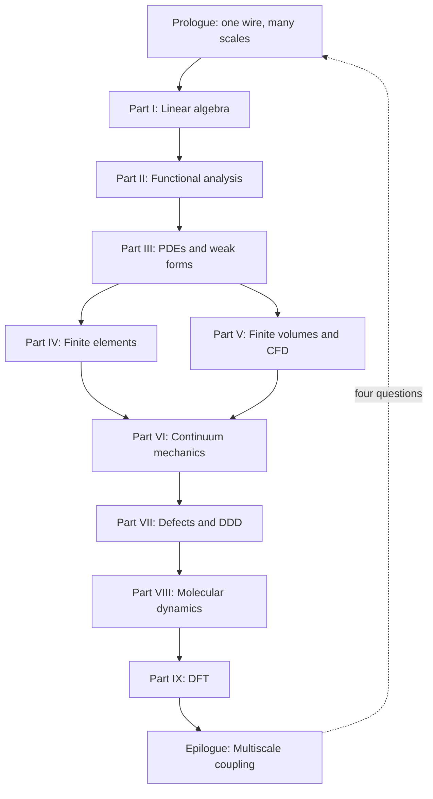

# The Same Material, Many Scales

Imagine a single crystal of copper pulled in uniaxial tension. At the engineering scale — centimeters, Newtons — we describe the specimen with Cauchy stress, Hooke's law, and perhaps a finite element mesh of tetrahedra. The wire carries current, heats slightly, and sags under its own weight. None of that physics lives in the crystal lattice alone; it lives in a **continuum** description that treats the material as a smooth field of stress and displacement.

Zoom in to micrometers and the story changes. Dislocation lines glide, multiply, and tangle; the material work-hardens not because of a phenomenological law we inserted by hand, but because of collective motion we can simulate with **dislocation dynamics**. A drawn copper wire owes much of its strength to the dislocation forest left behind by cold working — a mesoscale history written into line defects, invisible to a coarse stress–strain curve until we ask *why* the curve bends upward.

Zoom further, to nanometers, and individual atoms swap neighbors across a grain boundary; **molecular dynamics** tracks each nucleus and its thermal vibrations. A notch in the wire concentrates stress at the atomic scale; bonds stretch, rearrange, and eventually break in ways no elliptic PDE can resolve without regularization.

Zoom once more, to ångströms, and the very notion of an "atom" as a ball on a spring dissolves into the quantum mechanical electron density; **density functional theory** tells us where the electrons live and how much energy the crystal costs to deform. The cohesive energy that holds copper together — the baseline against which every vacancy, dislocation, and surface is measured — begins here.

None of these descriptions is wrong. Each is appropriate at its scale. Computational mechanics is the art of choosing — and connecting — the right description.

## A ladder, not a menu

It is tempting to treat finite elements, finite volumes, molecular dynamics, and DFT as separate courses with separate software packages. That temptation is practical: one does not run Quantum ESPRESSO inside Abaqus. But conceptually, the methods form a **ladder**:

1. **Linear algebra** gives us the syntax for any discrete model: states are vectors, evolution is matrix multiplication, stability is an eigenvalue sign.
2. **Functional analysis** explains why infinite-dimensional field descriptions make sense, why weak formulations exist, and why Galerkin approximations can converge.
3. **Partial differential equations** encode conservation and constitutive physics on continua.
4. **Finite element and finite volume methods** discretize those PDEs with different philosophies — trial functions versus flux balance — suited to elliptic solids and hyperbolic fluids.
5. **Continuum mechanics** supplies the stress–strain–balance language that FEM implementations ultimately approximate.
6. **Defect and dislocation models** explain why continuum elasticity breaks down where singularities live.
7. **Molecular dynamics** resolves atomic motion when continuum fields are too coarse.
8. **Density functional theory** resolves electronic structure when interatomic potentials must be derived rather than assumed.

Each rung supports the one above it. Each rung limits the one below it. Climbing upward, we **homogenize**: we replace microscopic detail with effective laws. Descending downward, we **derive**: we ask where those laws came from and what they omit.

The copper wire is our thread through every rung. At the macro scale it is a structural member; at the mesoscale a polycrystal with texture; at the atomistic scale a lattice of nuclei vibrating in an effective potential; at the electronic scale a sea of valence electrons binding the crystal together.

## The concept map (whole book)

The [Functional Analysis Notes](https://hanfengzhai.github.io/file/teaching/notes/ME412_CourseSummary.pdf) organize each topic with four questions — object, structure, theorem, failure mode. At the scale of the entire book, the same discipline applies:

| Question | Answer for this book |
|----------|----------------------|
| What **object** spans all parts? | The copper wire as a multiscale state — vectors, fields, defects, atoms, electrons |
| What **structure** connects the parts? | The ladder: homogenize upward, derive downward; weak forms at every rung |
| What **theorem** (or principle) makes the story coherent? | Well-posedness and convergence at each discretization; consistent interface data across scales |
| What **breaks** if we ignore the ladder? | Wrong moduli, missing hardening history, unit mismatches, category errors at notches and cores |

The reading order is one continuous arc — not a catalog of methods:

**Baby picture:** climb the mathematical rungs (I–VI) until the wire is a meshed solid with stress and flux; then descend (VII–IX) to learn where yield stress, potentials, and cohesive energy originate; finish by wiring the rungs together in workflows no single code runs alone.

## The same questions at every scale

At each rung we ask the same four questions — whether we are solving a sparse linear system, a weak form, or a self-consistent Kohn–Sham cycle:

| Question | Linear algebra | Continuum FEM | Dislocation dynamics | MD | DFT |
|----------|----------------|---------------|------------------------|-----|-----|
| What is the **state**? | Vector \(\mathbf{x}\) | Displacement field \(\mathbf{u}\) | Dislocation network | Positions \(\{\mathbf{r}_i\}\) | Density \(\rho(\mathbf{r})\) |
| What **equations** govern it? | \(\mathbf{A}\mathbf{x}=\mathbf{b}\) | Virtual work / balance | Peach–Köhler + mobility | Newton / Hamilton | Kohn–Sham SCF |
| What **discretization**? | Matrix assembly | Elements + quadrature | Line segments | Timestep + cutoff | Plane waves + k-points |
| What passes **upward**? | — | Stress, stiffness | Hardening law | Potential parameters | Cohesive energy, moduli |

Recognizing this table early saves years of confusion. The software changes; the pattern does not.

## Why the ladder has a preferred direction

We read this book **bottom-up** in the mathematical parts (I–VI) because the language of weak forms, assembly, and convergence is easier to learn on elliptic problems with clean energy principles. We then **descend** in Parts VII–IX because continuum parameters — yield stress, hardening modulus, interatomic potential, surface energy — are not free parameters. They are **outputs** of finer models or experiments.

Consider the elastic modulus \(E\) of copper used in a structural wire model. DFT can compute it from the curvature of total energy with respect to strain on a perfect lattice. MD can cross-check it with fluctuation formulas at finite temperature. A tension test on the wire itself measures an **effective** modulus that includes texture, porosity, and processing history. All three numbers are "the modulus of copper," but they answer slightly different questions. Multiscale mechanics is the discipline of making those answers consistent.

## The weak form as recurring character

Along the way, a recurring character appears: the **weak form** of a boundary value problem. Born in Part III as a mathematical convenience — multiply by a test function, integrate by parts, absorb boundary conditions — it becomes in Part IV the foundation of the finite element method. In Part VI it reappears as the **virtual work principle** of elasticity:

\[
\int_\Omega \boldsymbol{\sigma} : \delta\boldsymbol{\varepsilon} \, d\Omega = \int_\Omega \mathbf{f} \cdot \delta\mathbf{u} \, d\Omega + \int_{\Gamma_N} \mathbf{t} \cdot \delta\mathbf{u} \, dS.
\]

By the time we reach molecular dynamics, we will recognize its shadow in the **symplectic structure** of Hamiltonian integrators — different language, same instinct: multiply by a test object, integrate by parts, and let boundary conditions do the heavy lifting. Even DFT has a variational heart: the ground-state density minimizes an energy functional.

The copper wire does not know which chapter we are in. It responds to the same physics whether we write a weak form or a Kohn–Sham equation. Our job is to translate faithfully between languages.

## Processing history matters

Real copper wire is not a perfect single crystal. It is drawn through dies, work-hardened, perhaps annealed partially to recover conductivity. Each process step writes **structure** into the material:

- **Drawing** increases dislocation density and aligns grains — mesoscale and polycrystal effects.
- **Annealing** allows vacancies to diffuse and dislocations to rearrange — atomistic kinetics.
- **Oxidation** at the surface changes local chemistry — electronic structure near interfaces.

A multiscale narrative that jumps straight from DFT bulk modulus to structural FEM without acknowledging processing history predicts the wrong wire. The ladder is not only spatial; it is also **historical**. Internal state variables — dislocation density, back stress, grain size — exist precisely to carry history upward when pure elasticity cannot.

## Scale separation and overlap

Scale separation is both a blessing and a fiction. It is a **blessing** because Born–Oppenheimer, homogenization, and RVE averaging work when a clear gap separates fast and slow degrees of freedom, or fine and coarse spatial structure. It is a **fiction** because real materials exhibit **overlap**: dislocation cores require atoms; crack tips couple quantum chemistry to continuum stress; grain-boundary sliding couples diffusion to polycrystal FEM.

When scales overlap, we do not abandon the ladder — we **refine the handoff**. Concurrent coupling (QM/MM, FE²) and enriched continua (gradient plasticity, nonlocal damage) exist precisely where sequential homogenization with a single constant fails. The copper wire's notch root is a canonical overlap region: continuum stress is well defined a micron away, but bond breaking at the tip is atomistic.

Recognizing overlap early prevents category errors — using bulk DFT modulus to predict notch failure without fracture mechanics or atomistics, for example.

## Software silos vs. intellectual continuity

Practitioners legitimately speak of "the MD person" and "the FEM person" because software ecosystems differ:

- **FEM**: mesh generation, weak form assembly, sparse linear solvers.
- **FVM/CFD**: Riemann solvers, limiters, turbulence closures.
- **MD**: potentials, thermostats, neighbor lists, timestep stability.
- **DFT**: plane waves, SCF mixing, k-meshes, pseudopotential libraries.

No unified executable spans all rungs. **Workflow orchestrators** (Python scripts, workflow engines, Jupyter pipelines) stitch codes together. The intellectual continuity this book emphasizes — state, equations, discretization, upward information — is what makes those scripts more than ad hoc file conversion. When you write `extract_elastic_tensor.py`, you should know whether you are exporting Voigt averages, whether temperature matches, and whether the functional matches the MD potential fit.

## A note on units and conventions

Each community carries its own unit systems: FEM may use SI (Pa, m); MD uses metal units (Å, ps, eV) or real units (kcal/mol); DFT uses Ry or eV with Bohr radii. Multiscale projects fail silently when units convert incorrectly at interfaces. Part VIII's LAMMPS `units metal` and Part IX's Ry cutoff energies do not speak to each other without explicit conversion — a mundane detail that destroys ladders faster than wrong physics.

We will state conventions when they matter and recommend **SI with documented conversion** at workflow boundaries.

## What you should bring

Comfort with multivariable calculus and basic linear algebra is assumed. We will develop functional analysis and Sobolev space ideas as needed, always with an eye toward computation rather than pure generality. Programming experience helps but is not required: the emphasis is on the continuous and discrete mathematics that any implementation must respect.

When you encounter a formula, ask: *What discretization makes this computable? What limit is being taken? What information crosses the scale boundary?* Those three questions will serve you from Part I through the epilogue.

## Reading strategies

This book supports multiple paths:

- **Linear reading** (Parts I → IX → epilogue): best for first exposure; builds language before atomistics.
- **Scale-first reading** (prologue → Part IX → VIII → VII → VI → IV): for readers who already simulate MD or DFT and want the continuum foundation that explains homogenization.
- **Reference reading**: jump to weak forms (Part III), FEM assembly (Part IV), or Kohn–Sham (Part IX) as needed; the prologue and epilogue frame how chapters connect.

Regardless of path, return to the copper wire periodically. If a chapter feels abstract, ask how its equations would appear in a wire tension test, an anneal, or a notch root — grounding prevents methods from floating free of mechanics.

## What lies ahead

Part I refreshes linear algebra and shows how its ideas generalize from vectors to functions. Part II develops the function-space language that makes sense of infinite degrees of freedom. Parts III–V build discretization methods for PDEs — Galerkin FEM for elliptic solids, finite volumes for conservation laws and fluids. Part VI anchors those methods in solid mechanics: kinematics, stress, balance, and variational elasticity.

Parts VII–IX descend. **Part VII** introduces defects and dislocation dynamics — the mesoscale engine of plasticity in our copper wire. **Part VIII** treats molecular dynamics: potentials, ensembles, integrators, and the LAMMPS workflows that connect atomistic simulation to coarser models. **Part IX** covers density functional theory: Born–Oppenheimer separation, Hohenberg–Kohn existence, and the Kohn–Sham equations practitioners solve daily.

The **epilogue** returns to the wire at full scale and asks how modern research couples these rungs — sequentially, concurrently, and through learned surrogates — into workflows that no single code runs unattended, but that disciplined teams use every day.

## Expectations of rigor

We will prove convergence theorems where they illuminate computation (Galerkin best approximation, Lax equivalence for FVM) and state without proof results where full generality would distract (Hohenberg–Kohn existence, spectral theorem in infinite dimensions). The standard is **honest mathematics**: precise hypotheses, explicit discretization parameters, and clear distinction between what is guaranteed and what is validated empirically.

Computational mechanics sits between applied mathematics and engineering. Too much abstraction loses the practitioner; too little loses the analyst. The ladder narrative keeps both readers on the same page — literally.

## Historical perspective (brief)

Multiscale thinking predates modern computing. **Taylor hardening** (1934) connected dislocation density to flow stress before computers tracked individual lines. **Born–Oppenheimer** (1927) separated electronic and nuclear motion before DFT existed. **Finite elements** (Turner, Clough, Argyris; 1950s–60s) discretized the same virtual work principle Cauchy and Lagrange wrote in continuum form.

What changed is **scale of computation**: exascale arithmetic lets DDD, MD, and DFT run at parameters that were pencil-and-paper estimates a generation ago. The ladder's rungs are stable; our ability to climb them is what evolves. Open-source codes democratize that climb — a copper wire study can begin on a laptop (small DFT cell, small MD box) and grow to cluster jobs without changing the underlying equations.

## Notation and conventions used throughout

Vectors are bold (\(\mathbf{u}\), \(\mathbf{F}\)); tensors are bold sans-serif or with double indices (\(\boldsymbol{\sigma}\), \(C_{ijkl}\)). We use Einstein summation where convenient. Partial derivatives appear as \(\partial u/\partial x\) or subscript comma notation \(u_{,x}\) depending on context.

Function spaces (\(H^1\), \(L^2\)) appear from Part II onward; their discrete counterparts are finite element spaces \(V_h\). When we write "convergence," we mean discretization parameters (mesh size \(h\), timestep \(\Delta t\), cutoff energy \(E_{\text{cut}}\)) tending to limits where the discrete model approaches a well-defined continuous or reference problem.

These conventions are standard in computational mechanics literature; deviations are noted locally.

## A promise to the reader

Every part of this book answers, implicitly or explicitly, one question about the copper wire (or any material you substitute): *At this scale, what is the minimal state description that still captures the physics we care about, and what do we export to the scale above?* If a chapter does not change your answer to that question, it has not done its job.

We begin with the grammar of vectors and matrices — not because wires are linear, but because every discretization, at every scale, eventually reduces to finite-dimensional algebra. Part I is where that reduction becomes conscious craft rather than background assumption. The same copper atom that DFT will later describe with electron density first appears here as a node in a graph of coupled degrees of freedom — finite-dimensional long before it is quantum mechanical.

Turn the page when ready. The ladder starts with familiar objects: vectors, matrices, and the linear maps between them.

## Bridge

Turn the page. The copper wire is waiting — first as vectors and matrices, eventually as electrons, dislocations, and degrees of freedom on a finite element mesh. The climb begins with the grammar we already speak: linear algebra.
