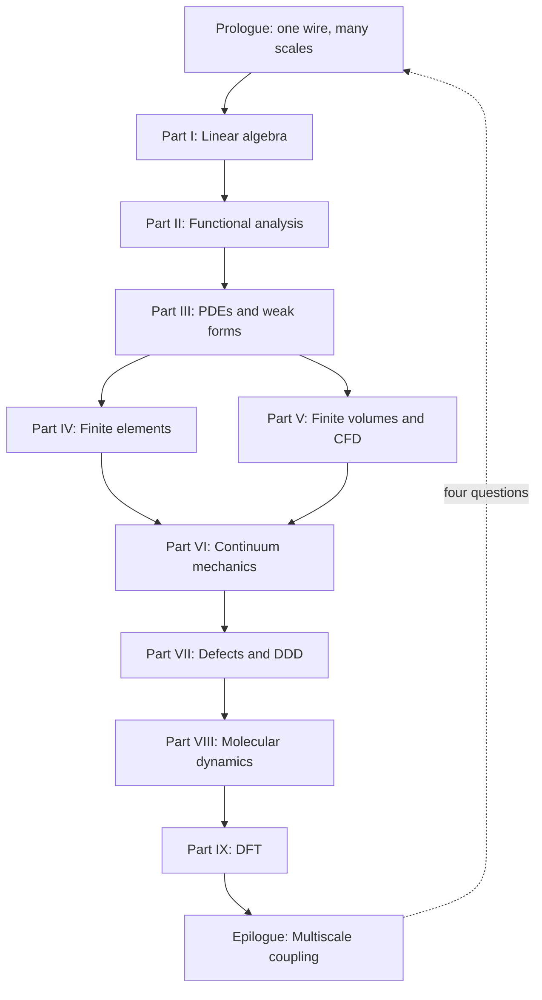

# The Same Material, Many Scales

## Scene

Imagine a single crystal of copper pulled in uniaxial tension. At the engineering scale — centimeters, Newtons — we describe the specimen with Cauchy stress, Hooke's law, and perhaps a finite element mesh of tetrahedra. The wire carries current, heats slightly, and sags under its own weight. None of that physics lives in the crystal lattice alone; it lives in a **continuum** description that treats the material as a smooth field of stress and displacement.

Zoom in to micrometers and the story changes. Dislocation lines glide, multiply, and tangle; the material work-hardens not because of a phenomenological law we inserted by hand, but because of collective motion we can simulate with **dislocation dynamics**. A drawn copper wire owes much of its strength to the dislocation forest left behind by cold working — a mesoscale history written into line defects, invisible to a coarse stress–strain curve until we ask *why* the curve bends upward.

Zoom further, to nanometers, and individual atoms swap neighbors across a grain boundary; **molecular dynamics** tracks each nucleus and its thermal vibrations. A notch in the wire concentrates stress at the atomic scale; bonds stretch, rearrange, and eventually break in ways no elliptic PDE can resolve without regularization.

Zoom once more, to ångströms, and the very notion of an "atom" as a ball on a spring dissolves into the quantum mechanical electron density; **density functional theory** tells us where the electrons live and how much energy the crystal costs to deform. The cohesive energy that holds copper together — the baseline against which every vacancy, dislocation, and surface is measured — begins here.

None of these descriptions is wrong. Each is appropriate at its scale. Computational mechanics is the art of choosing — and connecting — the right description.

## A ladder, not a menu

It is tempting to treat finite elements, finite volumes, molecular dynamics, and DFT as separate courses with separate software packages. That temptation is practical: one does not run Quantum ESPRESSO inside Abaqus. But conceptually, the methods form a **ladder**:

1. **Linear algebra** gives us the syntax for any discrete model: states are vectors, evolution is matrix multiplication, stability is an eigenvalue sign.
2. **Functional analysis** explains why infinite-dimensional field descriptions make sense, why weak formulations exist, and why Galerkin approximations can converge.
3. **Partial differential equations** encode conservation and constitutive physics on continua.
4. **Finite element and finite volume methods** discretize those PDEs with different philosophies — trial functions versus flux balance — suited to elliptic solids and hyperbolic fluids.
5. **Continuum mechanics** supplies the stress–strain–balance language that FEM implementations ultimately approximate.
6. **Defect and dislocation models** explain why continuum elasticity breaks down where singularities live.
7. **Molecular dynamics** resolves atomic motion when continuum fields are too coarse.
8. **Density functional theory** resolves electronic structure when interatomic potentials must be derived rather than assumed.

Each rung supports the one above it. Each rung limits the one below it. Climbing upward, we **homogenize**: we replace microscopic detail with effective laws. Descending downward, we **derive**: we ask where those laws came from and what they omit.

The copper wire is our thread through every rung. At the macro scale it is a structural member; at the mesoscale a polycrystal with texture; at the atomistic scale a lattice of nuclei vibrating in an effective potential; at the electronic scale a sea of valence electrons binding the crystal together.

## The concept map (whole book)

The [Functional Analysis Notes](https://hanfengzhai.github.io/file/teaching/notes/ME412_CourseSummary.pdf) organize each topic with four questions — object, structure, theorem, failure mode. At the scale of the entire book, the same discipline applies:

| Question | Answer for this book |
|----------|----------------------|
| What **object** spans all parts? | The copper wire as a multiscale state — vectors, fields, defects, atoms, electrons |
| What **structure** connects the parts? | The ladder: homogenize upward, derive downward; weak forms at every rung |
| What **theorem** (or principle) makes the story coherent? | Well-posedness and convergence at each discretization; consistent interface data across scales |
| What **breaks** if we ignore the ladder? | Wrong moduli, missing hardening history, unit mismatches, category errors at notches and cores |

The reading order is one continuous arc — not a catalog of methods:

**Baby picture:** climb the mathematical rungs (I–VI) until the wire is a meshed solid with stress and flux; then descend (VII–IX) to learn where yield stress, potentials, and cohesive energy originate; finish by wiring the rungs together in workflows no single code runs alone.

## The same questions at every scale

At each rung we ask the same four questions — whether we are solving a sparse linear system, a weak form, or a self-consistent Kohn–Sham cycle:

| Question | Linear algebra | Continuum FEM | Dislocation dynamics | MD | DFT |
|----------|----------------|---------------|------------------------|-----|-----|
| What is the **state**? | Vector \(\mathbf{x}\) | Displacement field \(\mathbf{u}\) | Dislocation network | Positions \(\{\mathbf{r}_i\}\) | Density \(\rho(\mathbf{r})\) |
| What **equations** govern it? | \(\mathbf{A}\mathbf{x}=\mathbf{b}\) | Virtual work / balance | Peach–Köhler + mobility | Newton / Hamilton | Kohn–Sham SCF |
| What **discretization**? | Matrix assembly | Elements + quadrature | Line segments | Timestep + cutoff | Plane waves + k-points |
| What passes **upward**? | — | Stress, stiffness | Hardening law | Potential parameters | Cohesive energy, moduli |

Recognizing this table early saves years of confusion. The software changes; the pattern does not.

## The experiment as plot

The book reads in **mathematical order** (algebra before atomistics), but the copper wire lives in **laboratory time**. Keeping both orders straight turns a catalog of methods into a story. Picture one afternoon in a mechanics lab — the same specimen, the same afternoon, many models:

| Act | What happens in the lab | What the book computes | Parts (read in order) |
|-----|-------------------------|------------------------|-----------------------|
| **I — Mounting** | A cold-drawn copper cylinder is gripped in wedge jaws; the operator zeros the load cell and thermocouple. | Boundary conditions, a chain of bar elements, the first \(\mathbf{K}\mathbf{u}=\mathbf{f}\). | [Prologue](00-many-scales.md), [Part I](../part01-linear-algebra/00-opening.md) |
| **II — Warming** | Current is switched on. The narrowest cross-section heats; air cools the surface. | Steady heat conduction in the solid (FEM), enthalpy flux in the surrounding air (FVM), Robin coupling at the wall. | [Part III](../part03-pdes/00-opening.md), [Part IV](../part04-fem/00-opening.md), [Part V](../part05-fvm/00-opening.md) |
| **III — Pulling** | Grip displacement ramps. The force–displacement curve climbs almost linearly. | Weak-form elasticity, Galerkin assembly, convergence in \(H^1\); Cauchy stress and virtual work name what the curve measures. | [Part II](../part02-functional-analysis/00-opening.md), [Part III](../part03-pdes/00-opening.md), [Part IV](../part04-fem/00-opening.md), [Part VI](../part06-continuum/00-opening.md) |
| **IV — Hardening** | The curve bends upward: more force for each increment of stretch. | Dislocation forest from cold drawing plus fresh multiplication; DDD and Taylor hardening explain the bend without a magic constant. | [Part VII](../part07-defects/00-opening.md) |
| **V — Notch (optional)** | A scratched wire or a grip corner concentrates stress. | Continuum fields predict *where*; MD at the tip resolves bond breaking and dislocation nucleation. | [Part VI](../part06-continuum/00-opening.md), [Part VIII](../part08-md/00-opening.md) |
| **VI — Foundation (always, in parallel)** | Before any simulation ran, someone chose \(E\), \(\nu\), and a yield stress. | DFT on a small fcc cell supplies cohesive energy and elastic constants; MD fits an EAM potential; those numbers climb the ladder into FEM input decks. | [Part IX](../part09-dft/00-opening.md) → [Part VIII](../part08-md/00-opening.md) → [Part VII](../part07-defects/00-opening.md) → [Part IV](../part04-fem/00-opening.md) |

Acts I–III are what the operator watches on the screen in real time. Act IV is the history written into the material before the test began — cold work — made visible only when load exceeds yield. Act V is the exception that proves the rule: wherever geometry or defects break scale separation, we descend one rung. Act VI is the **prequel** every practitioner runs offline: no wire-scale job starts without parameters whose pedigree traces to finer models or calibration experiments.

Read Parts I–VI as Acts I–III in slow motion — every line of code the operator trusts is justified there. Read Parts VII–IX as Acts IV–VI — where the numbers in the input file came from, and what they omit. The **epilogue** returns to the full afternoon and asks how modern teams wire Acts I–VI into one workflow when no single executable spans the ladder.

When a chapter feels abstract, locate it in this table: *Which act of the experiment am I in, and what question is the model answering right now?* The mathematics changes; the specimen does not.

## Why the ladder has a preferred direction

We read this book **bottom-up** in the mathematical parts (I–VI) because the language of weak forms, assembly, and convergence is easier to learn on elliptic problems with clean energy principles. We then **descend** in Parts VII–IX because continuum parameters — yield stress, hardening modulus, interatomic potential, surface energy — are not free parameters. They are **outputs** of finer models or experiments.

Consider the elastic modulus \(E\) of copper used in a structural wire model. DFT can compute it from the curvature of total energy with respect to strain on a perfect lattice. MD can cross-check it with fluctuation formulas at finite temperature. A tension test on the wire itself measures an **effective** modulus that includes texture, porosity, and processing history. All three numbers are "the modulus of copper," but they answer slightly different questions. Multiscale mechanics is the discipline of making those answers consistent.

## The weak form as recurring character

Along the way, a recurring character appears: the **weak form** of a boundary value problem. Born in Part III as a mathematical convenience — multiply by a test function, integrate by parts, absorb boundary conditions — it becomes in Part IV the foundation of the finite element method. In Part VI it reappears as the **virtual work principle** of elasticity:

\[
\int_\Omega \boldsymbol{\sigma} : \delta\boldsymbol{\varepsilon} \, d\Omega = \int_\Omega \mathbf{f} \cdot \delta\mathbf{u} \, d\Omega + \int_{\Gamma_N} \mathbf{t} \cdot \delta\mathbf{u} \, dS.
\]

By the time we reach molecular dynamics, we will recognize its shadow in the **symplectic structure** of Hamiltonian integrators — different language, same instinct: multiply by a test object, integrate by parts, and let boundary conditions do the heavy lifting. Even DFT has a variational heart: the ground-state density minimizes an energy functional.

The copper wire does not know which chapter we are in. It responds to the same physics whether we write a weak form or a Kohn–Sham equation. Our job is to translate faithfully between languages.

## Processing history matters

Real copper wire is not a perfect single crystal. It is drawn through dies, work-hardened, perhaps annealed partially to recover conductivity. Each process step writes **structure** into the material:

- **Drawing** increases dislocation density and aligns grains — mesoscale and polycrystal effects.
- **Annealing** allows vacancies to diffuse and dislocations to rearrange — atomistic kinetics.
- **Oxidation** at the surface changes local chemistry — electronic structure near interfaces.

A multiscale narrative that jumps straight from DFT bulk modulus to structural FEM without acknowledging processing history predicts the wrong wire. The ladder is not only spatial; it is also **historical**. Internal state variables — dislocation density, back stress, grain size — exist precisely to carry history upward when pure elasticity cannot.

## Scale separation and overlap

Scale separation is both a blessing and a fiction. It is a **blessing** because Born–Oppenheimer, homogenization, and RVE averaging work when a clear gap separates fast and slow degrees of freedom, or fine and coarse spatial structure. It is a **fiction** because real materials exhibit **overlap**: dislocation cores require atoms; crack tips couple quantum chemistry to continuum stress; grain-boundary sliding couples diffusion to polycrystal FEM.

When scales overlap, we do not abandon the ladder — we **refine the handoff**. Concurrent coupling (QM/MM, FE²) and enriched continua (gradient plasticity, nonlocal damage) exist precisely where sequential homogenization with a single constant fails. The copper wire's notch root is a canonical overlap region: continuum stress is well defined a micron away, but bond breaking at the tip is atomistic.

Recognizing overlap early prevents category errors — using bulk DFT modulus to predict notch failure without fracture mechanics or atomistics, for example.

## Software silos vs. intellectual continuity

Practitioners legitimately speak of "the MD person" and "the FEM person" because software ecosystems differ:

- **FEM**: mesh generation, weak form assembly, sparse linear solvers.
- **FVM/CFD**: Riemann solvers, limiters, turbulence closures.
- **MD**: potentials, thermostats, neighbor lists, timestep stability.
- **DFT**: plane waves, SCF mixing, k-meshes, pseudopotential libraries.

No unified executable spans all rungs. **Workflow orchestrators** (Python scripts, workflow engines, Jupyter pipelines) stitch codes together. The intellectual continuity this book emphasizes — state, equations, discretization, upward information — is what makes those scripts more than ad hoc file conversion. When you write `extract_elastic_tensor.py`, you should know whether you are exporting Voigt averages, whether temperature matches, and whether the functional matches the MD potential fit.

## A note on units and conventions

Each community carries its own unit systems: FEM may use SI (Pa, m); MD uses metal units (Å, ps, eV) or real units (kcal/mol); DFT uses Ry or eV with Bohr radii. Multiscale projects fail silently when units convert incorrectly at interfaces. Part VIII's LAMMPS `units metal` and Part IX's Ry cutoff energies do not speak to each other without explicit conversion — a mundane detail that destroys ladders faster than wrong physics.

We will state conventions when they matter and recommend **SI with documented conversion** at workflow boundaries.

## What you should bring

Comfort with multivariable calculus and basic linear algebra is assumed. We will develop functional analysis and Sobolev space ideas as needed, always with an eye toward computation rather than pure generality. Programming experience helps but is not required: the emphasis is on the continuous and discrete mathematics that any implementation must respect.

When you encounter a formula, ask: *What discretization makes this computable? What limit is being taken? What information crosses the scale boundary?* Those three questions will serve you from Part I through the epilogue.

## Reading strategies

This book supports multiple paths:

- **Linear reading** (Parts I → IX → epilogue): best for first exposure; builds language before atomistics.
- **Scale-first reading** (prologue → Part IX → VIII → VII → VI → IV): for readers who already simulate MD or DFT and want the continuum foundation that explains homogenization.
- **Reference reading**: jump to weak forms (Part III), FEM assembly (Part IV), or Kohn–Sham (Part IX) as needed; the prologue and epilogue frame how chapters connect.

Regardless of path, return to the copper wire periodically. If a chapter feels abstract, ask how its equations would appear in a wire tension test, an anneal, or a notch root — grounding prevents methods from floating free of mechanics.

## What lies ahead

Part I refreshes linear algebra and shows how its ideas generalize from vectors to functions. Part II develops the function-space language that makes sense of infinite degrees of freedom. Parts III–V build discretization methods for PDEs — Galerkin FEM for elliptic solids, finite volumes for conservation laws and fluids. Part VI anchors those methods in solid mechanics: kinematics, stress, balance, and variational elasticity.

Parts VII–IX descend. **Part VII** introduces defects and dislocation dynamics — the mesoscale engine of plasticity in our copper wire. **Part VIII** treats molecular dynamics: potentials, ensembles, integrators, and the LAMMPS workflows that connect atomistic simulation to coarser models. **Part IX** covers density functional theory: Born–Oppenheimer separation, Hohenberg–Kohn existence, and the Kohn–Sham equations practitioners solve daily.

The **epilogue** returns to the wire at full scale and asks how modern research couples these rungs — sequentially, concurrently, and through learned surrogates — into workflows that no single code runs unattended, but that disciplined teams use every day.

## Expectations of rigor

We will prove convergence theorems where they illuminate computation (Galerkin best approximation, Lax equivalence for FVM) and state without proof results where full generality would distract (Hohenberg–Kohn existence, spectral theorem in infinite dimensions). The standard is **honest mathematics**: precise hypotheses, explicit discretization parameters, and clear distinction between what is guaranteed and what is validated empirically.

Computational mechanics sits between applied mathematics and engineering. Too much abstraction loses the practitioner; too little loses the analyst. The ladder narrative keeps both readers on the same page — literally.

## Historical perspective (brief)

Multiscale thinking predates modern computing. **Taylor hardening** (1934) connected dislocation density to flow stress before computers tracked individual lines. **Born–Oppenheimer** (1927) separated electronic and nuclear motion before DFT existed. **Finite elements** (Turner, Clough, Argyris; 1950s–60s) discretized the same virtual work principle Cauchy and Lagrange wrote in continuum form.

What changed is **scale of computation**: exascale arithmetic lets DDD, MD, and DFT run at parameters that were pencil-and-paper estimates a generation ago. The ladder's rungs are stable; our ability to climb them is what evolves. Open-source codes democratize that climb — a copper wire study can begin on a laptop (small DFT cell, small MD box) and grow to cluster jobs without changing the underlying equations.

## Notation and conventions used throughout

Vectors are bold (\(\mathbf{u}\), \(\mathbf{F}\)); tensors are bold sans-serif or with double indices (\(\boldsymbol{\sigma}\), \(C_{ijkl}\)). We use Einstein summation where convenient. Partial derivatives appear as \(\partial u/\partial x\) or subscript comma notation \(u_{,x}\) depending on context.

Function spaces (\(H^1\), \(L^2\)) appear from Part II onward; their discrete counterparts are finite element spaces \(V_h\). When we write "convergence," we mean discretization parameters (mesh size \(h\), timestep \(\Delta t\), cutoff energy \(E_{\text{cut}}\)) tending to limits where the discrete model approaches a well-defined continuous or reference problem.

These conventions are standard in computational mechanics literature; deviations are noted locally.

## A promise to the reader

Every part of this book answers, implicitly or explicitly, one question about the copper wire (or any material you substitute): *At this scale, what is the minimal state description that still captures the physics we care about, and what do we export to the scale above?* If a chapter does not change your answer to that question, it has not done its job.

We begin with the grammar of vectors and matrices — not because wires are linear, but because every discretization, at every scale, eventually reduces to finite-dimensional algebra. Part I is where that reduction becomes conscious craft rather than background assumption. The same copper atom that DFT will later describe with electron density first appears here as a node in a graph of coupled degrees of freedom — finite-dimensional long before it is quantum mechanical.

Turn the page when ready. The ladder starts with familiar objects: vectors, matrices, and the linear maps between them.

## Reading compass: two clocks on one wire

The book reads in **mathematical order** (Part I before Part IX). The copper wire lives in **laboratory time** (mounting before hardening). Both clocks describe the same afternoon — the continuity comes from returning to the specimen whenever the symbols change.

| If you need… | Start here |
|--------------|------------|
| Skill checkpoints (competence time) | [Preface: skill navigation](../preface.md#skill-navigation) |
| Opening hinge (prologue → Part I) | [Preface: opening hinge](../preface.md#opening-continuity-hinge) |
| Act I — mounting stitch | [Preface: opening continuity hinge](../preface.md#opening-continuity-hinge) · [Part I mounting Lab act](../part01-linear-algebra/00-opening.md#lab-act-i--mounting) → [I.1 three-node assembly](../part01-linear-algebra/01-vectors-matrices.md#lab-act-three-nodes-one-load-cell-reading-act-i--mounting); epilogue [Act I reunion paragraph](../epilogue/multiscale.md#lab-act-reunion-six-acts-one-afternoon) and [preview Act I row](../epilogue/multiscale.md#reunion-preview-act-i); [prologue Act I preview row](#prologue-preview-act-i); [prologue row 0 closing stitch](#row-0-closing-stitch); [epilogue row 0 closing loop](../epilogue/multiscale.md#row-0-closing-loop) |
| Act II — warming stitch | [Preface: row 8 skill checkpoint](../preface.md#skill-navigation-row-8) · [V.4 Picard loop](../part05-fvm/04-navier-stokes-cfd.md#lab-act-extension-two-domain-picard-loop-with-a-1d-fem-solid) → [Handshake 2](../epilogue/multiscale.md#handshake-2--joule-heating--conjugate-heat-transfer-part-iv--v); epilogue [Act II reunion paragraph](../epilogue/multiscale.md#lab-act-reunion-six-acts-one-afternoon) and [preview Act II row](../epilogue/multiscale.md#reunion-preview-act-ii); [prologue row 8 preview row](#prologue-preview-row-8); [prologue row 8 closing stitch](#row-8-closing-stitch); [epilogue row 8 closing loop](../epilogue/multiscale.md#row-8-closing-loop) |
| Act III — pulling stitch | [Preface: row 13 skill checkpoint](../preface.md#skill-navigation-row-13) · [Handshake 2](../epilogue/multiscale.md#handshake-2--joule-heating--conjugate-heat-transfer-part-iv--v) → [IX.3 \(\alpha\) Lab act](../part09-dft/03-dft-workflows.md#lab-act-quasiharmonic-alpha-handshake-3-pedigree) → [Handshake 3](../epilogue/multiscale.md#handshake-3--thermal-strain--mechanical-stiffness-part-vi--iv); epilogue [Act III reunion paragraph](../epilogue/multiscale.md#lab-act-reunion-six-acts-one-afternoon) and [preview Act III row](../epilogue/multiscale.md#reunion-preview-act-iii); [prologue row 13 preview row](#prologue-preview-row-13) |
| Act IV — hardening stitch | [Preface: row 14 skill checkpoint](../preface.md#skill-navigation-row-14) · [VII.3 rate handshake](../part07-defects/03-polycrystal-and-fem-handoff.md#scale-boundary-handshake-ddd-strain-rate-to-quasi-static-fem) → [Handshake 4a](../epilogue/multiscale.md#handshake-4--rate-dependent-hardening-and-notch-localization-part-vii--vi--viii); epilogue [Act IV reunion paragraph](../epilogue/multiscale.md#lab-act-reunion-six-acts-one-afternoon) and [preview Act IV row](../epilogue/multiscale.md#reunion-preview-act-iv); [prologue row 14 preview row](#prologue-preview-row-14); [prologue Handshake 4a preview row](#prologue-preview-act-iv) |
| Act V — notch stitch | [Preface: row 15 skill checkpoint](../preface.md#skill-navigation-row-15) · [VII.3 Step 4 FE²](../part07-defects/03-polycrystal-and-fem-handoff.md#step-4--when-offline-calibration-fails-fe-at-the-notch) → [Handshake 4b](../epilogue/multiscale.md#4b--when-continuum-fails-at-the-notch-md-subdomain-act-v--notch); epilogue [Act V reunion paragraph](../epilogue/multiscale.md#lab-act-reunion-six-acts-one-afternoon) and [preview Act V row](../epilogue/multiscale.md#reunion-preview-act-v); [prologue Handshake 4b preview row](#prologue-preview-act-v); [epilogue row 15 closing loop](../epilogue/multiscale.md#row-15-closing-loop) |
| Act VI — foundation stitch | [Preface: row 16 skill checkpoint](../preface.md#skill-navigation-row-16) · [IX.3 Bridge to epilogue](../part09-dft/03-dft-workflows.md#bridge-to-the-epilogue) → [`parse_multiscale_workflow.sh`](../../scripts/parse_multiscale_workflow.sh); epilogue [Act VI reunion paragraph](../epilogue/multiscale.md#lab-act-reunion-six-acts-one-afternoon) and [preview Act VI row](../epilogue/multiscale.md#reunion-preview-act-vi); [prologue row 16 preview row](#prologue-preview-row-16); [epilogue row 16 closing loop](../epilogue/multiscale.md#row-16-closing-loop) |
| The plot in one page | [Preface: story in one page](../preface.md#the-story-in-one-page) |
| Ascent preview (Parts I–VI) | [Preface: ascent preview chain](../preface.md#ascent-preview-chain) |
| Ascent continuity hinges (I.4 → V.4) | [Preface: ascent hinges](../preface.md#ascent-continuity-hinges) |
| Descent preview (Parts VII–IX) | [Preface: descent preview chain](../preface.md#descent-preview-chain) |
| Continuity hinges (midpoint + VI.4) | [Preface: continuity hinges](../preface.md#continuity-hinges-ascent-descent) |
| Descent continuity hinges (VII.3 → IX.3) | [Preface: descent hinges](../preface.md#descent-continuity-hinges) |
| Epilogue continuity hinges (IX → prologue) | [Preface: epilogue hinges](../preface.md#epilogue-continuity-hinges) |
| All hinges in one table | [Memory sheet: master map](../appendix/memory-sheet.md#continuity-hinges-master-map) |
| Row 8 — \(T_w\) pedigree (Act II → MD/DDD) | [Preface: row 8 skill checkpoint](../preface.md#skill-navigation-row-8) · [V.4 CHT](../part05-fvm/04-navier-stokes-cfd.md#lab-act-extension-two-domain-picard-loop-with-a-1d-fem-solid) → [`cht_export.yaml`](../../scripts/parse_cht.sh) → [VIII.0 descent hinge](../part08-md/00-opening.md#descent-hinge-cores-mobility-and-tw-pedigree) → [VIII.3 WHAM at \(T_w\)](../part08-md/03-ab-initio-and-coarse-graining.md#wham-part-vii-mobility-hinge-act-ii-temperature-pedigree); [memory sheet rows 8–9 baby picture](../appendix/memory-sheet.md#rows-8-9-baby-picture-tw-temperature-pedigree); [prologue row 8 closing stitch](#row-8-closing-stitch); [epilogue row 8 closing loop](../epilogue/multiscale.md#row-8-closing-loop) |
| Row 9 — phonon audit at \(T_w\) (MD → DFT) | [Preface: row 9 skill checkpoint](../preface.md#skill-navigation-row-9) — [IX.0 electronic audit hinge](../part09-dft/00-opening.md#electronic-audit-hinge-descent-pedigree-and-tw-phonon) · [thermal phonon audit at \(T_w\)](../part09-dft/00-opening.md#thermal-phonon-audit-at-tw); [`parse_alpha.sh`](../../scripts/parse_alpha.sh) with `--target-t` from `cht_export.yaml`; [memory sheet rows 8–9 baby picture](../appendix/memory-sheet.md#rows-8-9-baby-picture-tw-temperature-pedigree); epilogue [opening hinge from Part IX](../epilogue/multiscale.md#opening-hinge-ix3-to-epilogue), [preview Act III row](../epilogue/multiscale.md#reunion-preview-act-iii), and [preview Act IV row](../epilogue/multiscale.md#reunion-preview-act-iv); [prologue row 9 preview row](#prologue-preview-row-9); [prologue row 9 closing stitch](#row-9-closing-stitch); [epilogue row 9 closing loop](../epilogue/multiscale.md#row-9-closing-loop) |
| Row 10 — coupling hinge (IX.3 → epilogue) | [Preface: row 10 skill checkpoint](../preface.md#skill-navigation-row-10) — [IX.3 Bridge to epilogue](../part09-dft/03-dft-workflows.md#bridge-to-the-epilogue) · [epilogue opening hinge from Part IX](../epilogue/multiscale.md#opening-hinge-ix3-to-epilogue); [IX.3 epilogue pedigree table](../part09-dft/03-dft-workflows.md#ix3-epilogue-pedigree-table); Handshakes **4a** (Act IV bulk hardening) vs **4b** (Act V notch) on the same `hardening.yaml`; [memory sheet row 10](../appendix/memory-sheet.md#continuity-hinges-master-map); [prologue row 10 preview row](#prologue-preview-row-10); [prologue row 10 closing stitch](#row-10-closing-stitch); [epilogue row 10 closing loop](../epilogue/multiscale.md#row-10-closing-loop) |
| Row 11 — six-act reunion (I→IX vs Acts I–VI) | [Preface: row 11 skill checkpoint](../preface.md#skill-navigation-row-11) — [prologue experiment-as-plot](#the-experiment-as-plot) · [epilogue six-act reunion](../epilogue/multiscale.md#lab-act-reunion-six-acts-one-afternoon); [memory sheet one-page recap](../appendix/memory-sheet.md#one-page-copper-wire-recap); Act VI runs **in parallel** with Acts I–V; [memory sheet row 11](../appendix/memory-sheet.md#continuity-hinges-master-map); [prologue row 11 preview row](#prologue-preview-row-11); [prologue row 11 closing stitch](#row-11-closing-stitch); [epilogue row 11 closing loop](../epilogue/multiscale.md#row-11-closing-loop) |
| Row 12 — next project restart (epilogue → prologue) | [Preface: row 12 skill checkpoint](../preface.md#skill-navigation-row-12) — [epilogue Bridge row 12 closing loop](../epilogue/multiscale.md#row-12-closing-loop) · [prologue reopening anchor](#prologue-reopening-anchor); [memory sheet row 12 baby picture](../appendix/memory-sheet.md#row-12-baby-picture-next-project); [prologue row 12 preview row](#prologue-preview-row-12); [prologue row 12 closing stitch](#row-12-closing-stitch); [sources continuity hinges row 12](../appendix/sources.md#continuity-hinges-index-when-the-plot-stutters) |
| Joule heat → fixed-grip stress (row 13) | [Preface: row 13 skill checkpoint](../preface.md#skill-navigation-row-13) — [Handshake 2](../epilogue/multiscale.md#handshake-2--joule-heating--conjugate-heat-transfer-part-iv--v) → [IX.3 \(\alpha\) Lab act](../part09-dft/03-dft-workflows.md#lab-act-quasiharmonic-alpha-handshake-3-pedigree) → [Handshake 3](../epilogue/multiscale.md#handshake-3--thermal-strain--mechanical-stiffness-part-vi--iv); epilogue [Act II reunion paragraph](../epilogue/multiscale.md#lab-act-reunion-six-acts-one-afternoon) (Handshake 2) and [Act III reunion paragraph](../epilogue/multiscale.md#lab-act-reunion-six-acts-one-afternoon) (Handshake 3); [sensitivity derivation opening](../epilogue/multiscale.md#worked-example-sensitivity-ranks) (Handshake 2–3 chain); [prologue row 13 preview row](#prologue-preview-row-13); [prologue row 13 closing stitch](#row-13-closing-stitch); [epilogue row 13 closing loop](../epilogue/multiscale.md#row-13-closing-loop) |
| DDD rate → lab load cell (Handshake 4a) | [Preface: row 14 skill checkpoint](../preface.md#skill-navigation-row-14) — [VII.3 rate handshake](../part07-defects/03-polycrystal-and-fem-handoff.md#scale-boundary-handshake-ddd-strain-rate-to-quasi-static-fem) → [epilogue Handshake 4a](../epilogue/multiscale.md#handshake-4--rate-dependent-hardening-and-notch-localization-part-vii--vi--viii); [`parse_rate.sh`](../../scripts/parse_rate.sh); [sensitivity derivation](../epilogue/multiscale.md#worked-example-sensitivity-ranks) (Handshake 4a column); [memory sheet row 14](../appendix/memory-sheet.md#continuity-hinges-master-map); [prologue row 14 preview row](#prologue-preview-row-14); [prologue row 14 closing stitch](#row-14-closing-stitch); [epilogue row 14 closing loop](../epilogue/multiscale.md#row-14-closing-loop) |
| FE² notch → Act V localization (Handshake 4b) | [Preface: row 15 skill checkpoint](../preface.md#skill-navigation-row-15) — [VII.3 Step 4 FE²](../part07-defects/03-polycrystal-and-fem-handoff.md#step-4--when-offline-calibration-fails-fe-at-the-notch) → [epilogue Handshake 4b](../epilogue/multiscale.md#4b--when-continuum-fails-at-the-notch-md-subdomain-act-v--notch); [`parse_fe2.sh`](../../scripts/parse_fe2.sh); [sensitivity derivation](../epilogue/multiscale.md#worked-example-sensitivity-ranks) (Handshake 4b column); [memory sheet row 15](../appendix/memory-sheet.md#continuity-hinges-master-map); [memory sheet row 15 baby picture](../appendix/memory-sheet.md#row-15-baby-picture-handshake-4b); [prologue Handshake 4b preview row](#prologue-preview-act-v); [prologue row 15 closing stitch](#row-15-closing-stitch); [epilogue row 15 closing loop](../epilogue/multiscale.md#row-15-closing-loop); upstream rate from [row 14](../preface.md#skill-navigation-row-14) |
| Act VI orchestration → multiscale export (row 16) | [Preface: row 16 skill checkpoint](../preface.md#skill-navigation-row-16) · [Preface: epilogue hinges Act VI row](../preface.md#epilogue-continuity-hinges) — [IX.3 Bridge to epilogue](../part09-dft/03-dft-workflows.md#bridge-to-the-epilogue) → [`parse_multiscale_workflow.sh`](../../scripts/parse_multiscale_workflow.sh) → `multiscale_export.yaml`; per-handshake parsers in [epilogue script audit trail](../epilogue/multiscale.md#script-audit-trail-parse-scripts-handshakes); [Part IX coupling ladder](../part09-dft/00-opening.md#the-coupling-ladder-me-412-reunion); epilogue [Act VI reunion paragraph](../epilogue/multiscale.md#lab-act-reunion-six-acts-one-afternoon) and [sensitivity worksheet closing](../epilogue/multiscale.md#worked-example-sensitivity-ranks) (row 16 orchestration stitch); [memory sheet Act VI baby picture](../appendix/memory-sheet.md#act-vi-baby-picture-me-412-coupling-ladder); [prologue row 16 closing stitch](#row-16-closing-stitch); [epilogue row 16 closing loop](../epilogue/multiscale.md#row-16-closing-loop); upstream \(T_w\) pedigree from [rows 8–9](../preface.md#skill-navigation-row-8) and handshakes from [rows 13–15](../preface.md#skill-navigation-row-13) |
| Continuous read-through (row 17) | [Preface: row 17 skill checkpoint](../preface.md#skill-navigation-row-17) · [Continuous read-through guide](../appendix/sources.md#continuous-read-through-guide) · [memory sheet row 17 baby picture](../appendix/memory-sheet.md#row-17-baby-picture-continuous-read-through) · [prologue row 17 closing stitch](#row-17-closing-stitch) — read Scene → Bridge straight through; pause only at I.4, VI.4, IX.3; open rows 0–16 only when a gate stalls |
| Part-opening plot spine (row 18) | [Preface: row 18 skill checkpoint](../preface.md#skill-navigation-row-18) · [Part-opening plot spine index](../appendix/sources.md#part-opening-plot-spine-index-row-18) · [memory sheet row 18 baby picture](../appendix/memory-sheet.md#row-18-baby-picture-part-opening-plot-spine) · [prologue row 18 preview row](#prologue-preview-row-18) — read one sentence aloud at every part opening when row 17 stalls at a part boundary (III→IV, VI→VII) |
| Numbered-chapter plot spine (row 19) | [Preface: row 19 skill checkpoint](../preface.md#skill-navigation-row-19) · [Numbered-chapter plot spine index](../appendix/sources.md#numbered-chapter-plot-spine-index-row-19) · [memory sheet row 19 baby picture](../appendix/memory-sheet.md#row-19-baby-picture-numbered-chapter-plot-spine) · [prologue row 19 preview row](#prologue-preview-row-19) — read one sentence aloud mid-chapter when row 18's part one-liners did not restore continuity |
| Gate-chapter plot spine (row 20) | [Preface: row 20 skill checkpoint](../preface.md#skill-navigation-row-20) · [Gate-chapter plot spine index](../appendix/sources.md#gate-chapter-plot-spine-index-row-20) · [memory sheet row 20 baby picture](../appendix/memory-sheet.md#row-20-baby-picture-gate-chapter-plot-spine) · [prologue row 20 preview row](#prologue-preview-row-20) · [I.4 plot spine](../part01-linear-algebra/04-toward-infinity.md#plot-spine-one-line) · [VI.4 plot spine](../part06-continuum/04-nonlinear-plasticity-preview.md#plot-spine-one-line) · [IX.3 plot spine](../part09-dft/03-dft-workflows.md#plot-spine-one-line) — recite plot spine one line at I.4, VI.4, IX.3 before Bridge when row 19's chapter one-liners fail at a plot turn |
| Ascent/descent hinge (VI.4) | [Part VI.4 intermission](../part06-continuum/04-nonlinear-plasticity-preview.md#intermission-ascent-ends-descent-begins) |
| Chapter × lab-act map | [Appendix: narrative beat map](../appendix/sources.md#narrative-beat-map-mathematical-order--lab-act) |
| Parameter pedigree (Act VI) | [Appendix: pedigree path](../appendix/sources.md#parameter-pedigree-path-act-vi-reading-order) |

**Mathematical order** builds language before atomistics — the path the Functional Analysis Notes layout assumes. **Laboratory time** follows what the operator watches: grips close (Act I), current warms the wire (Act II), load ramps (Act III), the curve hardens (Act IV). Act VI — foundation — runs **in parallel** with Acts I–V in real projects: no FEM deck starts without moduli whose pedigree traces to DFT or calibration.

The [preface ascent continuity hinges](../preface.md#ascent-continuity-hinges) name four turns within Parts I–V — [I.4 → II](../part01-linear-algebra/04-toward-infinity.md#bridge-to-part-ii), [II.5 → III](../part02-functional-analysis/05-spectral-theorem.md#bridge-to-part-iii), [III.4 → IV](../part03-pdes/04-energy-methods.md#bridge-to-part-iv), [IV.5 / V.4 → VI](../part04-fem/05-convergence.md#bridge-two-doors-from-here) — when linear algebra, analysis, and discretization feel like separate subjects. The [midpoint anchor](../part06-continuum/00-opening.md#midpoint-ascent-complete-descent-ahead) in Part VI is where the two journeys meet in reading order: ascent complete, descent ahead. [VI.4's intermission](../part06-continuum/04-nonlinear-plasticity-preview.md#intermission-ascent-ends-descent-begins) is the last continuum page before Part VII — read it when the return-mapping loop fits the load cell but cannot explain **why** the curve bent. Within the descent, the [preface descent continuity hinges](../preface.md#descent-continuity-hinges) name three further turns — [VII.3 → VIII](../part07-defects/03-polycrystal-and-fem-handoff.md#bridge-to-part-viii), [VIII.3 → IX](../part08-md/03-ab-initio-and-coarse-graining.md#bridge-to-part-ix), [IX.3 → epilogue](../part09-dft/03-dft-workflows.md#bridge-to-the-epilogue) — before upward coupling reunites every export. The [epilogue continuity hinges](../preface.md#epilogue-continuity-hinges) name the closing loop from archived SCF exports to six-act workflow time and back to this prologue on the next project. The [memory sheet master map](../appendix/memory-sheet.md#continuity-hinges-master-map) collects all seventeen narrative hinges (rows 0–16) plus **rows 17–20** (continuous read-through and plot-spine audits) in one table — row 13 is the **Joule heat → fixed-grip stress** stitch when CHT converges but handbook \(\alpha\) still sits in the FEM deck; row 14 is the **DDD rate → lab load cell** stitch when OpenDiS exports feed the plasticity deck without extrapolation; row 15 is the **FE² notch → Act V localization** stitch when bulk hardening from 4a looks right but the notch root under-predicts peak stress; row 16 is the **ME 412 coupling ladder** stitch when individual handshake exports exist but no orchestrated `multiscale_export.yaml` links Handshakes 1–4b; row 17 is the **continuous read-through** stitch when the hinge index feels overwhelming mid-read — trust Scene/Bridge rhythm and pause only at I.4, VI.4, and IX.3; row 18 is the **part-opening plot spine** stitch when a part boundary feels like a new syllabus; row 19 is the **numbered-chapter plot spine** stitch when mid-chapter abstraction rises faster than the specimen; row 20 is the **gate-chapter plot spine** stitch when a mandatory gate (I.4, VI.4, IX.3) stalls the straight read and neither row 18 nor row 19 alone restores continuity. The [epilogue](../epilogue/multiscale.md) reunites all six acts in workflow time.

**Row 0 closing stitch (opening hinge / Act I mounting).** {#row-0-closing-stitch} When the nine-scale ladder feels like a menu before a single matrix is assembled — or when panoramic scale change is conflated with the first numeric model — the [preface row 0 When-to-pause opening sentence](../preface.md#skill-navigation-row-0) is the competence-time mirror of reading compass Act I above — return there before Act II warming or Handshake 1 moduli enter the story; the [preface opening continuity hinge](../preface.md#opening-continuity-hinge) and [Part I opening hinge](../part01-linear-algebra/00-opening.md#opening-hinge-prologue-to-part-i) draw the prologue → Part I map when the [epilogue Act I reunion paragraph](../epilogue/multiscale.md#lab-act-reunion-six-acts-one-afternoon) and [preview Act I row](../epilogue/multiscale.md#reunion-preview-act-i) feel abstract; return to this closing stitch when the [Act I preview](#prologue-preview-act-i) opened mounting discipline but zero-load assembly is still conflated with Act III's ramp or Handshake 1's DFT moduli; the [epilogue row 0 closing loop](../epilogue/multiscale.md#row-0-closing-loop) reunites prologue preview, skill checkpoint, and workflow exam when \(\mathbf{K}\mathbf{u}=\mathbf{f}\) with fixed DOFs and zero load is verified — row 0 is the **grammar restart** when the ladder feels overwhelming mid-read; [row 12](../preface.md#skill-navigation-row-12) is the **project restart** after the full arc.

**Row 8 closing stitch (\(T_w\) pedigree).** {#row-8-closing-stitch} When Act II warmed the wire but MD mobility folders, WHAM replica ladders, or OpenDiS drag tables still cite 300 K by default — or when narrative time (Act II warming) and mathematical order (Part V → Part VIII) diverge on the same afternoon — the [preface row 8 When-to-pause opening sentence](../preface.md#skill-navigation-row-8) is the competence-time mirror of reading compass row 8 above — return there before opening any NVT shear folder; the [memory sheet rows 8–9 baby picture](../appendix/memory-sheet.md#rows-8-9-baby-picture-tw-temperature-pedigree) and [V.4 Picard loop](../part05-fvm/04-navier-stokes-cfd.md#lab-act-extension-two-domain-picard-loop-with-a-1d-fem-solid) draw the CHT → descent chain when the [epilogue Act II reunion paragraph](../epilogue/multiscale.md#lab-act-reunion-six-acts-one-afternoon) and [preview Act II row](../epilogue/multiscale.md#reunion-preview-act-ii) feel abstract; return to this closing stitch when the [row 8 preview](#prologue-preview-row-8) opened the \(T_w\) contract but handbook 300 K drag persists beside a converged CHT loop; the [epilogue row 8 closing loop](../epilogue/multiscale.md#row-8-closing-loop) reunites prologue preview, skill checkpoint, and workflow exam when `cht_export.yaml` archives converged \(T_w\) before NVT shear, WHAM, or OpenDiS mobility — row 8 sets \(T_w\); [row 9](#row-9-closing-stitch) audits \(\alpha(T_w)\) and \(\tau_{\text{ph}}(T_w)\) at the electronic layer beneath.

**Row 9 closing stitch (phonon audit at \(T_w\)).** {#row-9-closing-stitch} When EAM potentials match bulk moduli on trust but the foundation folder lacks an explicit **`T_w` column** beside SCF logs — or when \(\alpha\) and \(\tau_{\text{ph}}\) still default to 300 K folklore — the [preface row 9 When-to-pause opening sentence](../preface.md#skill-navigation-row-9) is the competence-time mirror of reading compass row 9 above — return there before Handshakes 3 and 4a inherit thermal exports; the [IX.0 thermal phonon audit table](../part09-dft/00-opening.md#thermal-phonon-audit-at-tw) and [memory sheet rows 8–9 baby picture](../appendix/memory-sheet.md#rows-8-9-baby-picture-tw-temperature-pedigree) draw the MD → DFT audit chain when the epilogue [Act III reunion paragraph](../epilogue/multiscale.md#lab-act-reunion-six-acts-one-afternoon) (Handshake 3 \(\alpha\)) and [Act IV reunion paragraph](../epilogue/multiscale.md#lab-act-reunion-six-acts-one-afternoon) (Handshake 4a \(\tau_{\text{ph}}\) drag) feel abstract; return to this closing stitch when the [row 9 preview](#prologue-preview-row-9) opened the phonon audit habit but handbook \(\alpha(300\,\text{K})\) persists beside converged CHT; the [epilogue row 9 closing loop](../epilogue/multiscale.md#row-9-closing-loop) reunites prologue preview, skill checkpoint, and workflow exam when `alpha_export.yaml` and phonon lifetime rows cite converged \(T_w\) — upstream [row 8](#row-8-closing-stitch) must close first because phonon audits inherit the same `cht_export.yaml` column that MD mobility used.

**Row 10 closing stitch (coupling hinge).** {#row-10-closing-stitch} When Part IX feels complete but DFT, MD, and FEM outputs live in separate directories with no README at the arrows — or when Handshakes 4a and 4b feel undifferentiated on the same `hardening.yaml` — the [preface row 10 When-to-pause opening sentence](../preface.md#skill-navigation-row-10) is the competence-time mirror of reading compass row 10 above — return there before opening individual handshake sections (rows 13–16); the [IX.3 epilogue pedigree table](../part09-dft/03-dft-workflows.md#ix3-epilogue-pedigree-table) and [epilogue opening hinge from Part IX](../epilogue/multiscale.md#opening-hinge-ix3-to-epilogue) draw the foundation → Handshakes 1–4b map when the [epilogue preview Act IV row](../epilogue/multiscale.md#reunion-preview-act-iv) and [preview Act V row](../epilogue/multiscale.md#reunion-preview-act-v) feel abstract; return to this closing stitch when the [row 10 preview](#prologue-preview-row-10) opened the 4a/4b split but separate export folders still lack a workflow README; the [epilogue row 10 closing loop](../epilogue/multiscale.md#row-10-closing-loop) reunites prologue preview, skill checkpoint, and workflow exam when foundation exports compose into Handshakes 1–4b — row 10 names **what composes**; [row 16](../preface.md#skill-navigation-row-16) runs **dependency order** in `multiscale_export.yaml`; upstream [rows 8–9](../preface.md#skill-navigation-row-8) must close first because Handshakes 3 and 4a inherit \(T_w\) pedigree.

**Row 11 closing stitch (six-act reunion).** {#row-11-closing-stitch} When each Part (I–IX) makes sense alone but laboratory workflow order stays unclear — mathematical order builds grammar while Acts I–V run on the bench and Act VI foundation runs offline in parallel — the [preface row 11 When-to-pause opening sentence](../preface.md#skill-navigation-row-11) is the competence-time mirror of reading compass row 11 above — return there before opening individual handshake sections (rows 13–16); the [memory sheet one-page recap](../appendix/memory-sheet.md#one-page-copper-wire-recap) and [experiment-as-plot table](#the-experiment-as-plot) draw the two-clock discipline when the [epilogue expanded reunion](../epilogue/multiscale.md#lab-act-reunion-six-acts-one-afternoon) feels abstract; return to this closing stitch when the [row 11 preview](#prologue-preview-row-11) opened the two-clock habit but reading order and lab time still diverge on the same afternoon; the [epilogue row 11 closing loop](../epilogue/multiscale.md#row-11-closing-loop) reunites prologue preview, skill checkpoint, and workflow exam when Acts I–VI map onto Parts I–IX — row 11 is the **six-act reunion** before individual handshake chains (rows 13–16); do not conflate Part IX's reading position with Act VI's laboratory timing — foundation supplies parameters **before** Acts I–V consume them in real projects.

**Row 12 closing stitch (next project restart).** {#row-12-closing-stitch} When the copper arc is complete but the next specimen (silicon, steel, polymer composite) feels like a scale menu before a single matrix is assembled, the [preface row 12 When-to-pause opening sentence](../preface.md#skill-navigation-row-12) is the competence-time mirror of reading compass row 12 above — return there before copying copper-wire input decks; the [memory sheet row 12 baby picture](../appendix/memory-sheet.md#row-12-baby-picture-next-project) and [prologue reopening anchor](#prologue-reopening-anchor) draw the epilogue → prologue loop when the [epilogue workflow exam row 12](../epilogue/multiscale.md#what-you-should-be-able-to-do-after-the-book) closes but the next terminal opens without a scale plan; return to this closing stitch when the [row 12 preview](#prologue-preview-row-12) opened the project-restart habit but material change still feels like method change; the [epilogue row 12 closing loop](../epilogue/multiscale.md#row-12-closing-loop) reunites prologue preview, skill checkpoint, and workflow exam when the four questions restart on a new wire — row 12 is the **project restart** after the full arc; [row 0](../preface.md#skill-navigation-row-0) is the **grammar restart** when the ladder feels overwhelming mid-read.

**Row 13 closing stitch (Handshake 2 → 3).** {#row-13-closing-stitch} When conjugate heat transfer has converged but fixed-grip stress still cites handbook thermal expansion beside an orphan `pw.x` log, the [preface row 13 When-to-pause opening sentence](../preface.md#skill-navigation-row-13) is the competence-time mirror of reading compass row 13 above — return there before opening the epilogue [Handshake 3 worked load-cell example](../epilogue/multiscale.md#handshake-3--thermal-strain--mechanical-stiffness-part-vi--iv); the [memory sheet row 13 baby picture](../appendix/memory-sheet.md#row-13-baby-picture-handshake-2-3) and [V.4 Picard loop](../part05-fvm/04-navier-stokes-cfd.md#lab-act-extension-two-domain-picard-loop-with-a-1d-fem-solid) draw the CHT → \(\alpha\) → load-cell chain when the epilogue [Act III reunion paragraph](../epilogue/multiscale.md#lab-act-reunion-six-acts-one-afternoon) and [preview Act III row](../epilogue/multiscale.md#reunion-preview-act-iii) feel abstract; return to this closing stitch when the [row 13 preview](#prologue-preview-row-13) opened the Handshake 2 vs 3 distinction but handbook \(\alpha\) persists after CHT converges; the [epilogue row 13 closing loop](../epilogue/multiscale.md#row-13-closing-loop) reunites prologue preview, skill checkpoint, and workflow exam when \(\sigma_{\text{th}} = E\alpha\Delta T\) is verified — row 13 closes the thermal pre-stress loop that rows 8–9 opened at \(T_w\).

**Row 14 closing stitch (Handshake 4a).** {#row-14-closing-stitch} When OpenDiS exports a plausible hardening curve but the load cell yield arrives early because DDD ran at \(10^3\,\text{s}^{-1}\) and the lab grip runs at \(10^{-3}\,\text{s}^{-1}\), the [preface row 14 When-to-pause opening sentence](../preface.md#skill-navigation-row-14) is the competence-time mirror of reading compass row 14 above — return there before importing \(\tau(\gamma)\) at DDD timestep strain rate; the [memory sheet row 14 baby picture](../appendix/memory-sheet.md#row-14-baby-picture-handshake-4a) and [VII.3 rate handshake](../part07-defects/03-polycrystal-and-fem-handoff.md#scale-boundary-handshake-ddd-strain-rate-to-quasi-static-fem) draw the forest → power-law \(m\) → lab-rate chain when the epilogue [Act IV reunion paragraph](../epilogue/multiscale.md#lab-act-reunion-six-acts-one-afternoon) and [preview Act IV row](../epilogue/multiscale.md#reunion-preview-act-iv) feel abstract; return to this closing stitch when the [row 14 preview](#prologue-preview-row-14) opened the rate-extrapolation habit but direct DDD import still feeds the plasticity deck; the [epilogue row 14 closing loop](../epilogue/multiscale.md#row-14-closing-loop) reunites prologue preview, skill checkpoint, and workflow exam when bulk \(\tau_{\text{lab}}\) is verified within 5% on yield — row 14 closes the rate loop that rows 8–9 opened at \(\tau_{\text{ph}}(T_w)\) drag.

**Row 15 closing stitch (Handshake 4b).** {#row-15-closing-stitch} When crystal plasticity with scalar hardening from 4a matches bulk flow stress but under-predicts peak von Mises stress at the notch root by 10–15%, the [preface row 15 When-to-pause opening sentence](../preface.md#skill-navigation-row-15) is the competence-time mirror of reading compass row 15 above — return there before trusting offline calibration at \(K_t \approx 3\); the [memory sheet row 15 baby picture](../appendix/memory-sheet.md#row-15-baby-picture-handshake-4b) and [VII.3 Step 4 FE²](../part07-defects/03-polycrystal-and-fem-handoff.md#step-4--when-offline-calibration-fails-fe-at-the-notch) draw the bulk → notch localization chain when the epilogue [Act V reunion paragraph](../epilogue/multiscale.md#lab-act-reunion-six-acts-one-afternoon) and [preview Act V row](../epilogue/multiscale.md#reunion-preview-act-v) feel abstract; return to this closing stitch when the [Handshake 4b preview](#prologue-preview-act-v) opened the FE² vs crystal-plasticity distinction but scalar \(H\) still suffices in the deck without a 10–15% audit; the [epilogue row 15 closing loop](../epilogue/multiscale.md#row-15-closing-loop) reunites prologue preview, skill checkpoint, and workflow exam when Handshake 4b is verified or waived — upstream [row 14](#row-14-closing-stitch) must close first because FE² inherits the same `hardening.yaml` that 4a calibrated.

**Row 16 closing stitch (Act VI foundation).** {#row-16-closing-stitch} When mathematical order (Part IX → epilogue) and laboratory time (Act VI foundation in parallel with Acts I–V) diverge on the same afternoon, the [preface row 16 When-to-pause opening sentence](../preface.md#skill-navigation-row-16) is the competence-time mirror of reading compass row 16 above — return there before running [`parse_multiscale_workflow.sh`](../../scripts/parse_multiscale_workflow.sh); the [memory sheet Act VI baby picture closing paragraph](../appendix/memory-sheet.md#act-vi-baby-picture-closing) and [one-page recap Act VI column](../appendix/memory-sheet.md#one-page-copper-wire-recap) draw the foundation → orchestration chain when the epilogue [Act VI foundation table row](../epilogue/multiscale.md#lab-act-reunion-six-acts-one-afternoon) and [workflow exam Act VI row](../epilogue/multiscale.md#what-you-should-be-able-to-do-after-the-book) (minimal artifact column: pedigree diagram, script audit trail, `multiscale_export.yaml`) feel abstract; return to this closing stitch when that workflow exam row closes the competence loop the [row 16 preview](#what-you-should-be-able-to-do-after-the-prologue) opened; the [epilogue row 16 closing loop](../epilogue/multiscale.md#row-16-closing-loop) reunites prologue preview, skill checkpoint, and workflow exam when Handshakes 1–4b exist in separate folders; the [IX.3 foundation checklist](../part09-dft/03-dft-workflows.md#ix3-foundation-checklist) (scale-boundary handshake table), [IX.3 epilogue pedigree table](../part09-dft/03-dft-workflows.md#ix3-epilogue-pedigree-table), and [script audit trail orchestrated chain row](../epilogue/multiscale.md#script-audit-trail-parse-scripts-handshakes) name the artifact-to-parser mapping this stitch assumes; the [preface epilogue hinges Act VI row](../preface.md#epilogue-continuity-hinges) names the same stitch in competence time.

**Row 17 closing stitch (continuous read-through).** {#row-17-closing-stitch} When individual chapters, Bridges, and skill rows feel correct in isolation but the book still reads like separate courses stitched together, the [preface row 17 When-to-pause opening sentence](../preface.md#skill-navigation-row-17) is the competence-time mirror of reading compass row 17 above — return there before opening rows 0–16 individually; finish the [preface story in one page](../preface.md#the-story-in-one-page) and [prologue ladder](#a-ladder-not-a-menu) once, then read Parts I–IX in **Scene → Bridge** rhythm with mandatory pauses only at [I.4 Bridge](../part01-linear-algebra/04-toward-infinity.md#bridge-to-part-ii), [VI.4 intermission](../part06-continuum/04-nonlinear-plasticity-preview.md#intermission-ascent-ends-descent-begins), and [IX.3 Bridge](../part09-dft/03-dft-workflows.md#bridge-to-the-epilogue); the [continuous read-through guide](../appendix/sources.md#continuous-read-through-guide) draws the five-act straight path when the [continuity hinges master map](../appendix/memory-sheet.md#continuity-hinges-master-map) feels overwhelming mid-read; the [memory sheet row 17 baby picture](../appendix/memory-sheet.md#row-17-baby-picture-continuous-read-through) compresses the Scene → Bridge rhythm for index-card review when straight-through and hinge-detour modes diverge; return to this closing stitch when the [row 17 preview](#prologue-preview-row-17) opened the straight-read habit but the plot still feels episodic despite individual Bridges; the [epilogue row 17 closing loop](../epilogue/multiscale.md#row-17-closing-loop) reunites prologue preview, skill checkpoint, and workflow exam when the full arc reads as one novel — grammar → discretize → descend → couple.

**Row 18 closing stitch (part-opening plot spine).** {#row-18-closing-stitch} When row 17's straight-through read stalls at a **part boundary** (e.g., III → IV or VI → VII) and the chapter guide feels like a new syllabus, the [preface row 18 When-to-pause opening sentence](../preface.md#skill-navigation-row-18) is the competence-time mirror of reading compass row 18 above — return there before opening the chapter roadmap; recite the [part-opening plot spine index](../appendix/sources.md#part-opening-plot-spine-index-row-18) one-liner for the part you are entering, then read its Scene and concept map ([I.0 plot spine](../part01-linear-algebra/00-opening.md#plot-spine-one-line) through [IX.0 plot spine](../part09-dft/00-opening.md#plot-spine-one-line)); the [memory sheet row 18 baby picture](../appendix/memory-sheet.md#row-18-baby-picture-part-opening-plot-spine) compresses the nine part sentences for index-card review when the [chapter roadmap](../appendix/sources.md#chapter-roadmap-one-continuous-arc) and part openings diverge; return to this closing stitch when the [row 18 preview](#prologue-preview-row-18) opened the part-recitation habit but transitions still feel like separate textbooks; the [epilogue row 18 closing loop](../epilogue/multiscale.md#row-18-closing-loop) reunites prologue preview, skill checkpoint, and workflow exam when all nine part roles have been recited in one breath — grammar (3), discretize (3), descend (3).

**Row 19 closing stitch (numbered-chapter plot spine).** {#row-19-closing-stitch} When row 18's part one-liners did not restore continuity and the **chapter body** loses the copper wire mid-part, the [preface row 19 When-to-pause opening sentence](../preface.md#skill-navigation-row-19) is the competence-time mirror of reading compass row 19 above — return there before opening rows 0–16; read the [numbered-chapter plot spine index](../appendix/sources.md#numbered-chapter-plot-spine-index-row-19) one-liner for the chapter you are in, then continue the Scene ([I.1 plot spine](../part01-linear-algebra/01-vectors-matrices.md#plot-spine-one-line) through [IX.3 plot spine](../part09-dft/03-dft-workflows.md#plot-spine-one-line)); the [memory sheet row 19 baby picture](../appendix/memory-sheet.md#row-19-baby-picture-numbered-chapter-plot-spine) compresses the 35 chapter sentences for index-card review when the [chapter roadmap](../appendix/sources.md#chapter-roadmap-one-continuous-arc) and chapter bodies diverge; return to this closing stitch when the [row 19 preview](#prologue-preview-row-19) opened the chapter-recitation habit but mid-chapter abstraction still rises faster than the specimen; the [epilogue row 19 closing loop](../epilogue/multiscale.md#row-19-closing-loop) reunites prologue preview, skill checkpoint, and workflow exam when any chapter's role can be narrated in one breath — 35 rungs from I.1 through IX.3.

**Row 20 closing stitch (gate-chapter plot spine).** {#row-20-closing-stitch} When row 17's straight-through read stalls at I.4, VI.4, or IX.3 and neither row 18's part one-liners nor row 19's chapter one-liners restore continuity, the [preface row 20 When-to-pause opening sentence](../preface.md#skill-navigation-row-20) is the competence-time mirror of reading compass row 20 above — return there before opening rows 0–16; recite the [gate-chapter plot spine index](../appendix/sources.md#gate-chapter-plot-spine-index-row-20) one-liner for the gate you are at, then read its Bridge or intermission ([I.4 Bridge](../part01-linear-algebra/04-toward-infinity.md#bridge-to-part-ii), [VI.4 intermission](../part06-continuum/04-nonlinear-plasticity-preview.md#intermission-ascent-ends-descent-begins), [IX.3 Bridge](../part09-dft/03-dft-workflows.md#bridge-to-the-epilogue)); the [memory sheet row 20 baby picture](../appendix/memory-sheet.md#row-20-baby-picture-gate-chapter-plot-spine) compresses the three gate sentences for index-card review when the [chapter roadmap](../appendix/sources.md#chapter-roadmap-one-continuous-arc) and the three gates diverge; return to this closing stitch when the [row 20 preview](#prologue-preview-row-20) opened the gate-recitation habit but the plot still feels episodic at a mandatory pause; the [epilogue row 20 closing loop](../epilogue/multiscale.md#row-20-closing-loop) reunites prologue preview, skill checkpoint, and workflow exam when all three gates have been recited in one breath — grammar becomes analysis, ascent ends at the knee, pedigree exports upward.

When a chapter feels abstract, locate it on the [narrative beat map](../appendix/sources.md#narrative-beat-map-mathematical-order--lab-act): *Which act am I simulating, and which rung supplies the numbers I trust?*

### What you should be able to do after the prologue

The prologue is panoramic — no proofs yet — but it should change how you read every later chapter. Before Part I assembles the first matrix, check these habits against the copper wire:

| After reading | Skill on the copper wire | Minimal artifact |
|---------------|--------------------------|------------------|
| Scene + ladder | Name the nine rungs in order; say what each exports upward | One-row ladder sketch: algebra → … → DFT |
| Four questions table | Fill state / equations / discretization / export for FEM and MD | Completed row for two scales on the same wire |
| Six-act lab session | Place any Part I–IX chapter on Acts I–VI | Act label beside chapter title in your notes |
| Homogenize vs derive | Explain why we read I–VI before VII–IX | One sentence: "modulus is output, not input" |
| Scale overlap | Point to the notch as a region where sequential homogenization fails | Sketch: continuum stress far away, atoms at tip |
| Reading compass | Choose mathematical order vs lab time for your goal | Link to one [preface hinge](../preface.md#opening-continuity-hinge) you will use first |
| Act I preview (mounting) | Explain why boundary tags and rigid-body removal export to every later mesh before current or ramp | Sketch: \(\mathbf{K}\mathbf{u}=\mathbf{f}\) with fixed DOFs, zero load — [preface row 0 skill checkpoint](../preface.md#skill-navigation-row-0); [preface opening continuity hinge](../preface.md#opening-continuity-hinge); [Part I mounting Lab act](../part01-linear-algebra/00-opening.md#lab-act-i--mounting); [I.1 three-node assembly](../part01-linear-algebra/01-vectors-matrices.md#lab-act-three-nodes-one-load-cell-reading-act-i--mounting); epilogue [Act I reunion paragraph](../epilogue/multiscale.md#lab-act-reunion-six-acts-one-afternoon) and [preview Act I row](../epilogue/multiscale.md#reunion-preview-act-i); [Part I opening hinge](../part01-linear-algebra/00-opening.md#opening-hinge-prologue-to-part-i) |
| Row 8 preview (Act II → descent) | Explain why MD mobility and WHAM must inherit \(T_w\) from CHT, not 300 K defaults | Sketch: V.4 Picard loop → `cht_export.yaml` → NVT shear at \(T_w\) — [preface row 8 skill checkpoint](../preface.md#skill-navigation-row-8); [VIII.0 descent hinge](../part08-md/00-opening.md#descent-hinge-cores-mobility-and-tw-pedigree); [memory sheet rows 8–9 baby picture](../appendix/memory-sheet.md#rows-8-9-baby-picture-tw-temperature-pedigree); epilogue [Act II reunion paragraph](../epilogue/multiscale.md#lab-act-reunion-six-acts-one-afternoon) and [preview Act II row](../epilogue/multiscale.md#reunion-preview-act-ii) |
| Row 9 preview (MD → DFT audit) | Explain why EAM bulk moduli on trust still need \(\alpha(T_w)\) and \(\tau_{\text{ph}}(T_w)\) beside SCF logs | One sentence: "SCF audits moduli; phonon audit audits thermal exports at the same \(T_w\)" — [preface row 9 skill checkpoint](../preface.md#skill-navigation-row-9); [IX.0 thermal phonon audit](../part09-dft/00-opening.md#thermal-phonon-audit-at-tw); [memory sheet rows 8–9 baby picture](../appendix/memory-sheet.md#rows-8-9-baby-picture-tw-temperature-pedigree); epilogue [opening hinge from Part IX](../epilogue/multiscale.md#opening-hinge-ix3-to-epilogue), [Act III reunion paragraph](../epilogue/multiscale.md#lab-act-reunion-six-acts-one-afternoon) (Handshake 3 \(\alpha\)), [Act IV reunion paragraph](../epilogue/multiscale.md#lab-act-reunion-six-acts-one-afternoon) (Handshake 4a \(\tau_{\text{ph}}\) drag), [preview Act III row](../epilogue/multiscale.md#reunion-preview-act-iii), and [preview Act IV row](../epilogue/multiscale.md#reunion-preview-act-iv); [sensitivity derivation](../epilogue/multiscale.md#worked-example-sensitivity-ranks) (Handshakes 3 and 4a columns) |
| Row 10 preview (IX.3 → epilogue) | Explain why foundation exports in separate folders need epilogue workflow composition and why Handshakes 4a and 4b split on the same `hardening.yaml` | One sentence: "IX.3 archives pedigree; epilogue composes Handshakes 1–4b — 4a is bulk hardening, 4b is notch localization" — [preface row 10 skill checkpoint](../preface.md#skill-navigation-row-10); [IX.3 Bridge to epilogue](../part09-dft/03-dft-workflows.md#bridge-to-the-epilogue); [IX.3 epilogue pedigree table](../part09-dft/03-dft-workflows.md#ix3-epilogue-pedigree-table); epilogue [coupling hinge (IX.3 → epilogue)](../epilogue/multiscale.md#opening-hinge-ix3-to-epilogue), [preview Act IV row](../epilogue/multiscale.md#reunion-preview-act-iv) (4a), [preview Act V row](../epilogue/multiscale.md#reunion-preview-act-v) (4b); [memory sheet row 10](../appendix/memory-sheet.md#continuity-hinges-master-map); [prologue row 10 closing stitch](#row-10-closing-stitch); [epilogue row 10 closing loop](../epilogue/multiscale.md#row-10-closing-loop) |
| Row 11 preview (six-act reunion) | Explain why mathematical order (I→IX) and laboratory time (Acts I–VI) are two clocks on the same wire, and why Act VI runs in parallel | One sentence: "reading builds grammar I→IX; lab time runs Acts I–V while Act VI foundation runs offline in parallel" — [preface row 11 skill checkpoint](../preface.md#skill-navigation-row-11); [experiment-as-plot table](#the-experiment-as-plot); epilogue [six-act reunion](../epilogue/multiscale.md#lab-act-reunion-six-acts-one-afternoon), [reunion preview table](../epilogue/multiscale.md#lab-act-reunion-preview); [memory sheet one-page recap](../appendix/memory-sheet.md#one-page-copper-wire-recap); [memory sheet row 11](../appendix/memory-sheet.md#continuity-hinges-master-map); [prologue row 11 closing stitch](#row-11-closing-stitch); [epilogue row 11 closing loop](../epilogue/multiscale.md#row-11-closing-loop) |
| Row 13 preview (Acts II–III) | Name Handshake 2 vs Handshake 3 before the epilogue reunites them | One sentence: "\(\Delta T\) from CHT; \(\alpha\Delta T\) from IX.3" — [preface row 13 three-way audit](../preface.md#skill-navigation-row-13); [Handshake 2](../epilogue/multiscale.md#handshake-2--joule-heating--conjugate-heat-transfer-part-iv--v) → [IX.3 \(\alpha\) Lab act](../part09-dft/03-dft-workflows.md#lab-act-quasiharmonic-alpha-handshake-3-pedigree) → [Handshake 3](../epilogue/multiscale.md#handshake-3--thermal-strain--mechanical-stiffness-part-vi--iv); epilogue [Act II reunion paragraph](../epilogue/multiscale.md#lab-act-reunion-six-acts-one-afternoon) (Handshake 2) and [Act III reunion paragraph](../epilogue/multiscale.md#lab-act-reunion-six-acts-one-afternoon) (Handshake 3); [preview Act II row](../epilogue/multiscale.md#reunion-preview-act-ii) and [preview Act III row](../epilogue/multiscale.md#reunion-preview-act-iii); [sensitivity derivation worksheet opening](../epilogue/multiscale.md#worked-example-sensitivity-ranks) (Handshake 2 paragraph when Act II activates, Handshake 3 paragraph when Act III ramps); [Act III skill row](../epilogue/multiscale.md#what-you-should-be-able-to-do-after-the-book); [memory sheet row 13 baby picture](../appendix/memory-sheet.md#row-13-baby-picture-handshake-2-3); [epilogue row 13 closing loop](../epilogue/multiscale.md#row-13-closing-loop); [`parse_alpha.sh`](../../scripts/parse_alpha.sh) |
| Row 14 preview (Act IV — hardening) | Name DDD strain rate vs lab grip speed before the epilogue reunites them | One sentence: "\(\tau_{\text{flow}}\) from DDD; \(\tau_{\text{lab}}\) from power-law \(m\)" — [preface row 14 three-way audit](../preface.md#skill-navigation-row-14); [VII.3 rate handshake](../part07-defects/03-polycrystal-and-fem-handoff.md#scale-boundary-handshake-ddd-strain-rate-to-quasi-static-fem) → [Handshake 4a](../epilogue/multiscale.md#handshake-4--rate-dependent-hardening-and-notch-localization-part-vii--vi--viii); epilogue [Act IV reunion paragraph](../epilogue/multiscale.md#lab-act-reunion-six-acts-one-afternoon) and [preview Act IV row](../epilogue/multiscale.md#reunion-preview-act-iv); [sensitivity derivation worksheet](../epilogue/multiscale.md#worked-example-sensitivity-ranks) (Handshake 4a column when Act IV activates); [Act IV skill row](../epilogue/multiscale.md#what-you-should-be-able-to-do-after-the-book); [memory sheet row 14 baby picture](../appendix/memory-sheet.md#row-14-baby-picture-handshake-4a); [epilogue row 14 closing loop](../epilogue/multiscale.md#row-14-closing-loop); [`parse_rate.sh`](../../scripts/parse_rate.sh) |
| Handshake 4a preview (Act IV) | Explain why DDD at \(10^3\,\text{s}^{-1}\) cannot feed a \(10^{-3}\,\text{s}^{-1}\) load cell without extrapolation | Sketch: power-law \(m\) bridges timestep and grip speed — [preface row 14](../preface.md#skill-navigation-row-14); [prologue row 14 preview row](#prologue-preview-row-14); [VII.3 rate handshake](../part07-defects/03-polycrystal-and-fem-handoff.md#scale-boundary-handshake-ddd-strain-rate-to-quasi-static-fem); epilogue [Act IV reunion paragraph](../epilogue/multiscale.md#lab-act-reunion-six-acts-one-afternoon) and [preview Act IV row](../epilogue/multiscale.md#reunion-preview-act-iv); [sensitivity derivation](../epilogue/multiscale.md#worked-example-sensitivity-ranks) (Handshake 4a column) |
| Handshake 4b preview (Act V) | Explain why scalar hardening from 4a may match bulk flow stress but under-predict notch-root localization | Sketch: FE² with DDD-active Gauss points vs crystal plasticity — [preface row 15 three-way audit](../preface.md#skill-navigation-row-15); [VII.3 Step 4 FE²](../part07-defects/03-polycrystal-and-fem-handoff.md#step-4--when-offline-calibration-fails-fe-at-the-notch); epilogue [FE² worked example](../epilogue/multiscale.md#worked-example-fe-at-the-wire-notch-act-v--notch), [Act V reunion paragraph](../epilogue/multiscale.md#lab-act-reunion-six-acts-one-afternoon), and [preview Act V row](../epilogue/multiscale.md#reunion-preview-act-v); [sensitivity derivation worksheet closing](../epilogue/multiscale.md#worked-example-sensitivity-ranks) (Handshake 4b column); [Act V skill row](../epilogue/multiscale.md#what-you-should-be-able-to-do-after-the-book); [memory sheet row 15 baby picture](../appendix/memory-sheet.md#row-15-baby-picture-handshake-4b); [epilogue row 15 closing loop](../epilogue/multiscale.md#row-15-closing-loop); upstream rate from [row 14](../preface.md#skill-navigation-row-14) |
| Row 16 preview (Act VI foundation) | Explain why individual handshake exports need an orchestrated pedigree file before the epilogue reunites them | **Steps 1–4 sketch** (see [preface row 16 three-way audit](../preface.md#skill-navigation-row-16)): upstream [rows 8–9](../preface.md#skill-navigation-row-8) and [13–15](../preface.md#skill-navigation-row-13) → `cu.foundation/` → [`parse_multiscale_workflow.sh`](../../scripts/parse_multiscale_workflow.sh) → `multiscale_export.yaml` pedigree audit — [memory sheet subgraph node audit](../appendix/memory-sheet.md#act-vi-subgraph-node-audit); [IX.3 epilogue pedigree table](../part09-dft/03-dft-workflows.md#ix3-epilogue-pedigree-table); epilogue [Act VI reunion paragraph](../epilogue/multiscale.md#lab-act-reunion-six-acts-one-afternoon) and [preview Act VI row](../epilogue/multiscale.md#reunion-preview-act-vi); [workflow exam Act VI row](../epilogue/multiscale.md#what-you-should-be-able-to-do-after-the-book); [epilogue row 16 closing loop](../epilogue/multiscale.md#row-16-closing-loop) |
| Row 17 preview (continuous read-through) | Explain why the book reads as one novel when Scene/Bridge rhythm is trusted and skill rows open only at three gates | One sentence: "read straight through; pause at I.4, VI.4, IX.3; detour to rows 0–16 only when a gate stalls" — [preface row 17 skill checkpoint](../preface.md#skill-navigation-row-17); [prologue row 17 closing stitch](#row-17-closing-stitch); [continuous read-through guide](../appendix/sources.md#continuous-read-through-guide); [memory sheet row 17 baby picture](../appendix/memory-sheet.md#row-17-baby-picture-continuous-read-through); [chapter roadmap](../appendix/sources.md#chapter-roadmap-one-continuous-arc); [epilogue row 17 closing loop](../epilogue/multiscale.md#row-17-closing-loop) |
| Row 18 preview (part-opening plot spine) | Explain why each part opening carries one sentence that names its role in Acts I–III before the chapter guide | One sentence: "read the plot spine one line aloud at every part opening — grammar (3), discretize (3), descend (3)" — [preface row 18 skill checkpoint](../preface.md#skill-navigation-row-18); [part-opening plot spine index](../appendix/sources.md#part-opening-plot-spine-index-row-18); [memory sheet row 18 baby picture](../appendix/memory-sheet.md#row-18-baby-picture-part-opening-plot-spine); [I.0 plot spine](../part01-linear-algebra/00-opening.md#plot-spine-one-line); [epilogue row 18 closing loop](../epilogue/multiscale.md#row-18-closing-loop) |
| Row 19 preview (numbered-chapter plot spine) | Explain why each numbered chapter carries one sentence that names its role before the Scene — mid-chapter orientation when part one-liners are not enough | One sentence: "read the plot spine one line aloud at any numbered chapter when the body loses the wire — 35 rungs from I.1 through IX.3" — [preface row 19 skill checkpoint](../preface.md#skill-navigation-row-19); [numbered-chapter plot spine index](../appendix/sources.md#numbered-chapter-plot-spine-index-row-19); [memory sheet row 19 baby picture](../appendix/memory-sheet.md#row-19-baby-picture-numbered-chapter-plot-spine); [I.1 plot spine](../part01-linear-algebra/01-vectors-matrices.md#plot-spine-one-line); [epilogue row 19 closing loop](../epilogue/multiscale.md#row-19-closing-loop) |
| Row 20 preview (gate-chapter plot spine) | Explain why the three mandatory gates from row 17 carry plot spine recitation audits — ascent, midpoint, and coupling turns in one breath | One sentence: "recite the plot spine one line aloud at I.4, VI.4, and IX.3 — grammar becomes analysis, ascent ends at the knee, pedigree exports upward" — [preface row 20 skill checkpoint](../preface.md#skill-navigation-row-20); [gate-chapter plot spine index](../appendix/sources.md#gate-chapter-plot-spine-index-row-20); [memory sheet row 20 baby picture](../appendix/memory-sheet.md#row-20-baby-picture-gate-chapter-plot-spine); [I.4 plot spine](../part01-linear-algebra/04-toward-infinity.md#plot-spine-one-line); [epilogue row 20 closing loop](../epilogue/multiscale.md#row-20-closing-loop) |
| Row 12 preview (next project restart) | Explain why the ladder and four questions restart on a new specimen after the epilogue — copper is the tutorial, not the template material | One sentence: "substitute specimen; mark which rungs and acts apply; restart at row 0 grammar before mid-book handshakes" — [preface row 12 skill checkpoint](../preface.md#skill-navigation-row-12); [epilogue Bridge row 12 closing loop](../epilogue/multiscale.md#row-12-closing-loop); [prologue reopening anchor](#prologue-reopening-anchor); [memory sheet row 12 baby picture](../appendix/memory-sheet.md#row-12-baby-picture-next-project); [sources continuity hinges row 12](../appendix/sources.md#continuity-hinges-index-when-the-plot-stutters) |

None of these require running a code — but each one is the navigation discipline the Functional Analysis Notes layout assumes at every part opening. The Act I preview row is the **ascent anchor** — mounting exports boundary tags every handshake inherits; the [preface row 0 skill checkpoint](../preface.md#skill-navigation-row-0) is the competence-time mirror when the ladder feels like a menu before Part I.1. Do not conflate zero-load assembly with Act III's ramp or Handshake 1's DFT moduli. Rows 8–9 are **forward-looking** previews of the descent temperature contract — Act II's Joule heating sets \(T_w\) once; MD, DDD, and DFT phonon audits inherit that column before Handshakes 3 and 4a run in the epilogue. The [memory sheet rows 8–9 baby picture](../appendix/memory-sheet.md#rows-8-9-baby-picture-tw-temperature-pedigree) draws the chain; the [preface row 8 and row 9 skill checkpoints](../preface.md#skill-navigation-row-8) name the competence-time mirrors when Parts VIII–IX feel disconnected from Act II warming. Row 10 is the **coupling hinge preview** — [IX.3's Bridge to the epilogue](../part09-dft/03-dft-workflows.md#bridge-to-the-epilogue) archives foundation exports in workflow order, but the epilogue composes them into Handshakes 1–4b with **4a** (Act IV bulk hardening) and **4b** (Act V notch localization) sharing the same `hardening.yaml`; the [preface row 10 skill checkpoint](../preface.md#skill-navigation-row-10) is the competence-time mirror when DFT, MD, and FEM folders exist but no README sits at the arrows. Row 11 is the **six-act reunion preview** — mathematical order (I→IX) and laboratory time (Acts I–VI) are two clocks on the same wire; Act VI (foundation) runs **in parallel** with Acts I–V in real projects, not sequentially after Part IX; the [preface row 11 skill checkpoint](../preface.md#skill-navigation-row-11) and [memory sheet one-page recap](../appendix/memory-sheet.md#one-page-copper-wire-recap) are the competence-time mirrors when workflow order is unclear. Row 12 is the **next-project restart preview** — after the epilogue, the ladder and four questions restart on a new specimen; the [preface row 12 skill checkpoint](../preface.md#skill-navigation-row-12), [prologue reopening anchor](#prologue-reopening-anchor), and [memory sheet row 12 baby picture](../appendix/memory-sheet.md#row-12-baby-picture-next-project) are the competence-time mirrors when the copper tutorial ends but scale discipline must carry forward. The last ten rows (Act I, 8–12, 13–16) are **forward-looking** mirrors of the [epilogue workflow exam](../epilogue/multiscale.md#what-you-should-be-able-to-do-after-the-book): you will not produce [`parse_cht.sh`](../../scripts/parse_cht.sh), [`parse_alpha.sh`](../../scripts/parse_alpha.sh), [`parse_rate.sh`](../../scripts/parse_rate.sh), [`parse_fe2.sh`](../../scripts/parse_fe2.sh), or [`parse_multiscale_workflow.sh`](../../scripts/parse_multiscale_workflow.sh) artifacts until Parts IV–IX, but naming mounting discipline (Act I), the \(T_w\) pedigree (rows 8–9), and Handshakes 2–3, 4a, 4b, and the orchestrated coupling ladder (rows 13–16) here keeps Acts I–VI from feeling like separate courses when mathematical order (I→IX) and laboratory time diverge on the same afternoon. If you can locate a chapter on the ladder, name the four questions it answers, and say which lab act the operator is watching, Part I's \(\mathbf{K}\mathbf{u}=\mathbf{f}\) will not feel like a new subject. It will feel like the bottom rung of a story you have already started.

## Concept map checkpoint (prologue)

The prologue opened the whole book with the four questions the [Functional Analysis Notes](https://hanfengzhai.github.io/file/teaching/notes/ME412_CourseSummary.pdf) formalize part by part. Before Part I makes them finite-dimensional, summarize the panoramic ladder:

| Question | Prologue answer (copper wire) |
|----------|-------------------------------|
| What **object**? | One specimen at nine scales — vectors, fields, defects, atoms, electrons |
| What **structure**? | The ladder: homogenize upward, derive downward; weak forms at every rung |
| What **theorem**? | Well-posedness and convergence at each discretization; consistent interface data |
| What **breaks**? | Wrong moduli, missing hardening history, unit mismatches, category errors at notches |

The wire waits in the grips — cold-drawn, carrying current, strengthened by a forest the continuum cannot see. Part I will make the bottom rung explicit: \(\mathbf{K}\mathbf{u}=\mathbf{f}\) before fields, weak forms, or electrons enter the story. Return to this checkpoint when a later chapter feels like a new subject — it is the same four questions with richer vocabulary.

## Prologue reopening anchor (return from epilogue) {#prologue-reopening-anchor}

Readers who finish the [epilogue](../epilogue/multiscale.md#bridge) and start a **new project** land here — not at Part I.1, but at the panoramic ladder with a different specimen. This anchor is the **upstream half** of [memory sheet row 12](../appendix/memory-sheet.md#continuity-hinges-master-map), the [preface row 12 skill checkpoint](../preface.md#skill-navigation-row-12), and the [epilogue Bridge row 12 closing loop](../epilogue/multiscale.md#row-12-closing-loop). The [row 12 preview](#prologue-preview-row-12) in the table above named this restart before Part I; the epilogue workflow exam row 12 closes the competence loop when the copper story is done.

**Next-project scale discipline (four steps).**

| Step | Question on the new specimen | Minimal artifact |
|------|------------------------------|------------------|
| 1 — Rung audit | Which ladder rungs does this project need? (Not every study needs DFT or DDD.) | One-row sketch: algebra → … → finest rung required |
| 2 — Four questions | Fill state / equations / discretization / export for two scales on the new material | Two-row table from [the same questions at every scale](#the-same-questions-at-every-scale) |
| 3 — Act template | Which of Acts I–VI apply? (Act V notch optional; Act VI foundation in parallel.) | Annotated copy of [experiment-as-plot](#the-experiment-as-plot) with new specimen name |
| 4 — Grammar restart | Before mid-book handshakes, confirm row 0 mounting discipline | Link to [preface opening hinge](../preface.md#opening-continuity-hinge) and [Part I mounting Lab act](../part01-linear-algebra/00-opening.md#lab-act-i--mounting) |

The copper wire taught the habit; your next material tests whether the habit transferred. Silicon, steel, and polymer composites need different rungs — but the same four questions at every interface. Read the [memory sheet row 12 baby picture](../appendix/memory-sheet.md#row-12-baby-picture-next-project) when this anchor feels abstract; read the [epilogue Bridge](../epilogue/multiscale.md#row-12-closing-loop) when you need the three-way audit table linking preview, skill checkpoint, and workflow exam.

## Bridge {#bridge-to-part-i}

Turn the page. The copper wire is waiting — first as vectors and matrices, eventually as electrons, dislocations, and degrees of freedom on a finite element mesh. The climb begins with the grammar we already speak: linear algebra.

| Prologue promise | Part I delivery |
|------------------|-----------------|
| Four questions (state, equations, discretization, export) | State = vector; equations = \(\mathbf{K}\mathbf{u}=\mathbf{f}\); discretization = assembly |
| Six-act lab session (mount → warm → pull → harden → notch → foundation) | **Act I** opens Part I: mounting before current or ramp |
| Weak form as recurring character (preview only) | Nodal equilibrium as finite-dimensional prelude; \(N\to\infty\) deferred to I.4 |
| One specimen, many scales | Same wire as \(N\) coupled springs — the discrete shadow every mesh refines |

Part I opens with [**Closing the arc from the Prologue**](../part01-linear-algebra/00-opening.md#closing-the-arc-from-the-prologue) — the same four questions replayed in finite-dimensional vocabulary before Part II replaces vectors with functions. For the full mathematical climb before you commit to every proof, skim the [preface ascent preview chain](../preface.md#ascent-preview-chain) once; for the scale descent after Part VI, the [descent preview chain](../preface.md#descent-preview-chain) names every finer rung in one pass. Read the prologue's panoramic ladder once; then let Part I make the bottom rung explicit in the syntax every simulation shares.
