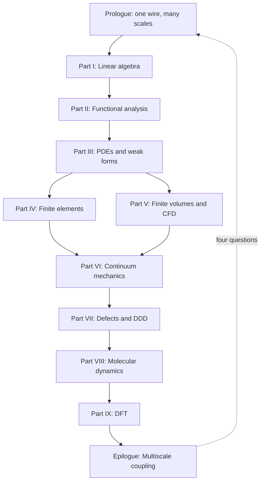

# The Same Material, Many Scales

## Scene

Imagine a single crystal of copper pulled in uniaxial tension. At the engineering scale — centimeters, Newtons — we describe the specimen with Cauchy stress, Hooke's law, and perhaps a finite element mesh of tetrahedra. The wire carries current, heats slightly, and sags under its own weight. None of that physics lives in the crystal lattice alone; it lives in a **continuum** description that treats the material as a smooth field of stress and displacement.

Zoom in to micrometers and the story changes. Dislocation lines glide, multiply, and tangle; the material work-hardens not because of a phenomenological law we inserted by hand, but because of collective motion we can simulate with **dislocation dynamics**. A drawn copper wire owes much of its strength to the dislocation forest left behind by cold working — a mesoscale history written into line defects, invisible to a coarse stress–strain curve until we ask *why* the curve bends upward.

Zoom further, to nanometers, and individual atoms swap neighbors across a grain boundary; **molecular dynamics** tracks each nucleus and its thermal vibrations. A notch in the wire concentrates stress at the atomic scale; bonds stretch, rearrange, and eventually break in ways no elliptic PDE can resolve without regularization.

Zoom once more, to ångströms, and the very notion of an "atom" as a ball on a spring dissolves into the quantum mechanical electron density; **density functional theory** tells us where the electrons live and how much energy the crystal costs to deform. The cohesive energy that holds copper together — the baseline against which every vacancy, dislocation, and surface is measured — begins here.

None of these descriptions is wrong. Each is appropriate at its scale. Computational mechanics is the art of choosing — and connecting — the right description.

## A ladder, not a menu

It is tempting to treat finite elements, finite volumes, molecular dynamics, and DFT as separate courses with separate software packages. That temptation is practical: one does not run Quantum ESPRESSO inside Abaqus. But conceptually, the methods form a **ladder**:

1. **Linear algebra** gives us the syntax for any discrete model: states are vectors, evolution is matrix multiplication, stability is an eigenvalue sign.
2. **Functional analysis** explains why infinite-dimensional field descriptions make sense, why weak formulations exist, and why Galerkin approximations can converge.
3. **Partial differential equations** encode conservation and constitutive physics on continua.
4. **Finite element and finite volume methods** discretize those PDEs with different philosophies — trial functions versus flux balance — suited to elliptic solids and hyperbolic fluids.
5. **Continuum mechanics** supplies the stress–strain–balance language that FEM implementations ultimately approximate.
6. **Defect and dislocation models** explain why continuum elasticity breaks down where singularities live.
7. **Molecular dynamics** resolves atomic motion when continuum fields are too coarse.
8. **Density functional theory** resolves electronic structure when interatomic potentials must be derived rather than assumed.

Each rung supports the one above it. Each rung limits the one below it. Climbing upward, we **homogenize**: we replace microscopic detail with effective laws. Descending downward, we **derive**: we ask where those laws came from and what they omit.

The copper wire is our thread through every rung. At the macro scale it is a structural member; at the mesoscale a polycrystal with texture; at the atomistic scale a lattice of nuclei vibrating in an effective potential; at the electronic scale a sea of valence electrons binding the crystal together.

## The concept map (whole book)

The [Functional Analysis Notes](https://hanfengzhai.github.io/file/teaching/notes/ME412_CourseSummary.pdf) organize each topic with four questions — object, structure, theorem, failure mode. At the scale of the entire book, the same discipline applies:

| Question | Answer for this book |
|----------|----------------------|
| What **object** spans all parts? | The copper wire as a multiscale state — vectors, fields, defects, atoms, electrons |
| What **structure** connects the parts? | The ladder: homogenize upward, derive downward; weak forms at every rung |
| What **theorem** (or principle) makes the story coherent? | Well-posedness and convergence at each discretization; consistent interface data across scales |
| What **breaks** if we ignore the ladder? | Wrong moduli, missing hardening history, unit mismatches, category errors at notches and cores |

The reading order is one continuous arc — not a catalog of methods:

```mermaid
flowchart TB
  P[Prologue: one wire, many scales]
  I[Part I: Linear algebra]
  II[Part II: Functional analysis]
  III[Part III: PDEs and weak forms]
  IV[Part IV: Finite elements]
  V[Part V: Finite volumes and CFD]
  VI[Part VI: Continuum mechanics]
  VII[Part VII: Defects and DDD]
  VIII[Part VIII: Molecular dynamics]
  IX[Part IX: DFT]
  E[Epilogue: Multiscale coupling]
  P --> I --> II --> III
  III --> IV
  III --> V
  IV --> VI
  V --> VI
  VI --> VII --> VIII --> IX --> E
  E -.->|four questions| P
```

**Baby picture:** climb the mathematical rungs (I–VI) until the wire is a meshed solid with stress and flux; then descend (VII–IX) to learn where yield stress, potentials, and cohesive energy originate; finish by wiring the rungs together in workflows no single code runs alone.

## The same questions at every scale

At each rung we ask the same four questions — whether we are solving a sparse linear system, a weak form, or a self-consistent Kohn–Sham cycle:

| Question | Linear algebra | Continuum FEM | Dislocation dynamics | MD | DFT |
|----------|----------------|---------------|------------------------|-----|-----|
| What is the **state**? | Vector \(\mathbf{x}\) | Displacement field \(\mathbf{u}\) | Dislocation network | Positions \(\{\mathbf{r}_i\}\) | Density \(\rho(\mathbf{r})\) |
| What **equations** govern it? | \(\mathbf{A}\mathbf{x}=\mathbf{b}\) | Virtual work / balance | Peach–Köhler + mobility | Newton / Hamilton | Kohn–Sham SCF |
| What **discretization**? | Matrix assembly | Elements + quadrature | Line segments | Timestep + cutoff | Plane waves + k-points |
| What passes **upward**? | — | Stress, stiffness | Hardening law | Potential parameters | Cohesive energy, moduli |

Recognizing this table early saves years of confusion. The software changes; the pattern does not.

## The experiment as plot

The book reads in **mathematical order** (algebra before atomistics), but the copper wire lives in **laboratory time**. Keeping both orders straight turns a catalog of methods into a story. Picture one afternoon in a mechanics lab — the same specimen, the same afternoon, many models:

| Act | What happens in the lab | What the book computes | Parts (read in order) |
|-----|-------------------------|------------------------|-----------------------|
| **I — Mounting** | A cold-drawn copper cylinder is gripped in wedge jaws; the operator zeros the load cell and thermocouple. | Boundary conditions, a chain of bar elements, the first \(\mathbf{K}\mathbf{u}=\mathbf{f}\). | [Prologue](00-many-scales.md), [Part I](../part01-linear-algebra/00-opening.md) |
| **II — Warming** | Current is switched on. The narrowest cross-section heats; air cools the surface. | Steady heat conduction in the solid (FEM), enthalpy flux in the surrounding air (FVM), Robin coupling at the wall. | [Part III](../part03-pdes/00-opening.md), [Part IV](../part04-fem/00-opening.md), [Part V](../part05-fvm/00-opening.md) |
| **III — Pulling** | Grip displacement ramps. The force–displacement curve climbs almost linearly. | Weak-form elasticity, Galerkin assembly, convergence in \(H^1\); Cauchy stress and virtual work name what the curve measures. | [Part II](../part02-functional-analysis/00-opening.md), [Part III](../part03-pdes/00-opening.md), [Part IV](../part04-fem/00-opening.md), [Part VI](../part06-continuum/00-opening.md) |
| **IV — Hardening** | The curve bends upward: more force for each increment of stretch. | Dislocation forest from cold drawing plus fresh multiplication; DDD and Taylor hardening explain the bend without a magic constant. | [Part VII](../part07-defects/00-opening.md) |
| **V — Notch (optional)** | A scratched wire or a grip corner concentrates stress. | Continuum fields predict *where*; MD at the tip resolves bond breaking and dislocation nucleation. | [Part VI](../part06-continuum/00-opening.md), [Part VIII](../part08-md/00-opening.md) |
| **VI — Foundation (always, in parallel)** | Before any simulation ran, someone chose \(E\), \(\nu\), and a yield stress. | DFT on a small fcc cell supplies cohesive energy and elastic constants; MD fits an EAM potential; those numbers climb the ladder into FEM input decks. | [Part IX](../part09-dft/00-opening.md) → [Part VIII](../part08-md/00-opening.md) → [Part VII](../part07-defects/00-opening.md) → [Part IV](../part04-fem/00-opening.md) |

Acts I–III are what the operator watches on the screen in real time. Act IV is the history written into the material before the test began — cold work — made visible only when load exceeds yield. Act V is the exception that proves the rule: wherever geometry or defects break scale separation, we descend one rung. Act VI is the **prequel** every practitioner runs offline: no wire-scale job starts without parameters whose pedigree traces to finer models or calibration experiments.

Read Parts I–VI as Acts I–III in slow motion — every line of code the operator trusts is justified there. Read Parts VII–IX as Acts IV–VI — where the numbers in the input file came from, and what they omit. The **epilogue** returns to the full afternoon and asks how modern teams wire Acts I–VI into one workflow when no single executable spans the ladder.

When a chapter feels abstract, locate it in this table: *Which act of the experiment am I in, and what question is the model answering right now?* The mathematics changes; the specimen does not.

## Why the ladder has a preferred direction

We read this book **bottom-up** in the mathematical parts (I–VI) because the language of weak forms, assembly, and convergence is easier to learn on elliptic problems with clean energy principles. We then **descend** in Parts VII–IX because continuum parameters — yield stress, hardening modulus, interatomic potential, surface energy — are not free parameters. They are **outputs** of finer models or experiments.

Consider the elastic modulus \(E\) of copper used in a structural wire model. DFT can compute it from the curvature of total energy with respect to strain on a perfect lattice. MD can cross-check it with fluctuation formulas at finite temperature. A tension test on the wire itself measures an **effective** modulus that includes texture, porosity, and processing history. All three numbers are "the modulus of copper," but they answer slightly different questions. Multiscale mechanics is the discipline of making those answers consistent.

## The weak form as recurring character

Along the way, a recurring character appears: the **weak form** of a boundary value problem. Born in Part III as a mathematical convenience — multiply by a test function, integrate by parts, absorb boundary conditions — it becomes in Part IV the foundation of the finite element method. In Part VI it reappears as the **virtual work principle** of elasticity:

\[
\int_\Omega \boldsymbol{\sigma} : \delta\boldsymbol{\varepsilon} \, d\Omega = \int_\Omega \mathbf{f} \cdot \delta\mathbf{u} \, d\Omega + \int_{\Gamma_N} \mathbf{t} \cdot \delta\mathbf{u} \, dS.
\]

By the time we reach molecular dynamics, we will recognize its shadow in the **symplectic structure** of Hamiltonian integrators — different language, same instinct: multiply by a test object, integrate by parts, and let boundary conditions do the heavy lifting. Even DFT has a variational heart: the ground-state density minimizes an energy functional.

The copper wire does not know which chapter we are in. It responds to the same physics whether we write a weak form or a Kohn–Sham equation. Our job is to translate faithfully between languages.

## Processing history matters

Real copper wire is not a perfect single crystal. It is drawn through dies, work-hardened, perhaps annealed partially to recover conductivity. Each process step writes **structure** into the material:

- **Drawing** increases dislocation density and aligns grains — mesoscale and polycrystal effects.
- **Annealing** allows vacancies to diffuse and dislocations to rearrange — atomistic kinetics.
- **Oxidation** at the surface changes local chemistry — electronic structure near interfaces.

A multiscale narrative that jumps straight from DFT bulk modulus to structural FEM without acknowledging processing history predicts the wrong wire. The ladder is not only spatial; it is also **historical**. Internal state variables — dislocation density, back stress, grain size — exist precisely to carry history upward when pure elasticity cannot.

## Scale separation and overlap

Scale separation is both a blessing and a fiction. It is a **blessing** because Born–Oppenheimer, homogenization, and RVE averaging work when a clear gap separates fast and slow degrees of freedom, or fine and coarse spatial structure. It is a **fiction** because real materials exhibit **overlap**: dislocation cores require atoms; crack tips couple quantum chemistry to continuum stress; grain-boundary sliding couples diffusion to polycrystal FEM.

When scales overlap, we do not abandon the ladder — we **refine the handoff**. Concurrent coupling (QM/MM, FE²) and enriched continua (gradient plasticity, nonlocal damage) exist precisely where sequential homogenization with a single constant fails. The copper wire's notch root is a canonical overlap region: continuum stress is well defined a micron away, but bond breaking at the tip is atomistic.

Recognizing overlap early prevents category errors — using bulk DFT modulus to predict notch failure without fracture mechanics or atomistics, for example.

## Software silos vs. intellectual continuity

Practitioners legitimately speak of "the MD person" and "the FEM person" because software ecosystems differ:

- **FEM**: mesh generation, weak form assembly, sparse linear solvers.
- **FVM/CFD**: Riemann solvers, limiters, turbulence closures.
- **MD**: potentials, thermostats, neighbor lists, timestep stability.
- **DFT**: plane waves, SCF mixing, k-meshes, pseudopotential libraries.

No unified executable spans all rungs. **Workflow orchestrators** (Python scripts, workflow engines, Jupyter pipelines) stitch codes together. The intellectual continuity this book emphasizes — state, equations, discretization, upward information — is what makes those scripts more than ad hoc file conversion. When you write `extract_elastic_tensor.py`, you should know whether you are exporting Voigt averages, whether temperature matches, and whether the functional matches the MD potential fit.

## A note on units and conventions

Each community carries its own unit systems: FEM may use SI (Pa, m); MD uses metal units (Å, ps, eV) or real units (kcal/mol); DFT uses Ry or eV with Bohr radii. Multiscale projects fail silently when units convert incorrectly at interfaces. Part VIII's LAMMPS `units metal` and Part IX's Ry cutoff energies do not speak to each other without explicit conversion — a mundane detail that destroys ladders faster than wrong physics.

We will state conventions when they matter and recommend **SI with documented conversion** at workflow boundaries.

## What you should bring

Comfort with multivariable calculus and basic linear algebra is assumed. We will develop functional analysis and Sobolev space ideas as needed, always with an eye toward computation rather than pure generality. Programming experience helps but is not required: the emphasis is on the continuous and discrete mathematics that any implementation must respect.

When you encounter a formula, ask: *What discretization makes this computable? What limit is being taken? What information crosses the scale boundary?* Those three questions will serve you from Part I through the epilogue.

## Reading strategies

This book supports multiple paths:

- **Linear reading** (Parts I → IX → epilogue): best for first exposure; builds language before atomistics.
- **Scale-first reading** (prologue → Part IX → VIII → VII → VI → IV): for readers who already simulate MD or DFT and want the continuum foundation that explains homogenization.
- **Reference reading**: jump to weak forms (Part III), FEM assembly (Part IV), or Kohn–Sham (Part IX) as needed; the prologue and epilogue frame how chapters connect.

Regardless of path, return to the copper wire periodically. If a chapter feels abstract, ask how its equations would appear in a wire tension test, an anneal, or a notch root — grounding prevents methods from floating free of mechanics.

## What lies ahead

Part I refreshes linear algebra and shows how its ideas generalize from vectors to functions. Part II develops the function-space language that makes sense of infinite degrees of freedom. Parts III–V build discretization methods for PDEs — Galerkin FEM for elliptic solids, finite volumes for conservation laws and fluids. Part VI anchors those methods in solid mechanics: kinematics, stress, balance, and variational elasticity.

Parts VII–IX descend. **Part VII** introduces defects and dislocation dynamics — the mesoscale engine of plasticity in our copper wire. **Part VIII** treats molecular dynamics: potentials, ensembles, integrators, and the LAMMPS workflows that connect atomistic simulation to coarser models. **Part IX** covers density functional theory: Born–Oppenheimer separation, Hohenberg–Kohn existence, and the Kohn–Sham equations practitioners solve daily.

The **epilogue** returns to the wire at full scale and asks how modern research couples these rungs — sequentially, concurrently, and through learned surrogates — into workflows that no single code runs unattended, but that disciplined teams use every day.

## Expectations of rigor

We will prove convergence theorems where they illuminate computation (Galerkin best approximation, Lax equivalence for FVM) and state without proof results where full generality would distract (Hohenberg–Kohn existence, spectral theorem in infinite dimensions). The standard is **honest mathematics**: precise hypotheses, explicit discretization parameters, and clear distinction between what is guaranteed and what is validated empirically.

Computational mechanics sits between applied mathematics and engineering. Too much abstraction loses the practitioner; too little loses the analyst. The ladder narrative keeps both readers on the same page — literally.

## Historical perspective (brief)

Multiscale thinking predates modern computing. **Taylor hardening** (1934) connected dislocation density to flow stress before computers tracked individual lines. **Born–Oppenheimer** (1927) separated electronic and nuclear motion before DFT existed. **Finite elements** (Turner, Clough, Argyris; 1950s–60s) discretized the same virtual work principle Cauchy and Lagrange wrote in continuum form.

What changed is **scale of computation**: exascale arithmetic lets DDD, MD, and DFT run at parameters that were pencil-and-paper estimates a generation ago. The ladder's rungs are stable; our ability to climb them is what evolves. Open-source codes democratize that climb — a copper wire study can begin on a laptop (small DFT cell, small MD box) and grow to cluster jobs without changing the underlying equations.

## Notation and conventions used throughout

Vectors are bold (\(\mathbf{u}\), \(\mathbf{F}\)); tensors are bold sans-serif or with double indices (\(\boldsymbol{\sigma}\), \(C_{ijkl}\)). We use Einstein summation where convenient. Partial derivatives appear as \(\partial u/\partial x\) or subscript comma notation \(u_{,x}\) depending on context.

Function spaces (\(H^1\), \(L^2\)) appear from Part II onward; their discrete counterparts are finite element spaces \(V_h\). When we write "convergence," we mean discretization parameters (mesh size \(h\), timestep \(\Delta t\), cutoff energy \(E_{\text{cut}}\)) tending to limits where the discrete model approaches a well-defined continuous or reference problem.

These conventions are standard in computational mechanics literature; deviations are noted locally.

## A promise to the reader

Every part of this book answers, implicitly or explicitly, one question about the copper wire (or any material you substitute): *At this scale, what is the minimal state description that still captures the physics we care about, and what do we export to the scale above?* If a chapter does not change your answer to that question, it has not done its job.

We begin with the grammar of vectors and matrices — not because wires are linear, but because every discretization, at every scale, eventually reduces to finite-dimensional algebra. Part I is where that reduction becomes conscious craft rather than background assumption. The same copper atom that DFT will later describe with electron density first appears here as a node in a graph of coupled degrees of freedom — finite-dimensional long before it is quantum mechanical.

Turn the page when ready. The ladder starts with familiar objects: vectors, matrices, and the linear maps between them.

## Reading compass: two clocks on one wire

The book reads in **mathematical order** (Part I before Part IX). The copper wire lives in **laboratory time** (mounting before hardening). Both clocks describe the same afternoon — the continuity comes from returning to the specimen whenever the symbols change.

| If you need… | Start here |
|--------------|------------|
| Skill checkpoints (competence time) | [Preface: skill navigation](../preface.md#skill-navigation) |
| Opening hinge (prologue → Part I) | [Preface: opening hinge](../preface.md#opening-continuity-hinge) |
| Act I — mounting stitch | [Preface: opening continuity hinge](../preface.md#opening-continuity-hinge) · [Part I mounting Lab act](../part01-linear-algebra/00-opening.md#lab-act-i--mounting) → [I.1 three-node assembly](../part01-linear-algebra/01-vectors-matrices.md#lab-act-three-nodes-one-load-cell-reading-act-i--mounting); epilogue [Act I reunion paragraph](../epilogue/multiscale.md#lab-act-reunion-six-acts-one-afternoon) and [preview Act I row](../epilogue/multiscale.md#reunion-preview-act-i); [prologue Act I preview row](#prologue-preview-act-i) |
| Act II — warming stitch | [Preface: row 8 skill checkpoint](../preface.md#skill-navigation-row-8) · [V.4 Picard loop](../part05-fvm/04-navier-stokes-cfd.md#lab-act-extension-two-domain-picard-loop-with-a-1d-fem-solid) → [Handshake 2](../epilogue/multiscale.md#handshake-2--joule-heating--conjugate-heat-transfer-part-iv--v); epilogue [Act II reunion paragraph](../epilogue/multiscale.md#lab-act-reunion-six-acts-one-afternoon) and [preview Act II row](../epilogue/multiscale.md#reunion-preview-act-ii); [prologue row 8 preview row](#prologue-preview-row-8) |
| Act III — pulling stitch | [Preface: row 13 skill checkpoint](../preface.md#skill-navigation-row-13) · [Handshake 2](../epilogue/multiscale.md#handshake-2--joule-heating--conjugate-heat-transfer-part-iv--v) → [IX.3 \(\alpha\) Lab act](../part09-dft/03-dft-workflows.md#lab-act-quasiharmonic-alpha-handshake-3-pedigree) → [Handshake 3](../epilogue/multiscale.md#handshake-3--thermal-strain--mechanical-stiffness-part-vi--iv); epilogue [Act III reunion paragraph](../epilogue/multiscale.md#lab-act-reunion-six-acts-one-afternoon) and [preview Act III row](../epilogue/multiscale.md#reunion-preview-act-iii); [prologue row 13 preview row](#prologue-preview-row-13) |
| Act IV — hardening stitch | [Preface: row 14 skill checkpoint](../preface.md#skill-navigation-row-14) · [VII.3 rate handshake](../part07-defects/03-polycrystal-and-fem-handoff.md#scale-boundary-handshake-ddd-strain-rate-to-quasi-static-fem) → [Handshake 4a](../epilogue/multiscale.md#handshake-4--rate-dependent-hardening-and-notch-localization-part-vii--vi--viii); epilogue [Act IV reunion paragraph](../epilogue/multiscale.md#lab-act-reunion-six-acts-one-afternoon) and [preview Act IV row](../epilogue/multiscale.md#reunion-preview-act-iv); [prologue row 14 preview row](#prologue-preview-row-14); [prologue Handshake 4a preview row](#prologue-preview-act-iv) |
| Act V — notch stitch | [Preface: row 15 skill checkpoint](../preface.md#skill-navigation-row-15) · [VII.3 Step 4 FE²](../part07-defects/03-polycrystal-and-fem-handoff.md#step-4--when-offline-calibration-fails-fe-at-the-notch) → [Handshake 4b](../epilogue/multiscale.md#4b--when-continuum-fails-at-the-notch-md-subdomain-act-v--notch); epilogue [Act V reunion paragraph](../epilogue/multiscale.md#lab-act-reunion-six-acts-one-afternoon) and [preview Act V row](../epilogue/multiscale.md#reunion-preview-act-v); [prologue Handshake 4b preview row](#prologue-preview-act-v); [prologue row 15 closing stitch](#row-15-closing-stitch); [epilogue row 15 closing loop](../epilogue/multiscale.md#row-15-closing-loop) |
| Act VI — foundation stitch | [Preface: row 16 skill checkpoint](../preface.md#skill-navigation-row-16) · [IX.3 Bridge to epilogue](../part09-dft/03-dft-workflows.md#bridge-to-the-epilogue) → [`parse_multiscale_workflow.sh`](../../scripts/parse_multiscale_workflow.sh); epilogue [Act VI reunion paragraph](../epilogue/multiscale.md#lab-act-reunion-six-acts-one-afternoon) and [preview Act VI row](../epilogue/multiscale.md#reunion-preview-act-vi); [prologue row 16 preview row](#prologue-preview-row-16); [prologue row 16 closing stitch](#row-16-closing-stitch); [epilogue row 16 closing loop](../epilogue/multiscale.md#row-16-closing-loop) |
| The plot in one page | [Preface: story in one page](../preface.md#the-story-in-one-page) |
| Ascent preview (Parts I–VI) | [Preface: ascent preview chain](../preface.md#ascent-preview-chain) |
| Ascent continuity hinges (I.4 → V.4) | [Preface: ascent hinges](../preface.md#ascent-continuity-hinges) |
| Descent preview (Parts VII–IX) | [Preface: descent preview chain](../preface.md#descent-preview-chain) |
| Continuity hinges (midpoint + VI.4) | [Preface: continuity hinges](../preface.md#continuity-hinges-ascent-descent) |
| Descent continuity hinges (VII.3 → IX.3) | [Preface: descent hinges](../preface.md#descent-continuity-hinges) |
| Epilogue continuity hinges (IX → prologue) | [Preface: epilogue hinges](../preface.md#epilogue-continuity-hinges) |
| All hinges in one table | [Memory sheet: master map](../appendix/memory-sheet.md#continuity-hinges-master-map) |
| Row 8 — \(T_w\) pedigree (Act II → MD/DDD) | [Preface: row 8 skill checkpoint](../preface.md#skill-navigation-row-8) · [V.4 CHT](../part05-fvm/04-navier-stokes-cfd.md#lab-act-extension-two-domain-picard-loop-with-a-1d-fem-solid) → [`cht_export.yaml`](../../scripts/parse_cht.sh) → [VIII.0 descent hinge](../part08-md/00-opening.md#descent-hinge-cores-mobility-and-tw-pedigree) → [VIII.3 WHAM at \(T_w\)](../part08-md/03-ab-initio-and-coarse-graining.md#wham-part-vii-mobility-hinge-act-ii-temperature-pedigree); [memory sheet rows 8–9 baby picture](../appendix/memory-sheet.md#rows-8-9-baby-picture-tw-temperature-pedigree) |
| Row 9 — phonon audit at \(T_w\) (MD → DFT) | [Preface: row 9 skill checkpoint](../preface.md#skill-navigation-row-9) — [IX.0 electronic audit hinge](../part09-dft/00-opening.md#electronic-audit-hinge-descent-pedigree-and-tw-phonon) · [thermal phonon audit at \(T_w\)](../part09-dft/00-opening.md#thermal-phonon-audit-at-tw); [`parse_alpha.sh`](../../scripts/parse_alpha.sh) with `--target-t` from `cht_export.yaml`; [memory sheet rows 8–9 baby picture](../appendix/memory-sheet.md#rows-8-9-baby-picture-tw-temperature-pedigree); epilogue [opening hinge from Part IX](../epilogue/multiscale.md#opening-hinge-ix3-to-epilogue), [preview Act III row](../epilogue/multiscale.md#reunion-preview-act-iii), and [preview Act IV row](../epilogue/multiscale.md#reunion-preview-act-iv); [prologue row 9 preview row](#prologue-preview-row-9) |
| Row 10 — coupling hinge (IX.3 → epilogue) | [Preface: row 10 skill checkpoint](../preface.md#skill-navigation-row-10) — [IX.3 Bridge to epilogue](../part09-dft/03-dft-workflows.md#bridge-to-the-epilogue) · [epilogue opening hinge from Part IX](../epilogue/multiscale.md#opening-hinge-ix3-to-epilogue); [IX.3 epilogue pedigree table](../part09-dft/03-dft-workflows.md#ix3-epilogue-pedigree-table); Handshakes **4a** (Act IV bulk hardening) vs **4b** (Act V notch) on the same `hardening.yaml`; [memory sheet row 10](../appendix/memory-sheet.md#continuity-hinges-master-map); [prologue row 10 preview row](#prologue-preview-row-10) |
| Row 11 — six-act reunion (I→IX vs Acts I–VI) | [Preface: row 11 skill checkpoint](../preface.md#skill-navigation-row-11) — [prologue experiment-as-plot](#the-experiment-as-plot) · [epilogue six-act reunion](../epilogue/multiscale.md#lab-act-reunion-six-acts-one-afternoon); [memory sheet one-page recap](../appendix/memory-sheet.md#one-page-copper-wire-recap); Act VI runs **in parallel** with Acts I–V; [memory sheet row 11](../appendix/memory-sheet.md#continuity-hinges-master-map); [prologue row 11 preview row](#prologue-preview-row-11); [prologue row 11 closing stitch](#row-11-closing-stitch); [epilogue row 11 closing loop](../epilogue/multiscale.md#row-11-closing-loop) |
| Row 12 — next project restart (epilogue → prologue) | [Preface: row 12 skill checkpoint](../preface.md#skill-navigation-row-12) — [epilogue Bridge row 12 closing loop](../epilogue/multiscale.md#row-12-closing-loop) · [prologue reopening anchor](#prologue-reopening-anchor); [memory sheet row 12 baby picture](../appendix/memory-sheet.md#row-12-baby-picture-next-project); [prologue row 12 preview row](#prologue-preview-row-12); [prologue row 12 closing stitch](#row-12-closing-stitch); [sources continuity hinges row 12](../appendix/sources.md#continuity-hinges-index-when-the-plot-stutters) |
| Joule heat → fixed-grip stress (row 13) | [Preface: row 13 skill checkpoint](../preface.md#skill-navigation-row-13) — [Handshake 2](../epilogue/multiscale.md#handshake-2--joule-heating--conjugate-heat-transfer-part-iv--v) → [IX.3 \(\alpha\) Lab act](../part09-dft/03-dft-workflows.md#lab-act-quasiharmonic-alpha-handshake-3-pedigree) → [Handshake 3](../epilogue/multiscale.md#handshake-3--thermal-strain--mechanical-stiffness-part-vi--iv); epilogue [Act II reunion paragraph](../epilogue/multiscale.md#lab-act-reunion-six-acts-one-afternoon) (Handshake 2) and [Act III reunion paragraph](../epilogue/multiscale.md#lab-act-reunion-six-acts-one-afternoon) (Handshake 3); [sensitivity derivation opening](../epilogue/multiscale.md#worked-example-sensitivity-ranks) (Handshake 2–3 chain); [prologue row 13 preview row](#prologue-preview-row-13); [prologue row 13 closing stitch](#row-13-closing-stitch); [epilogue row 13 closing loop](../epilogue/multiscale.md#row-13-closing-loop) |
| DDD rate → lab load cell (Handshake 4a) | [Preface: row 14 skill checkpoint](../preface.md#skill-navigation-row-14) — [VII.3 rate handshake](../part07-defects/03-polycrystal-and-fem-handoff.md#scale-boundary-handshake-ddd-strain-rate-to-quasi-static-fem) → [epilogue Handshake 4a](../epilogue/multiscale.md#handshake-4--rate-dependent-hardening-and-notch-localization-part-vii--vi--viii); [`parse_rate.sh`](../../scripts/parse_rate.sh); [sensitivity derivation](../epilogue/multiscale.md#worked-example-sensitivity-ranks) (Handshake 4a column); [memory sheet row 14](../appendix/memory-sheet.md#continuity-hinges-master-map); [prologue row 14 preview row](#prologue-preview-row-14); [prologue row 14 closing stitch](#row-14-closing-stitch); [epilogue row 14 closing loop](../epilogue/multiscale.md#row-14-closing-loop) |
| FE² notch → Act V localization (Handshake 4b) | [Preface: row 15 skill checkpoint](../preface.md#skill-navigation-row-15) — [VII.3 Step 4 FE²](../part07-defects/03-polycrystal-and-fem-handoff.md#step-4--when-offline-calibration-fails-fe-at-the-notch) → [epilogue Handshake 4b](../epilogue/multiscale.md#4b--when-continuum-fails-at-the-notch-md-subdomain-act-v--notch); [`parse_fe2.sh`](../../scripts/parse_fe2.sh); [sensitivity derivation](../epilogue/multiscale.md#worked-example-sensitivity-ranks) (Handshake 4b column); [memory sheet row 15](../appendix/memory-sheet.md#continuity-hinges-master-map); [memory sheet row 15 baby picture](../appendix/memory-sheet.md#row-15-baby-picture-handshake-4b); [prologue Handshake 4b preview row](#prologue-preview-act-v); [prologue row 15 closing stitch](#row-15-closing-stitch); [epilogue row 15 closing loop](../epilogue/multiscale.md#row-15-closing-loop); upstream rate from [row 14](../preface.md#skill-navigation-row-14) |
| Act VI orchestration → multiscale export (row 16) | [Preface: row 16 skill checkpoint](../preface.md#skill-navigation-row-16) · [Preface: epilogue hinges Act VI row](../preface.md#epilogue-continuity-hinges) — [IX.3 Bridge to epilogue](../part09-dft/03-dft-workflows.md#bridge-to-the-epilogue) → [`parse_multiscale_workflow.sh`](../../scripts/parse_multiscale_workflow.sh) → `multiscale_export.yaml`; per-handshake parsers in [epilogue script audit trail](../epilogue/multiscale.md#script-audit-trail-parse-scripts-handshakes); [Part IX coupling ladder](../part09-dft/00-opening.md#the-coupling-ladder-me-412-reunion); epilogue [Act VI reunion paragraph](../epilogue/multiscale.md#lab-act-reunion-six-acts-one-afternoon) and [sensitivity worksheet closing](../epilogue/multiscale.md#worked-example-sensitivity-ranks) (row 16 orchestration stitch); [memory sheet Act VI baby picture](../appendix/memory-sheet.md#act-vi-baby-picture-me-412-coupling-ladder); [prologue row 16 closing stitch](#row-16-closing-stitch); [epilogue row 16 closing loop](../epilogue/multiscale.md#row-16-closing-loop); upstream \(T_w\) pedigree from [rows 8–9](../preface.md#skill-navigation-row-8) and handshakes from [rows 13–15](../preface.md#skill-navigation-row-13) |
| Continuous read-through (row 17) | [Preface: row 17 skill checkpoint](../preface.md#skill-navigation-row-17) · [Continuous read-through guide](../appendix/sources.md#continuous-read-through-guide) · [memory sheet row 17 baby picture](../appendix/memory-sheet.md#row-17-baby-picture-continuous-read-through) · [prologue row 17 preview row](#prologue-preview-row-17); [prologue row 17 closing stitch](#row-17-closing-stitch); [epilogue row 17 closing loop](../epilogue/multiscale.md#row-17-closing-loop) — read Scene → Bridge straight through; pause only at I.4, VI.4, IX.3; open rows 0–16 only when a gate stalls |
| Part-opening plot spine (row 18) | [Preface: row 18 skill checkpoint](../preface.md#skill-navigation-row-18) · [Part-opening plot spine index](../appendix/sources.md#part-opening-plot-spine-index-row-18) · [memory sheet row 18 baby picture](../appendix/memory-sheet.md#row-18-baby-picture-part-opening-plot-spine) · [prologue row 18 preview row](#prologue-preview-row-18); [prologue row 18 closing stitch](#row-18-closing-stitch); [epilogue row 18 closing loop](../epilogue/multiscale.md#row-18-closing-loop) — read one sentence aloud at every part opening when row 17 stalls at a part boundary (III→IV, VI→VII) |
| Numbered-chapter plot spine (row 19) | [Preface: row 19 skill checkpoint](../preface.md#skill-navigation-row-19) · [Numbered-chapter plot spine index](../appendix/sources.md#numbered-chapter-plot-spine-index-row-19) · [memory sheet row 19 baby picture](../appendix/memory-sheet.md#row-19-baby-picture-numbered-chapter-plot-spine) · [prologue row 19 preview row](#prologue-preview-row-19); [prologue row 19 closing stitch](#row-19-closing-stitch); [epilogue row 19 closing loop](../epilogue/multiscale.md#row-19-closing-loop) — read one sentence aloud mid-chapter when row 18's part one-liners did not restore continuity |
| Gate-chapter plot spine (row 20) | [Preface: row 20 skill checkpoint](../preface.md#skill-navigation-row-20) · [Gate-chapter plot spine index](../appendix/sources.md#gate-chapter-plot-spine-index-row-20) · [memory sheet row 20 baby picture](../appendix/memory-sheet.md#row-20-baby-picture-gate-chapter-plot-spine) · [prologue row 20 preview row](#prologue-preview-row-20); [prologue row 20 closing stitch](#row-20-closing-stitch); [epilogue row 20 closing loop](../epilogue/multiscale.md#row-20-closing-loop) · [I.4 plot spine](../part01-linear-algebra/04-toward-infinity.md#plot-spine-one-line) · [VI.4 plot spine](../part06-continuum/04-nonlinear-plasticity-preview.md#plot-spine-one-line) · [IX.3 plot spine](../part09-dft/03-dft-workflows.md#plot-spine-one-line) — recite plot spine one line at I.4, VI.4, IX.3 before Bridge when row 19's chapter one-liners fail at a plot turn |
| Lab act reunion (row 21) | [Preface: row 21 skill checkpoint](../preface.md#skill-navigation-row-21) · [Lab act reunion index](../appendix/sources.md#lab-act-reunion-index-row-21) · [memory sheet row 21 baby picture](../appendix/memory-sheet.md#row-21-baby-picture-lab-act-reunion) · [prologue row 21 preview row](#prologue-preview-row-21); [prologue row 21 closing stitch](#row-21-closing-stitch); [epilogue row 21 closing loop](../epilogue/multiscale.md#row-21-closing-loop) — read one-line move aloud at workflow anchor Lab acts when plot spines restore narrative but code feels like homework |
| Scene reunion (row 22) | [Preface: row 22 skill checkpoint](../preface.md#skill-navigation-row-22) · [Scene reunion index](../appendix/sources.md#scene-reunion-index-row-22) · [memory sheet row 22 baby picture](../appendix/memory-sheet.md#row-22-baby-picture-scene-reunion) · [prologue row 22 preview row](#prologue-preview-row-22); [prologue row 22 closing stitch](#row-22-closing-stitch); [epilogue row 22 closing loop](../epilogue/multiscale.md#row-22-closing-loop) — read Scene one-line visual aloud when plot spines and Lab acts restore vocabulary but symbols hide the wire |
| Bridge reunion (row 23) | [Preface: row 23 skill checkpoint](../preface.md#skill-navigation-row-23) · [Bridge reunion index](../appendix/sources.md#bridge-reunion-index-row-23) · [memory sheet row 23 baby picture](../appendix/memory-sheet.md#row-23-baby-picture-bridge-reunion) · [prologue row 23 preview row](#prologue-preview-row-23); [prologue row 23 closing stitch](#row-23-closing-stitch); [epilogue row 23 closing loop](../epilogue/multiscale.md#row-23-closing-loop) — read the prior chapter's Bridge one-line hinge aloud when Scene, plot spines, and Lab acts all read correctly but chapter transitions feel mechanical |
| Concept map reunion (row 24) | [Preface: row 24 skill checkpoint](../preface.md#skill-navigation-row-24) · [Concept map reunion index](../appendix/sources.md#concept-map-reunion-index-row-24) · [memory sheet row 24 baby picture](../appendix/memory-sheet.md#row-24-baby-picture-concept-map-reunion) · [prologue row 24 preview row](#prologue-preview-row-24); [prologue row 24 closing stitch](#row-24-closing-stitch); [epilogue row 24 closing loop](../epilogue/multiscale.md#row-24-closing-loop) — answer object / structure / theorem / breaks at the part-opening concept map when narrative vocabulary is restored but proofs feel like disconnected theorems |
| Schematic reunion (row 25) | [Preface: row 25 skill checkpoint](../preface.md#skill-navigation-row-25) · [Schematic reunion index](../appendix/sources.md#schematic-reunion-index-row-25) · [memory sheet row 25 baby picture](../appendix/memory-sheet.md#row-25-baby-picture-schematic-reunion) · [prologue row 25 preview row](#prologue-preview-row-25); [prologue row 25 closing stitch](#row-25-closing-stitch); [epilogue row 25 closing loop](../epilogue/multiscale.md#row-25-closing-loop) — locate the matching baby picture from the part-opening representative schematics table when structural vocabulary is restored but proofs feel abstract without a visual anchor |
| Story so far reunion (row 26) | [Preface: row 26 skill checkpoint](../preface.md#skill-navigation-row-26) · [Story so far reunion index](../appendix/sources.md#story-so-far-reunion-index-row-26) · [memory sheet row 26 baby picture](../appendix/memory-sheet.md#row-26-baby-picture-story-so-far-reunion) · [prologue row 26 preview row](#prologue-preview-row-26); [prologue row 26 closing stitch](#row-26-closing-stitch); [epilogue row 26 closing loop](../epilogue/multiscale.md#row-26-closing-loop) — read the part-opening Story so far recap aloud when rows 17–25 all read correctly but you cannot place where the copper wire is in the narrative arc |
| Closing the arc reunion (row 27) | [Preface: row 27 skill checkpoint](../preface.md#skill-navigation-row-27) · [Closing the arc reunion index](../appendix/sources.md#closing-the-arc-reunion-index-row-27) · [memory sheet row 27 baby picture](../appendix/memory-sheet.md#row-27-baby-picture-closing-the-arc-reunion) · [prologue row 27 preview row](#prologue-preview-row-27); [prologue row 27 closing stitch](#row-27-closing-stitch); [epilogue row 27 closing loop](../epilogue/multiscale.md#row-27-closing-loop) — read the part-opening Closing the arc table aloud when rows 17–26 all read correctly but prior-part symbols do not map to current-part vocabulary |
| Scale-boundary reunion (row 28) | [Preface: row 28 skill checkpoint](../preface.md#skill-navigation-row-28) · [Scale-boundary reunion index](../appendix/sources.md#scale-boundary-reunion-index-row-28) · [memory sheet row 28 baby picture](../appendix/memory-sheet.md#row-28-baby-picture-scale-boundary-reunion) · [prologue row 28 preview row](#prologue-preview-row-28); [prologue row 28 closing stitch](#row-28-closing-stitch); [epilogue row 28 closing loop](../epilogue/multiscale.md#row-28-closing-loop) — read the chapter Scale-boundary handshake table aloud when rows 17–27 all read correctly but parameters crossing a scale boundary feel arbitrary |
| Thermoelastic assembly reunion (row 29) | [Preface: row 29 skill checkpoint](../preface.md#skill-navigation-row-29) · [Thermoelastic assembly reunion index](../appendix/sources.md#thermoelastic-assembly-reunion-index-row-29) · [memory sheet row 29 baby picture](../appendix/memory-sheet.md#row-29-baby-picture-thermoelastic-assembly-reunion) · [prologue row 29 preview row](#prologue-preview-row-29); [prologue row 29 closing stitch](#row-29-closing-stitch); [epilogue row 29 closing loop](../epilogue/multiscale.md#row-29-closing-loop) — read the Part IV thermoelastic assembly thread aloud when rows 17–28 all read correctly but Act II heating and Act III pulling feel like separate FEM homework |
| CHT outer-loop reunion (row 30) | [Preface: row 30 skill checkpoint](../preface.md#skill-navigation-row-30) · [CHT outer-loop reunion index](../appendix/sources.md#cht-outer-loop-reunion-index-row-30) · [memory sheet row 30 baby picture](../appendix/memory-sheet.md#row-30-baby-picture-cht-outer-loop-reunion) · [prologue row 30 preview row](#prologue-preview-row-30); [prologue row 30 closing stitch](#row-30-closing-stitch); [epilogue row 30 closing loop](../epilogue/multiscale.md#row-30-closing-loop) — read the IV.5 → V.4 Picard → `cht_export.yaml` chain aloud when rows 17–29 all read correctly but solid FEM and fluid FVM still feel like separate solvers |
| Twin-ladder → virtual work reunion (row 31) | [Preface: row 31 skill checkpoint](../preface.md#skill-navigation-row-31) · [Twin-ladder virtual work reunion index](../appendix/sources.md#twin-ladder-virtual-work-reunion-index-row-31) · [memory sheet row 31 baby picture](../appendix/memory-sheet.md#row-31-baby-picture-twin-ladder-virtual-work-reunion) · [prologue row 31 preview row](#prologue-preview-row-31); [prologue row 31 closing stitch](#row-31-closing-stitch); [epilogue row 31 closing loop](../epilogue/multiscale.md#row-31-closing-loop) — read VI.0 twin-ladder → VI.1 kinematics → VI.3 virtual work aloud when rows 17–30 all read correctly but \(\mathbf{K}\mathbf{U}=\mathbf{F}\) and virtual work still feel like separate subjects |
| Virtual work → plasticity preview reunion (row 32) | [Preface: row 32 skill checkpoint](../preface.md#skill-navigation-row-32) · [Virtual work → plasticity preview reunion index](../appendix/sources.md#virtual-work-plasticity-preview-reunion-index-row-32) · [memory sheet row 32 baby picture](../appendix/memory-sheet.md#row-32-baby-picture-virtual-work-plasticity-preview-reunion) · [prologue row 32 preview row](#prologue-preview-row-32); [prologue row 32 closing stitch](#row-32-closing-stitch); [epilogue row 32 closing loop](../epilogue/multiscale.md#row-32-closing-loop) — read VI.3 virtual work → VI.4 return-mapping → Part VII descent hinge aloud when rows 17–31 all read correctly but \(\delta\Pi = 0\) and return-mapping still feel like separate subjects |
| Part VII → VIII descent hinge reunion (row 33) | [Preface: row 33 skill checkpoint](../preface.md#skill-navigation-row-33) · [Part VII → VIII descent hinge reunion index](../appendix/sources.md#part-vii-viii-descent-hinge-reunion-index-row-33) · [memory sheet row 33 baby picture](../appendix/memory-sheet.md#row-33-baby-picture-part-vii-viii-descent-hinge-reunion) · [prologue row 33 preview row](#prologue-preview-row-33); [prologue row 33 closing stitch](#row-33-closing-stitch); [epilogue row 33 closing loop](../epilogue/multiscale.md#row-33-closing-loop) — read Part VII descent hinge → VII.2 mobility at \(T_w\) → Part VIII descent hinge aloud when rows 17–32 all read correctly but DDD and MD still feel like separate courses |
| Potentials → ensembles reunion (row 34) | [Preface: row 34 skill checkpoint](../preface.md#skill-navigation-row-34) · [Potentials → ensembles reunion index](../appendix/sources.md#potentials-ensembles-reunion-index-row-34) · [memory sheet row 34 baby picture](../appendix/memory-sheet.md#row-34-baby-picture-potentials-ensembles-reunion) · [prologue row 34 preview row](#prologue-preview-row-34); [prologue row 34 closing stitch](#row-34-closing-stitch); [epilogue row 34 closing loop](../epilogue/multiscale.md#row-34-closing-loop) — read VIII.1 Bridge → VIII.2 opening hinge aloud when rows 17–33 all read correctly but 0 K EAM minimization and NVT/NPT trajectories still feel like separate subjects |
| Ensembles → coarse-graining reunion (row 35) | [Preface: row 35 skill checkpoint](../preface.md#skill-navigation-row-35) · [Ensembles → coarse-graining reunion index](../appendix/sources.md#ensembles-coarse-graining-reunion-index-row-35) · [memory sheet row 35 baby picture](../appendix/memory-sheet.md#row-35-baby-picture-ensembles-coarse-graining-reunion) · [prologue row 35 preview row](#prologue-preview-row-35); [prologue row 35 closing stitch](#row-35-closing-stitch); [epilogue row 35 closing loop](../epilogue/multiscale.md#row-35-closing-loop) — read VIII.2 Bridge → VIII.3 opening hinge aloud when rows 17–34 all read correctly but audited trajectories and yaml handoff tables still feel like separate subjects |
| Coarse-graining → electronic audit reunion (row 36) | [Preface: row 36 skill checkpoint](../preface.md#skill-navigation-row-36) · [Coarse-graining → electronic audit reunion index](../appendix/sources.md#coarse-graining-electronic-audit-reunion-index-row-36) · [memory sheet row 36 baby picture](../appendix/memory-sheet.md#row-36-baby-picture-coarse-graining-electronic-audit-reunion) · [prologue row 36 preview row](#prologue-preview-row-36); [prologue row 36 closing stitch](#row-36-closing-stitch); [epilogue row 36 closing loop](../epilogue/multiscale.md#row-36-closing-loop) — read VIII.3 Bridge → IX.0 opening hinge aloud when rows 17–35 all read correctly but pedigree checklist rows exist without QE SCF logs or \(\alpha(T_w)\) beside them |
| Electronic audit → Born–Oppenheimer reunion (row 37) | [Preface: row 37 skill checkpoint](../preface.md#skill-navigation-row-37) · [Electronic audit → Born–Oppenheimer reunion index](../appendix/sources.md#electronic-audit-born-oppenheimer-reunion-index-row-37) · [memory sheet row 37 baby picture](../appendix/memory-sheet.md#row-37-baby-picture-electronic-audit-born-oppenheimer-reunion) · [prologue row 37 preview row](#prologue-preview-row-37); [prologue row 37 closing stitch](#row-37-closing-stitch); [epilogue row 37 closing loop](../epilogue/multiscale.md#row-37-closing-loop) — read IX.0 Bridge → IX.1 opening hinge aloud when rows 17–36 all read correctly but SCF logs exist without BO/HK theorems connecting to Part VIII's EAM surface |
| Born–Oppenheimer → Kohn–Sham reunion (row 38) | [Preface: row 38 skill checkpoint](../preface.md#skill-navigation-row-38) · [Born–Oppenheimer → Kohn–Sham reunion index](../appendix/sources.md#born-oppenheimer-kohn-sham-reunion-index-row-38) · [memory sheet row 38 baby picture](../appendix/memory-sheet.md#row-38-baby-picture-born-oppenheimer-kohn-sham-reunion) · [prologue row 38 preview row](#prologue-preview-row-38); [prologue row 38 closing stitch](#row-38-closing-stitch); [epilogue row 38 closing loop](../epilogue/multiscale.md#row-38-closing-loop) — read IX.1 Bridge → IX.2 opening hinge aloud when rows 17–37 all read correctly but BO/HK theorems exist without the SCF fixed-point loop connecting to Part I eigenvalues |
| Kohn–Sham → DFT workflows reunion (row 39) | [Preface: row 39 skill checkpoint](../preface.md#skill-navigation-row-39) · [Kohn–Sham → DFT workflows reunion index](../appendix/sources.md#kohn-sham-dft-workflows-reunion-index-row-39) · [memory sheet row 39 baby picture](../appendix/memory-sheet.md#row-39-baby-picture-kohn-sham-dft-workflows-reunion) · [prologue row 39 preview row](#prologue-preview-row-39); [prologue row 39 closing stitch](#row-39-closing-stitch); [epilogue row 39 closing loop](../epilogue/multiscale.md#row-39-closing-loop) — read IX.2 Bridge → IX.3 opening hinge aloud when rows 17–38 all read correctly but SCF is understood without the calculation ladder and `cu.foundation/` archive connecting to Parts VI–VIII |
| IX.3 → Handshake 3 reunion (row 40) | [Preface: row 40 skill checkpoint](../preface.md#skill-navigation-row-40) · [IX.3 → Handshake 3 reunion index](../appendix/sources.md#ix3-handshake3-reunion-index-row-40) · [memory sheet row 40 baby picture](../appendix/memory-sheet.md#row-40-baby-picture-ix3-handshake3-reunion) · [prologue row 40 preview row](#prologue-preview-row-40); [prologue row 40 closing stitch](#row-40-closing-stitch); [epilogue row 40 closing loop](../epilogue/multiscale.md#row-40-closing-loop) — read IX.3 Bridge → epilogue Handshake 3 opening hinge aloud when rows 17–39 all read correctly but `cu.foundation/` is complete yet handbook \(\alpha(300\,\text{K})\) persists at the load cell |
| VII.3 → Handshake 4a reunion (row 41) | [Preface: row 41 skill checkpoint](../preface.md#skill-navigation-row-41) · [VII.3 → Handshake 4a reunion index](../appendix/sources.md#vii3-handshake4a-reunion-index-row-41) · [memory sheet row 41 baby picture](../appendix/memory-sheet.md#row-41-baby-picture-vii3-handshake4a-reunion) · [prologue row 41 preview row](#prologue-preview-row-41); [prologue row 41 closing stitch](#row-41-closing-stitch); [epilogue row 41 closing loop](../epilogue/multiscale.md#row-41-closing-loop) — read VII.3 rate handshake → epilogue Handshake 4a opening hinge aloud when rows 17–40 all read correctly but OpenDiS exports feed the plasticity deck without rate extrapolation |
| VII.3 Step 4 → Handshake 4b reunion (row 42) | [Preface: row 42 skill checkpoint](../preface.md#skill-navigation-row-42) · [VII.3 → Handshake 4b reunion index](../appendix/sources.md#vii3-handshake4b-reunion-index-row-42) · [memory sheet row 42 baby picture](../appendix/memory-sheet.md#row-42-baby-picture-vii3-handshake4b-reunion) · [prologue row 42 preview row](#prologue-preview-row-42); [prologue row 42 closing stitch](#row-42-closing-stitch); [epilogue row 42 closing loop](../epilogue/multiscale.md#row-42-closing-loop) — read VII.3 Step 4 FE² → epilogue Handshake 4b opening hinge aloud when rows 17–41 all read correctly but bulk hardening from 4a matches flow stress while the notch root under-predicts peak stress without FE² audit |
| Rows 17–42 → Row 16 orchestration reunion (row 43) | [Preface: row 43 skill checkpoint](../preface.md#skill-navigation-row-43) · [Rows 17–42 → Row 16 orchestration reunion index](../appendix/sources.md#rows17-42-row16-orchestration-reunion-index-row-43) · [memory sheet row 43 baby picture](../appendix/memory-sheet.md#row-43-baby-picture-rows17-42-row16-orchestration-reunion) · [prologue row 43 preview row](#prologue-preview-row-43); [prologue row 43 closing stitch](#row-43-closing-stitch); [epilogue row 43 closing loop](../epilogue/multiscale.md#row-43-closing-loop) — read IX.3 epilogue pedigree table → epilogue row 16 opening hinge aloud when rows 17–42 all read correctly but Handshakes 1–4b exist in separate folders without orchestrated `multiscale_export.yaml` |
| Rows 17–43 → Row 12 book loop closure (row 44) | [Preface: row 44 skill checkpoint](../preface.md#skill-navigation-row-44) · [Rows 17–43 → Row 12 book loop closure index](../appendix/sources.md#rows17-43-row12-book-loop-closure-index-row-44) · [memory sheet row 44 baby picture](../appendix/memory-sheet.md#row-44-baby-picture-rows17-43-row12-book-loop-closure) · [prologue row 44 preview row](#prologue-preview-row-44); [prologue row 44 closing stitch](#row-44-closing-stitch); [epilogue row 44 closing loop](../epilogue/multiscale.md#row-44-closing-loop) — read epilogue ME 412 summary → prologue reopening anchor aloud when rows 17–43 all read correctly but the next terminal opens with copper decks copied blindly |
| Rows 17–44 → Row 17 second-pass reunion (row 45) | [Preface: row 45 skill checkpoint](../preface.md#skill-navigation-row-45) · [Rows 17–44 → Row 17 second-pass reunion index](../appendix/sources.md#rows17-44-row17-second-pass-reunion-index-row-45) · [memory sheet row 45 baby picture](../appendix/memory-sheet.md#row-45-baby-picture-rows17-44-row17-second-pass-reunion) · [prologue row 45 preview row](#prologue-preview-row-45); [prologue row 45 closing stitch](#row-45-closing-stitch); [epilogue row 45 closing loop](../epilogue/multiscale.md#row-45-closing-loop) — read [continuous read-through guide](../appendix/sources.md#continuous-read-through-guide) aloud when rows 17–44 all read correctly but Preface → Epilogue still feels like a syllabus of checkpoints |
| Rows 17–45 → Writings canonical reunion (row 46) | [Preface: row 46 skill checkpoint](../preface.md#skill-navigation-row-46) · [Rows 17–45 → Writings reunion index](../appendix/sources.md#rows17-45-writings-canonical-reunion-index-row-46) · [memory sheet row 46 baby picture](../appendix/memory-sheet.md#row-46-baby-picture-rows17-45-writings-canonical-reunion) · [prologue row 46 preview row](#prologue-preview-row-46); [prologue row 46 closing stitch](#row-46-closing-stitch); [epilogue row 46 closing loop](../epilogue/multiscale.md#row-46-closing-loop) — edit `writings/` only, run `./scripts/sync-writings.sh`, then `mdbook build` when row 45 closed but `src/` drifts from canonical chapter sources |
| V.4 → VI.0 Writings canonical reunion (row 47) | [Preface: row 47 skill checkpoint](../preface.md#skill-navigation-row-47) · [V.4 → VI.0 reunion index](../appendix/sources.md#v4-vi0-writings-canonical-reunion-index-row-47) · [memory sheet row 47 baby picture](../appendix/memory-sheet.md#row-47-baby-picture-v4-vi0-writings-canonical-reunion) · [prologue row 47 preview row](#prologue-preview-row-47); [prologue row 47 closing stitch](#row-47-closing-stitch); [epilogue row 47 closing loop](../epilogue/multiscale.md#row-47-closing-loop) — read V.4 Bridge → VI.0 twin-ladder landing aloud when row 46 closed but `writings/fvm` → `writings/continuum` feels like two courses |
| VI.4 → VII.0 Writings canonical reunion (row 48) | [Preface: row 48 skill checkpoint](../preface.md#skill-navigation-row-48) · [VI.4 → VII.0 reunion index](../appendix/sources.md#vi4-vii0-writings-canonical-reunion-index-row-48) · [memory sheet row 48 baby picture](../appendix/memory-sheet.md#row-48-baby-picture-vi4-vii0-writings-canonical-reunion) · [prologue row 48 preview row](#prologue-preview-row-48); [prologue row 48 closing stitch](#row-48-closing-stitch); [epilogue row 48 closing loop](../epilogue/multiscale.md#row-48-closing-loop) — read VI.4 intermission → Bridge → VII.0 landing aloud when row 47 closed but `writings/continuum` → `writings/defects` feels like two courses |
| VII.0 → VII.1 opening hinge reunion (row 49) | [Preface: row 49 skill checkpoint](../preface.md#skill-navigation-row-49) · [VII.0 → VII.1 reunion index](../appendix/sources.md#vii0-vii1-opening-hinge-reunion-index-row-49) · [memory sheet row 49 baby picture](../appendix/memory-sheet.md#row-49-baby-picture-vii0-vii1-opening-hinge-reunion) · [prologue row 49 preview row](#prologue-preview-row-49); [prologue row 49 closing stitch](#row-49-closing-stitch); [epilogue row 49 closing loop](../epilogue/multiscale.md#row-49-closing-loop) — read VII.0 Bridge → opening hinge → VII.1 taxonomy aloud when row 48 closed but Burgers circuits feel like Defects Notes homework |
| VII.1 → VII.2 opening hinge reunion (row 50) | [Preface: row 50 skill checkpoint](../preface.md#skill-navigation-row-50) · [VII.1 → VII.2 reunion index](../appendix/sources.md#vii1-vii2-opening-hinge-reunion-index-row-50) · [memory sheet row 50 baby picture](../appendix/memory-sheet.md#row-50-baby-picture-vii1-vii2-opening-hinge-reunion) · [prologue row 50 preview row](#prologue-preview-row-50); [prologue row 50 closing stitch](#row-50-closing-stitch); [epilogue row 50 closing loop](../epilogue/multiscale.md#row-50-closing-loop) — read VII.1 Bridge → opening hinge → VII.2 Peach–Köhler aloud when row 49 closed but OpenDiS decks feel like DDD homework |
| VII.2 → VII.3 opening hinge reunion (row 51) | [Preface: row 51 skill checkpoint](../preface.md#skill-navigation-row-51) · [VII.2 → VII.3 reunion index](../appendix/sources.md#vii2-vii3-opening-hinge-reunion-index-row-51) · [memory sheet row 51 baby picture](../appendix/memory-sheet.md#row-51-baby-picture-vii2-vii3-opening-hinge-reunion) · [prologue row 51 preview row](#prologue-preview-row-51); [prologue row 51 closing stitch](#row-51-closing-stitch); [epilogue row 51 closing loop](../epilogue/multiscale.md#row-51-closing-loop) — read VII.2 Bridge → opening hinge → VII.3 homogenization aloud when row 50 closed but DAMASK decks feel like CP homework |
| VII.3 → VIII.1 opening hinge reunion (row 52) | [Preface: row 52 skill checkpoint](../preface.md#skill-navigation-row-52) · [VII.3 → VIII.1 reunion index](../appendix/sources.md#vii3-viii1-opening-hinge-reunion-index-row-52) · [memory sheet row 52 baby picture](../appendix/memory-sheet.md#row-52-baby-picture-vii3-viii1-opening-hinge-reunion) · [prologue row 52 preview row](#prologue-preview-row-52); [prologue row 52 closing stitch](#row-52-closing-stitch); [epilogue row 52 closing loop](../epilogue/multiscale.md#row-52-closing-loop) — read VII.3 Bridge → opening hinge → VIII.1 phase space aloud when row 51 closed but LAMMPS decks feel like AtomModel homework |
| VIII.1 → VIII.2 opening hinge reunion (row 53) | [Preface: row 53 skill checkpoint](../preface.md#skill-navigation-row-53) · [VIII.1 → VIII.2 reunion index](../appendix/sources.md#viii1-viii2-opening-hinge-reunion-index-row-53) · [memory sheet row 53 baby picture](../appendix/memory-sheet.md#row-53-baby-picture-viii1-viii2-opening-hinge-reunion) · [prologue row 53 preview row](#prologue-preview-row-53); [prologue row 53 closing stitch](#row-53-closing-stitch); [epilogue row 53 closing loop](../epilogue/multiscale.md#row-53-closing-loop) — read VIII.1 Bridge → opening hinge → VIII.2 ensembles aloud when row 52 closed but NVT/NPT still feel like standalone statistical mechanics |
| VIII.2 → VIII.3 opening hinge reunion (row 54) | [Preface: row 54 skill checkpoint](../preface.md#skill-navigation-row-54) · [VIII.2 → VIII.3 reunion index](../appendix/sources.md#viii2-viii3-opening-hinge-reunion-index-row-54) · [memory sheet row 54 baby picture](../appendix/memory-sheet.md#row-54-baby-picture-viii2-viii3-opening-hinge-reunion) · [prologue row 54 preview row](#prologue-preview-row-54); [prologue row 54 closing stitch](#row-54-closing-stitch); [epilogue row 54 closing loop](../epilogue/multiscale.md#row-54-closing-loop) — read VIII.2 Bridge → opening hinge → VIII.3 pedigree aloud when row 53 closed but coarse-graining still feels like standalone export homework |
| VIII.3 → IX.0 opening hinge reunion (row 55) | [Preface: row 55 skill checkpoint](../preface.md#skill-navigation-row-55) · [VIII.3 → IX.0 reunion index](../appendix/sources.md#viii3-ix0-opening-hinge-reunion-index-row-55) · [memory sheet row 55 baby picture](../appendix/memory-sheet.md#row-55-baby-picture-viii3-ix0-opening-hinge-reunion) · [prologue row 55 preview row](#prologue-preview-row-55); [prologue row 55 closing stitch](#row-55-closing-stitch); [epilogue row 55 closing loop](../epilogue/multiscale.md#row-55-closing-loop) — read VIII.3 Bridge → IX.0 opening hinge aloud when row 54 closed but Part IX still feels like standalone DFT coursework |
| IX.0 → IX.1 opening hinge reunion (row 56) | [Preface: row 56 skill checkpoint](../preface.md#skill-navigation-row-56) · [IX.0 → IX.1 reunion index](../appendix/sources.md#ix0-ix1-opening-hinge-reunion-index-row-56) · [memory sheet row 56 baby picture](../appendix/memory-sheet.md#row-56-baby-picture-ix0-ix1-opening-hinge-reunion) · [prologue row 56 preview row](#prologue-preview-row-56); [prologue row 56 closing stitch](#row-56-closing-stitch); [epilogue row 56 closing loop](../epilogue/multiscale.md#row-56-closing-loop) — read IX.0 Bridge → IX.1 opening hinge aloud when row 55 closed but Born–Oppenheimer still feels like standalone quantum chemistry |
| IX.1 → IX.2 opening hinge reunion (row 57) | [Preface: row 57 skill checkpoint](../preface.md#skill-navigation-row-57) · [IX.1 → IX.2 reunion index](../appendix/sources.md#ix1-ix2-opening-hinge-reunion-index-row-57) · [memory sheet row 57 baby picture](../appendix/memory-sheet.md#row-57-baby-picture-ix1-ix2-opening-hinge-reunion) · [prologue row 57 preview row](#prologue-preview-row-57); [prologue row 57 closing stitch](#row-57-closing-stitch); [epilogue row 57 closing loop](../epilogue/multiscale.md#row-57-closing-loop) — read IX.1 Bridge → IX.2 opening hinge aloud when row 56 closed but Kohn–Sham SCF still feels like standalone quantum chemistry |
| IX.2 → IX.3 opening hinge reunion (row 58) | [Preface: row 58 skill checkpoint](../preface.md#skill-navigation-row-58) · [IX.2 → IX.3 reunion index](../appendix/sources.md#ix2-ix3-opening-hinge-reunion-index-row-58) · [memory sheet row 58 baby picture](../appendix/memory-sheet.md#row-58-baby-picture-ix2-ix3-opening-hinge-reunion) · [prologue row 58 preview row](#prologue-preview-row-58); [prologue row 58 closing stitch](#row-58-closing-stitch); [epilogue row 58 closing loop](../epilogue/multiscale.md#row-58-closing-loop) — read IX.2 Bridge → IX.3 opening hinge aloud when row 57 closed but DFT workflows still feel like standalone coursework |
| IX.3 → Handshake 3 opening hinge reunion (row 59) | [Preface: row 59 skill checkpoint](../preface.md#skill-navigation-row-59) · [IX.3 → Handshake 3 reunion index (row 59)](../appendix/sources.md#ix3-handshake3-opening-hinge-reunion-index-row-59) · [memory sheet row 59 baby picture](../appendix/memory-sheet.md#row-59-baby-picture-ix3-handshake3-opening-hinge-reunion) · [prologue row 59 preview row](#prologue-preview-row-59); [prologue row 59 closing stitch](#row-59-closing-stitch); [epilogue row 59 closing loop](../epilogue/multiscale.md#row-59-closing-loop) — read IX.3 Bridge → opening hinge to Handshake 3 aloud when row 58 closed but handbook \(\alpha(300\,\text{K})\) persists at the load cell |
| Row 59 → Row 40 Handshake 3 meta reunion (row 60) | [Preface: row 60 skill checkpoint](../preface.md#skill-navigation-row-60) · [Row 59 → Row 40 Handshake 3 reunion index](../appendix/sources.md#row59-row40-handshake3-meta-reunion-index-row-60) · [memory sheet row 60 baby picture](../appendix/memory-sheet.md#row-60-baby-picture-row59-row40-handshake3-meta-reunion) · [prologue row 60 preview row](#prologue-preview-row-60); [prologue row 60 closing stitch](#row-60-closing-stitch); [epilogue row 60 closing loop](../epilogue/multiscale.md#row-60-closing-loop) — read row 59 gate + epilogue α cross-links + row 40 meta aloud when Handshake 3 parses at \(T_w\) but still feels disconnected from Parts III–VI |
| Row 60 → Row 41 Handshake 4a opening prelude reunion (row 61) | [Preface: row 61 skill checkpoint](../preface.md#skill-navigation-row-61) · [Row 60 → Row 41 Handshake 4a reunion index](../appendix/sources.md#row60-row41-handshake4a-prelude-reunion-index-row-61) · [memory sheet row 61 baby picture](../appendix/memory-sheet.md#row-61-baby-picture-row60-row41-handshake4a-prelude-reunion) · [prologue row 61 preview row](#prologue-preview-row-61); [prologue row 61 closing stitch](#row-61-closing-stitch); [epilogue row 61 closing loop](../epilogue/multiscale.md#row-61-closing-loop) — read row 60 gate + epilogue rate cross-links + row 41 meta aloud when Handshake 3 closes but OpenDiS exports feed the plasticity deck without power-law extrapolation |
| Row 61 → Row 42 Handshake 4b opening prelude reunion (row 62) | [Preface: row 62 skill checkpoint](../preface.md#skill-navigation-row-62) · [Row 61 → Row 42 Handshake 4b reunion index](../appendix/sources.md#row61-row42-handshake4b-prelude-reunion-index-row-62) · [memory sheet row 62 baby picture](../appendix/memory-sheet.md#row-62-baby-picture-row61-row42-handshake4b-prelude-reunion) · [prologue row 62 preview row](#prologue-preview-row-62); [prologue row 62 closing stitch](#row-62-closing-stitch); [epilogue row 62 closing loop](../epilogue/multiscale.md#row-62-closing-loop) — read row 61 gate + epilogue FE² cross-links + row 42 meta aloud when Handshake 4a closes but bulk hardening matches flow stress while the notch root under-predicts peak stress without FE² audit |
| Row 62 → Row 43 orchestration opening prelude reunion (row 63) | [Preface: row 63 skill checkpoint](../preface.md#skill-navigation-row-63) · [Row 62 → Row 43 orchestration reunion index](../appendix/sources.md#row62-row43-orchestration-prelude-reunion-index-row-63) · [memory sheet row 63 baby picture](../appendix/memory-sheet.md#row-63-baby-picture-row62-row43-orchestration-prelude-reunion) · [prologue row 63 preview row](#prologue-preview-row-63); [prologue row 63 closing stitch](#row-63-closing-stitch); [epilogue row 63 closing loop](../epilogue/multiscale.md#row-63-closing-loop) — read row 62 gate + epilogue orchestration cross-links + row 43 meta aloud when Handshake 4b closes but Handshakes 1–4b exist in separate folders without orchestrated `multiscale_export.yaml` |
| Row 63 → Row 44 book loop closure opening prelude reunion (row 64) | [Preface: row 64 skill checkpoint](../preface.md#skill-navigation-row-64) · [Row 63 → Row 44 book loop reunion index](../appendix/sources.md#row63-row44-book-loop-prelude-reunion-index-row-64) · [memory sheet row 64 baby picture](../appendix/memory-sheet.md#row-64-baby-picture-row63-row44-book-loop-prelude-reunion) · [prologue row 64 preview row](#prologue-preview-row-64); [prologue row 64 closing stitch](#row-64-closing-stitch); [epilogue row 64 closing loop](../epilogue/multiscale.md#row-64-closing-loop) — read row 63 gate + epilogue book-loop cross-links + row 44 meta aloud when orchestration verifies but the next terminal opens with copper decks copied blindly |
| Row 64 → Row 45 second-pass reunion opening prelude reunion (row 65) | [Preface: row 65 skill checkpoint](../preface.md#skill-navigation-row-65) · [Row 64 → Row 45 second-pass reunion index](../appendix/sources.md#row64-row45-second-pass-prelude-reunion-index-row-65) · [memory sheet row 65 baby picture](../appendix/memory-sheet.md#row-65-baby-picture-row64-row45-second-pass-prelude-reunion) · [prologue row 65 preview row](#prologue-preview-row-65); [prologue row 65 closing stitch](#row-65-closing-stitch); [epilogue row 65 closing loop](../epilogue/multiscale.md#row-65-closing-loop) — read row 64 gate + epilogue second-pass cross-links + row 45 meta aloud when book loop closes but Preface → Epilogue still feels like a syllabus of checkpoints |
| Row 65 → Row 46 Writings canonical reunion opening prelude reunion (row 66) | [Preface: row 66 skill checkpoint](../preface.md#skill-navigation-row-66) · [Row 65 → Row 46 Writings reunion index](../appendix/sources.md#row65-row46-writings-prelude-reunion-index-row-66) · [memory sheet row 66 baby picture](../appendix/memory-sheet.md#row-66-baby-picture-row65-row46-writings-prelude-reunion) · [prologue row 66 preview row](#prologue-preview-row-66); [prologue row 66 closing stitch](#row-66-closing-stitch); [epilogue row 66 closing loop](../epilogue/multiscale.md#row-66-closing-loop) — read row 65 gate + epilogue writings cross-links + row 46 meta aloud when second pass reads as a novel but the next edit opens `src/part*` instead of `writings/` |
| Row 66 → Row 47 Writings canonical part-boundary opening prelude reunion (row 67) | [Preface: row 67 skill checkpoint](../preface.md#skill-navigation-row-67) · [Row 66 → Row 47 part-boundary reunion index](../appendix/sources.md#row66-row47-part-boundary-prelude-reunion-index-row-67) · [memory sheet row 67 baby picture](../appendix/memory-sheet.md#row-67-baby-picture-row66-row47-part-boundary-prelude-reunion) · [prologue row 67 preview row](#prologue-preview-row-67); [prologue row 67 closing stitch](#row-67-closing-stitch); [epilogue row 67 closing loop](../epilogue/multiscale.md#row-67-closing-loop) — read row 66 gate + V.4 Bridge → VI.0 twin-ladder landing + row 47 meta aloud when sync is clean but `writings/fvm` → `writings/continuum` feels like two courses |
| Row 67 → Row 48 Writings canonical midpoint opening prelude reunion (row 68) | [Preface: row 68 skill checkpoint](../preface.md#skill-navigation-row-68) · [Row 67 → Row 48 midpoint reunion index](../appendix/sources.md#row67-row48-midpoint-prelude-reunion-index-row-68) · [memory sheet row 68 baby picture](../appendix/memory-sheet.md#row-68-baby-picture-row67-row48-midpoint-prelude-reunion) · [prologue row 68 preview row](#prologue-preview-row-68); [prologue row 68 closing stitch](#row-68-closing-stitch); [epilogue row 68 closing loop](../epilogue/multiscale.md#row-68-closing-loop) — read row 67 gate + VI.4 intermission → Bridge → VII.0 landing + row 48 meta aloud when part-boundary prelude closed but `writings/continuum` → `writings/defects` feels like two courses at the knee |
| Row 68 → Row 49 VII.0 → VII.1 opening hinge prelude reunion (row 69) | [Preface: row 69 skill checkpoint](../preface.md#skill-navigation-row-69) · [Row 68 → Row 49 taxonomy prelude reunion index](../appendix/sources.md#row68-row49-taxonomy-prelude-reunion-index-row-69) · [memory sheet row 69 baby picture](../appendix/memory-sheet.md#row-69-baby-picture-row68-row49-taxonomy-prelude-reunion) · [prologue row 69 preview row](#prologue-preview-row-69); [prologue row 69 closing stitch](#row-69-closing-stitch); [epilogue row 69 closing loop](../epilogue/multiscale.md#row-69-closing-loop) — read row 68 gate + VII.0 Bridge → opening hinge → VII.1 taxonomy + row 49 meta aloud when midpoint prelude closed but Burgers circuits feel like Defects Notes homework |
| Row 68 → Row 50 VII.1 → VII.2 opening hinge prelude reunion (row 70) | [Preface: row 70 skill checkpoint](../preface.md#skill-navigation-row-70) · [Row 68 → Row 50 DDD prelude reunion index](../appendix/sources.md#row68-row50-ddd-prelude-reunion-index-row-70) · [memory sheet row 70 baby picture](../appendix/memory-sheet.md#row-70-baby-picture-row68-row50-ddd-prelude-reunion) · [prologue row 70 preview row](#prologue-preview-row-70); [prologue row 70 closing stitch](#row-70-closing-stitch); [epilogue row 70 closing loop](../epilogue/multiscale.md#row-70-closing-loop) — read row 68 gate + VII.1 Bridge → opening hinge → VII.2 Peach–Köhler + row 50 meta aloud when midpoint prelude closed but OpenDiS decks feel like DDD homework |
| Row 68 → Row 51 VII.2 → VII.3 opening hinge prelude reunion (row 71) | [Preface: row 71 skill checkpoint](../preface.md#skill-navigation-row-71) · [Row 68 → Row 51 homogenization prelude reunion index](../appendix/sources.md#row68-row51-homogenization-prelude-reunion-index-row-71) · [memory sheet row 71 baby picture](../appendix/memory-sheet.md#row-71-baby-picture-row68-row51-homogenization-prelude-reunion) · [prologue row 71 preview row](#prologue-preview-row-71); [prologue row 71 closing stitch](#row-71-closing-stitch); [epilogue row 71 closing loop](../epilogue/multiscale.md#row-71-closing-loop) — read row 68 gate + VII.2 Bridge → opening hinge → VII.3 homogenization + row 51 meta aloud when midpoint prelude closed but DAMASK decks feel like CP homework |
| Row 68 → Row 52 VII.3 → VIII.1 opening hinge prelude reunion (row 72) | [Preface: row 72 skill checkpoint](../preface.md#skill-navigation-row-72) · [Row 68 → Row 52 atomistic prelude reunion index](../appendix/sources.md#row68-row52-atomistic-prelude-reunion-index-row-72) · [memory sheet row 72 baby picture](../appendix/memory-sheet.md#row-72-baby-picture-row68-row52-atomistic-prelude-reunion) · [prologue row 72 preview row](#prologue-preview-row-72); [prologue row 72 closing stitch](#row-72-closing-stitch); [epilogue row 72 closing loop](../epilogue/multiscale.md#row-72-closing-loop) — read row 68 gate + VII.3 Bridge → opening hinge → VIII.1 phase space + row 52 meta aloud when midpoint prelude closed but LAMMPS decks feel like AtomModel homework |
| Row 68 → Row 53 VIII.1 → VIII.2 opening hinge prelude reunion (row 73) | [Preface: row 73 skill checkpoint](../preface.md#skill-navigation-row-73) · [Row 68 → Row 53 dynamics prelude reunion index](../appendix/sources.md#row68-row53-dynamics-prelude-reunion-index-row-73) · [memory sheet row 73 baby picture](../appendix/memory-sheet.md#row-73-baby-picture-row68-row53-dynamics-prelude-reunion) · [prologue row 73 preview row](#prologue-preview-row-73); [prologue row 73 closing stitch](#row-73-closing-stitch); [epilogue row 73 closing loop](../epilogue/multiscale.md#row-73-closing-loop) — read row 68 gate + VIII.1 Bridge → opening hinge → VIII.2 ensembles + row 53 meta aloud when midpoint prelude closed but NVT/NPT still feels like standalone statistical mechanics |
| Row 68 → Row 54 VIII.2 → VIII.3 opening hinge prelude reunion (row 74) | [Preface: row 74 skill checkpoint](../preface.md#skill-navigation-row-74) · [Row 68 → Row 54 export prelude reunion index](../appendix/sources.md#row68-row54-export-prelude-reunion-index-row-74) · [memory sheet row 74 baby picture](../appendix/memory-sheet.md#row-74-baby-picture-row68-row54-export-prelude-reunion) · [prologue row 74 preview row](#prologue-preview-row-74); [prologue row 74 closing stitch](#row-74-closing-stitch); [epilogue row 74 closing loop](../epilogue/multiscale.md#row-74-closing-loop) — read row 68 gate + VIII.2 Bridge → opening hinge → VIII.3 pedigree + row 54 meta aloud when midpoint prelude closed but yaml exports still feel like standalone post-processing |
| Row 68 → Row 55 VIII.3 → IX.0 opening hinge prelude reunion (row 75) | [Preface: row 75 skill checkpoint](../preface.md#skill-navigation-row-75) · [Row 68 → Row 55 electronic audit prelude reunion index](../appendix/sources.md#row68-row55-electronic-audit-prelude-reunion-index-row-75) · [memory sheet row 75 baby picture](../appendix/memory-sheet.md#row-75-baby-picture-row68-row55-electronic-audit-prelude-reunion) · [prologue row 75 preview row](#prologue-preview-row-75); [prologue row 75 closing stitch](#row-75-closing-stitch); [epilogue row 75 closing loop](../epilogue/multiscale.md#row-75-closing-loop) — read row 68 gate + VIII.3 Bridge → opening hinge → IX.0 SCF audit + row 55 meta aloud when midpoint prelude closed but Part IX still feels like standalone DFT coursework |
| Row 68 → Row 56 IX.0 → IX.1 opening hinge prelude reunion (row 76) | [Preface: row 76 skill checkpoint](../preface.md#skill-navigation-row-76) · [Row 68 → Row 56 Born–Oppenheimer prelude reunion index](../appendix/sources.md#row68-row56-born-oppenheimer-prelude-reunion-index-row-76) · [memory sheet row 76 baby picture](../appendix/memory-sheet.md#row-76-baby-picture-row68-row56-born-oppenheimer-prelude-reunion) · [prologue row 76 preview row](#prologue-preview-row-76); [prologue row 76 closing stitch](#row-76-closing-stitch); [epilogue row 76 closing loop](../epilogue/multiscale.md#row-76-closing-loop) — read row 68 gate + IX.0 Bridge → opening hinge → IX.1 BO/HK + row 56 meta aloud when midpoint prelude closed but Born–Oppenheimer still feels like standalone quantum chemistry |
| Row 68 → Row 57 IX.1 → IX.2 opening hinge prelude reunion (row 77) | [Preface: row 77 skill checkpoint](../preface.md#skill-navigation-row-77) · [Row 68 → Row 57 Kohn–Sham prelude reunion index](../appendix/sources.md#row68-row57-kohn-sham-prelude-reunion-index-row-77) · [memory sheet row 77 baby picture](../appendix/memory-sheet.md#row-77-baby-picture-row68-row57-kohn-sham-prelude-reunion) · [prologue row 77 preview row](#prologue-preview-row-77); [prologue row 77 closing stitch](#row-77-closing-stitch); [epilogue row 77 closing loop](../epilogue/multiscale.md#row-77-closing-loop) — read row 68 gate + IX.1 Bridge → opening hinge → IX.2 Kohn–Sham SCF + row 57 meta aloud when midpoint prelude closed but Kohn–Sham SCF still feels like standalone quantum chemistry |
| Row 68 → Row 58 IX.2 → IX.3 opening hinge prelude reunion (row 78) | [Preface: row 78 skill checkpoint](../preface.md#skill-navigation-row-78) · [Row 68 → Row 58 DFT workflows prelude reunion index](../appendix/sources.md#row68-row58-dft-workflows-prelude-reunion-index-row-78) · [memory sheet row 78 baby picture](../appendix/memory-sheet.md#row-78-baby-picture-row68-row58-dft-workflows-prelude-reunion) · [prologue row 78 preview row](#prologue-preview-row-78); [prologue row 78 closing stitch](#row-78-closing-stitch); [epilogue row 78 closing loop](../epilogue/multiscale.md#row-78-closing-loop) — read row 68 gate + IX.2 Bridge → opening hinge → IX.3 calculation ladder + row 58 meta aloud when midpoint prelude closed but DFT workflows still feel like standalone coursework |
| Row 68 → Row 59 IX.3 → Handshake 3 opening hinge prelude reunion (row 79) | [Preface: row 79 skill checkpoint](../preface.md#skill-navigation-row-79) · [Row 68 → Row 59 Handshake 3 prelude reunion index](../appendix/sources.md#row68-row59-handshake3-prelude-reunion-index-row-79) · [memory sheet row 79 baby picture](../appendix/memory-sheet.md#row-79-baby-picture-row68-row59-handshake3-prelude-reunion) · [prologue row 79 preview row](#prologue-preview-row-79); [prologue row 79 closing stitch](#row-79-closing-stitch); [epilogue row 79 closing loop](../epilogue/multiscale.md#row-79-closing-loop) — read row 68 gate + IX.3 Bridge → opening hinge to Handshake 3 + row 59 meta aloud when midpoint prelude closed but handbook \(\alpha(300\,\text{K})\) persists at the load cell |
| Row 68 → Row 60 Row 59 → Row 40 Handshake 3 meta prelude reunion (row 80) | [Preface: row 80 skill checkpoint](../preface.md#skill-navigation-row-80) · [Row 68 → Row 60 Handshake 3 meta prelude reunion index](../appendix/sources.md#row68-row60-handshake3-meta-prelude-reunion-index-row-80) · [memory sheet row 80 baby picture](../appendix/memory-sheet.md#row-80-baby-picture-row68-row60-handshake3-meta-prelude-reunion) · [prologue row 80 preview row](#prologue-preview-row-80); [prologue row 80 closing stitch](#row-80-closing-stitch); [epilogue row 80 closing loop](../epilogue/multiscale.md#row-80-closing-loop) — read row 68 gate + row 79 or row 59 chapter hinge + epilogue α cross-links + row 60 meta aloud when midpoint prelude closed but Handshake 3 parses at \(T_w\) yet still feels disconnected from Parts III–VI |
| Row 68 → Row 61 Row 60 → Row 41 Handshake 4a opening prelude reunion (row 81) | [Preface: row 81 skill checkpoint](../preface.md#skill-navigation-row-81) · [Row 68 → Row 61 Handshake 4a meta prelude reunion index](../appendix/sources.md#row68-row61-handshake4a-meta-prelude-reunion-index-row-81) · [memory sheet row 81 baby picture](../appendix/memory-sheet.md#row-81-baby-picture-row68-row61-handshake4a-meta-prelude-reunion) · [prologue row 81 preview row](#prologue-preview-row-81); [prologue row 81 closing stitch](#row-81-closing-stitch); [epilogue row 81 closing loop](../epilogue/multiscale.md#row-81-closing-loop) — read row 68 gate + row 80 or row 60 Handshake 3 meta gate + epilogue rate cross-links + row 61 meta aloud when midpoint prelude closed but OpenDiS exports feed the plasticity deck without power-law extrapolation |
| Row 68 → Row 62 Row 61 → Row 42 Handshake 4b opening prelude reunion (row 82) | [Preface: row 82 skill checkpoint](../preface.md#skill-navigation-row-82) · [Row 68 → Row 62 Handshake 4b meta prelude reunion index](../appendix/sources.md#row68-row62-handshake4b-meta-prelude-reunion-index-row-82) · [memory sheet row 82 baby picture](../appendix/memory-sheet.md#row-82-baby-picture-row68-row62-handshake4b-meta-prelude-reunion) · [prologue row 82 preview row](#prologue-preview-row-82); [prologue row 82 closing stitch](#row-82-closing-stitch); [epilogue row 82 closing loop](../epilogue/multiscale.md#row-82-closing-loop) — read row 68 gate + row 81 or row 61 Handshake 4a meta gate + epilogue FE² cross-links + row 62 meta aloud when midpoint prelude closed but bulk hardening matches flow stress while the notch root under-predicts peak stress without FE² audit |
| Row 68 → Row 63 Row 62 → Row 43 orchestration opening prelude reunion (row 83) | [Preface: row 83 skill checkpoint](../preface.md#skill-navigation-row-83) · [Row 68 → Row 63 orchestration meta prelude reunion index](../appendix/sources.md#row68-row63-orchestration-meta-prelude-reunion-index-row-83) · [memory sheet row 83 baby picture](../appendix/memory-sheet.md#row-83-baby-picture-row68-row63-orchestration-meta-prelude-reunion) · [prologue row 83 preview row](#prologue-preview-row-83); [prologue row 83 closing stitch](#row-83-closing-stitch); [epilogue row 83 closing loop](../epilogue/multiscale.md#row-83-closing-loop) — read row 68 gate + row 82 or row 62 Handshake 4b meta gate + epilogue orchestration cross-links + row 63 meta aloud when midpoint prelude closed but Handshakes 1–4b exist in separate folders without orchestrated `multiscale_export.yaml` |
| Row 68 → Row 64 Row 63 → Row 44 book-loop opening prelude reunion (row 84) | [Preface: row 84 skill checkpoint](../preface.md#skill-navigation-row-84) · [Row 68 → Row 64 book-loop meta prelude reunion index](../appendix/sources.md#row68-row64-book-loop-meta-prelude-reunion-index-row-84) · [memory sheet row 84 baby picture](../appendix/memory-sheet.md#row-84-baby-picture-row68-row64-book-loop-meta-prelude-reunion) · [prologue row 84 preview row](#prologue-preview-row-84); [prologue row 84 closing stitch](#row-84-closing-stitch); [epilogue row 84 closing loop](../epilogue/multiscale.md#row-84-closing-loop) — read row 68 gate + row 83 or row 63 orchestration meta gate + epilogue book-loop cross-links + row 64 meta aloud when orchestration verifies but the next terminal opens with copper decks copied blindly |
| Row 68 → Row 65 Row 64 → Row 45 second-pass opening prelude reunion (row 85) | [Preface: row 85 skill checkpoint](../preface.md#skill-navigation-row-85) · [Row 68 → Row 65 second-pass meta prelude reunion index](../appendix/sources.md#row68-row65-second-pass-meta-prelude-reunion-index-row-85) · [memory sheet row 85 baby picture](../appendix/memory-sheet.md#row-85-baby-picture-row68-row65-second-pass-meta-prelude-reunion) · [prologue row 85 preview row](#prologue-preview-row-85); [prologue row 85 closing stitch](#row-85-closing-stitch); [epilogue row 85 closing loop](../epilogue/multiscale.md#row-85-closing-loop) — read row 68 gate + row 84 or row 64 book-loop meta gate + epilogue second-pass cross-links + row 65 meta aloud when the book loop closes but every chapter boundary still opens a skill checkpoint |
| Row 68 → Row 66 Row 65 → Row 46 Writings canonical meta prelude reunion (row 86) | [Preface: row 86 skill checkpoint](../preface.md#skill-navigation-row-86) · [Row 68 → Row 66 Writings meta prelude reunion index](../appendix/sources.md#row68-row66-writings-meta-prelude-reunion-index-row-86) · [memory sheet row 86 baby picture](../appendix/memory-sheet.md#row-86-baby-picture-row68-row66-writings-meta-prelude-reunion) · [prologue row 86 preview row](#prologue-preview-row-86); [prologue row 86 closing stitch](#row-86-closing-stitch); [epilogue row 86 closing loop](../epilogue/multiscale.md#row-86-closing-loop) — read row 68 gate + row 85 or row 65 second-pass meta gate + epilogue writings cross-links + row 66 meta aloud when second pass reads as a novel but the next edit opens src/part* instead of writings/ |
| Row 68 → Row 67 Row 66 → Row 47 part-boundary meta prelude reunion (row 87) | [Preface: row 87 skill checkpoint](../preface.md#skill-navigation-row-87) · [Row 68 → Row 67 part-boundary meta prelude reunion index](../appendix/sources.md#row68-row67-part-boundary-meta-prelude-reunion-index-row-87) · [memory sheet row 87 baby picture](../appendix/memory-sheet.md#row-87-baby-picture-row68-row67-part-boundary-meta-prelude-reunion) · [prologue row 87 preview row](#prologue-preview-row-87); [prologue row 87 closing stitch](#row-87-closing-stitch); [epilogue row 87 closing loop](../epilogue/multiscale.md#row-87-closing-loop) — read row 68 gate + row 86 or row 66 Writings meta gate + V.4 Bridge → VI.0 twin-ladder landing + row 67 meta aloud when sync is clean but writings/fvm → writings/continuum feels like two courses |
| Row 68 → Row 68 Row 67 → Row 48 midpoint meta prelude reunion (row 88) | [Preface: row 88 skill checkpoint](../preface.md#skill-navigation-row-88) · [Row 68 → Row 68 midpoint meta prelude reunion index](../appendix/sources.md#row68-row68-midpoint-meta-prelude-reunion-index-row-88) · [memory sheet row 88 baby picture](../appendix/memory-sheet.md#row-88-baby-picture-row68-row68-midpoint-meta-prelude-reunion) · [prologue row 88 preview row](#prologue-preview-row-88); [prologue row 88 closing stitch](#row-88-closing-stitch); [epilogue row 88 closing loop](../epilogue/multiscale.md#row-88-closing-loop) — read row 68 gate + row 87 or row 67 part-boundary meta gate + VI.4 intermission → Bridge → VII.0 landing + row 48 meta aloud when twin-ladder reunion is clean but writings/continuum → writings/defects feels like two courses at the knee |
| Row 68 → Row 69 Row 68 → Row 49 taxonomy meta prelude reunion (row 89) | [Preface: row 89 skill checkpoint](../preface.md#skill-navigation-row-89) · [Row 68 → Row 69 taxonomy meta prelude reunion index](../appendix/sources.md#row68-row69-taxonomy-meta-prelude-reunion-index-row-89) · [memory sheet row 89 baby picture](../appendix/memory-sheet.md#row-89-baby-picture-row68-row69-taxonomy-meta-prelude-reunion) · [prologue row 89 preview row](#prologue-preview-row-89); [prologue row 89 closing stitch](#row-89-closing-stitch); [epilogue row 89 closing loop](../epilogue/multiscale.md#row-89-closing-loop) — read row 68 gate + row 88 or row 48 midpoint meta gate + VII.0 Bridge → opening hinge → VII.1 taxonomy + row 49 meta aloud when forest landing is clean but Burgers circuits feel like Defects Notes homework |
| Row 68 → Row 70 Row 68 → Row 50 DDD meta prelude reunion (row 90) | [Preface: row 90 skill checkpoint](../preface.md#skill-navigation-row-90) · [Row 68 → Row 70 DDD meta prelude reunion index](../appendix/sources.md#row68-row70-ddd-meta-prelude-reunion-index-row-90) · [memory sheet row 90 baby picture](../appendix/memory-sheet.md#row-90-baby-picture-row68-row70-ddd-meta-prelude-reunion) · [prologue row 90 preview row](#prologue-preview-row-90); [prologue row 90 closing stitch](#row-90-closing-stitch); [epilogue row 90 closing loop](../epilogue/multiscale.md#row-90-closing-loop) — read row 68 gate + row 89 or row 49 taxonomy meta gate + VII.1 Bridge → opening hinge → VII.2 Peach–Köhler + row 50 meta aloud when Burgers taxonomy is clean but OpenDiS decks feel like DDD homework |
| Row 68 → Row 71 Row 68 → Row 51 homogenization meta prelude reunion (row 91) | [Preface: row 91 skill checkpoint](../preface.md#skill-navigation-row-91) · [Row 68 → Row 71 homogenization meta prelude reunion index](../appendix/sources.md#row68-row71-homogenization-meta-prelude-reunion-index-row-91) · [memory sheet row 91 baby picture](../appendix/memory-sheet.md#row-91-baby-picture-row68-row71-homogenization-meta-prelude-reunion) · [prologue row 91 preview row](#prologue-preview-row-91); [prologue row 91 closing stitch](#row-91-closing-stitch); [epilogue row 91 closing loop](../epilogue/multiscale.md#row-91-closing-loop) — read row 68 gate + row 90 or row 50 DDD meta gate + VII.2 Bridge → opening hinge → VII.3 homogenization + row 51 meta aloud when Peach–Köhler DDD is clean but DAMASK decks feel like CP homework |
| Row 68 → Row 72 Row 68 → Row 52 atomistic meta prelude reunion (row 92) | [Preface: row 92 skill checkpoint](../preface.md#skill-navigation-row-92) · [Row 68 → Row 72 atomistic meta prelude reunion index](../appendix/sources.md#row68-row72-atomistic-meta-prelude-reunion-index-row-92) · [memory sheet row 92 baby picture](../appendix/memory-sheet.md#row-92-baby-picture-row68-row72-atomistic-meta-prelude-reunion) · [prologue row 92 preview row](#prologue-preview-row-92); [prologue row 92 closing stitch](#row-92-closing-stitch); [epilogue row 92 closing loop](../epilogue/multiscale.md#row-92-closing-loop) — read row 68 gate + row 91 or row 51 homogenization meta gate + VII.3 Bridge → opening hinge → VIII.1 phase space + row 52 meta aloud when polycrystal handoff is clean but LAMMPS decks feel like AtomModel homework |
| Row 68 → Row 73 Row 68 → Row 53 dynamics meta prelude reunion (row 93) | [Preface: row 93 skill checkpoint](../preface.md#skill-navigation-row-93) · [Row 68 → Row 73 dynamics meta prelude reunion index](../appendix/sources.md#row68-row73-dynamics-meta-prelude-reunion-index-row-93) · [memory sheet row 93 baby picture](../appendix/memory-sheet.md#row-93-baby-picture-row68-row73-dynamics-meta-prelude-reunion) · [prologue row 93 preview row](#prologue-preview-row-93); [prologue row 93 closing stitch](#row-93-closing-stitch); [epilogue row 93 closing loop](../epilogue/multiscale.md#row-93-closing-loop) — read row 68 gate + row 92 or row 52 atomistic meta gate + VIII.1 Bridge → opening hinge → VIII.2 ensembles + row 53 meta aloud when EAM foundation is clean but NVT/NPT feels like AtomModel homework |
| Row 68 → Row 74 Row 68 → Row 54 export meta prelude reunion (row 94) | [Preface: row 94 skill checkpoint](../preface.md#skill-navigation-row-94) · [Row 68 → Row 74 export meta prelude reunion index](../appendix/sources.md#row68-row74-export-meta-prelude-reunion-index-row-94) · [memory sheet row 94 baby picture](../appendix/memory-sheet.md#row-94-baby-picture-row68-row74-export-meta-prelude-reunion) · [prologue row 94 preview row](#prologue-preview-row-94); [prologue row 94 closing stitch](#row-94-closing-stitch); [epilogue row 94 closing loop](../epilogue/multiscale.md#row-94-closing-loop) — read row 68 gate + row 93 or row 53 dynamics meta gate + VIII.2 Bridge → opening hinge → VIII.3 pedigree + row 54 meta aloud when NPT dynamics is clean but yaml exports feel like standalone post-processing |
| Row 68 → Row 75 Row 68 → Row 55 electronic audit meta prelude reunion (row 95) | [Preface: row 95 skill checkpoint](../preface.md#skill-navigation-row-95) · [Row 68 → Row 75 electronic audit meta prelude reunion index](../appendix/sources.md#row68-row75-electronic-audit-meta-prelude-reunion-index-row-95) · [memory sheet row 95 baby picture](../appendix/memory-sheet.md#row-95-baby-picture-row68-row75-electronic-audit-meta-prelude-reunion) · [prologue row 95 preview row](#prologue-preview-row-95); [prologue row 95 closing stitch](#row-95-closing-stitch); [epilogue row 95 closing loop](../epilogue/multiscale.md#row-95-closing-loop) — read row 68 gate + row 94 or row 54 export meta gate + VIII.3 Bridge → opening hinge → IX.0 SCF audit + row 55 meta aloud when pedigree checklist is clean but Part IX still feels like standalone DFT coursework |
| Row 68 → Row 76 Row 68 → Row 56 Born–Oppenheimer meta prelude reunion (row 96) | [Preface: row 96 skill checkpoint](../preface.md#skill-navigation-row-96) · [Row 68 → Row 76 Born–Oppenheimer meta prelude reunion index](../appendix/sources.md#row68-row76-born-oppenheimer-meta-prelude-reunion-index-row-96) · [memory sheet row 96 baby picture](../appendix/memory-sheet.md#row-96-baby-picture-row68-row76-born-oppenheimer-meta-prelude-reunion) · [prologue row 96 preview row](#prologue-preview-row-96); [prologue row 96 closing stitch](#row-96-closing-stitch); [epilogue row 96 closing loop](../epilogue/multiscale.md#row-96-closing-loop) — read row 68 gate + row 95 or row 55 electronic audit meta gate + IX.0 Bridge → opening hinge → IX.1 BO/HK + row 56 meta aloud when foundation SCF logs are clean but Born–Oppenheimer still feels like standalone quantum chemistry |
| Row 68 → Row 77 Row 68 → Row 57 Kohn–Sham meta prelude reunion (row 97) | [Preface: row 97 skill checkpoint](../preface.md#skill-navigation-row-97) · [Row 68 → Row 77 Kohn–Sham meta prelude reunion index](../appendix/sources.md#row68-row77-kohn-sham-meta-prelude-reunion-index-row-97) · [memory sheet row 97 baby picture](../appendix/memory-sheet.md#row-97-baby-picture-row68-row77-kohn-sham-meta-prelude-reunion) · [prologue row 97 preview row](#prologue-preview-row-97); [prologue row 97 closing stitch](#row-97-closing-stitch); [epilogue row 97 closing loop](../epilogue/multiscale.md#row-97-closing-loop) — read row 68 gate + row 96 or row 56 Born–Oppenheimer meta gate + IX.1 Bridge → opening hinge → IX.2 Kohn–Sham SCF + row 57 meta aloud when Murnaghan fits are clean but Kohn–Sham SCF still feels like standalone quantum chemistry |
| Row 68 → Row 78 Row 68 → Row 58 DFT workflows meta prelude reunion (row 98) | [Preface: row 98 skill checkpoint](../preface.md#skill-navigation-row-98) · [Row 68 → Row 78 DFT workflows meta prelude reunion index](../appendix/sources.md#row68-row78-dft-workflows-meta-prelude-reunion-index-row-98) · [memory sheet row 98 baby picture](../appendix/memory-sheet.md#row-98-baby-picture-row68-row78-dft-workflows-meta-prelude-reunion) · [prologue row 98 preview row](#prologue-preview-row-98); [prologue row 98 closing stitch](#row-98-closing-stitch); [epilogue row 98 closing loop](../epilogue/multiscale.md#row-98-closing-loop) — read row 68 gate + row 97 or row 57 Kohn–Sham meta gate + IX.2 Bridge → opening hinge → IX.3 calculation ladder + row 58 meta aloud when cutoff certificates are clean but DFT workflows still feel like standalone coursework |
| Row 68 → Row 79 Row 68 → Row 59 Handshake 3 meta prelude reunion (row 99) | [Preface: row 99 skill checkpoint](../preface.md#skill-navigation-row-99) · [Row 68 → Row 79 Handshake 3 meta prelude reunion index](../appendix/sources.md#row68-row79-handshake3-meta-prelude-reunion-index-row-99) · [memory sheet row 99 baby picture](../appendix/memory-sheet.md#row-99-baby-picture-row68-row79-handshake3-meta-prelude-reunion) · [prologue row 99 preview row](#prologue-preview-row-99); [prologue row 99 closing stitch](#row-99-closing-stitch); [epilogue row 99 closing loop](../epilogue/multiscale.md#row-99-closing-loop) — read row 68 gate + row 98 or row 58 DFT workflows meta gate + IX.3 Bridge → opening hinge to Handshake 3 + row 59 meta aloud when foundation archive is clean but handbook \(\alpha(300\,\text{K})\) persists at the load cell |
| Row 68 → Row 80 Row 68 → Row 60 Handshake 3 meta prelude reunion (row 100) | [Preface: row 100 skill checkpoint](../preface.md#skill-navigation-row-100) · [Row 68 → Row 80 Handshake 3 meta prelude reunion index](../appendix/sources.md#row68-row80-handshake3-meta-prelude-reunion-index-row-100) · [memory sheet row 100 baby picture](../appendix/memory-sheet.md#row-100-baby-picture-row68-row80-handshake3-meta-prelude-reunion) · [prologue row 100 preview row](#prologue-preview-row-100); [prologue row 100 closing stitch](#row-100-closing-stitch); [epilogue row 100 closing loop](../epilogue/multiscale.md#row-100-closing-loop) — read row 68 gate + row 99 or row 59 chapter hinge + epilogue α cross-links + row 60 meta aloud when load cell parses at \(T_w\) but Handshake 3 still feels disconnected from Parts III–VI |
| Row 68 → Row 81 Row 68 → Row 61 Handshake 4a meta prelude reunion (row 101) | [Preface: row 101 skill checkpoint](../preface.md#skill-navigation-row-101) · [Row 68 → Row 81 Handshake 4a meta prelude reunion index](../appendix/sources.md#row68-row81-handshake4a-meta-prelude-reunion-index-row-101) · [memory sheet row 101 baby picture](../appendix/memory-sheet.md#row-101-baby-picture-row68-row81-handshake4a-meta-prelude-reunion) · [prologue row 101 preview row](#prologue-preview-row-101); [prologue row 101 closing stitch](#row-101-closing-stitch); [epilogue row 101 closing loop](../epilogue/multiscale.md#row-101-closing-loop) — read row 68 gate + row 100 or row 81 Handshake 3 meta / 4a opening gate + epilogue rate cross-links + row 61 meta aloud when thermal pre-stress is verified but OpenDiS exports feed the plasticity deck without power-law extrapolation |
| Row 68 → Row 82 Row 68 → Row 62 Handshake 4b meta prelude reunion (row 102) | [Preface: row 102 skill checkpoint](../preface.md#skill-navigation-row-102) · [Row 68 → Row 82 Handshake 4b meta prelude reunion index](../appendix/sources.md#row68-row82-handshake4b-meta-prelude-reunion-index-row-102) · [memory sheet row 102 baby picture](../appendix/memory-sheet.md#row-102-baby-picture-row68-row82-handshake4b-meta-prelude-reunion) · [prologue row 102 preview row](#prologue-preview-row-102); [prologue row 102 closing stitch](#row-102-closing-stitch); [epilogue row 102 closing loop](../epilogue/multiscale.md#row-102-closing-loop) — read row 68 gate + row 101 or row 82 Handshake 4a meta / 4b opening gate + epilogue FE² cross-links + row 62 meta aloud when bulk hardening matches flow stress but the notch root under-predicts peak stress without FE² audit |
| Row 68 → Row 83 Row 68 → Row 63 orchestration meta prelude reunion (row 103) | [Preface: row 103 skill checkpoint](../preface.md#skill-navigation-row-103) · [Row 68 → Row 83 orchestration meta prelude reunion index](../appendix/sources.md#row68-row83-orchestration-meta-prelude-reunion-index-row-103) · [memory sheet row 103 baby picture](../appendix/memory-sheet.md#row-103-baby-picture-row68-row83-orchestration-meta-prelude-reunion) · [prologue row 103 preview row](#prologue-preview-row-103); [prologue row 103 closing stitch](#row-103-closing-stitch); [epilogue row 103 closing loop](../epilogue/multiscale.md#row-103-closing-loop) — read row 68 gate + row 102 or row 83 Handshake 4b meta / orchestration opening gate + epilogue orchestration cross-links + row 63 meta aloud when Handshakes 1–4b verify individually but Act V notch and Act VI foundation still feel like separate afternoons without orchestrated `multiscale_export.yaml` |
| Row 68 → Row 84 Row 68 → Row 64 book-loop meta prelude reunion (row 104) || Row 68 → Row 85 Row 68 → Row 65 second-pass meta prelude reunion (row 105) | [Preface: row 105 skill checkpoint](../preface.md#skill-navigation-row-105) · [Row 68 → Row 85 second-pass meta prelude reunion index](../appendix/sources.md#row68-row85-second-pass-meta-prelude-reunion-index-row-105) · [memory sheet row 105 baby picture](../appendix/memory-sheet.md#row-105-baby-picture-row68-row85-second-pass-meta-prelude-reunion) · [prologue row 105 preview row](#prologue-preview-row-105); [prologue row 105 closing stitch](#row-105-closing-stitch); [epilogue row 105 closing loop](../epilogue/multiscale.md#row-105-closing-loop) — read row 68 gate + row 104 or row 85 book-loop meta / second-pass opening gate + epilogue second-pass cross-links + row 65 meta aloud when the book loop closes but every chapter boundary still opens a skill checkpoint |
| Row 68 → Row 86 Row 68 → Row 66 Writings canonical meta prelude reunion (row 106) | [Preface: row 106 skill checkpoint](../preface.md#skill-navigation-row-106) · [Row 68 → Row 86 Writings canonical meta prelude reunion index](../appendix/sources.md#row68-row86-writings-meta-prelude-reunion-index-row-106) · [memory sheet row 106 baby picture](../appendix/memory-sheet.md#row-106-baby-picture-row68-row86-writings-meta-prelude-reunion) · [prologue row 106 preview row](#prologue-preview-row-106); [prologue row 106 closing stitch](#row-106-closing-stitch); [epilogue row 106 closing loop](../epilogue/multiscale.md#row-106-closing-loop) — read row 68 gate + row 105 or row 86 second-pass meta capstone / Writings opening gate + epilogue writings cross-links + row 66 meta aloud when second pass reads as a novel but the next edit opens src/part* instead of writings/ |
| Row 68 → Row 87 Row 68 → Row 67 part-boundary meta prelude reunion (row 107) | [Preface: row 107 skill checkpoint](../preface.md#skill-navigation-row-107) · [Row 68 → Row 87 part-boundary meta prelude reunion index](../appendix/sources.md#row68-row87-part-boundary-meta-prelude-reunion-index-row-107) · [memory sheet row 107 baby picture](../appendix/memory-sheet.md#row-107-baby-picture-row68-row87-part-boundary-meta-prelude-reunion) · [prologue row 107 preview row](#prologue-preview-row-107); [prologue row 107 closing stitch](#row-107-closing-stitch); [epilogue row 107 closing loop](../epilogue/multiscale.md#row-107-closing-loop) — read row 68 gate + row 106 or row 87 Writings meta capstone / part-boundary opening gate + V.4 Bridge → VI.0 twin-ladder landing + row 67 meta aloud when sync is clean but writings/fvm → writings/continuum feels like two courses after verified canonical tree |
| Row 68 → Row 88 Row 68 → Row 48 midpoint meta prelude reunion (row 108) | [Preface: row 108 skill checkpoint](../preface.md#skill-navigation-row-108) · [Row 68 → Row 88 midpoint meta prelude reunion index](../appendix/sources.md#row68-row88-midpoint-meta-prelude-reunion-index-row-108) · [memory sheet row 108 baby picture](../appendix/memory-sheet.md#row-108-baby-picture-row68-row88-midpoint-meta-prelude-reunion) · [prologue row 108 preview row](#prologue-preview-row-108); [prologue row 108 closing stitch](#row-108-closing-stitch); [epilogue row 108 closing loop](../epilogue/multiscale.md#row-108-closing-loop) — read row 68 gate + row 107 or row 88 part-boundary meta capstone / midpoint opening gate + VI.4 intermission → Bridge → VII.0 landing + row 48 meta aloud when part-boundary meta is clean but writings/continuum → writings/defects feels like two courses at the knee after verified twin-ladder reunion |
| Row 68 → Row 89 Row 68 → Row 49 taxonomy meta prelude reunion (row 109) | [Preface: row 109 skill checkpoint](../preface.md#skill-navigation-row-109) · [Row 68 → Row 89 taxonomy meta prelude reunion index](../appendix/sources.md#row68-row89-taxonomy-meta-prelude-reunion-index-row-109) · [memory sheet row 109 baby picture](../appendix/memory-sheet.md#row-109-baby-picture-row68-row89-taxonomy-meta-prelude-reunion) · [prologue row 109 preview row](#prologue-preview-row-109); [prologue row 109 closing stitch](#row-109-closing-stitch); [epilogue row 109 closing loop](../epilogue/multiscale.md#row-109-closing-loop) — read row 68 gate + row 108 or row 89 midpoint meta capstone / taxonomy opening gate + VII.0 Bridge → opening hinge → VII.1 taxonomy + row 49 meta aloud when forest landing is clean but Burgers circuits feel like Defects Notes homework after verified midpoint meta capstone |
| Row 68 → Row 90 Row 68 → Row 50 DDD meta prelude reunion (row 110) | [Preface: row 110 skill checkpoint](../preface.md#skill-navigation-row-110) · [Row 68 → Row 90 DDD meta prelude reunion index](../appendix/sources.md#row68-row90-ddd-meta-prelude-reunion-index-row-110) · [memory sheet row 110 baby picture](../appendix/memory-sheet.md#row-110-baby-picture-row68-row90-ddd-meta-prelude-reunion) · [prologue row 110 preview row](#prologue-preview-row-110); [prologue row 110 closing stitch](#row-110-closing-stitch); [epilogue row 110 closing loop](../epilogue/multiscale.md#row-110-closing-loop) — read row 68 gate + row 109 or row 90 taxonomy meta capstone / DDD opening gate + VII.1 Bridge → opening hinge → VII.2 Peach–Köhler + row 50 meta aloud when Burgers taxonomy is clean but OpenDiS decks feel like DDD homework after verified taxonomy meta capstone |
| Row 68 → Row 91 Row 68 → Row 51 homogenization meta prelude reunion (row 111) | [Preface: row 111 skill checkpoint](../preface.md#skill-navigation-row-111) · [Row 68 → Row 91 homogenization meta prelude reunion index](../appendix/sources.md#row68-row91-homogenization-meta-prelude-reunion-index-row-111) · [memory sheet row 111 baby picture](../appendix/memory-sheet.md#row-111-baby-picture-row68-row91-homogenization-meta-prelude-reunion) · [prologue row 111 preview row](#prologue-preview-row-111); [prologue row 111 closing stitch](#row-111-closing-stitch); [epilogue row 111 closing loop](../epilogue/multiscale.md#row-111-closing-loop) — read row 68 gate + row 110 or row 91 DDD meta capstone / homogenization opening gate + VII.2 Bridge → opening hinge → VII.3 homogenization + row 51 meta aloud when Peach–Köhler DDD is clean but DAMASK decks feel like CP homework after verified DDD meta capstone |
| Row 68 → Row 92 Row 68 → Row 52 atomistic meta prelude reunion (row 112) | [Preface: row 112 skill checkpoint](../preface.md#skill-navigation-row-112) · [Row 68 → Row 92 atomistic meta prelude reunion index](../appendix/sources.md#row68-row92-atomistic-meta-prelude-reunion-index-row-112) · [memory sheet row 112 baby picture](../appendix/memory-sheet.md#row-112-baby-picture-row68-row92-atomistic-meta-prelude-reunion) · [prologue row 112 preview row](#prologue-preview-row-112); [prologue row 112 closing stitch](#row-112-closing-stitch); [epilogue row 112 closing loop](../epilogue/multiscale.md#row-112-closing-loop) — read row 68 gate + row 111 or row 92 homogenization meta capstone / atomistic opening gate + VII.3 Bridge → opening hinge → VIII.1 phase space + row 52 meta aloud when polycrystal handoff is clean but LAMMPS decks feel like AtomModel homework after verified homogenization meta capstone |
| Row 68 → Row 93 Row 68 → Row 53 dynamics meta prelude reunion (row 113) | [Preface: row 113 skill checkpoint](../preface.md#skill-navigation-row-113) · [Row 68 → Row 93 dynamics meta prelude reunion index](../appendix/sources.md#row68-row93-dynamics-meta-prelude-reunion-index-row-113) · [memory sheet row 113 baby picture](../appendix/memory-sheet.md#row-113-baby-picture-row68-row93-dynamics-meta-prelude-reunion) · [prologue row 113 preview row](#prologue-preview-row-113); [prologue row 113 closing stitch](#row-113-closing-stitch); [epilogue row 113 closing loop](../epilogue/multiscale.md#row-113-closing-loop) — read row 68 gate + row 112 or row 93 atomistic meta capstone / dynamics opening gate + VIII.1 Bridge → opening hinge → VIII.2 ensembles + row 53 meta aloud when EAM foundation is clean but NVT/NPT feels like AtomModel homework after verified atomistic meta capstone |
| Row 68 → Row 94 Row 68 → Row 54 export meta prelude reunion (row 114) | [Preface: row 114 skill checkpoint](../preface.md#skill-navigation-row-134) · [Row 68 → Row 94 export meta prelude reunion index](../appendix/sources.md#row68-row94-export-meta-prelude-reunion-index-row-114) · [memory sheet row 114 baby picture](../appendix/memory-sheet.md#row-114-baby-picture-row68-row94-export-meta-prelude-reunion) · [prologue row 114 preview row](#prologue-preview-row-114); [prologue row 114 closing stitch](#row-114-closing-stitch); [epilogue row 114 closing loop](../epilogue/multiscale.md#row-114-closing-loop) — read row 68 gate + row 113 or row 94 dynamics meta capstone / export opening gate + VIII.2 Bridge → opening hinge → VIII.3 pedigree + row 54 meta aloud when NPT dynamics is clean but yaml exports feel like standalone post-processing after verified dynamics meta capstone |
| Row 68 → Row 95 Row 68 → Row 55 electronic audit meta prelude reunion (row 115) | [Preface: row 115 skill checkpoint](../preface.md#skill-navigation-row-115) · [Row 68 → Row 95 electronic audit meta prelude reunion index](../appendix/sources.md#row68-row95-electronic-audit-meta-prelude-reunion-index-row-115) · [memory sheet row 115 baby picture](../appendix/memory-sheet.md#row-115-baby-picture-row68-row95-electronic-audit-meta-prelude-reunion) · [prologue row 115 preview row](#prologue-preview-row-115); [prologue row 115 closing stitch](#row-115-closing-stitch); [epilogue row 115 closing loop](../epilogue/multiscale.md#row-115-closing-loop) — read row 68 gate + row 114 or row 95 export meta capstone / electronic audit opening gate + VIII.3 Bridge → opening hinge → IX.0 SCF audit + row 55 meta aloud when pedigree checklist is clean but Part IX still feels like standalone DFT coursework after verified export meta capstone |
| Row 68 → Row 96 Row 68 → Row 56 Born–Oppenheimer meta capstone reunion (row 116) | [Preface: row 116 skill checkpoint](../preface.md#skill-navigation-row-116) · [Row 68 → Row 96 Born–Oppenheimer meta capstone reunion index](../appendix/sources.md#row68-row96-born-oppenheimer-meta-capstone-reunion-index-row-116) · [memory sheet row 116 baby picture](../appendix/memory-sheet.md#row-116-baby-picture-row68-row96-born-oppenheimer-meta-capstone-reunion) · [prologue row 116 preview row](#prologue-preview-row-116); [prologue row 116 closing stitch](#row-116-closing-stitch); [epilogue row 116 closing loop](../epilogue/multiscale.md#row-116-closing-loop) — read row 68 gate + row 115 or row 96 electronic audit meta capstone / Born–Oppenheimer opening gate + IX.0 Bridge → opening hinge → IX.1 BO/HK + row 56 meta aloud when foundation SCF logs are clean but Born–Oppenheimer still feels like standalone quantum chemistry after verified electronic audit meta capstone |
| Row 68 → Row 97 Row 68 → Row 57 Kohn–Sham meta capstone reunion (row 117) | [Preface: row 117 skill checkpoint](../preface.md#skill-navigation-row-117) · [Row 68 → Row 97 Kohn–Sham meta capstone reunion index](../appendix/sources.md#row68-row97-kohn-sham-meta-capstone-reunion-index-row-117) · [memory sheet row 117 baby picture](../appendix/memory-sheet.md#row-117-baby-picture-row68-row97-kohn-sham-meta-capstone-reunion) · [prologue row 117 preview row](#prologue-preview-row-117); [prologue row 117 closing stitch](#row-117-closing-stitch); [epilogue row 117 closing loop](../epilogue/multiscale.md#row-117-closing-loop) — read row 68 gate + row 116 or row 97 Born–Oppenheimer meta capstone / Kohn–Sham opening gate + IX.1 Bridge → opening hinge → IX.2 Kohn–Sham SCF + row 57 meta aloud when Murnaghan fits are clean but Kohn–Sham SCF still feels like standalone quantum chemistry after verified Born–Oppenheimer meta capstone |
| Row 68 → Row 98 Row 68 → Row 58 DFT workflows meta capstone reunion (row 118) | [Preface: row 118 skill checkpoint](../preface.md#skill-navigation-row-118) · [Row 68 → Row 98 DFT workflows meta capstone reunion index](../appendix/sources.md#row68-row98-dft-workflows-meta-capstone-reunion-index-row-118) · [memory sheet row 118 baby picture](../appendix/memory-sheet.md#row-118-baby-picture-row68-row98-dft-workflows-meta-capstone-reunion) · [prologue row 118 preview row](#prologue-preview-row-118); [prologue row 118 closing stitch](#row-118-closing-stitch); [epilogue row 118 closing loop](../epilogue/multiscale.md#row-118-closing-loop) — read row 68 gate + row 117 or row 98 Kohn–Sham meta capstone / DFT workflows opening gate + IX.2 Bridge → opening hinge → IX.3 calculation ladder + row 58 meta aloud when cutoff certificates are clean but DFT workflows still feel like standalone coursework after verified Kohn–Sham meta capstone |
| Row 68 → Row 119 Row 68 → Row 59 Handshake 3 meta prelude capstone reunion (row 139) | [Preface: row 139 skill checkpoint](../preface.md#skill-navigation-row-139) · [Row 68 → Row 119 Handshake 3 meta prelude capstone reunion index](../appendix/sources.md#row68-row119-handshake3-meta-prelude-capstone-reunion-index-row-139) · [memory sheet row 139 baby picture](../appendix/memory-sheet.md#row-139-baby-picture-row68-row119-handshake3-meta-prelude-capstone-reunion) · [prologue row 139 preview row](#prologue-preview-row-139); [prologue row 139 closing stitch](#row-139-closing-stitch); [epilogue row 139 closing loop](../epilogue/multiscale.md#row-139-closing-loop) — read row 68 gate + row 138 or row 119 DFT workflows meta prelude capstone / Handshake 3 meta capstone gate + IX.3 Bridge → opening hinge to Handshake 3 + row 59 meta aloud when foundation archive is clean but handbook \(\alpha(300\,\text{K})\) persists at the load cell after verified DFT workflows meta prelude capstone on the capstone path |
| Row 68 → Row 120 Row 68 → Row 60 Handshake 3 meta prelude capstone reunion (row 140) | [Preface: row 140 skill checkpoint](../preface.md#skill-navigation-row-140) · [Row 68 → Row 120 Handshake 3 meta prelude capstone reunion index](../appendix/sources.md#row68-row120-handshake3-meta-prelude-capstone-reunion-index-row-140) · [memory sheet row 140 baby picture](../appendix/memory-sheet.md#row-140-baby-picture-row68-row120-handshake3-meta-prelude-capstone-reunion) · [prologue row 140 preview row](#prologue-preview-row-140); [prologue row 140 closing stitch](#row-140-closing-stitch); [epilogue row 140 closing loop](../epilogue/multiscale.md#row-140-closing-loop) — read row 68 gate + row 139 or row 120 Handshake 3 meta prelude capstone / Handshake 3 meta capstone gate + epilogue α cross-links + row 60 meta aloud when load cell parses at \(T_w\) after verified Handshake 3 meta prelude capstone on the capstone path but Handshake 3 still feels disconnected from Parts III–VI |
| Row 68 → Row 121 Row 68 → Row 61 Handshake 4a meta prelude capstone reunion (row 141) | [Preface: row 141 skill checkpoint](../preface.md#skill-navigation-row-141) · [Row 68 → Row 121 Handshake 4a meta prelude capstone reunion index](../appendix/sources.md#row68-row121-handshake4a-meta-prelude-capstone-reunion-index-row-141) · [memory sheet row 141 baby picture](../appendix/memory-sheet.md#row-141-baby-picture-row68-row121-handshake4a-meta-prelude-capstone-reunion) · [prologue row 141 preview row](#prologue-preview-row-141); [prologue row 141 closing stitch](#row-141-closing-stitch); [epilogue row 141 closing loop](../epilogue/multiscale.md#row-141-closing-loop) — read row 68 gate + row 140 or row 121 Handshake 4a meta prelude capstone / Handshake 4a meta capstone gate + epilogue rate cross-links + row 61 meta aloud when bulk hardening parses at lab grip rate after verified Handshake 4a meta prelude capstone on the capstone path but Handshake 4a still feels disconnected from Part VII |
| Row 68 → Row 122 Row 68 → Row 62 Handshake 4b meta prelude capstone reunion (row 142) | [Preface: row 142 skill checkpoint](../preface.md#skill-navigation-row-142) · [Row 68 → Row 122 Handshake 4b meta prelude capstone reunion index](../appendix/sources.md#row68-row122-handshake4b-meta-prelude-capstone-reunion-index-row-142) · [memory sheet row 142 baby picture](../appendix/memory-sheet.md#row-142-baby-picture-row68-row122-handshake4b-meta-prelude-capstone-reunion) · [prologue row 142 preview row](#prologue-preview-row-142); [prologue row 142 closing stitch](#row-142-closing-stitch); [epilogue row 142 closing loop](../epilogue/multiscale.md#row-142-closing-loop) — read row 68 gate + row 141 or row 122 Handshake 4a meta prelude capstone / Handshake 4b meta capstone gate + epilogue FE² cross-links + row 62 meta aloud when bulk hardening matches flow stress after verified Handshake 4a meta prelude capstone on the capstone path but the notch root under-predicts peak stress without FE² audit |
| Row 68 → Row 123 Row 68 → Row 63 orchestration meta prelude capstone reunion (row 143) | [Preface: row 143 skill checkpoint](../preface.md#skill-navigation-row-143) · [Row 68 → Row 123 orchestration meta prelude capstone reunion index](../appendix/sources.md#row68-row123-orchestration-meta-prelude-capstone-reunion-index-row-143) · [memory sheet row 143 baby picture](../appendix/memory-sheet.md#row-143-baby-picture-row68-row123-orchestration-meta-prelude-capstone-reunion) · [prologue row 143 preview row](#prologue-preview-row-143); [prologue row 143 closing stitch](#row-143-closing-stitch); [epilogue row 143 closing loop](../epilogue/multiscale.md#row-143-closing-loop) — read row 68 gate + row 142 or row 123 Handshake 4b meta prelude capstone / orchestration meta capstone gate + epilogue orchestration cross-links + row 63 meta aloud when Handshakes 1–4b verify individually after Handshake 4b meta prelude capstone on the capstone path but Act V notch and Act VI foundation still feel like separate afternoons without orchestrated `multiscale_export.yaml` |
| Row 68 → Row 124 Row 68 → Row 64 book-loop meta prelude capstone reunion (row 144) | [Preface: row 144 skill checkpoint](../preface.md#skill-navigation-row-144) · [Row 68 → Row 124 book-loop meta prelude capstone reunion index](../appendix/sources.md#row68-row124-book-loop-meta-prelude-capstone-reunion-index-row-144) · [memory sheet row 144 baby picture](../appendix/memory-sheet.md#row-144-baby-picture-row68-row124-book-loop-meta-prelude-capstone-reunion) · [prologue row 144 preview row](#prologue-preview-row-144); [prologue row 144 closing stitch](#row-144-closing-stitch); [epilogue row 144 closing loop](../epilogue/multiscale.md#row-144-closing-loop) — read row 68 gate + row 143 or row 124 orchestration meta prelude capstone / book-loop meta capstone gate + epilogue book-loop cross-links + row 64 meta aloud when orchestration verifies after orchestration meta prelude capstone on the capstone path but the next terminal opens with copper decks copied blindly without reopening anchor rung audit |
| Row 68 → Row 126 Row 68 → Row 66 Writings canonical meta prelude capstone reunion (row 146) | [Preface: row 146 skill checkpoint](../preface.md#skill-navigation-row-146) · [Row 68 → Row 126 Writings canonical meta prelude capstone reunion index](../appendix/sources.md#row68-row126-writings-meta-prelude-capstone-reunion-index-row-146) · [memory sheet row 146 baby picture](../appendix/memory-sheet.md#row-146-baby-picture-row68-row126-writings-meta-prelude-capstone-reunion) · [prologue row 146 preview row](#prologue-preview-row-146); [prologue row 146 closing stitch](#row-146-closing-stitch); [epilogue row 146 closing loop](../epilogue/multiscale.md#row-146-closing-loop) — read row 68 gate + row 145 or row 126 second-pass meta prelude capstone / Writings canonical meta prelude gate + epilogue writings cross-links + row 66 meta aloud when second pass reads as a novel on the capstone path after verified book-loop meta prelude capstone but the next edit opens src/part* instead of writings/ |
| Row 68 → Row 128 Row 68 → Row 48 midpoint meta prelude capstone reunion (row 148) | [Preface: row 148 skill checkpoint](../preface.md#skill-navigation-row-148) · [Row 68 → Row 128 midpoint meta prelude capstone reunion index](../appendix/sources.md#row68-row128-midpoint-meta-prelude-capstone-reunion-index-row-148) · [memory sheet row 148 baby picture](../appendix/memory-sheet.md#row-148-baby-picture-row68-row128-midpoint-meta-prelude-capstone-reunion) · [prologue row 148 preview row](#prologue-preview-row-148); [prologue row 148 closing stitch](#row-148-closing-stitch); [epilogue row 148 closing loop](../epilogue/multiscale.md#row-148-closing-loop) — read row 68 gate + row 147 or row 128 part-boundary meta prelude capstone / midpoint meta prelude gate + VI.4 intermission → Bridge → VII.0 landing + row 48 meta aloud when part-boundary meta prelude capstone is clean on the full capstone path but writings/continuum → writings/defects feels like two courses at the knee after verified twin-ladder reunion on the full capstone path |
| Row 68 → Row 129 Row 68 → Row 49 taxonomy meta prelude capstone reunion (row 149) | [Preface: row 149 skill checkpoint](../preface.md#skill-navigation-row-149) · [Row 68 → Row 129 taxonomy meta prelude capstone reunion index](../appendix/sources.md#row68-row129-taxonomy-meta-prelude-capstone-reunion-index-row-149) · [memory sheet row 149 baby picture](../appendix/memory-sheet.md#row-149-baby-picture-row68-row129-taxonomy-meta-prelude-capstone-reunion) · [prologue row 149 preview row](#prologue-preview-row-149); [prologue row 149 closing stitch](#row-149-closing-stitch); [epilogue row 149 closing loop](../epilogue/multiscale.md#row-149-closing-loop) — read row 68 gate + row 148 or row 129 midpoint meta prelude capstone / taxonomy meta prelude gate + VII.0 Bridge → opening hinge → VII.1 taxonomy + row 49 meta aloud when forest landing is clean on the full capstone path but Burgers circuits feel like Defects Notes homework after verified midpoint meta prelude capstone on the full capstone path |
| Row 68 → Row 130 Row 68 → Row 50 DDD meta prelude capstone reunion (row 150) | [Preface: row 150 skill checkpoint](../preface.md#skill-navigation-row-150) · [Row 68 → Row 130 DDD meta prelude capstone reunion index](../appendix/sources.md#row68-row130-ddd-meta-prelude-capstone-reunion-index-row-150) · [memory sheet row 150 baby picture](../appendix/memory-sheet.md#row-150-baby-picture-row68-row130-ddd-meta-prelude-capstone-reunion) · [prologue row 150 preview row](#prologue-preview-row-150); [prologue row 150 closing stitch](#row-150-closing-stitch); [epilogue row 150 closing loop](../epilogue/multiscale.md#row-150-closing-loop) — read row 68 gate + row 149 or row 130 taxonomy meta prelude capstone / DDD meta prelude gate + VII.1 Bridge → opening hinge → VII.2 Peach–Köhler + row 50 meta aloud when Burgers taxonomy is clean on the full capstone path but OpenDiS decks feel like DDD homework after verified taxonomy meta prelude capstone |
| Row 68 → Row 133 Row 68 → Row 53 dynamics meta prelude capstone reunion (row 153) | [Preface: row 153 skill checkpoint](../preface.md#skill-navigation-row-153) · [Row 68 → Row 133 dynamics meta prelude capstone reunion index](../appendix/sources.md#row68-row133-dynamics-meta-prelude-capstone-reunion-index-row-153) · [memory sheet row 153 baby picture](../appendix/memory-sheet.md#row-153-baby-picture-row68-row133-dynamics-meta-prelude-capstone-reunion) · [prologue row 153 preview row](#prologue-preview-row-153); [prologue row 153 closing stitch](#row-153-closing-stitch); [epilogue row 153 closing loop](../epilogue/multiscale.md#row-153-closing-loop) — read row 68 gate + row 152 or row 133 atomistic meta prelude capstone / dynamics meta prelude gate + VIII.1 Bridge → opening hinge → VIII.2 ensembles + row 53 meta aloud when EAM foundation is clean on the full capstone path but NVT/NPT feels like AtomModel homework after verified atomistic meta prelude capstone |
| Row 68 → Row 134 Row 68 → Row 54 export meta prelude capstone reunion (row 154) | [Preface: row 154 skill checkpoint](../preface.md#skill-navigation-row-154) · [Row 68 → Row 134 export meta prelude capstone reunion index](../appendix/sources.md#row68-row134-export-meta-prelude-capstone-reunion-index-row-154) · [memory sheet row 154 baby picture](../appendix/memory-sheet.md#row-154-baby-picture-row68-row134-export-meta-prelude-capstone-reunion) · [prologue row 154 preview row](#prologue-preview-row-154); [prologue row 154 closing stitch](#row-154-closing-stitch); [epilogue row 154 closing loop](../epilogue/multiscale.md#row-154-closing-loop) — read row 68 gate + row 153 or row 134 dynamics meta prelude capstone / export meta prelude gate + VIII.2 Bridge → opening hinge → VIII.3 pedigree + row 54 meta aloud when NPT dynamics is clean on the full capstone path but yaml exports feel like standalone post-processing after verified dynamics meta prelude capstone |
| Row 68 → Row 135 Row 68 → Row 55 electronic audit meta prelude capstone reunion (row 155) |
| Row 68 → Row 136 Row 68 → Row 56 Born–Oppenheimer meta prelude capstone reunion (row 156) | [Preface: row 156 skill checkpoint](../preface.md#skill-navigation-row-156) · [Row 68 → Row 136 Born–Oppenheimer meta prelude capstone reunion index](../appendix/sources.md#row68-row136-born-oppenheimer-meta-prelude-capstone-reunion-index-row-156) · [memory sheet row 156 baby picture](../appendix/memory-sheet.md#row-156-baby-picture-row68-row136-born-oppenheimer-meta-prelude-capstone-reunion) · [prologue row 156 preview row](#prologue-preview-row-156); [prologue row 156 closing stitch](#row-156-closing-stitch); [epilogue row 156 closing loop](../epilogue/multiscale.md#row-156-closing-loop) — read row 68 gate + row 155 or row 136 electronic audit meta prelude capstone / Born–Oppenheimer opening gate + IX.0 Bridge → opening hinge → IX.1 BO/HK + row 56 meta aloud when foundation SCF logs are clean on the full capstone path but Born–Oppenheimer still feels like standalone quantum chemistry after verified electronic audit meta prelude capstone |
| Row 68 → Row 137 Row 68 → Row 57 Kohn–Sham meta prelude capstone reunion (row 157) | [Preface: row 157 skill checkpoint](../preface.md#skill-navigation-row-157) · [Row 68 → Row 137 Kohn–Sham meta prelude capstone reunion index](../appendix/sources.md#row68-row137-kohn-sham-meta-prelude-capstone-reunion-index-row-157) · [memory sheet row 157 baby picture](../appendix/memory-sheet.md#row-157-baby-picture-row68-row137-kohn-sham-meta-prelude-capstone-reunion) · [prologue row 157 preview row](#prologue-preview-row-157); [prologue row 157 closing stitch](#row-157-closing-stitch); [epilogue row 157 closing loop](../epilogue/multiscale.md#row-157-closing-loop) — read row 68 gate + row 156 or row 137 Born–Oppenheimer meta prelude capstone / Kohn–Sham opening gate + IX.1 Bridge → opening hinge → IX.2 Kohn–Sham SCF + row 57 meta aloud when Murnaghan fits are clean on the full capstone path but Kohn–Sham SCF still feels like standalone quantum chemistry after verified Born–Oppenheimer meta prelude capstone | [Preface: row 155 skill checkpoint](../preface.md#skill-navigation-row-155) · [Row 68 → Row 135 electronic audit meta prelude capstone reunion index](../appendix/sources.md#row68-row135-electronic-audit-meta-prelude-capstone-reunion-index-row-155) · [memory sheet row 155 baby picture](../appendix/memory-sheet.md#row-155-baby-picture-row68-row135-electronic-audit-meta-prelude-capstone-reunion) · [prologue row 155 preview row](#prologue-preview-row-155); [prologue row 155 closing stitch](#row-155-closing-stitch); [epilogue row 155 closing loop](../epilogue/multiscale.md#row-155-closing-loop) — read row 68 gate + row 154 or row 135 export meta prelude capstone / electronic audit meta prelude gate + VIII.3 Bridge → opening hinge → IX.0 SCF audit + row 55 meta aloud when pedigree checklist is clean on the full capstone path but Part IX still feels like standalone DFT coursework after verified export meta prelude capstone |
| Row 68 → Row 138 Row 68 → Row 58 DFT workflows meta prelude capstone reunion (row 158) | [Preface: row 158 skill checkpoint](../preface.md#skill-navigation-row-158) · [Row 68 → Row 138 DFT workflows meta prelude capstone reunion index](../appendix/sources.md#row68-row138-dft-workflows-meta-prelude-capstone-reunion-index-row-158) · [memory sheet row 158 baby picture](../appendix/memory-sheet.md#row-158-baby-picture-row68-row138-dft-workflows-meta-prelude-capstone-reunion) · [prologue row 158 preview row](#prologue-preview-row-158); [prologue row 158 closing stitch](#row-158-closing-stitch); [epilogue row 158 closing loop](../epilogue/multiscale.md#row-158-closing-loop) — read row 68 gate + row 157 or row 138 Kohn–Sham meta prelude capstone / DFT workflows opening gate + IX.2 Bridge → opening hinge → IX.3 calculation ladder + row 58 meta aloud when cutoff certificates are clean on the full capstone path but DFT workflows still feel like standalone coursework after verified Kohn–Sham meta prelude capstone |
| Row 68 → Row 139 Row 68 → Row 59 Handshake 3 meta prelude capstone reunion (row 159) | [Preface: row 159 skill checkpoint](../preface.md#skill-navigation-row-159) · [Row 68 → Row 139 Handshake 3 meta prelude capstone reunion index](../appendix/sources.md#row68-row139-handshake3-meta-prelude-capstone-reunion-index-row-159) · [memory sheet row 159 baby picture](../appendix/memory-sheet.md#row-159-baby-picture-row68-row139-handshake3-meta-prelude-capstone-reunion) · [prologue row 159 preview row](#prologue-preview-row-159); [prologue row 159 closing stitch](#row-159-closing-stitch); [epilogue row 159 closing loop](../epilogue/multiscale.md#row-159-closing-loop) — read row 68 gate + row 158 or row 139 DFT workflows meta prelude capstone / Handshake 3 meta capstone gate + IX.3 Bridge → opening hinge to Handshake 3 + row 59 meta aloud when foundation archive is clean on the full capstone path but handbook \(\alpha(300\,\text{K})\) persists at the load cell after verified DFT workflows meta prelude capstone |
| Row 68 → Row 140 Row 68 → Row 60 Handshake 3 meta prelude capstone reunion (row 160) | [Preface: row 160 skill checkpoint](../preface.md#skill-navigation-row-160) · [Row 68 → Row 140 Handshake 3 meta prelude capstone reunion index](../appendix/sources.md#row68-row140-handshake3-meta-prelude-capstone-reunion-index-row-160) · [memory sheet row 160 baby picture](../appendix/memory-sheet.md#row-160-baby-picture-row68-row140-handshake3-meta-prelude-capstone-reunion) · [prologue row 160 preview row](#prologue-preview-row-160); [prologue row 160 closing stitch](#row-160-closing-stitch); [epilogue row 160 closing loop](../epilogue/multiscale.md#row-160-closing-loop) — read row 68 gate + row 159 or row 140 Handshake 3 meta prelude capstone / Handshake 3 meta capstone gate + epilogue α cross-links + row 60 meta aloud when load cell parses at \(T_w\) after verified Handshake 3 meta prelude capstone on the full capstone path but Handshake 3 still feels disconnected from Parts III–VI |
| Row 68 → Row 132 Row 68 → Row 52 atomistic meta prelude capstone reunion (row 152) | [Preface: row 152 skill checkpoint](../preface.md#skill-navigation-row-152) · [Row 68 → Row 132 atomistic meta prelude capstone reunion index](../appendix/sources.md#row68-row132-atomistic-meta-prelude-capstone-reunion-index-row-152) · [memory sheet row 152 baby picture](../appendix/memory-sheet.md#row-152-baby-picture-row68-row132-atomistic-meta-prelude-capstone-reunion) · [prologue row 152 preview row](#prologue-preview-row-152); [prologue row 152 closing stitch](#row-152-closing-stitch); [epilogue row 152 closing loop](../epilogue/multiscale.md#row-152-closing-loop) — read row 68 gate + row 151 or row 132 homogenization meta prelude capstone / atomistic meta prelude gate + VII.3 Bridge → opening hinge → VIII.1 phase space + row 52 meta aloud when polycrystal handoff is clean on the full capstone path but LAMMPS decks feel like AtomModel homework after verified homogenization meta prelude capstone |
| Row 68 → Row 131 Row 68 → Row 51 homogenization meta prelude capstone reunion (row 151) | [Preface: row 151 skill checkpoint](../preface.md#skill-navigation-row-151) · [Row 68 → Row 131 homogenization meta prelude capstone reunion index](../appendix/sources.md#row68-row131-homogenization-meta-prelude-capstone-reunion-index-row-151) · [memory sheet row 151 baby picture](../appendix/memory-sheet.md#row-151-baby-picture-row68-row131-homogenization-meta-prelude-capstone-reunion) · [prologue row 151 preview row](#prologue-preview-row-151); [prologue row 151 closing stitch](#row-151-closing-stitch); [epilogue row 151 closing loop](../epilogue/multiscale.md#row-151-closing-loop) — read row 68 gate + row 150 or row 131 DDD meta prelude capstone / homogenization meta prelude gate + VII.2 Bridge → opening hinge → VII.3 homogenization + row 51 meta aloud when Peach–Köhler DDD is clean on the full capstone path but DAMASK decks feel like CP homework after verified DDD meta prelude capstone |
| Row 68 → Row 127 Row 68 → Row 67 part-boundary meta prelude capstone reunion (row 147) | [Preface: row 147 skill checkpoint](../preface.md#skill-navigation-row-147) · [Row 68 → Row 127 part-boundary meta prelude capstone reunion index](../appendix/sources.md#row68-row127-part-boundary-meta-prelude-capstone-reunion-index-row-147) · [memory sheet row 147 baby picture](../appendix/memory-sheet.md#row-147-baby-picture-row68-row127-part-boundary-meta-prelude-capstone-reunion) · [prologue row 147 preview row](#prologue-preview-row-147); [prologue row 147 closing stitch](#row-147-closing-stitch); [epilogue row 147 closing loop](../epilogue/multiscale.md#row-147-closing-loop) — read row 68 gate + row 146 or row 127 Writings canonical meta prelude capstone / part-boundary meta prelude gate + V.4 Bridge → VI.0 twin-ladder landing + row 67 meta aloud when canonical tree is clean on the full capstone path but writings/fvm → writings/continuum feels like two courses after verified Writings meta prelude capstone on the full capstone path |
| Row 68 → Row 125 Row 68 → Row 65 second-pass meta prelude capstone reunion (row 145) | [Preface: row 145 skill checkpoint](../preface.md#skill-navigation-row-145) · [Row 68 → Row 125 second-pass meta prelude capstone reunion index](../appendix/sources.md#row68-row125-second-pass-meta-prelude-capstone-reunion-index-row-145) · [memory sheet row 145 baby picture](../appendix/memory-sheet.md#row-145-baby-picture-row68-row125-second-pass-meta-prelude-capstone-reunion) · [prologue row 145 preview row](#prologue-preview-row-145); [prologue row 145 closing stitch](#row-145-closing-stitch); [epilogue row 145 closing loop](../epilogue/multiscale.md#row-145-closing-loop) — read row 68 gate + row 144 or row 125 book-loop meta prelude capstone / second-pass meta prelude gate + epilogue second-pass cross-links + row 65 meta aloud when the book loop closes on the capstone path but every chapter boundary still opens a skill checkpoint instead of trusting Scene → Bridge rhythm |
| Row 68 → Row 99 Row 68 → Row 59 Handshake 3 meta capstone reunion (row 119) | [Preface: row 119 skill checkpoint](../preface.md#skill-navigation-row-119) · [Row 68 → Row 99 Handshake 3 meta capstone reunion index](../appendix/sources.md#row68-row99-handshake3-meta-capstone-reunion-index-row-119) · [memory sheet row 119 baby picture](../appendix/memory-sheet.md#row-119-baby-picture-row68-row99-handshake3-meta-capstone-reunion) · [prologue row 119 preview row](#prologue-preview-row-119); [prologue row 119 closing stitch](#row-119-closing-stitch); [epilogue row 119 closing loop](../epilogue/multiscale.md#row-119-closing-loop) — read row 68 gate + row 118 or row 99 DFT workflows meta capstone / Handshake 3 opening gate + IX.3 Bridge → opening hinge to Handshake 3 + row 59 meta aloud when foundation archive is clean but handbook \(\alpha(300\,\text{K})\) persists at the load cell after verified DFT workflows meta capstone |
| Row 68 → Row 100 Row 68 → Row 60 Handshake 3 meta prelude capstone reunion (row 120) | [Preface: row 120 skill checkpoint](../preface.md#skill-navigation-row-120) · [Row 68 → Row 100 Handshake 3 meta prelude capstone reunion index](../appendix/sources.md#row68-row100-handshake3-meta-prelude-capstone-reunion-index-row-120) · [memory sheet row 120 baby picture](../appendix/memory-sheet.md#row-120-baby-picture-row68-row100-handshake3-meta-prelude-capstone-reunion) · [prologue row 120 preview row](#prologue-preview-row-120); [prologue row 120 closing stitch](#row-120-closing-stitch); [epilogue row 120 closing loop](../epilogue/multiscale.md#row-120-closing-loop) — read row 68 gate + row 119 or row 100 Handshake 3 meta capstone / Handshake 3 meta prelude gate + epilogue α cross-links + row 60 meta aloud when load cell parses at \(T_w\) after verified DFT workflows meta capstone but Handshake 3 still feels disconnected from Parts III–VI |
| Row 68 → Row 101 Row 68 → Row 61 Handshake 4a meta prelude capstone reunion (row 121) | [Preface: row 121 skill checkpoint](../preface.md#skill-navigation-row-121) · [Row 68 → Row 101 Handshake 4a meta prelude capstone reunion index](../appendix/sources.md#row68-row101-handshake4a-meta-prelude-capstone-reunion-index-row-121) · [memory sheet row 121 baby picture](../appendix/memory-sheet.md#row-121-baby-picture-row68-row101-handshake4a-meta-prelude-capstone-reunion) · [prologue row 121 preview row](#prologue-preview-row-121); [prologue row 121 closing stitch](#row-121-closing-stitch); [epilogue row 121 closing loop](../epilogue/multiscale.md#row-121-closing-loop) — read row 68 gate + row 120 or row 101 Handshake 3 meta prelude capstone / Handshake 4a meta prelude gate + epilogue rate cross-links + row 61 meta aloud when thermal pre-stress is verified after Handshake 3 meta prelude capstone but OpenDiS exports feed the plasticity deck without power-law extrapolation |
| Row 68 → Row 102 Row 68 → Row 62 Handshake 4b meta prelude capstone reunion (row 122) | [Preface: row 122 skill checkpoint](../preface.md#skill-navigation-row-122) · [Row 68 → Row 102 Handshake 4b meta prelude capstone reunion index](../appendix/sources.md#row68-row102-handshake4b-meta-prelude-capstone-reunion-index-row-122) · [memory sheet row 122 baby picture](../appendix/memory-sheet.md#row-122-baby-picture-row68-row102-handshake4b-meta-prelude-capstone-reunion) · [prologue row 122 preview row](#prologue-preview-row-122); [prologue row 122 closing stitch](#row-122-closing-stitch); [epilogue row 122 closing loop](../epilogue/multiscale.md#row-122-closing-loop) — read row 68 gate + row 121 or row 102 Handshake 4a meta prelude capstone / Handshake 4b meta prelude gate + epilogue FE² cross-links + row 62 meta aloud when bulk hardening matches flow stress after Handshake 4a meta prelude capstone but the notch root under-predicts peak stress without FE² audit |
| Row 68 → Row 103 Row 68 → Row 63 orchestration meta prelude capstone reunion (row 123) | [Preface: row 123 skill checkpoint](../preface.md#skill-navigation-row-123) · [Row 68 → Row 103 orchestration meta prelude capstone reunion index](../appendix/sources.md#row68-row103-orchestration-meta-prelude-capstone-reunion-index-row-123) · [memory sheet row 123 baby picture](../appendix/memory-sheet.md#row-123-baby-picture-row68-row103-orchestration-meta-prelude-capstone-reunion) · [prologue row 123 preview row](#prologue-preview-row-123); [prologue row 123 closing stitch](#row-123-closing-stitch); [epilogue row 123 closing loop](../epilogue/multiscale.md#row-123-closing-loop) — read row 68 gate + row 122 or row 103 Handshake 4b meta prelude capstone / orchestration meta prelude gate + epilogue orchestration cross-links + row 63 meta aloud when Handshakes 1–4b verify individually after Handshake 4b meta prelude capstone but Act V notch and Act VI foundation still feel like separate afternoons without orchestrated `multiscale_export.yaml` |
| Row 68 → Row 104 Row 68 → Row 64 book-loop meta prelude capstone reunion (row 124) | [Preface: row 124 skill checkpoint](../preface.md#skill-navigation-row-124) · [Row 68 → Row 104 book-loop meta prelude capstone reunion index](../appendix/sources.md#row68-row104-book-loop-meta-prelude-capstone-reunion-index-row-124) · [memory sheet row 124 baby picture](../appendix/memory-sheet.md#row-124-baby-picture-row68-row104-book-loop-meta-prelude-capstone-reunion) · [prologue row 124 preview row](#prologue-preview-row-124); [prologue row 124 closing stitch](#row-124-closing-stitch); [epilogue row 124 closing loop](../epilogue/multiscale.md#row-124-closing-loop) — read row 68 gate + row 123 or row 104 orchestration meta prelude capstone / book-loop meta prelude gate + epilogue book-loop cross-links + row 64 meta aloud when orchestration verifies after orchestration meta prelude capstone but the next terminal opens with copper decks copied blindly without reopening anchor rung audit |
| Row 68 → Row 105 Row 68 → Row 65 second-pass meta prelude capstone reunion (row 125) | [Preface: row 125 skill checkpoint](../preface.md#skill-navigation-row-125) · [Row 68 → Row 105 second-pass meta prelude capstone reunion index](../appendix/sources.md#row68-row105-second-pass-meta-prelude-capstone-reunion-index-row-125) · [memory sheet row 125 baby picture](../appendix/memory-sheet.md#row-125-baby-picture-row68-row105-second-pass-meta-prelude-capstone-reunion) · [prologue row 125 preview row](#prologue-preview-row-125); [prologue row 125 closing stitch](#row-125-closing-stitch); [epilogue row 125 closing loop](../epilogue/multiscale.md#row-125-closing-loop) — read row 68 gate + row 124 or row 105 book-loop meta prelude capstone / second-pass meta prelude gate + epilogue second-pass cross-links + row 65 meta aloud when the book loop closes on the capstone path but every chapter boundary still opens a skill checkpoint instead of trusting Scene → Bridge rhythm |
| Row 68 → Row 106 Row 68 → Row 66 Writings canonical meta prelude capstone reunion (row 126) | [Preface: row 126 skill checkpoint](../preface.md#skill-navigation-row-126) · [Row 68 → Row 106 Writings canonical meta prelude capstone reunion index](../appendix/sources.md#row68-row106-writings-meta-prelude-capstone-reunion-index-row-126) · [memory sheet row 126 baby picture](../appendix/memory-sheet.md#row-126-baby-picture-row68-row106-writings-meta-prelude-capstone-reunion) · [prologue row 126 preview row](#prologue-preview-row-126); [prologue row 126 closing stitch](#row-126-closing-stitch); [epilogue row 126 closing loop](../epilogue/multiscale.md#row-126-closing-loop) — read row 68 gate + row 125 or row 106 second-pass meta prelude capstone / Writings canonical meta prelude gate + epilogue writings cross-links + row 66 meta aloud when second pass reads as a novel on the capstone path but the next edit opens src/part* instead of writings/ |
| Row 68 → Row 107 Row 68 → Row 67 part-boundary meta prelude capstone reunion (row 127) | [Preface: row 127 skill checkpoint](../preface.md#skill-navigation-row-127) · [Row 68 → Row 107 part-boundary meta prelude capstone reunion index](../appendix/sources.md#row68-row107-part-boundary-meta-prelude-capstone-reunion-index-row-127) · [memory sheet row 127 baby picture](../appendix/memory-sheet.md#row-127-baby-picture-row68-row107-part-boundary-meta-prelude-capstone-reunion) · [prologue row 127 preview row](#prologue-preview-row-127); [prologue row 127 closing stitch](#row-127-closing-stitch); [epilogue row 127 closing loop](../epilogue/multiscale.md#row-127-closing-loop) — read row 68 gate + row 126 or row 107 Writings meta prelude capstone / part-boundary meta prelude gate + V.4 Bridge → VI.0 twin-ladder landing + row 67 meta aloud when canonical tree is clean on the capstone path but writings/fvm → writings/continuum feels like two courses after verified Writings meta prelude capstone |
| Row 68 → Row 108 Row 68 → Row 48 midpoint meta prelude capstone reunion (row 128) | [Preface: row 128 skill checkpoint](../preface.md#skill-navigation-row-128) · [Row 68 → Row 108 midpoint meta prelude capstone reunion index](../appendix/sources.md#row68-row108-midpoint-meta-prelude-capstone-reunion-index-row-128) · [memory sheet row 128 baby picture](../appendix/memory-sheet.md#row-128-baby-picture-row68-row108-midpoint-meta-prelude-capstone-reunion) · [prologue row 128 preview row](#prologue-preview-row-128); [prologue row 128 closing stitch](#row-128-closing-stitch); [epilogue row 128 closing loop](../epilogue/multiscale.md#row-128-closing-loop) — read row 68 gate + row 127 or row 108 part-boundary meta prelude capstone / midpoint meta prelude gate + VI.4 intermission → Bridge → VII.0 landing + row 48 meta aloud when part-boundary meta prelude capstone is clean on the capstone path but writings/continuum → writings/defects feels like two courses at the knee after verified twin-ladder reunion |
| Row 68 → Row 109 Row 68 → Row 49 taxonomy meta prelude capstone reunion (row 129) | [Preface: row 129 skill checkpoint](../preface.md#skill-navigation-row-129) · [Row 68 → Row 109 taxonomy meta prelude capstone reunion index](../appendix/sources.md#row68-row109-taxonomy-meta-prelude-capstone-reunion-index-row-129) · [memory sheet row 129 baby picture](../appendix/memory-sheet.md#row-129-baby-picture-row68-row109-taxonomy-meta-prelude-capstone-reunion) · [prologue row 129 preview row](#prologue-preview-row-129); [prologue row 129 closing stitch](#row-129-closing-stitch); [epilogue row 129 closing loop](../epilogue/multiscale.md#row-129-closing-loop) — read row 68 gate + row 128 or row 109 midpoint meta prelude capstone / taxonomy meta prelude gate + VII.0 Bridge → opening hinge → VII.1 taxonomy + row 49 meta aloud when forest landing is clean on the capstone path but Burgers circuits feel like Defects Notes homework after verified midpoint meta prelude capstone |
| Row 68 → Row 110 Row 68 → Row 50 DDD meta prelude capstone reunion (row 130) | [Preface: row 130 skill checkpoint](../preface.md#skill-navigation-row-130) · [Row 68 → Row 110 DDD meta prelude capstone reunion index](../appendix/sources.md#row68-row110-ddd-meta-prelude-capstone-reunion-index-row-130) · [memory sheet row 130 baby picture](../appendix/memory-sheet.md#row-130-baby-picture-row68-row110-ddd-meta-prelude-capstone-reunion) · [prologue row 130 preview row](#prologue-preview-row-130); [prologue row 130 closing stitch](#row-130-closing-stitch); [epilogue row 130 closing loop](../epilogue/multiscale.md#row-130-closing-loop) — read row 68 gate + row 129 or row 110 taxonomy meta prelude capstone / DDD meta prelude gate + VII.1 Bridge → opening hinge → VII.2 Peach–Köhler + row 50 meta aloud when Burgers taxonomy is clean on the capstone path but OpenDiS decks feel like DDD homework after verified taxonomy meta prelude capstone |
| Row 68 → Row 111 Row 68 → Row 51 homogenization meta prelude capstone reunion (row 131) | [Preface: row 131 skill checkpoint](../preface.md#skill-navigation-row-131) · [Row 68 → Row 111 homogenization meta prelude capstone reunion index](../appendix/sources.md#row68-row111-homogenization-meta-prelude-capstone-reunion-index-row-131) · [memory sheet row 131 baby picture](../appendix/memory-sheet.md#row-131-baby-picture-row68-row111-homogenization-meta-prelude-capstone-reunion) · [prologue row 131 preview row](#prologue-preview-row-131); [prologue row 131 closing stitch](#row-131-closing-stitch); [epilogue row 131 closing loop](../epilogue/multiscale.md#row-131-closing-loop) — read row 68 gate + row 130 or row 111 DDD meta prelude capstone / homogenization meta prelude gate + VII.2 Bridge → opening hinge → VII.3 homogenization + row 51 meta aloud when Peach–Köhler DDD is clean on the capstone path but DAMASK decks feel like CP homework after verified DDD meta prelude capstone |
| Row 68 → Row 112 Row 68 → Row 52 atomistic meta prelude capstone reunion (row 132) | [Preface: row 132 skill checkpoint](../preface.md#skill-navigation-row-132) · [Row 68 → Row 112 atomistic meta prelude capstone reunion index](../appendix/sources.md#row68-row112-atomistic-meta-prelude-capstone-reunion-index-row-132) · [memory sheet row 132 baby picture](../appendix/memory-sheet.md#row-132-baby-picture-row68-row112-atomistic-meta-prelude-capstone-reunion) · [prologue row 132 preview row](#prologue-preview-row-132); [prologue row 132 closing stitch](#row-132-closing-stitch); [epilogue row 132 closing loop](../epilogue/multiscale.md#row-132-closing-loop) — read row 68 gate + row 131 or row 112 homogenization meta prelude capstone / atomistic meta prelude gate + VII.3 Bridge → opening hinge → VIII.1 phase space + row 52 meta aloud when polycrystal handoff is clean on the capstone path but LAMMPS decks feel like AtomModel homework after verified homogenization meta prelude capstone |
| Row 68 → Row 113 Row 68 → Row 53 dynamics meta prelude capstone reunion (row 133) | [Preface: row 133 skill checkpoint](../preface.md#skill-navigation-row-153) · [Row 68 → Row 113 dynamics meta prelude capstone reunion index](../appendix/sources.md#row68-row113-dynamics-meta-prelude-capstone-reunion-index-row-133) · [memory sheet row 133 baby picture](../appendix/memory-sheet.md#row-133-baby-picture-row68-row113-dynamics-meta-prelude-capstone-reunion) · [prologue row 133 preview row](#prologue-preview-row-133); [prologue row 133 closing stitch](#row-133-closing-stitch); [epilogue row 133 closing loop](../epilogue/multiscale.md#row-133-closing-loop) — read row 68 gate + row 132 or row 113 atomistic meta prelude capstone / dynamics meta prelude gate + VIII.1 Bridge → opening hinge → VIII.2 ensembles + row 53 meta aloud when EAM foundation is clean on the capstone path but NVT/NPT feels like AtomModel homework after verified atomistic meta prelude capstone |
| Row 68 → Row 114 Row 68 → Row 54 export meta prelude capstone reunion (row 134) | [Preface: row 134 skill checkpoint](../preface.md#skill-navigation-row-134) · [Row 68 → Row 134 export meta prelude capstone reunion index](../appendix/sources.md#row68-row114-export-meta-prelude-capstone-reunion-index-row-134) · [memory sheet row 134 baby picture](../appendix/memory-sheet.md#row-134-baby-picture-row68-row114-export-meta-prelude-capstone-reunion) · [prologue row 134 preview row](#prologue-preview-row-134); [prologue row 134 closing stitch](#row-134-closing-stitch); [epilogue row 134 closing loop](../epilogue/multiscale.md#row-134-closing-loop) — read row 68 gate + row 133 or row 114 dynamics meta prelude capstone / export meta prelude gate + VIII.2 Bridge → opening hinge → VIII.3 pedigree + row 54 meta aloud when NPT dynamics is clean on the capstone path but yaml exports feel like standalone post-processing after verified dynamics meta prelude capstone |
| Row 68 → Row 115 Row 68 → Row 55 electronic audit meta prelude capstone reunion (row 135) | [Preface: row 135 skill checkpoint](../preface.md#skill-navigation-row-135) · [Row 68 → Row 115 electronic audit meta prelude capstone reunion index](../appendix/sources.md#row68-row115-electronic-audit-meta-prelude-capstone-reunion-index-row-135) · [memory sheet row 135 baby picture](../appendix/memory-sheet.md#row-135-baby-picture-row68-row115-electronic-audit-meta-prelude-capstone-reunion) · [prologue row 135 preview row](#prologue-preview-row-135); [prologue row 135 closing stitch](#row-135-closing-stitch); [epilogue row 135 closing loop](../epilogue/multiscale.md#row-135-closing-loop) — read row 68 gate + row 134 or row 115 export meta prelude capstone / electronic audit meta prelude gate + VIII.3 Bridge → opening hinge → IX.0 SCF audit + row 55 meta aloud when pedigree checklist is clean on the capstone path but Part IX still feels like standalone DFT coursework after verified export meta prelude capstone |
| Row 68 → Row 117 Row 68 → Row 57 Kohn–Sham meta prelude capstone reunion (row 137) | [Preface: row 137 skill checkpoint](../preface.md#skill-navigation-row-137) · [Row 68 → Row 117 Kohn–Sham meta prelude capstone reunion index](../appendix/sources.md#row68-row117-kohn-sham-meta-prelude-capstone-reunion-index-row-137) · [memory sheet row 137 baby picture](../appendix/memory-sheet.md#row-137-baby-picture-row68-row117-kohn-sham-meta-prelude-capstone-reunion) · [prologue row 137 preview row](#prologue-preview-row-137); [prologue row 137 closing stitch](#row-137-closing-stitch); [epilogue row 137 closing loop](../epilogue/multiscale.md#row-137-closing-loop) — read row 68 gate + row 136 or row 117 Born–Oppenheimer meta prelude capstone / Kohn–Sham opening gate + IX.1 Bridge → opening hinge → IX.2 Kohn–Sham SCF + row 57 meta aloud when Murnaghan fits are clean on the capstone path but Kohn–Sham SCF still feels like standalone quantum chemistry after verified Born–Oppenheimer meta prelude capstone |
| Row 68 → Row 116 Row 68 → Row 56 Born–Oppenheimer meta prelude capstone reunion (row 136) | [Preface: row 136 skill checkpoint](../preface.md#skill-navigation-row-136) · [Row 68 → Row 116 Born–Oppenheimer meta prelude capstone reunion index](../appendix/sources.md#row68-row116-born-oppenheimer-meta-prelude-capstone-reunion-index-row-136) · [memory sheet row 136 baby picture](../appendix/memory-sheet.md#row-136-baby-picture-row68-row116-born-oppenheimer-meta-prelude-capstone-reunion) · [prologue row 136 preview row](#prologue-preview-row-136); [prologue row 136 closing stitch](#row-136-closing-stitch); [epilogue row 136 closing loop](../epilogue/multiscale.md#row-136-closing-loop) — read row 68 gate + row 135 or row 116 electronic audit meta prelude capstone / Born–Oppenheimer opening gate + IX.0 Bridge → opening hinge → IX.1 BO/HK + row 56 meta aloud when foundation SCF logs are clean on the capstone path but Born–Oppenheimer still feels like standalone quantum chemistry after verified electronic audit meta prelude capstone |
| Ascent/descent hinge (VI.4) | [Part VI.4 intermission](../part06-continuum/04-nonlinear-plasticity-preview.md#intermission-ascent-ends-descent-begins) · [Part VII descent hinge from VI.4](../part07-defects/00-opening.md#descent-hinge-from-vi4-energy-break-forest-begins) |
| Chapter × lab-act map | [Appendix: narrative beat map](../appendix/sources.md#narrative-beat-map-mathematical-order--lab-act) |
| Parameter pedigree (Act VI) | [Appendix: pedigree path](../appendix/sources.md#parameter-pedigree-path-act-vi-reading-order) |

**Mathematical order** builds language before atomistics — the path the Functional Analysis Notes layout assumes. **Laboratory time** follows what the operator watches: grips close (Act I), current warms the wire (Act II), load ramps (Act III), the curve hardens (Act IV). Act VI — foundation — runs **in parallel** with Acts I–V in real projects: no FEM deck starts without moduli whose pedigree traces to DFT or calibration.

The [preface ascent continuity hinges](../preface.md#ascent-continuity-hinges) name four turns within Parts I–V — [I.4 → II](../part01-linear-algebra/04-toward-infinity.md#bridge-to-part-ii), [II.5 → III](../part02-functional-analysis/05-spectral-theorem.md#bridge-to-part-iii), [III.4 → IV](../part03-pdes/04-energy-methods.md#bridge-to-part-iv), [IV.5 / V.4 → VI](../part04-fem/05-convergence.md#bridge-two-doors-from-here) — when linear algebra, analysis, and discretization feel like separate subjects. The [midpoint anchor](../part06-continuum/00-opening.md#midpoint-ascent-complete-descent-ahead) in Part VI is where the two journeys meet in reading order: ascent complete, descent ahead. [VI.4's intermission](../part06-continuum/04-nonlinear-plasticity-preview.md#intermission-ascent-ends-descent-begins) is the last continuum page before Part VII — read it when the return-mapping loop fits the load cell but cannot explain **why** the curve bent. Within the descent, the [preface descent continuity hinges](../preface.md#descent-continuity-hinges) name three further turns — [VII.3 → VIII](../part07-defects/03-polycrystal-and-fem-handoff.md#bridge-to-part-viii), [VIII.3 → IX](../part08-md/03-ab-initio-and-coarse-graining.md#bridge-to-part-ix), [IX.3 → epilogue](../part09-dft/03-dft-workflows.md#bridge-to-the-epilogue) — before upward coupling reunites every export. The [epilogue continuity hinges](../preface.md#epilogue-continuity-hinges) name the closing loop from archived SCF exports to six-act workflow time and back to this prologue on the next project. The [memory sheet master map](../appendix/memory-sheet.md#continuity-hinges-master-map) collects all seventeen narrative hinges (rows 0–16) plus **rows 17–20** (continuous read-through and plot-spine audits) in one table — row 13 is the **Joule heat → fixed-grip stress** stitch when CHT converges but handbook \(\alpha\) still sits in the FEM deck; row 14 is the **DDD rate → lab load cell** stitch when OpenDiS exports feed the plasticity deck without extrapolation; row 15 is the **FE² notch → Act V localization** stitch when bulk hardening from 4a looks right but the notch root under-predicts peak stress; row 16 is the **ME 412 coupling ladder** stitch when individual handshake exports exist but no orchestrated `multiscale_export.yaml` links Handshakes 1–4b; row 17 is the **continuous read-through** stitch when the hinge index feels overwhelming mid-read — trust Scene/Bridge rhythm and pause only at I.4, VI.4, and IX.3; row 18 is the **part-opening plot spine** stitch when a part boundary feels like a new syllabus; row 19 is the **numbered-chapter plot spine** stitch when mid-chapter abstraction rises faster than the specimen; row 20 is the **gate-chapter plot spine** stitch when a mandatory gate (I.4, VI.4, IX.3) stalls the straight read and neither row 18 nor row 19 alone restores continuity. The [epilogue](../epilogue/multiscale.md) reunites all six acts in workflow time.

**Row 11 closing stitch (six-act reunion).** {#row-11-closing-stitch} When each Part (I–IX) makes sense alone but laboratory workflow order stays unclear — mathematical order builds grammar while Acts I–V run on the bench and Act VI foundation runs offline in parallel — the [preface row 11 When-to-pause opening sentence](../preface.md#skill-navigation-row-11) is the competence-time mirror of reading compass row 11 above — return there before opening individual handshake sections (rows 13–16); the [memory sheet one-page recap](../appendix/memory-sheet.md#one-page-copper-wire-recap) and [experiment-as-plot table](#the-experiment-as-plot) draw the two-clock discipline when the [epilogue expanded reunion](../epilogue/multiscale.md#lab-act-reunion-six-acts-one-afternoon) feels abstract; return to this closing stitch when the [row 11 preview](#prologue-preview-row-11) opened the two-clock habit but reading order and lab time still diverge on the same afternoon; the [epilogue row 11 closing loop](../epilogue/multiscale.md#row-11-closing-loop) reunites prologue preview, skill checkpoint, and workflow exam when Acts I–VI map onto Parts I–IX — row 11 is the **six-act reunion** before individual handshake chains (rows 13–16); do not conflate Part IX's reading position with Act VI's laboratory timing — foundation supplies parameters **before** Acts I–V consume them in real projects.

**Row 12 closing stitch (next project restart).** {#row-12-closing-stitch} When the copper arc is complete but the next specimen (silicon, steel, polymer composite) feels like a scale menu before a single matrix is assembled, the [preface row 12 When-to-pause opening sentence](../preface.md#skill-navigation-row-12) is the competence-time mirror of reading compass row 12 above — return there before copying copper-wire input decks; the [memory sheet row 12 baby picture](../appendix/memory-sheet.md#row-12-baby-picture-next-project) and [prologue reopening anchor](#prologue-reopening-anchor) draw the epilogue → prologue loop when the [epilogue workflow exam row 12](../epilogue/multiscale.md#what-you-should-be-able-to-do-after-the-book) closes but the next terminal opens without a scale plan; return to this closing stitch when the [row 12 preview](#prologue-preview-row-12) opened the project-restart habit but material change still feels like method change; the [epilogue row 12 closing loop](../epilogue/multiscale.md#row-12-closing-loop) reunites prologue preview, skill checkpoint, and workflow exam when the four questions restart on a new wire — row 12 is the **project restart** after the full arc; [row 0](../preface.md#skill-navigation-row-0) is the **grammar restart** when the ladder feels overwhelming mid-read.

**Row 13 closing stitch (Handshake 2 → 3).** {#row-13-closing-stitch} When conjugate heat transfer has converged but fixed-grip stress still cites handbook thermal expansion beside an orphan `pw.x` log, the [preface row 13 When-to-pause opening sentence](../preface.md#skill-navigation-row-13) is the competence-time mirror of reading compass row 13 above — return there before opening the epilogue [Handshake 3 worked load-cell example](../epilogue/multiscale.md#handshake-3--thermal-strain--mechanical-stiffness-part-vi--iv); the [memory sheet row 13 baby picture](../appendix/memory-sheet.md#row-13-baby-picture-handshake-2-3) and [V.4 Picard loop](../part05-fvm/04-navier-stokes-cfd.md#lab-act-extension-two-domain-picard-loop-with-a-1d-fem-solid) draw the CHT → \(\alpha\) → load-cell chain when the epilogue [Act III reunion paragraph](../epilogue/multiscale.md#lab-act-reunion-six-acts-one-afternoon) and [preview Act III row](../epilogue/multiscale.md#reunion-preview-act-iii) feel abstract; return to this closing stitch when the [row 13 preview](#prologue-preview-row-13) opened the Handshake 2 vs 3 distinction but handbook \(\alpha\) persists after CHT converges; the [epilogue row 13 closing loop](../epilogue/multiscale.md#row-13-closing-loop) reunites prologue preview, skill checkpoint, and workflow exam when \(\sigma_{\text{th}} = E\alpha\Delta T\) is verified — row 13 closes the thermal pre-stress loop that rows 8–9 opened at \(T_w\).

**Row 14 closing stitch (Handshake 4a).** {#row-14-closing-stitch} When OpenDiS exports a plausible hardening curve but the load cell yield arrives early because DDD ran at \(10^3\,\text{s}^{-1}\) and the lab grip runs at \(10^{-3}\,\text{s}^{-1}\), the [preface row 14 When-to-pause opening sentence](../preface.md#skill-navigation-row-14) is the competence-time mirror of reading compass row 14 above — return there before importing \(\tau(\gamma)\) at DDD timestep strain rate; the [memory sheet row 14 baby picture](../appendix/memory-sheet.md#row-14-baby-picture-handshake-4a) and [VII.3 rate handshake](../part07-defects/03-polycrystal-and-fem-handoff.md#scale-boundary-handshake-ddd-strain-rate-to-quasi-static-fem) draw the forest → power-law \(m\) → lab-rate chain when the epilogue [Act IV reunion paragraph](../epilogue/multiscale.md#lab-act-reunion-six-acts-one-afternoon) and [preview Act IV row](../epilogue/multiscale.md#reunion-preview-act-iv) feel abstract; return to this closing stitch when the [row 14 preview](#prologue-preview-row-14) opened the rate-extrapolation habit but direct DDD import still feeds the plasticity deck; the [epilogue row 14 closing loop](../epilogue/multiscale.md#row-14-closing-loop) reunites prologue preview, skill checkpoint, and workflow exam when bulk \(\tau_{\text{lab}}\) is verified within 5% on yield — row 14 closes the rate loop that rows 8–9 opened at \(\tau_{\text{ph}}(T_w)\) drag.

**Row 15 closing stitch (Handshake 4b).** {#row-15-closing-stitch} When crystal plasticity with scalar hardening from 4a matches bulk flow stress but under-predicts peak von Mises stress at the notch root by 10–15%, the [preface row 15 When-to-pause opening sentence](../preface.md#skill-navigation-row-15) is the competence-time mirror of reading compass row 15 above — return there before trusting offline calibration at \(K_t \approx 3\); the [memory sheet row 15 baby picture](../appendix/memory-sheet.md#row-15-baby-picture-handshake-4b) and [VII.3 Step 4 FE²](../part07-defects/03-polycrystal-and-fem-handoff.md#step-4--when-offline-calibration-fails-fe-at-the-notch) draw the bulk → notch localization chain when the epilogue [Act V reunion paragraph](../epilogue/multiscale.md#lab-act-reunion-six-acts-one-afternoon) and [preview Act V row](../epilogue/multiscale.md#reunion-preview-act-v) feel abstract; return to this closing stitch when the [Handshake 4b preview](#prologue-preview-act-v) opened the FE² vs crystal-plasticity distinction but scalar \(H\) still suffices in the deck without a 10–15% audit; the [epilogue row 15 closing loop](../epilogue/multiscale.md#row-15-closing-loop) reunites prologue preview, skill checkpoint, and workflow exam when Handshake 4b is verified or waived — upstream [row 14](#row-14-closing-stitch) must close first because FE² inherits the same `hardening.yaml` that 4a calibrated.

**Row 16 closing stitch (Act VI foundation).** {#row-16-closing-stitch} When mathematical order (Part IX → epilogue) and laboratory time (Act VI foundation in parallel with Acts I–V) diverge on the same afternoon, the [preface row 16 When-to-pause opening sentence](../preface.md#skill-navigation-row-16) is the competence-time mirror of reading compass row 16 above — return there before running [`parse_multiscale_workflow.sh`](../../scripts/parse_multiscale_workflow.sh); the [memory sheet Act VI baby picture closing paragraph](../appendix/memory-sheet.md#act-vi-baby-picture-closing) and [one-page recap Act VI column](../appendix/memory-sheet.md#one-page-copper-wire-recap) draw the foundation → orchestration chain when the epilogue [Act VI foundation table row](../epilogue/multiscale.md#lab-act-reunion-six-acts-one-afternoon) and [workflow exam Act VI row](../epilogue/multiscale.md#what-you-should-be-able-to-do-after-the-book) (minimal artifact column: pedigree diagram, script audit trail, `multiscale_export.yaml`) feel abstract; return to this closing stitch when that workflow exam row closes the competence loop the [row 16 preview](#what-you-should-be-able-to-do-after-the-prologue) opened; the [epilogue row 16 closing loop](../epilogue/multiscale.md#row-16-closing-loop) reunites prologue preview, skill checkpoint, and workflow exam when Handshakes 1–4b exist in separate folders; the [IX.3 foundation checklist](../part09-dft/03-dft-workflows.md#ix3-foundation-checklist) (scale-boundary handshake table), [IX.3 epilogue pedigree table](../part09-dft/03-dft-workflows.md#ix3-epilogue-pedigree-table), and [script audit trail orchestrated chain row](../epilogue/multiscale.md#script-audit-trail-parse-scripts-handshakes) name the artifact-to-parser mapping this stitch assumes; the [preface epilogue hinges Act VI row](../preface.md#epilogue-continuity-hinges) names the same stitch in competence time.

**Row 17 closing stitch (continuous read-through).** {#row-17-closing-stitch} When individual chapters, Bridges, and skill rows feel correct in isolation but the book still reads like separate courses stitched together, the [preface row 17 When-to-pause opening sentence](../preface.md#skill-navigation-row-17) is the competence-time mirror of reading compass row 17 above — return there before opening rows 0–16 individually; finish the [preface story in one page](../preface.md#the-story-in-one-page) and [prologue ladder](#a-ladder-not-a-menu) once, then read Parts I–IX in **Scene → Bridge** rhythm with mandatory pauses only at [I.4 Bridge](../part01-linear-algebra/04-toward-infinity.md#bridge-to-part-ii), [VI.4 intermission](../part06-continuum/04-nonlinear-plasticity-preview.md#intermission-ascent-ends-descent-begins), and [IX.3 Bridge](../part09-dft/03-dft-workflows.md#bridge-to-the-epilogue); the [continuous read-through guide](../appendix/sources.md#continuous-read-through-guide) draws the five-act straight path when the [continuity hinges master map](../appendix/memory-sheet.md#continuity-hinges-master-map) feels overwhelming mid-read; the [memory sheet row 17 baby picture](../appendix/memory-sheet.md#row-17-baby-picture-continuous-read-through) compresses the Scene → Bridge rhythm for index-card review when straight-through and hinge-detour modes diverge; return to this closing stitch when the [row 17 preview](#prologue-preview-row-17) opened the straight-read habit but the plot still feels episodic despite individual Bridges; the [epilogue row 17 closing loop](../epilogue/multiscale.md#row-17-closing-loop) reunites prologue preview, skill checkpoint, and workflow exam when the full arc reads as one novel — grammar → discretize → descend → couple.

**Row 18 closing stitch (part-opening plot spine).** {#row-18-closing-stitch} When row 17's straight-through read stalls at a **part boundary** (e.g., III → IV or VI → VII) and the chapter guide feels like a new syllabus, the [preface row 18 When-to-pause opening sentence](../preface.md#skill-navigation-row-18) is the competence-time mirror of reading compass row 18 above — return there before opening the chapter roadmap; recite the [part-opening plot spine index](../appendix/sources.md#part-opening-plot-spine-index-row-18) one-liner for the part you are entering, then read its Scene and concept map ([I.0 plot spine](../part01-linear-algebra/00-opening.md#plot-spine-one-line) through [IX.0 plot spine](../part09-dft/00-opening.md#plot-spine-one-line)); the [memory sheet row 18 baby picture](../appendix/memory-sheet.md#row-18-baby-picture-part-opening-plot-spine) compresses the nine part sentences for index-card review when the [chapter roadmap](../appendix/sources.md#chapter-roadmap-one-continuous-arc) and part openings diverge; return to this closing stitch when the [row 18 preview](#prologue-preview-row-18) opened the part-recitation habit but transitions still feel like separate textbooks; the [epilogue row 18 closing loop](../epilogue/multiscale.md#row-18-closing-loop) reunites prologue preview, skill checkpoint, and workflow exam when all nine part roles have been recited in one breath — grammar (3), discretize (3), descend (3).

**Row 19 closing stitch (numbered-chapter plot spine).** {#row-19-closing-stitch} When row 18's part one-liners did not restore continuity and the **chapter body** loses the copper wire mid-part, the [preface row 19 When-to-pause opening sentence](../preface.md#skill-navigation-row-19) is the competence-time mirror of reading compass row 19 above — return there before opening rows 0–16; read the [numbered-chapter plot spine index](../appendix/sources.md#numbered-chapter-plot-spine-index-row-19) one-liner for the chapter you are in, then continue the Scene ([I.1 plot spine](../part01-linear-algebra/01-vectors-matrices.md#plot-spine-one-line) through [IX.3 plot spine](../part09-dft/03-dft-workflows.md#plot-spine-one-line)); the [memory sheet row 19 baby picture](../appendix/memory-sheet.md#row-19-baby-picture-numbered-chapter-plot-spine) compresses the 35 chapter sentences for index-card review when the [chapter roadmap](../appendix/sources.md#chapter-roadmap-one-continuous-arc) and chapter bodies diverge; return to this closing stitch when the [row 19 preview](#prologue-preview-row-19) opened the chapter-recitation habit but mid-chapter abstraction still rises faster than the specimen; the [epilogue row 19 closing loop](../epilogue/multiscale.md#row-19-closing-loop) reunites prologue preview, skill checkpoint, and workflow exam when any chapter's role can be narrated in one breath — 35 rungs from I.1 through IX.3.

**Row 20 closing stitch (gate-chapter plot spine).** {#row-20-closing-stitch} When row 17's straight-through read stalls at I.4, VI.4, or IX.3 and neither row 18's part one-liners nor row 19's chapter one-liners restore continuity, the [preface row 20 When-to-pause opening sentence](../preface.md#skill-navigation-row-20) is the competence-time mirror of reading compass row 20 above — return there before opening rows 0–16; recite the [gate-chapter plot spine index](../appendix/sources.md#gate-chapter-plot-spine-index-row-20) one-liner for the gate you are at, then read its Bridge or intermission ([I.4 Bridge](../part01-linear-algebra/04-toward-infinity.md#bridge-to-part-ii), [VI.4 intermission](../part06-continuum/04-nonlinear-plasticity-preview.md#intermission-ascent-ends-descent-begins), [IX.3 Bridge](../part09-dft/03-dft-workflows.md#bridge-to-the-epilogue)); the [memory sheet row 20 baby picture](../appendix/memory-sheet.md#row-20-baby-picture-gate-chapter-plot-spine) compresses the three gate sentences for index-card review when the [chapter roadmap](../appendix/sources.md#chapter-roadmap-one-continuous-arc) and the three gates diverge; return to this closing stitch when the [row 20 preview](#prologue-preview-row-20) opened the gate-recitation habit but the plot still feels episodic at a mandatory pause; the [epilogue row 20 closing loop](../epilogue/multiscale.md#row-20-closing-loop) reunites prologue preview, skill checkpoint, and workflow exam when all three gates have been recited in one breath — grammar becomes analysis, ascent ends at the knee, pedigree exports upward; proceed to [row 21](#row-21-closing-stitch) when plot spines restore narrative but Lab acts still feel like homework.

**Row 21 closing stitch (lab act reunion).** {#row-21-closing-stitch} When Scene, Bridge, and plot spine one-liners all read correctly but a **Lab act** still feels like standalone homework disconnected from the copper wire, the [preface row 21 When-to-pause opening sentence](../preface.md#skill-navigation-row-21) is the competence-time mirror of reading compass row 21 above — return there before opening code; read the [lab act reunion index](../appendix/sources.md#lab-act-reunion-index-row-21) one-line move for the act you are simulating, then name which of Acts I–VI the operator runs on the same afternoon; the [memory sheet row 21 baby picture](../appendix/memory-sheet.md#row-21-baby-picture-lab-act-reunion) compresses the ten workflow anchors for index-card review when chapter algebra and laboratory time diverge; return to this closing stitch when the [row 21 preview](#prologue-preview-row-21) opened the Lab act anchor habit but code still feels like a course assignment; the [epilogue row 21 closing loop](../epilogue/multiscale.md#row-21-closing-loop) reunites prologue preview, skill checkpoint, and workflow exam when all ten workflow anchors can be narrated in one breath — mounting → warming → pulling → hardening → notch → foundation; proceed to [row 22](#row-22-closing-stitch) when plot spines and Lab acts restore vocabulary but symbols hide the specimen.

**Row 22 closing stitch (Scene reunion).** {#row-22-closing-stitch} When plot spine one-liners and Lab act moves both read correctly but **symbols hide the copper wire** and the operator disappears behind notation, the [preface row 22 When-to-pause opening sentence](../preface.md#skill-navigation-row-22) is the competence-time mirror of reading compass row 22 above — return there before continuing the proof; read the [Scene reunion index](../appendix/sources.md#scene-reunion-index-row-22) one-line visual for the part you are in, then open the chapter **Scene** paragraph and picture the grips, thermocouple, or load cell; the [memory sheet row 22 baby picture](../appendix/memory-sheet.md#row-22-baby-picture-scene-reunion) compresses the twelve part anchors and six act visuals for index-card review when chapter algebra and the operator's view diverge; return to this closing stitch when the [row 22 preview](#prologue-preview-row-22) opened the Scene-visual habit but the wire is still invisible mid-chapter; the [epilogue row 22 closing loop](../epilogue/multiscale.md#row-22-closing-loop) reunites prologue preview, skill checkpoint, and workflow exam when the operator is visible at every act — mounting → warming → pulling → hardening → notch → foundation; proceed to [row 23](#row-23-closing-stitch) when the operator is visible but chapter transitions still feel mechanical.

**Row 23 closing stitch (Bridge reunion).** {#row-23-closing-stitch} When Scene, plot spine one-liners, Lab act moves, and Scene visuals all read correctly but **chapter transitions feel mechanical** and the ME 412 layout reads like separate courses stitched at the seams, the [preface row 23 When-to-pause opening sentence](../preface.md#skill-navigation-row-23) is the competence-time mirror of reading compass row 23 above — return there before opening the next chapter; read the [Bridge reunion index](../appendix/sources.md#bridge-reunion-index-row-23) one-line hinge for the part boundary you are crossing, then open the prior chapter's **Bridge** section and read its opening sentence aloud; the [memory sheet row 23 baby picture](../appendix/memory-sheet.md#row-23-baby-picture-bridge-reunion) compresses the twelve part-boundary hinges for index-card review when chapter bodies and transitions diverge; return to this closing stitch when the [row 23 preview](#prologue-preview-row-23) opened the Bridge-hinge habit but transitions still feel mechanical; proceed to [row 24](#row-24-closing-stitch) when transitions are smooth but proofs feel unmotivated; the [epilogue row 23 closing loop](../epilogue/multiscale.md#row-23-closing-loop) reunites the three-way audit when the [workflow exam row 23 row](../epilogue/multiscale.md#what-you-should-be-able-to-do-after-the-book) feels like separate courses at part boundaries.

**Row 24 closing stitch (Concept map reunion).** {#row-24-closing-stitch} When Scene, plot spine one-liners, Lab act moves, Scene visuals, and Bridge hinges all read correctly but **proofs feel like disconnected theorems** and the ME 412 structural spine is invisible, the [preface row 24 When-to-pause opening sentence](../preface.md#skill-navigation-row-24) is the competence-time mirror of reading compass row 24 above — return there before continuing the derivation; open the current part's **concept map** and answer object / structure / theorem / breaks aloud, then compare to the [Concept map reunion index](../appendix/sources.md#concept-map-reunion-index-row-24) one-line audit for that part; the [memory sheet row 24 baby picture](../appendix/memory-sheet.md#row-24-baby-picture-concept-map-reunion) compresses the eleven part-opening concept maps for index-card review when chapter bodies and structural vocabulary diverge; return to this closing stitch when the [row 24 preview](#prologue-preview-row-24) opened the concept-map habit but proofs still feel like a syllabus stack; proceed to [row 25](#row-25-closing-stitch) when structure is restored but proofs still float without a diagram; the [epilogue row 24 closing loop](../epilogue/multiscale.md#row-24-closing-loop) reunites the three-way audit when the [workflow exam row 24 row](../epilogue/multiscale.md#what-you-should-be-able-to-do-after-the-book) feels like theorems without ME 412 structure.

**Row 25 closing stitch (Schematic reunion).** {#row-25-closing-stitch} When Scene, plot spine one-liners, Lab act moves, Scene visuals, Bridge hinges, and concept map audits all read correctly but **proofs feel abstract without a visual anchor** and the baby pictures from the source notes are invisible, the [preface row 25 When-to-pause opening sentence](../preface.md#skill-navigation-row-25) is the competence-time mirror of reading compass row 25 above — return there before continuing the derivation; open the current part's **representative schematics** table and locate the schematic row matching the chapter you are in, then compare to the [Schematic reunion index](../appendix/sources.md#schematic-reunion-index-row-25) one-line visual for that part; the [memory sheet row 25 baby picture](../appendix/memory-sheet.md#row-25-baby-picture-schematic-reunion) compresses the ten part-opening schematic anchors for index-card review when chapter bodies and source-note diagrams diverge; proceed to [row 26](#row-26-closing-stitch) when every meta-stitch layer works but the narrative timeline blurs; return to this closing stitch when the [row 25 preview](#prologue-preview-row-25) opened the schematic habit but proofs still float without a baby picture; the [epilogue row 25 closing loop](../epilogue/multiscale.md#row-25-closing-loop) reunites the three-way audit when the [workflow exam row 25 row](../epilogue/multiscale.md#what-you-should-be-able-to-do-after-the-book) feels like proofs without course-note diagrams.

**Row 26 closing stitch (Story so far reunion).** {#row-26-closing-stitch} When Scene, plot spine one-liners, Lab act moves, Scene visuals, Bridge hinges, concept map audits, and schematic anchors all read correctly but **you cannot place where the copper wire is in the narrative arc** and the chapter feels like a mid-novel flashback, the [preface row 26 When-to-pause opening sentence](../preface.md#skill-navigation-row-26) is the competence-time mirror of reading compass row 26 above — return there before continuing the chapter body; open the current part's **Story so far** section and read the one-line temporal summary aloud, then compare to the [Story so far reunion index](../appendix/sources.md#story-so-far-reunion-index-row-26) recap for that part; the [memory sheet row 26 baby picture](../appendix/memory-sheet.md#row-26-baby-picture-story-so-far-reunion) compresses the ten part-opening Story so far anchors for index-card review when chapter bodies and narrative recaps diverge; proceed to [row 27](#row-27-closing-stitch) when the timeline is restored but prior-part symbols still feel unrelated; return to this closing stitch when the [row 26 preview](#prologue-preview-row-26) opened the Story so far habit but the timeline still blurs; the [epilogue row 26 closing loop](../epilogue/multiscale.md#row-26-closing-loop) reunites the three-way audit when the [workflow exam row 26 row](../epilogue/multiscale.md#what-you-should-be-able-to-do-after-the-book) feels like mid-novel confusion without a recap.

**Row 27 closing stitch (Closing the arc reunion).** {#row-27-closing-stitch} When Scene, plot spine one-liners, Lab act moves, Scene visuals, Bridge hinges, concept map audits, schematic anchors, and Story so far recaps all read correctly but **prior-part symbols do not translate to current-part vocabulary** and \(\mathbf{K}\), \(u(x)\), \(\boldsymbol{\sigma}\), and \(\rho(\mathbf{r})\) feel like unrelated objects, the [preface row 27 When-to-pause opening sentence](../preface.md#skill-navigation-row-27) is the competence-time mirror of reading compass row 27 above — return there before continuing the chapter body; open the current part's **Closing the arc** section and read one symbol translation per table row aloud, then compare to the [Closing the arc reunion index](../appendix/sources.md#closing-the-arc-reunion-index-row-27) one-line bridge for that part; the [memory sheet row 27 baby picture](../appendix/memory-sheet.md#row-27-baby-picture-closing-the-arc-reunion) compresses the ten part-boundary symbol bridges for index-card review when chapter bodies and translation tables diverge; proceed to [row 28](#row-28-closing-stitch) when symbols translate but exports feel arbitrary; return to this closing stitch when the [row 27 preview](#prologue-preview-row-27) opened the Closing the arc habit but notation still feels like a subject change; the [epilogue row 27 closing loop](../epilogue/multiscale.md#row-27-closing-loop) reunites the three-way audit when the [workflow exam row 27 row](../epilogue/multiscale.md#what-you-should-be-able-to-do-after-the-book) feels like separate subjects at a part boundary.

**Row 29 closing stitch (Thermoelastic assembly reunion).** {#row-29-closing-stitch} When Scene, plot spine one-liners, Lab act moves, Scene visuals, Bridge hinges, concept map audits, schematic anchors, Story so far recaps, Closing the arc symbol bridges, and Scale-boundary handshakes all read correctly but **Act II (thermocouple) and Act III (load cell) feel like separate FEM homework** — heat assembled on one mesh, mechanics on another, or grip ramp before Joule heating completes — the [preface row 29 When-to-pause opening sentence](../preface.md#skill-navigation-row-29) is the competence-time mirror of reading compass row 29 above — return there before continuing Part IV; open the [Part IV thermoelastic assembly thread](../part04-fem/00-opening.md#acts-ii-and-iii-together-thermoelastic-assembly-thread) and read the staggered pass chain aloud: \(\mathbf{K}_{TT}\mathbf{T}=\mathbf{F}_T\) → \(\varepsilon_{\text{th}}=\alpha\Delta T\) → \(\mathbf{K}_{uu}\mathbf{U}=\mathbf{F}_u+\mathbf{F}_{\text{th}}\); the [memory sheet row 29 baby picture](../appendix/memory-sheet.md#row-29-baby-picture-thermoelastic-assembly-reunion) compresses the chain for index-card review; the [Thermoelastic assembly reunion index](../appendix/sources.md#thermoelastic-assembly-reunion-index-row-29) names the IV.1–IV.4 audit anchors; return to this closing stitch when the [row 29 preview](#prologue-preview-row-29) opened the one-mesh habit but Acts II–III still diverge in your notes; the [epilogue row 29 closing loop](../epilogue/multiscale.md#row-29-closing-loop) reunites narrative and workflow time when Handshake 3 thermal pre-stress feels disconnected from Act II warming.

**Row 31 closing stitch (twin-ladder → virtual work reunion).** {#row-31-closing-stitch} When Scene, plot spine one-liners, Lab act moves, Scene visuals, Bridge hinges, concept map audits, schematic anchors, Story so far recaps, Closing the arc symbol bridges, Scale-boundary handshakes, thermoelastic assembly, and CHT outer-loop reunion all read correctly but **Galerkin assembly and virtual work still feel like separate subjects** — \(\mathbf{K}\mathbf{U}=\mathbf{F}\) reads like sparse linear algebra, the load cell has no energy story, or \(\varepsilon_{\text{th}}\) from `cht_export.yaml` never entered \(\Pi[\mathbf{u}]\) — the [preface row 31 When-to-pause opening sentence](../preface.md#skill-navigation-row-31) is the competence-time mirror of reading compass row 31 above — return there before opening Part VII; read the [VI.1 Act II overlay Lab act](../part06-continuum/01-kinematics.md#lab-act-act-ii-overlay-thermal-eigenstrain-from-cht-export) and [VI.3 virtual work Lab act](../part06-continuum/03-variational-elasticity.md#lab-act-virtual-work-equals-load-cell-reading-act-iii--pulling); the [memory sheet row 31 baby picture](../appendix/memory-sheet.md#row-31-baby-picture-twin-ladder-virtual-work-reunion) and [twin-ladder → virtual work reunion index](../appendix/sources.md#twin-ladder-virtual-work-reunion-index-row-31) draw the VI.0 → VI.3 chain when Part VI feels like tensor vocabulary without the load cell; the [epilogue row 31 closing loop](../epilogue/multiscale.md#row-31-closing-loop) closes the workflow-time mirror; proceed to [row 32](#row-32-closing-stitch) when virtual work is clear but the yield knee still feels arbitrary.

**Row 32 closing stitch (virtual work → plasticity preview reunion).** {#row-32-closing-stitch} When Scene, plot spine one-liners, Lab act moves, Scene visuals, Bridge hinges, concept map audits, schematic anchors, Story so far recaps, Closing the arc symbol bridges, Scale-boundary handshakes, thermoelastic assembly, CHT outer-loop reunion, and twin-ladder → virtual work reunion all read correctly but **\(\delta\Pi = 0\) and return-mapping still feel like separate subjects** — the load cell knee fits with fitted \(H\) but energy minimization and plastic history feel disconnected — the [preface row 32 When-to-pause opening sentence](../preface.md#skill-navigation-row-32) is the competence-time mirror of reading compass row 32 above — return there before opening Part VII; read the [VI.3 opening hinge → VI.4](../part06-continuum/03-variational-elasticity.md#opening-hinge-vi3-to-vi4), run the [VI.4 return-mapping Lab act](../part06-continuum/04-nonlinear-plasticity-preview.md#lab-act-return-mapping-on-the-load-cell-knee-act-iv-hardening), then the [Part VII descent hinge from VI.4](../part07-defects/00-opening.md#descent-hinge-from-vi4-energy-break-forest-begins); the [memory sheet row 32 baby picture](../appendix/memory-sheet.md#row-32-baby-picture-virtual-work-plasticity-preview-reunion) compresses the chain for index-card review; proceed to [row 33](#row-33-closing-stitch) when the forest story is clear but MD still feels like a separate course.

**Row 33 closing stitch (Part VII → VIII descent hinge reunion).** {#row-33-closing-stitch} When Scene, plot spine one-liners, Lab act moves, Scene visuals, Bridge hinges, concept map audits, schematic anchors, Story so far recaps, Closing the arc symbol bridges, Scale-boundary handshakes, thermoelastic assembly, CHT outer-loop reunion, twin-ladder → virtual work reunion, and virtual work → plasticity preview reunion all read correctly but **mesoscale DDD and atomistic MD still feel like separate courses** — Peach–Köhler forces make sense but LAMMPS input decks feel disconnected from OpenDiS mobility tables, or mobility cites Part VIII without an archived NVT shear folder at \(T_w\) from `cht_export.yaml` — the [preface row 33 When-to-pause opening sentence](../preface.md#skill-navigation-row-33) is the competence-time mirror of reading compass row 33 above — return there before opening Part VIII; read the [Part VII descent hinge from VI.4](../part07-defects/00-opening.md#descent-hinge-from-vi4-energy-break-forest-begins), run [VII.2 mobility Lab act Step 0](../part07-defects/02-dislocation-dynamics.md#lab-act-calibrate-screw-mobility-from-md-shear-act-iv--mobility-prelude) with [`fixtures/cht_export.yaml`](../../fixtures/cht_export.yaml), then read the [Part VIII descent hinge](../part08-md/00-opening.md#descent-hinge-cores-mobility-and-tw-pedigree) and [VIII.1 opening hinge from VII.3](../part08-md/01-potentials-phase-space.md#opening-hinge-vii3-to-viii1); the [memory sheet row 33 baby picture](../appendix/memory-sheet.md#row-33-baby-picture-part-vii-viii-descent-hinge-reunion) compresses the VII.0 → VIII.0 chain for index-card review; proceed to [row 34](#row-34-closing-stitch) when DDD pedigree is clear but the EAM archive has not yet become a trajectory at \(T_w\); the [epilogue row 33 closing loop](../epilogue/multiscale.md#row-33-closing-loop) closes the workflow-time mirror.

**Row 34 closing stitch (potentials → ensembles reunion).** {#row-34-closing-stitch} When Scene, plot spine one-liners, Lab act moves, Scene visuals, Bridge hinges, concept map audits, schematic anchors, Story so far recaps, Closing the arc symbol bridges, Scale-boundary handshakes, thermoelastic assembly, CHT outer-loop reunion, twin-ladder → virtual work reunion, virtual work → plasticity preview reunion, and Part VII → VIII descent hinge reunion all read correctly but **0 K EAM minimization and NVT/NPT trajectories still feel like separate subjects** — `cu_eam_a0.txt` exists but `MD_NVT_shear_PartVIII` has not run at \(T_w\), or NPT moduli are quoted from an unconverged equilibration — the [preface row 34 When-to-pause opening sentence](../preface.md#skill-navigation-row-34) is the competence-time mirror of reading compass row 34 above — return there before opening [VIII.3](../part08-md/03-ab-initio-and-coarse-graining.md); run the [VIII.1 EAM Lab act](../part08-md/01-potentials-phase-space.md#lab-act-eam-lattice-constant-from-energy-minimization-act-v--notch-prelude), read [VIII.1's Bridge](../part08-md/01-potentials-phase-space.md#bridge), then the [VIII.2 opening hinge from VIII.1](../part08-md/02-ensembles-integrators.md#opening-hinge-viii1-to-viii2) with [`fixtures/cht_export.yaml`](../../fixtures/cht_export.yaml) giving \(T_w = 311.48\,\text{K}\); the [memory sheet row 34 baby picture](../appendix/memory-sheet.md#row-34-baby-picture-potentials-ensembles-reunion) compresses the VIII.1 → VIII.2 chain for index-card review; proceed to [row 35](#row-35-closing-stitch) when trajectories have run but handoff tables lack DFT pedigree gates; the [epilogue row 34 closing loop](../epilogue/multiscale.md#row-34-closing-loop) closes the workflow-time mirror.

**Row 35 closing stitch (ensembles → coarse-graining reunion).** {#row-35-closing-stitch} When Scene, plot spine one-liners, Lab act moves, Scene visuals, Bridge hinges, concept map audits, schematic anchors, Story so far recaps, Closing the arc symbol bridges, Scale-boundary handshakes, thermoelastic assembly, CHT outer-loop reunion, twin-ladder → virtual work reunion, virtual work → plasticity preview reunion, Part VII → VIII descent hinge reunion, and potentials → ensembles reunion all read correctly but **audited NVT/NPT trajectories and yaml handoff tables still feel like separate subjects** — `mobility_cu_screw_{T_w}K.yaml` exists but the [pedigree checklist](../part08-md/03-ab-initio-and-coarse-graining.md#pedigree-checklist-before-the-epilogue) has no DFT evidence column, or `cu.elastic/` is missing from the foundation folder — the [preface row 35 When-to-pause opening sentence](../preface.md#skill-navigation-row-35) is the competence-time mirror of reading compass row 35 above — return there before opening [Part IX](../part09-dft/00-opening.md); run the [VIII.2 NPT Lab act](../part08-md/02-ensembles-integrators.md#lab-act-npt-tension-on-a-copper-nanowire-segment), read [VIII.2's Bridge](../part08-md/02-ensembles-integrators.md#bridge), then the [VIII.3 opening hinge from VIII.2](../part08-md/03-ab-initio-and-coarse-graining.md#opening-hinge-viii2-to-viii3); run the [VIII.3 EAM-fit audit Lab act](../part08-md/03-ab-initio-and-coarse-graining.md#lab-act-eam-fit-audit-before-the-notch-md-run-act-v--notch); the [memory sheet row 35 baby picture](../appendix/memory-sheet.md#row-35-baby-picture-ensembles-coarse-graining-reunion) compresses the VIII.2 → VIII.3 chain for index-card review; proceed to [row 36](#row-36-closing-stitch) when handoff tables exist but SCF logs do not; the [epilogue row 35 closing loop](../epilogue/multiscale.md#row-35-closing-loop) closes the workflow-time mirror.

**Row 36 closing stitch (coarse-graining → electronic audit reunion).** {#row-36-closing-stitch} When Scene, plot spine one-liners, Lab act moves, Scene visuals, Bridge hinges, concept map audits, schematic anchors, Story so far recaps, Closing the arc symbol bridges, Scale-boundary handshakes, thermoelastic assembly, CHT outer-loop reunion, twin-ladder → virtual work reunion, virtual work → plasticity preview reunion, Part VII → VIII descent hinge reunion, potentials → ensembles reunion, and ensembles → coarse-graining reunion all read correctly but **the pedigree checklist has consumer rows filled but Part IX still feels like standalone DFT coursework** — EAM moduli match experiment without `cu.relax.out`, or `alpha_export.yaml` lacks \(\alpha(T_w)\) beside [`fixtures/cht_export.yaml`](../../fixtures/cht_export.yaml) — the [preface row 36 When-to-pause opening sentence](../preface.md#skill-navigation-row-36) is the competence-time mirror of reading compass row 36 above — return there before opening [IX.1](../part09-dft/01-born-oppenheimer.md); read the [VIII.3 pedigree checklist](../part08-md/03-ab-initio-and-coarse-graining.md#pedigree-checklist-before-the-epilogue), then [VIII.3's Bridge to Part IX](../part08-md/03-ab-initio-and-coarse-graining.md#bridge-to-part-ix), then the [IX.0 opening hinge from VIII.3](../part09-dft/00-opening.md#opening-hinge-viii3-to-ix) and [thermal phonon audit at \(T_w\)](../part09-dft/00-opening.md#thermal-phonon-audit-at-tw); run [`parse_alpha.sh`](../../scripts/parse_alpha.sh) with `--target-t` from `cht_export.yaml`; the [memory sheet row 36 baby picture](../appendix/memory-sheet.md#row-36-baby-picture-coarse-graining-electronic-audit-reunion) compresses the VIII.3 → IX.0 chain for index-card review; proceed to [row 37](#row-37-closing-stitch) when SCF logs exist but Born–Oppenheimer still feels like standalone quantum chemistry; the [epilogue row 36 closing loop](../epilogue/multiscale.md#row-36-closing-loop) closes the workflow-time mirror.

**Row 37 closing stitch (electronic audit → Born–Oppenheimer reunion).** {#row-37-closing-stitch} When Scene, plot spine one-liners, Lab act moves, Scene visuals, Bridge hinges, concept map audits, schematic anchors, Story so far recaps, Closing the arc symbol bridges, Scale-boundary handshakes, thermoelastic assembly, CHT outer-loop reunion, twin-ladder → virtual work reunion, virtual work → plasticity preview reunion, Part VII → VIII descent hinge reunion, potentials → ensembles reunion, ensembles → coarse-graining reunion, and coarse-graining → electronic audit reunion all read correctly but **`cu.relax.out` and \(\alpha(T_w)\) exist but Born–Oppenheimer and Hohenberg–Kohn still feel like standalone quantum chemistry** — SCF convergence is archived but the BO energy surface connecting to Part VIII's EAM potential is unnamed, or HK compression from wavefunction to \(\rho(\mathbf{r})\) feels disconnected from Part II's state-variable discipline — the [preface row 37 When-to-pause opening sentence](../preface.md#skill-navigation-row-37) is the competence-time mirror of reading compass row 37 above — return there before opening [IX.2](../part09-dft/02-kohn-sham.md); read [IX.0's Bridge](../part09-dft/00-opening.md#bridge), then the [IX.1 opening hinge from IX.0](../part09-dft/01-born-oppenheimer.md#opening-hinge-ix0-to-ix1), then the [Murnaghan Lab act](../part09-dft/01-born-oppenheimer.md#lab-act-murnaghan-fit-on-fcc-cu-act-vi--foundation); the [memory sheet row 37 baby picture](../appendix/memory-sheet.md#row-37-baby-picture-electronic-audit-born-oppenheimer-reunion) compresses the IX.0 → IX.1 chain for index-card review; proceed to [row 38](#row-38-closing-stitch) when BO/HK theorems are understood but SCF still feels like a new course; the [epilogue row 37 closing loop](../epilogue/multiscale.md#row-37-closing-loop) closes the workflow-time mirror.

**Row 38 closing stitch (Born–Oppenheimer → Kohn–Sham reunion).** {#row-38-closing-stitch} When Scene, plot spine one-liners, Lab act moves, Scene visuals, Bridge hinges, concept map audits, schematic anchors, Story so far recaps, Closing the arc symbol bridges, Scale-boundary handshakes, thermoelastic assembly, CHT outer-loop reunion, twin-ladder → virtual work reunion, virtual work → plasticity preview reunion, Part VII → VIII descent hinge reunion, potentials → ensembles reunion, ensembles → coarse-graining reunion, coarse-graining → electronic audit reunion, and electronic audit → Born–Oppenheimer reunion all read correctly but **Born–Oppenheimer and Hohenberg–Kohn are understood but Kohn–Sham SCF still feels like standalone quantum chemistry** — Murnaghan fits produced \(a_0\) and \(B_0\) but the fixed-point loop inside each volume point feels disconnected from Part I's generalized eigenvalue problem, or `convergence has been achieved` appears without naming the \(\rho \to V_{\text{eff}} \to \psi_i \to \rho'\) cycle — the [preface row 38 When-to-pause opening sentence](../preface.md#skill-navigation-row-38) is the competence-time mirror of reading compass row 38 above — return there before opening [IX.3](../part09-dft/03-dft-workflows.md); read [IX.1's Bridge](../part09-dft/01-born-oppenheimer.md#bridge), then the [IX.2 opening hinge from IX.1](../part09-dft/02-kohn-sham.md#opening-hinge-ix1-to-ix2), then the [cutoff-sweep Lab act](../part09-dft/02-kohn-sham.md#lab-act-cutoff-sweep-on-fcc-cu-act-vi--convergence-certificate); the [memory sheet row 38 baby picture](../appendix/memory-sheet.md#row-38-baby-picture-born-oppenheimer-kohn-sham-reunion) compresses the IX.1 → IX.2 chain for index-card review; proceed to [row 39](#row-39-closing-stitch) when SCF is understood but workflow archives still feel like a new course; the [epilogue row 38 closing loop](../epilogue/multiscale.md#row-38-closing-loop) closes the workflow-time mirror.

**Row 40 closing stitch (IX.3 → Handshake 3 reunion).** {#row-40-closing-stitch} When Scene, plot spine one-liners, Lab act moves, Scene visuals, Bridge hinges, concept map audits, schematic anchors, Story so far recaps, Closing the arc symbol bridges, Scale-boundary handshakes, thermoelastic assembly, CHT outer-loop reunion, twin-ladder → virtual work reunion, virtual work → plasticity preview reunion, Part VII → VIII descent hinge reunion, potentials → ensembles reunion, ensembles → coarse-graining reunion, coarse-graining → electronic audit reunion, electronic audit → Born–Oppenheimer reunion, Born–Oppenheimer → Kohn–Sham reunion, and Kohn–Sham → DFT workflows reunion all read correctly but **`cu.foundation/` is complete yet fixed-grip stress still cites handbook \(\alpha(300\,\text{K})\) beside an orphan `pw.x` log** — quasiharmonic phonons produced \(\alpha(T)\) but `alpha_export.yaml` lacks `target_temperature_K` matching [`fixtures/cht_export.yaml`](../../fixtures/cht_export.yaml), or the epilogue load-cell example uses handbook values while `cu.phonon/` exists unread — the [preface row 40 When-to-pause opening sentence](../preface.md#skill-navigation-row-40) is the competence-time mirror of reading compass row 40 above — return there before opening [Handshake 4a](../epilogue/multiscale.md#4a--ddd-strain-rate-to-quasi-static-load-cell-act-iv--hardening); the [memory sheet row 40 baby picture](../appendix/memory-sheet.md#row-40-baby-picture-ix3-handshake3-reunion) and [epilogue opening hinge from IX.3](../epilogue/multiscale.md#opening-hinge-ix3-handshake3) draw the IX.3 → Handshake 3 chain when the [Act III reunion paragraph](../epilogue/multiscale.md#lab-act-reunion-six-acts-one-afternoon) and [preview Act III row](../epilogue/multiscale.md#reunion-preview-act-iii) feel abstract; return to this closing stitch when the [row 40 preview](#prologue-preview-row-40) opened the \(\alpha(T_w)\) habit but handbook \(\alpha\) persists after CHT converges; the [epilogue row 40 closing loop](../epilogue/multiscale.md#row-40-closing-loop) reunites prologue preview, skill checkpoint, and workflow exam when \(\sigma_{\text{th}} = E\alpha(T_w)\Delta T\) is verified — row 40 closes the temperature pedigree loop that rows 8–9 and 13 opened at \(T_w\).

**Row 41 closing stitch (VII.3 → Handshake 4a reunion).** {#row-41-closing-stitch} When Scene, plot spine one-liners, Lab act moves, Scene visuals, Bridge hinges, concept map audits, schematic anchors, Story so far recaps, Closing the arc symbol bridges, Scale-boundary handshakes, thermoelastic assembly, CHT outer-loop reunion, twin-ladder → virtual work reunion, virtual work → plasticity preview reunion, Part VII → VIII descent hinge reunion, potentials → ensembles reunion, ensembles → coarse-graining reunion, coarse-graining → electronic audit reunion, electronic audit → Born–Oppenheimer reunion, Born–Oppenheimer → Kohn–Sham reunion, Kohn–Sham → DFT workflows reunion, and IX.3 → Handshake 3 reunion all read correctly but **OpenDiS exports feed the crystal-plasticity deck at DDD timestep strain rate without power-law extrapolation** — `ddd_tau_vs_rate.dat` exists but `rate_export.yaml` lacks `lab_target_strain_rate_s-1` matching the prologue grip at \(10^{-3}\,\text{s}^{-1}\), or the hardening knee arrives early while direct DDD import overpredicts flow stress by 5–35% — the [preface row 41 When-to-pause opening sentence](../preface.md#skill-navigation-row-41) is the competence-time mirror of reading compass row 41 above — return there before opening [Handshake 4b](../epilogue/multiscale.md#4b--when-continuum-fails-at-the-notch-md-subdomain-act-v--notch); the [memory sheet row 41 baby picture](../appendix/memory-sheet.md#row-41-baby-picture-vii3-handshake4a-reunion) and [epilogue opening hinge from VII.3](../epilogue/multiscale.md#opening-hinge-vii3-handshake4a) draw the VII.3 → Handshake 4a chain when the [Act IV reunion paragraph](../epilogue/multiscale.md#lab-act-reunion-six-acts-one-afternoon) and [preview Act IV row](../epilogue/multiscale.md#reunion-preview-act-iv) feel abstract; return to this closing stitch when the [row 41 preview](#prologue-preview-row-41) opened the rate-extrapolation habit but direct DDD import still feeds the plasticity deck; the [epilogue row 41 closing loop](../epilogue/multiscale.md#row-41-closing-loop) reunites prologue preview, skill checkpoint, and workflow exam when bulk \(\tau_{\text{lab}}\) is verified within 5% on yield — row 41 closes the rate extrapolation loop that rows 8–9 and 14 opened at \(\tau_{\text{ph}}(T_w)\) drag and power-law \(m\).

**Row 44 closing stitch (Rows 17–43 → Row 12 book loop closure).** {#row-44-closing-stitch} When Scene, plot spine one-liners, Lab act moves, Scene visuals, Bridge hinges, concept map audits, schematic anchors, Story so far recaps, Closing the arc symbol bridges, Scale-boundary handshakes, thermoelastic assembly, CHT outer-loop reunion, twin-ladder → virtual work reunion, virtual work → plasticity preview reunion, Part VII → VIII descent hinge reunion, potentials → ensembles reunion, ensembles → coarse-graining reunion, coarse-graining → electronic audit reunion, electronic audit → Born–Oppenheimer reunion, Born–Oppenheimer → Kohn–Sham reunion, Kohn–Sham → DFT workflows reunion, IX.3 → Handshake 3 reunion, VII.3 → Handshake 4a reunion, VII.3 → Handshake 4b reunion, and Rows 17–42 → Row 16 orchestration reunion all read correctly but **`multiscale_export.yaml` archives beside the Act VI folder yet the next terminal opens with copper input decks copied blindly** — the epilogue workflow exam closes in competence time but the [prologue reopening anchor](#prologue-reopening-anchor) does not receive the reader — the [preface row 44 When-to-pause opening sentence](../preface.md#skill-navigation-row-44) is the competence-time mirror of reading compass row 44 above — return there before copying decks to silicon, steel, or polymer composite; the [memory sheet row 44 baby picture](../appendix/memory-sheet.md#row-44-baby-picture-rows17-43-row12-book-loop-closure) and [epilogue opening hinge from rows 17–43 → row 12](../epilogue/multiscale.md#opening-hinge-rows17-43-row12) draw the full-book → next-project chain when the [epilogue row 12 closing loop](../epilogue/multiscale.md#row-12-closing-loop) feels abstract despite verified orchestration; return to this closing stitch when the [row 44 preview](#prologue-preview-row-44) opened the book-loop habit but material change still feels like method change; the [epilogue row 44 closing loop](../epilogue/multiscale.md#row-44-closing-loop) reunites prologue preview, skill checkpoint, and workflow exam when the copper arc closes and the ladder restarts on a new specimen — row 44 is the **book loop closure** reuniting rows 17–43 with row 12; [row 0](../preface.md#skill-navigation-row-0) is the **grammar restart** on the new project after row 12's rung audit; proceed to [row 45](#row-45-closing-stitch) when the book loop closes but Preface → Epilogue still reads like a syllabus.

**Row 45 closing stitch (Rows 17–44 → Row 17 second-pass reunion).** {#row-45-closing-stitch} When Scene, plot spine one-liners, Lab act moves, Scene visuals, Bridge hinges, concept map audits, schematic anchors, Story so far recaps, Closing the arc symbol bridges, Scale-boundary handshakes, thermoelastic assembly, CHT outer-loop reunion, twin-ladder → virtual work reunion, virtual work → plasticity preview reunion, Part VII → VIII descent hinge reunion, potentials → ensembles reunion, ensembles → coarse-graining reunion, coarse-graining → electronic audit reunion, electronic audit → Born–Oppenheimer reunion, Born–Oppenheimer → Kohn–Sham reunion, Kohn–Sham → DFT workflows reunion, IX.3 → Handshake 3 reunion, VII.3 → Handshake 4a reunion, VII.3 → Handshake 4b reunion, Rows 17–42 → Row 16 orchestration reunion, and Rows 17–43 → Row 12 book loop closure all read correctly but **every chapter turn still opens a skill checkpoint instead of trusting the Bridge** — the hinge index feels like mandatory front matter rather than rear-view confirmation — the [preface row 45 When-to-pause opening sentence](../preface.md#skill-navigation-row-45) is the competence-time mirror of reading compass row 45 above — return there before declaring the copper arc narratively complete; read the [continuous read-through guide](../appendix/sources.md#continuous-read-through-guide), then the [epilogue opening hinge from rows 17–44 → row 17](../epilogue/multiscale.md#opening-hinge-rows17-44-row17); the [memory sheet row 45 baby picture](../appendix/memory-sheet.md#row-45-baby-picture-rows17-44-row17-second-pass-reunion) compresses the second Scene → Bridge pass for index-card review; the [epilogue row 45 closing loop](../epilogue/multiscale.md#row-45-closing-loop) reunites prologue preview, skill checkpoint, and workflow exam when Preface → Epilogue reads as one continuous novel — row 45 is the **narrative capstone** reuniting rows 17–44 with row 17's original smooth-read promise; proceed to [row 46](#row-46-closing-stitch) when the second pass succeeds but canonical chapter sources drift from `writings/`.

**Row 46 closing stitch (Rows 17–45 → Writings canonical reunion).** {#row-46-closing-stitch} When rows 17–45 all read correctly — narrative second pass complete, fixtures green, Preface → Epilogue trusted as one novel — but **the next prose edit opens `src/part*` instead of `writings/<part>/chapters/`**, or `./scripts/sync-writings.sh --check` fails after a maintainer commit, the continuous book will **fork** on the next build: readers see Bridges in HTML that no longer match the Functional Analysis Notes subtrees authors edit. The [preface row 46 When-to-pause opening sentence](../preface.md#skill-navigation-row-46) is the competence-time mirror of reading compass row 46 above — return there before merging chapter diffs; edit only under [`writings/`](../writings/SUMMARY.md), run [`scripts/sync-writings.sh`](../../scripts/sync-writings.sh), then `mdbook build`; the [Rows 17–45 → Writings reunion index](../appendix/sources.md#rows17-45-writings-canonical-reunion-index-row-46) names the eleven-part layout (preface, prologue, Parts I–IX, epilogue, appendix) that mirrors the [Functional Analysis Notes](https://hanfengzhai.github.io/file/teaching/notes/ME412_CourseSummary.pdf) discipline; the [memory sheet row 46 baby picture](../appendix/memory-sheet.md#row-46-baby-picture-rows17-45-writings-canonical-reunion) compresses writings → sync → src for index-card review; the [epilogue row 46 closing loop](../epilogue/multiscale.md#row-46-closing-loop) reunites prologue preview, skill checkpoint, and [preface Source material](../preface.md#source-material) when canonical prose and built book reunite — row 46 is the **source capstone** after row 45's narrative capstone; proceed to [row 47](#row-47-closing-stitch) when sync is clean but V.4 → VI.0 still reads like two mdBooks.

**Row 47 closing stitch (V.4 → VI.0 Writings canonical reunion).** {#row-47-closing-stitch} When row 46 closed — `./scripts/sync-writings.sh --check` passes, edits live under `writings/` — but **Part VI.0 still opens like a new course after V.4's Navier–Stokes chapter**, or Door A readers finished CHT yet tensor notation feels disconnected from face fluxes, the [preface row 47 When-to-pause opening sentence](../preface.md#skill-navigation-row-47) is the competence-time mirror of reading compass row 47 above — return there before VI.1 kinematics; read [V.4 Bridge](../part05-fvm/04-navier-stokes-cfd.md#bridge-to-part-vi) through [Writings canonical hinge](../part05-fvm/04-navier-stokes-cfd.md#writings-canonical-hinge-v4-to-vi0), then [VI.0 Writings canonical landing](../part06-continuum/00-opening.md#writings-canonical-landing-v4-to-vi0) and [twin ladders reunite](../part06-continuum/00-opening.md#the-twin-ladders-reunite-galerkin-and-conservation); the [V.4 → VI.0 reunion index](../appendix/sources.md#v4-vi0-writings-canonical-reunion-index-row-47) names the discretization part boundary where Galerkin and conservation meet Cauchy stress; the [memory sheet row 47 baby picture](../appendix/memory-sheet.md#row-47-baby-picture-v4-vi0-writings-canonical-reunion) compresses the handoff for index-card review; the [epilogue row 47 closing loop](../epilogue/multiscale.md#row-47-closing-loop) reunites prologue preview and skill checkpoint when the ascent discretization arc reads as one novel act — row 47 is the **reader part-boundary capstone** after row 46's source capstone; proceed to [row 48](#row-48-closing-stitch) when Part VII.0 still feels like a new mdBook after VI.4.

**Row 48 closing stitch (VI.4 → VII.0 Writings canonical reunion).** {#row-48-closing-stitch} When row 47 closed — ascent discretization reunites on Cauchy stress — but **Part VII.0 still opens like a new course after VI.4's return-mapping chapter**, or the load cell knee fits with fitted \(H\) yet Defects Notes upstream and a fresh concept map feel like a syllabus reset at the midpoint, the [preface row 48 When-to-pause opening sentence](../preface.md#skill-navigation-row-48) is the competence-time mirror of reading compass row 48 above — return there before opening VII.1; read [VI.4 intermission](../part06-continuum/04-nonlinear-plasticity-preview.md#intermission-ascent-ends-descent-begins), [VI.4 Writings canonical hinge](../part06-continuum/04-nonlinear-plasticity-preview.md#writings-canonical-hinge-vi4-to-vii0), and [VII.0 Writings canonical landing](../part07-defects/00-opening.md#writings-canonical-landing-vi4-to-vii0); the [VI.4 → VII.0 reunion index](../appendix/sources.md#vi4-vii0-writings-canonical-reunion-index-row-48) names the midpoint where placeholder hardening yields to the dislocation forest; the [memory sheet row 48 baby picture](../appendix/memory-sheet.md#row-48-baby-picture-vi4-vii0-writings-canonical-reunion) compresses the continuum → defects subtree handoff; the [epilogue row 48 closing loop](../epilogue/multiscale.md#row-48-closing-loop) reunites prologue preview, skill checkpoint, and workflow exam when the same copper wire continues with state variable \(\rho\). Proceed to [row 49](#row-49-closing-stitch) when VII.0 landing read correctly but VII.1 taxonomy still feels like a notes-PDF reset.

**Row 49 closing stitch (VII.0 → VII.1 opening hinge reunion).** {#row-49-closing-stitch} When row 48 closed — Writings landing and forest plot spine recited — but **VII.1 still opens like Defects Notes homework** — Burgers circuits and dimension tables feel disconnected from the load cell Scene, the VII.0 concept map, or the Bridge line that strength acquires a geometry — the [preface row 49 When-to-pause opening sentence](../preface.md#skill-navigation-row-49) is the competence-time mirror of reading compass row 49 above — return there before opening VII.2; read [VII.0 Bridge](../part07-defects/00-opening.md#bridge), [VII.0 opening hinge to VII.1](../part07-defects/00-opening.md#opening-hinge-vii0-to-vii1), and [VII.1 opening hinge from VII.0](../part07-defects/01-defect-taxonomy.md#opening-hinge-vii0-to-vii1); the [VII.0 → VII.1 reunion index](../appendix/sources.md#vii0-vii1-opening-hinge-reunion-index-row-49) names the first numbered chapter inside Part VII; the [memory sheet row 49 baby picture](../appendix/memory-sheet.md#row-49-baby-picture-vii0-vii1-opening-hinge-reunion) compresses Bridge → Burgers vector for index-card review; the [epilogue row 49 closing loop](../epilogue/multiscale.md#row-49-closing-loop) reunites prologue preview, skill checkpoint, and workflow exam when fitted \(H\) yields to \(\mathbf{b}\) on the same wire. Proceed to [row 50](#row-50-closing-stitch) when Burgers taxonomy read correctly but VII.2 Peach–Köhler still feels like OpenDiS homework.

**Row 50 closing stitch (VII.1 → VII.2 opening hinge reunion).** {#row-50-closing-stitch} When row 49 closed — Burgers vector and dimension table recited — but **VII.2 still opens like standalone DDD coursework** — Peach–Köhler force formulas and mobility tables feel disconnected from the slip-line Lab act, the VII.1 Bridge that named computable forest geometry, or the yield knee Scene that classified line defects before simulation — the [preface row 50 When-to-pause opening sentence](../preface.md#skill-navigation-row-50) is the competence-time mirror of reading compass row 50 above — return there before opening VII.3 or calibrating mobility at \(T_w\); read [VII.1 Bridge](../part07-defects/01-defect-taxonomy.md#bridge), [VII.1 opening hinge to VII.2](../part07-defects/01-defect-taxonomy.md#opening-hinge-vii1-to-vii2), and [VII.2 opening hinge from VII.1](../part07-defects/02-dislocation-dynamics.md#opening-hinge-vii1-to-vii2); the [VII.1 → VII.2 reunion index](../appendix/sources.md#vii1-vii2-opening-hinge-reunion-index-row-50) names the second numbered chapter inside Part VII; the [memory sheet row 50 baby picture](../appendix/memory-sheet.md#row-50-baby-picture-vii1-vii2-opening-hinge-reunion) compresses taxonomy → Peach–Köhler for index-card review; the [epilogue row 50 closing loop](../epilogue/multiscale.md#row-50-closing-loop) reunites prologue preview, skill checkpoint, and workflow exam when \(\mathbf{b}\) and \(\boldsymbol{\xi}\) feed segment motion on the same wire. Proceed to [row 51](#row-51-closing-stitch) when OpenDiS converges on one crystal but VII.3 still feels like DAMASK homework.

**Row 51 closing stitch (VII.2 → VII.3 opening hinge reunion).** {#row-51-closing-stitch} When row 50 closed — Peach–Köhler motion and forest Lab act recited — but **VII.3 still opens like standalone crystal plasticity coursework** — DAMASK texture tables, Voce calibration, and rate handshakes feel disconnected from the single-crystal \(\tau(\gamma)\) export, the VII.2 Bridge that named one orientation vs spool, or the post-yield Scene where the forest thickened under load — the [preface row 51 When-to-pause opening sentence](../preface.md#skill-navigation-row-51) is the competence-time mirror of reading compass row 51 above — return there before opening Part VIII or running Handshake 4a without `hardening.yaml`; read [VII.2 Bridge to VII.3](../part07-defects/02-dislocation-dynamics.md#bridge-to-vii3), [VII.2 opening hinge to VII.3](../part07-defects/02-dislocation-dynamics.md#opening-hinge-vii2-to-vii3), and [VII.3 opening hinge from VII.2](../part07-defects/03-polycrystal-and-fem-handoff.md#opening-hinge-vii2-to-vii3); the [VII.2 → VII.3 reunion index](../appendix/sources.md#vii2-vii3-opening-hinge-reunion-index-row-51) names the third numbered chapter inside Part VII; the [memory sheet row 51 baby picture](../appendix/memory-sheet.md#row-51-baby-picture-vii2-vii3-opening-hinge-reunion) compresses DDD → homogenization for index-card review; the [epilogue row 51 closing loop](../epilogue/multiscale.md#row-51-closing-loop) reunites prologue preview, skill checkpoint, and workflow exam when \(\tau(\gamma)\) feeds polycrystal FEM on the same wire. Proceed to [row 52](#row-52-closing-stitch) when `hardening.yaml` is archived but VIII.1 still feels like LAMMPS homework.

**Row 52 closing stitch (VII.3 → VIII.1 opening hinge reunion).** {#row-52-closing-stitch} When row 51 closed — OpenDiS → DAMASK handoff and [handoff Lab act](../part07-defects/03-polycrystal-and-fem-handoff.md#lab-act-archive-the-opendis--damask--fem-handoff-act-ivv) recited — but **Part VIII.1 still opens like standalone atomistic coursework** — LAMMPS input decks, EAM parameter tables, and Hamiltonian notation feel disconnected from `mobility.yaml`, Peierls thresholds, or the VII.3 Bridge line that named atomic ink for line defects — the [preface row 52 When-to-pause opening sentence](../preface.md#skill-navigation-row-52) is the competence-time mirror of reading compass row 52 above — return there before opening [VIII.2](../part08-md/02-ensembles-integrators.md) integrators or calibrating NVT shear without \(T_w\); read [VII.3 Bridge to Part VIII](../part07-defects/03-polycrystal-and-fem-handoff.md#bridge-to-part-viii), [VII.3 opening hinge to VIII.1](../part07-defects/03-polycrystal-and-fem-handoff.md#opening-hinge-vii3-to-viii1), [Part VIII descent hinge](../part08-md/00-opening.md#descent-hinge-cores-mobility-and-tw-pedigree), and [VIII.1 opening hinge from VII.3](../part08-md/01-potentials-phase-space.md#opening-hinge-vii3-to-viii1); the [VII.3 → VIII.1 reunion index](../appendix/sources.md#vii3-viii1-opening-hinge-reunion-index-row-52) names the defects → md subtree boundary; the [memory sheet row 52 baby picture](../appendix/memory-sheet.md#row-52-baby-picture-vii3-viii1-opening-hinge-reunion) compresses mesoscale export → screw-core RVE for index-card review; the [epilogue row 52 closing loop](../epilogue/multiscale.md#row-52-closing-loop) reunites prologue preview, skill checkpoint, and workflow exam when mobility rows become atomic coordinates on the same wire. Proceed to [row 53](#row-53-closing-stitch) when the EAM foundation manifest exists but VIII.2 still feels like thermostat homework.

**Row 53 closing stitch (VIII.1 → VIII.2 opening hinge reunion).** {#row-53-closing-stitch} When row 52 closed — VII.3 → VIII.1 hinge and [EAM Lab act](../part08-md/01-potentials-phase-space.md#lab-act-eam-lattice-constant-from-energy-minimization-act-v--notch-prelude) foundation manifest recited — but **Part VIII.2 still opens like standalone statistical mechanics** — Nosé–Hoover chains, NVE drift checks, and NPT barostats feel disconnected from 0 K `minimize`, `cu_burgers_fcc.txt`, or the VIII.1 Bridge line that named dynamics audit for mobility at \(T_w\) — the [preface row 53 When-to-pause opening sentence](../preface.md#skill-navigation-row-53) is the competence-time mirror of reading compass row 53 above — return there before `MD_NVT_shear_PartVIII` or opening [VIII.3](../part08-md/03-ab-initio-and-coarse-graining.md) coarse-graining; read [VIII.1 Bridge](../part08-md/01-potentials-phase-space.md#bridge) and [VIII.2 opening hinge from VIII.1](../part08-md/02-ensembles-integrators.md#opening-hinge-viii1-to-viii2); the [VIII.1 → VIII.2 reunion index](../appendix/sources.md#viii1-viii2-opening-hinge-reunion-index-row-53) names the first → second chapter inside Part VIII; the [memory sheet row 53 baby picture](../appendix/memory-sheet.md#row-53-baby-picture-viii1-viii2-opening-hinge-reunion) compresses foundation archive → NPT at \(T_w\) for index-card review; the [epilogue row 53 closing loop](../epilogue/multiscale.md#row-53-closing-loop) reunites prologue preview, skill checkpoint, and workflow exam when energy minima become trajectories on the same wire. Proceed to [row 54](#row-54-closing-stitch) when NPT converges but handoff yaml is missing, to [row 35](../preface.md#skill-navigation-row-35) for the meta-level ensembles → coarse-graining audit, or run the [VIII.2 NPT Lab act](../part08-md/02-ensembles-integrators.md#lab-act-npt-tension-on-a-copper-nanowire-segment) through the dynamics export manifest.

**Row 54 closing stitch (VIII.2 → VIII.3 opening hinge reunion).** {#row-54-closing-stitch} When row 53 closed — VIII.1 → VIII.2 hinge and [NPT Lab act](../part08-md/02-ensembles-integrators.md#lab-act-npt-tension-on-a-copper-nanowire-segment) dynamics manifest recited — but **Part VIII.3 still opens like standalone coarse-graining coursework** — EAM-fit workflows, BOMD, and pedigree checklist rows feel disconnected from `cu.elastic/`, `mobility_cu_screw_{T_w}K.yaml`, or the VIII.2 Bridge line that named export chapter with DFT audit gates — the [preface row 54 When-to-pause opening sentence](../preface.md#skill-navigation-row-54) is the competence-time mirror of reading compass row 54 above — return there before opening [Part IX](../part09-dft/00-opening.md) or running Act V notch MD without GSF audit; read [VIII.2 Bridge](../part08-md/02-ensembles-integrators.md#bridge) and [VIII.3 opening hinge from VIII.2](../part08-md/03-ab-initio-and-coarse-graining.md#opening-hinge-viii2-to-viii3); the [VIII.2 → VIII.3 reunion index](../appendix/sources.md#viii2-viii3-opening-hinge-reunion-index-row-54) names the second → third chapter inside Part VIII; the [memory sheet row 54 baby picture](../appendix/memory-sheet.md#row-54-baby-picture-viii2-viii3-opening-hinge-reunion) compresses trajectories → yaml handoff for index-card review; the [epilogue row 54 closing loop](../epilogue/multiscale.md#row-54-closing-loop) reunites prologue preview, skill checkpoint, and workflow exam when dumps become pedigree tables on the same wire. Proceed to [row 55](#row-55-closing-stitch) when the pedigree checklist is filled but Part IX still feels like standalone DFT, to [row 35](../preface.md#skill-navigation-row-35) for the meta-level audit, or run the [VIII.3 EAM-fit audit Lab act](../part08-md/03-ab-initio-and-coarse-graining.md#lab-act-eam-fit-audit-before-the-notch-md-run-act-v--notch) through the [coarse-graining export manifest](../part08-md/03-ab-initio-and-coarse-graining.md#coarse-graining-export-manifest-handoff-to-ix).

**Row 55 closing stitch (VIII.3 → IX.0 opening hinge reunion).** {#row-55-closing-stitch} When row 54 closed — VIII.2 → VIII.3 hinge and [EAM-fit audit Lab act](../part08-md/03-ab-initio-and-coarse-graining.md#lab-act-eam-fit-audit-before-the-notch-md-run-act-v--notch) coarse-graining manifest recited — but **Part IX still opens like standalone DFT coursework** — plane waves, k-mesh, and XC functionals feel disconnected from `pedigree_checklist.yaml`, `eam_fit_audit.log`, or the VIII.3 Bridge line that named downward audit from EAM trust — the [preface row 55 When-to-pause opening sentence](../preface.md#skill-navigation-row-55) is the competence-time mirror of reading compass row 55 above — return there before opening [IX.1](../part09-dft/01-born-oppenheimer.md) or running Handshake 3 with handbook \(\alpha\); read [VIII.3 Bridge to Part IX](../part08-md/03-ab-initio-and-coarse-graining.md#bridge-to-part-ix) and [IX.0 opening hinge from VIII.3](../part09-dft/00-opening.md#opening-hinge-viii3-to-ix); the [VIII.3 → IX.0 reunion index](../appendix/sources.md#viii3-ix0-opening-hinge-reunion-index-row-55) names the export chapter → electronic audit boundary; the [memory sheet row 55 baby picture](../appendix/memory-sheet.md#row-55-baby-picture-viii3-ix0-opening-hinge-reunion) compresses yaml → SCF gate for index-card review; the [epilogue row 55 closing loop](../epilogue/multiscale.md#row-55-closing-loop) reunites prologue preview, skill checkpoint, and workflow exam when EAM trust yields to \(\rho(\mathbf{r})\) on the same wire. Proceed to [row 56](#row-56-closing-stitch) when `cu.relax.out` exists but IX.1 still feels like standalone quantum chemistry, to [row 36](../preface.md#skill-navigation-row-36) for the meta-level electronic audit, or to [row 37](../preface.md#skill-navigation-row-37) when Born–Oppenheimer still feels disconnected at meta depth.

**Row 56 closing stitch (IX.0 → IX.1 opening hinge reunion).** {#row-56-closing-stitch} When row 55 closed — VIII.3 → IX.0 hinge and [foundation SCF audit Lab act](../part09-dft/00-opening.md#lab-act-foundation-scf-audit-before-born-oppenheimer-act-vi--foundation) electronic manifest recited — but **IX.1 still opens like standalone quantum chemistry** — Born–Oppenheimer separation, Hohenberg–Kohn compression, and \(V_{\text{BO}}\) feel disconnected from `cu.relax.out`, `alpha_export.yaml`, or the IX.0 Bridge line that named theorems after SCF audit — the [preface row 56 When-to-pause opening sentence](../preface.md#skill-navigation-row-56) is the competence-time mirror of reading compass row 56 above — return there before opening [IX.2](../part09-dft/02-kohn-sham.md) or exporting moduli without naming the BO surface; read [IX.0 Bridge](../part09-dft/00-opening.md#bridge) and [IX.1 opening hinge from IX.0](../part09-dft/01-born-oppenheimer.md#opening-hinge-ix0-to-ix1); the [IX.0 → IX.1 reunion index](../appendix/sources.md#ix0-ix1-opening-hinge-reunion-index-row-56) names the audit opening → theorem chapter boundary; the [memory sheet row 56 baby picture](../appendix/memory-sheet.md#row-56-baby-picture-ix0-ix1-opening-hinge-reunion) compresses SCF log → BO/HK vocabulary for index-card review; the [epilogue row 56 closing loop](../epilogue/multiscale.md#row-56-closing-loop) reunites prologue preview, skill checkpoint, and workflow exam when audit gates yield to \(V_{\text{BO}}\) on the same wire. Proceed to [row 57](#row-57-closing-stitch) when BO/HK are clear but IX.2 still feels disconnected, to [row 37](../preface.md#skill-navigation-row-37) for the meta-level Born–Oppenheimer audit, or run the [IX.1 Murnaghan Lab act](../part09-dft/01-born-oppenheimer.md#lab-act-murnaghan-fit-on-fcc-cu-act-vi--foundation) before Handshake 1.

**Row 57 closing stitch (IX.1 → IX.2 opening hinge reunion).** {#row-57-closing-stitch} When row 56 closed — IX.0 → IX.1 hinge and [Murnaghan Lab act](../part09-dft/01-born-oppenheimer.md#lab-act-murnaghan-fit-on-fcc-cu-act-vi--foundation) manifest recited — but **IX.2 still opens like standalone quantum chemistry** — Kohn–Sham SCF, plane-wave cutoffs, and the fixed-point loop feel disconnected from Murnaghan \(a_0\), `murnaghan_eos.yaml`, or the IX.1 Bridge line that named undocumented cutoffs — the [preface row 57 When-to-pause opening sentence](../preface.md#skill-navigation-row-57) is the competence-time mirror of reading compass row 57 above — return there before opening [IX.3](../part09-dft/03-dft-workflows.md) or exporting moduli without a convergence certificate; read [IX.1 Bridge](../part09-dft/01-born-oppenheimer.md#bridge) and [IX.2 opening hinge from IX.1](../part09-dft/02-kohn-sham.md#opening-hinge-ix1-to-ix2); the [IX.1 → IX.2 reunion index](../appendix/sources.md#ix1-ix2-opening-hinge-reunion-index-row-57) names the theorem chapter → SCF implementation boundary; the [memory sheet row 57 baby picture](../appendix/memory-sheet.md#row-57-baby-picture-ix1-ix2-opening-hinge-reunion) compresses Murnaghan → \(\mathbf{H}[\rho]\mathbf{c}=\epsilon\mathbf{S}\mathbf{c}\) for index-card review; the [epilogue row 57 closing loop](../epilogue/multiscale.md#row-57-closing-loop) reunites prologue preview, skill checkpoint, and workflow exam when theorems yield to the SCF loop on the same wire. Proceed to [row 78](#row-78-closing-stitch) when row 68 closed but IX.3 still feels disconnected from the midpoint knee, to [row 58](#row-58-closing-stitch) when SCF is clear but IX.3 still feels disconnected, to [row 38](../preface.md#skill-navigation-row-38) for the meta-level Kohn–Sham audit, or run the [IX.2 cutoff-sweep Lab act](../part09-dft/02-kohn-sham.md#lab-act-cutoff-sweep-on-fcc-cu-act-vi--convergence-certificate) before Handshake 1.

**Row 58 closing stitch (IX.2 → IX.3 opening hinge reunion).** {#row-58-closing-stitch} When row 57 closed — IX.1 → IX.2 hinge and [cutoff-sweep Lab act](../part09-dft/02-kohn-sham.md#lab-act-cutoff-sweep-on-fcc-cu-act-vi--convergence-certificate) manifest recited — but **IX.3 still opens like standalone DFT coursework** — Quantum ESPRESSO workflows, the calculation ladder, and `cu.foundation/` feel disconnected from `cutoff_convergence.yaml`, the IX.2 Bridge line that named missing input decks, or Handshake 1 consumers in Parts VI–VIII — the [preface row 58 When-to-pause opening sentence](../preface.md#skill-navigation-row-58) is the competence-time mirror of reading compass row 58 above — return there before opening the [epilogue](../epilogue/multiscale.md) or running wire-scale FEM without `cu.scf.in`; read [IX.2 Bridge](../part09-dft/02-kohn-sham.md#bridge) and [IX.3 opening hinge from IX.2](../part09-dft/03-dft-workflows.md#opening-hinge-ix2-to-ix3); the [IX.2 → IX.3 reunion index](../appendix/sources.md#ix2-ix3-opening-hinge-reunion-index-row-58) names the SCF certificate → workflow archive boundary; the [memory sheet row 58 baby picture](../appendix/memory-sheet.md#row-58-baby-picture-ix2-ix3-opening-hinge-reunion) compresses cutoff → `cu.foundation/` for index-card review; the [epilogue row 58 closing loop](../epilogue/multiscale.md#row-58-closing-loop) reunites prologue preview, skill checkpoint, and workflow exam when SCF yields to archived workflows on the same wire. Proceed to [row 59](#row-59-closing-stitch) when the foundation folder is complete but Handshake 3 still feels disconnected, to [row 39](../preface.md#skill-navigation-row-39) for the meta-level workflow audit, or run the [IX.3 foundation archive Lab act](../part09-dft/03-dft-workflows.md#lab-act-archive-the-foundation-run-before-the-wire-scale-solve-act-vi--foundation) before Handshake 1.

**Row 59 closing stitch (IX.3 → Handshake 3 opening hinge reunion).** {#row-59-closing-stitch} When row 58 closed — IX.2 → IX.3 hinge and [foundation archive Lab act](../part09-dft/03-dft-workflows.md#lab-act-archive-the-foundation-run-before-the-wire-scale-solve-act-vi--foundation) manifest recited — but **Handshake 3 still opens like standalone epilogue coursework** — fixed-grip thermal stress, sensitivity ranks, and \(\alpha(T_w)\) cross-links feel disconnected from `foundation_export.yaml`, the IX.3 Bridge line that named load-cell inheritance, or [`fixtures/cht_export.yaml`](../../fixtures/cht_export.yaml) at \(T_w = 311.48\,\text{K}\) — the [preface row 59 When-to-pause opening sentence](../preface.md#skill-navigation-row-59) is the competence-time mirror of reading compass row 59 above — return there before opening Handshake 4a or trusting handbook \(\alpha\) in the FEM deck; read [IX.3 Bridge to the epilogue](../part09-dft/03-dft-workflows.md#bridge-to-the-epilogue) and [opening hinge to Handshake 3](../part09-dft/03-dft-workflows.md#opening-hinge-ix3-to-handshake3); the [IX.3 → Handshake 3 reunion index (row 59)](../appendix/sources.md#ix3-handshake3-opening-hinge-reunion-index-row-59) names the foundation archive → load-cell boundary; the [memory sheet row 59 baby picture](../appendix/memory-sheet.md#row-59-baby-picture-ix3-handshake3-opening-hinge-reunion) compresses foundation → \(\alpha(T_w)\) for index-card review; the [epilogue row 59 closing loop](../epilogue/multiscale.md#row-59-closing-loop) reunites prologue preview, skill checkpoint, and workflow exam when archived workflows yield to temperature pedigree at the load cell. Proceed to [row 60](#row-60-closing-stitch) when Handshake 3 parses at \(T_w\) but still feels disconnected from Parts III–VI, or to [row 40](../preface.md#skill-navigation-row-40) for the meta-level Handshake 3 audit.

**Row 60 closing stitch (Row 59 → Row 40 Handshake 3 meta reunion).** {#row-60-closing-stitch} When row 59 closed — foundation archive, `alpha_export.yaml` at \(T_w\), and IX.3 → Handshake 3 opening hinge recited — but **Handshake 3 still feels disconnected from the ascent chain** — III.4 export contract, IV.4 thermoelastic assembly, V.4 Picard, and VI.2 \(\alpha\) handshake read like separate courses while the epilogue load-cell section stands alone, or row 40's meta audit feels like a duplicate checklist rather than the rear-view mirror of row 59 — the [preface row 60 When-to-pause opening sentence](../preface.md#skill-navigation-row-60) is the competence-time mirror of reading compass row 60 above — return there before opening Handshake 4a; read the [epilogue α(\(T_w\)) cross-links audit](../epilogue/multiscale.md#opening-hinge-ix3-handshake3) aloud, then [row 40](../preface.md#skill-navigation-row-40) five-step audit; the [Row 59 → Row 40 Handshake 3 reunion index](../appendix/sources.md#row59-row40-handshake3-meta-reunion-index-row-60) names the chapter-order ↔ meta-order reunion; the [memory sheet row 60 baby picture](../appendix/memory-sheet.md#row-60-baby-picture-row59-row40-handshake3-meta-reunion) compresses dual Handshake 3 gates for index-card review; the [epilogue row 60 closing loop](../epilogue/multiscale.md#row-60-closing-loop) reunites prologue preview, skill checkpoint, and workflow exam when Act II warming and Act III pulling read as one afternoon. Proceed to [row 61](#row-61-closing-stitch) when Handshake 3's full chain closes but Handshake 4a still feels disconnected, to [row 41](../preface.md#skill-navigation-row-41) for the VII.3 → Handshake 4a meta audit alone, or to [row 13](../preface.md#skill-navigation-row-13) when Handshake 2 → 3 workflow-time closure is still needed.

**Row 61 closing stitch (Row 60 → Row 41 Handshake 4a opening prelude reunion).** {#row-61-closing-stitch} When row 60 closed — Handshake 3 load cell verified, α cross-links recited, and Act III thermal pre-stress named — but **Handshake 4a still opens like standalone epilogue coursework** — OpenDiS exports feed the crystal-plasticity deck at DDD timestep strain rate, the [rate extrapolation cross-links audit](../epilogue/multiscale.md#opening-hinge-vii3-handshake4a) feels like an appendix beside Part VII, or row 41's meta audit feels disconnected from row 60's Act III → Act IV turn — the [preface row 61 When-to-pause opening sentence](../preface.md#skill-navigation-row-61) is the competence-time mirror of reading compass row 61 above — return there before opening Handshake 4b or trusting bulk hardening without `rate_export.yaml`; read the [epilogue rate cross-links audit](../epilogue/multiscale.md#opening-hinge-vii3-handshake4a) aloud, then [row 41](../preface.md#skill-navigation-row-41) five-step audit and [row 14](../preface.md#skill-navigation-row-14) one-liner; the [Row 60 → Row 41 Handshake 4a reunion index](../appendix/sources.md#row60-row41-handshake4a-prelude-reunion-index-row-61) names the Handshake 3 gate ↔ rate-hardening meta reunion; the [memory sheet row 61 baby picture](../appendix/memory-sheet.md#row-61-baby-picture-row60-row41-handshake4a-prelude-reunion) compresses dual Handshake 4a gates for index-card review; the [epilogue row 61 closing loop](../epilogue/multiscale.md#row-61-closing-loop) reunites prologue preview, skill checkpoint, and workflow exam when Act III pulling and Act IV hardening read as one afternoon. Proceed to [row 62](#row-62-closing-stitch) when bulk \(\tau_{\text{lab}}\) is verified but Handshake 4b still feels disconnected, to [row 42](../preface.md#skill-navigation-row-42) for the Step 4 → Handshake 4b meta audit alone, or to [row 51](../preface.md#skill-navigation-row-51) when VII.3 rate handshake still feels like DAMASK homework in chapter order.

**Row 62 closing stitch (Row 61 → Row 42 Handshake 4b opening prelude reunion).** {#row-62-closing-stitch} When row 61 closed — Handshake 4a load cell verified, rate cross-links recited, and Act IV bulk hardening named — but **Handshake 4b still opens like standalone epilogue coursework** — crystal plasticity with scalar hardening from 4a matches bulk flow stress while the notch root under-predicts peak von Mises stress by 10–15%, the [FE² notch-localization cross-links audit](../epilogue/multiscale.md#opening-hinge-vii3-handshake4b) feels like an appendix beside Part VII Step 4, or row 42's meta audit feels disconnected from row 61's Act IV → Act V turn — the [preface row 62 When-to-pause opening sentence](../preface.md#skill-navigation-row-62) is the competence-time mirror of reading compass row 62 above — return there before opening row 16 orchestration or trusting notch-root stress without `fe2_export.yaml`; read the [epilogue FE² cross-links audit](../epilogue/multiscale.md#opening-hinge-vii3-handshake4b) aloud, then [row 42](../preface.md#skill-navigation-row-42) five-step audit and [row 15](../preface.md#skill-navigation-row-15) one-liner; the [Row 61 → Row 42 Handshake 4b reunion index](../appendix/sources.md#row61-row42-handshake4b-prelude-reunion-index-row-62) names the Handshake 4a gate ↔ notch-localization meta reunion; the [memory sheet row 62 baby picture](../appendix/memory-sheet.md#row-62-baby-picture-row61-row42-handshake4b-prelude-reunion) compresses dual Handshake 4b gates for index-card review; the [epilogue row 62 closing loop](../epilogue/multiscale.md#row-62-closing-loop) reunites prologue preview, skill checkpoint, and workflow exam when Act IV hardening and Act V notch read as one afternoon. Proceed to [row 63](#row-63-closing-stitch) when Handshake 4b is verified but orchestration still feels disconnected, to [row 43](#row-43-closing-stitch) when Handshakes 1–4b need orchestrated pedigree, to [row 42](../preface.md#skill-navigation-row-42) for the meta audit alone, or to [row 15](../preface.md#skill-navigation-row-15) when the optional notch activates FE².

**Row 63 closing stitch (Row 62 → Row 43 orchestration opening prelude reunion).** {#row-63-closing-stitch} When row 62 closed — Handshake 4b notch audit verified, FE² cross-links recited, and Act V root stress named — but **row 16 orchestration still opens like standalone epilogue coursework** — `alpha_export.yaml`, `rate_export.yaml`, and `fe2_export.yaml` are verified individually but no `multiscale_export.yaml` links Handshakes 1–4b in dependency order, the [orchestration cross-links audit](../epilogue/multiscale.md#opening-hinge-rows17-42-row16) feels like an appendix beside the IX.3 pedigree table, or row 43's meta audit feels disconnected from row 62's Act V → Act VI foundation turn — the [preface row 63 When-to-pause opening sentence](../preface.md#skill-navigation-row-63) is the competence-time mirror of reading compass row 63 above — return there before opening [row 64](../preface.md#skill-navigation-row-64) book-loop prelude or [row 44](../preface.md#skill-navigation-row-44) book-loop closure; read the [epilogue orchestration cross-links audit](../epilogue/multiscale.md#opening-hinge-rows17-42-row16) aloud, then [row 43](../preface.md#skill-navigation-row-43) five-step audit and [row 16](../preface.md#skill-navigation-row-16) one-liner; the [Row 62 → Row 43 orchestration reunion index](../appendix/sources.md#row62-row43-orchestration-prelude-reunion-index-row-63) names the Handshake 4b gate ↔ orchestration meta reunion; the [memory sheet row 63 baby picture](../appendix/memory-sheet.md#row-63-baby-picture-row62-row43-orchestration-prelude-reunion) compresses dual orchestration gates for index-card review; the [epilogue row 63 closing loop](../epilogue/multiscale.md#row-63-closing-loop) reunites prologue preview, skill checkpoint, and workflow exam when Act V notch and Act VI foundation read as one afternoon. Proceed to [row 64](#row-64-closing-stitch) when orchestration is verified but the epilogue → prologue transition still feels disconnected, to [row 44](#row-44-closing-stitch) for book-loop closure, to [row 43](../preface.md#skill-navigation-row-43) for the meta audit alone, or to [row 16](../preface.md#skill-navigation-row-16) when the orchestrator has not yet run.

**Row 64 closing stitch (Row 63 → Row 44 book loop closure opening prelude reunion).** {#row-64-closing-stitch} When row 63 closed — orchestration prelude verified, `multiscale_export.yaml` archived, and Act VI foundation named — but **row 44 book loop still opens like standalone epilogue coursework** — `./scripts/test-fixtures.sh` passes yet the epilogue workflow exam closes without landing at the [prologue reopening anchor](#prologue-reopening-anchor), the [book-loop cross-links audit](../epilogue/multiscale.md#opening-hinge-rows17-43-row12) feels like an appendix beside the ME 412 summary, or row 44's meta audit feels disconnected from row 63's Act VI → next-project turn — the [preface row 64 When-to-pause opening sentence](../preface.md#skill-navigation-row-64) is the competence-time mirror of reading compass row 64 above — return there before opening [row 65](../preface.md#skill-navigation-row-65) second-pass prelude or copying copper decks to a new specimen; read the [epilogue book-loop cross-links audit](../epilogue/multiscale.md#opening-hinge-rows17-43-row12) aloud, then [row 44](../preface.md#skill-navigation-row-44) five-step audit and [row 12](../preface.md#skill-navigation-row-12) one-liner; the [Row 63 → Row 44 book loop reunion index](../appendix/sources.md#row63-row44-book-loop-prelude-reunion-index-row-64) names the orchestration prelude gate ↔ book-loop meta reunion; the [memory sheet row 64 baby picture](../appendix/memory-sheet.md#row-64-baby-picture-row63-row44-book-loop-prelude-reunion) compresses dual book-loop gates for index-card review; the [epilogue row 64 closing loop](../epilogue/multiscale.md#row-64-closing-loop) reunites prologue preview, skill checkpoint, and workflow exam when Act VI foundation and next-project restart read as one afternoon. Proceed to [row 65](#row-65-closing-stitch) when the book loop closes but row 45 second pass still feels disconnected, to [row 44](#row-44-closing-stitch) when the reopening anchor receives the reader, to [row 45](#row-45-closing-stitch) when narrative smoothness still lags, to [row 12](../preface.md#skill-navigation-row-12) for the restart audit alone, or to [row 0](../preface.md#skill-navigation-row-0) when grammar needs refresh on the new project.

**Row 65 closing stitch (Row 64 → Row 45 second-pass reunion opening prelude reunion).** {#row-65-closing-stitch} When row 64 closed — book-loop prelude verified, reopening anchor visited, and next-project restart named — but **row 45 second pass still opens like standalone appendix coursework** — rows 17–44 all read correctly yet every chapter boundary still triggers a skill checkpoint instead of a Bridge, the [second-pass cross-links audit](../epilogue/multiscale.md#opening-hinge-rows17-44-row17) feels like an appendix beside the [continuous read-through guide](../appendix/sources.md#continuous-read-through-guide), or row 45's meta audit feels disconnected from row 64's next-project → novel-rhythm turn — the [preface row 65 When-to-pause opening sentence](../preface.md#skill-navigation-row-65) is the competence-time mirror of reading compass row 65 above — return there before opening [row 46](../preface.md#skill-navigation-row-46) Writings reunion or reading the hinge index cover-to-cover mid-climb; read the [epilogue second-pass cross-links audit](../epilogue/multiscale.md#opening-hinge-rows17-44-row17) aloud, then [row 45](../preface.md#skill-navigation-row-45) five-step audit and [row 17](../preface.md#skill-navigation-row-17) one-liner; the [Row 64 → Row 45 second-pass reunion index](../appendix/sources.md#row64-row45-second-pass-prelude-reunion-index-row-65) names the book-loop prelude gate ↔ second-pass meta reunion; the [memory sheet row 65 baby picture](../appendix/memory-sheet.md#row-65-baby-picture-row64-row45-second-pass-prelude-reunion) compresses dual second-pass gates for index-card review; the [epilogue row 65 closing loop](../epilogue/multiscale.md#row-65-closing-loop) reunites prologue preview, skill checkpoint, and workflow exam when book-loop closure and novel second pass read as one afternoon. Proceed to [row 66](#row-66-closing-stitch) when second pass reads as a novel but the next edit opens `src/part*`, to [row 45](#row-45-closing-stitch) when Scene → Bridge second pass is ready, to [row 46](#row-46-closing-stitch) when sync discipline alone needs audit, to [row 17](../preface.md#skill-navigation-row-17) for first-pass straight read alone, or to [row 64](#row-64-closing-stitch) when book-loop prelude has not yet verified.

**Row 66 closing stitch (Row 65 → Row 46 Writings canonical reunion opening prelude reunion).** {#row-66-closing-stitch} When row 65 closed — second-pass prelude verified, Scene → Bridge rhythm trusted, and the continuous read-through guide recited — but **row 46 Writings reunion still opens like standalone maintainer coursework** — Preface → Epilogue reads smoothly in the browser yet `./scripts/sync-writings.sh --check` fails, the next prose edit opens `src/part*` instead of `writings/<part>/chapters/`, or the [Writings canonical cross-links audit](../epilogue/multiscale.md#opening-hinge-rows17-45-writings) feels like a build appendix beside row 45's meta audit — the [preface row 66 When-to-pause opening sentence](../preface.md#skill-navigation-row-66) is the competence-time mirror of reading compass row 66 above — return there before merging chapter diffs or opening [row 67](../preface.md#skill-navigation-row-67) part-boundary prelude; read the [epilogue Writings canonical cross-links audit](../epilogue/multiscale.md#opening-hinge-rows17-45-writings) aloud, then [row 46](../preface.md#skill-navigation-row-46) five-step audit and [`sync-writings.sh`](../../scripts/sync-writings.sh); the [Row 65 → Row 46 Writings reunion index](../appendix/sources.md#row65-row46-writings-prelude-reunion-index-row-66) names the second-pass prelude gate ↔ canonical source meta reunion; the [memory sheet row 66 baby picture](../appendix/memory-sheet.md#row-66-baby-picture-row65-row46-writings-prelude-reunion) compresses dual Writings gates for index-card review; the [epilogue row 66 closing loop](../epilogue/multiscale.md#row-66-closing-loop) reunites prologue preview, skill checkpoint, and source-material exam when novel rhythm and canonical tree read as one afternoon. Proceed to [row 67](#row-67-closing-stitch) when sync is clean but V.4 → VI.0 still feels like two courses, to [row 46](#row-46-closing-stitch) for the meta audit alone, to [row 65](#row-65-closing-stitch) when second pass still stalls, or to [writings/SUMMARY.md](../writings/SUMMARY.md) when subtree layout needs audit before prose edits.

**Row 67 closing stitch (Row 66 → Row 47 Writings canonical part-boundary opening prelude reunion).** {#row-67-closing-stitch} When row 66 closed — Writings sync verified, edits live under `writings/`, and the canonical cross-links audit recited — but **row 47 part-boundary reunion still opens like standalone elasticity coursework after CFD** — `./scripts/sync-writings.sh --check` passes yet `writings/fvm` closes and `writings/continuum` opens like separate mdBooks, Galerkin assembly and face fluxes feel unrelated to Cauchy stress, or row 47's twin-ladder audit feels disconnected from row 66's source-time closure — the [preface row 67 When-to-pause opening sentence](../preface.md#skill-navigation-row-67) is the competence-time mirror of reading compass row 67 above — return there before opening VI.1 kinematics or [row 68](../preface.md#skill-navigation-row-68) midpoint prelude; read [V.4 Bridge](../part05-fvm/04-navier-stokes-cfd.md#bridge-to-part-vi) through [Writings canonical hinge](../part05-fvm/04-navier-stokes-cfd.md#writings-canonical-hinge-v4-to-vi0), then [VI.0 Writings canonical landing](../part06-continuum/00-opening.md#writings-canonical-landing-v4-to-vi0) and [twin ladders reunite](../part06-continuum/00-opening.md#the-twin-ladders-reunite-galerkin-and-conservation); the [Row 66 → Row 47 part-boundary reunion index](../appendix/sources.md#row66-row47-part-boundary-prelude-reunion-index-row-67) names the Writings sync gate ↔ V.4 → VI.0 meta reunion; the [memory sheet row 67 baby picture](../appendix/memory-sheet.md#row-67-baby-picture-row66-row47-part-boundary-prelude-reunion) compresses dual part-boundary gates for index-card review; the [epilogue row 67 closing loop](../epilogue/multiscale.md#row-67-closing-loop) reunites prologue preview, skill checkpoint, and workflow exam when sync discipline and discretization reunion read as one afternoon. Proceed to [row 68](#row-68-closing-stitch) when VI.4 → VII.0 still feels like two courses, to [row 47](#row-47-closing-stitch) for the meta audit alone, to [row 66](#row-66-closing-stitch) when sync still stalls, or to [row 30](#row-30-closing-stitch) when CHT exports diverge.

**Row 68 closing stitch (Row 67 → Row 48 Writings canonical midpoint opening prelude reunion).** {#row-68-closing-stitch} When row 67 closed — fvm → continuum prelude verified, twin-ladder Bridge recited, and `./scripts/sync-writings.sh --check` green through Part VI — but **row 48 midpoint reunion still opens like standalone defect coursework after VI.4's return-mapping chapter** — `writings/continuum` closes and `writings/defects` opens like separate mdBooks, fitted \(H\) from the load cell knee still feels like fundamental physics, or row 48's intermission → Bridge audit feels disconnected from row 67's discretization closure — the [preface row 68 When-to-pause opening sentence](../preface.md#skill-navigation-row-68) is the competence-time mirror of reading compass row 68 above — return there before opening VII.1 taxonomy or [row 89](../preface.md#skill-navigation-row-89); read [VI.4 intermission](../part06-continuum/04-nonlinear-plasticity-preview.md#intermission-ascent-ends-descent-begins), [VI.4 Writings canonical hinge](../part06-continuum/04-nonlinear-plasticity-preview.md#writings-canonical-hinge-vi4-to-vii0), and [VII.0 Writings canonical landing](../part07-defects/00-opening.md#writings-canonical-landing-vi4-to-vii0); the [Row 67 → Row 48 midpoint reunion index](../appendix/sources.md#row67-row48-midpoint-prelude-reunion-index-row-68) names the part-boundary gate ↔ VI.4 → VII.0 meta reunion; the [memory sheet row 68 baby picture](../appendix/memory-sheet.md#row-68-baby-picture-row67-row48-midpoint-prelude-reunion) compresses dual midpoint gates for index-card review; the [epilogue row 68 closing loop](../epilogue/multiscale.md#row-68-closing-loop) reunites prologue preview, skill checkpoint, and workflow exam when part-boundary prelude and midpoint descent read as one afternoon. Proceed to [row 69](#row-69-closing-stitch) when VII.1 taxonomy still feels like Defects Notes homework after the midpoint prelude, to [row 49](#row-49-closing-stitch) for the meta audit alone, to [row 48](#row-48-closing-stitch) when only the Writings landing stalls, to [row 67](#row-67-closing-stitch) when the fvm → continuum boundary still stalls, to [row 32](#row-32-closing-stitch) when return-mapping placeholders are missing, or extend prose only under `writings/` then sync.

**Row 69 closing stitch (Row 68 → Row 49 VII.0 → VII.1 opening hinge prelude reunion).** {#row-69-closing-stitch} When row 68 closed — midpoint prelude verified, VII.0 landing recited, and fitted \(H\) named as placeholder — but **row 49 VII.0 → VII.1 reunion still opens like standalone Defects Notes homework after the forest Scene** — VII.0 Bridge and concept map read correctly in isolation from Burgers dimension tables, slip lines on the load cell feel disconnected from \(\mathbf{b} = \oint d\mathbf{u}\), or row 49's Bridge → taxonomy audit feels disconnected from row 68's knee → first-chapter turn — the [preface row 69 When-to-pause opening sentence](../preface.md#skill-navigation-row-69) is the competence-time mirror of reading compass row 69 above — return there before opening VII.2 Peach–Köhler or [row 70](../preface.md#skill-navigation-row-70); read [VII.0 Bridge](../part07-defects/00-opening.md#bridge), [VII.0 opening hinge to VII.1](../part07-defects/00-opening.md#opening-hinge-vii0-to-vii1), and [VII.1 opening hinge from VII.0](../part07-defects/01-defect-taxonomy.md#opening-hinge-vii0-to-vii1); the [Row 68 → Row 49 taxonomy prelude reunion index](../appendix/sources.md#row68-row49-taxonomy-prelude-reunion-index-row-69) names the midpoint prelude gate ↔ VII.0 → VII.1 meta reunion; the [memory sheet row 69 baby picture](../appendix/memory-sheet.md#row-69-baby-picture-row68-row49-taxonomy-prelude-reunion) compresses dual taxonomy gates for index-card review; the [epilogue row 69 closing loop](../epilogue/multiscale.md#row-69-closing-loop) reunites prologue preview, skill checkpoint, and workflow exam when midpoint closure and Burgers taxonomy read as one afternoon. Proceed to [row 70](#row-70-closing-stitch) when Peach–Köhler formulas feel like OpenDiS homework after the taxonomy prelude, to [row 50](#row-50-closing-stitch) for the meta audit alone, to [row 49](#row-49-closing-stitch) when only VII.0 → VII.1 stalls, to [row 68](#row-68-closing-stitch) when the midpoint prelude still stalls, to [row 33](#row-33-closing-stitch) when DDD and MD feel disconnected, or extend prose only under `writings/` then sync.

**Row 70 closing stitch (Row 68 → Row 50 VII.1 → VII.2 opening hinge prelude reunion).** {#row-70-closing-stitch} When row 68 closed — midpoint prelude verified, Burgers taxonomy recited, and slip-line Lab act classified line defects — but **row 50 VII.1 → VII.2 reunion still opens like standalone OpenDiS homework after the yield knee Scene** — VII.1 Bridge and dimension table read correctly in isolation from Peach–Köhler force derivations, mobility tables feel disconnected from \(\mathbf{f} = (\boldsymbol{\sigma}\cdot\mathbf{b})\times\boldsymbol{\xi}\), or row 50's Bridge → DDD audit feels disconnected from row 68's knee → second-chapter turn — the [preface row 70 When-to-pause opening sentence](../preface.md#skill-navigation-row-70) is the competence-time mirror of reading compass row 70 above — return there before opening VII.3 homogenization or [row 71](../preface.md#skill-navigation-row-71); read [VII.1 Bridge](../part07-defects/01-defect-taxonomy.md#bridge), [VII.1 opening hinge to VII.2](../part07-defects/01-defect-taxonomy.md#opening-hinge-vii1-to-vii2), and [VII.2 opening hinge from VII.1](../part07-defects/02-dislocation-dynamics.md#opening-hinge-vii1-to-vii2); the [Row 68 → Row 50 DDD prelude reunion index](../appendix/sources.md#row68-row50-ddd-prelude-reunion-index-row-70) names the midpoint prelude gate ↔ VII.1 → VII.2 meta reunion; the [memory sheet row 70 baby picture](../appendix/memory-sheet.md#row-70-baby-picture-row68-row50-ddd-prelude-reunion) compresses dual DDD gates for index-card review; the [epilogue row 70 closing loop](../epilogue/multiscale.md#row-70-closing-loop) reunites prologue preview, skill checkpoint, and workflow exam when midpoint closure and Peach–Köhler DDD read as one afternoon. Proceed to [row 71](#row-71-closing-stitch) when DAMASK decks feel like CP homework, to [row 51](#row-51-closing-stitch) for the meta audit alone, to [row 69](#row-69-closing-stitch) when VII.1 taxonomy still stalls after the midpoint prelude, to [row 68](#row-68-closing-stitch) when the midpoint prelude still stalls, to [row 33](#row-33-closing-stitch) when mobility cites Part VIII without NVT shear at \(T_w\), or extend prose only under `writings/` then sync.

**Row 71 closing stitch (Row 68 → Row 51 VII.2 → VII.3 opening hinge prelude reunion).** {#row-71-closing-stitch} When row 68 closed — midpoint prelude verified, Peach–Köhler DDD recited, and forest-density Lab act linked \(\tau(\gamma)\) to Taylor hardening — but **row 51 VII.2 → VII.3 reunion still opens like standalone DAMASK homework after the post-yield forest Scene** — VII.2 Bridge and OpenDiS exports read correctly in isolation from texture tables and Voce calibration, rate handshakes feel disconnected from \(\tau(\gamma)\) on the single-crystal RVE, or row 51's Bridge → homogenization audit feels disconnected from row 68's knee → third-chapter turn — the [preface row 71 When-to-pause opening sentence](../preface.md#skill-navigation-row-71) is the competence-time mirror of reading compass row 71 above — return there before opening Part VIII or [row 72](../preface.md#skill-navigation-row-72); read [VII.2 Bridge to VII.3](../part07-defects/02-dislocation-dynamics.md#bridge-to-vii3), [VII.2 opening hinge to VII.3](../part07-defects/02-dislocation-dynamics.md#opening-hinge-vii2-to-vii3), and [VII.3 opening hinge from VII.2](../part07-defects/03-polycrystal-and-fem-handoff.md#opening-hinge-vii2-to-vii3); the [Row 68 → Row 51 homogenization prelude reunion index](../appendix/sources.md#row68-row51-homogenization-prelude-reunion-index-row-71) names the midpoint prelude gate ↔ VII.2 → VII.3 meta reunion; the [memory sheet row 71 baby picture](../appendix/memory-sheet.md#row-71-baby-picture-row68-row51-homogenization-prelude-reunion) compresses dual homogenization gates for index-card review; the [epilogue row 71 closing loop](../epilogue/multiscale.md#row-71-closing-loop) reunites prologue preview, skill checkpoint, and workflow exam when midpoint closure and polycrystal handoff read as one afternoon. Proceed to [row 72](#row-72-closing-stitch) when LAMMPS decks feel like AtomModel homework, to [row 52](#row-52-closing-stitch) for the meta audit alone, to [row 70](#row-70-closing-stitch) when Peach–Köhler still stalls after the midpoint prelude, to [row 68](#row-68-closing-stitch) when the midpoint prelude still stalls, to [row 41](../preface.md#skill-navigation-row-41) when `hardening.yaml` exists but Handshake 4a lacks rate extrapolation, or extend prose only under `writings/` then sync.

**Row 72 closing stitch (Row 68 → Row 52 VII.3 → VIII.1 opening hinge prelude reunion).** {#row-72-closing-stitch} When row 68 closed — midpoint prelude verified, polycrystal handoff recited, and [handoff Lab act](../part07-defects/03-polycrystal-and-fem-handoff.md#lab-act-archive-the-opendis--damask--fem-handoff-act-ivv) archived `hardening.yaml` — but **row 52 VII.3 → VIII.1 reunion still opens like standalone LAMMPS homework after the mesoscale export Scene** — VII.3 Bridge and `mobility.yaml` read correctly in isolation from Hamiltonian notation and EAM parameter tables, screw-core RVE planning feels disconnected from Peierls thresholds, or row 52's Bridge → phase-space audit feels disconnected from row 68's knee → Part VII exit turn — the [preface row 72 When-to-pause opening sentence](../preface.md#skill-navigation-row-72) is the competence-time mirror of reading compass row 72 above — return there before opening [VIII.2](../part08-md/02-ensembles-integrators.md) integrators or [row 73](../preface.md#skill-navigation-row-73); read [VII.3 Bridge to Part VIII](../part07-defects/03-polycrystal-and-fem-handoff.md#bridge-to-part-viii), [VII.3 opening hinge to VIII.1](../part07-defects/03-polycrystal-and-fem-handoff.md#opening-hinge-vii3-to-viii1), and [VIII.1 opening hinge from VII.3](../part08-md/01-potentials-phase-space.md#opening-hinge-vii3-to-viii1); the [Row 68 → Row 52 atomistic prelude reunion index](../appendix/sources.md#row68-row52-atomistic-prelude-reunion-index-row-72) names the midpoint prelude gate ↔ VII.3 → VIII.1 meta reunion; the [memory sheet row 72 baby picture](../appendix/memory-sheet.md#row-72-baby-picture-row68-row52-atomistic-prelude-reunion) compresses dual atomistic descent gates for index-card review; the [epilogue row 72 closing loop](../epilogue/multiscale.md#row-72-closing-loop) reunites prologue preview, skill checkpoint, and workflow exam when midpoint closure and screw-core pedigree read as one afternoon. Proceed to [row 73](#row-73-closing-stitch) when the foundation manifest exists but NVT has not run at \(T_w\), to [row 53](#row-53-closing-stitch) for the meta audit alone, to [row 71](#row-71-closing-stitch) when DAMASK decks still stall after the midpoint prelude, to [row 68](#row-68-closing-stitch) when the midpoint prelude still stalls, to [row 33](../preface.md#skill-navigation-row-33) when DDD and MD feel disconnected at the part boundary, or extend prose only under `writings/` then sync.

**Row 73 closing stitch (Row 68 → Row 53 VIII.1 → VIII.2 opening hinge prelude reunion).** {#row-73-closing-stitch} When row 68 closed — midpoint prelude verified, EAM foundation recited, and [EAM Lab act](../part08-md/01-potentials-phase-space.md#lab-act-eam-lattice-constant-from-energy-minimization-act-v--notch-prelude) archived `cu_eam_a0.txt` — but **row 53 VIII.1 → VIII.2 reunion still opens like standalone thermostat homework after the screw-core Scene** — VIII.1 Bridge and foundation manifest read correctly in isolation from Nosé–Hoover chains and Verlet stability tables, NPT equilibration feels disconnected from `cht_export.yaml` at \(T_w\), or row 53's Bridge → dynamics audit feels disconnected from row 68's knee → static potential → finite-\(T\) turn — the [preface row 73 When-to-pause opening sentence](../preface.md#skill-navigation-row-73) is the competence-time mirror of reading compass row 73 above — return there before opening [VIII.3](../part08-md/03-ab-initio-and-coarse-graining.md) exports or [row 74](../preface.md#skill-navigation-row-74); read [VIII.1 Bridge](../part08-md/01-potentials-phase-space.md#bridge) and [VIII.2 opening hinge from VIII.1](../part08-md/02-ensembles-integrators.md#opening-hinge-viii1-to-viii2); the [Row 68 → Row 53 dynamics prelude reunion index](../appendix/sources.md#row68-row53-dynamics-prelude-reunion-index-row-73) names the midpoint prelude gate ↔ VIII.1 → VIII.2 meta reunion; the [memory sheet row 73 baby picture](../appendix/memory-sheet.md#row-73-baby-picture-row68-row53-dynamics-prelude-reunion) compresses dual dynamics gates for index-card review; the [epilogue row 73 closing loop](../epilogue/multiscale.md#row-73-closing-loop) reunites prologue preview, skill checkpoint, and workflow exam when midpoint closure and NPT pedigree read as one afternoon. Proceed to [row 74](#row-74-closing-stitch) when NPT converges but pedigree checklist rows still feel disconnected from the midpoint knee, to [row 54](#row-54-closing-stitch) for the meta audit alone, to [row 72](#row-72-closing-stitch) when LAMMPS phase space still stalls after the midpoint prelude, to [row 68](#row-68-closing-stitch) when the midpoint prelude still stalls, to [row 34](../preface.md#skill-navigation-row-34) when potentials and ensembles feel disconnected at meta depth, or extend prose only under `writings/` then sync.

**Row 74 closing stitch (Row 68 → Row 54 VIII.2 → VIII.3 opening hinge prelude reunion).** {#row-74-closing-stitch} When row 68 closed — midpoint prelude verified, NPT dynamics recited, and [NPT Lab act](../part08-md/02-ensembles-integrators.md#lab-act-npt-tension-on-a-copper-nanowire-segment) archived `cu.elastic/` and mobility yaml at \(T_w\) — but **row 54 VIII.2 → VIII.3 reunion still opens like standalone coarse-graining homework after the thermostat Scene** — VIII.2 Bridge and [dynamics export manifest](../part08-md/02-ensembles-integrators.md#dynamics-export-manifest-handoff-to-viii3) read correctly in isolation from pedigree checklist rows and EAM-fit audit steps, yaml consumer columns feel disconnected from `MD_NVT_shear_PartVIII`, or row 54's Bridge → export audit feels disconnected from row 68's knee → audited trajectories → handoff turn — the [preface row 74 When-to-pause opening sentence](../preface.md#skill-navigation-row-74) is the competence-time mirror of reading compass row 74 above — return there before opening [Part IX](../part09-dft/00-opening.md) or [row 75](../preface.md#skill-navigation-row-75); read [VIII.2 Bridge](../part08-md/02-ensembles-integrators.md#bridge) and [VIII.3 opening hinge from VIII.2](../part08-md/03-ab-initio-and-coarse-graining.md#opening-hinge-viii2-to-viii3); the [Row 68 → Row 54 export prelude reunion index](../appendix/sources.md#row68-row54-export-prelude-reunion-index-row-74) names the midpoint prelude gate ↔ VIII.2 → VIII.3 meta reunion; the [memory sheet row 74 baby picture](../appendix/memory-sheet.md#row-74-baby-picture-row68-row54-export-prelude-reunion) compresses dual export gates for index-card review; the [epilogue row 74 closing loop](../epilogue/multiscale.md#row-74-closing-loop) reunites prologue preview, skill checkpoint, and workflow exam when midpoint closure and yaml pedigree read as one afternoon. Proceed to [row 75](#row-75-closing-stitch) when the checklist is filled but Part IX still feels disconnected from the midpoint knee, to [row 55](#row-55-closing-stitch) when SCF logs are missing, to [row 54](#row-54-closing-stitch) for the meta audit alone, to [row 73](#row-73-closing-stitch) when NPT still stalls after the midpoint prelude, to [row 68](#row-68-closing-stitch) when the midpoint prelude still stalls, to [row 35](../preface.md#skill-navigation-row-35) when trajectories and exports feel disconnected at meta depth, or extend prose only under `writings/` then sync.

**Row 75 closing stitch (Row 68 → Row 55 VIII.3 → IX.0 opening hinge prelude reunion).** {#row-75-closing-stitch} When row 68 closed — midpoint prelude verified, coarse-graining exports recited, and [EAM-fit audit Lab act](../part08-md/03-ab-initio-and-coarse-graining.md#lab-act-eam-fit-audit-before-the-notch-md-run-act-v--notch) archived `pedigree_checklist.yaml` and `eam_fit_audit.log` at \(T_w\) — but **row 55 VIII.3 → IX.0 reunion still opens like standalone DFT homework after the export Scene** — VIII.3 Bridge to Part IX and [coarse-graining export manifest](../part08-md/03-ab-initio-and-coarse-graining.md#coarse-graining-export-manifest-handoff-to-ix) read correctly in isolation from [IX.0 opening hinge from VIII.3](../part09-dft/00-opening.md#opening-hinge-viii3-to-ix), plane-wave tables feel disconnected from the DFT evidence column, or row 55's Bridge → SCF audit feels disconnected from row 68's knee → yaml pedigree → electronic audit turn — the [preface row 75 When-to-pause opening sentence](../preface.md#skill-navigation-row-75) is the competence-time mirror of reading compass row 75 above — return there before opening [IX.1](../part09-dft/01-born-oppenheimer.md) or [row 76](../preface.md#skill-navigation-row-76); read [VIII.3 Bridge to Part IX](../part08-md/03-ab-initio-and-coarse-graining.md#bridge-to-part-ix) and [IX.0 opening hinge from VIII.3](../part09-dft/00-opening.md#opening-hinge-viii3-to-ix); the [Row 68 → Row 55 electronic audit prelude reunion index](../appendix/sources.md#row68-row55-electronic-audit-prelude-reunion-index-row-75) names the midpoint prelude gate ↔ VIII.3 → IX.0 meta reunion; the [memory sheet row 75 baby picture](../appendix/memory-sheet.md#row-75-baby-picture-row68-row55-electronic-audit-prelude-reunion) compresses dual electronic audit gates for index-card review; the [epilogue row 75 closing loop](../epilogue/multiscale.md#row-75-closing-loop) reunites prologue preview, skill checkpoint, and workflow exam when midpoint closure and SCF pedigree read as one afternoon. Proceed to [row 76](#row-76-closing-stitch) when `cu.relax.out` exists but IX.1 still feels disconnected from the midpoint knee, to [row 56](#row-56-closing-stitch) for the meta audit alone, to [row 55](#row-55-closing-stitch) for the meta audit alone, to [row 74](#row-74-closing-stitch) when yaml exports still stall after the midpoint prelude, to [row 68](#row-68-closing-stitch) when the midpoint prelude still stalls, to [row 36](../preface.md#skill-navigation-row-36) when exports and electronic audit feel disconnected at meta depth, or extend prose only under `writings/` then sync.

**Row 76 closing stitch (Row 68 → Row 56 IX.0 → IX.1 opening hinge prelude reunion).** {#row-76-closing-stitch} When row 68 closed — midpoint prelude verified, foundation SCF audit recited, and [foundation SCF audit Lab act](../part09-dft/00-opening.md#lab-act-foundation-scf-audit-before-born-oppenheimer-act-vi--foundation) archived `cu.relax.out` and `alpha_export.yaml` at \(T_w\) — but **row 56 IX.0 → IX.1 reunion still opens like standalone quantum chemistry homework after the electronic audit Scene** — IX.0 Bridge and [electronic audit export manifest](../part09-dft/00-opening.md#electronic-audit-export-manifest-handoff-to-ix1) read correctly in isolation from [IX.1 opening hinge from IX.0](../part09-dft/01-born-oppenheimer.md#opening-hinge-ix0-to-ix1), Hohenberg–Kohn theorems feel disconnected from `cu.relax.out`, or row 56's Bridge → BO gate feels disconnected from row 68's knee → SCF log → theorem vocabulary turn — the [preface row 76 When-to-pause opening sentence](../preface.md#skill-navigation-row-76) is the competence-time mirror of reading compass row 76 above — return there before opening [IX.2](../part09-dft/02-kohn-sham.md) or [row 57](../preface.md#skill-navigation-row-57); read [IX.0 Bridge](../part09-dft/00-opening.md#bridge) and [IX.1 opening hinge from IX.0](../part09-dft/01-born-oppenheimer.md#opening-hinge-ix0-to-ix1); the [Row 68 → Row 56 Born–Oppenheimer prelude reunion index](../appendix/sources.md#row68-row56-born-oppenheimer-prelude-reunion-index-row-76) names the midpoint prelude gate ↔ IX.0 → IX.1 meta reunion; the [memory sheet row 76 baby picture](../appendix/memory-sheet.md#row-76-baby-picture-row68-row56-born-oppenheimer-prelude-reunion) compresses dual Born–Oppenheimer gates for index-card review; the [epilogue row 76 closing loop](../epilogue/multiscale.md#row-76-closing-loop) reunites prologue preview, skill checkpoint, and workflow exam when midpoint closure and BO/HK vocabulary read as one afternoon. Proceed to [row 77](#row-77-closing-stitch) when row 68 closed but IX.2 still feels disconnected from the midpoint knee, to [row 57](#row-57-closing-stitch) when \(V_{\text{BO}}\) is named but Kohn–Sham SCF still feels disconnected, to [row 56](#row-56-closing-stitch) for the meta audit alone, to [row 75](#row-75-closing-stitch) when Part IX still feels disconnected from the midpoint knee after VIII.3, to [row 68](#row-68-closing-stitch) when the midpoint prelude still stalls, to [row 37](../preface.md#skill-navigation-row-37) when SCF logs and theorems feel disconnected at meta depth, or extend prose only under `writings/` then sync.

**Row 77 closing stitch (Row 68 → Row 57 IX.1 → IX.2 opening hinge prelude reunion).** {#row-77-closing-stitch} When row 68 closed — midpoint prelude verified, Murnaghan fit recited, and [Murnaghan Lab act](../part09-dft/01-born-oppenheimer.md#lab-act-murnaghan-fit-on-fcc-cu-act-vi--foundation) archived `murnaghan_eos.yaml` and converged `scf_*.out` at each volume — but **row 57 IX.1 → IX.2 reunion still opens like standalone quantum chemistry homework after the BO/HK Scene** — IX.1 Bridge and [Murnaghan export manifest](../part09-dft/01-born-oppenheimer.md#murnaghan-export-manifest-handoff-to-ix2) read correctly in isolation from [IX.2 opening hinge from IX.1](../part09-dft/02-kohn-sham.md#opening-hinge-ix1-to-ix2), Kohn–Sham SCF feels disconnected from \(a_0\), or row 57's Bridge → SCF gate feels disconnected from row 68's knee → Murnaghan → fixed-point turn — the [preface row 77 When-to-pause opening sentence](../preface.md#skill-navigation-row-77) is the competence-time mirror of reading compass row 77 above — return there before opening [IX.3](../part09-dft/03-dft-workflows.md) or [row 78](../preface.md#skill-navigation-row-78); read [IX.1 Bridge](../part09-dft/01-born-oppenheimer.md#bridge) and [IX.2 opening hinge from IX.1](../part09-dft/02-kohn-sham.md#opening-hinge-ix1-to-ix2); the [Row 68 → Row 57 Kohn–Sham prelude reunion index](../appendix/sources.md#row68-row57-kohn-sham-prelude-reunion-index-row-77) names the midpoint prelude gate ↔ IX.1 → IX.2 meta reunion; the [memory sheet row 77 baby picture](../appendix/memory-sheet.md#row-77-baby-picture-row68-row57-kohn-sham-prelude-reunion) compresses dual Kohn–Sham gates for index-card review; the [epilogue row 77 closing loop](../epilogue/multiscale.md#row-77-closing-loop) reunites prologue preview, skill checkpoint, and workflow exam when midpoint closure and SCF implementation vocabulary read as one afternoon. Proceed to [row 58](#row-58-closing-stitch) when \(
ho^\star = \mathcal{G}(\rho^\star)\) is named but IX.3 still feels disconnected, to [row 57](#row-57-closing-stitch) for the meta audit alone, to [row 76](#row-76-closing-stitch) when IX.1 still feels disconnected from the midpoint knee after IX.0, to [row 68](#row-68-closing-stitch) when the midpoint prelude still stalls, to [row 38](../preface.md#skill-navigation-row-38) when BO/HK and SCF feel disconnected at meta depth, or extend prose only under `writings/` then sync.

**Row 78 closing stitch (Row 68 → Row 58 IX.2 → IX.3 opening hinge prelude reunion).** {#row-78-closing-stitch} When row 68 closed — midpoint prelude verified, cutoff sweep recited, and [cutoff-sweep Lab act](../part09-dft/02-kohn-sham.md#lab-act-cutoff-sweep-on-fcc-cu-act-vi--convergence-certificate) archived `cutoff_convergence.yaml` and converged `scf_ecut*.out` files — but **row 58 IX.2 → IX.3 reunion still opens like standalone DFT coursework after the SCF implementation Scene** — IX.2 Bridge and [cutoff export manifest](../part09-dft/02-kohn-sham.md#cutoff-export-manifest-handoff-to-ix3) read correctly in isolation from [IX.3 opening hinge from IX.2](../part09-dft/03-dft-workflows.md#opening-hinge-ix2-to-ix3), Quantum ESPRESSO workflows and `cu.foundation/` feel disconnected from the Bridge line that named missing input decks, or row 58's Bridge → workflow archive gate feels disconnected from row 68's knee → cutoff certificate → calculation ladder turn — the [preface row 78 When-to-pause opening sentence](../preface.md#skill-navigation-row-78) is the competence-time mirror of reading compass row 78 above — return there before opening the [epilogue](../epilogue/multiscale.md) or [row 79](../preface.md#skill-navigation-row-79); read [IX.2 Bridge](../part09-dft/02-kohn-sham.md#bridge) and [IX.3 opening hinge from IX.2](../part09-dft/03-dft-workflows.md#opening-hinge-ix2-to-ix3); the [Row 68 → Row 58 DFT workflows prelude reunion index](../appendix/sources.md#row68-row58-dft-workflows-prelude-reunion-index-row-78) names the midpoint prelude gate ↔ IX.2 → IX.3 meta reunion; the [memory sheet row 78 baby picture](../appendix/memory-sheet.md#row-78-baby-picture-row68-row58-dft-workflows-prelude-reunion) compresses dual DFT workflow gates for index-card review; the [epilogue row 78 closing loop](../epilogue/multiscale.md#row-78-closing-loop) reunites prologue preview, skill checkpoint, and workflow exam when midpoint closure and foundation archive vocabulary read as one afternoon. Proceed to [row 79](#row-79-closing-stitch) when `foundation_export.yaml` is missing or handbook \(\alpha\) persists at the load cell, to [row 59](#row-59-closing-stitch) when Handshake 3 still feels disconnected, to [row 58](#row-58-closing-stitch) for the meta audit alone, to [row 77](#row-77-closing-stitch) when SCF implementation still stalls after the midpoint prelude, to [row 68](#row-68-closing-stitch) when the midpoint prelude still stalls, to [row 39](../preface.md#skill-navigation-row-39) when SCF and workflows feel disconnected at meta depth, or extend prose only under `writings/` then sync.

**Row 79 closing stitch (Row 68 → Row 59 IX.3 → Handshake 3 opening hinge prelude reunion).** {#row-79-closing-stitch} When row 68 closed — midpoint prelude verified, foundation archive recited, and [foundation archive Lab act](../part09-dft/03-dft-workflows.md#lab-act-archive-the-foundation-run-before-the-wire-scale-solve-act-vi--foundation) archived `foundation_export.yaml` and converged bulk logs beside `cu.elastic/` — but **row 59 IX.3 → Handshake 3 reunion still opens like standalone epilogue homework after the workflow archive Scene** — IX.3 Bridge to the epilogue and [foundation export manifest](../part09-dft/03-dft-workflows.md#foundation-export-manifest-handoff-to-epilogue) read correctly in isolation from [opening hinge to Handshake 3](../part09-dft/03-dft-workflows.md#opening-hinge-ix3-to-handshake3), fixed-grip thermal stress cites handbook \(\alpha(300\,\text{K})\) while [`fixtures/cht_export.yaml`](../../fixtures/cht_export.yaml) archives \(T_w = 311.48\,\text{K}\), or row 59's Bridge → load-cell gate feels disconnected from row 68's knee → foundation folder → quasiharmonic \(\alpha(T_w)\) turn — the [preface row 79 When-to-pause opening sentence](../preface.md#skill-navigation-row-79) is the competence-time mirror of reading compass row 79 above — return there before opening Handshake 4a or trusting sensitivity ranks without [`parse_alpha.sh`](../../scripts/parse_alpha.sh) at \(T_w\); read [IX.3 Bridge to the epilogue](../part09-dft/03-dft-workflows.md#bridge-to-the-epilogue) and [opening hinge to Handshake 3](../part09-dft/03-dft-workflows.md#opening-hinge-ix3-to-handshake3); the [Row 68 → Row 59 Handshake 3 prelude reunion index](../appendix/sources.md#row68-row59-handshake3-prelude-reunion-index-row-79) names the midpoint prelude gate ↔ IX.3 → Handshake 3 meta reunion; the [memory sheet row 79 baby picture](../appendix/memory-sheet.md#row-79-baby-picture-row68-row59-handshake3-prelude-reunion) compresses dual load-cell gates for index-card review; the [epilogue row 79 closing loop](../epilogue/multiscale.md#row-79-closing-loop) reunites prologue preview, skill checkpoint, and workflow exam when midpoint closure and \(\alpha(T_w)\) pedigree read as one afternoon. Proceed to [row 80](#row-80-closing-stitch) when Handshake 3 parses at \(T_w\) but still feels disconnected from Parts III–VI, to [row 60](#row-60-closing-stitch) for the Row 59 ↔ Row 40 meta audit alone, to [row 59](#row-59-closing-stitch) for the chapter hinge alone, to [row 78](#row-78-closing-stitch) when IX.3 still feels disconnected from the midpoint knee after IX.2, to [row 68](#row-68-closing-stitch) when the midpoint prelude still stalls, to [row 40](../preface.md#skill-navigation-row-40) when foundation archive and load cell feel disconnected at meta depth, or extend prose only under `writings/` then sync.

**Row 80 closing stitch (Row 68 → Row 60 Row 59 → Row 40 Handshake 3 meta prelude reunion).** {#row-80-closing-stitch} When row 68 closed — midpoint prelude verified, row 79 or row 59 recited, and [`parse_alpha.sh`](../../scripts/parse_alpha.sh) archived `alpha_export.yaml` matching [`fixtures/cht_export.yaml`](../../fixtures/cht_export.yaml) at \(T_w = 311.48\,\text{K}\) — but **row 60 Handshake 3 meta reunion still opens like standalone epilogue homework after the load-cell chapter hinge** — the [epilogue α(\(T_w\)) cross-links audit](../epilogue/multiscale.md#opening-hinge-ix3-handshake3) lists III.4 → IV.4 → V.4 → VI.2 → IX.3 → Handshake 3 yet Parts III–VI read like separate courses, Act II warming and Act III fixed-grip pulling feel like two afternoons, or row 60's five-step audit feels like a duplicate checklist rather than the rear-view mirror of row 68's knee → CHT → thermoelastic assembly turn — the [preface row 80 When-to-pause opening sentence](../preface.md#skill-navigation-row-80) is the competence-time mirror of reading compass row 80 above — return there before opening Handshake 4a or trusting sensitivity ranks without reciting the cross-links table; read the [epilogue α cross-links audit](../epilogue/multiscale.md#opening-hinge-ix3-handshake3) aloud, then [row 40](../preface.md#skill-navigation-row-40) five-step meta audit; the [Row 68 → Row 60 Handshake 3 meta prelude reunion index](../appendix/sources.md#row68-row60-handshake3-meta-prelude-reunion-index-row-80) names the midpoint prelude gate ↔ Row 59 → Row 40 meta reunion; the [memory sheet row 80 baby picture](../appendix/memory-sheet.md#row-80-baby-picture-row68-row60-handshake3-meta-prelude-reunion) compresses dual Handshake 3 meta gates for index-card review; the [epilogue row 80 closing loop](../epilogue/multiscale.md#row-80-closing-loop) reunites prologue preview, skill checkpoint, and workflow exam when midpoint closure and the full ascent chain behind Handshake 3 read as one afternoon. Proceed to [row 81](#row-81-closing-stitch) when row 68 closed but Handshake 4a still feels disconnected after row 80, to [row 61](#row-61-closing-stitch) when Handshake 3 closes but Handshake 4a still feels disconnected, to [row 60](#row-60-closing-stitch) for the meta audit alone, to [row 79](#row-79-closing-stitch) when the IX.3 → Handshake 3 chapter hinge still lags, to [row 68](#row-68-closing-stitch) when the midpoint prelude still stalls, to [row 40](../preface.md#skill-navigation-row-40) when cross-links and row 40 meta feel disconnected, or extend prose only under `writings/` then sync.

**Row 81 closing stitch (Row 68 → Row 61 Row 60 → Row 41 Handshake 4a opening prelude reunion).** {#row-81-closing-stitch} When row 68 closed — midpoint prelude verified, row 80 or row 60 recited, and Handshake 3 load cell verified at \(T_w\) — but **row 61 Handshake 4a opening prelude still opens like standalone epilogue homework after fixed-grip thermal stress** — the [epilogue rate extrapolation cross-links audit](../epilogue/multiscale.md#opening-hinge-vii3-handshake4a) lists VI.4 → VII.2 → VII.3 → VIII → IX.0 → Handshake 4a yet Part VII's [rate handshake](../part07-defects/03-polycrystal-and-fem-handoff.md#scale-boundary-handshake-ddd-strain-rate-to-quasi-static-fem) reads in isolation, OpenDiS exports feed crystal plasticity at DDD timestep strain rate while [`fixtures/cht_export.yaml`](../../fixtures/cht_export.yaml) archives \(T_w = 311.48\,\text{K}\), or row 61's five-step audit feels like a duplicate checklist rather than the rear-view mirror of row 68's knee → forest → power-law \(m\) → \(\tau_{\text{lab}}\) turn — the [preface row 81 When-to-pause opening sentence](../preface.md#skill-navigation-row-81) is the competence-time mirror of reading compass row 81 above — return there before opening Handshake 4b or trusting bulk hardening without [`parse_rate.sh`](../../scripts/parse_rate.sh) at lab grip rate; read the [epilogue rate cross-links audit](../epilogue/multiscale.md#opening-hinge-vii3-handshake4a) aloud, then [row 41](../preface.md#skill-navigation-row-41) five-step meta audit and [row 14](../preface.md#skill-navigation-row-14) one-liner; the [Row 68 → Row 61 Handshake 4a meta prelude reunion index](../appendix/sources.md#row68-row61-handshake4a-meta-prelude-reunion-index-row-81) names the midpoint prelude gate ↔ Row 60 → Row 41 meta reunion; the [memory sheet row 81 baby picture](../appendix/memory-sheet.md#row-81-baby-picture-row68-row61-handshake4a-meta-prelude-reunion) compresses dual Handshake 4a meta gates for index-card review; the [epilogue row 81 closing loop](../epilogue/multiscale.md#row-81-closing-loop) reunites prologue preview, skill checkpoint, and workflow exam when midpoint closure and the full descent chain behind Handshake 4a read as one afternoon. Proceed to [row 82](#row-82-closing-stitch) when row 68 closed but Handshake 4b still feels disconnected after row 81, to [row 62](#row-62-closing-stitch) when bulk hardening is verified but Handshake 4b still feels disconnected, to [row 61](#row-61-closing-stitch) for the Row 60 ↔ Row 41 meta audit alone, to [row 80](#row-80-closing-stitch) when Handshake 3 meta still lags, to [row 68](#row-68-closing-stitch) when the midpoint prelude still stalls, to [row 41](../preface.md#skill-navigation-row-41) when rate cross-links and row 41 meta feel disconnected, or extend prose only under `writings/` then sync.

**Row 82 closing stitch (Row 68 → Row 62 Row 61 → Row 42 Handshake 4b opening prelude reunion).** {#row-82-closing-stitch} When row 68 closed — midpoint prelude verified, row 81 or row 61 recited, and Handshake 4a bulk hardening verified at lab grip rate — but **row 62 Handshake 4b opening prelude still opens like standalone epilogue homework after rate-correct \(\tau_{\text{lab}}\)** — the [epilogue FE² notch-localization cross-links audit](../epilogue/multiscale.md#opening-hinge-vii3-handshake4b) lists IV.4 → VI.4 → VII.3 Step 4 → IX.3 GSF → Handshake 4b yet Part VII's [Step 4 FE²](../part07-defects/03-polycrystal-and-fem-handoff.md#step-4--when-offline-calibration-fails-fe-at-the-notch) reads in isolation, crystal plasticity with scalar hardening from 4a matches bulk flow stress while the notch root under-predicts peak von Mises stress by 10–15%, or row 62's five-step audit feels like a duplicate checklist rather than the rear-view mirror of row 68's knee → bulk \(H\) → FE² uplift → \(K_t \approx 3\) turn — the [preface row 82 When-to-pause opening sentence](../preface.md#skill-navigation-row-82) is the competence-time mirror of reading compass row 82 above — return there before opening row 16 orchestration or trusting notch-root stress without [`parse_fe2.sh`](../../scripts/parse_fe2.sh); read the [epilogue FE² cross-links audit](../epilogue/multiscale.md#opening-hinge-vii3-handshake4b) aloud, then [row 42](../preface.md#skill-navigation-row-42) five-step meta audit and [row 15](../preface.md#skill-navigation-row-15) one-liner; the [Row 68 → Row 62 Handshake 4b meta prelude reunion index](../appendix/sources.md#row68-row62-handshake4b-meta-prelude-reunion-index-row-82) names the midpoint prelude gate ↔ Row 61 → Row 42 meta reunion; the [memory sheet row 82 baby picture](../appendix/memory-sheet.md#row-82-baby-picture-row68-row62-handshake4b-meta-prelude-reunion) compresses dual Handshake 4b meta gates for index-card review; the [epilogue row 82 closing loop](../epilogue/multiscale.md#row-82-closing-loop) reunites prologue preview, skill checkpoint, and workflow exam when midpoint closure and the full discretization chain behind Handshake 4b read as one afternoon. Proceed to [row 83](#row-83-closing-stitch) when row 68 closed but orchestration meta still lags after row 82, to [row 63](#row-63-closing-stitch) when Handshake 4b is verified but orchestration still feels disconnected, to [row 62](#row-62-closing-stitch) for the Row 61 ↔ Row 42 meta audit alone, to [row 81](#row-81-closing-stitch) when Handshake 4a meta still lags, to [row 68](#row-68-closing-stitch) when the midpoint prelude still stalls, to [row 42](../preface.md#skill-navigation-row-42) when FE² cross-links and row 42 meta feel disconnected, or extend prose only under `writings/` then sync.

**Row 83 closing stitch (Row 68 → Row 63 Row 62 → Row 43 orchestration opening prelude reunion).** {#row-83-closing-stitch} When row 68 closed — midpoint prelude verified, row 82 or row 62 recited, and Handshake 4b notch audit verified with `fe2_export.yaml` when uplift exceeds 10% — but **row 63 orchestration opening prelude still opens like standalone epilogue homework after verified notch-root stress** — the [epilogue orchestration cross-links audit](../epilogue/multiscale.md#opening-hinge-rows17-42-row16) lists IX.3 pedigree → H1→H2→H3→H4a→H4b→OUT yet `alpha_export.yaml`, `rate_export.yaml`, and `fe2_export.yaml` sit in separate folders without [`parse_multiscale_workflow.sh`](../../scripts/parse_multiscale_workflow.sh), Act V notch closure and Act VI orchestrated foundation feel like separate afternoons, or row 63's five-step audit feels like a duplicate checklist rather than the rear-view mirror of row 68's knee → Handshake 4b → H1→OUT → foundation turn — the [preface row 83 When-to-pause opening sentence](../preface.md#skill-navigation-row-83) is the competence-time mirror of reading compass row 83 above — return there before opening [row 64](../preface.md#skill-navigation-row-64) book-loop prelude or copying copper decks to a new specimen; read the [epilogue orchestration cross-links audit](../epilogue/multiscale.md#opening-hinge-rows17-42-row16) aloud, then [row 43](../preface.md#skill-navigation-row-43) five-step meta audit and [row 16](../preface.md#skill-navigation-row-16) one-liner; the [Row 68 → Row 63 orchestration meta prelude reunion index](../appendix/sources.md#row68-row63-orchestration-meta-prelude-reunion-index-row-83) names the midpoint prelude gate ↔ Row 62 → Row 43 meta reunion; the [memory sheet row 83 baby picture](../appendix/memory-sheet.md#row-83-baby-picture-row68-row63-orchestration-meta-prelude-reunion) compresses dual orchestration meta gates for index-card review; the [epilogue row 83 closing loop](../epilogue/multiscale.md#row-83-closing-loop) reunites prologue preview, skill checkpoint, and workflow exam when midpoint closure and the full meta-stitch chain behind row 16 orchestration read as one afternoon. Proceed to [row 84](#row-84-closing-stitch) when row 68 closed but book-loop meta still lags after row 83, to [row 64](#row-64-closing-stitch) when orchestration verifies but the epilogue → prologue transition still feels disconnected, to [row 63](#row-63-closing-stitch) for the Row 62 ↔ Row 43 meta audit alone, to [row 82](#row-82-closing-stitch) when Handshake 4b meta still lags, to [row 68](#row-68-closing-stitch) when the midpoint prelude still stalls, to [row 43](../preface.md#skill-navigation-row-43) when orchestration cross-links and row 43 meta feel disconnected, or extend prose only under `writings/` then sync.

**Row 84 closing stitch (Row 68 → Row 64 Row 63 → Row 44 book-loop opening prelude reunion).** {#row-84-closing-stitch} When row 68 closed — midpoint prelude verified, row 83 or row 63 recited, and orchestration verified with `multiscale_export.yaml` listing H1→H2→H3→H4a→H4b→OUT — but **row 64 book-loop opening prelude still opens like standalone epilogue homework after verified Act VI foundation** — `./scripts/test-fixtures.sh` passes yet the [epilogue book-loop cross-links audit](../epilogue/multiscale.md#opening-hinge-rows17-43-row12) lists ME 412 summary → row 12 audit → prologue anchor while the next terminal still opens with copper input decks copied blindly, Act VI orchestrated foundation and next-project restart feel like separate afternoons, or row 64's five-step audit feels like a duplicate checklist rather than the rear-view mirror of row 68's knee → H1→OUT → reopening anchor → book-loop turn — the [preface row 84 When-to-pause opening sentence](../preface.md#skill-navigation-row-84) is the competence-time mirror of reading compass row 84 above — return there before opening [row 85](../preface.md#skill-navigation-row-85) second-pass meta prelude or copying copper decks to a new specimen without rung audit; read the [epilogue book-loop cross-links audit](../epilogue/multiscale.md#opening-hinge-rows17-43-row12) aloud, then [row 44](../preface.md#skill-navigation-row-44) five-step meta audit and [row 12](../preface.md#skill-navigation-row-12) one-liner; the [Row 68 → Row 64 book-loop meta prelude reunion index](../appendix/sources.md#row68-row64-book-loop-meta-prelude-reunion-index-row-84) names the midpoint prelude gate ↔ Row 63 → Row 44 meta reunion; the [memory sheet row 84 baby picture](../appendix/memory-sheet.md#row-84-baby-picture-row68-row64-book-loop-meta-prelude-reunion) compresses dual book-loop meta gates for index-card review; the [epilogue row 84 closing loop](../epilogue/multiscale.md#row-84-closing-loop) reunites prologue preview, skill checkpoint, and workflow exam when midpoint closure and the full restart chain behind row 44 book loop read as one afternoon. Proceed to [row 85](#row-85-closing-stitch) when row 68 closed but second-pass meta still lags after row 84, to [row 65](#row-65-closing-stitch) when the book loop closes but row 45 second pass still feels disconnected, to [row 64](#row-64-closing-stitch) for the Row 63 ↔ Row 44 meta audit alone, to [row 83](#row-83-closing-stitch) when orchestration meta still lags, to [row 68](#row-68-closing-stitch) when the midpoint prelude still stalls, to [row 44](../preface.md#skill-navigation-row-44) when book-loop cross-links and row 44 meta feel disconnected, or extend prose only under `writings/` then sync.

**Row 85 closing stitch (Row 68 → Row 65 Row 64 → Row 45 second-pass opening prelude reunion).** {#row-85-closing-stitch} When row 68 closed — midpoint prelude verified, row 84 or row 64 recited, and the book loop landed at the [prologue reopening anchor](#prologue-reopening-anchor) with `./scripts/test-fixtures.sh` green — but **row 65 second-pass opening prelude still opens like standalone appendix coursework after verified project restart** — the [epilogue second-pass cross-links audit](../epilogue/multiscale.md#opening-hinge-rows17-44-row17) lists continuous read-through → row 17 audit → Scene → Bridge rhythm while every chapter boundary still triggers a skill checkpoint instead of trusting Bridges, next-project restart and novel second pass feel like separate afternoons, or row 65's five-step audit feels like a duplicate checklist rather than the rear-view mirror of row 68's knee → reopening anchor → Scene → Bridge novel-rhythm turn — the [preface row 85 When-to-pause opening sentence](../preface.md#skill-navigation-row-85) is the competence-time mirror of reading compass row 85 above — return there before opening [row 86](../preface.md#skill-navigation-row-86) Writings meta prelude or reading the hinge index cover-to-cover mid-climb; read the [epilogue second-pass cross-links audit](../epilogue/multiscale.md#opening-hinge-rows17-44-row17) aloud, then [row 45](../preface.md#skill-navigation-row-45) five-step meta audit and [row 17](../preface.md#skill-navigation-row-17) one-liner; recite the [continuous read-through guide](../appendix/sources.md#continuous-read-through-guide) one-line contract; the [Row 68 → Row 65 second-pass meta prelude reunion index](../appendix/sources.md#row68-row65-second-pass-meta-prelude-reunion-index-row-85) names the midpoint prelude gate ↔ Row 64 → Row 45 meta reunion; the [memory sheet row 85 baby picture](../appendix/memory-sheet.md#row-85-baby-picture-row68-row65-second-pass-meta-prelude-reunion) compresses dual second-pass meta gates for index-card review; the [epilogue row 85 closing loop](../epilogue/multiscale.md#row-85-closing-loop) reunites prologue preview, skill checkpoint, and workflow exam when midpoint closure and the full narrative second-pass chain behind row 45 read as one afternoon. Proceed to [row 86](#row-86-closing-stitch) when row 68 closed but Writings canonical meta still lags after row 85, to [row 66](#row-66-closing-stitch) when the second pass succeeds but canonical sources drift from `writings/`, to [row 65](#row-65-closing-stitch) for the Row 64 ↔ Row 45 meta audit alone, to [row 84](#row-84-closing-stitch) when book-loop meta still lags, to [row 68](#row-68-closing-stitch) when the midpoint prelude still stalls, to [row 45](../preface.md#skill-navigation-row-45) when second-pass cross-links and row 45 meta feel disconnected, or extend prose only under `writings/` then sync.

**Row 86 closing stitch (Row 68 → Row 66 Row 65 → Row 46 Writings canonical meta prelude reunion).** {#row-86-closing-stitch} When row 68 closed — midpoint prelude verified, row 85 or row 65 recited, and Preface → Epilogue reads as one novel with Scene → Bridge rhythm trusted — but **row 66 Writings canonical opening prelude still opens like standalone maintainer coursework after verified second pass** — `./scripts/sync-writings.sh --check` fails, the next prose edit opens `src/part*` instead of `writings/<part>/chapters/`, or the [Writings canonical cross-links audit](../epilogue/multiscale.md#opening-hinge-rows17-45-writings) feels like a build appendix beside row 46's meta audit while the unified HTML reads smoothly — the [preface row 86 When-to-pause opening sentence](../preface.md#skill-navigation-row-86) is the competence-time mirror of reading compass row 86 above — return there before opening [row 87](../preface.md#skill-navigation-row-87) part-boundary meta prelude or merging chapter diffs; read the [epilogue Writings canonical cross-links audit](../epilogue/multiscale.md#opening-hinge-rows17-45-writings) aloud, then [row 46](../preface.md#skill-navigation-row-46) five-step meta audit and the [writings source index](../writings/SUMMARY.md) subtree table; run `./scripts/sync-writings.sh --check` then `mdbook build`; the [Row 68 → Row 66 Writings meta prelude reunion index](../appendix/sources.md#row68-row66-writings-meta-prelude-reunion-index-row-86) names the midpoint prelude gate ↔ Row 65 → Row 46 meta reunion; the [memory sheet row 86 baby picture](../appendix/memory-sheet.md#row-86-baby-picture-row68-row66-writings-meta-prelude-reunion) compresses dual Writings meta gates for index-card review; the [epilogue row 86 closing loop](../epilogue/multiscale.md#row-86-closing-loop) reunites prologue preview, skill checkpoint, and workflow exam when midpoint closure and the full canonical-source chain behind row 46 read as one afternoon. Proceed to [row 87](#row-87-closing-stitch) when row 68 closed but part-boundary meta still lags after row 86, to [row 67](#row-67-closing-stitch) when sync is clean but V.4 → VI.0 still feels like two courses, to [row 66](#row-66-closing-stitch) for the Row 65 ↔ Row 46 meta audit alone, to [row 85](#row-85-closing-stitch) when second-pass meta still lags, to [row 68](#row-68-closing-stitch) when the midpoint prelude still stalls, to [row 46](../preface.md#skill-navigation-row-46) when writings cross-links and row 46 meta feel disconnected, or extend prose only under `writings/` then sync.

**Row 87 closing stitch (Row 68 → Row 67 Row 66 → Row 47 part-boundary meta prelude reunion).** {#row-87-closing-stitch} When row 68 closed — midpoint prelude verified, row 86 or row 66 recited, and `./scripts/sync-writings.sh --check` green with one manuscript tree under `writings/` — but **row 67 part-boundary opening prelude still opens like standalone elasticity coursework after Navier–Stokes** — `writings/fvm` closes and `writings/continuum` opens like separate mdBooks, Galerkin assembly and face fluxes feel unrelated to Cauchy stress, or row 47's twin-ladder audit feels disconnected from row 86's canonical-tree closure while the unified HTML reads smoothly — the [preface row 87 When-to-pause opening sentence](../preface.md#skill-navigation-row-87) is the competence-time mirror of reading compass row 87 above — return there before opening VI.1 kinematics or [row 68](../preface.md#skill-navigation-row-68) midpoint prelude; read [V.4 Bridge](../part05-fvm/04-navier-stokes-cfd.md#bridge-to-part-vi) through [Writings canonical hinge](../part05-fvm/04-navier-stokes-cfd.md#writings-canonical-hinge-v4-to-vi0), then [VI.0 Writings canonical landing](../part06-continuum/00-opening.md#writings-canonical-landing-v4-to-vi0) and [twin ladders reunite](../part06-continuum/00-opening.md#the-twin-ladders-reunite-galerkin-and-conservation); confirm `cht_export.yaml` per [row 30](../preface.md#skill-navigation-row-30); the [Row 68 → Row 67 part-boundary meta prelude reunion index](../appendix/sources.md#row68-row67-part-boundary-meta-prelude-reunion-index-row-87) names the midpoint prelude gate ↔ Row 66 → Row 47 meta reunion; the [memory sheet row 87 baby picture](../appendix/memory-sheet.md#row-87-baby-picture-row68-row67-part-boundary-meta-prelude-reunion) compresses dual part-boundary meta gates for index-card review; the [epilogue row 87 closing loop](../epilogue/multiscale.md#row-87-closing-loop) reunites prologue preview, skill checkpoint, and workflow exam when midpoint closure and the full fvm → continuum chain behind row 47 read as one afternoon. Proceed to [row 88](#row-88-closing-stitch) when part-boundary meta is clean but VI.4 → VII.0 still feels like two courses, to [row 68](#row-68-closing-stitch) for the Row 67 ↔ Row 48 meta audit alone, to [row 67](#row-67-closing-stitch) for the Row 66 ↔ Row 47 meta audit alone, to [row 86](#row-86-closing-stitch) when Writings canonical meta still lags, to [row 47](../preface.md#skill-navigation-row-47) when twin-ladder reunion and row 47 meta feel disconnected, or extend prose only under `writings/` then sync.

**Row 88 closing stitch (Row 68 → Row 68 Row 67 → Row 48 midpoint meta prelude reunion).** {#row-88-closing-stitch} When row 87 closed — part-boundary meta verified, row 86 or row 66 recited, and twin-ladder Bridge through VI.0 landing recited with `cht_export.yaml` beside both decks — but **row 48 midpoint opening prelude still opens like standalone defect coursework after VI.4's return-mapping chapter** — `writings/continuum` closes and `writings/defects` opens like separate mdBooks, fitted \(H\) from the load cell knee still feels like fundamental physics, or row 48's intermission → Bridge audit feels disconnected from row 87's discretization closure while the unified HTML reads smoothly — the [preface row 88 When-to-pause opening sentence](../preface.md#skill-navigation-row-88) is the competence-time mirror of reading compass row 88 above — return there before opening VII.1 taxonomy or [row 69](../preface.md#skill-navigation-row-69); read [VI.4 intermission](../part06-continuum/04-nonlinear-plasticity-preview.md#intermission-ascent-ends-descent-begins), [VI.4 Writings canonical hinge](../part06-continuum/04-nonlinear-plasticity-preview.md#writings-canonical-hinge-vi4-to-vii0), and [VII.0 Writings canonical landing](../part07-defects/00-opening.md#writings-canonical-landing-vi4-to-vii0); confirm `hardening.yaml` per [row 32](../preface.md#skill-navigation-row-32); the [Row 68 → Row 68 midpoint meta prelude reunion index](../appendix/sources.md#row68-row68-midpoint-meta-prelude-reunion-index-row-88) names the midpoint prelude gate ↔ Row 67 → Row 48 meta reunion; the [memory sheet row 88 baby picture](../appendix/memory-sheet.md#row-88-baby-picture-row68-row68-midpoint-meta-prelude-reunion) compresses dual midpoint meta gates for index-card review; the [epilogue row 88 closing loop](../epilogue/multiscale.md#row-88-closing-loop) reunites prologue preview, skill checkpoint, and workflow exam when part-boundary closure and the full continuum → defects chain behind row 48 read as one afternoon. Proceed to [row 69](#row-69-closing-stitch) when VII.1 taxonomy still feels like Defects Notes homework, to [row 68](#row-68-closing-stitch) for the Row 67 ↔ Row 48 meta audit alone, to [row 87](#row-87-closing-stitch) when part-boundary meta still lags, to [row 48](../preface.md#skill-navigation-row-48) when intermission → Bridge and row 48 meta feel disconnected, or extend prose only under `writings/` then sync.

**Row 89 closing stitch (Row 68 → Row 69 Row 68 → Row 49 taxonomy meta prelude reunion).** {#row-89-closing-stitch} When row 88 closed — midpoint meta verified, row 87 or row 67 recited, and VI.4 intermission → VII.0 landing recited with `hardening.yaml` beside Act IV — but **row 49 VII.0 → VII.1 opening hinge still opens like standalone Defects Notes homework after the forest Scene** — `writings/defects` chapter 00 and chapter 01 build as separate reading acts, Burgers dimension tables feel disconnected from fitted \(H\) at the load cell knee, or row 49's Bridge → taxonomy audit feels disconnected from row 88's continuum → defects closure while the unified HTML reads smoothly — the [preface row 89 When-to-pause opening sentence](../preface.md#skill-navigation-row-89) is the competence-time mirror of reading compass row 89 above — return there before opening VII.2 Peach–Köhler or [row 70](../preface.md#skill-navigation-row-70); read [VII.0 Bridge](../part07-defects/00-opening.md#bridge), [VII.0 opening hinge to VII.1](../part07-defects/00-opening.md#opening-hinge-vii0-to-vii1), and [VII.1 opening hinge from VII.0](../part07-defects/01-defect-taxonomy.md#opening-hinge-vii0-to-vii1); the [Row 68 → Row 69 taxonomy meta prelude reunion index](../appendix/sources.md#row68-row69-taxonomy-meta-prelude-reunion-index-row-89) names the first Burgers chapter inside Part VII; the [memory sheet row 89 baby picture](../appendix/memory-sheet.md#row-89-baby-picture-row68-row69-taxonomy-meta-prelude-reunion) compresses the dual taxonomy meta prelude for index-card review; the [epilogue row 89 closing loop](../epilogue/multiscale.md#row-89-closing-loop) reunites prologue preview, skill checkpoint, and workflow exam when VII.1 taxonomy inherits the load cell Scene — row 89 is the **taxonomy meta prelude reunion** after verified midpoint meta; do not conflate row 89 with row 69 alone — row 69 names **Row 68 → Row 49 VII.0 → VII.1 opening hinge prelude reunion**; row 89 names **why that reunion must follow verified midpoint meta (row 88) and the outer midpoint prelude gate (row 68)**.

**Row 110 closing stitch (Row 68 → Row 90 Row 68 → Row 50 DDD meta prelude reunion).** {#row-110-closing-stitch} When row 109 closed — taxonomy meta capstone verified, row 108 or row 49 recited, and VII.0 Bridge → VII.1 taxonomy recited with slip-line Lab act classified line defects — but **row 50 VII.1 → VII.2 opening hinge still opens like standalone OpenDiS homework after the yield knee Scene** — `writings/defects` chapters 01 and 02 build as separate reading acts, Peach–Köhler force derivations feel disconnected from Burgers \(\mathbf{b}\) on {111}, or row 50's Bridge → DDD audit feels disconnected from row 109's taxonomy → segment-network closure while the unified HTML reads smoothly — the [preface row 110 When-to-pause opening sentence](../preface.md#skill-navigation-row-110) names the dual reunion before homogenization meta reunion; read [preface row 110](../preface.md#skill-navigation-row-110), then the [Row 68 → Row 90 reunion index](../appendix/sources.md#row68-row90-ddd-meta-prelude-reunion-index-row-110), then [epilogue row 110 closing loop](../epilogue/multiscale.md#row-110-closing-loop) before row 111 homogenization meta capstone opens.

**Row 111 closing stitch (Row 68 → Row 91 Row 68 → Row 51 homogenization meta prelude reunion).** {#row-111-closing-stitch} When row 110 closed — DDD meta capstone verified, row 109 or row 50 recited, and VII.1 Bridge → VII.2 Peach–Köhler recited with forest-density Lab act linked \(\tau(\gamma)\) to Taylor hardening — but **row 51 VII.2 → VII.3 opening hinge still opens like standalone DAMASK homework after the post-yield forest Scene** — `writings/defects` chapters 02 and 03 build as separate reading acts, Voce calibration and texture tables feel disconnected from \(\tau(\rho)\) on the single-crystal RVE, or row 51's Bridge → homogenization audit feels disconnected from row 110's segment-network → spool closure while the unified HTML reads smoothly — the [preface row 111 When-to-pause opening sentence](../preface.md#skill-navigation-row-111) names the dual reunion before atomistic meta reunion; read [preface row 111](../preface.md#skill-navigation-row-111), then the [Row 68 → Row 91 reunion index](../appendix/sources.md#row68-row91-homogenization-meta-prelude-reunion-index-row-111), then [epilogue row 111 closing loop](../epilogue/multiscale.md#row-111-closing-loop) before row 112 atomistic meta capstone opens.

**Row 112 closing stitch (Row 68 → Row 92 Row 68 → Row 52 atomistic meta prelude reunion).** {#row-112-closing-stitch} When row 111 closed — homogenization meta capstone verified, row 110 or row 51 recited, and VII.2 Bridge → VII.3 polycrystal recited with handoff Lab act archived `mobility.yaml` — but **row 52 VII.3 → VIII.1 opening hinge still opens like standalone LAMMPS homework after the mesoscale export Scene** — `writings/defects` chapter 03 and `writings/md` chapter 01 build as separate reading acts, EAM parameter tables feel disconnected from Peierls thresholds at \(T_w\), or row 52's Bridge → phase-space audit feels disconnected from row 111's polycrystal → atomic ink closure while the unified HTML reads smoothly — the [preface row 112 When-to-pause opening sentence](../preface.md#skill-navigation-row-112) names the dual reunion before dynamics meta reunion; read [preface row 112](../preface.md#skill-navigation-row-112), then the [Row 68 → Row 92 reunion index](../appendix/sources.md#row68-row92-atomistic-meta-prelude-reunion-index-row-112), then [epilogue row 112 closing loop](../epilogue/multiscale.md#row-112-closing-loop) before row 113 dynamics meta capstone opens.

**Row 113 closing stitch (Row 68 → Row 93 Row 68 → Row 53 dynamics meta prelude reunion).** {#row-113-closing-stitch} When row 112 closed — atomistic meta capstone verified, row 111 or row 52 recited, and VII.3 Bridge → VIII.1 phase space recited with [EAM Lab act](../part08-md/01-potentials-phase-space.md#lab-act-eam-lattice-constant-from-energy-minimization-act-v--notch-prelude) archived `cu_eam_a0.txt` — but **row 53 VIII.1 → VIII.2 opening hinge still opens like standalone thermostat homework after the screw-core Scene** — `writings/md` chapters 01 and 02 build as separate reading acts, Nosé–Hoover chains feel disconnected from 0 K `minimize` and `cht_export.yaml` at \(T_w\), or row 53's Bridge → dynamics audit feels disconnected from row 112's static potential → finite-\(T\) turn while the unified HTML reads smoothly — the [preface row 113 When-to-pause opening sentence](../preface.md#skill-navigation-row-113) names the dual reunion before export meta reunion; read [preface row 113](../preface.md#skill-navigation-row-113), then the [Row 68 → Row 93 reunion index](../appendix/sources.md#row68-row93-dynamics-meta-prelude-reunion-index-row-113), then [epilogue row 113 closing loop](../epilogue/multiscale.md#row-113-closing-loop) before row 114 export meta capstone opens.

**Row 114 closing stitch (Row 68 → Row 94 Row 68 → Row 54 export meta prelude reunion).** {#row-114-closing-stitch} When row 113 closed — dynamics meta capstone verified, row 112 or row 53 recited, and VIII.1 Bridge → VIII.2 NPT recited with [NPT Lab act](../part08-md/02-ensembles-integrators.md#lab-act-npt-tension-on-a-copper-nanowire-segment) archived `cu.elastic/` and `mobility_cu_screw_{T_w}K.yaml` — but **row 54 VIII.2 → VIII.3 opening hinge still opens like standalone coarse-graining homework after the thermostat Scene** — `writings/md` chapters 02 and 03 build as separate reading acts, pedigree checklist consumer columns feel disconnected from [dynamics export manifest](../part08-md/02-ensembles-integrators.md#dynamics-export-manifest-handoff-to-viii3) and NVE drift certificates at \(T_w\), or row 54's Bridge → export audit feels disconnected from row 113's finite-\(T\) dynamics → yaml handoff turn while the unified HTML reads smoothly — the [preface row 114 When-to-pause opening sentence](../preface.md#skill-navigation-row-134) names the dual reunion before electronic audit meta capstone; read [preface row 114](../preface.md#skill-navigation-row-134), then the [Row 68 → Row 94 reunion index](../appendix/sources.md#row68-row94-export-meta-prelude-reunion-index-row-114), then [epilogue row 114 closing loop](../epilogue/multiscale.md#row-114-closing-loop) before row 115 electronic audit meta capstone opens.

**Row 115 closing stitch (Row 68 → Row 95 Row 68 → Row 55 electronic audit meta prelude reunion).** {#row-115-closing-stitch} When row 114 closed — export meta capstone verified, row 113 or row 54 recited, and VIII.2 Bridge → VIII.3 pedigree recited with [EAM-fit audit Lab act](../part08-md/03-ab-initio-and-coarse-graining.md#lab-act-eam-fit-audit-before-the-notch-md-run-act-v--notch) archived `pedigree_checklist.yaml` and `eam_fit_audit.log` at \(T_w\) — but **row 55 VIII.3 → IX.0 opening hinge still opens like standalone DFT homework after the export Scene** — `writings/md` chapter 03 and `writings/dft` chapter 00 build as separate reading acts, plane-wave tables feel disconnected from [coarse-graining export manifest](../part08-md/03-ab-initio-and-coarse-graining.md#coarse-graining-export-manifest-handoff-to-ix) and the DFT evidence column, or row 55's Bridge → SCF audit feels disconnected from row 114's yaml pedigree → electronic audit turn while the unified HTML reads smoothly — the [preface row 115 When-to-pause opening sentence](../preface.md#skill-navigation-row-115) names the dual reunion before Born–Oppenheimer meta capstone; read [preface row 115](../preface.md#skill-navigation-row-115), then the [Row 68 → Row 95 reunion index](../appendix/sources.md#row68-row95-electronic-audit-meta-prelude-reunion-index-row-115), then [epilogue row 115 closing loop](../epilogue/multiscale.md#row-115-closing-loop) before row 116 Born–Oppenheimer meta capstone opens.

**Row 116 closing stitch (Row 68 → Row 96 Row 68 → Row 56 Born–Oppenheimer meta capstone reunion).** {#row-116-closing-stitch} When row 115 closed — electronic audit meta capstone verified, row 114 or row 95 recited, and VIII.3 Bridge → IX.0 SCF recited with [foundation SCF audit Lab act](../part09-dft/00-opening.md#lab-act-foundation-scf-audit-before-born-oppenheimer-act-vi--foundation) archived `cu.relax.out` and `alpha_export.yaml` at \(T_w\) — but **row 56 IX.0 → IX.1 opening hinge still opens like standalone quantum chemistry homework after the electronic audit Scene** — `writings/dft` chapters 00 and 01 build as separate reading acts, Hohenberg–Kohn theorems feel disconnected from [electronic audit export manifest](../part09-dft/00-opening.md#electronic-audit-export-manifest-handoff-to-ix1) and `cu.relax.out`, or row 56's Bridge → BO gate feels disconnected from row 115's foundation SCF → theorem vocabulary turn while the unified HTML reads smoothly — the [preface row 116 When-to-pause opening sentence](../preface.md#skill-navigation-row-116) names the dual reunion before Kohn–Sham meta capstone; read [preface row 116](../preface.md#skill-navigation-row-116), then the [Row 68 → Row 96 reunion index](../appendix/sources.md#row68-row96-born-oppenheimer-meta-capstone-reunion-index-row-116), then [epilogue row 116 closing loop](../epilogue/multiscale.md#row-116-closing-loop) before row 117 Kohn–Sham meta capstone opens.

**Row 117 closing stitch (Row 68 → Row 97 Row 68 → Row 57 Kohn–Sham meta capstone reunion).** {#row-117-closing-stitch} When row 116 closed — Born–Oppenheimer meta capstone verified, row 115 or row 96 recited, and IX.0 Bridge → IX.1 BO/HK recited with [Murnaghan Lab act](../part09-dft/01-born-oppenheimer.md#lab-act-murnaghan-fit-on-fcc-cu-act-vi--foundation) archived `murnaghan_eos.yaml` and converged `scf_*.out` at each volume — but **row 57 IX.1 → IX.2 opening hinge still opens like standalone quantum chemistry homework after the BO/HK Scene** — `writings/dft` chapters 01 and 02 build as separate reading acts, Kohn–Sham SCF and plane-wave cutoffs feel disconnected from [Murnaghan export manifest](../part09-dft/01-born-oppenheimer.md#murnaghan-export-manifest-handoff-to-ix2) and \(a_0\), or row 57's Bridge → SCF gate feels disconnected from row 116's theorem vocabulary → fixed-point turn while the unified HTML reads smoothly — the [preface row 117 When-to-pause opening sentence](../preface.md#skill-navigation-row-117) names the dual reunion before DFT workflows meta capstone; read [preface row 117](../preface.md#skill-navigation-row-117), then the [Row 68 → Row 97 reunion index](../appendix/sources.md#row68-row97-kohn-sham-meta-capstone-reunion-index-row-117), then [epilogue row 117 closing loop](../epilogue/multiscale.md#row-117-closing-loop) before row 118 DFT workflows meta capstone opens.

**Row 118 closing stitch (Row 68 → Row 98 Row 68 → Row 58 DFT workflows meta capstone reunion).** {#row-118-closing-stitch} When row 117 closed — Kohn–Sham meta capstone verified, row 116 or row 97 recited, and IX.1 Bridge → IX.2 SCF recited with [cutoff-sweep Lab act](../part09-dft/02-kohn-sham.md#lab-act-cutoff-sweep-on-fcc-cu-act-vi--convergence-certificate) archived `cutoff_convergence.yaml` and converged `scf_ecut*.out` — but **row 58 IX.2 → IX.3 opening hinge still opens like standalone DFT coursework after the SCF implementation Scene** — `writings/dft` chapters 02 and 03 build as separate reading acts, Quantum ESPRESSO workflows and `cu.foundation/` feel disconnected from [cutoff export manifest](../part09-dft/02-kohn-sham.md#cutoff-export-manifest-handoff-to-ix3) and the Bridge line that named missing input decks, or row 58's Bridge → workflow archive gate feels disconnected from row 117's fixed-point → calculation ladder turn while the unified HTML reads smoothly — the [preface row 118 When-to-pause opening sentence](../preface.md#skill-navigation-row-118) names the dual reunion before Handshake 3 meta capstone; read [preface row 118](../preface.md#skill-navigation-row-118), then the [Row 68 → Row 98 reunion index](../appendix/sources.md#row68-row98-dft-workflows-meta-capstone-reunion-index-row-118), then [epilogue row 118 closing loop](../epilogue/multiscale.md#row-118-closing-loop) before row 119 Handshake 3 meta capstone opens.

**Row 119 closing stitch (Row 68 → Row 99 Row 68 → Row 59 Handshake 3 meta capstone reunion).** {#row-119-closing-stitch} When row 118 closed — DFT workflows meta capstone verified, row 117 or row 98 recited, and IX.2 Bridge → IX.3 calculation ladder recited with [foundation archive Lab act](../part09-dft/03-dft-workflows.md#lab-act-archive-the-foundation-run-before-the-wire-scale-solve-act-vi--foundation) archived `foundation_export.yaml` and converged bulk logs beside `cu.elastic/` — but **row 59 IX.3 → Handshake 3 opening hinge still opens like standalone epilogue homework after the workflow archive Scene** — IX.3 Bridge to the epilogue and [foundation export manifest](../part09-dft/03-dft-workflows.md#foundation-export-manifest-handoff-to-epilogue) read correctly in isolation from [opening hinge to Handshake 3](../part09-dft/03-dft-workflows.md#opening-hinge-ix3-to-handshake3), fixed-grip thermal stress cites handbook \(\alpha(300\,\text{K})\) while [`fixtures/cht_export.yaml`](../../fixtures/cht_export.yaml) archives \(T_w = 311.48\,\text{K}\), or row 59's Bridge → quasiharmonic gate feels disconnected from row 118's calculation ladder → load-cell inheritance turn while the unified HTML reads smoothly — the [preface row 119 When-to-pause opening sentence](../preface.md#skill-navigation-row-119) names the dual reunion before Handshake 3 meta prelude capstone; read [preface row 119](../preface.md#skill-navigation-row-119), then the [Row 68 → Row 99 reunion index](../appendix/sources.md#row68-row99-handshake3-meta-capstone-reunion-index-row-119), then [epilogue row 119 closing loop](../epilogue/multiscale.md#row-119-closing-loop) before row 120 Handshake 3 meta prelude capstone opens.

**Row 120 closing stitch (Row 68 → Row 100 Row 68 → Row 60 Handshake 3 meta prelude capstone reunion).** {#row-120-closing-stitch} When row 119 closed — Handshake 3 meta capstone verified, row 118 or row 99 recited, and [`parse_alpha.sh`](../../scripts/parse_alpha.sh) archived `alpha_export.yaml` matching [`fixtures/cht_export.yaml`](../../fixtures/cht_export.yaml) at \(T_w = 311.48\,\text{K}\) after verified DFT workflows meta capstone — but **row 60 Handshake 3 meta reunion still opens like standalone epilogue coursework after the load-cell chapter hinge** — the [epilogue α(\(T_w\)) cross-links audit](../epilogue/multiscale.md#opening-hinge-ix3-handshake3) lists III.4 → IV.4 → V.4 → VI.2 → IX.3 → Handshake 3 yet Parts III–VI read like separate courses, Act II warming and Act III fixed-grip pulling feel like two afternoons, or row 60's five-step audit feels like a duplicate checklist rather than the rear-view mirror of row 119's quasiharmonic turn → ascent chain assembly at the Handshake 3 meta prelude capstone boundary — the [preface row 120 When-to-pause opening sentence](../preface.md#skill-navigation-row-120) names the dual reunion before the sensitivity table ranks Handshake 3; read [preface row 120](../preface.md#skill-navigation-row-120), then the [Row 68 → Row 100 reunion index](../appendix/sources.md#row68-row100-handshake3-meta-prelude-capstone-reunion-index-row-120), then [epilogue row 120 closing loop](../epilogue/multiscale.md#row-120-closing-loop) before row 121 Handshake 4a meta prelude capstone opens.

**Row 121 closing stitch (Row 68 → Row 101 Row 68 → Row 61 Handshake 4a meta prelude capstone reunion).** {#row-121-closing-stitch} When row 120 closed — Handshake 3 meta prelude capstone verified, row 119 or row 100 recited, and the [epilogue α(\(T_w\)) cross-links audit](../epilogue/multiscale.md#opening-hinge-ix3-handshake3) recited with load-cell thermal pre-stress within handbook tolerance after verified Handshake 3 meta prelude capstone — but **row 61 Handshake 4a meta reunion still opens like standalone epilogue coursework after the Handshake 4a opening prelude chapter hinge** — the [epilogue rate extrapolation cross-links audit](../epilogue/multiscale.md#opening-hinge-vii3-handshake4a) lists VI.4 → VII.2 → VII.3 → VIII → IX.0 → Handshake 4a yet Part VII and the VI.4 → IX.0 descent chain read like separate courses, Act III fixed-grip pulling and Act IV hardening knee feel like two afternoons, or row 61's five-step audit feels like a duplicate checklist rather than the rear-view mirror of row 120's Handshake 3 meta → forest → power-law \(m\) → \(\tau_{\text{lab}}\) turn at the Handshake 4a meta prelude capstone boundary — the [preface row 121 When-to-pause opening sentence](../preface.md#skill-navigation-row-121) names the dual reunion before the sensitivity table ranks Handshake 4a; read [preface row 121](../preface.md#skill-navigation-row-121), then the [Row 68 → Row 101 reunion index](../appendix/sources.md#row68-row101-handshake4a-meta-prelude-capstone-reunion-index-row-121), then [epilogue row 121 closing loop](../epilogue/multiscale.md#row-121-closing-loop) before row 122 Handshake 4b meta prelude capstone opens.

**Row 122 closing stitch (Row 68 → Row 102 Row 68 → Row 62 Handshake 4b meta prelude capstone reunion).** {#row-122-closing-stitch} When row 121 closed — Handshake 4a meta prelude capstone verified, row 120 or row 101 recited, and [`parse_rate.sh`](../../scripts/parse_rate.sh) archived `rate_export.yaml` with lab grip rate matching [`fixtures/cht_export.yaml`](../../fixtures/cht_export.yaml) at \(T_w\) after verified Handshake 4a meta prelude capstone — but **row 62 Handshake 4b meta reunion still opens like standalone epilogue coursework after the Handshake 4b opening prelude chapter hinge** — the [epilogue FE² notch-localization cross-links audit](../epilogue/multiscale.md#opening-hinge-vii3-handshake4b) lists IV.4 → VI.4 → VII.3 Step 4 → IX.3 GSF → Handshake 4b yet Part VII's [Step 4 FE²](../part07-defects/03-polycrystal-and-fem-handoff.md#step-4--when-offline-calibration-fails-fe-at-the-notch) reads in isolation, Act IV bulk hardening and Act V notch-root localization feel like two afternoons, or row 62's five-step audit feels like a duplicate checklist rather than the rear-view mirror of row 121's Handshake 4a meta → bulk \(H\) → FE² uplift → notch-root audit turn at the Handshake 4b meta prelude capstone boundary — the [preface row 122 When-to-pause opening sentence](../preface.md#skill-navigation-row-122) names the dual reunion before the sensitivity table ranks Handshake 4b; read [preface row 122](../preface.md#skill-navigation-row-122), then the [Row 68 → Row 102 reunion index](../appendix/sources.md#row68-row102-handshake4b-meta-prelude-capstone-reunion-index-row-122), then [epilogue row 122 closing loop](../epilogue/multiscale.md#row-122-closing-loop) before row 123 orchestration meta prelude capstone opens.

**Row 123 closing stitch (Row 68 → Row 103 Row 68 → Row 63 orchestration meta prelude capstone reunion).** {#row-123-closing-stitch} When row 122 closed — Handshake 4b meta prelude capstone verified, row 121 or row 103 recited, and [`parse_fe2.sh`](../../scripts/parse_fe2.sh) archived `fe2_export.yaml` with enrichment when uplift exceeds 10% after verified Handshake 4a meta prelude capstone — but **row 63 orchestration meta reunion still opens like standalone epilogue coursework after the orchestration opening prelude chapter hinge** — the [epilogue orchestration cross-links audit](../epilogue/multiscale.md#opening-hinge-rows17-42-row16) lists IX.3 pedigree → H1→H2→H3→H4a→H4b→OUT yet `alpha_export.yaml`, `rate_export.yaml`, and `fe2_export.yaml` sit in separate folders without [`parse_multiscale_workflow.sh`](../../scripts/parse_multiscale_workflow.sh), Act V notch closure and Act VI orchestrated foundation feel like two afternoons, or row 63's five-step audit feels like a duplicate checklist rather than the rear-view mirror of row 122's Handshake 4b meta → notch audit → H1→OUT → Act VI foundation turn at the orchestration meta prelude capstone boundary — the [preface row 123 When-to-pause opening sentence](../preface.md#skill-navigation-row-123) names the dual reunion before the book loop closes; read [preface row 123](../preface.md#skill-navigation-row-123), then the [Row 68 → Row 103 reunion index](../appendix/sources.md#row68-row103-orchestration-meta-prelude-capstone-reunion-index-row-123), then [epilogue row 123 closing loop](../epilogue/multiscale.md#row-123-closing-loop) before row 124 book-loop meta prelude capstone opens.

**Row 124 closing stitch (Row 68 → Row 104 Row 68 → Row 64 book-loop meta prelude capstone reunion).** {#row-124-closing-stitch} When row 123 closed — orchestration meta prelude capstone verified, row 122 or row 104 recited, and [`parse_multiscale_workflow.sh`](../../scripts/parse_multiscale_workflow.sh) archived `multiscale_export.yaml` with H1→H2→H3→H4a→H4b→OUT after verified Handshake 4b meta prelude capstone — but **row 64 book-loop meta reunion still opens like standalone epilogue coursework after the book-loop opening prelude chapter hinge** — `./scripts/test-fixtures.sh` passes yet the [epilogue book-loop cross-links audit](../epilogue/multiscale.md#opening-hinge-rows17-43-row12) lists ME 412 summary → row 12 audit → prologue anchor while the next terminal still opens with copper input decks copied blindly, Act VI orchestrated foundation and next-project restart feel like two afternoons, or row 64's five-step audit feels like a duplicate checklist rather than the rear-view mirror of row 123's orchestration meta → H1→OUT → reopening anchor → book-loop turn at the book-loop meta prelude capstone boundary — the [preface row 124 When-to-pause opening sentence](../preface.md#skill-navigation-row-124) names the dual reunion before the second-pass read; read [preface row 124](../preface.md#skill-navigation-row-124), then the [Row 68 → Row 104 reunion index](../appendix/sources.md#row68-row104-book-loop-meta-prelude-capstone-reunion-index-row-124), then [epilogue row 124 closing loop](../epilogue/multiscale.md#row-124-closing-loop) before row 125 second-pass meta prelude capstone opens.

**Row 125 closing stitch (Row 68 → Row 105 Row 68 → Row 65 second-pass meta prelude capstone reunion).** {#row-125-closing-stitch} When row 124 closed — book-loop meta prelude capstone verified, row 123 or row 104 recited, and the [prologue reopening anchor](#prologue-reopening-anchor) received the reader with `./scripts/test-fixtures.sh` green after verified orchestration meta prelude capstone — but **row 65 second-pass meta reunion still opens like standalone appendix coursework after the second-pass opening prelude chapter hinge on the capstone path** — the [epilogue second-pass cross-links audit](../epilogue/multiscale.md#opening-hinge-rows17-44-row17) lists continuous read-through → row 17 audit → Scene → Bridge rhythm while every chapter boundary still triggers a skill checkpoint instead of trusting Bridges, next-project restart and novel second pass feel like two afternoons, or row 65's five-step audit feels like a duplicate checklist rather than the rear-view mirror of row 124's book-loop meta → reopening anchor → Scene → Bridge novel-rhythm turn at the second-pass meta prelude capstone boundary — the [preface row 125 When-to-pause opening sentence](../preface.md#skill-navigation-row-125) names the dual reunion before the Writings canonical reunion; read [preface row 125](../preface.md#skill-navigation-row-125), then the [Row 68 → Row 105 reunion index](../appendix/sources.md#row68-row105-second-pass-meta-prelude-capstone-reunion-index-row-125), then [epilogue row 125 closing loop](../epilogue/multiscale.md#row-125-closing-loop) before row 126 Writings canonical meta prelude capstone opens.

**Row 126 closing stitch (Row 68 → Row 106 Row 68 → Row 66 Writings canonical meta prelude capstone reunion).** {#row-126-closing-stitch} When row 125 closed — second-pass meta prelude capstone verified, row 124 or row 105 recited, and Scene → Bridge rhythm trusted on a straight second pass after verified book-loop meta prelude capstone — but **row 66 Writings canonical meta reunion still opens like standalone maintainer coursework after the Writings canonical opening prelude chapter hinge on the capstone path** — `./scripts/sync-writings.sh --check` fails, the next prose edit opens `src/part*` instead of `writings/<part>/chapters/`, or the [epilogue Writings canonical cross-links audit](../epilogue/multiscale.md#opening-hinge-rows17-45-writings) feels like a build appendix beside row 46's meta audit while the unified HTML reads smoothly — the [preface row 126 When-to-pause opening sentence](../preface.md#skill-navigation-row-126) names the dual reunion before the part-boundary reunion; read [preface row 126](../preface.md#skill-navigation-row-126), then the [Row 68 → Row 106 reunion index](../appendix/sources.md#row68-row106-writings-meta-prelude-capstone-reunion-index-row-126), then [epilogue row 126 closing loop](../epilogue/multiscale.md#row-126-closing-loop) before row 127 part-boundary meta prelude capstone opens.

**Row 127 closing stitch (Row 68 → Row 107 Row 68 → Row 67 part-boundary meta prelude capstone reunion).** {#row-127-closing-stitch} When row 126 closed — Writings canonical meta prelude capstone verified, row 125 or row 106 recited, and `./scripts/sync-writings.sh --check` green with prose under `writings/` only on the capstone path — but **row 67 part-boundary meta reunion still opens like standalone elasticity coursework after Navier–Stokes** — `writings/fvm` closes and `writings/continuum` opens like separate mdBooks, Galerkin assembly and face fluxes feel unrelated to Cauchy stress, or row 47's twin-ladder audit feels disconnected from row 126's canonical-tree closure while the unified HTML reads smoothly — the [preface row 127 When-to-pause opening sentence](../preface.md#skill-navigation-row-127) names the dual reunion before the midpoint meta reunion; read [preface row 127](../preface.md#skill-navigation-row-127), then the [Row 68 → Row 107 reunion index](../appendix/sources.md#row68-row107-part-boundary-meta-prelude-capstone-reunion-index-row-127), then [epilogue row 127 closing loop](../epilogue/multiscale.md#row-127-closing-loop) before row 128 midpoint meta prelude capstone opens.

**Row 129 closing stitch (Row 68 → Row 109 Row 68 → Row 49 taxonomy meta prelude capstone reunion).** {#row-129-closing-stitch} When row 128 closed — midpoint meta prelude capstone verified, row 127 or row 108 recited, and intermission → VII.0 landing recited with `hardening.yaml` beside Act IV on the capstone path — but **row 49 VII.0 → VII.1 opening hinge still opens like standalone Defects Notes homework after the forest Scene** — `writings/defects` chapter 00 and chapter 01 build as separate reading acts, Burgers dimension tables feel disconnected from fitted \(H\) at the load cell knee, or row 49's Bridge → taxonomy audit feels disconnected from row 128's continuum → defects closure on the capstone path while the unified HTML reads smoothly — the [preface row 129 When-to-pause opening sentence](../preface.md#skill-navigation-row-129) names the dual reunion before the DDD meta prelude capstone; read [preface row 129](../preface.md#skill-navigation-row-129), then the [Row 68 → Row 109 reunion index](../appendix/sources.md#row68-row109-taxonomy-meta-prelude-capstone-reunion-index-row-129), then [epilogue row 129 closing loop](../epilogue/multiscale.md#row-129-closing-loop) before row 130 DDD meta prelude capstone opens.

**Row 130 closing stitch (Row 68 → Row 110 Row 68 → Row 50 DDD meta prelude capstone reunion).** {#row-130-closing-stitch} When row 129 closed — taxonomy meta prelude capstone verified, row 128 or row 49 recited, and VII.0 Bridge → VII.1 taxonomy recited with slip-line Lab act classified line defects on the capstone path — but **row 50 VII.1 → VII.2 opening hinge still opens like standalone OpenDiS homework after the yield knee Scene** — `writings/defects` chapters 01 and 02 build as separate reading acts, Peach–Köhler force derivations feel disconnected from Burgers \(\mathbf{b}\) on {111}, or row 50's Bridge → DDD audit feels disconnected from row 129's taxonomy → segment-network closure on the capstone path while the unified HTML reads smoothly — the [preface row 130 When-to-pause opening sentence](../preface.md#skill-navigation-row-130) names the dual reunion before homogenization meta prelude capstone; read [preface row 130](../preface.md#skill-navigation-row-130), then the [Row 68 → Row 110 reunion index](../appendix/sources.md#row68-row110-ddd-meta-prelude-capstone-reunion-index-row-130), then [epilogue row 130 closing loop](../epilogue/multiscale.md#row-130-closing-loop) before row 131 homogenization meta prelude capstone opens.

**Row 131 closing stitch (Row 68 → Row 111 Row 68 → Row 51 homogenization meta prelude capstone reunion).** {#row-131-closing-stitch} When row 130 closed — DDD meta prelude capstone verified, row 129 or row 50 recited, and VII.1 Bridge → VII.2 Peach–Köhler recited with forest-density Lab act linked \(\tau(\gamma)\) to Taylor hardening on the capstone path — but **row 51 VII.2 → VII.3 opening hinge still opens like standalone DAMASK homework after the post-yield forest Scene** — `writings/defects` chapters 02 and 03 build as separate reading acts, Voce calibration and texture tables feel disconnected from \(\tau(\rho)\) on the single-crystal RVE, or row 51's Bridge → homogenization audit feels disconnected from row 130's segment-network → spool closure on the capstone path while the unified HTML reads smoothly — the [preface row 131 When-to-pause opening sentence](../preface.md#skill-navigation-row-131) names the dual reunion before atomistic meta prelude capstone; read [preface row 131](../preface.md#skill-navigation-row-131), then the [Row 68 → Row 111 reunion index](../appendix/sources.md#row68-row111-homogenization-meta-prelude-capstone-reunion-index-row-131), then [epilogue row 131 closing loop](../epilogue/multiscale.md#row-131-closing-loop) before row 132 atomistic meta prelude capstone opens.

**Row 132 closing stitch (Row 68 → Row 112 Row 68 → Row 52 atomistic meta prelude capstone reunion).** {#row-132-closing-stitch} When row 131 closed — homogenization meta prelude capstone verified, row 130 or row 51 recited, and VII.2 Bridge → VII.3 polycrystal recited with handoff Lab act archived `mobility.yaml` on the capstone path — but **row 52 VII.3 → VIII.1 opening hinge still opens like standalone LAMMPS homework after the mesoscale export Scene** — `writings/defects` chapter 03 and `writings/md` chapter 01 build as separate reading acts, EAM parameter tables feel disconnected from Peierls thresholds at \(T_w\), or row 52's Bridge → phase-space audit feels disconnected from row 131's polycrystal → atomic ink closure on the capstone path while the unified HTML reads smoothly — the [preface row 132 When-to-pause opening sentence](../preface.md#skill-navigation-row-132) names the dual reunion before dynamics meta prelude capstone; read [preface row 132](../preface.md#skill-navigation-row-132), then the [Row 68 → Row 112 reunion index](../appendix/sources.md#row68-row112-atomistic-meta-prelude-capstone-reunion-index-row-132), then [epilogue row 132 closing loop](../epilogue/multiscale.md#row-132-closing-loop) before row 133 dynamics meta prelude capstone opens.

**Row 133 closing stitch (Row 68 → Row 113 Row 68 → Row 53 dynamics meta prelude capstone reunion).** {#row-133-closing-stitch} When row 132 closed — atomistic meta prelude capstone verified, row 131 or row 52 recited, and VII.3 Bridge → VIII.1 phase space recited with [EAM Lab act](../part08-md/01-potentials-phase-space.md#lab-act-eam-lattice-constant-from-energy-minimization-act-v--notch-prelude) archived `cu_eam_a0.txt` on the capstone path — but **row 53 VIII.1 → VIII.2 opening hinge still opens like standalone thermostat homework after the screw-core Scene** — `writings/md` chapters 01 and 02 build as separate reading acts, Nosé–Hoover chains feel disconnected from 0 K `minimize` and `cht_export.yaml` at \(T_w\), or row 53's Bridge → dynamics audit feels disconnected from row 132's static potential → finite-\(T\) turn on the capstone path while the unified HTML reads smoothly — the [preface row 133 When-to-pause opening sentence](../preface.md#skill-navigation-row-133) names the dual reunion before export meta prelude capstone; read [preface row 133](../preface.md#skill-navigation-row-133), then the [Row 68 → Row 113 reunion index](../appendix/sources.md#row68-row113-dynamics-meta-prelude-capstone-reunion-index-row-133), then [epilogue row 133 closing loop](../epilogue/multiscale.md#row-133-closing-loop) before row 134 export meta prelude capstone opens.

**Row 134 closing stitch (Row 68 → Row 114 Row 68 → Row 54 export meta prelude capstone reunion).** {#row-134-closing-stitch} When row 133 closed — dynamics meta prelude capstone verified, row 132 or row 53 recited, and VIII.1 Bridge → VIII.2 NPT recited with [NPT Lab act](../part08-md/02-ensembles-integrators.md#lab-act-npt-tension-on-a-copper-nanowire-segment) archived `cu.elastic/` and `mobility_cu_screw_{T_w}K.yaml` on the capstone path — but **row 54 VIII.2 → VIII.3 opening hinge still opens like standalone coarse-graining homework after the thermostat Scene** — `writings/md` chapters 02 and 03 build as separate reading acts, pedigree checklist consumer columns feel disconnected from [dynamics export manifest](../part08-md/02-ensembles-integrators.md#dynamics-export-manifest-handoff-to-viii3) and NVE drift certificates at \(T_w\), or row 54's Bridge → export audit feels disconnected from row 133's finite-\(T\) dynamics → yaml handoff turn on the capstone path while the unified HTML reads smoothly — the [preface row 134 When-to-pause opening sentence](../preface.md#skill-navigation-row-134) names the dual reunion before electronic audit meta prelude capstone; read [preface row 134](../preface.md#skill-navigation-row-134), then the [Row 68 → Row 114 reunion index](../appendix/sources.md#row68-row114-export-meta-prelude-capstone-reunion-index-row-134), then [epilogue row 134 closing loop](../epilogue/multiscale.md#row-134-closing-loop) before row 135 electronic audit meta prelude capstone opens.

**Row 136 closing stitch (Row 68 → Row 116 Row 68 → Row 56 Born–Oppenheimer meta prelude capstone reunion).** {#row-136-closing-stitch} When row 135 closed — electronic audit meta prelude capstone verified, row 134 or row 115 recited, and IX.0 Bridge → foundation SCF recited with [foundation SCF audit Lab act](../part09-dft/00-opening.md#lab-act-foundation-scf-audit-before-born-oppenheimer-act-vi--foundation) archived `cu.relax.out` and `alpha_export.yaml` on the capstone path — but **row 56 IX.0 → IX.1 opening hinge still opens like standalone quantum chemistry homework after the electronic audit Scene on the capstone path** — `writings/dft` chapters 00 and 01 build as separate reading acts, Hohenberg–Kohn theorems feel disconnected from [electronic audit export manifest](../part09-dft/00-opening.md#electronic-audit-export-manifest-handoff-to-ix1) and `cu.relax.out`, or row 56's Bridge → BO gate feels disconnected from row 135's foundation SCF → theorem vocabulary turn on the capstone path while the unified HTML reads smoothly — the [preface row 136 When-to-pause opening sentence](../preface.md#skill-navigation-row-136) names the dual reunion before Kohn–Sham meta prelude capstone; read [preface row 136](../preface.md#skill-navigation-row-136), then the [Row 68 → Row 116 reunion index](../appendix/sources.md#row68-row116-born-oppenheimer-meta-prelude-capstone-reunion-index-row-136), then [epilogue row 136 closing loop](../epilogue/multiscale.md#row-136-closing-loop) before row 137 Kohn–Sham meta prelude capstone opens.

**Row 137 closing stitch (Row 68 → Row 117 Row 68 → Row 57 Kohn–Sham meta prelude capstone reunion).** {#row-137-closing-stitch} When row 136 closed — Born–Oppenheimer meta prelude capstone verified, row 135 or row 116 recited, and IX.0 Bridge → IX.1 BO/HK recited with [Murnaghan Lab act](../part09-dft/01-born-oppenheimer.md#lab-act-murnaghan-fit-on-fcc-cu-act-vi--foundation) archived `murnaghan_eos.yaml` and converged `scf_*.out` at each volume on the capstone path — but **row 57 IX.1 → IX.2 opening hinge still opens like standalone quantum chemistry homework after the BO/HK Scene on the capstone path** — `writings/dft` chapters 01 and 02 build as separate reading acts, Kohn–Sham SCF and plane-wave cutoffs feel disconnected from [Murnaghan export manifest](../part09-dft/01-born-oppenheimer.md#murnaghan-export-manifest-handoff-to-ix2) and \(a_0\), or row 57's Bridge → SCF gate feels disconnected from row 136's theorem vocabulary → fixed-point turn on the capstone path while the unified HTML reads smoothly — the [preface row 137 When-to-pause opening sentence](../preface.md#skill-navigation-row-137) names the dual reunion before row 138 DFT workflows meta prelude capstone; read [preface row 137](../preface.md#skill-navigation-row-137), then the [Row 68 → Row 117 reunion index](../appendix/sources.md#row68-row117-kohn-sham-meta-prelude-capstone-reunion-index-row-137), then [epilogue row 137 closing loop](../epilogue/multiscale.md#row-137-closing-loop) before row 138 DFT workflows meta prelude capstone opens.

**Row 138 closing stitch (Row 68 → Row 118 Row 68 → Row 58 DFT workflows meta prelude capstone reunion).** {#row-138-closing-stitch} When row 137 closed — Kohn–Sham meta prelude capstone verified, row 136 or row 117 recited on the capstone path, and IX.1 Bridge → IX.2 SCF recited with [cutoff-sweep Lab act](../part09-dft/02-kohn-sham.md#lab-act-cutoff-sweep-on-fcc-cu-act-vi--convergence-certificate) archived `cutoff_convergence.yaml` and converged `scf_ecut*.out` — but **row 58 IX.2 → IX.3 opening hinge still opens like standalone DFT coursework after the SCF implementation Scene on the capstone path** — `writings/dft` chapters 02 and 03 build as separate reading acts, Quantum ESPRESSO workflows and `cu.foundation/` feel disconnected from [cutoff export manifest](../part09-dft/02-kohn-sham.md#cutoff-export-manifest-handoff-to-ix3) and the Bridge line that named missing input decks, or row 58's Bridge → workflow archive gate feels disconnected from row 137's fixed-point → calculation ladder turn while the unified HTML reads smoothly — the [preface row 138 When-to-pause opening sentence](../preface.md#skill-navigation-row-138) names the dual reunion before Handshake 3 meta prelude capstone on the capstone path; read [preface row 138](../preface.md#skill-navigation-row-138), then the [Row 68 → Row 118 reunion index](../appendix/sources.md#row68-row118-dft-workflows-meta-prelude-capstone-reunion-index-row-138), then [epilogue row 138 closing loop](../epilogue/multiscale.md#row-138-closing-loop) before row 139 Handshake 3 meta prelude capstone opens on the capstone path.
**Row 140 closing stitch (Row 68 → Row 120 Row 68 → Row 60 Handshake 3 meta prelude capstone reunion).** {#row-140-closing-stitch} When row 139 closed — Handshake 3 meta prelude capstone verified, row 138 or row 119 recited on the capstone path, and [`parse_alpha.sh`](../../scripts/parse_alpha.sh) archived `alpha_export.yaml` matching [`fixtures/cht_export.yaml`](../../fixtures/cht_export.yaml) at \(T_w = 311.48\,\text{K}\) after verified DFT workflows meta prelude capstone — but **row 60 Handshake 3 meta reunion still opens like standalone epilogue coursework after the load-cell chapter hinge on the capstone path** — the [epilogue α(\(T_w\)) cross-links audit](../epilogue/multiscale.md#opening-hinge-ix3-handshake3) lists III.4 → IV.4 → V.4 → VI.2 → IX.3 → Handshake 3 yet Parts III–VI read like separate courses, Act II warming and Act III fixed-grip pulling feel like two afternoons, or row 60's five-step audit feels like a duplicate checklist rather than the rear-view mirror of row 139's quasiharmonic turn → ascent chain assembly at the Handshake 3 meta prelude capstone boundary on the capstone path — the [preface row 140 When-to-pause opening sentence](../preface.md#skill-navigation-row-140) names the dual reunion before the sensitivity table ranks Handshake 3; read [preface row 140](../preface.md#skill-navigation-row-140), then the [Row 68 → Row 120 reunion index](../appendix/sources.md#row68-row120-handshake3-meta-prelude-capstone-reunion-index-row-140), then [epilogue row 140 closing loop](../epilogue/multiscale.md#row-140-closing-loop) before row 141 Handshake 4a meta prelude capstone opens on the capstone path.

**Row 141 closing stitch (Row 68 → Row 121 Row 68 → Row 61 Handshake 4a meta prelude capstone reunion).** {#row-141-closing-stitch} When row 140 closed — Handshake 3 meta prelude capstone verified, row 139 or row 120 recited on the capstone path, and the [epilogue α(\(T_w\)) cross-links audit](../epilogue/multiscale.md#opening-hinge-ix3-handshake3) recited with load-cell thermal pre-stress within handbook tolerance after verified Handshake 3 meta prelude capstone on the capstone path — but **row 61 Handshake 4a meta reunion still opens like standalone epilogue coursework after verified bulk hardening parsing on the capstone path** — the [epilogue rate extrapolation cross-links audit](../epilogue/multiscale.md#opening-hinge-vii3-handshake4a) lists VI.4 → VII.2 → VII.3 → VIII → IX.0 → Handshake 4a yet Part VII and the VI.4 → IX.0 descent chain read like separate courses, Act III fixed-grip pulling and Act IV hardening knee feel like two afternoons on the capstone path, or row 61's five-step audit feels like a duplicate checklist rather than the rear-view mirror of row 140's Handshake 3 meta → forest → power-law \(m\) → \(\tau_{\text{lab}}\) turn at the Handshake 4a meta prelude capstone boundary on the capstone path — the [preface row 141 When-to-pause opening sentence](../preface.md#skill-navigation-row-141) names the dual reunion before the sensitivity table ranks Handshake 4a; read [preface row 141](../preface.md#skill-navigation-row-141), then the [Row 68 → Row 121 reunion index](../appendix/sources.md#row68-row121-handshake4a-meta-prelude-capstone-reunion-index-row-141), then [epilogue row 141 closing loop](../epilogue/multiscale.md#row-141-closing-loop) before row 142 Handshake 4b meta prelude capstone opens on the capstone path.

**Row 142 closing stitch (Row 68 → Row 122 Row 68 → Row 62 Handshake 4b meta prelude capstone reunion).** {#row-142-closing-stitch} When row 141 closed — Handshake 4a meta prelude capstone verified, row 140 or row 121 recited on the capstone path, and [`parse_rate.sh`](../../scripts/parse_rate.sh) archived `rate_export.yaml` with lab grip rate matching [`fixtures/cht_export.yaml`](../../fixtures/cht_export.yaml) at \(T_w\) after verified Handshake 4a meta prelude capstone on the capstone path — but **row 62 Handshake 4b meta reunion still opens like standalone epilogue coursework after verified bulk hardening parsing on the capstone path** — the [epilogue FE² notch-localization cross-links audit](../epilogue/multiscale.md#opening-hinge-vii3-handshake4b) lists IV.4 → VI.4 → VII.3 Step 4 → IX.3 GSF → Handshake 4b yet Part VII's [Step 4 FE²](../part07-defects/03-polycrystal-and-fem-handoff.md#step-4--when-offline-calibration-fails-fe-at-the-notch) reads in isolation, Act IV bulk hardening and Act V notch-root localization feel like two afternoons on the capstone path, or row 62's five-step audit feels like a duplicate checklist rather than the rear-view mirror of row 141's Handshake 4a meta → bulk \(H\) → FE² uplift → notch-root audit turn at the Handshake 4b meta prelude capstone boundary on the capstone path — the [preface row 142 When-to-pause opening sentence](../preface.md#skill-navigation-row-142) names the dual reunion before the sensitivity table ranks Handshake 4b; read [preface row 142](../preface.md#skill-navigation-row-142), then the [Row 68 → Row 122 reunion index](../appendix/sources.md#row68-row122-handshake4b-meta-prelude-capstone-reunion-index-row-142), then [epilogue row 142 closing loop](../epilogue/multiscale.md#row-142-closing-loop) before row 143 orchestration meta prelude capstone reunion opens on the capstone path.

**Row 143 closing stitch (Row 68 → Row 123 Row 68 → Row 63 orchestration meta prelude capstone reunion).** {#row-143-closing-stitch} When row 142 closed — Handshake 4b meta prelude capstone verified, row 141 or row 122 recited on the capstone path, and [`parse_fe2.sh`](../../scripts/parse_fe2.sh) archived `fe2_export.yaml` with enrichment when uplift exceeds 10% after verified Handshake 4a meta prelude capstone on the capstone path — but **row 63 orchestration meta reunion still opens like standalone epilogue coursework after verified notch-root parsing on the capstone path** — the [epilogue orchestration cross-links audit](../epilogue/multiscale.md#opening-hinge-rows17-42-row16) lists IX.3 pedigree → H1→H2→H3→H4a→H4b→OUT yet `alpha_export.yaml`, `rate_export.yaml`, and `fe2_export.yaml` sit in separate folders without [`parse_multiscale_workflow.sh`](../../scripts/parse_multiscale_workflow.sh), Act V notch closure and Act VI orchestrated foundation feel like two afternoons on the capstone path, or row 63's five-step audit feels like a duplicate checklist rather than the rear-view mirror of row 142's Handshake 4b meta → notch audit → H1→OUT → Act VI foundation turn at the orchestration meta prelude capstone boundary on the capstone path — the [preface row 143 When-to-pause opening sentence](../preface.md#skill-navigation-row-143) names the dual reunion before the book loop closes on the capstone path; read [preface row 143](../preface.md#skill-navigation-row-143), then the [Row 68 → Row 123 reunion index](../appendix/sources.md#row68-row123-orchestration-meta-prelude-capstone-reunion-index-row-143), then [epilogue row 143 closing loop](../epilogue/multiscale.md#row-143-closing-loop) before row 144 book-loop meta prelude capstone reunion opens on the capstone path.

**Row 144 closing stitch (Row 68 → Row 124 Row 68 → Row 64 book-loop meta prelude capstone reunion).** {#row-144-closing-stitch} When row 143 closed — orchestration meta prelude capstone verified, row 142 or row 124 recited on the capstone path, and [`parse_multiscale_workflow.sh`](../../scripts/parse_multiscale_workflow.sh) archived `multiscale_export.yaml` with H1→H2→H3→H4a→H4b→OUT after verified Handshake 4b meta prelude capstone on the capstone path — but **row 64 book-loop meta reunion still opens like standalone epilogue coursework after verified orchestration on the capstone path** — `./scripts/test-fixtures.sh` passes yet the [epilogue book-loop cross-links audit](../epilogue/multiscale.md#opening-hinge-rows17-43-row12) lists ME 412 summary → row 12 audit → prologue anchor while the next terminal still opens with copper input decks copied blindly, Act VI orchestrated foundation and next-project restart feel like two afternoons on the capstone path, or row 64's five-step audit feels like a duplicate checklist rather than the rear-view mirror of row 143's orchestration meta → H1→OUT → reopening anchor → book-loop turn at the book-loop meta prelude capstone boundary on the capstone path — the [preface row 144 When-to-pause opening sentence](../preface.md#skill-navigation-row-144) names the dual reunion before the second-pass read on the capstone path; read [preface row 144](../preface.md#skill-navigation-row-144), then the [Row 68 → Row 124 reunion index](../appendix/sources.md#row68-row124-book-loop-meta-prelude-capstone-reunion-index-row-144), then [epilogue row 144 closing loop](../epilogue/multiscale.md#row-144-closing-loop) before row 145 second-pass meta prelude capstone reunion opens on the capstone path.

**Row 145 closing stitch (Row 68 → Row 125 Row 68 → Row 65 second-pass meta prelude capstone reunion).** {#row-145-closing-stitch}
**Row 146 closing stitch (Row 68 → Row 126 Row 68 → Row 66 Writings canonical meta prelude capstone reunion).** {#row-146-closing-stitch} When row 145 closed — second-pass meta prelude capstone verified on the full capstone path, row 144 or row 125 recited, and Scene → Bridge rhythm trusted after verified book-loop meta prelude capstone on the capstone path — but **row 66 Writings canonical meta reunion still opens like standalone maintainer coursework after the Writings canonical opening prelude chapter hinge on the capstone path** — `./scripts/sync-writings.sh --check` fails, the next prose edit opens `src/part*` instead of `writings/<part>/chapters/`, or the [epilogue Writings canonical cross-links audit](../epilogue/multiscale.md#opening-hinge-rows17-45-writings) feels like a build appendix beside row 46's meta audit while the unified HTML reads smoothly — the [preface row 146 When-to-pause opening sentence](../preface.md#skill-navigation-row-146) names the dual reunion before the part-boundary reunion on the capstone path; read [preface row 146](../preface.md#skill-navigation-row-146), then the [Row 68 → Row 126 reunion index](../appendix/sources.md#row68-row126-writings-meta-prelude-capstone-reunion-index-row-146), then [epilogue row 146 closing loop](../epilogue/multiscale.md#row-146-closing-loop) before row 147 part-boundary meta prelude capstone reunion opens on the full capstone path.

**Row 147 closing stitch (Row 68 → Row 127 Row 68 → Row 67 part-boundary meta prelude capstone reunion).** {#row-147-closing-stitch} When row 146 closed — Writings canonical meta prelude capstone verified on the full capstone path, row 145 or row 126 recited, and `./scripts/sync-writings.sh --check` green with prose under `writings/` only — but **row 67 part-boundary meta reunion still opens like standalone elasticity coursework after Navier–Stokes on the full capstone path** — `writings/fvm` closes and `writings/continuum` opens like separate mdBooks, Galerkin assembly and face fluxes feel unrelated to Cauchy stress, or row 47's twin-ladder audit feels disconnected from row 146's canonical-tree closure while the unified HTML reads smoothly — the [preface row 147 When-to-pause opening sentence](../preface.md#skill-navigation-row-147) names the dual reunion before the midpoint meta reunion on the full capstone path; read [preface row 147](../preface.md#skill-navigation-row-147), then the [Row 68 → Row 127 reunion index](../appendix/sources.md#row68-row127-part-boundary-meta-prelude-capstone-reunion-index-row-147), then [epilogue row 147 closing loop](../epilogue/multiscale.md#row-147-closing-loop) before row 148 midpoint meta prelude capstone opens on the full capstone path.

 When row 144 closed — book-loop meta prelude capstone verified, row 143 or row 124 recited on the capstone path, and the [prologue reopening anchor](#prologue-reopening-anchor) received the reader with `./scripts/test-fixtures.sh` green after verified orchestration meta prelude capstone on the capstone path — but **row 65 second-pass meta reunion still opens like standalone appendix coursework after the second-pass opening prelude chapter hinge on the capstone path** — the [epilogue second-pass cross-links audit](../epilogue/multiscale.md#opening-hinge-rows17-44-row17) lists continuous read-through → row 17 audit → Scene → Bridge rhythm while every chapter boundary still triggers a skill checkpoint instead of trusting Bridges, next-project restart and novel second pass feel like two afternoons on the capstone path, or row 65's five-step audit feels like a duplicate checklist rather than the rear-view mirror of row 144's book-loop meta → reopening anchor → Scene → Bridge novel-rhythm turn at the second-pass meta prelude capstone boundary on the capstone path — the [preface row 145 When-to-pause opening sentence](../preface.md#skill-navigation-row-145) names the dual reunion before the Writings canonical reunion on the capstone path; read [preface row 145](../preface.md#skill-navigation-row-145), then the [Row 68 → Row 125 reunion index](../appendix/sources.md#row68-row125-second-pass-meta-prelude-capstone-reunion-index-row-145), then [epilogue row 145 closing loop](../epilogue/multiscale.md#row-145-closing-loop) before row 146 Writings canonical meta prelude capstone reunion opens on the capstone path.

**Row 139 closing stitch (Row 68 → Row 119 Row 68 → Row 59 Handshake 3 meta prelude capstone reunion).** {#row-139-closing-stitch} When row 138 closed — DFT workflows meta prelude capstone verified, row 137 or row 118 recited on the capstone path, and IX.2 Bridge → IX.3 calculation ladder recited with [foundation archive Lab act](../part09-dft/03-dft-workflows.md#lab-act-archive-the-foundation-run-before-the-wire-scale-solve-act-vi--foundation) archived `foundation_export.yaml` and converged bulk logs beside `cu.elastic/` — but **row 59 IX.3 → Handshake 3 opening hinge still opens like standalone epilogue homework after the workflow archive Scene on the capstone path** — IX.3 Bridge to the epilogue and [foundation export manifest](../part09-dft/03-dft-workflows.md#foundation-export-manifest-handoff-to-epilogue) read correctly in isolation from [opening hinge to Handshake 3](../part09-dft/03-dft-workflows.md#opening-hinge-ix3-to-handshake3), fixed-grip thermal stress cites handbook \(\alpha(300\,\text{K})\) while [`fixtures/cht_export.yaml`](../../fixtures/cht_export.yaml) archives \(T_w = 311.48\,\text{K}\), or row 59's Bridge → quasiharmonic gate feels disconnected from row 138's calculation ladder → load-cell inheritance turn on the capstone path while the unified HTML reads smoothly — the [preface row 139 When-to-pause opening sentence](../preface.md#skill-navigation-row-139) names the dual reunion before Handshake 3 meta prelude capstone on the capstone path; read [preface row 139](../preface.md#skill-navigation-row-139), then the [Row 68 → Row 119 reunion index](../appendix/sources.md#row68-row119-handshake3-meta-prelude-capstone-reunion-index-row-139), then [epilogue row 139 closing loop](../epilogue/multiscale.md#row-139-closing-loop) before row 140 Handshake 3 meta prelude capstone opens on the capstone path.

**Row 135 closing stitch (Row 68 → Row 115 Row 68 → Row 55 electronic audit meta prelude capstone reunion).** {#row-135-closing-stitch} When row 134 closed — export meta prelude capstone verified, row 133 or row 54 recited, and VIII.2 Bridge → VIII.3 pedigree recited with [EAM-fit audit Lab act](../part08-md/03-ab-initio-and-coarse-graining.md#lab-act-eam-fit-audit-before-the-notch-md-run-act-v--notch) archived `pedigree_checklist.yaml` and `eam_fit_audit.log` on the capstone path — but **row 55 VIII.3 → IX.0 opening hinge still opens like standalone DFT homework after the export Scene** — `writings/md` chapter 03 and `writings/dft` chapter 00 build as separate reading acts, plane-wave tables feel disconnected from [coarse-graining export manifest](../part08-md/03-ab-initio-and-coarse-graining.md#coarse-graining-export-manifest-handoff-to-ix) and the DFT evidence column at \(T_w\), or row 55's Bridge → SCF audit feels disconnected from row 134's yaml pedigree → electronic audit turn on the capstone path while the unified HTML reads smoothly — the [preface row 135 When-to-pause opening sentence](../preface.md#skill-navigation-row-135) names the dual reunion before Born–Oppenheimer meta prelude capstone; read [preface row 135](../preface.md#skill-navigation-row-135), then the [Row 68 → Row 115 reunion index](../appendix/sources.md#row68-row115-electronic-audit-meta-prelude-capstone-reunion-index-row-135), then [epilogue row 135 closing loop](../epilogue/multiscale.md#row-135-closing-loop) before row 136 Born–Oppenheimer meta prelude capstone opens.

**Row 148 closing stitch (Row 68 → Row 128 Row 68 → Row 48 midpoint meta prelude capstone reunion).** {#row-148-closing-stitch} When row 147 closed — part-boundary meta prelude capstone verified on the full capstone path, row 146 or row 127 recited, and twin-ladder Bridge through VI.0 landing recited with `cht_export.yaml` beside both decks on the full capstone path — but **row 48 midpoint opening prelude still opens like standalone defect coursework after VI.4's return-mapping chapter on the full capstone path** — `writings/continuum` closes and `writings/defects` opens like separate mdBooks, fitted \(H\) from the load cell knee still feels like fundamental physics, or row 48's intermission → Bridge audit feels disconnected from row 147's discretization closure while the unified HTML reads smoothly — the [preface row 148 When-to-pause opening sentence](../preface.md#skill-navigation-row-148) names the dual reunion before the taxonomy meta reunion on the full capstone path; read [preface row 148](../preface.md#skill-navigation-row-148), then the [Row 68 → Row 128 reunion index](../appendix/sources.md#row68-row128-midpoint-meta-prelude-capstone-reunion-index-row-148), then [epilogue row 148 closing loop](../epilogue/multiscale.md#row-148-closing-loop) before row 149 taxonomy meta prelude capstone reunion opens on the full capstone path.

**Row 149 closing stitch (Row 68 → Row 129 Row 68 → Row 49 taxonomy meta prelude capstone reunion).** {#row-149-closing-stitch} When row 148 closed — midpoint meta prelude capstone verified on the full capstone path, row 147 or row 128 recited, and intermission → VII.0 landing recited with `hardening.yaml` beside Act IV on the full capstone path — but **row 49 VII.0 → VII.1 opening hinge still opens like standalone Defects Notes homework after the forest Scene on the full capstone path** — `writings/defects` chapter 00 and chapter 01 build as separate reading acts, Burgers dimension tables feel disconnected from fitted \(H\) at the load cell knee, or row 49's Bridge → taxonomy audit feels disconnected from row 148's continuum → defects closure on the full capstone path while the unified HTML reads smoothly — the [preface row 149 When-to-pause opening sentence](../preface.md#skill-navigation-row-149) names the dual reunion before the DDD meta prelude capstone on the full capstone path; read [preface row 149](../preface.md#skill-navigation-row-149), then the [Row 68 → Row 129 reunion index](../appendix/sources.md#row68-row129-taxonomy-meta-prelude-capstone-reunion-index-row-149), then [epilogue row 149 closing loop](../epilogue/multiscale.md#row-149-closing-loop) before row 150 DDD meta prelude capstone reunion opens on the full capstone path.

**Row 151 closing stitch (Row 68 → Row 131 Row 68 → Row 51 homogenization meta prelude capstone reunion).** {#row-151-closing-stitch} When row 150 closed — DDD meta prelude capstone verified on the full capstone path, row 149 or row 50 recited, and VII.1 Bridge → VII.2 Peach–Köhler recited with forest-density Lab act linked \(\tau(\gamma)\) to Taylor hardening on the full capstone path — but **row 51 VII.2 → VII.3 opening hinge still opens like standalone DAMASK homework after the post-yield forest Scene on the full capstone path** — `writings/defects` chapters 02 and 03 build as separate reading acts, Voce calibration and texture tables feel disconnected from \(\tau(\rho)\) on the single-crystal RVE, or row 51's Bridge → homogenization audit feels disconnected from row 150's segment-network → spool closure on the full capstone path while the unified HTML reads smoothly — the [preface row 151 When-to-pause opening sentence](../preface.md#skill-navigation-row-151) names the dual reunion before atomistic meta prelude capstone on the full capstone path; read [preface row 151](../preface.md#skill-navigation-row-151), then the [Row 68 → Row 131 reunion index](../appendix/sources.md#row68-row131-homogenization-meta-prelude-capstone-reunion-index-row-151), then [epilogue row 151 closing loop](../epilogue/multiscale.md#row-151-closing-loop) before row 152 atomistic meta prelude capstone reunion opens on the full capstone path.

**Row 152 closing stitch (Row 68 → Row 132 Row 68 → Row 52 atomistic meta prelude capstone reunion).** {#row-152-closing-stitch} When row 151 closed — homogenization meta prelude capstone verified on the full capstone path, row 150 or row 51 recited, and VII.2 Bridge → VII.3 polycrystal recited with handoff Lab act archived `mobility.yaml` on the full capstone path — but **row 52 VII.3 → VIII.1 opening hinge still opens like standalone LAMMPS homework after the mesoscale export Scene on the full capstone path** — `writings/defects` chapter 03 and `writings/md` chapter 01 build as separate reading acts, EAM parameter tables feel disconnected from Peierls thresholds at \(T_w\), or row 52's Bridge → phase-space audit feels disconnected from row 151's polycrystal → atomic ink closure on the full capstone path while the unified HTML reads smoothly — the [preface row 152 When-to-pause opening sentence](../preface.md#skill-navigation-row-152) names the dual reunion before dynamics meta prelude capstone on the full capstone path; read [preface row 152](../preface.md#skill-navigation-row-152), then the [Row 68 → Row 132 reunion index](../appendix/sources.md#row68-row132-atomistic-meta-prelude-capstone-reunion-index-row-152), then [epilogue row 152 closing loop](../epilogue/multiscale.md#row-152-closing-loop) before row 153 dynamics meta prelude capstone reunion opens on the full capstone path.

**Row 153 closing stitch (Row 68 → Row 133 Row 68 → Row 53 dynamics meta prelude capstone reunion).** {#row-153-closing-stitch} When row 152 closed — atomistic meta prelude capstone verified on the full capstone path, row 151 or row 52 recited, and VII.3 Bridge → VIII.1 phase space recited with [EAM Lab act](../part08-md/01-potentials-phase-space.md#lab-act-eam-lattice-constant-from-energy-minimization-act-v--notch-prelude) archived `cu_eam_a0.txt` on the full capstone path — but **row 53 VIII.1 → VIII.2 opening hinge still opens like standalone thermostat homework after the screw-core Scene on the full capstone path** — `writings/md` chapters 01 and 02 build as separate reading acts, Nosé–Hoover chains feel disconnected from 0 K `minimize` and `cht_export.yaml` at \(T_w\), or row 53's Bridge → dynamics audit feels disconnected from row 152's static potential → finite-\(T\) turn on the full capstone path while the unified HTML reads smoothly — the [preface row 153 When-to-pause opening sentence](../preface.md#skill-navigation-row-153) names the dual reunion before export meta prelude capstone on the full capstone path; read [preface row 153](../preface.md#skill-navigation-row-153), then the [Row 68 → Row 133 reunion index](../appendix/sources.md#row68-row133-dynamics-meta-prelude-capstone-reunion-index-row-153), then [epilogue row 153 closing loop](../epilogue/multiscale.md#row-153-closing-loop) before row 154 export meta prelude capstone reunion opens on the full capstone path.

**Row 154 closing stitch (Row 68 → Row 134 Row 68 → Row 54 export meta prelude capstone reunion).** {#row-154-closing-stitch} When row 153 closed — dynamics meta prelude capstone verified, row 153 or row 54 recited, and VIII.2 Bridge → VIII.3 pedigree recited with [NPT Lab act](../part08-md/02-ensembles-integrators.md#lab-act-npt-tension-on-a-copper-nanowire-segment) archived `cu.elastic/` and `mobility_cu_screw_{T_w}K.yaml` on the full capstone path — but **row 54 VIII.2 → VIII.3 opening hinge still opens like standalone coarse-graining homework after the thermostat Scene** — `writings/md` chapters 02 and 03 build as separate reading acts, pedigree checklist consumer columns feel disconnected from [dynamics export manifest](../part08-md/02-ensembles-integrators.md#dynamics-export-manifest-handoff-to-viii3) and NVE drift certificates at \(T_w\), or row 54's Bridge → export audit feels disconnected from row 153's finite-\(T\) dynamics → yaml handoff turn on the full capstone path while the unified HTML reads smoothly — the [preface row 154 When-to-pause opening sentence](../preface.md#skill-navigation-row-154) names the dual reunion before electronic audit meta prelude capstone; read [preface row 154](../preface.md#skill-navigation-row-154), then the [Row 68 → Row 134 reunion index](../appendix/sources.md#row68-row134-export-meta-prelude-capstone-reunion-index-row-154), then [epilogue row 154 closing loop](../epilogue/multiscale.md#row-154-closing-loop) before row 155 electronic audit meta prelude capstone reunion opens on the full capstone path.

**Row 155 closing stitch (Row 68 → Row 135 Row 68 → Row 55 electronic audit meta prelude capstone reunion).** {#row-155-closing-stitch} When row 154 closed — export meta prelude capstone verified on the full capstone path, row 154 or row 55 recited, and VIII.2 Bridge → VIII.3 pedigree recited with [EAM-fit audit Lab act](../part08-md/03-ab-initio-and-coarse-graining.md#lab-act-eam-fit-audit-before-the-notch-md-run-act-v--notch) archived `pedigree_checklist.yaml` and `eam_fit_audit.log` on the full capstone path — but **row 55 VIII.3 → IX.0 opening hinge still opens like standalone DFT homework after the export Scene** — `writings/md` chapter 03 and `writings/dft` chapter 00 build as separate reading acts, plane-wave tables feel disconnected from [coarse-graining export manifest](../part08-md/03-ab-initio-and-coarse-graining.md#coarse-graining-export-manifest-handoff-to-ix) and the DFT evidence column at \(T_w\), or row 55's Bridge → SCF audit feels disconnected from row 154's yaml pedigree → electronic audit turn on the full capstone path while the unified HTML reads smoothly — the [preface row 155 When-to-pause opening sentence](../preface.md#skill-navigation-row-155) names the dual reunion before Born–Oppenheimer meta prelude capstone on the full capstone path; read [preface row 155](../preface.md#skill-navigation-row-155), then the [Row 68 → Row 135 reunion index](../appendix/sources.md#row68-row135-electronic-audit-meta-prelude-capstone-reunion-index-row-155), then [epilogue row 155 closing loop](../epilogue/multiscale.md#row-155-closing-loop) before row 156 Born–Oppenheimer meta prelude capstone reunion opens on the full capstone path.

**Row 156 closing stitch (Row 68 → Row 136 Row 68 → Row 56 Born–Oppenheimer meta prelude capstone reunion).** {#row-156-closing-stitch} When row 155 closed — electronic audit meta prelude capstone verified on the full capstone path, row 154 or row 135 recited, and IX.0 Bridge → foundation SCF recited with [foundation SCF audit Lab act](../part09-dft/00-opening.md#lab-act-foundation-scf-audit-before-born-oppenheimer-act-vi--foundation) archived `cu.relax.out` and `alpha_export.yaml` on the full capstone path — but **row 56 IX.0 → IX.1 opening hinge still opens like standalone quantum chemistry homework after the electronic audit Scene on the full capstone path** — `writings/dft` chapters 00 and 01 build as separate reading acts, Hohenberg–Kohn theorems feel disconnected from [electronic audit export manifest](../part09-dft/00-opening.md#electronic-audit-export-manifest-handoff-to-ix1) and `cu.relax.out`, or row 56's Bridge → BO gate feels disconnected from row 155's foundation SCF → theorem vocabulary turn on the full capstone path while the unified HTML reads smoothly — the [preface row 156 When-to-pause opening sentence](../preface.md#skill-navigation-row-156) names the dual reunion before Kohn–Sham meta prelude capstone; read [preface row 156](../preface.md#skill-navigation-row-156), then the [Row 68 → Row 136 reunion index](../appendix/sources.md#row68-row136-born-oppenheimer-meta-prelude-capstone-reunion-index-row-156), then [epilogue row 156 closing loop](../epilogue/multiscale.md#row-156-closing-loop) before row 157 Kohn–Sham meta prelude capstone reunion opens on the full capstone path.

**Row 160 closing stitch (Row 68 → Row 140 Row 68 → Row 60 Handshake 3 meta prelude capstone reunion).** {#row-160-closing-stitch} When row 159 closed — Handshake 3 meta prelude capstone verified, row 158 or row 139 recited on the full capstone path, and [`parse_alpha.sh`](../../scripts/parse_alpha.sh) archived `alpha_export.yaml` matching [`fixtures/cht_export.yaml`](../../fixtures/cht_export.yaml) at \(T_w = 311.48\,\text{K}\) after verified DFT workflows meta prelude capstone — but **row 60 Handshake 3 meta reunion still opens like standalone epilogue coursework after the load-cell chapter hinge on the full capstone path** — read [preface row 160](../preface.md#skill-navigation-row-160), then the [Row 68 → Row 140 reunion index](../appendix/sources.md#row68-row140-handshake3-meta-prelude-capstone-reunion-index-row-160), then [epilogue row 160 closing loop](../epilogue/multiscale.md#row-160-closing-loop) before row 141 Handshake 4a meta prelude capstone opens on the full capstone path.

**Row 159 closing stitch (Row 68 → Row 139 Row 68 → Row 59 Handshake 3 meta prelude capstone reunion).** {#row-159-closing-stitch} When row 158 closed — DFT workflows meta prelude capstone verified, row 157 or row 138 recited on the full capstone path, and IX.2 Bridge → IX.3 calculation ladder recited with [foundation archive Lab act](../part09-dft/03-dft-workflows.md#lab-act-archive-the-foundation-run-before-the-wire-scale-solve-act-vi--foundation) archived `foundation_export.yaml` — but **row 59 IX.3 → Handshake 3 opening hinge still opens like standalone epilogue homework after the workflow archive Scene on the full capstone path** — read [preface row 159](../preface.md#skill-navigation-row-159), then the [Row 68 → Row 139 reunion index](../appendix/sources.md#row68-row139-handshake3-meta-prelude-capstone-reunion-index-row-159), then [epilogue row 159 closing loop](../epilogue/multiscale.md#row-159-closing-loop) before row 140 Handshake 3 meta prelude capstone opens on the full capstone path.

**Row 158 closing stitch (Row 68 → Row 158 Row 68 → Row 58 DFT workflows meta prelude capstone reunion).** {#row-158-closing-stitch} When row 157 closed — Kohn–Sham meta prelude capstone verified, row 136 or row 117 recited on the full capstone path, and IX.1 Bridge → IX.2 SCF recited with [cutoff-sweep Lab act](../part09-dft/02-kohn-sham.md#lab-act-cutoff-sweep-on-fcc-cu-act-vi--convergence-certificate) archived `cutoff_convergence.yaml` and converged `scf_ecut*.out` — but **row 58 IX.2 → IX.3 opening hinge still opens like standalone DFT coursework after the SCF implementation Scene on the full capstone path** — `writings/dft` chapters 02 and 03 build as separate reading acts, Quantum ESPRESSO workflows and `cu.foundation/` feel disconnected from [cutoff export manifest](../part09-dft/02-kohn-sham.md#cutoff-export-manifest-handoff-to-ix3) and the Bridge line that named missing input decks, or row 58's Bridge → workflow archive gate feels disconnected from row 157's fixed-point → calculation ladder turn on the full capstone path while the unified HTML reads smoothly — the [preface row 158 When-to-pause opening sentence](../preface.md#skill-navigation-row-158) names the dual reunion before Handshake 3 meta prelude capstone on the full capstone path; read [preface row 158](../preface.md#skill-navigation-row-158), then the [Row 68 → Row 118 reunion index](../appendix/sources.md#row68-row138-dft-workflows-meta-prelude-capstone-reunion-index-row-158), then [epilogue row 158 closing loop](../epilogue/multiscale.md#row-158-closing-loop) before row 139 Handshake 3 meta prelude capstone opens on the full capstone path.

**Row 157 closing stitch (Row 68 → Row 137 Row 68 → Row 57 Kohn–Sham meta prelude capstone reunion).** {#row-157-closing-stitch} When row 156 closed — Born–Oppenheimer meta prelude capstone verified on the full capstone path, row 155 or row 136 recited on the full capstone path, and IX.0 Bridge → IX.1 BO/HK recited with [Murnaghan Lab act](../part09-dft/01-born-oppenheimer.md#lab-act-murnaghan-fit-on-fcc-cu-act-vi--foundation) archived `murnaghan_eos.yaml` and converged `scf_*.out` at each volume on the full capstone path — but **row 57 IX.1 → IX.2 opening hinge still opens like standalone quantum chemistry homework after the BO/HK Scene on the full capstone path** — `writings/dft` chapters 01 and 02 build as separate reading acts, Kohn–Sham SCF and plane-wave cutoffs feel disconnected from [Murnaghan export manifest](../part09-dft/01-born-oppenheimer.md#murnaghan-export-manifest-handoff-to-ix2) and \(a_0\), or row 57's Bridge → SCF gate feels disconnected from row 156's theorem vocabulary → fixed-point turn on the full capstone path while the unified HTML reads smoothly — the [preface row 157 When-to-pause opening sentence](../preface.md#skill-navigation-row-157) names the dual reunion before the cutoff-sweep Lab act on the full capstone path; read [preface row 157](../preface.md#skill-navigation-row-157), then the [Row 68 → Row 137 reunion index](../appendix/sources.md#row68-row137-kohn-sham-meta-prelude-capstone-reunion-index-row-157), then [epilogue row 157 closing loop](../epilogue/multiscale.md#row-157-closing-loop) before row 138 DFT workflows meta prelude capstone reunion opens on the full capstone path.

**Row 128 closing stitch (Row 68 → Row 108 Row 68 → Row 48 midpoint meta prelude capstone reunion).** {#row-128-closing-stitch} When row 127 closed — part-boundary meta prelude capstone verified, row 126 or row 107 recited, and twin-ladder Bridge through VI.0 landing recited with `cht_export.yaml` beside both decks on the capstone path — but **row 48 midpoint opening prelude still opens like standalone defect coursework after VI.4's return-mapping chapter** — `writings/continuum` closes and `writings/defects` opens like separate mdBooks, fitted \(H\) from the load cell knee still feels like fundamental physics, or row 48's intermission → Bridge audit feels disconnected from row 127's discretization closure while the unified HTML reads smoothly — the [preface row 128 When-to-pause opening sentence](../preface.md#skill-navigation-row-128) names the dual reunion before the taxonomy meta reunion; read [preface row 128](../preface.md#skill-navigation-row-128), then the [Row 68 → Row 108 reunion index](../appendix/sources.md#row68-row108-midpoint-meta-prelude-capstone-reunion-index-row-128), then [epilogue row 128 closing loop](../epilogue/multiscale.md#row-128-closing-loop) before row 109 taxonomy meta prelude capstone opens.

**Row 90 closing stitch (Row 68 → Row 70 Row 68 → Row 50 DDD meta prelude reunion).** {#row-90-closing-stitch} When row 89 closed — taxonomy meta verified, row 88 or row 48 recited, and VII.0 Bridge → VII.1 taxonomy recited with slip-line Lab act classified line defects — but **row 50 VII.1 → VII.2 opening hinge still opens like standalone OpenDiS homework after the yield knee Scene** — `writings/defects` chapter 01 and chapter 02 build as separate reading acts, Peach–Köhler force derivations feel disconnected from Burgers \(\mathbf{b}\) on {111}, or row 50's Bridge → DDD audit feels disconnected from row 89's taxonomy → segment-network closure while the unified HTML reads smoothly — the [preface row 90 When-to-pause opening sentence](../preface.md#skill-navigation-row-90) is the competence-time mirror of reading compass row 90 above — return there before opening VII.3 homogenization or [row 91](../preface.md#skill-navigation-row-91); read [VII.1 Bridge](../part07-defects/01-defect-taxonomy.md#bridge), [VII.1 opening hinge to VII.2](../part07-defects/01-defect-taxonomy.md#opening-hinge-vii1-to-vii2), and [VII.2 opening hinge from VII.1](../part07-defects/02-dislocation-dynamics.md#opening-hinge-vii1-to-vii2); the [Row 68 → Row 70 DDD meta prelude reunion index](../appendix/sources.md#row68-row70-ddd-meta-prelude-reunion-index-row-90) names the second Peach–Köhler chapter inside Part VII; the [memory sheet row 90 baby picture](../appendix/memory-sheet.md#row-90-baby-picture-row68-row70-ddd-meta-prelude-reunion) compresses the dual DDD meta prelude for index-card review; the [epilogue row 90 closing loop](../epilogue/multiscale.md#row-90-closing-loop) reunites prologue preview, skill checkpoint, and workflow exam when VII.2 Peach–Köhler inherits the slip-line Scene — row 90 is the **DDD meta prelude reunion** after verified taxonomy meta; do not conflate row 90 with row 70 alone — row 70 names **Row 68 → Row 50 VII.1 → VII.2 opening hinge prelude reunion**; row 90 names **why that reunion must follow verified taxonomy meta (row 89) and the outer midpoint prelude gate (row 68)**.

**Row 91 closing stitch (Row 68 → Row 71 Row 68 → Row 51 homogenization meta prelude reunion).** {#row-91-closing-stitch} When row 90 closed — DDD meta verified, row 89 or row 49 recited, and VII.1 Bridge → VII.2 Peach–Köhler recited with forest-density Lab act linked \(\tau(\gamma)\) to Taylor hardening — but **row 51 VII.2 → VII.3 opening hinge still opens like standalone DAMASK homework after the post-yield forest Scene** — `writings/defects` chapter 02 and chapter 03 build as separate reading acts, Voce calibration and texture tables feel disconnected from \(\tau(\rho)\) on the single-crystal RVE, or row 51's Bridge → homogenization audit feels disconnected from row 90's segment-network → spool closure while the unified HTML reads smoothly — the [preface row 91 When-to-pause opening sentence](../preface.md#skill-navigation-row-91) is the competence-time mirror of reading compass row 91 above — return there before opening Part VIII or [row 92](../preface.md#skill-navigation-row-92); read [VII.2 Bridge to VII.3](../part07-defects/02-dislocation-dynamics.md#bridge-to-vii3), [VII.2 opening hinge to VII.3](../part07-defects/02-dislocation-dynamics.md#opening-hinge-vii2-to-vii3), and [VII.3 opening hinge from VII.2](../part07-defects/03-polycrystal-and-fem-handoff.md#opening-hinge-vii2-to-vii3); the [Row 68 → Row 71 homogenization meta prelude reunion index](../appendix/sources.md#row68-row71-homogenization-meta-prelude-reunion-index-row-91) names the third polycrystal chapter inside Part VII; the [memory sheet row 91 baby picture](../appendix/memory-sheet.md#row-91-baby-picture-row68-row71-homogenization-meta-prelude-reunion) compresses the dual homogenization meta prelude for index-card review; the [epilogue row 91 closing loop](../epilogue/multiscale.md#row-91-closing-loop) reunites prologue preview, skill checkpoint, and workflow exam when VII.3 homogenization inherits the forest Scene — row 91 is the **homogenization meta prelude reunion** after verified DDD meta; do not conflate row 91 with row 71 alone — row 71 names **Row 68 → Row 51 VII.2 → VII.3 opening hinge prelude reunion**; row 91 names **why that reunion must follow verified DDD meta (row 90) and the outer midpoint prelude gate (row 68)**.

**Row 92 closing stitch (Row 68 → Row 72 Row 68 → Row 52 atomistic meta prelude reunion).** {#row-92-closing-stitch} When row 91 closed — homogenization meta verified, row 90 or row 51 recited, and VII.2 Bridge → VII.3 polycrystal recited with handoff Lab act archived `mobility.yaml` — but **row 52 VII.3 → VIII.1 opening hinge still opens like standalone LAMMPS homework after the mesoscale export Scene** — `writings/defects` chapter 03 and `writings/atomistic` chapter 01 build as separate reading acts, EAM parameter tables feel disconnected from Peierls thresholds at \(T_w\), or row 52's Bridge → phase-space audit feels disconnected from row 91's polycrystal → atomic ink closure while the unified HTML reads smoothly — the [preface row 92 When-to-pause opening sentence](../preface.md#skill-navigation-row-92) is the competence-time mirror of reading compass row 92 above — return there before opening [VIII.2](../part08-md/02-ensembles-integrators.md) integrators or [row 93](../preface.md#skill-navigation-row-93); read [VII.3 Bridge to Part VIII](../part07-defects/03-polycrystal-and-fem-handoff.md#bridge-to-part-viii), [VII.3 opening hinge to VIII.1](../part07-defects/03-polycrystal-and-fem-handoff.md#opening-hinge-vii3-to-viii1), and [VIII.1 opening hinge from VII.3](../part08-md/01-potentials-phase-space.md#opening-hinge-vii3-to-viii1); the [Row 68 → Row 72 atomistic meta prelude reunion index](../appendix/sources.md#row68-row72-atomistic-meta-prelude-reunion-index-row-92) names the defects → md subtree boundary; the [memory sheet row 92 baby picture](../appendix/memory-sheet.md#row-92-baby-picture-row68-row72-atomistic-meta-prelude-reunion) compresses the dual atomistic meta prelude for index-card review; the [epilogue row 92 closing loop](../epilogue/multiscale.md#row-92-closing-loop) reunites prologue preview, skill checkpoint, and workflow exam when VIII.1 phase space inherits the handoff Scene — row 92 is the **atomistic meta prelude reunion** after verified homogenization meta; do not conflate row 92 with row 72 alone — row 72 names **Row 68 → Row 52 VII.3 → VIII.1 opening hinge prelude reunion**; row 92 names **why that reunion must follow verified homogenization meta (row 91) and the outer midpoint prelude gate (row 68)**.

**Row 93 closing stitch (Row 68 → Row 73 Row 68 → Row 53 dynamics meta prelude reunion).** {#row-93-closing-stitch} When row 92 closed — atomistic meta verified, row 91 or row 52 recited, and VII.3 Bridge → VIII.1 phase space recited with [EAM Lab act](../part08-md/01-potentials-phase-space.md#lab-act-eam-lattice-constant-from-energy-minimization-act-v--notch-prelude) archived `cu_eam_a0.txt` — but **row 53 VIII.1 → VIII.2 opening hinge still opens like standalone thermostat homework after the screw-core Scene** — `writings/md` chapters 01 and 02 build as separate reading acts, Nosé–Hoover chains feel disconnected from 0 K `minimize` and `cht_export.yaml` at \(T_w\), or row 53's Bridge → dynamics audit feels disconnected from row 92's static potential → finite-\(T\) turn while the unified HTML reads smoothly — the [preface row 93 When-to-pause opening sentence](../preface.md#skill-navigation-row-93) is the competence-time mirror of reading compass row 93 above — return there before opening [VIII.3](../part08-md/03-ab-initio-and-coarse-graining.md) coarse-graining or [row 94](../preface.md#skill-navigation-row-94); read [VIII.1 Bridge](../part08-md/01-potentials-phase-space.md#bridge), [VIII.2 opening hinge from VIII.1](../part08-md/02-ensembles-integrators.md#opening-hinge-viii1-to-viii2), and the [VIII.1 → VIII.2 reunion index](../appendix/sources.md#viii1-viii2-opening-hinge-reunion-index-row-53); the [Row 68 → Row 73 dynamics meta prelude reunion index](../appendix/sources.md#row68-row73-dynamics-meta-prelude-reunion-index-row-93) names the potentials → ensembles chapter boundary inside Part VIII; the [memory sheet row 93 baby picture](../appendix/memory-sheet.md#row-93-baby-picture-row68-row73-dynamics-meta-prelude-reunion) compresses the dual dynamics meta prelude for index-card review; the [epilogue row 93 closing loop](../epilogue/multiscale.md#row-93-closing-loop) reunites prologue preview, skill checkpoint, and workflow exam when VIII.2 ensembles inherit the foundation manifest — row 93 is the **dynamics meta prelude reunion** after verified atomistic meta; do not conflate row 93 with row 73 alone — row 73 names **Row 68 → Row 53 VIII.1 → VIII.2 opening hinge prelude reunion**; row 93 names **why that reunion must follow verified atomistic meta (row 92) and the outer midpoint prelude gate (row 68)**.

**Row 94 closing stitch (Row 68 → Row 74 Row 68 → Row 54 export meta prelude reunion).** {#row-94-closing-stitch} When row 93 closed — dynamics meta verified, row 92 or row 53 recited, and VIII.1 Bridge → VIII.2 NPT recited with [NPT Lab act](../part08-md/02-ensembles-integrators.md#lab-act-npt-tension-on-a-copper-nanowire-segment) archived `cu.elastic/` and `mobility_cu_screw_{T_w}K.yaml` — but **row 54 VIII.2 → VIII.3 opening hinge still opens like standalone coarse-graining homework after the thermostat Scene** — `writings/md` chapters 02 and 03 build as separate reading acts, pedigree checklist consumer columns feel disconnected from [dynamics export manifest](../part08-md/02-ensembles-integrators.md#dynamics-export-manifest-handoff-to-viii3) and NVE drift certificates at \(T_w\), or row 54's Bridge → export audit feels disconnected from row 93's finite-\(T\) dynamics → yaml handoff turn while the unified HTML reads smoothly — the [preface row 94 When-to-pause opening sentence](../preface.md#skill-navigation-row-94) is the competence-time mirror of reading compass row 94 above — return there before opening [Part IX](../part09-dft/00-opening.md) SCF audit or [row 95](../preface.md#skill-navigation-row-95); read [VIII.2 Bridge](../part08-md/02-ensembles-integrators.md#bridge), [VIII.3 opening hinge from VIII.2](../part08-md/03-ab-initio-and-coarse-graining.md#opening-hinge-viii2-to-viii3), and the [VIII.2 → VIII.3 reunion index](../appendix/sources.md#viii2-viii3-opening-hinge-reunion-index-row-54); the [Row 68 → Row 74 export meta prelude reunion index](../appendix/sources.md#row68-row74-export-meta-prelude-reunion-index-row-94) names the ensembles → export chapter boundary inside Part VIII; the [memory sheet row 94 baby picture](../appendix/memory-sheet.md#row-94-baby-picture-row68-row74-export-meta-prelude-reunion) compresses the dual export meta prelude for index-card review; the [epilogue row 94 closing loop](../epilogue/multiscale.md#row-94-closing-loop) reunites prologue preview, skill checkpoint, and workflow exam when VIII.3 pedigree inherits the dynamics manifest — row 94 is the **export meta prelude reunion** after verified dynamics meta; do not conflate row 94 with row 74 alone — row 74 names **Row 68 → Row 54 VIII.2 → VIII.3 opening hinge prelude reunion**; row 94 names **why that reunion must follow verified dynamics meta (row 93) and the outer midpoint prelude gate (row 68)**.

**Row 95 closing stitch (Row 68 → Row 75 Row 68 → Row 55 electronic audit meta prelude reunion).** {#row-95-closing-stitch} When row 94 closed — export meta verified, row 93 or row 54 recited, and VIII.2 Bridge → VIII.3 pedigree recited with [EAM-fit audit Lab act](../part08-md/03-ab-initio-and-coarse-graining.md#lab-act-eam-fit-audit-before-the-notch-md-run-act-v--notch) archived `pedigree_checklist.yaml` and `eam_fit_audit.log` at \(T_w\) — but **row 55 VIII.3 → IX.0 opening hinge still opens like standalone DFT homework after the export Scene** — `writings/md` chapter 03 and `writings/dft` chapter 00 build as separate reading acts, plane-wave tables feel disconnected from [coarse-graining export manifest](../part08-md/03-ab-initio-and-coarse-graining.md#coarse-graining-export-manifest-handoff-to-ix) and the DFT evidence column, or row 55's Bridge → SCF audit feels disconnected from row 94's yaml pedigree → electronic audit turn while the unified HTML reads smoothly — the [preface row 95 When-to-pause opening sentence](../preface.md#skill-navigation-row-95) is the competence-time mirror of reading compass row 95 above — return there before opening [IX.1](../part09-dft/01-born-oppenheimer.md) or [row 96](../preface.md#skill-navigation-row-96); read [VIII.3 Bridge to Part IX](../part08-md/03-ab-initio-and-coarse-graining.md#bridge-to-part-ix), [IX.0 opening hinge from VIII.3](../part09-dft/00-opening.md#opening-hinge-viii3-to-ix), and the [VIII.3 → IX.0 reunion index](../appendix/sources.md#viii3-ix0-opening-hinge-reunion-index-row-55); the [Row 68 → Row 75 electronic audit meta prelude reunion index](../appendix/sources.md#row68-row75-electronic-audit-meta-prelude-reunion-index-row-95) names the md → dft subtree boundary; the [memory sheet row 95 baby picture](../appendix/memory-sheet.md#row-95-baby-picture-row68-row75-electronic-audit-meta-prelude-reunion) compresses the dual electronic audit meta prelude for index-card review; the [epilogue row 95 closing loop](../epilogue/multiscale.md#row-95-closing-loop) reunites prologue preview, skill checkpoint, and workflow exam when IX.0 SCF audit inherits the pedigree checklist — row 95 is the **electronic audit meta prelude reunion** after verified export meta; do not conflate row 95 with row 75 alone — row 75 names **Row 68 → Row 55 VIII.3 → IX.0 opening hinge prelude reunion**; row 95 names **why that reunion must follow verified export meta (row 94) and the outer midpoint prelude gate (row 68)**.

**Row 96 closing stitch (Row 68 → Row 76 Row 68 → Row 56 Born–Oppenheimer meta prelude reunion).** {#row-96-closing-stitch} When row 95 closed — electronic audit meta verified, row 94 or row 55 recited, and VIII.3 Bridge → IX.0 SCF recited with [foundation SCF audit Lab act](../part09-dft/00-opening.md#lab-act-foundation-scf-audit-before-born-oppenheimer-act-vi--foundation) archived `cu.relax.out` and `alpha_export.yaml` at \(T_w\) — but **row 56 IX.0 → IX.1 opening hinge still opens like standalone quantum chemistry homework after the electronic audit Scene** — `writings/dft` chapters 00 and 01 build as separate reading acts, Hohenberg–Kohn theorems feel disconnected from [electronic audit export manifest](../part09-dft/00-opening.md#electronic-audit-export-manifest-handoff-to-ix1) and `cu.relax.out`, or row 56's Bridge → BO gate feels disconnected from row 95's foundation SCF → theorem vocabulary turn while the unified HTML reads smoothly — the [preface row 96 When-to-pause opening sentence](../preface.md#skill-navigation-row-96) is the competence-time mirror of reading compass row 96 above — return there before opening [IX.2](../part09-dft/02-kohn-sham.md) or [row 97](../preface.md#skill-navigation-row-97); read [IX.0 Bridge](../part09-dft/00-opening.md#bridge), [IX.1 opening hinge from IX.0](../part09-dft/01-born-oppenheimer.md#opening-hinge-ix0-to-ix1), and the [IX.0 → IX.1 reunion index](../appendix/sources.md#ix0-ix1-opening-hinge-reunion-index-row-56); the [Row 68 → Row 76 Born–Oppenheimer meta prelude reunion index](../appendix/sources.md#row68-row76-born-oppenheimer-meta-prelude-reunion-index-row-96) names the SCF audit → BO/HK chapter boundary inside Part IX; the [memory sheet row 96 baby picture](../appendix/memory-sheet.md#row-96-baby-picture-row68-row76-born-oppenheimer-meta-prelude-reunion) compresses the dual Born–Oppenheimer meta prelude for index-card review; the [epilogue row 96 closing loop](../epilogue/multiscale.md#row-96-closing-loop) reunites prologue preview, skill checkpoint, and workflow exam when IX.1 Born–Oppenheimer inherits the foundation SCF log — row 96 is the **Born–Oppenheimer meta prelude reunion** after verified electronic audit meta; do not conflate row 96 with row 76 alone — row 76 names **Row 68 → Row 56 IX.0 → IX.1 opening hinge prelude reunion**; row 96 names **why that reunion must follow verified electronic audit meta (row 95) and the outer midpoint prelude gate (row 68)**.

**Row 97 closing stitch (Row 68 → Row 77 Row 68 → Row 57 Kohn–Sham meta prelude reunion).** {#row-97-closing-stitch} When row 96 closed — Born–Oppenheimer meta verified, row 95 or row 56 recited, and IX.0 Bridge → IX.1 BO/HK recited with [Murnaghan Lab act](../part09-dft/01-born-oppenheimer.md#lab-act-murnaghan-fit-on-fcc-cu-act-vi--foundation) archived `murnaghan_eos.yaml` and converged `scf_*.out` at each volume — but **row 57 IX.1 → IX.2 opening hinge still opens like standalone quantum chemistry homework after the BO/HK Scene** — `writings/dft` chapters 01 and 02 build as separate reading acts, Kohn–Sham SCF and plane-wave cutoffs feel disconnected from [Murnaghan export manifest](../part09-dft/01-born-oppenheimer.md#murnaghan-export-manifest-handoff-to-ix2) and \(a_0\), or row 57's Bridge → SCF gate feels disconnected from row 96's theorem vocabulary → fixed-point turn while the unified HTML reads smoothly — the [preface row 97 When-to-pause opening sentence](../preface.md#skill-navigation-row-97) is the competence-time mirror of reading compass row 97 above — return there before opening [IX.3](../part09-dft/03-dft-workflows.md) or [row 78](../preface.md#skill-navigation-row-78); read [IX.1 Bridge](../part09-dft/01-born-oppenheimer.md#bridge), [IX.2 opening hinge from IX.1](../part09-dft/02-kohn-sham.md#opening-hinge-ix1-to-ix2), and the [IX.1 → IX.2 reunion index](../appendix/sources.md#ix1-ix2-opening-hinge-reunion-index-row-57); the [Row 68 → Row 77 Kohn–Sham meta prelude reunion index](../appendix/sources.md#row68-row77-kohn-sham-meta-prelude-reunion-index-row-97) names the BO/HK → Kohn–Sham SCF chapter boundary inside Part IX; the [memory sheet row 97 baby picture](../appendix/memory-sheet.md#row-97-baby-picture-row68-row77-kohn-sham-meta-prelude-reunion) compresses the dual Kohn–Sham meta prelude for index-card review; the [epilogue row 97 closing loop](../epilogue/multiscale.md#row-97-closing-loop) reunites prologue preview, skill checkpoint, and workflow exam when IX.2 Kohn–Sham inherits the Murnaghan volume scan — row 97 is the **Kohn–Sham meta prelude reunion** after verified Born–Oppenheimer meta; do not conflate row 97 with row 77 alone — row 77 names **Row 68 → Row 57 IX.1 → IX.2 opening hinge prelude reunion**; row 97 names **why that reunion must follow verified Born–Oppenheimer meta (row 96) and the outer midpoint prelude gate (row 68)**.

**Row 98 closing stitch (Row 68 → Row 78 Row 68 → Row 58 DFT workflows meta prelude reunion).** {#row-98-closing-stitch} When row 97 closed — Kohn–Sham meta verified, row 96 or row 57 recited, and IX.1 Bridge → IX.2 SCF recited with [cutoff-sweep Lab act](../part09-dft/02-kohn-sham.md#lab-act-cutoff-sweep-on-fcc-cu-act-vi--convergence-certificate) archived `cutoff_convergence.yaml` and converged `scf_ecut*.out` — but **row 58 IX.2 → IX.3 opening hinge still opens like standalone DFT coursework after the SCF implementation Scene** — `writings/dft` chapters 02 and 03 build as separate reading acts, Quantum ESPRESSO workflows and `cu.foundation/` feel disconnected from [cutoff export manifest](../part09-dft/02-kohn-sham.md#cutoff-export-manifest-handoff-to-ix3) and the Bridge line that named missing input decks, or row 58's Bridge → workflow archive gate feels disconnected from row 97's fixed-point → calculation ladder turn while the unified HTML reads smoothly — the [preface row 98 When-to-pause opening sentence](../preface.md#skill-navigation-row-98) is the competence-time mirror of reading compass row 98 above — return there before opening the [epilogue](../epilogue/multiscale.md) or [row 79](../preface.md#skill-navigation-row-79); read [IX.2 Bridge](../part09-dft/02-kohn-sham.md#bridge), [IX.3 opening hinge from IX.2](../part09-dft/03-dft-workflows.md#opening-hinge-ix2-to-ix3), and the [IX.2 → IX.3 reunion index](../appendix/sources.md#ix2-ix3-opening-hinge-reunion-index-row-58); the [Row 68 → Row 78 DFT workflows meta prelude reunion index](../appendix/sources.md#row68-row78-dft-workflows-meta-prelude-reunion-index-row-98) names the SCF implementation → workflow archive chapter boundary inside Part IX; the [memory sheet row 98 baby picture](../appendix/memory-sheet.md#row-98-baby-picture-row68-row78-dft-workflows-meta-prelude-reunion) compresses the dual DFT workflows meta prelude for index-card review; the [epilogue row 98 closing loop](../epilogue/multiscale.md#row-98-closing-loop) reunites prologue preview, skill checkpoint, and workflow exam when IX.3 calculation ladder inherits the cutoff certificate — row 98 is the **DFT workflows meta prelude reunion** after verified Kohn–Sham meta; do not conflate row 98 with row 78 alone — row 78 names **Row 68 → Row 58 IX.2 → IX.3 opening hinge prelude reunion**; row 98 names **why that reunion must follow verified Kohn–Sham meta (row 97) and the outer midpoint prelude gate (row 68)**.

**Row 99 closing stitch (Row 68 → Row 79 Row 68 → Row 59 Handshake 3 meta prelude reunion).** {#row-99-closing-stitch} When row 98 closed — DFT workflows meta verified, row 97 or row 58 recited, and IX.2 Bridge → IX.3 calculation ladder recited with [foundation archive Lab act](../part09-dft/03-dft-workflows.md#lab-act-archive-the-foundation-run-before-the-wire-scale-solve-act-vi--foundation) archived `foundation_export.yaml` and converged bulk logs beside `cu.elastic/` — but **row 59 IX.3 → Handshake 3 opening hinge still opens like standalone epilogue homework after the workflow archive Scene** — IX.3 Bridge to the epilogue and [foundation export manifest](../part09-dft/03-dft-workflows.md#foundation-export-manifest-handoff-to-epilogue) read correctly in isolation from [opening hinge to Handshake 3](../part09-dft/03-dft-workflows.md#opening-hinge-ix3-to-handshake3), fixed-grip thermal stress cites handbook \(\alpha(300\,\text{K})\) while [`fixtures/cht_export.yaml`](../../fixtures/cht_export.yaml) archives \(T_w = 311.48\,\text{K}\), or row 59's Bridge → quasiharmonic gate feels disconnected from row 98's calculation ladder → load-cell turn while the unified HTML reads smoothly — the [preface row 99 When-to-pause opening sentence](../preface.md#skill-navigation-row-99) is the competence-time mirror of reading compass row 99 above — return there before opening [Handshake 4a](../epilogue/multiscale.md#handshake-4a--ddd-rate--crystal-plasticity-part-vii--vi) or [row 100](../preface.md#skill-navigation-row-100); read [IX.3 Bridge to the epilogue](../part09-dft/03-dft-workflows.md#bridge-to-the-epilogue), [opening hinge to Handshake 3](../part09-dft/03-dft-workflows.md#opening-hinge-ix3-to-handshake3), and the [IX.3 → Handshake 3 reunion index](../appendix/sources.md#ix3-handshake3-opening-hinge-reunion-index-row-59); the [Row 68 → Row 79 Handshake 3 meta prelude reunion index](../appendix/sources.md#row68-row79-handshake3-meta-prelude-reunion-index-row-99) names the workflow archive → quasiharmonic \(\alpha(T_w)\) chapter boundary at Part IX → epilogue; the [memory sheet row 99 baby picture](../appendix/memory-sheet.md#row-99-baby-picture-row68-row79-handshake3-meta-prelude-reunion) compresses the dual Handshake 3 meta prelude for index-card review; the [epilogue row 99 closing loop](../epilogue/multiscale.md#row-99-closing-loop) reunites prologue preview, skill checkpoint, and workflow exam when Handshake 3 inherits foundation exports — row 99 is the **Handshake 3 opening hinge meta prelude reunion** after verified DFT workflows meta; do not conflate row 99 with row 79 alone — row 79 names **Row 68 → Row 59 IX.3 → Handshake 3 opening hinge prelude reunion**; row 99 names **why that reunion must follow verified DFT workflows meta (row 98) and the outer midpoint prelude gate (row 68)**.

**Row 100 closing stitch (Row 68 → Row 80 Row 68 → Row 60 Handshake 3 meta prelude reunion).** {#row-100-closing-stitch} When row 99 closed — Handshake 3 opening hinge meta verified, row 98 or row 58 recited, and [`parse_alpha.sh`](../../scripts/parse_alpha.sh) archived `alpha_export.yaml` matching [`fixtures/cht_export.yaml`](../../fixtures/cht_export.yaml) at \(T_w = 311.48\,\text{K}\) — but **row 60 Handshake 3 meta reunion still opens like standalone epilogue homework after the load-cell chapter hinge** — the [epilogue α(\(T_w\)) cross-links audit](../epilogue/multiscale.md#opening-hinge-ix3-handshake3) lists III.4 → IV.4 → V.4 → VI.2 → IX.3 → Handshake 3 yet Parts III–VI read like separate courses, Act II warming and Act III fixed-grip pulling feel like two afternoons, or row 60's five-step audit feels like a duplicate checklist rather than the rear-view mirror of row 99's quasiharmonic turn → ascent chain assembly at the Handshake 3 meta boundary — the [preface row 100 When-to-pause opening sentence](../preface.md#skill-navigation-row-100) is the competence-time mirror of reading compass row 100 above — return there before opening [Handshake 4a](../epilogue/multiscale.md#handshake-4a--ddd-rate--crystal-plasticity-part-vii--vi) or trusting sensitivity ranks without reciting the cross-links table; read the [epilogue α cross-links audit](../epilogue/multiscale.md#opening-hinge-ix3-handshake3) aloud, then [row 40](../preface.md#skill-navigation-row-40) five-step meta audit; the [Row 68 → Row 80 Handshake 3 meta prelude reunion index](../appendix/sources.md#row68-row80-handshake3-meta-prelude-reunion-index-row-100) names the verified opening hinge meta ↔ Row 59 → Row 40 meta reunion at the Handshake 3 meta boundary; the [memory sheet row 100 baby picture](../appendix/memory-sheet.md#row-100-baby-picture-row68-row80-handshake3-meta-prelude-reunion) compresses the dual Handshake 3 meta capstone for index-card review; the [epilogue row 100 closing loop](../epilogue/multiscale.md#row-100-closing-loop) reunites prologue preview, skill checkpoint, and workflow exam when midpoint closure and the full ascent chain behind Handshake 3 read as one Act II → Act III afternoon — row 100 is the **Handshake 3 meta prelude capstone** after verified Handshake 3 opening hinge meta; do not conflate row 100 with row 80 alone — row 80 names **Row 68 → Row 60 Row 59 → Row 40 Handshake 3 meta prelude reunion**; row 100 names **why that reunion must follow verified Handshake 3 opening hinge meta (row 99) and the outer midpoint prelude gate (row 68)**.

**Row 101 closing stitch (Row 68 → Row 81 Row 68 → Row 61 Handshake 4a meta prelude reunion).** {#row-101-closing-stitch} When row 100 closed — Handshake 3 meta capstone verified, row 99 or row 59 recited, and the [epilogue α(\(T_w\)) cross-links audit](../epilogue/multiscale.md#opening-hinge-ix3-handshake3) recited with load-cell thermal pre-stress within handbook tolerance — but **row 61 Handshake 4a meta reunion still opens like standalone epilogue homework after the Handshake 4a opening prelude chapter hinge** — the [epilogue rate extrapolation cross-links audit](../epilogue/multiscale.md#opening-hinge-vii3-handshake4a) lists VI.4 → VII.2 → VII.3 → VIII → IX.0 → Handshake 4a yet Part VII and the VI.4 → IX.0 descent chain read like separate courses, Act III fixed-grip pulling and Act IV hardening knee feel like two afternoons, or row 61's five-step audit feels like a duplicate checklist rather than the rear-view mirror of row 100's Handshake 3 meta → forest → power-law \(m\) → \(\tau_{\text{lab}}\) turn at the Handshake 4a meta boundary — the [preface row 101 When-to-pause opening sentence](../preface.md#skill-navigation-row-101) is the competence-time mirror of reading compass row 101 above — return there before opening [Handshake 4b](../epilogue/multiscale.md#4b--when-continuum-fails-at-the-notch-md-subdomain-act-v--notch) or trusting sensitivity ranks without reciting the rate cross-links table; read the [epilogue rate cross-links audit](../epilogue/multiscale.md#opening-hinge-vii3-handshake4a) aloud, then [row 41](../preface.md#skill-navigation-row-41) five-step meta audit; the [Row 68 → Row 81 Handshake 4a meta prelude reunion index](../appendix/sources.md#row68-row81-handshake4a-meta-prelude-reunion-index-row-101) names the verified Handshake 3 meta capstone ↔ Row 60 → Row 41 meta reunion at the Handshake 4a meta boundary; the [memory sheet row 101 baby picture](../appendix/memory-sheet.md#row-101-baby-picture-row68-row81-handshake4a-meta-prelude-reunion) compresses the dual Handshake 4a meta capstone for index-card review; the [epilogue row 101 closing loop](../epilogue/multiscale.md#row-101-closing-loop) reunites prologue preview, skill checkpoint, and workflow exam when midpoint closure and the full descent chain behind Handshake 4a read as one Act III → Act IV afternoon — row 101 is the **Handshake 4a meta prelude capstone** after verified Handshake 4a opening prelude meta; do not conflate row 101 with row 81 alone — row 81 names **Row 68 → Row 61 Row 60 → Row 41 Handshake 4a opening prelude reunion**; row 101 names **why that reunion must follow verified Handshake 3 meta capstone (row 100) and the outer midpoint prelude gate (row 68)**.

**Row 102 closing stitch (Row 68 → Row 82 Row 68 → Row 62 Handshake 4b meta prelude reunion).** {#row-102-closing-stitch} When row 101 closed — Handshake 4a meta capstone verified, row 100 or row 81 recited, and [`parse_rate.sh`](../../scripts/parse_rate.sh) archived `rate_export.yaml` with lab grip rate matching [`fixtures/cht_export.yaml`](../../fixtures/cht_export.yaml) at \(T_w\) — but **row 62 Handshake 4b meta reunion still opens like standalone epilogue homework after the Handshake 4b opening prelude chapter hinge** — the [epilogue FE² notch-localization cross-links audit](../epilogue/multiscale.md#opening-hinge-vii3-handshake4b) lists IV.4 → VI.4 → VII.3 Step 4 → IX.3 GSF → Handshake 4b yet Part VII's [Step 4 FE²](../part07-defects/03-polycrystal-and-fem-handoff.md#step-4--when-offline-calibration-fails-fe-at-the-notch) reads in isolation, Act IV bulk hardening and Act V notch-root localization feel like two afternoons, or row 62's five-step audit feels like a duplicate checklist rather than the rear-view mirror of row 101's Handshake 4a meta → bulk \(H\) → FE² uplift → notch-root audit turn at the Handshake 4b meta boundary — the [preface row 102 When-to-pause opening sentence](../preface.md#skill-navigation-row-102) is the competence-time mirror of reading compass row 102 above — return there before opening [row 16 orchestration](../epilogue/multiscale.md#handshake-orchestration-me-412-coupling-ladder) or trusting sensitivity ranks without reciting the FE² cross-links table; read the [epilogue FE² cross-links audit](../epilogue/multiscale.md#opening-hinge-vii3-handshake4b) aloud, then [row 42](../preface.md#skill-navigation-row-42) five-step meta audit; the [Row 68 → Row 82 Handshake 4b meta prelude reunion index](../appendix/sources.md#row68-row82-handshake4b-meta-prelude-reunion-index-row-102) names the verified Handshake 4a meta capstone ↔ Row 61 → Row 42 meta reunion at the Handshake 4b meta boundary; the [memory sheet row 102 baby picture](../appendix/memory-sheet.md#row-102-baby-picture-row68-row82-handshake4b-meta-prelude-reunion) compresses the dual Handshake 4b meta capstone for index-card review; the [epilogue row 102 closing loop](../epilogue/multiscale.md#row-102-closing-loop) reunites prologue preview, skill checkpoint, and workflow exam when midpoint closure and the full discretization chain behind Handshake 4b read as one Act IV → Act V afternoon — row 102 is the **Handshake 4b meta prelude capstone** after verified Handshake 4b opening prelude meta; do not conflate row 102 with row 82 alone — row 82 names **Row 68 → Row 62 Row 61 → Row 42 Handshake 4b opening prelude reunion**; row 102 names **why that reunion must follow verified Handshake 4a meta capstone (row 101) and the outer midpoint prelude gate (row 68)**.

**Row 103 closing stitch (Row 68 → Row 83 Row 68 → Row 63 orchestration meta prelude reunion).** {#row-103-closing-stitch} When row 102 closed — Handshake 4b meta capstone verified, row 101 or row 82 recited, and [`parse_fe2.sh`](../../scripts/parse_fe2.sh) archived `fe2_export.yaml` with enrichment when uplift exceeds 10% — but **row 63 orchestration meta reunion still opens like standalone epilogue homework after the orchestration opening prelude chapter hinge** — the [epilogue orchestration cross-links audit](../epilogue/multiscale.md#opening-hinge-rows17-42-row16) lists IX.3 pedigree → H1→H2→H3→H4a→H4b→OUT yet `alpha_export.yaml`, `rate_export.yaml`, and `fe2_export.yaml` sit in separate folders without [`parse_multiscale_workflow.sh`](../../scripts/parse_multiscale_workflow.sh), Act V notch closure and Act VI orchestrated foundation feel like two afternoons, or row 63's five-step audit feels like a duplicate checklist rather than the rear-view mirror of row 102's Handshake 4b meta → notch audit → H1→OUT → foundation turn — the [preface row 103 When-to-pause opening sentence](../preface.md#skill-navigation-row-103) names the dual reunion before the book loop closes; read [preface row 103](../preface.md#skill-navigation-row-103), then the [Row 68 → Row 83 reunion index](../appendix/sources.md#row68-row83-orchestration-meta-prelude-reunion-index-row-103), then [epilogue row 103 closing loop](../epilogue/multiscale.md#row-103-closing-loop) before row 44 book-loop closure opens.
**Row 108 closing stitch (Row 68 → Row 88 Row 68 → Row 48 midpoint meta prelude reunion).** {#row-108-closing-stitch} When row 107 closed — part-boundary meta capstone verified, row 106 or row 87 recited, and twin-ladder Bridge through VI.0 landing recited with `cht_export.yaml` beside both decks — but **row 48 midpoint opening prelude still opens like standalone defect coursework after VI.4's return-mapping chapter** — `writings/continuum` closes and `writings/defects` opens like separate mdBooks, fitted \(H\) from the load cell knee still feels like fundamental physics, or row 48's intermission → Bridge audit feels disconnected from row 107's discretization closure while the unified HTML reads smoothly — the [preface row 108 When-to-pause opening sentence](../preface.md#skill-navigation-row-108) names the dual reunion before the taxonomy meta reunion; read [preface row 108](../preface.md#skill-navigation-row-108), then the [Row 68 → Row 88 reunion index](../appendix/sources.md#row68-row88-midpoint-meta-prelude-reunion-index-row-108), then [epilogue row 108 closing loop](../epilogue/multiscale.md#row-108-closing-loop) before row 49 taxonomy meta prelude opens.

**Row 107 closing stitch (Row 68 → Row 87 Row 68 → Row 67 part-boundary meta prelude reunion).** {#row-107-closing-stitch} When row 106 closed — Writings canonical meta capstone verified, row 105 or row 86 recited, and `./scripts/sync-writings.sh --check` green with prose under `writings/` only — but **row 67 part-boundary opening prelude still opens like standalone elasticity coursework after Navier–Stokes** — `writings/fvm` closes and `writings/continuum` opens like separate mdBooks, Galerkin assembly and face fluxes feel unrelated to Cauchy stress, or row 47's twin-ladder audit feels disconnected from row 106's canonical-tree closure while the unified HTML reads smoothly — the [preface row 107 When-to-pause opening sentence](../preface.md#skill-navigation-row-107) names the dual reunion before the midpoint meta reunion; read [preface row 107](../preface.md#skill-navigation-row-107), then the [Row 68 → Row 87 reunion index](../appendix/sources.md#row68-row87-part-boundary-meta-prelude-reunion-index-row-107), then [epilogue row 107 closing loop](../epilogue/multiscale.md#row-107-closing-loop) before row 48 midpoint meta prelude opens.

**Row 106 closing stitch (Row 68 → Row 86 Row 68 → Row 66 Writings canonical meta prelude reunion).** {#row-106-closing-stitch} When row 105 closed — second-pass meta capstone verified, row 104 or row 85 recited, and Scene → Bridge rhythm trusted on a straight second pass — but **row 66 Writings canonical meta reunion still opens like standalone maintainer coursework after verified novel rhythm** — `./scripts/sync-writings.sh --check` fails, the next prose edit opens `src/part*` instead of `writings/<part>/chapters/`, or the [Writings canonical cross-links audit](../epilogue/multiscale.md#opening-hinge-rows17-45-writings) feels like a build appendix beside row 46's meta audit while the unified HTML reads smoothly — the [preface row 106 When-to-pause opening sentence](../preface.md#skill-navigation-row-106) names the dual reunion before the part-boundary reunion; read [preface row 106](../preface.md#skill-navigation-row-106), then the [Row 68 → Row 86 reunion index](../appendix/sources.md#row68-row86-writings-meta-prelude-reunion-index-row-106), then [epilogue row 106 closing loop](../epilogue/multiscale.md#row-106-closing-loop) before row 67 part-boundary prelude opens.

**Row 105 closing stitch (Row 68 → Row 85 Row 68 → Row 65 second-pass meta prelude reunion).** {#row-105-closing-stitch} When row 104 closed — book-loop meta capstone verified, row 103 or row 84 recited, and the [prologue reopening anchor](#prologue-reopening-anchor) received the reader with `./scripts/test-fixtures.sh` green — but **row 65 second-pass meta reunion still opens like standalone appendix coursework after the second-pass opening prelude chapter hinge** — the [epilogue second-pass cross-links audit](../epilogue/multiscale.md#opening-hinge-rows17-44-row17) lists continuous read-through → row 17 audit → Scene → Bridge rhythm while every chapter boundary still triggers a skill checkpoint instead of trusting Bridges, next-project restart and novel second pass feel like two afternoons, or row 65's five-step audit feels like a duplicate checklist rather than the rear-view mirror of row 104's book-loop meta → reopening anchor → Scene → Bridge novel-rhythm turn — the [preface row 105 When-to-pause opening sentence](../preface.md#skill-navigation-row-105) names the dual reunion before the Writings canonical reunion; read [preface row 105](../preface.md#skill-navigation-row-105), then the [Row 68 → Row 85 reunion index](../appendix/sources.md#row68-row85-second-pass-meta-prelude-reunion-index-row-105), then [epilogue row 105 closing loop](../epilogue/multiscale.md#row-105-closing-loop) before row 46 Writings canonical reunion opens.

**Row 104 closing stitch (Row 68 → Row 84 Row 68 → Row 64 book-loop meta prelude reunion).** {#row-104-closing-stitch} When row 103 closed — orchestration meta capstone verified, row 102 or row 83 recited, and [`parse_multiscale_workflow.sh`](../../scripts/parse_multiscale_workflow.sh) archived `multiscale_export.yaml` with H1→H2→H3→H4a→H4b→OUT — but **row 64 book-loop meta reunion still opens like standalone epilogue homework after the book-loop opening prelude chapter hinge** — `./scripts/test-fixtures.sh` passes yet the [epilogue book-loop cross-links audit](../epilogue/multiscale.md#opening-hinge-rows17-43-row12) lists ME 412 summary → row 12 audit → prologue anchor while the next terminal still opens with copper input decks copied blindly, Act VI orchestrated foundation and next-project restart feel like two afternoons, or row 64's five-step audit feels like a duplicate checklist rather than the rear-view mirror of row 103's orchestration meta → H1→OUT → reopening anchor → book-loop turn — the [preface row 104 When-to-pause opening sentence](../preface.md#skill-navigation-row-104) names the dual reunion before the second-pass read; read [preface row 104](../preface.md#skill-navigation-row-104), then the [Row 68 → Row 84 reunion index](../appendix/sources.md#row68-row84-book-loop-meta-prelude-reunion-index-row-104), then [epilogue row 104 closing loop](../epilogue/multiscale.md#row-104-closing-loop) before row 45 second-pass reunion opens.

**Row 43 closing stitch (Rows 17–42 → Row 16 orchestration reunion).** {#row-43-closing-stitch} When Scene, plot spine one-liners, Lab act moves, Scene visuals, Bridge hinges, concept map audits, schematic anchors, Story so far recaps, Closing the arc symbol bridges, Scale-boundary handshakes, thermoelastic assembly, CHT outer-loop reunion, twin-ladder → virtual work reunion, virtual work → plasticity preview reunion, Part VII → VIII descent hinge reunion, potentials → ensembles reunion, ensembles → coarse-graining reunion, coarse-graining → electronic audit reunion, electronic audit → Born–Oppenheimer reunion, Born–Oppenheimer → Kohn–Sham reunion, Kohn–Sham → DFT workflows reunion, IX.3 → Handshake 3 reunion, VII.3 → Handshake 4a reunion, and VII.3 → Handshake 4b reunion all read correctly but **Handshakes 1–4b exist in separate folders without orchestrated `multiscale_export.yaml`** — `alpha_export.yaml`, `rate_export.yaml`, and `fe2_export.yaml` are verified individually but no single pedigree file links them in dependency order, or `delta_T_from_handshake_2` cites handbook default while `cht_export.yaml` archives converged CHT — the [preface row 43 When-to-pause opening sentence](../preface.md#skill-navigation-row-43) is the competence-time mirror of reading compass row 43 above — return there before opening [row 12](../preface.md#skill-navigation-row-12); the [memory sheet row 43 baby picture](../appendix/memory-sheet.md#row-43-baby-picture-rows17-42-row16-orchestration-reunion) and [epilogue opening hinge from rows 17–42 → row 16](../epilogue/multiscale.md#opening-hinge-rows17-42-row16) draw the full-book → orchestration chain when the [Act VI reunion paragraph](../epilogue/multiscale.md#lab-act-reunion-six-acts-one-afternoon) and [row 16 closing loop](../epilogue/multiscale.md#row-16-closing-loop) feel abstract despite correct individual exports; return to this closing stitch when the [row 43 preview](#prologue-preview-row-43) opened the orchestration habit but terminal windows still feel disconnected; the [epilogue row 43 closing loop](../epilogue/multiscale.md#row-43-closing-loop) reunites prologue preview, skill checkpoint, and workflow exam when `multiscale_export.yaml` archives beside the Act VI folder — row 43 closes the meta-stitch chain that row 17 opened at continuous read-through; upstream [row 42](#row-42-closing-stitch) must close first because orchestration inherits verified Handshake 4b exports; [row 63](#row-63-closing-stitch) reunites that inheritance with row 43 when row 42 and row 43 both read correctly in isolation but not as one Act V → Act VI afternoon.

**Row 42 closing stitch (VII.3 Step 4 → Handshake 4b reunion).** {#row-42-closing-stitch} When Scene, plot spine one-liners, Lab act moves, Scene visuals, Bridge hinges, concept map audits, schematic anchors, Story so far recaps, Closing the arc symbol bridges, Scale-boundary handshakes, thermoelastic assembly, CHT outer-loop reunion, twin-ladder → virtual work reunion, virtual work → plasticity preview reunion, Part VII → VIII descent hinge reunion, potentials → ensembles reunion, ensembles → coarse-graining reunion, coarse-graining → electronic audit reunion, electronic audit → Born–Oppenheimer reunion, Born–Oppenheimer → Kohn–Sham reunion, Kohn–Sham → DFT workflows reunion, IX.3 → Handshake 3 reunion, and VII.3 → Handshake 4a reunion all read correctly but **crystal plasticity with scalar hardening from 4a matches bulk flow stress while under-predicting peak von Mises stress at the notch root by 10–15%** — `fe2_notch_comparison.dat` exists but `fe2_export.yaml` lacks `fe2_enrichment_required`, or [`parse_multiscale_workflow.sh`](../../scripts/parse_multiscale_workflow.sh) omits the Handshake 4b slot in `multiscale_export.yaml` — the [preface row 42 When-to-pause opening sentence](../preface.md#skill-navigation-row-42) is the competence-time mirror of reading compass row 42 above — return there before trusting offline calibration at \(K_t \approx 3\); the [memory sheet row 42 baby picture](../appendix/memory-sheet.md#row-42-baby-picture-vii3-handshake4b-reunion) and [epilogue opening hinge from VII.3 Step 4](../epilogue/multiscale.md#opening-hinge-vii3-handshake4b) draw the VII.3 Step 4 → Handshake 4b chain when the [Act V reunion paragraph](../epilogue/multiscale.md#lab-act-reunion-six-acts-one-afternoon) and [preview Act V row](../epilogue/multiscale.md#reunion-preview-act-v) feel abstract; return to this closing stitch when the [row 42 preview](#prologue-preview-row-42) opened the FE² uplift habit but crystal plasticity is still trusted at the notch root without a 10–15% audit; the [epilogue row 42 closing loop](../epilogue/multiscale.md#row-42-closing-loop) reunites prologue preview, skill checkpoint, and workflow exam when Handshake 4b is verified or waived — upstream [row 41](#row-41-closing-stitch) must close first because FE² inherits the same `hardening.yaml` that 4a calibrated.

**Row 39 closing stitch (Kohn–Sham → DFT workflows reunion).** {#row-39-closing-stitch} When Scene, plot spine one-liners, Lab act moves, Scene visuals, Bridge hinges, concept map audits, schematic anchors, Story so far recaps, Closing the arc symbol bridges, Scale-boundary handshakes, thermoelastic assembly, CHT outer-loop reunion, twin-ladder → virtual work reunion, virtual work → plasticity preview reunion, Part VII → VIII descent hinge reunion, potentials → ensembles reunion, ensembles → coarse-graining reunion, coarse-graining → electronic audit reunion, electronic audit → Born–Oppenheimer reunion, and Born–Oppenheimer → Kohn–Sham reunion all read correctly but **Kohn–Sham SCF is understood but DFT workflows still feel like standalone coursework** — cutoff sweeps produced converged energies but `cu.foundation/` has no archived input deck, or the calculation ladder (pseudo → cutoff → relax → SCF → property) exists as theory without `cu.scf.in`, `cu.relax.out`, and `cu.elastic/` beside a README — the [preface row 39 When-to-pause opening sentence](../preface.md#skill-navigation-row-39) is the competence-time mirror of reading compass row 39 above — return there before opening the [epilogue](../epilogue/multiscale.md); read [IX.2's Bridge](../part09-dft/02-kohn-sham.md#bridge), then the [IX.3 opening hinge from IX.2](../part09-dft/03-dft-workflows.md#opening-hinge-ix2-to-ix3), then the [foundation archive Lab act](../part09-dft/03-dft-workflows.md#lab-act-archive-the-foundation-run-before-the-wire-scale-solve-act-vi--foundation); run [`parse_dft_workflow.sh`](../../scripts/parse_dft_workflow.sh) on `cu.foundation/`; the [memory sheet row 39 baby picture](../appendix/memory-sheet.md#row-39-baby-picture-kohn-sham-dft-workflows-reunion) compresses the IX.2 → IX.3 chain for index-card review; the [epilogue row 39 closing loop](../epilogue/multiscale.md#row-39-closing-loop) closes the workflow-time mirror.

**Row 30 closing stitch (CHT outer-loop reunion).** {#row-30-closing-stitch} When Scene, plot spine one-liners, Lab act moves, Scene visuals, Bridge hinges, concept map audits, schematic anchors, Story so far recaps, Closing the arc symbol bridges, Scale-boundary handshakes, and thermoelastic assembly all read correctly but **solid FEM (Part IV) and fluid FVM (Part V) still feel like separate solvers** — two wall temperatures, a Picard table in the chapter but no `cht_export.yaml`, or Part VI twin-ladder reunion without one converged \(T_w\) — the [preface row 30 When-to-pause opening sentence](../preface.md#skill-navigation-row-30) is the competence-time mirror of reading compass row 30 above — return there before opening Part VI; read the [V.4 outer-loop checklist](../part05-fvm/04-navier-stokes-cfd.md#parser-checkpoint-archive-cht-export-yaml) and run [`parse_cht.sh`](../../scripts/parse_cht.sh) on [`fixtures/cht_wire.conf`](../../fixtures/cht_wire.conf); the [memory sheet row 30 baby picture](../appendix/memory-sheet.md#row-30-baby-picture-cht-outer-loop-reunion) compresses IV.5 → Picard → yaml → [VI.0 twin-ladder reunion](../part06-continuum/00-opening.md#the-twin-ladders-reunite-galerkin-and-conservation) for index-card review; the [CHT outer-loop reunion index](../appendix/sources.md#cht-outer-loop-reunion-index-row-30) names the V.1–V.4 audit anchors; return to this closing stitch when the [row 30 preview](#prologue-preview-row-30) opened the export habit but FEM and FVM decks still diverge; the [epilogue row 30 closing loop](../epilogue/multiscale.md#row-30-closing-loop) reunites narrative and workflow time when Handshake 2 lacks an archived export.

**Row 28 closing stitch (Scale-boundary reunion).** {#row-28-closing-stitch} When Scene, plot spine one-liners, Lab act moves, Scene visuals, Bridge hinges, concept map audits, schematic anchors, Story so far recaps, and Closing the arc symbol bridges all read correctly but **parameters crossing a scale boundary feel arbitrary** — handbook \(\alpha\), 300 K mobility defaults, DDD rates imported without extrapolation, single-crystal moduli on a polycrystal wire — the [preface row 28 When-to-pause opening sentence](../preface.md#skill-navigation-row-28) is the competence-time mirror of reading compass row 28 above — return there before continuing the chapter body or opening a terminal; open the current or prior chapter's **Scale-boundary handshake** section and read export → consumer → failure mode aloud, then compare to the [Scale-boundary reunion index](../appendix/sources.md#scale-boundary-reunion-index-row-28) one-line audit for that handshake; the [memory sheet row 28 baby picture](../appendix/memory-sheet.md#row-28-baby-picture-scale-boundary-reunion) compresses the eleven representative export chains for index-card review when chapter bodies and pedigree tables diverge; return to this closing stitch when the [row 28 preview](#prologue-preview-row-28) opened the export-pedigree habit but input-deck numbers still feel like folklore; the [epilogue row 28 closing loop](../epilogue/multiscale.md#row-28-closing-loop) reunites the three-way audit when the [workflow exam row 28 row](../epilogue/multiscale.md#what-you-should-be-able-to-do-after-the-book) feels like handshakes without documented exports. Rows 8–16 are the workflow-time mirrors of the same boundaries row 28 indexes in reading time.

When a chapter feels abstract, locate it on the [narrative beat map](../appendix/sources.md#narrative-beat-map-mathematical-order--lab-act): *Which act am I simulating, and which rung supplies the numbers I trust?*

### What you should be able to do after the prologue

The prologue is panoramic — no proofs yet — but it should change how you read every later chapter. Before Part I assembles the first matrix, check these habits against the copper wire:

| After reading | Skill on the copper wire | Minimal artifact |
|---------------|--------------------------|------------------|
| Scene + ladder | Name the nine rungs in order; say what each exports upward | One-row ladder sketch: algebra → … → DFT |
| Four questions table | Fill state / equations / discretization / export for FEM and MD | Completed row for two scales on the same wire |
| Six-act lab session | Place any Part I–IX chapter on Acts I–VI | Act label beside chapter title in your notes |
| Homogenize vs derive | Explain why we read I–VI before VII–IX | One sentence: "modulus is output, not input" |
| Scale overlap | Point to the notch as a region where sequential homogenization fails | Sketch: continuum stress far away, atoms at tip |
| Reading compass | Choose mathematical order vs lab time for your goal | Link to one [preface hinge](../preface.md#opening-continuity-hinge) you will use first |
| Act I preview (mounting) | Explain why boundary tags and rigid-body removal export to every later mesh before current or ramp | Sketch: \(\mathbf{K}\mathbf{u}=\mathbf{f}\) with fixed DOFs, zero load — [preface row 0 skill checkpoint](../preface.md#skill-navigation-row-0); [preface opening continuity hinge](../preface.md#opening-continuity-hinge); [Part I mounting Lab act](../part01-linear-algebra/00-opening.md#lab-act-i--mounting); [I.1 three-node assembly](../part01-linear-algebra/01-vectors-matrices.md#lab-act-three-nodes-one-load-cell-reading-act-i--mounting); epilogue [Act I reunion paragraph](../epilogue/multiscale.md#lab-act-reunion-six-acts-one-afternoon) and [preview Act I row](../epilogue/multiscale.md#reunion-preview-act-i); [Part I opening hinge](../part01-linear-algebra/00-opening.md#opening-hinge-prologue-to-part-i) |
| Row 8 preview (Act II → descent) | Explain why MD mobility and WHAM must inherit \(T_w\) from CHT, not 300 K defaults | Sketch: V.4 Picard loop → `cht_export.yaml` → NVT shear at \(T_w\) — [preface row 8 skill checkpoint](../preface.md#skill-navigation-row-8); [VIII.0 descent hinge](../part08-md/00-opening.md#descent-hinge-cores-mobility-and-tw-pedigree); [memory sheet rows 8–9 baby picture](../appendix/memory-sheet.md#rows-8-9-baby-picture-tw-temperature-pedigree); epilogue [Act II reunion paragraph](../epilogue/multiscale.md#lab-act-reunion-six-acts-one-afternoon) and [preview Act II row](../epilogue/multiscale.md#reunion-preview-act-ii) |
| Row 9 preview (MD → DFT audit) | Explain why EAM bulk moduli on trust still need \(\alpha(T_w)\) and \(\tau_{\text{ph}}(T_w)\) beside SCF logs | One sentence: "SCF audits moduli; phonon audit audits thermal exports at the same \(T_w\)" — [preface row 9 skill checkpoint](../preface.md#skill-navigation-row-9); [IX.0 thermal phonon audit](../part09-dft/00-opening.md#thermal-phonon-audit-at-tw); [memory sheet rows 8–9 baby picture](../appendix/memory-sheet.md#rows-8-9-baby-picture-tw-temperature-pedigree); epilogue [opening hinge from Part IX](../epilogue/multiscale.md#opening-hinge-ix3-to-epilogue), [Act III reunion paragraph](../epilogue/multiscale.md#lab-act-reunion-six-acts-one-afternoon) (Handshake 3 \(\alpha\)), [Act IV reunion paragraph](../epilogue/multiscale.md#lab-act-reunion-six-acts-one-afternoon) (Handshake 4a \(\tau_{\text{ph}}\) drag), [preview Act III row](../epilogue/multiscale.md#reunion-preview-act-iii), and [preview Act IV row](../epilogue/multiscale.md#reunion-preview-act-iv); [sensitivity derivation](../epilogue/multiscale.md#worked-example-sensitivity-ranks) (Handshakes 3 and 4a columns) |
| Row 10 preview (IX.3 → epilogue) | Explain why foundation exports in separate folders need epilogue workflow composition and why Handshakes 4a and 4b split on the same `hardening.yaml` | One sentence: "IX.3 archives pedigree; epilogue composes Handshakes 1–4b — 4a is bulk hardening, 4b is notch localization" — [preface row 10 skill checkpoint](../preface.md#skill-navigation-row-10); [IX.3 Bridge to epilogue](../part09-dft/03-dft-workflows.md#bridge-to-the-epilogue); [IX.3 epilogue pedigree table](../part09-dft/03-dft-workflows.md#ix3-epilogue-pedigree-table); epilogue [coupling hinge (IX.3 → epilogue)](../epilogue/multiscale.md#opening-hinge-ix3-to-epilogue), [preview Act IV row](../epilogue/multiscale.md#reunion-preview-act-iv) (4a), [preview Act V row](../epilogue/multiscale.md#reunion-preview-act-v) (4b); [memory sheet row 10](../appendix/memory-sheet.md#continuity-hinges-master-map) |
| Row 11 preview (six-act reunion) | Explain why mathematical order (I→IX) and laboratory time (Acts I–VI) are two clocks on the same wire, and why Act VI runs in parallel | One sentence: "reading builds grammar I→IX; lab time runs Acts I–V while Act VI foundation runs offline in parallel" — [preface row 11 skill checkpoint](../preface.md#skill-navigation-row-11); [experiment-as-plot table](#the-experiment-as-plot); epilogue [six-act reunion](../epilogue/multiscale.md#lab-act-reunion-six-acts-one-afternoon), [reunion preview table](../epilogue/multiscale.md#lab-act-reunion-preview); [memory sheet one-page recap](../appendix/memory-sheet.md#one-page-copper-wire-recap); [memory sheet row 11](../appendix/memory-sheet.md#continuity-hinges-master-map); [prologue row 11 closing stitch](#row-11-closing-stitch); [epilogue row 11 closing loop](../epilogue/multiscale.md#row-11-closing-loop) |
| Row 13 preview (Acts II–III) | Name Handshake 2 vs Handshake 3 before the epilogue reunites them | One sentence: "\(\Delta T\) from CHT; \(\alpha\Delta T\) from IX.3" — [preface row 13 three-way audit](../preface.md#skill-navigation-row-13); [Handshake 2](../epilogue/multiscale.md#handshake-2--joule-heating--conjugate-heat-transfer-part-iv--v) → [IX.3 \(\alpha\) Lab act](../part09-dft/03-dft-workflows.md#lab-act-quasiharmonic-alpha-handshake-3-pedigree) → [Handshake 3](../epilogue/multiscale.md#handshake-3--thermal-strain--mechanical-stiffness-part-vi--iv); epilogue [Act II reunion paragraph](../epilogue/multiscale.md#lab-act-reunion-six-acts-one-afternoon) (Handshake 2) and [Act III reunion paragraph](../epilogue/multiscale.md#lab-act-reunion-six-acts-one-afternoon) (Handshake 3); [preview Act II row](../epilogue/multiscale.md#reunion-preview-act-ii) and [preview Act III row](../epilogue/multiscale.md#reunion-preview-act-iii); [sensitivity derivation worksheet opening](../epilogue/multiscale.md#worked-example-sensitivity-ranks) (Handshake 2 paragraph when Act II activates, Handshake 3 paragraph when Act III ramps); [Act III skill row](../epilogue/multiscale.md#what-you-should-be-able-to-do-after-the-book); [memory sheet row 13 baby picture](../appendix/memory-sheet.md#row-13-baby-picture-handshake-2-3); [prologue row 13 closing stitch](#row-13-closing-stitch); [epilogue row 13 closing loop](../epilogue/multiscale.md#row-13-closing-loop); [`parse_alpha.sh`](../../scripts/parse_alpha.sh) |
| Row 14 preview (Act IV — hardening) | Name DDD strain rate vs lab grip speed before the epilogue reunites them | One sentence: "\(\tau_{\text{flow}}\) from DDD; \(\tau_{\text{lab}}\) from power-law \(m\)" — [preface row 14 three-way audit](../preface.md#skill-navigation-row-14); [VII.3 rate handshake](../part07-defects/03-polycrystal-and-fem-handoff.md#scale-boundary-handshake-ddd-strain-rate-to-quasi-static-fem) → [Handshake 4a](../epilogue/multiscale.md#handshake-4--rate-dependent-hardening-and-notch-localization-part-vii--vi--viii); epilogue [Act IV reunion paragraph](../epilogue/multiscale.md#lab-act-reunion-six-acts-one-afternoon) and [preview Act IV row](../epilogue/multiscale.md#reunion-preview-act-iv); [sensitivity derivation worksheet](../epilogue/multiscale.md#worked-example-sensitivity-ranks) (Handshake 4a column when Act IV activates); [Act IV skill row](../epilogue/multiscale.md#what-you-should-be-able-to-do-after-the-book); [memory sheet row 14 baby picture](../appendix/memory-sheet.md#row-14-baby-picture-handshake-4a); [prologue row 14 closing stitch](#row-14-closing-stitch); [epilogue row 14 closing loop](../epilogue/multiscale.md#row-14-closing-loop); [`parse_rate.sh`](../../scripts/parse_rate.sh) |
| Handshake 4a preview (Act IV) | Explain why DDD at \(10^3\,\text{s}^{-1}\) cannot feed a \(10^{-3}\,\text{s}^{-1}\) load cell without extrapolation | Sketch: power-law \(m\) bridges timestep and grip speed — [preface row 14](../preface.md#skill-navigation-row-14); [prologue row 14 preview row](#prologue-preview-row-14); [VII.3 rate handshake](../part07-defects/03-polycrystal-and-fem-handoff.md#scale-boundary-handshake-ddd-strain-rate-to-quasi-static-fem); epilogue [Act IV reunion paragraph](../epilogue/multiscale.md#lab-act-reunion-six-acts-one-afternoon) and [preview Act IV row](../epilogue/multiscale.md#reunion-preview-act-iv); [sensitivity derivation](../epilogue/multiscale.md#worked-example-sensitivity-ranks) (Handshake 4a column) |
| Handshake 4b preview (Act V) | Explain why scalar hardening from 4a may match bulk flow stress but under-predict notch-root localization | Sketch: FE² with DDD-active Gauss points vs crystal plasticity — [preface row 15 three-way audit](../preface.md#skill-navigation-row-15); [VII.3 Step 4 FE²](../part07-defects/03-polycrystal-and-fem-handoff.md#step-4--when-offline-calibration-fails-fe-at-the-notch); epilogue [FE² worked example](../epilogue/multiscale.md#worked-example-fe-at-the-wire-notch-act-v--notch), [Act V reunion paragraph](../epilogue/multiscale.md#lab-act-reunion-six-acts-one-afternoon), and [preview Act V row](../epilogue/multiscale.md#reunion-preview-act-v); [sensitivity derivation worksheet closing](../epilogue/multiscale.md#worked-example-sensitivity-ranks) (Handshake 4b column); [Act V skill row](../epilogue/multiscale.md#what-you-should-be-able-to-do-after-the-book); [memory sheet row 15 baby picture](../appendix/memory-sheet.md#row-15-baby-picture-handshake-4b); [prologue row 15 closing stitch](#row-15-closing-stitch); [epilogue row 15 closing loop](../epilogue/multiscale.md#row-15-closing-loop); upstream rate from [row 14](../preface.md#skill-navigation-row-14) |
| Row 16 preview (Act VI foundation) | Explain why individual handshake exports need an orchestrated pedigree file before the epilogue reunites them | **Steps 1–4 sketch** (see [preface row 16 three-way audit](../preface.md#skill-navigation-row-16)): upstream [rows 8–9](../preface.md#skill-navigation-row-8) and [13–15](../preface.md#skill-navigation-row-13) → `cu.foundation/` → [`parse_multiscale_workflow.sh`](../../scripts/parse_multiscale_workflow.sh) → `multiscale_export.yaml` pedigree audit — [memory sheet subgraph node audit](../appendix/memory-sheet.md#act-vi-subgraph-node-audit); [IX.3 epilogue pedigree table](../part09-dft/03-dft-workflows.md#ix3-epilogue-pedigree-table); epilogue [Act VI reunion paragraph](../epilogue/multiscale.md#lab-act-reunion-six-acts-one-afternoon) and [preview Act VI row](../epilogue/multiscale.md#reunion-preview-act-vi); [workflow exam Act VI row](../epilogue/multiscale.md#what-you-should-be-able-to-do-after-the-book); [prologue row 16 closing stitch](#row-16-closing-stitch); [epilogue row 16 closing loop](../epilogue/multiscale.md#row-16-closing-loop) |
| Row 17 preview (continuous read-through) | Explain why the book reads as one novel when Scene/Bridge rhythm is trusted and skill rows open only at three gates | One sentence: "read straight through; pause at I.4, VI.4, IX.3; detour to rows 0–16 only when a gate stalls" — [preface row 17 skill checkpoint](../preface.md#skill-navigation-row-17); [prologue row 17 closing stitch](#row-17-closing-stitch); [continuous read-through guide](../appendix/sources.md#continuous-read-through-guide); [memory sheet row 17 baby picture](../appendix/memory-sheet.md#row-17-baby-picture-continuous-read-through); [chapter roadmap](../appendix/sources.md#chapter-roadmap-one-continuous-arc); [workflow exam full arc row](../epilogue/multiscale.md#what-you-should-be-able-to-do-after-the-book); [epilogue row 17 closing loop](../epilogue/multiscale.md#row-17-closing-loop) |
| Row 18 preview (part-opening plot spine) | Explain why each part opening carries one sentence that names its role in Acts I–III before the chapter guide | One sentence: "read the plot spine one line aloud at every part opening — grammar (3), discretize (3), descend (3)" — [preface row 18 skill checkpoint](../preface.md#skill-navigation-row-18); [prologue row 18 closing stitch](#row-18-closing-stitch); [part-opening plot spine index](../appendix/sources.md#part-opening-plot-spine-index-row-18); [memory sheet row 18 baby picture](../appendix/memory-sheet.md#row-18-baby-picture-part-opening-plot-spine); [I.0 plot spine](../part01-linear-algebra/00-opening.md#plot-spine-one-line); [workflow exam row 18 row](../epilogue/multiscale.md#what-you-should-be-able-to-do-after-the-book); [epilogue row 18 closing loop](../epilogue/multiscale.md#row-18-closing-loop) |
| Row 19 preview (numbered-chapter plot spine) | Explain why each numbered chapter carries one sentence that names its role before the Scene — mid-chapter orientation when part one-liners are not enough | One sentence: "read the plot spine one line aloud at any numbered chapter when the body loses the wire — 35 rungs from I.1 through IX.3" — [preface row 19 skill checkpoint](../preface.md#skill-navigation-row-19); [prologue row 19 closing stitch](#row-19-closing-stitch); [numbered-chapter plot spine index](../appendix/sources.md#numbered-chapter-plot-spine-index-row-19); [memory sheet row 19 baby picture](../appendix/memory-sheet.md#row-19-baby-picture-numbered-chapter-plot-spine); [I.1 plot spine](../part01-linear-algebra/01-vectors-matrices.md#plot-spine-one-line); [workflow exam row 19 row](../epilogue/multiscale.md#what-you-should-be-able-to-do-after-the-book); [epilogue row 19 closing loop](../epilogue/multiscale.md#row-19-closing-loop) |
| Row 20 preview (gate-chapter plot spine) | Explain why the three mandatory gates from row 17 carry plot spine recitation audits — ascent, midpoint, and coupling turns in one breath | One sentence: "recite the plot spine one line aloud at I.4, VI.4, and IX.3 — grammar becomes analysis, ascent ends at the knee, pedigree exports upward" — [preface row 20 skill checkpoint](../preface.md#skill-navigation-row-20); [prologue row 20 closing stitch](#row-20-closing-stitch); [gate-chapter plot spine index](../appendix/sources.md#gate-chapter-plot-spine-index-row-20); [memory sheet row 20 baby picture](../appendix/memory-sheet.md#row-20-baby-picture-gate-chapter-plot-spine); [I.4 plot spine](../part01-linear-algebra/04-toward-infinity.md#plot-spine-one-line); [workflow exam row 20 row](../epilogue/multiscale.md#what-you-should-be-able-to-do-after-the-book); [epilogue row 20 closing loop](../epilogue/multiscale.md#row-20-closing-loop) |
| Row 21 preview (lab act reunion) | Explain why workflow anchor Lab acts carry one-line moves that reunite code with the six-act afternoon — competence vocabulary after plot vocabulary | One sentence: "read the Lab act one-line move aloud at workflow anchors — mounting → warming → pulling → hardening → notch → foundation" — [preface row 21 skill checkpoint](../preface.md#skill-navigation-row-21); [prologue row 21 closing stitch](#row-21-closing-stitch); [lab act reunion index](../appendix/sources.md#lab-act-reunion-index-row-21); [memory sheet row 21 baby picture](../appendix/memory-sheet.md#row-21-baby-picture-lab-act-reunion); [I.1 mounting Lab act](../part01-linear-algebra/01-vectors-matrices.md#lab-act-three-nodes-one-load-cell-reading-act-i--mounting); [workflow exam row 21 row](../epilogue/multiscale.md#what-you-should-be-able-to-do-after-the-book); [epilogue row 21 closing loop](../epilogue/multiscale.md#row-21-closing-loop) |
| Row 22 preview (Scene reunion) | Explain why part-opening Scene paragraphs carry one-line visuals that reunite symbols with the copper wire — sensory vocabulary after plot and Lab act vocabulary | One sentence: "read the Scene one-line visual aloud when symbols hide the wire — picture the grips, thermocouple, and load cell at every part opening" — [preface row 22 skill checkpoint](../preface.md#skill-navigation-row-22); [prologue row 22 closing stitch](#row-22-closing-stitch); [Scene reunion index](../appendix/sources.md#scene-reunion-index-row-22); [memory sheet row 22 baby picture](../appendix/memory-sheet.md#row-22-baby-picture-scene-reunion); [I.1 Scene: the grips tighten](../part01-linear-algebra/01-vectors-matrices.md#scene-the-grips-tighten); [workflow exam row 22 row](../epilogue/multiscale.md#what-you-should-be-able-to-do-after-the-book); [epilogue row 22 closing loop](../epilogue/multiscale.md#row-22-closing-loop) |
| Row 23 preview (Bridge reunion) | Explain why every chapter's Bridge section carries a one-line hinge that states why the next chapter must exist — transition vocabulary after sensory vocabulary | One sentence: "read the prior chapter's Bridge one-line hinge aloud when transitions feel mechanical — the ME 412 layout assumes Scene → body → Bridge rhythm at every turn" — [preface row 23 skill checkpoint](../preface.md#skill-navigation-row-23); [prologue row 23 closing stitch](#row-23-closing-stitch); [Bridge reunion index](../appendix/sources.md#bridge-reunion-index-row-23); [memory sheet row 23 baby picture](../appendix/memory-sheet.md#row-23-baby-picture-bridge-reunion); [I.4 Bridge to Part II](../part01-linear-algebra/04-toward-infinity.md#bridge-to-part-ii); [workflow exam row 23 row](../epilogue/multiscale.md#what-you-should-be-able-to-do-after-the-book); [epilogue row 23 closing loop](../epilogue/multiscale.md#row-23-closing-loop) |
| Row 24 preview (Concept map reunion) | Explain why every part opening carries a concept map with ME 412 four questions — structural vocabulary after transition vocabulary | One sentence: "answer object / structure / theorem / breaks at the part-opening concept map when proofs feel like disconnected theorems — the ME 412 layout is a concept map, not a proof stack" — [preface row 24 skill checkpoint](../preface.md#skill-navigation-row-24); [prologue row 24 closing stitch](#row-24-closing-stitch); [Concept map reunion index](../appendix/sources.md#concept-map-reunion-index-row-24); [memory sheet row 24 baby picture](../appendix/memory-sheet.md#row-24-baby-picture-concept-map-reunion); [II.0 concept map](../part02-functional-analysis/00-opening.md#the-concept-map-me-412); [workflow exam row 24 row](../epilogue/multiscale.md#what-you-should-be-able-to-do-after-the-book); [epilogue row 24 closing loop](../epilogue/multiscale.md#row-24-closing-loop) |
| Row 25 preview (Schematic reunion) | Explain why every part opening carries representative schematics indexed to source notes — visual vocabulary after structural vocabulary | One sentence: "locate the matching baby picture from the part-opening schematics table when proofs feel abstract — ME 412 Schematic 14 is the spine from weak forms through Galerkin to flux balance" — [preface row 25 skill checkpoint](../preface.md#skill-navigation-row-25); [prologue row 25 closing stitch](#row-25-closing-stitch); [Schematic reunion index](../appendix/sources.md#schematic-reunion-index-row-25); [memory sheet row 25 baby picture](../appendix/memory-sheet.md#row-25-baby-picture-schematic-reunion); [II.0 Schematic 14](../part02-functional-analysis/00-opening.md#representative-schematics-me-412); [workflow exam row 25 row](../epilogue/multiscale.md#what-you-should-be-able-to-do-after-the-book); [epilogue row 25 closing loop](../epilogue/multiscale.md#row-25-closing-loop) |
| Row 26 preview (Story so far reunion) | Explain why every part opening carries a Story so far recap table — temporal vocabulary after visual vocabulary | One sentence: "read the part-opening Story so far recap aloud when rows 17–25 all work but you cannot place where the copper wire is in the arc — springs become fields become mesh become forest become atoms become electrons" — [preface row 26 skill checkpoint](../preface.md#skill-navigation-row-26); [prologue row 26 closing stitch](#row-26-closing-stitch); [Story so far reunion index](../appendix/sources.md#story-so-far-reunion-index-row-26); [memory sheet row 26 baby picture](../appendix/memory-sheet.md#row-26-baby-picture-story-so-far-reunion); [II.0 Story so far](../part02-functional-analysis/00-opening.md#story-so-far-prologue--part-i); [workflow exam row 26 row](../epilogue/multiscale.md#what-you-should-be-able-to-do-after-the-book); [epilogue row 26 closing loop](../epilogue/multiscale.md#row-26-closing-loop) |
| Row 27 preview (Closing the arc reunion) | Explain why every part opening carries a Closing the arc translation table — symbolic vocabulary after temporal vocabulary | One sentence: "read the part-opening Closing the arc table aloud when rows 17–26 all work but prior-part symbols do not map — \(\mathbf{u}\) becomes \(u(x)\), \(\mathbf{K}\) becomes \(a(u,v)\), then Galerkin assembly, then \(\boldsymbol{\sigma}\), then \(\rho\), then \(\rho(\mathbf{r})\)" — [preface row 27 skill checkpoint](../preface.md#skill-navigation-row-27); [prologue row 27 closing stitch](#row-27-closing-stitch); [Closing the arc reunion index](../appendix/sources.md#closing-the-arc-reunion-index-row-27); [memory sheet row 27 baby picture](../appendix/memory-sheet.md#row-27-baby-picture-closing-the-arc-reunion); [II.0 Closing the arc from Part I](../part02-functional-analysis/00-opening.md#closing-the-arc-from-part-i); [workflow exam row 27 row](../epilogue/multiscale.md#what-you-should-be-able-to-do-after-the-book); [epilogue row 27 closing loop](../epilogue/multiscale.md#row-27-closing-loop) |
| Row 28 preview (Scale-boundary reunion) | Explain why chapter Bridge sections carry Scale-boundary handshake tables — export pedigree after symbolic vocabulary | One sentence: "read the Scale-boundary handshake table aloud when rows 17–27 all work but exports feel arbitrary — \(H^1\) → energy → \(\mathbf{K}\); CHT → \(T_w\); \(\alpha(T_w)\) → thermal strain; DDD rate → lab load cell" — [preface row 28 skill checkpoint](../preface.md#skill-navigation-row-28); [prologue row 28 closing stitch](#row-28-closing-stitch); [Scale-boundary reunion index](../appendix/sources.md#scale-boundary-reunion-index-row-28); [memory sheet row 28 baby picture](../appendix/memory-sheet.md#row-28-baby-picture-scale-boundary-reunion); [III.4 Scale-boundary handshake](../part03-pdes/04-energy-methods.md#bridge-to-part-iv); [workflow exam row 28 row](../epilogue/multiscale.md#what-you-should-be-able-to-do-after-the-book); [epilogue row 28 closing loop](../epilogue/multiscale.md#row-28-closing-loop) |
| Row 29 preview (Thermoelastic assembly reunion) | Explain why Part IV tracks Acts II–III on one mesh — thermoelastic assembly after export pedigree | One sentence: "read the Part IV thermoelastic thread aloud when rows 17–28 all work but Act II and Act III feel like separate FEM homework — \(\mathbf{K}_{TT}\) then \(\mathbf{F}_{\text{th}}\) then \(\mathbf{K}_{uu}\) on the same connectivity" — [preface row 29 skill checkpoint](../preface.md#skill-navigation-row-29); [prologue row 29 closing stitch](#row-29-closing-stitch); [Thermoelastic assembly reunion index](../appendix/sources.md#thermoelastic-assembly-reunion-index-row-29); [memory sheet row 29 baby picture](../appendix/memory-sheet.md#row-29-baby-picture-thermoelastic-assembly-reunion); [IV.0 thermoelastic thread](../part04-fem/00-opening.md#acts-ii-and-iii-together-thermoelastic-assembly-thread); [workflow exam row 29 row](../epilogue/multiscale.md#what-you-should-be-able-to-do-after-the-book); [epilogue row 29 closing loop](../epilogue/multiscale.md#row-29-closing-loop) |
| Row 30 preview (CHT outer-loop reunion) | Explain why Part IV solid and Part V fluid must share one converged \(T_w\) — outer Picard after thermoelastic assembly | One sentence: "read the IV.5 → V.4 Picard → `cht_export.yaml` chain aloud when rows 17–29 all work but solid FEM and fluid FVM still feel like separate solvers" — [preface row 30 skill checkpoint](../preface.md#skill-navigation-row-30); [prologue row 30 closing stitch](#row-30-closing-stitch); [CHT outer-loop reunion index](../appendix/sources.md#cht-outer-loop-reunion-index-row-30); [memory sheet row 30 baby picture](../appendix/memory-sheet.md#row-30-baby-picture-cht-outer-loop-reunion); [V.4 parser checkpoint](../part05-fvm/04-navier-stokes-cfd.md#parser-checkpoint-archive-cht-export-yaml); [VI.0 twin-ladder reunion](../part06-continuum/00-opening.md#the-twin-ladders-reunite-galerkin-and-conservation); [workflow exam row 30 row](../epilogue/multiscale.md#what-you-should-be-able-to-do-after-the-book); [epilogue row 30 closing loop](../epilogue/multiscale.md#row-30-closing-loop) |
| Row 33 preview (Part VII → VIII descent hinge reunion) | Explain why MD is where DDD's mobility tables were measured — same wire, same \(T_w\), finer state variables | One sentence: "read Part VII descent hinge → VII.2 mobility at \(T_w\) → Part VIII descent hinge aloud when rows 17–32 all work but DDD and MD still feel like separate courses" — [preface row 33 skill checkpoint](../preface.md#skill-navigation-row-33); [prologue row 33 closing stitch](#row-33-closing-stitch); [Part VII → VIII descent hinge reunion index](../appendix/sources.md#part-vii-viii-descent-hinge-reunion-index-row-33); [memory sheet row 33 baby picture](../appendix/memory-sheet.md#row-33-baby-picture-part-vii-viii-descent-hinge-reunion); [VII.2 mobility Lab act](../part07-defects/02-dislocation-dynamics.md#lab-act-calibrate-screw-mobility-from-md-shear-act-iv--mobility-prelude); [Part VIII descent hinge](../part08-md/00-opening.md#descent-hinge-cores-mobility-and-tw-pedigree) |
| Row 34 preview (potentials → ensembles reunion) | Explain why the wire at \(T_w\) is a canonical sample of phase space, not a 0 K energy minimum | One sentence: "read VIII.1 Bridge → VIII.2 opening hinge aloud when rows 17–33 all work but EAM minimization and NVT/NPT still feel like separate subjects" — [preface row 34 skill checkpoint](../preface.md#skill-navigation-row-34); [prologue row 34 closing stitch](#row-34-closing-stitch); [Potentials → ensembles reunion index](../appendix/sources.md#potentials-ensembles-reunion-index-row-34); [memory sheet row 34 baby picture](../appendix/memory-sheet.md#row-34-baby-picture-potentials-ensembles-reunion); [VIII.1 EAM Lab act](../part08-md/01-potentials-phase-space.md#lab-act-eam-lattice-constant-from-energy-minimization-act-v--notch-prelude); [VIII.2 opening hinge](../part08-md/02-ensembles-integrators.md#opening-hinge-viii1-to-viii2); [epilogue row 34 closing loop](../epilogue/multiscale.md#row-34-closing-loop) |
| Row 35 preview (ensembles → coarse-graining reunion) | Explain why converged trajectories must compress into yaml handoff tables with DFT pedigree gates before Part IX | One sentence: "read VIII.2 Bridge → VIII.3 opening hinge aloud when rows 17–34 all work but audited trajectories and coarse-grained exports still feel like separate subjects" — [preface row 35 skill checkpoint](../preface.md#skill-navigation-row-35); [prologue row 35 closing stitch](#row-35-closing-stitch); [Ensembles → coarse-graining reunion index](../appendix/sources.md#ensembles-coarse-graining-reunion-index-row-35); [memory sheet row 35 baby picture](../appendix/memory-sheet.md#row-35-baby-picture-ensembles-coarse-graining-reunion); [VIII.2 NPT Lab act](../part08-md/02-ensembles-integrators.md#lab-act-npt-tension-on-a-copper-nanowire-segment); [VIII.3 opening hinge](../part08-md/03-ab-initio-and-coarse-graining.md#opening-hinge-viii2-to-viii3); [VIII.3 EAM-fit audit Lab act](../part08-md/03-ab-initio-and-coarse-graining.md#lab-act-eam-fit-audit-before-the-notch-md-run-act-v--notch); [epilogue row 35 closing loop](../epilogue/multiscale.md#row-35-closing-loop) |
| Row 36 preview (coarse-graining → electronic audit reunion) | Explain why pedigree checklist rows need QE SCF logs and \(\alpha(T_w)\) before Born–Oppenheimer feels like a new course | One sentence: "read VIII.3 Bridge → IX.0 opening hinge aloud when rows 17–35 all work but handoff tables exist without `cu.relax.out` or phonon audit at \(T_w\)" — [preface row 36 skill checkpoint](../preface.md#skill-navigation-row-36); [prologue row 36 closing stitch](#row-36-closing-stitch); [Coarse-graining → electronic audit reunion index](../appendix/sources.md#coarse-graining-electronic-audit-reunion-index-row-36); [memory sheet row 36 baby picture](../appendix/memory-sheet.md#row-36-baby-picture-coarse-graining-electronic-audit-reunion); [VIII.3 Bridge to Part IX](../part08-md/03-ab-initio-and-coarse-graining.md#bridge-to-part-ix); [IX.0 opening hinge from VIII.3](../part09-dft/00-opening.md#opening-hinge-viii3-to-ix); [IX.0 thermal phonon audit](../part09-dft/00-opening.md#thermal-phonon-audit-at-tw); [epilogue row 36 closing loop](../epilogue/multiscale.md#row-36-closing-loop) |
| Row 37 preview (electronic audit → Born–Oppenheimer reunion) | Explain why SCF logs and phonon audits at \(T_w\) must connect to BO/HK theorems before Kohn–Sham feels like a new course | One sentence: "read IX.0 Bridge → IX.1 opening hinge aloud when rows 17–36 all work but `cu.relax.out` exists without BO surface linking to Part VIII's EAM potential" — [preface row 37 skill checkpoint](../preface.md#skill-navigation-row-37); [prologue row 37 closing stitch](#row-37-closing-stitch); [Electronic audit → Born–Oppenheimer reunion index](../appendix/sources.md#electronic-audit-born-oppenheimer-reunion-index-row-37); [memory sheet row 37 baby picture](../appendix/memory-sheet.md#row-37-baby-picture-electronic-audit-born-oppenheimer-reunion); [IX.0 Bridge](../part09-dft/00-opening.md#bridge); [IX.1 opening hinge from IX.0](../part09-dft/01-born-oppenheimer.md#opening-hinge-ix0-to-ix1); [IX.1 Murnaghan Lab act](../part09-dft/01-born-oppenheimer.md#lab-act-murnaghan-fit-on-fcc-cu-act-vi--foundation); [epilogue row 37 closing loop](../epilogue/multiscale.md#row-37-closing-loop) |
| Row 38 preview (Born–Oppenheimer → Kohn–Sham reunion) | Explain why BO/HK theorems must connect to the SCF fixed-point loop and Part I eigenvalue feedback before IX.3 workflows feel like a new course | One sentence: "read IX.1 Bridge → IX.2 opening hinge aloud when rows 17–37 all work but Murnaghan \(a_0\) exists without the SCF cycle connecting to Part I's \(\mathbf{H}[\rho]\mathbf{c}=\epsilon\mathbf{S}\mathbf{c}\)" — [preface row 38 skill checkpoint](../preface.md#skill-navigation-row-38); [prologue row 38 closing stitch](#row-38-closing-stitch); [Born–Oppenheimer → Kohn–Sham reunion index](../appendix/sources.md#born-oppenheimer-kohn-sham-reunion-index-row-38); [memory sheet row 38 baby picture](../appendix/memory-sheet.md#row-38-baby-picture-born-oppenheimer-kohn-sham-reunion); [IX.1 Bridge](../part09-dft/01-born-oppenheimer.md#bridge); [IX.2 opening hinge from IX.1](../part09-dft/02-kohn-sham.md#opening-hinge-ix1-to-ix2); [IX.2 cutoff-sweep Lab act](../part09-dft/02-kohn-sham.md#lab-act-cutoff-sweep-on-fcc-cu-act-vi--convergence-certificate); [epilogue row 38 closing loop](../epilogue/multiscale.md#row-38-closing-loop) |
| Row 40 preview (IX.3 → Handshake 3 reunion) | Explain why quasiharmonic \(\alpha(T_w)\) at converged wall temperature must connect to the epilogue load-cell reading before Handshake 4a feels like the next subject | One sentence: "read IX.3 Bridge → epilogue Handshake 3 opening hinge aloud when rows 17–39 all work but `cu.foundation/` is complete yet handbook \(\alpha(300\,\text{K})\) persists at the load cell" — [preface row 40 skill checkpoint](../preface.md#skill-navigation-row-40); [prologue row 40 closing stitch](#row-40-closing-stitch); [IX.3 → Handshake 3 reunion index](../appendix/sources.md#ix3-handshake3-reunion-index-row-40); [memory sheet row 40 baby picture](../appendix/memory-sheet.md#row-40-baby-picture-ix3-handshake3-reunion); [IX.3 opening hinge to Handshake 3](../part09-dft/03-dft-workflows.md#opening-hinge-ix3-to-handshake3); [epilogue opening hinge from IX.3](../epilogue/multiscale.md#opening-hinge-ix3-handshake3); [IX.3 quasiharmonic \(\alpha\) Lab act](../part09-dft/03-dft-workflows.md#lab-act-quasiharmonic-alpha-handshake-3-pedigree); [Handshake 3 worked load-cell example](../epilogue/multiscale.md#handshake-3--thermal-strain--mechanical-stiffness-part-vi--iv); [`parse_alpha.sh`](../../scripts/parse_alpha.sh) with `--target-t` from `cht_export.yaml` |
| Row 41 preview (VII.3 → Handshake 4a reunion) | Explain why DDD strain-rate extrapolation must connect to the epilogue load-cell hardening knee before Handshake 4b feels like the next subject | One sentence: "read VII.3 rate handshake → epilogue Handshake 4a opening hinge aloud when rows 17–40 all work but OpenDiS exports feed the plasticity deck without power-law extrapolation" — [preface row 41 skill checkpoint](../preface.md#skill-navigation-row-41); [prologue row 41 closing stitch](#row-41-closing-stitch); [VII.3 → Handshake 4a reunion index](../appendix/sources.md#vii3-handshake4a-reunion-index-row-41); [memory sheet row 41 baby picture](../appendix/memory-sheet.md#row-41-baby-picture-vii3-handshake4a-reunion); [VII.3 opening hinge to Handshake 4a](../part07-defects/03-polycrystal-and-fem-handoff.md#opening-hinge-vii3-to-handshake4a); [epilogue opening hinge from VII.3](../epilogue/multiscale.md#opening-hinge-vii3-handshake4a); [VII.3 rate handshake](../part07-defects/03-polycrystal-and-fem-handoff.md#scale-boundary-handshake-ddd-strain-rate-to-quasi-static-fem); [Handshake 4a worked example](../epilogue/multiscale.md#4a--ddd-strain-rate-to-quasi-static-load-cell-act-iv--hardening); [`parse_rate.sh`](../../scripts/parse_rate.sh) |
| Row 42 preview (VII.3 Step 4 → Handshake 4b reunion) | Explain why FE² notch comparison must connect to the epilogue Act V root-stress audit before `multiscale_export.yaml` orchestration feels complete | One sentence: "read VII.3 Step 4 FE² → epilogue Handshake 4b opening hinge aloud when rows 17–41 all work but bulk hardening from 4a matches flow stress while the notch root under-predicts peak stress without FE² audit" — [preface row 42 skill checkpoint](../preface.md#skill-navigation-row-42); [prologue row 42 closing stitch](#row-42-closing-stitch); [VII.3 → Handshake 4b reunion index](../appendix/sources.md#vii3-handshake4b-reunion-index-row-42); [memory sheet row 42 baby picture](../appendix/memory-sheet.md#row-42-baby-picture-vii3-handshake4b-reunion); [VII.3 opening hinge to Handshake 4b](../part07-defects/03-polycrystal-and-fem-handoff.md#opening-hinge-vii3-to-handshake4b); [epilogue opening hinge from VII.3 Step 4](../epilogue/multiscale.md#opening-hinge-vii3-handshake4b); [VII.3 Step 4 FE²](../part07-defects/03-polycrystal-and-fem-handoff.md#step-4--when-offline-calibration-fails-fe-at-the-notch); [Handshake 4b worked example](../epilogue/multiscale.md#worked-example-fe-at-the-wire-notch-act-v--notch); [`parse_fe2.sh`](../../scripts/parse_fe2.sh); [`parse_multiscale_workflow.sh`](../../scripts/parse_multiscale_workflow.sh) |
| Row 43 preview (Rows 17–42 → Row 16 orchestration reunion) | Explain why every meta-stitch layer must reunite with orchestrated `multiscale_export.yaml` before the epilogue closing arc feels complete | One sentence: "read IX.3 epilogue pedigree table → epilogue row 16 opening hinge aloud when rows 17–42 all work but Handshakes 1–4b exist in separate folders without orchestrated pedigree" — [preface row 43 skill checkpoint](../preface.md#skill-navigation-row-43); [prologue row 43 closing stitch](#row-43-closing-stitch); [Rows 17–42 → Row 16 orchestration reunion index](../appendix/sources.md#rows17-42-row16-orchestration-reunion-index-row-43); [memory sheet row 43 baby picture](../appendix/memory-sheet.md#row-43-baby-picture-rows17-42-row16-orchestration-reunion); [IX.3 epilogue pedigree table](../part09-dft/03-dft-workflows.md#ix3-epilogue-pedigree-table); [epilogue opening hinge from rows 17–42 → row 16](../epilogue/multiscale.md#opening-hinge-rows17-42-row16); [row 16 closing loop](../epilogue/multiscale.md#row-16-closing-loop); [`parse_multiscale_workflow.sh`](../../scripts/parse_multiscale_workflow.sh); `./scripts/test-fixtures.sh` |
| Row 44 preview (Rows 17–43 → Row 12 book loop closure) | Explain why the full meta-stitch chain must reunite with the epilogue → prologue restart before the book loop closes on a new specimen | One sentence: "read epilogue ME 412 summary → prologue reopening anchor aloud when rows 17–43 all work but the next terminal opens with copper decks copied blindly" — [preface row 44 skill checkpoint](../preface.md#skill-navigation-row-44); [prologue row 44 closing stitch](#row-44-closing-stitch); [Rows 17–43 → Row 12 book loop closure index](../appendix/sources.md#rows17-43-row12-book-loop-closure-index-row-44); [memory sheet row 44 baby picture](../appendix/memory-sheet.md#row-44-baby-picture-rows17-43-row12-book-loop-closure); [epilogue opening hinge from rows 17–43 → row 12](../epilogue/multiscale.md#opening-hinge-rows17-43-row12); [epilogue row 12 closing loop](../epilogue/multiscale.md#row-12-closing-loop); [prologue reopening anchor](#prologue-reopening-anchor); [preface row 0 skill checkpoint](../preface.md#skill-navigation-row-0) |
| Row 45 preview (Rows 17–44 → Row 17 second-pass reunion) | Explain why a second Scene → Bridge pass reunites every meta-stitch with the continuous-book promise after workflow closure | One sentence: "read continuous read-through guide aloud when rows 17–44 all work but Preface → Epilogue still feels like a syllabus of checkpoints" — [preface row 45 skill checkpoint](../preface.md#skill-navigation-row-45); [prologue row 45 closing stitch](#row-45-closing-stitch); [Rows 17–44 → Row 17 second-pass reunion index](../appendix/sources.md#rows17-44-row17-second-pass-reunion-index-row-45); [memory sheet row 45 baby picture](../appendix/memory-sheet.md#row-45-baby-picture-rows17-44-row17-second-pass-reunion); [continuous read-through guide](../appendix/sources.md#continuous-read-through-guide); [epilogue opening hinge from rows 17–44 → row 17](../epilogue/multiscale.md#opening-hinge-rows17-44-row17); [epilogue row 17 closing loop](../epilogue/multiscale.md#row-17-closing-loop) |
| Row 46 preview (Rows 17–45 → Writings canonical reunion) | Explain why canonical chapter markdown lives in `writings/` subtrees and must sync into `src/` so the continuous novel and Functional Analysis Notes layout stay one manuscript | One sentence: "edit writings/ only, run sync-writings.sh, then mdbook build when row 45 closed but src/ drifts from canonical sources" — [preface row 46 skill checkpoint](../preface.md#skill-navigation-row-46); [prologue row 46 closing stitch](#row-46-closing-stitch); [Rows 17–45 → Writings reunion index](../appendix/sources.md#rows17-45-writings-canonical-reunion-index-row-46); [memory sheet row 46 baby picture](../appendix/memory-sheet.md#row-46-baby-picture-rows17-45-writings-canonical-reunion); [writings source index](../writings/SUMMARY.md); [epilogue row 46 closing loop](../epilogue/multiscale.md#row-46-closing-loop) |
| Row 48 preview (VI.4 → VII.0 Writings canonical reunion) | Explain why the continuum → defects subtree handoff is still one novel when placeholder hardening yields to the dislocation forest at the midpoint | One sentence: "read VI.4 intermission → Bridge → VII.0 landing aloud when row 47 closed but writings/continuum → writings/defects feels like two courses" — [preface row 48 skill checkpoint](../preface.md#skill-navigation-row-48); [prologue row 48 closing stitch](#row-48-closing-stitch); [VI.4 → VII.0 reunion index](../appendix/sources.md#vi4-vii0-writings-canonical-reunion-index-row-48); [memory sheet row 48 baby picture](../appendix/memory-sheet.md#row-48-baby-picture-vi4-vii0-writings-canonical-reunion); [VI.4 Writings canonical hinge](../part06-continuum/04-nonlinear-plasticity-preview.md#writings-canonical-hinge-vi4-to-vii0); [VII.0 Writings canonical landing](../part07-defects/00-opening.md#writings-canonical-landing-vi4-to-vii0); [epilogue row 48 closing loop](../epilogue/multiscale.md#row-48-closing-loop) |
| Row 49 preview (VII.0 → VII.1 opening hinge reunion) | Explain why Burgers taxonomy must inherit the load cell Scene and VII.0 Bridge before Peach–Köhler simulation | One sentence: "read VII.0 Bridge → opening hinge → VII.1 taxonomy aloud when row 48 closed but dimension tables feel like Defects Notes homework" — [preface row 49 skill checkpoint](../preface.md#skill-navigation-row-49); [prologue row 49 closing stitch](#row-49-closing-stitch); [VII.0 → VII.1 reunion index](../appendix/sources.md#vii0-vii1-opening-hinge-reunion-index-row-49); [memory sheet row 49 baby picture](../appendix/memory-sheet.md#row-49-baby-picture-vii0-vii1-opening-hinge-reunion); [VII.0 Bridge](../part07-defects/00-opening.md#bridge); [VII.0 opening hinge to VII.1](../part07-defects/00-opening.md#opening-hinge-vii0-to-vii1); [VII.1 opening hinge from VII.0](../part07-defects/01-defect-taxonomy.md#opening-hinge-vii0-to-vii1); [epilogue row 49 closing loop](../epilogue/multiscale.md#row-49-closing-loop) |
| Row 50 preview (VII.1 → VII.2 opening hinge reunion) | Explain why Peach–Köhler DDD must inherit Burgers taxonomy and the slip-line Lab act before mobility calibration | One sentence: "read VII.1 Bridge → opening hinge → VII.2 Peach–Köhler aloud when row 49 closed but OpenDiS decks feel like DDD homework" — [preface row 50 skill checkpoint](../preface.md#skill-navigation-row-50); [prologue row 50 closing stitch](#row-50-closing-stitch); [VII.1 → VII.2 reunion index](../appendix/sources.md#vii1-vii2-opening-hinge-reunion-index-row-50); [memory sheet row 50 baby picture](../appendix/memory-sheet.md#row-50-baby-picture-vii1-vii2-opening-hinge-reunion); [VII.1 Bridge](../part07-defects/01-defect-taxonomy.md#bridge); [VII.1 opening hinge to VII.2](../part07-defects/01-defect-taxonomy.md#opening-hinge-vii1-to-vii2); [VII.2 opening hinge from VII.1](../part07-defects/02-dislocation-dynamics.md#opening-hinge-vii1-to-vii2); [epilogue row 50 closing loop](../epilogue/multiscale.md#row-50-closing-loop) |
| Row 51 preview (VII.2 → VII.3 opening hinge reunion) | Explain why polycrystal handoff must inherit OpenDiS forest exports and the hardening Lab act before DAMASK or rate extrapolation | One sentence: "read VII.2 Bridge → opening hinge → VII.3 homogenization aloud when row 50 closed but DAMASK decks feel like CP homework" — [preface row 51 skill checkpoint](../preface.md#skill-navigation-row-51); [prologue row 51 closing stitch](#row-51-closing-stitch); [VII.2 → VII.3 reunion index](../appendix/sources.md#vii2-vii3-opening-hinge-reunion-index-row-51); [memory sheet row 51 baby picture](../appendix/memory-sheet.md#row-51-baby-picture-vii2-vii3-opening-hinge-reunion); [VII.2 Bridge to VII.3](../part07-defects/02-dislocation-dynamics.md#bridge-to-vii3); [VII.2 opening hinge to VII.3](../part07-defects/02-dislocation-dynamics.md#opening-hinge-vii2-to-vii3); [VII.3 opening hinge from VII.2](../part07-defects/03-polycrystal-and-fem-handoff.md#opening-hinge-vii2-to-vii3); [epilogue row 51 closing loop](../epilogue/multiscale.md#row-51-closing-loop) |
| Row 53 preview (VIII.1 → VIII.2 opening hinge reunion) | Explain why NVT/NPT must inherit the EAM foundation manifest and VIII.1 Bridge before mobility shear or coarse-graining | One sentence: "read VIII.1 Bridge → opening hinge → VIII.2 ensembles aloud when row 52 closed but thermostat sections feel like standalone statistical mechanics" — [preface row 53 skill checkpoint](../preface.md#skill-navigation-row-53); [prologue row 53 closing stitch](#row-53-closing-stitch); [VIII.1 → VIII.2 reunion index](../appendix/sources.md#viii1-viii2-opening-hinge-reunion-index-row-53); [memory sheet row 53 baby picture](../appendix/memory-sheet.md#row-53-baby-picture-viii1-viii2-opening-hinge-reunion); [VIII.1 Bridge](../part08-md/01-potentials-phase-space.md#bridge); [VIII.2 opening hinge from VIII.1](../part08-md/02-ensembles-integrators.md#opening-hinge-viii1-to-viii2); [VIII.1 EAM Lab act](../part08-md/01-potentials-phase-space.md#lab-act-eam-lattice-constant-from-energy-minimization-act-v--notch-prelude); [VIII.2 NPT Lab act](../part08-md/02-ensembles-integrators.md#lab-act-npt-tension-on-a-copper-nanowire-segment); [epilogue row 53 closing loop](../epilogue/multiscale.md#row-53-closing-loop) |
| Row 54 preview (VIII.2 → VIII.3 opening hinge reunion) | Explain why converged NPT trajectories must compress into yaml handoff tables and VIII.2 Bridge before pedigree checklist or Part IX | One sentence: "read VIII.2 Bridge → opening hinge → VIII.3 pedigree aloud when row 53 closed but coarse-graining sections feel like standalone export homework" — [preface row 54 skill checkpoint](../preface.md#skill-navigation-row-54); [prologue row 54 closing stitch](#row-54-closing-stitch); [VIII.2 → VIII.3 reunion index](../appendix/sources.md#viii2-viii3-opening-hinge-reunion-index-row-54); [memory sheet row 54 baby picture](../appendix/memory-sheet.md#row-54-baby-picture-viii2-viii3-opening-hinge-reunion); [VIII.2 Bridge](../part08-md/02-ensembles-integrators.md#bridge); [VIII.3 opening hinge from VIII.2](../part08-md/03-ab-initio-and-coarse-graining.md#opening-hinge-viii2-to-viii3); [VIII.2 dynamics export manifest](../part08-md/02-ensembles-integrators.md#dynamics-export-manifest-handoff-to-viii3); [VIII.3 pedigree checklist](../part08-md/03-ab-initio-and-coarse-graining.md#pedigree-checklist-before-the-epilogue); [epilogue row 54 closing loop](../epilogue/multiscale.md#row-54-closing-loop) |
| Row 55 preview (VIII.3 → IX.0 opening hinge reunion) | Explain why pedigree checklist rows need SCF audit gates and VIII.3 Bridge before Hohenberg–Kohn feels like a new course | One sentence: "read VIII.3 Bridge → IX.0 opening hinge aloud when row 54 closed but Part IX still feels like standalone DFT coursework" — [preface row 55 skill checkpoint](../preface.md#skill-navigation-row-55); [prologue row 55 closing stitch](#row-55-closing-stitch); [VIII.3 → IX.0 reunion index](../appendix/sources.md#viii3-ix0-opening-hinge-reunion-index-row-55); [memory sheet row 55 baby picture](../appendix/memory-sheet.md#row-55-baby-picture-viii3-ix0-opening-hinge-reunion); [VIII.3 Bridge to Part IX](../part08-md/03-ab-initio-and-coarse-graining.md#bridge-to-part-ix); [IX.0 opening hinge from VIII.3](../part09-dft/00-opening.md#opening-hinge-viii3-to-ix); [VIII.3 coarse-graining export manifest](../part08-md/03-ab-initio-and-coarse-graining.md#coarse-graining-export-manifest-handoff-to-ix); [IX.0 thermal phonon audit](../part09-dft/00-opening.md#thermal-phonon-audit-at-tw); [epilogue row 55 closing loop](../epilogue/multiscale.md#row-55-closing-loop) |
| Row 56 preview (IX.0 → IX.1 opening hinge reunion) | Explain why SCF logs and phonon audits at \(T_w\) need IX.0 Bridge before Born–Oppenheimer and Hohenberg–Kohn feel like a new course | One sentence: "read IX.0 Bridge → IX.1 opening hinge aloud when row 55 closed but Born–Oppenheimer still feels like standalone quantum chemistry" — [preface row 56 skill checkpoint](../preface.md#skill-navigation-row-56); [prologue row 56 closing stitch](#row-56-closing-stitch); [IX.0 → IX.1 reunion index](../appendix/sources.md#ix0-ix1-opening-hinge-reunion-index-row-56); [memory sheet row 56 baby picture](../appendix/memory-sheet.md#row-56-baby-picture-ix0-ix1-opening-hinge-reunion); [IX.0 Bridge](../part09-dft/00-opening.md#bridge); [IX.1 opening hinge from IX.0](../part09-dft/01-born-oppenheimer.md#opening-hinge-ix0-to-ix1); [IX.0 foundation SCF audit Lab act](../part09-dft/00-opening.md#lab-act-foundation-scf-audit-before-born-oppenheimer-act-vi--foundation); [IX.0 electronic audit export manifest](../part09-dft/00-opening.md#electronic-audit-export-manifest-handoff-to-ix1); [epilogue row 56 closing loop](../epilogue/multiscale.md#row-56-closing-loop) |
| Row 57 preview (IX.1 → IX.2 opening hinge reunion) | Explain why Murnaghan volume scans and BO/HK theorems need IX.1 Bridge before Kohn–Sham SCF feels like a new course | One sentence: "read IX.1 Bridge → IX.2 opening hinge aloud when row 56 closed but Kohn–Sham SCF still feels like standalone quantum chemistry" — [preface row 57 skill checkpoint](../preface.md#skill-navigation-row-57); [prologue row 57 closing stitch](#row-57-closing-stitch); [IX.1 → IX.2 reunion index](../appendix/sources.md#ix1-ix2-opening-hinge-reunion-index-row-57); [memory sheet row 57 baby picture](../appendix/memory-sheet.md#row-57-baby-picture-ix1-ix2-opening-hinge-reunion); [IX.1 Bridge](../part09-dft/01-born-oppenheimer.md#bridge); [IX.2 opening hinge from IX.1](../part09-dft/02-kohn-sham.md#opening-hinge-ix1-to-ix2); [IX.1 Murnaghan Lab act](../part09-dft/01-born-oppenheimer.md#lab-act-murnaghan-fit-on-fcc-cu-act-vi--foundation); [Murnaghan export manifest](../part09-dft/01-born-oppenheimer.md#murnaghan-export-manifest-handoff-to-ix2); [IX.2 cutoff-sweep Lab act](../part09-dft/02-kohn-sham.md#lab-act-cutoff-sweep-on-fcc-cu-act-vi--convergence-certificate); [epilogue row 57 closing loop](../epilogue/multiscale.md#row-57-closing-loop) |
| Row 58 preview (IX.2 → IX.3 opening hinge reunion) | Explain why cutoff convergence certificates and IX.2 Bridge must precede the calculation ladder and `cu.foundation/` archive | One sentence: "read IX.2 Bridge → IX.3 opening hinge aloud when row 57 closed but DFT workflows still feel like standalone coursework" — [preface row 58 skill checkpoint](../preface.md#skill-navigation-row-58); [prologue row 58 closing stitch](#row-58-closing-stitch); [IX.2 → IX.3 reunion index](../appendix/sources.md#ix2-ix3-opening-hinge-reunion-index-row-58); [memory sheet row 58 baby picture](../appendix/memory-sheet.md#row-58-baby-picture-ix2-ix3-opening-hinge-reunion); [IX.2 Bridge](../part09-dft/02-kohn-sham.md#bridge); [IX.3 opening hinge from IX.2](../part09-dft/03-dft-workflows.md#opening-hinge-ix2-to-ix3); [cutoff export manifest](../part09-dft/02-kohn-sham.md#cutoff-export-manifest-handoff-to-ix3); [IX.3 foundation archive Lab act](../part09-dft/03-dft-workflows.md#lab-act-archive-the-foundation-run-before-the-wire-scale-solve-act-vi--foundation); [epilogue row 58 closing loop](../epilogue/multiscale.md#row-58-closing-loop) |
| Row 59 preview (IX.3 → Handshake 3 opening hinge reunion) | Explain why foundation export manifests and IX.3 Bridge must precede quasiharmonic \(\alpha(T_w)\) at the load cell | One sentence: "read IX.3 Bridge → opening hinge to Handshake 3 aloud when row 58 closed but handbook \(\alpha(300\,\text{K})\) persists at the load cell" — [preface row 59 skill checkpoint](../preface.md#skill-navigation-row-59); [prologue row 59 closing stitch](#row-59-closing-stitch); [IX.3 → Handshake 3 reunion index (row 59)](../appendix/sources.md#ix3-handshake3-opening-hinge-reunion-index-row-59); [memory sheet row 59 baby picture](../appendix/memory-sheet.md#row-59-baby-picture-ix3-handshake3-opening-hinge-reunion); [IX.3 Bridge to epilogue](../part09-dft/03-dft-workflows.md#bridge-to-the-epilogue); [opening hinge to Handshake 3](../part09-dft/03-dft-workflows.md#opening-hinge-ix3-to-handshake3); [foundation export manifest](../part09-dft/03-dft-workflows.md#foundation-export-manifest-handoff-to-epilogue); [quasiharmonic \(\alpha\) Lab act](../part09-dft/03-dft-workflows.md#lab-act-quasiharmonic-alpha-handshake-3-pedigree); [epilogue row 59 closing loop](../epilogue/multiscale.md#row-59-closing-loop) |
| Row 60 preview (Row 59 → Row 40 Handshake 3 meta reunion) | Explain why chapter-order Handshake 3 (row 59) and full-book \(\alpha(T_w)\) cross-links (row 40) must be read together before Handshake 4a | One sentence: "read row 59 gate + epilogue α cross-links + row 40 meta aloud when Handshake 3 parses at \(T_w\) but still feels disconnected from Parts III–VI" — [preface row 60 skill checkpoint](../preface.md#skill-navigation-row-60); [prologue row 60 closing stitch](#row-60-closing-stitch); [Row 59 → Row 40 reunion index](../appendix/sources.md#row59-row40-handshake3-meta-reunion-index-row-60); [memory sheet row 60 baby picture](../appendix/memory-sheet.md#row-60-baby-picture-row59-row40-handshake3-meta-reunion); [epilogue α cross-links audit](../epilogue/multiscale.md#opening-hinge-ix3-handshake3); [preface row 40 skill checkpoint](../preface.md#skill-navigation-row-40); [epilogue row 60 closing loop](../epilogue/multiscale.md#row-60-closing-loop) |
| Row 61 preview (Row 60 → Row 41 Handshake 4a opening prelude reunion) | Explain why Handshake 3 closure (row 60) and VII.3 → Handshake 4a meta (row 41) must be read together with the rate cross-links audit before Act IV hardening feels continuous | One sentence: "read row 60 gate + epilogue rate cross-links + row 41 meta aloud when Handshake 3 closes but OpenDiS exports feed the plasticity deck without power-law extrapolation" — [preface row 61 skill checkpoint](../preface.md#skill-navigation-row-61); [prologue row 61 closing stitch](#row-61-closing-stitch); [Row 60 → Row 41 reunion index](../appendix/sources.md#row60-row41-handshake4a-prelude-reunion-index-row-61); [memory sheet row 61 baby picture](../appendix/memory-sheet.md#row-61-baby-picture-row60-row41-handshake4a-prelude-reunion); [epilogue rate cross-links audit](../epilogue/multiscale.md#opening-hinge-vii3-handshake4a); [preface row 41 skill checkpoint](../preface.md#skill-navigation-row-41); [preface row 14 skill checkpoint](../preface.md#skill-navigation-row-14); [VII.3 rate handshake](../part07-defects/03-polycrystal-and-fem-handoff.md#scale-boundary-handshake-ddd-strain-rate-to-quasi-static-fem); [epilogue row 61 closing loop](../epilogue/multiscale.md#row-61-closing-loop); [`parse_rate.sh`](../../scripts/parse_rate.sh) |
| Row 62 preview (Row 61 → Row 42 Handshake 4b opening prelude reunion) | Explain why Handshake 4a closure (row 61) and VII.3 Step 4 → Handshake 4b meta (row 42) must be read together with the FE² cross-links audit before Act V notch localization feels continuous | One sentence: "read row 61 gate + epilogue FE² cross-links + row 42 meta aloud when Handshake 4a closes but bulk hardening matches flow stress while the notch root under-predicts peak stress without FE² audit" — [preface row 62 skill checkpoint](../preface.md#skill-navigation-row-62); [prologue row 62 closing stitch](#row-62-closing-stitch); [Row 61 → Row 42 reunion index](../appendix/sources.md#row61-row42-handshake4b-prelude-reunion-index-row-62); [memory sheet row 62 baby picture](../appendix/memory-sheet.md#row-62-baby-picture-row61-row42-handshake4b-prelude-reunion); [epilogue FE² cross-links audit](../epilogue/multiscale.md#opening-hinge-vii3-handshake4b); [preface row 42 skill checkpoint](../preface.md#skill-navigation-row-42); [preface row 15 skill checkpoint](../preface.md#skill-navigation-row-15); [VII.3 Step 4 FE²](../part07-defects/03-polycrystal-and-fem-handoff.md#step-4--when-offline-calibration-fails-fe-at-the-notch); [epilogue row 62 closing loop](../epilogue/multiscale.md#row-62-closing-loop); [`parse_fe2.sh`](../../scripts/parse_fe2.sh) |
| Row 63 preview (Row 62 → Row 43 orchestration opening prelude reunion) | Explain why Handshake 4b closure (row 62) and Rows 17–42 → row 16 meta (row 43) must be read together with the orchestration cross-links audit before Act VI foundation feels continuous | One sentence: "read row 62 gate + epilogue orchestration cross-links + row 43 meta aloud when Handshake 4b closes but Handshakes 1–4b exist in separate folders without orchestrated `multiscale_export.yaml`" — [preface row 63 skill checkpoint](../preface.md#skill-navigation-row-63); [prologue row 63 closing stitch](#row-63-closing-stitch); [Row 62 → Row 43 reunion index](../appendix/sources.md#row62-row43-orchestration-prelude-reunion-index-row-63); [memory sheet row 63 baby picture](../appendix/memory-sheet.md#row-63-baby-picture-row62-row43-orchestration-prelude-reunion); [epilogue orchestration cross-links audit](../epilogue/multiscale.md#opening-hinge-rows17-42-row16); [preface row 43 skill checkpoint](../preface.md#skill-navigation-row-43); [preface row 16 skill checkpoint](../preface.md#skill-navigation-row-16); [IX.3 epilogue pedigree table](../part09-dft/03-dft-workflows.md#ix3-epilogue-pedigree-table); [epilogue row 63 closing loop](../epilogue/multiscale.md#row-63-closing-loop); [`parse_multiscale_workflow.sh`](../../scripts/parse_multiscale_workflow.sh); `./scripts/test-fixtures.sh` |
| Row 64 preview (Row 63 → Row 44 book loop closure opening prelude reunion) | Explain why orchestration prelude closure (row 63) and Rows 17–43 → row 12 meta (row 44) must be read together with the book-loop cross-links audit before the copper arc closes on a new specimen | One sentence: "read row 63 gate + epilogue book-loop cross-links + row 44 meta aloud when orchestration verifies but the next terminal opens with copper decks copied blindly" — [preface row 64 skill checkpoint](../preface.md#skill-navigation-row-64); [prologue row 64 closing stitch](#row-64-closing-stitch); [Row 63 → Row 44 reunion index](../appendix/sources.md#row63-row44-book-loop-prelude-reunion-index-row-64); [memory sheet row 64 baby picture](../appendix/memory-sheet.md#row-64-baby-picture-row63-row44-book-loop-prelude-reunion); [epilogue book-loop cross-links audit](../epilogue/multiscale.md#opening-hinge-rows17-43-row12); [preface row 44 skill checkpoint](../preface.md#skill-navigation-row-44); [preface row 12 skill checkpoint](../preface.md#skill-navigation-row-12); [prologue reopening anchor](#prologue-reopening-anchor); [epilogue row 64 closing loop](../epilogue/multiscale.md#row-64-closing-loop); `./scripts/test-fixtures.sh` |
| Row 65 preview (Row 64 → Row 45 second-pass reunion opening prelude reunion) | Explain why book-loop prelude closure (row 64) and Rows 17–44 → row 17 meta (row 45) must be read together with the second-pass cross-links audit before Preface → Epilogue reads as one continuous novel | One sentence: "read row 64 gate + epilogue second-pass cross-links + row 45 meta aloud when book loop closes but every chapter turn still opens a skill checkpoint instead of a Bridge" — [preface row 65 skill checkpoint](../preface.md#skill-navigation-row-65); [prologue row 65 closing stitch](#row-65-closing-stitch); [Row 64 → Row 45 reunion index](../appendix/sources.md#row64-row45-second-pass-prelude-reunion-index-row-65); [memory sheet row 65 baby picture](../appendix/memory-sheet.md#row-65-baby-picture-row64-row45-second-pass-prelude-reunion); [epilogue second-pass cross-links audit](../epilogue/multiscale.md#opening-hinge-rows17-44-row17); [continuous read-through guide](../appendix/sources.md#continuous-read-through-guide); [preface row 45 skill checkpoint](../preface.md#skill-navigation-row-45); [preface row 17 skill checkpoint](../preface.md#skill-navigation-row-17); [epilogue row 65 closing loop](../epilogue/multiscale.md#row-65-closing-loop) |
| Row 66 preview (Row 65 → Row 46 Writings canonical reunion opening prelude reunion) | Explain why second-pass prelude closure (row 65) and Rows 17–45 → Writings meta (row 46) must be read together with the Writings canonical cross-links audit before chapter prose edits stay on one tree | One sentence: "read row 65 gate + epilogue writings cross-links + row 46 meta aloud when second pass reads as a novel but the next edit opens src/part* instead of writings/" — [preface row 66 skill checkpoint](../preface.md#skill-navigation-row-66); [prologue row 66 closing stitch](#row-66-closing-stitch); [Row 65 → Row 46 reunion index](../appendix/sources.md#row65-row46-writings-prelude-reunion-index-row-66); [memory sheet row 66 baby picture](../appendix/memory-sheet.md#row-66-baby-picture-row65-row46-writings-prelude-reunion); [epilogue Writings canonical cross-links audit](../epilogue/multiscale.md#opening-hinge-rows17-45-writings); [writings source index](../writings/SUMMARY.md); [preface row 46 skill checkpoint](../preface.md#skill-navigation-row-46); [`sync-writings.sh`](../../scripts/sync-writings.sh); [epilogue row 66 closing loop](../epilogue/multiscale.md#row-66-closing-loop) |
| Row 67 preview (Row 66 → Row 47 Writings canonical part-boundary opening prelude reunion) | Explain why Writings sync closure (row 66) and V.4 → VI.0 meta (row 47) must be read together with the twin-ladder Bridge chain before fvm and continuum subtrees feel like separate courses | One sentence: "read row 66 gate + V.4 Bridge → VI.0 twin-ladder landing + row 47 meta aloud when sync is clean but writings/fvm → writings/continuum feels like two courses" — [preface row 67 skill checkpoint](../preface.md#skill-navigation-row-67); [prologue row 67 closing stitch](#row-67-closing-stitch); [Row 66 → Row 47 reunion index](../appendix/sources.md#row66-row47-part-boundary-prelude-reunion-index-row-67); [memory sheet row 67 baby picture](../appendix/memory-sheet.md#row-67-baby-picture-row66-row47-part-boundary-prelude-reunion); [V.4 Writings canonical hinge](../part05-fvm/04-navier-stokes-cfd.md#writings-canonical-hinge-v4-to-vi0); [VI.0 Writings canonical landing](../part06-continuum/00-opening.md#writings-canonical-landing-v4-to-vi0); [VI.0 twin ladders reunite](../part06-continuum/00-opening.md#the-twin-ladders-reunite-galerkin-and-conservation); [preface row 47 skill checkpoint](../preface.md#skill-navigation-row-47); [epilogue row 67 closing loop](../epilogue/multiscale.md#row-67-closing-loop) |
| Row 68 preview (Row 67 → Row 48 Writings canonical midpoint opening prelude reunion) | Explain why fvm → continuum closure (row 67) and VI.4 → VII.0 meta (row 48) must be read together with the intermission → Bridge chain before continuum and defects subtrees feel like separate courses at the knee | One sentence: "read row 67 gate + VI.4 intermission → Bridge → VII.0 landing + row 48 meta aloud when part-boundary prelude closed but writings/continuum → writings/defects feels like two courses at the knee" — [preface row 68 skill checkpoint](../preface.md#skill-navigation-row-68); [prologue row 68 closing stitch](#row-68-closing-stitch); [Row 67 → Row 48 reunion index](../appendix/sources.md#row67-row48-midpoint-prelude-reunion-index-row-68); [memory sheet row 68 baby picture](../appendix/memory-sheet.md#row-68-baby-picture-row67-row48-midpoint-prelude-reunion); [VI.4 Writings canonical hinge](../part06-continuum/04-nonlinear-plasticity-preview.md#writings-canonical-hinge-vi4-to-vii0); [VII.0 Writings canonical landing](../part07-defects/00-opening.md#writings-canonical-landing-vi4-to-vii0); [VII.0 descent hinge from VI.4](../part07-defects/00-opening.md#descent-hinge-from-vi4-energy-break-forest-begins); [preface row 48 skill checkpoint](../preface.md#skill-navigation-row-48); [epilogue row 68 closing loop](../epilogue/multiscale.md#row-68-closing-loop) |
| Row 69 preview (Row 68 → Row 49 VII.0 → VII.1 opening hinge prelude reunion) | Explain why midpoint closure (row 68) and VII.0 → VII.1 meta (row 49) must be read together with the Bridge → Burgers chain before the forest Scene and dimension tables feel like separate courses | One sentence: "read row 68 gate + VII.0 Bridge → opening hinge → VII.1 taxonomy + row 49 meta aloud when midpoint prelude closed but Burgers circuits feel like Defects Notes homework" — [preface row 69 skill checkpoint](../preface.md#skill-navigation-row-69); [prologue row 69 closing stitch](#row-69-closing-stitch); [Row 68 → Row 49 reunion index](../appendix/sources.md#row68-row49-taxonomy-prelude-reunion-index-row-69); [memory sheet row 69 baby picture](../appendix/memory-sheet.md#row-69-baby-picture-row68-row49-taxonomy-prelude-reunion); [VII.0 Bridge](../part07-defects/00-opening.md#bridge); [VII.0 opening hinge to VII.1](../part07-defects/00-opening.md#opening-hinge-vii0-to-vii1); [VII.1 opening hinge from VII.0](../part07-defects/01-defect-taxonomy.md#opening-hinge-vii0-to-vii1); [preface row 49 skill checkpoint](../preface.md#skill-navigation-row-49); [epilogue row 69 closing loop](../epilogue/multiscale.md#row-69-closing-loop) |
| Row 70 preview (Row 68 → Row 50 VII.1 → VII.2 opening hinge prelude reunion) | Explain why midpoint closure (row 68) and VII.1 → VII.2 meta (row 50) must be read together with the Bridge → Peach–Köhler chain before taxonomy and OpenDiS decks feel like separate courses | One sentence: "read row 68 gate + VII.1 Bridge → opening hinge → VII.2 Peach–Köhler + row 50 meta aloud when midpoint prelude closed but OpenDiS decks feel like DDD homework" — [preface row 70 skill checkpoint](../preface.md#skill-navigation-row-70); [prologue row 70 closing stitch](#row-70-closing-stitch); [Row 68 → Row 50 reunion index](../appendix/sources.md#row68-row50-ddd-prelude-reunion-index-row-70); [memory sheet row 70 baby picture](../appendix/memory-sheet.md#row-70-baby-picture-row68-row50-ddd-prelude-reunion); [VII.1 Bridge](../part07-defects/01-defect-taxonomy.md#bridge); [VII.1 opening hinge to VII.2](../part07-defects/01-defect-taxonomy.md#opening-hinge-vii1-to-vii2); [VII.2 opening hinge from VII.1](../part07-defects/02-dislocation-dynamics.md#opening-hinge-vii1-to-vii2); [preface row 50 skill checkpoint](../preface.md#skill-navigation-row-50); [epilogue row 70 closing loop](../epilogue/multiscale.md#row-70-closing-loop) |
| Row 71 preview (Row 68 → Row 51 VII.2 → VII.3 opening hinge prelude reunion) | Explain why midpoint closure (row 68) and VII.2 → VII.3 meta (row 51) must be read together with the Bridge → homogenization chain before OpenDiS exports and DAMASK decks feel like separate courses | One sentence: "read row 68 gate + VII.2 Bridge → opening hinge → VII.3 homogenization + row 51 meta aloud when midpoint prelude closed but DAMASK decks feel like CP homework" — [preface row 71 skill checkpoint](../preface.md#skill-navigation-row-71); [prologue row 71 closing stitch](#row-71-closing-stitch); [Row 68 → Row 51 reunion index](../appendix/sources.md#row68-row51-homogenization-prelude-reunion-index-row-71); [memory sheet row 71 baby picture](../appendix/memory-sheet.md#row-71-baby-picture-row68-row51-homogenization-prelude-reunion); [VII.2 Bridge to VII.3](../part07-defects/02-dislocation-dynamics.md#bridge-to-vii3); [VII.2 opening hinge to VII.3](../part07-defects/02-dislocation-dynamics.md#opening-hinge-vii2-to-vii3); [VII.3 opening hinge from VII.2](../part07-defects/03-polycrystal-and-fem-handoff.md#opening-hinge-vii2-to-vii3); [preface row 51 skill checkpoint](../preface.md#skill-navigation-row-51); [epilogue row 71 closing loop](../epilogue/multiscale.md#row-71-closing-loop) |
| Row 72 preview (Row 68 → Row 52 VII.3 → VIII.1 opening hinge prelude reunion) | Explain why midpoint closure (row 68) and VII.3 → VIII.1 meta (row 52) must be read together with the Bridge → screw-core RVE chain before handoff yaml and LAMMPS decks feel like separate courses | One sentence: "read row 68 gate + VII.3 Bridge → opening hinge → VIII.1 phase space + row 52 meta aloud when midpoint prelude closed but LAMMPS decks feel like AtomModel homework" — [preface row 72 skill checkpoint](../preface.md#skill-navigation-row-72); [prologue row 72 closing stitch](#row-72-closing-stitch); [Row 68 → Row 52 reunion index](../appendix/sources.md#row68-row52-atomistic-prelude-reunion-index-row-72); [memory sheet row 72 baby picture](../appendix/memory-sheet.md#row-72-baby-picture-row68-row52-atomistic-prelude-reunion); [VII.3 Bridge to Part VIII](../part07-defects/03-polycrystal-and-fem-handoff.md#bridge-to-part-viii); [VII.3 opening hinge to VIII.1](../part07-defects/03-polycrystal-and-fem-handoff.md#opening-hinge-vii3-to-viii1); [VIII.1 opening hinge from VII.3](../part08-md/01-potentials-phase-space.md#opening-hinge-vii3-to-viii1); [preface row 52 skill checkpoint](../preface.md#skill-navigation-row-52); [epilogue row 72 closing loop](../epilogue/multiscale.md#row-72-closing-loop) |
| Row 73 preview (Row 68 → Row 53 VIII.1 → VIII.2 opening hinge prelude reunion) | Explain why midpoint closure (row 68) and VIII.1 → VIII.2 meta (row 53) must be read together with the Bridge → NPT chain before foundation manifest and thermostat sections feel like separate courses | One sentence: "read row 68 gate + VIII.1 Bridge → opening hinge → VIII.2 ensembles + row 53 meta aloud when midpoint prelude closed but NVT/NPT still feels like standalone statistical mechanics" — [preface row 73 skill checkpoint](../preface.md#skill-navigation-row-73); [prologue row 73 closing stitch](#row-73-closing-stitch); [Row 68 → Row 53 reunion index](../appendix/sources.md#row68-row53-dynamics-prelude-reunion-index-row-73); [memory sheet row 73 baby picture](../appendix/memory-sheet.md#row-73-baby-picture-row68-row53-dynamics-prelude-reunion); [VIII.1 Bridge](../part08-md/01-potentials-phase-space.md#bridge); [VIII.2 opening hinge from VIII.1](../part08-md/02-ensembles-integrators.md#opening-hinge-viii1-to-viii2); [preface row 53 skill checkpoint](../preface.md#skill-navigation-row-53); [epilogue row 73 closing loop](../epilogue/multiscale.md#row-73-closing-loop) |
| Row 74 preview (Row 68 → Row 54 VIII.2 → VIII.3 opening hinge prelude reunion) | Explain why midpoint closure (row 68) and VIII.2 → VIII.3 meta (row 54) must be read together with the Bridge → pedigree chain before NPT archive and coarse-graining sections feel like separate courses | One sentence: "read row 68 gate + VIII.2 Bridge → opening hinge → VIII.3 pedigree + row 54 meta aloud when midpoint prelude closed but yaml exports still feel like standalone post-processing" — [preface row 74 skill checkpoint](../preface.md#skill-navigation-row-74); [prologue row 74 closing stitch](#row-74-closing-stitch); [Row 68 → Row 54 reunion index](../appendix/sources.md#row68-row54-export-prelude-reunion-index-row-74); [memory sheet row 74 baby picture](../appendix/memory-sheet.md#row-74-baby-picture-row68-row54-export-prelude-reunion); [VIII.2 Bridge](../part08-md/02-ensembles-integrators.md#bridge); [VIII.3 opening hinge from VIII.2](../part08-md/03-ab-initio-and-coarse-graining.md#opening-hinge-viii2-to-viii3); [preface row 54 skill checkpoint](../preface.md#skill-navigation-row-54); [epilogue row 74 closing loop](../epilogue/multiscale.md#row-74-closing-loop) |
| Row 75 preview (Row 68 → Row 55 VIII.3 → IX.0 opening hinge prelude reunion) | Explain why midpoint closure (row 68) and VIII.3 → IX.0 meta (row 55) must be read together with the Bridge → SCF audit chain before pedigree checklist and Part IX feel like separate courses | One sentence: "read row 68 gate + VIII.3 Bridge → opening hinge → IX.0 SCF audit + row 55 meta aloud when midpoint prelude closed but Part IX still feels like standalone DFT coursework" — [preface row 75 skill checkpoint](../preface.md#skill-navigation-row-75); [prologue row 75 closing stitch](#row-75-closing-stitch); [Row 68 → Row 55 reunion index](../appendix/sources.md#row68-row55-electronic-audit-prelude-reunion-index-row-75); [memory sheet row 75 baby picture](../appendix/memory-sheet.md#row-75-baby-picture-row68-row55-electronic-audit-prelude-reunion); [VIII.3 Bridge to Part IX](../part08-md/03-ab-initio-and-coarse-graining.md#bridge-to-part-ix); [IX.0 opening hinge from VIII.3](../part09-dft/00-opening.md#opening-hinge-viii3-to-ix); [preface row 55 skill checkpoint](../preface.md#skill-navigation-row-55); [epilogue row 75 closing loop](../epilogue/multiscale.md#row-75-closing-loop) |
| Row 76 preview (Row 68 → Row 56 IX.0 → IX.1 opening hinge prelude reunion) | Explain why midpoint closure (row 68) and IX.0 → IX.1 meta (row 56) must be read together with the Bridge → BO/HK chain before foundation SCF logs and Born–Oppenheimer feel like separate courses | One sentence: "read row 68 gate + IX.0 Bridge → opening hinge → IX.1 BO/HK + row 56 meta aloud when midpoint prelude closed but Born–Oppenheimer still feels like standalone quantum chemistry" — [preface row 76 skill checkpoint](../preface.md#skill-navigation-row-76); [prologue row 76 closing stitch](#row-76-closing-stitch); [Row 68 → Row 56 reunion index](../appendix/sources.md#row68-row56-born-oppenheimer-prelude-reunion-index-row-76); [memory sheet row 76 baby picture](../appendix/memory-sheet.md#row-76-baby-picture-row68-row56-born-oppenheimer-prelude-reunion); [IX.0 Bridge](../part09-dft/00-opening.md#bridge); [IX.1 opening hinge from IX.0](../part09-dft/01-born-oppenheimer.md#opening-hinge-ix0-to-ix1); [IX.0 foundation SCF audit Lab act](../part09-dft/00-opening.md#lab-act-foundation-scf-audit-before-born-oppenheimer-act-vi--foundation); [preface row 56 skill checkpoint](../preface.md#skill-navigation-row-56); [epilogue row 76 closing loop](../epilogue/multiscale.md#row-76-closing-loop) |
| Row 77 preview (Row 68 → Row 57 IX.1 → IX.2 opening hinge prelude reunion) | Explain why midpoint closure (row 68) and IX.1 → IX.2 meta (row 57) must be read together with the Bridge → Kohn–Sham SCF chain before Murnaghan volume scans and the fixed-point loop feel like separate courses | One sentence: "read row 68 gate + IX.1 Bridge → opening hinge → IX.2 Kohn–Sham SCF + row 57 meta aloud when midpoint prelude closed but Kohn–Sham SCF still feels like standalone quantum chemistry" — [preface row 77 skill checkpoint](../preface.md#skill-navigation-row-77); [prologue row 77 closing stitch](#row-77-closing-stitch); [Row 68 → Row 57 reunion index](../appendix/sources.md#row68-row57-kohn-sham-prelude-reunion-index-row-77); [memory sheet row 77 baby picture](../appendix/memory-sheet.md#row-77-baby-picture-row68-row57-kohn-sham-prelude-reunion); [IX.1 Bridge](../part09-dft/01-born-oppenheimer.md#bridge); [IX.2 opening hinge from IX.1](../part09-dft/02-kohn-sham.md#opening-hinge-ix1-to-ix2); [IX.1 Murnaghan Lab act](../part09-dft/01-born-oppenheimer.md#lab-act-murnaghan-fit-on-fcc-cu-act-vi--foundation); [preface row 57 skill checkpoint](../preface.md#skill-navigation-row-57); [epilogue row 77 closing loop](../epilogue/multiscale.md#row-77-closing-loop) |
| Row 78 preview (Row 68 → Row 58 IX.2 → IX.3 opening hinge prelude reunion) | Explain why midpoint closure (row 68) and IX.2 → IX.3 meta (row 58) must be read together with the Bridge → calculation ladder chain before cutoff certificates and `cu.foundation/` feel like separate courses | One sentence: "read row 68 gate + IX.2 Bridge → opening hinge → IX.3 calculation ladder + row 58 meta aloud when midpoint prelude closed but DFT workflows still feel like standalone coursework" — [preface row 78 skill checkpoint](../preface.md#skill-navigation-row-78); [prologue row 78 closing stitch](#row-78-closing-stitch); [Row 68 → Row 58 reunion index](../appendix/sources.md#row68-row58-dft-workflows-prelude-reunion-index-row-78); [memory sheet row 78 baby picture](../appendix/memory-sheet.md#row-78-baby-picture-row68-row58-dft-workflows-prelude-reunion); [IX.2 Bridge](../part09-dft/02-kohn-sham.md#bridge); [IX.3 opening hinge from IX.2](../part09-dft/03-dft-workflows.md#opening-hinge-ix2-to-ix3); [cutoff export manifest](../part09-dft/02-kohn-sham.md#cutoff-export-manifest-handoff-to-ix3); [IX.3 foundation archive Lab act](../part09-dft/03-dft-workflows.md#lab-act-archive-the-foundation-run-before-the-wire-scale-solve-act-vi--foundation); [preface row 58 skill checkpoint](../preface.md#skill-navigation-row-58); [epilogue row 78 closing loop](../epilogue/multiscale.md#row-78-closing-loop) |
| Row 79 preview (Row 68 → Row 59 IX.3 → Handshake 3 opening hinge prelude reunion) | Explain why midpoint closure (row 68) and IX.3 → Handshake 3 meta (row 59) must be read together with the Bridge → quasiharmonic \(\alpha(T_w)\) chain before foundation archive and load-cell thermal stress feel like separate courses | One sentence: "read row 68 gate + IX.3 Bridge → opening hinge to Handshake 3 + row 59 meta aloud when midpoint prelude closed but handbook \(\alpha(300\,\text{K})\) persists at the load cell" — [preface row 79 skill checkpoint](../preface.md#skill-navigation-row-79); [prologue row 79 closing stitch](#row-79-closing-stitch); [Row 68 → Row 59 reunion index](../appendix/sources.md#row68-row59-handshake3-prelude-reunion-index-row-79); [memory sheet row 79 baby picture](../appendix/memory-sheet.md#row-79-baby-picture-row68-row59-handshake3-prelude-reunion); [IX.3 Bridge to epilogue](../part09-dft/03-dft-workflows.md#bridge-to-the-epilogue); [opening hinge to Handshake 3](../part09-dft/03-dft-workflows.md#opening-hinge-ix3-to-handshake3); [foundation export manifest](../part09-dft/03-dft-workflows.md#foundation-export-manifest-handoff-to-epilogue); [quasiharmonic \(\alpha\) Lab act](../part09-dft/03-dft-workflows.md#lab-act-quasiharmonic-alpha-handshake-3-pedigree); [preface row 59 skill checkpoint](../preface.md#skill-navigation-row-59); [epilogue row 79 closing loop](../epilogue/multiscale.md#row-79-closing-loop) |
| Row 80 preview (Row 68 → Row 60 Row 59 → Row 40 Handshake 3 meta prelude reunion) | Explain why midpoint closure (row 68) and Handshake 3 meta (row 60) must be read together with the epilogue α cross-links and ascent chain before Act II warming and Act III pulling feel like separate courses | One sentence: "read row 68 gate + row 79 or row 59 chapter hinge + epilogue α cross-links + row 60 meta aloud when midpoint prelude closed but Handshake 3 parses at \(T_w\) yet still feels disconnected from Parts III–VI" — [preface row 80 skill checkpoint](../preface.md#skill-navigation-row-80); [prologue row 80 closing stitch](#row-80-closing-stitch); [Row 68 → Row 60 reunion index](../appendix/sources.md#row68-row60-handshake3-meta-prelude-reunion-index-row-80); [memory sheet row 80 baby picture](../appendix/memory-sheet.md#row-80-baby-picture-row68-row60-handshake3-meta-prelude-reunion); [epilogue α cross-links audit](../epilogue/multiscale.md#opening-hinge-ix3-handshake3); [Row 59 → Row 40 reunion index](../appendix/sources.md#row59-row40-handshake3-meta-reunion-index-row-60); [preface row 60 skill checkpoint](../preface.md#skill-navigation-row-60); [preface row 40 skill checkpoint](../preface.md#skill-navigation-row-40); [epilogue row 80 closing loop](../epilogue/multiscale.md#row-80-closing-loop) |
| Row 81 preview (Row 68 → Row 61 Row 60 → Row 41 Handshake 4a opening prelude reunion) | Explain why midpoint closure (row 68) and Handshake 4a meta (row 61) must be read together with the epilogue rate cross-links and descent chain before Act III pulling and Act IV hardening feel like separate courses | One sentence: "read row 68 gate + row 80 or row 60 Handshake 3 meta gate + epilogue rate cross-links + row 61 meta aloud when midpoint prelude closed but OpenDiS exports feed the plasticity deck without power-law extrapolation" — [preface row 81 skill checkpoint](../preface.md#skill-navigation-row-81); [prologue row 81 closing stitch](#row-81-closing-stitch); [Row 68 → Row 61 reunion index](../appendix/sources.md#row68-row61-handshake4a-meta-prelude-reunion-index-row-81); [memory sheet row 81 baby picture](../appendix/memory-sheet.md#row-81-baby-picture-row68-row61-handshake4a-meta-prelude-reunion); [epilogue rate cross-links audit](../epilogue/multiscale.md#opening-hinge-vii3-handshake4a); [Row 60 → Row 41 reunion index](../appendix/sources.md#row60-row41-handshake4a-prelude-reunion-index-row-61); [preface row 61 skill checkpoint](../preface.md#skill-navigation-row-61); [preface row 41 skill checkpoint](../preface.md#skill-navigation-row-41); [preface row 14 skill checkpoint](../preface.md#skill-navigation-row-14); [epilogue row 81 closing loop](../epilogue/multiscale.md#row-81-closing-loop) |
| Row 82 preview (Row 68 → Row 62 Row 61 → Row 42 Handshake 4b opening prelude reunion) | Explain why midpoint closure (row 68) and Handshake 4b meta (row 62) must be read together with the epilogue FE² cross-links and discretization chain before Act IV hardening and Act V notch localization feel like separate courses | One sentence: "read row 68 gate + row 81 or row 61 Handshake 4a meta gate + epilogue FE² cross-links + row 62 meta aloud when midpoint prelude closed but bulk hardening matches flow stress while the notch root under-predicts peak stress without FE² audit" — [preface row 82 skill checkpoint](../preface.md#skill-navigation-row-82); [prologue row 82 closing stitch](#row-82-closing-stitch); [Row 68 → Row 62 reunion index](../appendix/sources.md#row68-row62-handshake4b-meta-prelude-reunion-index-row-82); [memory sheet row 82 baby picture](../appendix/memory-sheet.md#row-82-baby-picture-row68-row62-handshake4b-meta-prelude-reunion); [epilogue FE² cross-links audit](../epilogue/multiscale.md#opening-hinge-vii3-handshake4b); [Row 61 → Row 42 reunion index](../appendix/sources.md#row61-row42-handshake4b-prelude-reunion-index-row-62); [preface row 62 skill checkpoint](../preface.md#skill-navigation-row-62); [preface row 42 skill checkpoint](../preface.md#skill-navigation-row-42); [preface row 15 skill checkpoint](../preface.md#skill-navigation-row-15); [epilogue row 82 closing loop](../epilogue/multiscale.md#row-82-closing-loop) |
| Row 83 preview (Row 68 → Row 63 Row 62 → Row 43 orchestration opening prelude reunion) | Explain why midpoint closure (row 68) and orchestration meta (row 63) must be read together with the epilogue orchestration cross-links and full-book meta-stitch chain before Act V notch and Act VI foundation feel like separate courses | One sentence: "read row 68 gate + row 82 or row 62 Handshake 4b meta gate + epilogue orchestration cross-links + row 63 meta aloud when midpoint prelude closed but Handshakes 1–4b exist in separate folders without orchestrated `multiscale_export.yaml`" — [preface row 83 skill checkpoint](../preface.md#skill-navigation-row-83); [prologue row 83 closing stitch](#row-83-closing-stitch); [Row 68 → Row 63 reunion index](../appendix/sources.md#row68-row63-orchestration-meta-prelude-reunion-index-row-83); [memory sheet row 83 baby picture](../appendix/memory-sheet.md#row-83-baby-picture-row68-row63-orchestration-meta-prelude-reunion); [epilogue orchestration cross-links audit](../epilogue/multiscale.md#opening-hinge-rows17-42-row16); [Row 62 → Row 43 reunion index](../appendix/sources.md#row62-row43-orchestration-prelude-reunion-index-row-63); [preface row 63 skill checkpoint](../preface.md#skill-navigation-row-63); [preface row 43 skill checkpoint](../preface.md#skill-navigation-row-43); [preface row 16 skill checkpoint](../preface.md#skill-navigation-row-16); [epilogue row 83 closing loop](../epilogue/multiscale.md#row-83-closing-loop) |
| Row 84 preview (Row 68 → Row 64 Row 63 → Row 44 book-loop opening prelude reunion) | Explain why midpoint closure (row 68) and book-loop meta (row 64) must be read together with the epilogue book-loop cross-links and restart chain before Act VI foundation and next-project restart feel like separate courses | One sentence: "read row 68 gate + row 83 or row 63 orchestration meta gate + epilogue book-loop cross-links + row 64 meta aloud when orchestration verifies but the next terminal opens with copper decks copied blindly" — [preface row 84 skill checkpoint](../preface.md#skill-navigation-row-84); [prologue row 84 closing stitch](#row-84-closing-stitch); [Row 68 → Row 64 reunion index](../appendix/sources.md#row68-row64-book-loop-meta-prelude-reunion-index-row-84); [memory sheet row 84 baby picture](../appendix/memory-sheet.md#row-84-baby-picture-row68-row64-book-loop-meta-prelude-reunion); [epilogue book-loop cross-links audit](../epilogue/multiscale.md#opening-hinge-rows17-43-row12); [Row 63 → Row 44 reunion index](../appendix/sources.md#row63-row44-book-loop-prelude-reunion-index-row-64); [preface row 64 skill checkpoint](../preface.md#skill-navigation-row-64); [preface row 44 skill checkpoint](../preface.md#skill-navigation-row-44); [preface row 12 skill checkpoint](../preface.md#skill-navigation-row-12); [epilogue row 84 closing loop](../epilogue/multiscale.md#row-84-closing-loop) |
| Row 85 preview (Row 68 → Row 65 Row 64 → Row 45 second-pass opening prelude reunion) | Explain why midpoint closure (row 68) and second-pass meta (row 65) must be read together with the epilogue second-pass cross-links and continuous read-through guide before next-project restart and novel rhythm feel like separate courses | One sentence: "read row 68 gate + row 84 or row 64 book-loop meta gate + epilogue second-pass cross-links + row 65 meta aloud when the book loop closes but every chapter boundary still opens a skill checkpoint" — [preface row 85 skill checkpoint](../preface.md#skill-navigation-row-85); [prologue row 85 closing stitch](#row-85-closing-stitch); [Row 68 → Row 65 reunion index](../appendix/sources.md#row68-row65-second-pass-meta-prelude-reunion-index-row-85); [memory sheet row 85 baby picture](../appendix/memory-sheet.md#row-85-baby-picture-row68-row65-second-pass-meta-prelude-reunion); [epilogue second-pass cross-links audit](../epilogue/multiscale.md#opening-hinge-rows17-44-row17); [Row 64 → Row 45 reunion index](../appendix/sources.md#row64-row45-second-pass-prelude-reunion-index-row-65); [continuous read-through guide](../appendix/sources.md#continuous-read-through-guide); [preface row 65 skill checkpoint](../preface.md#skill-navigation-row-65); [preface row 45 skill checkpoint](../preface.md#skill-navigation-row-45); [preface row 17 skill checkpoint](../preface.md#skill-navigation-row-17); [epilogue row 85 closing loop](../epilogue/multiscale.md#row-85-closing-loop) |
| Row 86 preview (Row 68 → Row 66 Row 65 → Row 46 Writings canonical meta prelude reunion) | Explain why midpoint closure (row 68) and Writings canonical meta (row 66) must be read together with the epilogue writings cross-links and sync discipline before novel rhythm and canonical source tree feel like separate courses | One sentence: "read row 68 gate + row 85 or row 65 second-pass meta gate + epilogue writings cross-links + row 66 meta aloud when second pass reads as a novel but the next edit opens src/part* instead of writings/" — [preface row 86 skill checkpoint](../preface.md#skill-navigation-row-86); [prologue row 86 closing stitch](#row-86-closing-stitch); [Row 68 → Row 66 reunion index](../appendix/sources.md#row68-row66-writings-meta-prelude-reunion-index-row-86); [memory sheet row 86 baby picture](../appendix/memory-sheet.md#row-86-baby-picture-row68-row66-writings-meta-prelude-reunion); [epilogue Writings canonical cross-links audit](../epilogue/multiscale.md#opening-hinge-rows17-45-writings); [Row 65 → Row 46 reunion index](../appendix/sources.md#row65-row46-writings-prelude-reunion-index-row-66); [writings source index](../writings/SUMMARY.md); [preface row 66 skill checkpoint](../preface.md#skill-navigation-row-66); [preface row 46 skill checkpoint](../preface.md#skill-navigation-row-46); [epilogue row 86 closing loop](../epilogue/multiscale.md#row-86-closing-loop) |
| Row 87 preview (Row 68 → Row 67 Row 66 → Row 47 part-boundary meta prelude reunion) | Explain why midpoint closure (row 68) and part-boundary meta (row 67) must be read together with the V.4 → VI.0 twin-ladder Bridge chain before canonical sync and fvm → continuum subtrees feel like separate courses | One sentence: "read row 68 gate + row 86 or row 66 Writings meta gate + V.4 Bridge → VI.0 twin-ladder landing + row 67 meta aloud when sync is clean but writings/fvm → writings/continuum feels like two courses" — [preface row 87 skill checkpoint](../preface.md#skill-navigation-row-87); [prologue row 87 closing stitch](#row-87-closing-stitch); [Row 68 → Row 67 reunion index](../appendix/sources.md#row68-row67-part-boundary-meta-prelude-reunion-index-row-87); [memory sheet row 87 baby picture](../appendix/memory-sheet.md#row-87-baby-picture-row68-row67-part-boundary-meta-prelude-reunion); [V.4 Writings canonical hinge](../part05-fvm/04-navier-stokes-cfd.md#writings-canonical-hinge-v4-to-vi0); [VI.0 twin ladders reunite](../part06-continuum/00-opening.md#the-twin-ladders-reunite-galerkin-and-conservation); [Row 66 → Row 47 reunion index](../appendix/sources.md#row66-row47-part-boundary-prelude-reunion-index-row-67); [preface row 67 skill checkpoint](../preface.md#skill-navigation-row-67); [preface row 47 skill checkpoint](../preface.md#skill-navigation-row-47); [epilogue row 87 closing loop](../epilogue/multiscale.md#row-87-closing-loop) |
| Row 88 preview (Row 68 → Row 68 Row 67 → Row 48 midpoint meta prelude reunion) | Explain why midpoint closure (row 68) and VI.4 → VII.0 meta (row 48) must be read together with the intermission → Bridge chain after verified part-boundary meta before continuum and defects subtrees feel like separate courses at the knee | One sentence: "read row 68 gate + row 87 or row 67 part-boundary meta gate + VI.4 intermission → Bridge → VII.0 landing + row 48 meta aloud when twin-ladder reunion is clean but writings/continuum → writings/defects feels like two courses at the knee" — [preface row 88 skill checkpoint](../preface.md#skill-navigation-row-88); [prologue row 88 closing stitch](#row-88-closing-stitch); [Row 68 → Row 68 reunion index](../appendix/sources.md#row68-row68-midpoint-meta-prelude-reunion-index-row-88); [memory sheet row 88 baby picture](../appendix/memory-sheet.md#row-88-baby-picture-row68-row68-midpoint-meta-prelude-reunion); [VI.4 Writings canonical hinge](../part06-continuum/04-nonlinear-plasticity-preview.md#writings-canonical-hinge-vi4-to-vii0); [VII.0 Writings canonical landing](../part07-defects/00-opening.md#writings-canonical-landing-vi4-to-vii0); [Row 67 → Row 48 reunion index](../appendix/sources.md#row67-row48-midpoint-prelude-reunion-index-row-68); [preface row 68 skill checkpoint](../preface.md#skill-navigation-row-68); [preface row 48 skill checkpoint](../preface.md#skill-navigation-row-48); [epilogue row 88 closing loop](../epilogue/multiscale.md#row-88-closing-loop) |
| Row 89 preview (Row 68 → Row 69 Row 68 → Row 49 taxonomy meta prelude reunion) | Explain why midpoint closure (row 68) and VII.0 → VII.1 meta (row 49) must be read together with the Bridge → Burgers taxonomy chain after verified midpoint meta before forest landing and dimension tables feel like separate courses | One sentence: "read row 68 gate + row 88 or row 48 midpoint meta gate + VII.0 Bridge → opening hinge → VII.1 taxonomy + row 49 meta aloud when forest landing is clean but Burgers circuits feel like Defects Notes homework" — [preface row 89 skill checkpoint](../preface.md#skill-navigation-row-89); [prologue row 89 closing stitch](#row-89-closing-stitch); [Row 68 → Row 69 reunion index](../appendix/sources.md#row68-row69-taxonomy-meta-prelude-reunion-index-row-89); [memory sheet row 89 baby picture](../appendix/memory-sheet.md#row-89-baby-picture-row68-row69-taxonomy-meta-prelude-reunion); [VII.0 Bridge](../part07-defects/00-opening.md#bridge); [VII.0 opening hinge to VII.1](../part07-defects/00-opening.md#opening-hinge-vii0-to-vii1); [VII.1 opening hinge from VII.0](../part07-defects/01-defect-taxonomy.md#opening-hinge-vii0-to-vii1); [preface row 49 skill checkpoint](../preface.md#skill-navigation-row-49); [preface row 69 skill checkpoint](../preface.md#skill-navigation-row-69); [epilogue row 89 closing loop](../epilogue/multiscale.md#row-89-closing-loop) |
| Row 90 preview (Row 68 → Row 70 Row 68 → Row 50 DDD meta prelude reunion) | Explain why midpoint closure (row 68) and VII.1 → VII.2 meta (row 50) must be read together with the Bridge → Peach–Köhler chain after verified taxonomy meta before Burgers tables and OpenDiS decks feel like separate courses | One sentence: "read row 68 gate + row 89 or row 49 taxonomy meta gate + VII.1 Bridge → opening hinge → VII.2 Peach–Köhler + row 50 meta aloud when Burgers taxonomy is clean but OpenDiS decks feel like DDD homework" — [preface row 90 skill checkpoint](../preface.md#skill-navigation-row-90); [prologue row 90 closing stitch](#row-90-closing-stitch); [Row 68 → Row 70 reunion index](../appendix/sources.md#row68-row70-ddd-meta-prelude-reunion-index-row-90); [memory sheet row 90 baby picture](../appendix/memory-sheet.md#row-90-baby-picture-row68-row70-ddd-meta-prelude-reunion); [VII.1 Bridge](../part07-defects/01-defect-taxonomy.md#bridge); [VII.1 opening hinge to VII.2](../part07-defects/01-defect-taxonomy.md#opening-hinge-vii1-to-vii2); [VII.2 opening hinge from VII.1](../part07-defects/02-dislocation-dynamics.md#opening-hinge-vii1-to-vii2); [preface row 50 skill checkpoint](../preface.md#skill-navigation-row-50); [preface row 70 skill checkpoint](../preface.md#skill-navigation-row-70); [epilogue row 90 closing loop](../epilogue/multiscale.md#row-90-closing-loop) |
| Row 91 preview (Row 68 → Row 71 Row 68 → Row 51 homogenization meta prelude reunion) | Explain why midpoint closure (row 68) and VII.2 → VII.3 meta (row 51) must be read together with the Bridge → homogenization chain after verified DDD meta before OpenDiS exports and DAMASK texture tables feel like separate courses | One sentence: "read row 68 gate + row 90 or row 50 DDD meta gate + VII.2 Bridge → opening hinge → VII.3 homogenization + row 51 meta aloud when Peach–Köhler DDD is clean but DAMASK decks feel like CP homework" — [preface row 91 skill checkpoint](../preface.md#skill-navigation-row-91); [prologue row 91 closing stitch](#row-91-closing-stitch); [Row 68 → Row 71 reunion index](../appendix/sources.md#row68-row71-homogenization-meta-prelude-reunion-index-row-91); [memory sheet row 91 baby picture](../appendix/memory-sheet.md#row-91-baby-picture-row68-row71-homogenization-meta-prelude-reunion); [VII.2 Bridge to VII.3](../part07-defects/02-dislocation-dynamics.md#bridge-to-vii3); [VII.2 opening hinge to VII.3](../part07-defects/02-dislocation-dynamics.md#opening-hinge-vii2-to-vii3); [VII.3 opening hinge from VII.2](../part07-defects/03-polycrystal-and-fem-handoff.md#opening-hinge-vii2-to-vii3); [preface row 51 skill checkpoint](../preface.md#skill-navigation-row-51); [preface row 71 skill checkpoint](../preface.md#skill-navigation-row-71); [epilogue row 91 closing loop](../epilogue/multiscale.md#row-91-closing-loop) |
| Row 92 preview (Row 68 → Row 72 Row 68 → Row 52 atomistic meta prelude reunion) | Explain why midpoint closure (row 68) and VII.3 → VIII.1 meta (row 52) must be read together with the Bridge → screw-core RVE chain after verified homogenization meta before `mobility.yaml` and LAMMPS decks feel like separate courses | One sentence: "read row 68 gate + row 91 or row 51 homogenization meta gate + VII.3 Bridge → opening hinge → VIII.1 phase space + row 52 meta aloud when polycrystal handoff is clean but LAMMPS decks feel like AtomModel homework" — [preface row 92 skill checkpoint](../preface.md#skill-navigation-row-92); [prologue row 92 closing stitch](#row-92-closing-stitch); [Row 68 → Row 72 reunion index](../appendix/sources.md#row68-row72-atomistic-meta-prelude-reunion-index-row-92); [memory sheet row 92 baby picture](../appendix/memory-sheet.md#row-92-baby-picture-row68-row72-atomistic-meta-prelude-reunion); [VII.3 Bridge to Part VIII](../part07-defects/03-polycrystal-and-fem-handoff.md#bridge-to-part-viii); [VII.3 opening hinge to VIII.1](../part07-defects/03-polycrystal-and-fem-handoff.md#opening-hinge-vii3-to-viii1); [VIII.1 opening hinge from VII.3](../part08-md/01-potentials-phase-space.md#opening-hinge-vii3-to-viii1); [preface row 52 skill checkpoint](../preface.md#skill-navigation-row-52); [preface row 72 skill checkpoint](../preface.md#skill-navigation-row-72); [epilogue row 92 closing loop](../epilogue/multiscale.md#row-92-closing-loop) |
| Row 93 preview (Row 68 → Row 73 Row 68 → Row 53 dynamics meta prelude reunion) | Explain why midpoint closure (row 68) and VIII.1 → VIII.2 meta (row 53) must be read together with the Bridge → NPT chain after verified atomistic meta before foundation manifest and thermostat sections feel like separate courses | One sentence: "read row 68 gate + row 92 or row 52 atomistic meta gate + VIII.1 Bridge → opening hinge → VIII.2 ensembles + row 53 meta aloud when EAM foundation is clean but NVT/NPT feels like AtomModel homework" — [preface row 93 skill checkpoint](../preface.md#skill-navigation-row-93); [prologue row 93 closing stitch](#row-93-closing-stitch); [Row 68 → Row 73 reunion index](../appendix/sources.md#row68-row73-dynamics-meta-prelude-reunion-index-row-93); [memory sheet row 93 baby picture](../appendix/memory-sheet.md#row-93-baby-picture-row68-row73-dynamics-meta-prelude-reunion); [VIII.1 Bridge](../part08-md/01-potentials-phase-space.md#bridge); [VIII.2 opening hinge from VIII.1](../part08-md/02-ensembles-integrators.md#opening-hinge-viii1-to-viii2); [preface row 53 skill checkpoint](../preface.md#skill-navigation-row-53); [preface row 73 skill checkpoint](../preface.md#skill-navigation-row-73); [epilogue row 93 closing loop](../epilogue/multiscale.md#row-93-closing-loop) |
| Row 94 preview (Row 68 → Row 74 Row 68 → Row 54 export meta prelude reunion) | Explain why midpoint closure (row 68) and VIII.2 → VIII.3 meta (row 54) must be read together with the Bridge → pedigree chain after verified dynamics meta before dynamics manifest and coarse-graining sections feel like separate courses | One sentence: "read row 68 gate + row 93 or row 53 dynamics meta gate + VIII.2 Bridge → opening hinge → VIII.3 pedigree + row 54 meta aloud when NPT dynamics is clean but yaml exports feel like standalone post-processing" — [preface row 94 skill checkpoint](../preface.md#skill-navigation-row-94); [prologue row 94 closing stitch](#row-94-closing-stitch); [Row 68 → Row 74 reunion index](../appendix/sources.md#row68-row74-export-meta-prelude-reunion-index-row-94); [memory sheet row 94 baby picture](../appendix/memory-sheet.md#row-94-baby-picture-row68-row74-export-meta-prelude-reunion); [VIII.2 Bridge](../part08-md/02-ensembles-integrators.md#bridge); [VIII.3 opening hinge from VIII.2](../part08-md/03-ab-initio-and-coarse-graining.md#opening-hinge-viii2-to-viii3); [preface row 54 skill checkpoint](../preface.md#skill-navigation-row-54); [preface row 74 skill checkpoint](../preface.md#skill-navigation-row-74); [epilogue row 94 closing loop](../epilogue/multiscale.md#row-94-closing-loop) |
| Row 95 preview (Row 68 → Row 75 Row 68 → Row 55 electronic audit meta prelude reunion) | Explain why midpoint closure (row 68) and VIII.3 → IX.0 meta (row 55) must be read together with the Bridge → SCF audit chain after verified export meta before pedigree checklist and Part IX feel like separate courses | One sentence: "read row 68 gate + row 94 or row 54 export meta gate + VIII.3 Bridge → opening hinge → IX.0 SCF audit + row 55 meta aloud when pedigree checklist is clean but Part IX still feels like standalone DFT coursework" — [preface row 95 skill checkpoint](../preface.md#skill-navigation-row-95); [prologue row 95 closing stitch](#row-95-closing-stitch); [Row 68 → Row 75 reunion index](../appendix/sources.md#row68-row75-electronic-audit-meta-prelude-reunion-index-row-95); [memory sheet row 95 baby picture](../appendix/memory-sheet.md#row-95-baby-picture-row68-row75-electronic-audit-meta-prelude-reunion); [VIII.3 Bridge to Part IX](../part08-md/03-ab-initio-and-coarse-graining.md#bridge-to-part-ix); [IX.0 opening hinge from VIII.3](../part09-dft/00-opening.md#opening-hinge-viii3-to-ix); [preface row 55 skill checkpoint](../preface.md#skill-navigation-row-55); [preface row 75 skill checkpoint](../preface.md#skill-navigation-row-75); [epilogue row 95 closing loop](../epilogue/multiscale.md#row-95-closing-loop) |
| Row 96 preview (Row 68 → Row 76 Row 68 → Row 56 Born–Oppenheimer meta prelude reunion) | Explain why midpoint closure (row 68) and IX.0 → IX.1 meta (row 56) must be read together with the Bridge → BO/HK chain after verified electronic audit meta before foundation SCF logs and Born–Oppenheimer feel like separate courses | One sentence: "read row 68 gate + row 95 or row 55 electronic audit meta gate + IX.0 Bridge → opening hinge → IX.1 BO/HK + row 56 meta aloud when foundation SCF logs are clean but Born–Oppenheimer still feels like standalone quantum chemistry" — [preface row 96 skill checkpoint](../preface.md#skill-navigation-row-96); [prologue row 96 closing stitch](#row-96-closing-stitch); [Row 68 → Row 76 reunion index](../appendix/sources.md#row68-row76-born-oppenheimer-meta-prelude-reunion-index-row-96); [memory sheet row 96 baby picture](../appendix/memory-sheet.md#row-96-baby-picture-row68-row76-born-oppenheimer-meta-prelude-reunion); [IX.0 Bridge](../part09-dft/00-opening.md#bridge); [IX.1 opening hinge from IX.0](../part09-dft/01-born-oppenheimer.md#opening-hinge-ix0-to-ix1); [preface row 56 skill checkpoint](../preface.md#skill-navigation-row-56); [preface row 76 skill checkpoint](../preface.md#skill-navigation-row-76); [epilogue row 96 closing loop](../epilogue/multiscale.md#row-96-closing-loop) |
| Row 97 preview (Row 68 → Row 77 Row 68 → Row 57 Kohn–Sham meta prelude reunion) | Explain why midpoint closure (row 68) and IX.1 → IX.2 meta (row 57) must be read together with the Bridge → Kohn–Sham SCF chain after verified Born–Oppenheimer meta before Murnaghan volume scans and the fixed-point loop feel like separate courses | One sentence: "read row 68 gate + row 96 or row 56 Born–Oppenheimer meta gate + IX.1 Bridge → opening hinge → IX.2 Kohn–Sham SCF + row 57 meta aloud when Murnaghan fits are clean but Kohn–Sham SCF still feels like standalone quantum chemistry" — [preface row 97 skill checkpoint](../preface.md#skill-navigation-row-97); [prologue row 97 closing stitch](#row-97-closing-stitch); [Row 68 → Row 77 reunion index](../appendix/sources.md#row68-row77-kohn-sham-meta-prelude-reunion-index-row-97); [memory sheet row 97 baby picture](../appendix/memory-sheet.md#row-97-baby-picture-row68-row77-kohn-sham-meta-prelude-reunion); [IX.1 Bridge](../part09-dft/01-born-oppenheimer.md#bridge); [IX.2 opening hinge from IX.1](../part09-dft/02-kohn-sham.md#opening-hinge-ix1-to-ix2); [preface row 57 skill checkpoint](../preface.md#skill-navigation-row-57); [preface row 77 skill checkpoint](../preface.md#skill-navigation-row-77); [epilogue row 97 closing loop](../epilogue/multiscale.md#row-97-closing-loop) |
| Row 98 preview (Row 68 → Row 78 Row 68 → Row 58 DFT workflows meta prelude reunion) | Explain why midpoint closure (row 68) and IX.2 → IX.3 meta (row 58) must be read together with the Bridge → calculation ladder chain after verified Kohn–Sham meta before cutoff certificates and `cu.foundation/` feel like separate courses | One sentence: "read row 68 gate + row 97 or row 57 Kohn–Sham meta gate + IX.2 Bridge → opening hinge → IX.3 calculation ladder + row 58 meta aloud when cutoff certificates are clean but DFT workflows still feel like standalone coursework" — [preface row 98 skill checkpoint](../preface.md#skill-navigation-row-98); [prologue row 98 closing stitch](#row-98-closing-stitch); [Row 68 → Row 78 reunion index](../appendix/sources.md#row68-row78-dft-workflows-meta-prelude-reunion-index-row-98); [memory sheet row 98 baby picture](../appendix/memory-sheet.md#row-98-baby-picture-row68-row78-dft-workflows-meta-prelude-reunion); [IX.2 Bridge](../part09-dft/02-kohn-sham.md#bridge); [IX.3 opening hinge from IX.2](../part09-dft/03-dft-workflows.md#opening-hinge-ix2-to-ix3); [preface row 58 skill checkpoint](../preface.md#skill-navigation-row-58); [preface row 78 skill checkpoint](../preface.md#skill-navigation-row-78); [epilogue row 98 closing loop](../epilogue/multiscale.md#row-98-closing-loop) |
| Row 99 preview (Row 68 → Row 79 Row 68 → Row 59 Handshake 3 meta prelude reunion) | Explain why midpoint closure (row 68) and IX.3 → Handshake 3 meta (row 59) must be read together with the Bridge → quasiharmonic \(\alpha(T_w)\) chain after verified DFT workflows meta before foundation archive and load-cell thermal stress feel like separate courses | One sentence: "read row 68 gate + row 98 or row 58 DFT workflows meta gate + IX.3 Bridge → opening hinge to Handshake 3 + row 59 meta aloud when foundation archive is clean but handbook \(\alpha(300\,\text{K})\) persists at the load cell" — [preface row 99 skill checkpoint](../preface.md#skill-navigation-row-99); [prologue row 99 closing stitch](#row-99-closing-stitch); [Row 68 → Row 79 reunion index](../appendix/sources.md#row68-row79-handshake3-meta-prelude-reunion-index-row-99); [memory sheet row 99 baby picture](../appendix/memory-sheet.md#row-99-baby-picture-row68-row79-handshake3-meta-prelude-reunion); [IX.3 Bridge to epilogue](../part09-dft/03-dft-workflows.md#bridge-to-the-epilogue); [opening hinge to Handshake 3](../part09-dft/03-dft-workflows.md#opening-hinge-ix3-to-handshake3); [preface row 59 skill checkpoint](../preface.md#skill-navigation-row-59); [preface row 79 skill checkpoint](../preface.md#skill-navigation-row-79); [epilogue row 99 closing loop](../epilogue/multiscale.md#row-99-closing-loop) |
| Row 100 preview (Row 68 → Row 80 Row 68 → Row 60 Handshake 3 meta prelude reunion) | Explain why midpoint closure (row 68) and Handshake 3 meta (row 60) must be read together with the epilogue α cross-links and ascent chain after verified Handshake 3 opening hinge meta before Act II warming and Act III pulling feel like separate courses | One sentence: "read row 68 gate + row 99 or row 59 chapter hinge + epilogue α cross-links + row 60 meta aloud when load cell parses at \(T_w\) but Handshake 3 still feels disconnected from Parts III–VI" — [preface row 100 skill checkpoint](../preface.md#skill-navigation-row-100); [prologue row 100 closing stitch](#row-100-closing-stitch); [Row 68 → Row 80 reunion index](../appendix/sources.md#row68-row80-handshake3-meta-prelude-reunion-index-row-100); [memory sheet row 100 baby picture](../appendix/memory-sheet.md#row-100-baby-picture-row68-row80-handshake3-meta-prelude-reunion); [epilogue α cross-links audit](../epilogue/multiscale.md#opening-hinge-ix3-handshake3); [preface row 60 skill checkpoint](../preface.md#skill-navigation-row-60); [preface row 80 skill checkpoint](../preface.md#skill-navigation-row-80); [epilogue row 100 closing loop](../epilogue/multiscale.md#row-100-closing-loop) |
| Row 101 preview (Row 68 → Row 81 Row 68 → Row 61 Handshake 4a meta prelude reunion) | Explain why midpoint closure (row 68) and Handshake 4a meta (row 61) must be read together with the epilogue rate cross-links and descent chain after verified Handshake 3 meta capstone before Act III pulling and Act IV hardening feel like separate courses | One sentence: "read row 68 gate + row 100 or row 81 Handshake 3 meta / 4a opening gate + epilogue rate cross-links + row 61 meta aloud when thermal pre-stress is verified but OpenDiS exports feed the plasticity deck without power-law extrapolation" — [preface row 101 skill checkpoint](../preface.md#skill-navigation-row-101); [prologue row 101 closing stitch](#row-101-closing-stitch); [Row 68 → Row 81 reunion index](../appendix/sources.md#row68-row81-handshake4a-meta-prelude-reunion-index-row-101); [memory sheet row 101 baby picture](../appendix/memory-sheet.md#row-101-baby-picture-row68-row81-handshake4a-meta-prelude-reunion); [epilogue rate cross-links audit](../epilogue/multiscale.md#opening-hinge-vii3-handshake4a); [preface row 61 skill checkpoint](../preface.md#skill-navigation-row-61); [preface row 81 skill checkpoint](../preface.md#skill-navigation-row-81); [epilogue row 101 closing loop](../epilogue/multiscale.md#row-101-closing-loop) |
| Row 102 preview (Row 68 → Row 82 Row 68 → Row 62 Handshake 4b meta prelude reunion) | Explain why midpoint closure (row 68) and Handshake 4b meta (row 62) must be read together with the epilogue FE² cross-links and discretization chain after verified Handshake 4a meta capstone before Act IV hardening and Act V notch feel like separate courses | One sentence: "read row 68 gate + row 101 or row 82 Handshake 4a meta / 4b opening gate + epilogue FE² cross-links + row 62 meta aloud when bulk hardening matches flow stress but the notch root under-predicts peak stress without FE² audit" — [preface row 102 skill checkpoint](../preface.md#skill-navigation-row-102); [prologue row 102 closing stitch](#row-102-closing-stitch); [Row 68 → Row 82 reunion index](../appendix/sources.md#row68-row82-handshake4b-meta-prelude-reunion-index-row-102); [memory sheet row 102 baby picture](../appendix/memory-sheet.md#row-102-baby-picture-row68-row82-handshake4b-meta-prelude-reunion); [epilogue FE² cross-links audit](../epilogue/multiscale.md#opening-hinge-vii3-handshake4b); [preface row 62 skill checkpoint](../preface.md#skill-navigation-row-62); [preface row 82 skill checkpoint](../preface.md#skill-navigation-row-82); [epilogue row 102 closing loop](../epilogue/multiscale.md#row-102-closing-loop) |
| Row 103 preview (Row 68 → Row 83 Row 68 → Row 63 orchestration meta prelude reunion) | Explain why midpoint closure (row 68) and orchestration meta (row 63) must be read together with the epilogue orchestration cross-links and H1→OUT chain after verified Handshake 4b meta capstone before Act V notch and Act VI foundation feel like separate courses | One sentence: "read row 68 gate + row 102 or row 83 Handshake 4b meta / orchestration opening gate + epilogue orchestration cross-links + row 63 meta aloud when Handshakes 1–4b verify individually but Act V notch and Act VI foundation still feel like separate afternoons without orchestrated `multiscale_export.yaml`" — [preface row 103 skill checkpoint](../preface.md#skill-navigation-row-103); [prologue row 103 closing stitch](#row-103-closing-stitch); [Row 68 → Row 83 reunion index](../appendix/sources.md#row68-row83-orchestration-meta-prelude-reunion-index-row-103); [memory sheet row 103 baby picture](../appendix/memory-sheet.md#row-103-baby-picture-row68-row83-orchestration-meta-prelude-reunion); [epilogue orchestration cross-links audit](../epilogue/multiscale.md#opening-hinge-rows17-42-row16); [preface row 63 skill checkpoint](../preface.md#skill-navigation-row-63); [preface row 83 skill checkpoint](../preface.md#skill-navigation-row-83); [epilogue row 103 closing loop](../epilogue/multiscale.md#row-103-closing-loop) |
| Row 110 preview (Row 68 → Row 90 Row 68 → Row 50 DDD meta prelude reunion) | Explain why midpoint closure (row 68) and VII.1 → VII.2 meta (row 50) must be read together with the Bridge → Peach–Köhler chain after verified taxonomy meta capstone before Burgers tables and OpenDiS decks feel like separate courses | One sentence: "read row 68 gate + row 109 or row 90 taxonomy meta capstone / DDD opening gate + VII.1 Bridge → opening hinge → VII.2 Peach–Köhler + row 50 meta aloud when Burgers taxonomy is clean but OpenDiS decks feel like DDD homework after verified taxonomy meta capstone" — [preface row 110 skill checkpoint](../preface.md#skill-navigation-row-110); [prologue row 110 closing stitch](#row-110-closing-stitch); [Row 68 → Row 90 reunion index](../appendix/sources.md#row68-row90-ddd-meta-prelude-reunion-index-row-110); [memory sheet row 110 baby picture](../appendix/memory-sheet.md#row-110-baby-picture-row68-row90-ddd-meta-prelude-reunion); [VII.1 Bridge](../part07-defects/01-defect-taxonomy.md#bridge); [VII.1 opening hinge to VII.2](../part07-defects/01-defect-taxonomy.md#opening-hinge-vii1-to-vii2); [preface row 50 skill checkpoint](../preface.md#skill-navigation-row-50); [preface row 109 skill checkpoint](../preface.md#skill-navigation-row-109); [epilogue row 110 closing loop](../epilogue/multiscale.md#row-110-closing-loop) |
| Row 111 preview (Row 68 → Row 91 Row 68 → Row 51 homogenization meta prelude reunion) | Explain why midpoint closure (row 68) and VII.2 → VII.3 meta (row 51) must be read together with the Bridge → homogenization chain after verified DDD meta capstone before OpenDiS exports and DAMASK texture tables feel like separate courses | One sentence: "read row 68 gate + row 110 or row 91 DDD meta capstone / homogenization opening gate + VII.2 Bridge → opening hinge → VII.3 homogenization + row 51 meta aloud when Peach–Köhler DDD is clean but DAMASK decks feel like CP homework after verified DDD meta capstone" — [preface row 111 skill checkpoint](../preface.md#skill-navigation-row-111); [prologue row 111 closing stitch](#row-111-closing-stitch); [Row 68 → Row 91 reunion index](../appendix/sources.md#row68-row91-homogenization-meta-prelude-reunion-index-row-111); [memory sheet row 111 baby picture](../appendix/memory-sheet.md#row-111-baby-picture-row68-row91-homogenization-meta-prelude-reunion); [VII.2 Bridge to VII.3](../part07-defects/02-dislocation-dynamics.md#bridge-to-vii3); [VII.2 opening hinge to VII.3](../part07-defects/02-dislocation-dynamics.md#opening-hinge-vii2-to-vii3); [preface row 51 skill checkpoint](../preface.md#skill-navigation-row-51); [preface row 110 skill checkpoint](../preface.md#skill-navigation-row-110); [epilogue row 111 closing loop](../epilogue/multiscale.md#row-111-closing-loop) |
| Row 112 preview (Row 68 → Row 92 Row 68 → Row 52 atomistic meta prelude reunion) | Explain why midpoint closure (row 68) and VII.3 → VIII.1 meta (row 52) must be read together with the Bridge → phase-space chain after verified homogenization meta capstone before polycrystal handoff folders and LAMMPS EAM decks feel like separate courses | One sentence: "read row 68 gate + row 111 or row 92 homogenization meta capstone / atomistic opening gate + VII.3 Bridge → opening hinge → VIII.1 phase space + row 52 meta aloud when polycrystal handoff is clean but LAMMPS decks feel like AtomModel homework after verified homogenization meta capstone" — [preface row 112 skill checkpoint](../preface.md#skill-navigation-row-112); [prologue row 112 closing stitch](#row-112-closing-stitch); [Row 68 → Row 92 reunion index](../appendix/sources.md#row68-row92-atomistic-meta-prelude-reunion-index-row-112); [memory sheet row 112 baby picture](../appendix/memory-sheet.md#row-112-baby-picture-row68-row92-atomistic-meta-prelude-reunion); [VII.3 Bridge to Part VIII](../part07-defects/03-polycrystal-and-fem-handoff.md#bridge-to-part-viii); [VII.3 opening hinge to VIII.1](../part07-defects/03-polycrystal-and-fem-handoff.md#opening-hinge-vii3-to-viii1); [preface row 52 skill checkpoint](../preface.md#skill-navigation-row-52); [preface row 111 skill checkpoint](../preface.md#skill-navigation-row-111); [epilogue row 112 closing loop](../epilogue/multiscale.md#row-112-closing-loop) |
| Row 113 preview (Row 68 → Row 93 Row 68 → Row 53 dynamics meta prelude reunion) | Explain why midpoint closure (row 68) and VIII.1 → VIII.2 meta (row 53) must be read together with the Bridge → NPT chain after verified atomistic meta capstone before foundation manifest and thermostat sections feel like separate courses | One sentence: "read row 68 gate + row 112 or row 93 atomistic meta capstone / dynamics opening gate + VIII.1 Bridge → opening hinge → VIII.2 ensembles + row 53 meta aloud when EAM foundation is clean but NVT/NPT feels like AtomModel homework after verified atomistic meta capstone" — [preface row 113 skill checkpoint](../preface.md#skill-navigation-row-113); [prologue row 113 closing stitch](#row-113-closing-stitch); [Row 68 → Row 93 reunion index](../appendix/sources.md#row68-row93-dynamics-meta-prelude-reunion-index-row-113); [memory sheet row 113 baby picture](../appendix/memory-sheet.md#row-113-baby-picture-row68-row93-dynamics-meta-prelude-reunion); [VIII.1 Bridge](../part08-md/01-potentials-phase-space.md#bridge); [VIII.2 opening hinge from VIII.1](../part08-md/02-ensembles-integrators.md#opening-hinge-viii1-to-viii2); [preface row 53 skill checkpoint](../preface.md#skill-navigation-row-53); [preface row 112 skill checkpoint](../preface.md#skill-navigation-row-112); [epilogue row 113 closing loop](../epilogue/multiscale.md#row-113-closing-loop) |
| Row 114 preview (Row 68 → Row 94 Row 68 → Row 54 export meta prelude reunion) | Explain why midpoint closure (row 68) and VIII.2 → VIII.3 meta (row 54) must be read together with the Bridge → pedigree chain after verified dynamics meta capstone before dynamics manifest and coarse-graining sections feel like separate courses | One sentence: "read row 68 gate + row 113 or row 94 dynamics meta capstone / export opening gate + VIII.2 Bridge → opening hinge → VIII.3 pedigree + row 54 meta aloud when NPT dynamics is clean but yaml exports feel like standalone post-processing after verified dynamics meta capstone" — [preface row 114 skill checkpoint](../preface.md#skill-navigation-row-134); [prologue row 114 closing stitch](#row-114-closing-stitch); [Row 68 → Row 94 reunion index](../appendix/sources.md#row68-row94-export-meta-prelude-reunion-index-row-114); [memory sheet row 114 baby picture](../appendix/memory-sheet.md#row-114-baby-picture-row68-row94-export-meta-prelude-reunion); [VIII.2 Bridge](../part08-md/02-ensembles-integrators.md#bridge); [VIII.3 opening hinge from VIII.2](../part08-md/03-ab-initio-and-coarse-graining.md#opening-hinge-viii2-to-viii3); [preface row 54 skill checkpoint](../preface.md#skill-navigation-row-54); [preface row 113 skill checkpoint](../preface.md#skill-navigation-row-113); [epilogue row 114 closing loop](../epilogue/multiscale.md#row-114-closing-loop) |
| Row 115 preview (Row 68 → Row 95 Row 68 → Row 55 electronic audit meta prelude reunion) | Explain why midpoint closure (row 68) and VIII.3 → IX.0 meta (row 55) must be read together with the Bridge → SCF audit chain after verified export meta capstone before pedigree checklist and Part IX feel like separate courses | One sentence: "read row 68 gate + row 114 or row 95 export meta capstone / electronic audit opening gate + VIII.3 Bridge → opening hinge → IX.0 SCF audit + row 55 meta aloud when pedigree checklist is clean but Part IX still feels like standalone DFT coursework after verified export meta capstone" — [preface row 115 skill checkpoint](../preface.md#skill-navigation-row-115); [prologue row 115 closing stitch](#row-115-closing-stitch); [Row 68 → Row 95 reunion index](../appendix/sources.md#row68-row95-electronic-audit-meta-prelude-reunion-index-row-115); [memory sheet row 115 baby picture](../appendix/memory-sheet.md#row-115-baby-picture-row68-row95-electronic-audit-meta-prelude-reunion); [VIII.3 Bridge to Part IX](../part08-md/03-ab-initio-and-coarse-graining.md#bridge-to-part-ix); [IX.0 opening hinge from VIII.3](../part09-dft/00-opening.md#opening-hinge-viii3-to-ix); [preface row 55 skill checkpoint](../preface.md#skill-navigation-row-55); [preface row 114 skill checkpoint](../preface.md#skill-navigation-row-134); [epilogue row 115 closing loop](../epilogue/multiscale.md#row-115-closing-loop) |
| Row 116 preview (Row 68 → Row 96 Row 68 → Row 56 Born–Oppenheimer meta capstone reunion) | Explain why midpoint closure (row 68) and IX.0 → IX.1 meta (row 56) must be read together with the Bridge → BO/HK chain after verified electronic audit meta capstone before foundation SCF logs and Born–Oppenheimer feel like separate courses | One sentence: "read row 68 gate + row 115 or row 96 electronic audit meta capstone / Born–Oppenheimer opening gate + IX.0 Bridge → opening hinge → IX.1 BO/HK + row 56 meta aloud when foundation SCF logs are clean but Born–Oppenheimer still feels like standalone quantum chemistry after verified electronic audit meta capstone" — [preface row 116 skill checkpoint](../preface.md#skill-navigation-row-116); [prologue row 116 closing stitch](#row-116-closing-stitch); [Row 68 → Row 96 reunion index](../appendix/sources.md#row68-row96-born-oppenheimer-meta-capstone-reunion-index-row-116); [memory sheet row 116 baby picture](../appendix/memory-sheet.md#row-116-baby-picture-row68-row96-born-oppenheimer-meta-capstone-reunion); [IX.0 Bridge](../part09-dft/00-opening.md#bridge); [IX.1 opening hinge from IX.0](../part09-dft/01-born-oppenheimer.md#opening-hinge-ix0-to-ix1); [preface row 56 skill checkpoint](../preface.md#skill-navigation-row-56); [preface row 115 skill checkpoint](../preface.md#skill-navigation-row-115); [epilogue row 116 closing loop](../epilogue/multiscale.md#row-116-closing-loop) |
| Row 117 preview (Row 68 → Row 97 Row 68 → Row 57 Kohn–Sham meta capstone reunion) | Explain why midpoint closure (row 68) and IX.1 → IX.2 meta (row 57) must be read together with the Bridge → Kohn–Sham SCF chain after verified Born–Oppenheimer meta capstone before Murnaghan volume scans and the fixed-point loop feel like separate courses | One sentence: "read row 68 gate + row 116 or row 97 Born–Oppenheimer meta capstone / Kohn–Sham opening gate + IX.1 Bridge → opening hinge → IX.2 Kohn–Sham SCF + row 57 meta aloud when Murnaghan fits are clean but Kohn–Sham SCF still feels like standalone quantum chemistry after verified Born–Oppenheimer meta capstone" — [preface row 117 skill checkpoint](../preface.md#skill-navigation-row-117); [prologue row 117 closing stitch](#row-117-closing-stitch); [Row 68 → Row 97 reunion index](../appendix/sources.md#row68-row97-kohn-sham-meta-capstone-reunion-index-row-117); [memory sheet row 117 baby picture](../appendix/memory-sheet.md#row-117-baby-picture-row68-row97-kohn-sham-meta-capstone-reunion); [IX.1 Bridge](../part09-dft/01-born-oppenheimer.md#bridge); [IX.2 opening hinge from IX.1](../part09-dft/02-kohn-sham.md#opening-hinge-ix1-to-ix2); [preface row 57 skill checkpoint](../preface.md#skill-navigation-row-57); [preface row 116 skill checkpoint](../preface.md#skill-navigation-row-116); [epilogue row 117 closing loop](../epilogue/multiscale.md#row-117-closing-loop) |
| Row 118 preview (Row 68 → Row 98 Row 68 → Row 58 DFT workflows meta capstone reunion) | Explain why midpoint closure (row 68) and IX.2 → IX.3 meta (row 58) must be read together with the Bridge → calculation ladder chain after verified Kohn–Sham meta capstone before cutoff certificates and `cu.foundation/` feel like separate courses | One sentence: "read row 68 gate + row 117 or row 98 Kohn–Sham meta capstone / DFT workflows opening gate + IX.2 Bridge → opening hinge → IX.3 calculation ladder + row 58 meta aloud when cutoff certificates are clean but DFT workflows still feel like standalone coursework after verified Kohn–Sham meta capstone" — [preface row 118 skill checkpoint](../preface.md#skill-navigation-row-118); [prologue row 118 closing stitch](#row-118-closing-stitch); [Row 68 → Row 98 reunion index](../appendix/sources.md#row68-row98-dft-workflows-meta-capstone-reunion-index-row-118); [memory sheet row 118 baby picture](../appendix/memory-sheet.md#row-118-baby-picture-row68-row98-dft-workflows-meta-capstone-reunion); [IX.2 Bridge](../part09-dft/02-kohn-sham.md#bridge); [IX.3 opening hinge from IX.2](../part09-dft/03-dft-workflows.md#opening-hinge-ix2-to-ix3); [preface row 58 skill checkpoint](../preface.md#skill-navigation-row-58); [preface row 117 skill checkpoint](../preface.md#skill-navigation-row-117); [epilogue row 118 closing loop](../epilogue/multiscale.md#row-118-closing-loop) |
| Row 119 preview (Row 68 → Row 99 Row 68 → Row 59 Handshake 3 meta capstone reunion) | Explain why midpoint closure (row 68) and IX.3 → Handshake 3 meta (row 59) must be read together with the Bridge → quasiharmonic \(\alpha(T_w)\) chain after verified DFT workflows meta capstone before foundation archive and load-cell thermal stress feel like separate courses | One sentence: "read row 68 gate + row 118 or row 99 DFT workflows meta capstone / Handshake 3 opening gate + IX.3 Bridge → opening hinge to Handshake 3 + row 59 meta aloud when foundation archive is clean but handbook \(\alpha(300\,\text{K})\) persists at the load cell after verified DFT workflows meta capstone" — [preface row 119 skill checkpoint](../preface.md#skill-navigation-row-119); [prologue row 119 closing stitch](#row-119-closing-stitch); [Row 68 → Row 99 reunion index](../appendix/sources.md#row68-row99-handshake3-meta-capstone-reunion-index-row-119); [memory sheet row 119 baby picture](../appendix/memory-sheet.md#row-119-baby-picture-row68-row99-handshake3-meta-capstone-reunion); [IX.3 Bridge to the epilogue](../part09-dft/03-dft-workflows.md#bridge-to-the-epilogue); [opening hinge to Handshake 3](../part09-dft/03-dft-workflows.md#opening-hinge-ix3-to-handshake3); [preface row 59 skill checkpoint](../preface.md#skill-navigation-row-59); [preface row 118 skill checkpoint](../preface.md#skill-navigation-row-118); [epilogue row 119 closing loop](../epilogue/multiscale.md#row-119-closing-loop) |
| Row 120 preview (Row 68 → Row 100 Row 68 → Row 60 Handshake 3 meta prelude capstone reunion) | Explain why midpoint closure (row 68) and Handshake 3 meta (row 60) must be read together with the epilogue α cross-links and ascent chain after verified Handshake 3 meta capstone before Act II warming and Act III pulling feel like separate courses | One sentence: "read row 68 gate + row 119 or row 100 Handshake 3 meta capstone / Handshake 3 meta prelude gate + epilogue α cross-links + row 60 meta aloud when load cell parses at \(T_w\) after verified DFT workflows meta capstone but Handshake 3 still feels disconnected from Parts III–VI" — [preface row 120 skill checkpoint](../preface.md#skill-navigation-row-120); [prologue row 120 closing stitch](#row-120-closing-stitch); [Row 68 → Row 100 reunion index](../appendix/sources.md#row68-row100-handshake3-meta-prelude-capstone-reunion-index-row-120); [memory sheet row 120 baby picture](../appendix/memory-sheet.md#row-120-baby-picture-row68-row100-handshake3-meta-prelude-capstone-reunion); [epilogue α cross-links audit](../epilogue/multiscale.md#opening-hinge-ix3-handshake3); [preface row 60 skill checkpoint](../preface.md#skill-navigation-row-60); [preface row 119 skill checkpoint](../preface.md#skill-navigation-row-119); [epilogue row 120 closing loop](../epilogue/multiscale.md#row-120-closing-loop) |
| Row 121 preview (Row 68 → Row 101 Row 68 → Row 61 Handshake 4a meta prelude capstone reunion) | Explain why midpoint closure (row 68) and Handshake 4a meta (row 61) must be read together with the epilogue rate cross-links and descent chain after verified Handshake 3 meta prelude capstone before Act III pulling and Act IV hardening feel like separate courses | One sentence: "read row 68 gate + row 120 or row 101 Handshake 3 meta prelude capstone / Handshake 4a meta prelude gate + epilogue rate cross-links + row 61 meta aloud when thermal pre-stress is verified after Handshake 3 meta prelude capstone but OpenDiS exports feed the plasticity deck without power-law extrapolation" — [preface row 121 skill checkpoint](../preface.md#skill-navigation-row-121); [prologue row 121 closing stitch](#row-121-closing-stitch); [Row 68 → Row 101 reunion index](../appendix/sources.md#row68-row101-handshake4a-meta-prelude-capstone-reunion-index-row-121); [memory sheet row 121 baby picture](../appendix/memory-sheet.md#row-121-baby-picture-row68-row101-handshake4a-meta-prelude-capstone-reunion); [epilogue rate cross-links audit](../epilogue/multiscale.md#opening-hinge-vii3-handshake4a); [preface row 61 skill checkpoint](../preface.md#skill-navigation-row-61); [preface row 120 skill checkpoint](../preface.md#skill-navigation-row-120); [epilogue row 121 closing loop](../epilogue/multiscale.md#row-121-closing-loop) |
| Row 122 preview (Row 68 → Row 102 Row 68 → Row 62 Handshake 4b meta prelude capstone reunion) | Explain why midpoint closure (row 68) and Handshake 4b meta (row 62) must be read together with the epilogue FE² cross-links and discretization chain after verified Handshake 4a meta prelude capstone before Act IV hardening and Act V notch feel like separate courses | One sentence: "read row 68 gate + row 121 or row 102 Handshake 4a meta prelude capstone / Handshake 4b meta prelude gate + epilogue FE² cross-links + row 62 meta aloud when bulk hardening matches flow stress after Handshake 4a meta prelude capstone but the notch root under-predicts peak stress without FE² audit" — [preface row 122 skill checkpoint](../preface.md#skill-navigation-row-122); [prologue row 122 closing stitch](#row-122-closing-stitch); [Row 68 → Row 102 reunion index](../appendix/sources.md#row68-row102-handshake4b-meta-prelude-capstone-reunion-index-row-122); [memory sheet row 122 baby picture](../appendix/memory-sheet.md#row-122-baby-picture-row68-row102-handshake4b-meta-prelude-capstone-reunion); [epilogue FE² cross-links audit](../epilogue/multiscale.md#opening-hinge-vii3-handshake4b); [preface row 62 skill checkpoint](../preface.md#skill-navigation-row-62); [preface row 121 skill checkpoint](../preface.md#skill-navigation-row-121); [epilogue row 122 closing loop](../epilogue/multiscale.md#row-122-closing-loop) |
| Row 123 preview (Row 68 → Row 103 Row 68 → Row 63 orchestration meta prelude capstone reunion) | Explain why midpoint closure (row 68) and orchestration meta (row 63) must be read together with the epilogue orchestration cross-links and H1→OUT chain after verified Handshake 4b meta prelude capstone before Act V notch and Act VI foundation feel like separate courses | One sentence: "read row 68 gate + row 122 or row 103 Handshake 4b meta prelude capstone / orchestration meta prelude gate + epilogue orchestration cross-links + row 63 meta aloud when Handshakes 1–4b verify individually after Handshake 4b meta prelude capstone but Act V notch and Act VI foundation still feel like separate afternoons without orchestrated `multiscale_export.yaml`" — [preface row 123 skill checkpoint](../preface.md#skill-navigation-row-123); [prologue row 123 closing stitch](#row-123-closing-stitch); [Row 68 → Row 103 reunion index](../appendix/sources.md#row68-row103-orchestration-meta-prelude-capstone-reunion-index-row-123); [memory sheet row 123 baby picture](../appendix/memory-sheet.md#row-123-baby-picture-row68-row103-orchestration-meta-prelude-capstone-reunion); [epilogue orchestration cross-links audit](../epilogue/multiscale.md#opening-hinge-rows17-42-row16); [preface row 63 skill checkpoint](../preface.md#skill-navigation-row-63); [preface row 122 skill checkpoint](../preface.md#skill-navigation-row-122); [epilogue row 123 closing loop](../epilogue/multiscale.md#row-123-closing-loop) |
| Row 124 preview (Row 68 → Row 104 Row 68 → Row 64 book-loop meta prelude capstone reunion) | Explain why midpoint closure (row 68) and book-loop meta (row 64) must be read together with the epilogue book-loop cross-links and restart chain after verified orchestration meta prelude capstone before Act VI foundation and next-project restart feel like separate courses | One sentence: "read row 68 gate + row 123 or row 104 orchestration meta prelude capstone / book-loop meta prelude gate + epilogue book-loop cross-links + row 64 meta aloud when orchestration verifies after orchestration meta prelude capstone but the next terminal opens with copper decks copied blindly" — [preface row 124 skill checkpoint](../preface.md#skill-navigation-row-124); [prologue row 124 closing stitch](#row-124-closing-stitch); [Row 68 → Row 104 reunion index](../appendix/sources.md#row68-row104-book-loop-meta-prelude-capstone-reunion-index-row-124); [memory sheet row 124 baby picture](../appendix/memory-sheet.md#row-124-baby-picture-row68-row104-book-loop-meta-prelude-capstone-reunion); [epilogue book-loop cross-links audit](../epilogue/multiscale.md#opening-hinge-rows17-43-row12); [preface row 64 skill checkpoint](../preface.md#skill-navigation-row-64); [preface row 123 skill checkpoint](../preface.md#skill-navigation-row-123); [epilogue row 124 closing loop](../epilogue/multiscale.md#row-124-closing-loop) |
| Row 125 preview (Row 68 → Row 105 Row 68 → Row 65 second-pass meta prelude capstone reunion) | Explain why midpoint closure (row 68) and second-pass meta (row 65) must be read together with the epilogue second-pass cross-links and continuous read-through guide after verified book-loop meta prelude capstone before next-project restart and novel rhythm feel like separate courses | One sentence: "read row 68 gate + row 124 or row 105 book-loop meta prelude capstone / second-pass meta prelude gate + epilogue second-pass cross-links + row 65 meta aloud when the book loop closes on the capstone path but every chapter boundary still opens a skill checkpoint" — [preface row 125 skill checkpoint](../preface.md#skill-navigation-row-125); [prologue row 125 closing stitch](#row-125-closing-stitch); [Row 68 → Row 105 reunion index](../appendix/sources.md#row68-row105-second-pass-meta-prelude-capstone-reunion-index-row-125); [memory sheet row 125 baby picture](../appendix/memory-sheet.md#row-125-baby-picture-row68-row105-second-pass-meta-prelude-capstone-reunion); [epilogue second-pass cross-links audit](../epilogue/multiscale.md#opening-hinge-rows17-44-row17); [preface row 65 skill checkpoint](../preface.md#skill-navigation-row-65); [preface row 124 skill checkpoint](../preface.md#skill-navigation-row-124); [epilogue row 125 closing loop](../epilogue/multiscale.md#row-125-closing-loop) |
| Row 126 preview (Row 68 → Row 106 Row 68 → Row 66 Writings canonical meta prelude capstone reunion) | Explain why midpoint closure (row 68) and Writings canonical meta (row 66) must be read together with the epilogue writings cross-links and sync discipline after verified second-pass meta prelude capstone before novel rhythm and canonical source tree feel like separate courses on the capstone path | One sentence: "read row 68 gate + row 125 or row 106 second-pass meta prelude capstone / Writings canonical meta prelude gate + epilogue writings cross-links + row 66 meta aloud when second pass reads as a novel on the capstone path but the next edit opens src/part* instead of writings/" — [preface row 126 skill checkpoint](../preface.md#skill-navigation-row-126); [prologue row 126 closing stitch](#row-126-closing-stitch); [Row 68 → Row 106 reunion index](../appendix/sources.md#row68-row106-writings-meta-prelude-capstone-reunion-index-row-126); [memory sheet row 126 baby picture](../appendix/memory-sheet.md#row-126-baby-picture-row68-row106-writings-meta-prelude-capstone-reunion); [epilogue Writings canonical cross-links audit](../epilogue/multiscale.md#opening-hinge-rows17-45-writings); [preface row 66 skill checkpoint](../preface.md#skill-navigation-row-66); [preface row 125 skill checkpoint](../preface.md#skill-navigation-row-125); [epilogue row 126 closing loop](../epilogue/multiscale.md#row-126-closing-loop) |
| Row 127 preview (Row 68 → Row 107 Row 68 → Row 67 part-boundary meta prelude capstone reunion) | Explain why midpoint closure (row 68) and part-boundary meta (row 67) must be read together with the V.4 → VI.0 twin-ladder Bridge chain after verified Writings canonical meta prelude capstone before canonical sync and fvm → continuum subtrees feel like separate courses on the capstone path | One sentence: "read row 68 gate + row 126 or row 107 Writings meta prelude capstone / part-boundary meta prelude gate + V.4 Bridge → VI.0 twin-ladder landing + row 67 meta aloud when canonical tree is clean on the capstone path but writings/fvm → writings/continuum feels like two courses after verified Writings meta prelude capstone" — [preface row 127 skill checkpoint](../preface.md#skill-navigation-row-127); [prologue row 127 closing stitch](#row-127-closing-stitch); [Row 68 → Row 107 reunion index](../appendix/sources.md#row68-row107-part-boundary-meta-prelude-capstone-reunion-index-row-127); [memory sheet row 127 baby picture](../appendix/memory-sheet.md#row-127-baby-picture-row68-row107-part-boundary-meta-prelude-capstone-reunion); [V.4 Writings canonical hinge](../part05-fvm/04-navier-stokes-cfd.md#writings-canonical-hinge-v4-to-vi0); [VI.0 twin ladders reunite](../part06-continuum/00-opening.md#the-twin-ladders-reunite-galerkin-and-conservation); [preface row 67 skill checkpoint](../preface.md#skill-navigation-row-67); [preface row 126 skill checkpoint](../preface.md#skill-navigation-row-126); [epilogue row 127 closing loop](../epilogue/multiscale.md#row-127-closing-loop) |
| Row 129 preview (Row 68 → Row 109 Row 68 → Row 49 taxonomy meta prelude capstone reunion) | Explain why midpoint closure (row 68) and VII.0 → VII.1 meta (row 49) must be read together with the Bridge → Burgers taxonomy chain after verified midpoint meta prelude capstone before forest landing and dimension tables feel like separate courses on the capstone path | One sentence: "read row 68 gate + row 128 or row 109 midpoint meta prelude capstone / taxonomy meta prelude gate + VII.0 Bridge → opening hinge → VII.1 taxonomy + row 49 meta aloud when forest landing is clean on the capstone path but Burgers circuits feel like Defects Notes homework after verified midpoint meta prelude capstone" — [preface row 129 skill checkpoint](../preface.md#skill-navigation-row-129); [prologue row 129 closing stitch](#row-129-closing-stitch); [Row 68 → Row 109 reunion index](../appendix/sources.md#row68-row109-taxonomy-meta-prelude-capstone-reunion-index-row-129); [memory sheet row 129 baby picture](../appendix/memory-sheet.md#row-129-baby-picture-row68-row109-taxonomy-meta-prelude-capstone-reunion); [VII.0 Bridge](../part07-defects/00-opening.md#bridge); [VII.0 opening hinge to VII.1](../part07-defects/00-opening.md#opening-hinge-vii0-to-vii1); [preface row 49 skill checkpoint](../preface.md#skill-navigation-row-49); [preface row 128 skill checkpoint](../preface.md#skill-navigation-row-128); [epilogue row 129 closing loop](../epilogue/multiscale.md#row-129-closing-loop) |
| Row 130 preview (Row 68 → Row 110 Row 68 → Row 50 DDD meta prelude capstone reunion) | Explain why midpoint closure (row 68) and VII.1 → VII.2 meta (row 50) must be read together with the Bridge → Peach–Köhler chain after verified taxonomy meta prelude capstone before Burgers tables and OpenDiS decks feel like separate courses on the capstone path | One sentence: "read row 68 gate + row 129 or row 110 taxonomy meta prelude capstone / DDD meta prelude gate + VII.1 Bridge → opening hinge → VII.2 Peach–Köhler + row 50 meta aloud when Burgers taxonomy is clean on the capstone path but OpenDiS decks feel like DDD homework after verified taxonomy meta prelude capstone" — [preface row 130 skill checkpoint](../preface.md#skill-navigation-row-130); [prologue row 130 closing stitch](#row-130-closing-stitch); [Row 68 → Row 110 reunion index](../appendix/sources.md#row68-row110-ddd-meta-prelude-capstone-reunion-index-row-130); [memory sheet row 130 baby picture](../appendix/memory-sheet.md#row-130-baby-picture-row68-row110-ddd-meta-prelude-capstone-reunion); [VII.1 Bridge](../part07-defects/01-defect-taxonomy.md#bridge); [VII.1 opening hinge to VII.2](../part07-defects/01-defect-taxonomy.md#opening-hinge-vii1-to-vii2); [preface row 50 skill checkpoint](../preface.md#skill-navigation-row-50); [preface row 129 skill checkpoint](../preface.md#skill-navigation-row-129); [epilogue row 130 closing loop](../epilogue/multiscale.md#row-130-closing-loop) |
| Row 131 preview (Row 68 → Row 111 Row 68 → Row 51 homogenization meta prelude capstone reunion) | Explain why midpoint closure (row 68) and VII.2 → VII.3 meta (row 51) must be read together with the Bridge → homogenization chain after verified DDD meta prelude capstone before OpenDiS exports and DAMASK texture tables feel like separate courses on the capstone path | One sentence: "read row 68 gate + row 130 or row 111 DDD meta prelude capstone / homogenization meta prelude gate + VII.2 Bridge → opening hinge → VII.3 homogenization + row 51 meta aloud when Peach–Köhler DDD is clean on the capstone path but DAMASK decks feel like CP homework after verified DDD meta prelude capstone" — [preface row 131 skill checkpoint](../preface.md#skill-navigation-row-131); [prologue row 131 closing stitch](#row-131-closing-stitch); [Row 68 → Row 111 reunion index](../appendix/sources.md#row68-row111-homogenization-meta-prelude-capstone-reunion-index-row-131); [memory sheet row 131 baby picture](../appendix/memory-sheet.md#row-131-baby-picture-row68-row111-homogenization-meta-prelude-capstone-reunion); [VII.2 Bridge to VII.3](../part07-defects/02-dislocation-dynamics.md#bridge-to-vii3); [VII.2 opening hinge to VII.3](../part07-defects/02-dislocation-dynamics.md#opening-hinge-vii2-to-vii3); [preface row 51 skill checkpoint](../preface.md#skill-navigation-row-51); [preface row 130 skill checkpoint](../preface.md#skill-navigation-row-130); [epilogue row 131 closing loop](../epilogue/multiscale.md#row-131-closing-loop) |
| Row 132 preview (Row 68 → Row 112 Row 68 → Row 52 atomistic meta prelude capstone reunion) | Explain why midpoint closure (row 68) and VII.3 → VIII.1 meta (row 52) must be read together with the Bridge → phase-space chain after verified homogenization meta prelude capstone before polycrystal handoff folders and LAMMPS EAM decks feel like separate courses on the capstone path | One sentence: "read row 68 gate + row 131 or row 112 homogenization meta prelude capstone / atomistic meta prelude gate + VII.3 Bridge → opening hinge → VIII.1 phase space + row 52 meta aloud when polycrystal handoff is clean on the capstone path but LAMMPS decks feel like AtomModel homework after verified homogenization meta prelude capstone" — [preface row 132 skill checkpoint](../preface.md#skill-navigation-row-132); [prologue row 132 closing stitch](#row-132-closing-stitch); [Row 68 → Row 112 reunion index](../appendix/sources.md#row68-row112-atomistic-meta-prelude-capstone-reunion-index-row-132); [memory sheet row 132 baby picture](../appendix/memory-sheet.md#row-132-baby-picture-row68-row112-atomistic-meta-prelude-capstone-reunion); [VII.3 Bridge to Part VIII](../part07-defects/03-polycrystal-and-fem-handoff.md#bridge-to-part-viii); [VII.3 opening hinge to VIII.1](../part07-defects/03-polycrystal-and-fem-handoff.md#opening-hinge-vii3-to-viii1); [preface row 52 skill checkpoint](../preface.md#skill-navigation-row-52); [preface row 131 skill checkpoint](../preface.md#skill-navigation-row-131); [epilogue row 132 closing loop](../epilogue/multiscale.md#row-132-closing-loop) |
| Row 133 preview (Row 68 → Row 113 Row 68 → Row 53 dynamics meta prelude capstone reunion) | Explain why midpoint closure (row 68) and VIII.1 → VIII.2 meta (row 53) must be read together with the Bridge → NPT chain after verified atomistic meta prelude capstone before foundation manifest and thermostat sections feel like separate courses on the capstone path | One sentence: "read row 68 gate + row 132 or row 113 atomistic meta prelude capstone / dynamics meta prelude gate + VIII.1 Bridge → opening hinge → VIII.2 ensembles + row 53 meta aloud when EAM foundation is clean on the capstone path but NVT/NPT feels like AtomModel homework after verified atomistic meta prelude capstone" — [preface row 133 skill checkpoint](../preface.md#skill-navigation-row-153); [prologue row 133 closing stitch](#row-133-closing-stitch); [Row 68 → Row 113 reunion index](../appendix/sources.md#row68-row113-dynamics-meta-prelude-capstone-reunion-index-row-133); [memory sheet row 133 baby picture](../appendix/memory-sheet.md#row-133-baby-picture-row68-row113-dynamics-meta-prelude-capstone-reunion); [VIII.1 Bridge](../part08-md/01-potentials-phase-space.md#bridge); [VIII.2 opening hinge from VIII.1](../part08-md/02-ensembles-integrators.md#opening-hinge-viii1-to-viii2); [preface row 53 skill checkpoint](../preface.md#skill-navigation-row-53); [preface row 132 skill checkpoint](../preface.md#skill-navigation-row-132); [epilogue row 133 closing loop](../epilogue/multiscale.md#row-133-closing-loop) |
| Row 134 preview (Row 68 → Row 114 Row 68 → Row 54 export meta prelude capstone reunion) | Explain why midpoint closure (row 68) and VIII.2 → VIII.3 meta (row 54) must be read together with the Bridge → pedigree chain after verified dynamics meta prelude capstone before dynamics manifest and coarse-graining sections feel like separate courses on the capstone path | One sentence: "read row 68 gate + row 133 or row 114 dynamics meta prelude capstone / export meta prelude gate + VIII.2 Bridge → opening hinge → VIII.3 pedigree + row 54 meta aloud when NPT dynamics is clean on the capstone path but yaml exports feel like standalone post-processing after verified dynamics meta prelude capstone" — [preface row 134 skill checkpoint](../preface.md#skill-navigation-row-134); [prologue row 134 closing stitch](#row-134-closing-stitch); [Row 68 → Row 134 reunion index](../appendix/sources.md#row68-row114-export-meta-prelude-capstone-reunion-index-row-134); [memory sheet row 134 baby picture](../appendix/memory-sheet.md#row-134-baby-picture-row68-row114-export-meta-prelude-capstone-reunion); [VIII.2 Bridge](../part08-md/02-ensembles-integrators.md#bridge); [VIII.3 opening hinge from VIII.2](../part08-md/03-ab-initio-and-coarse-graining.md#opening-hinge-viii2-to-viii3); [preface row 54 skill checkpoint](../preface.md#skill-navigation-row-54); [preface row 133 skill checkpoint](../preface.md#skill-navigation-row-153); [epilogue row 134 closing loop](../epilogue/multiscale.md#row-134-closing-loop) |
| Row 136 preview (Row 68 → Row 116 Row 68 → Row 56 Born–Oppenheimer meta prelude capstone reunion) | Explain why midpoint closure (row 68) and IX.0 → IX.1 meta (row 56) must be read together with the Bridge → BO/HK chain after verified electronic audit meta prelude capstone before foundation SCF logs and Born–Oppenheimer feel like separate courses on the capstone path | One sentence: "read row 68 gate + row 135 or row 116 electronic audit meta prelude capstone / Born–Oppenheimer opening gate + IX.0 Bridge → opening hinge → IX.1 BO/HK + row 56 meta aloud when foundation SCF logs are clean on the capstone path but Born–Oppenheimer still feels like standalone quantum chemistry after verified electronic audit meta prelude capstone" — [preface row 136 skill checkpoint](../preface.md#skill-navigation-row-136); [prologue row 136 closing stitch](#row-136-closing-stitch); [Row 68 → Row 116 reunion index](../appendix/sources.md#row68-row116-born-oppenheimer-meta-prelude-capstone-reunion-index-row-136); [memory sheet row 136 baby picture](../appendix/memory-sheet.md#row-136-baby-picture-row68-row116-born-oppenheimer-meta-prelude-capstone-reunion); [IX.0 Bridge](../part09-dft/00-opening.md#bridge); [IX.1 opening hinge from IX.0](../part09-dft/01-born-oppenheimer.md#opening-hinge-ix0-to-ix1); [preface row 56 skill checkpoint](../preface.md#skill-navigation-row-56); [preface row 135 skill checkpoint](../preface.md#skill-navigation-row-135); [epilogue row 136 closing loop](../epilogue/multiscale.md#row-136-closing-loop) |
| Row 156 preview (Row 68 → Row 136 Row 68 → Row 56 Born–Oppenheimer meta prelude capstone reunion) | Explain why midpoint closure (row 68) and IX.0 → IX.1 meta (row 56) must be read together with the Bridge → BO/HK chain after verified electronic audit meta prelude capstone before foundation SCF logs and Born–Oppenheimer feel like separate courses on the full capstone path | One sentence: "read row 68 gate + row 155 or row 136 electronic audit meta prelude capstone / Born–Oppenheimer opening gate + IX.0 Bridge → opening hinge → IX.1 BO/HK + row 56 meta aloud when foundation SCF logs are clean on the full capstone path but Born–Oppenheimer still feels like standalone quantum chemistry after verified electronic audit meta prelude capstone" — [preface row 156 skill checkpoint](../preface.md#skill-navigation-row-156); [prologue row 156 closing stitch](#row-156-closing-stitch); [Row 68 → Row 136 reunion index](../appendix/sources.md#row68-row136-born-oppenheimer-meta-prelude-capstone-reunion-index-row-156); [memory sheet row 156 baby picture](../appendix/memory-sheet.md#row-156-baby-picture-row68-row136-born-oppenheimer-meta-prelude-capstone-reunion); [IX.0 Bridge](../part09-dft/00-opening.md#bridge); [IX.1 opening hinge from IX.0](../part09-dft/01-born-oppenheimer.md#opening-hinge-ix0-to-ix1); [preface row 56 skill checkpoint](../preface.md#skill-navigation-row-56); [preface row 155 skill checkpoint](../preface.md#skill-navigation-row-155); [epilogue row 156 closing loop](../epilogue/multiscale.md#row-156-closing-loop) |
| Row 160 preview (Row 68 → Row 140 Row 68 → Row 60 Handshake 3 meta prelude capstone reunion) | Explain why midpoint closure (row 68) and Handshake 3 meta (row 60) must be read together with the epilogue α cross-links and ascent chain after verified Handshake 3 meta prelude capstone on the full capstone path before Act II warming and Act III pulling feel like separate courses | One sentence: "read row 68 gate + row 159 or row 140 Handshake 3 meta prelude capstone / Handshake 3 meta capstone gate + epilogue α cross-links + row 60 meta aloud when load cell parses at \(T_w\) after verified Handshake 3 meta prelude capstone on the full capstone path but Handshake 3 still feels disconnected from Parts III–VI" — [preface row 160 skill checkpoint](../preface.md#skill-navigation-row-160); [prologue row 160 closing stitch](#row-160-closing-stitch); [Row 68 → Row 140 reunion index](../appendix/sources.md#row68-row140-handshake3-meta-prelude-capstone-reunion-index-row-160); [memory sheet row 160 baby picture](../appendix/memory-sheet.md#row-160-baby-picture-row68-row140-handshake3-meta-prelude-capstone-reunion); [epilogue α cross-links audit](../epilogue/multiscale.md#opening-hinge-ix3-handshake3); [preface row 60 skill checkpoint](../preface.md#skill-navigation-row-60); [preface row 159 skill checkpoint](../preface.md#skill-navigation-row-159); [epilogue row 160 closing loop](../epilogue/multiscale.md#row-160-closing-loop) |
| Row 159 preview (Row 68 → Row 139 Row 68 → Row 59 Handshake 3 meta prelude capstone reunion) | Explain why midpoint closure (row 68) and IX.3 → Handshake 3 meta (row 59) must be read together with the Bridge → quasiharmonic \(\alpha(T_w)\) chain after verified DFT workflows meta prelude capstone on the full capstone path before foundation archive and load-cell thermal stress feel like separate courses | One sentence: "read row 68 gate + row 158 or row 139 DFT workflows meta prelude capstone / Handshake 3 meta capstone gate + IX.3 Bridge → opening hinge to Handshake 3 + row 59 meta aloud when foundation archive is clean on the full capstone path but handbook \(\alpha(300\,\text{K})\) persists at the load cell after verified DFT workflows meta prelude capstone" — [preface row 159 skill checkpoint](../preface.md#skill-navigation-row-159); [prologue row 159 closing stitch](#row-159-closing-stitch); [Row 68 → Row 139 reunion index](../appendix/sources.md#row68-row139-handshake3-meta-prelude-capstone-reunion-index-row-159); [memory sheet row 159 baby picture](../appendix/memory-sheet.md#row-159-baby-picture-row68-row139-handshake3-meta-prelude-capstone-reunion); [IX.3 Bridge to the epilogue](../part09-dft/03-dft-workflows.md#bridge-to-the-epilogue); [opening hinge to Handshake 3](../part09-dft/03-dft-workflows.md#opening-hinge-ix3-to-handshake3); [preface row 59 skill checkpoint](../preface.md#skill-navigation-row-59); [preface row 158 skill checkpoint](../preface.md#skill-navigation-row-158); [epilogue row 159 closing loop](../epilogue/multiscale.md#row-159-closing-loop) |
| Row 158 preview (Row 68 → Row 138 Row 68 → Row 58 DFT workflows meta prelude capstone reunion) | Explain why midpoint closure (row 68) and IX.2 → IX.3 meta (row 58) must be read together with the Bridge → calculation ladder chain after verified Kohn–Sham meta prelude capstone on the full capstone path before cutoff certificates and `cu.foundation/` feel like separate courses | One sentence: "read row 68 gate + row 157 or row 138 Kohn–Sham meta prelude capstone / DFT workflows opening gate + IX.2 Bridge → opening hinge → IX.3 calculation ladder + row 58 meta aloud when cutoff certificates are clean on the full capstone path but DFT workflows still feel like standalone coursework after verified Kohn–Sham meta prelude capstone" — [preface row 158 skill checkpoint](../preface.md#skill-navigation-row-158); [prologue row 158 closing stitch](#row-158-closing-stitch); [Row 68 → Row 138 reunion index](../appendix/sources.md#row68-row138-dft-workflows-meta-prelude-capstone-reunion-index-row-158); [memory sheet row 158 baby picture](../appendix/memory-sheet.md#row-158-baby-picture-row68-row138-dft-workflows-meta-prelude-capstone-reunion); [IX.2 Bridge](../part09-dft/02-kohn-sham.md#bridge); [IX.3 opening hinge from IX.2](../part09-dft/03-dft-workflows.md#opening-hinge-ix2-to-ix3); [preface row 58 skill checkpoint](../preface.md#skill-navigation-row-58); [preface row 157 skill checkpoint](../preface.md#skill-navigation-row-157); [epilogue row 158 closing loop](../epilogue/multiscale.md#row-158-closing-loop) |
| Row 157 preview (Row 68 → Row 137 Row 68 → Row 57 Kohn–Sham meta prelude capstone reunion) | Explain why midpoint closure (row 68) and IX.1 → IX.2 meta (row 57) must be read together with the Bridge → Kohn–Sham SCF chain after verified Born–Oppenheimer meta prelude capstone before Murnaghan volume scans on the full capstone path and the fixed-point loop feel like separate courses | One sentence: "read row 68 gate + row 156 or row 137 Born–Oppenheimer meta prelude capstone / Kohn–Sham opening gate + IX.1 Bridge → opening hinge → IX.2 Kohn–Sham SCF + row 57 meta aloud when Murnaghan fits are clean on the full capstone path but Kohn–Sham SCF still feels like standalone quantum chemistry after verified Born–Oppenheimer meta prelude capstone" — [preface row 157 skill checkpoint](../preface.md#skill-navigation-row-157); [prologue row 157 closing stitch](#row-157-closing-stitch); [Row 68 → Row 137 reunion index](../appendix/sources.md#row68-row137-kohn-sham-meta-prelude-capstone-reunion-index-row-157); [memory sheet row 157 baby picture](../appendix/memory-sheet.md#row-157-baby-picture-row68-row137-kohn-sham-meta-prelude-capstone-reunion); [IX.1 Bridge](../part09-dft/01-born-oppenheimer.md#bridge); [IX.2 opening hinge from IX.1](../part09-dft/02-kohn-sham.md#opening-hinge-ix1-to-ix2); [preface row 57 skill checkpoint](../preface.md#skill-navigation-row-57); [preface row 156 skill checkpoint](../preface.md#skill-navigation-row-156); [epilogue row 157 closing loop](../epilogue/multiscale.md#row-157-closing-loop) |
| Row 137 preview (Row 68 → Row 117 Row 68 → Row 57 Kohn–Sham meta prelude capstone reunion) | Explain why midpoint closure (row 68) and IX.1 → IX.2 meta (row 57) must be read together with the Bridge → Kohn–Sham SCF chain after verified Born–Oppenheimer meta prelude capstone before Murnaghan volume scans on the capstone path and the fixed-point loop feel like separate courses | One sentence: "read row 68 gate + row 136 or row 117 Born–Oppenheimer meta prelude capstone / Kohn–Sham opening gate + IX.1 Bridge → opening hinge → IX.2 Kohn–Sham SCF + row 57 meta aloud when Murnaghan fits are clean but Kohn–Sham SCF still feels like standalone quantum chemistry after verified Born–Oppenheimer meta prelude capstone" — [preface row 137 skill checkpoint](../preface.md#skill-navigation-row-137); [prologue row 137 closing stitch](#row-137-closing-stitch); [Row 68 → Row 117 reunion index](../appendix/sources.md#row68-row117-kohn-sham-meta-prelude-capstone-reunion-index-row-137); [memory sheet row 137 baby picture](../appendix/memory-sheet.md#row-137-baby-picture-row68-row117-kohn-sham-meta-prelude-capstone-reunion); [IX.1 Bridge](../part09-dft/01-born-oppenheimer.md#bridge); [IX.2 opening hinge from IX.1](../part09-dft/02-kohn-sham.md#opening-hinge-ix1-to-ix2); [preface row 57 skill checkpoint](../preface.md#skill-navigation-row-57); [preface row 136 skill checkpoint](../preface.md#skill-navigation-row-136); [epilogue row 137 closing loop](../epilogue/multiscale.md#row-137-closing-loop) |
Row 138 preview (Row 68 → Row 118 Row 68 → Row 58 DFT workflows meta prelude capstone reunion) | Explain why midpoint closure (row 68) and IX.2 → IX.3 meta (row 58) must be read together with the Bridge → calculation ladder chain after verified Kohn–Sham meta prelude capstone on the capstone path before cutoff certificates and `cu.foundation/` feel like separate courses | One sentence: "read row 68 gate + row 137 or row 118 Kohn–Sham meta prelude capstone / DFT workflows opening gate + IX.2 Bridge → opening hinge → IX.3 calculation ladder + row 58 meta aloud when cutoff certificates are clean but DFT workflows still feel like standalone coursework after verified Kohn–Sham meta prelude capstone on the capstone path" — [preface row 138 skill checkpoint](../preface.md#skill-navigation-row-138); [prologue row 138 closing stitch](#row-138-closing-stitch); [Row 68 → Row 98 reunion index](../appendix/sources.md#row68-row98-dft-workflows-meta-prelude-capstone-reunion-index-row-138); [memory sheet row 138 baby picture](../appendix/memory-sheet.md#row-138-baby-picture-row68-row98-dft-workflows-meta-capstone-reunion); [IX.2 Bridge](../part09-dft/02-kohn-sham.md#bridge); [IX.3 opening hinge from IX.2](../part09-dft/03-dft-workflows.md#opening-hinge-ix2-to-ix3); [preface row 58 skill checkpoint](../preface.md#skill-navigation-row-58); [preface row 137 skill checkpoint](../preface.md#skill-navigation-row-117); [epilogue row 138 closing loop](../epilogue/multiscale.md#row-138-closing-loop) |
| Row 139 preview (Row 68 → Row 119 Row 68 → Row 59 Handshake 3 meta prelude capstone reunion) | Explain why midpoint closure (row 68) and IX.3 → Handshake 3 meta (row 59) must be read together with the Bridge → quasiharmonic \(\alpha(T_w)\) chain after verified DFT workflows meta prelude capstone on the capstone path before foundation archive and load-cell thermal stress feel like separate courses | One sentence: "read row 68 gate + row 138 or row 119 DFT workflows meta prelude capstone / Handshake 3 meta capstone gate + IX.3 Bridge → opening hinge to Handshake 3 + row 59 meta aloud when foundation archive is clean but handbook \(\alpha(300\,\text{K})\) persists at the load cell after verified DFT workflows meta prelude capstone on the capstone path" — [preface row 139 skill checkpoint](../preface.md#skill-navigation-row-139); [prologue row 139 closing stitch](#row-139-closing-stitch); [Row 68 → Row 119 reunion index](../appendix/sources.md#row68-row119-handshake3-meta-prelude-capstone-reunion-index-row-139); [memory sheet row 139 baby picture](../appendix/memory-sheet.md#row-139-baby-picture-row68-row119-handshake3-meta-prelude-capstone-reunion); [IX.3 Bridge to the epilogue](../part09-dft/03-dft-workflows.md#bridge-to-the-epilogue); [opening hinge to Handshake 3](../part09-dft/03-dft-workflows.md#opening-hinge-ix3-to-handshake3); [preface row 59 skill checkpoint](../preface.md#skill-navigation-row-59); [preface row 138 skill checkpoint](../preface.md#skill-navigation-row-138); [epilogue row 139 closing loop](../epilogue/multiscale.md#row-139-closing-loop) |
| Row 140 preview (Row 68 → Row 120 Row 68 → Row 60 Handshake 3 meta prelude capstone reunion) | Explain why midpoint closure (row 68) and Handshake 3 meta (row 60) must be read together with the epilogue α cross-links and ascent chain after verified Handshake 3 meta prelude capstone on the capstone path before Act II warming and Act III pulling feel like separate courses | One sentence: "read row 68 gate + row 139 or row 120 Handshake 3 meta prelude capstone / Handshake 3 meta capstone gate + epilogue α cross-links + row 60 meta aloud when load cell parses at \(T_w\) after verified Handshake 3 meta prelude capstone on the capstone path but Handshake 3 still feels disconnected from Parts III–VI" — [preface row 140 skill checkpoint](../preface.md#skill-navigation-row-140); [prologue row 140 closing stitch](#row-140-closing-stitch); [Row 68 → Row 120 reunion index](../appendix/sources.md#row68-row120-handshake3-meta-prelude-capstone-reunion-index-row-140); [memory sheet row 140 baby picture](../appendix/memory-sheet.md#row-140-baby-picture-row68-row120-handshake3-meta-prelude-capstone-reunion); [epilogue α cross-links audit](../epilogue/multiscale.md#opening-hinge-ix3-handshake3); [preface row 60 skill checkpoint](../preface.md#skill-navigation-row-60); [preface row 139 skill checkpoint](../preface.md#skill-navigation-row-139); [epilogue row 140 closing loop](../epilogue/multiscale.md#row-140-closing-loop) |
| Row 141 preview (Row 68 → Row 121 Row 68 → Row 61 Handshake 4a meta prelude capstone reunion) | Explain why midpoint closure (row 68) and Handshake 4a meta (row 61) must be read together with the epilogue rate cross-links and descent chain after verified Handshake 4a meta prelude capstone on the capstone path before Act III pulling and Act IV hardening feel like separate courses | One sentence: "read row 68 gate + row 140 or row 121 Handshake 4a meta prelude capstone / Handshake 4a meta capstone gate + epilogue rate cross-links + row 61 meta aloud when bulk hardening parses at lab grip rate after verified Handshake 4a meta prelude capstone on the capstone path but OpenDiS exports feed the plasticity deck without power-law extrapolation" — [preface row 141 skill checkpoint](../preface.md#skill-navigation-row-141); [prologue row 141 closing stitch](#row-141-closing-stitch); [Row 68 → Row 121 reunion index](../appendix/sources.md#row68-row121-handshake4a-meta-prelude-capstone-reunion-index-row-141); [memory sheet row 141 baby picture](../appendix/memory-sheet.md#row-141-baby-picture-row68-row121-handshake4a-meta-prelude-capstone-reunion); [epilogue rate cross-links audit](../epilogue/multiscale.md#opening-hinge-vii3-handshake4a); [preface row 61 skill checkpoint](../preface.md#skill-navigation-row-61); [preface row 140 skill checkpoint](../preface.md#skill-navigation-row-140); [epilogue row 141 closing loop](../epilogue/multiscale.md#row-141-closing-loop) |
| Row 142 preview (Row 68 → Row 122 Row 68 → Row 62 Handshake 4b meta prelude capstone reunion) | Explain why midpoint closure (row 68) and Handshake 4b meta (row 62) must be read together with the epilogue FE² cross-links and discretization chain after verified Handshake 4a meta prelude capstone on the capstone path before Act IV hardening and Act V notch localization feel like separate courses | One sentence: "read row 68 gate + row 141 or row 122 Handshake 4a meta prelude capstone / Handshake 4b meta capstone gate + epilogue FE² cross-links + row 62 meta aloud when bulk hardening matches flow stress after verified Handshake 4a meta prelude capstone on the capstone path but the notch root under-predicts peak stress without FE² audit" — [preface row 142 skill checkpoint](../preface.md#skill-navigation-row-142); [prologue row 142 closing stitch](#row-142-closing-stitch); [Row 68 → Row 122 reunion index](../appendix/sources.md#row68-row122-handshake4b-meta-prelude-capstone-reunion-index-row-142); [memory sheet row 142 baby picture](../appendix/memory-sheet.md#row-142-baby-picture-row68-row122-handshake4b-meta-prelude-capstone-reunion); [epilogue FE² cross-links audit](../epilogue/multiscale.md#opening-hinge-vii3-handshake4b); [preface row 62 skill checkpoint](../preface.md#skill-navigation-row-62); [preface row 141 skill checkpoint](../preface.md#skill-navigation-row-141); [epilogue row 142 closing loop](../epilogue/multiscale.md#row-142-closing-loop) |
| Row 143 preview (Row 68 → Row 123 Row 68 → Row 63 orchestration meta prelude capstone reunion) | Explain why midpoint closure (row 68) and orchestration meta (row 63) must be read together with the epilogue orchestration cross-links and H1→OUT chain after verified Handshake 4b meta prelude capstone on the capstone path before Act V notch and Act VI foundation feel like separate courses | One sentence: "read row 68 gate + row 142 or row 123 Handshake 4b meta prelude capstone / orchestration meta capstone gate + epilogue orchestration cross-links + row 63 meta aloud when Handshakes 1–4b verify individually after Handshake 4b meta prelude capstone on the capstone path but Act V notch and Act VI foundation still feel like separate afternoons without orchestrated `multiscale_export.yaml`" — [preface row 143 skill checkpoint](../preface.md#skill-navigation-row-143); [prologue row 143 closing stitch](#row-143-closing-stitch); [Row 68 → Row 123 reunion index](../appendix/sources.md#row68-row123-orchestration-meta-prelude-capstone-reunion-index-row-143); [memory sheet row 143 baby picture](../appendix/memory-sheet.md#row-143-baby-picture-row68-row123-orchestration-meta-prelude-capstone-reunion); [epilogue orchestration cross-links audit](../epilogue/multiscale.md#opening-hinge-rows17-42-row16); [preface row 63 skill checkpoint](../preface.md#skill-navigation-row-63); [preface row 142 skill checkpoint](../preface.md#skill-navigation-row-142); [epilogue row 143 closing loop](../epilogue/multiscale.md#row-143-closing-loop) |
| Row 144 preview (Row 68 → Row 124 Row 68 → Row 64 book-loop meta prelude capstone reunion) | Explain why midpoint closure (row 68) and book-loop meta (row 64) must be read together with the epilogue book-loop cross-links and restart chain after verified orchestration meta prelude capstone on the capstone path before Act VI foundation and next-project restart feel like separate courses | One sentence: "read row 68 gate + row 143 or row 124 orchestration meta prelude capstone / book-loop meta capstone gate + epilogue book-loop cross-links + row 64 meta aloud when orchestration verifies after orchestration meta prelude capstone on the capstone path but the next terminal opens with copper decks copied blindly without reopening anchor rung audit" — [preface row 144 skill checkpoint](../preface.md#skill-navigation-row-144); [prologue row 144 closing stitch](#row-144-closing-stitch); [Row 68 → Row 124 reunion index](../appendix/sources.md#row68-row124-book-loop-meta-prelude-capstone-reunion-index-row-144); [memory sheet row 144 baby picture](../appendix/memory-sheet.md#row-144-baby-picture-row68-row124-book-loop-meta-prelude-capstone-reunion); [epilogue book-loop cross-links audit](../epilogue/multiscale.md#opening-hinge-rows17-43-row12); [preface row 64 skill checkpoint](../preface.md#skill-navigation-row-64); [preface row 143 skill checkpoint](../preface.md#skill-navigation-row-143); [epilogue row 144 closing loop](../epilogue/multiscale.md#row-144-closing-loop) |
| Row 146 preview (Row 68 → Row 126 Row 68 → Row 66 Writings canonical meta prelude capstone reunion) | Explain why midpoint closure (row 68) and Writings canonical meta (row 66) must be read together with the epilogue writings cross-links and sync discipline after verified second-pass meta prelude capstone on the full capstone path before novel rhythm and canonical source tree feel like separate courses | One sentence: "read row 68 gate + row 145 or row 126 second-pass meta prelude capstone / Writings canonical meta prelude gate + epilogue writings cross-links + row 66 meta aloud when second pass reads as a novel on the capstone path after verified book-loop meta prelude capstone but the next edit opens src/part* instead of writings/" — [preface row 146 skill checkpoint](../preface.md#skill-navigation-row-146); [prologue row 146 closing stitch](#row-146-closing-stitch); [Row 68 → Row 126 reunion index](../appendix/sources.md#row68-row126-writings-meta-prelude-capstone-reunion-index-row-146); [memory sheet row 146 baby picture](../appendix/memory-sheet.md#row-146-baby-picture-row68-row126-writings-meta-prelude-capstone-reunion); [epilogue Writings canonical cross-links audit](../epilogue/multiscale.md#opening-hinge-rows17-45-writings); [preface row 66 skill checkpoint](../preface.md#skill-navigation-row-66); [preface row 145 skill checkpoint](../preface.md#skill-navigation-row-145); [epilogue row 146 closing loop](../epilogue/multiscale.md#row-146-closing-loop) |
| Row 148 preview (Row 68 → Row 128 Row 68 → Row 48 midpoint meta prelude capstone reunion) | Explain why midpoint closure (row 68) and VI.4 → VII.0 meta (row 48) must be read together with the intermission → Bridge chain after verified part-boundary meta prelude capstone on the full capstone path before continuum and defects subtrees feel like separate courses at the knee | One sentence: "read row 68 gate + row 147 or row 128 part-boundary meta prelude capstone / midpoint meta prelude gate + VI.4 intermission → Bridge → VII.0 landing + row 48 meta aloud when part-boundary meta prelude capstone is clean on the full capstone path but writings/continuum → writings/defects feels like two courses at the knee after verified twin-ladder reunion on the full capstone path" — [preface row 148 skill checkpoint](../preface.md#skill-navigation-row-148); [prologue row 148 closing stitch](#row-148-closing-stitch); [Row 68 → Row 128 reunion index](../appendix/sources.md#row68-row128-midpoint-meta-prelude-capstone-reunion-index-row-148); [memory sheet row 148 baby picture](../appendix/memory-sheet.md#row-148-baby-picture-row68-row128-midpoint-meta-prelude-capstone-reunion); [VI.4 Writings canonical hinge](../part06-continuum/04-nonlinear-plasticity-preview.md#writings-canonical-hinge-vi4-to-vii0); [VII.0 descent hinge from VI.4](../part07-defects/00-opening.md#descent-hinge-from-vi4-energy-break-forest-begins); [preface row 48 skill checkpoint](../preface.md#skill-navigation-row-48); [preface row 147 skill checkpoint](../preface.md#skill-navigation-row-147); [epilogue row 148 closing loop](../epilogue/multiscale.md#row-148-closing-loop) |
| Row 149 preview (Row 68 → Row 129 Row 68 → Row 49 taxonomy meta prelude capstone reunion) | Explain why midpoint closure (row 68) and VII.0 → VII.1 meta (row 49) must be read together with the Bridge → Burgers taxonomy chain after verified midpoint meta prelude capstone on the full capstone path before forest landing and dimension tables feel like separate courses | One sentence: "read row 68 gate + row 148 or row 129 midpoint meta prelude capstone / taxonomy meta prelude gate + VII.0 Bridge → opening hinge → VII.1 taxonomy + row 49 meta aloud when forest landing is clean on the full capstone path but Burgers circuits feel like Defects Notes homework after verified midpoint meta prelude capstone on the full capstone path" — [preface row 149 skill checkpoint](../preface.md#skill-navigation-row-149); [prologue row 149 closing stitch](#row-149-closing-stitch); [Row 68 → Row 129 reunion index](../appendix/sources.md#row68-row129-taxonomy-meta-prelude-capstone-reunion-index-row-149); [memory sheet row 149 baby picture](../appendix/memory-sheet.md#row-149-baby-picture-row68-row129-taxonomy-meta-prelude-capstone-reunion); [VII.0 Bridge](../part07-defects/00-opening.md#bridge); [VII.0 opening hinge to VII.1](../part07-defects/00-opening.md#opening-hinge-vii0-to-vii1); [VII.1 opening hinge from VII.0](../part07-defects/01-defect-taxonomy.md#opening-hinge-vii0-to-vii1); [preface row 49 skill checkpoint](../preface.md#skill-navigation-row-49); [preface row 148 skill checkpoint](../preface.md#skill-navigation-row-148); [epilogue row 149 closing loop](../epilogue/multiscale.md#row-149-closing-loop) |
| Row 150 preview (Row 68 → Row 130 Row 68 → Row 50 DDD meta prelude capstone reunion) | Explain why midpoint closure (row 68) and VII.1 → VII.2 meta (row 50) must be read together with the Bridge → Peach–Köhler chain after verified taxonomy meta prelude capstone before Burgers tables and OpenDiS decks feel like separate courses on the full capstone path | One sentence: "read row 68 gate + row 149 or row 130 taxonomy meta prelude capstone / DDD meta prelude gate + VII.1 Bridge → opening hinge → VII.2 Peach–Köhler + row 50 meta aloud when Burgers taxonomy is clean on the full capstone path but OpenDiS decks feel like DDD homework after verified taxonomy meta prelude capstone" — [preface row 150 skill checkpoint](../preface.md#skill-navigation-row-150); [prologue row 150 closing stitch](#row-150-closing-stitch); [Row 68 → Row 130 reunion index](../appendix/sources.md#row68-row130-ddd-meta-prelude-capstone-reunion-index-row-150); [memory sheet row 150 baby picture](../appendix/memory-sheet.md#row-150-baby-picture-row68-row130-ddd-meta-prelude-capstone-reunion); [VII.1 Bridge](../part07-defects/01-defect-taxonomy.md#bridge); [VII.1 opening hinge to VII.2](../part07-defects/01-defect-taxonomy.md#opening-hinge-vii1-to-vii2); [preface row 50 skill checkpoint](../preface.md#skill-navigation-row-50); [preface row 149 skill checkpoint](../preface.md#skill-navigation-row-149); [epilogue row 150 closing loop](../epilogue/multiscale.md#row-150-closing-loop) |
| Row 151 preview (Row 68 → Row 131 Row 68 → Row 51 homogenization meta prelude capstone reunion) | Explain why midpoint closure (row 68) and VII.2 → VII.3 meta (row 51) must be read together with the Bridge → homogenization chain after verified DDD meta prelude capstone before OpenDiS exports and DAMASK texture tables feel like separate courses on the full capstone path | One sentence: "read row 68 gate + row 150 or row 131 DDD meta prelude capstone / homogenization meta prelude gate + VII.2 Bridge → opening hinge → VII.3 homogenization + row 51 meta aloud when Peach–Köhler DDD is clean on the full capstone path but DAMASK decks feel like CP homework after verified DDD meta prelude capstone" — [preface row 151 skill checkpoint](../preface.md#skill-navigation-row-151); [prologue row 151 closing stitch](#row-151-closing-stitch); [Row 68 → Row 131 reunion index](../appendix/sources.md#row68-row131-homogenization-meta-prelude-capstone-reunion-index-row-151); [memory sheet row 151 baby picture](../appendix/memory-sheet.md#row-151-baby-picture-row68-row131-homogenization-meta-prelude-capstone-reunion); [VII.2 Bridge to VII.3](../part07-defects/02-dislocation-dynamics.md#bridge-to-vii3); [VII.2 opening hinge to VII.3](../part07-defects/02-dislocation-dynamics.md#opening-hinge-vii2-to-vii3); [preface row 51 skill checkpoint](../preface.md#skill-navigation-row-51); [preface row 150 skill checkpoint](../preface.md#skill-navigation-row-150); [epilogue row 151 closing loop](../epilogue/multiscale.md#row-151-closing-loop) |
| Row 153 preview (Row 68 → Row 133 Row 68 → Row 53 dynamics meta prelude capstone reunion) | Explain why midpoint closure (row 68) and VIII.1 → VIII.2 meta (row 53) must be read together with the Bridge → NPT chain after verified atomistic meta prelude capstone on the full capstone path before foundation manifest and thermostat sections feel like separate courses | One sentence: "read row 68 gate + row 152 or row 133 atomistic meta prelude capstone / dynamics meta prelude gate + VIII.1 Bridge → opening hinge → VIII.2 ensembles + row 53 meta aloud when EAM foundation is clean on the full capstone path but NVT/NPT feels like AtomModel homework after verified atomistic meta prelude capstone" — [preface row 153 skill checkpoint](../preface.md#skill-navigation-row-153); [prologue row 153 closing stitch](#row-153-closing-stitch); [Row 68 → Row 133 reunion index](../appendix/sources.md#row68-row133-dynamics-meta-prelude-capstone-reunion-index-row-153); [memory sheet row 153 baby picture](../appendix/memory-sheet.md#row-153-baby-picture-row68-row133-dynamics-meta-prelude-capstone-reunion); [VIII.1 Bridge](../part08-md/01-potentials-phase-space.md#bridge); [VIII.2 opening hinge from VIII.1](../part08-md/02-ensembles-integrators.md#opening-hinge-viii1-to-viii2); [preface row 53 skill checkpoint](../preface.md#skill-navigation-row-53); [preface row 152 skill checkpoint](../preface.md#skill-navigation-row-152); [epilogue row 153 closing loop](../epilogue/multiscale.md#row-153-closing-loop) |
| Row 154 preview (Row 68 → Row 134 Row 68 → Row 54 export meta prelude capstone reunion) | Explain why midpoint closure (row 68) and VIII.2 → VIII.3 meta (row 54) must be read together with the Bridge → pedigree chain after verified dynamics meta prelude capstone before dynamics manifest and coarse-graining sections feel like separate courses on the full capstone path | One sentence: "read row 68 gate + row 153 or row 134 dynamics meta prelude capstone / export meta prelude gate + VIII.2 Bridge → opening hinge → VIII.3 pedigree + row 54 meta aloud when NPT dynamics is clean on the full capstone path but yaml exports feel like standalone post-processing after verified dynamics meta prelude capstone" — [preface row 154 skill checkpoint](../preface.md#skill-navigation-row-154); [prologue row 154 closing stitch](#row-154-closing-stitch); [Row 68 → Row 134 reunion index](../appendix/sources.md#row68-row134-export-meta-prelude-capstone-reunion-index-row-154); [memory sheet row 154 baby picture](../appendix/memory-sheet.md#row-154-baby-picture-row68-row134-export-meta-prelude-capstone-reunion); [VIII.2 Bridge](../part08-md/02-ensembles-integrators.md#bridge); [VIII.3 opening hinge from VIII.2](../part08-md/03-ab-initio-and-coarse-graining.md#opening-hinge-viii2-to-viii3); [preface row 54 skill checkpoint](../preface.md#skill-navigation-row-54); [preface row 153 skill checkpoint](../preface.md#skill-navigation-row-153); [epilogue row 154 closing loop](../epilogue/multiscale.md#row-154-closing-loop) |
| Row 155 preview (Row 68 → Row 135 Row 68 → Row 55 electronic audit meta prelude capstone reunion) | Explain why midpoint closure (row 68) and VIII.3 → IX.0 meta (row 55) must be read together with the Bridge → SCF audit chain after verified export meta prelude capstone before pedigree checklist and Part IX feel like separate courses on the full capstone path | One sentence: "read row 68 gate + row 154 or row 135 export meta prelude capstone / electronic audit meta prelude gate + VIII.3 Bridge → opening hinge → IX.0 SCF audit + row 55 meta aloud when pedigree checklist is clean on the full capstone path but Part IX still feels like standalone DFT coursework after verified export meta prelude capstone" — [preface row 155 skill checkpoint](../preface.md#skill-navigation-row-155); [prologue row 155 closing stitch](#row-155-closing-stitch); [Row 68 → Row 135 reunion index](../appendix/sources.md#row68-row135-electronic-audit-meta-prelude-capstone-reunion-index-row-155); [memory sheet row 155 baby picture](../appendix/memory-sheet.md#row-155-baby-picture-row68-row135-electronic-audit-meta-prelude-capstone-reunion); [VIII.3 Bridge to Part IX](../part08-md/03-ab-initio-and-coarse-graining.md#bridge-to-part-ix); [IX.0 opening hinge from VIII.3](../part09-dft/00-opening.md#opening-hinge-viii3-to-ix); [preface row 55 skill checkpoint](../preface.md#skill-navigation-row-55); [preface row 154 skill checkpoint](../preface.md#skill-navigation-row-154); [epilogue row 155 closing loop](../epilogue/multiscale.md#row-155-closing-loop) |
| Row 152 preview (Row 68 → Row 132 Row 68 → Row 52 atomistic meta prelude capstone reunion) | Explain why midpoint closure (row 68) and VII.3 → VIII.1 meta (row 52) must be read together with the Bridge → phase-space chain after verified homogenization meta prelude capstone before polycrystal handoff folders and LAMMPS EAM decks feel like separate courses on the full capstone path | One sentence: "read row 68 gate + row 151 or row 132 homogenization meta prelude capstone / atomistic meta prelude gate + VII.3 Bridge → opening hinge → VIII.1 phase space + row 52 meta aloud when polycrystal handoff is clean on the full capstone path but LAMMPS decks feel like AtomModel homework after verified homogenization meta prelude capstone" — [preface row 152 skill checkpoint](../preface.md#skill-navigation-row-152); [prologue row 152 closing stitch](#row-152-closing-stitch); [Row 68 → Row 132 reunion index](../appendix/sources.md#row68-row132-atomistic-meta-prelude-capstone-reunion-index-row-152); [memory sheet row 152 baby picture](../appendix/memory-sheet.md#row-152-baby-picture-row68-row132-atomistic-meta-prelude-capstone-reunion); [VII.3 Bridge to Part VIII](../part07-defects/03-polycrystal-and-fem-handoff.md#bridge-to-part-viii); [VII.3 opening hinge to VIII.1](../part07-defects/03-polycrystal-and-fem-handoff.md#opening-hinge-vii3-to-viii1); [preface row 52 skill checkpoint](../preface.md#skill-navigation-row-52); [preface row 151 skill checkpoint](../preface.md#skill-navigation-row-151); [epilogue row 152 closing loop](../epilogue/multiscale.md#row-152-closing-loop) |
| Row 147 preview (Row 68 → Row 127 Row 68 → Row 67 part-boundary meta prelude capstone reunion) | Explain why midpoint closure (row 68) and part-boundary meta (row 67) must be read together with the V.4 → VI.0 twin-ladder Bridge chain after verified Writings canonical meta prelude capstone on the full capstone path before canonical sync and fvm → continuum subtrees feel like separate courses | One sentence: "read row 68 gate + row 146 or row 127 Writings canonical meta prelude capstone / part-boundary meta prelude gate + V.4 Bridge → VI.0 twin-ladder landing + row 67 meta aloud when canonical tree is clean on the full capstone path but writings/fvm → writings/continuum feels like two courses after verified Writings meta prelude capstone on the full capstone path" — [preface row 147 skill checkpoint](../preface.md#skill-navigation-row-147); [prologue row 147 closing stitch](#row-147-closing-stitch); [Row 68 → Row 127 reunion index](../appendix/sources.md#row68-row127-part-boundary-meta-prelude-capstone-reunion-index-row-147); [memory sheet row 147 baby picture](../appendix/memory-sheet.md#row-147-baby-picture-row68-row127-part-boundary-meta-prelude-capstone-reunion); [V.4 Writings canonical hinge](../part05-fvm/04-navier-stokes-cfd.md#writings-canonical-hinge-v4-to-vi0); [VI.0 twin ladders reunite](../part06-continuum/00-opening.md#the-twin-ladders-reunite-galerkin-and-conservation); [preface row 67 skill checkpoint](../preface.md#skill-navigation-row-67); [preface row 146 skill checkpoint](../preface.md#skill-navigation-row-146); [epilogue row 147 closing loop](../epilogue/multiscale.md#row-147-closing-loop) |
| Row 145 preview (Row 68 → Row 125 Row 68 → Row 65 second-pass meta prelude capstone reunion) | Explain why midpoint closure (row 68) and second-pass meta (row 65) must be read together with the epilogue second-pass cross-links and continuous read-through guide after verified book-loop meta prelude capstone on the capstone path before next-project restart and novel rhythm feel like separate courses | One sentence: "read row 68 gate + row 144 or row 125 book-loop meta prelude capstone / second-pass meta prelude gate + epilogue second-pass cross-links + row 65 meta aloud when the book loop closes on the capstone path but every chapter boundary still opens a skill checkpoint instead of trusting Scene → Bridge rhythm" — [preface row 145 skill checkpoint](../preface.md#skill-navigation-row-145); [prologue row 145 closing stitch](#row-145-closing-stitch); [Row 68 → Row 125 reunion index](../appendix/sources.md#row68-row125-second-pass-meta-prelude-capstone-reunion-index-row-145); [memory sheet row 145 baby picture](../appendix/memory-sheet.md#row-145-baby-picture-row68-row125-second-pass-meta-prelude-capstone-reunion); [epilogue second-pass cross-links audit](../epilogue/multiscale.md#opening-hinge-rows17-44-row17); [preface row 65 skill checkpoint](../preface.md#skill-navigation-row-65); [preface row 144 skill checkpoint](../preface.md#skill-navigation-row-144); [epilogue row 145 closing loop](../epilogue/multiscale.md#row-145-closing-loop) |
| | Row 135 preview (Row 68 → Row 115 Row 68 → Row 55 electronic audit meta prelude capstone reunion) | Explain why midpoint closure (row 68) and VIII.3 → IX.0 meta (row 55) must be read together with the Bridge → SCF audit chain after verified export meta prelude capstone before pedigree checklist and Part IX feel like separate courses on the capstone path | One sentence: "read row 68 gate + row 134 or row 115 export meta prelude capstone / electronic audit meta prelude gate + VIII.3 Bridge → opening hinge → IX.0 SCF audit + row 55 meta aloud when pedigree checklist is clean on the capstone path but Part IX still feels like standalone DFT coursework after verified export meta prelude capstone" — [preface row 135 skill checkpoint](../preface.md#skill-navigation-row-135); [prologue row 135 closing stitch](#row-135-closing-stitch); [Row 68 → Row 115 reunion index](../appendix/sources.md#row68-row115-electronic-audit-meta-prelude-capstone-reunion-index-row-135); [memory sheet row 135 baby picture](../appendix/memory-sheet.md#row-135-baby-picture-row68-row115-electronic-audit-meta-prelude-capstone-reunion); [VIII.3 Bridge to Part IX](../part08-md/03-ab-initio-and-coarse-graining.md#bridge-to-part-ix); [IX.0 opening hinge from VIII.3](../part09-dft/00-opening.md#opening-hinge-viii3-to-ix); [preface row 55 skill checkpoint](../preface.md#skill-navigation-row-55); [preface row 134 skill checkpoint](../preface.md#skill-navigation-row-134); [epilogue row 135 closing loop](../epilogue/multiscale.md#row-135-closing-loop) |
| Row 128 preview (Row 68 → Row 108 Row 68 → Row 48 midpoint meta prelude capstone reunion) | Explain why midpoint closure (row 68) and VI.4 → VII.0 meta (row 48) must be read together with the intermission → Bridge chain after verified part-boundary meta prelude capstone before continuum and defects subtrees feel like separate courses at the knee on the capstone path | One sentence: "read row 68 gate + row 127 or row 108 part-boundary meta prelude capstone / midpoint meta prelude gate + VI.4 intermission → Bridge → VII.0 landing + row 48 meta aloud when part-boundary meta prelude capstone is clean on the capstone path but writings/continuum → writings/defects feels like two courses at the knee after verified twin-ladder reunion" — [preface row 128 skill checkpoint](../preface.md#skill-navigation-row-128); [prologue row 128 closing stitch](#row-128-closing-stitch); [Row 68 → Row 108 reunion index](../appendix/sources.md#row68-row108-midpoint-meta-prelude-capstone-reunion-index-row-128); [memory sheet row 128 baby picture](../appendix/memory-sheet.md#row-128-baby-picture-row68-row108-midpoint-meta-prelude-capstone-reunion); [VI.4 Writings canonical hinge](../part06-continuum/04-nonlinear-plasticity-preview.md#writings-canonical-hinge-vi4-to-vii0); [VII.0 descent hinge from VI.4](../part07-defects/00-opening.md#descent-hinge-from-vi4-energy-break-forest-begins); [preface row 48 skill checkpoint](../preface.md#skill-navigation-row-48); [preface row 127 skill checkpoint](../preface.md#skill-navigation-row-127); [epilogue row 128 closing loop](../epilogue/multiscale.md#row-128-closing-loop) |
| Row 108 preview (Row 68 → Row 88 Row 68 → Row 48 midpoint meta prelude reunion) | Explain why midpoint closure (row 68) and VI.4 → VII.0 meta (row 48) must be read together with the intermission → Bridge chain after verified part-boundary meta capstone before continuum and defects subtrees feel like separate courses at the knee | One sentence: "read row 68 gate + row 107 or row 88 part-boundary meta capstone / midpoint opening gate + VI.4 intermission → Bridge → VII.0 landing + row 48 meta aloud when part-boundary meta is clean but writings/continuum → writings/defects feels like two courses at the knee after verified twin-ladder reunion" — [preface row 108 skill checkpoint](../preface.md#skill-navigation-row-108); [prologue row 108 closing stitch](#row-108-closing-stitch); [Row 68 → Row 88 reunion index](../appendix/sources.md#row68-row88-midpoint-meta-prelude-reunion-index-row-108); [memory sheet row 108 baby picture](../appendix/memory-sheet.md#row-108-baby-picture-row68-row88-midpoint-meta-prelude-reunion); [VI.4 Writings canonical hinge](../part06-continuum/04-nonlinear-plasticity-preview.md#writings-canonical-hinge-vi4-to-vii0); [VII.0 descent hinge from VI.4](../part07-defects/00-opening.md#descent-hinge-from-vi4-energy-break-forest-begins); [preface row 48 skill checkpoint](../preface.md#skill-navigation-row-48); [preface row 107 skill checkpoint](../preface.md#skill-navigation-row-107); [epilogue row 108 closing loop](../epilogue/multiscale.md#row-108-closing-loop) |
| Row 107 preview (Row 68 → Row 87 Row 68 → Row 67 part-boundary meta prelude reunion) | Explain why midpoint closure (row 68) and part-boundary meta (row 67) must be read together with the V.4 → VI.0 twin-ladder Bridge chain after verified Writings canonical meta capstone before canonical sync and fvm → continuum subtrees feel like separate courses | One sentence: "read row 68 gate + row 106 or row 87 Writings meta capstone / part-boundary opening gate + V.4 Bridge → VI.0 twin-ladder landing + row 67 meta aloud when sync is clean but writings/fvm → writings/continuum feels like two courses after verified canonical tree" — [preface row 107 skill checkpoint](../preface.md#skill-navigation-row-107); [prologue row 107 closing stitch](#row-107-closing-stitch); [Row 68 → Row 87 reunion index](../appendix/sources.md#row68-row87-part-boundary-meta-prelude-reunion-index-row-107); [memory sheet row 107 baby picture](../appendix/memory-sheet.md#row-107-baby-picture-row68-row87-part-boundary-meta-prelude-reunion); [V.4 Writings canonical hinge](../part05-fvm/04-navier-stokes-cfd.md#writings-canonical-hinge-v4-to-vi0); [VI.0 twin ladders reunite](../part06-continuum/00-opening.md#the-twin-ladders-reunite-galerkin-and-conservation); [preface row 67 skill checkpoint](../preface.md#skill-navigation-row-67); [preface row 106 skill checkpoint](../preface.md#skill-navigation-row-106); [epilogue row 107 closing loop](../epilogue/multiscale.md#row-107-closing-loop) |
| Row 106 preview (Row 68 → Row 86 Row 68 → Row 66 Writings canonical meta prelude reunion) | Explain why midpoint closure (row 68) and Writings canonical meta (row 66) must be read together with the epilogue writings cross-links and sync discipline after verified second-pass meta capstone before novel rhythm and canonical source tree feel like separate courses | One sentence: "read row 68 gate + row 105 or row 86 second-pass meta capstone / Writings opening gate + epilogue writings cross-links + row 66 meta aloud when second pass reads as a novel but the next edit opens src/part* instead of writings/" — [preface row 106 skill checkpoint](../preface.md#skill-navigation-row-106); [prologue row 106 closing stitch](#row-106-closing-stitch); [Row 68 → Row 86 reunion index](../appendix/sources.md#row68-row86-writings-meta-prelude-reunion-index-row-106); [memory sheet row 106 baby picture](../appendix/memory-sheet.md#row-106-baby-picture-row68-row86-writings-meta-prelude-reunion); [epilogue Writings canonical cross-links audit](../epilogue/multiscale.md#opening-hinge-rows17-45-writings); [preface row 66 skill checkpoint](../preface.md#skill-navigation-row-66); [preface row 105 skill checkpoint](../preface.md#skill-navigation-row-105); [epilogue row 106 closing loop](../epilogue/multiscale.md#row-106-closing-loop) |
| Row 105 preview (Row 68 → Row 85 Row 68 → Row 65 second-pass meta prelude reunion) | Explain why midpoint closure (row 68) and second-pass meta (row 65) must be read together with the epilogue second-pass cross-links and continuous read-through guide after verified book-loop meta capstone before next-project restart and novel rhythm feel like separate courses | One sentence: "read row 68 gate + row 104 or row 85 book-loop meta / second-pass opening gate + epilogue second-pass cross-links + row 65 meta aloud when the book loop closes but every chapter boundary still opens a skill checkpoint" — [preface row 105 skill checkpoint](../preface.md#skill-navigation-row-105); [prologue row 105 closing stitch](#row-105-closing-stitch); [Row 68 → Row 85 reunion index](../appendix/sources.md#row68-row85-second-pass-meta-prelude-reunion-index-row-105); [memory sheet row 105 baby picture](../appendix/memory-sheet.md#row-105-baby-picture-row68-row85-second-pass-meta-prelude-reunion); [epilogue second-pass cross-links audit](../epilogue/multiscale.md#opening-hinge-rows17-44-row17); [preface row 65 skill checkpoint](../preface.md#skill-navigation-row-65); [preface row 85 skill checkpoint](../preface.md#skill-navigation-row-85); [epilogue row 105 closing loop](../epilogue/multiscale.md#row-105-closing-loop) |
| Row 104 preview (Row 68 → Row 84 Row 68 → Row 64 book-loop meta prelude reunion) | Explain why midpoint closure (row 68) and book-loop meta (row 64) must be read together with the epilogue book-loop cross-links and restart chain after verified orchestration meta capstone before Act VI foundation and next-project restart feel like separate courses | One sentence: "read row 68 gate + row 103 or row 84 orchestration meta / book-loop opening gate + epilogue book-loop cross-links + row 64 meta aloud when orchestration verifies but the next terminal opens with copper decks copied blindly" — [preface row 104 skill checkpoint](../preface.md#skill-navigation-row-104); [prologue row 104 closing stitch](#row-104-closing-stitch); [Row 68 → Row 84 reunion index](../appendix/sources.md#row68-row84-book-loop-meta-prelude-reunion-index-row-104); [memory sheet row 104 baby picture](../appendix/memory-sheet.md#row-104-baby-picture-row68-row84-book-loop-meta-prelude-reunion); [epilogue book-loop cross-links audit](../epilogue/multiscale.md#opening-hinge-rows17-43-row12); [preface row 64 skill checkpoint](../preface.md#skill-navigation-row-64); [preface row 84 skill checkpoint](../preface.md#skill-navigation-row-84); [epilogue row 104 closing loop](../epilogue/multiscale.md#row-104-closing-loop) |
| Row 52 preview (VII.3 → VIII.1 opening hinge reunion) | Explain why atomistic descent must inherit the handoff Lab act mobility contract and VII.3 Bridge before LAMMPS or EAM minimization | One sentence: "read VII.3 Bridge → opening hinge → VIII.1 phase space aloud when row 51 closed but LAMMPS decks feel like AtomModel homework" — [preface row 52 skill checkpoint](../preface.md#skill-navigation-row-52); [prologue row 52 closing stitch](#row-52-closing-stitch); [VII.3 → VIII.1 reunion index](../appendix/sources.md#vii3-viii1-opening-hinge-reunion-index-row-52); [memory sheet row 52 baby picture](../appendix/memory-sheet.md#row-52-baby-picture-vii3-viii1-opening-hinge-reunion); [VII.3 Bridge to Part VIII](../part07-defects/03-polycrystal-and-fem-handoff.md#bridge-to-part-viii); [VII.3 opening hinge to VIII.1](../part07-defects/03-polycrystal-and-fem-handoff.md#opening-hinge-vii3-to-viii1); [VIII.1 opening hinge from VII.3](../part08-md/01-potentials-phase-space.md#opening-hinge-vii3-to-viii1); [epilogue row 52 closing loop](../epilogue/multiscale.md#row-52-closing-loop) |
| Row 47 preview (V.4 → VI.0 Writings canonical reunion) | Explain why the fvm → continuum subtree handoff is still one novel when Galerkin solids and conservation fluids reunite on Cauchy stress | One sentence: "read V.4 Bridge → VI.0 twin-ladder landing aloud when row 46 closed but writings/fvm → writings/continuum feels like two courses" — [preface row 47 skill checkpoint](../preface.md#skill-navigation-row-47); [prologue row 47 closing stitch](#row-47-closing-stitch); [V.4 → VI.0 reunion index](../appendix/sources.md#v4-vi0-writings-canonical-reunion-index-row-47); [memory sheet row 47 baby picture](../appendix/memory-sheet.md#row-47-baby-picture-v4-vi0-writings-canonical-reunion); [V.4 Writings canonical hinge](../part05-fvm/04-navier-stokes-cfd.md#writings-canonical-hinge-v4-to-vi0); [VI.0 Writings canonical landing](../part06-continuum/00-opening.md#writings-canonical-landing-v4-to-vi0); [epilogue row 47 closing loop](../epilogue/multiscale.md#row-47-closing-loop) |
| Row 39 preview (Kohn–Sham → DFT workflows reunion) | Explain why SCF convergence must connect to the calculation ladder and `cu.foundation/` archive before the epilogue feels like a new course | One sentence: "read IX.2 Bridge → IX.3 opening hinge aloud when rows 17–38 all work but cutoff sweeps exist without `cu.foundation/` connecting SCF to Parts VI–VIII" — [preface row 39 skill checkpoint](../preface.md#skill-navigation-row-39); [prologue row 39 closing stitch](#row-39-closing-stitch); [Kohn–Sham → DFT workflows reunion index](../appendix/sources.md#kohn-sham-dft-workflows-reunion-index-row-39); [memory sheet row 39 baby picture](../appendix/memory-sheet.md#row-39-baby-picture-kohn-sham-dft-workflows-reunion); [IX.2 Bridge](../part09-dft/02-kohn-sham.md#bridge); [IX.3 opening hinge from IX.2](../part09-dft/03-dft-workflows.md#opening-hinge-ix2-to-ix3); [IX.3 foundation archive Lab act](../part09-dft/03-dft-workflows.md#lab-act-archive-the-foundation-run-before-the-wire-scale-solve-act-vi--foundation); [epilogue row 39 closing loop](../epilogue/multiscale.md#row-39-closing-loop) |
| Row 32 preview (virtual work → plasticity preview reunion) | Explain why return-mapping is what happens when \(\delta\Pi = 0\) is no longer sufficient at the yield knee | One sentence: "read VI.3 virtual work → VI.4 return-mapping → Part VII descent hinge aloud when rows 17–31 all work but the knee still feels like curve-fitting" — [preface row 32 skill checkpoint](../preface.md#skill-navigation-row-32); [prologue row 32 closing stitch](#row-32-closing-stitch); [Virtual work → plasticity preview reunion index](../appendix/sources.md#virtual-work-plasticity-preview-reunion-index-row-32); [memory sheet row 32 baby picture](../appendix/memory-sheet.md#row-32-baby-picture-virtual-work-plasticity-preview-reunion); [VI.4 return-mapping Lab act](../part06-continuum/04-nonlinear-plasticity-preview.md#lab-act-return-mapping-on-the-load-cell-knee-act-iv-hardening); [Part VII descent hinge from VI.4](../part07-defects/00-opening.md#descent-hinge-from-vi4-energy-break-forest-begins) |
| Row 31 preview (twin-ladder → virtual work reunion) | Explain why \(\mathbf{K}\mathbf{U}=\mathbf{F}\) is the discrete first variation of the same energy that carries \(\alpha\Delta T\) from Act II | One sentence: "read VI.0 twin-ladder → VI.1 kinematics → VI.3 virtual work aloud when rows 17–30 all work but assembly and energy still feel like separate subjects" — [preface row 31 skill checkpoint](../preface.md#skill-navigation-row-31); [prologue row 31 closing stitch](#row-31-closing-stitch); [Twin-ladder virtual work reunion index](../appendix/sources.md#twin-ladder-virtual-work-reunion-index-row-31); [memory sheet row 31 baby picture](../appendix/memory-sheet.md#row-31-baby-picture-twin-ladder-virtual-work-reunion); [VI.1 Act II overlay](../part06-continuum/01-kinematics.md#lab-act-act-ii-overlay-thermal-eigenstrain-from-cht-export); [VI.3 virtual work Lab act](../part06-continuum/03-variational-elasticity.md#lab-act-virtual-work-equals-load-cell-reading-act-iii--pulling); [workflow exam row 31 row](../epilogue/multiscale.md#what-you-should-be-able-to-do-after-the-book); [epilogue row 31 closing loop](../epilogue/multiscale.md#row-31-closing-loop) |
| Row 12 preview (next project restart) | Explain why the ladder and four questions restart on a new specimen after the epilogue — copper is the tutorial, not the template material | One sentence: "substitute specimen; mark which rungs and acts apply; restart at row 0 grammar before mid-book handshakes" — [preface row 12 skill checkpoint](../preface.md#skill-navigation-row-12); [epilogue Bridge row 12 closing loop](../epilogue/multiscale.md#row-12-closing-loop); [prologue reopening anchor](#prologue-reopening-anchor); [memory sheet row 12 baby picture](../appendix/memory-sheet.md#row-12-baby-picture-next-project); [prologue row 12 closing stitch](#row-12-closing-stitch); [sources continuity hinges row 12](../appendix/sources.md#continuity-hinges-index-when-the-plot-stutters) |

None of these require running a code — but each one is the navigation discipline the Functional Analysis Notes layout assumes at every part opening. The Act I preview row is the **ascent anchor** — mounting exports boundary tags every handshake inherits; the [preface row 0 skill checkpoint](../preface.md#skill-navigation-row-0) is the competence-time mirror when the ladder feels like a menu before Part I.1. Do not conflate zero-load assembly with Act III's ramp or Handshake 1's DFT moduli. Rows 8–9 are **forward-looking** previews of the descent temperature contract — Act II's Joule heating sets \(T_w\) once; MD, DDD, and DFT phonon audits inherit that column before Handshakes 3 and 4a run in the epilogue. The [memory sheet rows 8–9 baby picture](../appendix/memory-sheet.md#rows-8-9-baby-picture-tw-temperature-pedigree) draws the chain; the [preface row 8 and row 9 skill checkpoints](../preface.md#skill-navigation-row-8) name the competence-time mirrors when Parts VIII–IX feel disconnected from Act II warming. Row 10 is the **coupling hinge preview** — [IX.3's Bridge to the epilogue](../part09-dft/03-dft-workflows.md#bridge-to-the-epilogue) archives foundation exports in workflow order, but the epilogue composes them into Handshakes 1–4b with **4a** (Act IV bulk hardening) and **4b** (Act V notch localization) sharing the same `hardening.yaml`; the [preface row 10 skill checkpoint](../preface.md#skill-navigation-row-10) is the competence-time mirror when DFT, MD, and FEM folders exist but no README sits at the arrows. Row 11 is the **six-act reunion preview** — mathematical order (I→IX) and laboratory time (Acts I–VI) are two clocks on the same wire; Act VI (foundation) runs **in parallel** with Acts I–V in real projects, not sequentially after Part IX; the [preface row 11 skill checkpoint](../preface.md#skill-navigation-row-11) and [memory sheet one-page recap](../appendix/memory-sheet.md#one-page-copper-wire-recap) are the competence-time mirrors when workflow order is unclear. Row 12 is the **next-project restart preview** — after the epilogue, the ladder and four questions restart on a new specimen; the [preface row 12 skill checkpoint](../preface.md#skill-navigation-row-12), [prologue reopening anchor](#prologue-reopening-anchor), and [memory sheet row 12 baby picture](../appendix/memory-sheet.md#row-12-baby-picture-next-project) are the competence-time mirrors when the copper tutorial ends but scale discipline must carry forward. The last ten rows (Act I, 8–12, 13–16) are **forward-looking** mirrors of the [epilogue workflow exam](../epilogue/multiscale.md#what-you-should-be-able-to-do-after-the-book): you will not produce [`parse_cht.sh`](../../scripts/parse_cht.sh), [`parse_alpha.sh`](../../scripts/parse_alpha.sh), [`parse_rate.sh`](../../scripts/parse_rate.sh), [`parse_fe2.sh`](../../scripts/parse_fe2.sh), or [`parse_multiscale_workflow.sh`](../../scripts/parse_multiscale_workflow.sh) artifacts until Parts IV–IX, but naming mounting discipline (Act I), the \(T_w\) pedigree (rows 8–9), and Handshakes 2–3, 4a, 4b, and the orchestrated coupling ladder (rows 13–16) here keeps Acts I–VI from feeling like separate courses when mathematical order (I→IX) and laboratory time diverge on the same afternoon. If you can locate a chapter on the ladder, name the four questions it answers, and say which lab act the operator is watching, Part I's \(\mathbf{K}\mathbf{u}=\mathbf{f}\) will not feel like a new subject. It will feel like the bottom rung of a story you have already started.

## Concept map checkpoint (prologue)

The prologue opened the whole book with the four questions the [Functional Analysis Notes](https://hanfengzhai.github.io/file/teaching/notes/ME412_CourseSummary.pdf) formalize part by part. Before Part I makes them finite-dimensional, summarize the panoramic ladder:

| Question | Prologue answer (copper wire) |
|----------|-------------------------------|
| What **object**? | One specimen at nine scales — vectors, fields, defects, atoms, electrons |
| What **structure**? | The ladder: homogenize upward, derive downward; weak forms at every rung |
| What **theorem**? | Well-posedness and convergence at each discretization; consistent interface data |
| What **breaks**? | Wrong moduli, missing hardening history, unit mismatches, category errors at notches |

The wire waits in the grips — cold-drawn, carrying current, strengthened by a forest the continuum cannot see. Part I will make the bottom rung explicit: \(\mathbf{K}\mathbf{u}=\mathbf{f}\) before fields, weak forms, or electrons enter the story. Return to this checkpoint when a later chapter feels like a new subject — it is the same four questions with richer vocabulary.

## Prologue reopening anchor (return from epilogue) {#prologue-reopening-anchor}

Readers who finish the [epilogue](../epilogue/multiscale.md#bridge) and start a **new project** land here — not at Part I.1, but at the panoramic ladder with a different specimen. This anchor is the **upstream half** of [memory sheet row 12](../appendix/memory-sheet.md#continuity-hinges-master-map), the [preface row 12 skill checkpoint](../preface.md#skill-navigation-row-12), and the [epilogue Bridge row 12 closing loop](../epilogue/multiscale.md#row-12-closing-loop). The [row 12 preview](#prologue-preview-row-12) in the table above named this restart before Part I; the [row 44 preview](#prologue-preview-row-44) reunites the full meta-stitch chain (rows 17–43) with this anchor when orchestration is verified but the book loop still feels open; the [row 45 preview](#prologue-preview-row-45) reunites rows 17–44 with a second continuous read-through when workflow closure is complete but narrative smoothness still lags; the [row 46 preview](#prologue-preview-row-46) reunites rows 17–45 with canonical `writings/` edit discipline when narrative and workflow both close but maintainer commits drift from synced sources; the epilogue workflow exam row 12 closes the competence loop when the copper story is done.

**Next-project scale discipline (four steps).**

| Step | Question on the new specimen | Minimal artifact |
|------|------------------------------|------------------|
| 1 — Rung audit | Which ladder rungs does this project need? (Not every study needs DFT or DDD.) | One-row sketch: algebra → … → finest rung required |
| 2 — Four questions | Fill state / equations / discretization / export for two scales on the new material | Two-row table from [the same questions at every scale](#the-same-questions-at-every-scale) |
| 3 — Act template | Which of Acts I–VI apply? (Act V notch optional; Act VI foundation in parallel.) | Annotated copy of [experiment-as-plot](#the-experiment-as-plot) with new specimen name |
| 4 — Grammar restart | Before mid-book handshakes, confirm row 0 mounting discipline | Link to [preface opening hinge](../preface.md#opening-continuity-hinge) and [Part I mounting Lab act](../part01-linear-algebra/00-opening.md#lab-act-i--mounting) |

The copper wire taught the habit; your next material tests whether the habit transferred. Silicon, steel, and polymer composites need different rungs — but the same four questions at every interface. Read the [memory sheet row 12 baby picture](../appendix/memory-sheet.md#row-12-baby-picture-next-project) when this anchor feels abstract; read the [epilogue Bridge](../epilogue/multiscale.md#row-12-closing-loop) when you need the three-way audit table linking preview, skill checkpoint, and workflow exam.

## Bridge {#bridge-to-part-i}

Turn the page. The copper wire is waiting — first as vectors and matrices, eventually as electrons, dislocations, and degrees of freedom on a finite element mesh. The climb begins with the grammar we already speak: linear algebra.

| Prologue promise | Part I delivery |
|------------------|-----------------|
| Four questions (state, equations, discretization, export) | State = vector; equations = \(\mathbf{K}\mathbf{u}=\mathbf{f}\); discretization = assembly |
| Six-act lab session (mount → warm → pull → harden → notch → foundation) | **Act I** opens Part I: mounting before current or ramp |
| Weak form as recurring character (preview only) | Nodal equilibrium as finite-dimensional prelude; \(N\to\infty\) deferred to I.4 |
| One specimen, many scales | Same wire as \(N\) coupled springs — the discrete shadow every mesh refines |

Part I opens with [**Closing the arc from the Prologue**](../part01-linear-algebra/00-opening.md#closing-the-arc-from-the-prologue) — the same four questions replayed in finite-dimensional vocabulary before Part II replaces vectors with functions. For the full mathematical climb before you commit to every proof, skim the [preface ascent preview chain](../preface.md#ascent-preview-chain) once; for the scale descent after Part VI, the [descent preview chain](../preface.md#descent-preview-chain) names every finer rung in one pass. Read the prologue's panoramic ladder once; then let Part I make the bottom rung explicit in the syntax every simulation shares.
