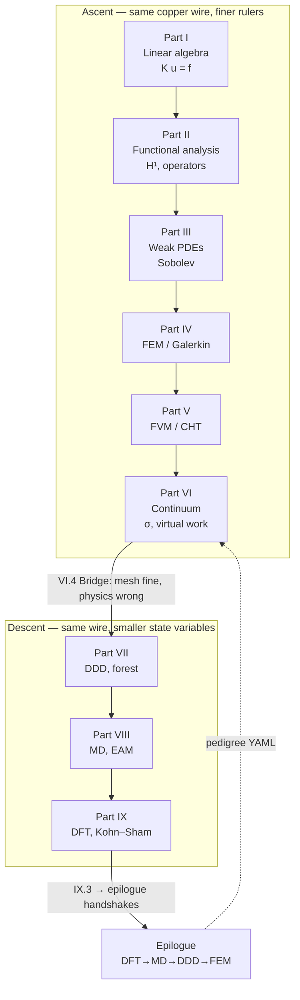

# Writings — source index

Canonical mdBook sources for **Computational Mechanics**. Each subtree follows the Functional Analysis Notes layout: `book.toml`, `chapters/SUMMARY.md`, `00-opening.md`, numbered `01`–`NN` chapter files.

## Continuous reading order

The unified book in [`src/`](../src/SUMMARY.md) reads like one novel: a copper wire in wedge grips is the through-line from linear algebra to DFT. Start at [preface](./preface/chapters/preface.md) (plot spine and four narrative devices — **Scene**, **Bridge**, **Lab act**, **Concept map**), then [prologue](./prologue/chapters/00-many-scales.md), then Parts I–IX in table order, and close with [epilogue](./epilogue/chapters/multiscale.md). Every numbered chapter ends with a **Bridge** explaining why the next chapter exists; part openings mirror the [Functional Analysis Notes](https://hanfengzhai.github.io/file/teaching/notes/ME412_CourseSummary.pdf) discipline (object → structure → theorem → failure mode). When a jump feels abrupt, read the prior chapter's Bridge — that hinge is the intentional stitch between scales.

| Subtree | Book part | Chapters |
|---------|-----------|----------|
| [preface](./preface/chapters/SUMMARY.md) | Preface | preface |
| [prologue](./prologue/chapters/SUMMARY.md) | Prologue | 00 |
| [epilogue](./epilogue/chapters/SUMMARY.md) | Epilogue | multiscale |
| [linear-algebra](./linear-algebra/chapters/SUMMARY.md) | Part I | 00, 01–04 |
| [functional-analysis](./functional-analysis/chapters/SUMMARY.md) | Part II | 00, 01–05 |
| [pde](./pde/chapters/SUMMARY.md) | Part III | 00, 01–04 |
| [fem](./fem/chapters/SUMMARY.md) | Part IV | 00, 01–05 |
| [fvm](./fvm/chapters/SUMMARY.md) | Part V | 00, 01–04 |
| [continuum](./continuum/chapters/SUMMARY.md) | Part VI | 00, 01–04 |
| [defects](./defects/chapters/SUMMARY.md) | Part VII | 00, 01–03 |
| [md](./md/chapters/SUMMARY.md) | Part VIII | 00, 01–03 |
| [dft](./dft/chapters/SUMMARY.md) | Part IX | 00, 01–03 |
| [appendix](./appendix/chapters/SUMMARY.md) | Appendices | glossary, sources, memory-sheet |

Sync into the main book:

```bash
./scripts/sync-writings.sh
mdbook build
```

When the external `Writings` git submodule is linked, replace or merge these subtrees with upstream content and re-run the sync script.

## Multiscale story arc (one table)

The book climbs **up** from discrete algebra to continuum PDEs and FEM/FVM (Parts I–V), then **across** constitutive mechanics (Part VI), then **down** through defects, atoms, and electrons (Parts VII–IX). The copper wire stays the protagonist; only the ruler changes.

| Read order | Scale / question | Method & math | Wire beat (lab time) |
|------------|------------------|---------------|----------------------|
| Preface → Prologue | Why one story? | Plot spine, two clocks (I→IX vs Acts I–VI) | Mount wire; name the six acts |
| **I** | Nodal DOFs | Linear algebra, \(\mathbf{K}\mathbf{u}=\mathbf{f}\), modes | Springs in tension; first load cell reading |
| **II** | Fields in \(H^1, L^2\) | Functional analysis (ME 412 layout) | Mesh refines; energy norms replace dot products |
| **III** | Weak PDEs | Sobolev spaces, energy methods | Corners break strong forms; weak form appears |
| **IV** | Solid mesh | FEM / Galerkin | Assemble stiffness; thermoelastic \(h\)-study |
| **V** | Fluid & CHT | FVM, fluxes, Navier–Stokes | Air cools the wire; Robin \(h\) → resolved convection |
| **VI** | Continuum body | Kinematics, stress, variational elasticity | Joule heat + grip strain; \(J_2\) preview before descent |
| **VII** | Mesoscale defects | DDD, GSF, polycrystal handoff | Forest replaces fitted \(H\); OpenDiS mobility |
| **VIII** | Atoms | MD, ensembles, coarse-graining | NVT shear calibrates rates; phonon lifetimes |
| **IX** | Electrons | DFT, Kohn–Sham, workflows | Quasiharmonic \(\alpha(T_w)\); foundation folder |
| Epilogue | Coupled codes | Handshakes 1–4, pedigree YAML | Same afternoon: DFT → MD → DDD → FEM reunion |
| Appendix | Reference | Glossary, sources, memory sheet | When the plot stutters, use continuity-hinge rows |

**Smooth reading rule:** never skip a chapter **Bridge** — it is the hinge that explains why the next scale (or the next discretization) is forced by the physics, not by the syllabus.

### One diagram (ascent, then descent)

The plot is not a syllabus stack — it is one afternoon on one wire, climbing discretization until Cauchy stress is named, then descending until electron density audits the potential.



Read **Bridge** sections in chapter order — they are the edges the diagram cannot draw: thermocouple beats, load-cell knees, and export tables between codes.

## Functional Analysis Notes layout (Writings.git parity)

Every subtree under `writings/` mirrors the [**Functional Analysis Notes**](https://hanfengzhai.github.io/file/teaching/notes/ME412_CourseSummary.pdf) (ME 412) discipline — not by copying proofs, but by repeating the same **reading contract**:

| Template element | Role in the continuous book |
|------------------|-----------------------------|
| `book.toml` + `chapters/SUMMARY.md` | Standalone mdBook; same numbering as `src/partNN-*` |
| `00-opening.md` | **Scene**, chapter guide, **concept map** (object → structure → theorem → failure mode), representative schematics |
| `01`–`NN` chapters | Mechanics-first prose, **Lab act** workflows, **plot spine (one line)** at chapter open |
| **Bridge** (end of each chapter) | Narrative hinge — why the next chapter or part is forced by the wire, not the syllabus |

Upstream course notes (vendored here until the `Writings` submodule links) supply the baby pictures each part opening indexes:

| Part | Writings subtree | Upstream note (ME 412-style map) | Numbered chapters |
|------|------------------|----------------------------------|-------------------|
| I | [linear-algebra](./linear-algebra/chapters/SUMMARY.md) | [ME 300A Linear Algebra](https://hanfengzhai.github.io/file/ME300A_LinAlg.pdf) · [reading map](./linear-algebra/README.md#me-300a-reading-map-template-for-part-i) | 01–04 |
| II | [functional-analysis](./functional-analysis/chapters/SUMMARY.md) | [ME 412 Functional Analysis](https://hanfengzhai.github.io/file/teaching/notes/ME412_CourseSummary.pdf) · [reading map](./functional-analysis/README.md#me-412-reading-map-template-for-all-writings-subtrees) | 01–05 |
| III | [pde](./pde/chapters/SUMMARY.md) | [ME 300B PDE](https://hanfengzhai.github.io/file/ME300B_PDE.pdf) · [reading map](./pde/README.md#me-300b-reading-map-template-for-part-iii) | 01–04 |
| IV | [fem](./fem/chapters/SUMMARY.md) | [FEA notes](https://hanfengzhai.github.io/file/FEA_notes.pdf) · [reading map](./fem/README.md#fea-reading-map-template-for-part-iv) | 01–05 |
| V | [fvm](./fvm/chapters/SUMMARY.md) | [FVM](https://hanfengzhai.github.io/note/FVM.pdf) · [CFD](https://hanfengzhai.github.io/file/CFD_note.pdf) · [reading map](./fvm/README.md#fvm--cfd-reading-map-template-for-part-v) | 01–04 |
| VI | [continuum](./continuum/chapters/SUMMARY.md) | [Elasticity & inelasticity](https://hanfengzhai.github.io/file/elasticity_notes.pdf) · [reading map](./continuum/README.md#continuum-mechanics-reading-map-template-for-part-vi) | 01–04 |
| VII | [defects](./defects/chapters/SUMMARY.md) | [Defects & disorders](https://hanfengzhai.github.io/file/defects_notes.pdf) · [reading map](./defects/README.md#defects--ddd-reading-map-template-for-part-vii) | 01–03 |
| VIII | [md](./md/chapters/SUMMARY.md) | [Atomistic modeling](https://hanfengzhai.github.io/file/AtomModel_note.pdf) | 01–03 |
| IX | [dft](./dft/chapters/SUMMARY.md) | MSE 5720 coursework / QE workflows (see [IX.0 schematics](./dft/chapters/00-opening.md)) | 01–03 |

**Edit workflow:** change markdown under `writings/<topic>/chapters/`, run `./scripts/sync-writings.sh`, then `mdbook build`. The [multiscale story arc](#multiscale-story-arc-one-table) table above is the one-page plot; the [appendix sources chapter](./appendix/chapters/sources.md#continuity-hinges-index-when-the-plot-stutters) is the full continuity-hinge index when a transition still feels abrupt.
