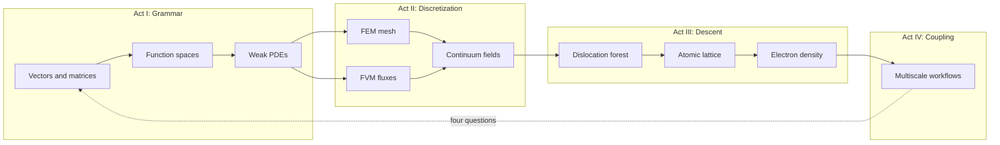
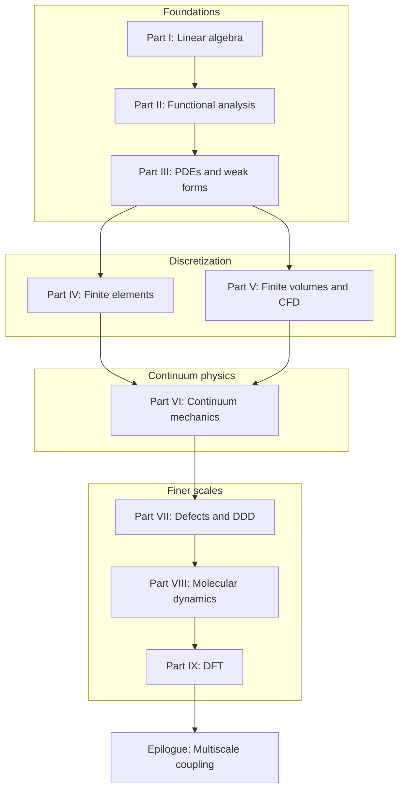

# Preface

This book grew out of a simple observation: computational mechanics is not a collection of unrelated numerical recipes. It is a single narrative about how we represent physical reality at different scales, and how the mathematical tools at each scale connect to the next.

When we write a finite element code, we solve a linear system assembled from local contributions — linear algebra in disguise. When we prove that a Galerkin approximation converges, we invoke completeness and compactness — functional analysis in disguise. When we coarse-grain a molecular dynamics trajectory or feed a DFT energy landscape into a continuum model, we are asking the same question in a different language: *what information survives when we change scale?*

The chapters that follow are written to be read in order, like a novel with a plot. A copper wire under tension, a turbulent jet, a dislocation network in a crystal, and the electrons that bind the atoms together are not separate homework problems. They are scenes in one story. The mathematics is the thread that stitches them together.

## Scene: before the first chapter

Picture a shared materials lab on a weekday morning. A cold-drawn copper wire — the kind used in power cables and tensile specimens — sits in wedge grips on a small frame. The operator has not yet ramped load or switched on current; the load cell reads zero, the thermocouple at mid-span reports room temperature, and a student at the next bench is already opening a terminal for a meshing script. Nothing in the room announces "functional analysis" or "Kohn–Sham." What is visible is simpler: one cylinder of metal, one experiment waiting to run, and the quiet assumption that a computer model somewhere will eventually agree with what the grips and sensors record.

That wire is the book's protagonist. Every part that follows returns to it — as a chain of springs, as a field in \(H^1\), as a meshed solid, as air cooling its surface, as a crystal carrying a dislocation forest, as an atomic lattice, as valence electrons in a periodic cell. The mathematics changes language; the specimen does not. Read this preface as the jacket copy and the prologue as the opening scene. When a chapter feels abstract, ask which bench in this lab you are standing at, and which of the four questions — state, equations, discretization, upward export — that chapter is answering for the same piece of copper.

## Plot spine: how the story is told

Each part follows the **Functional Analysis Notes** (ME 412) layout — numbered chapters, concept maps at openings, checkpoints at closings — but the book adds four narrative devices so the arc reads as one continuous text rather than a syllabus:

| Device | Role | Where it appears |
|--------|------|------------------|
| **Scene** | Return to the copper wire in concrete detail | Preface, prologue, every part opening, every numbered chapter, epilogue |
| **Bridge** | State why the next chapter must exist | End of every numbered chapter and part opening |
| **Lab act** | Worked example, workflow, or checklist tied to computation | Inside chapters (assembly, LAMMPS, OpenDiS, QE inputs) |
| **Concept map** | Object → structure → theorem → failure mode | Part openings; part closing checkpoints |
| **Representative schematics** | Baby pictures indexed to source notes (ME 300A, ME 412, ME 300B, FEA, FVM, …) | Every part opening (I–IX) |

The dramatic arc is not a surprise twist — it is **scale change with the same specimen**:

**Act I** teaches the language (Parts I–III). **Act II** makes PDEs computable on meshes and control volumes (Parts IV–VI). **Act III** asks where continuum parameters hide their history (Parts VII–IX). **Act IV** wires the rungs together (epilogue). When a transition feels abrupt, read the **Bridge** at the end of the prior chapter — it is the narrative hinge the plot spine assumes you will use.

## The story in one page

Read this once if you want the plot before the proofs — every chapter below unpacks one beat of the same afternoon.

A cold-drawn copper wire waits in wedge grips: our protagonist through every scale. We first learn the grammar every simulation shares — vectors, stiffness matrices, eigenmodes — and watch mesh refinement send those objects toward functions and operators. Function spaces supply the room where weak forms live; PDEs write the equilibrium and heat equations those forms discretize. Finite elements mesh the solid; finite volumes balance fluxes in the air that cools the wire when current flows. Continuum mechanics names the stress and strain both discretizations approximate; [VI.4's intermission](part06-continuum/04-nonlinear-plasticity-preview.md#intermission-ascent-ends-descent-begins) admits cold drawing wrote yield history the smooth fields cannot see — the hinge where phenomenology ends and pedigree begins. Dislocation dynamics simulates the forest that hardens the wire; molecular dynamics resolves atoms at notches and fits potentials on trust; density functional theory audits those potentials from electron density. The epilogue wires the rungs into handshakes no single code runs alone — the same four questions at every interface: state, equations, discretization, upward export.

The [prologue](prologue/00-many-scales.md) opens the scene; the [chapter roadmap](appendix/sources.md) lists every beat in reading order; the [epilogue](epilogue/multiscale.md) reunites all six lab acts in workflow time. The [opening continuity hinge](#opening-continuity-hinge) names the turn from panoramic ladder to explicit grammar when the prologue ends; the [ascent preview chain](#ascent-preview-chain) and [descent previews](#descent-preview-chain) below summarize each rung before you commit to every proof; the prologue's [reading compass](prologue/00-many-scales.md#reading-compass-two-clocks-on-one-wire) maps mathematical order against laboratory time when the two clocks diverge. The [ascent continuity hinges](#ascent-continuity-hinges) table names four turns within Parts I–V when linear algebra, analysis, and discretization feel like separate subjects; the [continuity hinges](#continuity-hinges-ascent-descent) table names the two turns at Part VI — mathematical midpoint and narrative intermission — before Part VII descends to defects; the [descent continuity hinges](#descent-continuity-hinges) table names the three turns within Parts VII–IX before the epilogue couples every export; the [epilogue continuity hinges](#epilogue-continuity-hinges) table names the three turns that close the loop from DFT exports back to the prologue's four questions on the next project.

## Opening continuity hinge (prologue → Part I) {#opening-continuity-hinge}

The book opens twice — once as a panoramic ladder in the prologue, once as explicit syntax in Part I. When the scale menu feels overwhelming before a single matrix is assembled, pause at this hinge — same copper wire, first finite-dimensional model.

| Hinge | Location | What turns |
|-------|----------|------------|
| **Panorama → grammar** | [Prologue Bridge](prologue/00-many-scales.md#bridge-to-part-i) → [Part I opening](part01-linear-algebra/00-opening.md#opening-hinge-prologue-to-part-i) | Nine-scale ladder becomes \(\mathbf{K}\mathbf{u}=\mathbf{f}\); four questions get their first numeric answers |

Read the [prologue bridge](prologue/00-many-scales.md#bridge-to-part-i) when you want the plot before proofs — it names every rung in one sitting. Read [Part I's opening hinge](part01-linear-algebra/00-opening.md#opening-hinge-prologue-to-part-i) when the ladder feels like a catalog of methods — the wire is already a spring chain waiting for assembly. The [Row 0 skill checkpoint](#skill-navigation-row-0) below is the competence-time mirror of the [prologue Act I preview row](prologue/00-many-scales.md#what-you-should-be-able-to-do-after-the-prologue) — mounting discipline before current, ramp, or Handshake 1 moduli. The [preface bridge](#bridge) below states the same handoff in prose before you turn to Part I.1.

## Ascent preview chain

Read this once if you want the mathematical climb before every proof — each linked part opening unpacks one rung of the same copper wire.

**[Part I](part01-linear-algebra/00-opening.md)** teaches the grammar every simulation shares: the wire as a chain of springs, \(\mathbf{K}\mathbf{u}=\mathbf{f}\), eigenmodes that decouple vibration, and the limit \(N\to\infty\) that sends nodal values toward fields. **[Part II](part02-functional-analysis/00-opening.md)** names the room those fields live in — \(H^1\), \(L^2\), operators, completeness — and proves Galerkin FEM is projection, not guesswork. **[Part III](part03-pdes/00-opening.md)** writes equilibrium and heat as weak PDEs: strong forms fail at corners; Sobolev spaces and energy principles make the boundary value problems well posed. **[Part IV](part04-fem/00-opening.md)** meshes the solid: weighted residuals, Galerkin assembly, elements and quadrature, convergence in energy norm. **[Part V](part05-fvm/00-opening.md)** balances fluxes in the air that cools the wire — conservation on cells, Riemann problems, Navier–Stokes and conjugate heat transfer. **[Part VI](part06-continuum/00-opening.md)** names Cauchy stress and strain behind both discretizations, marks the [midpoint](part06-continuum/00-opening.md#midpoint-ascent-complete-descent-ahead) where the mathematical climb completes, and closes with [VI.4's intermission](part06-continuum/04-nonlinear-plasticity-preview.md#intermission-ascent-ends-descent-begins) where \(J_2\) placeholders yield to the dislocation forest.

## Ascent continuity hinges (I → VI) {#ascent-continuity-hinges}

Parts I–V climb from finite-dimensional algebra to two discretization philosophies. When a transition feels abrupt mid-climb, pause at one of these four hinges — same copper wire, richer vocabulary at each turn.

| Hinge | Location | What turns |
|-------|----------|------------|
| **Finite → infinite dimensions** | [I.4 Bridge](part01-linear-algebra/04-toward-infinity.md#bridge-to-part-ii) | Mesh refinement sends \(\mathbf{K}_N\) toward an operator; nodal vectors become fields in \(H^1\) and \(L^2\) |
| **Analysis → PDEs** | [II.5 Bridge](part02-functional-analysis/05-spectral-theorem.md#bridge-to-part-iii) | Completeness and spectral theory hand off to weak forms for Poisson, heat, and elasticity |
| **Well-posedness → assembly** | [III.4 Bridge](part03-pdes/04-energy-methods.md#bridge-to-part-iv) | Dirichlet principle and Lax–Milgram become Galerkin assembly on \(V_h\) |
| **Discretization fork → continuum** | [IV.5](part04-fem/05-convergence.md#bridge-two-doors-from-here) / [V.4](part05-fvm/04-navier-stokes-cfd.md#bridge-to-part-vi) | FEM (Door B) and FVM (Door A) converge on Cauchy stress; two languages, one tensor vocabulary in Part VI |

Read the [I.4 hinge](part01-linear-algebra/04-toward-infinity.md#bridge-to-part-ii) when \(\mathbf{K}\mathbf{u}=\mathbf{f}\) feels unrelated to PDEs — refinement already pointed at a function space. Read the [II.5 hinge](part02-functional-analysis/05-spectral-theorem.md#bridge-to-part-iii) when Sobolev norms feel abstract — the weak form is the next line of dialogue for the same wire. Read the [III.4 hinge](part03-pdes/04-energy-methods.md#bridge-to-part-iv) when energy minimization and matrix assembly seem like separate tricks — Rayleigh–Ritz on \(V_h\) is both. Read [IV.5's two doors](part04-fem/05-convergence.md#bridge-two-doors-from-here) when you must choose solids-first versus fluids-first; either path must reach [Part VI](part06-continuum/00-opening.md#midpoint-ascent-complete-descent-ahead) before the descent begins.

The [ascent preview chain](#ascent-preview-chain) names Parts I–VI in one pass; this table names the **four narrative hinges** within that climb — the moments the plot turns from vectors to fields, from fields to weak PDEs, from weak forms to assembled matrices, and from two discretizations to shared continuum mechanics.

## Descent preview chain

Read this once if you want the scale descent before the mesoscopic and finer proofs — each linked part opening unpacks one rung on the way down.

**[Part VII](part07-defects/00-opening.md)** names the forest cold drawing stored: dislocation lines with Burgers vectors, Peach–Köhler forces, mobility laws, and Taylor hardening that export \(\rho\) and \(\tau(\gamma)\) to crystal plasticity FEM — the mechanism behind the \(J_2\) bend Part VI could only fit. **[Part VIII](part08-md/00-opening.md)** replaces line-core cutoffs with vibrating nuclei on interatomic potentials: NVT and NPT ensembles, velocity-Verlet integration, LAMMPS workflows that fit EAM parameters and export cohesive energy, elastic constants, and stacking-fault energy upward on trust — including the **temperature pedigree chain** from [V.4 conjugate heat transfer](part05-fvm/04-navier-stokes-cfd.md#lab-act-extension-two-domain-picard-loop-with-a-1d-fem-solid) (\(T_w\) from the Picard loop) through [VIII.3 WHAM reweighting](part08-md/03-ab-initio-and-coarse-graining.md#wham-part-vii-mobility-hinge-act-ii-temperature-pedigree) to [VII.2 mobility calibration](part07-defects/02-dislocation-dynamics.md#lab-act-calibrate-screw-mobility-from-md-shear-act-iv--mobility-prelude) at the same \(T_w\), not room temperature. **[Part IX](part09-dft/00-opening.md)** audits those potentials from electron density: Born–Oppenheimer separation, Hohenberg–Kohn, Kohn–Sham self-consistency, and Quantum ESPRESSO decks that export \(E_{\text{coh}}\), \(C_{ij}\), and \(\gamma_{\text{sf}}\) with a pedigree traceable to SCF logs — the finest rung on the prologue's ladder. After Part IX, only coupling remains: the [epilogue](epilogue/multiscale.md) reunites every export in workflow time — starting with [Handshake 2](epilogue/multiscale.md#handshake-2--joule-heating--conjugate-heat-transfer-part-iv--v), which reuses the V.4 CHT Lab act iteration table as the template for every downstream temperature export.

Each part opening also carries a one-paragraph preview for readers who pause mid-descent: [mesoscale](part07-defects/00-opening.md#the-descent-in-one-paragraph), [atomistic](part08-md/00-opening.md#the-atomistic-descent-in-one-paragraph), and [electronic floor](part09-dft/00-opening.md#the-electronic-floor-in-one-paragraph).

## Continuity hinges (ascent → descent) {#continuity-hinges-ascent-descent}

The book turns twice at Part VI — once in vocabulary, once in plot. Both hinges keep the same copper wire on the bench; only the state variable and the questions change.

| Hinge | Location | What turns |
|-------|----------|------------|
| **Mathematical midpoint** | [Part VI opening](part06-continuum/00-opening.md#midpoint-ascent-complete-descent-ahead) | FEM/FVM meet Cauchy stress; the climb from linear algebra through discretization is complete |
| **Narrative intermission** | [VI.4](part06-continuum/04-nonlinear-plasticity-preview.md#intermission-ascent-ends-descent-begins) | Smooth fields and \(J_2\) hardening fit the load cell but not its cause; pedigree replaces phenomenology |
| **First mesoscale chapter** | [Part VII opening](part07-defects/00-opening.md) | Burgers geometry and DDD replace scalar \(\alpha\); the descent preview chain begins in earnest |

Read the [midpoint](part06-continuum/00-opening.md#midpoint-ascent-complete-descent-ahead) when Parts I–V feel like separate subjects — Part VI names the stress tensor both discretizations approximate. Read the [intermission](part06-continuum/04-nonlinear-plasticity-preview.md#intermission-ascent-ends-descent-begins) when the return-mapping loop fits \(H\) and \(\sigma_{y0}\) but cannot explain **why** the curve bent. The prologue's [reading compass](prologue/00-many-scales.md#reading-compass-two-clocks-on-one-wire) maps these hinges against laboratory time (Acts III–IV: pull, then harden).

## Descent continuity hinges (VII → epilogue) {#descent-continuity-hinges}

After Part VI's intermission, the book descends in four deliberate turns — same wire, finer state variable, stricter pedigree at every export.

| Hinge | Location | What turns |
|-------|----------|------------|
| **Mesoscale → atomistic** | [VII.3 Bridge](part07-defects/03-polycrystal-and-fem-handoff.md#bridge-to-part-viii) · [VIII.1 opening hinge](part08-md/01-potentials-phase-space.md#opening-hinge-vii3-to-viii1) | Line cores and mobility tables need atomic bonding; DDD cutoff becomes a vibrating RVE |
| **Potentials → ensembles** | [VIII.1 Bridge](part08-md/01-potentials-phase-space.md#bridge) · [VIII.2 opening hinge](part08-md/02-ensembles-integrators.md#opening-hinge-viii1-to-viii2) | EAM minimization at 0 K is not the wire at \(T_w\); phase space must be sampled before mobility or moduli export |
| **Ensembles → coarse-graining** | [VIII.2 Bridge](part08-md/02-ensembles-integrators.md#bridge) · [VIII.3 opening hinge](part08-md/03-ab-initio-and-coarse-graining.md#opening-hinge-viii2-to-viii3) | Audited trajectories must compress into handoff tables with DFT pedigree gates before Part IX |
| **Temperature pedigree at \(T_w\)** | [VIII.0 descent hinge](part08-md/00-opening.md#descent-hinge-cores-mobility-and-tw-pedigree) · [memory sheet row 8](appendix/memory-sheet.md#continuity-hinges-master-map) · [preface row 8 skill checkpoint](preface.md#skill-navigation-row-8) | [`cht_export.yaml`](fixtures/cht_export.yaml) archives \(T_w = 311.48\,\text{K}\); MD mobility, WHAM, and drag tables must not default to 300 K |
| **Atomistic → electronic audit** | [VIII.3 Bridge](part08-md/03-ab-initio-and-coarse-graining.md#bridge-to-part-ix) · [IX.0 electronic audit hinge](part09-dft/00-opening.md#electronic-audit-hinge-descent-pedigree-and-tw-phonon) · [memory sheet row 9](appendix/memory-sheet.md#continuity-hinges-master-map) · [preface row 9 skill checkpoint](preface.md#skill-navigation-row-9) | EAM potentials on trust need SCF audit; [thermal phonon audit at \(T_w\)](part09-dft/00-opening.md#thermal-phonon-audit-at-tw) confirms \(\alpha\) and \(\tau_{\text{ph}}\) are not room-temperature folklore |
| **Electronic audit → Born–Oppenheimer** | [IX.0 Bridge](part09-dft/00-opening.md#bridge) · [IX.1 opening hinge](part09-dft/01-born-oppenheimer.md#opening-hinge-ix0-to-ix1) | SCF logs and phonon audits at \(T_w\) must connect to BO/HK theorems before Kohn–Sham feels like a new course |
| **Born–Oppenheimer → Kohn–Sham** | [IX.1 Bridge](part09-dft/01-born-oppenheimer.md#bridge) · [IX.2 opening hinge](part09-dft/02-kohn-sham.md#opening-hinge-ix1-to-ix2) | BO/HK theorems must connect to the SCF fixed-point loop and Part I eigenvalue feedback before IX.3 workflows feel like a new course |
| **Electronic → coupling** | [IX.3 Bridge](part09-dft/03-dft-workflows.md#bridge-to-the-epilogue) | Finest rung complete; upward homogenization and handshake loops in the epilogue |

Read the [mesoscale hinge](part07-defects/03-polycrystal-and-fem-handoff.md#bridge-to-part-viii) when mobility or \(\gamma_{\text{sf}}\) feel like fitted constants — Peierls stress and core width hide in atomic trajectories, not Taylor hardening alone. Read the [VIII.1 opening hinge](part08-md/01-potentials-phase-space.md#opening-hinge-vii3-to-viii1) when [VII.3's Bridge](part07-defects/03-polycrystal-and-fem-handoff.md#bridge-to-part-viii) named the ink but phase space still feels like a new subject — the same `mobility.yaml` row, now with \(\mathbf{F}_i = -\nabla V\) on a screw-core RVE. Read the [VIII.2 opening hinge](part08-md/02-ensembles-integrators.md#opening-hinge-viii1-to-viii2) when the EAM foundation archive exists but `MD_NVT_shear_PartVIII` has not yet run at \(T_w\) — 0 K minimization is not a room-temperature wire. Read the [VIII.3 opening hinge](part08-md/03-ab-initio-and-coarse-graining.md#opening-hinge-viii2-to-viii3) when NPT moduli and mobility tables exist but no handoff bundle names DFT audit gates — trajectories without pedigree are multiscale folklore. Read the [temperature pedigree hinge](part08-md/00-opening.md#descent-hinge-cores-mobility-and-tw-pedigree) when Act II warmed the wire but mobility folders still cite 300 K — [memory sheet rows 8–9 baby picture](appendix/memory-sheet.md#rows-8-9-baby-picture-tw-temperature-pedigree) draws the \(T_w\) chain from CHT through MD to DFT phonons. Read the [electronic audit hinge](part09-dft/00-opening.md#electronic-audit-hinge-descent-pedigree-and-tw-phonon) when EAM matches bulk moduli but no one cites the DFT input deck or evaluates \(\alpha(T_w)\) beside `cht_export.yaml`. Read the [IX.1 opening hinge](part09-dft/01-born-oppenheimer.md#opening-hinge-ix0-to-ix1) when `cu.relax.out` and `alpha_export.yaml` exist but Born–Oppenheimer and Hohenberg–Kohn still feel like standalone quantum chemistry — SCF pedigree without theorems is audit without grammar. Read the [IX.2 opening hinge](part09-dft/02-kohn-sham.md#opening-hinge-ix1-to-ix2) when BO/HK theorems are understood but the SCF fixed-point loop still feels like standalone quantum chemistry — Murnaghan \(a_0\) without convergence ritual is theorem without implementation. Read the [coupling hinge](part09-dft/03-dft-workflows.md#bridge-to-the-epilogue) when exports exist in separate folders but no workflow connects them — the epilogue's [Closing the arc from Part IX](epilogue/multiscale.md#closing-the-arc-from-part-ix) reunites SCF pedigree with the [thermal phonon audit at \(T_w\)](part09-dft/00-opening.md#thermal-phonon-audit-at-tw) before Handshakes 1–4b run.

The [descent preview chain](#descent-preview-chain) names Parts VII–IX in one pass; this table names the **seven narrative hinges** within that descent — the moments the plot turns from forest statistics to vibrating nuclei, from 0 K potentials to finite-\(T\) ensembles, from trajectories to coarse-grained exports, from \(T_w\) pedigree through MD to DFT phonons, from electron density through BO/HK theorems to the Kohn–Sham SCF cycle, and finally to coupled codes.

## Epilogue continuity hinges (IX → prologue) {#epilogue-continuity-hinges}

The book closes a third loop after ascent and descent: **coupling upward** from the finest rung back to engineering questions — and back to the prologue's four questions on every new project.

| Hinge | Location | What turns |
|-------|----------|------------|
| **Finest rung → workflow** | [IX.3 Bridge](part09-dft/03-dft-workflows.md#bridge-to-the-epilogue) | SCF exports archived; pedigree must compose with MD, DDD, and FEM folders — [memory sheet row 10](appendix/memory-sheet.md#continuity-hinges-master-map); [row 10 skill checkpoint](#skill-navigation-row-10); [prologue row 10 preview](prologue/00-many-scales.md#prologue-preview-row-10) |
| **Joule heat → fixed-grip stress** | [Epilogue Handshake 2](epilogue/multiscale.md#handshake-2--joule-heating--conjugate-heat-transfer-part-iv--v) → [IX.3 α Lab act](part09-dft/03-dft-workflows.md#lab-act-quasiharmonic-alpha-handshake-3-pedigree) → [Handshake 3](epilogue/multiscale.md#handshake-3--thermal-strain--mechanical-stiffness-part-vi--iv) | Handshake 2 (Parts IV–V CHT) sets \(\Delta T\); Handshake 3 (quasiharmonic \(\alpha\) from IX.3) sets thermal strain — the [sensitivity table](epilogue/multiscale.md#sensitivity-which-handshake-matters-most) ranks Handshake 2 first for \(T_w\) and Handshake 3 first for load-cell readings; [sensitivity derivation worksheet](epilogue/multiscale.md#worked-example-sensitivity-ranks); [memory sheet row 13](appendix/memory-sheet.md#continuity-hinges-master-map); [row 13 closing loop](epilogue/multiscale.md#row-13-closing-loop); [prologue row 13 closing stitch](prologue/00-many-scales.md#row-13-closing-stitch); [row 13 skill checkpoint](#skill-navigation-row-13) |
| **DDD rate → lab load cell** | [VII.3 rate handshake](part07-defects/03-polycrystal-and-fem-handoff.md#scale-boundary-handshake-ddd-strain-rate-to-quasi-static-fem) → [Epilogue Handshake 4a](epilogue/multiscale.md#handshake-4--rate-dependent-hardening-and-notch-localization-part-vii--vi--viii) | OpenDiS at \(10^3\,\text{s}^{-1}\) sets \(\tau_{\text{flow}}\); power-law \(m\) extrapolates to lab grip speed — the [sensitivity table](epilogue/multiscale.md#sensitivity-which-handshake-matters-most) ranks Handshake 4a next for Act IV hardening; [sensitivity derivation worksheet](epilogue/multiscale.md#worked-example-sensitivity-ranks) (4a column); [memory sheet row 14](appendix/memory-sheet.md#continuity-hinges-master-map); [row 14 baby picture](appendix/memory-sheet.md#row-14-baby-picture-handshake-4a); [row 14 closing loop](epilogue/multiscale.md#row-14-closing-loop); [prologue row 14 closing stitch](prologue/00-many-scales.md#row-14-closing-stitch); [row 14 skill checkpoint](#skill-navigation-row-14) |
| **FE² notch → Act V localization** | [VII.3 Step 4 FE²](part07-defects/03-polycrystal-and-fem-handoff.md#step-4--when-offline-calibration-fails-fe-at-the-notch) → [Epilogue Handshake 4b](epilogue/multiscale.md#4b--when-continuum-fails-at-the-notch-md-subdomain-act-v--notch) | Scalar hardening from 4a matches bulk flow stress but may under-predict notch-root peak stress by 10–15% — the [sensitivity table](epilogue/multiscale.md#sensitivity-which-handshake-matters-most) activates 4b only with Act V; [sensitivity derivation worksheet](epilogue/multiscale.md#worked-example-sensitivity-ranks) (4b column); [memory sheet row 15](appendix/memory-sheet.md#continuity-hinges-master-map); [row 15 baby picture](appendix/memory-sheet.md#row-15-baby-picture-handshake-4b); [row 15 closing loop](epilogue/multiscale.md#row-15-closing-loop); [prologue row 15 closing stitch](prologue/00-many-scales.md#row-15-closing-stitch); [row 15 three-way audit](#skill-navigation-row-15); [row 15 skill checkpoint](#skill-navigation-row-15); upstream rate from [row 14](#skill-navigation-row-14) |
| **Coupling → laboratory time** | [Epilogue: six-act reunion](epilogue/multiscale.md#lab-act-reunion-six-acts-one-afternoon) | Mathematical order (I→IX) reunites with the six acts the operator actually runs — [memory sheet row 11](appendix/memory-sheet.md#continuity-hinges-master-map); [row 11 skill checkpoint](#skill-navigation-row-11); [prologue row 11 preview](prologue/00-many-scales.md#prologue-preview-row-11); [prologue row 11 closing stitch](prologue/00-many-scales.md#row-11-closing-stitch); [epilogue row 11 closing loop](epilogue/multiscale.md#row-11-closing-loop); Act VI runs **in parallel** with Acts I–V |
| **Act VI orchestration** | [IX.3 Bridge](part09-dft/03-dft-workflows.md#bridge-to-the-epilogue) → [`parse_multiscale_workflow.sh`](../scripts/parse_multiscale_workflow.sh) | Individual handshake exports need orchestrated pedigree — [`multiscale_export.yaml`](../scripts/parse_multiscale_workflow.sh) links Handshakes 1–4b in dependency order; [IX.3 epilogue pedigree table](part09-dft/03-dft-workflows.md#ix3-epilogue-pedigree-table) (orchestrated chain row); [script audit trail All — orchestrated chain row](epilogue/multiscale.md#script-audit-trail-parse-scripts-handshakes); [sensitivity worksheet closing](epilogue/multiscale.md#worked-example-sensitivity-ranks) (row 16 stitch); [memory sheet row 16](appendix/memory-sheet.md#continuity-hinges-master-map); [memory sheet Act VI baby picture](appendix/memory-sheet.md#act-vi-baby-picture-me-412-coupling-ladder); [one-page recap Act VI column](appendix/memory-sheet.md#one-page-copper-wire-recap); [row 16 closing loop](epilogue/multiscale.md#row-16-closing-loop); [prologue row 16 preview](prologue/00-many-scales.md#prologue-preview-row-16); [prologue row 16 closing stitch](prologue/00-many-scales.md#row-16-closing-stitch); [row 16 three-way audit](#skill-navigation-row-16); [row 16 skill checkpoint](#skill-navigation-row-16) |
| **Continuous read-through** | [Continuous read-through guide](appendix/sources.md#continuous-read-through-guide) · [memory sheet row 17](appendix/memory-sheet.md#row-17-baby-picture-continuous-read-through) | Chapters feel choppy despite Bridges — trust Scene/Bridge rhythm; pause only at I.4, VI.4, IX.3; [row 17 skill checkpoint](#skill-navigation-row-17); [prologue row 17 preview](prologue/00-many-scales.md#prologue-preview-row-17); [prologue row 17 closing stitch](prologue/00-many-scales.md#row-17-closing-stitch); [workflow exam full arc row](epilogue/multiscale.md#what-you-should-be-able-to-do-after-the-book); [row 17 closing loop](epilogue/multiscale.md#row-17-closing-loop) |
| **Workflow → next project** | [Epilogue Bridge row 12](epilogue/multiscale.md#row-12-closing-loop) → [Prologue reopening anchor](prologue/00-many-scales.md#prologue-reopening-anchor) | Four questions restart on a new material; the ladder is reusable, not copper-specific — [memory sheet row 12](appendix/memory-sheet.md#continuity-hinges-master-map); [row 12 skill checkpoint](#skill-navigation-row-12); [row 44 book loop closure](#skill-navigation-row-44); [row 45 second-pass reunion](#skill-navigation-row-45); [row 46 Writings canonical reunion](#skill-navigation-row-46); [prologue row 12 preview](prologue/00-many-scales.md#prologue-preview-row-12); [prologue row 12 closing stitch](prologue/00-many-scales.md#row-12-closing-stitch) |

Read the [coupling hinge](part09-dft/03-dft-workflows.md#bridge-to-the-epilogue) when DFT, MD, and FEM outputs live in separate directories with no README at the arrows. Read the [continuous read-through guide](appendix/sources.md#continuous-read-through-guide) when the hinge index feels overwhelming mid-read — [row 17 skill checkpoint](#skill-navigation-row-17), [prologue row 17 preview](prologue/00-many-scales.md#prologue-preview-row-17), and [memory sheet row 17 baby picture](appendix/memory-sheet.md#row-17-baby-picture-continuous-read-through) name the straight-through path before you open rows 8–16 individually. Read the [Handshake 2 → 3 chain](epilogue/multiscale.md#handshake-2--joule-heating--conjugate-heat-transfer-part-iv--v) when the load cell sees thermal compression but the FEM deck still cites handbook \(\alpha\) beside an orphan `pw.x` log — [IX.3's quasiharmonic \(\alpha\) Lab act](part09-dft/03-dft-workflows.md#lab-act-quasiharmonic-alpha-handshake-3-pedigree) is where \(\alpha\) earns the same pedigree as \(C_{ij}\). Read the [VII.3 → Handshake 4a chain](part07-defects/03-polycrystal-and-fem-handoff.md#scale-boundary-handshake-ddd-strain-rate-to-quasi-static-fem) when the hardening knee looks right on a DDD plot but the load cell yield arrives early — direct import at \(10^3\,\text{s}^{-1}\) without extrapolation overpredicts flow stress by 5–35%. Read the [VII.3 Step 4 → Handshake 4b chain](part07-defects/03-polycrystal-and-fem-handoff.md#step-4--when-offline-calibration-fails-fe-at-the-notch) when bulk hardening from 4a looks credible but the optional notch concentrates stress the scalar law cannot capture — [`parse_fe2.sh`](../scripts/parse_fe2.sh) on fixture data reports a 10–15% root-stress uplift FE² resolves that crystal plasticity alone misses. Read the [Act VI orchestration chain](part09-dft/03-dft-workflows.md#bridge-to-the-epilogue) → [`parse_multiscale_workflow.sh`](../scripts/parse_multiscale_workflow.sh) when Handshakes 1–4b exist in separate folders but no orchestrated `multiscale_export.yaml` links them — [row 16 skill checkpoint](#skill-navigation-row-16), the [script audit trail All — orchestrated chain row](epilogue/multiscale.md#script-audit-trail-parse-scripts-handshakes), [prologue reading compass row 16](prologue/00-many-scales.md#reading-compass-two-clocks-on-one-wire), and [memory sheet Act VI baby picture](appendix/memory-sheet.md#act-vi-baby-picture-me-412-coupling-ladder) name the same stitch. Read the [six-act reunion](epilogue/multiscale.md#lab-act-reunion-six-acts-one-afternoon) when you know each part in isolation but cannot name which handshake runs before the grips close tomorrow — [row 11 skill checkpoint](#skill-navigation-row-11), [prologue row 11 preview](prologue/00-many-scales.md#prologue-preview-row-11), and [memory sheet one-page recap Act column](appendix/memory-sheet.md#one-page-copper-wire-recap) map Parts I–IX onto Acts I–VI when workflow order is unclear. Read the [epilogue Bridge row 12 closing loop](epilogue/multiscale.md#row-12-closing-loop) and [prologue reopening anchor](prologue/00-many-scales.md#prologue-reopening-anchor) when the copper arc is complete and a new material needs scale discipline from day one — [row 12 skill checkpoint](#skill-navigation-row-12), [prologue row 12 preview](prologue/00-many-scales.md#prologue-preview-row-12), and [memory sheet row 12 baby picture](appendix/memory-sheet.md#row-12-baby-picture-next-project) close the book loop that [row 0](#skill-navigation-row-0) opened. Return to the [prologue](prologue/00-many-scales.md#reading-compass-two-clocks-on-one-wire) when the specimen changes — the continuity hinges table in the [memory sheet](appendix/memory-sheet.md#continuity-hinges-master-map) collects all seventeen narrative hinges plus the opening and closing loops in one navigation page.

The [story in one page](#the-story-in-one-page) ends at multiscale coupling; this table names the **six narrative hinges** within that closing act — exports become workflows, temperature and expansion become fixed-grip stress, rate extrapolation becomes Act IV hardening, FE² becomes Act V localization, Act VI orchestration becomes `multiscale_export.yaml` ([memory sheet Act VI baby picture](appendix/memory-sheet.md#act-vi-baby-picture-me-412-coupling-ladder); [prologue row 16 preview](prologue/00-many-scales.md#what-you-should-be-able-to-do-after-the-prologue)), laboratory time becomes the compass for the next wire.

## How this book is organized

The structure follows the arc of the author's personal notes — linear algebra and functional analysis as foundations, partial differential equations and weak forms as the bridge to discretization, finite elements and finite volumes as the two great discretization philosophies for solids and fluids, and atomistic and electronic methods as the descent to finer scales. Each part ends with a short bridge section that explains why the next scale is necessary.

Read straight through from the prologue to the epilogue. Parts IV and V can be swapped if you already know FEM and want CFD first; Part VI then unifies the stress–balance language both discretizations approximate. Parts VII–IX are best read after the continuum vocabulary of Part VI, because dislocation, atomistic, and electronic models explain where continuum parameters originate.

## Three reading paths

The book is one continuous story, but not every reader enters at the same rung:

| Path | Start here | Route | Best for |
|------|------------|-------|----------|
| **Full arc** | [Prologue](prologue/00-many-scales.md) | I → II → III → IV → V → VI → VII → VIII → IX → [Epilogue](epilogue/multiscale.md) | First read; builds every concept in order |
| **Analysis first** | Part I, then Part II | Skip to Part III when function spaces feel familiar; return to IV–V for discretization | Students who know FEM but want weak-form foundations |
| **Scale descent** | Part VI after skimming I–III | VI → VII → VIII → IX, then back to IV–V for how continuum codes mesh and flux | Researchers asking where moduli and hardening laws originate |

On every path, read the **Bridge** at the end of the prior chapter when a jump feels abrupt. Part openings add **Story so far** recaps, **concept map** tables (object → structure → theorem → failure mode), **How Part X connects to…** cross-part tables, **skill checkpoint** tables (minimal artifacts on the copper wire), and **representative schematics** indexed to the source notes — all following the [Functional Analysis Notes](https://hanfengzhai.github.io/file/teaching/notes/ME412_CourseSummary.pdf) layout. Part closings add **concept map checkpoints** that summarize what the part exported to the next scale. The **prologue** and **epilogue** add matching **concept map checkpoints** that frame the whole ladder at the bookends. The [skill navigation](#skill-navigation) table below collects every checkpoint in one compass.

## Reading rhythm {#reading-rhythm}

Each chapter uses a deliberate rhythm so the book reads as one continuous story rather than a stack of lecture notes:

| Section | Role | Where it appears |
|---------|------|------------------|
| **Scene** | Places the mathematics in the lab — grips tightening, current switching on, a notch concentrating stress | Preface, prologue, every part opening, every numbered chapter, epilogue, appendix glossary and sources |
| **Lab act** | Links the part to one act of the [six-act lab session](prologue/00-many-scales.md#the-experiment-as-plot) | Part openings I–IX and epilogue reunion |
| **Concept map** | Four questions: object, structure, theorem, failure mode | Part openings; epilogue closing lens |
| **Representative schematics** | Baby pictures indexed to source notes (ME 300A, ME 412, ME 300B, FEA, FVM, …) | Every part opening (I–IX) |
| **Bridge** | States why the next chapter exists — the narrative hinge | End of every numbered chapter, part opening, preface, prologue, epilogue, appendix glossary and sources |
| **Skill checkpoint** | Minimal artifact you can produce on the copper wire before turning the page | Prologue; every part opening (I–IX); epilogue |

When abstraction rises, read in this order: **Lab act** (which experiment am I in?) → **Scene** (what is the operator watching?) → **Concept map** (what structure makes the theorem possible?) → **Representative schematics** (which baby picture matches this chapter?) → **Skill checkpoint** (what can I do on paper or in a terminal?) → **Bridge** (why turn the page?).

## Skill navigation

The book is one continuous story, but mastery is checked at **milestones** — not only at the end. Each milestone lists skills on the copper wire and a **minimal artifact** (a matrix, a plot, a convergence log, a pedigree row) you can produce before moving on. Use this table as a compass when you want practice without rereading every proof:

| Milestone | When to pause | Skill checkpoint |
|-----------|---------------|------------------|
| After the panoramic ladder | Before Part I assembles the first matrix | [Prologue](prologue/00-many-scales.md#what-you-should-be-able-to-do-after-the-prologue) |
| Row 0 — Act I mounting (prologue → Part I) | When the scale ladder feels like a menu before the first matrix | [Row 0 skill checkpoint](#skill-navigation-row-0) |
| After Part I | Before fields replace vectors in Part II | [Part I opening](part01-linear-algebra/00-opening.md#what-you-should-be-able-to-do-after-part-i) |
| After Part II | Before weak PDEs in Part III | [Part II opening](part02-functional-analysis/00-opening.md#what-you-should-be-able-to-do-after-part-ii) |
| After Part III | Before Galerkin assembly in Part IV | [Part III opening](part03-pdes/00-opening.md#what-you-should-be-able-to-do-after-part-iii) |
| After Part IV | Before FVM fluxes or continuum stress | [Part IV opening](part04-fem/00-opening.md#what-you-should-be-able-to-do-after-part-iv) |
| After Part V | Before Cauchy tensors in Part VI | [Part V opening](part05-fvm/00-opening.md#what-you-should-be-able-to-do-after-part-v) |
| After Part VI | Before the mesoscale descent in Part VII | [Part VI opening](part06-continuum/00-opening.md#what-you-should-be-able-to-do-after-part-vi) |
| After Part VII | Before atomic trajectories in Part VIII | [Part VII opening](part07-defects/00-opening.md#what-you-should-be-able-to-do-after-part-vii) |
| After Part VIII | Before Kohn–Sham in Part IX | [Part VIII opening](part08-md/00-opening.md#what-you-should-be-able-to-do-after-part-viii) |
| After Part IX | Before multiscale coupling in the epilogue | [Part IX opening](part09-dft/00-opening.md#what-you-should-be-able-to-do-after-part-ix) |
| Row 8 — \(T_w\) pedigree (Act II → MD/DDD) | When MD mobility, WHAM, or OpenDiS drag folders cite 300 K but [V.4 CHT](part05-fvm/04-navier-stokes-cfd.md#lab-act-extension-two-domain-picard-loop-with-a-1d-fem-solid) converged at \(T_w\) | [Row 8 skill checkpoint](#skill-navigation-row-8) |
| Row 9 — phonon audit at \(T_w\) (MD → DFT) | When EAM matches bulk moduli but `alpha_export.yaml` lacks \(\alpha(T_w)\) beside SCF logs | [Row 9 skill checkpoint](#skill-navigation-row-9) |
| Row 10 — coupling hinge (IX.3 → epilogue) | When foundation exports exist in separate folders but Handshakes 4a/4b split is unclear | [Row 10 skill checkpoint](#skill-navigation-row-10) |
| Row 11 — six-act reunion (I→IX vs Acts I–VI) | When each part makes sense alone but workflow order is unclear | [Row 11 skill checkpoint](#skill-navigation-row-11) |
| Row 12 — next project restart (epilogue → prologue) | When the copper arc is complete but a new material feels like a scale menu again | [Row 12 skill checkpoint](#skill-navigation-row-12) |
| Row 13 — Joule heat → fixed-grip stress | When CHT converges but the FEM deck still cites handbook \(\alpha\) | [Row 13 skill checkpoint](#skill-navigation-row-13) |
| Row 14 — DDD rate → lab load cell | When DDD exports feed the plasticity deck but the hardening knee arrives early | [Row 14 skill checkpoint](#skill-navigation-row-14) |
| Row 15 — FE² notch → Act V localization | When bulk hardening from 4a looks right but the notch root under-predicts peak stress | [Row 15 skill checkpoint](#skill-navigation-row-15) |
| Row 16 — Act VI orchestration → multiscale export | When Handshakes 1–4b exist in separate folders but no single pedigree file links them | [Row 16 skill checkpoint](#skill-navigation-row-16) |
| Row 17 — continuous read-through | When chapters feel choppy despite Bridges — trust Scene/Bridge rhythm; pause only at I.4, VI.4, IX.3 | [Row 17 skill checkpoint](#skill-navigation-row-17) |
| Row 18 — part-opening plot spine | When a part opening feels like a new syllabus — read its plot spine one line aloud | [Row 18 skill checkpoint](#skill-navigation-row-18) |
| Row 19 — numbered-chapter plot spine | When mid-chapter reading stalls despite a Bridge — read this chapter's plot spine one line aloud | [Row 19 skill checkpoint](#skill-navigation-row-19) |
| Row 20 — gate-chapter plot spine | When a mandatory gate (I.4, VI.4, IX.3) stalls the straight read — recite its plot spine one line aloud before the Bridge | [Row 20 skill checkpoint](#skill-navigation-row-20) |
| Row 21 — lab act reunion | When a Lab act feels like standalone homework — read its one-line move aloud and name the lab act | [Row 21 skill checkpoint](#skill-navigation-row-21) |
| Row 22 — Scene reunion | When plot spines and Lab acts read correctly but symbols hide the wire — read the Scene one-line visual aloud and picture the operator | [Row 22 skill checkpoint](#skill-navigation-row-22) |
| Row 23 — Bridge reunion | When Scene, plot spines, and Lab acts all read correctly but chapter transitions feel mechanical — read the prior chapter's Bridge one-line hinge aloud | [Row 23 skill checkpoint](#skill-navigation-row-23) |
| Row 24 — concept map reunion | When narrative, sensory, and transition vocabulary all read correctly but proofs feel like disconnected theorems — answer object / structure / theorem / breaks at the part-opening concept map | [Row 24 skill checkpoint](#skill-navigation-row-24) |
| Row 25 — schematic reunion | When narrative, sensory, transition, and structural vocabulary all read correctly but proofs feel abstract without a visual anchor — locate the matching baby picture from the part-opening representative schematics table | [Row 25 skill checkpoint](#skill-navigation-row-25) |
| After the full arc | Before starting a new project on a different material | [Epilogue](epilogue/multiscale.md#what-you-should-be-able-to-do-after-the-book) |

Each part-opening table breaks skills down **by chapter** (e.g. I.1–I.4, II.1–II.5). The prologue and epilogue tables frame the whole ladder at the bookends — navigation discipline before proofs, workflow exam after coupling. When a chapter feels abstract, skip to the matching row in the part opening and produce the minimal artifact; when the artifact is in hand, return to the **Bridge** at the end of the prior chapter for the narrative hinge.

The [reading compass](prologue/00-many-scales.md#reading-compass-two-clocks-on-one-wire) in the prologue maps **continuity hinges** (when the plot turns); this table maps **skill checkpoints** (when you should be able to do something concrete on the wire). Both tables describe the same afternoon — one in narrative time, one in competence time. [Memory sheet row 0](appendix/memory-sheet.md#continuity-hinges-master-map) is the narrative stitch for the opening hinge; the [Row 0 skill checkpoint](#skill-navigation-row-0) below is the competence-time mirror — sketch \(\mathbf{K}\mathbf{u}=\mathbf{f}\) with fixed DOFs and zero load before Act II warming or Handshake 1 moduli enter the story. [Memory sheet row 8](appendix/memory-sheet.md#continuity-hinges-master-map) is the narrative stitch for the Act II temperature pedigree; the [Row 8 skill checkpoint](#skill-navigation-row-8) below is the competence-time mirror — run [`parse_cht.sh`](../scripts/parse_cht.sh) before any NVT shear, WHAM ladder, or OpenDiS mobility fit, and archive `cht_export.yaml` with an explicit \(T_w\) column. [Memory sheet row 9](appendix/memory-sheet.md#continuity-hinges-master-map) is the narrative stitch for the electronic phonon audit; the [Row 9 skill checkpoint](#skill-navigation-row-9) mirrors it — run [`parse_alpha.sh`](../scripts/parse_alpha.sh) and [`parse_lifetime.sh`](../scripts/parse_lifetime.sh) at converged \(T_w\), not 300 K alone, before Handshakes 3 and 4a inherit thermal exports. [Memory sheet row 10](appendix/memory-sheet.md#continuity-hinges-master-map) is the narrative stitch for the IX.3 → epilogue coupling hinge; the [Row 10 skill checkpoint](#skill-navigation-row-10) mirrors it — map [IX.3's epilogue pedigree table](part09-dft/03-dft-workflows.md#ix3-epilogue-pedigree-table) onto Handshakes 1–4b and name the **4a/4b split** on `hardening.yaml` before rows 13–16 run individually. [Memory sheet row 11](appendix/memory-sheet.md#continuity-hinges-master-map) is the narrative stitch for the six-act reunion; the [Row 11 skill checkpoint](#skill-navigation-row-11) mirrors it — map Parts I–IX onto Acts I–VI in the [epilogue six-act reunion table](epilogue/multiscale.md#lab-act-reunion-six-acts-one-afternoon) and state that Act VI (foundation) runs **in parallel** with Acts I–V, not after Part IX in laboratory time. [Memory sheet row 13](appendix/memory-sheet.md#continuity-hinges-master-map) is the narrative stitch for thermal expansion; the [Row 13 skill checkpoint](#skill-navigation-row-13) below is the competence-time mirror — run [`parse_alpha.sh`](../scripts/parse_alpha.sh) after Handshake 2's CHT loop, then verify the load cell against the [sensitivity derivation worksheet](epilogue/multiscale.md#worked-example-sensitivity-ranks). [Memory sheet row 14](appendix/memory-sheet.md#continuity-hinges-master-map) is the narrative stitch for rate extrapolation; the [Row 14 skill checkpoint](#skill-navigation-row-14) mirrors it for Act IV hardening — run [`parse_rate.sh`](../scripts/parse_rate.sh) on OpenDiS sweeps before the crystal-plasticity deck inherits \(\tau_{\text{lab}}\). [Memory sheet row 15](appendix/memory-sheet.md#continuity-hinges-master-map) is the narrative stitch for notch localization; the [Row 15 skill checkpoint](#skill-navigation-row-15) mirrors it for Act V — run [`parse_fe2.sh`](../scripts/parse_fe2.sh) after completing [row 14](#skill-navigation-row-14), then verify root-stress uplift against the [sensitivity derivation worksheet](epilogue/multiscale.md#worked-example-sensitivity-ranks) (Handshake 4b column). [Memory sheet row 16](appendix/memory-sheet.md#continuity-hinges-master-map) is the **ME 412 coupling ladder** stitch for Act VI; the [Row 16 skill checkpoint](#skill-navigation-row-16) mirrors it — run [`parse_multiscale_workflow.sh`](../scripts/parse_multiscale_workflow.sh) after rows 13–15 are understood individually, then archive `multiscale_export.yaml` beside the Act VI folder. The [prologue row 16 preview](prologue/00-many-scales.md#prologue-preview-row-16) named this orchestration stitch before Part I — the [row 16 When-to-pause opening sentence](#skill-navigation-row-16) below is the competence-time mirror of that preview when narrative time (Act VI foundation) and mathematical order (Part IX → epilogue) diverge on the same afternoon; the [memory sheet Act VI baby picture](appendix/memory-sheet.md#act-vi-baby-picture-me-412-coupling-ladder) draws the foundation → handshake diagram when the [epilogue continuity hinges](#epilogue-continuity-hinges) table above feels abstract; the [epilogue sensitivity worksheet closing](epilogue/multiscale.md#worked-example-sensitivity-ranks) (row 16 orchestration stitch) closes the quantitative audit when Handshakes 1–4b are understood individually but the orchestrated pedigree is still missing. [Memory sheet row 17](appendix/memory-sheet.md#continuity-hinges-master-map) is the **continuous read-through** stitch; the [Row 17 skill checkpoint](#skill-navigation-row-17) mirrors it — read Scene → Bridge straight through and open rows 0–16 only when a gate stalls at I.4, VI.4, or IX.3. The [prologue row 17 preview](prologue/00-many-scales.md#prologue-preview-row-17) named this straight-read habit before Part I — the [row 17 When-to-pause opening sentence](#skill-navigation-row-17) below is the competence-time mirror when the continuity hinges index feels overwhelming mid-read; the [memory sheet row 17 baby picture](appendix/memory-sheet.md#row-17-baby-picture-continuous-read-through) draws the Scene → Bridge rhythm when the [epilogue workflow exam full arc row](epilogue/multiscale.md#what-you-should-be-able-to-do-after-the-book) feels episodic despite individual Bridges. [Memory sheet row 18](appendix/memory-sheet.md#continuity-hinges-master-map) is the **part-opening plot spine** stitch; the [Row 18 skill checkpoint](#skill-navigation-row-18) mirrors it — recite one plot spine sentence at every part opening when row 17 stalls at a part boundary. The [prologue row 18 preview](prologue/00-many-scales.md#prologue-preview-row-18) named this part-recitation habit before Part I — the [row 18 When-to-pause opening sentence](#skill-navigation-row-18) below is the competence-time mirror when landing on a new part feels like opening a new textbook; the [memory sheet row 18 baby picture](appendix/memory-sheet.md#row-18-baby-picture-part-opening-plot-spine) draws the nine one-liners when the [epilogue workflow exam row 18 row](epilogue/multiscale.md#what-you-should-be-able-to-do-after-the-book) feels like separate textbooks at III→IV or VI→VII. [Memory sheet row 19](appendix/memory-sheet.md#continuity-hinges-master-map) is the **numbered-chapter plot spine** stitch; the [Row 19 skill checkpoint](#skill-navigation-row-19) mirrors it — read one plot spine sentence at any numbered chapter when row 18's part one-liners did not restore continuity. The [prologue row 19 preview](prologue/00-many-scales.md#prologue-preview-row-19) named this chapter-recitation habit before Part I — the [row 19 When-to-pause opening sentence](#skill-navigation-row-19) below is the competence-time mirror when mid-chapter abstraction rises faster than the specimen; the [memory sheet row 19 baby picture](appendix/memory-sheet.md#row-19-baby-picture-numbered-chapter-plot-spine) draws the 35 one-liners when the [epilogue workflow exam row 19 row](epilogue/multiscale.md#what-you-should-be-able-to-do-after-the-book) feels like separate chapters mid-part. [Memory sheet row 20](appendix/memory-sheet.md#continuity-hinges-master-map) is the **gate-chapter plot spine** stitch; the [Row 20 skill checkpoint](#skill-navigation-row-20) mirrors it — recite one plot spine sentence at I.4, VI.4, and IX.3 when row 17's straight-through read stalls at a mandatory gate. The [prologue row 20 preview](prologue/00-many-scales.md#prologue-preview-row-20) named this gate-recitation habit before Part I — the [row 20 When-to-pause opening sentence](#skill-navigation-row-20) below is the competence-time mirror when a plot turn feels like a topic change; the [memory sheet row 20 baby picture](appendix/memory-sheet.md#row-20-baby-picture-gate-chapter-plot-spine) draws the three gate one-liners when the [epilogue workflow exam row 20 row](epilogue/multiscale.md#what-you-should-be-able-to-do-after-the-book) feels like separate acts at I.4, VI.4, or IX.3. [Memory sheet row 21](appendix/memory-sheet.md#continuity-hinges-master-map) is the **lab act reunion** stitch; the [Row 21 skill checkpoint](#skill-navigation-row-21) mirrors it — read one-line moves at workflow anchor Lab acts when plot spines restore narrative but code feels like homework. [Memory sheet row 22](appendix/memory-sheet.md#continuity-hinges-master-map) is the **Scene reunion** stitch; the [Row 22 skill checkpoint](#skill-navigation-row-22) mirrors it — read Scene one-line visuals when symbols hide the wire. [Memory sheet row 23](appendix/memory-sheet.md#continuity-hinges-master-map) is the **Bridge reunion** stitch; the [Row 23 skill checkpoint](#skill-navigation-row-23) mirrors it — read Bridge one-line hinges at part boundaries when transitions feel mechanical despite restored vocabulary. [Memory sheet row 24](appendix/memory-sheet.md#continuity-hinges-master-map) is the **Concept map reunion** stitch; the [Row 24 skill checkpoint](#skill-navigation-row-24) mirrors it — answer the ME 412 four questions at part openings when proofs feel like a disconnected stack despite restored narrative vocabulary. [Memory sheet row 25](appendix/memory-sheet.md#continuity-hinges-master-map) is the **Schematic reunion** stitch; the [Row 25 skill checkpoint](#skill-navigation-row-25) mirrors it — locate the matching baby picture from the source notes schematics table when concept maps restore structure but proofs still float without a diagram.

### Row 0 skill checkpoint — Act I mounting (prologue → Part I) {#skill-navigation-row-0}

This checkpoint closes the **prologue panorama → Part I grammar** chain — the opening stitch when the nine-scale ladder feels like a menu before a single matrix is assembled. The [prologue Bridge](prologue/00-many-scales.md#bridge-to-part-i) and [Part I opening hinge](part01-linear-algebra/00-opening.md#opening-hinge-prologue-to-part-i) are the **narrative halves**; [I.1's three-node assembly](part01-linear-algebra/01-vectors-matrices.md#lab-act-three-nodes-one-load-cell-reading-act-i--mounting) and the [epilogue Act I reunion paragraph](epilogue/multiscale.md#lab-act-reunion-six-acts-one-afternoon) are the downstream halves. It pairs [memory sheet row 0](appendix/memory-sheet.md#continuity-hinges-master-map) (narrative hinge) with a concrete artifact (competence hinge). Row 0 is the **ascent anchor** — boundary tags and rigid-body removal export to every later mesh; do not conflate zero-load assembly with Act III's ramp or Handshake 1's DFT moduli.

| Step | Skill on the copper wire | Minimal artifact |
|------|--------------------------|------------------|
| 1 — Ladder sketch | Name the nine rungs in order; say what each exports upward | One-row ladder: algebra → … → DFT |
| 2 — Four questions | Fill state / equations / discretization / export for FEM and MD on the same wire | Completed two-row table from the prologue |
| 3 — Mounting model | Write \(\mathbf{K}\mathbf{u}=\mathbf{f}\) with fixed grip DOFs and zero load | \(3 \times 3\) (or larger) sparse \(\mathbf{K}\); \(\mathbf{f}=\mathbf{0}\); \(\mathbf{u}=\mathbf{0}\) |
| 4 — BC discipline | Explain why boundary tags and rigid-body removal export to every later handshake | Annotated sketch: fixed nodes, removed translation mode — [Part I mounting Lab act](part01-linear-algebra/00-opening.md#lab-act-i--mounting) |

**When to pause.** Read the [prologue Act I preview row](prologue/00-many-scales.md#what-you-should-be-able-to-do-after-the-prologue) and the [reading compass Act I stitch](prologue/00-many-scales.md#reading-compass-two-clocks-on-one-wire) when narrative time (Act I mounting) and mathematical order (prologue → Part I) diverge on the same afternoon. Return to the [opening continuity hinge](#opening-continuity-hinge) when the ladder feels overwhelming — the wire is already a spring chain waiting for assembly. Do not conflate panoramic scale change with the first numeric model — Part I.1 is where the four questions get their first finite-dimensional answers. When row 0 is complete, proceed to [Part I's skill table](part01-linear-algebra/00-opening.md#what-you-should-be-able-to-do-after-part-i) before fields replace vectors in Part II.

### Row 8 skill checkpoint — \(T_w\) pedigree (Act II → MD/DDD) {#skill-navigation-row-8}

This checkpoint closes the **V.4 CHT → VIII.0 descent hinge → VIII.3 WHAM → VII.2 mobility** chain — the descent stitch when Act II warmed the wire but MD mobility folders, WHAM replica ladders, or OpenDiS drag tables still cite 300 K by default. [V.4's Picard loop](part05-fvm/04-navier-stokes-cfd.md#lab-act-extension-two-domain-picard-loop-with-a-1d-fem-solid) and the [VIII.0 descent hinge](part08-md/00-opening.md#descent-hinge-cores-mobility-and-tw-pedigree) are the **upstream halves**; [VIII.3 WHAM at \(T_w\)](part08-md/03-ab-initio-and-coarse-graining.md#wham-part-vii-mobility-hinge-act-ii-temperature-pedigree) and [VII.2 mobility calibration](part07-defects/02-dislocation-dynamics.md#lab-act-calibrate-screw-mobility-from-md-shear-act-iv--mobility-prelude) at \(T_w\) are the downstream halves. It pairs [memory sheet row 8](appendix/memory-sheet.md#continuity-hinges-master-map) (narrative hinge) with a concrete artifact (competence hinge). Row 9 audits the phonon layer beneath this chain — complete row 8 before evaluating \(\alpha(T_w)\) or \(\tau_{\text{ph}}(T_w)\) in Part IX.

| Step | Skill on the copper wire | Minimal artifact |
|------|--------------------------|------------------|
| 1 — Handshake 2 | Run FEM solid ↔ FVM fluid until wall flux matches Joule source | `cht_export.yaml` via [`parse_cht.sh`](../scripts/parse_cht.sh); converged \(T_w = 311.48\,\text{K}\), \(\Delta T = 11.48\,\text{K}\) |
| 2 — NVT shear at \(T_w\) | Calibrate screw mobility from constrained shear at converged wall temperature, not 300 K | `mobility_cu_screw_{T_w}K.yaml` beside `cht_export.yaml` — [VII.2 Lab act](part07-defects/02-dislocation-dynamics.md#lab-act-calibrate-screw-mobility-from-md-shear-act-iv--mobility-prelude) |
| 3 — WHAM reweight | Run parallel tempering with replica node at \(T_w \pm 5\,\text{K}\); reweight with WHAM | `wham_export.yaml` via [`parse_wham.sh`](../scripts/parse_wham.sh) at `--target-t` from `cht_export.yaml` |
| 4 — OpenDiS pedigree | Verify DDD mobility table references \(M(\tau, T_w)\), not room-temperature default | OpenDiS input cites `mobility_cu_screw_{T_w}K.yaml`; cross-slip counts at \(T_w\) archived beside WHAM export |

**When to pause.** Read the [prologue row 8 preview](prologue/00-many-scales.md#what-you-should-be-able-to-do-after-the-prologue) and the [reading compass row 8](prologue/00-many-scales.md#reading-compass-two-clocks-on-one-wire) when narrative time (Act II warming) and mathematical order (Part V → Part VIII) diverge on the same afternoon. Return to [V.4's Picard loop](part05-fvm/04-navier-stokes-cfd.md#lab-act-extension-two-domain-picard-loop-with-a-1d-fem-solid) before opening any NVT shear folder — `cht_export.yaml` is the temperature contract every finer rung inherits. Do not conflate handbook 300 K drag with Joule-heated \(T_w\) — phonon softening shifts Act IV hardening before Part IX audits the phonon curve; the [memory sheet rows 8–9 baby picture](appendix/memory-sheet.md#rows-8-9-baby-picture-tw-temperature-pedigree) draws the chain. When row 8 is complete, proceed to [row 9](#skill-navigation-row-9) before Handshakes 3 and 4a inherit thermal exports in the epilogue.

### Row 9 skill checkpoint — phonon audit at \(T_w\) (MD → DFT) {#skill-navigation-row-9}

This checkpoint closes the **VIII.3 Bridge → IX.0 electronic audit → thermal phonon audit at \(T_w\)** chain — the descent stitch when EAM potentials match bulk moduli on trust but no DFT input deck is cited and \(\alpha\), \(\tau_{\text{ph}}\) still default to 300 K folklore. [VIII.3's Bridge to Part IX](part08-md/03-ab-initio-and-coarse-graining.md#bridge-to-part-ix) and the [IX.0 electronic audit hinge](part09-dft/00-opening.md#electronic-audit-hinge-descent-pedigree-and-tw-phonon) are the **upstream halves**; the [thermal phonon audit table](part09-dft/00-opening.md#thermal-phonon-audit-at-tw) and [epilogue opening hinge from Part IX](epilogue/multiscale.md#opening-hinge-ix3-to-epilogue) are the downstream halves. It pairs [memory sheet row 9](appendix/memory-sheet.md#continuity-hinges-master-map) (narrative hinge) with a concrete artifact (competence hinge). Upstream \(T_w\) must come from [row 8](#skill-navigation-row-8) first — phonon audits inherit the same `cht_export.yaml` column that MD mobility used.

| Step | Skill on the copper wire | Minimal artifact |
|------|--------------------------|------------------|
| 1 — Row 8 complete | Verify `cht_export.yaml` exists with converged \(T_w\) before phonon evaluation | `T_wall_K` field from [`parse_cht.sh`](../scripts/parse_cht.sh) on `cht_wire.conf` |
| 2 — SCF audit | Archive DFT functional, pseudopotential, cutoff, k-mesh beside elastic exports | `foundation_export.yaml` via [`parse_dft_workflow.sh`](../scripts/parse_dft_workflow.sh) on `cu.foundation/` |
| 3 — \(\alpha(T_w)\) | Evaluate quasiharmonic thermal expansion at converged wall temperature | [`parse_alpha.sh`](../scripts/parse_alpha.sh) on `cu.phonon/a_vs_T.dat` with `--target-t` from `cht_export.yaml` → `alpha_export.yaml` with explicit \(T_w\) column |
| 4 — \(\tau_{\text{ph}}(T_w)\) | Interpolate phonon lifetime at \(T_w\) for Handshake 4a drag pedigree | [`parse_lifetime.sh`](../scripts/parse_lifetime.sh) on `cu.phonon/phonon_lifetime_vs_T.dat` at converged \(T_w\) → lifetime row beside `mobility_cu_screw_{T_w}K.yaml` |

**When to pause.** Read the [prologue row 9 preview](prologue/00-many-scales.md#prologue-preview-row-9) and the [reading compass row 9](prologue/00-many-scales.md#reading-compass-two-clocks-on-one-wire) when EAM fits look credible but the foundation folder lacks an explicit **`T_w` column** — illustrative fixtures such as [`fixtures/cu.foundation/`](../fixtures/cu.foundation/README.md) archive SCF metadata and phonon tables at 300 K but omit converged wall temperature until `cht_export.yaml` sits beside the DFT deck. Return to the [IX.0 thermal phonon audit table](part09-dft/00-opening.md#thermal-phonon-audit-at-tw) before trusting Handshake 3 thermal strain or Handshake 4a drag; the epilogue [Act III reunion paragraph](epilogue/multiscale.md#lab-act-reunion-six-acts-one-afternoon) (Handshake 3 \(\alpha\)) and [Act IV reunion paragraph](epilogue/multiscale.md#lab-act-reunion-six-acts-one-afternoon) (Handshake 4a \(\tau_{\text{ph}}\) drag) are the workflow-time mirrors of this checkpoint. Do not conflate \(\alpha(300\,\text{K})\) handbook comparison with \(\alpha(T_w)\) production export — SCF audits moduli; the phonon audit audits thermal eigenstrain at the same \(T_w\) Act II converged. When rows 8–9 are complete, proceed to [row 10](#skill-navigation-row-10) before Handshakes 1–4b feel like separate homework folders.

### Row 10 skill checkpoint — coupling hinge (IX.3 → epilogue) {#skill-navigation-row-10}

This checkpoint closes the **IX.3 Bridge → epilogue coupling hinge** chain — the descent stitch when foundation exports (`foundation_export.yaml`, `cu.elastic/`, `cu.phonon/`, `hardening.yaml`) live in separate folders with no workflow README at the arrows. [IX.3's Bridge to the epilogue](part09-dft/03-dft-workflows.md#bridge-to-the-epilogue) and the [IX.3 epilogue pedigree table](part09-dft/03-dft-workflows.md#ix3-epilogue-pedigree-table) are the **upstream halves**; the [epilogue opening hinge from Part IX](epilogue/multiscale.md#opening-hinge-ix3-to-epilogue) and [coupling hinge paragraph](epilogue/multiscale.md#opening-hinge-ix3-to-epilogue) are the downstream halves. It pairs [memory sheet row 10](appendix/memory-sheet.md#continuity-hinges-master-map) (narrative hinge) with a concrete artifact (competence hinge). Upstream [rows 8–9](#skill-navigation-row-8) must be complete first — phonon audits and \(T_w\) pedigree feed Handshakes 3 and 4a before composition.

| Step | Skill on the copper wire | Minimal artifact |
|------|--------------------------|------------------|
| 1 — Rows 8–9 complete | Verify `cht_export.yaml`, `alpha_export.yaml`, and SCF logs share the same \(T_w\) column | Pedigree row from [row 9](#skill-navigation-row-9) |
| 2 — Pedigree table | Map each IX.3 export to its epilogue handshake (1: moduli, 2: CHT, 3: \(\alpha\), 4a: rate, 4b: GSF/notch) | Completed [IX.3 epilogue pedigree table](part09-dft/03-dft-workflows.md#ix3-epilogue-pedigree-table) sketch |
| 3 — 4a/4b split | Explain why Handshake 4a (bulk \(\tau_{\text{lab}}\) extrapolation) and 4b (FE² notch localization) share `hardening.yaml` but activate under different lab acts | One sentence: "4a for Act IV knee; 4b only when Act V notch activates" |
| 4 — Coupling hinge | Read epilogue Handshakes 1–3 before rows 13–16 run individual parsers | Annotated workflow sketch linking foundation folder → handshake sections |

**When to pause.** Read the [prologue row 10 preview](prologue/00-many-scales.md#prologue-preview-row-10) and the [reading compass row 10](prologue/00-many-scales.md#reading-compass-two-clocks-on-one-wire) when Part IX feels complete but the epilogue's Handshake 4 section mentions both 4a and 4b without a clear split. Return to [IX.3's Bridge](part09-dft/03-dft-workflows.md#bridge-to-the-epilogue) when DFT, MD, and FEM outputs live in separate directories — the [epilogue preview Act IV row](epilogue/multiscale.md#reunion-preview-act-iv) and [preview Act V row](epilogue/multiscale.md#reunion-preview-act-v) are the workflow-time mirrors of the 4a/4b split. Do not conflate foundation archiving (row 10) with orchestrated export (row 16) — row 10 names **what composes**; row 16 runs [`parse_multiscale_workflow.sh`](../scripts/parse_multiscale_workflow.sh). When row 10 is complete, proceed to [row 11](#skill-navigation-row-11) when workflow order is unclear, or to [row 13](#skill-navigation-row-13) for the Handshake 2 → 3 chain or to [Part IX's skill table](part09-dft/00-opening.md#what-you-should-be-able-to-do-after-part-ix) before the epilogue workflow exam.

### Row 11 skill checkpoint — six-act reunion (I→IX vs Acts I–VI) {#skill-navigation-row-11}

This checkpoint closes the **prologue two-clocks → epilogue six-act reunion** chain — the closing stitch when each Part (I–IX) makes sense alone but laboratory workflow order stays unclear. The [prologue experiment-as-plot table](prologue/00-many-scales.md#the-experiment-as-plot) and [reading compass two clocks](prologue/00-many-scales.md#reading-compass-two-clocks-on-one-wire) are the **upstream halves**; the [epilogue six-act reunion table](epilogue/multiscale.md#lab-act-reunion-six-acts-one-afternoon) (expanded reunion with per-act paragraphs) and [one-page copper wire recap](appendix/memory-sheet.md#one-page-copper-wire-recap) are the downstream halves. It pairs [memory sheet row 11](appendix/memory-sheet.md#continuity-hinges-master-map) (narrative hinge) with a concrete artifact (competence hinge). Upstream [row 10](#skill-navigation-row-10) names **what composes** at the IX.3 → epilogue boundary; row 11 names **when each act runs** relative to reading order.

| Step | Skill on the copper wire | Minimal artifact |
|------|--------------------------|------------------|
| 1 — Two clocks | State the difference between mathematical order (I→IX) and laboratory time (Acts I–VI) | One sentence: "reading builds grammar; lab time runs mounting → warming → pulling → hardening → (optional) notch, with foundation in parallel" |
| 2 — Act map | Fill the Parts column for each Act I–VI on the prologue wire | Completed six-row table: Act → lab beat → Parts → handshake (from [prologue experiment-as-plot](prologue/00-many-scales.md#the-experiment-as-plot)) |
| 3 — Parallel Act VI | Explain why Act VI (foundation) runs offline in parallel with Acts I–V, not after Part IX in lab time | Sketch: IX → VIII → VII → IV pedigree arrow beside Acts I–V timeline — [memory sheet Act VI baby picture](appendix/memory-sheet.md#act-vi-baby-picture-me-412-coupling-ladder) |
| 4 — Reunion audit | Locate any chapter on the expanded reunion table and name its handshake | Annotated copy of [epilogue reunion preview](epilogue/multiscale.md#lab-act-reunion-preview) or [expanded reunion](epilogue/multiscale.md#lab-act-reunion-six-acts-one-afternoon) with one Part label per Act |

**When to pause.** Read the [prologue row 11 closing stitch](prologue/00-many-scales.md#row-11-closing-stitch) when each Part makes sense alone but you cannot say which act the operator runs tomorrow — read it first before opening individual handshake sections. Then read the [prologue row 11 preview](prologue/00-many-scales.md#prologue-preview-row-11) and the [reading compass row 11](prologue/00-many-scales.md#reading-compass-two-clocks-on-one-wire) when narrative time (Acts I–VI) and mathematical order (Parts I–IX) diverge on the same afternoon — this checkpoint is the competence-time mirror. Return to the [prologue experiment-as-plot table](prologue/00-many-scales.md#the-experiment-as-plot) when a chapter feels abstract without an Act label; return to the [epilogue expanded reunion](epilogue/multiscale.md#lab-act-reunion-six-acts-one-afternoon) when you know every Part but cannot say which act the operator runs tomorrow. Do not conflate reading order with workflow order — Part IX is last in the book but Act VI (foundation) supplies parameters **before** Acts I–V consume them in real projects. Read the [epilogue row 11 closing loop](epilogue/multiscale.md#row-11-closing-loop) when the competence loop closes. When row 11 is complete, proceed to [row 12](#skill-navigation-row-12) when starting a new material, or to [row 13](#skill-navigation-row-13) for individual handshake chains or to [row 16](#skill-navigation-row-16) for orchestrated export.

### Row 12 skill checkpoint — next project restart (epilogue → prologue) {#skill-navigation-row-12}

This checkpoint closes the **epilogue Bridge → prologue reopening anchor** chain — the closing stitch when the copper wire story is finished but the next project (silicon, steel, polymer composite) feels like a scale menu before a single matrix is assembled. The [epilogue Bridge row 12 closing loop](epilogue/multiscale.md#row-12-closing-loop) and [prologue reopening anchor](prologue/00-many-scales.md#prologue-reopening-anchor) are the **narrative halves**; the [epilogue workflow exam row 12](epilogue/multiscale.md#what-you-should-be-able-to-do-after-the-book) is the downstream half. It pairs [memory sheet row 12](appendix/memory-sheet.md#continuity-hinges-master-map) (narrative hinge) with a concrete artifact (competence hinge). Row 12 reunites with [row 0](#skill-navigation-row-0) on grammar restart — row 12 is the **project restart** after the full arc; row 0 is the **grammar restart** when the ladder feels overwhelming mid-read.

| Step | Skill on the new specimen | Minimal artifact |
|------|---------------------------|------------------|
| 1 — Rung audit | Name which ladder rungs (I–IX) the new project needs — not all nine every time | One-row sketch: algebra → … → finest required rung |
| 2 — Four questions | Fill state / equations / discretization / export for two scales on the new material | Completed two-row table from the [prologue four questions](prologue/00-many-scales.md#the-same-questions-at-every-scale) |
| 3 — Act template | Mark which of Acts I–VI apply (Act V optional; Act VI in parallel) | Annotated [experiment-as-plot](prologue/00-many-scales.md#the-experiment-as-plot) table with new specimen name |
| 4 — Grammar restart | Before mid-book handshakes, confirm mounting discipline via row 0 | Link to [opening continuity hinge](#opening-continuity-hinge) and [Part I mounting Lab act](part01-linear-algebra/00-opening.md#lab-act-i--mounting) |

**When to pause.** Read the [prologue row 12 closing stitch](prologue/00-many-scales.md#row-12-closing-stitch) when the epilogue workflow exam is complete but the next terminal window opens without a scale plan — read it first before copying input decks. Then read the [prologue row 12 preview](prologue/00-many-scales.md#prologue-preview-row-12) and the [reading compass row 12](prologue/00-many-scales.md#reading-compass-two-clocks-on-one-wire). Return to the [prologue reopening anchor](prologue/00-many-scales.md#prologue-reopening-anchor) before copying copper-wire input decks to a new material — the [memory sheet row 12 baby picture](appendix/memory-sheet.md#row-12-baby-picture-next-project) draws the epilogue → prologue loop. Do not conflate material change with method change — the ladder is reusable; only the specimen and which rungs activate differ. Read the [epilogue row 12 closing loop](epilogue/multiscale.md#row-12-closing-loop) when the competence loop closes. When row 12 is complete, proceed to Part I on the new project or return to [row 0](#skill-navigation-row-0) when grammar needs refresh before descent.

### Row 13 skill checkpoint — Joule heat → fixed-grip stress {#skill-navigation-row-13}

This checkpoint closes the **Handshake 2 → IX.3 \(\alpha\) → Handshake 3** chain — the epilogue-only stitch when conjugate heat transfer has converged but fixed-grip stress still cites handbook thermal expansion. [V.4's Picard loop](part05-fvm/04-navier-stokes-cfd.md#lab-act-extension-two-domain-picard-loop-with-a-1d-fem-solid) and [IX.3's quasiharmonic \(\alpha\) Lab act](part09-dft/03-dft-workflows.md#lab-act-quasiharmonic-alpha-handshake-3-pedigree) are the **upstream halves**; [Handshake 3](epilogue/multiscale.md#handshake-3--thermal-strain--mechanical-stiffness-part-vi--iv) and the [six-act reunion Act III paragraph](epilogue/multiscale.md#lab-act-reunion-six-acts-one-afternoon) are the downstream halves. It pairs [memory sheet row 13](appendix/memory-sheet.md#continuity-hinges-master-map) (narrative hinge) with a concrete artifact (competence hinge).

| Step | Skill on the copper wire | Minimal artifact |
|------|--------------------------|------------------|
| 1 — Handshake 2 | Run FEM solid ↔ FVM fluid until wall flux matches Joule source | `cht_export.yaml` via [`parse_cht.sh`](../scripts/parse_cht.sh); converged \(\Delta T = T_w - T_\infty\) |
| 2 — IX.3 \(\alpha\) | Export quasiharmonic \(\alpha(300\,\text{K})\) beside `cu.elastic/` | [`parse_alpha.sh`](../scripts/parse_alpha.sh) on `cu.phonon/a_vs_T.dat` → `alpha_export.yaml`, `alpha_cu_300K.dat` |
| 3 — Handshake 3 | Verify fixed-grip \(\sigma_{\text{th}} = E\alpha\Delta T\) against load-cell reading | Match epilogue [worked load-cell example](epilogue/multiscale.md#handshake-3--thermal-strain--mechanical-stiffness-part-vi--iv) within handbook tolerance |
| 4 — Sensitivity audit | Derive why Handshake 3 ranks first for fixed-grip stress | Complete [sensitivity derivation worksheet](epilogue/multiscale.md#worked-example-sensitivity-ranks) first-order table |

**Row 13 three-way audit (prologue preview ↔ this checkpoint ↔ workflow exam).** Each step below must agree across narrative time (prologue), competence time (this table), and workflow time (epilogue exam):

| Step | Prologue preview ([row 13](prologue/00-many-scales.md#prologue-preview-row-13)) | This checkpoint (above) | Workflow exam ([row 13 row](epilogue/multiscale.md#what-you-should-be-able-to-do-after-the-book)) |
|------|----------------------------------------------------------------------------------|-------------------------|---------------------------------------------------------------------------------------------------|
| 1 | One sentence: "\(\Delta T\) from CHT" — [V.4 Picard loop](part05-fvm/04-navier-stokes-cfd.md#lab-act-extension-two-domain-picard-loop-with-a-1d-fem-solid); [preview Act II row](epilogue/multiscale.md#reunion-preview-act-ii) | Step 1 — Handshake 2 | [`parse_cht.sh`](../scripts/parse_cht.sh) → `cht_export.yaml`; converged \(\Delta T = T_w - T_\infty\) |
| 2 | Name [IX.3 \(\alpha\) Lab act](part09-dft/03-dft-workflows.md#lab-act-quasiharmonic-alpha-handshake-3-pedigree) as upstream half between Handshakes 2 and 3 | Step 2 — IX.3 \(\alpha\) | [`parse_alpha.sh`](../scripts/parse_alpha.sh) on `cu.phonon/a_vs_T.dat` → `alpha_export.yaml` |
| 3 | One sentence: "\(\alpha\Delta T\) from IX.3" — [preview Act III row](epilogue/multiscale.md#reunion-preview-act-iii) | Step 3 — Handshake 3 | Match epilogue [worked load-cell example](epilogue/multiscale.md#handshake-3--thermal-strain--mechanical-stiffness-part-vi--iv) within handbook tolerance |
| 4 | [Sensitivity derivation worksheet opening](epilogue/multiscale.md#worked-example-sensitivity-ranks) (Handshake 2 paragraph when Act II activates; Handshake 3 paragraph when Act III ramps) | Step 4 — Sensitivity audit | Complete [sensitivity derivation worksheet](epilogue/multiscale.md#worked-example-sensitivity-ranks); verify Handshake 3 ranks **first** for fixed-grip stress |

**When to pause.** Read the [prologue row 13 closing stitch](prologue/00-many-scales.md#row-13-closing-stitch) when CHT has converged but handbook \(\alpha\) still sits in the FEM deck — read it first before opening the load-cell example. Then read the [prologue row 13 preview](prologue/00-many-scales.md#prologue-preview-row-13) and the [reading compass row 13](prologue/00-many-scales.md#reading-compass-two-clocks-on-one-wire) when narrative time (Acts II–III) and mathematical order (Parts IV–V → IX → epilogue) diverge on the same afternoon. Return to [V.4's Picard loop](part05-fvm/04-navier-stokes-cfd.md#lab-act-extension-two-domain-picard-loop-with-a-1d-fem-solid) for Handshake 2 before opening the epilogue's [Handshake 3 worked load-cell example](epilogue/multiscale.md#handshake-3--thermal-strain--mechanical-stiffness-part-vi--iv). Do not conflate Handshake 2 (\(\Delta T\)) with Handshake 3 (\(\alpha\Delta T\)) — the [preface epilogue hinge row](#epilogue-continuity-hinges) names the full chain in workflow order; the [Act III reunion paragraph](epilogue/multiscale.md#lab-act-reunion-six-acts-one-afternoon) states the same thermal pre-stress stitch when Act III activates in workflow time. Read the [memory sheet row 13 baby picture](appendix/memory-sheet.md#row-13-baby-picture-handshake-2-3) when the three clocks diverge; read the [epilogue row 13 closing loop](epilogue/multiscale.md#row-13-closing-loop) when the competence loop closes.

### Row 14 skill checkpoint — DDD rate → lab load cell {#skill-navigation-row-14}

This checkpoint closes the **VII.3 rate handshake → Handshake 4a** chain — the epilogue-only stitch when OpenDiS exports a plausible hardening curve but the load cell yield arrives early because DDD ran at \(10^3\,\text{s}^{-1}\) and the lab grip runs at \(10^{-3}\,\text{s}^{-1}\). It pairs [memory sheet row 14](appendix/memory-sheet.md#continuity-hinges-master-map) (narrative hinge) with a concrete artifact (competence hinge).

| Step | Skill on the copper wire | Minimal artifact |
|------|--------------------------|------------------|
| 1 — VII.2 forest | Export \(\tau(\gamma)\) and \(\rho(\gamma)\) from OpenDiS at accessible strain rates | `opendis.restart` + \(\tau\)–\(\gamma\) curve at \(\dot\varepsilon \in \{10^2, 10^3, 10^4\}\,\text{s}^{-1}\) |
| 2 — VII.3 rate fit | Fit power-law sensitivity \(m\) and extrapolate \(\tau_{\text{flow}}\) to lab grip speed | [`parse_rate.sh`](../scripts/parse_rate.sh) on `ddd_tau_vs_rate.dat` → `rate_export.yaml` |
| 3 — Handshake 4a | Verify crystal-plasticity FEM inherits extrapolated \(\tau_{\text{lab}}\), not raw DDD curve | Match epilogue [Handshake 4a worked example](epilogue/multiscale.md#handshake-4--rate-dependent-hardening-and-notch-localization-part-vii--vi--viii) within 5% on yield |
| 4 — Sensitivity audit | Derive why Handshake 4a ranks next for Act IV hardening | Complete [sensitivity derivation worksheet](epilogue/multiscale.md#worked-example-sensitivity-ranks) Handshake 4a column; confirm direct-import overprediction on fixture data |

**Row 14 three-way audit (prologue preview ↔ this checkpoint ↔ workflow exam).** Each step below must agree across narrative time (prologue), competence time (this table), and workflow time (epilogue exam):

| Step | Prologue preview ([row 14](prologue/00-many-scales.md#prologue-preview-row-14)) | This checkpoint (above) | Workflow exam ([row 14 row](epilogue/multiscale.md#what-you-should-be-able-to-do-after-the-book)) |
|------|----------------------------------------------------------------------------------|-------------------------|---------------------------------------------------------------------------------------------------|
| 1 | Sketch OpenDiS forest export at \(\dot\varepsilon \sim 10^3\,\text{s}^{-1}\) — [VII.2 Lab act](part07-defects/02-dislocation-dynamics.md#lab-act-read-the-hardening-bend-from-forest-density-act-iv); [preview Act IV row](epilogue/multiscale.md#reunion-preview-act-iv) | Step 1 — VII.2 forest | `opendis.restart` + \(\tau\)–\(\gamma\) curve at \(\dot\varepsilon \in \{10^2, 10^3, 10^4\}\,\text{s}^{-1}\) |
| 2 | One sentence: "power-law \(m\) bridges DDD timestep and lab grip speed" — [VII.3 rate handshake](part07-defects/03-polycrystal-and-fem-handoff.md#scale-boundary-handshake-ddd-strain-rate-to-quasi-static-fem) | Step 2 — VII.3 rate fit | [`parse_rate.sh`](../scripts/parse_rate.sh) on `ddd_tau_vs_rate.dat` → `rate_export.yaml` |
| 3 | Sketch: \(\tau_{\text{lab}}\) at \(\dot\varepsilon = 10^{-3}\,\text{s}^{-1}\), not raw DDD curve — [Handshake 4a worked example](epilogue/multiscale.md#4a--ddd-strain-rate-to-quasi-static-load-cell-act-iv--hardening) | Step 3 — Handshake 4a | Match epilogue [Handshake 4a worked example](epilogue/multiscale.md#handshake-4--rate-dependent-hardening-and-notch-localization-part-vii--vi--viii) within 5% on yield |
| 4 | [Sensitivity derivation worksheet](epilogue/multiscale.md#worked-example-sensitivity-ranks) (Handshake 4a column when Act IV activates) | Step 4 — Sensitivity audit | Complete [sensitivity derivation worksheet](epilogue/multiscale.md#worked-example-sensitivity-ranks) Handshake 4a column; confirm direct-import overprediction on fixture data |

**When to pause.** Read the [prologue row 14 closing stitch](prologue/00-many-scales.md#row-14-closing-stitch) when OpenDiS exports feed the plasticity deck without rate extrapolation — read it first before opening Handshake 4a. Then read the [prologue row 14 preview](prologue/00-many-scales.md#prologue-preview-row-14) and the [reading compass row 14](prologue/00-many-scales.md#reading-compass-two-clocks-on-one-wire) when narrative time (Act IV) and mathematical order (Part VII → epilogue) diverge on the same afternoon. Return to [VII.3's rate handshake](part07-defects/03-polycrystal-and-fem-handoff.md#scale-boundary-handshake-ddd-strain-rate-to-quasi-static-fem) for the upstream forest export before opening the epilogue's [Handshake 4a worked example](epilogue/multiscale.md#4a--ddd-strain-rate-to-quasi-static-load-cell-act-iv--hardening). Do not conflate DDD timestep strain rate with lab grip speed — the [preface epilogue hinge row](#epilogue-continuity-hinges) names the full chain in workflow order; the [Act IV reunion paragraph](epilogue/multiscale.md#lab-act-reunion-six-acts-one-afternoon) states the same hardening stitch when Act IV activates in workflow time. Read the [memory sheet row 14 baby picture](appendix/memory-sheet.md#row-14-baby-picture-handshake-4a) when the three clocks diverge; read the [epilogue row 14 closing loop](epilogue/multiscale.md#row-14-closing-loop) when the competence loop closes. When Joule heating is active (Act II), evaluate mobility and \(m\) at the converged \(T_w\) from Handshake 2, not at 300 K by default. When Act V activates the optional notch, complete [row 15](#skill-navigation-row-15) after row 14 — bulk \(\tau_{\text{lab}}\) from 4a is necessary but not sufficient for notch-root localization.

### Row 15 skill checkpoint — FE² notch → Act V localization {#skill-navigation-row-15}

This checkpoint closes the **VII.3 Step 4 FE² → Handshake 4b** chain — the epilogue-only stitch when crystal plasticity with scalar hardening from 4a matches bulk flow stress but under-predicts peak von Mises stress at the notch root by 10–15%. [VII.3 Step 4](part07-defects/03-polycrystal-and-fem-handoff.md#step-4--when-offline-calibration-fails-fe-at-the-notch) is the **upstream half**; [Handshake 4b](epilogue/multiscale.md#4b--when-continuum-fails-at-the-notch-md-subdomain-act-v--notch) and the [six-act reunion Act V row](epilogue/multiscale.md#lab-act-reunion-six-acts-one-afternoon) are the downstream halves. It pairs [memory sheet row 15](appendix/memory-sheet.md#continuity-hinges-master-map) (narrative hinge) with a concrete artifact (competence hinge). Upstream rate extrapolation must come from [row 14](#skill-navigation-row-14) first — FE² inherits the same `hardening.yaml` that 4a calibrated.

| Step | Skill on the copper wire | Minimal artifact |
|------|--------------------------|------------------|
| 1 — Row 14 complete | Verify bulk \(\tau_{\text{lab}}\) from rate extrapolation before notch analysis | `rate_export.yaml` from [`parse_rate.sh`](../scripts/parse_rate.sh) |
| 2 — VII.3 Step 4 | Run crystal plasticity and FE² on the same notch mesh ([VII.3 Step 4](part07-defects/03-polycrystal-and-fem-handoff.md#step-4--when-offline-calibration-fails-fe-at-the-notch)) | `fe2_notch_comparison.dat` with bulk and root stress columns |
| 3 — Handshake 4b | Compare FE² root stress to crystal plasticity; decide if offline calibration suffices | [`parse_fe2.sh`](../scripts/parse_fe2.sh) on `fe2_notch_comparison.dat` → `fe2_export.yaml` |
| 4 — Sensitivity audit | Derive why Handshake 4b activates only with Act V | Complete [sensitivity derivation worksheet](epilogue/multiscale.md#worked-example-sensitivity-ranks) Handshake 4b column; confirm 10–15% uplift on fixture data |

**Row 15 three-way audit (prologue preview ↔ this checkpoint ↔ workflow exam).** Each step below must agree across narrative time (prologue), competence time (this table), and workflow time (epilogue exam):

| Step | Prologue preview ([Handshake 4b](prologue/00-many-scales.md#prologue-preview-act-v)) | This checkpoint (above) | Workflow exam ([row 15 row](epilogue/multiscale.md#what-you-should-be-able-to-do-after-the-book)) |
|------|----------------------------------------------------------------------------------|-------------------------|---------------------------------------------------------------------------------------------------|
| 1 | Upstream [row 14](prologue/00-many-scales.md#prologue-preview-row-14) complete — bulk \(\tau_{\text{lab}}\) before notch analysis; [preview Act V row](epilogue/multiscale.md#reunion-preview-act-v) | Step 1 — Row 14 complete | `rate_export.yaml` from [`parse_rate.sh`](../scripts/parse_rate.sh) |
| 2 | Sketch: FE² with DDD-active Gauss points vs crystal plasticity — [VII.3 Step 4 FE²](part07-defects/03-polycrystal-and-fem-handoff.md#step-4--when-offline-calibration-fails-fe-at-the-notch) | Step 2 — VII.3 Step 4 | `fe2_notch_comparison.dat` with bulk and root stress columns |
| 3 | Compare FE² root stress to crystal plasticity — [Handshake 4b worked example](epilogue/multiscale.md#worked-example-fe-at-the-wire-notch-act-v--notch); [preview Act V row](epilogue/multiscale.md#reunion-preview-act-v) | Step 3 — Handshake 4b | [`parse_fe2.sh`](../scripts/parse_fe2.sh) → `fe2_export.yaml`; verify 215 → 238 MPa uplift on fixture data |
| 4 | [Sensitivity derivation worksheet closing](epilogue/multiscale.md#worked-example-sensitivity-ranks) (Handshake 4b column when Act V activates) | Step 4 — Sensitivity audit | Complete [sensitivity derivation worksheet](epilogue/multiscale.md#worked-example-sensitivity-ranks) Handshake 4b column; confirm 10–15% uplift on fixture data |

**When to pause.** Read the [prologue row 15 closing stitch](prologue/00-many-scales.md#row-15-closing-stitch) when bulk hardening from 4a looks credible but the notch root under-predicts peak stress — read it first before opening the FE² deck. Then read the [prologue Handshake 4b preview row](prologue/00-many-scales.md#prologue-preview-act-v) and the [reading compass row for Handshake 4b](prologue/00-many-scales.md#reading-compass-two-clocks-on-one-wire) when narrative time (Act V) and mathematical order (Part VII → epilogue) diverge on the same afternoon. Return to [VII.3 Step 4](part07-defects/03-polycrystal-and-fem-handoff.md#step-4--when-offline-calibration-fails-fe-at-the-notch) for the FE² procedure before opening the epilogue's [FE² worked example](epilogue/multiscale.md#worked-example-fe-at-the-wire-notch-act-v--notch). Do not conflate bulk hardening adequacy with notch-root localization — scalar \(H\) from 4a can match the load-cell knee while missing pile-up physics at \(K_t \approx 3\). Read the [memory sheet row 15 baby picture](appendix/memory-sheet.md#row-15-baby-picture-handshake-4b) when the three clocks diverge; read the [epilogue row 15 closing loop](epilogue/multiscale.md#row-15-closing-loop) when the competence loop closes. When FE² and crystal plasticity agree within 5%, offline calibration from [row 14](#skill-navigation-row-14) suffices and Act V does not require concurrent DDD. When row 15 is complete, proceed to [row 16](#skill-navigation-row-16) when individual handshake exports need orchestrated pedigree.

### Row 16 skill checkpoint — Act VI orchestration → multiscale export {#skill-navigation-row-16}

This checkpoint closes the **IX.3 foundation → [`parse_multiscale_workflow.sh`](../scripts/parse_multiscale_workflow.sh)** chain — the epilogue-only stitch when individual handshake exports exist in separate folders but no orchestrated pedigree links Handshakes 1–4b in dependency order. [IX.3's Bridge to the epilogue](part09-dft/03-dft-workflows.md#bridge-to-the-epilogue) and the [Act VI foundation folder](part09-dft/03-dft-workflows.md#lab-act-quasiharmonic-alpha-handshake-3-pedigree) are the **upstream halves**; the [six-act reunion Act VI paragraph](epilogue/multiscale.md#lab-act-reunion-six-acts-one-afternoon), the [epilogue script audit trail](epilogue/multiscale.md#script-audit-trail-parse-scripts-handshakes) (per-handshake parsers), and [`multiscale_export.yaml`](../scripts/parse_multiscale_workflow.sh) are the downstream halves. It pairs [memory sheet row 16](appendix/memory-sheet.md#continuity-hinges-master-map) (ME 412 coupling ladder narrative hinge) with a concrete artifact (competence hinge). Rows [8](#skill-navigation-row-8)–[9](#skill-navigation-row-9) and [13](#skill-navigation-row-13)–[15](#skill-navigation-row-15) must be understood individually first — row 16 orchestrates them with Handshake 2's \(\Delta T\) feeding Handshake 3 and phonon lifetime at converged \(T_w\) feeding Handshake 4a drag.

| Step | Skill on the copper wire | Minimal artifact |
|------|--------------------------|------------------|
| 1 — Rows 8–9 and 13–15 understood | Name Handshakes 2, 3, 4a, 4b and the \(T_w\) pedigree individually before orchestrating | Completed skill rows 8–9 and 13–15 or equivalent artifacts |
| 2 — Foundation folder | Archive DFT, phonon, DDD, and CHT inputs under `cu.foundation/` | `foundation_export.yaml` via [`parse_dft_workflow.sh`](../scripts/parse_dft_workflow.sh) |
| 3 — Orchestrated chain | Run full multiscale workflow in dependency order | [`parse_multiscale_workflow.sh`](../scripts/parse_multiscale_workflow.sh) on `cu.foundation/` + `cht_wire.conf` → `multiscale_export.yaml`; per-handshake parsers in [epilogue script audit trail](epilogue/multiscale.md#script-audit-trail-parse-scripts-handshakes) |
| 4 — Pedigree audit | Verify Handshake 3 uses \(\Delta T\) from Handshake 2 (not handbook default) and Handshake 4a uses lifetime at \(T_w\) | `multiscale_export.yaml` fields `delta_T_from_handshake_2` and `target_T_K` match converged CHT |

**Row 16 three-way audit (prologue preview ↔ this checkpoint ↔ workflow exam).** Each step below must agree across narrative time (prologue), competence time (this table), and workflow time (epilogue exam):

| Step | Prologue preview ([row 16](prologue/00-many-scales.md#what-you-should-be-able-to-do-after-the-prologue)) | This checkpoint (above) | Workflow exam ([Act VI row](epilogue/multiscale.md#what-you-should-be-able-to-do-after-the-book)) |
|------|-------------------------------------------------------------------------------------------------------------|-------------------------|--------------------------------------------------------------------------------------------------------|
| 1 | Upstream [rows 8–9](#skill-navigation-row-8) and [13–15](#skill-navigation-row-13) named before Part I | Step 1 — individual handshakes understood | Rows 8–9, 13–15 completed in workflow exam table |
| 2 | [IX.3 foundation checklist](part09-dft/03-dft-workflows.md#ix3-foundation-checklist) + [coupling ladder](part09-dft/00-opening.md#the-coupling-ladder-me-412-reunion) | Step 2 — `cu.foundation/` archived | [IX.3 foundation checklist](part09-dft/03-dft-workflows.md#ix3-foundation-checklist) cited in Act VI row |
| 3 | [`parse_multiscale_workflow.sh`](../scripts/parse_multiscale_workflow.sh) sketch → `multiscale_export.yaml` | Step 3 — orchestrated chain | [`parse_multiscale_workflow.sh`](../scripts/parse_multiscale_workflow.sh) in Act VI minimal artifact column |
| 4 | [IX.3 epilogue pedigree table](part09-dft/03-dft-workflows.md#ix3-epilogue-pedigree-table) + [subgraph node audit](appendix/memory-sheet.md#act-vi-subgraph-node-audit) + [per-node anchors](appendix/memory-sheet.md#act-vi-subgraph-node-audit) | Step 4 — `delta_T_from_handshake_2`, `target_T_K` audit | `./scripts/test-fixtures.sh`; [script audit trail](epilogue/multiscale.md#script-audit-trail-parse-scripts-handshakes) closing paragraph; [Act VI minimal artifacts](epilogue/multiscale.md#act-vi-foundation-minimal-artifacts) Step 4 column |

**When to pause.** The [prologue row 16 closing stitch](prologue/00-many-scales.md#row-16-closing-stitch) names this divergence in narrative time — read it first when Act VI foundation runs in parallel with Acts I–V but mathematical order says Part IX → epilogue. Then read the [prologue row 16 preview](prologue/00-many-scales.md#what-you-should-be-able-to-do-after-the-prologue) and the [reading compass row 16](prologue/00-many-scales.md#reading-compass-two-clocks-on-one-wire) when narrative time (Act VI foundation) and mathematical order (Part IX → epilogue) diverge on the same afternoon — this skill checkpoint is the competence-time mirror; the compass row is the narrative-time mirror; the [skill navigation row 16 intro](#skill-navigation) above named the ME 412 coupling ladder stitch before this checkpoint's four steps. Read the [Part IX coupling ladder](part09-dft/00-opening.md#the-coupling-ladder-me-412-reunion) (ME 412 reunion) when the ascent grammar (Parts I–III) and the descent pedigree (Parts VII–IX) feel like separate books — row 16 is where the ME 412 coupling ladder reunites them in workflow time. Return to [IX.3's Bridge](part09-dft/03-dft-workflows.md#bridge-to-the-epilogue) and the [IX.3 epilogue pedigree table](part09-dft/03-dft-workflows.md#ix3-epilogue-pedigree-table) for the foundation checklist before running the orchestrator. Do not archive individual exports without the orchestrated `multiscale_export.yaml` — the [epilogue Act VI foundation table row](epilogue/multiscale.md#lab-act-reunion-six-acts-one-afternoon), [workflow exam Act VI row](epilogue/multiscale.md#what-you-should-be-able-to-do-after-the-book), [Act VI reunion paragraph](epilogue/multiscale.md#lab-act-reunion-six-acts-one-afternoon), [script audit trail](epilogue/multiscale.md#script-audit-trail-parse-scripts-handshakes) closing paragraph (orchestrated chain row), [memory sheet Act VI baby picture closing paragraph](appendix/memory-sheet.md#act-vi-baby-picture-closing), and [one-page recap Act VI column](appendix/memory-sheet.md#one-page-copper-wire-recap) name the same stitch when Act VI activates in workflow time. Read the [memory sheet Act VI baby picture](appendix/memory-sheet.md#act-vi-baby-picture-me-412-coupling-ladder) when the three clocks diverge; read the [epilogue row 16 closing loop](epilogue/multiscale.md#row-16-closing-loop) when the competence loop closes. Verify the chain with `./scripts/test-fixtures.sh` before trusting a new parser version — the same check the [script audit trail](epilogue/multiscale.md#script-audit-trail-parse-scripts-handshakes) closing paragraph cites when auditing `delta_T_from_handshake_2` and `target_T_K`. When row 16 is complete, proceed to [row 17](#skill-navigation-row-17) when a straight read-through still feels choppy, or to [row 12](#skill-navigation-row-12) when the copper arc is finished and the next specimen needs scale discipline from day one.

### Row 17 skill checkpoint — continuous read-through audit {#skill-navigation-row-17}

This checkpoint closes the **Preface → Epilogue straight-read** chain — the meta stitch when individual chapters, Bridges, and skill rows feel correct in isolation but the book still reads like separate courses. The [continuous read-through guide](appendix/sources.md#continuous-read-through-guide) and [memory sheet row 17 baby picture](appendix/memory-sheet.md#row-17-baby-picture-continuous-read-through) are the **navigation halves**; the [chapter roadmap](appendix/sources.md#chapter-roadmap-one-continuous-arc) and [narrative beat map](appendix/sources.md#narrative-beat-map-mathematical-order--lab-act) are the audit halves. Row 17 does not replace rows 0–16 — it names **when to defer** them until a gate stalls the plot.

| Step | Skill on the copper wire | Minimal artifact |
|------|--------------------------|------------------|
| 1 — Plot spine | Read [story in one page](#the-story-in-one-page) and [prologue ladder](prologue/00-many-scales.md) once before Part I | One-sentence plot: grammar → discretize → continuum → descend → couple |
| 2 — Grammar act (I–III) | Read straight; pause only at [I.4 Bridge](part01-linear-algebra/04-toward-infinity.md#bridge-to-part-ii) if vectors feel unrelated to PDEs | Completed ascent gate: fields replace \(\mathbf{u}\) |
| 3 — Discretization act (IV–VI) | Finish Part IV before Part V; mandatory pause at [VI.4 intermission](part06-continuum/04-nonlinear-plasticity-preview.md#intermission-ascent-ends-descent-begins) before Part VII | Midpoint gate: \(J_2\) fits knee; forest named in VII |
| 4 — Descent + coupling (VII–Epilogue) | Read VII→IX in order; pause at [IX.3 Bridge](part09-dft/03-dft-workflows.md#bridge-to-the-epilogue); finish epilogue then [memory sheet](appendix/memory-sheet.md) | Coupling gate: Handshakes 1–4b named; one-sitting recap done |

**Row 17 three-way audit (prologue preview ↔ this checkpoint ↔ workflow exam).**

| Step | Prologue preview ([row 17](prologue/00-many-scales.md#prologue-preview-row-17)) | This checkpoint (above) | Workflow exam ([full arc row](epilogue/multiscale.md#what-you-should-be-able-to-do-after-the-book)) |
|------|--------------------------------------------------------------------------------|-------------------------|------------------------------------------------------------------------------------------------------|
| 1 | [Story in one page](#the-story-in-one-page) + prologue ladder before Part I | Step 1 — plot spine | Can name nine rungs and six acts without opening code |
| 2 | Read I–III straight; detour to [ascent hinges](#ascent-continuity-hinges) only at I.4 | Step 2 — grammar act | Weak form feels like dialogue, not a new subject |
| 3 | Read IV–VI; mandatory [VI.4 intermission](part06-continuum/04-nonlinear-plasticity-preview.md#intermission-ascent-ends-descent-begins) before VII | Step 3 — discretization act | FEM and FVM reunite at Cauchy stress in Part VI |
| 4 | Read VII–IX; [IX.3 Bridge](part09-dft/03-dft-workflows.md#bridge-to-the-epilogue) before epilogue; [memory sheet](appendix/memory-sheet.md) recap | Step 4 — descent + coupling | Epilogue workflow exam complete; plot feels continuous |

**When to pause.** Read the [prologue row 17 closing stitch](prologue/00-many-scales.md#row-17-closing-stitch) first when individual chapters feel correct in isolation but the full arc still reads like separate courses — it names the Scene → Bridge rhythm before you open rows 0–16 individually. Then read the [prologue row 17 preview](prologue/00-many-scales.md#prologue-preview-row-17) and the [reading compass row 17 stitch](prologue/00-many-scales.md#reading-compass-two-clocks-on-one-wire) when the continuity hinges index feels overwhelming mid-read — row 17 is permission to read like a novel first and open skill checkpoints only at the three gates (I.4, VI.4, IX.3). Return to the [continuous read-through guide](appendix/sources.md#continuous-read-through-guide) when a chapter feels choppy despite a Bridge — the break is usually a skipped Scene, not missing mathematics. Do not open rows 8–16 during the first pass unless a gate stalls — temperature pedigree, handshakes, and orchestration land naturally in Parts V–IX and the epilogue. Read the [memory sheet row 17 baby picture](appendix/memory-sheet.md#row-17-baby-picture-continuous-read-through) when straight-through and hinge-detour modes diverge; read the [epilogue row 17 closing loop](epilogue/multiscale.md#row-17-closing-loop) when the competence loop closes. When row 17 is complete, proceed to [row 18](#skill-navigation-row-18) when a part opening feels like a new syllabus, or to [row 12](#skill-navigation-row-12) when starting a new material, or revisit rows 8–16 when running the multiscale workflow on the copper wire.

### Row 18 skill checkpoint — part-opening plot spine audit {#skill-navigation-row-18}

This checkpoint closes the **part-opening plot spine** chain — the meta stitch when each part's Scene, concept map, and schematic table feel correct but the **transition between parts** still reads like separate courses. The [part-opening plot spine index](appendix/sources.md#part-opening-plot-spine-index-row-18) and [memory sheet row 18 baby picture](appendix/memory-sheet.md#row-18-baby-picture-part-opening-plot-spine) are the **navigation halves**; the nine plot spine one-line sections at each [part opening](part01-linear-algebra/00-opening.md#plot-spine-one-line) are the audit halves. Row 18 does not replace row 17 — it names **what each part should sound like** when row 17's straight-through read stalls at a part boundary rather than a chapter gate.

| Step | Skill on the copper wire | Minimal artifact |
|------|--------------------------|------------------|
| 1 — Act I grammar | Read [I.0](part01-linear-algebra/00-opening.md#plot-spine-one-line), [II.0](part02-functional-analysis/00-opening.md#plot-spine-one-line), [III.0](part03-pdes/00-opening.md#plot-spine-one-line) plot spines before Part I.1 | Three sentences: springs → fields → weak PDEs |
| 2 — Act II discretization | Read [IV.0](part04-fem/00-opening.md#plot-spine-one-line), [V.0](part05-fvm/00-opening.md#plot-spine-one-line), [VI.0](part06-continuum/00-opening.md#plot-spine-one-line) plot spines at IV.5 fork | Three sentences: Galerkin → flux → Cauchy stress reunion |
| 3 — Act III descent | Read [VII.0](part07-defects/00-opening.md#plot-spine-one-line), [VIII.0](part08-md/00-opening.md#plot-spine-one-line), [IX.0](part09-dft/00-opening.md#plot-spine-one-line) plot spines before epilogue | Three sentences: forest → atoms → electrons |
| 4 — Full audit | Recite all nine one-liners from [plot spine index](appendix/sources.md#part-opening-plot-spine-index-row-18) without opening code | One breath: grammar (3) → discretize (3) → descend (3) |

**Row 18 three-way audit (prologue preview ↔ this checkpoint ↔ workflow exam).**

| Step | Prologue preview ([row 18](prologue/00-many-scales.md#prologue-preview-row-18)) | This checkpoint (above) | Workflow exam ([full arc row](epilogue/multiscale.md#what-you-should-be-able-to-do-after-the-book)) |
|------|----------------------------------------------------------------------------------|-------------------------|------------------------------------------------------------------------------------------------------|
| 1 | Name Act I rungs from part openings | Step 1 — Act I grammar | Weak forms feel like dialogue across Parts I–III |
| 2 | Name Act II rungs at IV.5 fork | Step 2 — Act II discretization | FEM and FVM reunite at Part VI opening |
| 3 | Name Act III rungs before epilogue | Step 3 — Act III descent | Descent pedigree distinct from ascent grammar |
| 4 | [Plot spine index](appendix/sources.md#part-opening-plot-spine-index-row-18) recitation | Step 4 — full audit | Can narrate nine part roles in one sitting |

**When to pause.** Read the [prologue row 18 closing stitch](prologue/00-many-scales.md#row-18-closing-stitch) first when row 17's straight-through read stalls at a part boundary and the chapter guide feels like a new syllabus — it names the one-line recitation habit before you open rows 0–16. Then read the [prologue row 18 preview](prologue/00-many-scales.md#prologue-preview-row-18) and the [reading compass row 18 stitch](prologue/00-many-scales.md#reading-compass-two-clocks-on-one-wire) when landing on a new part feels like opening a new textbook — row 18 is permission to read one sentence aloud before the chapter guide. Return to the [part-opening plot spine index](appendix/sources.md#part-opening-plot-spine-index-row-18) when row 17's straight-through read stalls at a **part boundary** (e.g., III → IV or VI → VII), not at a chapter gate. Read the [memory sheet row 18 baby picture](appendix/memory-sheet.md#row-18-baby-picture-part-opening-plot-spine) when part openings and chapter roadmaps diverge; read the [epilogue row 18 closing loop](epilogue/multiscale.md#row-18-closing-loop) when the competence loop closes. When row 18 is complete, proceed to [row 19](#skill-navigation-row-19) when mid-chapter abstraction stalls, or to [row 12](#skill-navigation-row-12) when starting a new material, or revisit rows 8–16 when running the multiscale workflow.

### Row 19 skill checkpoint — numbered-chapter plot spine audit {#skill-navigation-row-19}

This checkpoint closes the **numbered-chapter plot spine** chain — the meta stitch when Scene and Bridge both read correctly but the **chapter body** loses the copper wire mid-part. The [numbered-chapter plot spine index](appendix/sources.md#numbered-chapter-plot-spine-index-row-19) and [memory sheet row 19 baby picture](appendix/memory-sheet.md#row-19-baby-picture-numbered-chapter-plot-spine) are the **navigation halves**; the 35 plot spine one-line sections at each numbered chapter opening are the audit halves. Row 19 does not replace row 18 — it names **what each chapter should sound like** when row 17's straight-through read stalls mid-chapter rather than at a part boundary.

| Step | Skill on the copper wire | Minimal artifact |
|------|--------------------------|------------------|
| 1 — Act I grammar | Read [I.1](part01-linear-algebra/01-vectors-matrices.md#plot-spine-one-line) and [III.4](part03-pdes/04-energy-methods.md#plot-spine-one-line) plot spines when ascent feels choppy | Two sentences: springs → Lax–Milgram |
| 2 — Act II discretization | Read [IV.2](part04-fem/02-galerkin-assembly.md#plot-spine-one-line) and [V.4](part05-fvm/04-navier-stokes-cfd.md#plot-spine-one-line) plot spines at the IV/V fork | Two sentences: assembly → \(T_w\) pedigree |
| 3 — Act III descent | Read [VII.2](part07-defects/02-dislocation-dynamics.md#plot-spine-one-line) and [IX.3](part09-dft/03-dft-workflows.md#plot-spine-one-line) plot spines before epilogue | Two sentences: forest → SCF export |
| 4 — Spot audit | When any chapter feels abstract, read only its plot spine one line before the skill table | One sentence from the [chapter roadmap](appendix/sources.md#chapter-roadmap-one-continuous-arc) row |

**Row 19 three-way audit (prologue preview ↔ this checkpoint ↔ workflow exam).**

| Step | Prologue preview ([row 19](prologue/00-many-scales.md#prologue-preview-row-19)) | This checkpoint (above) | Workflow exam ([full arc row](epilogue/multiscale.md#what-you-should-be-able-to-do-after-the-book)) |
|------|--------------------------------------------------------------------------------|-------------------------|------------------------------------------------------------------------------------------------------|
| 1 | Name when to use chapter one-liners vs part one-liners | Step 1 — Act I grammar | Parts I–III feel like one continuous grammar climb |
| 2 | Name IV/V chapter roles at discretization fork | Step 2 — Act II discretization | FEM assembly and CHT share one wire specimen |
| 3 | Name descent chapter roles before epilogue | Step 3 — Act III descent | DDD, MD, and DFT exports cite the same pedigree |
| 4 | [Numbered-chapter plot spine index](appendix/sources.md#numbered-chapter-plot-spine-index-row-19) spot check | Step 4 — spot audit | Any chapter's role narrated in one breath |

**When to pause.** Read the [prologue row 19 closing stitch](prologue/00-many-scales.md#row-19-closing-stitch) first when row 18's part one-liners did not restore continuity and the chapter body loses the copper wire mid-part — it names the one-line recitation habit before you open rows 0–16. Then read the [prologue row 19 preview](prologue/00-many-scales.md#prologue-preview-row-19) and the [reading compass row 19 stitch](prologue/00-many-scales.md#reading-compass-two-clocks-on-one-wire) when mid-chapter abstraction rises faster than the specimen — row 19 is permission to read one sentence aloud before opening a skill checkpoint. Return to the [numbered-chapter plot spine index](appendix/sources.md#numbered-chapter-plot-spine-index-row-19) when row 18's part one-liners did not restore continuity — the break is usually mid-chapter, not at a part boundary. Read the [memory sheet row 19 baby picture](appendix/memory-sheet.md#row-19-baby-picture-numbered-chapter-plot-spine) when chapter roadmaps and chapter bodies diverge; read the [epilogue row 19 closing loop](epilogue/multiscale.md#row-19-closing-loop) when the competence loop closes. When row 19 is complete, proceed to [row 20](#skill-navigation-row-20) when a mandatory gate stalls the straight read, or to [row 12](#skill-navigation-row-12) when starting a new material, or revisit rows 8–16 when running the multiscale workflow.

### Row 20 skill checkpoint — gate-chapter plot spine audit {#skill-navigation-row-20}

This checkpoint closes the **gate-chapter plot spine** chain — the meta stitch when row 17's straight-through read stalls at one of the three mandatory pauses (ascent, midpoint, coupling) and neither part one-liners (row 18) nor chapter one-liners (row 19) alone restore continuity. The [gate-chapter plot spine index](appendix/sources.md#gate-chapter-plot-spine-index-row-20) and [memory sheet row 20 baby picture](appendix/memory-sheet.md#row-20-baby-picture-gate-chapter-plot-spine) are the **navigation halves**; the plot spine one-line sections at [I.4](part01-linear-algebra/04-toward-infinity.md#plot-spine-one-line), [VI.4](part06-continuum/04-nonlinear-plasticity-preview.md#plot-spine-one-line), and [IX.3](part09-dft/03-dft-workflows.md#plot-spine-one-line) plus their Bridge or intermission sections are the audit halves. Row 20 does not replace row 17 — it names **what each gate should sound like** when the plot turns from grammar to analysis, from ascent to descent, or from descent to coupling.

| Step | Skill on the copper wire | Minimal artifact |
|------|--------------------------|------------------|
| 1 — Ascent gate | Read [I.4 plot spine](part01-linear-algebra/04-toward-infinity.md#plot-spine-one-line) aloud, then [I.4 Bridge](part01-linear-algebra/04-toward-infinity.md#bridge-to-part-ii) | One sentence: \(N\to\infty\); nodal values become fields |
| 2 — Midpoint gate | Read [VI.4 plot spine](part06-continuum/04-nonlinear-plasticity-preview.md#plot-spine-one-line) aloud, then [VI.4 intermission](part06-continuum/04-nonlinear-plasticity-preview.md#intermission-ascent-ends-descent-begins) | One sentence: \(J_2\) fits the knee; pedigree begins in VII |
| 3 — Coupling gate | Read [IX.3 plot spine](part09-dft/03-dft-workflows.md#plot-spine-one-line) aloud, then [IX.3 Bridge](part09-dft/03-dft-workflows.md#bridge-to-the-epilogue) | One sentence: SCF exports upward; epilogue composes handshakes |
| 4 — Full audit | Recite all three gate sentences from [gate-chapter plot spine index](appendix/sources.md#gate-chapter-plot-spine-index-row-20) without opening code | One breath: grammar → analysis → knee → pedigree → coupling |

**Row 20 three-way audit (prologue preview ↔ this checkpoint ↔ workflow exam).**

| Step | Prologue preview ([row 20](prologue/00-many-scales.md#prologue-preview-row-20)) | This checkpoint (above) | Workflow exam ([full arc row](epilogue/multiscale.md#what-you-should-be-able-to-do-after-the-book)) |
|------|--------------------------------------------------------------------------------|-------------------------|------------------------------------------------------------------------------------------------------|
| 1 | Name the ascent gate and when row 17 pauses at I.4 | Step 1 — ascent gate | Part I feels like homework; Part II feels like dialogue |
| 2 | Name the midpoint gate and when row 17 pauses at VI.4 | Step 2 — midpoint gate | Descent feels inevitable, not a topic change |
| 3 | Name the coupling gate and when row 17 pauses at IX.3 | Step 3 — coupling gate | Epilogue handshakes inherit DFT pedigree |
| 4 | [Gate-chapter plot spine index](appendix/sources.md#gate-chapter-plot-spine-index-row-20) recitation | Step 4 — full audit | Three gate roles narrated in one breath |

**When to pause.** Read the [prologue row 20 closing stitch](prologue/00-many-scales.md#row-20-closing-stitch) first when row 17's straight-through read stalls at I.4, VI.4, or IX.3 and neither row 18 nor row 19 restored continuity at a plot turn — it names the gate-recitation habit before you open rows 0–16. Then read the [prologue row 20 preview](prologue/00-many-scales.md#prologue-preview-row-20) and the [reading compass row 20 stitch](prologue/00-many-scales.md#reading-compass-two-clocks-on-one-wire) when a mandatory gate feels like a topic change — row 20 is permission to recite one sentence aloud before opening rows 0–16. Return to the [gate-chapter plot spine index](appendix/sources.md#gate-chapter-plot-spine-index-row-20) when row 19's chapter one-liners did not restore continuity at a **plot turn** — the break is usually a skipped gate recitation, not missing mathematics. Read the [memory sheet row 20 baby picture](appendix/memory-sheet.md#row-20-baby-picture-gate-chapter-plot-spine) when the three gates and the chapter roadmap diverge; read the [epilogue row 20 closing loop](epilogue/multiscale.md#row-20-closing-loop) when the competence loop closes. When row 20 is complete, proceed to [row 21](#skill-navigation-row-21) when a Lab act feels like standalone homework, to [row 12](#skill-navigation-row-12) when starting a new material, or revisit rows 8–16 when running the multiscale workflow.

### Row 21 skill checkpoint — lab act reunion audit {#skill-navigation-row-21}

This checkpoint closes the **lab act reunion** chain — the meta stitch when Scene, Bridge, and plot spine one-liners all read correctly but a **Lab act** feels like standalone homework disconnected from the copper wire. The [lab act reunion index](appendix/sources.md#lab-act-reunion-index-row-21) and [memory sheet row 21 baby picture](appendix/memory-sheet.md#row-21-baby-picture-lab-act-reunion) are the **navigation halves**; the workflow anchor Lab acts in Parts I–IX and the epilogue are the audit halves. Row 21 does not replace rows 17–20 — it names **what the operator's hands should do** when narrative smoothness is restored but computational moves feel episodic.

| Step | Skill on the copper wire | Minimal artifact |
|------|--------------------------|------------------|
| 1 — Act I–II | Read [I.1 mounting Lab act](part01-linear-algebra/01-vectors-matrices.md#lab-act-three-nodes-one-load-cell-reading-act-i--mounting) and [V.4 CHT Lab act](part05-fvm/04-navier-stokes-cfd.md#lab-act-extension-two-domain-picard-loop-with-a-1d-fem-solid) one-line moves | Two sentences: zero load cell → converged \(T_w\) |
| 2 — Act III–IV | Read [VI.3 virtual work](part06-continuum/03-variational-elasticity.md#lab-act-virtual-work-equals-load-cell-reading-act-iii--pulling) and [VII.2 forest Lab act](part07-defects/02-dislocation-dynamics.md#lab-act-read-the-hardening-bend-from-forest-density-act-iv) one-line moves | Two sentences: load cell linear → hardening knee |
| 3 — Act V–VI | Read [VII.3 FE² Step 4](part07-defects/03-polycrystal-and-fem-handoff.md#step-4--when-offline-calibration-fails-fe-at-the-notch) and [IX.3 foundation archive](part09-dft/03-dft-workflows.md#lab-act-archive-the-foundation-run-before-the-wire-scale-solve-act-vi--foundation) one-line moves | Two sentences: notch audit → pedigree archive |
| 4 — Full audit | Recite all ten workflow anchors from [lab act reunion index](appendix/sources.md#lab-act-reunion-index-row-21) and name the lab act for each | One breath: mounting → warming → pulling → hardening → notch → foundation |

**Row 21 three-way audit (prologue preview ↔ this checkpoint ↔ workflow exam).**

| Step | Prologue preview ([row 21](prologue/00-many-scales.md#prologue-preview-row-21)) | This checkpoint (above) | Workflow exam ([full arc row](epilogue/multiscale.md#what-you-should-be-able-to-do-after-the-book)) |
|------|--------------------------------------------------------------------------------|-------------------------|------------------------------------------------------------------------------------------------------|
| 1 | Name Act I–II Lab act anchors before opening CHT or MD | Step 1 — Act I–II | Mounting and warming exports exist before descent |
| 2 | Name Act III–IV Lab act anchors before rate extrapolation | Step 2 — Act III–IV | Load cell and hardening knee cite documented exports |
| 3 | Name Act V–VI Lab act anchors before orchestration | Step 3 — Act V–VI | Notch and foundation archives sit beside handshakes |
| 4 | [Lab act reunion index](appendix/sources.md#lab-act-reunion-index-row-21) recitation | Step 4 — full audit | Ten workflow anchors narrated in one breath |

**When to pause.** Read the [prologue row 21 closing stitch](prologue/00-many-scales.md#row-21-closing-stitch) first when Scene, Bridge, and plot spine one-liners all read correctly but a Lab act still feels like a course assignment — it names the one-line move habit before you open code. Then read the [prologue row 21 preview](prologue/00-many-scales.md#prologue-preview-row-21) and the [reading compass row 21 stitch](prologue/00-many-scales.md#reading-compass-two-clocks-on-one-wire) when algebra and laboratory time diverge on the same afternoon. Return to the [lab act reunion index](appendix/sources.md#lab-act-reunion-index-row-21) when you know the mathematics but cannot say which act the operator runs — the break is usually a skipped Lab act anchor, not missing theory. Read the [memory sheet row 21 baby picture](appendix/memory-sheet.md#row-21-baby-picture-lab-act-reunion) when workflow anchors and chapter bodies diverge; read the [epilogue row 21 closing loop](epilogue/multiscale.md#row-21-closing-loop) when the competence loop closes. When row 21 is complete, proceed to [row 22](#skill-navigation-row-22) when symbols hide the specimen, to [row 12](#skill-navigation-row-12) when starting a new material, or revisit rows 8–16 when running the multiscale workflow.

### Row 22 skill checkpoint — Scene reunion audit {#skill-navigation-row-22}

This checkpoint closes the **Scene reunion** chain — the meta stitch when plot spine one-liners and Lab act moves both read correctly but **symbols hide the copper wire** and the operator disappears behind notation. The [Scene reunion index](appendix/sources.md#scene-reunion-index-row-22) and [memory sheet row 22 baby picture](appendix/memory-sheet.md#row-22-baby-picture-scene-reunion) are the **navigation halves**; the part-opening Scene paragraphs and six-act visual anchors are the audit halves. Row 22 does not replace rows 17–21 — it names **what the operator's eyes should see** when narrative and computational vocabulary are restored but the specimen is not visible in the mind's eye.

| Step | Skill on the copper wire | Minimal artifact |
|------|--------------------------|------------------|
| 1 — Grammar Scenes | Read [I.0](../part01-linear-algebra/00-opening.md#scene), [III.0](../part03-pdes/00-opening.md#scene), and [V.0](../part05-fvm/00-opening.md#scene) one-line visuals | Three sentences: spring chain → domain → air outside |
| 2 — Descent Scenes | Read [VII.0](../part07-defects/00-opening.md#scene), [VIII.0](../part08-md/00-opening.md#scene), and [IX.0](../part09-dft/00-opening.md#scene) one-line visuals | Three sentences: forest → atoms → electrons |
| 3 — Six-act visuals | Recite Act I–VI one-line visuals from [Scene reunion index](appendix/sources.md#scene-reunion-index-row-22) | One breath: mounting → warming → pulling → hardening → notch → foundation |
| 4 — Full audit | Open the current chapter's **Scene** section and read its opening sentence aloud before the body | Annotated note: "operator watches ___" beside the chapter title |

**Row 22 three-way audit (prologue preview ↔ this checkpoint ↔ workflow exam).**

| Step | Prologue preview ([row 22](prologue/00-many-scales.md#prologue-preview-row-22)) | This checkpoint (above) | Workflow exam ([full arc row](epilogue/multiscale.md#what-you-should-be-able-to-do-after-the-book)) |
|------|--------------------------------------------------------------------------------|-------------------------|------------------------------------------------------------------------------------------------------|
| 1 | Name grammar Scenes before fields feel abstract | Step 1 — grammar Scenes | Spring chain, domain, and air visuals restored |
| 2 | Name descent Scenes before atomistics feel disconnected | Step 2 — descent Scenes | Forest, atoms, and electrons visuals restored |
| 3 | Six-act visual recitation | Step 3 — six-act visuals | Operator visible at each lab act |
| 4 | [Scene reunion index](appendix/sources.md#scene-reunion-index-row-22) recitation | Step 4 — full audit | Twelve part anchors and six act visuals narrated |

**When to pause.** Read the [prologue row 22 closing stitch](prologue/00-many-scales.md#row-22-closing-stitch) first when plot spines and Lab act one-liners both read correctly but you cannot **picture** the grips, thermocouple, or load cell — it names the Scene-visual habit before you continue the proof. Then read the [prologue row 22 preview](prologue/00-many-scales.md#prologue-preview-row-22) and the [reading compass row 22 stitch](prologue/00-many-scales.md#reading-compass-two-clocks-on-one-wire) when abstraction rises faster than the specimen. Return to the [Scene reunion index](appendix/sources.md#scene-reunion-index-row-22) when you know the plot and the code but the wire is invisible — the break is usually a skipped **Scene** paragraph, not missing theory. Read the [memory sheet row 22 baby picture](appendix/memory-sheet.md#row-22-baby-picture-scene-reunion) when part openings and chapter bodies diverge; read the [epilogue row 22 closing loop](epilogue/multiscale.md#row-22-closing-loop) when the competence loop closes. When row 22 is complete, proceed to [row 23](#skill-navigation-row-23) when chapter transitions feel mechanical despite restored vocabulary, to [row 12](#skill-navigation-row-12) when starting a new material, or revisit rows 8–16 when running the multiscale workflow.

### Row 23 skill checkpoint — Bridge reunion audit {#skill-navigation-row-23}

This checkpoint closes the **Bridge reunion** chain — the meta stitch when Scene, plot spine one-liners, Lab act moves, and Scene visuals all read correctly but **chapter transitions feel mechanical** and the Functional Analysis Notes layout reads like separate courses stitched at the seams. The [Bridge reunion index](appendix/sources.md#bridge-reunion-index-row-23) and [memory sheet row 23 baby picture](appendix/memory-sheet.md#row-23-baby-picture-bridge-reunion) are the **navigation halves**; the part-boundary Bridge sections and every chapter's closing **Bridge** paragraph are the audit halves. Row 23 does not replace rows 17–22 — it names **why the next chapter must exist** when narrative smoothness is restored but the turn still feels like a syllabus bullet.

| Step | Skill on the copper wire | Minimal artifact |
|------|--------------------------|------------------|
| 1 — Ascent hinges | Read [I.4](../part01-linear-algebra/04-toward-infinity.md#bridge-to-part-ii), [II.5](../part02-functional-analysis/05-spectral-theorem.md#bridge-to-part-iii), and [III.4](../part03-pdes/04-energy-methods.md#bridge-to-part-iv) Bridge one-line hinges | Three sentences: fields → weak PDEs → Galerkin |
| 2 — Discretization fork | Read [IV.5](../part04-fem/05-convergence.md#bridge-two-doors-from-here) and [V.4](../part05-fvm/04-navier-stokes-cfd.md#bridge-to-part-vi) Bridge one-line hinges | Two sentences: two doors → \(T_w\) reunion at Part VI |
| 3 — Descent hinges | Read [VI.4](../part06-continuum/04-nonlinear-plasticity-preview.md#bridge-to-part-vii), [VII.3](../part07-defects/03-polycrystal-and-fem-handoff.md#bridge-to-part-viii), and [VIII.3](../part08-md/03-ab-initio-and-coarse-graining.md#bridge-to-part-ix) Bridge one-line hinges | Three sentences: knee → atoms → electrons |
| 4 — Full audit | Recite all twelve part-boundary hinges from [Bridge reunion index](appendix/sources.md#bridge-reunion-index-row-23); at any mid-part stall, read the prior chapter's Bridge opening sentence aloud | One breath: panorama → grammar → discretize → continuum → descend → couple |

**Row 23 three-way audit (prologue preview ↔ this checkpoint ↔ workflow exam).**

| Step | Prologue preview ([row 23](prologue/00-many-scales.md#prologue-preview-row-23)) | This checkpoint (above) | Workflow exam ([full arc row](epilogue/multiscale.md#what-you-should-be-able-to-do-after-the-book)) |
|------|--------------------------------------------------------------------------------|-------------------------|------------------------------------------------------------------------------------------------------|
| 1 | Name ascent Bridge hinges before Part II feels like a new subject | Step 1 — ascent hinges | Parts I–III feel like one continuous grammar climb |
| 2 | Name discretization Bridge hinges at IV/V fork | Step 2 — discretization fork | FEM and FVM reunite at Cauchy stress in Part VI |
| 3 | Name descent Bridge hinges before epilogue | Step 3 — descent hinges | DDD, MD, and DFT handoffs cite the same pedigree |
| 4 | [Bridge reunion index](appendix/sources.md#bridge-reunion-index-row-23) recitation | Step 4 — full audit | Any part boundary's hinge narrated in one breath |

**When to pause.** Read the [prologue row 23 closing stitch](prologue/00-many-scales.md#row-23-closing-stitch) first when Scene, plot spines, Lab acts, and visuals all read correctly but turning the page still feels like opening a new course — it names the Bridge-hinge habit before you continue. Then read the [prologue row 23 preview](prologue/00-many-scales.md#prologue-preview-row-23) and the [reading compass row 23 stitch](prologue/00-many-scales.md#reading-compass-two-clocks-on-one-wire) when the mathematics is correct but the narrative seam is visible. Return to the [Bridge reunion index](appendix/sources.md#bridge-reunion-index-row-23) when rows 17–22 restored vocabulary but transitions still feel mechanical — the break is usually a skipped **Bridge** paragraph, not missing theory. Read the [memory sheet row 23 baby picture](appendix/memory-sheet.md#row-23-baby-picture-bridge-reunion) when chapter bodies and part boundaries diverge; read the [epilogue row 23 closing loop](epilogue/multiscale.md#row-23-closing-loop) when the competence loop closes. When row 23 is complete, proceed to [row 24](#skill-navigation-row-24) when proofs feel like disconnected theorems despite smooth transitions, to [row 12](#skill-navigation-row-12) when starting a new material, or revisit rows 8–16 when running the multiscale workflow.

### Row 24 skill checkpoint — Concept map reunion audit {#skill-navigation-row-24}

This checkpoint closes the **Concept map reunion** chain — the meta stitch when Scene, plot spine one-liners, Lab act moves, Scene visuals, and Bridge hinges all read correctly but **proofs feel like disconnected theorems** and the ME 412 structural spine is invisible. The [Concept map reunion index](appendix/sources.md#concept-map-reunion-index-row-24) and [memory sheet row 24 baby picture](appendix/memory-sheet.md#row-24-baby-picture-concept-map-reunion) are the **navigation halves**; the part-opening concept map tables (object → structure → theorem → failure mode) are the audit halves. Row 24 does not replace rows 17–23 — it names **what structure makes the theorem possible** when narrative smoothness is restored but the proof stack reads like a syllabus.

| Step | Skill on the copper wire | Minimal artifact |
|------|--------------------------|------------------|
| 1 — Grammar maps | Read [I.0](../part01-linear-algebra/00-opening.md#the-concept-map), [II.0](../part02-functional-analysis/00-opening.md#the-concept-map-me-412), and [III.0](../part03-pdes/00-opening.md#the-concept-map) concept maps; recite object and structure rows aloud | Three sentences: \(\mathbf{u}\) → fields → weak PDEs on \(\Omega\) |
| 2 — Discretization maps | Read [IV.0](../part04-fem/00-opening.md#the-concept-map), [V.0](../part05-fvm/00-opening.md#the-concept-map), and [VI.0](../part06-continuum/00-opening.md#the-concept-map) concept maps; name theorem and failure mode for each | Three sentences: Galerkin projection → flux balance → Cauchy stress reunion |
| 3 — Descent maps | Read [VII.0](../part07-defects/00-opening.md#the-concept-map), [VIII.0](../part08-md/00-opening.md#the-concept-map), and [IX.0](../part09-dft/00-opening.md#the-concept-map) concept maps; name what breaks without mesoscale physics | Three sentences: forest hardening → atomic potentials → electron density pedigree |
| 4 — Full audit | Open the current part's **concept map** and fill all four rows for the chapter you are in; compare to [Concept map reunion index](appendix/sources.md#concept-map-reunion-index-row-24) one-line audit | Annotated note: "object ___ → structure ___ → theorem ___ → breaks ___" beside chapter title |

**Row 24 three-way audit (prologue preview ↔ this checkpoint ↔ workflow exam).**

| Step | Prologue preview ([row 24](prologue/00-many-scales.md#prologue-preview-row-24)) | This checkpoint (above) | Workflow exam ([full arc row](epilogue/multiscale.md#what-you-should-be-able-to-do-after-the-book)) |
|------|--------------------------------------------------------------------------------|-------------------------|------------------------------------------------------------------------------------------------------|
| 1 | Name grammar concept maps before proofs feel unmotivated in Parts I–III | Step 1 — grammar maps | Vectors → fields → weak forms chain restored |
| 2 | Name discretization concept maps at IV/V/VI fork | Step 2 — discretization maps | FEM and FVM reunite at tensor vocabulary in Part VI |
| 3 | Name descent concept maps before epilogue coupling | Step 3 — descent maps | DDD, MD, and DFT each cite object and structure |
| 4 | [Concept map reunion index](appendix/sources.md#concept-map-reunion-index-row-24) recitation | Step 4 — full audit | Any part's four questions narrated in one breath |

**When to pause.** Read the [prologue row 24 closing stitch](prologue/00-many-scales.md#row-24-closing-stitch) first when Scene, plot spines, Lab acts, visuals, and Bridges all read correctly but a proof feels unmotivated — it names the concept-map habit before you continue the derivation. Then read the [prologue row 24 preview](prologue/00-many-scales.md#prologue-preview-row-24) and the [reading compass row 24 stitch](prologue/00-many-scales.md#reading-compass-two-clocks-on-one-wire) when the narrative is smooth but the structural spine is invisible. Return to the [Concept map reunion index](appendix/sources.md#concept-map-reunion-index-row-24) when rows 17–23 restored vocabulary but proofs still feel like a disconnected stack — the break is usually a skipped **concept map** table at the part opening, not missing theory. Read the [memory sheet row 24 baby picture](appendix/memory-sheet.md#row-24-baby-picture-concept-map-reunion) when chapter bodies and part openings diverge; read the [epilogue row 24 closing loop](epilogue/multiscale.md#row-24-closing-loop) when the competence loop closes. When row 24 is complete, proceed to [row 25](#skill-navigation-row-25) when structure is restored but proofs still feel abstract without a diagram, to [row 12](#skill-navigation-row-12) when starting a new material, or revisit rows 8–16 when running the multiscale workflow.

### Row 25 skill checkpoint — Schematic reunion audit {#skill-navigation-row-25}

This checkpoint closes the **Schematic reunion** chain — the meta stitch when Scene, plot spine one-liners, Lab act moves, Scene visuals, Bridge hinges, and concept map audits all read correctly but **proofs feel abstract without a visual anchor** and the baby pictures from the source notes are invisible. The [Schematic reunion index](appendix/sources.md#schematic-reunion-index-row-25) and [memory sheet row 25 baby picture](appendix/memory-sheet.md#row-25-baby-picture-schematic-reunion) are the **navigation halves**; the part-opening representative schematics tables (indexed to ME 300A, ME 412, ME 300B, FEA, FVM, …) are the audit halves. Row 25 does not replace rows 17–24 — it names **which baby picture from the course notes makes the proof concrete** when structural vocabulary is restored but the derivation still floats.

| Step | Skill on the copper wire | Minimal artifact |
|------|--------------------------|------------------|
| 1 — Grammar schematics | Open [I.0](../part01-linear-algebra/00-opening.md), [II.0](../part02-functional-analysis/00-opening.md#representative-schematics-me-412), and [III.0](../part03-pdes/00-opening.md) representative schematics; name one schematic row per part | Three sentences: spring chain energy → Schematic 14 master roadmap → weak form on \(\Omega\) |
| 2 — Discretization schematics | Open [IV.0](../part04-fem/00-opening.md), [V.0](../part05-fvm/00-opening.md), and [VI.0](../part06-continuum/00-opening.md) representative schematics; trace Schematic 14 through Galerkin and conservation ladders | Three sentences: Galerkin assembly → flux balance in air → virtual work reunites doors |
| 3 — Descent schematics | Open [VII.0](../part07-defects/00-opening.md), [VIII.0](../part08-md/00-opening.md), and [IX.0](../part09-dft/00-opening.md) representative schematics; name the state variable each baby picture draws | Three sentences: Burgers forest → phase space RVE → Kohn–Sham SCF cycle |
| 4 — Full audit | Locate the schematic row matching the current chapter in the part-opening table; compare to [Schematic reunion index](appendix/sources.md#schematic-reunion-index-row-25) one-line visual | Annotated note: "schematic ___ from ___ notes — wire instance: ___" beside chapter title |

**Row 25 three-way audit (prologue preview ↔ this checkpoint ↔ workflow exam).**

| Step | Prologue preview ([row 25](prologue/00-many-scales.md#prologue-preview-row-25)) | This checkpoint (above) | Workflow exam ([full arc row](epilogue/multiscale.md#what-you-should-be-able-to-do-after-the-book)) |
|------|--------------------------------------------------------------------------------|-------------------------|------------------------------------------------------------------------------------------------------|
| 1 | Name grammar schematics before proofs feel abstract in Parts I–III | Step 1 — grammar schematics | ME 300A → ME 412 → ME 300B baby pictures restored |
| 2 | Name discretization schematics at IV/V/VI fork | Step 2 — discretization schematics | FEA, FVM, and elasticity schematics reunite at Schematic 14 |
| 3 | Name descent schematics before epilogue coupling | Step 3 — descent schematics | Defects, atomistic, and DFT schematics cite the same pedigree |
| 4 | [Schematic reunion index](appendix/sources.md#schematic-reunion-index-row-25) recitation | Step 4 — full audit | Any part's key schematic narrated in one breath |

**When to pause.** Read the [prologue row 25 closing stitch](prologue/00-many-scales.md#row-25-closing-stitch) first when Scene, plot spines, Lab acts, visuals, Bridges, and concept maps all read correctly but a proof still feels abstract — it names the schematic-habit before you continue the derivation. Then read the [prologue row 25 preview](prologue/00-many-scales.md#prologue-preview-row-25) and the [reading compass row 25 stitch](prologue/00-many-scales.md#reading-compass-two-clocks-on-one-wire) when structure is restored but no diagram anchors the chapter. Return to the [Schematic reunion index](appendix/sources.md#schematic-reunion-index-row-25) when rows 17–24 restored vocabulary but proofs still float — the break is usually a skipped **representative schematics** table at the part opening, not missing theory. Read the [memory sheet row 25 baby picture](appendix/memory-sheet.md#row-25-baby-picture-schematic-reunion) when chapter bodies and source-note diagrams diverge; read the [epilogue row 25 closing loop](epilogue/multiscale.md#row-25-closing-loop) when the competence loop closes. When row 25 is complete, proceed to [row 26](#skill-navigation-row-26) when every meta-stitch layer works but the narrative timeline blurs, to [row 12](#skill-navigation-row-12) when starting a new material, or revisit rows 8–16 when running the multiscale workflow.

### Row 26 skill checkpoint — Story so far reunion audit {#skill-navigation-row-26}

This checkpoint closes the **Story so far reunion** chain — the meta stitch when Scene, plot spine one-liners, Lab act moves, Scene visuals, Bridge hinges, concept map audits, and schematic anchors all read correctly but **you cannot place where the copper wire is in the narrative arc** and the chapter feels like a mid-novel flashback. The [Story so far reunion index](appendix/sources.md#story-so-far-reunion-index-row-26) and [memory sheet row 26 baby picture](appendix/memory-sheet.md#row-26-baby-picture-story-so-far-reunion) are the **navigation halves**; the part-opening **Story so far** recap tables are the audit halves. Row 26 does not replace rows 17–25 — it names **where the copper wire is in the story** when every vocabulary layer is restored but the temporal arc is still invisible.

| Step | Skill on the copper wire | Minimal artifact |
|------|--------------------------|------------------|
| 1 — Grammar recap | Read [I.0](../part01-linear-algebra/00-opening.md#story-so-far-prologue), [II.0](../part02-functional-analysis/00-opening.md#story-so-far-prologue--part-i), and [III.0](../part03-pdes/00-opening.md#story-so-far-parts-i-ii) Story so far tables | Three sentences: panorama → springs → fields → weak PDEs |
| 2 — Discretization recap | Read [IV.0](../part04-fem/00-opening.md#story-so-far-parts-i-iii), [V.0](../part05-fvm/00-opening.md#story-so-far-parts-i-iv), and [VI.0](../part06-continuum/00-opening.md#story-so-far-parts-i-v) Story so far tables | Three sentences: mesh → flux → Cauchy stress reunion |
| 3 — Descent recap | Read [VII.0](../part07-defects/00-opening.md#story-so-far-parts-i-vi), [VIII.0](../part08-md/00-opening.md#story-so-far-parts-i-vii), and [IX.0](../part09-dft/00-opening.md#story-so-far-parts-i-viii) Story so far tables | Three sentences: forest → atoms → electrons |
| 4 — Full audit | Open the current part's **Story so far** section; compare to [Story so far reunion index](appendix/sources.md#story-so-far-reunion-index-row-26) one-line temporal summary | Annotated note: "wire was ___ at prior scale; wire becomes ___ in this part" beside chapter title |

**Row 26 three-way audit (prologue preview ↔ this checkpoint ↔ workflow exam).**

| Step | Prologue preview ([row 26](prologue/00-many-scales.md#prologue-preview-row-26)) | This checkpoint (above) | Workflow exam ([full arc row](epilogue/multiscale.md#what-you-should-be-able-to-do-after-the-book)) |
|------|--------------------------------------------------------------------------------|-------------------------|------------------------------------------------------------------------------------------------------|
| 1 | Name grammar Story so far recaps before mid-part confusion in Parts I–III | Step 1 — grammar recap | Prologue → weak PDEs chain restored in one breath |
| 2 | Name discretization Story so far recaps at IV/V/VI fork | Step 2 — discretization recap | Mesh → flux → stress reunion timeline clear |
| 3 | Name descent Story so far recaps before epilogue coupling | Step 3 — descent recap | Forest → atoms → electrons timeline distinct from ascent |
| 4 | [Story so far reunion index](appendix/sources.md#story-so-far-reunion-index-row-26) recitation | Step 4 — full audit | Any part's temporal summary narrated in one breath |

**When to pause.** Read the [prologue row 26 closing stitch](prologue/00-many-scales.md#row-26-closing-stitch) first when rows 17–25 all read correctly in isolation but the chapter feels like a flashback without context — it names the Story so far habit before you continue. Then read the [prologue row 26 preview](prologue/00-many-scales.md#prologue-preview-row-26) and the [reading compass row 26 stitch](prologue/00-many-scales.md#reading-compass-two-clocks-on-one-wire) when every meta-stitch layer works but the copper wire's place in the arc is unclear. Return to the [Story so far reunion index](appendix/sources.md#story-so-far-reunion-index-row-26) when rows 17–25 restored every vocabulary layer but the **timeline** still blurs — the break is usually a skipped **Story so far** table at the part opening, not missing theory. Read the [memory sheet row 26 baby picture](appendix/memory-sheet.md#row-26-baby-picture-story-so-far-reunion) when chapter bodies and narrative recaps diverge; read the [epilogue row 26 closing loop](epilogue/multiscale.md#row-26-closing-loop) when the competence loop closes. When row 26 is complete, proceed to [row 27](#skill-navigation-row-27) when prior-part symbols do not map to current-part vocabulary, to [row 12](#skill-navigation-row-12) when starting a new material, or revisit rows 8–16 when running the multiscale workflow.

### Row 27 skill checkpoint — Closing the arc reunion audit {#skill-navigation-row-27}

This checkpoint closes the **Closing the arc reunion** chain — the meta stitch when Scene, plot spine one-liners, Lab act moves, Scene visuals, Bridge hinges, concept map audits, schematic anchors, and Story so far recaps all read correctly but **prior-part symbols do not translate to current-part vocabulary** and the chapter feels like a subject change rather than a generalization. The [Closing the arc reunion index](appendix/sources.md#closing-the-arc-reunion-index-row-27) and [memory sheet row 27 baby picture](appendix/memory-sheet.md#row-27-baby-picture-closing-the-arc-reunion) are the **navigation halves**; the part-opening **Closing the arc** translation tables are the audit halves. Row 27 does not replace rows 17–26 — it names **how symbols generalize** when every narrative layer is restored but notation feels disconnected.

| Step | Skill on the copper wire | Minimal artifact |
|------|--------------------------|------------------|
| 1 — Grammar bridges | Read [I.0](../part01-linear-algebra/00-opening.md#closing-the-arc-from-the-prologue), [II.0](../part02-functional-analysis/00-opening.md#closing-the-arc-from-part-i), and [III.0](../part03-pdes/00-opening.md#closing-the-arc-from-part-ii) Closing the arc tables | Three symbol pairs: ladder → \(\mathbf{K}\mathbf{u}=\mathbf{f}\); \(\mathbf{u}\) → \(u(x)\); operator → weak PDE |
| 2 — Discretization bridges | Read [IV.0](../part04-fem/00-opening.md#closing-the-arc-from-part-iii), [V.0](../part05-fvm/00-opening.md#closing-the-arc-from-part-iv), and [VI.0](../part06-continuum/00-opening.md#closing-the-arc-from-parts-iv-and-v) Closing the arc tables | Three symbol pairs: weak form → Galerkin \(\mathbf{K}\); solid mesh → face fluxes; FEM+FVM → \(\boldsymbol{\sigma}\) |
| 3 — Descent bridges | Read [VII.0](../part07-defects/00-opening.md#closing-the-arc-from-part-vi), [VIII.0](../part08-md/00-opening.md#closing-the-arc-from-part-vii), and [IX.0](../part09-dft/00-opening.md#closing-the-arc-from-part-viii) Closing the arc tables | Three symbol pairs: \(J_2\) → \(\rho\); mobility yaml → \(V(\mathbf{r})\); EAM → \(\rho(\mathbf{r})\) SCF |
| 4 — Full audit | Open the current part's **Closing the arc** section; recite one symbol translation per table row aloud | Annotated note: "prior symbol ___ → current symbol ___" beside chapter title |

**Row 27 three-way audit (prologue preview ↔ this checkpoint ↔ workflow exam).**

| Step | Prologue preview ([row 27](prologue/00-many-scales.md#prologue-preview-row-27)) | This checkpoint (above) | Workflow exam ([full arc row](epilogue/multiscale.md#what-you-should-be-able-to-do-after-the-book)) |
|------|--------------------------------------------------------------------------------|-------------------------|------------------------------------------------------------------------------------------------------|
| 1 | Name grammar Closing the arc tables before Part II feels like a new subject | Step 1 — grammar bridges | Vectors → fields → weak PDEs symbol chain restored |
| 2 | Name discretization Closing the arc tables at IV/V/VI fork | Step 2 — discretization bridges | Weak form → mesh → stress tensor chain clear |
| 3 | Name descent Closing the arc tables before epilogue | Step 3 — descent bridges | Forest → atoms → electrons symbol chain distinct |
| 4 | [Closing the arc reunion index](appendix/sources.md#closing-the-arc-reunion-index-row-27) recitation | Step 4 — full audit | Any part boundary's symbol bridge narrated in one breath |

**When to pause.** Read the [prologue row 27 closing stitch](prologue/00-many-scales.md#row-27-closing-stitch) first when rows 17–26 all read correctly but \(\mathbf{K}\), \(u(x)\), and \(\rho(\mathbf{r})\) feel like unrelated objects — it names the Closing the arc habit before you continue. Then read the [prologue row 27 preview](prologue/00-many-scales.md#prologue-preview-row-27) and the [reading compass row 27 stitch](prologue/00-many-scales.md#reading-compass-two-clocks-on-one-wire) when the narrative arc is clear but notation feels like a subject change. Return to the [Closing the arc reunion index](appendix/sources.md#closing-the-arc-reunion-index-row-27) when rows 17–26 restored every layer but **symbols still do not translate** — the break is usually a skipped **Closing the arc** table at the part opening, not missing theory. Read the [memory sheet row 27 baby picture](appendix/memory-sheet.md#row-27-baby-picture-closing-the-arc-reunion) when chapter bodies and part-boundary translation tables diverge; read the [epilogue row 27 closing loop](epilogue/multiscale.md#row-27-closing-loop) when the competence loop closes. When row 27 is complete, proceed to [row 28](#skill-navigation-row-28) when symbols translate but exports feel arbitrary, to [row 12](#skill-navigation-row-12) when starting a new material, or revisit rows 8–16 when running the multiscale workflow.

### Row 28 skill checkpoint — Scale-boundary reunion audit {#skill-navigation-row-28}

This checkpoint closes the **Scale-boundary reunion** chain — the meta stitch when Scene, plot spine one-liners, Lab act moves, Scene visuals, Bridge hinges, concept map audits, schematic anchors, Story so far recaps, and Closing the arc symbol bridges all read correctly but **parameters crossing a scale or chapter boundary feel arbitrary** and input-deck numbers have no documented pedigree. The [Scale-boundary reunion index](appendix/sources.md#scale-boundary-reunion-index-row-28) and [memory sheet row 28 baby picture](appendix/memory-sheet.md#row-28-baby-picture-scale-boundary-reunion) are the **navigation halves**; the chapter-level **Scale-boundary handshake** tables are the audit halves. Row 28 does not replace rows 8–16 — it reunites **reading-time** handshakes with **workflow-time** handshakes when every narrative layer is restored but exports feel like folklore.

| Step | Skill on the copper wire | Minimal artifact |
|------|--------------------------|------------------|
| 1 — Grammar handshakes | Read [III.0](../part03-pdes/00-opening.md#bridge), [III.3](../part03-pdes/03-sobolev-spaces.md#bridge), and [III.4](../part03-pdes/04-energy-methods.md#bridge-to-part-iv) Scale-boundary tables | Three export chains: \(H^1\) → energy → assembly; discrete Poincaré → coercivity; coupled \(\Pi[u,T]\) → thermoelastic blocks |
| 2 — Discretization handshakes | Read [IV.0](../part04-fem/00-opening.md#bridge) and [V.4](../part05-fvm/04-navier-stokes-cfd.md#bridge-to-part-vi) Scale-boundary tables | Two export chains: weak form → \(\mathbf{K}\); CHT → \(T_w\) column for descent |
| 3 — Descent handshakes | Read [VI.2 \(\alpha\)](../part06-continuum/02-stress-balance.md#scale-boundary-handshake-thermal-expansion-alpha), [VII.3 rate](../part07-defects/03-polycrystal-and-fem-handoff.md#scale-boundary-handshake-ddd-strain-rate-to-quasi-static-fem), and [IX.3 foundation](../part09-dft/03-dft-workflows.md#ix3-foundation-checklist) tables | Three export chains: \(\alpha(T_w)\); \(\tau_{\text{flow}}\) → \(\tau_{\text{lab}}\); SCF archive → Handshakes 1–4b |
| 4 — Full audit | Open the current chapter's **Scale-boundary handshake** section; recite export → consumer → failure mode aloud | Annotated note: "upstream ___ → downstream ___; failure if ___" beside parameter name |

**Row 28 three-way audit (prologue preview ↔ this checkpoint ↔ workflow exam).**

| Step | Prologue preview ([row 28](prologue/00-many-scales.md#prologue-preview-row-28)) | This checkpoint (above) | Workflow exam ([full arc row](epilogue/multiscale.md#what-you-should-be-able-to-do-after-the-book)) |
|------|--------------------------------------------------------------------------------|-------------------------|------------------------------------------------------------------------------------------------------|
| 1 | Name grammar Scale-boundary tables before Part IV feels disconnected from Part III energy | Step 1 — grammar handshakes | Sobolev → energy → assembly export chain restored |
| 2 | Name CHT → \(T_w\) pedigree before MD/DDD default to 300 K | Step 2 — discretization handshakes | FEM/FVM → converged wall temperature chain clear |
| 3 | Name descent Scale-boundary tables before epilogue handshakes | Step 3 — descent handshakes | \(\alpha\), rate, foundation export chains distinct |
| 4 | [Scale-boundary reunion index](appendix/sources.md#scale-boundary-reunion-index-row-28) recitation | Step 4 — full audit | Any scale boundary's export narrated in one breath |

**When to pause.** Read the [prologue row 28 closing stitch](prologue/00-many-scales.md#row-28-closing-stitch) first when rows 17–27 all read correctly but handbook moduli, room-temperature defaults, or DDD rates without extrapolation persist in input decks — it names the Scale-boundary handshake habit before you continue. Then read the [prologue row 28 preview](prologue/00-many-scales.md#prologue-preview-row-28) and the [reading compass row 28 stitch](prologue/00-many-scales.md#reading-compass-two-clocks-on-one-wire) when symbols translate but numbers feel arbitrary. Return to the [Scale-boundary reunion index](appendix/sources.md#scale-boundary-reunion-index-row-28) when rows 17–27 restored every layer but **exports still lack pedigree** — the break is usually a skipped **Scale-boundary handshake** table at a chapter Bridge, not missing theory. Read the [memory sheet row 28 baby picture](appendix/memory-sheet.md#row-28-baby-picture-scale-boundary-reunion) when chapter bodies and handshake tables diverge; read the [epilogue row 28 closing loop](epilogue/multiscale.md#row-28-closing-loop) when the competence loop closes. When row 28 is complete, proceed to [row 29](#skill-navigation-row-29) when Act II and Act III feel like separate FEM courses, to [row 12](#skill-navigation-row-12) when starting a new material, or revisit rows 8–16 when running the multiscale workflow.

### Row 29 skill checkpoint — Thermoelastic assembly reunion audit {#skill-navigation-row-29}

This checkpoint closes the **Thermoelastic assembly reunion** chain — the meta stitch when Scene, plot spine one-liners, Lab act moves, Scene visuals, Bridge hinges, concept map audits, schematic anchors, Story so far recaps, Closing the arc symbol bridges, and Scale-boundary handshakes all read correctly but **Act II (Joule heating) and Act III (grip ramp) feel like separate FEM homework** on different meshes or in the wrong order. The [Thermoelastic assembly reunion index](appendix/sources.md#thermoelastic-assembly-reunion-index-row-29) and [memory sheet row 29 baby picture](appendix/memory-sheet.md#row-29-baby-picture-thermoelastic-assembly-reunion) are the **navigation halves**; the Part IV chapter Lab acts (IV.1 heat, IV.2 scatter, IV.4 coupled) are the **audit halves**. Row 29 does not replace row 28 — it reunites **laboratory time** (Acts II–III on one afternoon) with **Part IV mathematical order** when export pedigree is restored but the thermocouple and load cell still feel disconnected.

| Step | Skill on the copper wire | Minimal artifact |
|------|--------------------------|------------------|
| 1 — Energy grammar | Read [III.4 monolithic vs staggered](../part03-pdes/04-energy-methods.md#monolithic-vs-staggered-thermoelastic-energy) and [IV.0 thermoelastic thread](../part04-fem/00-opening.md#acts-ii-and-iii-together-thermoelastic-assembly-thread) | One sentence: coupled \(\Pi[u,T]\) → two assembly passes on one mesh |
| 2 — Heat pass | Run [IV.1 heat Lab act](../part04-fem/01-weighted-residuals.md#lab-act-extension-joule-heating-on-two-elements-act-ii--warming), [IV.2 \(\mathbf{K}_{TT}\) scatter](../part04-fem/02-galerkin-assembly.md#lab-act-extension-scatter-mathbfk_tt-on-the-same-mesh-act-ii--warming), or [IV.3 heat quadrature extension](../part04-fem/03-elements-quadrature.md#lab-act-extension-same-element-loop-heat-quadrature-before-mechanics-act-ii--warming) | Mid-node \(T_1\) and \(\Delta T = T_1 - T_{\text{ref}}\) stored |
| 3 — Mechanical pass | Run [IV.1 bar Lab act](../part04-fem/01-weighted-residuals.md#lab-act-weighted-residual-on-two-bar-elements-act-iii--pulling) with \(\mathbf{F}_{\text{th}}\) from Step 2 | Load cell reading includes thermal pre-stress |
| 4 — Full audit | Run [IV.4 one-mesh-two-fields Lab act](../part04-fem/04-poisson-to-elasticity.md#lab-act-one-mesh-two-fields-act-iiiii-on-the-copper-wire); read [IV.4 thermoelastic thread](../part04-fem/04-poisson-to-elasticity.md#coupled-thermoelasticity) | Staggered solve log: heat → mechanics on identical connectivity |
| 5 — Convergence gate | Run [IV.5 thermoelastic \(h\)-refinement Lab act](../part04-fem/05-convergence.md#lab-act-extension-thermoelastic-h-refinement-on-one-mesh-acts-iiiii) before Door A | Three-row table: \(T_{\text{mid}}\) and \(F_{\text{cell}}\) plateau on same \(\mathcal{G}\); \(T_w\) ready for [V.0 CHT](../part05-fvm/00-opening.md#conjugate-heat-transfer-the-wire-meets-the-wind) |

**Row 29 three-way audit (prologue preview ↔ this checkpoint ↔ workflow exam).**

| Step | Prologue preview ([row 29](prologue/00-many-scales.md#prologue-preview-row-29)) | This checkpoint (above) | Workflow exam ([full arc row](epilogue/multiscale.md#what-you-should-be-able-to-do-after-the-book)) |
|------|--------------------------------------------------------------------------------|-------------------------|------------------------------------------------------------------------------------------------------|
| 1 | Name Part IV thermoelastic thread before Act II and Act III feel like separate courses | Step 1 — energy grammar | Coupled \(\Pi[u,T]\) → two blocks on one mesh |
| 2 | Name heat pass before grip ramp in lab time | Step 2 — heat pass | \(\mathbf{K}_{TT}\) solve and \(\Delta T\) archived |
| 3 | Name thermal eigenstrain as mechanical load | Step 3 — mechanical pass | \(\mathbf{F}_{\text{th}}\) in mechanical solve |
| 4 | [Thermoelastic assembly reunion index](appendix/sources.md#thermoelastic-assembly-reunion-index-row-29) recitation | Step 4 — full audit | Thermocouple + load cell from same mesh narrated in one breath |
| 5 | [IV.5 Door A gate](../part04-fem/05-convergence.md#lab-act-extension-thermoelastic-h-refinement-on-one-mesh-acts-iiiii) before Part V CHT | Step 5 — convergence gate | Solid \(h\)-certificate before fluid Picard loop |

**When to pause.** Read the [prologue row 29 closing stitch](prologue/00-many-scales.md#row-29-closing-stitch) first when rows 17–28 all read correctly but the thermocouple climb and load cell ramp still feel like separate homework sets — it names the thermoelastic assembly habit before you continue. Then read the [prologue row 29 preview](prologue/00-many-scales.md#prologue-preview-row-29) and the [reading compass row 29 stitch](prologue/00-many-scales.md#reading-compass-two-clocks-on-one-wire) when export pedigree is clear but Acts II–III diverge. Return to the [Thermoelastic assembly reunion index](appendix/sources.md#thermoelastic-assembly-reunion-index-row-29) when rows 17–28 restored every layer but **heat and mechanics never shared a mesh** — the break is usually a skipped heat pass before the grip ramp, not missing elasticity theory. Read the [memory sheet row 29 baby picture](appendix/memory-sheet.md#row-29-baby-picture-thermoelastic-assembly-reunion) when Part IV chapters feel like a software manual without the thermoelastic thread; read the [epilogue row 29 closing loop](epilogue/multiscale.md#row-29-closing-loop) when the competence loop closes. When row 29 is complete, proceed to [row 30](#skill-navigation-row-30) when solid FEM and fluid FVM still feel like separate solvers, to [row 12](#skill-navigation-row-12) when starting a new material, or revisit rows 8–16 when running the multiscale workflow.

### Row 30 skill checkpoint — CHT outer-loop reunion audit {#skill-navigation-row-30}

This checkpoint closes the **CHT outer-loop reunion** chain — the meta stitch when Scene, plot spine one-liners, Lab act moves, Scene visuals, Bridge hinges, concept map audits, schematic anchors, Story so far recaps, Closing the arc symbol bridges, Scale-boundary handshakes, and thermoelastic assembly all read correctly but **solid FEM (Part IV) and fluid FVM (Part V) still feel like separate solvers** — two input decks, two wall temperatures, or a converged Picard table that never became `cht_export.yaml`. The [CHT outer-loop reunion index](appendix/sources.md#cht-outer-loop-reunion-index-row-30) and [memory sheet row 30 baby picture](appendix/memory-sheet.md#row-30-baby-picture-cht-outer-loop-reunion) are the **navigation halves**; [V.4's Picard Lab act](part05-fvm/04-navier-stokes-cfd.md#lab-act-extension-two-domain-picard-loop-with-a-1d-fem-solid) and [parser checkpoint](part05-fvm/04-navier-stokes-cfd.md#parser-checkpoint-archive-cht-export-yaml) are the **audit halves**. Row 30 does not replace row 29 — it reunites **two discretization dialects** at the wall when row 29 certified the solid mesh but the air still reads like a standalone CFD course.

| Step | Skill on the copper wire | Minimal artifact |
|------|--------------------------|------------------|
| 1 — Solid certificate | Run [IV.5 thermoelastic \(h\)-refinement](part04-fem/05-convergence.md#lab-act-extension-thermoelastic-h-refinement-on-one-mesh-acts-iiiii) before Door A | Three-row table: \(T_{\text{mid}}\) plateau; \(T_w\) ready for fluid |
| 2 — Fluid patch tests | Pass [V.1 global balance](part05-fvm/01-conservation-integral.md#lab-act-global-heat-balance-on-a-1d-wire-segment-act-ii-side-channel), [V.2 boundary layer](part05-fvm/02-fvm-1d.md#lab-act-1d-diffusion-on-the-wires-boundary-layer-act-ii-warmup), [V.3 Sod](part05-fvm/03-fluxes-riemann.md#lab-act-sod-shock-tube-sanity-check-act-ii--warming-side-channel) | Conservation and kernel sanity before coupling |
| 3 — Picard loop | Run [V.4 two-domain Picard](part05-fvm/04-navier-stokes-cfd.md#lab-act-extension-two-domain-picard-loop-with-a-1d-fem-solid) or read [`fixtures/cht_export.yaml`](../fixtures/cht_export.yaml) | \(T_w = 311.48\,\text{K}\); energy residual \(< 1\%\) |
| 4 — Parser export | Run [`parse_cht.sh`](scripts/parse_cht.sh) on `fixtures/cht_wire.conf`; archive `cht_export.yaml` | `T_wall_K`, `flux_balance_error_pct`, `fixed_point_iterations` |
| 5 — Twin-ladder reunion | Read [VI.0 twin-ladder section](part06-continuum/00-opening.md#the-twin-ladders-reunite-galerkin-and-conservation) with one \(T_w\) | Galerkin \(\mathbf{K}_{TT}\) and FVM face flux name the same wall temperature |

**Row 30 three-way audit (prologue preview ↔ this checkpoint ↔ workflow exam).**

| Step | Prologue preview ([row 30](prologue/00-many-scales.md#prologue-preview-row-30)) | This checkpoint (above) | Workflow exam ([full arc row](epilogue/multiscale.md#what-you-should-be-able-to-do-after-the-book)) |
|------|--------------------------------------------------------------------------------|-------------------------|------------------------------------------------------------------------------------------------------|
| 1 | Name IV.5 gate before fluid Picard | Step 1 — solid certificate | Solid Céa before CHT |
| 2 | Name V.1–V.3 patch tests before interface exchange | Step 2 — fluid patch tests | Kernels tested before coupling |
| 3 | Name Picard loop as outer fixed point | Step 3 — Picard loop | \(T_w\) converged in table |
| 4 | [`parse_cht.sh`](scripts/parse_cht.sh) → `cht_export.yaml` | Step 4 — parser export | Handshake 2 artifact archived |
| 5 | [CHT outer-loop reunion index](appendix/sources.md#cht-outer-loop-reunion-index-row-30) recitation | Step 5 — twin-ladder reunion | One \(T_w\) narrated for FEM and FVM |

**When to pause.** Read the [prologue row 30 closing stitch](prologue/00-many-scales.md#row-30-closing-stitch) first when rows 17–29 all read correctly but the thermocouple (solid) and boundary-layer flux (fluid) still feel like separate homework — it names the outer Picard habit before you continue. Then read the [prologue row 30 preview](prologue/00-many-scales.md#prologue-preview-row-30) and the [reading compass row 30 stitch](prologue/00-many-scales.md#reading-compass-two-clocks-on-one-wire) when thermoelastic assembly is clear but Part V reads like standalone CFD. Return to the [CHT outer-loop reunion index](appendix/sources.md#cht-outer-loop-reunion-index-row-30) when rows 17–29 restored every layer but **`cht_export.yaml` is missing beside the mesh** — the break is usually a skipped parser step after a hand calculation, not missing Navier–Stokes theory. Read the [memory sheet row 30 baby picture](appendix/memory-sheet.md#row-30-baby-picture-cht-outer-loop-reunion) when Part V chapters feel disconnected from Part IV's solid mesh; read the [epilogue row 30 closing loop](epilogue/multiscale.md#row-30-closing-loop) when the competence loop closes. When row 30 is complete, proceed to [row 31](#skill-navigation-row-31) when Galerkin assembly and virtual work still feel disconnected, to [row 12](#skill-navigation-row-12) when starting a new material, or revisit rows 8–16 when running the multiscale workflow.

### Row 31 skill checkpoint — twin-ladder → virtual work reunion audit {#skill-navigation-row-31}

This checkpoint closes the **twin-ladder → virtual work reunion** chain — the meta stitch when Scene, plot spine one-liners, Lab act moves, Scene visuals, Bridge hinges, concept map audits, schematic anchors, Story so far recaps, Closing the arc symbol bridges, Scale-boundary handshakes, thermoelastic assembly, and CHT outer-loop reunion all read correctly but **Part IV's \(\mathbf{K}\mathbf{U}=\mathbf{F}\) and Part VI's virtual work still feel like separate subjects** — the load cell reads like sparse linear algebra, or \(\varepsilon_{\text{th}}\) from `cht_export.yaml` never entered the energy functional. The [twin-ladder → virtual work reunion index](appendix/sources.md#twin-ladder-virtual-work-reunion-index-row-31) and [memory sheet row 31 baby picture](appendix/memory-sheet.md#row-31-baby-picture-twin-ladder-virtual-work-reunion) are the **navigation halves**; [VI.3's virtual work Lab act](part06-continuum/03-variational-elasticity.md#lab-act-virtual-work-equals-load-cell-reading-act-iii--pulling) and [VI.1's Act II overlay](part06-continuum/01-kinematics.md#lab-act-act-ii-overlay-thermal-eigenstrain-from-cht-export) are the **audit halves**. Row 31 does not replace row 30 — it reunites **Galerkin assembly with variational physics** when one \(T_w\) is archived but energy still feels like a Part IV software manual.

| Step | Skill on the copper wire | Minimal artifact |
|------|--------------------------|------------------|
| 1 — Twin-ladder recap | Read [VI.0 twin-ladder section](part06-continuum/00-opening.md#the-twin-ladders-reunite-galerkin-and-conservation) with one \(T_w\) from row 30 | Galerkin and conservation name the same wall temperature |
| 2 — Kinematic decomposition | Run [VI.1 mechanical Lab act](part06-continuum/01-kinematics.md#lab-act-read-lateral-contraction-from-grip-displacement-act-iii) + [Act II overlay](part06-continuum/01-kinematics.md#lab-act-act-ii-overlay-thermal-eigenstrain-from-cht-export) | \(\varepsilon = \varepsilon_{\text{mech}} + \varepsilon_{\text{th}}\mathbf{I}\) from `cht_export.yaml` |
| 3 — Thermal stress preview | Read [VI.2 \(\alpha\) handshake](part06-continuum/02-stress-balance.md#scale-boundary-handshake-thermal-expansion-alpha) on fixed grips | \(\sigma_{\text{th}} \approx E\alpha\Delta T\) closes constrained kinematics |
| 4 — Virtual work audit | Run [VI.3 virtual work Lab act](part06-continuum/03-variational-elasticity.md#lab-act-virtual-work-equals-load-cell-reading-act-iii--pulling) | \(F = EA\delta/L\) from \(\delta\Pi = 0\), not merely \(\mathbf{K}\mathbf{U}=\mathbf{F}\) |
| 5 — Energy closure | Read [VI.3 thermal coupling](part06-continuum/03-variational-elasticity.md#thermal-coupling-act-ii) + [three-element worked example](part06-continuum/03-variational-elasticity.md#worked-example-the-copper-wire-as-rayleigh-ritz) | Same \(\alpha\Delta T\) in \(\Pi[\mathbf{u}]\) as VI.1 kinematics |

**Row 31 three-way audit (prologue preview ↔ this checkpoint ↔ workflow exam).**

| Step | Prologue preview ([row 31](prologue/00-many-scales.md#prologue-preview-row-31)) | This checkpoint (above) | Workflow exam ([full arc row](epilogue/multiscale.md#what-you-should-be-able-to-do-after-the-book)) |
|------|--------------------------------------------------------------------------------|-------------------------|------------------------------------------------------------------------------------------------------|
| 1 | Name twin-ladder reunion before tensor vocabulary | Step 1 — twin-ladder recap | One \(T_w\) for both twins |
| 2 | Superpose \(\varepsilon_{\text{th}}\) from `cht_export.yaml` | Step 2 — kinematic decomposition | Act II + Act III on same afternoon |
| 3 | Name fixed-grip thermal stress | Step 3 — thermal stress preview | Handshake 3 thermal pre-stress |
| 4 | Virtual work equals load cell | Step 4 — virtual work audit | \(\mathbf{K}\mathbf{U}=\mathbf{F}\) is force balance |
| 5 | [Twin-ladder → virtual work reunion index](appendix/sources.md#twin-ladder-virtual-work-reunion-index-row-31) recitation | Step 5 — energy closure | \(\Pi[\mathbf{u}]\) carries \(\alpha\Delta T\) |

**When to pause.** Read the [prologue row 31 closing stitch](prologue/00-many-scales.md#row-31-closing-stitch) first when rows 17–30 all read correctly but Part VI feels like tensor vocabulary without the load cell story — it names the virtual work habit before you continue. Then read the [prologue row 31 preview](prologue/00-many-scales.md#prologue-preview-row-31) when CHT is clear but \(\mathbf{K}\) still feels like homework. Return to the [twin-ladder → virtual work reunion index](appendix/sources.md#twin-ladder-virtual-work-reunion-index-row-31) when rows 17–30 restored every layer but **the micrometer and load cell disagree and only Poisson was blamed** — the break is usually missing \(\varepsilon_{\text{th}}\), not bad hardware. Read the [memory sheet row 31 baby picture](appendix/memory-sheet.md#row-31-baby-picture-twin-ladder-virtual-work-reunion) when Part VI chapters feel disconnected from Part IV's assembly; read the [epilogue row 31 closing loop](epilogue/multiscale.md#row-31-closing-loop) when the competence loop closes. When row 31 is complete, proceed to [row 32](#skill-navigation-row-32) when the elastic load cell story is clear but the yield knee still feels arbitrary, to [row 12](#skill-navigation-row-12) when starting a new material, or revisit rows 8–16 when running the multiscale workflow.

### Row 32 skill checkpoint — virtual work → plasticity preview reunion audit {#skill-navigation-row-32}

This checkpoint closes the **virtual work → plasticity preview reunion** chain — the meta stitch when Scene, plot spine one-liners, Lab act moves, Scene visuals, Bridge hinges, concept map audits, schematic anchors, Story so far recaps, Closing the arc symbol bridges, Scale-boundary handshakes, thermoelastic assembly, CHT outer-loop reunion, and twin-ladder → virtual work reunion all read correctly but **VI.3's \(\delta\Pi = 0\) and VI.4's return-mapping still feel like separate subjects** — the load cell knee appears but energy minimization and plastic history feel disconnected. The [virtual work → plasticity preview reunion index](appendix/sources.md#virtual-work-plasticity-preview-reunion-index-row-32) and [memory sheet row 32 baby picture](appendix/memory-sheet.md#row-32-baby-picture-virtual-work-plasticity-preview-reunion) are the **navigation halves**; [VI.3's opening hinge to VI.4](part06-continuum/03-variational-elasticity.md#opening-hinge-vi3-to-vi4) and [VI.4's return-mapping Lab act](part06-continuum/04-nonlinear-plasticity-preview.md#lab-act-return-mapping-on-the-load-cell-knee-act-iv-hardening) are the **audit halves**. Row 32 does not replace row 31 — it reunites **elastic energy with plastic history** when virtual work closed the climb but the upward bend still feels like curve-fitting.

| Step | Skill on the copper wire | Minimal artifact |
|------|--------------------------|------------------|
| 1 — Virtual work recap | Run [VI.3 virtual work Lab act](part06-continuum/03-variational-elasticity.md#lab-act-virtual-work-equals-load-cell-reading-act-iii--pulling) | \(F = EA\delta/L\) from \(\delta\Pi = 0\) before yield |
| 2 — Thermal pre-stress at knee | Read [VI.2 \(\alpha\) handshake](part06-continuum/02-stress-balance.md#scale-boundary-handshake-thermal-expansion-alpha) with `cht_export.yaml` \(\Delta T = 11.48\,\text{K}\) | \(\sigma_{\text{th}} \approx 23\,\text{MPa}\) shifts yield onset |
| 3 — Energy break | Read [VI.3 opening hinge → VI.4](part06-continuum/03-variational-elasticity.md#opening-hinge-vi3-to-vi4) | Quadratic \(\Pi\) stops when history enters |
| 4 — Return-mapping audit | Run [VI.4 return-mapping Lab act](part06-continuum/04-nonlinear-plasticity-preview.md#lab-act-return-mapping-on-the-load-cell-knee-act-iv-hardening) | Secant stiffness drops after first yield crossing |
| 5 — Descent gate | Read [VI.4 intermission](part06-continuum/04-nonlinear-plasticity-preview.md#intermission-ascent-ends-descent-begins) + [Part VII descent hinge](part07-defects/00-opening.md#descent-hinge-from-vi4-energy-break-forest-begins) | Fitted \(H\) is placeholder; forest awaits in Part VII |

**Row 32 three-way audit (prologue preview ↔ this checkpoint ↔ workflow exam).**

| Step | Prologue preview ([row 32](prologue/00-many-scales.md#prologue-preview-row-32)) | This checkpoint (above) | Workflow exam ([full arc row](epilogue/multiscale.md#what-you-should-be-able-to-do-after-the-book)) |
|------|--------------------------------------------------------------------------------|-------------------------|------------------------------------------------------------------------------------------------------|
| 1 | Name \(\delta\Pi = 0\) before yield | Step 1 — virtual work recap | Elastic climb is energy minimization |
| 2 | Name thermal pre-stress from `cht_export.yaml` | Step 2 — thermal pre-stress at knee | Handshake 3 pre-stress before plasticity |
| 3 | Name energy break at yield | Step 3 — energy break | Path independence fails |
| 4 | Return-mapping one increment | Step 4 — return-mapping audit | Internal variable \(\alpha\) accumulates |
| 5 | [Virtual work → plasticity preview reunion index](appendix/sources.md#virtual-work-plasticity-preview-reunion-index-row-32) recitation | Step 5 — descent gate | Part VII supplies \(H\) pedigree |

**When to pause.** Read the [prologue row 32 closing stitch](prologue/00-many-scales.md#row-32-closing-stitch) first when rows 17–31 all read correctly but VI.4 feels like a new course after VI.3 — it names the energy break at the knee before you continue. Then read the [prologue row 32 preview](prologue/00-many-scales.md#prologue-preview-row-32) when virtual work is clear but return-mapping still feels like an IF statement. Return to the [virtual work → plasticity preview reunion index](appendix/sources.md#virtual-work-plasticity-preview-reunion-index-row-32) when rows 17–31 restored every layer but **the load cell knee fits with fitted \(H\) and no forest story** — the break is usually skipping [VI.4's intermission](part06-continuum/04-nonlinear-plasticity-preview.md#intermission-ascent-ends-descent-begins), not missing tensor definitions. Read the [memory sheet row 32 baby picture](appendix/memory-sheet.md#row-32-baby-picture-virtual-work-plasticity-preview-reunion) when Part VII feels disconnected from Part VI; read the [epilogue row 32 closing loop](epilogue/multiscale.md#row-32-closing-loop) when the competence loop closes. When row 32 is complete, proceed to [row 33](#skill-navigation-row-33) when the forest story is clear but MD still feels like a separate course, to [row 12](#skill-navigation-row-12) when starting a new material, or revisit rows 8–16 when running the multiscale workflow.

### Row 33 skill checkpoint — Part VII → VIII descent hinge reunion audit {#skill-navigation-row-33}

This checkpoint closes the **Part VII opening → VIII descent hinge reunion** chain — the meta stitch when Scene, plot spine one-liners, Lab act moves, Scene visuals, Bridge hinges, concept map audits, schematic anchors, Story so far recaps, Closing the arc symbol bridges, Scale-boundary handshakes, thermoelastic assembly, CHT outer-loop reunion, twin-ladder → virtual work reunion, and virtual work → plasticity preview reunion all read correctly but **mesoscale DDD and atomistic MD still feel like separate courses** — Peach–Köhler forces make sense but LAMMPS input decks feel disconnected from OpenDiS mobility tables. The [Part VII → VIII descent hinge reunion index](appendix/sources.md#part-vii-viii-descent-hinge-reunion-index-row-33) and [memory sheet row 33 baby picture](appendix/memory-sheet.md#row-33-baby-picture-part-vii-viii-descent-hinge-reunion) are the **navigation halves**; [VII.2's mobility Lab act](part07-defects/02-dislocation-dynamics.md#lab-act-calibrate-screw-mobility-from-md-shear-act-iv--mobility-prelude) and [Part VIII's descent hinge](part08-md/00-opening.md#descent-hinge-cores-mobility-and-tw-pedigree) are the **audit halves**. Row 33 does not replace row 32 — it reunites **forest motion with atomic pedigree** when plastic history closed the knee but core cutoffs still feel arbitrary.

| Step | Skill on the copper wire | Minimal artifact |
|------|--------------------------|------------------|
| 1 — Descent gate recap | Read [Part VII descent hinge from VI.4](part07-defects/00-opening.md#descent-hinge-from-vi4-energy-break-forest-begins) | Fitted \(H\) is placeholder; forest is mesoscale state variable |
| 2 — Taxonomy geometry | Read [VII.1 Scene](part07-defects/01-defect-taxonomy.md#scene-the-wire-yields) | Burgers vector on one {111} slip plane |
| 3 — Mobility at \(T_w\) | Run [VII.2 mobility Lab act Step 0](part07-defects/02-dislocation-dynamics.md#lab-act-calibrate-screw-mobility-from-md-shear-act-iv--mobility-prelude) with [`fixtures/cht_export.yaml`](../fixtures/cht_export.yaml) | \(T_w = 311.48\,\text{K}\), \(\Delta T = 11.48\,\text{K}\) before NVT shear |
| 4 — Peach–Köhler link | State [Peach–Köhler force](part07-defects/02-dislocation-dynamics.md#peach-kohler-forces-and-mobility) on one screw segment | Same \(\boldsymbol{\sigma}_h\) FEM exported at RVE center |
| 5 — Atomistic descent gate | Read [VIII.0 descent hinge](part08-md/00-opening.md#descent-hinge-cores-mobility-and-tw-pedigree) + [VIII.1 opening hinge from VII.3](part08-md/01-potentials-phase-space.md#opening-hinge-vii3-to-viii1) | `mobility_cu_screw_311K.yaml` beside `cht_export.yaml`; core RVE planned |

**Row 33 three-way audit (prologue preview ↔ this checkpoint ↔ workflow exam).**

| Step | Prologue preview ([row 33](prologue/00-many-scales.md#prologue-preview-row-33)) | This checkpoint (above) | Workflow exam ([full arc row](epilogue/multiscale.md#what-you-should-be-able-to-do-after-the-book)) |
|------|--------------------------------------------------------------------------------|-------------------------|------------------------------------------------------------------------------------------------------|
| 1 | Name forest as mesoscale narrator | Step 1 — descent gate recap | DDD supplies \(H\) pedigree |
| 2 | Name Burgers geometry on slip lines | Step 2 — taxonomy geometry | Line defects carry cold-draw history |
| 3 | Name \(T_w\) from `cht_export.yaml` before mobility | Step 3 — mobility at \(T_w\) | Handshake 2 temperature contract |
| 4 | Peach–Köhler on FEM stress | Step 4 — Peach–Köhler link | Handshake 0 stress export |
| 5 | [Part VII → VIII descent hinge reunion index](appendix/sources.md#part-vii-viii-descent-hinge-reunion-index-row-33) recitation | Step 5 — atomistic descent gate | Part VIII measures mobility Part VII borrowed |

**When to pause.** Read the [prologue row 33 closing stitch](prologue/00-many-scales.md#row-33-closing-stitch) first when rows 17–32 all read correctly but Part VIII feels like a new course after Part VII — it names the core-cutoff → atomic box handoff before you continue. Then read the [prologue row 33 preview](prologue/00-many-scales.md#prologue-preview-row-33) when DDD is clear but EAM potentials feel disconnected. Return to the [Part VII → VIII descent hinge reunion index](appendix/sources.md#part-vii-viii-descent-hinge-reunion-index-row-33) when rows 17–32 restored every layer but **mobility tables cite Part VIII without an archived NVT shear folder at \(T_w\)** — the break is usually skipping [VII.2's mobility Lab act](part07-defects/02-dislocation-dynamics.md#lab-act-calibrate-screw-mobility-from-md-shear-act-iv--mobility-prelude), not missing MD theory. Read the [memory sheet row 33 baby picture](appendix/memory-sheet.md#row-33-baby-picture-part-vii-viii-descent-hinge-reunion) when Part VIII feels disconnected from Part VII; read the [epilogue row 33 closing loop](epilogue/multiscale.md#row-33-closing-loop) when the competence loop closes. When row 33 is complete, proceed to [row 34](#skill-navigation-row-34) when the EAM archive exists but trajectories have not run at \(T_w\), to [row 12](#skill-navigation-row-12) when starting a new material, or revisit rows 8–16 when running the multiscale workflow.

### Row 34 skill checkpoint — potentials → ensembles opening hinge reunion audit {#skill-navigation-row-34}

This checkpoint closes the **potentials → ensembles opening hinge reunion** chain — the meta stitch when Scene, plot spine one-liners, Lab act moves, Scene visuals, Bridge hinges, concept map audits, schematic anchors, Story so far recaps, Closing the arc symbol bridges, Scale-boundary handshakes, thermoelastic assembly, CHT outer-loop reunion, twin-ladder → virtual work reunion, virtual work → plasticity preview reunion, and Part VII → VIII descent hinge reunion all read correctly but **0 K EAM minimization and NVT/NPT trajectories still feel like separate subjects** — `cu_eam_a0.txt` exists but `MD_NVT_shear_PartVIII` has not run, or NPT moduli are exported from an unconverged equilibration. The [potentials → ensembles reunion index](appendix/sources.md#potentials-ensembles-reunion-index-row-34) and [memory sheet row 34 baby picture](appendix/memory-sheet.md#row-34-baby-picture-potentials-ensembles-reunion) are the **navigation halves**; [VIII.1's EAM Lab act](part08-md/01-potentials-phase-space.md#lab-act-eam-lattice-constant-from-energy-minimization-act-v--notch-prelude) and [VIII.2's opening hinge from VIII.1](part08-md/02-ensembles-integrators.md#opening-hinge-viii1-to-viii2) are the **audit halves**. Row 34 does not replace row 33 — it reunites **static potential surface with dynamic sampling** when core pedigree closed but phase space still feels disconnected from the foundation archive.

| Step | Skill on the copper wire | Minimal artifact |
|------|--------------------------|------------------|
| 1 — Foundation archive | Run [VIII.1 EAM Lab act](part08-md/01-potentials-phase-space.md#lab-act-eam-lattice-constant-from-energy-minimization-act-v--notch-prelude) | `cu_eam_a0.txt`, `cu_eam_ecoh.txt` from 0 K `minimize` |
| 2 — Bridge read | Read [VIII.1 Bridge](part08-md/01-potentials-phase-space.md#bridge) opening sentence aloud | "Potentials define forces; ensembles define what experiment you simulate" |
| 3 — \(T_w\) before NPT | Read [`fixtures/cht_export.yaml`](../fixtures/cht_export.yaml) | \(T_w = 311.48\,\text{K}\), \(\Delta T = 11.48\,\text{K}\) before NPT equilibration |
| 4 — NVE drift audit | Run [VIII.2 NPT Lab act](part08-md/02-ensembles-integrators.md#lab-act-npt-tension-on-a-copper-nanowire-segment) Step 1 | NVE drift flat over 500 ps; \(\Delta t \lesssim 2\) fs |
| 5 — Dynamics gate | Read [VIII.2 opening hinge](part08-md/02-ensembles-integrators.md#opening-hinge-viii1-to-viii2) + plan `MD_NVT_shear_PartVIII` | `mobility_cu_screw_311K.yaml` beside thermostat log at \(T_w\) |

**Row 34 three-way audit (prologue preview ↔ this checkpoint ↔ workflow exam).**

| Step | Prologue preview ([row 34](prologue/00-many-scales.md#prologue-preview-row-34)) | This checkpoint (above) | Workflow exam ([full arc row](epilogue/multiscale.md#what-you-should-be-able-to-do-after-the-book)) |
|------|--------------------------------------------------------------------------------|-------------------------|------------------------------------------------------------------------------------------------------|
| 1 | Name 0 K foundation before dynamics | Step 1 — foundation archive | EAM archive before trajectories |
| 2 | Name Bridge as dynamics audit | Step 2 — Bridge read | Static surface → phase space |
| 3 | Name \(T_w\) from `cht_export.yaml` before NPT | Step 3 — \(T_w\) before NPT | Handshake 2 temperature contract |
| 4 | NVE drift before production | Step 4 — NVE drift audit | Integrator stability gate |
| 5 | [Potentials → ensembles reunion index](appendix/sources.md#potentials-ensembles-reunion-index-row-34) recitation | Step 5 — dynamics gate | Mobility at \(T_w\) from shear run |

**When to pause.** Read the [prologue row 34 closing stitch](prologue/00-many-scales.md#row-34-closing-stitch) first when rows 17–33 all read correctly but VIII.2 feels like a new course after VIII.1 — it names the energy-minimum → canonical-sample handoff before you continue. Then read the [prologue row 34 preview](prologue/00-many-scales.md#prologue-preview-row-34) when the EAM archive exists but LAMMPS has not integrated a timestep at \(T_w\). Return to the [potentials → ensembles reunion index](appendix/sources.md#potentials-ensembles-reunion-index-row-34) when rows 17–33 restored every layer but **`cu_eam_a0.txt` is exported without NPT equilibration at \(T_w\)** — the break is usually skipping [VIII.1's Bridge](part08-md/01-potentials-phase-space.md#bridge), not missing integrator theory. Read the [memory sheet row 34 baby picture](appendix/memory-sheet.md#row-34-baby-picture-potentials-ensembles-reunion) when VIII.2 feels disconnected from VIII.1; read the [epilogue row 34 closing loop](epilogue/multiscale.md#row-34-closing-loop) when the competence loop closes. When row 34 is complete, proceed to [row 35](#skill-navigation-row-35) when mobility archives exist but handoff tables lack DFT pedigree gates, to [row 12](#skill-navigation-row-12) when starting a new material, or revisit rows 8–16 when running the multiscale workflow.

### Row 35 skill checkpoint — ensembles → coarse-graining opening hinge reunion audit {#skill-navigation-row-35}

This checkpoint closes the **ensembles → coarse-graining opening hinge reunion** chain — the meta stitch when Scene, plot spine one-liners, Lab act moves, Scene visuals, Bridge hinges, concept map audits, schematic anchors, Story so far recaps, Closing the arc symbol bridges, Scale-boundary handshakes, thermoelastic assembly, CHT outer-loop reunion, twin-ladder → virtual work reunion, virtual work → plasticity preview reunion, Part VII → VIII descent hinge reunion, and potentials → ensembles reunion all read correctly but **audited NVT/NPT trajectories and yaml handoff tables still feel like separate subjects** — `mobility_cu_screw_{T_w}K.yaml` exists but the [pedigree checklist](part08-md/03-ab-initio-and-coarse-graining.md#pedigree-checklist-before-the-epilogue) has no DFT evidence column, or NPT moduli are quoted without `cu.elastic/` in the foundation folder. The [ensembles → coarse-graining reunion index](appendix/sources.md#ensembles-coarse-graining-reunion-index-row-35) and [memory sheet row 35 baby picture](appendix/memory-sheet.md#row-35-baby-picture-ensembles-coarse-graining-reunion) are the **navigation halves**; [VIII.2's NPT Lab act](part08-md/02-ensembles-integrators.md#lab-act-npt-tension-on-a-copper-nanowire-segment) and [VIII.3's opening hinge from VIII.2](part08-md/03-ab-initio-and-coarse-graining.md#opening-hinge-viii2-to-viii3) are the **audit halves**. Row 35 does not replace row 34 — it reunites **audited trajectories with coarse-grained exports** when phase-space pedigree closed but handoff tables still feel disconnected from dynamics.

| Step | Skill on the copper wire | Minimal artifact |
|------|--------------------------|------------------|
| 1 — Dynamics archive | Run [VIII.2 NPT Lab act](part08-md/02-ensembles-integrators.md#lab-act-npt-tension-on-a-copper-nanowire-segment) Steps 1–2 | NVE drift flat; `cu.elastic/` with \(E\), \(\nu\) at \(T_w\) |
| 2 — Mobility export | Confirm `MD_NVT_shear_PartVIII` converged | `mobility_cu_screw_311K.yaml` beside thermostat log |
| 3 — Bridge read | Read [VIII.2 Bridge](part08-md/02-ensembles-integrators.md#bridge) opening sentence aloud | "Trajectories must compress into handoff tables with DFT pedigree gates" |
| 4 — Phonon audit | Archive VACF peaks beside foundation | `phonon_dos_md.dat` in `cu.phonon/` within 5–10% of DFT |
| 5 — Export gate | Read [VIII.3 opening hinge](part08-md/03-ab-initio-and-coarse-graining.md#opening-hinge-viii2-to-viii3) + [EAM-fit audit Lab act](part08-md/03-ab-initio-and-coarse-graining.md#lab-act-eam-fit-audit-before-the-notch-md-run-act-v--notch) | [Pedigree checklist](part08-md/03-ab-initio-and-coarse-graining.md#pedigree-checklist-before-the-epilogue) with consumer column filled |

**Row 35 three-way audit (prologue preview ↔ this checkpoint ↔ workflow exam).**

| Step | Prologue preview ([row 35](prologue/00-many-scales.md#prologue-preview-row-35)) | This checkpoint (above) | Workflow exam ([full arc row](epilogue/multiscale.md#what-you-should-be-able-to-do-after-the-book)) |
|------|--------------------------------------------------------------------------------|-------------------------|------------------------------------------------------------------------------------------------------|
| 1 | Name audited trajectories before exports | Step 1 — dynamics archive | NPT moduli at \(T_w\) in foundation folder |
| 2 | Name mobility from converged shear | Step 2 — mobility export | Handshake 4a drag at \(T_w\) |
| 3 | Name Bridge as export audit | Step 3 — Bridge read | Trajectories → handoff tables |
| 4 | Phonon peaks before thermal exports | Step 4 — phonon audit | Handshake 3 \(\alpha(T_w)\) pedigree |
| 5 | [Ensembles → coarse-graining reunion index](appendix/sources.md#ensembles-coarse-graining-reunion-index-row-35) recitation | Step 5 — export gate | EAM-fit audit before Act V notch |

**When to pause.** Read the [prologue row 35 closing stitch](prologue/00-many-scales.md#row-35-closing-stitch) first when rows 17–34 all read correctly but VIII.3 feels like a new course after VIII.2 — it names the trajectory → handoff-table handoff before you continue. Then read the [prologue row 35 preview](prologue/00-many-scales.md#prologue-preview-row-35) when mobility archives exist but the pedigree checklist is empty. Return to the [ensembles → coarse-graining reunion index](appendix/sources.md#ensembles-coarse-graining-reunion-index-row-35) when rows 17–34 restored every layer but **`mobility_cu_screw_{T_w}K.yaml` sits beside raw dump files without yaml exports** — the break is usually skipping [VIII.2's Bridge](part08-md/02-ensembles-integrators.md#bridge), not missing coarse-graining theory. Read the [memory sheet row 35 baby picture](appendix/memory-sheet.md#row-35-baby-picture-ensembles-coarse-graining-reunion) when VIII.3 feels disconnected from VIII.2; read the [epilogue row 35 closing loop](epilogue/multiscale.md#row-35-closing-loop) when the competence loop closes. When row 35 is complete, proceed to [row 36](#skill-navigation-row-36) when the pedigree checklist is filled but Part IX still feels like standalone DFT coursework, to [row 9](#skill-navigation-row-9) when EAM matches bulk moduli but no one cites the DFT input deck, to [row 12](#skill-navigation-row-12) when starting a new material, or revisit rows 8–16 when running the multiscale workflow.

### Row 36 skill checkpoint — coarse-graining → electronic audit opening hinge reunion audit {#skill-navigation-row-36}

This checkpoint closes the **coarse-graining → electronic audit opening hinge reunion** chain — the meta stitch when Scene, plot spine one-liners, Lab act moves, Scene visuals, Bridge hinges, concept map audits, schematic anchors, Story so far recaps, Closing the arc symbol bridges, Scale-boundary handshakes, thermoelastic assembly, CHT outer-loop reunion, twin-ladder → virtual work reunion, virtual work → plasticity preview reunion, Part VII → VIII descent hinge reunion, potentials → ensembles reunion, and ensembles → coarse-graining reunion all read correctly but **the pedigree checklist has consumer rows filled but no QE `pw.x` logs, no SCF convergence certificate, and \(\alpha(T_w)\) still defaults to 300 K folklore** — EAM matches bulk moduli on trust while `cu.foundation/` lacks `cu.relax.out` beside the handoff table. The [coarse-graining → electronic audit reunion index](appendix/sources.md#coarse-graining-electronic-audit-reunion-index-row-36) and [memory sheet row 36 baby picture](appendix/memory-sheet.md#row-36-baby-picture-coarse-graining-electronic-audit-reunion) are the **navigation halves**; [VIII.3's Bridge to Part IX](part08-md/03-ab-initio-and-coarse-graining.md#bridge-to-part-ix) and [IX.0's opening hinge from VIII.3](part09-dft/00-opening.md#opening-hinge-viii3-to-ix) are the **audit halves**. Row 36 does not replace row 35 — it reunites **yaml handoff tables with electronic-structure audit gates** when coarse-grained exports closed but Born–Oppenheimer still feels like a new course.

| Step | Skill on the copper wire | Minimal artifact |
|------|--------------------------|------------------|
| 1 — Pedigree checklist | Read [VIII.3 pedigree checklist](part08-md/03-ab-initio-and-coarse-graining.md#pedigree-checklist-before-the-epilogue) row-by-row | Five export rows with consumer column filled |
| 2 — Bridge read | Read [VIII.3 Bridge to Part IX](part08-md/03-ab-initio-and-coarse-graining.md#bridge-to-part-ix) opening sentence aloud | "EAM on trust needs Born–Oppenheimer re-derivation" |
| 3 — SCF evidence | Confirm `cu.relax.out` or `pw.x` log in foundation folder | `convergence has been achieved` in SCF log |
| 4 — Phonon audit at \(T_w\) | Run [`parse_alpha.sh`](../scripts/parse_alpha.sh) with `--target-t` from [`fixtures/cht_export.yaml`](../fixtures/cht_export.yaml) | `alpha_export.yaml` with explicit \(T_w = 311.48\,\text{K}\) column |
| 5 — Electronic audit gate | Read [IX.0 opening hinge from VIII.3](part09-dft/00-opening.md#opening-hinge-viii3-to-ix) + [thermal phonon audit at \(T_w\)](part09-dft/00-opening.md#thermal-phonon-audit-at-tw) | Handshakes 3 and 4a not partially audited at 300 K |

**Row 36 three-way audit (prologue preview ↔ this checkpoint ↔ workflow exam).**

| Step | Prologue preview ([row 36](prologue/00-many-scales.md#prologue-preview-row-36)) | This checkpoint (above) | Workflow exam ([full arc row](epilogue/multiscale.md#what-you-should-be-able-to-do-after-the-book)) |
|------|--------------------------------------------------------------------------------|-------------------------|------------------------------------------------------------------------------------------------------|
| 1 | Name pedigree checklist before SCF | Step 1 — pedigree checklist | Five-row contract from VIII.3 |
| 2 | Name Bridge as downward audit request | Step 2 — Bridge read | EAM → DFT re-derivation |
| 3 | Name SCF log beside every modulus | Step 3 — SCF evidence | Handshake 1 DFT moduli pedigree |
| 4 | Name \(\alpha(T_w)\) not \(\alpha(300\,\text{K})\) | Step 4 — phonon audit | Handshake 3 thermal strain |
| 5 | [Coarse-graining → electronic audit reunion index](appendix/sources.md#coarse-graining-electronic-audit-reunion-index-row-36) recitation | Step 5 — electronic audit gate | IX.0 → epilogue Handshakes 2–4a |

**When to pause.** Read the [prologue row 36 closing stitch](prologue/00-many-scales.md#row-36-closing-stitch) first when rows 17–35 all read correctly but Part IX feels like a new course after VIII.3 — it names the handoff-table → SCF-audit handoff before you continue. Then read the [prologue row 36 preview](prologue/00-many-scales.md#prologue-preview-row-36) when the pedigree checklist exists but `cu.relax.out` is missing. Return to the [coarse-graining → electronic audit reunion index](appendix/sources.md#coarse-graining-electronic-audit-reunion-index-row-36) when rows 17–35 restored every layer but **EAM moduli match experiment without a cited QE input deck** — the break is usually skipping [VIII.3's Bridge to Part IX](part08-md/03-ab-initio-and-coarse-graining.md#bridge-to-part-ix), not missing Hohenberg–Kohn theory. Read the [memory sheet row 36 baby picture](appendix/memory-sheet.md#row-36-baby-picture-coarse-graining-electronic-audit-reunion) when Part IX feels disconnected from VIII.3; read the [epilogue row 36 closing loop](epilogue/multiscale.md#row-36-closing-loop) when the competence loop closes. When row 36 is complete, proceed to [row 37](#skill-navigation-row-37) when SCF logs exist but Born–Oppenheimer still feels like standalone quantum chemistry, to [row 9](#skill-navigation-row-9) when phonon audits need workflow-time closure, to [row 10](#skill-navigation-row-10) when IX.3 exports need epilogue orchestration, to [row 12](#skill-navigation-row-12) when starting a new material, or revisit rows 8–16 when running the multiscale workflow.

### Row 37 skill checkpoint — electronic audit → Born–Oppenheimer opening hinge reunion audit {#skill-navigation-row-37}

This checkpoint closes the **electronic audit → Born–Oppenheimer opening hinge reunion** chain — the meta stitch when Scene, plot spine one-liners, Lab act moves, Scene visuals, Bridge hinges, concept map audits, schematic anchors, Story so far recaps, Closing the arc symbol bridges, Scale-boundary handshakes, thermoelastic assembly, CHT outer-loop reunion, twin-ladder → virtual work reunion, virtual work → plasticity preview reunion, Part VII → VIII descent hinge reunion, potentials → ensembles reunion, ensembles → coarse-graining reunion, and coarse-graining → electronic audit reunion all read correctly but **`cu.relax.out` and \(\alpha(T_w)\) exist but Born–Oppenheimer and Hohenberg–Kohn still feel like standalone quantum chemistry** — SCF convergence is archived but the BO energy surface connecting to Part VIII's EAM potential is unnamed, or HK compression from wavefunction to \(\rho(\mathbf{r})\) feels disconnected from Part II's state-variable discipline. The [electronic audit → Born–Oppenheimer reunion index](appendix/sources.md#electronic-audit-born-oppenheimer-reunion-index-row-37) and [memory sheet row 37 baby picture](appendix/memory-sheet.md#row-37-baby-picture-electronic-audit-born-oppenheimer-reunion) are the **navigation halves**; [IX.0's Bridge](part09-dft/00-opening.md#bridge) and [IX.1's opening hinge from IX.0](part09-dft/01-born-oppenheimer.md#opening-hinge-ix0-to-ix1) are the **theorem halves**. Row 37 does not replace row 36 — it reunites **SCF audit gates with Born–Oppenheimer grammar** when electronic pedigree closed but the intellectual floor beneath EAM is still missing.

| Step | Skill on the copper wire | Minimal artifact |
|------|--------------------------|------------------|
| 1 — SCF pedigree | Confirm `cu.relax.out` in foundation folder with `convergence has been achieved` | SCF log beside `cu.elastic/` |
| 2 — Phonon audit at \(T_w\) | Verify `alpha_export.yaml` records \(\alpha(T_w)\) from [`fixtures/cht_export.yaml`](fixtures/cht_export.yaml) | Explicit \(T_w = 311.48\,\text{K}\) column |
| 3 — Bridge read | Read [IX.0 Bridge](part09-dft/00-opening.md#bridge) opening sentence aloud | "Separate electrons from nuclei; density alone determines energy" |
| 4 — BO surface link | State why Part VIII's EAM potential is a BO surface approximation | \(V_{\text{BO}}(\{\mathbf{R}_I\}) = E_e(\{\mathbf{R}_I\})\) named |
| 5 — Born–Oppenheimer gate | Read [IX.1 opening hinge from IX.0](part09-dft/01-born-oppenheimer.md#opening-hinge-ix0-to-ix1) + [Murnaghan Lab act](part09-dft/01-born-oppenheimer.md#lab-act-murnaghan-fit-on-fcc-cu-act-vi--foundation) | HK: \(E[\rho]\) depends only on ground-state \(\rho(\mathbf{r})\) |

**Row 37 three-way audit (prologue preview ↔ this checkpoint ↔ workflow exam).**

| Step | Prologue preview ([row 37](prologue/00-many-scales.md#prologue-preview-row-37)) | This checkpoint (above) | Workflow exam ([full arc row](epilogue/multiscale.md#what-you-should-be-able-to-do-after-the-book)) |
|------|--------------------------------------------------------------------------------|-------------------------|------------------------------------------------------------------------------------------------------|
| 1 | Name SCF log before theorems | Step 1 — SCF pedigree | Handshake 1 DFT moduli pedigree |
| 2 | Name \(\alpha(T_w)\) beside audit | Step 2 — phonon audit | Handshake 3 thermal strain |
| 3 | Name Bridge as theorem request | Step 3 — Bridge read | EAM → BO surface re-derivation |
| 4 | Name EAM as BO surface | Step 4 — BO surface link | Part VIII potential pedigree |
| 5 | [Electronic audit → Born–Oppenheimer reunion index](appendix/sources.md#electronic-audit-born-oppenheimer-reunion-index-row-37) recitation | Step 5 — Born–Oppenheimer gate | IX.0 audit → IX.1 theorems → IX.2 SCF |

**When to pause.** Read the [prologue row 37 closing stitch](prologue/00-many-scales.md#row-37-closing-stitch) first when rows 17–36 all read correctly but IX.1 feels like a new course after IX.0 — it names the SCF-audit → theorem handoff before you continue. Then read the [prologue row 37 preview](prologue/00-many-scales.md#prologue-preview-row-37) when `cu.relax.out` exists but BO separation is unnamed. Return to the [electronic audit → Born–Oppenheimer reunion index](appendix/sources.md#electronic-audit-born-oppenheimer-reunion-index-row-37) when rows 17–36 restored every layer but **SCF logs sit beside moduli without connecting to the EAM potential Part VIII consumed** — the break is usually skipping [IX.0's Bridge](part09-dft/00-opening.md#bridge), not missing Kohn–Sham implementation details. Read the [memory sheet row 37 baby picture](appendix/memory-sheet.md#row-37-baby-picture-electronic-audit-born-oppenheimer-reunion) when Born–Oppenheimer feels disconnected from the pedigree checklist; read the [epilogue row 37 closing loop](epilogue/multiscale.md#row-37-closing-loop) when the competence loop closes. When row 37 is complete, proceed to [row 38](#skill-navigation-row-38) when BO/HK theorems are understood but SCF still feels like a new course, to [row 9](#skill-navigation-row-9) when phonon audits need workflow-time closure, to [row 10](#skill-navigation-row-10) when IX.3 exports need epilogue orchestration, to [row 12](#skill-navigation-row-12) when starting a new material, or revisit rows 8–16 when running the multiscale workflow.

### Row 38 skill checkpoint — Born–Oppenheimer → Kohn–Sham opening hinge reunion audit {#skill-navigation-row-38}

This checkpoint closes the **Born–Oppenheimer → Kohn–Sham opening hinge reunion** chain — the meta stitch when Scene, plot spine one-liners, Lab act moves, Scene visuals, Bridge hinges, concept map audits, schematic anchors, Story so far recaps, Closing the arc symbol bridges, Scale-boundary handshakes, thermoelastic assembly, CHT outer-loop reunion, twin-ladder → virtual work reunion, virtual work → plasticity preview reunion, Part VII → VIII descent hinge reunion, potentials → ensembles reunion, ensembles → coarse-graining reunion, coarse-graining → electronic audit reunion, and electronic audit → Born–Oppenheimer reunion all read correctly but **Born–Oppenheimer and Hohenberg–Kohn are understood but Kohn–Sham SCF still feels like standalone quantum chemistry** — Murnaghan fits produced \(a_0\) and \(B_0\) but the fixed-point loop inside each volume point feels disconnected from Part I's generalized eigenvalue problem, or `convergence has been achieved` appears in logs without naming the \(\rho \to V_{\text{eff}} \to \psi_i \to \rho'\) cycle. The [Born–Oppenheimer → Kohn–Sham reunion index](appendix/sources.md#born-oppenheimer-kohn-sham-reunion-index-row-38) and [memory sheet row 38 baby picture](appendix/memory-sheet.md#row-38-baby-picture-born-oppenheimer-kohn-sham-reunion) reunite theorem vocabulary with SCF implementation when row 37 restored BO/HK but the practitioner's chapter still feels like a new course.

| Step | Skill on the copper wire | Minimal artifact |
|------|--------------------------|------------------|
| 1 — BO surface named | State \(V_{\text{BO}}(\{\mathbf{R}_I\}) = E_e(\{\mathbf{R}_I\})\) as the surface Part VIII's EAM approximates | BO link from [IX.1 opening hinge](part09-dft/01-born-oppenheimer.md#opening-hinge-ix0-to-ix1) recited |
| 2 — HK compression | State why \(E[\rho]\) depends only on ground-state \(\rho(\mathbf{r})\) | HK2 from [IX.1 Hohenberg–Kohn section](part09-dft/01-born-oppenheimer.md#hohenberg-kohn-theorems-1964) |
| 3 — Bridge read | Read [IX.1 Bridge](part09-dft/01-born-oppenheimer.md#bridge) opening sentence aloud | "DFT gave a number but cutoff and k-sampling undocumented" |
| 4 — Eigenvalue feedback | Name why \(\mathbf{H}[\rho]\) in SCF is Part I.3 with feedback | \(\mathbf{H}[\rho]\mathbf{c}_n = \epsilon_n \mathbf{S}\mathbf{c}_n\) with density-dependent \(\mathbf{H}\) |
| 5 — Kohn–Sham gate | Read [IX.2 opening hinge from IX.1](part09-dft/02-kohn-sham.md#opening-hinge-ix1-to-ix2) + [cutoff-sweep Lab act](part09-dft/02-kohn-sham.md#lab-act-cutoff-sweep-on-fcc-cu-act-vi--convergence-certificate) | SCF fixed-point: \(\rho^\star = \mathcal{G}(\rho^\star)\) |

**Row 38 three-way audit (prologue preview ↔ this checkpoint ↔ workflow exam).**

| Step | Prologue preview ([row 38](prologue/00-many-scales.md#prologue-preview-row-38)) | This checkpoint (above) | Workflow exam ([full arc row](epilogue/multiscale.md#what-you-should-be-able-to-do-after-the-book)) |
|------|--------------------------------------------------------------------------------|-------------------------|------------------------------------------------------------------------------------------------------|
| 1 | Name BO surface before SCF loop | Step 1 — BO surface named | Part VIII potential pedigree |
| 2 | Name HK compression before orbitals | Step 2 — HK compression | State-variable discipline at electronic scale |
| 3 | Name Bridge as implementation request | Step 3 — Bridge read | Murnaghan → converged SCF chain |
| 4 | Name Part I eigenvalue feedback | Step 4 — eigenvalue feedback | Handshake 1 DFT moduli pedigree |
| 5 | [Born–Oppenheimer → Kohn–Sham reunion index](appendix/sources.md#born-oppenheimer-kohn-sham-reunion-index-row-38) recitation | Step 5 — Kohn–Sham gate | IX.1 theorems → IX.2 SCF → IX.3 workflows |

**When to pause.** Read the [prologue row 38 closing stitch](prologue/00-many-scales.md#row-38-closing-stitch) first when rows 17–37 all read correctly but IX.2 feels like a new course after IX.1 — it names the theorem → SCF-implementation handoff before you continue. Then read the [prologue row 38 preview](prologue/00-many-scales.md#prologue-preview-row-38) when Murnaghan fits exist but the SCF cycle inside each volume point is unnamed. Return to the [Born–Oppenheimer → Kohn–Sham reunion index](appendix/sources.md#born-oppenheimer-kohn-sham-reunion-index-row-38) when rows 17–37 restored every layer but **BO/HK theorems sit beside `cu.relax.out` without connecting to the fixed-point loop** — the break is usually skipping [IX.1's Bridge](part09-dft/01-born-oppenheimer.md#bridge), not missing plane-wave basis details. Read the [memory sheet row 38 baby picture](appendix/memory-sheet.md#row-38-baby-picture-born-oppenheimer-kohn-sham-reunion) when Kohn–Sham feels disconnected from Part I eigenvalues; read the [epilogue row 38 closing loop](epilogue/multiscale.md#row-38-closing-loop) when the competence loop closes. When row 38 is complete, proceed to [row 39](#skill-navigation-row-39) when SCF is understood but workflow archives still feel like a new course, to [row 9](#skill-navigation-row-9) when phonon audits need workflow-time closure, to [row 10](#skill-navigation-row-10) when IX.3 exports need epilogue orchestration, to [row 12](#skill-navigation-row-12) when starting a new material, or revisit rows 8–16 when running the multiscale workflow.

### Row 39 skill checkpoint — Kohn–Sham → DFT workflows opening hinge reunion audit {#skill-navigation-row-39}

This checkpoint closes the **Kohn–Sham → DFT workflows opening hinge reunion** chain — the meta stitch when Scene, plot spine one-liners, Lab act moves, Scene visuals, Bridge hinges, concept map audits, schematic anchors, Story so far recaps, Closing the arc symbol bridges, Scale-boundary handshakes, thermoelastic assembly, CHT outer-loop reunion, twin-ladder → virtual work reunion, virtual work → plasticity preview reunion, Part VII → VIII descent hinge reunion, potentials → ensembles reunion, ensembles → coarse-graining reunion, coarse-graining → electronic audit reunion, electronic audit → Born–Oppenheimer reunion, and Born–Oppenheimer → Kohn–Sham reunion all read correctly but **Kohn–Sham SCF is understood but DFT workflows still feel like standalone coursework** — cutoff sweeps produced converged energies but `cu.foundation/` has no archived input deck, or `convergence has been achieved` appears in logs without a calculation ladder connecting pseudo choice → cutoff → relaxation → SCF → property extraction. The [Kohn–Sham → DFT workflows reunion index](appendix/sources.md#kohn-sham-dft-workflows-reunion-index-row-39) and [memory sheet row 39 baby picture](appendix/memory-sheet.md#row-39-baby-picture-kohn-sham-dft-workflows-reunion) reunite SCF implementation with reproducible workflow archives when row 38 restored the fixed-point loop but the practitioner's chapter still feels like a new course.

| Step | Skill on the copper wire | Minimal artifact |
|------|--------------------------|------------------|
| 1 — SCF certificate | State why `convergence has been achieved` in `cu.relax.out` gates every export | Cutoff-sweep Lab act output from [IX.2](part09-dft/02-kohn-sham.md#lab-act-cutoff-sweep-on-fcc-cu-act-vi--convergence-certificate) |
| 2 — Calculation ladder | Name the five rungs: pseudo + XC → cutoff/k-mesh → relaxation → SCF → property | [Calculation ladder table](part09-dft/03-dft-workflows.md#the-calculation-ladder-inside-dft) recited |
| 3 — Bridge read | Read [IX.2 Bridge](part09-dft/02-kohn-sham.md#bridge) opening sentence aloud | "SCF converges in principle but no input file exists yet" |
| 4 — Foundation folder | List minimum files: `cu.scf.in`, `cu.relax.out`, `cu.elastic/`, `README.md` | [Foundation Lab act table](part09-dft/03-dft-workflows.md#lab-act-archive-the-foundation-run-before-the-wire-scale-solve-act-vi--foundation) |
| 5 — Workflows gate | Read [IX.3 opening hinge from IX.2](part09-dft/03-dft-workflows.md#opening-hinge-ix2-to-ix3) + run [`parse_dft_workflow.sh`](scripts/parse_dft_workflow.sh) on `cu.foundation/` | `foundation_export.yaml` beside archived QE logs |

**Row 39 three-way audit (prologue preview ↔ this checkpoint ↔ workflow exam).**

| Step | Prologue preview ([row 39](prologue/00-many-scales.md#prologue-preview-row-39)) | This checkpoint (above) | Workflow exam ([full arc row](epilogue/multiscale.md#what-you-should-be-able-to-do-after-the-book)) |
|------|--------------------------------------------------------------------------------|-------------------------|------------------------------------------------------------------------------------------------------|
| 1 | Name SCF certificate before workflow ladder | Step 1 — SCF certificate | Handshake 1 DFT moduli pedigree |
| 2 | Name calculation ladder before property extraction | Step 2 — calculation ladder | Foundation folder structure |
| 3 | Name Bridge as archive request | Step 3 — Bridge read | SCF → reproducible deck chain |
| 4 | Name foundation folder before epilogue | Step 4 — foundation folder | Parts VI–VIII consumer map |
| 5 | [Kohn–Sham → DFT workflows reunion index](appendix/sources.md#kohn-sham-dft-workflows-reunion-index-row-39) recitation | Step 5 — workflows gate | IX.2 SCF → IX.3 archive → epilogue Handshakes |

**When to pause.** Read the [prologue row 39 closing stitch](prologue/00-many-scales.md#row-39-closing-stitch) first when rows 17–38 all read correctly but IX.3 feels like a new course after IX.2 — it names the SCF-implementation → workflow-archive handoff before you continue. Then read the [prologue row 39 preview](prologue/00-many-scales.md#prologue-preview-row-39) when cutoff sweeps exist but `cu.foundation/` is empty. Return to the [Kohn–Sham → DFT workflows reunion index](appendix/sources.md#kohn-sham-dft-workflows-reunion-index-row-39) when rows 17–38 restored every layer but **SCF convergence sits beside moduli without a calculation ladder or foundation README** — the break is usually skipping [IX.2's Bridge](part09-dft/02-kohn-sham.md#bridge), not missing MSE5720 homework details. Read the [memory sheet row 39 baby picture](appendix/memory-sheet.md#row-39-baby-picture-kohn-sham-dft-workflows-reunion) when DFT workflows feel disconnected from the epilogue pedigree table; read the [epilogue row 39 closing loop](epilogue/multiscale.md#row-39-closing-loop) when the competence loop closes. When row 39 is complete, proceed to [row 40](#skill-navigation-row-40) when the foundation folder is complete but handbook \(\alpha\) persists at the load cell.

### Row 40 skill checkpoint — IX.3 → Handshake 3 opening hinge reunion audit {#skill-navigation-row-40}

This checkpoint closes the **IX.3 → Handshake 3 opening hinge reunion** chain — the meta stitch when Scene, plot spine one-liners, Lab act moves, Scene visuals, Bridge hinges, concept map audits, schematic anchors, Story so far recaps, Closing the arc symbol bridges, Scale-boundary handshakes, thermoelastic assembly, CHT outer-loop reunion, twin-ladder → virtual work reunion, virtual work → plasticity preview reunion, Part VII → VIII descent hinge reunion, potentials → ensembles reunion, ensembles → coarse-graining reunion, coarse-graining → electronic audit reunion, electronic audit → Born–Oppenheimer reunion, Born–Oppenheimer → Kohn–Sham reunion, and Kohn–Sham → DFT workflows reunion all read correctly but **`cu.foundation/` is complete yet fixed-grip stress still cites handbook \(\alpha(300\,\text{K})\) beside an orphan `pw.x` log** — quasiharmonic phonons produced \(\alpha(T)\) but `alpha_export.yaml` lacks an explicit `target_temperature_K` matching `cht_export.yaml`, or Handshake 3's load-cell example uses handbook values while `cu.phonon/` exists unread.

| Step | Skill on the copper wire | Minimal artifact |
|------|--------------------------|------------------|
| 1 — CHT gate | State why Handshake 2 must converge before Handshake 3 evaluates \(\alpha\) | `cht_export.yaml` with \(T_w = 311.48\,\text{K}\) from [V.4 Picard loop](part05-fvm/04-navier-stokes-cfd.md#lab-act-extension-two-domain-picard-loop-with-a-1d-fem-solid) |
| 2 — Temperature pedigree | Name \(\alpha(T_w)\) not \(\alpha(300\,\text{K})\) alone when Act II is active | [`parse_alpha.sh`](scripts/parse_alpha.sh) with `--target-t` from CHT export |
| 3 — Quasiharmonic export | Run [IX.3 quasiharmonic \(\alpha\) Lab act](part09-dft/03-dft-workflows.md#lab-act-quasiharmonic-alpha-handshake-3-pedigree) | `cu.phonon/a_vs_T.dat` + `alpha_cu_*K.dat` beside phonon archive |
| 4 — Load-cell verification | Match epilogue [worked load-cell example](epilogue/multiscale.md#handshake-3--thermal-strain--mechanical-stiffness-part-vi--iv) | \(\sigma_{\text{th}} = E\alpha(T_w)\Delta T\) within handbook tolerance |
| 5 — Cross-links audit | Read [epilogue α(\(T_w\)) cross-links table](epilogue/multiscale.md#opening-hinge-ix3-handshake3) aloud | Each row names same thermal eigenstrain contract at different scale |

**Row 40 three-way audit (prologue preview ↔ this checkpoint ↔ workflow exam).**

| Step | Prologue preview ([row 40](prologue/00-many-scales.md#prologue-preview-row-40)) | This checkpoint (above) | Workflow exam ([full arc row](epilogue/multiscale.md#what-you-should-be-able-to-do-after-the-book)) |
|------|--------------------------------------------------------------------------------|-------------------------|------------------------------------------------------------------------------------------------------|
| 1 | Name \(T_w\) from CHT before \(\alpha\) | Step 1 — CHT gate | Handshake 2 converged Picard loop |
| 2 | Name \(\alpha(T_w)\) evaluation temperature | Step 2 — temperature pedigree | `alpha_export.yaml` matches `cht_export.yaml` |
| 3 | Name IX.3 Lab act as upstream half | Step 3 — quasiharmonic export | `cu.phonon/` pedigree beside SCF logs |
| 4 | Name Handshake 3 as downstream half | Step 4 — load-cell verification | Fixed-grip stress verified |
| 5 | [IX.3 → Handshake 3 reunion index](appendix/sources.md#ix3-handshake3-reunion-index-row-40) recitation | Step 5 — cross-links audit | III.4 → IV.4 → V.4 → VI.2 → IX.3 → Handshake 3 chain |

**When to pause.** Read the [prologue row 40 closing stitch](prologue/00-many-scales.md#row-40-closing-stitch) first when rows 17–39 all read correctly but the epilogue Handshake 3 section feels like a new course after IX.3 — it names the foundation-archive → load-cell handoff before you continue. Then read the [prologue row 40 preview](prologue/00-many-scales.md#prologue-preview-row-40) when `cu.foundation/` is complete but handbook \(\alpha\) still sits in the FEM deck. Return to the [IX.3 → Handshake 3 reunion index](appendix/sources.md#ix3-handshake3-reunion-index-row-40) when rows 17–39 restored every layer but **`alpha_export.yaml` lists 300 K while `cht_export.yaml` archives \(T_w = 311.48\,\text{K}\)** — the break is usually skipping [IX.3's opening hinge to Handshake 3](part09-dft/03-dft-workflows.md#opening-hinge-ix3-to-handshake3), not missing quasiharmonic theory. Read the [memory sheet row 40 baby picture](appendix/memory-sheet.md#row-40-baby-picture-ix3-handshake3-reunion) when Handshake 3 feels disconnected from Parts III–VI; read the [epilogue row 40 closing loop](epilogue/multiscale.md#row-40-closing-loop) when the competence loop closes. When row 40 is complete, proceed to [row 41](#skill-navigation-row-41) when Handshake 3 is verified but OpenDiS exports still feed the plasticity deck without rate extrapolation, to [row 13](#skill-navigation-row-13) when the Handshake 2 → 3 chain needs workflow-time closure, to [row 10](#skill-navigation-row-10) when IX.3 exports need epilogue orchestration, to [row 9](#skill-navigation-row-9) when phonon audits need workflow-time closure, to [row 12](#skill-navigation-row-12) when starting a new material, or revisit rows 8–16 when running the multiscale workflow.

### Row 41 skill checkpoint — VII.3 → Handshake 4a opening hinge reunion audit {#skill-navigation-row-41}

This checkpoint closes the **VII.3 → Handshake 4a opening hinge reunion** chain — the meta stitch when Scene, plot spine one-liners, Lab act moves, Scene visuals, Bridge hinges, concept map audits, schematic anchors, Story so far recaps, Closing the arc symbol bridges, Scale-boundary handshakes, thermoelastic assembly, CHT outer-loop reunion, twin-ladder → virtual work reunion, virtual work → plasticity preview reunion, Part VII → VIII descent hinge reunion, potentials → ensembles reunion, ensembles → coarse-graining reunion, coarse-graining → electronic audit reunion, electronic audit → Born–Oppenheimer reunion, Born–Oppenheimer → Kohn–Sham reunion, Kohn–Sham → DFT workflows reunion, and IX.3 → Handshake 3 reunion all read correctly but **OpenDiS exports feed the crystal-plasticity deck at DDD timestep strain rate without power-law extrapolation** — `ddd_tau_vs_rate.dat` exists but `rate_export.yaml` lacks an explicit `lab_target_strain_rate_s-1` matching the prologue grip speed, or the hardening knee arrives early while [`parse_rate.sh`](scripts/parse_rate.sh) was never run.

| Step | Skill on the copper wire | Minimal artifact |
|------|--------------------------|------------------|
| 1 — Forest export | State why VII.2 must complete before VII.3 rate fit | \(\tau(\gamma)\), \(\rho(\gamma)\) from [VII.2 forest Lab act](part07-defects/02-dislocation-dynamics.md#lab-act-read-the-hardening-bend-from-forest-density-act-iv) |
| 2 — DDD rate sweeps | Run OpenDiS at \(\dot\varepsilon \in \{10^2, 10^3, 10^4\}\,\text{s}^{-1}\) | `ddd_tau_vs_rate.dat` with documented strain rates |
| 3 — Rate extrapolation | Fit power-law \(m\) and extrapolate to \(\dot\varepsilon_{\text{lab}} = 10^{-3}\,\text{s}^{-1}\) | [`parse_rate.sh`](scripts/parse_rate.sh) → `rate_export.yaml` with `lab_target_strain_rate_s-1` |
| 4 — Load-cell verification | Match epilogue [Handshake 4a worked example](epilogue/multiscale.md#4a--ddd-strain-rate-to-quasi-static-load-cell-act-iv--hardening) | \(\tau_{\text{lab}}\) within 5% on yield — not raw DDD curve |
| 5 — Cross-links audit | Read [epilogue rate extrapolation cross-links table](epilogue/multiscale.md#opening-hinge-vii3-handshake4a) aloud | Each row names same rate contract at different scale |

**Row 41 three-way audit (prologue preview ↔ this checkpoint ↔ workflow exam).**

| Step | Prologue preview ([row 41](prologue/00-many-scales.md#prologue-preview-row-41)) | This checkpoint (above) | Workflow exam ([full arc row](epilogue/multiscale.md#what-you-should-be-able-to-do-after-the-book)) |
|------|--------------------------------------------------------------------------------|-------------------------|------------------------------------------------------------------------------------------------------|
| 1 | Name forest export before rate fit | Step 1 — forest export | VII.2 \(\tau(\gamma)\), \(\rho(\gamma)\) pedigree |
| 2 | Name DDD sweeps before extrapolation | Step 2 — DDD rate sweeps | `ddd_tau_vs_rate.dat` at three rates |
| 3 | Name power-law \(m\) at lab rate | Step 3 — rate extrapolation | `rate_export.yaml` with lab target rate |
| 4 | Name Handshake 4a as downstream half | Step 4 — load-cell verification | Match [Handshake 4a worked example](epilogue/multiscale.md#4a--ddd-strain-rate-to-quasi-static-load-cell-act-iv--hardening) |
| 5 | [VII.3 → Handshake 4a reunion index](appendix/sources.md#vii3-handshake4a-reunion-index-row-41) recitation | Step 5 — cross-links audit | VI.4 → VII.2 → VII.3 → VIII → IX.0 → Handshake 4a chain |

**When to pause.** Read the [prologue row 41 closing stitch](prologue/00-many-scales.md#row-41-closing-stitch) first when rows 17–40 all read correctly but the epilogue Handshake 4a section feels like a new course after VII.3 — it names the rate-handshake → load-cell knee handoff before you continue. Then read the [prologue row 41 preview](prologue/00-many-scales.md#prologue-preview-row-41) when OpenDiS exports feed the plasticity deck without extrapolation. Return to the [VII.3 → Handshake 4a reunion index](appendix/sources.md#vii3-handshake4a-reunion-index-row-41) when rows 17–40 restored every layer but **`rate_export.yaml` lists DDD strain rate while the load cell runs at \(10^{-3}\,\text{s}^{-1}\)** — the break is usually skipping [VII.3's opening hinge to Handshake 4a](part07-defects/03-polycrystal-and-fem-handoff.md#opening-hinge-vii3-to-handshake4a), not missing OpenDiS theory. Read the [memory sheet row 41 baby picture](appendix/memory-sheet.md#row-41-baby-picture-vii3-handshake4a-reunion) when Handshake 4a feels disconnected from Parts VI–VIII; read the [epilogue row 41 closing loop](epilogue/multiscale.md#row-41-closing-loop) when the competence loop closes. When row 41 is complete, proceed to [row 42](#skill-navigation-row-42) when bulk hardening from 4a matches flow stress but the notch root under-predicts peak stress without FE² audit, to [row 15](#skill-navigation-row-15) when the optional notch activates FE², to [row 16](#skill-navigation-row-16) when `fe2_export.yaml` exists but `multiscale_export.yaml` omits the Handshake 4b slot, to [row 10](#skill-navigation-row-10) when Handshakes 4a/4b feel undifferentiated, or revisit rows 8–16 when running the multiscale workflow.

### Row 42 skill checkpoint — VII.3 Step 4 → Handshake 4b opening hinge reunion audit {#skill-navigation-row-42}

This checkpoint closes the **VII.3 Step 4 → Handshake 4b opening hinge reunion** chain — the meta stitch when Scene, plot spine one-liners, Lab act moves, Scene visuals, Bridge hinges, concept map audits, schematic anchors, Story so far recaps, Closing the arc symbol bridges, Scale-boundary handshakes, thermoelastic assembly, CHT outer-loop reunion, twin-ladder → virtual work reunion, virtual work → plasticity preview reunion, Part VII → VIII descent hinge reunion, potentials → ensembles reunion, ensembles → coarse-graining reunion, coarse-graining → electronic audit reunion, electronic audit → Born–Oppenheimer reunion, Born–Oppenheimer → Kohn–Sham reunion, Kohn–Sham → DFT workflows reunion, IX.3 → Handshake 3 reunion, and VII.3 → Handshake 4a reunion all read correctly but **crystal plasticity with scalar hardening from 4a matches bulk flow stress while under-predicting peak von Mises stress at the notch root by 10–15%** — `fe2_notch_comparison.dat` exists but `fe2_export.yaml` lacks `fe2_enrichment_required`, or [`parse_multiscale_workflow.sh`](scripts/parse_multiscale_workflow.sh) omits the Handshake 4b slot in `multiscale_export.yaml`.

| Step | Skill on the copper wire | Minimal artifact |
|------|--------------------------|------------------|
| 1 — Bulk 4a gate | State why Handshake 4a must close before notch audit | `rate_export.yaml` with `lab_target_strain_rate_s-1: 1.0e-3` from [row 41](preface.md#skill-navigation-row-41) |
| 2 — FE² comparison | Archive three-row `fe2_notch_comparison.dat` from [VII.3 Step 4](part07-defects/03-polycrystal-and-fem-handoff.md#step-4--when-offline-calibration-fails-fe-at-the-notch) | Scalar CP, crystal plasticity, FE² peak stresses at notch root |
| 3 — Notch parser | Run FE² uplift audit on fixture data | [`parse_fe2.sh`](scripts/parse_fe2.sh) → `fe2_export.yaml` with `fe2_enrichment_required` |
| 4 — Root-stress verification | Match epilogue [FE² worked example](epilogue/multiscale.md#worked-example-fe-at-the-wire-notch-act-v--notch) | 215 → 238 MPa uplift (10.7% on fixture) — not bulk knee alone |
| 5 — Cross-links audit | Read [epilogue FE² notch-localization cross-links table](epilogue/multiscale.md#opening-hinge-vii3-handshake4b) aloud; verify `multiscale_export.yaml` Handshake 4b slot | Each row names same localization contract at different scale; orchestrated chain includes `fe2_export.yaml` |

**Row 42 three-way audit (prologue preview ↔ this checkpoint ↔ workflow exam).**

| Step | Prologue preview ([row 42](prologue/00-many-scales.md#prologue-preview-row-42)) | This checkpoint (above) | Workflow exam ([full arc row](epilogue/multiscale.md#what-you-should-be-able-to-do-after-the-book)) |
|------|--------------------------------------------------------------------------------|-------------------------|------------------------------------------------------------------------------------------------------|
| 1 | Name bulk 4a before notch audit | Step 1 — bulk 4a gate | `rate_export.yaml` verified from row 41 |
| 2 | Name Step 4 FE² before epilogue 4b | Step 2 — FE² comparison | `fe2_notch_comparison.dat` three-row schema |
| 3 | Name `parse_fe2.sh` uplift flag | Step 3 — notch parser | `fe2_export.yaml` with enrichment flag |
| 4 | Name Handshake 4b as downstream half | Step 4 — root-stress verification | Match [FE² worked example](epilogue/multiscale.md#worked-example-fe-at-the-wire-notch-act-v--notch) |
| 5 | [VII.3 → Handshake 4b reunion index](appendix/sources.md#vii3-handshake4b-reunion-index-row-42) recitation | Step 5 — cross-links audit | IV.4 → VI.4 → VII.3 Step 4 → IX.3 GSF → Handshake 4b chain; `multiscale_export.yaml` 4b slot |

**When to pause.** Read the [prologue row 42 closing stitch](prologue/00-many-scales.md#row-42-closing-stitch) first when rows 17–41 all read correctly but the epilogue Handshake 4b section feels like a new course after VII.3 Step 4 — it names the FE² → notch-root handoff before you continue. Then read the [prologue row 42 preview](prologue/00-many-scales.md#prologue-preview-row-42) when bulk hardening looks credible but the notch root is trusted without uplift audit. Return to the [VII.3 → Handshake 4b reunion index](appendix/sources.md#vii3-handshake4b-reunion-index-row-42) when rows 17–41 restored every layer but **`fe2_notch_comparison.dat` exists without `fe2_export.yaml`** or **`multiscale_export.yaml` omits the Handshake 4b slot** — the break is usually skipping [VII.3's opening hinge to Handshake 4b](part07-defects/03-polycrystal-and-fem-handoff.md#opening-hinge-vii3-to-handshake4b), not missing FE² theory. Read the [memory sheet row 42 baby picture](appendix/memory-sheet.md#row-42-baby-picture-vii3-handshake4b-reunion) when Handshake 4b feels disconnected from Parts IV–IX; read the [epilogue row 42 closing loop](epilogue/multiscale.md#row-42-closing-loop) when the competence loop closes. When row 42 is complete, proceed to [row 43](#skill-navigation-row-43) when rows 17–42 all read correctly but individual exports still lack orchestrated pedigree, to [row 15](#skill-navigation-row-15) when the optional notch activates FE², to [row 16](#skill-navigation-row-16) when the orchestrator has not yet run, to [row 10](#skill-navigation-row-10) when Handshakes 4a/4b feel undifferentiated, or to [row 12](#skill-navigation-row-12) when the copper story is complete.

### Row 43 skill checkpoint — Rows 17–42 → Row 16 orchestration reunion audit {#skill-navigation-row-43}

This checkpoint closes the **Rows 17–42 → Row 16 orchestration reunion** chain — the meta stitch when Scene, plot spine one-liners, Lab act moves, Scene visuals, Bridge hinges, concept map audits, schematic anchors, Story so far recaps, Closing the arc symbol bridges, Scale-boundary handshakes, thermoelastic assembly, CHT outer-loop reunion, twin-ladder → virtual work reunion, virtual work → plasticity preview reunion, Part VII → VIII descent hinge reunion, potentials → ensembles reunion, ensembles → coarse-graining reunion, coarse-graining → electronic audit reunion, electronic audit → Born–Oppenheimer reunion, Born–Oppenheimer → Kohn–Sham reunion, Kohn–Sham → DFT workflows reunion, IX.3 → Handshake 3 reunion, VII.3 → Handshake 4a reunion, and VII.3 → Handshake 4b reunion all read correctly but **Handshakes 1–4b exist in separate folders without orchestrated `multiscale_export.yaml`** — `alpha_export.yaml`, `rate_export.yaml`, and `fe2_export.yaml` are verified individually but `delta_T_from_handshake_2` and `target_T_K` do not match converged CHT in the orchestrated export.

| Step | Skill on the copper wire | Minimal artifact |
|------|--------------------------|------------------|
| 1 — Upstream handshake gate | State why rows 8–9, 13–15, 40–42 must close before orchestration | Individual export yamls from [rows 40–42](preface.md#skill-navigation-row-40) verified |
| 2 — Pedigree table audit | Recite [IX.3 epilogue pedigree table](part09-dft/03-dft-workflows.md#ix3-epilogue-pedigree-table) — every handshake maps to an artifact | H1–H4b rows traced to files in `cu.foundation/` or `cht_export.yaml` |
| 3 — Orchestrated chain | Run full multiscale workflow on fixture data | [`parse_multiscale_workflow.sh`](scripts/parse_multiscale_workflow.sh) → `multiscale_export.yaml` |
| 4 — Dependency verification | Audit Handshake 2 → 3 and \(T_w\) → 4a pedigree in orchestrated export | `./scripts/test-fixtures.sh`; `delta_T_from_handshake_2` and `target_T_K` match CHT |
| 5 — Cross-links audit | Read [epilogue orchestration cross-links table](epilogue/multiscale.md#opening-hinge-rows17-42-row16) aloud | Each row names same dependency contract at different scale; H1→OUT chain complete |

**Row 43 three-way audit (prologue preview ↔ this checkpoint ↔ workflow exam).**

| Step | Prologue preview ([row 43](prologue/00-many-scales.md#prologue-preview-row-43)) | This checkpoint (above) | Workflow exam ([Act VI row](epilogue/multiscale.md#what-you-should-be-able-to-do-after-the-book)) |
|------|--------------------------------------------------------------------------------|-------------------------|---------------------------------------------------------------------------------------------------|
| 1 | Name upstream handshakes before orchestrator | Step 1 — upstream handshake gate | Rows 8–9, 13–15, 40–42 artifacts verified |
| 2 | Name IX.3 pedigree table before orchestrator | Step 2 — pedigree table audit | [IX.3 epilogue pedigree table](part09-dft/03-dft-workflows.md#ix3-epilogue-pedigree-table) recited |
| 3 | Name `parse_multiscale_workflow.sh` sketch | Step 3 — orchestrated chain | `multiscale_export.yaml` from fixtures |
| 4 | Name dependency fields in orchestrated export | Step 4 — dependency verification | `./scripts/test-fixtures.sh` passes |
| 5 | [Rows 17–42 → Row 16 reunion index](appendix/sources.md#rows17-42-row16-orchestration-reunion-index-row-43) recitation | Step 5 — cross-links audit | Full H1→H2→H3→H4a→H4b→OUT chain |

**When to pause.** Read the [prologue row 63 closing stitch](prologue/00-many-scales.md#row-63-closing-stitch) first when row 62 closed Handshake 4b but orchestration still feels disconnected from the notch audit — it names the Handshake 4b gate ↔ row 43 meta prelude before you continue. Read the [prologue row 43 closing stitch](prologue/00-many-scales.md#row-43-closing-stitch) when rows 17–42 all read correctly but the epilogue closing arc still feels like separate terminal windows — it names the full-book → orchestration handoff before you continue. Then read the [prologue row 43 preview](prologue/00-many-scales.md#prologue-preview-row-43) when individual exports are verified but no orchestrated pedigree links them. Return to the [Rows 17–42 → Row 16 reunion index](appendix/sources.md#rows17-42-row16-orchestration-reunion-index-row-43) when rows 17–42 restored every layer but **`multiscale_export.yaml` is missing** or **`delta_T_from_handshake_2` cites handbook default while `cht_export.yaml` archives converged CHT** — the break is usually skipping the [epilogue opening hinge from rows 17–42 → row 16](epilogue/multiscale.md#opening-hinge-rows17-42-row16), not missing orchestration theory. Read the [memory sheet row 43 baby picture](appendix/memory-sheet.md#row-43-baby-picture-rows17-42-row16-orchestration-reunion) when row 16 feels disconnected from the full narrative arc; read the [epilogue row 43 closing loop](epilogue/multiscale.md#row-43-closing-loop) when the competence loop closes. When row 43 is complete, proceed to [row 44](#skill-navigation-row-44) when orchestration is verified but the epilogue → prologue transition still feels like copying copper decks, to [row 17](#skill-navigation-row-17) when a straight read-through still feels choppy despite correct orchestration, or revisit [row 16](#skill-navigation-row-16) when the orchestrator has not yet run.

### Row 44 skill checkpoint — Rows 17–43 → Row 12 book loop closure audit {#skill-navigation-row-44}

This checkpoint closes the **Rows 17–43 → Row 12 book loop closure** chain — the final meta stitch when Scene, plot spine one-liners, Lab act moves, Scene visuals, Bridge hinges, concept map audits, schematic anchors, Story so far recaps, Closing the arc symbol bridges, Scale-boundary handshakes, thermoelastic assembly, CHT outer-loop reunion, twin-ladder → virtual work reunion, virtual work → plasticity preview reunion, Part VII → VIII descent hinge reunion, potentials → ensembles reunion, ensembles → coarse-graining reunion, coarse-graining → electronic audit reunion, electronic audit → Born–Oppenheimer reunion, Born–Oppenheimer → Kohn–Sham reunion, Kohn–Sham → DFT workflows reunion, IX.3 → Handshake 3 reunion, VII.3 → Handshake 4a reunion, VII.3 → Handshake 4b reunion, and Rows 17–42 → Row 16 orchestration reunion all read correctly but **`multiscale_export.yaml` archives beside the Act VI folder yet the next terminal still opens with copper input decks copied blindly** — the copper arc feels complete in competence time but the epilogue → prologue book loop does not close in narrative time.

| Step | Skill on the new specimen | Minimal artifact |
|------|---------------------------|------------------|
| 1 — Orchestration gate | Confirm row 43 closed before project restart | `./scripts/test-fixtures.sh` passes; `multiscale_export.yaml` with H1→OUT chain |
| 2 — ME 412 summary | Recite the one-line arc aloud before substituting material | "Grammar → descent → homogenize upward with documented handshakes" — [epilogue ME 412 summary](epilogue/multiscale.md#row-12-closing-loop) |
| 3 — Row 12 four-step audit | Apply rung audit, four questions, act template, grammar restart | Completed table from [prologue reopening anchor](prologue/00-many-scales.md#prologue-reopening-anchor) with new specimen name |
| 4 — Material vs method | State which rungs and acts change; which ladder grammar is reusable | One sentence: "copper was the tutorial; silicon/steel/composite activates a different rung subset" |
| 5 — Cross-links audit | Read [Rows 17–43 → Row 12 reunion index](appendix/sources.md#rows17-43-row12-book-loop-closure-index-row-44) aloud | Each row names same book-loop contract at a different scale; epilogue → prologue → row 0 chain |

**Row 44 three-way audit (prologue preview ↔ this checkpoint ↔ workflow exam).**

| Step | Prologue preview ([row 44](prologue/00-many-scales.md#prologue-preview-row-44)) | This checkpoint (above) | Workflow exam ([row 12 row](epilogue/multiscale.md#what-you-should-be-able-to-do-after-the-book)) |
|------|--------------------------------------------------------------------------------|-------------------------|--------------------------------------------------------------------------------------------------|
| 1 | Name orchestration verified before restart | Step 1 — orchestration gate | `multiscale_export.yaml` from row 43 |
| 2 | Name ME 412 one-line summary before new material | Step 2 — ME 412 summary | Recite grammar → descent → homogenize upward |
| 3 | Name row 12 four-step audit on new specimen | Step 3 — row 12 four-step audit | Rung sketch + four questions + act template |
| 4 | Name material change ≠ method change | Step 4 — material vs method | Ladder reusable; specimen and active rungs differ |
| 5 | [Rows 17–43 → Row 12 reunion index](appendix/sources.md#rows17-43-row12-book-loop-closure-index-row-44) recitation | Step 5 — cross-links audit | Epilogue → prologue reopening anchor → row 0 |

**When to pause.** Read the [prologue row 64 closing stitch](prologue/00-many-scales.md#row-64-closing-stitch) first when row 63 closed orchestration prelude but the epilogue → prologue transition still feels like separate terminal windows — it names the orchestration prelude gate ↔ row 44 book-loop meta prelude before you continue. Read the [prologue row 44 closing stitch](prologue/00-many-scales.md#row-44-closing-stitch) first when rows 17–43 all read correctly but the epilogue workflow exam closes without landing at the [prologue reopening anchor](prologue/00-many-scales.md#prologue-reopening-anchor) — it names the full-book → next-project handoff before you copy input decks. Then read the [prologue row 44 preview](prologue/00-many-scales.md#prologue-preview-row-44) when `multiscale_export.yaml` exists but the next specimen still feels like a scale menu. Return to the [Rows 17–43 → Row 12 reunion index](appendix/sources.md#rows17-43-row12-book-loop-closure-index-row-44) when rows 17–43 restored every layer but **copper-wire decks are copied to a new material without rung audit or four-question table** — the break is usually skipping the [epilogue opening hinge from rows 17–43 → row 12](epilogue/multiscale.md#opening-hinge-rows17-43-row12), not missing project-restart theory. Read the [memory sheet row 44 baby picture](appendix/memory-sheet.md#row-44-baby-picture-rows17-43-row12-book-loop-closure) when row 12 feels disconnected from the full meta-stitch arc; read the [epilogue row 44 closing loop](epilogue/multiscale.md#row-44-closing-loop) when the competence loop closes. When row 44 is complete, proceed to [row 45](#skill-navigation-row-45) when every meta-stitch verifies but Preface → Epilogue still feels like a syllabus, to [row 12](#skill-navigation-row-12) on the new project, to [row 0](#skill-navigation-row-0) when grammar needs refresh before descent, or revisit [row 43](#skill-navigation-row-43) when orchestration has not yet verified.

### Row 45 skill checkpoint — Rows 17–44 → Row 17 continuous read-through second-pass audit {#skill-navigation-row-45}

This checkpoint closes the **Rows 17–44 → Row 17 continuous read-through second-pass reunion** chain — the capstone meta-stitch when Scene, plot spine one-liners, Lab act moves, Scene visuals, Bridge hinges, concept map audits, schematic anchors, Story so far recaps, Closing the arc symbol bridges, Scale-boundary handshakes, thermoelastic assembly, CHT outer-loop reunion, twin-ladder → virtual work reunion, virtual work → plasticity preview reunion, Part VII → VIII descent hinge reunion, potentials → ensembles reunion, ensembles → coarse-graining reunion, coarse-graining → electronic audit reunion, electronic audit → Born–Oppenheimer reunion, Born–Oppenheimer → Kohn–Sham reunion, Kohn–Sham → DFT workflows reunion, IX.3 → Handshake 3 reunion, VII.3 → Handshake 4a reunion, VII.3 → Handshake 4b reunion, Rows 17–42 → Row 16 orchestration reunion, and Rows 17–43 → Row 12 book loop closure all read correctly but **every chapter boundary still triggers a skill checkpoint instead of a Bridge** — the copper arc is workflow-complete in competence time but narrative smoothness still lags behind the continuous-book promise.

| Step | Skill on the second pass | Minimal artifact |
|------|--------------------------|------------------|
| 1 — Book-loop gate | Confirm row 44 closed (or row 12 four-step audit complete on new specimen) | `./scripts/test-fixtures.sh` passes; prologue reopening anchor visited if restarting |
| 2 — Straight-read contract | Recite Scene → Bridge rhythm aloud before Part I | [Continuous read-through guide](appendix/sources.md#continuous-read-through-guide) one-line contract |
| 3 — Second pass | Read Preface → Epilogue once without opening rows 18–44 mid-climb | Pause only at I.4, VI.4, IX.3; Bridges read at every chapter end |
| 4 — Gate stall audit | Open a meta row only when the same gate stalls twice | Note which row (18–44) matched the stall — not the whole index |
| 5 — Cross-links audit | Read [Rows 17–44 → Row 17 reunion index](appendix/sources.md#rows17-44-row17-second-pass-reunion-index-row-45) aloud | Each row names same novel-rhythm contract at a different scale; epilogue feels continuous with prologue |

**Row 45 three-way audit (prologue preview ↔ this checkpoint ↔ workflow exam).**

| Step | Prologue preview ([row 45](prologue/00-many-scales.md#prologue-preview-row-45)) | This checkpoint (above) | Workflow exam ([row 17 row](epilogue/multiscale.md#row-17-closing-loop)) |
|------|--------------------------------------------------------------------------------|-------------------------|---------------------------------------------------------------------------|
| 1 | Name book loop closed before second pass | Step 1 — book-loop gate | Row 44 or row 12 audit complete |
| 2 | Name Scene → Bridge as only front-page rhythm | Step 2 — straight-read contract | Continuous read-through guide recited |
| 3 | Name second pass without meta detours | Step 3 — second pass | Three gates only; Bridges at every boundary |
| 4 | Name meta rows as rear-view mirrors | Step 4 — gate stall audit | One meta row tied to repeated stall |
| 5 | [Rows 17–44 → Row 17 reunion index](appendix/sources.md#rows17-44-row17-second-pass-reunion-index-row-45) recitation | Step 5 — cross-links audit | Narrative smoothness reunites with row 17 |

**When to pause.** Read the [prologue row 65 closing stitch](prologue/00-many-scales.md#row-65-closing-stitch) first when row 64 closed book-loop prelude but row 45 second pass still feels like appendix coursework disconnected from verified reopening anchor — it names the book-loop prelude gate ↔ row 45 second-pass meta prelude before you continue. Read the [prologue row 45 closing stitch](prologue/00-many-scales.md#row-45-closing-stitch) first when rows 17–44 all read correctly but the hinge index still feels overwhelming mid-read — it names the novel second pass before you open every skill checkpoint. Then read the [prologue row 45 preview](prologue/00-many-scales.md#prologue-preview-row-45) when competence loops close but the plot still feels episodic. Return to the [Rows 17–44 → Row 17 reunion index](appendix/sources.md#rows17-44-row17-second-pass-reunion-index-row-45) when rows 17–44 restored every layer but **you cannot finish Preface → Epilogue without detouring through the memory sheet** — the break is usually skipping the [epilogue opening hinge from rows 17–44 → row 17](epilogue/multiscale.md#opening-hinge-rows17-44-row17), not missing mathematics. Read the [memory sheet row 45 baby picture](appendix/memory-sheet.md#row-45-baby-picture-rows17-44-row17-second-pass-reunion) when row 17 feels disconnected from rows 18–44; read the [epilogue row 45 closing loop](epilogue/multiscale.md#row-45-closing-loop) when the competence loop closes. When row 45 is complete, proceed to [row 46](#skill-navigation-row-46) when narrative and workflow both close but canonical sources drift from `writings/`, to [row 12](#skill-navigation-row-12) on a new specimen with novel rhythm internalized, to [row 17](#skill-navigation-row-17) when teaching the straight-read habit to a colleague, or revisit [row 44](#skill-navigation-row-44) when the book loop has not yet closed.

### Row 46 skill checkpoint — Rows 17–45 → Writings canonical source reunion audit {#skill-navigation-row-46}

This checkpoint closes the **Rows 17–45 → Writings canonical source reunion** chain — the maintainer meta-stitch when rows 17–45 all read correctly, Preface → Epilogue reads as one continuous novel on the second pass, and `./scripts/test-fixtures.sh` passes, but **edits land in `src/` instead of `writings/`** (or `src/` drifts from the vendored **Writings** subtrees that mirror the [Functional Analysis Notes](https://hanfengzhai.github.io/file/teaching/notes/ME412_CourseSummary.pdf) layout). The continuous book is prose in `writings/`; `src/` is the synced mdBook build tree.

| Step | Skill on canonical sources | Minimal artifact |
|------|---------------------------|------------------|
| 1 — Narrative gate | Confirm row 45 closed (second Scene → Bridge pass complete) | [Continuous read-through guide](appendix/sources.md#continuous-read-through-guide) recited; no mandatory meta detours mid-climb |
| 2 — Edit discipline | Change chapter bodies only under `writings/<part>/chapters/` | No direct edits to synced `src/part*` except via sync script |
| 3 — Layout audit | Each part subtree has `book.toml`, `chapters/SUMMARY.md`, `00-opening.md`, numbered chapters, **Bridge** at chapter ends | Matches [writings index](../writings/SUMMARY.md) table |
| 4 — Sync contract | Run [`scripts/sync-writings.sh`](../scripts/sync-writings.sh) then `mdbook build` | `./scripts/sync-writings.sh --check` passes before commit |
| 5 — Cross-links audit | Read [Rows 17–45 → Writings reunion index](appendix/sources.md#rows17-45-writings-canonical-reunion-index-row-46) aloud | Same Functional Analysis Notes rhythm in canonical tree and built book |

**Row 46 three-way audit (prologue preview ↔ this checkpoint ↔ workflow exam).**

| Step | Prologue preview ([row 46](prologue/00-many-scales.md#prologue-preview-row-46)) | This checkpoint (above) | Workflow exam ([Source material](#source-material) below) |
|------|--------------------------------------------------------------------------------|-------------------------|-----------------------------------------------------------|
| 1 | Name row 45 closed before touching sources | Step 1 — narrative gate | Second pass complete; fixtures green |
| 2 | Name `writings/` as sole chapter edit path | Step 2 — edit discipline | No orphan diffs in `src/part*` without writings mirror |
| 3 | Name ME 412 subtree layout per part | Step 3 — layout audit | SUMMARY + Bridge sections present |
| 4 | Name sync-before-build habit | Step 4 — sync contract | `--check` clean; `mdbook build` succeeds |
| 5 | [Rows 17–45 → Writings reunion index](appendix/sources.md#rows17-45-writings-canonical-reunion-index-row-46) recitation | Step 5 — cross-links audit | Canonical prose reunites with continuous read |

**When to pause.** Read the [prologue row 46 closing stitch](prologue/00-many-scales.md#row-46-closing-stitch) first when row 45 closed but the next edit opens `src/part04-fem/` instead of `writings/fem/chapters/` — it names the canonical edit path before prose diverges. Then read the [prologue row 46 preview](prologue/00-many-scales.md#prologue-preview-row-46) when the built HTML looks correct but git diff shows only `src/` changes. Return to the [Rows 17–45 → Writings reunion index](appendix/sources.md#rows17-45-writings-canonical-reunion-index-row-46) when narrative smoothness is verified but **chapter Bridges in the browser do not match the writings subtree** — the break is usually skipping sync, not missing mathematics. Read the [memory sheet row 46 baby picture](appendix/memory-sheet.md#row-46-baby-picture-rows17-45-writings-canonical-reunion) when maintainers confuse vendored `writings/` with upstream **Writings** git; read the [epilogue row 46 closing loop](epilogue/multiscale.md#row-46-closing-loop) when the competence loop closes. When row 46 is complete, proceed to [row 47](#skill-navigation-row-47) when sync is clean but V.4 → VI.0 still feels like two courses, to [row 12](#skill-navigation-row-12) on a new specimen, contribute prose only through `writings/`, or link the external **Writings** submodule (see [Source material](#source-material)) and re-run sync.

### Row 47 skill checkpoint — V.4 → VI.0 Writings canonical discretization reunion audit {#skill-navigation-row-47}

This checkpoint closes the **V.4 → VI.0 Writings canonical part-boundary reunion** chain — the reader meta-stitch when row 46 closed maintainer sync discipline, row 30 archived conjugate heat transfer, and the twin-ladder table in VI.0 is mathematically correct, but **`writings/fvm` closing into `writings/continuum` still feels like CFD homework followed by elasticity homework** on the same copper wire. The continuous book is one specimen; Part VI names the tensors both Part IV and Part V approximate.

| Step | Skill on the V → VI boundary | Minimal artifact |
|------|-------------------------------|------------------|
| 1 — Source gate | Confirm row 46 closed (`./scripts/sync-writings.sh --check` passes) | No orphan `src/part*` prose without `writings/` mirror |
| 2 — CHT gate | Confirm row 30 closed or `cht_export.yaml` beside both decks | One archived \(T_w\) for thermal strain in VI.3 |
| 3 — Bridge recitation | Read [V.4 Bridge](part05-fvm/04-navier-stokes-cfd.md#bridge-to-part-vi) aloud through [Writings canonical hinge](part05-fvm/04-navier-stokes-cfd.md#writings-canonical-hinge-v4-to-vi0) | Picard loop → continuum fields named |
| 4 — Landing audit | Open [VI.0 Writings canonical landing](part06-continuum/00-opening.md#writings-canonical-landing-v4-to-vi0) before VI.1 | Twin-ladder reunion table recited |
| 5 — Cross-links audit | Read [V.4 → VI.0 Writings reunion index](appendix/sources.md#v4-vi0-writings-canonical-reunion-index-row-47) aloud | Same Scene → Bridge contract across subtrees |

**Row 47 three-way audit (prologue preview ↔ this checkpoint ↔ workflow exam).**

| Step | Prologue preview ([row 47](prologue/00-many-scales.md#prologue-preview-row-47)) | This checkpoint (above) | Workflow exam ([Source material](#source-material) below) |
|------|--------------------------------------------------------------------------------|-------------------------|-----------------------------------------------------------|
| 1 | Name row 46 closed before part-boundary read | Step 1 — source gate | Sync check green |
| 2 | Name one \(T_w\) from CHT | Step 2 — CHT gate | `cht_export.yaml` beside FEM and FVM decks |
| 3 | Name V.4 Bridge as subtree exit | Step 3 — Bridge recitation | Flux balance → \(\boldsymbol{\sigma}\) vocabulary |
| 4 | Name VI.0 landing before kinematics | Step 4 — landing audit | Twin ladders reunite |
| 5 | [V.4 → VI.0 reunion index](appendix/sources.md#v4-vi0-writings-canonical-reunion-index-row-47) recitation | Step 5 — cross-links audit | Discretization arc reads as one novel act |

**When to pause.** Read the [prologue row 47 closing stitch](prologue/00-many-scales.md#row-47-closing-stitch) first when row 46 closed but Part VI.0 still opens like a new syllabus after V.4 — it names the twin-ladder landing before tensor proofs. Then read the [prologue row 47 preview](prologue/00-many-scales.md#prologue-preview-row-47) when `writings/fvm` and `writings/continuum` each build as standalone mdBooks and the unified arc feels lost. Return to the [V.4 → VI.0 reunion index](appendix/sources.md#v4-vi0-writings-canonical-reunion-index-row-47) when CHT and sync both verify but **Galerkin assembly and face fluxes still feel unrelated to Cauchy stress** — the break is usually skipping [VI.0 twin ladders reunite](part06-continuum/00-opening.md#the-twin-ladders-reunite-galerkin-and-conservation), not missing Navier–Stokes theory. Read the [memory sheet row 47 baby picture](appendix/memory-sheet.md#row-47-baby-picture-v4-vi0-writings-canonical-reunion) when Door B readers never opened Part V; read the [epilogue row 47 closing loop](epilogue/multiscale.md#row-47-closing-loop) when the competence loop closes. When row 47 is complete, proceed to [row 48](#skill-navigation-row-48) when Part VII.0 still feels like a new mdBook after VI.4.

### Row 48 skill checkpoint — VI.4 → VII.0 Writings canonical midpoint reunion audit {#skill-navigation-row-48}

This checkpoint closes the **VI.4 → VII.0 Writings canonical part-boundary reunion** chain — the reader meta-stitch when row 47 closed the ascent discretization boundary, row 32 archived return-mapping at the load cell knee, and the [VI.4 intermission](part06-continuum/04-nonlinear-plasticity-preview.md#intermission-ascent-ends-descent-begins) is mathematically correct, but **`writings/continuum` closing into `writings/defects` still feels like elasticity homework followed by defect homework** on the same copper wire. The continuous book is one specimen; Part VII names the forest that Part VI's J₂ preview homogenized.

| Step | Skill on the VI → VII boundary | Minimal artifact |
|------|--------------------------------|------------------|
| 1 — Source gate | Confirm row 46–47 closed (`./scripts/sync-writings.sh --check` passes) | No orphan `src/part*` prose without `writings/` mirror |
| 2 — Plasticity gate | Confirm row 32 closed or `hardening.yaml` / `viscoplastic.yaml` beside Act IV folder | Placeholder \(H\), \(\sigma_{y0}\) named as mesoscale placeholders |
| 3 — Bridge recitation | Read [VI.4 intermission](part06-continuum/04-nonlinear-plasticity-preview.md#intermission-ascent-ends-descent-begins) + [Bridge](part06-continuum/04-nonlinear-plasticity-preview.md#bridge-to-part-vii) through [Writings canonical hinge](part06-continuum/04-nonlinear-plasticity-preview.md#writings-canonical-hinge-vi4-to-vii0) | Knee → forest descent named |
| 4 — Landing audit | Open [VII.0 Writings canonical landing](part07-defects/00-opening.md#writings-canonical-landing-vi4-to-vii0) before VII.1 | [VII.0 plot spine](part07-defects/00-opening.md#plot-spine-one-line) recited second |
| 5 — Cross-links audit | Read [VI.4 → VII.0 Writings reunion index](appendix/sources.md#vi4-vii0-writings-canonical-reunion-index-row-48) aloud | Same Scene → Bridge contract; \(\rho\) replaces fitted \(H\) |

**Row 48 three-way audit (prologue preview ↔ this checkpoint ↔ workflow exam).**

| Step | Prologue preview ([row 48](prologue/00-many-scales.md#prologue-preview-row-48)) | This checkpoint (above) | Workflow exam ([midpoint row](epilogue/multiscale.md#what-you-should-be-able-to-do-after-the-book)) |
|------|--------------------------------------------------------------------------------|-------------------------|-----------------------------------------------------------------------------------------------------|
| 1 | Name row 47 closed before midpoint read | Step 1 — source gate | Sync check green |
| 2 | Name `hardening.yaml` from return-mapping Lab act | Step 2 — plasticity gate | Placeholders archived, not trusted as physics |
| 3 | Name VI.4 intermission as continuum subtree exit | Step 3 — Bridge recitation | Ascent ends; descent begins |
| 4 | Name VII.0 landing before defect taxonomy | Step 4 — landing audit | Forest state variable named |
| 5 | [VI.4 → VII.0 reunion index](appendix/sources.md#vi4-vii0-writings-canonical-reunion-index-row-48) recitation | Step 5 — cross-links audit | Midpoint reads as one novel act |

**When to pause.** Read the [prologue row 48 closing stitch](prologue/00-many-scales.md#row-48-closing-stitch) first when row 47 closed but Part VII.0 still opens like a new syllabus after VI.4 — it names the Writings landing before Burgers proofs. Then read the [prologue row 48 preview](prologue/00-many-scales.md#prologue-preview-row-48) when `writings/continuum` and `writings/defects` each build as standalone mdBooks and the unified arc feels lost at the knee. Return to the [VI.4 → VII.0 reunion index](appendix/sources.md#vi4-vii0-writings-canonical-reunion-index-row-48) when return-mapping and sync both verify but **fitted \(H\) still feels like fundamental physics** — the break is usually skipping [VII.0 descent hinge from VI.4](part07-defects/00-opening.md#descent-hinge-from-vi4-energy-break-forest-begins), not missing dislocation algebra. Read the [memory sheet row 48 baby picture](appendix/memory-sheet.md#row-48-baby-picture-vi4-vii0-writings-canonical-reunion) when VII.1 opens before VII.0 landing; read the [epilogue row 48 closing loop](epilogue/multiscale.md#row-48-closing-loop) when the competence loop closes. When row 48 is complete, proceed to [row 49](#skill-navigation-row-49) when VII.1 taxonomy still feels like Defects Notes homework after the VII.0 Scene and Bridge.

### Row 49 skill checkpoint — VII.0 → VII.1 opening hinge reunion audit {#skill-navigation-row-49}

This checkpoint closes the **VII.0 → VII.1 opening hinge reunion** chain — the reader meta-stitch when row 48 closed the Writings midpoint landing, [row 32](appendix/sources.md#virtual-work-plasticity-preview-reunion-index-row-32) archived `hardening.yaml`, and the [VII.0 plot spine](part07-defects/00-opening.md#plot-spine-one-line) recited, but **VII.1 still opens like standalone defect homework** — Burgers circuits and dimension tables feel disconnected from the load cell knee, the forest Scene, and the concept map that named \(\mathbf{b}\) and \(\rho\). The [VII.0 → VII.1 reunion index](appendix/sources.md#vii0-vii1-opening-hinge-reunion-index-row-49) and [memory sheet row 49 baby picture](appendix/memory-sheet.md#row-49-baby-picture-vii0-vii1-opening-hinge-reunion) are the **navigation halves**; [VII.0's Bridge](part07-defects/00-opening.md#bridge) and [VII.1's opening hinge from VII.0](part07-defects/01-defect-taxonomy.md#opening-hinge-vii0-to-vii1) are the **chapter halves**. Row 49 does not replace row 48 — it reunites **part opening with first numbered chapter** when the Functional Analysis Notes layout makes VII.1 feel like a notes PDF reset.

| Step | Skill on the VII.0 → VII.1 boundary | Minimal artifact |
|------|-------------------------------------|------------------|
| 1 — Midpoint gate | Confirm row 48 closed ([VI.4 → VII.0 reunion index](appendix/sources.md#vi4-vii0-writings-canonical-reunion-index-row-48) recited) | VII.0 landing + plot spine before VII.1 |
| 2 — Plasticity gate | Confirm `hardening.yaml` / return-mapping Lab act beside Act IV | Placeholders named, not trusted as forest physics |
| 3 — Bridge recitation | Read [VII.0 Bridge](part07-defects/00-opening.md#bridge) closing sentence aloud | "Strength acquires a geometry" |
| 4 — Scene audit | Open [VII.0 Scene](part07-defects/00-opening.md#scene) then [VII.1 Scene](part07-defects/01-defect-taxonomy.md#scene-the-wire-yields) | Same yield knee; slip lines named |
| 5 — Taxonomy gate | Read [VII.0 opening hinge → VII.1](part07-defects/00-opening.md#opening-hinge-vii0-to-vii1) + [VII.1 opening hinge from VII.0](part07-defects/01-defect-taxonomy.md#opening-hinge-vii0-to-vii1) | \(\mathbf{b} = \oint d\mathbf{u}\) links fitted \(H\) to forest |

**Row 49 three-way audit (prologue preview ↔ this checkpoint ↔ workflow exam).**

| Step | Prologue preview ([row 49](prologue/00-many-scales.md#prologue-preview-row-49)) | This checkpoint (above) | Workflow exam ([midpoint row](epilogue/multiscale.md#what-you-should-be-able-to-do-after-the-book)) |
|------|--------------------------------------------------------------------------------|-------------------------|------------------------------------------------------------------------------------------------------|
| 1 | Name row 48 closed before VII.1 | Step 1 — midpoint gate | Writings landing recited |
| 2 | Name `hardening.yaml` as placeholder | Step 2 — plasticity gate | Act IV folder archived |
| 3 | Name VII.0 Bridge as chapter exit | Step 3 — Bridge recitation | Geometry replaces curve-fit |
| 4 | Name load cell continuity | Step 4 — Scene audit | Same specimen, mesoscale view |
| 5 | [VII.0 → VII.1 reunion index](appendix/sources.md#vii0-vii1-opening-hinge-reunion-index-row-49) recitation | Step 5 — taxonomy gate | Burgers vector on wire |

**When to pause.** Read the [prologue row 49 closing stitch](prologue/00-many-scales.md#row-49-closing-stitch) first when row 48 closed but VII.1 still opens like a new syllabus after VII.0 — it names the Bridge → taxonomy handoff before Peach–Köhler proofs. Then read the [prologue row 49 preview](prologue/00-many-scales.md#prologue-preview-row-49) when the concept map is clear but Burgers circuits feel disconnected from return-mapping. Return to the [VII.0 → VII.1 reunion index](appendix/sources.md#vii0-vii1-opening-hinge-reunion-index-row-49) when landing and sync both verify but **dimension tables read like a defects course catalog** — the break is usually skipping [VII.0's opening hinge to VII.1](part07-defects/00-opening.md#opening-hinge-vii0-to-vii1), not missing Hall–Petch algebra. Read the [memory sheet row 49 baby picture](appendix/memory-sheet.md#row-49-baby-picture-vii0-vii1-opening-hinge-reunion) when opening VII.2 before taxonomy; read the [epilogue row 49 closing loop](epilogue/multiscale.md#row-49-closing-loop) when the competence loop closes. When row 49 is complete, proceed to [row 50](#skill-navigation-row-50) when Peach–Köhler formulas feel like OpenDiS homework after taxonomy, or to [row 33](appendix/sources.md#part-vii-viii-descent-hinge-reunion-index-row-33) when DDD and MD feel disconnected.

### Row 50 skill checkpoint — VII.1 → VII.2 opening hinge reunion audit {#skill-navigation-row-50}

This checkpoint closes the **VII.1 → VII.2 opening hinge reunion** chain — the reader meta-stitch when row 49 closed Burgers taxonomy, the [VII.1 plot spine](part07-defects/01-defect-taxonomy.md#plot-spine-one-line) recited, and the slip-line Lab act classified line defects, but **VII.2 still opens like standalone DDD coursework** — Peach–Köhler force derivations and mobility tables feel disconnected from the yield knee Scene, the dimension table, and the Bridge that named computable forest geometry. The [VII.1 → VII.2 reunion index](appendix/sources.md#vii1-vii2-opening-hinge-reunion-index-row-50) and [memory sheet row 50 baby picture](appendix/memory-sheet.md#row-50-baby-picture-vii1-vii2-opening-hinge-reunion) are the **navigation halves**; [VII.1's Bridge](part07-defects/01-defect-taxonomy.md#bridge) and [VII.2's opening hinge from VII.1](part07-defects/02-dislocation-dynamics.md#opening-hinge-vii1-to-vii2) are the **chapter halves**. Row 50 does not replace row 49 — it reunites **taxonomy chapter with DDD chapter** when the Functional Analysis Notes layout makes VII.2 feel like a simulation manual reset.

| Step | Skill on the VII.1 → VII.2 boundary | Minimal artifact |
|------|-------------------------------------|------------------|
| 1 — Taxonomy gate | Confirm row 49 closed ([VII.0 → VII.1 reunion index](appendix/sources.md#vii0-vii1-opening-hinge-reunion-index-row-49) recited) | \(\mathbf{b}\) on {111} slip plane before Peach–Köhler |
| 2 — Lab act gate | Confirm [VII.1 slip-line Lab act](part07-defects/01-defect-taxonomy.md#lab-act-read-the-slip-lines-before-the-load-cell-bends-act-iv-hardening) classified line vs surface defects | Slip traces named before OpenDiS deck |
| 3 — Bridge recitation | Read [VII.1 Bridge](part07-defects/01-defect-taxonomy.md#bridge) closing sentence aloud | "Forest becomes computable geometry" |
| 4 — Scene audit | Open [VII.1 Scene](part07-defects/01-defect-taxonomy.md#scene-the-wire-yields) then [VII.2 Scene](part07-defects/02-dislocation-dynamics.md#scene-the-forest-grows) | Same tensile test; pre-yield → post-yield hardening |
| 5 — Peach–Köhler gate | Read [VII.1 opening hinge → VII.2](part07-defects/01-defect-taxonomy.md#opening-hinge-vii1-to-vii2) + [VII.2 opening hinge from VII.1](part07-defects/02-dislocation-dynamics.md#opening-hinge-vii1-to-vii2) | \(\mathbf{f} = (\boldsymbol{\sigma}\cdot\mathbf{b})\times\boldsymbol{\xi}\) uses taxonomy exports |

**Row 50 three-way audit (prologue preview ↔ this checkpoint ↔ workflow exam).**

| Step | Prologue preview ([row 50](prologue/00-many-scales.md#prologue-preview-row-50)) | This checkpoint (above) | Workflow exam ([midpoint row](epilogue/multiscale.md#what-you-should-be-able-to-do-after-the-book)) |
|------|--------------------------------------------------------------------------------|-------------------------|------------------------------------------------------------------------------------------------------|
| 1 | Name row 49 closed before VII.2 | Step 1 — taxonomy gate | Burgers vector on wire |
| 2 | Name slip-line Lab act before simulation | Step 2 — Lab act gate | Line defects carry drawing history |
| 3 | Name VII.1 Bridge as chapter exit | Step 3 — Bridge recitation | \(\rho\) becomes segment count |
| 4 | Name load cell continuity through yield | Step 4 — Scene audit | Forest grows after knee |
| 5 | [VII.1 → VII.2 reunion index](appendix/sources.md#vii1-vii2-opening-hinge-reunion-index-row-50) recitation | Step 5 — Peach–Köhler gate | Peach–Köhler on copper segment |

**When to pause.** Read the [prologue row 50 closing stitch](prologue/00-many-scales.md#row-50-closing-stitch) first when row 49 closed but VII.2 still opens like a new syllabus after VII.1 — it names the Bridge → Peach–Köhler handoff before mobility calibration. Then read the [prologue row 50 preview](prologue/00-many-scales.md#prologue-preview-row-50) when Burgers geometry is clear but OpenDiS input decks feel disconnected from slip lines. Return to the [VII.1 → VII.2 reunion index](appendix/sources.md#vii1-vii2-opening-hinge-reunion-index-row-50) when taxonomy and sync both verify but **Peach–Köhler sections read like a DDD course appendix** — the break is usually skipping [VII.1's opening hinge to VII.2](part07-defects/01-defect-taxonomy.md#opening-hinge-vii1-to-vii2), not missing Taylor algebra. Read the [memory sheet row 50 baby picture](appendix/memory-sheet.md#row-50-baby-picture-vii1-vii2-opening-hinge-reunion) when opening VII.3 before forest simulation; read the [epilogue row 50 closing loop](epilogue/multiscale.md#row-50-closing-loop) when the competence loop closes. When row 50 is complete, proceed to [row 51](#skill-navigation-row-51) when OpenDiS converges on one crystal but VII.3 still feels like DAMASK homework, or to [row 33](appendix/sources.md#part-vii-viii-descent-hinge-reunion-index-row-33) when mobility cites Part VIII without NVT shear at \(T_w\).

### Row 51 skill checkpoint — VII.2 → VII.3 opening hinge reunion audit {#skill-navigation-row-51}

This checkpoint closes the **VII.2 → VII.3 opening hinge reunion** chain — the reader meta-stitch when row 50 closed Peach–Köhler DDD, the [VII.2 plot spine](part07-defects/02-dislocation-dynamics.md#plot-spine-one-line) recited, and the forest-density Lab act linked \(\tau(\gamma)\) to Taylor hardening, but **VII.3 still opens like standalone crystal plasticity coursework** — DAMASK calibration, texture tables, and rate handshakes feel disconnected from the single-crystal OpenDiS export, the post-yield Scene, and the Bridge that named **single crystal vs cold-drawn spool**. The [VII.2 → VII.3 reunion index](appendix/sources.md#vii2-vii3-opening-hinge-reunion-index-row-51) and [memory sheet row 51 baby picture](appendix/memory-sheet.md#row-51-baby-picture-vii2-vii3-opening-hinge-reunion) are the **navigation halves**; [VII.2's Bridge to VII.3](part07-defects/02-dislocation-dynamics.md#bridge-to-vii3) and [VII.3's opening hinge from VII.2](part07-defects/03-polycrystal-and-fem-handoff.md#opening-hinge-vii2-to-vii3) are the **chapter halves**. Row 51 does not replace row 50 — it reunites **DDD chapter with polycrystal handoff chapter** when the Functional Analysis Notes layout makes VII.3 feel like a constitutive-model manual reset.

| Step | Skill on the VII.2 → VII.3 boundary | Minimal artifact |
|------|-------------------------------------|------------------|
| 1 — DDD gate | Confirm row 50 closed ([VII.1 → VII.2 reunion index](appendix/sources.md#vii1-vii2-opening-hinge-reunion-index-row-50) recited) | Peach–Köhler on segment before DAMASK |
| 2 — Lab act gate | Confirm [VII.2 forest-density Lab act](part07-defects/02-dislocation-dynamics.md#lab-act-read-the-hardening-bend-from-forest-density-act-iv) linked \(\tau\) to \(\sqrt{\rho}\) | `ddd_rho_vs_strain.csv` or Taylor sketch before yaml |
| 3 — Bridge recitation | Read [VII.2 Bridge to VII.3](part07-defects/02-dislocation-dynamics.md#bridge-to-vii3) closing sentence aloud | "One orientation vs spool" |
| 4 — Scene audit | Open [VII.2 Scene](part07-defects/02-dislocation-dynamics.md#scene-the-forest-grows) then [VII.3 Scene](part07-defects/03-polycrystal-and-fem-handoff.md#scene-from-one-crystal-to-a-spool-of-wire) | Same wire; single crystal → thousands of grains |
| 5 — Homogenization gate | Read [VII.2 opening hinge → VII.3](part07-defects/02-dislocation-dynamics.md#opening-hinge-vii2-to-vii3) + [VII.3 opening hinge from VII.2](part07-defects/03-polycrystal-and-fem-handoff.md#opening-hinge-vii2-to-vii3) | \(\tau(\gamma)\) from RVE → `hardening.yaml` on FEM mesh |

**Row 51 three-way audit (prologue preview ↔ this checkpoint ↔ workflow exam).**

| Step | Prologue preview ([row 51](prologue/00-many-scales.md#prologue-preview-row-51)) | This checkpoint (above) | Workflow exam ([midpoint row](epilogue/multiscale.md#what-you-should-be-able-to-do-after-the-book)) |
|------|--------------------------------------------------------------------------------|-------------------------|------------------------------------------------------------------------------------------------------|
| 1 | Name row 50 closed before VII.3 | Step 1 — DDD gate | Segment network converged |
| 2 | Name forest Lab act before DAMASK | Step 2 — Lab act gate | \(\tau(\rho)\) archived |
| 3 | Name VII.2 Bridge as chapter exit | Step 3 — Bridge recitation | Spool needs texture |
| 4 | Name single crystal → polycrystal continuity | Step 4 — Scene audit | Drawing dies matter |
| 5 | [VII.2 → VII.3 reunion index](appendix/sources.md#vii2-vii3-opening-hinge-reunion-index-row-51) recitation | Step 5 — homogenization gate | OpenDiS → FEM handoff |

**When to pause.** Read the [prologue row 51 closing stitch](prologue/00-many-scales.md#row-51-closing-stitch) first when row 50 closed but VII.3 still opens like a new syllabus after VII.2 — it names the Bridge → DAMASK handoff before rate extrapolation. Then read the [prologue row 51 preview](prologue/00-many-scales.md#prologue-preview-row-51) when OpenDiS exports are clear but crystal plasticity decks feel disconnected from forest density. Return to the [VII.2 → VII.3 reunion index](appendix/sources.md#vii2-vii3-opening-hinge-reunion-index-row-51) when DDD and sync both verify but **polycrystal sections read like a CP course appendix** — the break is usually skipping [VII.2's opening hinge to VII.3](part07-defects/02-dislocation-dynamics.md#opening-hinge-vii2-to-vii3), not missing Hall–Petch algebra. Read the [memory sheet row 51 baby picture](appendix/memory-sheet.md#row-51-baby-picture-vii2-vii3-opening-hinge-reunion) when opening [row 71](preface.md#skill-navigation-row-71) before row 50 closes, or Part VIII before `hardening.yaml` is archived; read the [epilogue row 51 closing loop](epilogue/multiscale.md#row-51-closing-loop) when the competence loop closes. When row 51 is complete, proceed to [row 71](preface.md#skill-navigation-row-71) when the midpoint prelude closed but DAMASK decks still feel disconnected from OpenDiS exports, to [row 52](#skill-navigation-row-52) when `mobility.yaml` cites Part VIII without a core RVE at \(T_w\), or to [row 41](preface.md#skill-navigation-row-41) when rate handshake exists in VII.3 but Handshake 4a feels like standalone homework.

### Row 52 skill checkpoint — VII.3 → VIII.1 opening hinge reunion audit {#skill-navigation-row-52}

This checkpoint closes the **VII.3 → VIII.1 opening hinge reunion** chain — the reader meta-stitch when row 51 closed polycrystal homogenization, the [VII.3 plot spine](part07-defects/03-polycrystal-and-fem-handoff.md#plot-spine-one-line) recited, and the [handoff Lab act](part07-defects/03-polycrystal-and-fem-handoff.md#lab-act-archive-the-opendis--damask--fem-handoff-act-ivv) archived `hardening.yaml`, but **Part VIII.1 still opens like standalone atomistic coursework** — LAMMPS decks, EAM tables, and phase-space notation feel disconnected from `mobility.yaml`, Peierls parameters, and the Bridge that named **atomic ink** for line defects. The [VII.3 → VIII.1 reunion index](appendix/sources.md#vii3-viii1-opening-hinge-reunion-index-row-52) and [memory sheet row 52 baby picture](appendix/memory-sheet.md#row-52-baby-picture-vii3-viii1-opening-hinge-reunion) are the **navigation halves**; [VII.3's opening hinge to VIII.1](part07-defects/03-polycrystal-and-fem-handoff.md#opening-hinge-vii3-to-viii1) and [VIII.1's opening hinge from VII.3](part08-md/01-potentials-phase-space.md#opening-hinge-vii3-to-viii1) are the **chapter halves**. Row 52 does not replace row 33 (Part VII → VIII part boundary) or row 51 (polycrystal handoff) — it reunites **mesoscale export with atomistic descent** when the Functional Analysis Notes layout makes VIII.1 feel like a LAMMPS manual reset.

| Step | Skill on the VII.3 → VIII.1 boundary | Minimal artifact |
|------|--------------------------------------|------------------|
| 1 — Handoff gate | Confirm row 51 closed ([VII.2 → VII.3 reunion index](appendix/sources.md#vii2-vii3-opening-hinge-reunion-index-row-51) recited) | `hardening.yaml` + handoff bundle archived |
| 2 — Lab act gate | Confirm [handoff Lab act step 5](part07-defects/03-polycrystal-and-fem-handoff.md#lab-act-archive-the-opendis--damask--fem-handoff-act-ivv) mobility contract at \(T_w\) | `mobility.yaml` cites `MD_NVT_shear_PartVIII` + `cht_export.yaml` |
| 3 — Bridge recitation | Read [VII.3 Bridge to Part VIII](part07-defects/03-polycrystal-and-fem-handoff.md#bridge-to-part-viii) closing sentence aloud | "Ink is atomic bonding" |
| 4 — Scene audit | Open [VII.3 Bridge table](part07-defects/03-polycrystal-and-fem-handoff.md#bridge-to-part-viii) then [VIII.1 Scene](part08-md/01-potentials-phase-space.md#scene-the-notch-under-the-microscope) | Same notch; lines → atoms |
| 5 — Descent gate | Read [VII.3 opening hinge → VIII.1](part07-defects/03-polycrystal-and-fem-handoff.md#opening-hinge-vii3-to-viii1) + [VIII.1 opening hinge from VII.3](part08-md/01-potentials-phase-space.md#opening-hinge-vii3-to-viii1) + [VIII.0 descent hinge](part08-md/00-opening.md#descent-hinge-cores-mobility-and-tw-pedigree) | \(T_w\) before NVT shear |

**Row 52 three-way audit (prologue preview ↔ this checkpoint ↔ workflow exam).**

| Step | Prologue preview ([row 52](prologue/00-many-scales.md#prologue-preview-row-52)) | This checkpoint (above) | Workflow exam ([midpoint row](epilogue/multiscale.md#what-you-should-be-able-to-do-after-the-book)) |
|------|--------------------------------------------------------------------------------|-------------------------|------------------------------------------------------------------------------------------------------|
| 1 | Name row 51 closed before Part VIII | Step 1 — handoff gate | Mesoscale folder complete |
| 2 | Name mobility contract before LAMMPS | Step 2 — Lab act gate | `mobility.yaml` at \(T_w\) |
| 3 | Name VII.3 Bridge as part exit | Step 3 — Bridge recitation | Cores need atoms |
| 4 | Name notch continuity | Step 4 — Scene audit | Screw-core RVE planned |
| 5 | [VII.3 → VIII.1 reunion index](appendix/sources.md#vii3-viii1-opening-hinge-reunion-index-row-52) recitation | Step 5 — descent gate | EAM / phase space at \(T_w\) |

**When to pause.** Read the [prologue row 52 closing stitch](prologue/00-many-scales.md#row-52-closing-stitch) first when row 51 closed but VIII.1 still opens like a new syllabus after VII.3 — it names the Bridge → screw-core RVE handoff before integrators. Then read the [prologue row 52 preview](prologue/00-many-scales.md#prologue-preview-row-52) when handoff folders are clear but LAMMPS feels disconnected from OpenDiS mobility. Return to the [VII.3 → VIII.1 reunion index](appendix/sources.md#vii3-viii1-opening-hinge-reunion-index-row-52) when sync and handoff both verify but **Hamiltonian sections read like an MD course appendix** — the break is usually skipping [VII.3's opening hinge to VIII.1](part07-defects/03-polycrystal-and-fem-handoff.md#opening-hinge-vii3-to-viii1), not missing Lennard-Jones algebra. Read the [memory sheet row 52 baby picture](appendix/memory-sheet.md#row-52-baby-picture-vii3-viii1-opening-hinge-reunion) when opening [row 72](preface.md#skill-navigation-row-72) before the handoff Lab act archives `mobility.yaml`; read the [epilogue row 52 closing loop](epilogue/multiscale.md#row-52-closing-loop) when the competence loop closes. When row 52 is complete, proceed to [row 72](preface.md#skill-navigation-row-72) when row 68 closed the midpoint prelude but LAMMPS still feels like AtomModel homework after VII.3, to [row 53](#skill-navigation-row-53) when the foundation manifest exists but NVT/NPT has not run at \(T_w\), to [row 34](preface.md#skill-navigation-row-34) for the meta-level potentials → ensembles audit, or to [row 33](appendix/sources.md#part-vii-viii-descent-hinge-reunion-index-row-33) for the part-level VII → VIII audit.

### Row 53 skill checkpoint — VIII.1 → VIII.2 opening hinge reunion audit {#skill-navigation-row-53}

This checkpoint closes the **VIII.1 → VIII.2 opening hinge reunion** chain — the reader meta-stitch when row 52 closed screw-core pedigree, the [VIII.1 plot spine](part08-md/01-potentials-phase-space.md#plot-spine-one-line) recited, and the [EAM Lab act](part08-md/01-potentials-phase-space.md#lab-act-eam-lattice-constant-from-energy-minimization-act-v--notch-prelude) archived `cu_eam_a0.txt` and the foundation manifest, but **Part VIII.2 still opens like standalone statistical mechanics** — Nosé–Hoover chains, ensemble names, and Verlet stability feel disconnected from 0 K `minimize`, `cu_burgers_fcc.txt`, and the Bridge that named **dynamics audit** for mobility at \(T_w\). The [VIII.1 → VIII.2 reunion index](appendix/sources.md#viii1-viii2-opening-hinge-reunion-index-row-53) and [memory sheet row 53 baby picture](appendix/memory-sheet.md#row-53-baby-picture-viii1-viii2-opening-hinge-reunion) are the **navigation halves**; [VIII.1's Bridge](part08-md/01-potentials-phase-space.md#bridge) and [VIII.2's opening hinge from VIII.1](part08-md/02-ensembles-integrators.md#opening-hinge-viii1-to-viii2) are the **chapter halves**. Row 53 does not replace row 34 (meta potentials → ensembles) or row 52 (VII.3 → VIII.1) — it reunites **foundation archive with trajectory sampling** when the Functional Analysis Notes layout makes VIII.2 feel like an AtomModel thermostat appendix.

| Step | Skill on the VIII.1 → VIII.2 boundary | Minimal artifact |
|------|----------------------------------------|------------------|
| 1 — Row 52 gate | Confirm row 52 closed ([VII.3 → VIII.1 reunion index](appendix/sources.md#vii3-viii1-opening-hinge-reunion-index-row-52) recited) | `mobility.yaml` + Hamiltonian / EAM sections read as one story |
| 2 — Foundation manifest | Confirm [VIII.1 Lab act steps 6–7](part08-md/01-potentials-phase-space.md#lab-act-eam-lattice-constant-from-energy-minimization-act-v--notch-prelude) | `cu_burgers_fcc.txt`, `cht_export.yaml` copy in `cu.foundation/` |
| 3 — Bridge recitation | Read [VIII.1 Bridge](part08-md/01-potentials-phase-space.md#bridge) opening sentence aloud | "Potentials define forces; ensembles define what experiment you simulate" |
| 4 — Scene audit | Open [VIII.1 Scene](part08-md/01-potentials-phase-space.md#scene-the-notch-under-the-microscope) then [VIII.2 Scene](part08-md/02-ensembles-integrators.md#scene-thermometers-in-a-nanoscale-lab) | Same wire; 0 K lattice → \(T_w\) thermostat |
| 5 — Dynamics gate | Read [VIII.2 opening hinge](part08-md/02-ensembles-integrators.md#opening-hinge-viii1-to-viii2) + start [NPT Lab act step 1](part08-md/02-ensembles-integrators.md#lab-act-npt-tension-on-a-copper-nanowire-segment) | NVE drift flat; \(\langle T\rangle \to T_w\) |

**Row 53 three-way audit (prologue preview ↔ this checkpoint ↔ workflow exam).**

| Step | Prologue preview ([row 53](prologue/00-many-scales.md#prologue-preview-row-53)) | This checkpoint (above) | Workflow exam ([midpoint row](epilogue/multiscale.md#what-you-should-be-able-to-do-after-the-book)) |
|------|--------------------------------------------------------------------------------|-------------------------|------------------------------------------------------------------------------------------------------|
| 1 | Name row 52 closed before integrators | Step 1 — row 52 gate | Phase space landed from VII.3 |
| 2 | Name foundation manifest before NPT | Step 2 — foundation manifest | `cu_eam_*.txt` + Burgers export |
| 3 | Name VIII.1 Bridge as chapter exit | Step 3 — Bridge recitation | Energy minimum ≠ wire at \(T_w\) |
| 4 | Name 0 K → thermostat continuity | Step 4 — Scene audit | CHT temperature in MD |
| 5 | [VIII.1 → VIII.2 reunion index](appendix/sources.md#viii1-viii2-opening-hinge-reunion-index-row-53) recitation | Step 5 — dynamics gate | First trajectory at \(T_w\) |

**When to pause.** Read the [prologue row 53 closing stitch](prologue/00-many-scales.md#row-53-closing-stitch) first when row 52 closed but VIII.2 still opens like a new syllabus after VIII.1 — it names the manifest → NPT handoff before mobility shear. Then read the [prologue row 53 preview](prologue/00-many-scales.md#prologue-preview-row-53) when `cu_eam_a0.txt` exists but LAMMPS has not equilibrated at \(T_w\). Return to the [VIII.1 → VIII.2 reunion index](appendix/sources.md#viii1-viii2-opening-hinge-reunion-index-row-53) when row 52 and the Lab act both verify but **Verlet sections read like integrator homework** — the break is usually skipping [VIII.1's Bridge](part08-md/01-potentials-phase-space.md#bridge), not missing Nosé–Hoover algebra. Read the [memory sheet row 53 baby picture](appendix/memory-sheet.md#row-53-baby-picture-viii1-viii2-opening-hinge-reunion) when opening [row 73](preface.md#skill-navigation-row-73) before the foundation manifest is complete; read the [epilogue row 53 closing loop](epilogue/multiscale.md#row-53-closing-loop) when the competence loop closes. When row 53 is complete, proceed to [row 73](preface.md#skill-navigation-row-73) when row 68 closed the midpoint prelude but NVT/NPT still feels like standalone statistical mechanics after VIII.1, to [row 54](#skill-navigation-row-54) when NPT converges but `cu.elastic/` or mobility yaml is missing, to [row 35](preface.md#skill-navigation-row-35) for the meta-level ensembles → coarse-graining audit, or run `MD_NVT_shear_PartVIII` for OpenDiS mobility.

### Row 54 skill checkpoint — VIII.2 → VIII.3 opening hinge reunion audit {#skill-navigation-row-54}

This checkpoint closes the **VIII.2 → VIII.3 opening hinge reunion** chain — the reader meta-stitch when row 53 closed NVT/NPT pedigree, the [VIII.2 plot spine](part08-md/02-ensembles-integrators.md#plot-spine-one-line) recited, and the [NPT Lab act](part08-md/02-ensembles-integrators.md#lab-act-npt-tension-on-a-copper-nanowire-segment) archived the [dynamics export manifest](part08-md/02-ensembles-integrators.md#dynamics-export-manifest-handoff-to-viii3), but **Part VIII.3 still opens like standalone coarse-graining** — EAM-fit decks, BOMD, and pedigree checklist rows feel disconnected from `cu.elastic/`, `mobility_cu_screw_{T_w}K.yaml`, and the Bridge that named **trajectories compress into handoff tables with DFT audit gates**. The [VIII.2 → VIII.3 reunion index](appendix/sources.md#viii2-viii3-opening-hinge-reunion-index-row-54) and [memory sheet row 54 baby picture](appendix/memory-sheet.md#row-54-baby-picture-viii2-viii3-opening-hinge-reunion) are the **navigation halves**; [VIII.2's Bridge](part08-md/02-ensembles-integrators.md#bridge) and [VIII.3's opening hinge from VIII.2](part08-md/03-ab-initio-and-coarse-graining.md#opening-hinge-viii2-to-viii3) are the **chapter halves**. Row 54 does not replace row 35 (meta ensembles → coarse-graining) or row 53 (VIII.1 → VIII.2) — it reunites **audited trajectories with yaml exports** when the Functional Analysis Notes layout makes VIII.3 feel like an AtomModel fitting appendix.

| Step | Skill on the VIII.2 → VIII.3 boundary | Minimal artifact |
|------|----------------------------------------|------------------|
| 1 — Row 53 gate | Confirm row 53 closed ([VIII.1 → VIII.2 reunion index](appendix/sources.md#viii1-viii2-opening-hinge-reunion-index-row-53) recited) | NVE drift flat; \(\langle T\rangle \to T_w\) |
| 2 — Dynamics archive | Confirm [VIII.2 Lab act Steps 1–6](part08-md/02-ensembles-integrators.md#lab-act-npt-tension-on-a-copper-nanowire-segment) | `cu.elastic/` + mobility yaml at \(T_w\) |
| 3 — Bridge recitation | Read [VIII.2 Bridge](part08-md/02-ensembles-integrators.md#bridge) opening sentence aloud | "Trajectories compress into handoff tables with DFT pedigree gates" |
| 4 — Scene audit | Open [VIII.2 Scene](part08-md/02-ensembles-integrators.md#scene-thermometers-in-a-nanoscale-lab) then [VIII.3 Scene](part08-md/03-ab-initio-and-coarse-graining.md#scene-when-eam-is-not-enough) | Same wire; bulk EAM trusted → notch may fail |
| 5 — Export gate | Read [VIII.3 opening hinge](part08-md/03-ab-initio-and-coarse-graining.md#opening-hinge-viii2-to-viii3) + [pedigree checklist](part08-md/03-ab-initio-and-coarse-graining.md#pedigree-checklist-before-the-epilogue) | Consumer column filled before Part IX |

**Row 54 three-way audit (prologue preview ↔ this checkpoint ↔ workflow exam).**

| Step | Prologue preview ([row 54](prologue/00-many-scales.md#prologue-preview-row-54)) | This checkpoint (above) | Workflow exam ([midpoint row](epilogue/multiscale.md#what-you-should-be-able-to-do-after-the-book)) |
|------|--------------------------------------------------------------------------------|-------------------------|------------------------------------------------------------------------------------------------------|
| 1 | Name row 53 closed before exports | Step 1 — row 53 gate | Trajectories at \(T_w\) |
| 2 | Name dynamics manifest before VIII.3 | Step 2 — dynamics archive | `cu.elastic/` + mobility yaml |
| 3 | Name VIII.2 Bridge as chapter exit | Step 3 — Bridge recitation | Dumps ≠ handoff tables |
| 4 | Name bulk → notch continuity | Step 4 — Scene audit | EAM fails at root |
| 5 | [VIII.2 → VIII.3 reunion index](appendix/sources.md#viii2-viii3-opening-hinge-reunion-index-row-54) recitation | Step 5 — export gate | Pedigree checklist before Part IX |

**When to pause.** Read the [prologue row 54 closing stitch](prologue/00-many-scales.md#row-54-closing-stitch) first when row 53 closed but VIII.3 still opens like a new syllabus after VIII.2 — it names the NPT → yaml handoff before Born–Oppenheimer. Then read the [prologue row 54 preview](prologue/00-many-scales.md#prologue-preview-row-54) when `cu.elastic/` exists but the pedigree checklist is empty. Return to the [VIII.2 → VIII.3 reunion index](appendix/sources.md#viii2-viii3-opening-hinge-reunion-index-row-54) when row 53 and the Lab act both verify but **coarse-graining sections read like LAMMPS post-processing homework** — the break is usually skipping [VIII.2's Bridge](part08-md/02-ensembles-integrators.md#bridge), not missing EAM-fit algebra. Read the [memory sheet row 54 baby picture](appendix/memory-sheet.md#row-54-baby-picture-viii2-viii3-opening-hinge-reunion) when opening [row 74](preface.md#skill-navigation-row-74) before the dynamics manifest is complete; read the [epilogue row 54 closing loop](epilogue/multiscale.md#row-54-closing-loop) when the competence loop closes. When row 54 is complete, proceed to [row 74](preface.md#skill-navigation-row-74) when row 68 closed the midpoint prelude but yaml exports still feel like standalone post-processing after VIII.2, to [row 55](#skill-navigation-row-55) when the checklist is filled but Part IX lacks SCF logs, to [row 35](preface.md#skill-navigation-row-35) for the meta ensembles → coarse-graining audit, or run the [VIII.3 EAM-fit audit Lab act](part08-md/03-ab-initio-and-coarse-graining.md#lab-act-eam-fit-audit-before-the-notch-md-run-act-v--notch) before Act V notch MD.

### Row 55 skill checkpoint — VIII.3 → IX.0 opening hinge reunion audit {#skill-navigation-row-55}

This checkpoint closes the **VIII.3 → IX.0 opening hinge reunion** chain — the reader meta-stitch when row 54 closed trajectory → yaml pedigree, the [VIII.3 plot spine](part08-md/03-ab-initio-and-coarse-graining.md#plot-spine-one-line) recited, and the [EAM-fit audit Lab act](part08-md/03-ab-initio-and-coarse-graining.md#lab-act-eam-fit-audit-before-the-notch-md-run-act-v--notch) archived the [coarse-graining export manifest](part08-md/03-ab-initio-and-coarse-graining.md#coarse-graining-export-manifest-handoff-to-ix), but **Part IX still opens like standalone DFT coursework** — Hohenberg–Kohn, plane waves, and k-mesh tables feel disconnected from `pedigree_checklist.yaml`, `eam_fit_audit.log`, and the Bridge that named **EAM on trust needs \(\rho(\mathbf{r})\) audit**. The [VIII.3 → IX.0 reunion index](appendix/sources.md#viii3-ix0-opening-hinge-reunion-index-row-55) and [memory sheet row 55 baby picture](appendix/memory-sheet.md#row-55-baby-picture-viii3-ix0-opening-hinge-reunion) are the **navigation halves**; [VIII.3's Bridge to Part IX](part08-md/03-ab-initio-and-coarse-graining.md#bridge-to-part-ix) and [IX.0's opening hinge from VIII.3](part09-dft/00-opening.md#opening-hinge-viii3-to-ix) are the **chapter halves**. Row 55 does not replace row 36 (meta coarse-graining → electronic audit) or row 54 (VIII.2 → VIII.3) — it reunites **pedigree checklist rows with SCF audit gates** when the Functional Analysis Notes layout makes Part IX feel like quantum chemistry homework.

| Step | Skill on the VIII.3 → IX.0 boundary | Minimal artifact |
|------|-------------------------------------|------------------|
| 1 — Row 54 gate | Confirm row 54 closed ([VIII.2 → VIII.3 reunion index](appendix/sources.md#viii2-viii3-opening-hinge-reunion-index-row-54) recited) | `pedigree_checklist.yaml` with consumer column |
| 2 — Coarse-graining archive | Confirm [VIII.3 Lab act Steps 1–5](part08-md/03-ab-initio-and-coarse-graining.md#lab-act-eam-fit-audit-before-the-notch-md-run-act-v--notch) | `eam_fit_audit.log` at \(T_w\) |
| 3 — Bridge recitation | Read [VIII.3 Bridge to Part IX](part08-md/03-ab-initio-and-coarse-graining.md#bridge-to-part-ix) opening sentence aloud | "EAM on trust needs Born–Oppenheimer re-derivation" |
| 4 — Scene audit | Open [VIII.3 Scene](part08-md/03-ab-initio-and-coarse-graining.md#scene-when-eam-is-not-enough) then [IX.0 Scene](part09-dft/00-opening.md#scene) | Same wire; bulk EAM trusted → electrons hidden |
| 5 — Electronic audit gate | Read [IX.0 opening hinge from VIII.3](part09-dft/00-opening.md#opening-hinge-viii3-to-ix) + [thermal phonon audit at \(T_w\)](part09-dft/00-opening.md#thermal-phonon-audit-at-tw) | `cu.relax.out` or explicit `pw.x pending` |

**Row 55 three-way audit (prologue preview ↔ this checkpoint ↔ workflow exam).**

| Step | Prologue preview ([row 55](prologue/00-many-scales.md#prologue-preview-row-55)) | This checkpoint (above) | Workflow exam ([midpoint row](epilogue/multiscale.md#what-you-should-be-able-to-do-after-the-book)) |
|------|--------------------------------------------------------------------------------|-------------------------|------------------------------------------------------------------------------------------------------|
| 1 | Name row 54 closed before Part IX | Step 1 — row 54 gate | Pedigree yaml before SCF |
| 2 | Name coarse-graining manifest before IX.0 | Step 2 — coarse-graining archive | EAM audit at \(T_w\) |
| 3 | Name VIII.3 Bridge as chapter exit | Step 3 — Bridge recitation | Handoff tables → DFT deck |
| 4 | Name EAM trust → \(\rho(\mathbf{r})\) continuity | Step 4 — Scene audit | Same specimen, finer state |
| 5 | [VIII.3 → IX.0 reunion index](appendix/sources.md#viii3-ix0-opening-hinge-reunion-index-row-55) recitation | Step 5 — electronic audit gate | SCF log before epilogue |

**When to pause.** Read the [prologue row 55 closing stitch](prologue/00-many-scales.md#row-55-closing-stitch) first when row 54 closed but Part IX still opens like a new syllabus after VIII.3 — it names the yaml → SCF handoff before Hohenberg–Kohn. Then read the [prologue row 55 preview](prologue/00-many-scales.md#prologue-preview-row-55) when `pedigree_checklist.yaml` exists but `cu.relax.out` is missing. Return to the [VIII.3 → IX.0 reunion index](appendix/sources.md#viii3-ix0-opening-hinge-reunion-index-row-55) when row 54 and the Lab act both verify but **Kohn–Sham sections read like QE documentation homework** — the break is usually skipping [VIII.3's Bridge to Part IX](part08-md/03-ab-initio-and-coarse-graining.md#bridge-to-part-ix), not missing plane-wave algebra. Read the [memory sheet row 55 baby picture](appendix/memory-sheet.md#row-55-baby-picture-viii3-ix0-opening-hinge-reunion) when opening [row 75](preface.md#skill-navigation-row-75) before the coarse-graining manifest is complete; read the [epilogue row 55 closing loop](epilogue/multiscale.md#row-55-closing-loop) when the competence loop closes. When row 55 is complete, proceed to [row 56](#skill-navigation-row-56) when SCF logs exist but IX.1 still feels disconnected, to [row 75](preface.md#skill-navigation-row-75) when row 68 closed but Part IX still feels disconnected from the midpoint knee, to [row 36](preface.md#skill-navigation-row-36) for the meta electronic audit, or run [`parse_alpha.sh`](scripts/parse_alpha.sh) with `--target-t` from [`fixtures/cht_export.yaml`](fixtures/cht_export.yaml) before Handshake 3.

### Row 56 skill checkpoint — IX.0 → IX.1 opening hinge reunion audit {#skill-navigation-row-56}

This checkpoint closes the **IX.0 → IX.1 opening hinge reunion** chain — the reader meta-stitch when row 55 closed yaml → SCF pedigree, the [IX.0 plot spine](part09-dft/00-opening.md#plot-spine-one-line) recited, and the [foundation SCF audit Lab act](part09-dft/00-opening.md#lab-act-foundation-scf-audit-before-born-oppenheimer-act-vi--foundation) archived the [electronic audit export manifest](part09-dft/00-opening.md#electronic-audit-export-manifest-handoff-to-ix1), but **IX.1 still opens like standalone quantum chemistry** — Born–Oppenheimer separation, Hohenberg–Kohn theorems, and \(V_{\text{BO}}(\{\mathbf{R}_I\})\) feel disconnected from `cu.relax.out`, `alpha_export.yaml`, and the Bridge that named **theorems after SCF audit**. The [IX.0 → IX.1 reunion index](appendix/sources.md#ix0-ix1-opening-hinge-reunion-index-row-56) and [memory sheet row 56 baby picture](appendix/memory-sheet.md#row-56-baby-picture-ix0-ix1-opening-hinge-reunion) are the **navigation halves**; [IX.0's Bridge](part09-dft/00-opening.md#bridge) and [IX.1's opening hinge from IX.0](part09-dft/01-born-oppenheimer.md#opening-hinge-ix0-to-ix1) are the **theorem halves**. Row 56 does not replace row 37 (meta electronic audit → Born–Oppenheimer) or row 55 (VIII.3 → IX.0) — it reunites **SCF logs with Born–Oppenheimer grammar** when the Functional Analysis Notes layout makes IX.1 feel like a quantum chemistry appendix.

| Step | Skill on the IX.0 → IX.1 boundary | Minimal artifact |
|------|-------------------------------------|------------------|
| 1 — Row 55 gate | Confirm row 55 closed ([VIII.3 → IX.0 reunion index](appendix/sources.md#viii3-ix0-opening-hinge-reunion-index-row-55) recited) | `cu.relax.out` with `convergence has been achieved` |
| 2 — Electronic audit archive | Confirm [IX.0 Lab act Steps 1–5](part09-dft/00-opening.md#lab-act-foundation-scf-audit-before-born-oppenheimer-act-vi--foundation) | `alpha_export.yaml` at \(T_w\); `dft_audit_README.md` |
| 3 — Bridge recitation | Read [IX.0 Bridge](part09-dft/00-opening.md#bridge) opening sentence aloud | "Separate electrons from nuclei; density alone determines energy" |
| 4 — Scene audit | Open [IX.0 Scene](part09-dft/00-opening.md#scene) then [IX.1 Scene](part09-dft/01-born-oppenheimer.md#scene-electrons-adjust-in-a-blink) | Same wire; SCF log → BO timescale split |
| 5 — Born–Oppenheimer gate | Read [IX.1 opening hinge from IX.0](part09-dft/01-born-oppenheimer.md#opening-hinge-ix0-to-ix1) + [Murnaghan Lab act Step 0](part09-dft/01-born-oppenheimer.md#lab-act-murnaghan-fit-on-fcc-cu-act-vi--foundation) | \(V_{\text{BO}}\) named as surface EAM approximates |

**Row 56 three-way audit (prologue preview ↔ this checkpoint ↔ workflow exam).**

| Step | Prologue preview ([row 56](prologue/00-many-scales.md#prologue-preview-row-56)) | This checkpoint (above) | Workflow exam ([midpoint row](epilogue/multiscale.md#what-you-should-be-able-to-do-after-the-book)) |
|------|--------------------------------------------------------------------------------|-------------------------|------------------------------------------------------------------------------------------------------|
| 1 | Name row 55 closed before IX.1 | Step 1 — row 55 gate | SCF log before theorems |
| 2 | Name electronic audit manifest before BO | Step 2 — electronic audit archive | `alpha_export.yaml` at \(T_w\) |
| 3 | Name IX.0 Bridge as theorem request | Step 3 — Bridge recitation | Audit → vocabulary handoff |
| 4 | Name SCF → femtosecond/picosecond continuity | Step 4 — Scene audit | Same specimen, BO split visible |
| 5 | [IX.0 → IX.1 reunion index](appendix/sources.md#ix0-ix1-opening-hinge-reunion-index-row-56) recitation | Step 5 — Born–Oppenheimer gate | Handshake 1 DFT moduli pedigree |

**When to pause.** Read the [prologue row 56 closing stitch](prologue/00-many-scales.md#row-56-closing-stitch) first when row 55 closed but IX.1 still opens like a new syllabus after IX.0 — it names the SCF log → theorem handoff before Hohenberg–Kohn. Then read the [prologue row 56 preview](prologue/00-many-scales.md#prologue-preview-row-56) when `cu.relax.out` exists but \(V_{\text{BO}}\) is unnamed. Return to the [IX.0 → IX.1 reunion index](appendix/sources.md#ix0-ix1-opening-hinge-reunion-index-row-56) when row 55 and the Lab act both verify but **HK theorems read like standalone quantum mechanics** — the break is usually skipping [IX.0's Bridge](part09-dft/00-opening.md#bridge), not missing Murnaghan algebra. Read the [memory sheet row 56 baby picture](appendix/memory-sheet.md#row-56-baby-picture-ix0-ix1-opening-hinge-reunion) when opening [row 76](preface.md#skill-navigation-row-76) before row 55 closes; read the [epilogue row 56 closing loop](epilogue/multiscale.md#row-56-closing-loop) when the competence loop closes. When row 56 is complete, proceed to [row 76](preface.md#skill-navigation-row-76) when row 68 closed but IX.1 still feels disconnected from the midpoint knee, to [row 57](#skill-navigation-row-57) when BO/HK are clear but IX.2 still feels disconnected, to [row 37](preface.md#skill-navigation-row-37) for the meta Born–Oppenheimer audit, or run the [IX.1 Murnaghan Lab act](part09-dft/01-born-oppenheimer.md#lab-act-murnaghan-fit-on-fcc-cu-act-vi--foundation) before Handshake 1 exports moduli upward.

### Row 57 skill checkpoint — IX.1 → IX.2 opening hinge reunion audit {#skill-navigation-row-57}

This checkpoint closes the **IX.1 → IX.2 opening hinge reunion** chain — the reader meta-stitch when row 56 closed SCF log → BO/HK vocabulary, the [IX.1 plot spine](part09-dft/01-born-oppenheimer.md#plot-spine-one-line) recited, and the [Murnaghan Lab act](part09-dft/01-born-oppenheimer.md#lab-act-murnaghan-fit-on-fcc-cu-act-vi--foundation) archived the [Murnaghan export manifest](part09-dft/01-born-oppenheimer.md#murnaghan-export-manifest-handoff-to-ix2), but **IX.2 still opens like standalone quantum chemistry** — Kohn–Sham SCF, plane-wave cutoffs, and the \(\rho \to V_{\text{eff}} \to \psi_i \to \rho'\) cycle feel disconnected from Murnaghan \(a_0\), the [IX.1 Bridge](part09-dft/01-born-oppenheimer.md#bridge) line that named undocumented cutoffs, and Part I's generalized eigenvalue problem. The [IX.1 → IX.2 reunion index](appendix/sources.md#ix1-ix2-opening-hinge-reunion-index-row-57) and [memory sheet row 57 baby picture](appendix/memory-sheet.md#row-57-baby-picture-ix1-ix2-opening-hinge-reunion) are the **navigation halves**; [IX.1's Bridge](part09-dft/01-born-oppenheimer.md#bridge) and [IX.2's opening hinge from IX.1](part09-dft/02-kohn-sham.md#opening-hinge-ix1-to-ix2) are the **implementation halves**. Row 57 does not replace row 38 (meta Born–Oppenheimer → Kohn–Sham) or row 56 (IX.0 → IX.1) — it reunites **BO/HK theorems with the SCF fixed-point loop** when the Functional Analysis Notes layout makes IX.2 feel like a quantum chemistry appendix.

| Step | Skill on the IX.1 → IX.2 boundary | Minimal artifact |
|------|-------------------------------------|------------------|
| 1 — Row 56 gate | Confirm row 56 closed ([IX.0 → IX.1 reunion index](appendix/sources.md#ix0-ix1-opening-hinge-reunion-index-row-56) recited) | \(V_{\text{BO}}(\{\mathbf{R}_I\})\) named beside `cu.relax.out` |
| 2 — Murnaghan archive | Confirm [Murnaghan Lab act Steps 0–5](part09-dft/01-born-oppenheimer.md#lab-act-murnaghan-fit-on-fcc-cu-act-vi--foundation) | `murnaghan_eos.yaml` with \(a_0\), \(B_0\); each `scf_*.out` converged |
| 3 — Bridge recitation | Read [IX.1 Bridge](part09-dft/01-born-oppenheimer.md#bridge) opening sentence aloud | "DFT gave a number but cutoff and k-sampling undocumented" |
| 4 — Eigenvalue feedback | State why each Murnaghan volume point runs an inner SCF loop | \(\mathbf{H}[\rho]\mathbf{c}_n = \epsilon_n \mathbf{S}\mathbf{c}_n\) with density-dependent \(\mathbf{H}\) |
| 5 — Kohn–Sham gate | Read [IX.2 opening hinge from IX.1](part09-dft/02-kohn-sham.md#opening-hinge-ix1-to-ix2) + [cutoff-sweep Lab act Step 0](part09-dft/02-kohn-sham.md#lab-act-cutoff-sweep-on-fcc-cu-act-vi--convergence-certificate) | \(\rho^\star = \mathcal{G}(\rho^\star)\) named before IX.3 |

**Row 57 three-way audit (prologue preview ↔ this checkpoint ↔ workflow exam).**

| Step | Prologue preview ([row 57](prologue/00-many-scales.md#prologue-preview-row-57)) | This checkpoint (above) | Workflow exam ([midpoint row](epilogue/multiscale.md#what-you-should-be-able-to-do-after-the-book)) |
|------|--------------------------------------------------------------------------------|-------------------------|------------------------------------------------------------------------------------------------------|
| 1 | Name row 56 closed before IX.2 | Step 1 — row 56 gate | BO surface before SCF implementation |
| 2 | Name Murnaghan manifest before orbitals | Step 2 — Murnaghan archive | Handshake 1 \(a_0\), \(B_0\) pedigree |
| 3 | Name IX.1 Bridge as implementation request | Step 3 — Bridge recitation | Theorems → fixed-point loop |
| 4 | Name Part I eigenvalue feedback | Step 4 — eigenvalue feedback | Same wire, \(\mathbf{H}[\rho]\) not new linear algebra |
| 5 | [IX.1 → IX.2 reunion index](appendix/sources.md#ix1-ix2-opening-hinge-reunion-index-row-57) recitation | Step 5 — Kohn–Sham gate | IX.1 theorems → IX.2 SCF → IX.3 workflows |

**When to pause.** Read the [prologue row 57 closing stitch](prologue/00-many-scales.md#row-57-closing-stitch) first when row 56 closed but IX.2 still opens like a new syllabus after IX.1 — it names the theorem → SCF-implementation handoff before plane-wave algebra. Then read the [prologue row 57 preview](prologue/00-many-scales.md#prologue-preview-row-57) when Murnaghan fits exist but the SCF cycle inside each volume point is unnamed. Return to the [IX.1 → IX.2 reunion index](appendix/sources.md#ix1-ix2-opening-hinge-reunion-index-row-57) when row 56 and the Lab act both verify but **Kohn–Sham sections read like QE documentation homework** — the break is usually skipping [IX.1's Bridge](part09-dft/01-born-oppenheimer.md#bridge), not missing pseudopotential details. Read the [memory sheet row 57 baby picture](appendix/memory-sheet.md#row-57-baby-picture-ix1-ix2-opening-hinge-reunion) when opening [row 77](preface.md#skill-navigation-row-77) before row 56 closes; read the [epilogue row 57 closing loop](epilogue/multiscale.md#row-57-closing-loop) when the competence loop closes. When row 57 is complete, proceed to [row 77](preface.md#skill-navigation-row-77) when row 68 closed but IX.2 still feels disconnected from the midpoint knee, to [row 58](#skill-navigation-row-58) when SCF is understood but IX.3 still feels disconnected, to [row 38](preface.md#skill-navigation-row-38) for the meta SCF audit, to [row 39](preface.md#skill-navigation-row-39) for the meta workflow archive, or run the [IX.2 cutoff-sweep Lab act](part09-dft/02-kohn-sham.md#lab-act-cutoff-sweep-on-fcc-cu-act-vi--convergence-certificate) before Handshake 1 exports moduli upward.

### Row 58 skill checkpoint — IX.2 → IX.3 opening hinge reunion audit {#skill-navigation-row-58}

This checkpoint closes the **IX.2 → IX.3 opening hinge reunion** chain — the reader meta-stitch when row 57 closed BO/HK → SCF fixed-point vocabulary, the [IX.2 plot spine](part09-dft/02-kohn-sham.md#plot-spine-one-line) recited, and the [cutoff-sweep Lab act](part09-dft/02-kohn-sham.md#lab-act-cutoff-sweep-on-fcc-cu-act-vi--convergence-certificate) archived the [cutoff export manifest](part09-dft/02-kohn-sham.md#cutoff-export-manifest-handoff-to-ix3), but **IX.3 still opens like standalone DFT coursework** — Quantum ESPRESSO workflows, the calculation ladder, and `cu.foundation/` folder structure feel disconnected from the [IX.2 Bridge](part09-dft/02-kohn-sham.md#bridge) line that named missing input decks, and from Parts VI–VIII consumers waiting on Handshake 1. The [IX.2 → IX.3 reunion index](appendix/sources.md#ix2-ix3-opening-hinge-reunion-index-row-58) and [memory sheet row 58 baby picture](appendix/memory-sheet.md#row-58-baby-picture-ix2-ix3-opening-hinge-reunion) are the **navigation halves**; [IX.2's Bridge](part09-dft/02-kohn-sham.md#bridge) and [IX.3's opening hinge from IX.2](part09-dft/03-dft-workflows.md#opening-hinge-ix2-to-ix3) are the **implementation halves**. Row 58 does not replace row 39 (meta Kohn–Sham → DFT workflows) or row 57 (IX.1 → IX.2) — it reunites **SCF convergence certificate with reproducible workflow archives** when the Functional Analysis Notes layout makes IX.3 feel like a homework appendix.

| Step | Skill on the IX.2 → IX.3 boundary | Minimal artifact |
|------|-------------------------------------|------------------|
| 1 — Row 57 gate | Confirm row 57 closed ([IX.1 → IX.2 reunion index](appendix/sources.md#ix1-ix2-opening-hinge-reunion-index-row-57) recited) | \(\rho^\star = \mathcal{G}(\rho^\star)\) named beside Murnaghan scan |
| 2 — Cutoff archive | Confirm [cutoff-sweep Lab act Steps 0–5](part09-dft/02-kohn-sham.md#lab-act-cutoff-sweep-on-fcc-cu-act-vi--convergence-certificate) | `cutoff_convergence.yaml` with chosen `ecutwfc`; each `scf_ecut*.out` converged |
| 3 — Bridge recitation | Read [IX.2 Bridge](part09-dft/02-kohn-sham.md#bridge) opening sentence aloud | "SCF converges in principle but no input file exists yet" |
| 4 — Calculation ladder | Name five rungs: pseudo + XC → cutoff/k-mesh → relax → SCF → property | [Calculation ladder table](part09-dft/03-dft-workflows.md#the-calculation-ladder-inside-dft) recited |
| 5 — Workflows gate | Read [IX.3 opening hinge from IX.2](part09-dft/03-dft-workflows.md#opening-hinge-ix2-to-ix3) + [foundation Lab act](part09-dft/03-dft-workflows.md#lab-act-archive-the-foundation-run-before-the-wire-scale-solve-act-vi--foundation) step 0 | `cu.scf.in`, `cu.relax.out`, `README.md` listed before epilogue |

**Row 58 three-way audit (prologue preview ↔ this checkpoint ↔ workflow exam).**

| Step | Prologue preview ([row 58](prologue/00-many-scales.md#prologue-preview-row-58)) | This checkpoint (above) | Workflow exam ([midpoint row](epilogue/multiscale.md#what-you-should-be-able-to-do-after-the-book)) |
|------|--------------------------------------------------------------------------------|-------------------------|------------------------------------------------------------------------------------------------------|
| 1 | Name row 57 closed before IX.3 | Step 1 — row 57 gate | SCF implementation before workflow archive |
| 2 | Name cutoff manifest before calculation ladder | Step 2 — cutoff archive | Handshake 1 convergence certificate |
| 3 | Name IX.2 Bridge as archive request | Step 3 — Bridge recitation | SCF → reproducible deck chain |
| 4 | Name calculation ladder before property extraction | Step 4 — calculation ladder | Foundation folder structure |
| 5 | [IX.2 → IX.3 reunion index](appendix/sources.md#ix2-ix3-opening-hinge-reunion-index-row-58) recitation | Step 5 — workflows gate | IX.2 SCF → IX.3 archive → epilogue Handshakes |

**When to pause.** Read the [prologue row 58 closing stitch](prologue/00-many-scales.md#row-58-closing-stitch) first when row 57 closed but IX.3 still opens like a new syllabus after IX.2 — it names the SCF-implementation → workflow-archive handoff before MSE5720 sections. Then read the [prologue row 58 preview](prologue/00-many-scales.md#prologue-preview-row-58) when cutoff sweeps exist but `cu.foundation/` is empty. Return to the [IX.2 → IX.3 reunion index](appendix/sources.md#ix2-ix3-opening-hinge-reunion-index-row-58) when row 57 and the Lab act both verify but **workflow sections read like standalone homework** — the break is usually skipping [IX.2's Bridge](part09-dft/02-kohn-sham.md#bridge), not missing Birch–Murnaghan algebra. Read the [memory sheet row 58 baby picture](appendix/memory-sheet.md#row-58-baby-picture-ix2-ix3-opening-hinge-reunion) when opening [row 78](preface.md#skill-navigation-row-78) before row 57 closes or [row 59](#skill-navigation-row-59) before the foundation archive Lab act; read the [epilogue row 58 closing loop](epilogue/multiscale.md#row-58-closing-loop) when the competence loop closes. When row 58 is complete, proceed to [row 78](preface.md#skill-navigation-row-78) when row 68 closed but IX.3 still feels disconnected from the midpoint knee, to [row 59](#skill-navigation-row-59) when `cu.foundation/` is empty or Handshake 3 still feels disconnected, to [row 39](preface.md#skill-navigation-row-39) for the meta workflow audit, to [row 40](preface.md#skill-navigation-row-40) when handbook \(\alpha\) persists at the load cell, or run the [IX.3 foundation archive Lab act](part09-dft/03-dft-workflows.md#lab-act-archive-the-foundation-run-before-the-wire-scale-solve-act-vi--foundation) before Handshake 1 exports moduli upward.

### Row 59 skill checkpoint — IX.3 → Handshake 3 opening hinge reunion audit {#skill-navigation-row-59}

This checkpoint closes the **IX.3 → Handshake 3 opening hinge reunion** chain at **chapter order** — the reader meta-stitch when row 58 closed the calculation ladder, the [IX.3 plot spine](part09-dft/03-dft-workflows.md#plot-spine-one-line) recited, and the [foundation archive Lab act](part09-dft/03-dft-workflows.md#lab-act-archive-the-foundation-run-before-the-wire-scale-solve-act-vi--foundation) archived the [foundation export manifest](part09-dft/03-dft-workflows.md#foundation-export-manifest-handoff-to-epilogue), but **the epilogue Handshake 3 section still feels like standalone coursework** — `foundation_export.yaml` exists yet fixed-grip stress cites handbook \(\alpha(300\,\text{K})\), or `alpha_export.yaml` lists `target_temperature_K: 300` while [`fixtures/cht_export.yaml`](fixtures/cht_export.yaml) archives \(T_w = 311.48\,\text{K}\). The [IX.3 → Handshake 3 reunion index (row 59)](appendix/sources.md#ix3-handshake3-opening-hinge-reunion-index-row-59) and [memory sheet row 59 baby picture](appendix/memory-sheet.md#row-59-baby-picture-ix3-handshake3-opening-hinge-reunion) are the **navigation halves**; [IX.3's Bridge to the epilogue](part09-dft/03-dft-workflows.md#bridge-to-the-epilogue) and [opening hinge to Handshake 3](part09-dft/03-dft-workflows.md#opening-hinge-ix3-to-handshake3) are the **implementation halves**. Row 59 does not replace row 40 (meta IX.3 → Handshake 3) or row 58 (IX.2 → IX.3) — it reunites **foundation folder archive with \(\alpha(T_w)\) at the load cell** when the Functional Analysis Notes layout makes Handshake 3 feel like a homework appendix after Part IX.

| Step | Skill on the IX.3 → Handshake 3 boundary | Minimal artifact |
|------|------------------------------------------|------------------|
| 1 — Row 58 gate | Confirm row 58 closed ([IX.2 → IX.3 reunion index](appendix/sources.md#ix2-ix3-opening-hinge-reunion-index-row-58) recited) | `cutoff_convergence.yaml` beside `cu.scf.in` |
| 2 — Foundation archive | Confirm [foundation Lab act Steps 0–5](part09-dft/03-dft-workflows.md#lab-act-archive-the-foundation-run-before-the-wire-scale-solve-act-vi--foundation) | `cu.relax.out`, `cu.elastic/`, `README.md` |
| 3 — Parser export | Run [`parse_dft_workflow.sh`](scripts/parse_dft_workflow.sh) on `cu.foundation/` | `foundation_export.yaml` |
| 4 — Bridge recitation | Read [IX.3 Bridge to the epilogue](part09-dft/03-dft-workflows.md#bridge-to-the-epilogue) opening sentence aloud | "Load cell curve inherits from SCF log" |
| 5 — Handshake 3 gate | Read [opening hinge to Handshake 3](part09-dft/03-dft-workflows.md#opening-hinge-ix3-to-handshake3) + run [`parse_alpha.sh`](scripts/parse_alpha.sh) with `--target-t` from CHT | `alpha_export.yaml` matches `cht_export.yaml` |

**Row 59 three-way audit (prologue preview ↔ this checkpoint ↔ workflow exam).**

| Step | Prologue preview ([row 59](prologue/00-many-scales.md#prologue-preview-row-59)) | This checkpoint (above) | Workflow exam ([full arc row](epilogue/multiscale.md#what-you-should-be-able-to-do-after-the-book)) |
|------|--------------------------------------------------------------------------------|-------------------------|------------------------------------------------------------------------------------------------------|
| 1 | Name row 58 closed before Handshake 3 | Step 1 — row 58 gate | Workflow archive before load-cell thermal stress |
| 2 | Name foundation manifest before \(\alpha\) parsing | Step 2 — foundation archive | Handshake 1 moduli pedigree |
| 3 | Name `foundation_export.yaml` before epilogue | Step 3 — parser export | Orchestrated foundation slice |
| 4 | Name IX.3 Bridge as coupling request | Step 4 — Bridge recitation | Foundation → Handshake chain |
| 5 | [IX.3 → Handshake 3 reunion index (row 59)](appendix/sources.md#ix3-handshake3-opening-hinge-reunion-index-row-59) recitation | Step 5 — Handshake 3 gate | IX.3 archive → Handshake 3 load cell |

**When to pause.** Read the [prologue row 59 closing stitch](prologue/00-many-scales.md#row-59-closing-stitch) first when row 58 closed but Handshake 3 still opens like a new syllabus after IX.3 — it names the foundation-archive → load-cell handoff before sensitivity tables. Then read the [prologue row 59 preview](prologue/00-many-scales.md#prologue-preview-row-59) when `foundation_export.yaml` exists but handbook \(\alpha\) still sits in the FEM deck. Return to the [IX.3 → Handshake 3 reunion index (row 59)](appendix/sources.md#ix3-handshake3-opening-hinge-reunion-index-row-59) when row 58 and the foundation Lab act both verify but **load-cell sections read like standalone epilogue homework** — the break is usually skipping [IX.3's opening hinge to Handshake 3](part09-dft/03-dft-workflows.md#opening-hinge-ix3-to-handshake3), not missing quasiharmonic theory. Read the [memory sheet row 59 baby picture](appendix/memory-sheet.md#row-59-baby-picture-ix3-handshake3-opening-hinge-reunion) when opening [row 79](preface.md#skill-navigation-row-79) before row 58 closes or [row 60](#skill-navigation-row-60) before the cross-links audit; read the [epilogue row 59 closing loop](epilogue/multiscale.md#row-59-closing-loop) when the competence loop closes. When row 59 is complete, proceed to [row 79](preface.md#skill-navigation-row-79) when row 68 closed but Handshake 3 still feels disconnected from the midpoint knee, to [row 60](#skill-navigation-row-60) when Handshake 3 parses at \(T_w\) but still feels disconnected from Parts III–VI, or to [row 40](preface.md#skill-navigation-row-40) for the full meta \(\alpha(T_w)\) audit, to [row 41](preface.md#skill-navigation-row-41) when rate extrapolation is next, or to [row 13](preface.md#skill-navigation-row-13) for the Handshake 2 → 3 workflow-time chain.

### Row 60 skill checkpoint — Row 59 → Row 40 Handshake 3 meta reunion audit {#skill-navigation-row-60}

This checkpoint closes the **Row 59 → Row 40 Handshake 3 meta reunion** chain — the reader meta-stitch when row 59 closed the IX.3 → epilogue chapter hinge (`foundation_export.yaml`, [`parse_alpha.sh`](scripts/parse_alpha.sh) at \(T_w\), opening hinge to Handshake 3), but **row 40's full-book \(lpha(T_w)\) audit still feels like a separate detour** — the [epilogue α(\(T_w\)) cross-links table](epilogue/multiscale.md#opening-hinge-ix3-handshake3) lists III.4 → IV.4 → V.4 → VI.2 → IX.3 → Handshake 3 yet each ascent chapter still reads in isolation, or Handshake 3's worked load-cell example feels disconnected from [row 29 thermoelastic assembly](preface.md#skill-navigation-row-29) and [row 30 CHT outer loop](preface.md#skill-navigation-row-30). The [Row 59 → Row 40 Handshake 3 reunion index](appendix/sources.md#row59-row40-handshake3-meta-reunion-index-row-60) and [memory sheet row 60 baby picture](appendix/memory-sheet.md#row-60-baby-picture-row59-row40-handshake3-meta-reunion) are the **navigation halves**; [row 59](preface.md#skill-navigation-row-59) (chapter-order gate) and [row 40](preface.md#skill-navigation-row-40) (meta cross-links gate) are the **audit halves**. Row 60 does not replace row 59 or row 40 — it reunites **chapter-order Handshake 3 with the ascent chain that makes fixed-grip thermal stress honest**.

| Step | Skill on the Row 59 ↔ Row 40 reunion | Minimal artifact |
|------|--------------------------------------|------------------|
| 1 — Row 59 gate | Confirm row 59 closed ([IX.3 → Handshake 3 reunion index (row 59)](appendix/sources.md#ix3-handshake3-opening-hinge-reunion-index-row-59) recited) | `alpha_export.yaml` matches `cht_export.yaml` |
| 2 — Cross-links recitation | Read [epilogue α(\(T_w\)) cross-links audit](epilogue/multiscale.md#opening-hinge-ix3-handshake3) aloud — all eight rows | Same thermal eigenstrain contract at every scale |
| 3 — Ascent chain spot check | Name [III.4 export](part03-pdes/04-energy-methods.md#bridge-to-part-iv), [IV.4 thermoelastic thread](part04-fem/00-opening.md#acts-ii-and-iii-together-thermoelastic-assembly-thread), [V.4 Picard](part05-fvm/04-navier-stokes-cfd.md#lab-act-extension-two-domain-picard-loop-with-a-1d-fem-solid), [VI.2 \(\alpha\) handshake](part06-continuum/02-stress-balance.md#scale-boundary-handshake-thermal-expansion-alpha) | One sentence: "CHT sets \(\Delta T\); IX.3 sets \(\alpha\)" |
| 4 — Row 40 meta gate | Confirm [IX.3 → Handshake 3 reunion index (row 40)](appendix/sources.md#ix3-handshake3-reunion-index-row-40) five-step audit | Load-cell \(\sigma_{\text{th}}\) within handbook tolerance |
| 5 — Handshake 2 ↔ 3 split | Read [preface row 13](preface.md#skill-navigation-row-13) one-liner aloud | Handshake 2 = \(\Delta T\); Handshake 3 = \(\alpha\Delta T\) |

**Row 60 three-way audit (prologue preview ↔ this checkpoint ↔ workflow exam).**

| Step | Prologue preview ([row 60](prologue/00-many-scales.md#prologue-preview-row-60)) | This checkpoint (above) | Workflow exam ([full arc row](epilogue/multiscale.md#what-you-should-be-able-to-do-after-the-book)) |
|------|--------------------------------------------------------------------------------|-------------------------|------------------------------------------------------------------------------------------------------|
| 1 | Name row 59 closed before row 40 meta | Step 1 — row 59 gate | Foundation → \(\alpha(T_w)\) at load cell |
| 2 | Name cross-links table before sensitivity ranks | Step 2 — cross-links recitation | III.4 → IX.3 chain recited |
| 3 | Name ascent thermoelastic + CHT chain | Step 3 — ascent chain spot check | Acts II–III on one mesh |
| 4 | Name row 40 five-step audit | Step 4 — row 40 meta gate | Handshake 3 load cell verified |
| 5 | [Row 59 → Row 40 reunion index](appendix/sources.md#row59-row40-handshake3-meta-reunion-index-row-60) recitation | Step 5 — Handshake 2 ↔ 3 split | Handshake 3 before Handshake 4a |

**When to pause.** Read the [prologue row 60 closing stitch](prologue/00-many-scales.md#row-60-closing-stitch) first when row 59 closed but Handshake 3 still feels like epilogue homework disconnected from Part IV–V CHT — it names the dual reunion before sensitivity tables. Then read the [prologue row 60 preview](prologue/00-many-scales.md#prologue-preview-row-60) when `alpha_export.yaml` is correct but the cross-links audit was skipped. Return to the [Row 59 → Row 40 reunion index](appendix/sources.md#row59-row40-handshake3-meta-reunion-index-row-60) when row 59 and row 40 both verify individually but **Act II warming and Act III pulling still feel like separate stories** — the break is usually skipping the [epilogue opening hinge from IX.3](epilogue/multiscale.md#opening-hinge-ix3-handshake3) cross-links table, not missing quasiharmonic algebra. Read the [memory sheet row 60 baby picture](appendix/memory-sheet.md#row-60-baby-picture-row59-row40-handshake3-meta-reunion) when opening [row 80](preface.md#skill-navigation-row-80) before row 59 closes or Handshake 4a before Handshake 3's full chain closes; read the [epilogue row 60 closing loop](epilogue/multiscale.md#row-60-closing-loop) when the competence loop closes. When row 60 is complete, proceed to [row 80](preface.md#skill-navigation-row-80) when row 68 closed but this meta reunion still lags after row 79, to [row 81](preface.md#skill-navigation-row-81) when row 68 closed but Handshake 4a meta still lags after row 80, to [row 61](#skill-navigation-row-61) when Handshake 3 closes but Handshake 4a still feels like a new Act IV course, to [row 41](preface.md#skill-navigation-row-41) for the full VII.3 → Handshake 4a meta audit, to [row 13](preface.md#skill-navigation-row-13) for workflow-time Handshake 2 → 3 closure, or continue the [epilogue](epilogue/multiscale.md) handshakes when \(\alpha(T_w)\) and \(\Delta T\) share one pedigree file.

### Row 61 skill checkpoint — Row 60 → Row 41 Handshake 4a opening prelude reunion audit {#skill-navigation-row-61}

This checkpoint closes the **Row 60 → Row 41 Handshake 4a opening prelude reunion** chain — the reader meta-stitch when row 60 closed the dual Handshake 3 reunion (chapter-order row 59 + meta row 40 + epilogue α cross-links), but **Handshake 4a still opens like standalone epilogue coursework** — the [epilogue rate extrapolation cross-links table](epilogue/multiscale.md#opening-hinge-vii3-handshake4a) lists VI.4 → VII.2 → VII.3 → VIII → IX.0 → Handshake 4a yet Part VII's [rate handshake](part07-defects/03-polycrystal-and-fem-handoff.md#scale-boundary-handshake-ddd-strain-rate-to-quasi-static-fem) still reads in isolation, or row 41's full-book meta audit feels like a duplicate checklist rather than the rear-view mirror of row 60's Act III → Act IV turn. The [Row 60 → Row 41 Handshake 4a reunion index](appendix/sources.md#row60-row41-handshake4a-prelude-reunion-index-row-61) and [memory sheet row 61 baby picture](appendix/memory-sheet.md#row-61-baby-picture-row60-row41-handshake4a-prelude-reunion) are the **navigation halves**; [row 60](preface.md#skill-navigation-row-60) (Handshake 3 gate) and [row 41](preface.md#skill-navigation-row-41) (VII.3 → Handshake 4a meta gate) are the **audit halves**, with [row 14](preface.md#skill-navigation-row-14) naming the workflow-time \(\tau_{\text{flow}}\) vs \(\tau_{\text{lab}}\) split. Row 61 does not replace row 60, row 41, or row 14 — it reunites **thermal pre-stress at the load cell (Act III) with rate-correct hardening (Act IV)** when each reads correctly alone but not as one continuous afternoon after Handshake 3.

| Step | Skill on the Row 60 ↔ Row 41 reunion | Minimal artifact |
|------|--------------------------------------|------------------|
| 1 — Row 60 gate | Confirm row 60 closed ([Row 59 → Row 40 reunion index](appendix/sources.md#row59-row40-handshake3-meta-reunion-index-row-60) recited) | Handshake 3 load cell verified at \(T_w\) |
| 2 — Act III → IV split | Read [preface row 14](preface.md#skill-navigation-row-14) one-liner aloud | Handshake 3 = \(\alpha\Delta T\); Handshake 4a = \(\tau_{\text{lab}}(\dot\varepsilon_{\text{lab}})\) |
| 3 — Cross-links recitation | Read [epilogue rate extrapolation cross-links audit](epilogue/multiscale.md#opening-hinge-vii3-handshake4a) aloud — all nine rows | Same rate contract at every scale; \(T_w\) on mobility and phonon drag |
| 4 — VII.3 chapter gate | Confirm [VII.2 → VII.3 reunion index (row 51)](appendix/sources.md#vii2-vii3-opening-hinge-reunion-index-row-51) recited; read [VII.3 rate handshake](part07-defects/03-polycrystal-and-fem-handoff.md#scale-boundary-handshake-ddd-strain-rate-to-quasi-static-fem) Steps A–C | `ddd_tau_vs_rate.dat` + [`parse_rate.sh`](scripts/parse_rate.sh) at lab rate |
| 5 — Row 41 meta gate | Confirm [VII.3 → Handshake 4a reunion index (row 41)](appendix/sources.md#vii3-handshake4a-reunion-index-row-41) five-step audit | `rate_export.yaml` with `lab_target_strain_rate_s-1: 1.0e-3` |

**Row 61 three-way audit (prologue preview ↔ this checkpoint ↔ workflow exam).**

| Step | Prologue preview ([row 61](prologue/00-many-scales.md#prologue-preview-row-61)) | This checkpoint (above) | Workflow exam ([full arc row](epilogue/multiscale.md#what-you-should-be-able-to-do-after-the-book)) |
|------|--------------------------------------------------------------------------------|-------------------------|------------------------------------------------------------------------------------------------------|
| 1 | Name row 60 closed before Handshake 4a | Step 1 — row 60 gate | Handshake 3 before hardening knee |
| 2 | Name Handshake 3 ↔ 4a split | Step 2 — Act III → IV split | Thermal background before rate knee |
| 3 | Name rate cross-links before sensitivity ranks | Step 3 — cross-links recitation | VI.4 → IX.0 descent chain recited |
| 4 | Name VII.3 rate handshake before epilogue 4a | Step 4 — VII.3 chapter gate | OpenDiS sweeps → power-law \(m\) |
| 5 | [Row 60 → Row 41 reunion index](appendix/sources.md#row60-row41-handshake4a-prelude-reunion-index-row-61) recitation | Step 5 — row 41 meta gate | Handshake 4a before Handshake 4b |

**When to pause.** Read the [prologue row 61 closing stitch](prologue/00-many-scales.md#row-61-closing-stitch) first when row 60 closed but Handshake 4a still feels like epilogue homework disconnected from Part VII — it names the dual reunion before the sensitivity table ranks 4a. Then read the [prologue row 61 preview](prologue/00-many-scales.md#prologue-preview-row-61) when `rate_export.yaml` is missing but OpenDiS exports already sit in the plasticity deck. Return to the [Row 60 → Row 41 reunion index](appendix/sources.md#row60-row41-handshake4a-prelude-reunion-index-row-61) when row 60 and row 41 both verify individually but **Act III pulling and Act IV hardening still feel like separate stories** — the break is usually skipping the [epilogue opening hinge from VII.3](epilogue/multiscale.md#opening-hinge-vii3-handshake4a) cross-links table, not missing OpenDiS theory. Read the [memory sheet row 61 baby picture](appendix/memory-sheet.md#row-61-baby-picture-row60-row41-handshake4a-prelude-reunion) when opening Handshake 4b before bulk \(\tau_{\text{lab}}\) is verified; read the [epilogue row 61 closing loop](epilogue/multiscale.md#row-61-closing-loop) when the competence loop closes. When row 61 is complete, proceed to [row 62](#skill-navigation-row-62) when bulk hardening is verified but Handshake 4b still feels disconnected from Part VII Step 4, to [row 42](preface.md#skill-navigation-row-42) for the full VII.3 → Handshake 4b meta audit alone, to [row 51](preface.md#skill-navigation-row-51) when VII.3 still feels like DAMASK homework in chapter order, or to [row 15](preface.md#skill-navigation-row-15) for workflow-time Handshake 4b closure alone.

### Row 62 skill checkpoint — Row 61 → Row 42 Handshake 4b opening prelude reunion audit {#skill-navigation-row-62}

This checkpoint closes the **Row 61 → Row 42 Handshake 4b opening prelude reunion** chain — the reader meta-stitch when row 61 closed the dual Handshake 4a reunion (chapter-order Handshake 3 gate row 60 + meta row 41 + epilogue rate cross-links), but **Handshake 4b still opens like standalone epilogue coursework** — the [epilogue FE² notch-localization cross-links table](epilogue/multiscale.md#opening-hinge-vii3-handshake4b) lists IV.4 → VI.4 → VII.3 Step 4 → IX.3 GSF → Handshake 4b yet Part VII's [Step 4 FE² procedure](part07-defects/03-polycrystal-and-fem-handoff.md#step-4--when-offline-calibration-fails-fe-at-the-notch) still reads in isolation, or row 42's full-book meta audit feels like a duplicate checklist rather than the rear-view mirror of row 61's Act IV → Act V turn. The [Row 61 → Row 42 Handshake 4b reunion index](appendix/sources.md#row61-row42-handshake4b-prelude-reunion-index-row-62) and [memory sheet row 62 baby picture](appendix/memory-sheet.md#row-62-baby-picture-row61-row42-handshake4b-prelude-reunion) are the **navigation halves**; [row 61](preface.md#skill-navigation-row-61) (Handshake 4a gate) and [row 42](preface.md#skill-navigation-row-42) (VII.3 Step 4 → Handshake 4b meta gate) are the **audit halves**, with [row 15](preface.md#skill-navigation-row-15) naming the workflow-time bulk vs notch split. Row 62 does not replace row 61, row 42, or row 15 — it reunites **rate-correct bulk hardening (Act IV) with notch-root localization (Act V)** when each reads correctly alone but not as one continuous afternoon after Handshake 4a.

| Step | Skill on the Row 61 ↔ Row 42 reunion | Minimal artifact |
|------|--------------------------------------|------------------|
| 1 — Row 61 gate | Confirm row 61 closed ([Row 60 → Row 41 reunion index](appendix/sources.md#row60-row41-handshake4a-prelude-reunion-index-row-61) recited) | `rate_export.yaml` with `lab_target_strain_rate_s-1: 1.0e-3` |
| 2 — Act IV → V split | Read [preface row 15](preface.md#skill-navigation-row-15) one-liner aloud | Handshake 4a = bulk \(\tau_{\text{lab}}\); Handshake 4b = FE² at \(K_t \approx 3\) |
| 3 — Cross-links recitation | Read [epilogue FE² notch-localization cross-links audit](epilogue/multiscale.md#opening-hinge-vii3-handshake4b) aloud — all ten rows | Same localization contract at every scale; GSF pedigree at notch root |
| 4 — VII.3 chapter gate | Confirm [VII.3 Step 4 FE²](part07-defects/03-polycrystal-and-fem-handoff.md#step-4--when-offline-calibration-fails-fe-at-the-notch) and run [`parse_fe2.sh`](scripts/parse_fe2.sh) on fixture comparison | `fe2_notch_comparison.dat` → `fe2_export.yaml` with `fe2_enrichment_required` |
| 5 — Row 42 meta gate | Confirm [VII.3 → Handshake 4b reunion index (row 42)](appendix/sources.md#vii3-handshake4b-reunion-index-row-42) five-step audit | 215 → 238 MPa uplift band on fixture — not bulk knee alone |

**Row 62 three-way audit (prologue preview ↔ this checkpoint ↔ workflow exam).**

| Step | Prologue preview ([row 62](prologue/00-many-scales.md#prologue-preview-row-62)) | This checkpoint (above) | Workflow exam ([full arc row](epilogue/multiscale.md#what-you-should-be-able-to-do-after-the-book)) |
|------|--------------------------------------------------------------------------------|-------------------------|------------------------------------------------------------------------------------------------------|
| 1 | Name row 61 closed before Handshake 4b | Step 1 — row 61 gate | Handshake 4a before notch audit |
| 2 | Name Handshake 4a ↔ 4b split | Step 2 — Act IV → V split | Bulk hardening before root localization |
| 3 | Name FE² cross-links before sensitivity ranks | Step 3 — cross-links recitation | IV.4 → IX.3 GSF chain recited |
| 4 | Name VII.3 Step 4 before epilogue 4b | Step 4 — VII.3 chapter gate | `fe2_export.yaml` with enrichment flag |
| 5 | [Row 61 → Row 42 reunion index](appendix/sources.md#row61-row42-handshake4b-prelude-reunion-index-row-62) recitation | Step 5 — row 42 meta gate | Handshake 4b before row 16 orchestration |

**When to pause.** Read the [prologue row 62 closing stitch](prologue/00-many-scales.md#row-62-closing-stitch) first when row 61 closed but Handshake 4b still feels like epilogue homework disconnected from Part VII Step 4 — it names the dual reunion before the sensitivity table ranks 4b. Then read the [prologue row 62 preview](prologue/00-many-scales.md#prologue-preview-row-62) when `fe2_notch_comparison.dat` exists but crystal plasticity is still trusted at the notch root. Return to the [Row 61 → Row 42 reunion index](appendix/sources.md#row61-row42-handshake4b-prelude-reunion-index-row-62) when row 61 and row 42 both verify individually but **Act IV hardening and Act V notch still feel like separate stories** — the break is usually skipping the [epilogue opening hinge from VII.3 Step 4](epilogue/multiscale.md#opening-hinge-vii3-handshake4b) cross-links table, not missing FE² theory. Read the [memory sheet row 62 baby picture](appendix/memory-sheet.md#row-62-baby-picture-row61-row42-handshake4b-prelude-reunion) when opening [row 82](preface.md#skill-navigation-row-82) before row 61 closes; read the [epilogue row 62 closing loop](epilogue/multiscale.md#row-62-closing-loop) when the competence loop closes. When row 62 is complete, proceed to [row 82](preface.md#skill-navigation-row-82) when row 68 closed but Handshake 4b meta still lags after row 81, to [row 63](#skill-navigation-row-63) when Handshake 4b is verified but orchestration still feels like separate terminal windows, to [row 43](preface.md#skill-navigation-row-43) for the full Rows 17–42 → row 16 meta audit alone, to [row 42](preface.md#skill-navigation-row-42) for the Step 4 → Handshake 4b meta audit alone, to [row 15](preface.md#skill-navigation-row-15) when the optional notch activates FE², or to [row 16](preface.md#skill-navigation-row-16) when individual exports need dependency-order audit.

### Row 63 skill checkpoint — Row 62 → Row 43 orchestration opening prelude reunion audit {#skill-navigation-row-63}

This checkpoint closes the **Row 62 → Row 43 orchestration opening prelude reunion** chain — the reader meta-stitch when row 62 closed the dual Handshake 4b reunion (chapter-order Handshake 4a gate row 61 + meta row 42 + epilogue FE² cross-links), but **row 16 orchestration still opens like standalone epilogue coursework** — the [epilogue orchestration cross-links table](epilogue/multiscale.md#opening-hinge-rows17-42-row16) lists IX.3 pedigree → H1→H2→H3→H4a→H4b→OUT yet `alpha_export.yaml`, `rate_export.yaml`, and `fe2_export.yaml` sit in separate folders without [`parse_multiscale_workflow.sh`](scripts/parse_multiscale_workflow.sh), or row 43's full-book meta audit feels like a duplicate checklist rather than the rear-view mirror of row 62's Act V → Act VI foundation turn. The [Row 62 → Row 43 orchestration reunion index](appendix/sources.md#row62-row43-orchestration-prelude-reunion-index-row-63) and [memory sheet row 63 baby picture](appendix/memory-sheet.md#row-63-baby-picture-row62-row43-orchestration-prelude-reunion) are the **navigation halves**; [row 62](preface.md#skill-navigation-row-62) (Handshake 4b gate) and [row 43](preface.md#skill-navigation-row-43) (Rows 17–42 → row 16 meta gate) are the **audit halves**, with [row 16](preface.md#skill-navigation-row-16) naming the workflow-time orchestration competence checkpoint. Row 63 does not replace row 62, row 43, or row 16 — it reunites **notch-root localization closure (Act V) with dependency-ordered multiscale export (Act VI foundation)** when each reads correctly alone but not as one continuous afternoon after Handshake 4b.

| Step | Skill on the Row 62 ↔ Row 43 reunion | Minimal artifact |
|------|--------------------------------------|------------------|
| 1 — Row 62 gate | Confirm row 62 closed ([Row 61 → Row 42 reunion index](appendix/sources.md#row61-row42-handshake4b-prelude-reunion-index-row-62) recited) | `fe2_export.yaml` with `fe2_enrichment_required` when uplift > 10% |
| 2 — Act V → VI split | Read [preface row 16](preface.md#skill-navigation-row-16) one-liner aloud | Handshake 4b = notch audit; row 16 = H1→OUT orchestration |
| 3 — Cross-links recitation | Read [epilogue orchestration cross-links audit](epilogue/multiscale.md#opening-hinge-rows17-42-row16) aloud — all six rows | Same dependency contract at every scale; pedigree table before orchestrator |
| 4 — Orchestrator gate | Run [`parse_multiscale_workflow.sh`](scripts/parse_multiscale_workflow.sh) on fixtures; confirm Handshake 4b slot | `multiscale_export.yaml` with H1→H2→H3→H4a→H4b chain |
| 5 — Row 43 meta gate | Confirm [Rows 17–42 → Row 16 reunion index (row 43)](appendix/sources.md#rows17-42-row16-orchestration-reunion-index-row-43) five-step audit | `./scripts/test-fixtures.sh`; `delta_T_from_handshake_2` matches CHT |

**Row 63 three-way audit (prologue preview ↔ this checkpoint ↔ workflow exam).**

| Step | Prologue preview ([row 63](prologue/00-many-scales.md#prologue-preview-row-63)) | This checkpoint (above) | Workflow exam ([full arc row](epilogue/multiscale.md#what-you-should-be-able-to-do-after-the-book)) |
|------|--------------------------------------------------------------------------------|-------------------------|------------------------------------------------------------------------------------------------------|
| 1 | Name row 62 closed before orchestration cross-links | Step 1 — row 62 gate | Handshake 4b before orchestrator |
| 2 | Name Handshake 4b ↔ row 16 split | Step 2 — Act V → VI split | Notch audit before H1→OUT chain |
| 3 | Name orchestration cross-links before pedigree table | Step 3 — cross-links recitation | IX.3 pedigree → row 16 opening hinge |
| 4 | Name `parse_multiscale_workflow.sh` before row 43 meta | Step 4 — orchestrator gate | `multiscale_export.yaml` from fixtures |
| 5 | [Row 62 → Row 43 reunion index](appendix/sources.md#row62-row43-orchestration-prelude-reunion-index-row-63) recitation | Step 5 — row 43 meta gate | Orchestration before row 44 book loop |

**When to pause.** Read the [prologue row 63 closing stitch](prologue/00-many-scales.md#row-63-closing-stitch) first when row 62 closed but row 16 orchestration still feels like epilogue homework disconnected from verified Handshakes 3–4b — it names the dual reunion before the book loop closes. Then read the [prologue row 63 preview](prologue/00-many-scales.md#prologue-preview-row-63) when individual export yamls are verified but no orchestrated pedigree links them. Return to the [Row 62 → Row 43 reunion index](appendix/sources.md#row62-row43-orchestration-prelude-reunion-index-row-63) when row 62 and row 43 both verify individually but **Act V notch and Act VI foundation still feel like separate stories** — the break is usually skipping the [epilogue opening hinge from rows 17–42 → row 16](epilogue/multiscale.md#opening-hinge-rows17-42-row16) cross-links table, not missing orchestration theory. Read the [memory sheet row 63 baby picture](appendix/memory-sheet.md#row-63-baby-picture-row62-row43-orchestration-prelude-reunion) when opening [row 83](preface.md#skill-navigation-row-83) before row 62 closes; read the [epilogue row 63 closing loop](epilogue/multiscale.md#row-63-closing-loop) when the competence loop closes. When row 63 is complete, proceed to [row 83](preface.md#skill-navigation-row-83) when row 68 closed but orchestration meta still lags after row 82, to [row 64](#skill-navigation-row-64) when orchestration verifies but the epilogue → prologue transition still feels disconnected, to [row 44](preface.md#skill-navigation-row-44) for epilogue → prologue restart, to [row 43](preface.md#skill-navigation-row-43) for the meta audit alone, to [row 16](preface.md#skill-navigation-row-16) for workflow-time orchestration alone, or to [row 12](preface.md#skill-navigation-row-12) when the copper arc is complete and a new specimen needs rung audit.

### Row 64 skill checkpoint — Row 63 → Row 44 book loop closure opening prelude reunion audit {#skill-navigation-row-64}

This checkpoint closes the **Row 63 → Row 44 book loop closure opening prelude reunion** chain — the reader meta-stitch when row 63 closed the dual orchestration prelude (Handshake 4b gate row 62 + Rows 17–42 → row 16 meta row 43 + epilogue orchestration cross-links), but **row 44 book loop still opens like standalone epilogue coursework** — `./scripts/test-fixtures.sh` passes and `multiscale_export.yaml` archives beside the Act VI folder yet the [epilogue book loop cross-links table](epilogue/multiscale.md#opening-hinge-rows17-43-row12) lists ME 412 summary → row 12 audit → prologue anchor while row 44's full-book meta audit feels like a duplicate checklist rather than the rear-view mirror of row 63's Act VI → next-project turn. The [Row 63 → Row 44 book loop reunion index](appendix/sources.md#row63-row44-book-loop-prelude-reunion-index-row-64) and [memory sheet row 64 baby picture](appendix/memory-sheet.md#row-64-baby-picture-row63-row44-book-loop-prelude-reunion) are the **navigation halves**; [row 63](preface.md#skill-navigation-row-63) (orchestration prelude gate) and [row 44](preface.md#skill-navigation-row-44) (Rows 17–43 → row 12 meta gate) are the **audit halves**, with [row 12](preface.md#skill-navigation-row-12) naming the workflow-time next-project competence checkpoint. Row 64 does not replace row 63, row 44, or row 12 — it reunites **dependency-ordered multiscale export (Act VI foundation) with epilogue → prologue book loop closure** when each reads correctly alone but not as one continuous afternoon after orchestration verifies.

| Step | Skill on the Row 63 ↔ Row 44 reunion | Minimal artifact |
|------|--------------------------------------|------------------|
| 1 — Row 63 gate | Confirm row 63 closed ([Row 62 → Row 43 reunion index](appendix/sources.md#row62-row43-orchestration-prelude-reunion-index-row-63) recited) | `./scripts/test-fixtures.sh` passes; `multiscale_export.yaml` with H1→OUT chain |
| 2 — Act VI → restart split | Read [preface row 12](preface.md#skill-navigation-row-12) one-liner aloud | Row 16 = H1→OUT orchestration; row 12 = new specimen restart |
| 3 — Cross-links recitation | Read [epilogue book loop cross-links audit](epilogue/multiscale.md#opening-hinge-rows17-43-row12) aloud — all rows | Same restart contract at every scale; ME 412 summary before reopening anchor |
| 4 — ME 412 summary gate | Recite grammar → descent → homogenize upward before row 44 meta | [Epilogue row 12 closing loop](epilogue/multiscale.md#row-12-closing-loop) one-line arc |
| 5 — Row 44 meta gate | Confirm [Rows 17–43 → Row 12 reunion index (row 44)](appendix/sources.md#rows17-43-row12-book-loop-closure-index-row-44) five-step audit | [Prologue reopening anchor](prologue/00-many-scales.md#prologue-reopening-anchor) four-step table on new specimen |

**Row 64 three-way audit (prologue preview ↔ this checkpoint ↔ workflow exam).**

| Step | Prologue preview ([row 64](prologue/00-many-scales.md#prologue-preview-row-64)) | This checkpoint (above) | Workflow exam ([full arc row](epilogue/multiscale.md#what-you-should-be-able-to-do-after-the-book)) |
|------|--------------------------------------------------------------------------------|-------------------------|------------------------------------------------------------------------------------------------------|
| 1 | Name row 63 closed before book-loop cross-links | Step 1 — row 63 gate | Orchestration before project restart |
| 2 | Name orchestration ↔ row 12 restart split | Step 2 — Act VI → restart split | H1→OUT chain before new specimen |
| 3 | Name book-loop cross-links before ME 412 summary | Step 3 — cross-links recitation | Full meta-stitch → reopening anchor |
| 4 | Name ME 412 summary before row 44 meta | Step 4 — ME 412 summary gate | Recite arc before copying decks |
| 5 | [Row 63 → Row 44 reunion index](appendix/sources.md#row63-row44-book-loop-prelude-reunion-index-row-64) recitation | Step 5 — row 44 meta gate | Book loop before row 45 second pass |

**When to pause.** Read the [prologue row 64 closing stitch](prologue/00-many-scales.md#row-64-closing-stitch) first when row 63 closed but row 44 book loop still feels like epilogue homework disconnected from verified orchestration — it names the dual reunion before the second-pass read. Then read the [prologue row 64 preview](prologue/00-many-scales.md#prologue-preview-row-64) when `multiscale_export.yaml` exists but the next terminal still opens with copper decks copied blindly. Return to the [Row 63 → Row 44 reunion index](appendix/sources.md#row63-row44-book-loop-prelude-reunion-index-row-64) when row 63 and row 44 both verify individually but **Act VI foundation and next-project restart still feel like separate stories** — the break is usually skipping the [epilogue opening hinge from rows 17–43 → row 12](epilogue/multiscale.md#opening-hinge-rows17-43-row12) cross-links table, not missing project-restart theory. Read the [memory sheet row 64 baby picture](appendix/memory-sheet.md#row-64-baby-picture-row63-row44-book-loop-prelude-reunion) when opening [row 84](preface.md#skill-navigation-row-84) before row 63 closes; read the [epilogue row 64 closing loop](epilogue/multiscale.md#row-64-closing-loop) when the competence loop closes. When row 64 is complete, proceed to [row 84](preface.md#skill-navigation-row-84) when row 68 closed but book-loop meta still lags after row 83, to [row 65](#skill-navigation-row-65) when the book loop closes but row 45 second pass still feels disconnected, to [row 45](preface.md#skill-navigation-row-45) for narrative second pass, to [row 44](preface.md#skill-navigation-row-44) for the meta audit alone, to [row 12](preface.md#skill-navigation-row-12) for workflow-time restart alone, or to [row 0](preface.md#skill-navigation-row-0) when grammar needs refresh on the new project.

### Row 65 skill checkpoint — Row 64 → Row 45 second-pass reunion opening prelude reunion audit {#skill-navigation-row-65}

This checkpoint closes the **Row 64 → Row 45 second-pass reunion opening prelude reunion** chain — the reader meta-stitch when row 64 closed the dual book-loop prelude (orchestration prelude gate row 63 + Rows 17–43 → row 12 meta row 44 + epilogue book-loop cross-links), but **row 45 second pass still opens like standalone appendix coursework** — the [prologue reopening anchor](prologue/00-many-scales.md#prologue-reopening-anchor) received the reader and `./scripts/test-fixtures.sh` passes yet the [epilogue second-pass cross-links table](epilogue/multiscale.md#opening-hinge-rows17-44-row17) lists continuous read-through → row 17 audit → Scene → Bridge rhythm while row 45's full-book meta audit feels like a duplicate checklist rather than the rear-view mirror of row 64's next-project → novel-rhythm turn. The [Row 64 → Row 45 second-pass reunion index](appendix/sources.md#row64-row45-second-pass-prelude-reunion-index-row-65) and [memory sheet row 65 baby picture](appendix/memory-sheet.md#row-65-baby-picture-row64-row45-second-pass-prelude-reunion) are the **navigation halves**; [row 64](preface.md#skill-navigation-row-64) (book-loop prelude gate) and [row 45](preface.md#skill-navigation-row-45) (Rows 17–44 → row 17 meta gate) are the **audit halves**, with [row 17](preface.md#skill-navigation-row-17) naming the first-pass continuous read-through competence checkpoint. Row 65 does not replace row 64, row 45, or row 17 — it reunites **verified epilogue → prologue book-loop closure with narrative second-pass reunion** when each reads correctly alone but not as one continuous afternoon after the copper arc closes.

| Step | Skill on the Row 64 ↔ Row 45 reunion | Minimal artifact |
|------|--------------------------------------|------------------|
| 1 — Row 64 gate | Confirm row 64 closed ([Row 63 → Row 44 reunion index](appendix/sources.md#row63-row44-book-loop-prelude-reunion-index-row-64) recited) | Reopening anchor visited or row 44 five-step audit complete; fixtures green |
| 2 — Restart ↔ second-pass split | Read [preface row 17](preface.md#skill-navigation-row-17) one-liner aloud | Row 44/12 = book loop / new specimen; row 45 = Scene → Bridge second pass |
| 3 — Cross-links recitation | Read [epilogue second-pass cross-links audit](epilogue/multiscale.md#opening-hinge-rows17-44-row17) aloud — all rows | Same novel-rhythm contract at every scale; continuous guide before meta detours |
| 4 — Straight-read gate | Recite [continuous read-through guide](appendix/sources.md#continuous-read-through-guide) one-line contract | Pause only at I.4, VI.4, IX.3; Bridges at every chapter end |
| 5 — Row 45 meta gate | Confirm [Rows 17–44 → Row 17 reunion index (row 45)](appendix/sources.md#rows17-44-row17-second-pass-reunion-index-row-45) five-step audit | Preface → Epilogue second pass without mandatory rows 18–44 mid-climb |

**Row 65 three-way audit (prologue preview ↔ this checkpoint ↔ workflow exam).**

| Step | Prologue preview ([row 65](prologue/00-many-scales.md#prologue-preview-row-65)) | This checkpoint (above) | Workflow exam ([row 17 row](epilogue/multiscale.md#row-17-closing-loop)) |
|------|--------------------------------------------------------------------------------|-------------------------|---------------------------------------------------------------------------|
| 1 | Name row 64 closed before second-pass cross-links | Step 1 — row 64 gate | Book loop before novel second pass |
| 2 | Name book-loop ↔ row 17 second-pass split | Step 2 — restart ↔ second-pass split | Reopening anchor before Scene → Bridge pass |
| 3 | Name second-pass cross-links before continuous guide | Step 3 — cross-links recitation | Full meta-stitch → row 17 second pass |
| 4 | Name continuous guide before row 45 meta | Step 4 — straight-read gate | Three gates only; meta rows rear-view |
| 5 | [Row 64 → Row 45 reunion index](appendix/sources.md#row64-row45-second-pass-prelude-reunion-index-row-65) recitation | Step 5 — row 45 meta gate | Narrative smoothness before row 46 sources |

**When to pause.** Read the [prologue row 65 closing stitch](prologue/00-many-scales.md#row-65-closing-stitch) first when row 64 closed but row 45 second pass still feels like appendix homework disconnected from verified book-loop closure — it names the dual reunion before the Writings canonical reunion. Then read the [prologue row 65 preview](prologue/00-many-scales.md#prologue-preview-row-65) when the reopening anchor is complete but every chapter boundary still opens a skill checkpoint. Return to the [Row 64 → Row 45 reunion index](appendix/sources.md#row64-row45-second-pass-prelude-reunion-index-row-65) when row 64 and row 45 both verify individually but **next-project restart and novel second pass still feel like separate stories** — the break is usually skipping the [epilogue opening hinge from rows 17–44 → row 17](epilogue/multiscale.md#opening-hinge-rows17-44-row17) cross-links table, not missing read-through theory. Read the [memory sheet row 65 baby picture](appendix/memory-sheet.md#row-65-baby-picture-row64-row45-second-pass-prelude-reunion) when opening [row 85](preface.md#skill-navigation-row-85) before row 64 closes; read the [epilogue row 65 closing loop](epilogue/multiscale.md#row-65-closing-loop) when the competence loop closes. When row 65 is complete, proceed to [row 85](preface.md#skill-navigation-row-85) when row 68 closed but second-pass meta still lags after row 84, to [row 66](#skill-navigation-row-66) before editing chapter prose, or to [row 46](preface.md#skill-navigation-row-46) when sync discipline alone needs audit.

### Row 66 skill checkpoint — Row 65 → Row 46 Writings canonical reunion opening prelude reunion audit {#skill-navigation-row-66}

This checkpoint closes the **Row 65 → Row 46 Writings canonical reunion opening prelude reunion** chain — the maintainer meta-stitch when row 65 closed the dual second-pass prelude (book-loop gate row 64 + Rows 17–44 → row 17 meta row 45 + epilogue second-pass cross-links), but **row 46 still opens like standalone build-script homework** — `./scripts/sync-writings.sh --check` fails, edits land in `src/part*` without a `writings/` mirror, or the [Writings source index](../writings/SUMMARY.md) subtrees feel disconnected from the continuous novel that row 65 verified. The [Row 65 → Row 46 Writings reunion index](appendix/sources.md#row65-row46-writings-prelude-reunion-index-row-66) and [memory sheet row 66 baby picture](appendix/memory-sheet.md#row-66-baby-picture-row65-row46-writings-prelude-reunion) are the **navigation halves**; [row 65](preface.md#skill-navigation-row-65) (second-pass prelude gate) and [row 46](preface.md#skill-navigation-row-46) (Rows 17–45 → canonical tree meta gate) are the **audit halves**. Row 66 does not replace row 65, row 46, or row 45 — it reunites **verified narrative second pass with Writings source discipline** when each reads correctly alone but not as one continuous afternoon before extending chapter prose.

| Step | Skill on the Row 65 ↔ Row 46 reunion | Minimal artifact |
|------|--------------------------------------|------------------|
| 1 — Row 65 gate | Confirm row 65 closed ([Row 64 → Row 45 reunion index](appendix/sources.md#row64-row45-second-pass-prelude-reunion-index-row-65) recited) | Second Scene → Bridge pass complete; three gates only |
| 2 — Narrative ↔ source split | Read [preface row 46](preface.md#skill-navigation-row-46) edit-discipline step aloud | Prose edits under `writings/<part>/chapters/` only |
| 3 — Cross-links recitation | Read [epilogue Writings canonical cross-links](epilogue/multiscale.md#opening-hinge-rows17-45-writings) aloud — all rows | Same ME 412 layout in canonical tree and HTML |
| 4 — Sync gate | Run `./scripts/sync-writings.sh --check` then `mdbook build` | No orphan `src/part*` diffs without writings mirror |
| 5 — Row 46 meta gate | Confirm [Rows 17–45 → Writings reunion index (row 46)](appendix/sources.md#rows17-45-writings-canonical-reunion-index-row-46) five-step audit | Canonical tree reunites with continuous read |

**Row 66 three-way audit (prologue preview ↔ this checkpoint ↔ workflow exam).**

| Step | Prologue preview ([row 66](prologue/00-many-scales.md#prologue-preview-row-66)) | This checkpoint (above) | Workflow exam ([Source material](#source-material) below) |
|------|--------------------------------------------------------------------------------|-------------------------|-----------------------------------------------------------|
| 1 | Name row 65 closed before writings cross-links | Step 1 — row 65 gate | Novel rhythm before source edits |
| 2 | Name writings/ as sole edit path | Step 2 — narrative ↔ source split | No direct `src/part*` prose commits |
| 3 | Name epilogue writings hinge before sync | Step 3 — cross-links recitation | Subtrees match Functional Analysis Notes |
| 4 | Name sync-before-build before row 46 meta | Step 4 — sync gate | `--check` green; build succeeds |
| 5 | [Row 65 → Row 46 reunion index](appendix/sources.md#row65-row46-writings-prelude-reunion-index-row-66) recitation | Step 5 — row 46 meta gate | One manuscript tree |

**When to pause.** Read the [prologue row 66 closing stitch](prologue/00-many-scales.md#row-66-closing-stitch) first when row 65 closed but the next edit opens `src/part04-fem/` instead of `writings/fem/chapters/` — it names the dual reunion before sync diverges. Then read the [prologue row 66 preview](prologue/00-many-scales.md#prologue-preview-row-66) when the built book reads smoothly but git diff shows only `src/` changes. Return to the [Row 65 → Row 46 reunion index](appendix/sources.md#row65-row46-writings-prelude-reunion-index-row-66) when row 65 and row 46 both verify individually but **narrative smoothness and canonical sources still feel like separate stories** — the break is usually skipping the [epilogue opening hinge from rows 17–45 → writings](epilogue/multiscale.md#opening-hinge-rows17-45-writings) cross-links table, not missing sync-script theory. Read the [memory sheet row 66 baby picture](appendix/memory-sheet.md#row-66-baby-picture-row65-row46-writings-prelude-reunion) when opening [row 86](preface.md#skill-navigation-row-86) before row 65 closes; read the [epilogue row 66 closing loop](epilogue/multiscale.md#row-66-closing-loop) when the competence loop closes. When row 66 is complete, proceed to [row 86](preface.md#skill-navigation-row-86) when row 68 closed but Writings canonical meta still lags after verified second pass, to [row 67](#skill-navigation-row-67) before the V.4 → VI.0 read, to [row 47](preface.md#skill-navigation-row-47) when sync is clean but V.4 → VI.0 still feels like two courses, to [row 46](preface.md#skill-navigation-row-46) for the meta audit alone, or to [row 65](preface.md#skill-navigation-row-65) when second pass still stalls.

### Row 67 skill checkpoint — Row 66 → Row 47 Writings canonical part-boundary opening prelude reunion audit {#skill-navigation-row-67}

This checkpoint closes the **Row 66 → Row 47 Writings canonical part-boundary opening prelude reunion** chain — the reader meta-stitch when row 66 closed the dual Writings prelude (second-pass gate row 65 + canonical tree meta row 46 + sync discipline), but **row 47 still opens like standalone elasticity coursework after Navier–Stokes** — `writings/fvm` and `writings/continuum` each build as separate mdBooks, [V.4 Bridge](part05-fvm/04-navier-stokes-cfd.md#bridge-to-part-vi) reads correctly in isolation from [VI.0 twin-ladder reunion](part06-continuum/00-opening.md#the-twin-ladders-reunite-galerkin-and-conservation), or row 47's five-step audit feels like a duplicate checklist rather than the rear-view mirror of row 66's source-time → reading-time turn at the first Writings part boundary. The [Row 66 → Row 47 part-boundary reunion index](appendix/sources.md#row66-row47-part-boundary-prelude-reunion-index-row-67) and [memory sheet row 67 baby picture](appendix/memory-sheet.md#row-67-baby-picture-row66-row47-part-boundary-prelude-reunion) are the **navigation halves**; [row 66](preface.md#skill-navigation-row-66) (Writings prelude gate) and [row 47](preface.md#skill-navigation-row-47) (V.4 → VI.0 meta gate) are the **audit halves**. Row 67 does not replace row 66, row 47, or row 30 — it reunites **verified sync discipline with the discretization part boundary** when both read correctly alone but not as one continuous afternoon before VI.1 kinematics.

| Step | Skill on the Row 66 ↔ Row 47 reunion | Minimal artifact |
|------|--------------------------------------|------------------|
| 1 — Row 66 gate | Confirm row 66 closed ([Row 65 → Row 46 reunion index](appendix/sources.md#row65-row46-writings-prelude-reunion-index-row-66) recited); `./scripts/sync-writings.sh --check` green | Prose edits under `writings/` only; build succeeds |
| 2 — CHT ↔ boundary split | Read [preface row 30](preface.md#skill-navigation-row-30) one-liner aloud | One archived \(T_w\) in `cht_export.yaml` beside FEM and FVM decks |
| 3 — Bridge recitation | Read [V.4 Bridge](part05-fvm/04-navier-stokes-cfd.md#bridge-to-part-vi) through [Writings canonical hinge](part05-fvm/04-navier-stokes-cfd.md#writings-canonical-hinge-v4-to-vi0) aloud | Picard loop → continuum stress vocabulary |
| 4 — Landing audit | Open [VI.0 Writings canonical landing](part06-continuum/00-opening.md#writings-canonical-landing-v4-to-vi0); recite [twin ladders reunite](part06-continuum/00-opening.md#the-twin-ladders-reunite-galerkin-and-conservation) | Galerkin and conservation named on same wire |
| 5 — Row 47 meta gate | Confirm [V.4 → VI.0 Writings reunion index (row 47)](appendix/sources.md#v4-vi0-writings-canonical-reunion-index-row-47) five-step audit | Discretization arc reads as one novel act |

**Row 67 three-way audit (prologue preview ↔ this checkpoint ↔ workflow exam).**

| Step | Prologue preview ([row 67](prologue/00-many-scales.md#prologue-preview-row-67)) | This checkpoint (above) | Workflow exam ([Source material](#source-material) below) |
|------|--------------------------------------------------------------------------------|-------------------------|-----------------------------------------------------------|
| 1 | Name row 66 closed before part-boundary read | Step 1 — row 66 gate | Sync check green before VI.0 |
| 2 | Name one \(T_w\) from CHT before tensors | Step 2 — CHT ↔ boundary split | `cht_export.yaml` beside both decks |
| 3 | Name V.4 Bridge as fvm subtree exit | Step 3 — Bridge recitation | Flux balance → \(\boldsymbol{\sigma}\) vocabulary |
| 4 | Name VI.0 landing before kinematics | Step 4 — landing audit | Twin-ladder table recited |
| 5 | [Row 66 → Row 47 reunion index](appendix/sources.md#row66-row47-part-boundary-prelude-reunion-index-row-67) recitation | Step 5 — row 47 meta gate | fvm → continuum as one manuscript |

**When to pause.** Read the [prologue row 67 closing stitch](prologue/00-many-scales.md#row-67-closing-stitch) first when row 66 closed but Part VI.0 still opens like elasticity homework after V.4 — it names the dual reunion before tensor proofs. Then read the [prologue row 67 preview](prologue/00-many-scales.md#prologue-preview-row-67) when sync is clean but `writings/fvm` and `writings/continuum` feel like separate courses. Return to the [Row 66 → Row 47 reunion index](appendix/sources.md#row66-row47-part-boundary-prelude-reunion-index-row-67) when row 66 and row 47 both verify individually but **Galerkin assembly and face fluxes still feel unrelated to Cauchy stress** — the break is usually skipping [VI.0 twin ladders reunite](part06-continuum/00-opening.md#the-twin-ladders-reunite-galerkin-and-conservation), not missing Navier–Stokes theory. Read the [memory sheet row 67 baby picture](appendix/memory-sheet.md#row-67-baby-picture-row66-row47-part-boundary-prelude-reunion) when opening [row 87](preface.md#skill-navigation-row-87) before row 66 closes; read the [epilogue row 67 closing loop](epilogue/multiscale.md#row-67-closing-loop) when the competence loop closes. When row 67 is complete, proceed to [row 87](preface.md#skill-navigation-row-87) when row 68 closed but part-boundary meta still lags after row 86, to [row 68](preface.md#skill-navigation-row-68) when Part VII.0 still feels like a new mdBook after VI.4, to [row 48](preface.md#skill-navigation-row-48) for the meta audit alone, to [row 47](preface.md#skill-navigation-row-47) when only the fvm → continuum boundary stalls, to [row 66](preface.md#skill-navigation-row-66) when sync discipline still stalls, or extend prose only under `writings/` then sync.

### Row 68 skill checkpoint — Row 67 → Row 48 Writings canonical midpoint opening prelude reunion audit {#skill-navigation-row-68}

This checkpoint closes the **Row 67 → Row 48 Writings canonical midpoint opening prelude reunion** chain — the reader meta-stitch when row 67 closed the dual part-boundary prelude (Writings sync gate row 66 + V.4 → VI.0 meta row 47 + twin-ladder Bridge chain), but **row 48 still opens like standalone defect coursework after VI.4's return-mapping chapter** — `writings/continuum` and `writings/defects` each build as separate mdBooks, [VI.4 intermission](part06-continuum/04-nonlinear-plasticity-preview.md#intermission-ascent-ends-descent-begins) reads correctly in isolation from [VII.0 Writings canonical landing](part07-defects/00-opening.md#writings-canonical-landing-vi4-to-vii0), or row 48's five-step audit feels like a duplicate checklist rather than the rear-view mirror of row 67's discretization → midpoint turn at the book's mandatory descent gate. The [Row 67 → Row 48 midpoint reunion index](appendix/sources.md#row67-row48-midpoint-prelude-reunion-index-row-68) and [memory sheet row 68 baby picture](appendix/memory-sheet.md#row-68-baby-picture-row67-row48-midpoint-prelude-reunion) are the **navigation halves**; [row 67](preface.md#skill-navigation-row-67) (part-boundary prelude gate) and [row 48](preface.md#skill-navigation-row-48) (VI.4 → VII.0 meta gate) are the **audit halves**. Row 68 does not replace row 67, row 48, row 32, or row 20 — it reunites **verified fvm → continuum closure with the continuum → defects midpoint boundary** when both read correctly alone but not as one continuous afternoon before VII.1 taxonomy.

| Step | Skill on the Row 67 ↔ Row 48 reunion | Minimal artifact |
|------|--------------------------------------|------------------|
| 1 — Row 67 gate | Confirm row 67 closed ([Row 66 → Row 47 reunion index](appendix/sources.md#row66-row47-part-boundary-prelude-reunion-index-row-67) recited); `./scripts/sync-writings.sh --check` green | Twin-ladder chain recited before VI.4 |
| 2 — Plasticity gate | Read [preface row 32](preface.md#skill-navigation-row-32) one-liner aloud | `hardening.yaml` / `viscoplastic.yaml` beside Act IV folder |
| 3 — Bridge recitation | Read [VI.4 intermission](part06-continuum/04-nonlinear-plasticity-preview.md#intermission-ascent-ends-descent-begins) + [Bridge](part06-continuum/04-nonlinear-plasticity-preview.md#bridge-to-part-vii) through [Writings canonical hinge](part06-continuum/04-nonlinear-plasticity-preview.md#writings-canonical-hinge-vi4-to-vii0) aloud | Knee → forest descent named |
| 4 — Landing audit | Open [VII.0 Writings canonical landing](part07-defects/00-opening.md#writings-canonical-landing-vi4-to-vii0); recite [VII.0 plot spine](part07-defects/00-opening.md#plot-spine-one-line) | Fitted \(H\) yields to \(\rho\) on same wire |
| 5 — Row 48 meta gate | Confirm [VI.4 → VII.0 Writings reunion index (row 48)](appendix/sources.md#vi4-vii0-writings-canonical-reunion-index-row-48) five-step audit | Midpoint reads as one novel act |

**Row 68 three-way audit (prologue preview ↔ this checkpoint ↔ workflow exam).**

| Step | Prologue preview ([row 68](prologue/00-many-scales.md#prologue-preview-row-68)) | This checkpoint (above) | Workflow exam ([midpoint row](epilogue/multiscale.md#what-you-should-be-able-to-do-after-the-book)) |
|------|--------------------------------------------------------------------------------|-------------------------|-----------------------------------------------------------------------------------------------------|
| 1 | Name row 67 closed before midpoint read | Step 1 — row 67 gate | Part-boundary prelude recited before VI.4 |
| 2 | Name `hardening.yaml` from return-mapping Lab act | Step 2 — plasticity gate | Placeholders archived, not trusted as physics |
| 3 | Name VI.4 intermission as continuum subtree exit | Step 3 — Bridge recitation | Ascent ends; descent begins |
| 4 | Name VII.0 landing before defect taxonomy | Step 4 — landing audit | Forest state variable named |
| 5 | [Row 67 → Row 48 reunion index](appendix/sources.md#row67-row48-midpoint-prelude-reunion-index-row-68) recitation | Step 5 — row 48 meta gate | continuum → defects as one manuscript |

**When to pause.** Read the [prologue row 68 closing stitch](prologue/00-many-scales.md#row-68-closing-stitch) first when row 67 closed but Part VII.0 still opens like defect homework after VI.4 — it names the dual reunion before Burgers proofs. Then read the [prologue row 68 preview](prologue/00-many-scales.md#prologue-preview-row-68) when sync and twin ladders are clean but `writings/continuum` and `writings/defects` feel like separate courses at the knee. Return to the [Row 67 → Row 48 reunion index](appendix/sources.md#row67-row48-midpoint-prelude-reunion-index-row-68) when row 67 and row 48 both verify individually but **fitted \(H\) still feels like fundamental physics** — the break is usually skipping [VII.0 descent hinge from VI.4](part07-defects/00-opening.md#descent-hinge-from-vi4-energy-break-forest-begins), not missing dislocation algebra. Read the [memory sheet row 68 baby picture](appendix/memory-sheet.md#row-68-baby-picture-row67-row48-midpoint-prelude-reunion) when opening [row 69](preface.md#skill-navigation-row-69) before row 48 closes; read the [epilogue row 68 closing loop](epilogue/multiscale.md#row-68-closing-loop) when the competence loop closes. When row 68 is complete, proceed to [row 69](preface.md#skill-navigation-row-69) when VII.1 taxonomy still feels like Defects Notes homework after the midpoint prelude, to [row 49](preface.md#skill-navigation-row-49) for the meta audit alone, to [row 48](preface.md#skill-navigation-row-48) when only the Writings landing stalls, to [row 67](preface.md#skill-navigation-row-67) when the fvm → continuum boundary still stalls, or extend prose only under `writings/` then sync.

### Row 69 skill checkpoint — Row 68 → Row 49 VII.0 → VII.1 opening hinge prelude reunion audit {#skill-navigation-row-69}

This checkpoint closes the **Row 68 → Row 49 VII.0 → VII.1 opening hinge prelude reunion** chain — the reader meta-stitch when row 68 closed the dual midpoint prelude (part-boundary gate row 67 + VI.4 → VII.0 meta row 48 + intermission → Bridge chain), but **row 49 still opens like standalone Defects Notes homework after VII.0's forest Scene** — VII.0 landing and plot spine recite correctly in isolation from [VII.1 defect taxonomy](part07-defects/01-defect-taxonomy.md#opening-hinge-vii0-to-vii1), Burgers dimension tables feel disconnected from the load cell knee, or row 49's five-step audit feels like a duplicate checklist rather than the rear-view mirror of row 68's midpoint → first-chapter turn inside Part VII. The [Row 68 → Row 49 taxonomy prelude reunion index](appendix/sources.md#row68-row49-taxonomy-prelude-reunion-index-row-69) and [memory sheet row 69 baby picture](appendix/memory-sheet.md#row-69-baby-picture-row68-row49-taxonomy-prelude-reunion) are the **navigation halves**; [row 68](preface.md#skill-navigation-row-68) (midpoint prelude gate) and [row 49](preface.md#skill-navigation-row-49) (VII.0 → VII.1 meta gate) are the **audit halves**. Row 69 does not replace row 68, row 49, row 48, or row 32 — it reunites **verified midpoint closure with the first numbered chapter inside Part VII** when knee landing and taxonomy both read correctly alone but not as one continuous afternoon before VII.2 Peach–Köhler.

| Step | Skill on the Row 68 ↔ Row 49 reunion | Minimal artifact |
|------|--------------------------------------|------------------|
| 1 — Row 68 gate | Confirm row 68 closed ([Row 67 → Row 48 reunion index](appendix/sources.md#row67-row48-midpoint-prelude-reunion-index-row-68) recited); `./scripts/sync-writings.sh --check` green | Midpoint Bridge chain recited before VII.1 |
| 2 — Landing gate | Confirm [VI.4 → VII.0 reunion index (row 48)](appendix/sources.md#vi4-vii0-writings-canonical-reunion-index-row-48) recited; [VII.0 plot spine](part07-defects/00-opening.md#plot-spine-one-line) aloud | Forest state variable named before taxonomy |
| 3 — Bridge recitation | Read [VII.0 Bridge](part07-defects/00-opening.md#bridge) closing sentence aloud | "Strength acquires a geometry" |
| 4 — Scene audit | Open [VII.0 Scene](part07-defects/00-opening.md#scene) then [VII.1 Scene](part07-defects/01-defect-taxonomy.md#scene-the-wire-yields) | Same yield knee; slip lines named |
| 5 — Row 49 meta gate | Confirm [VII.0 → VII.1 reunion index (row 49)](appendix/sources.md#vii0-vii1-opening-hinge-reunion-index-row-49) five-step audit | Part VII opening reads as one novel act |

**Row 69 three-way audit (prologue preview ↔ this checkpoint ↔ workflow exam).**

| Step | Prologue preview ([row 69](prologue/00-many-scales.md#prologue-preview-row-69)) | This checkpoint (above) | Workflow exam ([midpoint row](epilogue/multiscale.md#what-you-should-be-able-to-do-after-the-book)) |
|------|--------------------------------------------------------------------------------|-------------------------|-----------------------------------------------------------------------------------------------------|
| 1 | Name row 68 closed before VII.1 taxonomy | Step 1 — row 68 gate | Midpoint prelude recited |
| 2 | Name VII.0 plot spine before Burgers tables | Step 2 — landing gate | Fitted \(H\) yields to \(\rho\) |
| 3 | Name VII.0 Bridge as part-opening exit | Step 3 — Bridge recitation | Geometry replaces curve-fit |
| 4 | Name load cell continuity across Scenes | Step 4 — Scene audit | Same specimen, mesoscale view |
| 5 | [Row 68 → Row 49 reunion index](appendix/sources.md#row68-row49-taxonomy-prelude-reunion-index-row-69) recitation | Step 5 — row 49 meta gate | VII.0 → VII.1 reads continuous |

**When to pause.** Read the [prologue row 69 closing stitch](prologue/00-many-scales.md#row-69-closing-stitch) first when row 68 closed but VII.1 still opens like Defects Notes homework after VII.0 — it names the dual reunion before Peach–Köhler proofs. Then read the [prologue row 69 preview](prologue/00-many-scales.md#prologue-preview-row-69) when the forest Scene and Bridge are clear but Burgers circuits feel disconnected from return-mapping. Return to the [Row 68 → Row 49 reunion index](appendix/sources.md#row68-row49-taxonomy-prelude-reunion-index-row-69) when row 68 and row 49 both verify individually but **dimension tables read like a defects course catalog** — the break is usually skipping [VII.0's opening hinge to VII.1](part07-defects/00-opening.md#opening-hinge-vii0-to-vii1), not missing Hall–Petch algebra. Read the [memory sheet row 69 baby picture](appendix/memory-sheet.md#row-69-baby-picture-row68-row49-taxonomy-prelude-reunion) when opening [row 70](preface.md#skill-navigation-row-70) before row 49 closes; read the [epilogue row 69 closing loop](epilogue/multiscale.md#row-69-closing-loop) when the competence loop closes. When row 69 is complete, proceed to [row 70](preface.md#skill-navigation-row-70) when Peach–Köhler formulas feel like OpenDiS homework after the taxonomy prelude, to [row 50](preface.md#skill-navigation-row-50) for the meta audit alone, to [row 49](preface.md#skill-navigation-row-49) when only VII.0 → VII.1 stalls, to [row 68](preface.md#skill-navigation-row-68) when the midpoint prelude still stalls, or extend prose only under `writings/` then sync.

### Row 70 skill checkpoint — Row 68 → Row 50 VII.1 → VII.2 opening hinge prelude reunion audit {#skill-navigation-row-70}

This checkpoint closes the **Row 68 → Row 50 VII.1 → VII.2 opening hinge prelude reunion** chain — the reader meta-stitch when row 68 closed the dual midpoint prelude (part-boundary gate row 67 + VI.4 → VII.0 meta row 48 + intermission → Bridge chain), but **row 50 still opens like standalone OpenDiS homework after VII.1's slip-line Lab act** — Burgers taxonomy and [VII.1 plot spine](part07-defects/01-defect-taxonomy.md#plot-spine-one-line) recite correctly in isolation from [VII.2 Peach–Köhler dynamics](part07-defects/02-dislocation-dynamics.md#opening-hinge-vii1-to-vii2), mobility tables feel disconnected from the yield knee Scene, or row 50's five-step audit feels like a duplicate checklist rather than the rear-view mirror of row 68's midpoint → second-chapter turn inside Part VII. The [Row 68 → Row 50 DDD prelude reunion index](appendix/sources.md#row68-row50-ddd-prelude-reunion-index-row-70) and [memory sheet row 70 baby picture](appendix/memory-sheet.md#row-70-baby-picture-row68-row50-ddd-prelude-reunion) are the **navigation halves**; [row 68](preface.md#skill-navigation-row-68) (midpoint prelude gate) and [row 50](preface.md#skill-navigation-row-50) (VII.1 → VII.2 meta gate) are the **audit halves**. Row 70 does not replace row 68, row 50, row 69, row 49, or row 32 — it reunites **verified midpoint closure with the second numbered chapter inside Part VII** when taxonomy and DDD both read correctly alone but not as one continuous afternoon before VII.3 homogenization.

| Step | Skill on the Row 68 ↔ Row 50 reunion | Minimal artifact |
|------|--------------------------------------|------------------|
| 1 — Row 68 gate | Confirm row 68 closed ([Row 67 → Row 48 reunion index](appendix/sources.md#row67-row48-midpoint-prelude-reunion-index-row-68) recited); `./scripts/sync-writings.sh --check` green | Midpoint Bridge chain recited before VII.2 |
| 2 — Taxonomy gate | Confirm [VII.0 → VII.1 reunion index (row 49)](appendix/sources.md#vii0-vii1-opening-hinge-reunion-index-row-49) or [row 69](preface.md#skill-navigation-row-69) recited; [VII.1 slip-line Lab act](part07-defects/01-defect-taxonomy.md#lab-act-read-the-slip-lines-before-the-load-cell-bends-act-iv-hardening) classified line defects | \(\mathbf{b}\) on {111} before OpenDiS deck |
| 3 — Bridge recitation | Read [VII.1 Bridge](part07-defects/01-defect-taxonomy.md#bridge) closing sentence aloud | "Forest becomes computable geometry" |
| 4 — Scene audit | Open [VII.1 Scene](part07-defects/01-defect-taxonomy.md#scene-the-wire-yields) then [VII.2 Scene](part07-defects/02-dislocation-dynamics.md#scene-the-forest-grows) | Same tensile test; pre-yield → post-yield hardening |
| 5 — Row 50 meta gate | Confirm [VII.1 → VII.2 reunion index (row 50)](appendix/sources.md#vii1-vii2-opening-hinge-reunion-index-row-50) five-step audit | Taxonomy → Peach–Köhler reads as one novel act |

**Row 70 three-way audit (prologue preview ↔ this checkpoint ↔ workflow exam).**

| Step | Prologue preview ([row 70](prologue/00-many-scales.md#prologue-preview-row-70)) | This checkpoint (above) | Workflow exam ([midpoint row](epilogue/multiscale.md#what-you-should-be-able-to-do-after-the-book)) |
|------|--------------------------------------------------------------------------------|-------------------------|-----------------------------------------------------------------------------------------------------|
| 1 | Name row 68 closed before VII.2 Peach–Köhler | Step 1 — row 68 gate | Midpoint prelude recited |
| 2 | Name slip-line Lab act before OpenDiS | Step 2 — taxonomy gate | Burgers vector on wire |
| 3 | Name VII.1 Bridge as chapter exit | Step 3 — Bridge recitation | \(\rho\) becomes segment count |
| 4 | Name load cell continuity through yield | Step 4 — Scene audit | Forest grows after knee |
| 5 | [Row 68 → Row 50 reunion index](appendix/sources.md#row68-row50-ddd-prelude-reunion-index-row-70) recitation | Step 5 — row 50 meta gate | VII.1 → VII.2 reads continuous |

**When to pause.** Read the [prologue row 70 closing stitch](prologue/00-many-scales.md#row-70-closing-stitch) first when row 68 closed but VII.2 still opens like OpenDiS homework after VII.1 — it names the dual reunion before mobility calibration. Then read the [prologue row 70 preview](prologue/00-many-scales.md#prologue-preview-row-70) when Burgers geometry is clear but Peach–Köhler force derivations feel disconnected from the slip-line Lab act. Return to the [Row 68 → Row 50 reunion index](appendix/sources.md#row68-row50-ddd-prelude-reunion-index-row-70) when row 68 and row 50 both verify individually but **mobility sections read like a DDD course appendix** — the break is usually skipping [VII.1's opening hinge to VII.2](part07-defects/01-defect-taxonomy.md#opening-hinge-vii1-to-vii2), not missing Taylor algebra. Read the [memory sheet row 70 baby picture](appendix/memory-sheet.md#row-70-baby-picture-row68-row50-ddd-prelude-reunion) when opening [row 71](preface.md#skill-navigation-row-71) before row 50 closes; read the [epilogue row 70 closing loop](epilogue/multiscale.md#row-70-closing-loop) when the competence loop closes. When row 70 is complete, proceed to [row 71](preface.md#skill-navigation-row-71) when DAMASK decks feel like CP homework after the midpoint prelude, to [row 51](preface.md#skill-navigation-row-51) for the meta audit alone, to [row 69](preface.md#skill-navigation-row-69) when VII.1 taxonomy still stalls after the midpoint prelude, to [row 68](preface.md#skill-navigation-row-68) when the midpoint prelude still stalls, or extend prose only under `writings/` then sync.

### Row 71 skill checkpoint — Row 68 → Row 51 VII.2 → VII.3 opening hinge prelude reunion audit {#skill-navigation-row-71}

This checkpoint closes the **Row 68 → Row 51 VII.2 → VII.3 opening hinge prelude reunion** chain — the reader meta-stitch when row 68 closed the dual midpoint prelude (part-boundary gate row 67 + VI.4 → VII.0 meta row 48 + intermission → Bridge chain), but **row 51 still opens like standalone DAMASK homework after VII.2's forest-density Lab act** — Peach–Köhler \(\tau(\gamma)\) and [VII.2 plot spine](part07-defects/02-dislocation-dynamics.md#plot-spine-one-line) recite correctly in isolation from [VII.3 polycrystal handoff](part07-defects/03-polycrystal-and-fem-handoff.md#opening-hinge-vii2-to-vii3), texture tables feel disconnected from the post-yield forest Scene, or row 51's five-step audit feels like a duplicate checklist rather than the rear-view mirror of row 68's midpoint → third-chapter turn inside Part VII. The [Row 68 → Row 51 homogenization prelude reunion index](appendix/sources.md#row68-row51-homogenization-prelude-reunion-index-row-71) and [memory sheet row 71 baby picture](appendix/memory-sheet.md#row-71-baby-picture-row68-row51-homogenization-prelude-reunion) are the **navigation halves**; [row 68](preface.md#skill-navigation-row-68) (midpoint prelude gate) and [row 51](preface.md#skill-navigation-row-51) (VII.2 → VII.3 meta gate) are the **audit halves**. Row 71 does not replace row 68, row 51, row 70, row 50, row 69, or row 32 — it reunites **verified midpoint closure with the third numbered chapter inside Part VII** when DDD and polycrystal handoff both read correctly alone but not as one continuous afternoon before Part VIII descent.

| Step | Skill on the Row 68 ↔ Row 51 reunion | Minimal artifact |
|------|--------------------------------------|------------------|
| 1 — Row 68 gate | Confirm row 68 closed ([Row 67 → Row 48 reunion index](appendix/sources.md#row67-row48-midpoint-prelude-reunion-index-row-68) recited); `./scripts/sync-writings.sh --check` green | Midpoint Bridge chain recited before VII.3 |
| 2 — DDD gate | Confirm [VII.1 → VII.2 reunion index (row 50)](appendix/sources.md#vii1-vii2-opening-hinge-reunion-index-row-50) or [row 70](preface.md#skill-navigation-row-70) recited; [VII.2 forest-density Lab act](part07-defects/02-dislocation-dynamics.md#lab-act-read-the-hardening-bend-from-forest-density-act-iv) linked \(\tau\) to \(\sqrt{\rho}\) | `ddd_rho_vs_strain.csv` or Taylor sketch before yaml |
| 3 — Bridge recitation | Read [VII.2 Bridge to VII.3](part07-defects/02-dislocation-dynamics.md#bridge-to-vii3) closing sentence aloud | "One orientation vs spool" |
| 4 — Scene audit | Open [VII.2 Scene](part07-defects/02-dislocation-dynamics.md#scene-the-forest-grows) then [VII.3 Scene](part07-defects/03-polycrystal-and-fem-handoff.md#scene-from-one-crystal-to-a-spool-of-wire) | Same wire; single crystal → thousands of grains |
| 5 — Row 51 meta gate | Confirm [VII.2 → VII.3 reunion index (row 51)](appendix/sources.md#vii2-vii3-opening-hinge-reunion-index-row-51) five-step audit | DDD → DAMASK → FEM reads as one novel act |

**Row 71 three-way audit (prologue preview ↔ this checkpoint ↔ workflow exam).**

| Step | Prologue preview ([row 71](prologue/00-many-scales.md#prologue-preview-row-71)) | This checkpoint (above) | Workflow exam ([midpoint row](epilogue/multiscale.md#what-you-should-be-able-to-do-after-the-book)) |
|------|--------------------------------------------------------------------------------|-------------------------|-----------------------------------------------------------------------------------------------------|
| 1 | Name row 68 closed before VII.3 homogenization | Step 1 — row 68 gate | Midpoint prelude recited |
| 2 | Name forest Lab act before DAMASK | Step 2 — DDD gate | \(\tau(\rho)\) archived |
| 3 | Name VII.2 Bridge as chapter exit | Step 3 — Bridge recitation | Spool needs texture |
| 4 | Name single crystal → polycrystal continuity | Step 4 — Scene audit | Drawing dies matter |
| 5 | [Row 68 → Row 51 reunion index](appendix/sources.md#row68-row51-homogenization-prelude-reunion-index-row-71) recitation | Step 5 — row 51 meta gate | VII.2 → VII.3 reads continuous |

**When to pause.** Read the [prologue row 71 closing stitch](prologue/00-many-scales.md#row-71-closing-stitch) first when row 68 closed but VII.3 still opens like DAMASK homework after VII.2 — it names the dual reunion before rate extrapolation. Then read the [prologue row 71 preview](prologue/00-many-scales.md#prologue-preview-row-71) when OpenDiS exports are clear but crystal plasticity decks feel disconnected from forest density. Return to the [Row 68 → Row 51 reunion index](appendix/sources.md#row68-row51-homogenization-prelude-reunion-index-row-71) when row 68 and row 51 both verify individually but **polycrystal sections read like a CP course appendix** — the break is usually skipping [VII.2's opening hinge to VII.3](part07-defects/02-dislocation-dynamics.md#opening-hinge-vii2-to-vii3), not missing Hall–Petch algebra. Read the [memory sheet row 71 baby picture](appendix/memory-sheet.md#row-71-baby-picture-row68-row51-homogenization-prelude-reunion) when opening [row 72](preface.md#skill-navigation-row-72) before row 51 closes; read the [epilogue row 71 closing loop](epilogue/multiscale.md#row-71-closing-loop) when the competence loop closes. When row 71 is complete, proceed to [row 72](preface.md#skill-navigation-row-72) when `mobility.yaml` cites Part VIII without a core RVE at \(T_w\), to [row 52](preface.md#skill-navigation-row-52) for the meta audit alone, to [row 70](preface.md#skill-navigation-row-70) when Peach–Köhler still stalls after the midpoint prelude, to [row 68](preface.md#skill-navigation-row-68) when the midpoint prelude still stalls, or extend prose only under `writings/` then sync.

### Row 72 skill checkpoint — Row 68 → Row 52 VII.3 → VIII.1 opening hinge prelude reunion audit {#skill-navigation-row-72}

This checkpoint closes the **Row 68 → Row 52 VII.3 → VIII.1 opening hinge prelude reunion** chain — the reader meta-stitch when row 68 closed the dual midpoint prelude (part-boundary gate row 67 + VI.4 → VII.0 meta row 48 + intermission → Bridge chain), but **row 52 still opens like standalone LAMMPS homework after VII.3's handoff Lab act** — polycrystal `hardening.yaml` and [VII.3 plot spine](part07-defects/03-polycrystal-and-fem-handoff.md#plot-spine-one-line) recite correctly in isolation from [VIII.1 phase space](part08-md/01-potentials-phase-space.md#opening-hinge-vii3-to-viii1), EAM tables feel disconnected from `mobility.yaml` at \(T_w\), or row 52's five-step audit feels like a duplicate checklist rather than the rear-view mirror of row 68's midpoint → Part VII exit → Part VIII descent turn. The [Row 68 → Row 52 atomistic prelude reunion index](appendix/sources.md#row68-row52-atomistic-prelude-reunion-index-row-72) and [memory sheet row 72 baby picture](appendix/memory-sheet.md#row-72-baby-picture-row68-row52-atomistic-prelude-reunion) are the **navigation halves**; [row 68](preface.md#skill-navigation-row-68) (midpoint prelude gate) and [row 52](preface.md#skill-navigation-row-52) (VII.3 → VIII.1 meta gate) are the **audit halves**. Row 72 does not replace row 68, row 52, row 71, row 51, row 33, or row 34 — it reunites **verified midpoint closure with the defects → md subtree boundary** when homogenization handoff and atomistic descent both read correctly alone but not as one continuous afternoon before EAM minimization at \(T_w\).

| Step | Skill on the Row 68 ↔ Row 52 reunion | Minimal artifact |
|------|--------------------------------------|------------------|
| 1 — Row 68 gate | Confirm row 68 closed ([Row 67 → Row 48 reunion index](appendix/sources.md#row67-row48-midpoint-prelude-reunion-index-row-68) recited); `./scripts/sync-writings.sh --check` green | Midpoint Bridge chain recited before Part VIII |
| 2 — Handoff gate | Confirm [VII.2 → VII.3 reunion index (row 51)](appendix/sources.md#vii2-vii3-opening-hinge-reunion-index-row-51) or [row 71](preface.md#skill-navigation-row-71) recited; [handoff Lab act step 5](part07-defects/03-polycrystal-and-fem-handoff.md#lab-act-archive-the-opendis--damask--fem-handoff-act-ivv) mobility contract | `mobility.yaml` cites `MD_NVT_shear_PartVIII` + `cht_export.yaml` |
| 3 — Bridge recitation | Read [VII.3 Bridge to Part VIII](part07-defects/03-polycrystal-and-fem-handoff.md#bridge-to-part-viii) closing sentence aloud | "Ink is atomic bonding" |
| 4 — Scene audit | Open [VII.3 Bridge table](part07-defects/03-polycrystal-and-fem-handoff.md#bridge-to-part-viii) then [VIII.1 Scene](part08-md/01-potentials-phase-space.md#scene-the-notch-under-the-microscope) | Same notch; segments → atoms |
| 5 — Row 52 meta gate | Confirm [VII.3 → VIII.1 reunion index (row 52)](appendix/sources.md#vii3-viii1-opening-hinge-reunion-index-row-52) five-step audit | Handoff → screw-core RVE reads continuous |

**Row 72 three-way audit (prologue preview ↔ this checkpoint ↔ workflow exam).**

| Step | Prologue preview ([row 72](prologue/00-many-scales.md#prologue-preview-row-72)) | This checkpoint (above) | Workflow exam ([midpoint row](epilogue/multiscale.md#what-you-should-be-able-to-do-after-the-book)) |
|------|--------------------------------------------------------------------------------|-------------------------|-----------------------------------------------------------------------------------------------------|
| 1 | Name row 68 closed before Part VIII descent | Step 1 — row 68 gate | Midpoint prelude recited |
| 2 | Name mobility contract before LAMMPS | Step 2 — handoff gate | `mobility.yaml` at \(T_w\) |
| 3 | Name VII.3 Bridge as part exit | Step 3 — Bridge recitation | Cores need atoms |
| 4 | Name notch continuity | Step 4 — Scene audit | Screw-core RVE planned |
| 5 | [Row 68 → Row 52 reunion index](appendix/sources.md#row68-row52-atomistic-prelude-reunion-index-row-72) recitation | Step 5 — row 52 meta gate | VII.3 → VIII.1 reads continuous |

**When to pause.** Read the [prologue row 72 closing stitch](prologue/00-many-scales.md#row-72-closing-stitch) first when row 68 closed but VIII.1 still opens like LAMMPS homework after VII.3 — it names the dual reunion before EAM minimization. Then read the [prologue row 72 preview](prologue/00-many-scales.md#prologue-preview-row-72) when `hardening.yaml` is archived but Hamiltonian notation feels disconnected from Peierls parameters. Return to the [Row 68 → Row 52 reunion index](appendix/sources.md#row68-row52-atomistic-prelude-reunion-index-row-72) when row 68 and row 52 both verify individually but **EAM sections read like AtomModel homework** — the break is usually skipping [VII.3's opening hinge to VIII.1](part07-defects/03-polycrystal-and-fem-handoff.md#opening-hinge-vii3-to-viii1), not missing Lennard-Jones algebra. Read the [memory sheet row 72 baby picture](appendix/memory-sheet.md#row-72-baby-picture-row68-row52-atomistic-prelude-reunion) when opening [row 73](preface.md#skill-navigation-row-73) before row 52 closes; read the [epilogue row 72 closing loop](epilogue/multiscale.md#row-72-closing-loop) when the competence loop closes. When row 72 is complete, proceed to [row 73](preface.md#skill-navigation-row-73) when the foundation manifest exists but NVT/NPT has not run at \(T_w\), to [row 53](preface.md#skill-navigation-row-53) for the meta audit alone, to [row 71](preface.md#skill-navigation-row-71) when DAMASK decks still stall after the midpoint prelude, to [row 33](appendix/sources.md#part-vii-viii-descent-hinge-reunion-index-row-33) for the part-level VII → VIII audit, or extend prose only under `writings/` then sync.

### Row 73 skill checkpoint — Row 68 → Row 53 VIII.1 → VIII.2 opening hinge prelude reunion audit {#skill-navigation-row-73}

This checkpoint closes the **Row 68 → Row 53 VIII.1 → VIII.2 opening hinge prelude reunion** chain — the reader meta-stitch when row 68 closed the dual midpoint prelude (part-boundary gate row 67 + VI.4 → VII.0 meta row 48 + intermission → Bridge chain), but **row 53 still opens like standalone thermostat homework after VIII.1's EAM Lab act** — `cu_eam_a0.txt`, the [VIII.1 plot spine](part08-md/01-potentials-phase-space.md#plot-spine-one-line), and foundation manifest recite correctly in isolation from [VIII.2 ensembles](part08-md/02-ensembles-integrators.md#opening-hinge-viii1-to-viii2), Nosé–Hoover chains feel disconnected from 0 K `minimize` and `MD_NVT_shear_PartVIII`, or row 53's five-step audit feels like a duplicate checklist rather than the rear-view mirror of row 68's midpoint → static potential → finite-\(T\) dynamics turn inside Part VIII. The [Row 68 → Row 53 dynamics prelude reunion index](appendix/sources.md#row68-row53-dynamics-prelude-reunion-index-row-73) and [memory sheet row 73 baby picture](appendix/memory-sheet.md#row-73-baby-picture-row68-row53-dynamics-prelude-reunion) are the **navigation halves**; [row 68](preface.md#skill-navigation-row-68) (midpoint prelude gate) and [row 53](preface.md#skill-navigation-row-53) (VIII.1 → VIII.2 meta gate) are the **audit halves**. Row 73 does not replace row 68, row 53, row 72, row 52, or row 34 — it reunites **verified midpoint closure with the potentials → ensembles chapter boundary** when EAM foundation and NVT/NPT dynamics both read correctly alone but not as one continuous afternoon before mobility shear at \(T_w\).

| Step | Skill on the Row 68 ↔ Row 53 reunion | Minimal artifact |
|------|--------------------------------------|------------------|
| 1 — Row 68 gate | Confirm row 68 closed ([Row 67 → Row 48 reunion index](appendix/sources.md#row67-row48-midpoint-prelude-reunion-index-row-68) recited); `./scripts/sync-writings.sh --check` green | Midpoint Bridge chain recited before VIII.2 |
| 2 — Foundation gate | Confirm [VII.3 → VIII.1 reunion index (row 52)](appendix/sources.md#vii3-viii1-opening-hinge-reunion-index-row-52) or [row 72](preface.md#skill-navigation-row-72) recited; [EAM Lab act steps 6–7](part08-md/01-potentials-phase-space.md#lab-act-eam-lattice-constant-from-energy-minimization-act-v--notch-prelude) | `cu_eam_a0.txt`, `cu_burgers_fcc.txt`, `cht_export.yaml` in `cu.foundation/` |
| 3 — Bridge recitation | Read [VIII.1 Bridge](part08-md/01-potentials-phase-space.md#bridge) closing sentence aloud | "Ensembles define what experiment you simulate" |
| 4 — Scene audit | Open [VIII.1 Scene](part08-md/01-potentials-phase-space.md#scene-the-notch-under-the-microscope) then [VIII.2 Scene](part08-md/02-ensembles-integrators.md#scene-thermometers-in-a-nanoscale-lab) | Same wire; 0 K lattice → \(T_w\) thermostat |
| 5 — Row 53 meta gate | Confirm [VIII.1 → VIII.2 reunion index (row 53)](appendix/sources.md#viii1-viii2-opening-hinge-reunion-index-row-53) five-step audit | Foundation → NPT reads continuous |

**Row 73 three-way audit (prologue preview ↔ this checkpoint ↔ workflow exam).**

| Step | Prologue preview ([row 73](prologue/00-many-scales.md#prologue-preview-row-73)) | This checkpoint (above) | Workflow exam ([midpoint row](epilogue/multiscale.md#what-you-should-be-able-to-do-after-the-book)) |
|------|--------------------------------------------------------------------------------|-------------------------|-----------------------------------------------------------------------------------------------------|
| 1 | Name row 68 closed before VIII.2 integrators | Step 1 — row 68 gate | Midpoint prelude recited |
| 2 | Name foundation manifest before NPT | Step 2 — foundation gate | EAM archive at \(T_w\) pedigree |
| 3 | Name VIII.1 Bridge as chapter exit | Step 3 — Bridge recitation | Energy minimum ≠ lab wire |
| 4 | Name 0 K → thermostat continuity | Step 4 — Scene audit | CHT temperature in MD |
| 5 | [Row 68 → Row 53 reunion index](appendix/sources.md#row68-row53-dynamics-prelude-reunion-index-row-73) recitation | Step 5 — row 53 meta gate | VIII.1 → VIII.2 reads continuous |

**When to pause.** Read the [prologue row 73 closing stitch](prologue/00-many-scales.md#row-73-closing-stitch) first when row 68 closed but VIII.2 still opens like thermostat homework after VIII.1 — it names the dual reunion before NPT equilibration. Then read the [prologue row 73 preview](prologue/00-many-scales.md#prologue-preview-row-73) when `cu_eam_a0.txt` exists but Verlet stability feels disconnected from the midpoint knee. Return to the [Row 68 → Row 53 reunion index](appendix/sources.md#row68-row53-dynamics-prelude-reunion-index-row-73) when row 68 and row 53 both verify individually but **NVT/NPT sections read like statistical mechanics homework** — the break is usually skipping [VIII.1's Bridge](part08-md/01-potentials-phase-space.md#bridge), not missing Nosé–Hoover algebra. Read the [memory sheet row 73 baby picture](appendix/memory-sheet.md#row-73-baby-picture-row68-row53-dynamics-prelude-reunion) when opening [row 74](preface.md#skill-navigation-row-74) before row 53 closes; read the [epilogue row 73 closing loop](epilogue/multiscale.md#row-73-closing-loop) when the competence loop closes. When row 73 is complete, proceed to [row 74](preface.md#skill-navigation-row-74) when NPT converges but pedigree checklist rows still feel disconnected from the midpoint knee, to [row 54](preface.md#skill-navigation-row-54) when `cu.elastic/` is missing, to [row 53](preface.md#skill-navigation-row-53) for the meta audit alone, to [row 72](preface.md#skill-navigation-row-72) when LAMMPS still stalls after the midpoint prelude, to [row 34](preface.md#skill-navigation-row-34) for the meta-level potentials → ensembles audit, or extend prose only under `writings/` then sync.

### Row 74 skill checkpoint — Row 68 → Row 54 VIII.2 → VIII.3 opening hinge prelude reunion audit {#skill-navigation-row-74}

This checkpoint closes the **Row 68 → Row 54 VIII.2 → VIII.3 opening hinge prelude reunion** chain — the reader meta-stitch when row 68 closed the dual midpoint prelude (part-boundary gate row 67 + VI.4 → VII.0 meta row 48 + intermission → Bridge chain), but **row 54 still opens like standalone coarse-graining homework after VIII.2's NPT Lab act** — `cu.elastic/`, `mobility_cu_screw_{T_w}K.yaml`, the [VIII.2 plot spine](part08-md/02-ensembles-integrators.md#plot-spine-one-line), and [dynamics export manifest](part08-md/02-ensembles-integrators.md#dynamics-export-manifest-handoff-to-viii3) recite correctly in isolation from [VIII.3 pedigree checklist](part08-md/03-ab-initio-and-coarse-graining.md#opening-hinge-viii2-to-viii3), EAM-fit audit steps feel disconnected from NVE drift certificates and constrained shear at \(T_w\), or row 54's five-step audit feels like a duplicate checklist rather than the rear-view mirror of row 68's midpoint → audited trajectories → yaml export turn inside Part VIII. The [Row 68 → Row 54 export prelude reunion index](appendix/sources.md#row68-row54-export-prelude-reunion-index-row-74) and [memory sheet row 74 baby picture](appendix/memory-sheet.md#row-74-baby-picture-row68-row54-export-prelude-reunion) are the **navigation halves**; [row 68](preface.md#skill-navigation-row-68) (midpoint prelude gate) and [row 54](preface.md#skill-navigation-row-54) (VIII.2 → VIII.3 meta gate) are the **audit halves**. Row 74 does not replace row 68, row 54, row 73, row 53, or row 35 — it reunites **verified midpoint closure with the ensembles → export chapter boundary** when NPT dynamics and yaml handoff tables both read correctly alone but not as one continuous afternoon before Part IX opens.

| Step | Skill on the Row 68 ↔ Row 54 reunion | Minimal artifact |
|------|--------------------------------------|------------------|
| 1 — Row 68 gate | Confirm row 68 closed ([Row 67 → Row 48 reunion index](appendix/sources.md#row67-row48-midpoint-prelude-reunion-index-row-68) recited); `./scripts/sync-writings.sh --check` green | Midpoint Bridge chain recited before VIII.3 |
| 2 — Dynamics gate | Confirm [VIII.1 → VIII.2 reunion index (row 53)](appendix/sources.md#viii1-viii2-opening-hinge-reunion-index-row-53) or [row 73](preface.md#skill-navigation-row-73) recited; [NPT Lab act steps 1–7](part08-md/02-ensembles-integrators.md#lab-act-npt-tension-on-a-copper-nanowire-segment) | `cu.elastic/` + `mobility_cu_screw_{T_w}K.yaml` at \(T_w\) |
| 3 — Bridge recitation | Read [VIII.2 Bridge](part08-md/02-ensembles-integrators.md#bridge) closing sentence aloud | "Trajectories compress into handoff tables with DFT pedigree gates" |
| 4 — Scene audit | Open [VIII.2 Scene](part08-md/02-ensembles-integrators.md#scene-thermometers-in-a-nanoscale-lab) then [VIII.3 Scene](part08-md/03-ab-initio-and-coarse-graining.md#scene-when-eam-is-not-enough) | Same wire; bulk NPT → notch EAM trust |
| 5 — Row 54 meta gate | Confirm [VIII.2 → VIII.3 reunion index (row 54)](appendix/sources.md#viii2-viii3-opening-hinge-reunion-index-row-54) five-step audit | Dynamics → pedigree reads continuous |

**Row 74 three-way audit (prologue preview ↔ this checkpoint ↔ workflow exam).**

| Step | Prologue preview ([row 74](prologue/00-many-scales.md#prologue-preview-row-74)) | This checkpoint (above) | Workflow exam ([midpoint row](epilogue/multiscale.md#what-you-should-be-able-to-do-after-the-book)) |
|------|--------------------------------------------------------------------------------|-------------------------|-----------------------------------------------------------------------------------------------------|
| 1 | Name row 68 closed before VIII.3 exports | Step 1 — row 68 gate | Midpoint prelude recited |
| 2 | Name dynamics manifest before pedigree | Step 2 — dynamics gate | NPT archive at \(T_w\) |
| 3 | Name VIII.2 Bridge as chapter exit | Step 3 — Bridge recitation | Dumps ≠ handoff tables |
| 4 | Name bulk → notch continuity | Step 4 — Scene audit | EAM fails at root |
| 5 | [Row 68 → Row 54 reunion index](appendix/sources.md#row68-row54-export-prelude-reunion-index-row-74) recitation | Step 5 — row 54 meta gate | VIII.2 → VIII.3 reads continuous |

**When to pause.** Read the [prologue row 74 closing stitch](prologue/00-many-scales.md#row-74-closing-stitch) first when row 68 closed but VIII.3 still opens like export homework after VIII.2 — it names the dual reunion before the pedigree checklist. Then read the [prologue row 74 preview](prologue/00-many-scales.md#prologue-preview-row-74) when `cu.elastic/` exists but consumer columns in the checklist are empty. Return to the [Row 68 → Row 54 reunion index](appendix/sources.md#row68-row54-export-prelude-reunion-index-row-74) when row 68 and row 54 both verify individually but **coarse-graining sections read like LAMMPS post-processing homework** — the break is usually skipping [VIII.2's Bridge](part08-md/02-ensembles-integrators.md#bridge), not missing EAM-fit algebra. Read the [memory sheet row 74 baby picture](appendix/memory-sheet.md#row-74-baby-picture-row68-row54-export-prelude-reunion) when opening [row 75](preface.md#skill-navigation-row-75) before row 54 closes; read the [epilogue row 74 closing loop](epilogue/multiscale.md#row-74-closing-loop) when the competence loop closes. When row 74 is complete, proceed to [row 75](preface.md#skill-navigation-row-75) when the checklist is filled but Part IX still feels disconnected from the midpoint knee, to [row 55](preface.md#skill-navigation-row-55) when SCF logs are missing, to [row 54](preface.md#skill-navigation-row-54) for the meta audit alone, to [row 73](preface.md#skill-navigation-row-73) when NPT still stalls after the midpoint prelude, to [row 35](preface.md#skill-navigation-row-35) for the meta-level ensembles → coarse-graining audit, or extend prose only under `writings/` then sync.

### Row 75 skill checkpoint — Row 68 → Row 55 VIII.3 → IX.0 opening hinge prelude reunion audit {#skill-navigation-row-75}

This checkpoint closes the **Row 68 → Row 55 VIII.3 → IX.0 opening hinge prelude reunion** chain — the reader meta-stitch when row 68 closed the dual midpoint prelude (part-boundary gate row 67 + VI.4 → VII.0 meta row 48 + intermission → Bridge chain), but **row 55 still opens like standalone DFT coursework after VIII.3's EAM-fit audit Lab act** — `pedigree_checklist.yaml`, `eam_fit_audit.log`, the [VIII.3 plot spine](part08-md/03-ab-initio-and-coarse-graining.md#plot-spine-one-line), and [coarse-graining export manifest](part08-md/03-ab-initio-and-coarse-graining.md#coarse-graining-export-manifest-handoff-to-ix) recite correctly in isolation from [IX.0 opening hinge from VIII.3](part09-dft/00-opening.md#opening-hinge-viii3-to-ix), plane-wave and k-mesh vocabulary feel disconnected from the DFT evidence column and [thermal phonon audit at \(T_w\)](part09-dft/00-opening.md#thermal-phonon-audit-at-tw), or row 55's five-step audit feels like a duplicate checklist rather than the rear-view mirror of row 68's midpoint → yaml pedigree → electronic audit turn at the finest rung. The [Row 68 → Row 55 electronic audit prelude reunion index](appendix/sources.md#row68-row55-electronic-audit-prelude-reunion-index-row-75) and [memory sheet row 75 baby picture](appendix/memory-sheet.md#row-75-baby-picture-row68-row55-electronic-audit-prelude-reunion) are the **navigation halves**; [row 68](preface.md#skill-navigation-row-68) (midpoint prelude gate) and [row 55](preface.md#skill-navigation-row-55) (VIII.3 → IX.0 meta gate) are the **audit halves**. Row 75 does not replace row 68, row 55, row 74, row 54, or row 36 — it reunites **verified midpoint closure with the export → electronic audit part boundary** when pedigree yaml and SCF audit gates both read correctly alone but not as one continuous afternoon before IX.1 opens.

| Step | Skill on the Row 68 ↔ Row 55 reunion | Minimal artifact |
|------|--------------------------------------|------------------|
| 1 — Row 68 gate | Confirm row 68 closed ([Row 67 → Row 48 reunion index](appendix/sources.md#row67-row48-midpoint-prelude-reunion-index-row-68) recited); `./scripts/sync-writings.sh --check` green | Midpoint Bridge chain recited before Part IX |
| 2 — Export gate | Confirm [VIII.2 → VIII.3 reunion index (row 54)](appendix/sources.md#viii2-viii3-opening-hinge-reunion-index-row-54) or [row 74](preface.md#skill-navigation-row-74) recited; [EAM-fit audit Lab act steps 1–6](part08-md/03-ab-initio-and-coarse-graining.md#lab-act-eam-fit-audit-before-the-notch-md-run-act-v--notch) | `pedigree_checklist.yaml` + `eam_fit_audit.log` at \(T_w\) |
| 3 — Bridge recitation | Read [VIII.3 Bridge to Part IX](part08-md/03-ab-initio-and-coarse-graining.md#bridge-to-part-ix) closing sentence aloud | "EAM on trust needs Born–Oppenheimer re-derivation" |
| 4 — Scene audit | Open [VIII.3 Scene](part08-md/03-ab-initio-and-coarse-graining.md#scene-when-eam-is-not-enough) then [IX.0 Scene](part09-dft/00-opening.md#scene) | Same wire; bulk EAM trusted → electrons visible |
| 5 — Row 55 meta gate | Confirm [VIII.3 → IX.0 reunion index (row 55)](appendix/sources.md#viii3-ix0-opening-hinge-reunion-index-row-55) five-step audit | Pedigree yaml → SCF reads continuous |

**Row 75 three-way audit (prologue preview ↔ this checkpoint ↔ workflow exam).**

| Step | Prologue preview ([row 75](prologue/00-many-scales.md#prologue-preview-row-75)) | This checkpoint (above) | Workflow exam ([midpoint row](epilogue/multiscale.md#what-you-should-be-able-to-do-after-the-book)) |
|------|--------------------------------------------------------------------------------|-------------------------|-----------------------------------------------------------------------------------------------------|
| 1 | Name row 68 closed before Part IX SCF | Step 1 — row 68 gate | Midpoint prelude recited |
| 2 | Name coarse-graining manifest before IX.0 | Step 2 — export gate | Checklist + audit at \(T_w\) |
| 3 | Name VIII.3 Bridge as chapter exit | Step 3 — Bridge recitation | EAM trust → \(\rho(\mathbf{r})\) |
| 4 | Name yaml → SCF continuity | Step 4 — Scene audit | Same specimen, finer state |
| 5 | [Row 68 → Row 55 reunion index](appendix/sources.md#row68-row55-electronic-audit-prelude-reunion-index-row-75) recitation | Step 5 — row 55 meta gate | VIII.3 → IX.0 reads continuous |

**When to pause.** Read the [prologue row 75 closing stitch](prologue/00-many-scales.md#row-75-closing-stitch) first when row 68 closed but Part IX still opens like DFT homework after VIII.3 — it names the dual reunion before the foundation SCF Lab act. Then read the [prologue row 75 preview](prologue/00-many-scales.md#prologue-preview-row-75) when `pedigree_checklist.yaml` exists but `cu.relax.out` is missing. Return to the [Row 68 → Row 55 reunion index](appendix/sources.md#row68-row55-electronic-audit-prelude-reunion-index-row-75) when row 68 and row 55 both verify individually but **plane-wave sections read like QE documentation homework** — the break is usually skipping [VIII.3's Bridge to Part IX](part08-md/03-ab-initio-and-coarse-graining.md#bridge-to-part-ix), not missing k-mesh algebra. Read the [memory sheet row 75 baby picture](appendix/memory-sheet.md#row-75-baby-picture-row68-row55-electronic-audit-prelude-reunion) when opening [row 76](preface.md#skill-navigation-row-76) before row 55 closes; read the [epilogue row 75 closing loop](epilogue/multiscale.md#row-75-closing-loop) when the competence loop closes. When row 75 is complete, proceed to [row 76](preface.md#skill-navigation-row-76) when `cu.relax.out` exists but IX.1 still feels disconnected from the midpoint knee, to [row 56](preface.md#skill-navigation-row-56) for the meta audit alone, to [row 55](preface.md#skill-navigation-row-55) for the meta audit alone, to [row 74](preface.md#skill-navigation-row-74) when yaml exports still stall after the midpoint prelude, to [row 36](preface.md#skill-navigation-row-36) for the meta-level coarse-graining → electronic audit, or extend prose only under `writings/` then sync.

### Row 76 skill checkpoint — Row 68 → Row 56 IX.0 → IX.1 opening hinge prelude reunion audit {#skill-navigation-row-76}

This checkpoint closes the **Row 68 → Row 56 IX.0 → IX.1 opening hinge prelude reunion** chain — the reader meta-stitch when row 68 closed the dual midpoint prelude (part-boundary gate row 67 + VI.4 → VII.0 meta row 48 + intermission → Bridge chain), but **row 56 still opens like standalone quantum chemistry after IX.0's foundation SCF audit Lab act** — `cu.relax.out`, `alpha_export.yaml`, the [IX.0 plot spine](part09-dft/00-opening.md#plot-spine-one-line), and [electronic audit export manifest](part09-dft/00-opening.md#electronic-audit-export-manifest-handoff-to-ix1) recite correctly in isolation from [IX.1 opening hinge from IX.0](part09-dft/01-born-oppenheimer.md#opening-hinge-ix0-to-ix1), Born–Oppenheimer separation and Hohenberg–Kohn theorems feel disconnected from the Bridge that named **theorems after SCF audit**, or row 56's five-step audit feels like a duplicate checklist rather than the rear-view mirror of row 68's midpoint → SCF log → BO vocabulary turn at the IX.0 → IX.1 boundary. The [Row 68 → Row 56 Born–Oppenheimer prelude reunion index](appendix/sources.md#row68-row56-born-oppenheimer-prelude-reunion-index-row-76) and [memory sheet row 76 baby picture](appendix/memory-sheet.md#row-76-baby-picture-row68-row56-born-oppenheimer-prelude-reunion) are the **navigation halves**; [row 68](preface.md#skill-navigation-row-68) (midpoint prelude gate) and [row 56](preface.md#skill-navigation-row-56) (IX.0 → IX.1 meta gate) are the **audit halves**. Row 76 does not replace row 68, row 56, row 75, row 55, or row 37 — it reunites **verified midpoint closure with the SCF log → Born–Oppenheimer chapter boundary** when foundation SCF audit and BO/HK theorems both read correctly alone but not as one continuous afternoon before IX.2 opens.

| Step | Skill on the Row 68 ↔ Row 56 reunion | Minimal artifact |
|------|--------------------------------------|------------------|
| 1 — Row 68 gate | Confirm row 68 closed ([Row 67 → Row 48 reunion index](appendix/sources.md#row67-row48-midpoint-prelude-reunion-index-row-68) recited); `./scripts/sync-writings.sh --check` green | Midpoint Bridge chain recited before IX.1 |
| 2 — Electronic audit gate | Confirm [VIII.3 → IX.0 reunion index (row 55)](appendix/sources.md#viii3-ix0-opening-hinge-reunion-index-row-55) or [row 75](preface.md#skill-navigation-row-75) recited; [foundation SCF audit Lab act steps 1–6](part09-dft/00-opening.md#lab-act-foundation-scf-audit-before-born-oppenheimer-act-vi--foundation) | `cu.relax.out` + `alpha_export.yaml` at \(T_w\) |
| 3 — Bridge recitation | Read [IX.0 Bridge](part09-dft/00-opening.md#bridge) opening sentence aloud | "Separate electrons from nuclei; density alone determines energy" |
| 4 — Scene audit | Open [IX.0 Scene](part09-dft/00-opening.md#scene) then [IX.1 Scene](part09-dft/01-born-oppenheimer.md#scene-electrons-adjust-in-a-blink) | Same wire; SCF log → femtosecond/picosecond split |
| 5 — Row 56 meta gate | Confirm [IX.0 → IX.1 reunion index (row 56)](appendix/sources.md#ix0-ix1-opening-hinge-reunion-index-row-56) five-step audit | SCF log → \(V_{\text{BO}}\) reads continuous |

**Row 76 three-way audit (prologue preview ↔ this checkpoint ↔ workflow exam).**

| Step | Prologue preview ([row 76](prologue/00-many-scales.md#prologue-preview-row-76)) | This checkpoint (above) | Workflow exam ([midpoint row](epilogue/multiscale.md#what-you-should-be-able-to-do-after-the-book)) |
|------|--------------------------------------------------------------------------------|-------------------------|-----------------------------------------------------------------------------------------------------|
| 1 | Name row 68 closed before IX.1 theorems | Step 1 — row 68 gate | Midpoint prelude recited |
| 2 | Name electronic audit manifest before BO | Step 2 — electronic audit gate | SCF log + `alpha_export.yaml` at \(T_w\) |
| 3 | Name IX.0 Bridge as theorem request | Step 3 — Bridge recitation | Audit → vocabulary handoff |
| 4 | Name SCF → timescale split continuity | Step 4 — Scene audit | Same specimen, BO surface visible |
| 5 | [Row 68 → Row 56 reunion index](appendix/sources.md#row68-row56-born-oppenheimer-prelude-reunion-index-row-76) recitation | Step 5 — row 56 meta gate | IX.0 → IX.1 reads continuous |

**When to pause.** Read the [prologue row 76 closing stitch](prologue/00-many-scales.md#row-76-closing-stitch) first when row 68 closed but IX.1 still opens like quantum chemistry homework after IX.0 — it names the dual reunion before the Murnaghan Lab act. Then read the [prologue row 76 preview](prologue/00-many-scales.md#prologue-preview-row-76) when `cu.relax.out` exists but \(V_{\text{BO}}\) is unnamed. Return to the [Row 68 → Row 56 reunion index](appendix/sources.md#row68-row56-born-oppenheimer-prelude-reunion-index-row-76) when row 68 and row 56 both verify individually but **HK theorems read like standalone quantum mechanics** — the break is usually skipping [IX.0's Bridge](part09-dft/00-opening.md#bridge), not missing Murnaghan algebra. Read the [memory sheet row 76 baby picture](appendix/memory-sheet.md#row-76-baby-picture-row68-row56-born-oppenheimer-prelude-reunion) when opening [row 77](preface.md#skill-navigation-row-77) before row 56 closes; read the [epilogue row 76 closing loop](epilogue/multiscale.md#row-76-closing-loop) when the competence loop closes. When row 76 is complete, proceed to [row 77](preface.md#skill-navigation-row-77) when row 68 closed but IX.2 still feels disconnected from the midpoint knee, to [row 57](preface.md#skill-navigation-row-57) when BO/HK are clear but IX.2 still feels disconnected, to [row 56](preface.md#skill-navigation-row-56) for the meta audit alone, to [row 75](preface.md#skill-navigation-row-75) when Part IX still feels disconnected from the midpoint knee after VIII.3, to [row 37](preface.md#skill-navigation-row-37) for the meta-level electronic audit → Born–Oppenheimer, or extend prose only under `writings/` then sync.

### Row 77 skill checkpoint — Row 68 → Row 57 IX.1 → IX.2 opening hinge prelude reunion audit {#skill-navigation-row-77}

This checkpoint closes the **Row 68 → Row 57 IX.1 → IX.2 opening hinge prelude reunion** chain — the reader meta-stitch when row 68 closed the dual midpoint prelude (part-boundary gate row 67 + VI.4 → VII.0 meta row 48 + intermission → Bridge chain), but **row 57 still opens like standalone quantum chemistry after IX.1's Murnaghan Lab act** — `murnaghan_eos.yaml`, converged `scf_*.out`, the [IX.1 plot spine](part09-dft/01-born-oppenheimer.md#plot-spine-one-line), and [Murnaghan export manifest](part09-dft/01-born-oppenheimer.md#murnaghan-export-manifest-handoff-to-ix2) recite correctly in isolation from [IX.2 opening hinge from IX.1](part09-dft/02-kohn-sham.md#opening-hinge-ix1-to-ix2), Kohn–Sham SCF and plane-wave cutoffs feel disconnected from the Bridge that named **implementation after theorems**, or row 57's five-step audit feels like a duplicate checklist rather than the rear-view mirror of row 68's midpoint → Murnaghan → SCF fixed-point turn at the IX.1 → IX.2 boundary. The [Row 68 → Row 57 Kohn–Sham prelude reunion index](appendix/sources.md#row68-row57-kohn-sham-prelude-reunion-index-row-77) and [memory sheet row 77 baby picture](appendix/memory-sheet.md#row-77-baby-picture-row68-row57-kohn-sham-prelude-reunion) are the **navigation halves**; [row 68](preface.md#skill-navigation-row-68) (midpoint prelude gate) and [row 57](preface.md#skill-navigation-row-57) (IX.1 → IX.2 meta gate) are the **audit halves**. Row 77 does not replace row 68, row 57, row 76, row 56, or row 38 — it reunites **verified midpoint closure with the BO/HK → Kohn–Sham SCF chapter boundary** when Murnaghan manifest and SCF fixed-point loop both read correctly alone but not as one continuous afternoon before IX.3 opens.

| Step | Skill on the Row 68 ↔ Row 57 reunion | Minimal artifact |
|------|--------------------------------------|------------------|
| 1 — Row 68 gate | Confirm row 68 closed ([Row 67 → Row 48 reunion index](appendix/sources.md#row67-row48-midpoint-prelude-reunion-index-row-68) recited); `./scripts/sync-writings.sh --check` green | Midpoint Bridge chain recited before IX.2 |
| 2 — Murnaghan gate | Confirm [IX.0 → IX.1 reunion index (row 56)](appendix/sources.md#ix0-ix1-opening-hinge-reunion-index-row-56) or [row 76](preface.md#skill-navigation-row-76) recited; [Murnaghan Lab act steps 1–5](part09-dft/01-born-oppenheimer.md#lab-act-murnaghan-fit-on-fcc-cu-act-vi--foundation) | `murnaghan_eos.yaml` + converged `scf_*.out` |
| 3 — Bridge recitation | Read [IX.1 Bridge](part09-dft/01-born-oppenheimer.md#bridge) opening sentence aloud | "DFT gave a number but cutoff and k-sampling undocumented" |
| 4 — Scene audit | Open [IX.1 Scene](part09-dft/01-born-oppenheimer.md#scene-electrons-adjust-in-a-blink) then [IX.2 Scene](part09-dft/02-kohn-sham.md#scene-the-self-consistent-loop) | Same wire; BO surface → SCF loop visible |
| 5 — Row 57 meta gate | Confirm [IX.1 → IX.2 reunion index (row 57)](appendix/sources.md#ix1-ix2-opening-hinge-reunion-index-row-57) five-step audit | Murnaghan scan → \(\rho^\star = \mathcal{G}(\rho^\star)\) reads continuous |

**Row 77 three-way audit (prologue preview ↔ this checkpoint ↔ workflow exam).**

| Step | Prologue preview ([row 77](prologue/00-many-scales.md#prologue-preview-row-77)) | This checkpoint (above) | Workflow exam ([midpoint row](epilogue/multiscale.md#what-you-should-be-able-to-do-after-the-book)) |
|------|--------------------------------------------------------------------------------|-------------------------|-----------------------------------------------------------------------------------------------------|
| 1 | Name row 68 closed before IX.2 SCF | Step 1 — row 68 gate | Midpoint prelude recited |
| 2 | Name Murnaghan manifest before orbitals | Step 2 — Murnaghan gate | EOS yaml + converged volume points |
| 3 | Name IX.1 Bridge as implementation request | Step 3 — Bridge recitation | Theorems → fixed-point loop |
| 4 | Name BO surface → SCF loop continuity | Step 4 — Scene audit | Same specimen, Kohn–Sham cycle visible |
| 5 | [Row 68 → Row 57 reunion index](appendix/sources.md#row68-row57-kohn-sham-prelude-reunion-index-row-77) recitation | Step 5 — row 57 meta gate | IX.1 → IX.2 reads continuous |

**When to pause.** Read the [prologue row 77 closing stitch](prologue/00-many-scales.md#row-77-closing-stitch) first when row 68 closed but IX.2 still opens like quantum chemistry homework after IX.1 — it names the dual reunion before the cutoff-sweep Lab act. Then read the [prologue row 77 preview](prologue/00-many-scales.md#prologue-preview-row-77) when `murnaghan_eos.yaml` exists but the inner SCF loop at each volume point is unnamed. Return to the [Row 68 → Row 57 reunion index](appendix/sources.md#row68-row57-kohn-sham-prelude-reunion-index-row-77) when row 68 and row 57 both verify individually but **Kohn–Sham sections read like QE documentation homework** — the break is usually skipping [IX.1's Bridge](part09-dft/01-born-oppenheimer.md#bridge), not missing pseudopotential details. Read the [memory sheet row 77 baby picture](appendix/memory-sheet.md#row-77-baby-picture-row68-row57-kohn-sham-prelude-reunion) when opening [row 58](preface.md#skill-navigation-row-58) before row 57 closes; read the [epilogue row 77 closing loop](epilogue/multiscale.md#row-77-closing-loop) when the competence loop closes. When row 77 is complete, proceed to [row 78](preface.md#skill-navigation-row-78) when row 68 closed but IX.3 still feels disconnected from the midpoint knee, to [row 58](preface.md#skill-navigation-row-58) when SCF is understood but IX.3 still feels disconnected, to [row 57](preface.md#skill-navigation-row-57) for the meta audit alone, to [row 76](preface.md#skill-navigation-row-76) when IX.1 still feels disconnected from the midpoint knee after IX.0, to [row 38](preface.md#skill-navigation-row-38) for the meta-level Born–Oppenheimer → Kohn–Sham, or extend prose only under `writings/` then sync.

### Row 78 skill checkpoint — Row 68 → Row 58 IX.2 → IX.3 opening hinge prelude reunion audit {#skill-navigation-row-78}

This checkpoint closes the **Row 68 → Row 58 IX.2 → IX.3 opening hinge prelude reunion** chain — the reader meta-stitch when row 68 closed the dual midpoint prelude (part-boundary gate row 67 + VI.4 → VII.0 meta row 48 + intermission → Bridge chain), but **row 58 still opens like standalone DFT coursework after IX.2's cutoff-sweep Lab act** — `cutoff_convergence.yaml`, converged `scf_ecut*.out`, the [IX.2 plot spine](part09-dft/02-kohn-sham.md#plot-spine-one-line), and [cutoff export manifest](part09-dft/02-kohn-sham.md#cutoff-export-manifest-handoff-to-ix3) recite correctly in isolation from [IX.3 opening hinge from IX.2](part09-dft/03-dft-workflows.md#opening-hinge-ix2-to-ix3), Quantum ESPRESSO workflows and `cu.foundation/` feel disconnected from the Bridge that named **archive after SCF certificate**, or row 58's five-step audit feels like a duplicate checklist rather than the rear-view mirror of row 68's midpoint → cutoff certificate → calculation ladder turn at the IX.2 → IX.3 boundary. The [Row 68 → Row 58 DFT workflows prelude reunion index](appendix/sources.md#row68-row58-dft-workflows-prelude-reunion-index-row-78) and [memory sheet row 78 baby picture](appendix/memory-sheet.md#row-78-baby-picture-row68-row58-dft-workflows-prelude-reunion) are the **navigation halves**; [row 68](preface.md#skill-navigation-row-68) (midpoint prelude gate) and [row 58](preface.md#skill-navigation-row-58) (IX.2 → IX.3 meta gate) are the **audit halves**. Row 78 does not replace row 68, row 58, row 77, row 57, or row 39 — it reunites **verified midpoint closure with the SCF implementation → workflow archive chapter boundary** when cutoff manifest and calculation ladder both read correctly alone but not as one continuous afternoon before the epilogue opens.

| Step | Skill on the Row 68 ↔ Row 58 reunion | Minimal artifact |
|------|--------------------------------------|------------------|
| 1 — Row 68 gate | Confirm row 68 closed ([Row 67 → Row 48 reunion index](appendix/sources.md#row67-row48-midpoint-prelude-reunion-index-row-68) recited); `./scripts/sync-writings.sh --check` green | Midpoint Bridge chain recited before IX.3 |
| 2 — Cutoff gate | Confirm [IX.1 → IX.2 reunion index (row 57)](appendix/sources.md#ix1-ix2-opening-hinge-reunion-index-row-57) or [row 77](preface.md#skill-navigation-row-77) recited; [cutoff-sweep Lab act steps 1–5](part09-dft/02-kohn-sham.md#lab-act-cutoff-sweep-on-fcc-cu-act-vi--convergence-certificate) | `cutoff_convergence.yaml` + converged `scf_ecut*.out` |
| 3 — Bridge recitation | Read [IX.2 Bridge](part09-dft/02-kohn-sham.md#bridge) opening sentence aloud | "SCF converges in principle but no input file exists yet" |
| 4 — Scene audit | Open [IX.2 Scene](part09-dft/02-kohn-sham.md#scene-the-self-consistent-loop) then [IX.3 Scene](part09-dft/03-dft-workflows.md#scene-bulk-copper-in-a-workstation) | Same wire; SCF loop → foundation folder visible |
| 5 — Row 58 meta gate | Confirm [IX.2 → IX.3 reunion index (row 58)](appendix/sources.md#ix2-ix3-opening-hinge-reunion-index-row-58) five-step audit | Cutoff certificate → `cu.foundation/` reads continuous |

**Row 78 three-way audit (prologue preview ↔ this checkpoint ↔ workflow exam).**

| Step | Prologue preview ([row 78](prologue/00-many-scales.md#prologue-preview-row-78)) | This checkpoint (above) | Workflow exam ([midpoint row](epilogue/multiscale.md#what-you-should-be-able-to-do-after-the-book)) |
|------|--------------------------------------------------------------------------------|-------------------------|-----------------------------------------------------------------------------------------------------|
| 1 | Name row 68 closed before IX.3 workflows | Step 1 — row 68 gate | Midpoint prelude recited |
| 2 | Name cutoff manifest before calculation ladder | Step 2 — cutoff gate | Handshake 1 convergence certificate |
| 3 | Name IX.2 Bridge as archive request | Step 3 — Bridge recitation | SCF → reproducible deck chain |
| 4 | Name SCF loop → foundation folder continuity | Step 4 — Scene audit | Same specimen, calculation ladder visible |
| 5 | [Row 68 → Row 58 reunion index](appendix/sources.md#row68-row58-dft-workflows-prelude-reunion-index-row-78) recitation | Step 5 — row 58 meta gate | IX.2 → IX.3 reads continuous |

**When to pause.** Read the [prologue row 78 closing stitch](prologue/00-many-scales.md#row-78-closing-stitch) first when row 68 closed but IX.3 still opens like DFT coursework after IX.2 — it names the dual reunion before the foundation archive Lab act. Then read the [prologue row 78 preview](prologue/00-many-scales.md#prologue-preview-row-78) when `cutoff_convergence.yaml` exists but `cu.foundation/` is empty. Return to the [Row 68 → Row 58 reunion index](appendix/sources.md#row68-row58-dft-workflows-prelude-reunion-index-row-78) when row 68 and row 58 both verify individually but **workflow sections read like MSE5720 homework** — the break is usually skipping [IX.2's Bridge](part09-dft/02-kohn-sham.md#bridge), not missing Birch–Murnaghan algebra. Read the [memory sheet row 78 baby picture](appendix/memory-sheet.md#row-78-baby-picture-row68-row58-dft-workflows-prelude-reunion) when opening [row 98](preface.md#skill-navigation-row-98) before row 58 closes or [row 79](preface.md#skill-navigation-row-79) before the foundation archive Lab act completes; read the [epilogue row 78 closing loop](epilogue/multiscale.md#row-78-closing-loop) when the competence loop closes. When row 78 is complete, proceed to [row 79](preface.md#skill-navigation-row-79) when row 68 closed but Handshake 3 still feels disconnected from the midpoint knee, to [row 59](preface.md#skill-navigation-row-59) when `foundation_export.yaml` is missing or handbook \(\alpha\) persists at the load cell, to [row 58](preface.md#skill-navigation-row-58) for the meta audit alone, to [row 77](preface.md#skill-navigation-row-77) when SCF still feels disconnected from the midpoint knee after IX.1, to [row 39](preface.md#skill-navigation-row-39) for the meta-level Kohn–Sham → DFT workflows, or extend prose only under `writings/` then sync.

### Row 79 skill checkpoint — Row 68 → Row 59 IX.3 → Handshake 3 opening hinge prelude reunion audit {#skill-navigation-row-79}

This checkpoint closes the **Row 68 → Row 59 IX.3 → Handshake 3 opening hinge prelude reunion** chain — the reader meta-stitch when row 68 closed the dual midpoint prelude (part-boundary gate row 67 + VI.4 → VII.0 meta row 48 + intermission → Bridge chain), but **row 59 still opens like standalone epilogue coursework after IX.3's foundation archive Lab act** — `foundation_export.yaml`, the [IX.3 plot spine](part09-dft/03-dft-workflows.md#plot-spine-one-line), and [foundation export manifest](part09-dft/03-dft-workflows.md#foundation-export-manifest-handoff-to-epilogue) recite correctly in isolation from [opening hinge to Handshake 3](part09-dft/03-dft-workflows.md#opening-hinge-ix3-to-handshake3), fixed-grip thermal stress and handbook \(\alpha(300\,\text{K})\) feel disconnected from the [IX.3 Bridge to the epilogue](part09-dft/03-dft-workflows.md#bridge-to-the-epilogue) line that named **load-cell inheritance from SCF logs**, or row 59's five-step audit feels like a duplicate checklist rather than the rear-view mirror of row 68's midpoint → foundation archive → \(\alpha(T_w)\) turn at the IX.3 → epilogue boundary. The [Row 68 → Row 59 Handshake 3 prelude reunion index](appendix/sources.md#row68-row59-handshake3-prelude-reunion-index-row-79) and [memory sheet row 79 baby picture](appendix/memory-sheet.md#row-79-baby-picture-row68-row59-handshake3-prelude-reunion) are the **navigation halves**; [row 68](preface.md#skill-navigation-row-68) (midpoint prelude gate) and [row 59](preface.md#skill-navigation-row-59) (IX.3 → Handshake 3 meta gate) are the **audit halves**. Row 79 does not replace row 68, row 59, row 78, row 58, or row 40 — it reunites **verified midpoint closure with the foundation archive → load-cell chapter boundary** when `cu.foundation/` and quasiharmonic phonons both read correctly alone but not as one continuous afternoon before Handshake 4a opens.

| Step | Skill on the Row 68 ↔ Row 59 reunion | Minimal artifact |
|------|--------------------------------------|------------------|
| 1 — Row 68 gate | Confirm row 68 closed ([Row 67 → Row 48 reunion index](appendix/sources.md#row67-row48-midpoint-prelude-reunion-index-row-68) recited); `./scripts/sync-writings.sh --check` green | Midpoint Bridge chain recited before Handshake 3 |
| 2 — Foundation gate | Confirm [IX.2 → IX.3 reunion index (row 58)](appendix/sources.md#ix2-ix3-opening-hinge-reunion-index-row-58) or [row 78](preface.md#skill-navigation-row-78) recited; [foundation archive Lab act steps 1–5](part09-dft/03-dft-workflows.md#lab-act-archive-the-foundation-run-before-the-wire-scale-solve-act-vi--foundation) | `foundation_export.yaml` + `cu.elastic/` beside `cu.scf.in` |
| 3 — Bridge recitation | Read [IX.3 Bridge to the epilogue](part09-dft/03-dft-workflows.md#bridge-to-the-epilogue) opening sentence aloud | "Load cell curve inherits from an SCF log" |
| 4 — Scene audit | Open [IX.3 Scene](part09-dft/03-dft-workflows.md#scene-bulk-copper-in-a-workstation) then [epilogue Handshake 3 opening hinge](epilogue/multiscale.md#opening-hinge-ix3-handshake3) | Same wire; foundation folder → fixed-grip \(\alpha(T_w)\Delta T\) visible |
| 5 — Row 59 meta gate | Confirm [IX.3 → Handshake 3 reunion index (row 59)](appendix/sources.md#ix3-handshake3-opening-hinge-reunion-index-row-59) five-step audit | `alpha_export.yaml` matches `cht_export.yaml` at \(T_w\) |

**Row 79 three-way audit (prologue preview ↔ this checkpoint ↔ workflow exam).**

| Step | Prologue preview ([row 79](prologue/00-many-scales.md#prologue-preview-row-79)) | This checkpoint (above) | Workflow exam ([full arc row](epilogue/multiscale.md#what-you-should-be-able-to-do-after-the-book)) |
|------|--------------------------------------------------------------------------------|-------------------------|------------------------------------------------------------------------------------------------------|
| 1 | Name row 68 closed before Handshake 3 | Step 1 — row 68 gate | Midpoint prelude recited |
| 2 | Name foundation manifest before \(\alpha\) parsing | Step 2 — foundation gate | Handshake 1 pedigree before load cell |
| 3 | Name IX.3 Bridge as coupling request | Step 3 — Bridge recitation | Archive → Handshake chain |
| 4 | Name foundation folder → load cell continuity | Step 4 — Scene audit | Same specimen, \(\alpha(T_w)\) not handbook default |
| 5 | [Row 68 → Row 59 reunion index](appendix/sources.md#row68-row59-handshake3-prelude-reunion-index-row-79) recitation | Step 5 — row 59 meta gate | IX.3 → Handshake 3 reads continuous |

**When to pause.** Read the [prologue row 79 closing stitch](prologue/00-many-scales.md#row-79-closing-stitch) first when row 68 closed but Handshake 3 still opens like epilogue homework after IX.3 — it names the dual reunion before the quasiharmonic \(\alpha\) Lab act. Then read the [prologue row 79 preview](prologue/00-many-scales.md#prologue-preview-row-79) when `foundation_export.yaml` exists but `alpha_export.yaml` lists `target_temperature_K: 300`. Return to the [Row 68 → Row 59 reunion index](appendix/sources.md#row68-row59-handshake3-prelude-reunion-index-row-79) when row 68 and row 59 both verify individually but **load-cell sections read like standalone epilogue homework** — the break is usually skipping [IX.3's opening hinge to Handshake 3](part09-dft/03-dft-workflows.md#opening-hinge-ix3-to-handshake3), not missing quasiharmonic algebra. Read the [memory sheet row 79 baby picture](appendix/memory-sheet.md#row-79-baby-picture-row68-row59-handshake3-prelude-reunion) when opening [row 80](preface.md#skill-navigation-row-80) before row 59 closes or [row 60](preface.md#skill-navigation-row-60) before the cross-links audit; read the [epilogue row 79 closing loop](epilogue/multiscale.md#row-79-closing-loop) when the competence loop closes. When row 79 is complete, proceed to [row 80](preface.md#skill-navigation-row-80) when row 68 closed but Handshake 3 still feels disconnected from Parts III–VI after the chapter hinge, to [row 60](preface.md#skill-navigation-row-60) for the meta audit alone, to [row 59](preface.md#skill-navigation-row-59) for the IX.3 → Handshake 3 chapter hinge alone, to [row 78](preface.md#skill-navigation-row-78) when IX.3 still feels disconnected from the midpoint knee after IX.2, to [row 40](preface.md#skill-navigation-row-40) for the full meta \(\alpha(T_w)\) audit, or extend prose only under `writings/` then sync.

### Row 80 skill checkpoint — Row 68 → Row 60 Row 59 → Row 40 Handshake 3 meta prelude reunion audit {#skill-navigation-row-80}

This checkpoint closes the **Row 68 → Row 60 Row 59 → Row 40 Handshake 3 meta prelude reunion** chain — the reader meta-stitch when row 68 closed the dual midpoint prelude (part-boundary gate row 67 + VI.4 → VII.0 meta row 48 + intermission → Bridge chain), and [row 79](preface.md#skill-navigation-row-79) or [row 59](preface.md#skill-navigation-row-59) closed the IX.3 → Handshake 3 chapter hinge (`alpha_export.yaml` at \(T_w\), opening hinge to Handshake 3), but **row 60 still opens like standalone epilogue coursework after verified load-cell parsing** — the [epilogue α(\(T_w\)) cross-links table](epilogue/multiscale.md#opening-hinge-ix3-handshake3) lists III.4 → IV.4 → V.4 → VI.2 → IX.3 → Handshake 3 yet Parts III–VI still read in isolation from the epilogue worked example, or row 60's five-step audit feels like a duplicate checklist rather than the rear-view mirror of row 68's midpoint → Act II warming → Act III thermal pre-stress turn at the Handshake 3 meta boundary. The [Row 68 → Row 60 Handshake 3 meta prelude reunion index](appendix/sources.md#row68-row60-handshake3-meta-prelude-reunion-index-row-80) and [memory sheet row 80 baby picture](appendix/memory-sheet.md#row-80-baby-picture-row68-row60-handshake3-meta-prelude-reunion) are the **navigation halves**; [row 68](preface.md#skill-navigation-row-68) (midpoint prelude gate) and [row 60](preface.md#skill-navigation-row-60) (Row 59 → Row 40 meta gate) are the **audit halves**. Row 80 does not replace row 68, row 60, row 79, row 59, or row 40 — it reunites **verified midpoint closure with the full-book Handshake 3 meta reunion** when \(\alpha(T_w)\) parsing and CHT exports both read correctly alone but not as one continuous Act II → Act III afternoon before Handshake 4a opens.

| Step | Skill on the Row 68 ↔ Row 60 reunion | Minimal artifact |
|------|--------------------------------------|------------------|
| 1 — Row 68 gate | Confirm row 68 closed ([Row 67 → Row 48 reunion index](appendix/sources.md#row67-row48-midpoint-prelude-reunion-index-row-68) recited); `./scripts/sync-writings.sh --check` green | Midpoint Bridge chain recited before Handshake 3 meta |
| 2 — Chapter hinge gate | Confirm [row 79](preface.md#skill-navigation-row-79) or [IX.3 → Handshake 3 reunion index (row 59)](appendix/sources.md#ix3-handshake3-opening-hinge-reunion-index-row-59) recited | `alpha_export.yaml` matches `cht_export.yaml` at \(T_w\) |
| 3 — Cross-links recitation | Read [epilogue α(\(T_w\)) cross-links audit](epilogue/multiscale.md#opening-hinge-ix3-handshake3) aloud — all eight rows | Same thermal eigenstrain contract at every scale |
| 4 — Ascent chain spot check | Name [III.4 export](part03-pdes/04-energy-methods.md#bridge-to-part-iv), [IV.4 thermoelastic thread](part04-fem/00-opening.md#acts-ii-and-iii-together-thermoelastic-assembly-thread), [V.4 Picard](part05-fvm/04-navier-stokes-cfd.md#lab-act-extension-two-domain-picard-loop-with-a-1d-fem-solid), [VI.2 \(\alpha\) handshake](part06-continuum/02-stress-balance.md#scale-boundary-handshake-thermal-expansion-alpha) | One sentence: "CHT sets \(\Delta T\); IX.3 sets \(\alpha\)" |
| 5 — Row 60 meta gate | Confirm [Row 59 → Row 40 reunion index (row 60)](appendix/sources.md#row59-row40-handshake3-meta-reunion-index-row-60) five-step audit | Load-cell \(\sigma_{\text{th}}\) within handbook tolerance |

**Row 80 three-way audit (prologue preview ↔ this checkpoint ↔ workflow exam).**

| Step | Prologue preview ([row 80](prologue/00-many-scales.md#prologue-preview-row-80)) | This checkpoint (above) | Workflow exam ([full arc row](epilogue/multiscale.md#what-you-should-be-able-to-do-after-the-book)) |
|------|--------------------------------------------------------------------------------|-------------------------|------------------------------------------------------------------------------------------------------|
| 1 | Name row 68 closed before Handshake 3 meta | Step 1 — row 68 gate | Midpoint prelude recited |
| 2 | Name chapter hinge before cross-links table | Step 2 — chapter hinge gate | Foundation → \(\alpha(T_w)\) at load cell |
| 3 | Name epilogue α cross-links before sensitivity ranks | Step 3 — cross-links recitation | III.4 → IX.3 chain recited |
| 4 | Name ascent thermoelastic + CHT chain | Step 4 — ascent chain spot check | Acts II–III on one mesh |
| 5 | [Row 68 → Row 60 reunion index](appendix/sources.md#row68-row60-handshake3-meta-prelude-reunion-index-row-80) recitation | Step 5 — row 60 meta gate | Handshake 3 before Handshake 4a |

**When to pause.** Read the [prologue row 80 closing stitch](prologue/00-many-scales.md#row-80-closing-stitch) first when row 68 closed but Handshake 3 still feels like epilogue homework disconnected from Part IV–V CHT — it names the dual reunion before the sensitivity table ranks Handshake 3. Then read the [prologue row 80 preview](prologue/00-many-scales.md#prologue-preview-row-80) when `alpha_export.yaml` is correct but the cross-links audit was skipped after row 79. Return to the [Row 68 → Row 60 reunion index](appendix/sources.md#row68-row60-handshake3-meta-prelude-reunion-index-row-80) when row 68 and row 60 both verify individually but **Act II warming and Act III pulling still feel like separate stories** — the break is usually skipping the [epilogue opening hinge from IX.3](epilogue/multiscale.md#opening-hinge-ix3-handshake3) cross-links table, not missing quasiharmonic algebra. Read the [memory sheet row 80 baby picture](appendix/memory-sheet.md#row-80-baby-picture-row68-row60-handshake3-meta-prelude-reunion) when opening [row 81](preface.md#skill-navigation-row-81) before row 60 closes; read the [epilogue row 80 closing loop](epilogue/multiscale.md#row-80-closing-loop) when the competence loop closes. When row 80 is complete, proceed to [row 81](preface.md#skill-navigation-row-81) when row 68 closed but Handshake 4a still feels disconnected after Handshake 3 meta, to [row 61](preface.md#skill-navigation-row-61) when Handshake 3 closes but Handshake 4a still feels like a new Act IV course, to [row 60](preface.md#skill-navigation-row-60) for the Row 59 ↔ Row 40 meta audit alone, to [row 79](preface.md#skill-navigation-row-79) when the IX.3 → Handshake 3 chapter hinge still lags after the midpoint prelude, to [row 40](preface.md#skill-navigation-row-40) for the full-book \(lpha(T_w)\) audit, or extend prose only under `writings/` then sync.

### Row 81 skill checkpoint — Row 68 → Row 61 Row 60 → Row 41 Handshake 4a opening prelude reunion audit {#skill-navigation-row-81}

This checkpoint closes the **Row 68 → Row 61 Row 60 → Row 41 Handshake 4a opening prelude reunion** chain — the reader meta-stitch when row 68 closed the dual midpoint prelude (part-boundary gate row 67 + VI.4 → VII.0 meta row 48 + intermission → Bridge chain), and [row 80](preface.md#skill-navigation-row-80) or [row 60](preface.md#skill-navigation-row-60) closed the Handshake 3 meta reunion (`alpha_export.yaml` at \(T_w\), epilogue α cross-links recited), but **row 61 still opens like standalone epilogue coursework after verified thermal pre-stress** — the [epilogue rate extrapolation cross-links table](epilogue/multiscale.md#opening-hinge-vii3-handshake4a) lists VI.4 → VII.2 → VII.3 → VIII → IX.0 → Handshake 4a yet Part VII's [rate handshake](part07-defects/03-polycrystal-and-fem-handoff.md#scale-boundary-handshake-ddd-strain-rate-to-quasi-static-fem) still reads in isolation from the epilogue Act IV worked example, or row 61's five-step audit feels like a duplicate checklist rather than the rear-view mirror of row 68's knee → forest → power-law \(m\) → \(\tau_{\text{lab}}\) turn at the Handshake 4a meta boundary. The [Row 68 → Row 61 Handshake 4a meta prelude reunion index](appendix/sources.md#row68-row61-handshake4a-meta-prelude-reunion-index-row-81) and [memory sheet row 81 baby picture](appendix/memory-sheet.md#row-81-baby-picture-row68-row61-handshake4a-meta-prelude-reunion) are the **navigation halves**; [row 68](preface.md#skill-navigation-row-68) (midpoint prelude gate) and [row 61](preface.md#skill-navigation-row-61) (Row 60 → Row 41 Handshake 4a meta gate) are the **audit halves**. Row 81 does not replace row 68, row 61, row 80, row 60, row 41, or row 14 — it reunites **verified midpoint closure with the full-book Handshake 4a opening prelude reunion** when Handshake 3 parsing and VII.3 rate sweeps both read correctly alone but not as one continuous Act III → Act IV afternoon before Handshake 4b opens.

| Step | Skill on the Row 68 ↔ Row 61 reunion | Minimal artifact |
|------|--------------------------------------|------------------|
| 1 — Row 68 gate | Confirm row 68 closed ([Row 67 → Row 48 reunion index](appendix/sources.md#row67-row48-midpoint-prelude-reunion-index-row-68) recited); `./scripts/sync-writings.sh --check` green | Midpoint Bridge chain recited before Handshake 4a meta |
| 2 — Handshake 3 meta gate | Confirm [row 80](preface.md#skill-navigation-row-80) or [Row 59 → Row 40 reunion index (row 60)](appendix/sources.md#row59-row40-handshake3-meta-reunion-index-row-60) recited | `alpha_export.yaml` matches `cht_export.yaml` at \(T_w\) |
| 3 — Cross-links recitation | Read [epilogue rate extrapolation cross-links audit](epilogue/multiscale.md#opening-hinge-vii3-handshake4a) aloud — all nine rows | Same rate contract at \(T_w\) on mobility and phonon drag |
| 4 — Descent chain spot check | Name [VI.4 intermission](part06-continuum/04-nonlinear-plasticity-preview.md#intermission-ascent-ends-descent-begins), [VII.3 rate handshake](part07-defects/03-polycrystal-and-fem-handoff.md#scale-boundary-handshake-ddd-strain-rate-to-quasi-static-fem), [VIII.0 descent hinge](part08-md/00-opening.md#descent-hinge-cores-mobility-and-tw-pedigree) | One sentence: "forest at \(T_w\); lab knee at \(10^{-3}\,\text{s}^{-1}\)" |
| 5 — Row 61 meta gate | Confirm [Row 60 → Row 41 reunion index (row 61)](appendix/sources.md#row60-row41-handshake4a-prelude-reunion-index-row-61) five-step audit | `rate_export.yaml` with `lab_target_strain_rate_s-1: 1.0e-3` |

**Row 81 three-way audit (prologue preview ↔ this checkpoint ↔ workflow exam).**

| Step | Prologue preview ([row 81](prologue/00-many-scales.md#prologue-preview-row-81)) | This checkpoint (above) | Workflow exam ([full arc row](epilogue/multiscale.md#what-you-should-be-able-to-do-after-the-book)) |
|------|--------------------------------------------------------------------------------|-------------------------|------------------------------------------------------------------------------------------------------|
| 1 | Name row 68 closed before Handshake 4a meta | Step 1 — row 68 gate | Midpoint prelude recited |
| 2 | Name Handshake 3 meta before rate cross-links table | Step 2 — Handshake 3 meta gate | Thermal pre-stress before hardening knee |
| 3 | Name epilogue rate cross-links before sensitivity ranks | Step 3 — cross-links recitation | VI.4 → IX.0 descent chain recited |
| 4 | Name VII.3 rate handshake before epilogue 4a | Step 4 — descent chain spot check | OpenDiS sweeps → power-law \(m\) |
| 5 | [Row 68 → Row 61 reunion index](appendix/sources.md#row68-row61-handshake4a-meta-prelude-reunion-index-row-81) recitation | Step 5 — row 61 meta gate | Handshake 4a before Handshake 4b |

**When to pause.** Read the [prologue row 81 closing stitch](prologue/00-many-scales.md#row-81-closing-stitch) first when row 68 closed but Handshake 4a still feels like epilogue homework disconnected from Part VII — it names the dual reunion before the sensitivity table ranks Handshake 4a. Then read the [prologue row 81 preview](prologue/00-many-scales.md#prologue-preview-row-81) when `rate_export.yaml` is missing but OpenDiS exports already sit in the plasticity deck after row 80. Return to the [Row 68 → Row 61 reunion index](appendix/sources.md#row68-row61-handshake4a-meta-prelude-reunion-index-row-81) when row 68 and row 61 both verify individually but **Act III pulling and Act IV hardening still feel like separate stories** — the break is usually skipping the [epilogue opening hinge from VII.3](epilogue/multiscale.md#opening-hinge-vii3-handshake4a) cross-links table, not missing OpenDiS theory. Read the [memory sheet row 81 baby picture](appendix/memory-sheet.md#row-81-baby-picture-row68-row61-handshake4a-meta-prelude-reunion) when opening [row 82](preface.md#skill-navigation-row-82) before row 61 closes; read the [epilogue row 81 closing loop](epilogue/multiscale.md#row-81-closing-loop) when the competence loop closes. When row 81 is complete, proceed to [row 82](preface.md#skill-navigation-row-82) when row 68 closed but Handshake 4b meta still lags after row 81, to [row 62](preface.md#skill-navigation-row-62) when bulk hardening is verified but Handshake 4b still feels disconnected, to [row 61](preface.md#skill-navigation-row-61) for the Row 60 ↔ Row 41 meta audit alone, to [row 80](preface.md#skill-navigation-row-80) when Handshake 3 meta still lags after the midpoint prelude, to [row 41](preface.md#skill-navigation-row-41) for the full VII.3 → Handshake 4a meta audit, or extend prose only under `writings/` then sync.

### Row 82 skill checkpoint — Row 68 → Row 62 Row 61 → Row 42 Handshake 4b opening prelude reunion audit {#skill-navigation-row-82}

This checkpoint closes the **Row 68 → Row 62 Row 61 → Row 42 Handshake 4b opening prelude reunion** chain — the reader meta-stitch when row 68 closed the dual midpoint prelude (part-boundary gate row 67 + VI.4 → VII.0 meta row 48 + intermission → Bridge chain), and [row 81](preface.md#skill-navigation-row-81) or [row 61](preface.md#skill-navigation-row-61) closed the Handshake 4a meta reunion (`rate_export.yaml` at lab grip rate, epilogue rate cross-links recited), but **row 62 still opens like standalone epilogue coursework after verified bulk hardening** — the [epilogue FE² notch-localization cross-links table](epilogue/multiscale.md#opening-hinge-vii3-handshake4b) lists IV.4 → VI.4 → VII.3 Step 4 → IX.3 GSF → Handshake 4b yet Part VII's [Step 4 FE² procedure](part07-defects/03-polycrystal-and-fem-handoff.md#step-4--when-offline-calibration-fails-fe-at-the-notch) still reads in isolation from the epilogue Act V worked example, or row 62's five-step audit feels like a duplicate checklist rather than the rear-view mirror of row 68's knee → bulk \(\tau_{\text{lab}}\) → FE² uplift → notch-root audit turn at the Handshake 4b meta boundary. The [Row 68 → Row 62 Handshake 4b meta prelude reunion index](appendix/sources.md#row68-row62-handshake4b-meta-prelude-reunion-index-row-82) and [memory sheet row 82 baby picture](appendix/memory-sheet.md#row-82-baby-picture-row68-row62-handshake4b-meta-prelude-reunion) are the **navigation halves**; [row 68](preface.md#skill-navigation-row-68) (midpoint prelude gate) and [row 62](preface.md#skill-navigation-row-62) (Row 61 → Row 42 Handshake 4b meta gate) are the **audit halves**. Row 82 does not replace row 68, row 62, row 81, row 61, row 42, or row 15 — it reunites **verified midpoint closure with the full-book Handshake 4b opening prelude reunion** when Handshake 4a parsing and VII.3 Step 4 both read correctly alone but not as one continuous Act IV → Act V afternoon before row 16 orchestration opens.

| Step | Skill on the Row 68 ↔ Row 62 reunion | Minimal artifact |
|------|--------------------------------------|------------------|
| 1 — Row 68 gate | Confirm row 68 closed ([Row 67 → Row 48 reunion index](appendix/sources.md#row67-row48-midpoint-prelude-reunion-index-row-68) recited); `./scripts/sync-writings.sh --check` green | Midpoint Bridge chain recited before Handshake 4b meta |
| 2 — Handshake 4a meta gate | Confirm [row 81](preface.md#skill-navigation-row-81) or [Row 60 → Row 41 reunion index (row 61)](appendix/sources.md#row60-row41-handshake4a-prelude-reunion-index-row-61) recited | `rate_export.yaml` with `lab_target_strain_rate_s-1: 1.0e-3` |
| 3 — Cross-links recitation | Read [epilogue FE² notch-localization cross-links audit](epilogue/multiscale.md#opening-hinge-vii3-handshake4b) aloud — all ten rows | Same localization contract at \(K_t \approx 3\); GSF pedigree at notch root |
| 4 — Discretization chain spot check | Name [IV.4 coupled thermoelasticity](part04-fem/04-poisson-to-elasticity.md#coupled-thermoelasticity), [VII.3 Step 4 FE²](part07-defects/03-polycrystal-and-fem-handoff.md#step-4--when-offline-calibration-fails-fe-at-the-notch), [IX.3 GSF pedigree](part09-dft/03-dft-workflows.md#ix3-epilogue-pedigree-table) | One sentence: "bulk \(H\) from 4a; root pile-up needs FE²" |
| 5 — Row 62 meta gate | Confirm [Row 61 → Row 42 reunion index (row 62)](appendix/sources.md#row61-row42-handshake4b-prelude-reunion-index-row-62) five-step audit | `fe2_export.yaml` with `fe2_enrichment_required` when uplift > 10% |

**Row 82 three-way audit (prologue preview ↔ this checkpoint ↔ workflow exam).**

| Step | Prologue preview ([row 82](prologue/00-many-scales.md#prologue-preview-row-82)) | This checkpoint (above) | Workflow exam ([full arc row](epilogue/multiscale.md#what-you-should-be-able-to-do-after-the-book)) |
|------|--------------------------------------------------------------------------------|-------------------------|------------------------------------------------------------------------------------------------------|
| 1 | Name row 68 closed before Handshake 4b meta | Step 1 — row 68 gate | Midpoint prelude recited |
| 2 | Name Handshake 4a meta before FE² cross-links table | Step 2 — Handshake 4a meta gate | Bulk hardening before notch audit |
| 3 | Name epilogue FE² cross-links before sensitivity ranks | Step 3 — cross-links recitation | IV.4 → IX.3 GSF chain recited |
| 4 | Name VII.3 Step 4 before epilogue 4b | Step 4 — discretization chain spot check | 215 → 238 MPa uplift band |
| 5 | [Row 68 → Row 62 reunion index](appendix/sources.md#row68-row62-handshake4b-meta-prelude-reunion-index-row-82) recitation | Step 5 — row 62 meta gate | Handshake 4b before row 16 orchestration |

**When to pause.** Read the [prologue row 82 closing stitch](prologue/00-many-scales.md#row-82-closing-stitch) first when row 68 closed but Handshake 4b still feels like epilogue homework disconnected from Part VII Step 4 — it names the dual reunion before the sensitivity table ranks Handshake 4b. Then read the [prologue row 82 preview](prologue/00-many-scales.md#prologue-preview-row-82) when `fe2_notch_comparison.dat` exists but crystal plasticity is still trusted at the notch root after row 81. Return to the [Row 68 → Row 62 reunion index](appendix/sources.md#row68-row62-handshake4b-meta-prelude-reunion-index-row-82) when row 68 and row 62 both verify individually but **Act IV hardening and Act V notch still feel like separate stories** — the break is usually skipping the [epilogue opening hinge from VII.3 Step 4](epilogue/multiscale.md#opening-hinge-vii3-handshake4b) cross-links table, not missing FE² theory. Read the [memory sheet row 82 baby picture](appendix/memory-sheet.md#row-82-baby-picture-row68-row62-handshake4b-meta-prelude-reunion) when opening [row 83](preface.md#skill-navigation-row-83) before row 62 closes; read the [epilogue row 82 closing loop](epilogue/multiscale.md#row-82-closing-loop) when the competence loop closes. When row 82 is complete, proceed to [row 83](preface.md#skill-navigation-row-83) when row 68 closed but orchestration meta still lags after row 82, to [row 63](preface.md#skill-navigation-row-63) when Handshake 4b is verified but orchestration still feels disconnected, to [row 62](preface.md#skill-navigation-row-62) for the Row 61 ↔ Row 42 meta audit alone, to [row 81](preface.md#skill-navigation-row-81) when Handshake 4a meta still lags after the midpoint prelude, to [row 42](preface.md#skill-navigation-row-42) for the full VII.3 → Handshake 4b meta audit, or extend prose only under `writings/` then sync.

### Row 83 skill checkpoint — Row 68 → Row 63 Row 62 → Row 43 orchestration opening prelude reunion audit {#skill-navigation-row-83}

This checkpoint closes the **Row 68 → Row 63 Row 62 → Row 43 orchestration opening prelude reunion** chain — the reader meta-stitch when row 68 closed the dual midpoint prelude (part-boundary gate row 67 + VI.4 → VII.0 meta row 48 + intermission → Bridge chain), and [row 82](preface.md#skill-navigation-row-82) or [row 62](preface.md#skill-navigation-row-62) closed the Handshake 4b meta reunion (`fe2_export.yaml` with enrichment when uplift > 10%, epilogue FE² cross-links recited), but **row 63 still opens like standalone epilogue coursework after verified notch-root stress** — the [epilogue orchestration cross-links table](epilogue/multiscale.md#opening-hinge-rows17-42-row16) lists IX.3 pedigree → H1→H2→H3→H4a→H4b→OUT yet `alpha_export.yaml`, `rate_export.yaml`, and `fe2_export.yaml` sit in separate folders without [`parse_multiscale_workflow.sh`](scripts/parse_multiscale_workflow.sh), or row 63's five-step audit feels like a duplicate checklist rather than the rear-view mirror of row 68's knee → notch audit → dependency order → Act VI foundation turn at the orchestration meta boundary. The [Row 68 → Row 63 orchestration meta prelude reunion index](appendix/sources.md#row68-row63-orchestration-meta-prelude-reunion-index-row-83) and [memory sheet row 83 baby picture](appendix/memory-sheet.md#row-83-baby-picture-row68-row63-orchestration-meta-prelude-reunion) are the **navigation halves**; [row 68](preface.md#skill-navigation-row-68) (midpoint prelude gate) and [row 63](preface.md#skill-navigation-row-63) (Row 62 → Row 43 orchestration meta gate) are the **audit halves**. Row 83 does not replace row 68, row 63, row 82, row 62, row 43, or row 16 — it reunites **verified midpoint closure with the full-book orchestration opening prelude reunion** when Handshake 4b parsing and row 43 meta both read correctly alone but not as one continuous Act V → Act VI afternoon before row 44 book-loop closure opens.

| Step | Skill on the Row 68 ↔ Row 63 reunion | Minimal artifact |
|------|--------------------------------------|------------------|
| 1 — Row 68 gate | Confirm row 68 closed ([Row 67 → Row 48 reunion index](appendix/sources.md#row67-row48-midpoint-prelude-reunion-index-row-68) recited); `./scripts/sync-writings.sh --check` green | Midpoint Bridge chain recited before orchestration meta |
| 2 — Handshake 4b meta gate | Confirm [row 82](preface.md#skill-navigation-row-82) or [Row 61 → Row 42 reunion index (row 62)](appendix/sources.md#row61-row42-handshake4b-prelude-reunion-index-row-62) recited | `fe2_export.yaml` with `fe2_enrichment_required` when uplift > 10% |
| 3 — Cross-links recitation | Read [epilogue orchestration cross-links audit](epilogue/multiscale.md#opening-hinge-rows17-42-row16) aloud — all six rows | Same H1→H2→H3→H4a→H4b dependency contract; IX.3 pedigree before orchestrator |
| 4 — Orchestrator gate | Run [`parse_multiscale_workflow.sh`](scripts/parse_multiscale_workflow.sh) on fixtures; confirm Handshake 4b slot | `multiscale_export.yaml` with H1→H2→H3→H4a→H4b chain |
| 5 — Row 63 meta gate | Confirm [Row 62 → Row 43 reunion index (row 63)](appendix/sources.md#row62-row43-orchestration-prelude-reunion-index-row-63) five-step audit | `./scripts/test-fixtures.sh`; `delta_T_from_handshake_2` matches CHT |

**Row 83 three-way audit (prologue preview ↔ this checkpoint ↔ workflow exam).**

| Step | Prologue preview ([row 83](prologue/00-many-scales.md#prologue-preview-row-83)) | This checkpoint (above) | Workflow exam ([full arc row](epilogue/multiscale.md#what-you-should-be-able-to-do-after-the-book)) |
|------|--------------------------------------------------------------------------------|-------------------------|------------------------------------------------------------------------------------------------------|
| 1 | Name row 68 closed before orchestration meta | Step 1 — row 68 gate | Midpoint prelude recited |
| 2 | Name Handshake 4b meta before orchestration cross-links table | Step 2 — Handshake 4b meta gate | Notch audit before H1→OUT chain |
| 3 | Name epilogue orchestration cross-links before pedigree table | Step 3 — cross-links recitation | IX.3 pedigree → row 16 opening hinge |
| 4 | Name `parse_multiscale_workflow.sh` before row 43 meta | Step 4 — orchestrator gate | `multiscale_export.yaml` from fixtures |
| 5 | [Row 68 → Row 63 reunion index](appendix/sources.md#row68-row63-orchestration-meta-prelude-reunion-index-row-83) recitation | Step 5 — row 63 meta gate | Orchestration before row 44 book loop |

**When to pause.** Read the [prologue row 83 closing stitch](prologue/00-many-scales.md#row-83-closing-stitch) first when row 68 closed but row 16 orchestration still feels like epilogue homework disconnected from verified Handshake 4b — it names the dual reunion before the book loop closes. Then read the [prologue row 83 preview](prologue/00-many-scales.md#prologue-preview-row-83) when individual export yamls are verified but no orchestrated pedigree links them after row 82. Return to the [Row 68 → Row 63 reunion index](appendix/sources.md#row68-row63-orchestration-meta-prelude-reunion-index-row-83) when row 68 and row 63 both verify individually but **Act V notch and Act VI foundation still feel like separate stories** — the break is usually skipping the [epilogue opening hinge from rows 17–42 → row 16](epilogue/multiscale.md#opening-hinge-rows17-42-row16) cross-links table, not missing orchestration theory. Read the [memory sheet row 83 baby picture](appendix/memory-sheet.md#row-83-baby-picture-row68-row63-orchestration-meta-prelude-reunion) when opening [row 84](preface.md#skill-navigation-row-84) before row 63 closes; read the [epilogue row 83 closing loop](epilogue/multiscale.md#row-83-closing-loop) when the competence loop closes. When row 83 is complete, proceed to [row 84](preface.md#skill-navigation-row-84) when row 68 closed but book-loop meta still lags after row 83, to [row 64](preface.md#skill-navigation-row-64) when orchestration verifies but the epilogue → prologue transition still feels disconnected, to [row 63](preface.md#skill-navigation-row-63) for the Row 62 ↔ Row 43 meta audit alone, to [row 82](preface.md#skill-navigation-row-82) when Handshake 4b meta still lags after the midpoint prelude, to [row 43](preface.md#skill-navigation-row-43) for the full Rows 17–42 → row 16 meta audit, or extend prose only under `writings/` then sync.

### Row 84 skill checkpoint — Row 68 → Row 64 Row 63 → Row 44 book-loop opening prelude reunion audit {#skill-navigation-row-84}

This checkpoint closes the **Row 68 → Row 64 Row 63 → Row 44 book-loop opening prelude reunion** chain — the reader meta-stitch when row 68 closed the dual midpoint prelude (part-boundary gate row 67 + VI.4 → VII.0 meta row 48 + intermission → Bridge chain), and [row 83](preface.md#skill-navigation-row-83) or [row 63](preface.md#skill-navigation-row-63) closed the orchestration meta reunion (`multiscale_export.yaml` with H1→H2→H3→H4a→H4b→OUT, epilogue orchestration cross-links recited), but **row 64 still opens like standalone epilogue coursework after verified orchestration** — the [epilogue book-loop cross-links table](epilogue/multiscale.md#opening-hinge-rows17-43-row12) lists ME 412 summary → row 12 audit → prologue anchor yet `./scripts/test-fixtures.sh` passes while the next terminal still opens with copper decks copied blindly, or row 64's five-step audit feels like a duplicate checklist rather than the rear-view mirror of row 68's knee → H1→OUT → reopening anchor → next-project turn at the book-loop meta boundary. The [Row 68 → Row 64 book-loop meta prelude reunion index](appendix/sources.md#row68-row64-book-loop-meta-prelude-reunion-index-row-84) and [memory sheet row 84 baby picture](appendix/memory-sheet.md#row-84-baby-picture-row68-row64-book-loop-meta-prelude-reunion) are the **navigation halves**; [row 68](preface.md#skill-navigation-row-68) (midpoint prelude gate) and [row 64](preface.md#skill-navigation-row-64) (Row 63 → Row 44 book-loop meta gate) are the **audit halves**. Row 84 does not replace row 68, row 64, row 83, row 63, row 44, or row 12 — it reunites **verified midpoint closure with the full-book book-loop opening prelude reunion** when orchestration parsing and row 44 meta both read correctly alone but not as one continuous Act VI → next-project afternoon before row 45 second-pass reunion opens.

| Step | Skill on the Row 68 ↔ Row 64 reunion | Minimal artifact |
|------|--------------------------------------|------------------|
| 1 — Row 68 gate | Confirm row 68 closed ([Row 67 → Row 48 reunion index](appendix/sources.md#row67-row48-midpoint-prelude-reunion-index-row-68) recited); `./scripts/sync-writings.sh --check` green | Midpoint Bridge chain recited before book-loop meta |
| 2 — Orchestration meta gate | Confirm [row 83](preface.md#skill-navigation-row-83) or [Row 62 → Row 43 reunion index (row 63)](appendix/sources.md#row62-row43-orchestration-prelude-reunion-index-row-63) recited | `multiscale_export.yaml` with H1→H2→H3→H4a→H4b chain |
| 3 — Cross-links recitation | Read [epilogue book-loop cross-links audit](epilogue/multiscale.md#opening-hinge-rows17-43-row12) aloud — all rows | Same restart contract at every scale; ME 412 summary before reopening anchor |
| 4 — Reopening anchor gate | Complete [prologue reopening anchor](prologue/00-many-scales.md#prologue-reopening-anchor) four-step audit or recite [epilogue row 12 closing loop](epilogue/multiscale.md#row-12-closing-loop) one-line arc | Rung audit before copying decks to new specimen |
| 5 — Row 64 meta gate | Confirm [Row 63 → Row 44 reunion index (row 64)](appendix/sources.md#row63-row44-book-loop-prelude-reunion-index-row-64) five-step audit | `./scripts/test-fixtures.sh`; row 12 restart split recited |

**Row 84 three-way audit (prologue preview ↔ this checkpoint ↔ workflow exam).**

| Step | Prologue preview ([row 84](prologue/00-many-scales.md#prologue-preview-row-84)) | This checkpoint (above) | Workflow exam ([full arc row](epilogue/multiscale.md#what-you-should-be-able-to-do-after-the-book)) |
|------|--------------------------------------------------------------------------------|-------------------------|------------------------------------------------------------------------------------------------------|
| 1 | Name row 68 closed before book-loop meta | Step 1 — row 68 gate | Midpoint prelude recited |
| 2 | Name orchestration meta before book-loop cross-links table | Step 2 — orchestration meta gate | H1→OUT chain before project restart |
| 3 | Name epilogue book-loop cross-links before ME 412 summary | Step 3 — cross-links recitation | Full meta-stitch → reopening anchor |
| 4 | Name reopening anchor before row 44 meta | Step 4 — reopening anchor gate | Rung audit before deck copy |
| 5 | [Row 68 → Row 64 reunion index](appendix/sources.md#row68-row64-book-loop-meta-prelude-reunion-index-row-84) recitation | Step 5 — row 64 meta gate | Book loop before row 45 second pass |

**When to pause.** Read the [prologue row 84 closing stitch](prologue/00-many-scales.md#row-84-closing-stitch) first when row 68 closed but row 44 book loop still feels like epilogue homework disconnected from verified orchestration — it names the dual reunion before the second-pass read. Then read the [prologue row 84 preview](prologue/00-many-scales.md#prologue-preview-row-84) when `multiscale_export.yaml` exists but the next terminal still opens with copper decks copied blindly after row 83. Return to the [Row 68 → Row 64 reunion index](appendix/sources.md#row68-row64-book-loop-meta-prelude-reunion-index-row-84) when row 68 and row 64 both verify individually but **Act VI foundation and next-project restart still feel like separate stories** — the break is usually skipping the [epilogue opening hinge from rows 17–43 → row 12](epilogue/multiscale.md#opening-hinge-rows17-43-row12) cross-links table, not missing project-restart theory. Read the [memory sheet row 84 baby picture](appendix/memory-sheet.md#row-84-baby-picture-row68-row64-book-loop-meta-prelude-reunion) when opening [row 85](preface.md#skill-navigation-row-85) before row 64 closes; read the [epilogue row 84 closing loop](epilogue/multiscale.md#row-84-closing-loop) when the competence loop closes. When row 84 is complete, proceed to [row 85](preface.md#skill-navigation-row-85) when row 68 closed but second-pass meta still lags after row 84, to [row 65](preface.md#skill-navigation-row-65) when the book loop closes but row 45 second pass still feels disconnected, to [row 64](preface.md#skill-navigation-row-64) for the Row 63 ↔ Row 44 meta audit alone, to [row 83](preface.md#skill-navigation-row-83) when orchestration meta still lags after the midpoint prelude, to [row 44](preface.md#skill-navigation-row-44) for the full Rows 17–43 → row 12 meta audit, or extend prose only under `writings/` then sync.

### Row 85 skill checkpoint — Row 68 → Row 65 Row 64 → Row 45 second-pass opening prelude reunion audit {#skill-navigation-row-85}

This checkpoint closes the **Row 68 → Row 65 Row 64 → Row 45 second-pass opening prelude reunion** chain — the reader meta-stitch when row 68 closed the dual midpoint prelude (part-boundary gate row 67 + VI.4 → VII.0 meta row 48 + intermission → Bridge chain), and [row 84](preface.md#skill-navigation-row-84) or [row 64](preface.md#skill-navigation-row-64) closed the book-loop meta reunion (reopening anchor visited, epilogue book-loop cross-links recited, `./scripts/test-fixtures.sh` green), but **row 65 still opens like standalone appendix coursework after verified project restart** — the [epilogue second-pass cross-links table](epilogue/multiscale.md#opening-hinge-rows17-44-row17) lists continuous read-through → row 17 audit → Scene → Bridge rhythm yet every chapter boundary still triggers a skill checkpoint instead of trusting Bridges, or row 65's five-step audit feels like a duplicate checklist rather than the rear-view mirror of row 68's knee → reopening anchor → novel-rhythm turn at the second-pass meta boundary. The [Row 68 → Row 65 second-pass meta prelude reunion index](appendix/sources.md#row68-row65-second-pass-meta-prelude-reunion-index-row-85) and [memory sheet row 85 baby picture](appendix/memory-sheet.md#row-85-baby-picture-row68-row65-second-pass-meta-prelude-reunion) are the **navigation halves**; [row 68](preface.md#skill-navigation-row-68) (midpoint prelude gate) and [row 65](preface.md#skill-navigation-row-65) (Row 64 → Row 45 second-pass meta gate) are the **audit halves**. Row 85 does not replace row 68, row 65, row 84, row 64, row 45, or row 17 — it reunites **verified midpoint closure with the full-book second-pass opening prelude reunion** when book-loop meta and row 45 meta both read correctly alone but not as one continuous next-project → novel-rhythm afternoon before row 46 Writings canonical reunion opens.

| Step | Skill on the Row 68 ↔ Row 65 reunion | Minimal artifact |
|------|--------------------------------------|------------------|
| 1 — Row 68 gate | Confirm row 68 closed ([Row 67 → Row 48 reunion index](appendix/sources.md#row67-row48-midpoint-prelude-reunion-index-row-68) recited); `./scripts/sync-writings.sh --check` green | Midpoint Bridge chain recited before second-pass meta |
| 2 — Book-loop meta gate | Confirm [row 84](preface.md#skill-navigation-row-84) or [Row 63 → Row 44 reunion index (row 64)](appendix/sources.md#row63-row44-book-loop-prelude-reunion-index-row-64) recited | Reopening anchor visited; book-loop cross-links aloud |
| 3 — Cross-links recitation | Read [epilogue second-pass cross-links audit](epilogue/multiscale.md#opening-hinge-rows17-44-row17) aloud — all rows | Same novel-rhythm contract at every scale; row 17 before meta detours |
| 4 — Straight-read gate | Recite [continuous read-through guide](appendix/sources.md#continuous-read-through-guide) one-line contract; read [preface row 17](preface.md#skill-navigation-row-17) one-liner aloud | Pause only at I.4, VI.4, IX.3; row 44/12 ≠ row 45 |
| 5 — Row 65 meta gate | Confirm [Row 64 → Row 45 reunion index (row 65)](appendix/sources.md#row64-row45-second-pass-prelude-reunion-index-row-65) five-step audit | Preface → Epilogue second pass without mandatory rows 18–44 mid-climb |

**Row 85 three-way audit (prologue preview ↔ this checkpoint ↔ workflow exam).**

| Step | Prologue preview ([row 85](prologue/00-many-scales.md#prologue-preview-row-85)) | This checkpoint (above) | Workflow exam ([full arc row](epilogue/multiscale.md#what-you-should-be-able-to-do-after-the-book)) |
|------|--------------------------------------------------------------------------------|-------------------------|------------------------------------------------------------------------------------------------------|
| 1 | Name row 68 closed before second-pass meta | Step 1 — row 68 gate | Midpoint prelude recited |
| 2 | Name book-loop meta before second-pass cross-links table | Step 2 — book-loop meta gate | Reopening anchor before Scene → Bridge pass |
| 3 | Name epilogue second-pass cross-links before continuous guide | Step 3 — cross-links recitation | Full meta-stitch → row 17 second pass |
| 4 | Name continuous guide before row 65 meta | Step 4 — straight-read gate | Three gates only; meta rows rear-view |
| 5 | [Row 68 → Row 65 reunion index](appendix/sources.md#row68-row65-second-pass-meta-prelude-reunion-index-row-85) recitation | Step 5 — row 65 meta gate | Narrative smoothness before row 46 sources |

**When to pause.** Read the [prologue row 85 closing stitch](prologue/00-many-scales.md#row-85-closing-stitch) first when row 68 closed but row 45 second pass still feels like appendix homework disconnected from verified book-loop closure — it names the dual reunion before the Writings canonical reunion. Then read the [prologue row 85 preview](prologue/00-many-scales.md#prologue-preview-row-85) when the reopening anchor is complete but every chapter boundary still opens a skill checkpoint after row 84. Return to the [Row 68 → Row 65 reunion index](appendix/sources.md#row68-row65-second-pass-meta-prelude-reunion-index-row-85) when row 68 and row 65 both verify individually but **next-project restart and novel second pass still feel like separate stories** — the break is usually skipping the [epilogue opening hinge from rows 17–44 → row 17](epilogue/multiscale.md#opening-hinge-rows17-44-row17) cross-links table, not missing read-through theory. Read the [memory sheet row 85 baby picture](appendix/memory-sheet.md#row-85-baby-picture-row68-row65-second-pass-meta-prelude-reunion) when opening [row 86](preface.md#skill-navigation-row-86) before row 65 closes; read the [epilogue row 85 closing loop](epilogue/multiscale.md#row-85-closing-loop) when the competence loop closes. When row 85 is complete, proceed to [row 86](preface.md#skill-navigation-row-86) when row 68 closed but Writings canonical meta still lags after verified second pass, to [row 66](preface.md#skill-navigation-row-66) before editing chapter prose, to [row 65](preface.md#skill-navigation-row-65) for the Row 64 ↔ Row 45 meta audit alone, to [row 84](preface.md#skill-navigation-row-84) when book-loop meta still lags after the midpoint prelude, to [row 45](preface.md#skill-navigation-row-45) for the full Rows 17–44 → row 17 meta audit, or extend prose only under `writings/` then sync.

### Row 86 skill checkpoint — Row 68 → Row 66 Row 65 → Row 46 Writings canonical meta prelude reunion audit {#skill-navigation-row-86}

This checkpoint closes the **Row 68 → Row 66 Row 65 → Row 46 Writings canonical meta prelude reunion** chain — the maintainer meta-stitch when row 68 closed the dual midpoint prelude (part-boundary gate row 67 + VI.4 → VII.0 meta row 48 + intermission → Bridge chain), and [row 85](preface.md#skill-navigation-row-85) or [row 65](preface.md#skill-navigation-row-65) closed the second-pass meta reunion (Scene → Bridge rhythm trusted, epilogue second-pass cross-links recited, continuous read-through guide recited), but **row 66 still opens like standalone build-script homework after verified novel rhythm** — Preface → Epilogue reads smoothly in the browser yet `./scripts/sync-writings.sh --check` fails, the next prose edit opens `src/part*` instead of `writings/<part>/chapters/`, or the [Writings canonical cross-links table](epilogue/multiscale.md#opening-hinge-rows17-45-writings) lists `writings/` → sync → `src/` → book while row 66's five-step audit feels like a duplicate checklist rather than the rear-view mirror of row 68's knee → novel second pass → canonical tree turn at the source-time boundary. The [Row 68 → Row 66 Writings canonical meta prelude reunion index](appendix/sources.md#row68-row66-writings-meta-prelude-reunion-index-row-86) and [memory sheet row 86 baby picture](appendix/memory-sheet.md#row-86-baby-picture-row68-row66-writings-meta-prelude-reunion) are the **navigation halves**; [row 68](preface.md#skill-navigation-row-68) (midpoint prelude gate) and [row 66](preface.md#skill-navigation-row-66) (Row 65 → Row 46 Writings prelude gate) are the **audit halves**. Row 86 does not replace row 68, row 66, row 85, row 65, row 46, or row 45 — it reunites **verified midpoint closure with the full-book Writings canonical meta prelude reunion** when second-pass meta and row 46 meta both read correctly alone but not as one continuous novel-rhythm → single-manuscript-tree afternoon before row 67 part-boundary prelude opens.

| Step | Skill on the Row 68 ↔ Row 66 reunion | Minimal artifact |
|------|--------------------------------------|------------------|
| 1 — Row 68 gate | Confirm row 68 closed ([Row 67 → Row 48 reunion index](appendix/sources.md#row67-row48-midpoint-prelude-reunion-index-row-68) recited); `./scripts/sync-writings.sh --check` green | Midpoint Bridge chain recited before Writings meta |
| 2 — Second-pass meta gate | Confirm [row 85](preface.md#skill-navigation-row-85) or [Row 64 → Row 45 reunion index (row 65)](appendix/sources.md#row64-row45-second-pass-prelude-reunion-index-row-65) recited | Scene → Bridge rhythm trusted; three gates only |
| 3 — Cross-links recitation | Read [epilogue Writings canonical cross-links audit](epilogue/multiscale.md#opening-hinge-rows17-45-writings) aloud — all rows | Same ME 412 layout in canonical tree and HTML |
| 4 — Sync gate | Run `./scripts/sync-writings.sh --check` then `mdbook build`; read [preface row 46](preface.md#skill-navigation-row-46) edit-discipline step aloud | Prose edits under `writings/` only; no orphan `src/part*` diffs |
| 5 — Row 66 meta gate | Confirm [Row 65 → Row 46 reunion index (row 66)](appendix/sources.md#row65-row46-writings-prelude-reunion-index-row-66) five-step audit | One manuscript tree before part-boundary reads |

**Row 86 three-way audit (prologue preview ↔ this checkpoint ↔ workflow exam).**

| Step | Prologue preview ([row 86](prologue/00-many-scales.md#prologue-preview-row-86)) | This checkpoint (above) | Workflow exam ([Source material](#source-material) below) |
|------|--------------------------------------------------------------------------------|-------------------------|-----------------------------------------------------------|
| 1 | Name row 68 closed before Writings meta | Step 1 — row 68 gate | Midpoint prelude recited |
| 2 | Name second-pass meta before writings cross-links table | Step 2 — second-pass meta gate | Novel rhythm before source edits |
| 3 | Name epilogue writings cross-links before sync | Step 3 — cross-links recitation | Subtrees match Functional Analysis Notes |
| 4 | Name sync-before-build before row 66 meta | Step 4 — sync gate | `--check` green; build succeeds |
| 5 | [Row 68 → Row 66 reunion index](appendix/sources.md#row68-row66-writings-meta-prelude-reunion-index-row-86) recitation | Step 5 — row 66 meta gate | Canonical tree before row 67 part boundary |

**When to pause.** Read the [prologue row 86 closing stitch](prologue/00-many-scales.md#row-86-closing-stitch) first when row 68 closed but row 46 Writings reunion still feels like build-script homework disconnected from verified second pass — it names the dual reunion before part-boundary reads. Then read the [prologue row 86 preview](prologue/00-many-scales.md#prologue-preview-row-86) when Preface → Epilogue reads as one novel but git diff shows only `src/` changes after row 85. Return to the [Row 68 → Row 66 reunion index](appendix/sources.md#row68-row66-writings-meta-prelude-reunion-index-row-86) when row 68 and row 66 both verify individually but **midpoint closure and canonical source discipline still feel like separate stories** — the break is usually skipping the [epilogue opening hinge from rows 17–45 → writings](epilogue/multiscale.md#opening-hinge-rows17-45-writings) cross-links table, not missing sync-script theory. Read the [memory sheet row 86 baby picture](appendix/memory-sheet.md#row-86-baby-picture-row68-row66-writings-meta-prelude-reunion) when opening [row 87](preface.md#skill-navigation-row-87) before row 66 closes; read the [epilogue row 86 closing loop](epilogue/multiscale.md#row-86-closing-loop) when the competence loop closes. When row 86 is complete, proceed to [row 87](preface.md#skill-navigation-row-87) when sync is clean but V.4 → VI.0 still feels like two courses, to [row 67](preface.md#skill-navigation-row-67) before the V.4 → VI.0 read, to [row 66](preface.md#skill-navigation-row-66) for the Row 65 ↔ Row 46 meta audit alone, to [row 85](preface.md#skill-navigation-row-85) when second-pass meta still lags after the midpoint prelude, to [row 46](preface.md#skill-navigation-row-46) for the Rows 17–45 → Writings meta audit alone, or extend prose only under `writings/` then sync.

### Row 87 skill checkpoint — Row 68 → Row 67 Row 66 → Row 47 part-boundary meta prelude reunion audit {#skill-navigation-row-87}

This checkpoint closes the **Row 68 → Row 67 Row 66 → Row 47 part-boundary meta prelude reunion** chain — the reader meta-stitch when row 68 closed the dual midpoint prelude (part-boundary gate row 67 + VI.4 → VII.0 meta row 48 + intermission → Bridge chain), and [row 86](preface.md#skill-navigation-row-86) or [row 66](preface.md#skill-navigation-row-66) closed the Writings canonical meta reunion (sync discipline trusted, epilogue writings cross-links recited, one manuscript tree under `writings/`), but **row 67 still opens like standalone elasticity coursework after Navier–Stokes** — `./scripts/sync-writings.sh --check` passes yet `writings/fvm` and `writings/continuum` each build as separate mdBooks, [V.4 Bridge](part05-fvm/04-navier-stokes-cfd.md#bridge-to-part-vi) reads correctly in isolation from [VI.0 twin-ladder reunion](part06-continuum/00-opening.md#the-twin-ladders-reunite-galerkin-and-conservation), or row 67's five-step audit feels like a duplicate checklist rather than the rear-view mirror of row 68's knee → canonical tree → twin-ladder turn at the first Writings discretization part boundary. The [Row 68 → Row 67 part-boundary meta prelude reunion index](appendix/sources.md#row68-row67-part-boundary-meta-prelude-reunion-index-row-87) and [memory sheet row 87 baby picture](appendix/memory-sheet.md#row-87-baby-picture-row68-row67-part-boundary-meta-prelude-reunion) are the **navigation halves**; [row 68](preface.md#skill-navigation-row-68) (midpoint prelude gate) and [row 67](preface.md#skill-navigation-row-67) (Row 66 → Row 47 part-boundary prelude gate) are the **audit halves**. Row 87 does not replace row 68, row 67, row 86, row 66, row 47, or row 30 — it reunites **verified midpoint closure with the full-book V.4 → VI.0 part-boundary meta prelude reunion** when Writings meta and row 47 meta both read correctly alone but not as one continuous canonical-tree → twin-ladder afternoon before VI.1 kinematics opens.

| Step | Skill on the Row 68 ↔ Row 67 reunion | Minimal artifact |
|------|--------------------------------------|------------------|
| 1 — Row 68 gate | Confirm row 68 closed ([Row 67 → Row 48 reunion index](appendix/sources.md#row67-row48-midpoint-prelude-reunion-index-row-68) recited); `./scripts/sync-writings.sh --check` green | Midpoint Bridge chain recited before part-boundary meta |
| 2 — Writings meta gate | Confirm [row 86](preface.md#skill-navigation-row-86) or [Row 65 → Row 46 reunion index (row 66)](appendix/sources.md#row65-row46-writings-prelude-reunion-index-row-66) recited | One manuscript tree; prose edits under `writings/` only |
| 3 — Bridge recitation | Read [V.4 Bridge](part05-fvm/04-navier-stokes-cfd.md#bridge-to-part-vi) through [Writings canonical hinge](part05-fvm/04-navier-stokes-cfd.md#writings-canonical-hinge-v4-to-vi0) aloud | Picard loop → \(\boldsymbol{\sigma}\) vocabulary |
| 4 — CHT ↔ boundary gate | Read [preface row 30](preface.md#skill-navigation-row-30) one-liner aloud; confirm `cht_export.yaml` beside FEM and FVM decks | One archived \(T_w\) across subtrees |
| 5 — Row 67 meta gate | Confirm [Row 66 → Row 47 reunion index (row 67)](appendix/sources.md#row66-row47-part-boundary-prelude-reunion-index-row-67) five-step audit | fvm → continuum reads as one novel act |

**Row 87 three-way audit (prologue preview ↔ this checkpoint ↔ workflow exam).**

| Step | Prologue preview ([row 87](prologue/00-many-scales.md#prologue-preview-row-87)) | This checkpoint (above) | Workflow exam ([Source material](#source-material) below) |
|------|--------------------------------------------------------------------------------|-------------------------|-----------------------------------------------------------|
| 1 | Name row 68 closed before part-boundary meta | Step 1 — row 68 gate | Midpoint prelude recited |
| 2 | Name Writings meta before twin-ladder Bridge | Step 2 — Writings meta gate | Canonical tree before V.4 → VI.0 |
| 3 | Name V.4 Bridge as fvm subtree exit | Step 3 — Bridge recitation | Flux balance → Cauchy stress |
| 4 | Name one \(T_w\) from CHT before VI.0 landing | Step 4 — CHT ↔ boundary gate | `cht_export.yaml` beside both decks |
| 5 | [Row 68 → Row 67 reunion index](appendix/sources.md#row68-row67-part-boundary-meta-prelude-reunion-index-row-87) recitation | Step 5 — row 67 meta gate | Discretization arc before VI.1 kinematics |

**When to pause.** Read the [prologue row 87 closing stitch](prologue/00-many-scales.md#row-87-closing-stitch) first when row 68 closed but row 47 V.4 → VI.0 reunion still feels like elasticity homework disconnected from verified Writings sync — it names the dual reunion before tensor proofs. Then read the [prologue row 87 preview](prologue/00-many-scales.md#prologue-preview-row-87) when sync is clean but `writings/fvm` → `writings/continuum` feel like separate courses after row 86. Return to the [Row 68 → Row 67 reunion index](appendix/sources.md#row68-row67-part-boundary-meta-prelude-reunion-index-row-87) when row 68 and row 67 both verify individually but **Galerkin assembly and face fluxes still feel unrelated to Cauchy stress** — the break is usually skipping [VI.0 twin ladders reunite](part06-continuum/00-opening.md#the-twin-ladders-reunite-galerkin-and-conservation), not missing Navier–Stokes theory. Read the [memory sheet row 87 baby picture](appendix/memory-sheet.md#row-87-baby-picture-row68-row67-part-boundary-meta-prelude-reunion) when opening [row 68](preface.md#skill-navigation-row-68) midpoint prelude before row 47 closes; read the [epilogue row 87 closing loop](epilogue/multiscale.md#row-87-closing-loop) when the competence loop closes. When row 87 is complete, proceed to [row 88](preface.md#skill-navigation-row-88) when part-boundary meta is clean but VI.4 → VII.0 still feels like two courses, to [row 68](preface.md#skill-navigation-row-68) for the Row 67 ↔ Row 48 meta audit alone, to [row 67](preface.md#skill-navigation-row-67) for the Row 66 ↔ Row 47 meta audit alone, to [row 86](preface.md#skill-navigation-row-86) when Writings canonical meta still lags after the midpoint prelude, to [row 47](preface.md#skill-navigation-row-47) when only the fvm → continuum boundary stalls, or extend prose only under `writings/` then sync.

### Row 88 skill checkpoint — Row 68 → Row 68 Row 67 → Row 48 midpoint meta prelude reunion audit {#skill-navigation-row-88}

This checkpoint closes the **Row 68 → Row 68 Row 67 → Row 48 midpoint meta prelude reunion** chain — the reader meta-stitch when row 68 closed the dual midpoint prelude (part-boundary gate row 67 + VI.4 → VII.0 meta row 48 + intermission → Bridge chain), and [row 87](preface.md#skill-navigation-row-87) or [row 67](preface.md#skill-navigation-row-67) closed the part-boundary meta reunion (twin-ladder Bridge recited, `cht_export.yaml` beside FEM and FVM decks, one discretization arc under `writings/fvm` → `writings/continuum`), but **row 48 still opens like standalone defect coursework after VI.4's return-mapping chapter** — `./scripts/sync-writings.sh --check` passes yet `writings/continuum` and `writings/defects` each build as separate mdBooks, [VI.4 intermission](part06-continuum/04-nonlinear-plasticity-preview.md#intermission-ascent-ends-descent-begins) reads correctly in isolation from [VII.0 Writings canonical landing](part07-defects/00-opening.md#writings-canonical-landing-vi4-to-vii0), or row 48's five-step audit feels like a duplicate checklist rather than the rear-view mirror of row 87's twin-ladder → knee → forest turn at the book's mandatory midpoint meta boundary. The [Row 68 → Row 68 midpoint meta prelude reunion index](appendix/sources.md#row68-row68-midpoint-meta-prelude-reunion-index-row-88) and [memory sheet row 88 baby picture](appendix/memory-sheet.md#row-88-baby-picture-row68-row68-midpoint-meta-prelude-reunion) are the **navigation halves**; [row 68](preface.md#skill-navigation-row-68) (midpoint prelude gate) and [row 48](preface.md#skill-navigation-row-48) (VI.4 → VII.0 meta gate) are the **audit halves**. Row 88 does not replace row 68, row 48, row 87, row 67, row 32, or row 20 — it reunites **verified part-boundary closure with the full-book VI.4 → VII.0 midpoint meta prelude reunion** when twin-ladder meta and row 48 meta both read correctly alone but not as one continuous discretization → descent afternoon before VII.1 taxonomy opens.

| Step | Skill on the Row 68 ↔ Row 48 reunion | Minimal artifact |
|------|--------------------------------------|------------------|
| 1 — Row 68 gate | Confirm row 68 closed ([Row 67 → Row 48 reunion index](appendix/sources.md#row67-row48-midpoint-prelude-reunion-index-row-68) recited); `./scripts/sync-writings.sh --check` green | Midpoint Bridge chain recited before midpoint meta |
| 2 — Part-boundary meta gate | Confirm [row 87](preface.md#skill-navigation-row-87) or [Row 66 → Row 47 reunion index (row 67)](appendix/sources.md#row66-row47-part-boundary-prelude-reunion-index-row-67) recited | Twin-ladder reunion; fvm → continuum reads as one novel act |
| 3 — Bridge recitation | Read [VI.4 intermission](part06-continuum/04-nonlinear-plasticity-preview.md#intermission-ascent-ends-descent-begins) + [Bridge](part06-continuum/04-nonlinear-plasticity-preview.md#bridge-to-part-vii) through [Writings canonical hinge](part06-continuum/04-nonlinear-plasticity-preview.md#writings-canonical-hinge-vi4-to-vii0) aloud | Knee → forest descent named |
| 4 — Plasticity ↔ knee gate | Read [preface row 32](preface.md#skill-navigation-row-32) one-liner aloud; confirm `hardening.yaml` / `viscoplastic.yaml` beside Act IV folder | Placeholder \(H\), \(\sigma_{y0}\) named as mesoscale placeholders |
| 5 — Row 48 meta gate | Confirm [VI.4 → VII.0 Writings reunion index (row 48)](appendix/sources.md#vi4-vii0-writings-canonical-reunion-index-row-48) five-step audit | continuum → defects before VII.1 taxonomy |

**Row 88 three-way audit (prologue preview ↔ this checkpoint ↔ workflow exam).**

| Step | Prologue preview ([row 88](prologue/00-many-scales.md#prologue-preview-row-88)) | This checkpoint (above) | Workflow exam ([midpoint row](epilogue/multiscale.md#what-you-should-be-able-to-do-after-the-book)) |
|------|--------------------------------------------------------------------------------|-------------------------|-----------------------------------------------------------------------------------------------------|
| 1 | Name row 68 closed before midpoint meta | Step 1 — row 68 gate | Midpoint prelude recited |
| 2 | Name part-boundary meta before intermission Bridge | Step 2 — part-boundary meta gate | Twin-ladder before VI.4 knee |
| 3 | Name VI.4 intermission as continuum subtree exit | Step 3 — Bridge recitation | Ascent ends; descent begins |
| 4 | Name `hardening.yaml` from return-mapping Lab act | Step 4 — plasticity ↔ knee gate | Placeholders archived, not trusted as physics |
| 5 | [Row 68 → Row 68 reunion index](appendix/sources.md#row68-row68-midpoint-meta-prelude-reunion-index-row-88) recitation | Step 5 — row 48 meta gate | Midpoint reads as one novel act |

**When to pause.** Read the [prologue row 88 closing stitch](prologue/00-many-scales.md#row-88-closing-stitch) first when row 87 closed but row 48 VI.4 → VII.0 reunion still feels like defect homework disconnected from verified twin-ladder closure — it names the dual reunion before Burgers proofs. Then read the [prologue row 88 preview](prologue/00-many-scales.md#prologue-preview-row-88) when part-boundary meta is clean but `writings/continuum` → `writings/defects` feel like separate courses at the knee after row 87. Return to the [Row 68 → Row 68 reunion index](appendix/sources.md#row68-row68-midpoint-meta-prelude-reunion-index-row-88) when row 87 and row 48 both verify individually but **fitted \(H\) still feels like fundamental physics** — the break is usually skipping [VII.0 descent hinge from VI.4](part07-defects/00-opening.md#descent-hinge-from-vi4-energy-break-forest-begins), not missing dislocation algebra. Read the [memory sheet row 88 baby picture](appendix/memory-sheet.md#row-88-baby-picture-row68-row68-midpoint-meta-prelude-reunion) when opening [row 69](preface.md#skill-navigation-row-69) before row 48 closes; read the [epilogue row 88 closing loop](epilogue/multiscale.md#row-88-closing-loop) when the competence loop closes. When row 88 is complete, proceed to [row 89](preface.md#skill-navigation-row-89) when VII.1 taxonomy still feels like Defects Notes homework after verified midpoint meta, to [row 69](preface.md#skill-navigation-row-69) for the Row 68 ↔ Row 49 prelude audit alone, to [row 68](preface.md#skill-navigation-row-68) for the Row 67 ↔ Row 48 meta audit alone, to [row 87](preface.md#skill-navigation-row-87) when part-boundary meta still lags after verified midpoint closure, to [row 48](preface.md#skill-navigation-row-48) when only the Writings landing stalls, or extend prose only under `writings/` then sync.

### Row 89 skill checkpoint — Row 68 → Row 69 Row 68 → Row 49 taxonomy meta prelude reunion audit {#skill-navigation-row-89}

This checkpoint closes the **Row 68 → Row 69 Row 68 → Row 49 taxonomy meta prelude reunion** chain — the reader meta-stitch when row 68 closed the dual midpoint prelude (part-boundary gate row 67 + VI.4 → VII.0 meta row 48 + intermission → Bridge chain), and [row 88](preface.md#skill-navigation-row-88) or [row 48](preface.md#skill-navigation-row-48) closed the midpoint meta reunion (intermission → VII.0 landing recited, `hardening.yaml` beside Act IV, one continuum → defects arc under `writings/continuum` → `writings/defects`), but **row 49 still opens like standalone Defects Notes homework after VII.0's forest Scene** — `./scripts/sync-writings.sh --check` passes yet [VII.0 Bridge](part07-defects/00-opening.md#bridge) reads correctly in isolation from [VII.1 defect taxonomy](part07-defects/01-defect-taxonomy.md#opening-hinge-vii0-to-vii1), Burgers dimension tables feel disconnected from the load cell knee, or row 49's five-step audit feels like a duplicate checklist rather than the rear-view mirror of row 88's knee → forest → Burgers turn at the first numbered chapter inside Part VII. The [Row 68 → Row 69 taxonomy meta prelude reunion index](appendix/sources.md#row68-row69-taxonomy-meta-prelude-reunion-index-row-89) and [memory sheet row 89 baby picture](appendix/memory-sheet.md#row-89-baby-picture-row68-row69-taxonomy-meta-prelude-reunion) are the **navigation halves**; [row 68](preface.md#skill-navigation-row-68) (midpoint prelude gate) and [row 49](preface.md#skill-navigation-row-49) (VII.0 → VII.1 meta gate) are the **audit halves**. Row 89 does not replace row 68, row 49, row 69, row 88, row 48, or row 32 — it reunites **verified midpoint meta closure with the full-book VII.0 → VII.1 taxonomy meta prelude reunion** when forest landing and row 49 meta both read correctly alone but not as one continuous knee → Burgers afternoon before VII.2 Peach–Köhler opens.

| Step | Skill on the Row 68 ↔ Row 49 reunion | Minimal artifact |
|------|--------------------------------------|------------------|
| 1 — Row 68 gate | Confirm row 68 closed ([Row 67 → Row 48 reunion index](appendix/sources.md#row67-row48-midpoint-prelude-reunion-index-row-68) recited); `./scripts/sync-writings.sh --check` green | Midpoint Bridge chain recited before taxonomy meta |
| 2 — Midpoint meta gate | Confirm [row 88](preface.md#skill-navigation-row-88) or [VI.4 → VII.0 reunion index (row 48)](appendix/sources.md#vi4-vii0-writings-canonical-reunion-index-row-48) recited | continuum → defects reads as one novel act at knee |
| 3 — Bridge recitation | Read [VII.0 Bridge](part07-defects/00-opening.md#bridge) through [VII.0 opening hinge to VII.1](part07-defects/00-opening.md#opening-hinge-vii0-to-vii1) aloud | "Strength acquires a geometry" |
| 4 — Scene audit | Open [VII.0 Scene](part07-defects/00-opening.md#scene) then [VII.1 Scene](part07-defects/01-defect-taxonomy.md#scene-the-wire-yields); confirm [VII.0 plot spine](part07-defects/00-opening.md#plot-spine-one-line) recited | Same yield knee; slip lines before tables |
| 5 — Row 49 meta gate | Confirm [VII.0 → VII.1 reunion index (row 49)](appendix/sources.md#vii0-vii1-opening-hinge-reunion-index-row-49) five-step audit | VII.0 → VII.1 before Peach–Köhler |

**Row 89 three-way audit (prologue preview ↔ this checkpoint ↔ workflow exam).**

| Step | Prologue preview ([row 89](prologue/00-many-scales.md#prologue-preview-row-89)) | This checkpoint (above) | Workflow exam ([midpoint row](epilogue/multiscale.md#what-you-should-be-able-to-do-after-the-book)) |
|------|--------------------------------------------------------------------------------|-------------------------|-----------------------------------------------------------------------------------------------------|
| 1 | Name row 68 closed before taxonomy meta | Step 1 — row 68 gate | Midpoint prelude recited |
| 2 | Name midpoint meta before VII.0 Bridge | Step 2 — midpoint meta gate | Forest landing before Burgers |
| 3 | Name VII.0 Bridge as part-opening exit | Step 3 — Bridge recitation | Geometry replaces curve-fit |
| 4 | Name load cell continuity across Scenes | Step 4 — Scene audit | Same specimen, mesoscale view |
| 5 | [Row 68 → Row 69 reunion index](appendix/sources.md#row68-row69-taxonomy-meta-prelude-reunion-index-row-89) recitation | Step 5 — row 49 meta gate | Part VII opening reads as one novel act |

**When to pause.** Read the [prologue row 89 closing stitch](prologue/00-many-scales.md#row-89-closing-stitch) first when row 88 closed but row 49 VII.0 → VII.1 reunion still feels like Defects Notes homework disconnected from verified midpoint meta — it names the dual reunion before Peach–Köhler proofs. Then read the [prologue row 89 preview](prologue/00-many-scales.md#prologue-preview-row-89) when VII.0 landing is clean but Burgers circuits feel disconnected from return-mapping after row 88. Return to the [Row 68 → Row 69 reunion index](appendix/sources.md#row68-row69-taxonomy-meta-prelude-reunion-index-row-89) when row 88 and row 49 both verify individually but **dimension tables read like a defects course catalog** — the break is usually skipping [VII.0's opening hinge to VII.1](part07-defects/00-opening.md#opening-hinge-vii0-to-vii1), not missing Hall–Petch algebra. Read the [memory sheet row 89 baby picture](appendix/memory-sheet.md#row-89-baby-picture-row68-row69-taxonomy-meta-prelude-reunion) when opening [row 90](preface.md#skill-navigation-row-90) before row 49 closes; read the [epilogue row 89 closing loop](epilogue/multiscale.md#row-89-closing-loop) when the competence loop closes. When row 89 is complete, proceed to [row 90](preface.md#skill-navigation-row-90) when Peach–Köhler formulas feel like OpenDiS homework after verified taxonomy meta, to [row 70](preface.md#skill-navigation-row-70) for the Row 68 ↔ Row 50 prelude audit alone, to [row 69](preface.md#skill-navigation-row-69) for the Row 68 ↔ Row 49 prelude audit alone, to [row 88](preface.md#skill-navigation-row-88) when midpoint meta still lags after verified knee closure, to [row 49](preface.md#skill-navigation-row-49) when only VII.0 → VII.1 stalls, or extend prose only under `writings/` then sync.

### Row 90 skill checkpoint — Row 68 → Row 70 Row 68 → Row 50 DDD meta prelude reunion audit {#skill-navigation-row-90}

This checkpoint closes the **Row 68 → Row 70 Row 68 → Row 50 DDD meta prelude reunion** chain — the reader meta-stitch when row 68 closed the dual midpoint prelude (part-boundary gate row 67 + VI.4 → VII.0 meta row 48 + intermission → Bridge chain), and [row 89](preface.md#skill-navigation-row-89) or [row 49](preface.md#skill-navigation-row-49) closed the taxonomy meta reunion (VII.0 Bridge → VII.1 taxonomy recited, slip-line Lab act classified line defects, one forest → Burgers arc under `writings/defects` chapters 00–01), but **row 50 still opens like standalone OpenDiS homework after VII.1's slip-line Lab act** — `./scripts/sync-writings.sh --check` passes yet [VII.1 Bridge](part07-defects/01-defect-taxonomy.md#bridge) reads correctly in isolation from [VII.2 Peach–Köhler dynamics](part07-defects/02-dislocation-dynamics.md#opening-hinge-vii1-to-vii2), mobility tables feel disconnected from the yield knee Scene, or row 50's five-step audit feels like a duplicate checklist rather than the rear-view mirror of row 89's Burgers → segment-network turn at the second numbered chapter inside Part VII. The [Row 68 → Row 70 DDD meta prelude reunion index](appendix/sources.md#row68-row70-ddd-meta-prelude-reunion-index-row-90) and [memory sheet row 90 baby picture](appendix/memory-sheet.md#row-90-baby-picture-row68-row70-ddd-meta-prelude-reunion) are the **navigation halves**; [row 68](preface.md#skill-navigation-row-68) (midpoint prelude gate) and [row 50](preface.md#skill-navigation-row-50) (VII.1 → VII.2 meta gate) are the **audit halves**. Row 90 does not replace row 68, row 50, row 70, row 89, row 69, row 88, or row 32 — it reunites **verified taxonomy meta closure with the full-book VII.1 → VII.2 DDD meta prelude reunion** when Burgers taxonomy and row 50 meta both read correctly alone but not as one continuous slip-line → Peach–Köhler afternoon before VII.3 homogenization opens.

| Step | Skill on the Row 68 ↔ Row 50 reunion | Minimal artifact |
|------|--------------------------------------|------------------|
| 1 — Row 68 gate | Confirm row 68 closed ([Row 67 → Row 48 reunion index](appendix/sources.md#row67-row48-midpoint-prelude-reunion-index-row-68) recited); `./scripts/sync-writings.sh --check` green | Midpoint Bridge chain recited before DDD meta |
| 2 — Taxonomy meta gate | Confirm [row 89](preface.md#skill-navigation-row-89) or [VII.0 → VII.1 reunion index (row 49)](appendix/sources.md#vii0-vii1-opening-hinge-reunion-index-row-49) recited | VII.0 → VII.1 reads as one novel act before OpenDiS |
| 3 — Bridge recitation | Read [VII.1 Bridge](part07-defects/01-defect-taxonomy.md#bridge) through [VII.1 opening hinge to VII.2](part07-defects/01-defect-taxonomy.md#opening-hinge-vii1-to-vii2) aloud | "Forest becomes computable geometry" |
| 4 — Scene audit | Open [VII.1 Scene](part07-defects/01-defect-taxonomy.md#scene-the-wire-yields) then [VII.2 Scene](part07-defects/02-dislocation-dynamics.md#scene-the-forest-grows); confirm [VII.1 slip-line Lab act](part07-defects/01-defect-taxonomy.md#lab-act-read-the-slip-lines-before-the-load-cell-bends-act-iv-hardening) classified line defects | Same yield knee; forest grows after tables |
| 5 — Row 50 meta gate | Confirm [VII.1 → VII.2 reunion index (row 50)](appendix/sources.md#vii1-vii2-opening-hinge-reunion-index-row-50) five-step audit | VII.1 → VII.2 before polycrystal handoff |

**Row 90 three-way audit (prologue preview ↔ this checkpoint ↔ workflow exam).**

| Step | Prologue preview ([row 90](prologue/00-many-scales.md#prologue-preview-row-90)) | This checkpoint (above) | Workflow exam ([midpoint row](epilogue/multiscale.md#what-you-should-be-able-to-do-after-the-book)) |
|------|--------------------------------------------------------------------------------|-------------------------|-----------------------------------------------------------------------------------------------------|
| 1 | Name row 68 closed before DDD meta | Step 1 — row 68 gate | Midpoint prelude recited |
| 2 | Name taxonomy meta before VII.1 Bridge | Step 2 — taxonomy meta gate | Burgers circuits before Peach–Köhler |
| 3 | Name VII.1 Bridge as chapter exit | Step 3 — Bridge recitation | \(\rho\) becomes segment count |
| 4 | Name load cell continuity through yield | Step 4 — Scene audit | Forest grows after knee |
| 5 | [Row 68 → Row 70 reunion index](appendix/sources.md#row68-row70-ddd-meta-prelude-reunion-index-row-90) recitation | Step 5 — row 50 meta gate | Part VII DDD reads as one novel act |

**When to pause.** Read the [prologue row 90 closing stitch](prologue/00-many-scales.md#row-90-closing-stitch) first when row 89 closed but row 50 VII.1 → VII.2 reunion still feels like OpenDiS homework disconnected from verified taxonomy meta — it names the dual reunion before mobility calibration. Then read the [prologue row 90 preview](prologue/00-many-scales.md#prologue-preview-row-90) when Burgers geometry is clear but Peach–Köhler force derivations feel disconnected from the slip-line Lab act after row 89. Return to the [Row 68 → Row 70 reunion index](appendix/sources.md#row68-row70-ddd-meta-prelude-reunion-index-row-90) when row 89 and row 50 both verify individually but **mobility sections read like a DDD course appendix** — the break is usually skipping [VII.1's opening hinge to VII.2](part07-defects/01-defect-taxonomy.md#opening-hinge-vii1-to-vii2), not missing Taylor algebra. Read the [memory sheet row 90 baby picture](appendix/memory-sheet.md#row-90-baby-picture-row68-row70-ddd-meta-prelude-reunion) when opening [row 91](preface.md#skill-navigation-row-91) before row 50 closes; read the [epilogue row 90 closing loop](epilogue/multiscale.md#row-90-closing-loop) when the competence loop closes. When row 90 is complete, proceed to [row 91](preface.md#skill-navigation-row-91) when DAMASK decks feel like CP homework after verified DDD meta, to [row 71](preface.md#skill-navigation-row-71) for the Row 68 ↔ Row 51 prelude audit alone, to [row 70](preface.md#skill-navigation-row-70) for the Row 68 ↔ Row 50 prelude audit alone, to [row 89](preface.md#skill-navigation-row-89) when taxonomy meta still lags after verified Burgers closure, to [row 50](preface.md#skill-navigation-row-50) when only VII.1 → VII.2 stalls, or extend prose only under `writings/` then sync.

### Row 91 skill checkpoint — Row 68 → Row 71 Row 68 → Row 51 homogenization meta prelude reunion audit {#skill-navigation-row-91}

This checkpoint closes the **Row 68 → Row 71 Row 68 → Row 51 homogenization meta prelude reunion** chain — the reader meta-stitch when row 68 closed the dual midpoint prelude (part-boundary gate row 67 + VI.4 → VII.0 meta row 48 + intermission → Bridge chain), and [row 90](preface.md#skill-navigation-row-90) or [row 50](preface.md#skill-navigation-row-50) closed the DDD meta reunion (VII.1 Bridge → VII.2 Peach–Köhler recited, slip-line and forest Lab acts linked \(\mathbf{b}\) to \(\tau(\rho)\), one Burgers → segment-network arc under `writings/defects` chapters 01–02), but **row 51 still opens like standalone DAMASK homework after VII.2's forest-density Lab act** — `./scripts/sync-writings.sh --check` passes yet [VII.2 Bridge to VII.3](part07-defects/02-dislocation-dynamics.md#bridge-to-vii3) reads correctly in isolation from [VII.3 polycrystal handoff](part07-defects/03-polycrystal-and-fem-handoff.md#opening-hinge-vii2-to-vii3), texture and Voce tables feel disconnected from the post-yield forest Scene, or row 51's five-step audit feels like a duplicate checklist rather than the rear-view mirror of row 90's Peach–Köhler → spool turn at the third numbered chapter inside Part VII. The [Row 68 → Row 71 homogenization meta prelude reunion index](appendix/sources.md#row68-row71-homogenization-meta-prelude-reunion-index-row-91) and [memory sheet row 91 baby picture](appendix/memory-sheet.md#row-91-baby-picture-row68-row71-homogenization-meta-prelude-reunion) are the **navigation halves**; [row 68](preface.md#skill-navigation-row-68) (midpoint prelude gate) and [row 51](preface.md#skill-navigation-row-51) (VII.2 → VII.3 meta gate) are the **audit halves**. Row 91 does not replace row 68, row 51, row 71, row 90, row 70, row 89, or row 32 — it reunites **verified DDD meta closure with the full-book VII.2 → VII.3 homogenization meta prelude reunion** when OpenDiS exports and row 51 meta both read correctly alone but not as one continuous forest → polycrystal afternoon before Part VIII descent opens.

| Step | Skill on the Row 68 ↔ Row 51 reunion | Minimal artifact |
|------|--------------------------------------|------------------|
| 1 — Row 68 gate | Confirm row 68 closed ([Row 67 → Row 48 reunion index](appendix/sources.md#row67-row48-midpoint-prelude-reunion-index-row-68) recited); `./scripts/sync-writings.sh --check` green | Midpoint Bridge chain recited before homogenization meta |
| 2 — DDD meta gate | Confirm [row 90](preface.md#skill-navigation-row-90) or [VII.1 → VII.2 reunion index (row 50)](appendix/sources.md#vii1-vii2-opening-hinge-reunion-index-row-50) recited | VII.1 → VII.2 reads as one novel act before DAMASK |
| 3 — Bridge recitation | Read [VII.2 Bridge to VII.3](part07-defects/02-dislocation-dynamics.md#bridge-to-vii3) through [VII.2 opening hinge to VII.3](part07-defects/02-dislocation-dynamics.md#opening-hinge-vii2-to-vii3) aloud | "One orientation vs cold-drawn spool" |
| 4 — Scene audit | Open [VII.2 Scene](part07-defects/02-dislocation-dynamics.md#scene-the-forest-grows) then [VII.3 Scene](part07-defects/03-polycrystal-and-fem-handoff.md#scene-from-one-crystal-to-a-spool-of-wire); confirm [VII.2 forest-density Lab act](part07-defects/02-dislocation-dynamics.md#lab-act-read-the-hardening-bend-from-forest-density-act-iv) linked \(\tau\) to \(\sqrt{\rho}\) | Same wire; single crystal → thousands of grains |
| 5 — Row 51 meta gate | Confirm [VII.2 → VII.3 reunion index (row 51)](appendix/sources.md#vii2-vii3-opening-hinge-reunion-index-row-51) five-step audit | DDD → DAMASK → FEM reads as one novel act |

**Row 91 three-way audit (prologue preview ↔ this checkpoint ↔ workflow exam).**

| Step | Prologue preview ([row 91](prologue/00-many-scales.md#prologue-preview-row-91)) | This checkpoint (above) | Workflow exam ([midpoint row](epilogue/multiscale.md#what-you-should-be-able-to-do-after-the-book)) |
|------|--------------------------------------------------------------------------------|-------------------------|-----------------------------------------------------------------------------------------------------|
| 1 | Name row 68 closed before homogenization meta | Step 1 — row 68 gate | Midpoint prelude recited |
| 2 | Name DDD meta before VII.2 Bridge | Step 2 — DDD meta gate | Peach–Köhler before texture tables |
| 3 | Name VII.2 Bridge as chapter exit | Step 3 — Bridge recitation | Spool needs statistics |
| 4 | Name forest Lab act before polycrystal Scene | Step 4 — Scene audit | Drawing dies matter |
| 5 | [Row 68 → Row 71 reunion index](appendix/sources.md#row68-row71-homogenization-meta-prelude-reunion-index-row-91) recitation | Step 5 — row 51 meta gate | VII.2 → VII.3 reads continuous |

**When to pause.** Read the [prologue row 91 closing stitch](prologue/00-many-scales.md#row-91-closing-stitch) first when row 90 closed but row 51 VII.2 → VII.3 reunion still feels like DAMASK homework disconnected from verified DDD meta — it names the dual reunion before rate extrapolation. Then read the [prologue row 91 preview](prologue/00-many-scales.md#prologue-preview-row-91) when OpenDiS exports are clear but crystal plasticity decks feel disconnected from forest density after row 90. Return to the [Row 68 → Row 71 reunion index](appendix/sources.md#row68-row71-homogenization-meta-prelude-reunion-index-row-91) when row 90 and row 51 both verify individually but **polycrystal sections read like a CP course appendix** — the break is usually skipping [VII.2's opening hinge to VII.3](part07-defects/02-dislocation-dynamics.md#opening-hinge-vii2-to-vii3), not missing Hall–Petch algebra. Read the [memory sheet row 91 baby picture](appendix/memory-sheet.md#row-91-baby-picture-row68-row71-homogenization-meta-prelude-reunion) when opening [row 72](preface.md#skill-navigation-row-72) before row 51 closes; read the [epilogue row 91 closing loop](epilogue/multiscale.md#row-91-closing-loop) when the competence loop closes. When row 91 is complete, proceed to [row 92](preface.md#skill-navigation-row-92) when LAMMPS decks feel like AtomModel homework after verified homogenization meta, to [row 72](preface.md#skill-navigation-row-72) when `mobility.yaml` cites Part VIII without a core RVE at \(T_w\), to [row 71](preface.md#skill-navigation-row-71) for the Row 68 ↔ Row 51 prelude audit alone, to [row 90](preface.md#skill-navigation-row-90) when Peach–Köhler still lags after verified taxonomy meta, to [row 51](preface.md#skill-navigation-row-51) when only VII.2 → VII.3 stalls, or extend prose only under `writings/` then sync.

### Row 92 skill checkpoint — Row 68 → Row 72 Row 68 → Row 52 atomistic meta prelude reunion audit {#skill-navigation-row-92}

This checkpoint closes the **Row 68 → Row 72 Row 68 → Row 52 atomistic meta prelude reunion** chain — the reader meta-stitch when row 68 closed the dual midpoint prelude (part-boundary gate row 67 + VI.4 → VII.0 meta row 48 + intermission → Bridge chain), and [row 91](preface.md#skill-navigation-row-91) or [row 51](preface.md#skill-navigation-row-51) closed the homogenization meta reunion (VII.2 Bridge → VII.3 polycrystal recited, forest-density and handoff Lab acts linked \(\tau(\gamma)\) to `hardening.yaml` and `mobility.yaml`, one OpenDiS → spool arc under `writings/defects` chapters 02–03), but **row 52 still opens like standalone LAMMPS homework after VII.3's handoff Lab act** — `./scripts/sync-writings.sh --check` passes yet [VII.3 Bridge to Part VIII](part07-defects/03-polycrystal-and-fem-handoff.md#bridge-to-part-viii) reads correctly in isolation from [VIII.1 phase space](part08-md/01-potentials-phase-space.md#opening-hinge-vii3-to-viii1), EAM tables feel disconnected from `mobility.yaml` at \(T_w\), or row 52's five-step audit feels like a duplicate checklist rather than the rear-view mirror of row 91's polycrystal → atomic ink turn at the defects → md subtree boundary. The [Row 68 → Row 72 atomistic meta prelude reunion index](appendix/sources.md#row68-row72-atomistic-meta-prelude-reunion-index-row-92) and [memory sheet row 92 baby picture](appendix/memory-sheet.md#row-92-baby-picture-row68-row72-atomistic-meta-prelude-reunion) are the **navigation halves**; [row 68](preface.md#skill-navigation-row-68) (midpoint prelude gate) and [row 52](preface.md#skill-navigation-row-52) (VII.3 → VIII.1 meta gate) are the **audit halves**. Row 92 does not replace row 68, row 52, row 72, row 91, row 71, row 51, or row 33 — it reunites **verified homogenization meta closure with the full-book VII.3 → VIII.1 atomistic meta prelude reunion** when `mobility.yaml` and row 52 meta both read correctly alone but not as one continuous handoff → screw-core RVE afternoon before EAM minimization at \(T_w\).

| Step | Skill on the Row 68 ↔ Row 52 reunion | Minimal artifact |
|------|--------------------------------------|------------------|
| 1 — Row 68 gate | Confirm row 68 closed ([Row 67 → Row 48 reunion index](appendix/sources.md#row67-row48-midpoint-prelude-reunion-index-row-68) recited); `./scripts/sync-writings.sh --check` green | Midpoint Bridge chain recited before atomistic meta |
| 2 — Homogenization meta gate | Confirm [row 91](preface.md#skill-navigation-row-91) or [VII.2 → VII.3 reunion index (row 51)](appendix/sources.md#vii2-vii3-opening-hinge-reunion-index-row-51) recited | VII.2 → VII.3 reads as one novel act before LAMMPS |
| 3 — Bridge recitation | Read [VII.3 Bridge to Part VIII](part07-defects/03-polycrystal-and-fem-handoff.md#bridge-to-part-viii) through [VII.3 opening hinge to VIII.1](part07-defects/03-polycrystal-and-fem-handoff.md#opening-hinge-vii3-to-viii1) aloud | "Ink is atomic bonding" |
| 4 — Scene audit | Open [VII.3 Scene](part07-defects/03-polycrystal-and-fem-handoff.md#scene-from-one-crystal-to-a-spool-of-wire) then [VIII.1 Scene](part08-md/01-potentials-phase-space.md#scene-the-notch-under-the-microscope); confirm [handoff Lab act step 5](part07-defects/03-polycrystal-and-fem-handoff.md#lab-act-archive-the-opendis--damask--fem-handoff-act-ivv) mobility contract | Same notch; segments → atoms |
| 5 — Row 52 meta gate | Confirm [VII.3 → VIII.1 reunion index (row 52)](appendix/sources.md#vii3-viii1-opening-hinge-reunion-index-row-52) five-step audit | Handoff → screw-core RVE reads continuous |

**Row 92 three-way audit (prologue preview ↔ this checkpoint ↔ workflow exam).**

| Step | Prologue preview ([row 92](prologue/00-many-scales.md#prologue-preview-row-92)) | This checkpoint (above) | Workflow exam ([midpoint row](epilogue/multiscale.md#what-you-should-be-able-to-do-after-the-book)) |
|------|--------------------------------------------------------------------------------|-------------------------|-----------------------------------------------------------------------------------------------------|
| 1 | Name row 68 closed before atomistic meta | Step 1 — row 68 gate | Midpoint prelude recited |
| 2 | Name homogenization meta before VII.3 Bridge | Step 2 — homogenization meta gate | `mobility.yaml` before EAM tables |
| 3 | Name VII.3 Bridge as part exit | Step 3 — Bridge recitation | Cores need atoms |
| 4 | Name handoff Lab act before VIII.1 Scene | Step 4 — Scene audit | Screw-core RVE planned |
| 5 | [Row 68 → Row 72 reunion index](appendix/sources.md#row68-row72-atomistic-meta-prelude-reunion-index-row-92) recitation | Step 5 — row 52 meta gate | VII.3 → VIII.1 reads continuous |

**When to pause.** Read the [prologue row 92 closing stitch](prologue/00-many-scales.md#row-92-closing-stitch) first when row 91 closed but row 52 VII.3 → VIII.1 reunion still feels like LAMMPS homework disconnected from verified homogenization meta — it names the dual reunion before EAM minimization. Then read the [prologue row 92 preview](prologue/00-many-scales.md#prologue-preview-row-92) when `hardening.yaml` is archived but Hamiltonian notation feels disconnected from Peierls parameters after row 91. Return to the [Row 68 → Row 72 reunion index](appendix/sources.md#row68-row72-atomistic-meta-prelude-reunion-index-row-92) when row 91 and row 52 both verify individually but **EAM sections read like AtomModel homework** — the break is usually skipping [VII.3's opening hinge to VIII.1](part07-defects/03-polycrystal-and-fem-handoff.md#opening-hinge-vii3-to-viii1), not missing Lennard-Jones algebra. Read the [memory sheet row 92 baby picture](appendix/memory-sheet.md#row-92-baby-picture-row68-row72-atomistic-meta-prelude-reunion) when opening [row 93](preface.md#skill-navigation-row-93) before row 52 closes; read the [epilogue row 92 closing loop](epilogue/multiscale.md#row-92-closing-loop) when the competence loop closes. When row 92 is complete, proceed to [row 93](preface.md#skill-navigation-row-93) when the foundation manifest exists but NVT/NPT still feels like standalone statistical mechanics after verified atomistic meta, to [row 73](preface.md#skill-navigation-row-73) when the foundation manifest exists but NVT/NPT has not run at \(T_w\), to [row 72](preface.md#skill-navigation-row-72) for the Row 68 ↔ Row 52 prelude audit alone, to [row 91](preface.md#skill-navigation-row-91) when DAMASK decks still stall after verified DDD meta, to [row 52](preface.md#skill-navigation-row-52) when only VII.3 → VIII.1 stalls, or extend prose only under `writings/` then sync.

### Row 93 skill checkpoint — Row 68 → Row 73 Row 68 → Row 53 dynamics meta prelude reunion audit {#skill-navigation-row-93}

This checkpoint closes the **Row 68 → Row 73 Row 68 → Row 53 dynamics meta prelude reunion** chain — the reader meta-stitch when row 68 closed the dual midpoint prelude (part-boundary gate row 67 + VI.4 → VII.0 meta row 48 + intermission → Bridge chain), and [row 92](preface.md#skill-navigation-row-92) or [row 52](preface.md#skill-navigation-row-52) closed the atomistic meta reunion (VII.3 Bridge → VIII.1 phase space recited, handoff Lab act step 5 linked `mobility.yaml` to screw-core RVE planning, one defects → md arc under `writings/defects` chapter 03 and `writings/md` chapter 01), but **row 53 still opens like standalone thermostat homework after VIII.1's EAM Lab act** — `./scripts/sync-writings.sh --check` passes yet [VIII.1 Bridge](part08-md/01-potentials-phase-space.md#bridge) reads correctly in isolation from [VIII.2 ensembles](part08-md/02-ensembles-integrators.md#opening-hinge-viii1-to-viii2), Nosé–Hoover chains feel disconnected from 0 K `minimize` and `cu_eam_a0.txt`, or row 53's five-step audit feels like a duplicate checklist rather than the rear-view mirror of row 92's static potential → finite-\(T\) dynamics turn at the first → second chapter boundary inside Part VIII. The [Row 68 → Row 73 dynamics meta prelude reunion index](appendix/sources.md#row68-row73-dynamics-meta-prelude-reunion-index-row-93) and [memory sheet row 93 baby picture](appendix/memory-sheet.md#row-93-baby-picture-row68-row73-dynamics-meta-prelude-reunion) are the **navigation halves**; [row 68](preface.md#skill-navigation-row-68) (midpoint prelude gate) and [row 53](preface.md#skill-navigation-row-53) (VIII.1 → VIII.2 meta gate) are the **audit halves**. Row 93 does not replace row 68, row 53, row 73, row 92, row 72, row 52, or row 34 — it reunites **verified atomistic meta closure with the full-book VIII.1 → VIII.2 dynamics meta prelude reunion** when `cu.foundation/` and row 53 meta both read correctly alone but not as one foundation manifest → NPT afternoon before mobility shear at \(T_w\).

| Step | Skill on the Row 68 ↔ Row 53 reunion | Minimal artifact |
|------|--------------------------------------|------------------|
| 1 — Row 68 gate | Confirm row 68 closed ([Row 67 → Row 48 reunion index](appendix/sources.md#row67-row48-midpoint-prelude-reunion-index-row-68) recited); `./scripts/sync-writings.sh --check` green | Midpoint Bridge chain recited before dynamics meta |
| 2 — Atomistic meta gate | Confirm [row 92](preface.md#skill-navigation-row-92) or [VII.3 → VIII.1 reunion index (row 52)](appendix/sources.md#vii3-viii1-opening-hinge-reunion-index-row-52) recited | VII.3 → VIII.1 reads as one novel act before NVT/NPT |
| 3 — Bridge recitation | Read [VIII.1 Bridge](part08-md/01-potentials-phase-space.md#bridge) through [VIII.2 opening hinge from VIII.1](part08-md/02-ensembles-integrators.md#opening-hinge-viii1-to-viii2) aloud | "Ensembles define what experiment you simulate" |
| 4 — Scene audit | Open [VIII.1 Scene](part08-md/01-potentials-phase-space.md#scene-the-notch-under-the-microscope) then [VIII.2 Scene](part08-md/02-ensembles-integrators.md#scene-thermometers-in-a-nanoscale-lab); confirm [EAM Lab act steps 6–7](part08-md/01-potentials-phase-space.md#lab-act-eam-lattice-constant-from-energy-minimization-act-v--notch-prelude) | Same wire; 0 K lattice → \(T_w\) thermostat |
| 5 — Row 53 meta gate | Confirm [VIII.1 → VIII.2 reunion index (row 53)](appendix/sources.md#viii1-viii2-opening-hinge-reunion-index-row-53) five-step audit | Foundation → NPT reads continuous |

**Row 93 three-way audit (prologue preview ↔ this checkpoint ↔ workflow exam).**

| Step | Prologue preview ([row 93](prologue/00-many-scales.md#prologue-preview-row-93)) | This checkpoint (above) | Workflow exam ([midpoint row](epilogue/multiscale.md#what-you-should-be-able-to-do-after-the-book)) |
|------|--------------------------------------------------------------------------------|-------------------------|-----------------------------------------------------------------------------------------------------|
| 1 | Name row 68 closed before dynamics meta | Step 1 — row 68 gate | Midpoint prelude recited |
| 2 | Name atomistic meta before VIII.1 Bridge | Step 2 — atomistic meta gate | `cu_eam_a0.txt` before Nosé–Hoover |
| 3 | Name VIII.1 Bridge as chapter exit | Step 3 — Bridge recitation | Energy minimum ≠ lab wire |
| 4 | Name EAM Lab act before VIII.2 Scene | Step 4 — Scene audit | CHT temperature in MD |
| 5 | [Row 68 → Row 73 reunion index](appendix/sources.md#row68-row73-dynamics-meta-prelude-reunion-index-row-93) recitation | Step 5 — row 53 meta gate | VIII.1 → VIII.2 reads continuous |

**When to pause.** Read the [prologue row 93 closing stitch](prologue/00-many-scales.md#row-93-closing-stitch) first when row 92 closed but row 53 VIII.1 → VIII.2 reunion still feels like thermostat homework disconnected from verified atomistic meta — it names the dual reunion before NPT equilibration. Then read the [prologue row 93 preview](prologue/00-many-scales.md#prologue-preview-row-93) when `cu_eam_a0.txt` exists but Verlet stability feels disconnected from the screw-core Scene after row 92. Return to the [Row 68 → Row 73 reunion index](appendix/sources.md#row68-row73-dynamics-meta-prelude-reunion-index-row-93) when row 92 and row 53 both verify individually but **NVT/NPT sections read like statistical mechanics homework** — the break is usually skipping [VIII.1's Bridge](part08-md/01-potentials-phase-space.md#bridge), not missing Nosé–Hoover algebra. Read the [memory sheet row 93 baby picture](appendix/memory-sheet.md#row-93-baby-picture-row68-row73-dynamics-meta-prelude-reunion) when opening [row 94](preface.md#skill-navigation-row-94) before row 53 closes; read the [epilogue row 93 closing loop](epilogue/multiscale.md#row-93-closing-loop) when the competence loop closes. When row 93 is complete, proceed to [row 94](preface.md#skill-navigation-row-94) when NPT converges but the pedigree checklist still feels disconnected from verified dynamics meta, to [row 74](preface.md#skill-navigation-row-74) when `cu.elastic/` exists but consumer columns are empty, to [row 73](preface.md#skill-navigation-row-73) for the Row 68 ↔ Row 53 prelude audit alone, to [row 92](preface.md#skill-navigation-row-92) when LAMMPS decks still stall after verified homogenization meta, to [row 53](preface.md#skill-navigation-row-53) when only VIII.1 → VIII.2 stalls, or extend prose only under `writings/` then sync.

### Row 94 skill checkpoint — Row 68 → Row 74 Row 68 → Row 54 export meta prelude reunion audit {#skill-navigation-row-94}

This checkpoint closes the **Row 68 → Row 74 Row 68 → Row 54 export meta prelude reunion** chain — the reader meta-stitch when row 68 closed the dual midpoint prelude (part-boundary gate row 67 + VI.4 → VII.0 meta row 48 + intermission → Bridge chain), and [row 93](preface.md#skill-navigation-row-93) or [row 53](preface.md#skill-navigation-row-53) closed the dynamics meta reunion (VIII.1 Bridge → VIII.2 ensembles recited, EAM Lab act linked `cu_eam_a0.txt` to NPT equilibration at \(T_w\), one md arc under `writings/md` chapters 01–02), but **row 54 still opens like standalone coarse-graining homework after VIII.2's NPT Lab act** — `./scripts/sync-writings.sh --check` passes yet [VIII.2 Bridge](part08-md/02-ensembles-integrators.md#bridge) reads correctly in isolation from [VIII.3 pedigree checklist](part08-md/03-ab-initio-and-coarse-graining.md#opening-hinge-viii2-to-viii3), consumer columns in the checklist feel disconnected from `cu.elastic/` and [dynamics export manifest](part08-md/02-ensembles-integrators.md#dynamics-export-manifest-handoff-to-viii3), or row 54's five-step audit feels like a duplicate checklist rather than the rear-view mirror of row 93's NPT dynamics → yaml export turn at the second → third chapter boundary inside Part VIII. The [Row 68 → Row 74 export meta prelude reunion index](appendix/sources.md#row68-row74-export-meta-prelude-reunion-index-row-94) and [memory sheet row 94 baby picture](appendix/memory-sheet.md#row-94-baby-picture-row68-row74-export-meta-prelude-reunion) are the **navigation halves**; [row 68](preface.md#skill-navigation-row-68) (midpoint prelude gate) and [row 54](preface.md#skill-navigation-row-54) (VIII.2 → VIII.3 meta gate) are the **audit halves**. Row 94 does not replace row 68, row 54, row 74, row 93, row 73, row 53, or row 35 — it reunites **verified dynamics meta closure with the full-book VIII.2 → VIII.3 export meta prelude reunion** when `mobility_cu_screw_{T_w}K.yaml` and row 54 meta both read correctly alone but not as one NPT → pedigree afternoon before Part IX opens.

| Step | Skill on the Row 68 ↔ Row 54 reunion | Minimal artifact |
|------|--------------------------------------|------------------|
| 1 — Row 68 gate | Confirm row 68 closed ([Row 67 → Row 48 reunion index](appendix/sources.md#row67-row48-midpoint-prelude-reunion-index-row-68) recited); `./scripts/sync-writings.sh --check` green | Midpoint Bridge chain recited before export meta |
| 2 — Dynamics meta gate | Confirm [row 93](preface.md#skill-navigation-row-93) or [VIII.1 → VIII.2 reunion index (row 53)](appendix/sources.md#viii1-viii2-opening-hinge-reunion-index-row-53) recited | VIII.1 → VIII.2 reads as one novel act before yaml exports |
| 3 — Bridge recitation | Read [VIII.2 Bridge](part08-md/02-ensembles-integrators.md#bridge) through [VIII.3 opening hinge from VIII.2](part08-md/03-ab-initio-and-coarse-graining.md#opening-hinge-viii2-to-viii3) aloud | "Trajectories compress into handoff tables with DFT pedigree gates" |
| 4 — Scene audit | Open [VIII.2 Scene](part08-md/02-ensembles-integrators.md#scene-thermometers-in-a-nanoscale-lab) then [VIII.3 Scene](part08-md/03-ab-initio-and-coarse-graining.md#scene-when-eam-is-not-enough); confirm [NPT Lab act steps 1–7](part08-md/02-ensembles-integrators.md#lab-act-npt-tension-on-a-copper-nanowire-segment) | Same wire; bulk NPT → notch EAM trust |
| 5 — Row 54 meta gate | Confirm [VIII.2 → VIII.3 reunion index (row 54)](appendix/sources.md#viii2-viii3-opening-hinge-reunion-index-row-54) five-step audit | Dynamics → pedigree reads continuous |

**Row 94 three-way audit (prologue preview ↔ this checkpoint ↔ workflow exam).**

| Step | Prologue preview ([row 94](prologue/00-many-scales.md#prologue-preview-row-94)) | This checkpoint (above) | Workflow exam ([midpoint row](epilogue/multiscale.md#what-you-should-be-able-to-do-after-the-book)) |
|------|--------------------------------------------------------------------------------|-------------------------|-----------------------------------------------------------------------------------------------------|
| 1 | Name row 68 closed before export meta | Step 1 — row 68 gate | Midpoint prelude recited |
| 2 | Name dynamics meta before VIII.2 Bridge | Step 2 — dynamics meta gate | NPT archive at \(T_w\) before pedigree |
| 3 | Name VIII.2 Bridge as chapter exit | Step 3 — Bridge recitation | Dumps ≠ handoff tables |
| 4 | Name dynamics manifest before VIII.3 Scene | Step 4 — Scene audit | EAM fails at notch root |
| 5 | [Row 68 → Row 74 reunion index](appendix/sources.md#row68-row74-export-meta-prelude-reunion-index-row-94) recitation | Step 5 — row 54 meta gate | VIII.2 → VIII.3 reads continuous |

**When to pause.** Read the [prologue row 94 closing stitch](prologue/00-many-scales.md#row-94-closing-stitch) first when row 93 closed but row 54 VIII.2 → VIII.3 reunion still feels like export homework disconnected from verified dynamics meta — it names the dual reunion before the pedigree checklist. Then read the [prologue row 94 preview](prologue/00-many-scales.md#prologue-preview-row-94) when `cu.elastic/` exists but consumer columns in the checklist are empty after row 93. Return to the [Row 68 → Row 74 reunion index](appendix/sources.md#row68-row74-export-meta-prelude-reunion-index-row-94) when row 93 and row 54 both verify individually but **coarse-graining sections read like LAMMPS post-processing homework** — the break is usually skipping [VIII.2's Bridge](part08-md/02-ensembles-integrators.md#bridge), not missing EAM-fit algebra. Read the [memory sheet row 94 baby picture](appendix/memory-sheet.md#row-94-baby-picture-row68-row74-export-meta-prelude-reunion) when opening [row 114](preface.md#skill-navigation-row-114) before row 54 closes; read the [epilogue row 94 closing loop](epilogue/multiscale.md#row-94-closing-loop) when the competence loop closes. When row 94 is complete, proceed to [row 95](preface.md#skill-navigation-row-95) when the pedigree checklist is filled but Part IX still feels disconnected from verified export meta, to [row 75](preface.md#skill-navigation-row-75) for the Row 68 ↔ Row 55 prelude audit alone, to [row 74](preface.md#skill-navigation-row-74) for the Row 68 ↔ Row 54 prelude audit alone, to [row 93](preface.md#skill-navigation-row-93) when NVT/NPT still stalls after verified atomistic meta, to [row 54](preface.md#skill-navigation-row-54) when only VIII.2 → VIII.3 stalls, or extend prose only under `writings/` then sync.

### Row 95 skill checkpoint — Row 68 → Row 75 Row 68 → Row 55 electronic audit meta prelude reunion audit {#skill-navigation-row-95}

This checkpoint closes the **Row 68 → Row 75 Row 68 → Row 55 electronic audit meta prelude reunion** chain — the reader meta-stitch when row 68 closed the dual midpoint prelude (part-boundary gate row 67 + VI.4 → VII.0 meta row 48 + intermission → Bridge chain), and [row 94](preface.md#skill-navigation-row-94) or [row 54](preface.md#skill-navigation-row-54) closed the export meta reunion (VIII.2 Bridge → VIII.3 pedigree recited, NPT Lab act linked `cu.elastic/` to [coarse-graining export manifest](part08-md/03-ab-initio-and-coarse-graining.md#coarse-graining-export-manifest-handoff-to-ix) at \(T_w\), one md arc under `writings/md` chapters 02–03), but **row 55 still opens like standalone DFT coursework after VIII.3's EAM-fit audit Lab act** — `./scripts/sync-writings.sh --check` passes yet [VIII.3 Bridge to Part IX](part08-md/03-ab-initio-and-coarse-graining.md#bridge-to-part-ix) reads correctly in isolation from [IX.0 opening hinge from VIII.3](part09-dft/00-opening.md#opening-hinge-viii3-to-ix), plane-wave tables feel disconnected from `pedigree_checklist.yaml` and the DFT evidence column, or row 55's five-step audit feels like a duplicate checklist rather than the rear-view mirror of row 94's yaml pedigree → foundation SCF turn at the md → dft subtree boundary. The [Row 68 → Row 75 electronic audit meta prelude reunion index](appendix/sources.md#row68-row75-electronic-audit-meta-prelude-reunion-index-row-95) and [memory sheet row 95 baby picture](appendix/memory-sheet.md#row-95-baby-picture-row68-row75-electronic-audit-meta-prelude-reunion) are the **navigation halves**; [row 68](preface.md#skill-navigation-row-68) (midpoint prelude gate) and [row 55](preface.md#skill-navigation-row-55) (VIII.3 → IX.0 meta gate) are the **audit halves**. Row 95 does not replace row 68, row 55, row 75, row 94, row 74, or row 36 — it reunites **verified export meta closure with the full-book VIII.3 → IX.0 electronic audit meta prelude reunion** when `eam_fit_audit.log` and row 55 meta both read correctly alone but not as one pedigree → SCF afternoon before IX.1 opens.

| Step | Skill on the Row 68 ↔ Row 55 reunion | Minimal artifact |
|------|--------------------------------------|------------------|
| 1 — Row 68 gate | Confirm row 68 closed ([Row 67 → Row 48 reunion index](appendix/sources.md#row67-row48-midpoint-prelude-reunion-index-row-68) recited); `./scripts/sync-writings.sh --check` green | Midpoint Bridge chain recited before electronic audit meta |
| 2 — Export meta gate | Confirm [row 94](preface.md#skill-navigation-row-94) or [VIII.2 → VIII.3 reunion index (row 54)](appendix/sources.md#viii2-viii3-opening-hinge-reunion-index-row-54) recited | VIII.2 → VIII.3 reads as one novel act before Part IX |
| 3 — Bridge recitation | Read [VIII.3 Bridge to Part IX](part08-md/03-ab-initio-and-coarse-graining.md#bridge-to-part-ix) through [IX.0 opening hinge from VIII.3](part09-dft/00-opening.md#opening-hinge-viii3-to-ix) aloud | "EAM on trust needs Born–Oppenheimer re-derivation" |
| 4 — Scene audit | Open [VIII.3 Scene](part08-md/03-ab-initio-and-coarse-graining.md#scene-when-eam-is-not-enough) then [IX.0 Scene](part09-dft/00-opening.md#scene); confirm [EAM-fit audit Lab act steps 1–6](part08-md/03-ab-initio-and-coarse-graining.md#lab-act-eam-fit-audit-before-the-notch-md-run-act-v--notch) | Same wire; yaml pedigree → \(\rho(\mathbf{r})\) audit |
| 5 — Row 55 meta gate | Confirm [VIII.3 → IX.0 reunion index (row 55)](appendix/sources.md#viii3-ix0-opening-hinge-reunion-index-row-55) five-step audit | Pedigree yaml → SCF reads continuous |

**Row 95 three-way audit (prologue preview ↔ this checkpoint ↔ workflow exam).**

| Step | Prologue preview ([row 95](prologue/00-many-scales.md#prologue-preview-row-95)) | This checkpoint (above) | Workflow exam ([midpoint row](epilogue/multiscale.md#what-you-should-be-able-to-do-after-the-book)) |
|------|--------------------------------------------------------------------------------|-------------------------|-----------------------------------------------------------------------------------------------------|
| 1 | Name row 68 closed before electronic audit meta | Step 1 — row 68 gate | Midpoint prelude recited |
| 2 | Name export meta before VIII.3 Bridge | Step 2 — export meta gate | Checklist + audit at \(T_w\) before SCF |
| 3 | Name VIII.3 Bridge as part exit | Step 3 — Bridge recitation | EAM trust → \(\rho(\mathbf{r})\) |
| 4 | Name EAM-fit Lab act before IX.0 Scene | Step 4 — Scene audit | Same specimen, electrons visible |
| 5 | [Row 68 → Row 75 reunion index](appendix/sources.md#row68-row75-electronic-audit-meta-prelude-reunion-index-row-95) recitation | Step 5 — row 55 meta gate | VIII.3 → IX.0 reads continuous |

**When to pause.** Read the [prologue row 95 closing stitch](prologue/00-many-scales.md#row-95-closing-stitch) first when row 94 closed but row 55 VIII.3 → IX.0 reunion still feels like DFT homework disconnected from verified export meta — it names the dual reunion before the foundation SCF Lab act. Then read the [prologue row 95 preview](prologue/00-many-scales.md#prologue-preview-row-95) when `pedigree_checklist.yaml` exists but `cu.relax.out` is missing after row 94. Return to the [Row 68 → Row 75 reunion index](appendix/sources.md#row68-row75-electronic-audit-meta-prelude-reunion-index-row-95) when row 94 and row 55 both verify individually but **plane-wave sections read like QE documentation homework** — the break is usually skipping [VIII.3's Bridge to Part IX](part08-md/03-ab-initio-and-coarse-graining.md#bridge-to-part-ix), not missing k-mesh algebra. Read the [memory sheet row 95 baby picture](appendix/memory-sheet.md#row-95-baby-picture-row68-row75-electronic-audit-meta-prelude-reunion) when opening [row 96](preface.md#skill-navigation-row-96) before row 55 closes; read the [epilogue row 95 closing loop](epilogue/multiscale.md#row-95-closing-loop) when the competence loop closes. When row 95 is complete, proceed to [row 96](preface.md#skill-navigation-row-96) when `cu.relax.out` exists but IX.1 still feels disconnected from verified electronic audit meta, to [row 76](preface.md#skill-navigation-row-76) for the Row 68 ↔ Row 56 prelude audit alone, to [row 75](preface.md#skill-navigation-row-75) for the Row 68 ↔ Row 55 prelude audit alone, to [row 94](preface.md#skill-navigation-row-94) when yaml exports still stall after verified dynamics meta, to [row 55](preface.md#skill-navigation-row-55) when only VIII.3 → IX.0 stalls, or extend prose only under `writings/` then sync.

### Row 96 skill checkpoint — Row 68 → Row 76 Row 68 → Row 56 Born–Oppenheimer meta prelude reunion audit {#skill-navigation-row-96}

This checkpoint closes the **Row 68 → Row 76 Row 68 → Row 56 Born–Oppenheimer meta prelude reunion** chain — the reader meta-stitch when row 68 closed the dual midpoint prelude (part-boundary gate row 67 + VI.4 → VII.0 meta row 48 + intermission → Bridge chain), and [row 95](preface.md#skill-navigation-row-95) or [row 55](preface.md#skill-navigation-row-55) closed the electronic audit meta reunion (VIII.3 Bridge → IX.0 SCF recited, foundation Lab act linked `cu.relax.out` to [electronic audit export manifest](part09-dft/00-opening.md#electronic-audit-export-manifest-handoff-to-ix1) at \(T_w\), one dft arc under `writings/dft` chapters 00–01), but **row 56 still opens like standalone quantum chemistry after IX.0's foundation SCF audit Lab act** — `./scripts/sync-writings.sh --check` passes yet [IX.0 Bridge](part09-dft/00-opening.md#bridge) reads correctly in isolation from [IX.1 opening hinge from IX.0](part09-dft/01-born-oppenheimer.md#opening-hinge-ix0-to-ix1), Hohenberg–Kohn theorems feel disconnected from `cu.relax.out` and the Bridge line that named **theorems after SCF audit**, or row 56's five-step audit feels like a duplicate checklist rather than the rear-view mirror of row 95's foundation SCF → BO vocabulary turn at the IX.0 → IX.1 chapter boundary inside Part IX. The [Row 68 → Row 76 Born–Oppenheimer meta prelude reunion index](appendix/sources.md#row68-row76-born-oppenheimer-meta-prelude-reunion-index-row-96) and [memory sheet row 96 baby picture](appendix/memory-sheet.md#row-96-baby-picture-row68-row76-born-oppenheimer-meta-prelude-reunion) are the **navigation halves**; [row 68](preface.md#skill-navigation-row-68) (midpoint prelude gate) and [row 56](preface.md#skill-navigation-row-56) (IX.0 → IX.1 meta gate) are the **audit halves**. Row 96 does not replace row 68, row 56, row 76, row 75, row 95, or row 37 — it reunites **verified electronic audit meta closure with the full-book IX.0 → IX.1 Born–Oppenheimer meta prelude reunion** when `alpha_export.yaml` and row 56 meta both read correctly alone but not as one SCF log → \(V_{\text{BO}}\) afternoon before IX.2 opens.

| Step | Skill on the Row 68 ↔ Row 56 reunion | Minimal artifact |
|------|--------------------------------------|------------------|
| 1 — Row 68 gate | Confirm row 68 closed ([Row 67 → Row 48 reunion index](appendix/sources.md#row67-row48-midpoint-prelude-reunion-index-row-68) recited); `./scripts/sync-writings.sh --check` green | Midpoint Bridge chain recited before Born–Oppenheimer meta |
| 2 — Electronic audit meta gate | Confirm [row 95](preface.md#skill-navigation-row-95) or [VIII.3 → IX.0 reunion index (row 55)](appendix/sources.md#viii3-ix0-opening-hinge-reunion-index-row-55) recited | VIII.3 → IX.0 reads as one novel act before IX.1 |
| 3 — Bridge recitation | Read [IX.0 Bridge](part09-dft/00-opening.md#bridge) through [IX.1 opening hinge from IX.0](part09-dft/01-born-oppenheimer.md#opening-hinge-ix0-to-ix1) aloud | "Separate electrons from nuclei; density alone determines energy" |
| 4 — Scene audit | Open [IX.0 Scene](part09-dft/00-opening.md#scene) then [IX.1 Scene](part09-dft/01-born-oppenheimer.md#scene-electrons-adjust-in-a-blink); confirm [foundation SCF audit Lab act steps 1–6](part09-dft/00-opening.md#lab-act-foundation-scf-audit-before-born-oppenheimer-act-vi--foundation) | Same wire; SCF log → femtosecond/picosecond split |
| 5 — Row 56 meta gate | Confirm [IX.0 → IX.1 reunion index (row 56)](appendix/sources.md#ix0-ix1-opening-hinge-reunion-index-row-56) five-step audit | SCF log → \(V_{\text{BO}}\) reads continuous |

**Row 96 three-way audit (prologue preview ↔ this checkpoint ↔ workflow exam).**

| Step | Prologue preview ([row 96](prologue/00-many-scales.md#prologue-preview-row-96)) | This checkpoint (above) | Workflow exam ([midpoint row](epilogue/multiscale.md#what-you-should-be-able-to-do-after-the-book)) |
|------|--------------------------------------------------------------------------------|-------------------------|-----------------------------------------------------------------------------------------------------|
| 1 | Name row 68 closed before Born–Oppenheimer meta | Step 1 — row 68 gate | Midpoint prelude recited |
| 2 | Name electronic audit meta before IX.0 Bridge | Step 2 — electronic audit meta gate | SCF log + `alpha_export.yaml` at \(T_w\) before BO |
| 3 | Name IX.0 Bridge as theorem request | Step 3 — Bridge recitation | Audit → vocabulary handoff |
| 4 | Name foundation SCF Lab act before IX.1 Scene | Step 4 — Scene audit | Same specimen, BO surface visible |
| 5 | [Row 68 → Row 76 reunion index](appendix/sources.md#row68-row76-born-oppenheimer-meta-prelude-reunion-index-row-96) recitation | Step 5 — row 56 meta gate | IX.0 → IX.1 reads continuous |

**When to pause.** Read the [prologue row 96 closing stitch](prologue/00-many-scales.md#row-96-closing-stitch) first when row 95 closed but row 56 IX.0 → IX.1 reunion still feels like quantum chemistry homework disconnected from verified electronic audit meta — it names the dual reunion before the Murnaghan Lab act. Then read the [prologue row 96 preview](prologue/00-many-scales.md#prologue-preview-row-96) when `cu.relax.out` exists but \(V_{\text{BO}}\) is unnamed after row 95. Return to the [Row 68 → Row 76 reunion index](appendix/sources.md#row68-row76-born-oppenheimer-meta-prelude-reunion-index-row-96) when row 95 and row 56 both verify individually but **HK theorems read like standalone quantum mechanics** — the break is usually skipping [IX.0's Bridge](part09-dft/00-opening.md#bridge), not missing Murnaghan algebra. Read the [memory sheet row 96 baby picture](appendix/memory-sheet.md#row-96-baby-picture-row68-row76-born-oppenheimer-meta-prelude-reunion) when opening [row 97](preface.md#skill-navigation-row-117) before row 56 closes; read the [epilogue row 96 closing loop](epilogue/multiscale.md#row-96-closing-loop) when the competence loop closes. When row 96 is complete, proceed to [row 97](preface.md#skill-navigation-row-117) when `murnaghan_eos.yaml` exists but IX.2 still feels disconnected from verified Born–Oppenheimer meta, to [row 77](preface.md#skill-navigation-row-77) for the Row 68 ↔ Row 57 prelude audit alone, to [row 76](preface.md#skill-navigation-row-76) for the Row 68 ↔ Row 56 prelude audit alone, to [row 95](preface.md#skill-navigation-row-95) when Part IX still feels disconnected from verified export meta, to [row 56](preface.md#skill-navigation-row-56) when only IX.0 → IX.1 stalls, or extend prose only under `writings/` then sync.

### Row 97 skill checkpoint — Row 68 → Row 77 Row 68 → Row 57 Kohn–Sham meta prelude reunion audit {#skill-navigation-row-97}

This checkpoint closes the **Row 68 → Row 77 Row 68 → Row 57 Kohn–Sham meta prelude reunion** chain — the reader meta-stitch when row 68 closed the dual midpoint prelude (part-boundary gate row 67 + VI.4 → VII.0 meta row 48 + intermission → Bridge chain), and [row 96](preface.md#skill-navigation-row-96) or [row 56](preface.md#skill-navigation-row-56) closed the Born–Oppenheimer meta reunion (IX.0 Bridge → IX.1 BO/HK recited, Murnaghan Lab act linked `murnaghan_eos.yaml` to [Murnaghan export manifest](part09-dft/01-born-oppenheimer.md#murnaghan-export-manifest-handoff-to-ix2) at \(T_w\), one dft arc under `writings/dft` chapters 01–02), but **row 57 still opens like standalone quantum chemistry after IX.1's Murnaghan Lab act** — `./scripts/sync-writings.sh --check` passes yet [IX.1 Bridge](part09-dft/01-born-oppenheimer.md#bridge) reads correctly in isolation from [IX.2 opening hinge from IX.1](part09-dft/02-kohn-sham.md#opening-hinge-ix1-to-ix2), Kohn–Sham SCF and plane-wave cutoffs feel disconnected from \(a_0\) and the Bridge line that named **implementation after theorems**, or row 57's five-step audit feels like a duplicate checklist rather than the rear-view mirror of row 96's BO/HK → SCF fixed-point turn at the IX.1 → IX.2 chapter boundary inside Part IX. The [Row 68 → Row 77 Kohn–Sham meta prelude reunion index](appendix/sources.md#row68-row77-kohn-sham-meta-prelude-reunion-index-row-97) and [memory sheet row 97 baby picture](appendix/memory-sheet.md#row-97-baby-picture-row68-row77-kohn-sham-meta-prelude-reunion) are the **navigation halves**; [row 68](preface.md#skill-navigation-row-68) (midpoint prelude gate) and [row 57](preface.md#skill-navigation-row-57) (IX.1 → IX.2 meta gate) are the **audit halves**. Row 97 does not replace row 68, row 57, row 77, row 76, row 96, or row 38 — it reunites **verified Born–Oppenheimer meta closure with the full-book IX.1 → IX.2 Kohn–Sham meta prelude reunion** when `murnaghan_eos.yaml` and row 57 meta both read correctly alone but not as one Murnaghan scan → \(\rho^\star = \mathcal{G}(\rho^\star)\) afternoon before IX.3 opens.

| Step | Skill on the Row 68 ↔ Row 57 reunion | Minimal artifact |
|------|--------------------------------------|------------------|
| 1 — Row 68 gate | Confirm row 68 closed ([Row 67 → Row 48 reunion index](appendix/sources.md#row67-row48-midpoint-prelude-reunion-index-row-68) recited); `./scripts/sync-writings.sh --check` green | Midpoint Bridge chain recited before Kohn–Sham meta |
| 2 — Born–Oppenheimer meta gate | Confirm [row 96](preface.md#skill-navigation-row-96) or [IX.0 → IX.1 reunion index (row 56)](appendix/sources.md#ix0-ix1-opening-hinge-reunion-index-row-56) recited | IX.0 → IX.1 reads as one novel act before IX.2 |
| 3 — Bridge recitation | Read [IX.1 Bridge](part09-dft/01-born-oppenheimer.md#bridge) through [IX.2 opening hinge from IX.1](part09-dft/02-kohn-sham.md#opening-hinge-ix1-to-ix2) aloud | "DFT gave a number but cutoff and k-sampling undocumented" |
| 4 — Scene audit | Open [IX.1 Scene](part09-dft/01-born-oppenheimer.md#scene-electrons-adjust-in-a-blink) then [IX.2 Scene](part09-dft/02-kohn-sham.md#scene-the-self-consistent-loop); confirm [Murnaghan Lab act steps 1–5](part09-dft/01-born-oppenheimer.md#lab-act-murnaghan-fit-on-fcc-cu-act-vi--foundation) | Same wire; BO surface → SCF loop visible |
| 5 — Row 57 meta gate | Confirm [IX.1 → IX.2 reunion index (row 57)](appendix/sources.md#ix1-ix2-opening-hinge-reunion-index-row-57) five-step audit | Murnaghan scan → \(\rho^\star = \mathcal{G}(\rho^\star)\) reads continuous |

**Row 97 three-way audit (prologue preview ↔ this checkpoint ↔ workflow exam).**

| Step | Prologue preview ([row 97](prologue/00-many-scales.md#prologue-preview-row-97)) | This checkpoint (above) | Workflow exam ([midpoint row](epilogue/multiscale.md#what-you-should-be-able-to-do-after-the-book)) |
|------|--------------------------------------------------------------------------------|-------------------------|-----------------------------------------------------------------------------------------------------|
| 1 | Name row 68 closed before Kohn–Sham meta | Step 1 — row 68 gate | Midpoint prelude recited |
| 2 | Name Born–Oppenheimer meta before IX.1 Bridge | Step 2 — Born–Oppenheimer meta gate | Murnaghan yaml + converged `scf_*.out` at \(T_w\) before SCF loop |
| 3 | Name IX.1 Bridge as implementation request | Step 3 — Bridge recitation | Theorems → fixed-point loop |
| 4 | Name Murnaghan Lab act before IX.2 Scene | Step 4 — Scene audit | Same specimen, Kohn–Sham cycle visible |
| 5 | [Row 68 → Row 77 reunion index](appendix/sources.md#row68-row77-kohn-sham-meta-prelude-reunion-index-row-97) recitation | Step 5 — row 57 meta gate | IX.1 → IX.2 reads continuous |

**When to pause.** Read the [prologue row 97 closing stitch](prologue/00-many-scales.md#row-97-closing-stitch) first when row 96 closed but row 57 IX.1 → IX.2 reunion still feels like quantum chemistry homework disconnected from verified Born–Oppenheimer meta — it names the dual reunion before the cutoff-sweep Lab act. Then read the [prologue row 97 preview](prologue/00-many-scales.md#prologue-preview-row-97) when `murnaghan_eos.yaml` exists but the inner SCF loop at each volume point is unnamed after row 96. Return to the [Row 68 → Row 77 reunion index](appendix/sources.md#row68-row77-kohn-sham-meta-prelude-reunion-index-row-97) when row 96 and row 57 both verify individually but **Kohn–Sham sections read like QE documentation homework** — the break is usually skipping [IX.1's Bridge](part09-dft/01-born-oppenheimer.md#bridge), not missing pseudopotential details. Read the [memory sheet row 97 baby picture](appendix/memory-sheet.md#row-97-baby-picture-row68-row77-kohn-sham-meta-prelude-reunion) when opening [row 117](preface.md#skill-navigation-row-117) before row 57 closes; read the [epilogue row 97 closing loop](epilogue/multiscale.md#row-97-closing-loop) when the competence loop closes. When row 97 is complete, proceed to [row 98](preface.md#skill-navigation-row-98) when `cutoff_convergence.yaml` exists but IX.3 still feels disconnected from verified Kohn–Sham meta, to [row 78](preface.md#skill-navigation-row-78) when row 68 closed but IX.3 still feels disconnected from the midpoint knee, to [row 77](preface.md#skill-navigation-row-77) for the Row 68 ↔ Row 57 prelude audit alone, to [row 96](preface.md#skill-navigation-row-96) when Born–Oppenheimer meta still lags after verified electronic audit meta, to [row 57](preface.md#skill-navigation-row-57) when only IX.1 → IX.2 stalls, or extend prose only under `writings/` then sync.

### Row 98 skill checkpoint — Row 68 → Row 78 Row 68 → Row 58 DFT workflows meta prelude reunion audit {#skill-navigation-row-98}

This checkpoint closes the **Row 68 → Row 78 Row 68 → Row 58 DFT workflows meta prelude reunion** chain — the reader meta-stitch when row 68 closed the dual midpoint prelude (part-boundary gate row 67 + VI.4 → VII.0 meta row 48 + intermission → Bridge chain), and [row 97](preface.md#skill-navigation-row-117) or [row 57](preface.md#skill-navigation-row-57) closed the Kohn–Sham meta reunion (IX.1 Bridge → IX.2 SCF recited, cutoff-sweep Lab act linked `cutoff_convergence.yaml` to [cutoff export manifest](part09-dft/02-kohn-sham.md#cutoff-export-manifest-handoff-to-ix3) at \(T_w\), one dft arc under `writings/dft` chapters 02–03), but **row 58 still opens like standalone DFT coursework after IX.2's cutoff-sweep Lab act** — `./scripts/sync-writings.sh --check` passes yet [IX.2 Bridge](part09-dft/02-kohn-sham.md#bridge) reads correctly in isolation from [IX.3 opening hinge from IX.2](part09-dft/03-dft-workflows.md#opening-hinge-ix2-to-ix3), Quantum ESPRESSO workflows and `cu.foundation/` feel disconnected from the Bridge line that named **archive after SCF certificate**, or row 58's five-step audit feels like a duplicate checklist rather than the rear-view mirror of row 97's SCF fixed-point → calculation ladder turn at the IX.2 → IX.3 chapter boundary inside Part IX. The [Row 68 → Row 78 DFT workflows meta prelude reunion index](appendix/sources.md#row68-row78-dft-workflows-meta-prelude-reunion-index-row-98) and [memory sheet row 98 baby picture](appendix/memory-sheet.md#row-98-baby-picture-row68-row78-dft-workflows-meta-prelude-reunion) are the **navigation halves**; [row 68](preface.md#skill-navigation-row-68) (midpoint prelude gate) and [row 58](preface.md#skill-navigation-row-58) (IX.2 → IX.3 meta gate) are the **audit halves**. Row 98 does not replace row 68, row 58, row 78, row 77, row 97, or row 39 — it reunites **verified Kohn–Sham meta closure with the full-book IX.2 → IX.3 DFT workflows meta prelude reunion** when `cutoff_convergence.yaml` and row 58 meta both read correctly alone but not as one cutoff certificate → `cu.foundation/` afternoon before the epilogue opens.

| Step | Skill on the Row 68 ↔ Row 58 reunion | Minimal artifact |
|------|--------------------------------------|------------------|
| 1 — Row 68 gate | Confirm row 68 closed ([Row 67 → Row 48 reunion index](appendix/sources.md#row67-row48-midpoint-prelude-reunion-index-row-68) recited); `./scripts/sync-writings.sh --check` green | Midpoint Bridge chain recited before DFT workflows meta |
| 2 — Kohn–Sham meta gate | Confirm [row 97](preface.md#skill-navigation-row-117) or [IX.1 → IX.2 reunion index (row 57)](appendix/sources.md#ix1-ix2-opening-hinge-reunion-index-row-57) recited | IX.1 → IX.2 reads as one novel act before IX.3 |
| 3 — Bridge recitation | Read [IX.2 Bridge](part09-dft/02-kohn-sham.md#bridge) through [IX.3 opening hinge from IX.2](part09-dft/03-dft-workflows.md#opening-hinge-ix2-to-ix3) aloud | "SCF converges in principle but no input file exists yet" |
| 4 — Scene audit | Open [IX.2 Scene](part09-dft/02-kohn-sham.md#scene-the-self-consistent-loop) then [IX.3 Scene](part09-dft/03-dft-workflows.md#scene-bulk-copper-in-a-workstation); confirm [cutoff-sweep Lab act steps 1–5](part09-dft/02-kohn-sham.md#lab-act-cutoff-sweep-on-fcc-cu-act-vi--convergence-certificate) | Same wire; SCF loop → foundation folder visible |
| 5 — Row 58 meta gate | Confirm [IX.2 → IX.3 reunion index (row 58)](appendix/sources.md#ix2-ix3-opening-hinge-reunion-index-row-58) five-step audit | Cutoff certificate → `cu.foundation/` reads continuous |

**Row 98 three-way audit (prologue preview ↔ this checkpoint ↔ workflow exam).**

| Step | Prologue preview ([row 98](prologue/00-many-scales.md#prologue-preview-row-98)) | This checkpoint (above) | Workflow exam ([midpoint row](epilogue/multiscale.md#what-you-should-be-able-to-do-after-the-book)) |
|------|--------------------------------------------------------------------------------|-------------------------|-----------------------------------------------------------------------------------------------------|
| 1 | Name row 68 closed before DFT workflows meta | Step 1 — row 68 gate | Midpoint prelude recited |
| 2 | Name Kohn–Sham meta before IX.2 Bridge | Step 2 — Kohn–Sham meta gate | Cutoff yaml + converged `scf_ecut*.out` at \(T_w\) before calculation ladder |
| 3 | Name IX.2 Bridge as archive request | Step 3 — Bridge recitation | SCF → reproducible deck chain |
| 4 | Name cutoff-sweep Lab act before IX.3 Scene | Step 4 — Scene audit | Same specimen, calculation ladder visible |
| 5 | [Row 68 → Row 78 reunion index](appendix/sources.md#row68-row78-dft-workflows-meta-prelude-reunion-index-row-98) recitation | Step 5 — row 58 meta gate | IX.2 → IX.3 reads continuous |

**When to pause.** Read the [prologue row 98 closing stitch](prologue/00-many-scales.md#row-98-closing-stitch) first when row 97 closed but row 58 IX.2 → IX.3 reunion still feels like DFT coursework disconnected from verified Kohn–Sham meta — it names the dual reunion before the foundation archive Lab act. Then read the [prologue row 98 preview](prologue/00-many-scales.md#prologue-preview-row-98) when `cutoff_convergence.yaml` exists but `cu.foundation/` is empty after row 97. Return to the [Row 68 → Row 78 reunion index](appendix/sources.md#row68-row78-dft-workflows-meta-prelude-reunion-index-row-98) when row 97 and row 58 both verify individually but **workflow sections read like MSE5720 homework** — the break is usually skipping [IX.2's Bridge](part09-dft/02-kohn-sham.md#bridge), not missing Birch–Murnaghan algebra. Read the [memory sheet row 98 baby picture](appendix/memory-sheet.md#row-98-baby-picture-row68-row78-dft-workflows-meta-prelude-reunion) when opening [row 118](preface.md#skill-navigation-row-118) before row 58 closes; read the [epilogue row 98 closing loop](epilogue/multiscale.md#row-98-closing-loop) when the competence loop closes. When row 98 is complete, proceed to [row 118](preface.md#skill-navigation-row-118) when `cutoff_convergence.yaml` exists but IX.3 still feels disconnected from verified Kohn–Sham meta capstone, to [row 99](preface.md#skill-navigation-row-99) when `foundation_export.yaml` exists but handbook \(\alpha(300\,\text{K})\) persists at the load cell, to [row 79](preface.md#skill-navigation-row-79) when row 68 closed but Handshake 3 still feels disconnected from the midpoint knee, to [row 78](preface.md#skill-navigation-row-78) for the Row 68 ↔ Row 58 prelude audit alone, to [row 97](preface.md#skill-navigation-row-117) when Kohn–Sham meta still lags after verified Born–Oppenheimer meta, to [row 58](preface.md#skill-navigation-row-58) when only IX.2 → IX.3 stalls, or extend prose only under `writings/` then sync.

### Row 99 skill checkpoint — Row 68 → Row 79 Row 68 → Row 59 Handshake 3 meta prelude reunion audit {#skill-navigation-row-99}

This checkpoint closes the **Row 68 → Row 79 Row 68 → Row 59 Handshake 3 meta prelude reunion** chain — the reader meta-stitch when row 68 closed the dual midpoint prelude (part-boundary gate row 67 + VI.4 → VII.0 meta row 48 + intermission → Bridge chain), and [row 98](preface.md#skill-navigation-row-98) or [row 58](preface.md#skill-navigation-row-58) closed the DFT workflows meta reunion (IX.2 Bridge → IX.3 calculation ladder recited, foundation archive Lab act linked `foundation_export.yaml` to [foundation export manifest](part09-dft/03-dft-workflows.md#foundation-export-manifest-handoff-to-epilogue) at \(T_w\), one dft arc under `writings/dft` chapter 03 → epilogue), but **row 59 still opens like standalone epilogue coursework after IX.3's foundation archive Lab act** — `./scripts/sync-writings.sh --check` passes yet [IX.3 Bridge to the epilogue](part09-dft/03-dft-workflows.md#bridge-to-the-epilogue) reads correctly in isolation from [opening hinge to Handshake 3](part09-dft/03-dft-workflows.md#opening-hinge-ix3-to-handshake3), fixed-grip thermal stress and handbook \(\alpha(300\,\text{K})\) feel disconnected from the Bridge line that named **load-cell inheritance from SCF logs**, or row 59's five-step audit feels like a duplicate checklist rather than the rear-view mirror of row 98's calculation ladder → quasiharmonic \(\alpha(T_w)\) turn at the IX.3 → epilogue chapter boundary inside Part IX. The [Row 68 → Row 79 Handshake 3 meta prelude reunion index](appendix/sources.md#row68-row79-handshake3-meta-prelude-reunion-index-row-99) and [memory sheet row 99 baby picture](appendix/memory-sheet.md#row-99-baby-picture-row68-row79-handshake3-meta-prelude-reunion) are the **navigation halves**; [row 68](preface.md#skill-navigation-row-68) (midpoint prelude gate) and [row 59](preface.md#skill-navigation-row-59) (IX.3 → Handshake 3 meta gate) are the **audit halves**. Row 99 does not replace row 68, row 59, row 79, row 78, row 98, or row 40 — it reunites **verified DFT workflows meta closure with the full-book IX.3 → Handshake 3 meta prelude reunion** when `foundation_export.yaml` and row 59 meta both read correctly alone but not as one foundation archive → \(\alpha(T_w)\) afternoon before Handshake 4a opens.

| Step | Skill on the Row 68 ↔ Row 59 reunion | Minimal artifact |
|------|--------------------------------------|------------------|
| 1 — Row 68 gate | Confirm row 68 closed ([Row 67 → Row 48 reunion index](appendix/sources.md#row67-row48-midpoint-prelude-reunion-index-row-68) recited); `./scripts/sync-writings.sh --check` green | Midpoint Bridge chain recited before Handshake 3 meta |
| 2 — DFT workflows meta gate | Confirm [row 98](preface.md#skill-navigation-row-98) or [IX.2 → IX.3 reunion index (row 58)](appendix/sources.md#ix2-ix3-opening-hinge-reunion-index-row-58) recited | IX.2 → IX.3 reads as one novel act before Handshake 3 |
| 3 — Bridge recitation | Read [IX.3 Bridge to the epilogue](part09-dft/03-dft-workflows.md#bridge-to-the-epilogue) through [opening hinge to Handshake 3](part09-dft/03-dft-workflows.md#opening-hinge-ix3-to-handshake3) aloud | "Load cell curve inherits from an SCF log" |
| 4 — Scene audit | Open [IX.3 Scene](part09-dft/03-dft-workflows.md#scene-bulk-copper-in-a-workstation) then [epilogue Handshake 3 opening hinge](epilogue/multiscale.md#opening-hinge-ix3-handshake3); confirm [foundation archive Lab act steps 1–5](part09-dft/03-dft-workflows.md#lab-act-archive-the-foundation-run-before-the-wire-scale-solve-act-vi--foundation) | Same wire; foundation folder → fixed-grip \(\alpha(T_w)\Delta T\) visible |
| 5 — Row 59 meta gate | Confirm [IX.3 → Handshake 3 reunion index (row 59)](appendix/sources.md#ix3-handshake3-opening-hinge-reunion-index-row-59) five-step audit | `alpha_export.yaml` matches `cht_export.yaml` at \(T_w\) |

**Row 99 three-way audit (prologue preview ↔ this checkpoint ↔ workflow exam).**

| Step | Prologue preview ([row 99](prologue/00-many-scales.md#prologue-preview-row-99)) | This checkpoint (above) | Workflow exam ([full arc row](epilogue/multiscale.md#what-you-should-be-able-to-do-after-the-book)) |
|------|--------------------------------------------------------------------------------|-------------------------|------------------------------------------------------------------------------------------------------|
| 1 | Name row 68 closed before Handshake 3 meta | Step 1 — row 68 gate | Midpoint prelude recited |
| 2 | Name DFT workflows meta before IX.3 Bridge | Step 2 — DFT workflows meta gate | `foundation_export.yaml` + converged bulk logs at \(T_w\) before quasiharmonic \(\alpha\) |
| 3 | Name IX.3 Bridge as coupling request | Step 3 — Bridge recitation | Archive → Handshake chain |
| 4 | Name foundation archive Lab act before Handshake 3 Scene | Step 4 — Scene audit | Same specimen, \(\alpha(T_w)\) not handbook default |
| 5 | [Row 68 → Row 79 reunion index](appendix/sources.md#row68-row79-handshake3-meta-prelude-reunion-index-row-99) recitation | Step 5 — row 59 meta gate | IX.3 → Handshake 3 reads continuous |

**When to pause.** Read the [prologue row 99 closing stitch](prologue/00-many-scales.md#row-99-closing-stitch) first when row 98 closed but row 59 IX.3 → Handshake 3 reunion still feels like epilogue homework disconnected from verified DFT workflows meta — it names the dual reunion before the quasiharmonic \(\alpha\) Lab act. Then read the [prologue row 99 preview](prologue/00-many-scales.md#prologue-preview-row-99) when `foundation_export.yaml` exists but `alpha_export.yaml` lists `target_temperature_K: 300` after row 98. Return to the [Row 68 → Row 79 reunion index](appendix/sources.md#row68-row79-handshake3-meta-prelude-reunion-index-row-99) when row 98 and row 59 both verify individually but **load-cell sections read like standalone epilogue homework** — the break is usually skipping [IX.3's opening hinge to Handshake 3](part09-dft/03-dft-workflows.md#opening-hinge-ix3-to-handshake3), not missing quasiharmonic algebra. Read the [memory sheet row 99 baby picture](appendix/memory-sheet.md#row-99-baby-picture-row68-row79-handshake3-meta-prelude-reunion) when opening [row 100](preface.md#skill-navigation-row-120) before row 59 closes; read the [epilogue row 99 closing loop](epilogue/multiscale.md#row-99-closing-loop) when the competence loop closes. When row 99 is complete, proceed to [row 100](preface.md#skill-navigation-row-120) when row 68 closed but Handshake 3 still feels disconnected from Parts III–VI after verified opening hinge meta, to [row 80](preface.md#skill-navigation-row-80) for the Row 68 ↔ Row 60 meta audit alone, to [row 79](preface.md#skill-navigation-row-79) for the Row 68 ↔ Row 59 prelude audit alone, to [row 98](preface.md#skill-navigation-row-98) when DFT workflows meta still lags after verified Kohn–Sham meta, to [row 59](preface.md#skill-navigation-row-59) when only IX.3 → Handshake 3 stalls, or extend prose only under `writings/` then sync.

### Row 100 skill checkpoint — Row 68 → Row 80 Row 68 → Row 60 Handshake 3 meta prelude reunion audit {#skill-navigation-row-100}

This checkpoint closes the **Row 68 → Row 80 Row 68 → Row 60 Handshake 3 meta prelude reunion** chain — the reader meta-stitch when row 68 closed the dual midpoint prelude (part-boundary gate row 67 + VI.4 → VII.0 meta row 48 + intermission → Bridge chain), and [row 99](preface.md#skill-navigation-row-99) or [row 59](preface.md#skill-navigation-row-59) closed the IX.3 → Handshake 3 chapter hinge (`alpha_export.yaml` at \(T_w\), opening hinge to Handshake 3 recited after verified DFT workflows meta), but **row 60 still opens like standalone epilogue coursework after verified load-cell parsing** — the [epilogue α(\(T_w\)) cross-links table](epilogue/multiscale.md#opening-hinge-ix3-handshake3) lists III.4 → IV.4 → V.4 → VI.2 → IX.3 → Handshake 3 yet Parts III–VI still read in isolation from the epilogue worked example, or row 60's five-step audit feels like a duplicate checklist rather than the rear-view mirror of row 99's foundation archive → quasiharmonic \(\alpha(T_w)\) → ascent chain turn at the Handshake 3 meta boundary. The [Row 68 → Row 80 Handshake 3 meta prelude reunion index](appendix/sources.md#row68-row80-handshake3-meta-prelude-reunion-index-row-100) and [memory sheet row 100 baby picture](appendix/memory-sheet.md#row-100-baby-picture-row68-row80-handshake3-meta-prelude-reunion) are the **navigation halves**; [row 68](preface.md#skill-navigation-row-68) (midpoint prelude gate) and [row 60](preface.md#skill-navigation-row-60) (Row 59 → Row 40 meta gate) are the **audit halves**. Row 100 does not replace row 68, row 60, row 99, row 80, row 59, or row 40 — it reunites **verified Handshake 3 opening hinge meta closure with the full-book Handshake 3 meta reunion** when \(\alpha(T_w)\) parsing and CHT exports both read correctly alone but not as one continuous Act II → Act III afternoon before Handshake 4a opens.

| Step | Skill on the Row 68 ↔ Row 60 reunion | Minimal artifact |
|------|--------------------------------------|------------------|
| 1 — Row 68 gate | Confirm row 68 closed ([Row 67 → Row 48 reunion index](appendix/sources.md#row67-row48-midpoint-prelude-reunion-index-row-68) recited); `./scripts/sync-writings.sh --check` green | Midpoint Bridge chain recited before Handshake 3 meta |
| 2 — Opening hinge meta gate | Confirm [row 99](preface.md#skill-navigation-row-99) or [IX.3 → Handshake 3 reunion index (row 59)](appendix/sources.md#ix3-handshake3-opening-hinge-reunion-index-row-59) recited | `alpha_export.yaml` matches `cht_export.yaml` at \(T_w\) |
| 3 — Cross-links recitation | Read [epilogue α(\(T_w\)) cross-links audit](epilogue/multiscale.md#opening-hinge-ix3-handshake3) aloud — all eight rows | Same thermal eigenstrain contract at every scale |
| 4 — Ascent chain spot check | Name [III.4 export](part03-pdes/04-energy-methods.md#bridge-to-part-iv), [IV.4 thermoelastic thread](part04-fem/00-opening.md#acts-ii-and-iii-together-thermoelastic-assembly-thread), [V.4 Picard](part05-fvm/04-navier-stokes-cfd.md#lab-act-extension-two-domain-picard-loop-with-a-1d-fem-solid), [VI.2 \(\alpha\) handshake](part06-continuum/02-stress-balance.md#scale-boundary-handshake-thermal-expansion-alpha) | One sentence: "CHT sets \(\Delta T\); IX.3 sets \(\alpha\)" |
| 5 — Row 60 meta gate | Confirm [Row 59 → Row 40 reunion index (row 60)](appendix/sources.md#row59-row40-handshake3-meta-reunion-index-row-60) five-step audit | Load-cell \(\sigma_{\text{th}}\) within handbook tolerance |

**Row 100 three-way audit (prologue preview ↔ this checkpoint ↔ workflow exam).**

| Step | Prologue preview ([row 100](prologue/00-many-scales.md#prologue-preview-row-100)) | This checkpoint (above) | Workflow exam ([full arc row](epilogue/multiscale.md#what-you-should-be-able-to-do-after-the-book)) |
|------|----------------------------------------------------------------------------------|-------------------------|------------------------------------------------------------------------------------------------------|
| 1 | Name row 68 closed before Handshake 3 meta | Step 1 — row 68 gate | Midpoint prelude recited |
| 2 | Name opening hinge meta before cross-links table | Step 2 — opening hinge meta gate | Foundation → \(\alpha(T_w)\) at load cell |
| 3 | Name epilogue α cross-links before sensitivity ranks | Step 3 — cross-links recitation | III.4 → IX.3 chain recited |
| 4 | Name ascent thermoelastic + CHT chain | Step 4 — ascent chain spot check | Acts II–III on one mesh |
| 5 | [Row 68 → Row 80 reunion index](appendix/sources.md#row68-row80-handshake3-meta-prelude-reunion-index-row-100) recitation | Step 5 — row 60 meta gate | Handshake 3 before Handshake 4a |

**When to pause.** Read the [prologue row 100 closing stitch](prologue/00-many-scales.md#row-100-closing-stitch) first when row 99 closed but row 60 Handshake 3 meta still feels like epilogue homework disconnected from Parts III–VI — it names the dual reunion before the sensitivity table ranks Handshake 3. Then read the [prologue row 100 preview](prologue/00-many-scales.md#prologue-preview-row-100) when `alpha_export.yaml` is correct but the cross-links audit was skipped after row 99. Return to the [Row 68 → Row 80 reunion index](appendix/sources.md#row68-row80-handshake3-meta-prelude-reunion-index-row-100) when row 99 and row 60 both verify individually but **Act II warming and Act III pulling still feel like separate stories** — the break is usually skipping the [epilogue opening hinge from IX.3](epilogue/multiscale.md#opening-hinge-ix3-handshake3) cross-links table, not missing quasiharmonic algebra. Read the [memory sheet row 100 baby picture](appendix/memory-sheet.md#row-100-baby-picture-row68-row80-handshake3-meta-prelude-reunion) when opening [row 101](preface.md#skill-navigation-row-101) before row 60 closes; read the [epilogue row 100 closing loop](epilogue/multiscale.md#row-100-closing-loop) when the competence loop closes. When row 100 is complete, proceed to [row 101](preface.md#skill-navigation-row-101) when row 68 closed but Handshake 4a meta still feels disconnected after Handshake 3 meta capstone, to [row 81](preface.md#skill-navigation-row-81) for the Row 68 ↔ Row 61 opening prelude audit alone, to [row 80](preface.md#skill-navigation-row-80) for the Row 68 ↔ Row 60 meta audit alone, to [row 99](preface.md#skill-navigation-row-99) when the IX.3 → Handshake 3 opening hinge meta still lags after DFT workflows meta, to [row 60](preface.md#skill-navigation-row-60) for the Row 59 ↔ Row 40 meta audit alone, to [row 40](preface.md#skill-navigation-row-40) for the full-book \(lpha(T_w)\) audit, or extend prose only under `writings/` then sync.

### Row 101 skill checkpoint — Row 68 → Row 81 Row 68 → Row 61 Handshake 4a meta prelude reunion audit {#skill-navigation-row-101}

This checkpoint closes the **Row 68 → Row 81 Row 68 → Row 61 Handshake 4a meta prelude reunion** chain — the reader meta-stitch when row 68 closed the dual midpoint prelude (part-boundary gate row 67 + VI.4 → VII.0 meta row 48 + intermission → Bridge chain), and [row 100](preface.md#skill-navigation-row-120) or [row 81](preface.md#skill-navigation-row-81) closed the Handshake 3 meta / Handshake 4a opening prelude hinge (`alpha_export.yaml` at \(T_w\) with epilogue α cross-links recited, or row 81's Row 60 → Row 41 opening prelude recited after verified thermal pre-stress), but **row 61 still opens like standalone epilogue coursework after verified Handshake 4a opening prelude meta** — the [epilogue rate extrapolation cross-links table](epilogue/multiscale.md#opening-hinge-vii3-handshake4a) lists VI.4 → VII.2 → VII.3 → VIII → IX.0 → Handshake 4a yet Part VII and Parts VI–VIII still read in isolation from the epilogue Act IV worked example, or row 61's five-step audit feels like a duplicate checklist rather than the rear-view mirror of row 100's Handshake 3 meta → forest → power-law \(m\) → \(\tau_{\text{lab}}\) turn at the Handshake 4a meta boundary. The [Row 68 → Row 81 Handshake 4a meta prelude reunion index](appendix/sources.md#row68-row81-handshake4a-meta-prelude-reunion-index-row-101) and [memory sheet row 101 baby picture](appendix/memory-sheet.md#row-101-baby-picture-row68-row81-handshake4a-meta-prelude-reunion) are the **navigation halves**; [row 68](preface.md#skill-navigation-row-68) (midpoint prelude gate) and [row 61](preface.md#skill-navigation-row-61) (Row 60 → Row 41 Handshake 4a meta gate) are the **audit halves**. Row 101 does not replace row 68, row 61, row 100, row 81, row 60, or row 41 — it reunites **verified Handshake 4a opening prelude meta closure with the full-book Handshake 4a meta reunion** when Handshake 3 meta capstone and VII.3 rate sweeps both read correctly alone but not as one continuous Act III → Act IV afternoon before Handshake 4b opens.

| Step | Skill on the Row 68 ↔ Row 61 reunion | Minimal artifact |
|------|--------------------------------------|------------------|
| 1 — Row 68 gate | Confirm row 68 closed ([Row 67 → Row 48 reunion index](appendix/sources.md#row67-row48-midpoint-prelude-reunion-index-row-68) recited); `./scripts/sync-writings.sh --check` green | Midpoint Bridge chain recited before Handshake 4a meta |
| 2 — Handshake 3 meta / 4a opening gate | Confirm [row 100](preface.md#skill-navigation-row-120) or [Row 68 → Row 61 reunion index (row 81)](appendix/sources.md#row68-row61-handshake4a-meta-prelude-reunion-index-row-81) recited | `alpha_export.yaml` at \(T_w\) before rate cross-links |
| 3 — Cross-links recitation | Read [epilogue rate extrapolation cross-links audit](epilogue/multiscale.md#opening-hinge-vii3-handshake4a) aloud — all nine rows | Same rate contract at \(T_w\) on mobility and phonon drag |
| 4 — Descent chain spot check | Name [VI.4 intermission](part06-continuum/04-nonlinear-plasticity-preview.md#intermission-ascent-ends-descent-begins), [VII.3 rate handshake](part07-defects/03-polycrystal-and-fem-handoff.md#scale-boundary-handshake-ddd-strain-rate-to-quasi-static-fem), [VIII.0 descent hinge](part08-md/00-opening.md#descent-hinge-cores-mobility-and-tw-pedigree) | One sentence: "forest at \(T_w\); lab knee at \(10^{-3}\,\text{s}^{-1}\)" |
| 5 — Row 61 meta gate | Confirm [Row 60 → Row 41 reunion index (row 61)](appendix/sources.md#row60-row41-handshake4a-prelude-reunion-index-row-61) five-step audit | `rate_export.yaml` with `lab_target_strain_rate_s-1: 1.0e-3` |

**Row 101 three-way audit (prologue preview ↔ this checkpoint ↔ workflow exam).**

| Step | Prologue preview ([row 101](prologue/00-many-scales.md#prologue-preview-row-101)) | This checkpoint (above) | Workflow exam ([full arc row](epilogue/multiscale.md#what-you-should-be-able-to-do-after-the-book)) |
|------|-----------------------------------------------------------------------------------|-------------------------|------------------------------------------------------------------------------------------------------|
| 1 | Name row 68 closed before Handshake 4a meta | Step 1 — row 68 gate | Midpoint prelude recited |
| 2 | Name Handshake 3 meta capstone before rate cross-links table | Step 2 — Handshake 3 meta / 4a opening gate | Thermal pre-stress before hardening knee |
| 3 | Name epilogue rate cross-links before sensitivity ranks | Step 3 — cross-links recitation | VI.4 → IX.0 descent chain recited |
| 4 | Name VII.3 rate handshake before epilogue 4a | Step 4 — descent chain spot check | OpenDiS sweeps → power-law \(m\) |
| 5 | [Row 68 → Row 81 reunion index](appendix/sources.md#row68-row81-handshake4a-meta-prelude-reunion-index-row-101) recitation | Step 5 — row 61 meta gate | Handshake 4a before Handshake 4b |

**When to pause.** Read the [prologue row 101 closing stitch](prologue/00-many-scales.md#row-101-closing-stitch) first when row 100 closed but row 61 Handshake 4a meta still feels like epilogue homework disconnected from Part VII — it names the dual reunion before the sensitivity table ranks Handshake 4a. Then read the [prologue row 101 preview](prologue/00-many-scales.md#prologue-preview-row-101) when `rate_export.yaml` is missing but OpenDiS exports already sit in the plasticity deck after row 100. Return to the [Row 68 → Row 81 reunion index](appendix/sources.md#row68-row81-handshake4a-meta-prelude-reunion-index-row-101) when row 100 and row 61 both verify individually but **Act III pulling and Act IV hardening still feel like separate stories** — the break is usually skipping the [epilogue opening hinge from VII.3](epilogue/multiscale.md#opening-hinge-vii3-handshake4a) cross-links table, not missing OpenDiS theory. Read the [memory sheet row 101 baby picture](appendix/memory-sheet.md#row-101-baby-picture-row68-row81-handshake4a-meta-prelude-reunion) when opening [row 102](preface.md#skill-navigation-row-102) before row 61 closes; read the [epilogue row 101 closing loop](epilogue/multiscale.md#row-101-closing-loop) when the competence loop closes. When row 101 is complete, proceed to [row 102](preface.md#skill-navigation-row-102) when row 68 closed but Handshake 4b meta still feels disconnected after row 101, to [row 82](preface.md#skill-navigation-row-82) for the Row 68 ↔ Row 62 opening prelude audit alone, to [row 81](preface.md#skill-navigation-row-81) for the Row 68 ↔ Row 61 opening prelude audit alone, to [row 100](preface.md#skill-navigation-row-120) when Handshake 3 meta capstone still lags after verified opening hinge meta, to [row 61](preface.md#skill-navigation-row-61) for the Row 60 ↔ Row 41 meta audit alone, to [row 41](preface.md#skill-navigation-row-41) for the full VII.3 → Handshake 4a meta audit, or extend prose only under `writings/` then sync.

### Row 102 skill checkpoint — Row 68 → Row 82 Row 68 → Row 62 Handshake 4b meta prelude reunion audit {#skill-navigation-row-102}

This checkpoint closes the **Row 68 → Row 82 Row 68 → Row 62 Handshake 4b meta prelude reunion** chain — the reader meta-stitch when row 68 closed the dual midpoint prelude (part-boundary gate row 67 + VI.4 → VII.0 meta row 48 + intermission → Bridge chain), and [row 101](preface.md#skill-navigation-row-101) or [row 82](preface.md#skill-navigation-row-82) closed the Handshake 4a meta / Handshake 4b opening prelude hinge (`rate_export.yaml` at lab grip rate with epilogue rate cross-links recited, or row 82's Row 61 → Row 42 opening prelude recited after verified bulk \(\tau_{\text{lab}}\)), but **row 62 still opens like standalone epilogue coursework after verified Handshake 4b opening prelude meta** — the [epilogue FE² notch-localization cross-links table](epilogue/multiscale.md#opening-hinge-vii3-handshake4b) lists IV.4 → VI.4 → VII.3 Step 4 → IX.3 GSF → Handshake 4b yet Part VII's [Step 4 FE² procedure](part07-defects/03-polycrystal-and-fem-handoff.md#step-4--when-offline-calibration-fails-fe-at-the-notch) still reads in isolation from the epilogue Act V worked example, or row 62's five-step audit feels like a duplicate checklist rather than the rear-view mirror of row 101's Handshake 4a meta → bulk \(H\) → FE² uplift → notch-root audit turn at the Handshake 4b meta boundary. The [Row 68 → Row 82 Handshake 4b meta prelude reunion index](appendix/sources.md#row68-row82-handshake4b-meta-prelude-reunion-index-row-102) and [memory sheet row 102 baby picture](appendix/memory-sheet.md#row-102-baby-picture-row68-row82-handshake4b-meta-prelude-reunion) are the **navigation halves**; [row 68](preface.md#skill-navigation-row-68) (midpoint prelude gate) and [row 62](preface.md#skill-navigation-row-62) (Row 61 → Row 42 Handshake 4b meta gate) are the **audit halves**. Row 102 does not replace row 68, row 62, row 101, row 82, row 61, or row 42 — it reunites **verified Handshake 4b opening prelude meta closure with the full-book Handshake 4b meta reunion** when Handshake 4a meta capstone and VII.3 Step 4 both read correctly alone but not as one continuous Act IV → Act V afternoon before row 16 orchestration opens.

| Step | Skill on the Row 68 ↔ Row 62 reunion | Minimal artifact |
|------|--------------------------------------|------------------|
| 1 — Row 68 gate | Confirm row 68 closed ([Row 67 → Row 48 reunion index](appendix/sources.md#row67-row48-midpoint-prelude-reunion-index-row-68) recited); `./scripts/sync-writings.sh --check` green | Midpoint Bridge chain recited before Handshake 4b meta |
| 2 — Handshake 4a meta / 4b opening gate | Confirm [row 101](preface.md#skill-navigation-row-101) or [Row 68 → Row 62 reunion index (row 82)](appendix/sources.md#row68-row62-handshake4b-meta-prelude-reunion-index-row-82) recited | `rate_export.yaml` at lab grip rate before FE² cross-links |
| 3 — Cross-links recitation | Read [epilogue FE² notch-localization cross-links audit](epilogue/multiscale.md#opening-hinge-vii3-handshake4b) aloud — all ten rows | Same localization contract at \(K_t \approx 3\); GSF pedigree at notch root |
| 4 — Discretization chain spot check | Name [IV.4 coupled thermoelasticity](part04-fem/04-poisson-to-elasticity.md#coupled-thermoelasticity), [VII.3 Step 4 FE²](part07-defects/03-polycrystal-and-fem-handoff.md#step-4--when-offline-calibration-fails-fe-at-the-notch), [IX.3 GSF pedigree](part09-dft/03-dft-workflows.md#ix3-epilogue-pedigree-table) | One sentence: "bulk \(H\) from 4a; root pile-up needs FE²" |
| 5 — Row 62 meta gate | Confirm [Row 61 → Row 42 reunion index (row 62)](appendix/sources.md#row61-row42-handshake4b-prelude-reunion-index-row-62) five-step audit | `fe2_export.yaml` with `fe2_enrichment_required` when uplift > 10% |

**Row 102 three-way audit (prologue preview ↔ this checkpoint ↔ workflow exam).**

| Step | Prologue preview ([row 102](prologue/00-many-scales.md#prologue-preview-row-102)) | This checkpoint (above) | Workflow exam ([full arc row](epilogue/multiscale.md#what-you-should-be-able-to-do-after-the-book)) |
|------|-----------------------------------------------------------------------------------|-------------------------|------------------------------------------------------------------------------------------------------|
| 1 | Name row 68 closed before Handshake 4b meta | Step 1 — row 68 gate | Midpoint prelude recited |
| 2 | Name Handshake 4a meta capstone before FE² cross-links table | Step 2 — Handshake 4a meta / 4b opening gate | Bulk hardening before notch audit |
| 3 | Name epilogue FE² cross-links before sensitivity ranks | Step 3 — cross-links recitation | IV.4 → IX.3 GSF chain recited |
| 4 | Name VII.3 Step 4 before epilogue 4b | Step 4 — discretization chain spot check | 215 → 238 MPa uplift band |
| 5 | [Row 68 → Row 82 reunion index](appendix/sources.md#row68-row82-handshake4b-meta-prelude-reunion-index-row-102) recitation | Step 5 — row 62 meta gate | Handshake 4b before row 16 orchestration |

**When to pause.** Read the [prologue row 102 closing stitch](prologue/00-many-scales.md#row-102-closing-stitch) first when row 101 closed but row 62 Handshake 4b meta still feels like epilogue homework disconnected from Part VII Step 4 — it names the dual reunion before the sensitivity table ranks Handshake 4b. Then read the [prologue row 102 preview](prologue/00-many-scales.md#prologue-preview-row-102) when `fe2_notch_comparison.dat` exists but crystal plasticity is still trusted at the notch root after row 101. Return to the [Row 68 → Row 82 reunion index](appendix/sources.md#row68-row82-handshake4b-meta-prelude-reunion-index-row-102) when row 101 and row 62 both verify individually but **Act IV hardening and Act V notch still feel like separate stories** — the break is usually skipping the [epilogue opening hinge from VII.3 Step 4](epilogue/multiscale.md#opening-hinge-vii3-handshake4b) cross-links table, not missing FE² theory. Read the [memory sheet row 102 baby picture](appendix/memory-sheet.md#row-102-baby-picture-row68-row82-handshake4b-meta-prelude-reunion) when opening [row 103](preface.md#skill-navigation-row-103) before row 62 closes; read the [epilogue row 102 closing loop](epilogue/multiscale.md#row-102-closing-loop) when the competence loop closes. When row 102 is complete, proceed to [row 103](preface.md#skill-navigation-row-103) when row 68 closed but orchestration meta still lags after row 102, to [row 83](preface.md#skill-navigation-row-83) for the Row 68 ↔ Row 63 opening prelude audit alone, to [row 101](preface.md#skill-navigation-row-101) when Handshake 4a meta capstone still lags after verified Handshake 3 meta, to [row 62](preface.md#skill-navigation-row-62) for the Row 61 ↔ Row 42 meta audit alone, to [row 42](preface.md#skill-navigation-row-42) for the full VII.3 → Handshake 4b meta audit, or extend prose only under `writings/` then sync.

### Row 103 skill checkpoint — Row 68 → Row 83 Row 68 → Row 63 orchestration meta prelude reunion audit {#skill-navigation-row-103}

This checkpoint closes the **Row 68 → Row 83 Row 68 → Row 63 orchestration meta prelude reunion** chain — the reader meta-stitch when row 68 closed the dual midpoint prelude (part-boundary gate row 67 + VI.4 → VII.0 meta row 48 + intermission → Bridge chain), and [row 102](preface.md#skill-navigation-row-102) or [row 83](preface.md#skill-navigation-row-83) closed the Handshake 4b meta / orchestration opening prelude hinge (`fe2_export.yaml` with enrichment when uplift > 10% and epilogue FE² cross-links recited, or row 83's Row 62 → Row 43 opening prelude recited after verified notch-root stress), but **row 63 still opens like standalone epilogue coursework after verified orchestration opening prelude meta** — the [epilogue orchestration cross-links table](epilogue/multiscale.md#opening-hinge-rows17-42-row16) lists IX.3 pedigree → H1→H2→H3→H4a→H4b→OUT yet `alpha_export.yaml`, `rate_export.yaml`, and `fe2_export.yaml` still sit in separate folders without [`parse_multiscale_workflow.sh`](scripts/parse_multiscale_workflow.sh), or row 63's five-step audit feels like a duplicate checklist rather than the rear-view mirror of row 102's Handshake 4b meta → notch audit → H1→OUT → Act VI foundation turn at the orchestration meta boundary. The [Row 68 → Row 83 orchestration meta prelude reunion index](appendix/sources.md#row68-row83-orchestration-meta-prelude-reunion-index-row-103) and [memory sheet row 103 baby picture](appendix/memory-sheet.md#row-103-baby-picture-row68-row83-orchestration-meta-prelude-reunion) are the **navigation halves**; [row 68](preface.md#skill-navigation-row-68) (midpoint prelude gate) and [row 63](preface.md#skill-navigation-row-63) (Row 62 → Row 43 orchestration meta gate) are the **audit halves**. Row 103 does not replace row 68, row 63, row 102, row 83, row 62, or row 43 — it reunites **verified orchestration opening prelude meta closure with the full-book orchestration meta reunion** when Handshake 4b meta capstone and row 43 meta both read correctly alone but not as one continuous Act V → Act VI afternoon before row 44 book-loop closure opens.

| Step | Skill on the Row 68 ↔ Row 63 reunion | Minimal artifact |
|------|--------------------------------------|------------------|
| 1 — Row 68 gate | Confirm row 68 closed ([Row 67 → Row 48 reunion index](appendix/sources.md#row67-row48-midpoint-prelude-reunion-index-row-68) recited); `./scripts/sync-writings.sh --check` green | Midpoint Bridge chain recited before orchestration meta |
| 2 — Handshake 4b meta / orchestration opening gate | Confirm [row 102](preface.md#skill-navigation-row-102) or [Row 68 → Row 63 reunion index (row 83)](appendix/sources.md#row68-row63-orchestration-meta-prelude-reunion-index-row-83) recited | `fe2_export.yaml` with `fe2_enrichment_required` when uplift > 10% before orchestration cross-links |
| 3 — Cross-links recitation | Read [epilogue orchestration cross-links audit](epilogue/multiscale.md#opening-hinge-rows17-42-row16) aloud — all six rows | Same H1→H2→H3→H4a→H4b dependency contract; IX.3 pedigree before orchestrator |
| 4 — Orchestrator gate | Run [`parse_multiscale_workflow.sh`](scripts/parse_multiscale_workflow.sh) on fixtures; confirm Handshake 4b slot | `multiscale_export.yaml` with H1→H2→H3→H4a→H4b chain |
| 5 — Row 63 meta gate | Confirm [Row 62 → Row 43 reunion index (row 63)](appendix/sources.md#row62-row43-orchestration-prelude-reunion-index-row-63) five-step audit | `./scripts/test-fixtures.sh`; `delta_T_from_handshake_2` matches CHT |

**Row 103 three-way audit (prologue preview ↔ this checkpoint ↔ workflow exam).**

| Step | Prologue preview ([row 103](prologue/00-many-scales.md#prologue-preview-row-103)) | This checkpoint (above) | Workflow exam ([full arc row](epilogue/multiscale.md#what-you-should-be-able-to-do-after-the-book)) |
|------|-----------------------------------------------------------------------------------|-------------------------|------------------------------------------------------------------------------------------------------|
| 1 | Name row 68 closed before orchestration meta | Step 1 — row 68 gate | Midpoint prelude recited |
| 2 | Name Handshake 4b meta capstone before orchestration cross-links table | Step 2 — Handshake 4b meta / orchestration opening gate | Notch audit before H1→OUT chain |
| 3 | Name epilogue orchestration cross-links before pedigree table | Step 3 — cross-links recitation | IX.3 pedigree → row 16 opening hinge |
| 4 | Name `parse_multiscale_workflow.sh` before row 43 meta | Step 4 — orchestrator gate | `multiscale_export.yaml` from fixtures |
| 5 | [Row 68 → Row 83 reunion index](appendix/sources.md#row68-row83-orchestration-meta-prelude-reunion-index-row-103) recitation | Step 5 — row 63 meta gate | Orchestration before row 44 book loop |

**When to pause.** Read the [prologue row 103 closing stitch](prologue/00-many-scales.md#row-103-closing-stitch) first when row 102 closed but row 63 orchestration meta still feels like epilogue homework disconnected from verified Handshake 4b — it names the dual reunion before the book loop closes. Then read the [prologue row 103 preview](prologue/00-many-scales.md#prologue-preview-row-103) when individual export yamls are verified but no orchestrated pedigree links them after row 102. Return to the [Row 68 → Row 83 reunion index](appendix/sources.md#row68-row83-orchestration-meta-prelude-reunion-index-row-103) when row 102 and row 63 both verify individually but **Act V notch and Act VI foundation still feel like separate stories** — the break is usually skipping the [epilogue opening hinge from rows 17–42 → row 16](epilogue/multiscale.md#opening-hinge-rows17-42-row16) cross-links table, not missing orchestration theory. Read the [memory sheet row 103 baby picture](appendix/memory-sheet.md#row-103-baby-picture-row68-row83-orchestration-meta-prelude-reunion) when opening [row 104](preface.md#skill-navigation-row-104) before row 63 closes; read the [epilogue row 103 closing loop](epilogue/multiscale.md#row-103-closing-loop) when the competence loop closes. When row 103 is complete, proceed to [row 104](preface.md#skill-navigation-row-104) when row 68 closed but book-loop meta capstone still lags after row 103, to [row 84](preface.md#skill-navigation-row-84) when row 68 closed but book-loop opening prelude still lags after row 103, to [row 83](preface.md#skill-navigation-row-83) for the Row 68 ↔ Row 63 opening prelude audit alone, to [row 102](preface.md#skill-navigation-row-102) when Handshake 4b meta capstone still lags after verified Handshake 4a meta, to [row 63](preface.md#skill-navigation-row-63) for the Row 62 ↔ Row 43 meta audit alone, to [row 43](preface.md#skill-navigation-row-43) for the full Rows 17–42 → row 16 meta audit, or extend prose only under `writings/` then sync.

### Row 104 skill checkpoint — Row 68 → Row 84 Row 68 → Row 64 book-loop meta prelude reunion audit {#skill-navigation-row-104}

This checkpoint closes the **Row 68 → Row 84 Row 68 → Row 64 book-loop meta prelude reunion** chain — the reader meta-stitch when row 68 closed the dual midpoint prelude (part-boundary gate row 67 + VI.4 → VII.0 meta row 48 + intermission → Bridge chain), and [row 103](preface.md#skill-navigation-row-103) or [row 84](preface.md#skill-navigation-row-84) closed the orchestration meta / book-loop opening prelude hinge (`multiscale_export.yaml` with H1→H2→H3→H4a→H4b→OUT and epilogue orchestration cross-links recited, or row 84's Row 63 → Row 44 opening prelude recited after verified Act VI foundation), but **row 64 still opens like standalone epilogue coursework after verified book-loop opening prelude meta** — the [epilogue book-loop cross-links table](epilogue/multiscale.md#opening-hinge-rows17-43-row12) lists ME 412 summary → row 12 audit → prologue anchor yet `./scripts/test-fixtures.sh` passes while the next terminal still opens with copper input decks copied blindly, Act VI orchestrated foundation and next-project restart feel like two afternoons, or row 64's five-step audit feels like a duplicate checklist rather than the rear-view mirror of row 103's orchestration meta → H1→OUT → reopening anchor → book-loop turn at the book-loop meta boundary. The [Row 68 → Row 84 book-loop meta prelude reunion index](appendix/sources.md#row68-row84-book-loop-meta-prelude-reunion-index-row-104) and [memory sheet row 104 baby picture](appendix/memory-sheet.md#row-104-baby-picture-row68-row84-book-loop-meta-prelude-reunion) are the **navigation halves**; [row 68](preface.md#skill-navigation-row-68) (midpoint prelude gate) and [row 64](preface.md#skill-navigation-row-64) (Row 63 → Row 44 book-loop meta gate) are the **audit halves**. Row 104 does not replace row 68, row 64, row 103, row 84, row 63, row 44, or row 12 — it reunites **verified book-loop opening prelude meta closure with the full-book book-loop meta reunion** when orchestration meta capstone and row 44 meta both read correctly alone but not as one continuous Act VI → next-project afternoon before row 45 second-pass reunion opens.

| Step | Skill on the Row 68 ↔ Row 64 reunion | Minimal artifact |
|------|--------------------------------------|------------------|
| 1 — Row 68 gate | Confirm row 68 closed ([Row 67 → Row 48 reunion index](appendix/sources.md#row67-row48-midpoint-prelude-reunion-index-row-68) recited); `./scripts/sync-writings.sh --check` green | Midpoint Bridge chain recited before book-loop meta |
| 2 — Orchestration meta / book-loop opening gate | Confirm [row 124](preface.md#skill-navigation-row-124) or [row 123](preface.md#skill-navigation-row-123) or [row 103](preface.md#skill-navigation-row-103) or [Row 68 → Row 64 reunion index (row 84)](appendix/sources.md#row68-row64-book-loop-meta-prelude-reunion-index-row-84) recited | `multiscale_export.yaml` with H1→H2→H3→H4a→H4b→OUT before book-loop cross-links |
| 3 — Cross-links recitation | Read [epilogue book-loop cross-links audit](epilogue/multiscale.md#opening-hinge-rows17-43-row12) aloud — all rows | Same restart contract; ME 412 summary before reopening anchor |
| 4 — Reopening anchor gate | Complete [prologue reopening anchor](prologue/00-many-scales.md#prologue-reopening-anchor) four-step audit or recite [epilogue row 12 closing loop](epilogue/multiscale.md#row-12-closing-loop) one-line arc | Rung audit before copying decks to new specimen |
| 5 — Row 64 meta gate | Confirm [Row 63 → Row 44 reunion index (row 64)](appendix/sources.md#row63-row44-book-loop-prelude-reunion-index-row-64) five-step audit | `./scripts/test-fixtures.sh`; row 12 restart split recited |

**Row 104 three-way audit (prologue preview ↔ this checkpoint ↔ workflow exam).**

| Step | Prologue preview ([row 104](prologue/00-many-scales.md#prologue-preview-row-104)) | This checkpoint (above) | Workflow exam ([full arc row](epilogue/multiscale.md#what-you-should-be-able-to-do-after-the-book)) |
|------|-----------------------------------------------------------------------------------|-------------------------|------------------------------------------------------------------------------------------------------|
| 1 | Name row 68 closed before book-loop meta capstone | Step 1 — row 68 gate | Midpoint prelude recited |
| 2 | Name orchestration meta capstone before book-loop cross-links table | Step 2 — orchestration meta / book-loop opening gate | H1→OUT chain before project restart |
| 3 | Name epilogue book-loop cross-links before ME 412 summary | Step 3 — cross-links recitation | Full meta-stitch → reopening anchor |
| 4 | Name reopening anchor before row 44 meta | Step 4 — reopening anchor gate | Rung audit before deck copy |
| 5 | [Row 68 → Row 84 reunion index](appendix/sources.md#row68-row84-book-loop-meta-prelude-reunion-index-row-104) recitation | Step 5 — row 64 meta gate | Book loop before row 45 second pass |

**When to pause.** Read the [prologue row 104 closing stitch](prologue/00-many-scales.md#row-104-closing-stitch) first when row 103 closed but row 64 book-loop meta still feels like epilogue homework disconnected from verified orchestration meta — it names the dual reunion before the second-pass read. Then read the [prologue row 104 preview](prologue/00-many-scales.md#prologue-preview-row-104) when `multiscale_export.yaml` exists but the next terminal still opens with copper decks copied blindly after row 103. Return to the [Row 68 → Row 84 reunion index](appendix/sources.md#row68-row84-book-loop-meta-prelude-reunion-index-row-104) when row 103 and row 64 both verify individually but **Act VI foundation and next-project restart still feel like separate stories** — the break is usually skipping the [epilogue opening hinge from rows 17–43 → row 12](epilogue/multiscale.md#opening-hinge-rows17-43-row12) cross-links table, not missing project-restart theory. Read the [memory sheet row 104 baby picture](appendix/memory-sheet.md#row-104-baby-picture-row68-row84-book-loop-meta-prelude-reunion) when opening [row 105](preface.md#skill-navigation-row-105) before row 64 closes; read the [epilogue row 104 closing loop](epilogue/multiscale.md#row-104-closing-loop) when the competence loop closes. When row 104 is complete, proceed to [row 105](preface.md#skill-navigation-row-105) when row 68 closed but second-pass meta capstone still lags after row 104, to [row 85](preface.md#skill-navigation-row-85) when row 68 closed but second-pass opening prelude still lags after row 104, to [row 84](preface.md#skill-navigation-row-84) for the Row 68 ↔ Row 64 opening prelude audit alone, to [row 103](preface.md#skill-navigation-row-103) when orchestration meta capstone still lags after verified Handshake 4b meta, to [row 64](preface.md#skill-navigation-row-64) for the Row 63 ↔ Row 44 meta audit alone, to [row 44](preface.md#skill-navigation-row-44) for the full Rows 17–43 → row 12 meta audit, or extend prose only under `writings/` then sync.

### Row 105 skill checkpoint — Row 68 → Row 85 Row 68 → Row 65 second-pass meta prelude reunion audit {#skill-navigation-row-105}

This checkpoint closes the **Row 68 → Row 85 Row 68 → Row 65 second-pass meta prelude reunion** chain — the reader meta-stitch when row 68 closed the dual midpoint prelude (part-boundary gate row 67 + VI.4 → VII.0 meta row 48 + intermission → Bridge chain), and [row 104](preface.md#skill-navigation-row-104) or [row 85](preface.md#skill-navigation-row-85) closed the book-loop meta capstone / second-pass opening prelude hinge (reopening anchor visited, epilogue book-loop cross-links recited, `./scripts/test-fixtures.sh` green, or row 85's Row 64 → Row 45 opening prelude recited after verified project restart), but **row 65 still opens like standalone appendix coursework after verified second-pass opening prelude meta** — the [epilogue second-pass cross-links table](epilogue/multiscale.md#opening-hinge-rows17-44-row17) lists continuous read-through → row 17 audit → Scene → Bridge rhythm yet every chapter boundary still triggers a skill checkpoint instead of trusting Bridges, next-project restart and novel second pass feel like two afternoons, or row 65's five-step audit feels like a duplicate checklist rather than the rear-view mirror of row 104's book-loop meta → reopening anchor → novel-rhythm turn at the second-pass meta capstone boundary. The [Row 68 → Row 85 second-pass meta prelude reunion index](appendix/sources.md#row68-row85-second-pass-meta-prelude-reunion-index-row-105) and [memory sheet row 105 baby picture](appendix/memory-sheet.md#row-105-baby-picture-row68-row85-second-pass-meta-prelude-reunion) are the **navigation halves**; [row 68](preface.md#skill-navigation-row-68) (midpoint prelude gate) and [row 65](preface.md#skill-navigation-row-65) (Row 64 → Row 45 second-pass meta gate) are the **audit halves**. Row 105 does not replace row 68, row 65, row 104, row 85, row 64, row 45, or row 17 — it reunites **verified book-loop meta capstone closure with the full-book second-pass meta reunion** when book-loop meta capstone and row 45 meta both read correctly alone but not as one continuous next-project → novel-rhythm afternoon before row 46 Writings canonical reunion opens.

| Step | Skill on the Row 68 ↔ Row 65 reunion | Minimal artifact |
|------|--------------------------------------|------------------|
| 1 — Row 68 gate | Confirm row 68 closed ([Row 67 → Row 48 reunion index](appendix/sources.md#row67-row48-midpoint-prelude-reunion-index-row-68) recited); `./scripts/sync-writings.sh --check` green | Midpoint Bridge chain recited before second-pass meta capstone |
| 2 — Book-loop meta / second-pass opening gate | Confirm [row 124](preface.md#skill-navigation-row-124) or [row 104](preface.md#skill-navigation-row-104) or [Row 68 → Row 65 second-pass meta prelude reunion index (row 85)](appendix/sources.md#row68-row65-second-pass-meta-prelude-reunion-index-row-85) recited | Reopening anchor visited; book-loop cross-links aloud before second-pass cross-links |
| 3 — Cross-links recitation | Read [epilogue second-pass cross-links audit](epilogue/multiscale.md#opening-hinge-rows17-44-row17) aloud — all rows | Same novel-rhythm contract at every scale; row 17 before meta detours |
| 4 — Straight-read gate | Recite [continuous read-through guide](appendix/sources.md#continuous-read-through-guide) one-line contract; read [preface row 17](preface.md#skill-navigation-row-17) one-liner aloud | Pause only at I.4, VI.4, IX.3; row 44/12 ≠ row 45 |
| 5 — Row 65 meta gate | Confirm [Row 64 → Row 45 reunion index (row 65)](appendix/sources.md#row64-row45-second-pass-prelude-reunion-index-row-65) five-step audit | Preface → Epilogue second pass without mandatory rows 18–44 mid-climb |

**Row 105 three-way audit (prologue preview ↔ this checkpoint ↔ workflow exam).**

| Step | Prologue preview ([row 105](prologue/00-many-scales.md#prologue-preview-row-105)) | This checkpoint (above) | Workflow exam ([full arc row](epilogue/multiscale.md#what-you-should-be-able-to-do-after-the-book)) |
|------|--------------------------------------------------------------------------------|-------------------------|------------------------------------------------------------------------------------------------------|
| 1 | Name row 68 closed before second-pass meta capstone | Step 1 — row 68 gate | Midpoint prelude recited |
| 2 | Name book-loop meta capstone before second-pass cross-links table | Step 2 — book-loop meta / second-pass opening gate | Reopening anchor before Scene → Bridge pass |
| 3 | Name epilogue second-pass cross-links before continuous guide | Step 3 — cross-links recitation | Full meta-stitch → row 17 second pass |
| 4 | Name continuous guide before row 65 meta | Step 4 — straight-read gate | Three gates only; meta rows rear-view |
| 5 | [Row 68 → Row 85 reunion index](appendix/sources.md#row68-row85-second-pass-meta-prelude-reunion-index-row-105) recitation | Step 5 — row 65 meta gate | Narrative smoothness before row 46 sources |

**When to pause.** Read the [prologue row 105 closing stitch](prologue/00-many-scales.md#row-105-closing-stitch) first when row 104 closed but row 65 second-pass meta capstone still feels like appendix homework disconnected from verified book-loop meta — it names the dual reunion before the Writings canonical reunion. Then read the [prologue row 105 preview](prologue/00-many-scales.md#prologue-preview-row-105) when the reopening anchor is complete but every chapter boundary still opens a skill checkpoint after row 104. Return to the [Row 68 → Row 85 reunion index](appendix/sources.md#row68-row85-second-pass-meta-prelude-reunion-index-row-105) when row 104 and row 65 both verify individually but **next-project restart and novel second pass still feel like separate stories** — the break is usually skipping the [epilogue opening hinge from rows 17–44 → row 17](epilogue/multiscale.md#opening-hinge-rows17-44-row17) cross-links table, not missing read-through theory. Read the [memory sheet row 105 baby picture](appendix/memory-sheet.md#row-105-baby-picture-row68-row85-second-pass-meta-prelude-reunion) when opening [row 106](preface.md#skill-navigation-row-106) before row 66 closes; read the [epilogue row 105 closing loop](epilogue/multiscale.md#row-105-closing-loop) when the competence loop closes. When row 105 is complete, proceed to [row 106](preface.md#skill-navigation-row-106) when row 68 closed but Writings canonical meta capstone still lags after verified second-pass meta capstone, to [row 86](preface.md#skill-navigation-row-86) when row 68 closed but Writings canonical opening prelude still lags after row 105, to [row 85](preface.md#skill-navigation-row-85) for the Row 68 ↔ Row 65 opening prelude audit alone, to [row 104](preface.md#skill-navigation-row-104) when book-loop meta capstone still lags after verified orchestration meta, to [row 65](preface.md#skill-navigation-row-65) for the Row 64 ↔ Row 45 meta audit alone, to [row 45](preface.md#skill-navigation-row-45) for the full Rows 17–44 → row 17 meta audit, or extend prose only under `writings/` then sync.

### Row 106 skill checkpoint — Row 68 → Row 86 Row 68 → Row 66 Writings canonical meta prelude reunion audit {#skill-navigation-row-106}

This checkpoint closes the **Row 68 → Row 86 Row 68 → Row 66 Writings canonical meta prelude reunion** chain — the maintainer meta-stitch when row 68 closed the dual midpoint prelude (part-boundary gate row 67 + VI.4 → VII.0 meta row 48 + intermission → Bridge chain), and [row 105](preface.md#skill-navigation-row-105) or [row 86](preface.md#skill-navigation-row-86) closed the second-pass meta capstone / Writings canonical opening prelude hinge (continuous read-through guide recited, epilogue second-pass cross-links trusted, Scene → Bridge rhythm verified), but **row 66 still opens like standalone build-script homework after verified second-pass meta capstone** — Preface → Epilogue reads smoothly in the browser yet `./scripts/sync-writings.sh --check` fails, the next prose edit opens `src/part*` instead of `writings/<part>/chapters/`, or the [Writings canonical cross-links table](epilogue/multiscale.md#opening-hinge-rows17-45-writings) lists `writings/` → sync → `src/` → book while row 66's five-step audit feels like a duplicate checklist rather than the rear-view mirror of row 105's second-pass meta → novel rhythm → canonical tree turn at the source-time boundary. The [Row 68 → Row 86 Writings canonical meta prelude reunion index](appendix/sources.md#row68-row86-writings-meta-prelude-reunion-index-row-106) and [memory sheet row 106 baby picture](appendix/memory-sheet.md#row-106-baby-picture-row68-row86-writings-meta-prelude-reunion) are the **navigation halves**; [row 68](preface.md#skill-navigation-row-68) (midpoint prelude gate) and [row 66](preface.md#skill-navigation-row-66) (Row 65 → Row 46 Writings prelude gate) are the **audit halves**. Row 106 does not replace row 68, row 66, row 105, row 86, row 65, row 46, or row 45 — it reunites **verified second-pass meta capstone closure with the full-book Writings canonical meta reunion** when second-pass meta capstone and row 46 meta both read correctly alone but not as one continuous novel-rhythm → single-manuscript-tree afternoon before row 67 part-boundary prelude opens.

| Step | Skill on the Row 68 ↔ Row 66 reunion | Minimal artifact |
|------|--------------------------------------|------------------|
| 1 — Row 68 gate | Confirm row 68 closed ([Row 67 → Row 48 reunion index](appendix/sources.md#row67-row48-midpoint-prelude-reunion-index-row-68) recited); `./scripts/sync-writings.sh --check` green | Midpoint Bridge chain recited before Writings meta capstone |
| 2 — Second-pass meta capstone / Writings opening gate | Confirm [row 126](preface.md#skill-navigation-row-126) or [row 125](preface.md#skill-navigation-row-125) or [row 105](preface.md#skill-navigation-row-105) or [Row 68 → Row 66 Writings meta prelude reunion index (row 86)](appendix/sources.md#row68-row66-writings-meta-prelude-reunion-index-row-86) recited | Continuous guide + second-pass cross-links before writings cross-links |
| 3 — Cross-links recitation | Read [epilogue Writings canonical cross-links audit](epilogue/multiscale.md#opening-hinge-rows17-45-writings) aloud — all rows | Same ME 412 layout in canonical tree and HTML |
| 4 — Sync gate | Run `./scripts/sync-writings.sh --check` then `mdbook build`; read [preface row 46](preface.md#skill-navigation-row-46) edit-discipline step aloud | Prose edits under `writings/` only; no orphan `src/part*` diffs |
| 5 — Row 66 meta gate | Confirm [Row 65 → Row 46 reunion index (row 66)](appendix/sources.md#row65-row46-writings-prelude-reunion-index-row-66) five-step audit | One manuscript tree before part-boundary reads |

**Row 106 three-way audit (prologue preview ↔ this checkpoint ↔ workflow exam).**

| Step | Prologue preview ([row 106](prologue/00-many-scales.md#prologue-preview-row-106)) | This checkpoint (above) | Workflow exam ([Source material](#source-material) below) |
|------|--------------------------------------------------------------------------------|-------------------------|-----------------------------------------------------------|
| 1 | Name row 68 closed before Writings meta capstone | Step 1 — row 68 gate | Midpoint prelude recited |
| 2 | Name second-pass meta capstone before writings cross-links table | Step 2 — second-pass meta capstone / Writings opening gate | Novel rhythm before source edits |
| 3 | Name epilogue writings cross-links before sync | Step 3 — cross-links recitation | Subtrees match Functional Analysis Notes |
| 4 | Name sync-before-build before row 66 meta | Step 4 — sync gate | `--check` green; build succeeds |
| 5 | [Row 68 → Row 86 reunion index](appendix/sources.md#row68-row86-writings-meta-prelude-reunion-index-row-106) recitation | Step 5 — row 66 meta gate | Canonical tree before row 67 part boundary |

**When to pause.** Read the [prologue row 106 closing stitch](prologue/00-many-scales.md#row-106-closing-stitch) first when row 105 closed but row 66 Writings canonical meta capstone still feels like build-script homework disconnected from verified second-pass meta — it names the dual reunion before the part-boundary reunion. Then read the [prologue row 106 preview](prologue/00-many-scales.md#prologue-preview-row-106) when Preface → Epilogue reads as one novel but git diff shows only `src/` changes after row 105. Return to the [Row 68 → Row 86 reunion index](appendix/sources.md#row68-row86-writings-meta-prelude-reunion-index-row-106) when row 105 and row 66 both verify individually but **second-pass meta capstone and canonical source discipline still feel like separate stories** — the break is usually skipping the [epilogue opening hinge from rows 17–45 → writings](epilogue/multiscale.md#opening-hinge-rows17-45-writings) cross-links table, not missing sync-script theory. Read the [memory sheet row 106 baby picture](appendix/memory-sheet.md#row-106-baby-picture-row68-row86-writings-meta-prelude-reunion) when opening [row 126](preface.md#skill-navigation-row-126) on the capstone path before row 67 closes; read the [epilogue row 106 closing loop](epilogue/multiscale.md#row-106-closing-loop) when the competence loop closes. When row 106 is complete, proceed to [row 126](preface.md#skill-navigation-row-126) when row 68 closed but Writings canonical meta prelude capstone still lags after verified second-pass meta prelude capstone on the capstone path, to [row 107](preface.md#skill-navigation-row-107) when sync is clean but part-boundary meta capstone still lags after verified Writings canonical meta, to [row 87](preface.md#skill-navigation-row-87) when row 68 closed but part-boundary opening prelude still lags after row 106, to [row 86](preface.md#skill-navigation-row-86) for the Row 68 ↔ Row 66 opening prelude audit alone, to [row 105](preface.md#skill-navigation-row-105) when second-pass meta capstone still lags after verified book-loop meta, to [row 66](preface.md#skill-navigation-row-66) for the Row 65 ↔ Row 46 meta audit alone, to [row 46](preface.md#skill-navigation-row-46) for the Rows 17–45 → Writings meta audit alone, or extend prose only under `writings/` then sync.

### Row 107 skill checkpoint — Row 68 → Row 87 Row 68 → Row 67 part-boundary meta prelude reunion audit {#skill-navigation-row-107}

This checkpoint closes the **Row 68 → Row 87 Row 68 → Row 67 part-boundary meta prelude reunion** chain — the reader meta-stitch when row 68 closed the dual midpoint prelude (part-boundary gate row 67 + VI.4 → VII.0 meta row 48 + intermission → Bridge chain), and [row 106](preface.md#skill-navigation-row-106) or [row 87](preface.md#skill-navigation-row-87) closed the Writings canonical meta capstone / part-boundary opening prelude hinge (sync discipline trusted, epilogue writings cross-links recited, one manuscript tree under `writings/`), but **row 67 still opens like standalone elasticity coursework after Navier–Stokes** — `./scripts/sync-writings.sh --check` passes yet `writings/fvm` and `writings/continuum` each build as separate mdBooks, [V.4 Bridge](part05-fvm/04-navier-stokes-cfd.md#bridge-to-part-vi) reads correctly in isolation from [VI.0 twin-ladder reunion](part06-continuum/00-opening.md#the-twin-ladders-reunite-galerkin-and-conservation), or row 67's five-step audit feels like a duplicate checklist rather than the rear-view mirror of row 106's canonical-tree → twin-ladder turn at the first Writings discretization part boundary. The [Row 68 → Row 87 part-boundary meta prelude reunion index](appendix/sources.md#row68-row127-part-boundary-meta-prelude-capstone-reunion-index-row-147) and [memory sheet row 107 baby picture](appendix/memory-sheet.md#row-107-baby-picture-row68-row87-part-boundary-meta-prelude-reunion) are the **navigation halves**; [row 68](preface.md#skill-navigation-row-68) (midpoint prelude gate) and [row 67](preface.md#skill-navigation-row-67) (Row 66 → Row 47 part-boundary prelude gate) are the **audit halves**. Row 107 does not replace row 68, row 67, row 106, row 87, row 66, row 47, or row 30 — it reunites **verified Writings canonical meta capstone closure with the full-book V.4 → VI.0 part-boundary meta prelude reunion** when Writings meta capstone and row 47 meta both read correctly alone but not as one continuous single-manuscript-tree → twin-ladder afternoon before VI.1 kinematics opens.

| Step | Skill on the Row 68 ↔ Row 67 reunion | Minimal artifact |
|------|--------------------------------------|------------------|
| 1 — Row 68 gate | Confirm row 68 closed ([Row 67 → Row 48 reunion index](appendix/sources.md#row67-row48-midpoint-prelude-reunion-index-row-68) recited); `./scripts/sync-writings.sh --check` green | Midpoint Bridge chain recited before part-boundary meta capstone |
| 2 — Writings meta capstone / part-boundary opening gate | Confirm [row 127](preface.md#skill-navigation-row-127) or [row 126](preface.md#skill-navigation-row-126) or [row 106](preface.md#skill-navigation-row-106) or [Row 68 → Row 67 part-boundary meta prelude reunion index (row 87)](appendix/sources.md#row68-row67-part-boundary-meta-prelude-reunion-index-row-87) recited | Writings cross-links + sync before twin-ladder Bridge |
| 3 — Bridge recitation | Read [V.4 Bridge](part05-fvm/04-navier-stokes-cfd.md#bridge-to-part-vi) through [Writings canonical hinge](part05-fvm/04-navier-stokes-cfd.md#writings-canonical-hinge-v4-to-vi0) aloud | Picard loop → \(\boldsymbol{\sigma}\) vocabulary |
| 4 — CHT ↔ boundary gate | Read [preface row 30](preface.md#skill-navigation-row-30) one-liner aloud; confirm `cht_export.yaml` beside FEM and FVM decks | One archived \(T_w\) across subtrees |
| 5 — Row 67 meta gate | Confirm [Row 66 → Row 47 reunion index (row 67)](appendix/sources.md#row66-row47-part-boundary-prelude-reunion-index-row-67) five-step audit | fvm → continuum reads as one novel act |

**Row 107 three-way audit (prologue preview ↔ this checkpoint ↔ workflow exam).**

| Step | Prologue preview ([row 107](prologue/00-many-scales.md#prologue-preview-row-107)) | This checkpoint (above) | Workflow exam ([Source material](#source-material) below) |
|------|--------------------------------------------------------------------------------|-------------------------|-----------------------------------------------------------|
| 1 | Name row 68 closed before part-boundary meta capstone | Step 1 — row 68 gate | Midpoint prelude recited |
| 2 | Name Writings meta capstone before twin-ladder Bridge | Step 2 — Writings meta capstone / part-boundary opening gate | Canonical tree before V.4 → VI.0 |
| 3 | Name V.4 Bridge as fvm subtree exit | Step 3 — Bridge recitation | Flux balance → Cauchy stress |
| 4 | Name one \(T_w\) from CHT before VI.0 landing | Step 4 — CHT ↔ boundary gate | `cht_export.yaml` beside both decks |
| 5 | [Row 68 → Row 87 reunion index](appendix/sources.md#row68-row127-part-boundary-meta-prelude-capstone-reunion-index-row-147) recitation | Step 5 — row 67 meta gate | Discretization arc before VI.1 kinematics |

**When to pause.** Read the [prologue row 107 closing stitch](prologue/00-many-scales.md#row-107-closing-stitch) first when row 106 closed but row 67 part-boundary meta capstone still feels like elasticity homework disconnected from verified Writings canonical meta — it names the dual reunion before the midpoint meta reunion. Then read the [prologue row 107 preview](prologue/00-many-scales.md#prologue-preview-row-107) when sync is clean but `writings/fvm` → `writings/continuum` feel like separate courses after row 106. Return to the [Row 68 → Row 87 reunion index](appendix/sources.md#row68-row127-part-boundary-meta-prelude-capstone-reunion-index-row-147) when row 106 and row 67 both verify individually but **canonical source discipline and twin-ladder reunion still feel like separate stories** — the break is usually skipping [VI.0 twin ladders reunite](part06-continuum/00-opening.md#the-twin-ladders-reunite-galerkin-and-conservation), not missing Navier–Stokes theory. Read the [memory sheet row 107 baby picture](appendix/memory-sheet.md#row-107-baby-picture-row68-row87-part-boundary-meta-prelude-reunion) when opening [row 108](preface.md#skill-navigation-row-108) before row 48 closes; read the [epilogue row 107 closing loop](epilogue/multiscale.md#row-107-closing-loop) when the competence loop closes. When row 107 is complete, proceed to [row 108](preface.md#skill-navigation-row-108) when part-boundary meta is clean but midpoint meta capstone still lags after verified twin-ladder reunion, to [row 88](preface.md#skill-navigation-row-88) when row 68 closed but midpoint opening prelude still lags after row 107, to [row 87](preface.md#skill-navigation-row-87) for the Row 68 ↔ Row 67 opening prelude audit alone, to [row 106](preface.md#skill-navigation-row-106) when Writings canonical meta capstone still lags after verified second-pass meta, to [row 67](preface.md#skill-navigation-row-67) for the Row 66 ↔ Row 47 meta audit alone, to [row 47](preface.md#skill-navigation-row-47) when only the fvm → continuum boundary stalls, or extend prose only under `writings/` then sync.

### Row 108 skill checkpoint — Row 68 → Row 88 Row 68 → Row 48 midpoint meta prelude reunion audit {#skill-navigation-row-108}

This checkpoint closes the **Row 68 → Row 88 Row 68 → Row 48 midpoint meta prelude reunion** chain — the reader meta-stitch when row 68 closed the dual midpoint prelude (part-boundary gate row 67 + VI.4 → VII.0 meta row 48 + intermission → Bridge chain), and [row 107](preface.md#skill-navigation-row-107) or [row 88](preface.md#skill-navigation-row-88) closed the part-boundary meta capstone / midpoint opening prelude hinge (twin-ladder Bridge recited, `cht_export.yaml` beside FEM and FVM decks, one discretization arc under `writings/fvm` → `writings/continuum`), but **row 48 still opens like standalone defect coursework after VI.4's return-mapping chapter** — `./scripts/sync-writings.sh --check` passes yet `writings/continuum` and `writings/defects` each build as separate mdBooks, [VI.4 intermission](part06-continuum/04-nonlinear-plasticity-preview.md#intermission-ascent-ends-descent-begins) reads correctly in isolation from [VII.0 Writings canonical landing](part07-defects/00-opening.md#writings-canonical-landing-vi4-to-vii0), or row 48's five-step audit feels like a duplicate checklist rather than the rear-view mirror of row 107's twin-ladder → knee → forest turn at the book's mandatory midpoint meta boundary. The [Row 68 → Row 88 midpoint meta prelude reunion index](appendix/sources.md#row68-row88-midpoint-meta-prelude-reunion-index-row-108) and [memory sheet row 108 baby picture](appendix/memory-sheet.md#row-108-baby-picture-row68-row88-midpoint-meta-prelude-reunion) are the **navigation halves**; [row 68](preface.md#skill-navigation-row-68) (midpoint prelude gate) and [row 48](preface.md#skill-navigation-row-48) (VI.4 → VII.0 meta gate) are the **audit halves**. Row 108 does not replace row 68, row 48, row 107, row 88, row 87, row 67, row 32, or row 20 — it reunites **verified part-boundary meta capstone closure with the full-book VI.4 → VII.0 midpoint meta prelude reunion** when part-boundary meta capstone and row 48 meta both read correctly alone but not as one continuous twin-ladder → intermission → forest afternoon before VII.1 taxonomy opens.

| Step | Skill on the Row 68 ↔ Row 48 reunion | Minimal artifact |
|------|--------------------------------------|------------------|
| 1 — Row 68 gate | Confirm row 68 closed ([Row 67 → Row 48 reunion index](appendix/sources.md#row67-row48-midpoint-prelude-reunion-index-row-68) recited); `./scripts/sync-writings.sh --check` green | Midpoint Bridge chain recited before midpoint meta capstone |
| 2 — Part-boundary meta capstone / midpoint opening gate | Confirm [row 128](preface.md#skill-navigation-row-128) or [row 127](preface.md#skill-navigation-row-127) or [row 107](preface.md#skill-navigation-row-107) or [Row 68 → Row 68 midpoint meta prelude reunion index (row 88)](appendix/sources.md#row68-row68-midpoint-meta-prelude-reunion-index-row-88) recited | Twin-ladder reunion before intermission Bridge |
| 3 — Bridge recitation | Read [VI.4 intermission](part06-continuum/04-nonlinear-plasticity-preview.md#intermission-ascent-ends-descent-begins) + [Bridge](part06-continuum/04-nonlinear-plasticity-preview.md#bridge-to-part-vii) through [Writings canonical hinge](part06-continuum/04-nonlinear-plasticity-preview.md#writings-canonical-hinge-vi4-to-vii0) aloud | Knee → forest descent named |
| 4 — Plasticity ↔ knee gate | Read [preface row 32](preface.md#skill-navigation-row-32) one-liner aloud; confirm `hardening.yaml` / `viscoplastic.yaml` beside Act IV folder | Placeholder \(H\), \(\sigma_{y0}\) named as mesoscale placeholders |
| 5 — Row 48 meta gate | Confirm [VI.4 → VII.0 Writings reunion index (row 48)](appendix/sources.md#vi4-vii0-writings-canonical-reunion-index-row-48) five-step audit | continuum → defects reads as one novel act |

**Row 108 three-way audit (prologue preview ↔ this checkpoint ↔ workflow exam).**

| Step | Prologue preview ([row 108](prologue/00-many-scales.md#prologue-preview-row-108)) | This checkpoint (above) | Workflow exam ([midpoint row](epilogue/multiscale.md#what-you-should-be-able-to-do-after-the-book)) |
|------|--------------------------------------------------------------------------------|-------------------------|-----------------------------------------------------------------------------------------------------|
| 1 | Name row 68 closed before midpoint meta capstone | Step 1 — row 68 gate | Midpoint prelude recited |
| 2 | Name part-boundary meta capstone before intermission Bridge | Step 2 — part-boundary meta capstone / midpoint opening gate | Twin-ladder before VI.4 knee |
| 3 | Name VI.4 intermission as continuum subtree exit | Step 3 — Bridge recitation | Ascent ends; descent begins |
| 4 | Name `hardening.yaml` from return-mapping Lab act | Step 4 — plasticity ↔ knee gate | Placeholders archived, not trusted as physics |
| 5 | [Row 68 → Row 88 reunion index](appendix/sources.md#row68-row88-midpoint-meta-prelude-reunion-index-row-108) recitation | Step 5 — row 48 meta gate | Midpoint reads as one novel act before VII.1 |

**When to pause.** Read the [prologue row 108 closing stitch](prologue/00-many-scales.md#row-108-closing-stitch) first when row 107 closed but row 48 midpoint meta capstone still feels like defect homework disconnected from verified part-boundary meta — it names the dual reunion before the taxonomy meta reunion. Then read the [prologue row 108 preview](prologue/00-many-scales.md#prologue-preview-row-108) when twin-ladder reunion is clean but `writings/continuum` → `writings/defects` feel like separate courses at the knee after row 107. Return to the [Row 68 → Row 88 reunion index](appendix/sources.md#row68-row88-midpoint-meta-prelude-reunion-index-row-108) when row 107 and row 48 both verify individually but **part-boundary meta capstone and intermission → forest landing still feel like separate stories** — the break is usually skipping [VII.0 descent hinge from VI.4](part07-defects/00-opening.md#descent-hinge-from-vi4-energy-break-forest-begins), not missing dislocation algebra. Read the [memory sheet row 108 baby picture](appendix/memory-sheet.md#row-108-baby-picture-row68-row88-midpoint-meta-prelude-reunion) when opening [row 109](preface.md#skill-navigation-row-109) before row 49 closes; read the [epilogue row 108 closing loop](epilogue/multiscale.md#row-108-closing-loop) when the competence loop closes. When row 108 is complete, proceed to [row 109](preface.md#skill-navigation-row-109) when midpoint meta is clean but taxonomy meta capstone still lags after verified forest landing, to [row 89](preface.md#skill-navigation-row-89) when row 68 closed but taxonomy opening prelude still lags after row 108, to [row 88](preface.md#skill-navigation-row-88) for the Row 68 ↔ Row 48 opening prelude audit alone, to [row 107](preface.md#skill-navigation-row-107) when part-boundary meta capstone still lags after verified Writings canonical meta, to [row 48](preface.md#skill-navigation-row-48) for the VI.4 → VII.0 meta audit alone, to [row 32](preface.md#skill-navigation-row-32) when only the plasticity preview stalls, or extend prose only under `writings/` then sync.

### Row 109 skill checkpoint — Row 68 → Row 89 Row 68 → Row 49 taxonomy meta prelude reunion audit {#skill-navigation-row-109}

This checkpoint closes the **Row 68 → Row 89 Row 68 → Row 49 taxonomy meta prelude reunion** chain — the reader meta-stitch when row 68 closed the dual midpoint prelude (part-boundary gate row 67 + VI.4 → VII.0 meta row 48 + intermission → Bridge chain), and [row 108](preface.md#skill-navigation-row-108) or [row 89](preface.md#skill-navigation-row-89) closed the midpoint meta capstone / taxonomy opening prelude hinge (intermission → VII.0 landing recited, `hardening.yaml` beside Act IV, one continuum → defects arc under `writings/continuum` → `writings/defects`), but **row 49 still opens like standalone Defects Notes homework after VII.0's forest Scene** — `./scripts/sync-writings.sh --check` passes yet [VII.0 Bridge](part07-defects/00-opening.md#bridge) reads correctly in isolation from [VII.1 defect taxonomy](part07-defects/01-defect-taxonomy.md#opening-hinge-vii0-to-vii1), Burgers dimension tables feel disconnected from the load cell knee, or row 49's five-step audit feels like a duplicate checklist rather than the rear-view mirror of row 108's forest landing → Burgers turn at the first numbered chapter inside Part VII. The [Row 68 → Row 89 taxonomy meta prelude reunion index](appendix/sources.md#row68-row89-taxonomy-meta-prelude-reunion-index-row-109) and [memory sheet row 109 baby picture](appendix/memory-sheet.md#row-109-baby-picture-row68-row89-taxonomy-meta-prelude-reunion) are the **navigation halves**; [row 68](preface.md#skill-navigation-row-68) (midpoint prelude gate) and [row 49](preface.md#skill-navigation-row-49) (VII.0 → VII.1 meta gate) are the **audit halves**. Row 109 does not replace row 68, row 49, row 108, row 89, row 69, row 88, row 48, or row 32 — it reunites **verified midpoint meta capstone closure with the full-book VII.0 → VII.1 taxonomy meta prelude reunion** when forest landing and row 49 meta both read correctly alone but not as one continuous knee → Burgers afternoon before VII.2 Peach–Köhler opens.

| Step | Skill on the Row 68 ↔ Row 49 reunion | Minimal artifact |
|------|--------------------------------------|------------------|
| 1 — Row 68 gate | Confirm row 68 closed ([Row 67 → Row 48 reunion index](appendix/sources.md#row67-row48-midpoint-prelude-reunion-index-row-68) recited); `./scripts/sync-writings.sh --check` green | Midpoint Bridge chain recited before taxonomy meta capstone |
| 2 — Midpoint meta capstone / taxonomy opening gate | Confirm [row 128](preface.md#skill-navigation-row-128) or [row 108](preface.md#skill-navigation-row-108) or [Row 68 → Row 69 taxonomy meta prelude reunion index (row 89)](appendix/sources.md#row68-row69-taxonomy-meta-prelude-reunion-index-row-89) recited | Forest landing before VII.0 Bridge → taxonomy |
| 3 — Bridge recitation | Read [VII.0 Bridge](part07-defects/00-opening.md#bridge) through [VII.0 opening hinge to VII.1](part07-defects/00-opening.md#opening-hinge-vii0-to-vii1) aloud | "Strength acquires a geometry" |
| 4 — Scene audit | Open [VII.0 Scene](part07-defects/00-opening.md#scene) then [VII.1 Scene](part07-defects/01-defect-taxonomy.md#scene-the-wire-yields); confirm [VII.0 plot spine](part07-defects/00-opening.md#plot-spine-one-line) recited | Same yield knee; slip lines before tables |
| 5 — Row 49 meta gate | Confirm [VII.0 → VII.1 reunion index (row 49)](appendix/sources.md#vii0-vii1-opening-hinge-reunion-index-row-49) five-step audit | VII.0 → VII.1 before Peach–Köhler |

**Row 109 three-way audit (prologue preview ↔ this checkpoint ↔ workflow exam).**

| Step | Prologue preview ([row 109](prologue/00-many-scales.md#prologue-preview-row-109)) | This checkpoint (above) | Workflow exam ([midpoint row](epilogue/multiscale.md#what-you-should-be-able-to-do-after-the-book)) |
|------|--------------------------------------------------------------------------------|-------------------------|-----------------------------------------------------------------------------------------------------|
| 1 | Name row 68 closed before taxonomy meta capstone | Step 1 — row 68 gate | Midpoint prelude recited |
| 2 | Name midpoint meta capstone before VII.0 Bridge | Step 2 — midpoint meta capstone / taxonomy opening gate | Forest landing before Burgers |
| 3 | Name VII.0 Bridge as part-opening exit | Step 3 — Bridge recitation | Geometry replaces curve-fit |
| 4 | Name load cell continuity across Scenes | Step 4 — Scene audit | Same specimen, mesoscale view |
| 5 | [Row 68 → Row 89 reunion index](appendix/sources.md#row68-row89-taxonomy-meta-prelude-reunion-index-row-109) recitation | Step 5 — row 49 meta gate | Part VII opening reads as one novel act |

**When to pause.** Read the [prologue row 109 closing stitch](prologue/00-many-scales.md#row-109-closing-stitch) first when row 108 closed but row 49 VII.0 → VII.1 reunion still feels like Defects Notes homework disconnected from verified midpoint meta capstone — it names the dual reunion before the DDD meta reunion. Then read the [prologue row 109 preview](prologue/00-many-scales.md#prologue-preview-row-109) when forest landing is clean but Burgers circuits feel disconnected from return-mapping after row 108. Return to the [Row 68 → Row 89 reunion index](appendix/sources.md#row68-row89-taxonomy-meta-prelude-reunion-index-row-109) when row 108 and row 49 both verify individually but **midpoint meta capstone and VII.0 → VII.1 opening hinge still feel like separate stories** — the break is usually skipping [VII.0's opening hinge to VII.1](part07-defects/00-opening.md#opening-hinge-vii0-to-vii1), not missing Hall–Petch algebra. Read the [memory sheet row 109 baby picture](appendix/memory-sheet.md#row-109-baby-picture-row68-row89-taxonomy-meta-prelude-reunion) when opening [row 110](preface.md#skill-navigation-row-110) before row 50 closes; read the [epilogue row 109 closing loop](epilogue/multiscale.md#row-109-closing-loop) when the competence loop closes. When row 109 is complete, proceed to [row 110](preface.md#skill-navigation-row-110) when taxonomy meta capstone is clean but DDD meta capstone still lags after verified Burgers closure, to [row 90](preface.md#skill-navigation-row-90) when row 68 closed but DDD opening prelude still lags after row 109, to [row 89](preface.md#skill-navigation-row-89) for the Row 68 ↔ Row 49 taxonomy opening prelude audit alone, to [row 108](preface.md#skill-navigation-row-108) when midpoint meta capstone still lags after verified part-boundary meta, to [row 49](preface.md#skill-navigation-row-49) for the VII.0 → VII.1 meta audit alone, to [row 32](preface.md#skill-navigation-row-32) when only the plasticity preview stalls, or extend prose only under `writings/` then sync.

### Row 110 skill checkpoint — Row 68 → Row 90 Row 68 → Row 50 DDD meta prelude reunion audit {#skill-navigation-row-110}

This checkpoint closes the **Row 68 → Row 90 Row 68 → Row 50 DDD meta prelude reunion** chain — the reader meta-stitch when row 68 closed the dual midpoint prelude (part-boundary gate row 67 + VI.4 → VII.0 meta row 48 + intermission → Bridge chain), and [row 109](preface.md#skill-navigation-row-109) or [row 90](preface.md#skill-navigation-row-90) closed the taxonomy meta capstone / DDD opening prelude hinge (VII.0 Bridge → VII.1 taxonomy recited, slip-line Lab act classified line defects, one forest → Burgers arc under `writings/defects` chapters 00–01), but **row 50 still opens like standalone OpenDiS homework after VII.1's slip-line Lab act** — `./scripts/sync-writings.sh --check` passes yet [VII.1 Bridge](part07-defects/01-defect-taxonomy.md#bridge) reads correctly in isolation from [VII.2 Peach–Köhler dynamics](part07-defects/02-dislocation-dynamics.md#opening-hinge-vii1-to-vii2), mobility tables feel disconnected from the yield knee Scene, or row 50's five-step audit feels like a duplicate checklist rather than the rear-view mirror of row 109's Burgers → segment-network turn at the second numbered chapter inside Part VII. The [Row 68 → Row 90 DDD meta prelude reunion index](appendix/sources.md#row68-row90-ddd-meta-prelude-reunion-index-row-110) and [memory sheet row 110 baby picture](appendix/memory-sheet.md#row-110-baby-picture-row68-row90-ddd-meta-prelude-reunion) are the **navigation halves**; [row 68](preface.md#skill-navigation-row-68) (midpoint prelude gate) and [row 50](preface.md#skill-navigation-row-50) (VII.1 → VII.2 meta gate) are the **audit halves**. Row 110 does not replace row 68, row 50, row 109, row 90, row 89, row 49, or row 32 — it reunites **verified taxonomy meta capstone closure with the full-book VII.1 → VII.2 DDD meta prelude reunion** when Burgers taxonomy and row 50 meta both read correctly alone but not as one continuous slip-line → Peach–Köhler afternoon before VII.3 homogenization opens.

| Step | Skill on the Row 68 ↔ Row 50 reunion | Minimal artifact |
|------|--------------------------------------|------------------|
| 1 — Row 68 gate | Confirm row 68 closed ([Row 67 → Row 48 reunion index](appendix/sources.md#row67-row48-midpoint-prelude-reunion-index-row-68) recited); `./scripts/sync-writings.sh --check` green | Midpoint Bridge chain recited before DDD meta capstone |
| 2 — Taxonomy meta capstone / DDD opening gate | Confirm [row 109](preface.md#skill-navigation-row-109) or [Row 68 → Row 70 DDD meta prelude reunion index (row 90)](appendix/sources.md#row68-row70-ddd-meta-prelude-reunion-index-row-90) recited | Burgers taxonomy before VII.1 Bridge → Peach–Köhler |
| 3 — Bridge recitation | Read [VII.1 Bridge](part07-defects/01-defect-taxonomy.md#bridge) through [VII.1 opening hinge to VII.2](part07-defects/01-defect-taxonomy.md#opening-hinge-vii1-to-vii2) aloud | "Forest becomes computable geometry" |
| 4 — Scene audit | Open [VII.1 Scene](part07-defects/01-defect-taxonomy.md#scene-the-wire-yields) then [VII.2 Scene](part07-defects/02-dislocation-dynamics.md#scene-the-forest-grows); confirm [VII.1 slip-line Lab act](part07-defects/01-defect-taxonomy.md#lab-act-read-the-slip-lines-before-the-load-cell-bends-act-iv-hardening) classified line defects | Same yield knee; forest grows after tables |
| 5 — Row 50 meta gate | Confirm [VII.1 → VII.2 reunion index (row 50)](appendix/sources.md#vii1-vii2-opening-hinge-reunion-index-row-50) five-step audit | VII.1 → VII.2 before polycrystal handoff |

**Row 110 three-way audit (prologue preview ↔ this checkpoint ↔ workflow exam).**

| Step | Prologue preview ([row 110](prologue/00-many-scales.md#prologue-preview-row-110)) | This checkpoint (above) | Workflow exam ([midpoint row](epilogue/multiscale.md#what-you-should-be-able-to-do-after-the-book)) |
|------|--------------------------------------------------------------------------------|-------------------------|-----------------------------------------------------------------------------------------------------|
| 1 | Name row 68 closed before DDD meta capstone | Step 1 — row 68 gate | Midpoint prelude recited |
| 2 | Name taxonomy meta capstone before VII.1 Bridge | Step 2 — taxonomy meta capstone / DDD opening gate | Burgers circuits before Peach–Köhler |
| 3 | Name VII.1 Bridge as chapter exit | Step 3 — Bridge recitation | \(\rho\) becomes segment count |
| 4 | Name load cell continuity through yield | Step 4 — Scene audit | Forest grows after knee |
| 5 | [Row 68 → Row 90 reunion index](appendix/sources.md#row68-row90-ddd-meta-prelude-reunion-index-row-110) recitation | Step 5 — row 50 meta gate | Part VII DDD reads as one novel act |

**When to pause.** Read the [prologue row 110 closing stitch](prologue/00-many-scales.md#row-110-closing-stitch) first when row 109 closed but row 50 VII.1 → VII.2 reunion still feels like OpenDiS homework disconnected from verified taxonomy meta capstone — it names the dual reunion before homogenization meta reunion. Then read the [prologue row 110 preview](prologue/00-many-scales.md#prologue-preview-row-110) when Burgers geometry is clear but Peach–Köhler force derivations feel disconnected from the slip-line Lab act after row 109. Return to the [Row 68 → Row 90 reunion index](appendix/sources.md#row68-row90-ddd-meta-prelude-reunion-index-row-110) when row 109 and row 50 both verify individually but **taxonomy meta capstone and VII.1 → VII.2 opening hinge still feel like separate stories** — the break is usually skipping [VII.1's opening hinge to VII.2](part07-defects/01-defect-taxonomy.md#opening-hinge-vii1-to-vii2), not missing Taylor algebra. Read the [memory sheet row 110 baby picture](appendix/memory-sheet.md#row-110-baby-picture-row68-row90-ddd-meta-prelude-reunion) when opening [row 111](preface.md#skill-navigation-row-111) before row 50 closes; read the [epilogue row 110 closing loop](epilogue/multiscale.md#row-110-closing-loop) when the competence loop closes. When row 110 is complete, proceed to [row 111](preface.md#skill-navigation-row-111) when DAMASK decks feel like CP homework after verified DDD meta capstone, to [row 90](preface.md#skill-navigation-row-90) for the Row 68 ↔ Row 50 DDD opening prelude audit alone, to [row 109](preface.md#skill-navigation-row-109) when taxonomy meta capstone still lags after verified midpoint meta, to [row 50](preface.md#skill-navigation-row-50) when only VII.1 → VII.2 stalls, or extend prose only under `writings/` then sync.

### Row 111 skill checkpoint — Row 68 → Row 91 Row 68 → Row 51 homogenization meta prelude reunion audit {#skill-navigation-row-111}

This checkpoint closes the **Row 68 → Row 91 Row 68 → Row 51 homogenization meta prelude reunion** chain — the reader meta-stitch when row 68 closed the dual midpoint prelude (part-boundary gate row 67 + VI.4 → VII.0 meta row 48 + intermission → Bridge chain), and [row 110](preface.md#skill-navigation-row-110) or [row 91](preface.md#skill-navigation-row-91) closed the DDD meta capstone / homogenization opening prelude hinge (VII.1 Bridge → VII.2 Peach–Köhler recited, forest-density Lab act linked \(\tau(\gamma)\) to Taylor hardening, one Burgers → segment-network arc under `writings/defects` chapters 01–02), but **row 51 still opens like standalone DAMASK homework after VII.2's forest-density Lab act** — `./scripts/sync-writings.sh --check` passes yet [VII.2 Bridge to VII.3](part07-defects/02-dislocation-dynamics.md#bridge-to-vii3) reads correctly in isolation from [VII.3 polycrystal handoff](part07-defects/03-polycrystal-and-fem-handoff.md#opening-hinge-vii2-to-vii3), texture and Voce tables feel disconnected from the post-yield forest Scene, or row 51's five-step audit feels like a duplicate checklist rather than the rear-view mirror of row 110's Peach–Köhler → spool turn at the third numbered chapter inside Part VII. The [Row 68 → Row 91 homogenization meta prelude reunion index](appendix/sources.md#row68-row91-homogenization-meta-prelude-reunion-index-row-111) and [memory sheet row 111 baby picture](appendix/memory-sheet.md#row-111-baby-picture-row68-row91-homogenization-meta-prelude-reunion) are the **navigation halves**; [row 68](preface.md#skill-navigation-row-68) (midpoint prelude gate) and [row 51](preface.md#skill-navigation-row-51) (VII.2 → VII.3 meta gate) are the **audit halves**. Row 111 does not replace row 68, row 51, row 110, row 91, row 90, row 71, or row 32 — it reunites **verified DDD meta capstone closure with the full-book VII.2 → VII.3 homogenization meta prelude reunion** when OpenDiS exports and row 51 meta both read correctly alone but not as one continuous forest → polycrystal afternoon before Part VIII descent opens.

| Step | Skill on the Row 68 ↔ Row 51 reunion | Minimal artifact |
|------|--------------------------------------|------------------|
| 1 — Row 68 gate | Confirm row 68 closed ([Row 67 → Row 48 reunion index](appendix/sources.md#row67-row48-midpoint-prelude-reunion-index-row-68) recited); `./scripts/sync-writings.sh --check` green | Midpoint Bridge chain recited before homogenization meta capstone |
| 2 — DDD meta capstone / homogenization opening gate | Confirm [row 110](preface.md#skill-navigation-row-110) or [Row 68 → Row 71 homogenization meta prelude reunion index (row 91)](appendix/sources.md#row68-row71-homogenization-meta-prelude-reunion-index-row-91) recited | Peach–Köhler DDD before VII.2 Bridge → polycrystal |
| 3 — Bridge recitation | Read [VII.2 Bridge to VII.3](part07-defects/02-dislocation-dynamics.md#bridge-to-vii3) through [VII.2 opening hinge to VII.3](part07-defects/02-dislocation-dynamics.md#opening-hinge-vii2-to-vii3) aloud | "One orientation vs cold-drawn spool" |
| 4 — Scene audit | Open [VII.2 Scene](part07-defects/02-dislocation-dynamics.md#scene-the-forest-grows) then [VII.3 Scene](part07-defects/03-polycrystal-and-fem-handoff.md#scene-from-one-crystal-to-a-spool-of-wire); confirm [VII.2 forest-density Lab act](part07-defects/02-dislocation-dynamics.md#lab-act-read-the-hardening-bend-from-forest-density-act-iv) linked \(\tau\) to \(\sqrt{\rho}\) | Same wire; single crystal → thousands of grains |
| 5 — Row 51 meta gate | Confirm [VII.2 → VII.3 reunion index (row 51)](appendix/sources.md#vii2-vii3-opening-hinge-reunion-index-row-51) five-step audit | VII.2 → VII.3 before screw-core RVE |

**Row 111 three-way audit (prologue preview ↔ this checkpoint ↔ workflow exam).**

| Step | Prologue preview ([row 111](prologue/00-many-scales.md#prologue-preview-row-111)) | This checkpoint (above) | Workflow exam ([midpoint row](epilogue/multiscale.md#what-you-should-be-able-to-do-after-the-book)) |
|------|--------------------------------------------------------------------------------|-------------------------|-----------------------------------------------------------------------------------------------------|
| 1 | Name row 68 closed before homogenization meta capstone | Step 1 — row 68 gate | Midpoint prelude recited |
| 2 | Name DDD meta capstone before VII.2 Bridge | Step 2 — DDD meta capstone / homogenization opening gate | OpenDiS exports before texture tables |
| 3 | Name VII.2 Bridge as chapter exit | Step 3 — Bridge recitation | Spool needs statistics |
| 4 | Name forest Lab act before polycrystal Scene | Step 4 — Scene audit | Drawing dies matter |
| 5 | [Row 68 → Row 91 reunion index](appendix/sources.md#row68-row91-homogenization-meta-prelude-reunion-index-row-111) recitation | Step 5 — row 51 meta gate | Part VII homogenization reads as one novel act |

**When to pause.** Read the [prologue row 111 closing stitch](prologue/00-many-scales.md#row-111-closing-stitch) first when row 110 closed but row 51 VII.2 → VII.3 reunion still feels like DAMASK homework disconnected from verified DDD meta capstone — it names the dual reunion before atomistic meta reunion. Then read the [prologue row 111 preview](prologue/00-many-scales.md#prologue-preview-row-111) when OpenDiS exports are clear but crystal plasticity decks feel disconnected from forest density after row 110. Return to the [Row 68 → Row 91 reunion index](appendix/sources.md#row68-row91-homogenization-meta-prelude-reunion-index-row-111) when row 110 and row 51 both verify individually but **DDD meta capstone and VII.2 → VII.3 opening hinge still feel like separate stories** — the break is usually skipping [VII.2's opening hinge to VII.3](part07-defects/02-dislocation-dynamics.md#opening-hinge-vii2-to-vii3), not missing Hall–Petch algebra. Read the [memory sheet row 111 baby picture](appendix/memory-sheet.md#row-111-baby-picture-row68-row91-homogenization-meta-prelude-reunion) when opening [row 112](preface.md#skill-navigation-row-112) before row 51 closes; read the [epilogue row 111 closing loop](epilogue/multiscale.md#row-111-closing-loop) when the competence loop closes. When row 111 is complete, proceed to [row 112](preface.md#skill-navigation-row-112) when LAMMPS decks feel like AtomModel homework after verified homogenization meta capstone, to [row 92](preface.md#skill-navigation-row-92) for the Row 68 ↔ Row 52 atomistic opening prelude audit alone, to [row 91](preface.md#skill-navigation-row-91) for the Row 68 ↔ Row 51 homogenization opening prelude audit alone, to [row 110](preface.md#skill-navigation-row-110) when DDD meta capstone still lags after verified taxonomy meta, to [row 51](preface.md#skill-navigation-row-51) when only VII.2 → VII.3 stalls, or extend prose only under `writings/` then sync.

### Row 112 skill checkpoint — Row 68 → Row 92 Row 68 → Row 52 atomistic meta prelude reunion audit {#skill-navigation-row-112}

This checkpoint closes the **Row 68 → Row 92 Row 68 → Row 52 atomistic meta prelude reunion** chain — the reader meta-stitch when row 68 closed the dual midpoint prelude (part-boundary gate row 67 + VI.4 → VII.0 meta row 48 + intermission → Bridge chain), and [row 111](preface.md#skill-navigation-row-111) or [row 92](preface.md#skill-navigation-row-92) closed the homogenization meta capstone / atomistic opening prelude hinge (VII.2 Bridge → VII.3 polycrystal recited, forest-density and handoff Lab acts linked \(\tau(\gamma)\) to `hardening.yaml` and `mobility.yaml`, one OpenDiS → spool arc under `writings/defects` chapters 02–03), but **row 52 still opens like standalone LAMMPS homework after VII.3's handoff Lab act** — `./scripts/sync-writings.sh --check` passes yet [VII.3 Bridge to Part VIII](part07-defects/03-polycrystal-and-fem-handoff.md#bridge-to-part-viii) reads correctly in isolation from [VIII.1 phase space](part08-md/01-potentials-phase-space.md#opening-hinge-vii3-to-viii1), EAM tables feel disconnected from `mobility.yaml` at \(T_w\), or row 52's five-step audit feels like a duplicate checklist rather than the rear-view mirror of row 111's polycrystal → atomic ink turn at the defects → md subtree boundary. The [Row 68 → Row 92 atomistic meta prelude reunion index](appendix/sources.md#row68-row92-atomistic-meta-prelude-reunion-index-row-112) and [memory sheet row 112 baby picture](appendix/memory-sheet.md#row-112-baby-picture-row68-row92-atomistic-meta-prelude-reunion) are the **navigation halves**; [row 68](preface.md#skill-navigation-row-68) (midpoint prelude gate) and [row 52](preface.md#skill-navigation-row-52) (VII.3 → VIII.1 meta gate) are the **audit halves**. Row 112 does not replace row 68, row 52, row 111, row 92, row 72, row 91, row 51, or row 33 — it reunites **verified homogenization meta capstone closure with the full-book VII.3 → VIII.1 atomistic meta prelude reunion** when `mobility.yaml` and row 52 meta both read correctly alone but not as one continuous handoff → screw-core RVE afternoon before EAM minimization at \(T_w\).

| Step | Skill on the Row 68 ↔ Row 52 reunion | Minimal artifact |
|------|--------------------------------------|------------------|
| 1 — Row 68 gate | Confirm row 68 closed ([Row 67 → Row 48 reunion index](appendix/sources.md#row67-row48-midpoint-prelude-reunion-index-row-68) recited); `./scripts/sync-writings.sh --check` green | Midpoint Bridge chain recited before atomistic meta capstone |
| 2 — Homogenization meta capstone / atomistic opening gate | Confirm [row 111](preface.md#skill-navigation-row-111) or [Row 68 → Row 72 atomistic meta prelude reunion index (row 92)](appendix/sources.md#row68-row72-atomistic-meta-prelude-reunion-index-row-92) recited | Polycrystal handoff before VII.3 Bridge → phase space |
| 3 — Bridge recitation | Read [VII.3 Bridge to Part VIII](part07-defects/03-polycrystal-and-fem-handoff.md#bridge-to-part-viii) through [VII.3 opening hinge to VIII.1](part07-defects/03-polycrystal-and-fem-handoff.md#opening-hinge-vii3-to-viii1) aloud | "Ink is atomic bonding" |
| 4 — Scene audit | Open [VII.3 Scene](part07-defects/03-polycrystal-and-fem-handoff.md#scene-from-one-crystal-to-a-spool-of-wire) then [VIII.1 Scene](part08-md/01-potentials-phase-space.md#scene-the-notch-under-the-microscope); confirm [handoff Lab act step 5](part07-defects/03-polycrystal-and-fem-handoff.md#lab-act-archive-the-opendis--damask--fem-handoff-act-ivv) mobility contract | Same notch; segments → atoms |
| 5 — Row 52 meta gate | Confirm [VII.3 → VIII.1 reunion index (row 52)](appendix/sources.md#vii3-viii1-opening-hinge-reunion-index-row-52) five-step audit | Handoff → screw-core RVE reads continuous |

**Row 112 three-way audit (prologue preview ↔ this checkpoint ↔ workflow exam).**

| Step | Prologue preview ([row 112](prologue/00-many-scales.md#prologue-preview-row-112)) | This checkpoint (above) | Workflow exam ([midpoint row](epilogue/multiscale.md#what-you-should-be-able-to-do-after-the-book)) |
|------|--------------------------------------------------------------------------------|-------------------------|-----------------------------------------------------------------------------------------------------|
| 1 | Name row 68 closed before atomistic meta capstone | Step 1 — row 68 gate | Midpoint prelude recited |
| 2 | Name homogenization meta capstone before VII.3 Bridge | Step 2 — homogenization meta capstone / atomistic opening gate | `mobility.yaml` before EAM tables |
| 3 | Name VII.3 Bridge as part exit | Step 3 — Bridge recitation | Cores need atoms |
| 4 | Name handoff Lab act before VIII.1 Scene | Step 4 — Scene audit | Screw-core RVE planned |
| 5 | [Row 68 → Row 92 reunion index](appendix/sources.md#row68-row92-atomistic-meta-prelude-reunion-index-row-112) recitation | Step 5 — row 52 meta gate | VII.3 → VIII.1 reads continuous |

**When to pause.** Read the [prologue row 112 closing stitch](prologue/00-many-scales.md#row-112-closing-stitch) first when row 111 closed but row 52 VII.3 → VIII.1 reunion still feels like LAMMPS homework disconnected from verified homogenization meta capstone — it names the dual reunion before dynamics meta reunion. Then read the [prologue row 112 preview](prologue/00-many-scales.md#prologue-preview-row-112) when `hardening.yaml` is archived but Hamiltonian notation feels disconnected from Peierls parameters after row 111. Return to the [Row 68 → Row 92 reunion index](appendix/sources.md#row68-row92-atomistic-meta-prelude-reunion-index-row-112) when row 111 and row 52 both verify individually but **homogenization meta capstone and VII.3 → VIII.1 opening hinge still feel like separate stories** — the break is usually skipping [VII.3's opening hinge to VIII.1](part07-defects/03-polycrystal-and-fem-handoff.md#opening-hinge-vii3-to-viii1), not missing Lennard-Jones algebra. Read the [memory sheet row 112 baby picture](appendix/memory-sheet.md#row-112-baby-picture-row68-row92-atomistic-meta-prelude-reunion) when opening [row 113](preface.md#skill-navigation-row-113) before row 52 closes; read the [epilogue row 112 closing loop](epilogue/multiscale.md#row-112-closing-loop) when the competence loop closes. When row 112 is complete, proceed to [row 113](preface.md#skill-navigation-row-113) when NVT/NPT still feels like thermostat homework after verified atomistic meta capstone, to [row 93](preface.md#skill-navigation-row-93) for the Row 68 ↔ Row 53 dynamics opening prelude audit alone, to [row 92](preface.md#skill-navigation-row-92) for the Row 68 ↔ Row 52 atomistic opening prelude audit alone, to [row 73](preface.md#skill-navigation-row-73) when the foundation manifest exists but NVT/NPT has not run at \(T_w\), to [row 111](preface.md#skill-navigation-row-111) when DAMASK decks still stall after verified DDD meta capstone, to [row 52](preface.md#skill-navigation-row-52) when only VII.3 → VIII.1 stalls, or extend prose only under `writings/` then sync.

### Row 113 skill checkpoint — Row 68 → Row 93 Row 68 → Row 53 dynamics meta prelude reunion audit {#skill-navigation-row-113}

This checkpoint closes the **Row 68 → Row 93 Row 68 → Row 53 dynamics meta prelude reunion** chain — the reader meta-stitch when row 68 closed the dual midpoint prelude (part-boundary gate row 67 + VI.4 → VII.0 meta row 48 + intermission → Bridge chain), and [row 112](preface.md#skill-navigation-row-112) or [row 93](preface.md#skill-navigation-row-93) closed the atomistic meta capstone / dynamics opening prelude hinge (VII.3 Bridge → VIII.1 phase space recited, EAM Lab act archived `cu_eam_a0.txt` and linked `cu.foundation/` manifest at \(T_w\), one handoff → screw-core arc under `writings/defects` chapter 03 and `writings/md` chapter 01), but **row 53 still opens like standalone thermostat homework after VIII.1's EAM Lab act** — `./scripts/sync-writings.sh --check` passes yet [VIII.1 Bridge](part08-md/01-potentials-phase-space.md#bridge) reads correctly in isolation from [VIII.2 ensembles](part08-md/02-ensembles-integrators.md#opening-hinge-viii1-to-viii2), Nosé–Hoover chains feel disconnected from 0 K `minimize` and [`cht_export.yaml`](fixtures/cht_export.yaml), or row 53's five-step audit feels like a duplicate checklist rather than the rear-view mirror of row 112's static potential → finite-\(T\) dynamics turn at the first → second chapter boundary inside Part VIII. The [Row 68 → Row 93 dynamics meta prelude reunion index](appendix/sources.md#row68-row93-dynamics-meta-prelude-reunion-index-row-113) and [memory sheet row 113 baby picture](appendix/memory-sheet.md#row-113-baby-picture-row68-row93-dynamics-meta-prelude-reunion) are the **navigation halves**; [row 68](preface.md#skill-navigation-row-68) (midpoint prelude gate) and [row 53](preface.md#skill-navigation-row-53) (VIII.1 → VIII.2 meta gate) are the **audit halves**. Row 113 does not replace row 68, row 53, row 112, row 93, row 73, row 92, row 52, or row 34 — it reunites **verified atomistic meta capstone closure with the full-book VIII.1 → VIII.2 dynamics meta prelude reunion** when `cu.foundation/` and row 53 meta both read correctly alone but not as one continuous foundation manifest → NPT afternoon before mobility shear at \(T_w\).

| Step | Skill on the Row 68 ↔ Row 53 reunion | Minimal artifact |
|------|--------------------------------------|------------------|
| 1 — Row 68 gate | Confirm row 68 closed ([Row 67 → Row 48 reunion index](appendix/sources.md#row67-row48-midpoint-prelude-reunion-index-row-68) recited); `./scripts/sync-writings.sh --check` green | Midpoint Bridge chain recited before dynamics meta capstone |
| 2 — Atomistic meta capstone / dynamics opening gate | Confirm [row 112](preface.md#skill-navigation-row-112) or [Row 68 → Row 73 dynamics meta prelude reunion index (row 93)](appendix/sources.md#row68-row73-dynamics-meta-prelude-reunion-index-row-93) recited | Screw-core foundation before VIII.1 Bridge → NPT |
| 3 — Bridge recitation | Read [VIII.1 Bridge](part08-md/01-potentials-phase-space.md#bridge) through [VIII.2 opening hinge from VIII.1](part08-md/02-ensembles-integrators.md#opening-hinge-viii1-to-viii2) aloud | "Ensembles define what experiment you simulate" |
| 4 — Scene audit | Open [VIII.1 Scene](part08-md/01-potentials-phase-space.md#scene-the-notch-under-the-microscope) then [VIII.2 Scene](part08-md/02-ensembles-integrators.md#scene-thermometers-in-a-nanoscale-lab); confirm [EAM Lab act steps 6–7](part08-md/01-potentials-phase-space.md#lab-act-eam-lattice-constant-from-energy-minimization-act-v--notch-prelude) | Same wire; 0 K lattice → \(T_w\) thermostat |
| 5 — Row 53 meta gate | Confirm [VIII.1 → VIII.2 reunion index (row 53)](appendix/sources.md#viii1-viii2-opening-hinge-reunion-index-row-53) five-step audit | Foundation → NPT reads continuous |

**Row 113 three-way audit (prologue preview ↔ this checkpoint ↔ workflow exam).**

| Step | Prologue preview ([row 113](prologue/00-many-scales.md#prologue-preview-row-113)) | This checkpoint (above) | Workflow exam ([midpoint row](epilogue/multiscale.md#what-you-should-be-able-to-do-after-the-book)) |
|------|--------------------------------------------------------------------------------|-------------------------|-----------------------------------------------------------------------------------------------------|
| 1 | Name row 68 closed before dynamics meta capstone | Step 1 — row 68 gate | Midpoint prelude recited |
| 2 | Name atomistic meta capstone before VIII.1 Bridge | Step 2 — atomistic meta capstone / dynamics opening gate | `cu_eam_a0.txt` before Nosé–Hoover |
| 3 | Name VIII.1 Bridge as chapter exit | Step 3 — Bridge recitation | Energy minimum ≠ lab wire |
| 4 | Name EAM Lab act before VIII.2 Scene | Step 4 — Scene audit | CHT temperature in MD |
| 5 | [Row 68 → Row 93 reunion index](appendix/sources.md#row68-row93-dynamics-meta-prelude-reunion-index-row-113) recitation | Step 5 — row 53 meta gate | VIII.1 → VIII.2 reads continuous |

**When to pause.** Read the [prologue row 113 closing stitch](prologue/00-many-scales.md#row-113-closing-stitch) first when row 112 closed but row 53 VIII.1 → VIII.2 reunion still feels like thermostat homework disconnected from verified atomistic meta capstone — it names the dual reunion before export meta reunion. Then read the [prologue row 113 preview](prologue/00-many-scales.md#prologue-preview-row-113) when `cu_eam_a0.txt` exists but Verlet stability feels disconnected from the screw-core Scene after row 112. Return to the [Row 68 → Row 93 reunion index](appendix/sources.md#row68-row93-dynamics-meta-prelude-reunion-index-row-113) when row 112 and row 53 both verify individually but **atomistic meta capstone and VIII.1 → VIII.2 opening hinge still feel like separate stories** — the break is usually skipping [VIII.1's Bridge](part08-md/01-potentials-phase-space.md#bridge), not missing Nosé–Hoover algebra. Read the [memory sheet row 113 baby picture](appendix/memory-sheet.md#row-113-baby-picture-row68-row93-dynamics-meta-prelude-reunion) when opening [row 114](preface.md#skill-navigation-row-114) before row 53 closes; read the [epilogue row 113 closing loop](epilogue/multiscale.md#row-113-closing-loop) when the competence loop closes. When row 113 is complete, proceed to [row 114](preface.md#skill-navigation-row-114) when NPT converges but the pedigree checklist still feels disconnected from verified dynamics meta capstone, to [row 94](preface.md#skill-navigation-row-94) for the Row 68 ↔ Row 54 export opening prelude audit alone, to [row 93](preface.md#skill-navigation-row-93) for the Row 68 ↔ Row 53 dynamics opening prelude audit alone, to [row 74](preface.md#skill-navigation-row-74) when `cu.elastic/` exists but consumer columns are empty, to [row 112](preface.md#skill-navigation-row-112) when LAMMPS decks still stall after verified homogenization meta capstone, to [row 53](preface.md#skill-navigation-row-53) when only VIII.1 → VIII.2 stalls, or extend prose only under `writings/` then sync.

### Row 114 skill checkpoint — Row 68 → Row 94 Row 68 → Row 54 export meta prelude reunion audit {#skill-navigation-row-114}

This checkpoint closes the **Row 68 → Row 94 Row 68 → Row 54 export meta prelude reunion** chain — the reader meta-stitch when row 68 closed the dual midpoint prelude (part-boundary gate row 67 + VI.4 → VII.0 meta row 48 + intermission → Bridge chain), and [row 113](preface.md#skill-navigation-row-113) or [row 94](preface.md#skill-navigation-row-94) closed the dynamics meta capstone / export opening prelude hinge (VIII.1 Bridge → VIII.2 ensembles recited, [NPT Lab act](part08-md/02-ensembles-integrators.md#lab-act-npt-tension-on-a-copper-nanowire-segment) archived `cu.elastic/` and `mobility_cu_screw_{T_w}K.yaml` beside [dynamics export manifest](part08-md/02-ensembles-integrators.md#dynamics-export-manifest-handoff-to-viii3) at \(T_w\), one NPT → thermostat arc under `writings/md` chapters 01–02), but **row 54 still opens like standalone coarse-graining homework after VIII.2's NPT Lab act** — `./scripts/sync-writings.sh --check` passes yet [VIII.2 Bridge](part08-md/02-ensembles-integrators.md#bridge) reads correctly in isolation from [VIII.3 pedigree checklist](part08-md/03-ab-initio-and-coarse-graining.md#opening-hinge-viii2-to-viii3), consumer columns in the checklist feel disconnected from NVE drift certificates and [`cht_export.yaml`](fixtures/cht_export.yaml), or row 54's five-step audit feels like a duplicate checklist rather than the rear-view mirror of row 113's finite-\(T\) dynamics → yaml handoff turn at the second → third chapter boundary inside Part VIII. The [Row 68 → Row 94 export meta prelude reunion index](appendix/sources.md#row68-row94-export-meta-prelude-reunion-index-row-114) and [memory sheet row 114 baby picture](appendix/memory-sheet.md#row-114-baby-picture-row68-row94-export-meta-prelude-reunion) are the **navigation halves**; [row 68](preface.md#skill-navigation-row-68) (midpoint prelude gate) and [row 54](preface.md#skill-navigation-row-54) (VIII.2 → VIII.3 meta gate) are the **audit halves**. Row 114 does not replace row 68, row 54, row 113, row 94, row 74, row 93, row 53, or row 35 — it reunites **verified dynamics meta capstone closure with the full-book VIII.2 → VIII.3 export meta prelude reunion** when `cu.elastic/` and row 54 meta both read correctly alone but not as one continuous NPT afternoon → pedigree checklist before Part IX opens at \(T_w\).

| Step | Skill on the Row 68 ↔ Row 54 reunion | Minimal artifact |
|------|--------------------------------------|------------------|
| 1 — Row 68 gate | Confirm row 68 closed ([Row 67 → Row 48 reunion index](appendix/sources.md#row67-row48-midpoint-prelude-reunion-index-row-68) recited); `./scripts/sync-writings.sh --check` green | Midpoint Bridge chain recited before export meta capstone |
| 2 — Dynamics meta capstone / export opening gate | Confirm [row 113](preface.md#skill-navigation-row-113) or [Row 68 → Row 74 export meta prelude reunion index (row 94)](appendix/sources.md#row68-row74-export-meta-prelude-reunion-index-row-94) recited | NPT archive at \(T_w\) before VIII.2 Bridge → pedigree |
| 3 — Bridge recitation | Read [VIII.2 Bridge](part08-md/02-ensembles-integrators.md#bridge) through [VIII.3 opening hinge from VIII.2](part08-md/03-ab-initio-and-coarse-graining.md#opening-hinge-viii2-to-viii3) aloud | "Trajectories compress into handoff tables with DFT pedigree gates" |
| 4 — Scene audit | Open [VIII.2 Scene](part08-md/02-ensembles-integrators.md#scene-thermometers-in-a-nanoscale-lab) then [VIII.3 Scene](part08-md/03-ab-initio-and-coarse-graining.md#scene-when-eam-is-not-enough); confirm [NPT Lab act steps 1–7](part08-md/02-ensembles-integrators.md#lab-act-npt-tension-on-a-copper-nanowire-segment) | Same wire; bulk NPT → notch EAM trust |
| 5 — Row 54 meta gate | Confirm [VIII.2 → VIII.3 reunion index (row 54)](appendix/sources.md#viii2-viii3-opening-hinge-reunion-index-row-54) five-step audit | Dynamics → pedigree reads continuous |

**Row 114 three-way audit (prologue preview ↔ this checkpoint ↔ workflow exam).**

| Step | Prologue preview ([row 114](prologue/00-many-scales.md#prologue-preview-row-114)) | This checkpoint (above) | Workflow exam ([midpoint row](epilogue/multiscale.md#what-you-should-be-able-to-do-after-the-book)) |
|------|--------------------------------------------------------------------------------|-------------------------|-----------------------------------------------------------------------------------------------------|
| 1 | Name row 68 closed before export meta capstone | Step 1 — row 68 gate | Midpoint prelude recited |
| 2 | Name dynamics meta capstone before VIII.2 Bridge | Step 2 — dynamics meta capstone / export opening gate | `cu.elastic/` before pedigree checklist |
| 3 | Name VIII.2 Bridge as chapter exit | Step 3 — Bridge recitation | Dumps ≠ handoff tables |
| 4 | Name dynamics manifest before VIII.3 Scene | Step 4 — Scene audit | EAM fails at notch root |
| 5 | [Row 68 → Row 94 reunion index](appendix/sources.md#row68-row94-export-meta-prelude-reunion-index-row-114) recitation | Step 5 — row 54 meta gate | VIII.2 → VIII.3 reads continuous |

**When to pause.** Read the [prologue row 114 closing stitch](prologue/00-many-scales.md#row-114-closing-stitch) first when row 113 closed but row 54 VIII.2 → VIII.3 reunion still feels like export homework disconnected from verified dynamics meta capstone — it names the dual reunion before electronic audit meta capstone. Then read the [prologue row 114 preview](prologue/00-many-scales.md#prologue-preview-row-114) when `cu.elastic/` exists but consumer columns in the checklist are empty after row 113. Return to the [Row 68 → Row 94 reunion index](appendix/sources.md#row68-row94-export-meta-prelude-reunion-index-row-114) when row 113 and row 54 both verify individually but **dynamics meta capstone and VIII.2 → VIII.3 opening hinge still feel like separate stories** — the break is usually skipping [VIII.2's Bridge](part08-md/02-ensembles-integrators.md#bridge), not missing EAM-fit algebra. Read the [memory sheet row 114 baby picture](appendix/memory-sheet.md#row-114-baby-picture-row68-row94-export-meta-prelude-reunion) when opening [row 115](preface.md#skill-navigation-row-115) before row 54 closes; read the [epilogue row 114 closing loop](epilogue/multiscale.md#row-114-closing-loop) when the competence loop closes. When row 114 is complete, proceed to [row 115](preface.md#skill-navigation-row-115) when the pedigree checklist is filled but Part IX still feels disconnected from verified export meta capstone, to [row 94](preface.md#skill-navigation-row-94) for the Row 68 ↔ Row 54 export opening prelude audit alone, to [row 75](preface.md#skill-navigation-row-75) when `pedigree_checklist.yaml` exists but `cu.relax.out` is missing, to [row 113](preface.md#skill-navigation-row-113) when NVT/NPT still stalls after verified atomistic meta capstone, to [row 54](preface.md#skill-navigation-row-54) when only VIII.2 → VIII.3 stalls, or extend prose only under `writings/` then sync.

### Row 115 skill checkpoint — Row 68 → Row 95 Row 68 → Row 55 electronic audit meta prelude reunion audit {#skill-navigation-row-115}

This checkpoint closes the **Row 68 → Row 95 Row 68 → Row 55 electronic audit meta prelude reunion** chain — the reader meta-stitch when row 68 closed the dual midpoint prelude (part-boundary gate row 67 + VI.4 → VII.0 meta row 48 + intermission → Bridge chain), and [row 114](preface.md#skill-navigation-row-114) or [row 95](preface.md#skill-navigation-row-95) closed the export meta capstone / electronic audit opening prelude hinge (VIII.2 Bridge → VIII.3 pedigree recited, [EAM-fit audit Lab act](part08-md/03-ab-initio-and-coarse-graining.md#lab-act-eam-fit-audit-before-the-notch-md-run-act-v--notch) archived `pedigree_checklist.yaml` and `eam_fit_audit.log` beside [coarse-graining export manifest](part08-md/03-ab-initio-and-coarse-graining.md#coarse-graining-export-manifest-handoff-to-ix) at \(T_w\), one md → coarse-graining arc under `writings/md` chapters 02–03), but **row 55 still opens like standalone DFT coursework after VIII.3's EAM-fit audit Lab act** — `./scripts/sync-writings.sh --check` passes yet [VIII.3 Bridge to Part IX](part08-md/03-ab-initio-and-coarse-graining.md#bridge-to-part-ix) reads correctly in isolation from [IX.0 opening hinge from VIII.3](part09-dft/00-opening.md#opening-hinge-viii3-to-ix), plane-wave tables feel disconnected from the DFT evidence column and [`cht_export.yaml`](fixtures/cht_export.yaml), or row 55's five-step audit feels like a duplicate checklist rather than the rear-view mirror of row 114's yaml pedigree → foundation SCF turn at the md → dft subtree boundary. The [Row 68 → Row 95 electronic audit meta prelude reunion index](appendix/sources.md#row68-row95-electronic-audit-meta-prelude-reunion-index-row-115) and [memory sheet row 115 baby picture](appendix/memory-sheet.md#row-115-baby-picture-row68-row95-electronic-audit-meta-prelude-reunion) are the **navigation halves**; [row 68](preface.md#skill-navigation-row-68) (midpoint prelude gate) and [row 55](preface.md#skill-navigation-row-55) (VIII.3 → IX.0 meta gate) are the **audit halves**. Row 115 does not replace row 68, row 55, row 114, row 95, row 75, row 94, or row 36 — it reunites **verified export meta capstone closure with the full-book VIII.3 → IX.0 electronic audit meta prelude reunion** when `eam_fit_audit.log` and row 55 meta both read correctly alone but not as one pedigree → SCF afternoon before IX.1 opens at \(T_w\).

| Step | Skill on the Row 68 ↔ Row 55 reunion | Minimal artifact |
|------|--------------------------------------|------------------|
| 1 — Row 68 gate | Confirm row 68 closed ([Row 67 → Row 48 reunion index](appendix/sources.md#row67-row48-midpoint-prelude-reunion-index-row-68) recited); `./scripts/sync-writings.sh --check` green | Midpoint Bridge chain recited before electronic audit meta capstone |
| 2 — Export meta capstone / electronic audit opening gate | Confirm [row 114](preface.md#skill-navigation-row-114) or [Row 68 → Row 75 electronic audit meta prelude reunion index (row 95)](appendix/sources.md#row68-row75-electronic-audit-meta-prelude-reunion-index-row-95) recited | Pedigree yaml at \(T_w\) before VIII.3 Bridge → SCF |
| 3 — Bridge recitation | Read [VIII.3 Bridge to Part IX](part08-md/03-ab-initio-and-coarse-graining.md#bridge-to-part-ix) through [IX.0 opening hinge from VIII.3](part09-dft/00-opening.md#opening-hinge-viii3-to-ix) aloud | "EAM on trust needs Born–Oppenheimer re-derivation" |
| 4 — Scene audit | Open [VIII.3 Scene](part08-md/03-ab-initio-and-coarse-graining.md#scene-when-eam-is-not-enough) then [IX.0 Scene](part09-dft/00-opening.md#scene); confirm [EAM-fit audit Lab act steps 1–6](part08-md/03-ab-initio-and-coarse-graining.md#lab-act-eam-fit-audit-before-the-notch-md-run-act-v--notch) | Same wire; yaml pedigree → \(\rho(\mathbf{r})\) audit |
| 5 — Row 55 meta gate | Confirm [VIII.3 → IX.0 reunion index (row 55)](appendix/sources.md#viii3-ix0-opening-hinge-reunion-index-row-55) five-step audit | Pedigree yaml → SCF reads continuous |

**Row 115 three-way audit (prologue preview ↔ this checkpoint ↔ workflow exam).**

| Step | Prologue preview ([row 115](prologue/00-many-scales.md#prologue-preview-row-115)) | This checkpoint (above) | Workflow exam ([midpoint row](epilogue/multiscale.md#what-you-should-be-able-to-do-after-the-book)) |
|------|--------------------------------------------------------------------------------|-------------------------|-----------------------------------------------------------------------------------------------------|
| 1 | Name row 68 closed before electronic audit meta capstone | Step 1 — row 68 gate | Midpoint prelude recited |
| 2 | Name export meta capstone before VIII.3 Bridge | Step 2 — export meta capstone / electronic audit opening gate | Checklist + audit at \(T_w\) before SCF |
| 3 | Name VIII.3 Bridge as part exit | Step 3 — Bridge recitation | EAM trust → \(\rho(\mathbf{r})\) |
| 4 | Name EAM-fit Lab act before IX.0 Scene | Step 4 — Scene audit | Same specimen, electrons visible |
| 5 | [Row 68 → Row 95 reunion index](appendix/sources.md#row68-row95-electronic-audit-meta-prelude-reunion-index-row-115) recitation | Step 5 — row 55 meta gate | VIII.3 → IX.0 reads continuous |

**When to pause.** Read the [prologue row 115 closing stitch](prologue/00-many-scales.md#row-115-closing-stitch) first when row 114 closed but row 55 VIII.3 → IX.0 reunion still feels like DFT homework disconnected from verified export meta capstone — it names the dual reunion before Born–Oppenheimer meta capstone. Then read the [prologue row 115 preview](prologue/00-many-scales.md#prologue-preview-row-115) when `pedigree_checklist.yaml` exists but `cu.relax.out` is missing after row 114. Return to the [Row 68 → Row 95 reunion index](appendix/sources.md#row68-row95-electronic-audit-meta-prelude-reunion-index-row-115) when row 114 and row 55 both verify individually but **export meta capstone and VIII.3 → IX.0 opening hinge still feel like separate stories** — the break is usually skipping [VIII.3's Bridge to Part IX](part08-md/03-ab-initio-and-coarse-graining.md#bridge-to-part-ix), not missing k-mesh algebra. Read the [memory sheet row 115 baby picture](appendix/memory-sheet.md#row-115-baby-picture-row68-row95-electronic-audit-meta-prelude-reunion) when opening [row 116](preface.md#skill-navigation-row-136) before row 55 closes; read the [epilogue row 115 closing loop](epilogue/multiscale.md#row-115-closing-loop) when the competence loop closes. When row 115 is complete, proceed to [row 116](preface.md#skill-navigation-row-136) when `cu.relax.out` exists but IX.1 still feels disconnected from verified electronic audit meta capstone, to [row 96](preface.md#skill-navigation-row-96) for the Row 68 ↔ Row 56 Born–Oppenheimer opening prelude audit alone, to [row 95](preface.md#skill-navigation-row-95) for the Row 68 ↔ Row 55 electronic audit opening prelude audit alone, to [row 76](preface.md#skill-navigation-row-76) when foundation SCF is clean but Born–Oppenheimer still feels like standalone quantum chemistry, to [row 114](preface.md#skill-navigation-row-114) when yaml exports still stall after verified dynamics meta capstone, to [row 55](preface.md#skill-navigation-row-55) when only VIII.3 → IX.0 stalls, or extend prose only under `writings/` then sync.

### Row 116 skill checkpoint — Row 68 → Row 96 Row 68 → Row 56 Born–Oppenheimer meta capstone reunion audit {#skill-navigation-row-116}

This checkpoint closes the **Row 68 → Row 96 Row 68 → Row 56 Born–Oppenheimer meta capstone reunion** chain — the reader meta-stitch when row 68 closed the dual midpoint prelude (part-boundary gate row 67 + VI.4 → VII.0 meta row 48 + intermission → Bridge chain), and [row 115](preface.md#skill-navigation-row-115) or [row 96](preface.md#skill-navigation-row-96) closed the electronic audit meta capstone / Born–Oppenheimer opening prelude hinge (VIII.3 Bridge → IX.0 SCF recited, [foundation SCF audit Lab act](part09-dft/00-opening.md#lab-act-foundation-scf-audit-before-born-oppenheimer-act-vi--foundation) archived `cu.relax.out` and `alpha_export.yaml` beside [electronic audit export manifest](part09-dft/00-opening.md#electronic-audit-export-manifest-handoff-to-ix1) at \(T_w\), one dft arc under `writings/dft` chapters 00–01), but **row 56 still opens like standalone quantum chemistry after IX.0's foundation SCF audit Lab act** — `./scripts/sync-writings.sh --check` passes yet [IX.0 Bridge](part09-dft/00-opening.md#bridge) reads correctly in isolation from [IX.1 opening hinge from IX.0](part09-dft/01-born-oppenheimer.md#opening-hinge-ix0-to-ix1), Hohenberg–Kohn theorems feel disconnected from `cu.relax.out` and the Bridge line that named **theorems after SCF audit**, or row 56's five-step audit feels like a duplicate checklist rather than the rear-view mirror of row 115's foundation SCF → BO vocabulary turn at the IX.0 → IX.1 chapter boundary inside Part IX. The [Row 68 → Row 96 Born–Oppenheimer meta capstone reunion index](appendix/sources.md#row68-row96-born-oppenheimer-meta-capstone-reunion-index-row-116) and [memory sheet row 116 baby picture](appendix/memory-sheet.md#row-116-baby-picture-row68-row96-born-oppenheimer-meta-capstone-reunion) are the **navigation halves**; [row 68](preface.md#skill-navigation-row-68) (midpoint prelude gate) and [row 56](preface.md#skill-navigation-row-56) (IX.0 → IX.1 meta gate) are the **audit halves**. Row 116 does not replace row 68, row 56, row 115, row 96, row 76, row 95, or row 37 — it reunites **verified electronic audit meta capstone closure with the full-book IX.0 → IX.1 Born–Oppenheimer meta capstone reunion** when `alpha_export.yaml` and row 56 meta both read correctly alone but not as one SCF log → \(V_{\text{BO}}\) afternoon before IX.2 opens at \(T_w\).

| Step | Skill on the Row 68 ↔ Row 56 reunion | Minimal artifact |
|------|--------------------------------------|------------------|
| 1 — Row 68 gate | Confirm row 68 closed ([Row 67 → Row 48 reunion index](appendix/sources.md#row67-row48-midpoint-prelude-reunion-index-row-68) recited); `./scripts/sync-writings.sh --check` green | Midpoint Bridge chain recited before Born–Oppenheimer meta capstone |
| 2 — Electronic audit meta capstone / Born–Oppenheimer opening gate | Confirm [row 115](preface.md#skill-navigation-row-115) or [Row 68 → Row 76 Born–Oppenheimer meta prelude reunion index (row 96)](appendix/sources.md#row68-row76-born-oppenheimer-meta-prelude-reunion-index-row-96) recited | SCF log + `alpha_export.yaml` at \(T_w\) before IX.0 Bridge → BO |
| 3 — Bridge recitation | Read [IX.0 Bridge](part09-dft/00-opening.md#bridge) through [IX.1 opening hinge from IX.0](part09-dft/01-born-oppenheimer.md#opening-hinge-ix0-to-ix1) aloud | "Separate electrons from nuclei; density alone determines energy" |
| 4 — Scene audit | Open [IX.0 Scene](part09-dft/00-opening.md#scene) then [IX.1 Scene](part09-dft/01-born-oppenheimer.md#scene-electrons-adjust-in-a-blink); confirm [foundation SCF audit Lab act steps 1–6](part09-dft/00-opening.md#lab-act-foundation-scf-audit-before-born-oppenheimer-act-vi--foundation) | Same wire; SCF log → femtosecond/picosecond split |
| 5 — Row 56 meta gate | Confirm [IX.0 → IX.1 reunion index (row 56)](appendix/sources.md#ix0-ix1-opening-hinge-reunion-index-row-56) five-step audit | SCF log → \(V_{\text{BO}}\) reads continuous |

**Row 116 three-way audit (prologue preview ↔ this checkpoint ↔ workflow exam).**

| Step | Prologue preview ([row 116](prologue/00-many-scales.md#prologue-preview-row-116)) | This checkpoint (above) | Workflow exam ([midpoint row](epilogue/multiscale.md#what-you-should-be-able-to-do-after-the-book)) |
|------|--------------------------------------------------------------------------------|-------------------------|-----------------------------------------------------------------------------------------------------|
| 1 | Name row 68 closed before Born–Oppenheimer meta capstone | Step 1 — row 68 gate | Midpoint prelude recited |
| 2 | Name electronic audit meta capstone before IX.0 Bridge | Step 2 — electronic audit meta capstone / Born–Oppenheimer opening gate | SCF log + `alpha_export.yaml` at \(T_w\) before BO |
| 3 | Name IX.0 Bridge as theorem request | Step 3 — Bridge recitation | Audit → vocabulary handoff |
| 4 | Name foundation SCF Lab act before IX.1 Scene | Step 4 — Scene audit | Same specimen, BO surface visible |
| 5 | [Row 68 → Row 96 reunion index](appendix/sources.md#row68-row96-born-oppenheimer-meta-capstone-reunion-index-row-116) recitation | Step 5 — row 56 meta gate | IX.0 → IX.1 reads continuous |

**When to pause.** Read the [prologue row 116 closing stitch](prologue/00-many-scales.md#row-116-closing-stitch) first when row 115 closed but row 56 IX.0 → IX.1 reunion still feels like quantum chemistry homework disconnected from verified electronic audit meta capstone — it names the dual reunion before the Murnaghan Lab act. Then read the [prologue row 116 preview](prologue/00-many-scales.md#prologue-preview-row-116) when `cu.relax.out` exists but \(V_{\text{BO}}\) is unnamed after row 115. Return to the [Row 68 → Row 96 reunion index](appendix/sources.md#row68-row96-born-oppenheimer-meta-capstone-reunion-index-row-116) when row 115 and row 56 both verify individually but **electronic audit meta capstone and IX.0 → IX.1 opening hinge still feel like separate stories** — the break is usually skipping [IX.0's Bridge](part09-dft/00-opening.md#bridge), not missing Murnaghan algebra. Read the [memory sheet row 116 baby picture](appendix/memory-sheet.md#row-116-baby-picture-row68-row96-born-oppenheimer-meta-capstone-reunion) when opening [row 117](preface.md#skill-navigation-row-117) before row 56 closes; read the [epilogue row 116 closing loop](epilogue/multiscale.md#row-116-closing-loop) when the competence loop closes. When row 116 is complete, proceed to [row 117](preface.md#skill-navigation-row-117) when `murnaghan_eos.yaml` exists but IX.2 still feels disconnected from verified Born–Oppenheimer meta capstone, to [row 97](preface.md#skill-navigation-row-117) for the Row 68 ↔ Row 57 Kohn–Sham opening prelude audit alone, to [row 96](preface.md#skill-navigation-row-96) for the Row 68 ↔ Row 56 Born–Oppenheimer opening prelude audit alone, to [row 76](preface.md#skill-navigation-row-76) for the Row 68 ↔ Row 56 prelude audit alone, to [row 115](preface.md#skill-navigation-row-115) when Part IX still feels disconnected from verified export meta capstone, to [row 56](preface.md#skill-navigation-row-56) when only IX.0 → IX.1 stalls, or extend prose only under `writings/` then sync.

### Row 117 skill checkpoint — Row 68 → Row 97 Row 68 → Row 57 Kohn–Sham meta capstone reunion audit {#skill-navigation-row-117}

This checkpoint closes the **Row 68 → Row 97 Row 68 → Row 57 Kohn–Sham meta capstone reunion** chain — the reader meta-stitch when row 68 closed the dual midpoint prelude (part-boundary gate row 67 + VI.4 → VII.0 meta row 48 + intermission → Bridge chain), and [row 116](preface.md#skill-navigation-row-136) or [row 97](preface.md#skill-navigation-row-117) closed the Born–Oppenheimer meta capstone / Kohn–Sham opening prelude hinge (IX.0 Bridge → IX.1 BO/HK recited, [Murnaghan Lab act](part09-dft/01-born-oppenheimer.md#lab-act-murnaghan-fit-on-fcc-cu-act-vi--foundation) archived `murnaghan_eos.yaml` and converged `scf_*.out` beside [Murnaghan export manifest](part09-dft/01-born-oppenheimer.md#murnaghan-export-manifest-handoff-to-ix2) at \(T_w\), one dft arc under `writings/dft` chapters 01–02), but **row 57 still opens like standalone quantum chemistry after IX.1's Murnaghan Lab act** — `./scripts/sync-writings.sh --check` passes yet [IX.1 Bridge](part09-dft/01-born-oppenheimer.md#bridge) reads correctly in isolation from [IX.2 opening hinge from IX.1](part09-dft/02-kohn-sham.md#opening-hinge-ix1-to-ix2), Kohn–Sham SCF and plane-wave cutoffs feel disconnected from \(a_0\) and the Bridge line that named **implementation after theorems**, or row 57's five-step audit feels like a duplicate checklist rather than the rear-view mirror of row 116's BO/HK → SCF fixed-point turn at the Kohn–Sham meta capstone boundary inside Part IX. The [Row 68 → Row 97 Kohn–Sham meta capstone reunion index](appendix/sources.md#row68-row97-kohn-sham-meta-capstone-reunion-index-row-117) and [memory sheet row 117 baby picture](appendix/memory-sheet.md#row-117-baby-picture-row68-row97-kohn-sham-meta-capstone-reunion) are the **navigation halves**; [row 68](preface.md#skill-navigation-row-68) (midpoint prelude gate) and [row 57](preface.md#skill-navigation-row-57) (IX.1 → IX.2 meta gate) are the **audit halves**. Row 117 does not replace row 68, row 57, row 116, row 97, row 77, row 96, or row 38 — it reunites **verified Born–Oppenheimer meta capstone closure with the full-book IX.1 → IX.2 Kohn–Sham meta capstone reunion** when `murnaghan_eos.yaml` and row 57 meta both read correctly alone but not as one Murnaghan scan → \(\rho^\star = \mathcal{G}(\rho^\star)\) afternoon before IX.3 opens at \(T_w\).

| Step | Skill on the Row 68 ↔ Row 57 reunion | Minimal artifact |
|------|--------------------------------------|------------------|
| 1 — Row 68 gate | Confirm row 68 closed ([Row 67 → Row 48 reunion index](appendix/sources.md#row67-row48-midpoint-prelude-reunion-index-row-68) recited); `./scripts/sync-writings.sh --check` green | Midpoint Bridge chain recited before Kohn–Sham meta capstone |
| 2 — Born–Oppenheimer meta capstone / Kohn–Sham opening gate | Confirm [row 116](preface.md#skill-navigation-row-136) or [Row 68 → Row 77 Kohn–Sham meta prelude reunion index (row 97)](appendix/sources.md#row68-row77-kohn-sham-meta-prelude-reunion-index-row-97) recited | Murnaghan yaml + converged `scf_*.out` at \(T_w\) before IX.1 Bridge → SCF |
| 3 — Bridge recitation | Read [IX.1 Bridge](part09-dft/01-born-oppenheimer.md#bridge) through [IX.2 opening hinge from IX.1](part09-dft/02-kohn-sham.md#opening-hinge-ix1-to-ix2) aloud | "DFT gave a number but cutoff and k-sampling undocumented" |
| 4 — Scene audit | Open [IX.1 Scene](part09-dft/01-born-oppenheimer.md#scene-electrons-adjust-in-a-blink) then [IX.2 Scene](part09-dft/02-kohn-sham.md#scene-the-self-consistent-loop); confirm [Murnaghan Lab act steps 1–5](part09-dft/01-born-oppenheimer.md#lab-act-murnaghan-fit-on-fcc-cu-act-vi--foundation) | Same wire; BO surface → SCF loop visible |
| 5 — Row 57 meta gate | Confirm [IX.1 → IX.2 reunion index (row 57)](appendix/sources.md#ix1-ix2-opening-hinge-reunion-index-row-57) five-step audit | Murnaghan scan → \(\rho^\star = \mathcal{G}(\rho^\star)\) reads continuous |

**Row 117 three-way audit (prologue preview ↔ this checkpoint ↔ workflow exam).**

| Step | Prologue preview ([row 117](prologue/00-many-scales.md#prologue-preview-row-117)) | This checkpoint (above) | Workflow exam ([midpoint row](epilogue/multiscale.md#what-you-should-be-able-to-do-after-the-book)) |
|------|--------------------------------------------------------------------------------|-------------------------|-----------------------------------------------------------------------------------------------------|
| 1 | Name row 68 closed before Kohn–Sham meta capstone | Step 1 — row 68 gate | Midpoint prelude recited |
| 2 | Name Born–Oppenheimer meta capstone before IX.1 Bridge | Step 2 — Born–Oppenheimer meta capstone / Kohn–Sham opening gate | Murnaghan yaml + converged `scf_*.out` at \(T_w\) before SCF loop |
| 3 | Name IX.1 Bridge as implementation request | Step 3 — Bridge recitation | Theorems → fixed-point loop |
| 4 | Name Murnaghan Lab act before IX.2 Scene | Step 4 — Scene audit | Same specimen, Kohn–Sham cycle visible |
| 5 | [Row 68 → Row 97 reunion index](appendix/sources.md#row68-row97-kohn-sham-meta-capstone-reunion-index-row-117) recitation | Step 5 — row 57 meta gate | IX.1 → IX.2 reads continuous |

**When to pause.** Read the [prologue row 117 closing stitch](prologue/00-many-scales.md#row-117-closing-stitch) first when row 116 closed but row 57 IX.1 → IX.2 reunion still feels like quantum chemistry homework disconnected from verified Born–Oppenheimer meta capstone — it names the dual reunion before the cutoff-sweep Lab act. Then read the [prologue row 117 preview](prologue/00-many-scales.md#prologue-preview-row-117) when `murnaghan_eos.yaml` exists but the inner SCF loop at each volume point is unnamed after row 116. Return to the [Row 68 → Row 97 reunion index](appendix/sources.md#row68-row97-kohn-sham-meta-capstone-reunion-index-row-117) when row 116 and row 57 both verify individually but **Born–Oppenheimer meta capstone and IX.1 → IX.2 opening hinge still feel like separate stories** — the break is usually skipping [IX.1's Bridge](part09-dft/01-born-oppenheimer.md#bridge), not missing pseudopotential details. Read the [memory sheet row 117 baby picture](appendix/memory-sheet.md#row-117-baby-picture-row68-row97-kohn-sham-meta-capstone-reunion) when opening [row 118](preface.md#skill-navigation-row-118) before row 57 closes; read the [epilogue row 117 closing loop](epilogue/multiscale.md#row-117-closing-loop) when the competence loop closes. When row 117 is complete, proceed to [row 118](preface.md#skill-navigation-row-118) when `cutoff_convergence.yaml` exists but IX.3 still feels disconnected from verified Kohn–Sham meta capstone, to [row 98](preface.md#skill-navigation-row-98) for the Row 68 ↔ Row 58 DFT workflows opening prelude audit alone, to [row 97](preface.md#skill-navigation-row-117) for the Row 68 ↔ Row 57 Kohn–Sham opening prelude audit alone, to [row 77](preface.md#skill-navigation-row-77) for the Row 68 ↔ Row 57 prelude audit alone, to [row 116](preface.md#skill-navigation-row-136) when Born–Oppenheimer meta capstone still lags after verified electronic audit meta capstone, to [row 57](preface.md#skill-navigation-row-57) when only IX.1 → IX.2 stalls, or extend prose only under `writings/` then sync.

### Row 118 skill checkpoint — Row 68 → Row 98 Row 68 → Row 58 DFT workflows meta capstone reunion audit {#skill-navigation-row-118}

This checkpoint closes the **Row 68 → Row 98 Row 68 → Row 58 DFT workflows meta capstone reunion** chain — the reader meta-stitch when row 68 closed the dual midpoint prelude (part-boundary gate row 67 + VI.4 → VII.0 meta row 48 + intermission → Bridge chain), and [row 117](preface.md#skill-navigation-row-117) or [row 98](preface.md#skill-navigation-row-98) closed the Kohn–Sham meta capstone / DFT workflows opening prelude hinge (IX.1 Bridge → IX.2 SCF recited, [cutoff-sweep Lab act](part09-dft/02-kohn-sham.md#lab-act-cutoff-sweep-on-fcc-cu-act-vi--convergence-certificate) archived `cutoff_convergence.yaml` and converged `scf_ecut*.out` beside [cutoff export manifest](part09-dft/02-kohn-sham.md#cutoff-export-manifest-handoff-to-ix3) at \(T_w\), one dft arc under `writings/dft` chapters 02–03), but **row 58 still opens like standalone DFT coursework after IX.2's cutoff-sweep Lab act** — `./scripts/sync-writings.sh --check` passes yet [IX.2 Bridge](part09-dft/02-kohn-sham.md#bridge) reads correctly in isolation from [IX.3 opening hinge from IX.2](part09-dft/03-dft-workflows.md#opening-hinge-ix2-to-ix3), Quantum ESPRESSO workflows and `cu.foundation/` feel disconnected from the Bridge line that named **archive after SCF certificate**, or row 58's five-step audit feels like a duplicate checklist rather than the rear-view mirror of row 117's SCF fixed-point → calculation ladder turn at the DFT workflows meta capstone boundary inside Part IX. The [Row 68 → Row 98 DFT workflows meta capstone reunion index](appendix/sources.md#row68-row98-dft-workflows-meta-capstone-reunion-index-row-118) and [memory sheet row 118 baby picture](appendix/memory-sheet.md#row-118-baby-picture-row68-row98-dft-workflows-meta-capstone-reunion) are the **navigation halves**; [row 68](preface.md#skill-navigation-row-68) (midpoint prelude gate) and [row 58](preface.md#skill-navigation-row-58) (IX.2 → IX.3 meta gate) are the **audit halves**. Row 118 does not replace row 68, row 58, row 117, row 98, row 78, row 97, or row 39 — it reunites **verified Kohn–Sham meta capstone closure with the full-book IX.2 → IX.3 DFT workflows meta capstone reunion** when `cutoff_convergence.yaml` and row 58 meta both read correctly alone but not as one cutoff certificate → `cu.foundation/` afternoon before row 99 Handshake 3 meta prelude opens at \(T_w\).

| Step | Skill on the Row 68 ↔ Row 58 reunion | Minimal artifact |
|------|--------------------------------------|------------------|
| 1 — Row 68 gate | Confirm row 68 closed ([Row 67 → Row 48 reunion index](appendix/sources.md#row67-row48-midpoint-prelude-reunion-index-row-68) recited); `./scripts/sync-writings.sh --check` green | Midpoint Bridge chain recited before DFT workflows meta capstone |
| 2 — Kohn–Sham meta capstone / DFT workflows opening gate | Confirm [row 117](preface.md#skill-navigation-row-117) or [Row 68 → Row 78 DFT workflows meta prelude reunion index (row 98)](appendix/sources.md#row68-row78-dft-workflows-meta-prelude-reunion-index-row-98) recited | Cutoff yaml + converged `scf_ecut*.out` at \(T_w\) before IX.2 Bridge → calculation ladder |
| 3 — Bridge recitation | Read [IX.2 Bridge](part09-dft/02-kohn-sham.md#bridge) through [IX.3 opening hinge from IX.2](part09-dft/03-dft-workflows.md#opening-hinge-ix2-to-ix3) aloud | "SCF converges in principle but no input file exists yet" |
| 4 — Scene audit | Open [IX.2 Scene](part09-dft/02-kohn-sham.md#scene-the-self-consistent-loop) then [IX.3 Scene](part09-dft/03-dft-workflows.md#scene-bulk-copper-in-a-workstation); confirm [cutoff-sweep Lab act steps 1–5](part09-dft/02-kohn-sham.md#lab-act-cutoff-sweep-on-fcc-cu-act-vi--convergence-certificate) | Same wire; SCF loop → foundation folder visible |
| 5 — Row 58 meta gate | Confirm [IX.2 → IX.3 reunion index (row 58)](appendix/sources.md#ix2-ix3-opening-hinge-reunion-index-row-58) five-step audit | Cutoff certificate → `cu.foundation/` reads continuous |

**Row 118 three-way audit (prologue preview ↔ this checkpoint ↔ workflow exam).**

| Step | Prologue preview ([row 118](prologue/00-many-scales.md#prologue-preview-row-118)) | This checkpoint (above) | Workflow exam ([midpoint row](epilogue/multiscale.md#what-you-should-be-able-to-do-after-the-book)) |
|------|--------------------------------------------------------------------------------|-------------------------|-----------------------------------------------------------------------------------------------------|
| 1 | Name row 68 closed before DFT workflows meta capstone | Step 1 — row 68 gate | Midpoint prelude recited |
| 2 | Name Kohn–Sham meta capstone before IX.2 Bridge | Step 2 — Kohn–Sham meta capstone / DFT workflows opening gate | Cutoff yaml + converged `scf_ecut*.out` at \(T_w\) before calculation ladder |
| 3 | Name IX.2 Bridge as archive request | Step 3 — Bridge recitation | SCF → reproducible deck chain |
| 4 | Name cutoff-sweep Lab act before IX.3 Scene | Step 4 — Scene audit | Same specimen, calculation ladder visible |
| 5 | [Row 68 → Row 98 reunion index](appendix/sources.md#row68-row98-dft-workflows-meta-capstone-reunion-index-row-118) recitation | Step 5 — row 58 meta gate | IX.2 → IX.3 reads continuous |

**When to pause.** Read the [prologue row 118 closing stitch](prologue/00-many-scales.md#row-118-closing-stitch) first when row 117 closed but row 58 IX.2 → IX.3 reunion still feels like DFT coursework disconnected from verified Kohn–Sham meta capstone — it names the dual reunion before the foundation archive Lab act. Then read the [prologue row 118 preview](prologue/00-many-scales.md#prologue-preview-row-118) when `cutoff_convergence.yaml` exists but `cu.foundation/` is empty after row 117. Return to the [Row 68 → Row 98 reunion index](appendix/sources.md#row68-row98-dft-workflows-meta-capstone-reunion-index-row-118) when row 117 and row 58 both verify individually but **Kohn–Sham meta capstone and IX.2 → IX.3 opening hinge still feel like separate stories** — the break is usually skipping [IX.2's Bridge](part09-dft/02-kohn-sham.md#bridge), not missing Birch–Murnaghan algebra. Read the [memory sheet row 118 baby picture](appendix/memory-sheet.md#row-118-baby-picture-row68-row98-dft-workflows-meta-capstone-reunion) when opening [row 119](preface.md#skill-navigation-row-139) before row 58 closes; read the [epilogue row 118 closing loop](epilogue/multiscale.md#row-118-closing-loop) when the competence loop closes. When row 118 is complete, proceed to [row 119](preface.md#skill-navigation-row-139) when `foundation_export.yaml` exists but row 59 IX.3 → Handshake 3 still feels disconnected from verified DFT workflows meta capstone, to [row 99](preface.md#skill-navigation-row-99) when handbook \(\alpha(300\,\text{K})\) persists at the load cell, to [row 98](preface.md#skill-navigation-row-98) for the Row 68 ↔ Row 58 DFT workflows opening prelude audit alone, to [row 78](preface.md#skill-navigation-row-78) for the Row 68 ↔ Row 58 prelude audit alone, to [row 117](preface.md#skill-navigation-row-117) when Kohn–Sham meta capstone still lags after verified Born–Oppenheimer meta capstone, to [row 58](preface.md#skill-navigation-row-58) when only IX.2 → IX.3 stalls, or extend prose only under `writings/` then sync.

### Row 119 skill checkpoint — Row 68 → Row 99 Row 68 → Row 59 Handshake 3 meta capstone reunion audit {#skill-navigation-row-119}

This checkpoint closes the **Row 68 → Row 99 Row 68 → Row 59 Handshake 3 meta capstone reunion** chain — the reader meta-stitch when row 68 closed the dual midpoint prelude (part-boundary gate row 67 + VI.4 → VII.0 meta row 48 + intermission → Bridge chain), and [row 118](preface.md#skill-navigation-row-118) or [row 99](preface.md#skill-navigation-row-99) closed the DFT workflows meta capstone / Handshake 3 opening prelude hinge (IX.2 Bridge → IX.3 calculation ladder recited, [foundation archive Lab act](part09-dft/03-dft-workflows.md#lab-act-archive-the-foundation-run-before-the-wire-scale-solve-act-vi--foundation) archived `foundation_export.yaml` and converged bulk logs beside [foundation export manifest](part09-dft/03-dft-workflows.md#foundation-export-manifest-handoff-to-epilogue) at \(T_w\), one dft arc under `writings/dft` chapter 03 → epilogue), but **row 59 still opens like standalone epilogue coursework after IX.3's foundation archive Lab act** — `./scripts/sync-writings.sh --check` passes yet [IX.3 Bridge to the epilogue](part09-dft/03-dft-workflows.md#bridge-to-the-epilogue) reads correctly in isolation from [opening hinge to Handshake 3](part09-dft/03-dft-workflows.md#opening-hinge-ix3-to-handshake3), fixed-grip thermal stress and handbook \(\alpha(300\,\text{K})\) feel disconnected from the Bridge line that named **load-cell inheritance from SCF logs**, or row 59's five-step audit feels like a duplicate checklist rather than the rear-view mirror of row 118's cutoff certificate → foundation archive → quasiharmonic \(\alpha(T_w)\) turn at the Handshake 3 meta capstone boundary inside the coupling gate. The [Row 68 → Row 99 Handshake 3 meta capstone reunion index](appendix/sources.md#row68-row99-handshake3-meta-capstone-reunion-index-row-119) and [memory sheet row 119 baby picture](appendix/memory-sheet.md#row-119-baby-picture-row68-row99-handshake3-meta-capstone-reunion) are the **navigation halves**; [row 68](preface.md#skill-navigation-row-68) (midpoint prelude gate) and [row 59](preface.md#skill-navigation-row-59) (IX.3 → Handshake 3 meta gate) are the **audit halves**. Row 119 does not replace row 68, row 59, row 118, row 99, row 79, row 98, or row 40 — it reunites **verified DFT workflows meta capstone closure with the full-book IX.3 → Handshake 3 meta reunion** when `foundation_export.yaml` and row 59 meta both read correctly alone but not as one foundation archive → \(\alpha(T_w)\) afternoon before row 100 Handshake 3 meta prelude opens at the load cell.

| Step | Skill on the Row 68 ↔ Row 59 reunion | Minimal artifact |
|------|--------------------------------------|------------------|
| 1 — Row 68 gate | Confirm row 68 closed ([Row 67 → Row 48 reunion index](appendix/sources.md#row67-row48-midpoint-prelude-reunion-index-row-68) recited); `./scripts/sync-writings.sh --check` green | Midpoint Bridge chain recited before Handshake 3 meta capstone |
| 2 — DFT workflows meta capstone / Handshake 3 opening gate | Confirm [row 118](preface.md#skill-navigation-row-118) or [Row 68 → Row 79 Handshake 3 meta prelude reunion index (row 99)](appendix/sources.md#row68-row79-handshake3-meta-prelude-reunion-index-row-99) recited | `foundation_export.yaml` + converged bulk logs at \(T_w\) before IX.3 Bridge → quasiharmonic \(\alpha\) |
| 3 — Bridge recitation | Read [IX.3 Bridge to the epilogue](part09-dft/03-dft-workflows.md#bridge-to-the-epilogue) through [opening hinge to Handshake 3](part09-dft/03-dft-workflows.md#opening-hinge-ix3-to-handshake3) aloud | "Load cell curve inherits from an SCF log" |
| 4 — Scene audit | Open [IX.3 Scene](part09-dft/03-dft-workflows.md#scene-bulk-copper-in-a-workstation) then [epilogue Handshake 3 opening hinge](epilogue/multiscale.md#opening-hinge-ix3-handshake3); confirm [foundation archive Lab act steps 1–5](part09-dft/03-dft-workflows.md#lab-act-archive-the-foundation-run-before-the-wire-scale-solve-act-vi--foundation) | Same wire; foundation folder → fixed-grip \(\alpha(T_w)\Delta T\) visible |
| 5 — Row 59 meta gate | Confirm [IX.3 → Handshake 3 reunion index (row 59)](appendix/sources.md#ix3-handshake3-opening-hinge-reunion-index-row-59) five-step audit | `alpha_export.yaml` matches `cht_export.yaml` at \(T_w\) |

**Row 119 three-way audit (prologue preview ↔ this checkpoint ↔ workflow exam).**

| Step | Prologue preview ([row 119](prologue/00-many-scales.md#prologue-preview-row-119)) | This checkpoint (above) | Workflow exam ([full arc row](epilogue/multiscale.md#what-you-should-be-able-to-do-after-the-book)) |
|------|--------------------------------------------------------------------------------|-------------------------|------------------------------------------------------------------------------------------------------|
| 1 | Name row 68 closed before Handshake 3 meta capstone | Step 1 — row 68 gate | Midpoint prelude recited |
| 2 | Name DFT workflows meta capstone before IX.3 Bridge | Step 2 — DFT workflows meta capstone / Handshake 3 opening gate | `foundation_export.yaml` + converged bulk logs at \(T_w\) before quasiharmonic \(\alpha\) |
| 3 | Name IX.3 Bridge as coupling request | Step 3 — Bridge recitation | Archive → Handshake chain |
| 4 | Name foundation archive Lab act before Handshake 3 Scene | Step 4 — Scene audit | Same specimen, \(\alpha(T_w)\) not handbook default |
| 5 | [Row 68 → Row 99 reunion index](appendix/sources.md#row68-row99-handshake3-meta-capstone-reunion-index-row-119) recitation | Step 5 — row 59 meta gate | IX.3 → Handshake 3 reads continuous |

**When to pause.** Read the [prologue row 119 closing stitch](prologue/00-many-scales.md#row-119-closing-stitch) first when row 118 closed but row 59 IX.3 → Handshake 3 reunion still feels like epilogue homework disconnected from verified DFT workflows meta capstone — it names the dual reunion before the quasiharmonic \(\alpha\) Lab act. Then read the [prologue row 119 preview](prologue/00-many-scales.md#prologue-preview-row-119) when `foundation_export.yaml` exists but `alpha_export.yaml` lists `target_temperature_K: 300` after row 118. Return to the [Row 68 → Row 99 reunion index](appendix/sources.md#row68-row99-handshake3-meta-capstone-reunion-index-row-119) when row 118 and row 59 both verify individually but **Kohn–Sham meta capstone and IX.3 → Handshake 3 opening hinge still feel like separate stories** — the break is usually skipping [IX.3's opening hinge to Handshake 3](part09-dft/03-dft-workflows.md#opening-hinge-ix3-to-handshake3), not missing quasiharmonic algebra. Read the [memory sheet row 119 baby picture](appendix/memory-sheet.md#row-119-baby-picture-row68-row99-handshake3-meta-capstone-reunion) when opening [row 120](preface.md#skill-navigation-row-120) before row 59 closes; read the [epilogue row 119 closing loop](epilogue/multiscale.md#row-119-closing-loop) when the competence loop closes. When row 119 is complete, proceed to [row 120](preface.md#skill-navigation-row-120) when load cell parses at \(T_w\) but Handshake 3 still feels disconnected from Parts III–VI after verified Handshake 3 meta capstone, to [row 100](preface.md#skill-navigation-row-120) when the DFT workflows meta prelude path (row 99) closed the chapter hinge without row 118 capstone, to [row 99](preface.md#skill-navigation-row-99) for the Row 68 ↔ Row 59 Handshake 3 opening prelude audit alone, to [row 79](preface.md#skill-navigation-row-79) for the Row 68 ↔ Row 59 prelude audit alone, to [row 118](preface.md#skill-navigation-row-118) when DFT workflows meta capstone still lags after verified Kohn–Sham meta capstone, to [row 59](preface.md#skill-navigation-row-59) when only IX.3 → Handshake 3 stalls, or extend prose only under `writings/` then sync.

### Row 120 skill checkpoint — Row 68 → Row 100 Row 68 → Row 60 Handshake 3 meta prelude capstone reunion audit {#skill-navigation-row-120}

This checkpoint closes the **Row 68 → Row 100 Row 68 → Row 60 Handshake 3 meta prelude capstone reunion** chain — the reader meta-stitch when row 68 closed the dual midpoint prelude (part-boundary gate row 67 + VI.4 → VII.0 meta row 48 + intermission → Bridge chain), and [row 119](preface.md#skill-navigation-row-139) or [row 100](preface.md#skill-navigation-row-120) closed the Handshake 3 meta capstone / Handshake 3 meta prelude hinge (`alpha_export.yaml` at \(T_w\), [foundation export manifest](part09-dft/03-dft-workflows.md#foundation-export-manifest-handoff-to-epilogue) recited after verified DFT workflows meta capstone, or row 100's epilogue α cross-links recited after verified opening hinge meta), but **row 60 still opens like standalone epilogue coursework after verified load-cell parsing on the capstone path** — the [epilogue α(\(T_w\)) cross-links table](epilogue/multiscale.md#opening-hinge-ix3-handshake3) lists III.4 → IV.4 → V.4 → VI.2 → IX.3 → Handshake 3 yet Parts III–VI still read in isolation from the epilogue worked example, or row 60's five-step audit feels like a duplicate checklist rather than the rear-view mirror of row 119's foundation archive → quasiharmonic \(\alpha(T_w)\) → ascent chain turn at the Handshake 3 meta prelude capstone boundary inside the coupling gate. The [Row 68 → Row 100 Handshake 3 meta prelude capstone reunion index](appendix/sources.md#row68-row120-handshake3-meta-prelude-capstone-reunion-index-row-140) and [memory sheet row 120 baby picture](appendix/memory-sheet.md#row-120-baby-picture-row68-row100-handshake3-meta-prelude-capstone-reunion) are the **navigation halves**; [row 68](preface.md#skill-navigation-row-68) (midpoint prelude gate) and [row 60](preface.md#skill-navigation-row-60) (Row 59 → Row 40 meta gate) are the **audit halves**. Row 120 does not replace row 68, row 60, row 119, row 100, row 80, row 59, or row 40 — it reunites **verified Handshake 3 meta capstone closure (row 119) with the full-book Handshake 3 meta reunion (row 60)** when \(\alpha(T_w)\) parsing and DFT workflows meta capstone both read correctly alone but not as one continuous Act II → Act III afternoon before Handshake 4a opens.

| Step | Skill on the Row 68 ↔ Row 60 reunion (capstone path) | Minimal artifact |
|------|------------------------------------------------------|------------------|
| 1 — Row 68 gate | Confirm row 68 closed ([Row 67 → Row 48 reunion index](appendix/sources.md#row67-row48-midpoint-prelude-reunion-index-row-68) recited); `./scripts/sync-writings.sh --check` green | Midpoint Bridge chain recited before Handshake 3 meta prelude capstone |
| 2 — Handshake 3 meta capstone gate | Confirm [row 119](preface.md#skill-navigation-row-139) or [Row 68 → Row 100 Handshake 3 meta prelude reunion index (row 100)](appendix/sources.md#row68-row80-handshake3-meta-prelude-reunion-index-row-100) recited | `alpha_export.yaml` matches `cht_export.yaml` at \(T_w\) after verified DFT workflows meta capstone |
| 3 — Cross-links recitation | Read [epilogue α(\(T_w\)) cross-links audit](epilogue/multiscale.md#opening-hinge-ix3-handshake3) aloud — all eight rows | Same thermal eigenstrain contract at every scale |
| 4 — Ascent chain spot check | Name [III.4 export](part03-pdes/04-energy-methods.md#bridge-to-part-iv), [IV.4 thermoelastic thread](part04-fem/00-opening.md#acts-ii-and-iii-together-thermoelastic-assembly-thread), [V.4 Picard](part05-fvm/04-navier-stokes-cfd.md#lab-act-extension-two-domain-picard-loop-with-a-1d-fem-solid), [VI.2 \(\alpha\) handshake](part06-continuum/02-stress-balance.md#scale-boundary-handshake-thermal-expansion-alpha) | One sentence: "CHT sets \(\Delta T\); IX.3 sets \(\alpha\)" |
| 5 — Row 60 meta gate | Confirm [Row 59 → Row 40 reunion index (row 60)](appendix/sources.md#row59-row40-handshake3-meta-reunion-index-row-60) five-step audit | Load-cell \(\sigma_{\text{th}}\) within handbook tolerance |

**Row 120 three-way audit (prologue preview ↔ this checkpoint ↔ workflow exam).**

| Step | Prologue preview ([row 120](prologue/00-many-scales.md#prologue-preview-row-120)) | This checkpoint (above) | Workflow exam ([full arc row](epilogue/multiscale.md#what-you-should-be-able-to-do-after-the-book)) |
|------|----------------------------------------------------------------------------------|-------------------------|------------------------------------------------------------------------------------------------------|
| 1 | Name row 68 closed before Handshake 3 meta prelude capstone | Step 1 — row 68 gate | Midpoint prelude recited |
| 2 | Name Handshake 3 meta capstone before cross-links table | Step 2 — Handshake 3 meta capstone gate | Foundation → \(\alpha(T_w)\) at load cell after DFT workflows meta capstone |
| 3 | Name epilogue α cross-links before sensitivity ranks | Step 3 — cross-links recitation | III.4 → IX.3 chain recited |
| 4 | Name ascent thermoelastic + CHT chain | Step 4 — ascent chain spot check | Acts II–III on one mesh |
| 5 | [Row 68 → Row 100 reunion index](appendix/sources.md#row68-row120-handshake3-meta-prelude-capstone-reunion-index-row-140) recitation | Step 5 — row 60 meta gate | Handshake 3 before Handshake 4a |

**When to pause.** Read the [prologue row 120 closing stitch](prologue/00-many-scales.md#row-120-closing-stitch) first when row 119 closed but row 60 Handshake 3 meta still feels like epilogue homework disconnected from Parts III–VI — it names the dual reunion before the sensitivity table ranks Handshake 3. Then read the [prologue row 120 preview](prologue/00-many-scales.md#prologue-preview-row-120) when `alpha_export.yaml` is correct after row 119 but the cross-links audit was skipped. Return to the [Row 68 → Row 100 reunion index](appendix/sources.md#row68-row120-handshake3-meta-prelude-capstone-reunion-index-row-140) when row 119 and row 60 both verify individually but **Act II warming and Act III pulling still feel like separate stories** — the break is usually skipping the [epilogue opening hinge from IX.3](epilogue/multiscale.md#opening-hinge-ix3-handshake3) cross-links table, not missing quasiharmonic algebra. Read the [memory sheet row 120 baby picture](appendix/memory-sheet.md#row-120-baby-picture-row68-row100-handshake3-meta-prelude-capstone-reunion) when opening [row 121](preface.md#skill-navigation-row-121) before row 60 closes; read the [epilogue row 120 closing loop](epilogue/multiscale.md#row-120-closing-loop) when the competence loop closes. When row 120 is complete, proceed to [row 121](preface.md#skill-navigation-row-121) when row 68 closed but Handshake 4a meta still feels disconnected after Handshake 3 meta prelude capstone, to [row 101](preface.md#skill-navigation-row-101) for the Row 68 ↔ Row 61 meta audit on the opening-hinge prelude path alone, to [row 100](preface.md#skill-navigation-row-120) for the Row 68 ↔ Row 60 meta audit on the opening-hinge prelude path alone, to [row 119](preface.md#skill-navigation-row-139) when Handshake 3 meta capstone still lags after verified DFT workflows meta capstone, to [row 80](preface.md#skill-navigation-row-80) for the Row 68 ↔ Row 60 meta audit alone, to [row 60](preface.md#skill-navigation-row-60) for the Row 59 ↔ Row 40 meta audit alone, to [row 40](preface.md#skill-navigation-row-40) for the full-book \(lpha(T_w)\) audit, or extend prose only under `writings/` then sync.

### Row 121 skill checkpoint — Row 68 → Row 101 Row 68 → Row 61 Handshake 4a meta prelude capstone reunion audit {#skill-navigation-row-121}

This checkpoint closes the **Row 68 → Row 101 Row 68 → Row 61 Handshake 4a meta prelude capstone reunion** chain — the reader meta-stitch when row 68 closed the dual midpoint prelude (part-boundary gate row 67 + VI.4 → VII.0 meta row 48 + intermission → Bridge chain), and [row 120](preface.md#skill-navigation-row-120) or [row 101](preface.md#skill-navigation-row-101) closed the Handshake 3 meta prelude capstone / Handshake 4a meta prelude hinge (`alpha_export.yaml` at \(T_w\) with epilogue α cross-links recited after verified Handshake 3 meta prelude capstone, or row 101's epilogue rate cross-links recited after verified Handshake 4a opening prelude meta), but **row 61 still opens like standalone epilogue coursework after verified bulk hardening parsing on the capstone path** — the [epilogue rate extrapolation cross-links table](epilogue/multiscale.md#opening-hinge-vii3-handshake4a) lists VI.4 → VII.2 → VII.3 → VIII → IX.0 → Handshake 4a yet Part VII and the VI.4 → IX.0 descent chain still read in isolation from the epilogue Act IV worked example, or row 61's five-step audit feels like a duplicate checklist rather than the rear-view mirror of row 120's Handshake 3 meta → forest → power-law \(m\) → \(\tau_{\text{lab}}\) turn at the Handshake 4a meta prelude capstone boundary inside the coupling gate. The [Row 68 → Row 101 Handshake 4a meta prelude capstone reunion index](appendix/sources.md#row68-row101-handshake4a-meta-prelude-capstone-reunion-index-row-121) and [memory sheet row 121 baby picture](appendix/memory-sheet.md#row-121-baby-picture-row68-row101-handshake4a-meta-prelude-capstone-reunion) are the **navigation halves**; [row 68](preface.md#skill-navigation-row-68) (midpoint prelude gate) and [row 61](preface.md#skill-navigation-row-61) (Row 60 → Row 41 Handshake 4a meta gate) are the **audit halves**. Row 121 does not replace row 68, row 61, row 120, row 101, row 81, row 60, or row 41 — it reunites **verified Handshake 3 meta prelude capstone closure (row 120) with the full-book Handshake 4a meta reunion (row 61)** when thermal pre-stress parsing and Handshake 3 meta prelude capstone both read correctly alone but not as one continuous Act III → Act IV afternoon before Handshake 4b opens.

| Step | Skill on the Row 68 ↔ Row 61 reunion (capstone path) | Minimal artifact |
|------|------------------------------------------------------|------------------|
| 1 — Row 68 gate | Confirm row 68 closed ([Row 67 → Row 48 reunion index](appendix/sources.md#row67-row48-midpoint-prelude-reunion-index-row-68) recited); `./scripts/sync-writings.sh --check` green | Midpoint Bridge chain recited before Handshake 4a meta prelude capstone |
| 2 — Handshake 3 meta prelude capstone gate | Confirm [row 120](preface.md#skill-navigation-row-120) or [Row 68 → Row 101 Handshake 4a meta prelude reunion index (row 101)](appendix/sources.md#row68-row81-handshake4a-meta-prelude-reunion-index-row-101) recited | `alpha_export.yaml` at \(T_w\) before rate cross-links after verified Handshake 3 meta prelude capstone |
| 3 — Cross-links recitation | Read [epilogue rate extrapolation cross-links audit](epilogue/multiscale.md#opening-hinge-vii3-handshake4a) aloud — all nine rows | Same rate contract at \(T_w\) on mobility and phonon drag |
| 4 — Descent chain spot check | Name [VI.4 intermission](part06-continuum/04-nonlinear-plasticity-preview.md#intermission-ascent-ends-descent-begins), [VII.3 rate handshake](part07-defects/03-polycrystal-and-fem-handoff.md#scale-boundary-handshake-ddd-strain-rate-to-quasi-static-fem), [VIII.0 descent hinge](part08-md/00-opening.md#descent-hinge-cores-mobility-and-tw-pedigree) | One sentence: "forest at \(T_w\); lab knee at \(10^{-3}\,\text{s}^{-1}\)" |
| 5 — Row 61 meta gate | Confirm [Row 60 → Row 41 reunion index (row 61)](appendix/sources.md#row60-row41-handshake4a-prelude-reunion-index-row-61) five-step audit | `rate_export.yaml` with `lab_target_strain_rate_s-1: 1.0e-3` |

**Row 121 three-way audit (prologue preview ↔ this checkpoint ↔ workflow exam).**

| Step | Prologue preview ([row 121](prologue/00-many-scales.md#prologue-preview-row-121)) | This checkpoint (above) | Workflow exam ([full arc row](epilogue/multiscale.md#what-you-should-be-able-to-do-after-the-book)) |
|------|----------------------------------------------------------------------------------|-------------------------|------------------------------------------------------------------------------------------------------|
| 1 | Name row 68 closed before Handshake 4a meta prelude capstone | Step 1 — row 68 gate | Midpoint prelude recited |
| 2 | Name Handshake 3 meta prelude capstone before rate cross-links table | Step 2 — Handshake 3 meta prelude capstone gate | Thermal pre-stress before hardening knee after Handshake 3 meta prelude capstone |
| 3 | Name epilogue rate cross-links before sensitivity ranks | Step 3 — cross-links recitation | VI.4 → IX.0 descent chain recited |
| 4 | Name VII.3 rate handshake before epilogue 4a | Step 4 — descent chain spot check | OpenDiS sweeps → power-law \(m\) |
| 5 | [Row 68 → Row 101 reunion index](appendix/sources.md#row68-row101-handshake4a-meta-prelude-capstone-reunion-index-row-121) recitation | Step 5 — row 61 meta gate | Handshake 4a before Handshake 4b |

**When to pause.** Read the [prologue row 121 closing stitch](prologue/00-many-scales.md#row-121-closing-stitch) first when row 120 closed but row 61 Handshake 4a meta still feels like epilogue homework disconnected from Part VII — it names the dual reunion before the sensitivity table ranks Handshake 4a. Then read the [prologue row 121 preview](prologue/00-many-scales.md#prologue-preview-row-121) when `rate_export.yaml` is missing after row 120 but OpenDiS exports already sit in the plasticity deck. Return to the [Row 68 → Row 101 reunion index](appendix/sources.md#row68-row101-handshake4a-meta-prelude-capstone-reunion-index-row-121) when row 120 and row 61 both verify individually but **Act III pulling and Act IV hardening still feel like separate stories** — the break is usually skipping the [epilogue opening hinge from VII.3](epilogue/multiscale.md#opening-hinge-vii3-handshake4a) cross-links table, not missing OpenDiS theory. Read the [memory sheet row 121 baby picture](appendix/memory-sheet.md#row-121-baby-picture-row68-row101-handshake4a-meta-prelude-capstone-reunion) when opening [row 122](preface.md#skill-navigation-row-122) before row 61 closes; read the [epilogue row 121 closing loop](epilogue/multiscale.md#row-121-closing-loop) when the competence loop closes. When row 121 is complete, proceed to [row 122](preface.md#skill-navigation-row-122) when row 68 closed but Handshake 4b meta still feels disconnected after Handshake 4a meta prelude capstone, to [row 102](preface.md#skill-navigation-row-102) for the Row 68 ↔ Row 62 meta audit on the opening-hinge prelude path alone, to [row 101](preface.md#skill-navigation-row-101) for the Row 68 ↔ Row 61 meta audit on the opening-hinge prelude path alone, to [row 120](preface.md#skill-navigation-row-120) when Handshake 3 meta prelude capstone still lags after verified Handshake 3 meta capstone, to [row 81](preface.md#skill-navigation-row-81) for the Row 68 ↔ Row 61 opening prelude audit alone, to [row 61](preface.md#skill-navigation-row-61) for the Row 60 ↔ Row 41 meta audit alone, to [row 41](preface.md#skill-navigation-row-41) for the full VII.3 → Handshake 4a meta audit, or extend prose only under `writings/` then sync.

### Row 122 skill checkpoint — Row 68 → Row 102 Row 68 → Row 62 Handshake 4b meta prelude capstone reunion audit {#skill-navigation-row-122}

This checkpoint closes the **Row 68 → Row 102 Row 68 → Row 62 Handshake 4b meta prelude capstone reunion** chain — the reader meta-stitch when row 68 closed the dual midpoint prelude (part-boundary gate row 67 + VI.4 → VII.0 meta row 48 + intermission → Bridge chain), and [row 121](preface.md#skill-navigation-row-121) or [row 102](preface.md#skill-navigation-row-102) closed the Handshake 4a meta prelude capstone / Handshake 4b meta prelude hinge (`rate_export.yaml` at lab grip rate with epilogue rate cross-links recited after verified Handshake 4a meta prelude capstone, or row 102's epilogue FE² cross-links recited after verified Handshake 4b opening prelude meta), but **row 62 still opens like standalone epilogue coursework after verified bulk hardening parsing on the capstone path** — the [epilogue FE² notch-localization cross-links table](epilogue/multiscale.md#opening-hinge-vii3-handshake4b) lists IV.4 → VI.4 → VII.3 Step 4 → IX.3 GSF → Handshake 4b yet Part VII's [Step 4 FE² procedure](part07-defects/03-polycrystal-and-fem-handoff.md#step-4--when-offline-calibration-fails-fe-at-the-notch) and the IV.4 → IX.3 GSF discretization chain still read in isolation from the epilogue Act V worked example, or row 62's five-step audit feels like a duplicate checklist rather than the rear-view mirror of row 121's Handshake 4a meta → bulk \(H\) → FE² uplift → notch-root audit turn at the Handshake 4b meta prelude capstone boundary inside the coupling gate. The [Row 68 → Row 102 Handshake 4b meta prelude capstone reunion index](appendix/sources.md#row68-row122-handshake4b-meta-prelude-capstone-reunion-index-row-142) and [memory sheet row 122 baby picture](appendix/memory-sheet.md#row-122-baby-picture-row68-row102-handshake4b-meta-prelude-capstone-reunion) are the **navigation halves**; [row 68](preface.md#skill-navigation-row-68) (midpoint prelude gate) and [row 62](preface.md#skill-navigation-row-62) (Row 61 → Row 42 Handshake 4b meta gate) are the **audit halves**. Row 122 does not replace row 68, row 62, row 121, row 102, row 82, row 61, or row 42 — it reunites **verified Handshake 4a meta prelude capstone closure (row 121) with the full-book Handshake 4b meta reunion (row 62)** when bulk \(\tau_{\text{lab}}\) parsing and Handshake 4a meta prelude capstone both read correctly alone but not as one continuous Act IV → Act V afternoon before row 16 orchestration opens.

| Step | Skill on the Row 68 ↔ Row 62 reunion (capstone path) | Minimal artifact |
|------|------------------------------------------------------|------------------|
| 1 — Row 68 gate | Confirm row 68 closed ([Row 67 → Row 48 reunion index](appendix/sources.md#row67-row48-midpoint-prelude-reunion-index-row-68) recited); `./scripts/sync-writings.sh --check` green | Midpoint Bridge chain recited before Handshake 4b meta prelude capstone |
| 2 — Handshake 4a meta prelude capstone gate | Confirm [row 121](preface.md#skill-navigation-row-121) or [Row 68 → Row 82 Handshake 4b meta prelude reunion index (row 102)](appendix/sources.md#row68-row82-handshake4b-meta-prelude-reunion-index-row-102) recited | `rate_export.yaml` at lab grip rate before FE² cross-links after verified Handshake 4a meta prelude capstone |
| 3 — Cross-links recitation | Read [epilogue FE² notch-localization cross-links audit](epilogue/multiscale.md#opening-hinge-vii3-handshake4b) aloud — all ten rows | Same localization contract at \(K_t \approx 3\); GSF pedigree at notch root |
| 4 — Discretization chain spot check | Name [IV.4 coupled thermoelasticity](part04-fem/04-poisson-to-elasticity.md#coupled-thermoelasticity), [VII.3 Step 4 FE²](part07-defects/03-polycrystal-and-fem-handoff.md#step-4--when-offline-calibration-fails-fe-at-the-notch), [IX.3 GSF pedigree](part09-dft/03-dft-workflows.md#ix3-epilogue-pedigree-table) | One sentence: "bulk \(H\) from 4a; root pile-up needs FE²" |
| 5 — Row 62 meta gate | Confirm [Row 61 → Row 42 reunion index (row 62)](appendix/sources.md#row61-row42-handshake4b-prelude-reunion-index-row-62) five-step audit | `fe2_export.yaml` with `fe2_enrichment_required` when uplift > 10% |

**Row 122 three-way audit (prologue preview ↔ this checkpoint ↔ workflow exam).**

| Step | Prologue preview ([row 122](prologue/00-many-scales.md#prologue-preview-row-122)) | This checkpoint (above) | Workflow exam ([full arc row](epilogue/multiscale.md#what-you-should-be-able-to-do-after-the-book)) |
|------|----------------------------------------------------------------------------------|-------------------------|------------------------------------------------------------------------------------------------------|
| 1 | Name row 68 closed before Handshake 4b meta prelude capstone | Step 1 — row 68 gate | Midpoint prelude recited |
| 2 | Name Handshake 4a meta prelude capstone before FE² cross-links table | Step 2 — Handshake 4a meta prelude capstone gate | Bulk hardening before notch audit after Handshake 4a meta prelude capstone |
| 3 | Name epilogue FE² cross-links before sensitivity ranks | Step 3 — cross-links recitation | IV.4 → IX.3 GSF chain recited |
| 4 | Name VII.3 Step 4 before epilogue 4b | Step 4 — discretization chain spot check | 215 → 238 MPa uplift band |
| 5 | [Row 68 → Row 102 reunion index](appendix/sources.md#row68-row122-handshake4b-meta-prelude-capstone-reunion-index-row-142) recitation | Step 5 — row 62 meta gate | Handshake 4b before row 16 orchestration |

**When to pause.** Read the [prologue row 122 closing stitch](prologue/00-many-scales.md#row-122-closing-stitch) first when row 121 closed but row 62 Handshake 4b meta still feels like epilogue homework disconnected from Part VII Step 4 — it names the dual reunion before the sensitivity table ranks Handshake 4b. Then read the [prologue row 122 preview](prologue/00-many-scales.md#prologue-preview-row-122) when `fe2_notch_comparison.dat` exists after row 121 but crystal plasticity is still trusted at the notch root. Return to the [Row 68 → Row 102 reunion index](appendix/sources.md#row68-row122-handshake4b-meta-prelude-capstone-reunion-index-row-142) when row 121 and row 62 both verify individually but **Act IV hardening and Act V notch still feel like separate stories** — the break is usually skipping the [epilogue opening hinge from VII.3 Step 4](epilogue/multiscale.md#opening-hinge-vii3-handshake4b) cross-links table, not missing FE² theory. Read the [memory sheet row 122 baby picture](appendix/memory-sheet.md#row-122-baby-picture-row68-row102-handshake4b-meta-prelude-capstone-reunion) when opening [row 123](preface.md#skill-navigation-row-123) before row 62 closes; read the [epilogue row 122 closing loop](epilogue/multiscale.md#row-122-closing-loop) when the competence loop closes. When row 122 is complete, proceed to [row 123](preface.md#skill-navigation-row-123) when row 68 closed but orchestration meta still feels disconnected after Handshake 4b meta prelude capstone, to [row 103](preface.md#skill-navigation-row-103) for the Row 68 ↔ Row 63 meta audit on the opening-hinge prelude path alone, to [row 102](preface.md#skill-navigation-row-102) for the Row 68 ↔ Row 62 meta audit on the opening-hinge prelude path alone, to [row 121](preface.md#skill-navigation-row-121) when Handshake 4a meta prelude capstone still lags after verified Handshake 3 meta prelude capstone, to [row 82](preface.md#skill-navigation-row-82) for the Row 68 ↔ Row 62 opening prelude audit alone, to [row 62](preface.md#skill-navigation-row-62) for the Row 61 ↔ Row 42 meta audit alone, to [row 42](preface.md#skill-navigation-row-42) for the full VII.3 → Handshake 4b meta audit, or extend prose only under `writings/` then sync.

### Row 123 skill checkpoint — Row 68 → Row 103 Row 68 → Row 63 orchestration meta prelude capstone reunion audit {#skill-navigation-row-123}

This checkpoint closes the **Row 68 → Row 103 Row 68 → Row 63 orchestration meta prelude capstone reunion** chain — the reader meta-stitch when row 68 closed the dual midpoint prelude (part-boundary gate row 67 + VI.4 → VII.0 meta row 48 + intermission → Bridge chain), and [row 122](preface.md#skill-navigation-row-122) or [row 103](preface.md#skill-navigation-row-103) closed the Handshake 4b meta prelude capstone / orchestration meta prelude hinge (`fe2_export.yaml` with enrichment when uplift > 10% and epilogue FE² cross-links recited after verified Handshake 4a meta prelude capstone, or row 103's epilogue orchestration cross-links recited after verified orchestration opening prelude meta), but **row 63 still opens like standalone epilogue coursework after verified notch-root parsing on the capstone path** — the [epilogue orchestration cross-links table](epilogue/multiscale.md#opening-hinge-rows17-42-row16) lists IX.3 pedigree → H1→H2→H3→H4a→H4b→OUT yet `alpha_export.yaml`, `rate_export.yaml`, and `fe2_export.yaml` still sit in separate folders without [`parse_multiscale_workflow.sh`](scripts/parse_multiscale_workflow.sh), or row 63's five-step audit feels like a duplicate checklist rather than the rear-view mirror of row 122's Handshake 4b meta → notch audit → H1→OUT → Act VI foundation turn at the orchestration meta prelude capstone boundary inside the coupling gate. The [Row 68 → Row 103 orchestration meta prelude capstone reunion index](appendix/sources.md#row68-row103-orchestration-meta-prelude-capstone-reunion-index-row-123) and [memory sheet row 123 baby picture](appendix/memory-sheet.md#row-123-baby-picture-row68-row103-orchestration-meta-prelude-capstone-reunion) are the **navigation halves**; [row 68](preface.md#skill-navigation-row-68) (midpoint prelude gate) and [row 63](preface.md#skill-navigation-row-63) (Row 62 → Row 43 orchestration meta gate) are the **audit halves**. Row 123 does not replace row 68, row 63, row 122, row 103, row 83, row 62, or row 43 — it reunites **verified Handshake 4b meta prelude capstone closure (row 122) with the full-book orchestration meta reunion (row 63)** when individual handshake yamls and Handshake 4b meta prelude capstone both read correctly alone but not as one continuous Act V → Act VI afternoon before row 44 book-loop closure opens.

| Step | Skill on the Row 68 ↔ Row 63 reunion (capstone path) | Minimal artifact |
|------|------------------------------------------------------|------------------|
| 1 — Row 68 gate | Confirm row 68 closed ([Row 67 → Row 48 reunion index](appendix/sources.md#row67-row48-midpoint-prelude-reunion-index-row-68) recited); `./scripts/sync-writings.sh --check` green | Midpoint Bridge chain recited before orchestration meta prelude capstone |
| 2 — Handshake 4b meta prelude capstone gate | Confirm [row 122](preface.md#skill-navigation-row-122) or [Row 68 → Row 83 orchestration meta prelude reunion index (row 103)](appendix/sources.md#row68-row83-orchestration-meta-prelude-reunion-index-row-103) recited | `fe2_export.yaml` with `fe2_enrichment_required` when uplift > 10% before orchestration cross-links after verified Handshake 4b meta prelude capstone |
| 3 — Cross-links recitation | Read [epilogue orchestration cross-links audit](epilogue/multiscale.md#opening-hinge-rows17-42-row16) aloud — all six rows | Same H1→H2→H3→H4a→H4b dependency contract; IX.3 pedigree before orchestrator |
| 4 — Orchestrator gate | Run [`parse_multiscale_workflow.sh`](scripts/parse_multiscale_workflow.sh) on fixtures; confirm Handshake 4b slot | `multiscale_export.yaml` with H1→H2→H3→H4a→H4b→OUT chain |
| 5 — Row 63 meta gate | Confirm [Row 62 → Row 43 reunion index (row 63)](appendix/sources.md#row62-row43-orchestration-prelude-reunion-index-row-63) five-step audit | `./scripts/test-fixtures.sh`; `delta_T_from_handshake_2` matches CHT |

**Row 123 three-way audit (prologue preview ↔ this checkpoint ↔ workflow exam).**

| Step | Prologue preview ([row 123](prologue/00-many-scales.md#prologue-preview-row-123)) | This checkpoint (above) | Workflow exam ([full arc row](epilogue/multiscale.md#what-you-should-be-able-to-do-after-the-book)) |
|------|----------------------------------------------------------------------------------|-------------------------|------------------------------------------------------------------------------------------------------|
| 1 | Name row 68 closed before orchestration meta prelude capstone | Step 1 — row 68 gate | Midpoint prelude recited |
| 2 | Name Handshake 4b meta prelude capstone before orchestration cross-links table | Step 2 — Handshake 4b meta prelude capstone gate | Notch audit before H1→OUT chain after Handshake 4b meta prelude capstone |
| 3 | Name epilogue orchestration cross-links before pedigree table | Step 3 — cross-links recitation | IX.3 pedigree → row 16 opening hinge |
| 4 | Name `parse_multiscale_workflow.sh` before row 43 meta | Step 4 — orchestrator gate | `multiscale_export.yaml` from fixtures |
| 5 | [Row 68 → Row 103 reunion index](appendix/sources.md#row68-row103-orchestration-meta-prelude-capstone-reunion-index-row-123) recitation | Step 5 — row 63 meta gate | Orchestration before row 44 book loop |

**When to pause.** Read the [prologue row 123 closing stitch](prologue/00-many-scales.md#row-123-closing-stitch) first when row 122 closed but row 63 orchestration meta still feels like epilogue homework disconnected from verified Handshake 4b meta prelude capstone — it names the dual reunion before the book loop closes. Then read the [prologue row 123 preview](prologue/00-many-scales.md#prologue-preview-row-123) when individual export yamls are verified after row 122 but no orchestrated pedigree links them. Return to the [Row 68 → Row 103 reunion index](appendix/sources.md#row68-row103-orchestration-meta-prelude-capstone-reunion-index-row-123) when row 122 and row 63 both verify individually but **Act V notch and Act VI foundation still feel like separate stories** — the break is usually skipping the [epilogue opening hinge from rows 17–42 → row 16](epilogue/multiscale.md#opening-hinge-rows17-42-row16) cross-links table, not missing orchestration theory. Read the [memory sheet row 123 baby picture](appendix/memory-sheet.md#row-123-baby-picture-row68-row103-orchestration-meta-prelude-capstone-reunion) when opening [row 124](preface.md#skill-navigation-row-124) before row 63 closes; read the [epilogue row 123 closing loop](epilogue/multiscale.md#row-123-closing-loop) when the competence loop closes. When row 123 is complete, proceed to [row 124](preface.md#skill-navigation-row-124) when row 68 closed but book-loop meta capstone still lags after orchestration meta prelude capstone, to [row 104](preface.md#skill-navigation-row-104) for the Row 68 ↔ Row 64 meta audit on the opening-hinge prelude path alone, to [row 122](preface.md#skill-navigation-row-122) when Handshake 4b meta prelude capstone still lags after verified Handshake 4a meta prelude capstone, to [row 83](preface.md#skill-navigation-row-83) for the Row 68 ↔ Row 63 opening prelude audit alone, to [row 63](preface.md#skill-navigation-row-63) for the Row 62 ↔ Row 43 meta audit alone, to [row 43](preface.md#skill-navigation-row-43) for the full Rows 17–42 → row 16 meta audit, or extend prose only under `writings/` then sync.

### Row 124 skill checkpoint — Row 68 → Row 104 Row 68 → Row 64 book-loop meta prelude capstone reunion audit {#skill-navigation-row-124}

This checkpoint closes the **Row 68 → Row 104 Row 68 → Row 64 book-loop meta prelude capstone reunion** chain — the reader meta-stitch when row 68 closed the dual midpoint prelude (part-boundary gate row 67 + VI.4 → VII.0 meta row 48 + intermission → Bridge chain), and [row 123](preface.md#skill-navigation-row-123) or [row 104](preface.md#skill-navigation-row-104) closed the orchestration meta prelude capstone / book-loop meta prelude hinge (`multiscale_export.yaml` with H1→H2→H3→H4a→H4b→OUT and epilogue orchestration cross-links recited after verified Handshake 4b meta prelude capstone, or row 104's epilogue book-loop cross-links recited after verified book-loop opening prelude meta), but **row 64 still opens like standalone epilogue coursework after verified orchestration on the capstone path** — the [epilogue book-loop cross-links table](epilogue/multiscale.md#opening-hinge-rows17-43-row12) lists ME 412 summary → row 12 audit → prologue anchor yet `./scripts/test-fixtures.sh` passes while the next terminal still opens with copper input decks copied blindly, Act VI orchestrated foundation and next-project restart feel like two afternoons, or row 64's five-step audit feels like a duplicate checklist rather than the rear-view mirror of row 123's orchestration meta → H1→OUT → reopening anchor → book-loop turn at the book-loop meta prelude capstone boundary inside the coupling gate. The [Row 68 → Row 104 book-loop meta prelude capstone reunion index](appendix/sources.md#row68-row104-book-loop-meta-prelude-capstone-reunion-index-row-124) and [memory sheet row 124 baby picture](appendix/memory-sheet.md#row-124-baby-picture-row68-row104-book-loop-meta-prelude-capstone-reunion) are the **navigation halves**; [row 68](preface.md#skill-navigation-row-68) (midpoint prelude gate) and [row 64](preface.md#skill-navigation-row-64) (Row 63 → Row 44 book-loop meta gate) are the **audit halves**. Row 124 does not replace row 68, row 64, row 123, row 104, row 84, row 63, or row 44 — it reunites **verified orchestration meta prelude capstone closure (row 123) with the full-book book-loop meta reunion (row 64)** when orchestrated exports and book-loop meta prelude both read correctly alone but not as one continuous Act VI → next-project afternoon before row 45 second-pass reunion opens.

| Step | Skill on the Row 68 ↔ Row 64 reunion (capstone path) | Minimal artifact |
|------|------------------------------------------------------|------------------|
| 1 — Row 68 gate | Confirm row 68 closed ([Row 67 → Row 48 reunion index](appendix/sources.md#row67-row48-midpoint-prelude-reunion-index-row-68) recited); `./scripts/sync-writings.sh --check` green | Midpoint Bridge chain recited before book-loop meta prelude capstone |
| 2 — Orchestration meta prelude capstone gate | Confirm [row 123](preface.md#skill-navigation-row-123) or [Row 68 → Row 84 book-loop meta prelude reunion index (row 104)](appendix/sources.md#row68-row84-book-loop-meta-prelude-reunion-index-row-104) recited | `multiscale_export.yaml` with H1→H2→H3→H4a→H4b→OUT before book-loop cross-links after verified orchestration meta prelude capstone |
| 3 — Cross-links recitation | Read [epilogue book-loop cross-links audit](epilogue/multiscale.md#opening-hinge-rows17-43-row12) aloud — all rows | Same restart contract; ME 412 summary before reopening anchor |
| 4 — Reopening anchor gate | Complete [prologue reopening anchor](prologue/00-many-scales.md#prologue-reopening-anchor) four-step audit or recite [epilogue row 12 closing loop](epilogue/multiscale.md#row-12-closing-loop) one-line arc | Rung audit before copying decks to new specimen |
| 5 — Row 64 meta gate | Confirm [Row 63 → Row 44 reunion index (row 64)](appendix/sources.md#row63-row44-book-loop-prelude-reunion-index-row-64) five-step audit | `./scripts/test-fixtures.sh`; row 12 restart split recited |

**Row 124 three-way audit (prologue preview ↔ this checkpoint ↔ workflow exam).**

| Step | Prologue preview ([row 124](prologue/00-many-scales.md#prologue-preview-row-124)) | This checkpoint (above) | Workflow exam ([full arc row](epilogue/multiscale.md#what-you-should-be-able-to-do-after-the-book)) |
|------|----------------------------------------------------------------------------------|-------------------------|------------------------------------------------------------------------------------------------------|
| 1 | Name row 68 closed before book-loop meta prelude capstone | Step 1 — row 68 gate | Midpoint prelude recited |
| 2 | Name orchestration meta prelude capstone before book-loop cross-links table | Step 2 — orchestration meta prelude capstone gate | H1→OUT chain before project restart after orchestration meta prelude capstone |
| 3 | Name epilogue book-loop cross-links before ME 412 summary | Step 3 — cross-links recitation | Full meta-stitch → reopening anchor |
| 4 | Name reopening anchor before row 44 meta | Step 4 — reopening anchor gate | Rung audit before deck copy |
| 5 | [Row 68 → Row 104 reunion index](appendix/sources.md#row68-row104-book-loop-meta-prelude-capstone-reunion-index-row-124) recitation | Step 5 — row 64 meta gate | Book loop before row 45 second pass |

**When to pause.** Read the [prologue row 124 closing stitch](prologue/00-many-scales.md#row-124-closing-stitch) first when row 123 closed but row 64 book-loop meta still feels like epilogue homework disconnected from verified orchestration meta prelude capstone — it names the dual reunion before the second-pass read. Then read the [prologue row 124 preview](prologue/00-many-scales.md#prologue-preview-row-124) when `multiscale_export.yaml` exists after row 123 but the next terminal still opens with copper decks copied blindly. Return to the [Row 68 → Row 104 reunion index](appendix/sources.md#row68-row104-book-loop-meta-prelude-capstone-reunion-index-row-124) when row 123 and row 64 both verify individually but **Act VI foundation and next-project restart still feel like separate stories** — the break is usually skipping the [epilogue opening hinge from rows 17–43 → row 12](epilogue/multiscale.md#opening-hinge-rows17-43-row12) cross-links table, not missing project-restart theory. Read the [memory sheet row 124 baby picture](appendix/memory-sheet.md#row-124-baby-picture-row68-row104-book-loop-meta-prelude-capstone-reunion) when opening [row 125](preface.md#skill-navigation-row-125) before row 64 closes; read the [epilogue row 124 closing loop](epilogue/multiscale.md#row-124-closing-loop) when the competence loop closes. When row 124 is complete, proceed to [row 125](preface.md#skill-navigation-row-125) when row 68 closed but second-pass meta capstone still lags after book-loop meta prelude capstone, to [row 105](preface.md#skill-navigation-row-105) for the Row 68 ↔ Row 65 meta audit on the opening-hinge prelude path alone, to [row 123](preface.md#skill-navigation-row-123) when orchestration meta prelude capstone still lags after verified Handshake 4b meta prelude capstone, to [row 84](preface.md#skill-navigation-row-84) for the Row 68 ↔ Row 64 opening prelude audit alone, to [row 64](preface.md#skill-navigation-row-64) for the Row 63 ↔ Row 44 meta audit alone, to [row 44](preface.md#skill-navigation-row-44) for the full Rows 17–43 → row 12 meta audit, or extend prose only under `writings/` then sync.

### Row 125 skill checkpoint — Row 68 → Row 105 Row 68 → Row 65 second-pass meta prelude capstone reunion audit {#skill-navigation-row-125}

This checkpoint closes the **Row 68 → Row 105 Row 68 → Row 65 second-pass meta prelude capstone reunion** chain — the reader meta-stitch when row 68 closed the dual midpoint prelude (part-boundary gate row 67 + VI.4 → VII.0 meta row 48 + intermission → Bridge chain), and [row 124](preface.md#skill-navigation-row-124) or [row 105](preface.md#skill-navigation-row-105) closed the book-loop meta prelude capstone / second-pass meta prelude hinge ([prologue reopening anchor](prologue/00-many-scales.md#prologue-reopening-anchor) visited, `./scripts/test-fixtures.sh` green, and epilogue book-loop cross-links recited after verified orchestration meta prelude capstone, or row 105's epilogue second-pass cross-links recited after verified second-pass opening prelude meta), but **row 65 still opens like standalone appendix coursework after verified book-loop on the capstone path** — the [epilogue second-pass cross-links table](epilogue/multiscale.md#opening-hinge-rows17-44-row17) lists continuous read-through → row 17 audit → Scene → Bridge rhythm yet every chapter boundary still triggers a skill checkpoint instead of trusting Bridges, next-project restart and novel second pass feel like two afternoons, or row 65's five-step audit feels like a duplicate checklist rather than the rear-view mirror of row 124's book-loop meta → reopening anchor → Scene → Bridge novel-rhythm turn at the second-pass meta prelude capstone boundary inside the coupling gate. The [Row 68 → Row 105 second-pass meta prelude capstone reunion index](appendix/sources.md#row68-row105-second-pass-meta-prelude-capstone-reunion-index-row-125) and [memory sheet row 125 baby picture](appendix/memory-sheet.md#row-125-baby-picture-row68-row105-second-pass-meta-prelude-capstone-reunion) are the **navigation halves**; [row 68](preface.md#skill-navigation-row-68) (midpoint prelude gate) and [row 65](preface.md#skill-navigation-row-65) (Row 64 → Row 45 second-pass meta gate) are the **audit halves**. Row 125 does not replace row 68, row 65, row 124, row 105, row 85, row 64, or row 45 — it reunites **verified book-loop meta prelude capstone closure (row 124) with the full-book second-pass meta reunion (row 65)** when reopening anchor and second-pass meta prelude both read correctly alone but not as one continuous next-project → novel-rhythm afternoon before row 46 Writings canonical reunion opens.

| Step | Skill on the Row 68 ↔ Row 65 reunion (capstone path) | Minimal artifact |
|------|------------------------------------------------------|------------------|
| 1 — Row 68 gate | Confirm row 68 closed ([Row 67 → Row 48 reunion index](appendix/sources.md#row67-row48-midpoint-prelude-reunion-index-row-68) recited); `./scripts/sync-writings.sh --check` green | Midpoint Bridge chain recited before second-pass meta prelude capstone |
| 2 — Book-loop meta prelude capstone gate | Confirm [row 124](preface.md#skill-navigation-row-124) or [Row 68 → Row 85 second-pass meta prelude reunion index (row 105)](appendix/sources.md#row68-row85-second-pass-meta-prelude-reunion-index-row-105) recited | Reopening anchor visited; book-loop cross-links aloud before second-pass cross-links after verified book-loop meta prelude capstone |
| 3 — Cross-links recitation | Read [epilogue second-pass cross-links audit](epilogue/multiscale.md#opening-hinge-rows17-44-row17) aloud — all rows | Same novel-rhythm contract; row 17 before meta detours |
| 4 — Straight-read gate | Recite [continuous read-through guide](appendix/sources.md#continuous-read-through-guide) one-line contract; read [preface row 17](preface.md#skill-navigation-row-17) one-liner aloud | Pause only at I.4, VI.4, IX.3; row 44/12 ≠ row 45 |
| 5 — Row 65 meta gate | Confirm [Row 64 → Row 45 reunion index (row 65)](appendix/sources.md#row64-row45-second-pass-prelude-reunion-index-row-65) five-step audit | Preface → Epilogue second pass without mandatory rows 18–44 mid-climb |

**Row 125 three-way audit (prologue preview ↔ this checkpoint ↔ workflow exam).**

| Step | Prologue preview ([row 125](prologue/00-many-scales.md#prologue-preview-row-125)) | This checkpoint (above) | Workflow exam ([full arc row](epilogue/multiscale.md#what-you-should-be-able-to-do-after-the-book)) |
|------|----------------------------------------------------------------------------------|-------------------------|------------------------------------------------------------------------------------------------------|
| 1 | Name row 68 closed before second-pass meta prelude capstone | Step 1 — row 68 gate | Midpoint prelude recited |
| 2 | Name book-loop meta prelude capstone before second-pass cross-links table | Step 2 — book-loop meta prelude capstone gate | Reopening anchor before Scene → Bridge pass after book-loop meta prelude capstone |
| 3 | Name epilogue second-pass cross-links before continuous guide | Step 3 — cross-links recitation | Full meta-stitch → row 17 second pass |
| 4 | Name continuous guide before row 65 meta | Step 4 — straight-read gate | Three gates only; meta rows rear-view |
| 5 | [Row 68 → Row 105 reunion index](appendix/sources.md#row68-row105-second-pass-meta-prelude-capstone-reunion-index-row-125) recitation | Step 5 — row 65 meta gate | Narrative smoothness before row 46 sources |

**When to pause.** Read the [prologue row 125 closing stitch](prologue/00-many-scales.md#row-125-closing-stitch) first when row 124 closed but row 65 second-pass meta still feels like appendix homework disconnected from verified book-loop meta prelude capstone — it names the dual reunion before the Writings canonical reunion. Then read the [prologue row 125 preview](prologue/00-many-scales.md#prologue-preview-row-125) when the reopening anchor is complete after row 124 but every chapter boundary still opens a skill checkpoint. Return to the [Row 68 → Row 105 reunion index](appendix/sources.md#row68-row105-second-pass-meta-prelude-capstone-reunion-index-row-125) when row 124 and row 65 both verify individually but **next-project restart and novel second pass still feel like separate stories** — the break is usually skipping the [epilogue opening hinge from rows 17–44 → row 17](epilogue/multiscale.md#opening-hinge-rows17-44-row17) cross-links table, not missing read-through theory. Read the [memory sheet row 125 baby picture](appendix/memory-sheet.md#row-125-baby-picture-row68-row105-second-pass-meta-prelude-capstone-reunion) when opening [row 126](preface.md#skill-navigation-row-126) before row 65 closes; read the [epilogue row 125 closing loop](epilogue/multiscale.md#row-125-closing-loop) when the competence loop closes. When row 125 is complete, proceed to [row 126](preface.md#skill-navigation-row-126) when row 68 closed but Writings canonical meta prelude capstone still lags after second-pass meta prelude capstone, to [row 106](preface.md#skill-navigation-row-106) for the Row 68 ↔ Row 66 meta audit on the opening-hinge prelude path alone, to [row 105](preface.md#skill-navigation-row-105) for the Row 68 ↔ Row 65 meta audit on the opening-hinge prelude path alone, to [row 124](preface.md#skill-navigation-row-124) when book-loop meta prelude capstone still lags after verified orchestration meta prelude capstone, to [row 85](preface.md#skill-navigation-row-85) for the Row 68 ↔ Row 65 opening prelude audit alone, to [row 65](preface.md#skill-navigation-row-65) for the Row 64 ↔ Row 45 meta audit alone, to [row 45](preface.md#skill-navigation-row-45) for the full Rows 17–44 → row 17 meta audit, or extend prose only under `writings/` then sync.

### Row 126 skill checkpoint — Row 68 → Row 106 Row 68 → Row 66 Writings canonical meta prelude capstone reunion audit {#skill-navigation-row-126}

This checkpoint closes the **Row 68 → Row 106 Row 68 → Row 66 Writings canonical meta prelude capstone reunion** chain — the maintainer meta-stitch when row 68 closed the dual midpoint prelude (part-boundary gate row 67 + VI.4 → VII.0 meta row 48 + intermission → Bridge chain), and [row 125](preface.md#skill-navigation-row-125) or [row 106](preface.md#skill-navigation-row-106) closed the second-pass meta prelude capstone / Writings canonical meta prelude hinge (Scene → Bridge rhythm trusted on the capstone path, epilogue second-pass cross-links recited after verified book-loop meta prelude capstone, or row 106's epilogue writings cross-links recited after verified Writings opening prelude meta), but **row 66 still opens like standalone build-script homework after verified second-pass meta prelude capstone on the capstone path** — Preface → Epilogue reads smoothly in the browser yet `./scripts/sync-writings.sh --check` fails, the next prose edit opens `src/part*` instead of `writings/<part>/chapters/`, or the [Writings canonical cross-links table](epilogue/multiscale.md#opening-hinge-rows17-45-writings) lists `writings/` → sync → `src/` → book while row 66's five-step audit feels like a duplicate checklist rather than the rear-view mirror of row 125's second-pass meta → novel rhythm → canonical tree turn at the Writings canonical meta prelude capstone boundary inside the coupling gate. The [Row 68 → Row 106 Writings canonical meta prelude capstone reunion index](appendix/sources.md#row68-row106-writings-meta-prelude-capstone-reunion-index-row-126) and [memory sheet row 126 baby picture](appendix/memory-sheet.md#row-126-baby-picture-row68-row106-writings-meta-prelude-capstone-reunion) are the **navigation halves**; [row 68](preface.md#skill-navigation-row-68) (midpoint prelude gate) and [row 66](preface.md#skill-navigation-row-66) (Row 65 → Row 46 Writings prelude gate) are the **audit halves**. Row 126 does not replace row 68, row 66, row 125, row 106, row 86, row 65, or row 46 — it reunites **verified second-pass meta prelude capstone closure (row 125) with the full-book Writings canonical meta reunion (row 66)** when novel second pass and writings cross-links both read correctly alone but not as one continuous Scene → Bridge → single-manuscript-tree afternoon before row 67 part-boundary prelude opens.

| Step | Skill on the Row 68 ↔ Row 66 reunion (capstone path) | Minimal artifact |
|------|------------------------------------------------------|------------------|
| 1 — Row 68 gate | Confirm row 68 closed ([Row 67 → Row 48 reunion index](appendix/sources.md#row67-row48-midpoint-prelude-reunion-index-row-68) recited); `./scripts/sync-writings.sh --check` green | Midpoint Bridge chain recited before Writings meta prelude capstone |
| 2 — Second-pass meta prelude capstone gate | Confirm [row 125](preface.md#skill-navigation-row-125) or [Row 68 → Row 86 Writings meta prelude reunion index (row 106)](appendix/sources.md#row68-row86-writings-meta-prelude-reunion-index-row-106) recited | Continuous guide + second-pass cross-links before writings cross-links after verified second-pass meta prelude capstone |
| 3 — Cross-links recitation | Read [epilogue Writings canonical cross-links audit](epilogue/multiscale.md#opening-hinge-rows17-45-writings) aloud — all rows | Same ME 412 layout in canonical tree and HTML |
| 4 — Sync gate | Run `./scripts/sync-writings.sh --check` then `mdbook build`; read [preface row 46](preface.md#skill-navigation-row-46) edit-discipline step aloud | Prose edits under `writings/` only; no orphan `src/part*` diffs |
| 5 — Row 66 meta gate | Confirm [Row 65 → Row 46 reunion index (row 66)](appendix/sources.md#row65-row46-writings-prelude-reunion-index-row-66) five-step audit | One manuscript tree before part-boundary reads |

**Row 126 three-way audit (prologue preview ↔ this checkpoint ↔ workflow exam).**

| Step | Prologue preview ([row 126](prologue/00-many-scales.md#prologue-preview-row-126)) | This checkpoint (above) | Workflow exam ([Source material](#source-material) below) |
|------|----------------------------------------------------------------------------------|-------------------------|-----------------------------------------------------------|
| 1 | Name row 68 closed before Writings meta prelude capstone | Step 1 — row 68 gate | Midpoint prelude recited |
| 2 | Name second-pass meta prelude capstone before writings cross-links table | Step 2 — second-pass meta prelude capstone gate | Novel rhythm before source edits on capstone path |
| 3 | Name epilogue writings cross-links before sync | Step 3 — cross-links recitation | Subtrees match Functional Analysis Notes |
| 4 | Name sync-before-build before row 66 meta | Step 4 — sync gate | `--check` green; build succeeds |
| 5 | [Row 68 → Row 106 reunion index](appendix/sources.md#row68-row106-writings-meta-prelude-capstone-reunion-index-row-126) recitation | Step 5 — row 66 meta gate | Canonical tree before row 67 part boundary |

**When to pause.** Read the [prologue row 126 closing stitch](prologue/00-many-scales.md#row-126-closing-stitch) first when row 125 closed but row 66 Writings canonical meta still feels like build-script homework disconnected from verified second-pass meta prelude capstone — it names the dual reunion before the part-boundary reunion. Then read the [prologue row 126 preview](prologue/00-many-scales.md#prologue-preview-row-126) when Preface → Epilogue reads as one novel after row 125 but git diff shows only `src/` changes. Return to the [Row 68 → Row 106 reunion index](appendix/sources.md#row68-row106-writings-meta-prelude-capstone-reunion-index-row-126) when row 125 and row 66 both verify individually but **second-pass meta prelude capstone and canonical source discipline still feel like separate stories** — the break is usually skipping the [epilogue opening hinge from rows 17–45 → writings](epilogue/multiscale.md#opening-hinge-rows17-45-writings) cross-links table, not missing sync-script theory. Read the [memory sheet row 126 baby picture](appendix/memory-sheet.md#row-126-baby-picture-row68-row106-writings-meta-prelude-capstone-reunion) when opening [row 127](preface.md#skill-navigation-row-127) before row 67 closes on the capstone path; read the [epilogue row 126 closing loop](epilogue/multiscale.md#row-126-closing-loop) when the competence loop closes. When row 126 is complete, proceed to [row 127](preface.md#skill-navigation-row-127) when row 68 closed but part-boundary meta prelude capstone still lags after verified Writings canonical meta prelude capstone on the capstone path, to [row 107](preface.md#skill-navigation-row-107) when sync is clean but part-boundary meta capstone still lags after verified Writings canonical meta on the opening-hinge path, to [row 106](preface.md#skill-navigation-row-106) for the Row 68 ↔ Row 66 meta audit on the opening-hinge prelude path alone, to [row 125](preface.md#skill-navigation-row-125) when second-pass meta prelude capstone still lags after verified book-loop meta prelude capstone, to [row 86](preface.md#skill-navigation-row-86) for the Row 68 ↔ Row 66 opening prelude audit alone, to [row 66](preface.md#skill-navigation-row-66) for the Row 65 ↔ Row 46 meta audit alone, to [row 46](preface.md#skill-navigation-row-46) for the Rows 17–45 → Writings meta audit alone, or extend prose only under `writings/` then sync.

### Row 127 skill checkpoint — Row 68 → Row 107 Row 68 → Row 67 part-boundary meta prelude capstone reunion audit {#skill-navigation-row-127}

This checkpoint closes the **Row 68 → Row 107 Row 68 → Row 67 part-boundary meta prelude capstone reunion** chain — the reader meta-stitch when row 68 closed the dual midpoint prelude (part-boundary gate row 67 + VI.4 → VII.0 meta row 48 + intermission → Bridge chain), and [row 126](preface.md#skill-navigation-row-126) or [row 107](preface.md#skill-navigation-row-107) closed the Writings canonical meta prelude capstone / part-boundary meta prelude hinge (canonical tree trusted on the capstone path, `./scripts/sync-writings.sh --check` green with prose under `writings/` only, or row 107's V.4 → VI.0 twin-ladder Bridge recited after verified Writings canonical meta capstone), but **row 67 still opens like standalone elasticity coursework after Navier–Stokes on the capstone path** — Preface → Epilogue reads smoothly in the browser yet `writings/fvm` and `writings/continuum` each build as separate mdBooks, [V.4 Bridge](part05-fvm/04-navier-stokes-cfd.md#bridge-to-part-vi) reads correctly in isolation from [VI.0 twin-ladder reunion](part06-continuum/00-opening.md#the-twin-ladders-reunite-galerkin-and-conservation), or row 67's five-step audit feels like a duplicate checklist rather than the rear-view mirror of row 126's canonical-tree → twin-ladder turn at the part-boundary meta prelude capstone boundary inside the coupling gate. The [Row 68 → Row 107 part-boundary meta prelude capstone reunion index](appendix/sources.md#row68-row107-part-boundary-meta-prelude-capstone-reunion-index-row-127) and [memory sheet row 127 baby picture](appendix/memory-sheet.md#row-127-baby-picture-row68-row107-part-boundary-meta-prelude-capstone-reunion) are the **navigation halves**; [row 68](preface.md#skill-navigation-row-68) (midpoint prelude gate) and [row 67](preface.md#skill-navigation-row-67) (Row 66 → Row 47 part-boundary prelude gate) are the **audit halves**. Row 127 does not replace row 68, row 67, row 126, row 107, row 87, row 66, row 47, or row 30 — it reunites **verified Writings canonical meta prelude capstone closure (row 126) with the full-book V.4 → VI.0 part-boundary meta reunion (row 67)** when canonical tree discipline and row 47 twin-ladder meta both read correctly alone but not as one continuous single-manuscript-tree → Cauchy stress afternoon before VI.1 kinematics opens on the capstone path.

| Step | Skill on the Row 68 ↔ Row 67 reunion (capstone path) | Minimal artifact |
|------|------------------------------------------------------|------------------|
| 1 — Row 68 gate | Confirm row 68 closed ([Row 67 → Row 48 reunion index](appendix/sources.md#row67-row48-midpoint-prelude-reunion-index-row-68) recited); `./scripts/sync-writings.sh --check` green | Midpoint Bridge chain recited before part-boundary meta prelude capstone |
| 2 — Writings meta prelude capstone gate | Confirm [row 126](preface.md#skill-navigation-row-126) or [Row 68 → Row 87 part-boundary meta prelude reunion index (row 107)](appendix/sources.md#row68-row127-part-boundary-meta-prelude-capstone-reunion-index-row-147) recited | Epilogue writings cross-links + sync before twin-ladder Bridge after verified Writings meta prelude capstone |
| 3 — Bridge recitation | Read [V.4 Bridge](part05-fvm/04-navier-stokes-cfd.md#bridge-to-part-vi) through [Writings canonical hinge](part05-fvm/04-navier-stokes-cfd.md#writings-canonical-hinge-v4-to-vi0) aloud | Picard loop → \(\boldsymbol{\sigma}\) vocabulary |
| 4 — CHT ↔ boundary gate | Read [preface row 30](preface.md#skill-navigation-row-30) one-liner aloud; confirm `cht_export.yaml` beside FEM and FVM decks | One archived \(T_w\) across subtrees |
| 5 — Row 67 meta gate | Confirm [Row 66 → Row 47 reunion index (row 67)](appendix/sources.md#row66-row47-part-boundary-prelude-reunion-index-row-67) five-step audit | fvm → continuum reads as one novel act before VI.1 |

**Row 127 three-way audit (prologue preview ↔ this checkpoint ↔ workflow exam).**

| Step | Prologue preview ([row 147](prologue/00-many-scales.md#prologue-preview-row-127)) | This checkpoint (above) | Workflow exam ([Source material](#source-material) below) |
|------|----------------------------------------------------------------------------------|-------------------------|-----------------------------------------------------------|
| 1 | Name row 68 closed before part-boundary meta prelude capstone | Step 1 — row 68 gate | Midpoint prelude recited |
| 2 | Name Writings meta prelude capstone before twin-ladder Bridge | Step 2 — Writings meta prelude capstone gate | Canonical tree before V.4 → VI.0 on capstone path |
| 3 | Name V.4 Bridge as fvm subtree exit | Step 3 — Bridge recitation | Flux balance → Cauchy stress |
| 4 | Name one \(T_w\) from CHT before VI.0 landing | Step 4 — CHT ↔ boundary gate | `cht_export.yaml` beside both decks |
| 5 | [Row 68 → Row 107 reunion index](appendix/sources.md#row68-row107-part-boundary-meta-prelude-capstone-reunion-index-row-127) recitation | Step 5 — row 67 meta gate | Discretization arc before VI.1 kinematics |

**When to pause.** Read the [prologue row 167 closing stitch](prologue/00-many-scales.md#row-127-closing-stitch) first when row 126 closed but row 67 part-boundary meta still feels like elasticity homework disconnected from verified Writings canonical meta prelude capstone on the capstone path — it names the dual reunion before the midpoint meta reunion. Then read the [prologue row 147 preview](prologue/00-many-scales.md#prologue-preview-row-127) when sync is clean after row 146 but `writings/fvm` → `writings/continuum` still feel like separate courses. Return to the [Row 68 → Row 107 reunion index](appendix/sources.md#row68-row107-part-boundary-meta-prelude-capstone-reunion-index-row-127) when row 126 and row 67 both verify individually but **Writings meta prelude capstone and twin-ladder reunion still feel like separate stories** — the break is usually skipping [VI.0 twin ladders reunite](part06-continuum/00-opening.md#the-twin-ladders-reunite-galerkin-and-conservation), not missing Navier–Stokes theory. Read the [memory sheet row 127 baby picture](appendix/memory-sheet.md#row-127-baby-picture-row68-row107-part-boundary-meta-prelude-capstone-reunion) when opening [row 128](preface.md#skill-navigation-row-128) before row 48 closes on the capstone path; read the [epilogue row 147 closing loop](epilogue/multiscale.md#row-127-closing-loop) when the competence loop closes. When row 127 is complete, proceed to [row 128](preface.md#skill-navigation-row-128) when part-boundary meta prelude capstone is clean but midpoint meta capstone still lags after verified twin-ladder reunion on the capstone path, to [row 108](preface.md#skill-navigation-row-108) when part-boundary meta is clean but midpoint meta capstone still lags after verified twin-ladder reunion on the opening-hinge path, to [row 107](preface.md#skill-navigation-row-107) for the Row 68 ↔ Row 67 meta audit on the opening-hinge prelude path alone, to [row 126](preface.md#skill-navigation-row-126) when Writings canonical meta prelude capstone still lags after verified second-pass meta prelude capstone, to [row 87](preface.md#skill-navigation-row-87) for the Row 68 ↔ Row 67 opening prelude audit alone, to [row 67](preface.md#skill-navigation-row-67) for the Row 66 ↔ Row 47 meta audit alone, to [row 47](preface.md#skill-navigation-row-47) when only the fvm → continuum boundary stalls, or extend prose only under `writings/` then sync.

### Row 128 skill checkpoint — Row 68 → Row 108 Row 68 → Row 48 midpoint meta prelude capstone reunion audit {#skill-navigation-row-128}

This checkpoint closes the **Row 68 → Row 108 Row 68 → Row 48 midpoint meta prelude capstone reunion** chain — the reader meta-stitch when row 68 closed the dual midpoint prelude (part-boundary gate row 67 + VI.4 → VII.0 meta row 48 + intermission → Bridge chain), and [row 127](preface.md#skill-navigation-row-127) or [row 108](preface.md#skill-navigation-row-108) closed the part-boundary meta prelude capstone / midpoint meta prelude hinge (twin-ladder Bridge recited on the capstone path, `cht_export.yaml` beside FEM and FVM decks, one discretization arc under `writings/fvm` → `writings/continuum` after verified Writings canonical meta prelude capstone), but **row 48 still opens like standalone defect coursework after VI.4's return-mapping chapter on the capstone path** — `./scripts/sync-writings.sh --check` passes yet `writings/continuum` and `writings/defects` each build as separate mdBooks, [VI.4 intermission](part06-continuum/04-nonlinear-plasticity-preview.md#intermission-ascent-ends-descent-begins) reads correctly in isolation from [VII.0 Writings canonical landing](part07-defects/00-opening.md#writings-canonical-landing-vi4-to-vii0), or row 48's five-step audit feels like a duplicate checklist rather than the rear-view mirror of row 127's twin-ladder → knee → forest turn at the midpoint meta prelude capstone boundary inside the coupling gate on the capstone path. The [Row 68 → Row 108 midpoint meta prelude capstone reunion index](appendix/sources.md#row68-row108-midpoint-meta-prelude-capstone-reunion-index-row-128) and [memory sheet row 128 baby picture](appendix/memory-sheet.md#row-128-baby-picture-row68-row108-midpoint-meta-prelude-capstone-reunion) are the **navigation halves**; [row 68](preface.md#skill-navigation-row-68) (midpoint prelude gate) and [row 48](preface.md#skill-navigation-row-48) (VI.4 → VII.0 meta gate) are the **audit halves**. Row 128 does not replace row 68, row 48, row 127, row 108, row 88, row 87, row 67, row 32, or row 20 — it reunites **verified part-boundary meta prelude capstone closure (row 127) with the full-book VI.4 → VII.0 midpoint meta reunion (row 48)** when part-boundary meta prelude capstone and row 48 meta both read correctly alone but not as one continuous twin-ladder → intermission → forest afternoon before VII.1 taxonomy opens on the capstone path.

| Step | Skill on the Row 68 ↔ Row 48 reunion (capstone path) | Minimal artifact |
|------|------------------------------------------------------|------------------|
| 1 — Row 68 gate | Confirm row 68 closed ([Row 67 → Row 48 reunion index](appendix/sources.md#row67-row48-midpoint-prelude-reunion-index-row-68) recited); `./scripts/sync-writings.sh --check` green | Midpoint Bridge chain recited before midpoint meta prelude capstone |
| 2 — Part-boundary meta prelude capstone gate | Confirm [row 127](preface.md#skill-navigation-row-127) or [Row 68 → Row 88 midpoint meta prelude reunion index (row 108)](appendix/sources.md#row68-row88-midpoint-meta-prelude-reunion-index-row-108) recited | Twin-ladder reunion before intermission Bridge after verified part-boundary meta prelude capstone |
| 3 — Bridge recitation | Read [VI.4 intermission](part06-continuum/04-nonlinear-plasticity-preview.md#intermission-ascent-ends-descent-begins) + [Bridge](part06-continuum/04-nonlinear-plasticity-preview.md#bridge-to-part-vii) through [Writings canonical hinge](part06-continuum/04-nonlinear-plasticity-preview.md#writings-canonical-hinge-vi4-to-vii0) aloud | Knee → forest descent named |
| 4 — Plasticity ↔ knee gate | Read [preface row 32](preface.md#skill-navigation-row-32) one-liner aloud; confirm `hardening.yaml` / `viscoplastic.yaml` beside Act IV folder | Placeholder \(H\), \(\sigma_{y0}\) named as mesoscale placeholders |
| 5 — Row 48 meta gate | Confirm [VI.4 → VII.0 Writings reunion index (row 48)](appendix/sources.md#vi4-vii0-writings-canonical-reunion-index-row-48) five-step audit | continuum → defects reads as one novel act |

**Row 128 three-way audit (prologue preview ↔ this checkpoint ↔ workflow exam).**

| Step | Prologue preview ([row 128](prologue/00-many-scales.md#prologue-preview-row-128)) | This checkpoint (above) | Workflow exam ([midpoint row](epilogue/multiscale.md#what-you-should-be-able-to-do-after-the-book)) |
|------|----------------------------------------------------------------------------------|-------------------------|-----------------------------------------------------------------------------------------------------|
| 1 | Name row 68 closed before midpoint meta prelude capstone | Step 1 — row 68 gate | Midpoint prelude recited |
| 2 | Name part-boundary meta prelude capstone before intermission Bridge | Step 2 — part-boundary meta prelude capstone gate | Twin-ladder before VI.4 knee on capstone path |
| 3 | Name VI.4 intermission as continuum subtree exit | Step 3 — Bridge recitation | Ascent ends; descent begins |
| 4 | Name `hardening.yaml` from return-mapping Lab act | Step 4 — plasticity ↔ knee gate | Placeholders archived, not trusted as physics |
| 5 | [Row 68 → Row 108 reunion index](appendix/sources.md#row68-row108-midpoint-meta-prelude-capstone-reunion-index-row-128) recitation | Step 5 — row 48 meta gate | Midpoint reads as one novel act before VII.1 |

**When to pause.** Read the [prologue row 128 closing stitch](prologue/00-many-scales.md#row-128-closing-stitch) first when row 127 closed but row 48 midpoint meta still feels like defect homework disconnected from verified part-boundary meta prelude capstone on the capstone path — it names the dual reunion before the taxonomy meta reunion. Then read the [prologue row 128 preview](prologue/00-many-scales.md#prologue-preview-row-128) when twin-ladder reunion is clean after row 127 but `writings/continuum` → `writings/defects` still feel like separate courses at the knee. Return to the [Row 68 → Row 108 reunion index](appendix/sources.md#row68-row108-midpoint-meta-prelude-capstone-reunion-index-row-128) when row 127 and row 48 both verify individually but **part-boundary meta prelude capstone and intermission → forest landing still feel like separate stories** — the break is usually skipping [VII.0 descent hinge from VI.4](part07-defects/00-opening.md#descent-hinge-from-vi4-energy-break-forest-begins), not missing dislocation algebra. Read the [memory sheet row 128 baby picture](appendix/memory-sheet.md#row-128-baby-picture-row68-row108-midpoint-meta-prelude-capstone-reunion) when opening [row 129](preface.md#skill-navigation-row-129) before row 49 closes on the capstone path; read the [epilogue row 128 closing loop](epilogue/multiscale.md#row-128-closing-loop) when the competence loop closes. When row 128 is complete, proceed to [row 129](preface.md#skill-navigation-row-129) when midpoint meta prelude capstone is clean but taxonomy meta prelude capstone still lags after verified forest landing on the capstone path, to [row 109](preface.md#skill-navigation-row-109) when midpoint meta is clean but taxonomy meta capstone still lags after verified forest landing on the opening-hinge path, to [row 108](preface.md#skill-navigation-row-108) for the Row 68 ↔ Row 48 meta audit on the opening-hinge prelude path alone, to [row 127](preface.md#skill-navigation-row-127) when part-boundary meta prelude capstone still lags after verified Writings canonical meta prelude capstone, to [row 88](preface.md#skill-navigation-row-88) for the Row 68 ↔ Row 48 opening prelude audit alone, to [row 48](preface.md#skill-navigation-row-48) for the VI.4 → VII.0 meta audit alone, to [row 32](preface.md#skill-navigation-row-32) when only the plasticity preview stalls, or extend prose only under `writings/` then sync.

### Row 129 skill checkpoint — Row 68 → Row 109 Row 68 → Row 49 taxonomy meta prelude capstone reunion audit {#skill-navigation-row-129}

This checkpoint closes the **Row 68 → Row 109 Row 68 → Row 49 taxonomy meta prelude capstone reunion** chain — the reader meta-stitch when row 68 closed the dual midpoint prelude (part-boundary gate row 67 + VI.4 → VII.0 meta row 48 + intermission → Bridge chain), and [row 128](preface.md#skill-navigation-row-128) or [row 109](preface.md#skill-navigation-row-109) closed the midpoint meta prelude capstone / taxonomy meta prelude hinge (intermission → VII.0 landing recited on the capstone path, `hardening.yaml` beside Act IV, one continuum → defects arc under `writings/continuum` → `writings/defects` after verified part-boundary meta prelude capstone), but **row 49 still opens like standalone Defects Notes homework after VII.0's forest Scene on the capstone path** — `./scripts/sync-writings.sh --check` passes yet [VII.0 Bridge](part07-defects/00-opening.md#bridge) reads correctly in isolation from [VII.1 defect taxonomy](part07-defects/01-defect-taxonomy.md#opening-hinge-vii0-to-vii1), Burgers dimension tables feel disconnected from the load cell knee, or row 49's five-step audit feels like a duplicate checklist rather than the rear-view mirror of row 128's forest landing → Burgers turn at the taxonomy meta prelude capstone boundary inside the coupling gate on the capstone path. The [Row 68 → Row 109 taxonomy meta prelude capstone reunion index](appendix/sources.md#row68-row109-taxonomy-meta-prelude-capstone-reunion-index-row-129) and [memory sheet row 129 baby picture](appendix/memory-sheet.md#row-129-baby-picture-row68-row109-taxonomy-meta-prelude-capstone-reunion) are the **navigation halves**; [row 68](preface.md#skill-navigation-row-68) (midpoint prelude gate) and [row 49](preface.md#skill-navigation-row-49) (VII.0 → VII.1 meta gate) are the **audit halves**. Row 129 does not replace row 68, row 49, row 128, row 109, row 89, row 88, row 48, or row 32 — it reunites **verified midpoint meta prelude capstone closure (row 128) with the full-book VII.0 → VII.1 taxonomy meta reunion (row 49)** when forest landing and row 49 meta both read correctly alone but not as one continuous knee → Burgers afternoon before VII.2 Peach–Köhler opens on the capstone path.

| Step | Skill on the Row 68 ↔ Row 49 reunion (capstone path) | Minimal artifact |
|------|------------------------------------------------------|------------------|
| 1 — Row 68 gate | Confirm row 68 closed ([Row 67 → Row 48 reunion index](appendix/sources.md#row67-row48-midpoint-prelude-reunion-index-row-68) recited); `./scripts/sync-writings.sh --check` green | Midpoint Bridge chain recited before taxonomy meta prelude capstone |
| 2 — Midpoint meta prelude capstone / taxonomy meta prelude gate | Confirm [row 128](preface.md#skill-navigation-row-128) or [Row 68 → Row 89 taxonomy meta prelude reunion index (row 109)](appendix/sources.md#row68-row89-taxonomy-meta-prelude-reunion-index-row-109) recited | Forest landing before VII.0 Bridge → taxonomy after verified midpoint meta prelude capstone |
| 3 — Bridge recitation | Read [VII.0 Bridge](part07-defects/00-opening.md#bridge) through [VII.0 opening hinge to VII.1](part07-defects/00-opening.md#opening-hinge-vii0-to-vii1) aloud | "Strength acquires a geometry" |
| 4 — Scene audit | Open [VII.0 Scene](part07-defects/00-opening.md#scene) then [VII.1 Scene](part07-defects/01-defect-taxonomy.md#scene-the-wire-yields); confirm [VII.0 plot spine](part07-defects/00-opening.md#plot-spine-one-line) recited | Same yield knee; slip lines before tables |
| 5 — Row 49 meta gate | Confirm [VII.0 → VII.1 reunion index (row 49)](appendix/sources.md#vii0-vii1-opening-hinge-reunion-index-row-49) five-step audit | VII.0 → VII.1 before Peach–Köhler |

**Row 129 three-way audit (prologue preview ↔ this checkpoint ↔ workflow exam).**

| Step | Prologue preview ([row 129](prologue/00-many-scales.md#prologue-preview-row-129)) | This checkpoint (above) | Workflow exam ([midpoint row](epilogue/multiscale.md#what-you-should-be-able-to-do-after-the-book)) |
|------|--------------------------------------------------------------------------------|-------------------------|-----------------------------------------------------------------------------------------------------|
| 1 | Name row 68 closed before taxonomy meta prelude capstone | Step 1 — row 68 gate | Midpoint prelude recited |
| 2 | Name midpoint meta prelude capstone before VII.0 Bridge | Step 2 — midpoint meta prelude capstone / taxonomy meta prelude gate | Forest landing before Burgers on capstone path |
| 3 | Name VII.0 Bridge as part-opening exit | Step 3 — Bridge recitation | Geometry replaces curve-fit |
| 4 | Name load cell continuity across Scenes | Step 4 — Scene audit | Same specimen, mesoscale view |
| 5 | [Row 68 → Row 109 reunion index](appendix/sources.md#row68-row109-taxonomy-meta-prelude-capstone-reunion-index-row-129) recitation | Step 5 — row 49 meta gate | Part VII opening reads as one novel act |

**When to pause.** Read the [prologue row 129 closing stitch](prologue/00-many-scales.md#row-129-closing-stitch) first when row 128 closed but row 49 VII.0 → VII.1 reunion still feels like Defects Notes homework disconnected from verified midpoint meta prelude capstone on the capstone path — it names the dual reunion before the DDD meta reunion. Then read the [prologue row 129 preview](prologue/00-many-scales.md#prologue-preview-row-129) when forest landing is clean on the capstone path but Burgers circuits feel disconnected from return-mapping after row 128. Return to the [Row 68 → Row 109 reunion index](appendix/sources.md#row68-row109-taxonomy-meta-prelude-capstone-reunion-index-row-129) when row 128 and row 49 both verify individually but **midpoint meta prelude capstone and VII.0 → VII.1 opening hinge still feel like separate stories** — the break is usually skipping [VII.0's opening hinge to VII.1](part07-defects/00-opening.md#opening-hinge-vii0-to-vii1), not missing Hall–Petch algebra. Read the [memory sheet row 129 baby picture](appendix/memory-sheet.md#row-129-baby-picture-row68-row109-taxonomy-meta-prelude-capstone-reunion) when opening [row 130](preface.md#skill-navigation-row-130) before row 50 closes on the capstone path; read the [epilogue row 129 closing loop](epilogue/multiscale.md#row-129-closing-loop) when the competence loop closes. When row 129 is complete, proceed to [row 130](preface.md#skill-navigation-row-130) when taxonomy meta prelude capstone is clean but DDD meta prelude capstone still lags after verified Burgers closure on the capstone path, to [row 110](preface.md#skill-navigation-row-110) when taxonomy meta prelude capstone is clean but DDD meta capstone still lags after verified Burgers closure on the opening-hinge path, to [row 109](preface.md#skill-navigation-row-109) for the Row 68 ↔ Row 49 taxonomy meta prelude audit on the opening-hinge path alone, to [row 128](preface.md#skill-navigation-row-128) when midpoint meta prelude capstone still lags after verified part-boundary meta prelude capstone, to [row 49](preface.md#skill-navigation-row-49) for the VII.0 → VII.1 meta audit alone, to [row 32](preface.md#skill-navigation-row-32) when only the plasticity preview stalls, or extend prose only under `writings/` then sync.

### Row 130 skill checkpoint — Row 68 → Row 110 Row 68 → Row 50 DDD meta prelude capstone reunion audit {#skill-navigation-row-130}

This checkpoint closes the **Row 68 → Row 110 Row 68 → Row 50 DDD meta prelude capstone reunion** chain — the reader meta-stitch when row 68 closed the dual midpoint prelude (part-boundary gate row 67 + VI.4 → VII.0 meta row 48 + intermission → Bridge chain), and [row 129](preface.md#skill-navigation-row-129) or [row 110](preface.md#skill-navigation-row-110) closed the taxonomy meta prelude capstone / DDD meta prelude hinge (VII.0 Bridge → VII.1 taxonomy recited on the capstone path, slip-line Lab act classified line defects, one forest → Burgers arc under `writings/defects` chapters 00–01 after verified taxonomy meta prelude capstone), but **row 50 still opens like standalone OpenDiS homework after VII.1's slip-line Lab act on the capstone path** — `./scripts/sync-writings.sh --check` passes yet [VII.1 Bridge](part07-defects/01-defect-taxonomy.md#bridge) reads correctly in isolation from [VII.2 Peach–Köhler dynamics](part07-defects/02-dislocation-dynamics.md#opening-hinge-vii1-to-vii2), mobility tables feel disconnected from the yield knee Scene, or row 50's five-step audit feels like a duplicate checklist rather than the rear-view mirror of row 129's Burgers → segment-network turn at the DDD meta prelude capstone boundary inside the coupling gate on the capstone path. The [Row 68 → Row 110 DDD meta prelude capstone reunion index](appendix/sources.md#row68-row110-ddd-meta-prelude-capstone-reunion-index-row-130) and [memory sheet row 130 baby picture](appendix/memory-sheet.md#row-130-baby-picture-row68-row110-ddd-meta-prelude-capstone-reunion) are the **navigation halves**; [row 68](preface.md#skill-navigation-row-68) (midpoint prelude gate) and [row 50](preface.md#skill-navigation-row-50) (VII.1 → VII.2 meta gate) are the **audit halves**. Row 130 does not replace row 68, row 50, row 129, row 110, row 90, row 49, or row 32 — it reunites **verified taxonomy meta prelude capstone closure (row 129) with the full-book VII.1 → VII.2 DDD meta reunion (row 50)** when Burgers taxonomy and row 50 meta both read correctly alone but not as one continuous slip-line → Peach–Köhler afternoon before VII.3 homogenization opens on the capstone path.

| Step | Skill on the Row 68 ↔ Row 50 reunion (capstone path) | Minimal artifact |
|------|------------------------------------------------------|------------------|
| 1 — Row 68 gate | Confirm row 68 closed ([Row 67 → Row 48 reunion index](appendix/sources.md#row67-row48-midpoint-prelude-reunion-index-row-68) recited); `./scripts/sync-writings.sh --check` green | Midpoint Bridge chain recited before DDD meta prelude capstone |
| 2 — Taxonomy meta prelude capstone / DDD meta prelude gate | Confirm [row 129](preface.md#skill-navigation-row-129) or [Row 68 → Row 90 DDD meta prelude reunion index (row 110)](appendix/sources.md#row68-row90-ddd-meta-prelude-reunion-index-row-110) recited | Burgers taxonomy before VII.1 Bridge → Peach–Köhler after verified taxonomy meta prelude capstone |
| 3 — Bridge recitation | Read [VII.1 Bridge](part07-defects/01-defect-taxonomy.md#bridge) through [VII.1 opening hinge to VII.2](part07-defects/01-defect-taxonomy.md#opening-hinge-vii1-to-vii2) aloud | "Forest becomes computable geometry" |
| 4 — Scene audit | Open [VII.1 Scene](part07-defects/01-defect-taxonomy.md#scene-the-wire-yields) then [VII.2 Scene](part07-defects/02-dislocation-dynamics.md#scene-the-forest-grows); confirm [VII.1 slip-line Lab act](part07-defects/01-defect-taxonomy.md#lab-act-read-the-slip-lines-before-the-load-cell-bends-act-iv-hardening) classified line defects | Same yield knee; forest grows after tables |
| 5 — Row 50 meta gate | Confirm [VII.1 → VII.2 reunion index (row 50)](appendix/sources.md#vii1-vii2-opening-hinge-reunion-index-row-50) five-step audit | VII.1 → VII.2 before polycrystal handoff |

**Row 130 three-way audit (prologue preview ↔ this checkpoint ↔ workflow exam).**

| Step | Prologue preview ([row 130](prologue/00-many-scales.md#prologue-preview-row-130)) | This checkpoint (above) | Workflow exam ([midpoint row](epilogue/multiscale.md#what-you-should-be-able-to-do-after-the-book)) |
|------|--------------------------------------------------------------------------------|-------------------------|-----------------------------------------------------------------------------------------------------|
| 1 | Name row 68 closed before DDD meta prelude capstone | Step 1 — row 68 gate | Midpoint prelude recited |
| 2 | Name taxonomy meta prelude capstone before VII.1 Bridge | Step 2 — taxonomy meta prelude capstone / DDD meta prelude gate | Burgers circuits before Peach–Köhler on capstone path |
| 3 | Name VII.1 Bridge as chapter exit | Step 3 — Bridge recitation | ρ becomes segment count |
| 4 | Name load cell continuity across Scenes | Step 4 — Scene audit | Same specimen, mesoscale view |
| 5 | [Row 68 → Row 110 reunion index](appendix/sources.md#row68-row110-ddd-meta-prelude-capstone-reunion-index-row-130) recitation | Step 5 — row 50 meta gate | Part VII DDD reads as one novel act |

**When to pause.** Read the [prologue row 130 closing stitch](prologue/00-many-scales.md#row-130-closing-stitch) first when row 129 closed but row 50 VII.1 → VII.2 reunion still feels like OpenDiS homework disconnected from verified taxonomy meta prelude capstone on the capstone path — it names the dual reunion before the homogenization meta reunion. Then read the [prologue row 130 preview](prologue/00-many-scales.md#prologue-preview-row-130) when Burgers geometry is clear on the capstone path but Peach–Köhler force derivations feel disconnected from the slip-line Lab act after row 129. Return to the [Row 68 → Row 110 reunion index](appendix/sources.md#row68-row110-ddd-meta-prelude-capstone-reunion-index-row-130) when row 129 and row 50 both verify individually but **taxonomy meta prelude capstone and VII.1 → VII.2 opening hinge still feel like separate stories** — the break is usually skipping [VII.1's opening hinge to VII.2](part07-defects/01-defect-taxonomy.md#opening-hinge-vii1-to-vii2), not missing Taylor algebra. Read the [memory sheet row 130 baby picture](appendix/memory-sheet.md#row-130-baby-picture-row68-row110-ddd-meta-prelude-capstone-reunion) when opening [row 131](preface.md#skill-navigation-row-131) before row 51 closes on the capstone path; read the [epilogue row 130 closing loop](epilogue/multiscale.md#row-130-closing-loop) when the competence loop closes. When row 130 is complete, proceed to [row 131](preface.md#skill-navigation-row-131) when DDD meta prelude capstone is clean but homogenization meta prelude capstone still lags after verified Peach–Köhler closure on the capstone path, to [row 111](preface.md#skill-navigation-row-111) when DDD meta prelude capstone is clean but homogenization meta capstone still lags after verified Peach–Köhler closure on the opening-hinge path, to [row 110](preface.md#skill-navigation-row-110) for the Row 68 ↔ Row 50 DDD meta prelude audit on the opening-hinge path alone, to [row 129](preface.md#skill-navigation-row-129) when taxonomy meta prelude capstone still lags after verified midpoint meta prelude capstone on the capstone path, to [row 50](preface.md#skill-navigation-row-50) for the VII.1 → VII.2 meta audit alone, to [row 32](preface.md#skill-navigation-row-32) when only the plasticity preview stalls, or extend prose only under `writings/` then sync.

### Row 131 skill checkpoint — Row 68 → Row 111 Row 68 → Row 51 homogenization meta prelude capstone reunion audit {#skill-navigation-row-131}

This checkpoint closes the **Row 68 → Row 111 Row 68 → Row 51 homogenization meta prelude capstone reunion** chain — the reader meta-stitch when row 68 closed the dual midpoint prelude (part-boundary gate row 67 + VI.4 → VII.0 meta row 48 + intermission → Bridge chain), and [row 130](preface.md#skill-navigation-row-130) or [row 111](preface.md#skill-navigation-row-111) closed the DDD meta prelude capstone / homogenization meta prelude hinge (VII.1 Bridge → VII.2 Peach–Köhler recited on the capstone path, forest-density Lab act linked \(\tau(\gamma)\) to Taylor hardening, one Burgers → segment-network arc under `writings/defects` chapters 01–02 after verified DDD meta prelude capstone), but **row 51 still opens like standalone DAMASK homework after VII.2's forest-density Lab act on the capstone path** — `./scripts/sync-writings.sh --check` passes yet [VII.2 Bridge to VII.3](part07-defects/02-dislocation-dynamics.md#bridge-to-vii3) reads correctly in isolation from [VII.3 polycrystal handoff](part07-defects/03-polycrystal-and-fem-handoff.md#opening-hinge-vii2-to-vii3), texture and Voce tables feel disconnected from the post-yield forest Scene, or row 51's five-step audit feels like a duplicate checklist rather than the rear-view mirror of row 130's Peach–Köhler → spool turn at the homogenization meta prelude capstone boundary inside the coupling gate on the capstone path. The [Row 68 → Row 111 homogenization meta prelude capstone reunion index](appendix/sources.md#row68-row111-homogenization-meta-prelude-capstone-reunion-index-row-131) and [memory sheet row 131 baby picture](appendix/memory-sheet.md#row-131-baby-picture-row68-row111-homogenization-meta-prelude-capstone-reunion) are the **navigation halves**; [row 68](preface.md#skill-navigation-row-68) (midpoint prelude gate) and [row 51](preface.md#skill-navigation-row-51) (VII.2 → VII.3 meta gate) are the **audit halves**. Row 131 does not replace row 68, row 51, row 130, row 111, row 91, row 71, or row 32 — it reunites **verified DDD meta prelude capstone closure (row 130) with the full-book VII.2 → VII.3 homogenization meta reunion (row 51)** when OpenDiS exports and row 51 meta both read correctly alone but not as one continuous forest → polycrystal afternoon before Part VIII descent opens on the capstone path.

| Step | Skill on the Row 68 ↔ Row 51 reunion (capstone path) | Minimal artifact |
|------|------------------------------------------------------|------------------|
| 1 — Row 68 gate | Confirm row 68 closed ([Row 67 → Row 48 reunion index](appendix/sources.md#row67-row48-midpoint-prelude-reunion-index-row-68) recited); `./scripts/sync-writings.sh --check` green | Midpoint Bridge chain recited before homogenization meta prelude capstone |
| 2 — DDD meta prelude capstone / homogenization meta prelude gate | Confirm [row 130](preface.md#skill-navigation-row-130) or [Row 68 → Row 91 homogenization meta prelude reunion index (row 111)](appendix/sources.md#row68-row91-homogenization-meta-prelude-reunion-index-row-111) recited | Peach–Köhler DDD before VII.2 Bridge → polycrystal after verified DDD meta prelude capstone |
| 3 — Bridge recitation | Read [VII.2 Bridge to VII.3](part07-defects/02-dislocation-dynamics.md#bridge-to-vii3) through [VII.2 opening hinge to VII.3](part07-defects/02-dislocation-dynamics.md#opening-hinge-vii2-to-vii3) aloud | "One orientation vs cold-drawn spool" |
| 4 — Scene audit | Open [VII.2 Scene](part07-defects/02-dislocation-dynamics.md#scene-the-forest-grows) then [VII.3 Scene](part07-defects/03-polycrystal-and-fem-handoff.md#scene-from-one-crystal-to-a-spool-of-wire); confirm [VII.2 forest-density Lab act](part07-defects/02-dislocation-dynamics.md#lab-act-read-the-hardening-bend-from-forest-density-act-iv) linked \(\tau\) to \(\sqrt{\rho}\) | Same wire; single crystal → thousands of grains |
| 5 — Row 51 meta gate | Confirm [VII.2 → VII.3 reunion index (row 51)](appendix/sources.md#vii2-vii3-opening-hinge-reunion-index-row-51) five-step audit | VII.2 → VII.3 before screw-core RVE |

**Row 131 three-way audit (prologue preview ↔ this checkpoint ↔ workflow exam).**

| Step | Prologue preview ([row 131](prologue/00-many-scales.md#prologue-preview-row-131)) | This checkpoint (above) | Workflow exam ([midpoint row](epilogue/multiscale.md#what-you-should-be-able-to-do-after-the-book)) |
|------|--------------------------------------------------------------------------------|-------------------------|-----------------------------------------------------------------------------------------------------|
| 1 | Name row 68 closed before homogenization meta prelude capstone | Step 1 — row 68 gate | Midpoint prelude recited |
| 2 | Name DDD meta prelude capstone before VII.2 Bridge | Step 2 — DDD meta prelude capstone / homogenization meta prelude gate | OpenDiS exports before texture tables on capstone path |
| 3 | Name VII.2 Bridge as chapter exit | Step 3 — Bridge recitation | Spool needs statistics |
| 4 | Name forest Lab act before polycrystal Scene | Step 4 — Scene audit | Drawing dies matter |
| 5 | [Row 68 → Row 111 reunion index](appendix/sources.md#row68-row111-homogenization-meta-prelude-capstone-reunion-index-row-131) recitation | Step 5 — row 51 meta gate | Part VII homogenization reads as one novel act |

**When to pause.** Read the [prologue row 131 closing stitch](prologue/00-many-scales.md#row-131-closing-stitch) first when row 130 closed but row 51 VII.2 → VII.3 reunion still feels like DAMASK homework disconnected from verified DDD meta prelude capstone on the capstone path — it names the dual reunion before the atomistic meta reunion. Then read the [prologue row 131 preview](prologue/00-many-scales.md#prologue-preview-row-131) when OpenDiS exports are clear on the capstone path but crystal plasticity decks feel disconnected from forest density after row 130. Return to the [Row 68 → Row 111 reunion index](appendix/sources.md#row68-row111-homogenization-meta-prelude-capstone-reunion-index-row-131) when row 130 and row 51 both verify individually but **DDD meta prelude capstone and VII.2 → VII.3 opening hinge still feel like separate stories** — the break is usually skipping [VII.2's opening hinge to VII.3](part07-defects/02-dislocation-dynamics.md#opening-hinge-vii2-to-vii3), not missing Hall–Petch algebra. Read the [memory sheet row 131 baby picture](appendix/memory-sheet.md#row-131-baby-picture-row68-row111-homogenization-meta-prelude-capstone-reunion) when opening [row 132](preface.md#skill-navigation-row-132) before row 52 closes on the capstone path; read the [epilogue row 131 closing loop](epilogue/multiscale.md#row-131-closing-loop) when the competence loop closes. When row 131 is complete, proceed to [row 132](preface.md#skill-navigation-row-132) when homogenization meta prelude capstone is clean but atomistic meta prelude capstone still lags after verified polycrystal closure on the capstone path, to [row 112](preface.md#skill-navigation-row-112) when homogenization meta prelude capstone is clean but atomistic meta capstone still lags after verified polycrystal closure on the opening-hinge path, to [row 111](preface.md#skill-navigation-row-111) for the Row 68 ↔ Row 51 homogenization meta prelude audit on the opening-hinge path alone, to [row 130](preface.md#skill-navigation-row-130) when DDD meta prelude capstone still lags after verified taxonomy meta prelude capstone on the capstone path, to [row 51](preface.md#skill-navigation-row-51) for the VII.2 → VII.3 meta audit alone, to [row 32](preface.md#skill-navigation-row-32) when only the plasticity preview stalls, or extend prose only under `writings/` then sync.

### Row 132 skill checkpoint — Row 68 → Row 112 Row 68 → Row 52 atomistic meta prelude capstone reunion audit {#skill-navigation-row-132}

This checkpoint closes the **Row 68 → Row 132 Row 68 → Row 52 atomistic meta prelude capstone reunion** chain — the reader meta-stitch when row 68 closed the dual midpoint prelude (part-boundary gate row 67 + VI.4 → VII.0 meta row 48 + intermission → Bridge chain), and [row 131](preface.md#skill-navigation-row-132) or [row 112](preface.md#skill-navigation-row-112) closed the homogenization meta prelude capstone / atomistic meta prelude hinge (VII.2 Bridge → VII.3 polycrystal recited on the capstone path, handoff Lab act archived `mobility.yaml`, one OpenDiS → spool arc under `writings/defects` chapters 02–03 after verified homogenization meta prelude capstone), but **row 52 still opens like standalone LAMMPS homework after VII.3's handoff Lab act on the capstone path** — `./scripts/sync-writings.sh --check` passes yet [VII.3 Bridge to Part VIII](part07-defects/03-polycrystal-and-fem-handoff.md#bridge-to-part-viii) reads correctly in isolation from [VIII.1 phase space](part08-md/01-potentials-phase-space.md#opening-hinge-vii3-to-viii1), EAM parameter tables feel disconnected from Peierls thresholds at \(T_w\), or row 52's five-step audit feels like a duplicate checklist rather than the rear-view mirror of row 131's polycrystal → atomic ink turn at the atomistic meta prelude capstone boundary inside the coupling gate on the capstone path. The [Row 68 → Row 111 atomistic meta prelude capstone reunion index](appendix/sources.md#row68-row112-atomistic-meta-prelude-capstone-reunion-index-row-132) and [memory sheet row 132 baby picture](appendix/memory-sheet.md#row-132-baby-picture-row68-row112-atomistic-meta-prelude-capstone-reunion) are the **navigation halves**; [row 68](preface.md#skill-navigation-row-68) (midpoint prelude gate) and [row 52](preface.md#skill-navigation-row-52) (VII.3 → VIII.1 meta gate) are the **audit halves**. Row 132 does not replace row 68, row 52, row 131, row 112, row 92, row 72, or row 33 — it reunites **verified homogenization meta prelude capstone closure (row 131) with the full-book VII.3 → VIII.1 atomistic meta reunion (row 52)** when `mobility.yaml` and row 52 meta both read correctly alone but not as one continuous spool → screw-core afternoon before EAM minimization at \(T_w\) opens on the capstone path.

| Step | Skill on the Row 68 ↔ Row 52 reunion (capstone path) | Minimal artifact |
|------|------------------------------------------------------|------------------|
| 1 — Row 68 gate | Confirm row 68 closed ([Row 67 → Row 48 reunion index](appendix/sources.md#row67-row48-midpoint-prelude-reunion-index-row-68) recited); `./scripts/sync-writings.sh --check` green | Midpoint Bridge chain recited before atomistic meta prelude capstone |
| 2 — Homogenization meta prelude capstone / atomistic meta prelude gate | Confirm [row 131](preface.md#skill-navigation-row-132) or [Row 68 → Row 92 atomistic meta prelude reunion index (row 112)](appendix/sources.md#row68-row92-atomistic-meta-prelude-reunion-index-row-112) recited | Polycrystal handoff before VII.3 Bridge → phase space after verified homogenization meta prelude capstone |
| 3 — Bridge recitation | Read [VII.3 Bridge to Part VIII](part07-defects/03-polycrystal-and-fem-handoff.md#bridge-to-part-viii) through [VII.3 opening hinge to VIII.1](part07-defects/03-polycrystal-and-fem-handoff.md#opening-hinge-vii3-to-viii1) aloud | "Ink is atomic bonding" |
| 4 — Scene audit | Open [VII.3 Scene](part07-defects/03-polycrystal-and-fem-handoff.md#scene-from-one-crystal-to-a-spool-of-wire) then [VIII.1 Scene](part08-md/01-potentials-phase-space.md#scene-the-notch-under-the-microscope); confirm [handoff Lab act step 5](part07-defects/03-polycrystal-and-fem-handoff.md#lab-act-archive-the-opendis--damask--fem-handoff-act-ivv) archived `mobility.yaml` | Same notch; segments → atoms |
| 5 — Row 52 meta gate | Confirm [VII.3 → VIII.1 reunion index (row 52)](appendix/sources.md#vii3-viii1-opening-hinge-reunion-index-row-52) five-step audit | Handoff → screw-core RVE reads continuous |

**Row 132 three-way audit (prologue preview ↔ this checkpoint ↔ workflow exam).**

| Step | Prologue preview ([row 132](prologue/00-many-scales.md#prologue-preview-row-132)) | This checkpoint (above) | Workflow exam ([midpoint row](epilogue/multiscale.md#what-you-should-be-able-to-do-after-the-book)) |
|------|--------------------------------------------------------------------------------|-------------------------|-----------------------------------------------------------------------------------------------------|
| 1 | Name row 68 closed before atomistic meta prelude capstone | Step 1 — row 68 gate | Midpoint prelude recited |
| 2 | Name homogenization meta prelude capstone before VII.3 Bridge | Step 2 — DDD meta prelude capstone / homogenization meta prelude gate | `mobility.yaml` before EAM tables on capstone path |
| 3 | Name VII.3 Bridge as part exit | Step 3 — Bridge recitation | Cores need atoms |
| 4 | Name handoff Lab act before VIII.1 Scene | Step 4 — Scene audit | Screw-core RVE planned |
| 5 | [Row 68 → Row 112 reunion index](appendix/sources.md#row68-row112-atomistic-meta-prelude-capstone-reunion-index-row-132) recitation | Step 5 — row 52 meta gate | VII.3 → VIII.1 reads continuous |

**When to pause.** Read the [prologue row 132 closing stitch](prologue/00-many-scales.md#row-132-closing-stitch) first when row 151 closed but row 52 VII.3 → VIII.1 reunion still feels like LAMMPS homework disconnected from verified homogenization meta prelude capstone on the capstone path — it names the dual reunion before the dynamics meta reunion. Then read the [prologue row 132 preview](prologue/00-many-scales.md#prologue-preview-row-132) when `hardening.yaml` is archived on the capstone path but Hamiltonian notation feels disconnected from Peierls parameters after row 151. Return to the [Row 68 → Row 112 reunion index](appendix/sources.md#row68-row112-atomistic-meta-prelude-capstone-reunion-index-row-132) when row 151 and row 52 both verify individually but **homogenization meta prelude capstone and VII.3 → VIII.1 opening hinge still feel like separate stories** — the break is usually skipping [VII.3's opening hinge to VIII.1](part07-defects/03-polycrystal-and-fem-handoff.md#opening-hinge-vii3-to-viii1), not missing Lennard-Jones algebra. Read the [memory sheet row 132 baby picture](appendix/memory-sheet.md#row-132-baby-picture-row68-row112-atomistic-meta-prelude-capstone-reunion) when opening [row 133](preface.md#skill-navigation-row-133) before row 53 closes on the capstone path; read the [epilogue row 132 closing loop](epilogue/multiscale.md#row-132-closing-loop) when the competence loop closes. When row 132 is complete, proceed to [row 133](preface.md#skill-navigation-row-133) when atomistic meta prelude capstone is clean but dynamics meta prelude capstone still lags after verified EAM foundation on the capstone path, to [row 113](preface.md#skill-navigation-row-113) when atomistic meta capstone is clean but dynamics meta capstone still lags on the opening-hinge path, to [row 112](preface.md#skill-navigation-row-112) for the Row 68 ↔ Row 52 atomistic meta prelude audit on the opening-hinge path alone, to [row 131](preface.md#skill-navigation-row-131) when homogenization meta prelude capstone still lags after verified DDD meta prelude capstone on the capstone path, to [row 53](preface.md#skill-navigation-row-53) when only VIII.1 → VIII.2 stalls, or extend prose only under `writings/` then sync.

### Row 133 skill checkpoint — Row 68 → Row 113 Row 68 → Row 53 dynamics meta prelude capstone reunion audit {#skill-navigation-row-133}

This checkpoint closes the **Row 68 → Row 113 Row 68 → Row 53 dynamics meta prelude capstone reunion** chain — the reader meta-stitch when row 68 closed the dual midpoint prelude (part-boundary gate row 67 + VI.4 → VII.0 meta row 48 + intermission → Bridge chain), and [row 132](preface.md#skill-navigation-row-132) or [row 113](preface.md#skill-navigation-row-113) closed the atomistic meta prelude capstone / dynamics meta prelude hinge (VIII.1 Bridge → VIII.2 ensembles recited on the capstone path, [EAM Lab act](part08-md/01-potentials-phase-space.md#lab-act-eam-lattice-constant-from-energy-minimization-act-v--notch-prelude) archived `cu_eam_a0.txt` and linked `cu.foundation/` manifest at \(T_w\), one screw-core → thermostat arc under `writings/md` chapters 01–02 after verified atomistic meta prelude capstone), but **row 53 still opens like standalone thermostat homework after VIII.1's EAM Lab act on the capstone path** — `./scripts/sync-writings.sh --check` passes yet [VIII.1 Bridge](part08-md/01-potentials-phase-space.md#bridge) reads correctly in isolation from [VIII.2 ensembles](part08-md/02-ensembles-integrators.md#opening-hinge-viii1-to-viii2), Nosé–Hoover chains feel disconnected from 0 K `minimize` and [`cht_export.yaml`](fixtures/cht_export.yaml), or row 53's five-step audit feels like a duplicate checklist rather than the rear-view mirror of row 132's static potential → finite-\(T\) dynamics turn at the dynamics meta prelude capstone boundary inside the coupling gate on the capstone path. The [Row 68 → Row 113 dynamics meta prelude capstone reunion index](appendix/sources.md#row68-row113-dynamics-meta-prelude-capstone-reunion-index-row-133) and [memory sheet row 133 baby picture](appendix/memory-sheet.md#row-133-baby-picture-row68-row113-dynamics-meta-prelude-capstone-reunion) are the **navigation halves**; [row 68](preface.md#skill-navigation-row-68) (midpoint prelude gate) and [row 53](preface.md#skill-navigation-row-53) (VIII.1 → VIII.2 meta gate) are the **audit halves**. Row 133 does not replace row 68, row 53, row 132, row 113, row 93, row 73, or row 34 — it reunites **verified atomistic meta prelude capstone closure (row 132) with the full-book VIII.1 → VIII.2 dynamics meta reunion (row 53)** when `cu.foundation/` and row 53 meta both read correctly alone but not as one continuous foundation manifest → NPT afternoon before mobility shear at \(T_w\) opens on the capstone path.

| Step | Skill on the Row 68 ↔ Row 53 reunion (capstone path) | Minimal artifact |
|------|------------------------------------------------------|------------------|
| 1 — Row 68 gate | Confirm row 68 closed ([Row 67 → Row 48 reunion index](appendix/sources.md#row67-row48-midpoint-prelude-reunion-index-row-68) recited); `./scripts/sync-writings.sh --check` green | Midpoint Bridge chain recited before dynamics meta prelude capstone |
| 2 — Atomistic meta prelude capstone / dynamics meta prelude gate | Confirm [row 132](preface.md#skill-navigation-row-132) or [Row 68 → Row 93 dynamics meta prelude reunion index (row 113)](appendix/sources.md#row68-row93-dynamics-meta-prelude-reunion-index-row-113) recited | Screw-core foundation before VIII.1 Bridge → NPT after verified atomistic meta prelude capstone |
| 3 — Bridge recitation | Read [VIII.1 Bridge](part08-md/01-potentials-phase-space.md#bridge) through [VIII.2 opening hinge from VIII.1](part08-md/02-ensembles-integrators.md#opening-hinge-viii1-to-viii2) aloud | "Ensembles define what experiment you simulate" |
| 4 — Scene audit | Open [VIII.1 Scene](part08-md/01-potentials-phase-space.md#scene-the-notch-under-the-microscope) then [VIII.2 Scene](part08-md/02-ensembles-integrators.md#scene-thermometers-in-a-nanoscale-lab); confirm [EAM Lab act steps 6–7](part08-md/01-potentials-phase-space.md#lab-act-eam-lattice-constant-from-energy-minimization-act-v--notch-prelude) | Same wire; 0 K lattice → \(T_w\) thermostat |
| 5 — Row 53 meta gate | Confirm [VIII.1 → VIII.2 reunion index (row 53)](appendix/sources.md#viii1-viii2-opening-hinge-reunion-index-row-53) five-step audit | Foundation → NPT reads continuous |

**Row 133 three-way audit (prologue preview ↔ this checkpoint ↔ workflow exam).**

| Step | Prologue preview ([row 133](prologue/00-many-scales.md#prologue-preview-row-133)) | This checkpoint (above) | Workflow exam ([midpoint row](epilogue/multiscale.md#what-you-should-be-able-to-do-after-the-book)) |
|------|--------------------------------------------------------------------------------|-------------------------|-----------------------------------------------------------------------------------------------------|
| 1 | Name row 68 closed before dynamics meta prelude capstone | Step 1 — row 68 gate | Midpoint prelude recited |
| 2 | Name atomistic meta prelude capstone before VIII.1 Bridge | Step 2 — atomistic meta prelude capstone / dynamics meta prelude gate | `cu_eam_a0.txt` before Nosé–Hoover on capstone path |
| 3 | Name VIII.1 Bridge as chapter exit | Step 3 — Bridge recitation | Energy minimum ≠ lab wire |
| 4 | Name EAM Lab act before VIII.2 Scene | Step 4 — Scene audit | CHT temperature in MD |
| 5 | [Row 68 → Row 113 reunion index](appendix/sources.md#row68-row113-dynamics-meta-prelude-capstone-reunion-index-row-133) recitation | Step 5 — row 53 meta gate | VIII.1 → VIII.2 reads continuous |

**When to pause.** Read the [prologue row 133 closing stitch](prologue/00-many-scales.md#row-133-closing-stitch) first when row 132 closed but row 53 VIII.1 → VIII.2 reunion still feels like thermostat homework disconnected from verified atomistic meta prelude capstone on the capstone path — it names the dual reunion before the export meta reunion. Then read the [prologue row 133 preview](prologue/00-many-scales.md#prologue-preview-row-133) when `cu_eam_a0.txt` exists on the capstone path but Verlet stability feels disconnected from the screw-core Scene after row 132. Return to the [Row 68 → Row 113 reunion index](appendix/sources.md#row68-row113-dynamics-meta-prelude-capstone-reunion-index-row-133) when row 132 and row 53 both verify individually but **atomistic meta prelude capstone and VIII.1 → VIII.2 opening hinge still feel like separate stories** — the break is usually skipping [VIII.1's Bridge](part08-md/01-potentials-phase-space.md#bridge), not missing Nosé–Hoover algebra. Read the [memory sheet row 133 baby picture](appendix/memory-sheet.md#row-133-baby-picture-row68-row113-dynamics-meta-prelude-capstone-reunion) when opening [row 114](preface.md#skill-navigation-row-114) before row 54 closes on the capstone path; read the [epilogue row 133 closing loop](epilogue/multiscale.md#row-133-closing-loop) when the competence loop closes. When row 133 is complete, proceed to [row 134](preface.md#skill-navigation-row-134) when dynamics meta prelude capstone is clean but export meta prelude capstone still lags after verified NPT archive on the capstone path, to [row 114](preface.md#skill-navigation-row-114) when dynamics meta capstone is clean but export meta capstone still lags on the opening-hinge path, to [row 113](preface.md#skill-navigation-row-113) for the Row 68 ↔ Row 53 dynamics meta audit on the opening-hinge path alone, to [row 133](preface.md#skill-navigation-row-133) when atomistic meta prelude capstone still lags after verified EAM foundation on the capstone path, to [row 54](preface.md#skill-navigation-row-54) when only VIII.2 → VIII.3 stalls, or extend prose only under `writings/` then sync.

### Row 134 skill checkpoint — Row 68 → Row 114 Row 68 → Row 54 export meta prelude capstone reunion audit {#skill-navigation-row-134}

This checkpoint closes the **Row 68 → Row 114 Row 68 → Row 54 export meta prelude capstone reunion** chain — the reader meta-stitch when row 68 closed the dual midpoint prelude (part-boundary gate row 67 + VI.4 → VII.0 meta row 48 + intermission → Bridge chain), and [row 133](preface.md#skill-navigation-row-133) or [row 114](preface.md#skill-navigation-row-114) closed the dynamics meta prelude capstone / export meta prelude hinge on the capstone path (VIII.2 Bridge → VIII.3 pedigree recited, [NPT Lab act](part08-md/02-ensembles-integrators.md#lab-act-npt-tension-on-a-copper-nanowire-segment) archived `cu.elastic/` and `mobility_cu_screw_{T_w}K.yaml` beside [dynamics export manifest](part08-md/02-ensembles-integrators.md#dynamics-export-manifest-handoff-to-viii3) at \(T_w\), one NPT → pedigree arc under `writings/md` chapters 02–03 after verified dynamics meta prelude capstone), but **row 54 still opens like standalone coarse-graining homework after VIII.2's NPT Lab act on the capstone path** — `./scripts/sync-writings.sh --check` passes yet [VIII.2 Bridge](part08-md/02-ensembles-integrators.md#bridge) reads correctly in isolation from [VIII.3 pedigree checklist](part08-md/03-ab-initio-and-coarse-graining.md#opening-hinge-viii2-to-viii3), consumer columns in the checklist feel disconnected from NVE drift certificates and [`cht_export.yaml`](fixtures/cht_export.yaml), or row 54's five-step audit feels like a duplicate checklist rather than the rear-view mirror of row 133's finite-\(T\) dynamics → yaml handoff turn at the export meta prelude capstone boundary inside the coupling gate on the capstone path. The [Row 68 → Row 114 export meta prelude capstone reunion index](appendix/sources.md#row68-row114-export-meta-prelude-capstone-reunion-index-row-134) and [memory sheet row 134 baby picture](appendix/memory-sheet.md#row-134-baby-picture-row68-row114-export-meta-prelude-capstone-reunion) are the **navigation halves**; [row 68](preface.md#skill-navigation-row-68) (midpoint prelude gate) and [row 54](preface.md#skill-navigation-row-54) (VIII.2 → VIII.3 meta gate) are the **audit halves**. Row 134 does not replace row 68, row 54, row 133, row 114, row 94, row 74, or row 35 — it reunites **verified dynamics meta prelude capstone closure (row 133) with the full-book VIII.2 → VIII.3 export meta reunion (row 54)** when `cu.elastic/` and row 54 meta both read correctly alone but not as one continuous NPT afternoon → pedigree checklist before row 55 electronic audit meta prelude opens on the capstone path at \(T_w\).

| Step | Skill on the Row 68 ↔ Row 54 reunion (capstone path) | Minimal artifact |
|------|------------------------------------------------------|------------------|
| 1 — Row 68 gate | Confirm row 68 closed ([Row 67 → Row 48 reunion index](appendix/sources.md#row67-row48-midpoint-prelude-reunion-index-row-68) recited); `./scripts/sync-writings.sh --check` green | Midpoint Bridge chain recited before export meta prelude capstone |
| 2 — Dynamics meta prelude capstone / export meta prelude gate | Confirm [row 133](preface.md#skill-navigation-row-133) or [Row 68 → Row 94 export meta prelude reunion index (row 114)](appendix/sources.md#row68-row94-export-meta-prelude-reunion-index-row-114) recited | NPT archive at \(T_w\) before VIII.2 Bridge → pedigree after verified dynamics meta prelude capstone |
| 3 — Bridge recitation | Read [VIII.2 Bridge](part08-md/02-ensembles-integrators.md#bridge) through [VIII.3 opening hinge from VIII.2](part08-md/03-ab-initio-and-coarse-graining.md#opening-hinge-viii2-to-viii3) aloud | "Trajectories compress into handoff tables with DFT pedigree gates" |
| 4 — Scene audit | Open [VIII.2 Scene](part08-md/02-ensembles-integrators.md#scene-thermometers-in-a-nanoscale-lab) then [VIII.3 Scene](part08-md/03-ab-initio-and-coarse-graining.md#scene-when-eam-is-not-enough); confirm [NPT Lab act steps 1–7](part08-md/02-ensembles-integrators.md#lab-act-npt-tension-on-a-copper-nanowire-segment) | Same wire; bulk NPT → notch EAM trust |
| 5 — Row 54 meta gate | Confirm [VIII.2 → VIII.3 reunion index (row 54)](appendix/sources.md#viii2-viii3-opening-hinge-reunion-index-row-54) five-step audit | Dynamics → pedigree reads continuous |

**Row 134 three-way audit (prologue preview ↔ this checkpoint ↔ workflow exam).**

| Step | Prologue preview ([row 134](prologue/00-many-scales.md#prologue-preview-row-134)) | This checkpoint (above) | Workflow exam ([midpoint row](epilogue/multiscale.md#what-you-should-be-able-to-do-after-the-book)) |
|------|--------------------------------------------------------------------------------|-------------------------|-----------------------------------------------------------------------------------------------------|
| 1 | Name row 68 closed before export meta prelude capstone | Step 1 — row 68 gate | Midpoint prelude recited |
| 2 | Name dynamics meta prelude capstone before VIII.2 Bridge | Step 2 — dynamics meta prelude capstone / export meta prelude gate | `cu.elastic/` before pedigree checklist on capstone path |
| 3 | Name VIII.2 Bridge as chapter exit | Step 3 — Bridge recitation | Dumps ≠ handoff tables |
| 4 | Name dynamics manifest before VIII.3 Scene | Step 4 — Scene audit | EAM fails at notch root |
| 5 | [Row 68 → Row 114 reunion index](appendix/sources.md#row68-row114-export-meta-prelude-capstone-reunion-index-row-134) recitation | Step 5 — row 54 meta gate | VIII.2 → VIII.3 reads continuous |

**When to pause.** Read the [prologue row 134 closing stitch](prologue/00-many-scales.md#row-134-closing-stitch) first when row 133 closed but row 54 VIII.2 → VIII.3 reunion still feels like export homework disconnected from verified dynamics meta prelude capstone on the capstone path — it names the dual reunion before the electronic audit meta reunion. Then read the [prologue row 134 preview](prologue/00-many-scales.md#prologue-preview-row-134) when `cu.elastic/` exists on the capstone path but consumer columns in the checklist are empty after row 133. Return to the [Row 68 → Row 114 reunion index](appendix/sources.md#row68-row114-export-meta-prelude-capstone-reunion-index-row-134) when row 133 and row 54 both verify individually but **dynamics meta prelude capstone and VIII.2 → VIII.3 opening hinge still feel like separate stories** — the break is usually skipping [VIII.2's Bridge](part08-md/02-ensembles-integrators.md#bridge), not missing EAM-fit algebra. Read the [memory sheet row 134 baby picture](appendix/memory-sheet.md#row-134-baby-picture-row68-row114-export-meta-prelude-capstone-reunion) when opening [row 115](preface.md#skill-navigation-row-115) before row 55 closes on the capstone path; read the [epilogue row 134 closing loop](epilogue/multiscale.md#row-134-closing-loop) when the competence loop closes. When row 155 is complete, proceed to [row 156](preface.md#skill-navigation-row-156) when electronic audit meta prelude capstone is clean but Born–Oppenheimer meta prelude capstone still lags after verified foundation SCF archive on the capstone path, to [row 136](preface.md#skill-navigation-row-136) when electronic audit meta capstone is clean but Born–Oppenheimer meta capstone still lags on the opening-hinge path, to [row 96](preface.md#skill-navigation-row-96) for the Row 68 ↔ Row 56 Born–Oppenheimer opening prelude audit alone, to [row 155](preface.md#skill-navigation-row-155) when export meta prelude capstone still lags after verified pedigree checklist on the capstone path, to [row 56](preface.md#skill-navigation-row-56) when only IX.0 → IX.1 stalls, or extend prose only under `writings/` then sync.

### Row 135 skill checkpoint — Row 68 → Row 115 Row 68 → Row 55 electronic audit meta prelude capstone reunion audit {#skill-navigation-row-135}

This checkpoint closes the **Row 68 → Row 115 Row 68 → Row 55 electronic audit meta prelude capstone reunion** chain — the reader meta-stitch when row 68 closed the dual midpoint prelude (part-boundary gate row 67 + VI.4 → VII.0 meta row 48 + intermission → Bridge chain), and [row 134](preface.md#skill-navigation-row-134) or [row 115](preface.md#skill-navigation-row-115) closed the export meta prelude capstone / electronic audit meta prelude hinge on the capstone path (VIII.3 Bridge → IX.0 SCF recited on the capstone path, [EAM-fit audit Lab act](part08-md/03-ab-initio-and-coarse-graining.md#lab-act-eam-fit-audit-before-the-notch-md-run-act-v--notch) archived `pedigree_checklist.yaml` and `eam_fit_audit.log` beside [coarse-graining export manifest](part08-md/03-ab-initio-and-coarse-graining.md#coarse-graining-export-manifest-handoff-to-ix) at \(T_w\), one pedigree → foundation SCF arc under `writings/md` chapter 03 and `writings/dft` chapter 00 after verified export meta prelude capstone), but **row 55 still opens like standalone DFT coursework after VIII.3's EAM-fit audit Lab act on the capstone path** — `./scripts/sync-writings.sh --check` passes yet [VIII.3 Bridge to Part IX](part08-md/03-ab-initio-and-coarse-graining.md#bridge-to-part-ix) reads correctly in isolation from [IX.0 opening hinge from VIII.3](part09-dft/00-opening.md#opening-hinge-viii3-to-ix), plane-wave tables feel disconnected from the DFT evidence column and [`cht_export.yaml`](fixtures/cht_export.yaml), or row 55's five-step audit feels like a duplicate checklist rather than the rear-view mirror of row 134's yaml pedigree → foundation SCF turn at the electronic audit meta prelude capstone boundary inside the coupling gate on the capstone path. The [Row 68 → Row 115 electronic audit meta prelude capstone reunion index](appendix/sources.md#row68-row115-electronic-audit-meta-prelude-capstone-reunion-index-row-135) and [memory sheet row 135 baby picture](appendix/memory-sheet.md#row-135-baby-picture-row68-row115-electronic-audit-meta-prelude-capstone-reunion) are the **navigation halves**; [row 68](preface.md#skill-navigation-row-68) (midpoint prelude gate) and [row 55](preface.md#skill-navigation-row-55) (VIII.3 → IX.0 meta gate) are the **audit halves**. Row 135 does not replace row 68, row 55, row 134, row 115, row 95, row 75, or row 36 — it reunites **verified export meta prelude capstone closure (row 134) with the full-book VIII.3 → IX.0 electronic audit meta reunion (row 55)** when `pedigree_checklist.yaml` and row 55 meta both read correctly alone but not as one continuous pedigree → SCF afternoon before row 56 Born–Oppenheimer meta prelude opens on the capstone path at \(T_w\).

| Step | Skill on the Row 68 ↔ Row 55 reunion (capstone path) | Minimal artifact |
|------|------------------------------------------------------|------------------|
| 1 — Row 68 gate | Confirm row 68 closed ([Row 67 → Row 48 reunion index](appendix/sources.md#row67-row48-midpoint-prelude-reunion-index-row-68) recited); `./scripts/sync-writings.sh --check` green | Midpoint Bridge chain recited before electronic audit meta prelude capstone |
| 2 — Export meta prelude capstone / electronic audit meta prelude gate | Confirm [row 134](preface.md#skill-navigation-row-134) or [Row 68 → Row 95 electronic audit meta prelude reunion index (row 115)](appendix/sources.md#row68-row95-electronic-audit-meta-prelude-reunion-index-row-115) recited | Pedigree yaml at \(T_w\) before VIII.3 Bridge → SCF after verified export meta prelude capstone |
| 3 — Bridge recitation | Read [VIII.3 Bridge to Part IX](part08-md/03-ab-initio-and-coarse-graining.md#bridge-to-part-ix) through [IX.0 opening hinge from VIII.3](part09-dft/00-opening.md#opening-hinge-viii3-to-ix) aloud | "EAM on trust needs Born–Oppenheimer re-derivation" |
| 4 — Scene audit | Open [VIII.3 Scene](part08-md/03-ab-initio-and-coarse-graining.md#scene-when-eam-is-not-enough) then [IX.0 Scene](part09-dft/00-opening.md#scene); confirm [EAM-fit audit Lab act steps 1–6](part08-md/03-ab-initio-and-coarse-graining.md#lab-act-eam-fit-audit-before-the-notch-md-run-act-v--notch) | Same wire; yaml pedigree → \(\rho(\mathbf{r})\) audit |
| 5 — Row 55 meta gate | Confirm [VIII.3 → IX.0 reunion index (row 55)](appendix/sources.md#viii3-ix0-opening-hinge-reunion-index-row-55) five-step audit | Pedigree yaml → SCF reads continuous |

**Row 135 three-way audit (prologue preview ↔ this checkpoint ↔ workflow exam).**

| Step | Prologue preview ([row 135](prologue/00-many-scales.md#prologue-preview-row-135)) | This checkpoint (above) | Workflow exam ([midpoint row](epilogue/multiscale.md#what-you-should-be-able-to-do-after-the-book)) |
|------|--------------------------------------------------------------------------------|-------------------------|-----------------------------------------------------------------------------------------------------|
| 1 | Name row 68 closed before electronic audit meta prelude capstone | Step 1 — row 68 gate | Midpoint prelude recited |
| 2 | Name export meta prelude capstone before VIII.3 Bridge | Step 2 — export meta prelude capstone / electronic audit meta prelude gate | Checklist + audit at \(T_w\) before SCF on capstone path |
| 3 | Name VIII.3 Bridge as part exit | Step 3 — Bridge recitation | EAM trust → \(\rho(\mathbf{r})\) |
| 4 | Name EAM-fit Lab act before IX.0 Scene | Step 4 — Scene audit | Same specimen, electrons visible |
| 5 | [Row 68 → Row 115 reunion index](appendix/sources.md#row68-row115-electronic-audit-meta-prelude-capstone-reunion-index-row-135) recitation | Step 5 — row 55 meta gate | VIII.3 → IX.0 reads continuous |

**When to pause.** Read the [prologue row 135 closing stitch](prologue/00-many-scales.md#row-135-closing-stitch) first when row 134 closed but row 55 VIII.3 → IX.0 reunion still feels like DFT homework disconnected from verified export meta prelude capstone on the capstone path — it names the dual reunion before the Born–Oppenheimer meta reunion. Then read the [prologue row 135 preview](prologue/00-many-scales.md#prologue-preview-row-135) when `pedigree_checklist.yaml` exists on the capstone path but `cu.relax.out` is missing after row 134. Return to the [Row 68 → Row 115 reunion index](appendix/sources.md#row68-row115-electronic-audit-meta-prelude-capstone-reunion-index-row-135) when row 134 and row 55 both verify individually but **export meta prelude capstone and VIII.3 → IX.0 opening hinge still feel like separate stories** — the break is usually skipping [VIII.3's Bridge to Part IX](part08-md/03-ab-initio-and-coarse-graining.md#bridge-to-part-ix), not missing k-mesh algebra. Read the [memory sheet row 135 baby picture](appendix/memory-sheet.md#row-135-baby-picture-row68-row115-electronic-audit-meta-prelude-capstone-reunion) when opening [row 116](preface.md#skill-navigation-row-136) before row 56 closes on the capstone path; read the [epilogue row 135 closing loop](epilogue/multiscale.md#row-135-closing-loop) when the competence loop closes. When row 155 is complete, proceed to [row 156](preface.md#skill-navigation-row-156) when electronic audit meta prelude capstone is clean but Born–Oppenheimer meta prelude capstone still lags after verified foundation SCF archive on the capstone path, to [row 136](preface.md#skill-navigation-row-136) when electronic audit meta capstone is clean but Born–Oppenheimer meta capstone still lags on the opening-hinge path, to [row 96](preface.md#skill-navigation-row-96) for the Row 68 ↔ Row 56 Born–Oppenheimer opening prelude audit alone, to [row 155](preface.md#skill-navigation-row-155) when export meta prelude capstone still lags after verified pedigree checklist on the capstone path, to [row 56](preface.md#skill-navigation-row-56) when only IX.0 → IX.1 stalls, or extend prose only under `writings/` then sync.

### Row 136 skill checkpoint — Row 68 → Row 116 Row 68 → Row 56 Born–Oppenheimer meta capstone reunion audit {#skill-navigation-row-136}

This checkpoint closes the **Row 68 → Row 116 Row 68 → Row 56 Born–Oppenheimer meta capstone reunion** chain — the reader meta-stitch when row 68 closed the dual midpoint prelude (part-boundary gate row 67 + VI.4 → VII.0 meta row 48 + intermission → Bridge chain), and [row 135](preface.md#skill-navigation-row-135) or [row 116](preface.md#skill-navigation-row-96) closed the electronic audit meta prelude capstone / Born–Oppenheimer opening prelude hinge on the capstone path (VIII.3 Bridge → IX.0 SCF recited, [foundation SCF audit Lab act](part09-dft/00-opening.md#lab-act-foundation-scf-audit-before-born-oppenheimer-act-vi--foundation) archived `cu.relax.out` and `alpha_export.yaml` beside [electronic audit export manifest](part09-dft/00-opening.md#electronic-audit-export-manifest-handoff-to-ix1) at \(T_w\), one dft arc under `writings/dft` chapters 00–01), but **row 56 still opens like standalone quantum chemistry after IX.0's foundation SCF audit Lab act on the capstone path** — `./scripts/sync-writings.sh --check` passes yet [IX.0 Bridge](part09-dft/00-opening.md#bridge) reads correctly in isolation from [IX.1 opening hinge from IX.0](part09-dft/01-born-oppenheimer.md#opening-hinge-ix0-to-ix1), Hohenberg–Kohn theorems feel disconnected from `cu.relax.out` and the Bridge line that named **theorems after SCF audit**, or row 56's five-step audit feels like a duplicate checklist rather than the rear-view mirror of row 135's foundation SCF → BO vocabulary turn at the Born–Oppenheimer meta prelude capstone boundary inside the coupling gate on the capstone path. The [Row 68 → Row 116 Born–Oppenheimer meta capstone reunion index](appendix/sources.md#row68-row116-born-oppenheimer-meta-capstone-reunion-index-row-136) and [memory sheet row 136 baby picture](appendix/memory-sheet.md#row-136-baby-picture-row68-row116-born-oppenheimer-meta-capstone-reunion) are the **navigation halves**; [row 68](preface.md#skill-navigation-row-68) (midpoint prelude gate) and [row 56](preface.md#skill-navigation-row-56) (IX.0 → IX.1 meta gate) are the **audit halves**. Row 136 does not replace row 68, row 56, row 135, row 116, row 96, row 76, or row 37 — it reunites **verified electronic audit meta prelude capstone closure with the full-book IX.0 → IX.1 Born–Oppenheimer meta capstone reunion** when `alpha_export.yaml` and row 56 meta both read correctly alone but not as one SCF log → \(V_{\text{BO}}\) afternoon before row 57 Kohn–Sham meta prelude opens on the capstone path at \(T_w\).

| Step | Skill on the Row 68 ↔ Row 56 reunion (capstone path) | Minimal artifact |
|------|--------------------------------------|------------------|
| 1 — Row 68 gate | Confirm row 68 closed ([Row 67 → Row 48 reunion index](appendix/sources.md#row67-row48-midpoint-prelude-reunion-index-row-68) recited); `./scripts/sync-writings.sh --check` green | Midpoint Bridge chain recited before Born–Oppenheimer meta capstone |
| 2 — Electronic audit meta capstone / Born–Oppenheimer opening gate | Confirm [row 115](preface.md#skill-navigation-row-115) or [Row 68 → Row 116 Born–Oppenheimer meta capstone reunion index (row 116)](appendix/sources.md#row68-row96-born-oppenheimer-meta-capstone-reunion-index-row-116) recited | SCF log + `alpha_export.yaml` at \(T_w\) before IX.0 Bridge → BO |
| 3 — Bridge recitation | Read [IX.0 Bridge](part09-dft/00-opening.md#bridge) through [IX.1 opening hinge from IX.0](part09-dft/01-born-oppenheimer.md#opening-hinge-ix0-to-ix1) aloud | "Separate electrons from nuclei; density alone determines energy" |
| 4 — Scene audit | Open [IX.0 Scene](part09-dft/00-opening.md#scene) then [IX.1 Scene](part09-dft/01-born-oppenheimer.md#scene-electrons-adjust-in-a-blink); confirm [foundation SCF audit Lab act steps 1–6](part09-dft/00-opening.md#lab-act-foundation-scf-audit-before-born-oppenheimer-act-vi--foundation) | Same wire; SCF log → femtosecond/picosecond split |
| 5 — Row 56 meta gate | Confirm [IX.0 → IX.1 reunion index (row 56)](appendix/sources.md#ix0-ix1-opening-hinge-reunion-index-row-56) five-step audit | SCF log → \(V_{\text{BO}}\) reads continuous |

**Row 136 three-way audit (prologue preview ↔ this checkpoint ↔ workflow exam).**

| Step | Prologue preview ([row 136](prologue/00-many-scales.md#prologue-preview-row-136)) | This checkpoint (above) | Workflow exam ([midpoint row](epilogue/multiscale.md#what-you-should-be-able-to-do-after-the-book)) |
|------|--------------------------------------------------------------------------------|-------------------------|-----------------------------------------------------------------------------------------------------|
| 1 | Name row 68 closed before Born–Oppenheimer meta capstone | Step 1 — row 68 gate | Midpoint prelude recited |
| 2 | Name electronic audit meta prelude capstone before IX.0 Bridge | Step 2 — electronic audit meta prelude capstone / Born–Oppenheimer opening gate | SCF log + `alpha_export.yaml` at \(T_w\) before BO |
| 3 | Name IX.0 Bridge as theorem request | Step 3 — Bridge recitation | Audit → vocabulary handoff |
| 4 | Name foundation SCF Lab act before IX.1 Scene | Step 4 — Scene audit | Same specimen, BO surface visible |
| 5 | [Row 68 → Row 116 reunion index](appendix/sources.md#row68-row116-born-oppenheimer-meta-capstone-reunion-index-row-136) recitation | Step 5 — row 56 meta gate | IX.0 → IX.1 reads continuous |

**When to pause.** Read the [prologue row 136 closing stitch](prologue/00-many-scales.md#row-136-closing-stitch) first when row 135 closed but row 56 IX.0 → IX.1 reunion still feels like quantum chemistry homework disconnected from verified electronic audit meta prelude capstone on the capstone path — it names the dual reunion before the Murnaghan Lab act. Then read the [prologue row 136 preview](prologue/00-many-scales.md#prologue-preview-row-136) when `cu.relax.out` exists on the capstone path but \(V_{\text{BO}}\) is unnamed after row 135. Return to the [Row 68 → Row 116 reunion index](appendix/sources.md#row68-row116-born-oppenheimer-meta-capstone-reunion-index-row-136) when row 135 and row 56 both verify individually but **electronic audit meta prelude capstone and IX.0 → IX.1 opening hinge still feel like separate stories** — the break is usually skipping [IX.0's Bridge](part09-dft/00-opening.md#bridge), not missing Murnaghan algebra. Read the [memory sheet row 136 baby picture](appendix/memory-sheet.md#row-136-baby-picture-row68-row116-born-oppenheimer-meta-capstone-reunion) when opening [row 117](preface.md#skill-navigation-row-117) before row 57 closes on the capstone path; read the [epilogue row 136 closing loop](epilogue/multiscale.md#row-136-closing-loop) when the competence loop closes. When row 136 is complete, proceed to [row 137](preface.md#skill-navigation-row-137) when Born–Oppenheimer meta capstone is clean but Kohn–Sham meta capstone still lags after verified Murnaghan archive on the capstone path, to [row 117](preface.md#skill-navigation-row-117) when Born–Oppenheimer meta capstone is clean but Kohn–Sham meta capstone still lags on the opening-hinge path, to [row 97](preface.md#skill-navigation-row-117) for the Row 68 ↔ Row 57 Kohn–Sham opening prelude audit alone, to [row 136](preface.md#skill-navigation-row-136) when electronic audit meta prelude capstone still lags after verified foundation SCF on the capstone path, to [row 57](preface.md#skill-navigation-row-57) when only IX.1 → IX.2 stalls, or extend prose only under `writings/` then sync.
### Row 137 skill checkpoint — Row 68 → Row 117 Row 68 → Row 57 Kohn–Sham meta capstone reunion audit {#skill-navigation-row-137}

This checkpoint closes the **Row 68 → Row 117 Row 68 → Row 57 Kohn–Sham meta capstone reunion** chain — the reader meta-stitch when row 68 closed the dual midpoint prelude (part-boundary gate row 67 + VI.4 → VII.0 meta row 48 + intermission → Bridge chain), and [row 136](preface.md#skill-navigation-row-136) or [row 117](preface.md#skill-navigation-row-117) closed the Born–Oppenheimer meta capstone / Kohn–Sham opening prelude hinge on the capstone path (IX.0 Bridge → IX.1 BO/HK recited, [Murnaghan Lab act](part09-dft/01-born-oppenheimer.md#lab-act-murnaghan-fit-on-fcc-cu-act-vi--foundation) archived `murnaghan_eos.yaml` and converged `scf_*.out` beside [Murnaghan export manifest](part09-dft/01-born-oppenheimer.md#murnaghan-export-manifest-handoff-to-ix2) at \(T_w\), one dft arc under `writings/dft` chapters 01–02), but **row 57 still opens like standalone quantum chemistry after IX.1's Murnaghan Lab act on the capstone path** — `./scripts/sync-writings.sh --check` passes yet [IX.1 Bridge](part09-dft/01-born-oppenheimer.md#bridge) reads correctly in isolation from [IX.2 opening hinge from IX.1](part09-dft/02-kohn-sham.md#opening-hinge-ix1-to-ix2), Kohn–Sham SCF and plane-wave cutoffs feel disconnected from \(a_0\) and the Bridge line that named **implementation after theorems**, or row 57's five-step audit feels like a duplicate checklist rather than the rear-view mirror of row 136's BO/HK → SCF fixed-point turn at the Kohn–Sham meta capstone boundary inside the coupling gate on the capstone path. The [Row 68 → Row 117 Kohn–Sham meta capstone reunion index](appendix/sources.md#row68-row117-kohn-sham-meta-capstone-reunion-index-row-137) and [memory sheet row 137 baby picture](appendix/memory-sheet.md#row-137-baby-picture-row68-row117-kohn-sham-meta-capstone-reunion) are the **navigation halves**; [row 68](preface.md#skill-navigation-row-68) (midpoint prelude gate) and [row 57](preface.md#skill-navigation-row-57) (IX.1 → IX.2 meta gate) are the **audit halves**. Row 137 does not replace row 68, row 57, row 136, row 117, row 77, row 96, or row 38 — it reunites **verified Born–Oppenheimer meta capstone closure with the full-book IX.1 → IX.2 Kohn–Sham meta capstone reunion** when `murnaghan_eos.yaml` and row 57 meta both read correctly alone but not as one Murnaghan scan → \(\rho^\star = \mathcal{G}(\rho^\star)\) afternoon before row 58 DFT workflows meta prelude opens on the capstone path at \(T_w\).

| Step | Skill on the Row 68 ↔ Row 57 reunion (capstone path) | Minimal artifact |
|------|--------------------------------------|------------------|
| 1 — Row 68 gate | Confirm row 68 closed ([Row 67 → Row 48 reunion index](appendix/sources.md#row67-row48-midpoint-prelude-reunion-index-row-68) recited); `./scripts/sync-writings.sh --check` green | Midpoint Bridge chain recited before Kohn–Sham meta capstone |
| 2 — Born–Oppenheimer meta capstone / Kohn–Sham opening gate | Confirm [row 136](preface.md#skill-navigation-row-136) or [Row 68 → Row 97 Kohn–Sham meta capstone reunion index (row 117)](appendix/sources.md#row68-row97-kohn-sham-meta-capstone-reunion-index-row-117) recited | Murnaghan yaml + converged `scf_*.out` at \(T_w\) before IX.1 Bridge → SCF |
| 3 — Bridge recitation | Read [IX.1 Bridge](part09-dft/01-born-oppenheimer.md#bridge) through [IX.2 opening hinge from IX.1](part09-dft/02-kohn-sham.md#opening-hinge-ix1-to-ix2) aloud | "DFT gave a number but cutoff and k-sampling undocumented" |
| 4 — Scene audit | Open [IX.1 Scene](part09-dft/01-born-oppenheimer.md#scene-electrons-adjust-in-a-blink) then [IX.2 Scene](part09-dft/02-kohn-sham.md#scene-the-self-consistent-loop); confirm [Murnaghan Lab act steps 1–5](part09-dft/01-born-oppenheimer.md#lab-act-murnaghan-fit-on-fcc-cu-act-vi--foundation) | Same wire; BO surface → SCF loop visible |
| 5 — Row 57 meta gate | Confirm [IX.1 → IX.2 reunion index (row 57)](appendix/sources.md#ix1-ix2-opening-hinge-reunion-index-row-57) five-step audit | Murnaghan scan → \(\rho^\star = \mathcal{G}(\rho^\star)\) reads continuous |

**Row 137 three-way audit (prologue preview ↔ this checkpoint ↔ workflow exam).**

| Step | Prologue preview ([row 137](prologue/00-many-scales.md#prologue-preview-row-137)) | This checkpoint (above) | Workflow exam ([midpoint row](epilogue/multiscale.md#what-you-should-be-able-to-do-after-the-book)) |
|------|--------------------------------------------------------------------------------|-------------------------|-----------------------------------------------------------------------------------------------------|
| 1 | Name row 68 closed before Kohn–Sham meta capstone | Step 1 — row 68 gate | Midpoint prelude recited |
| 2 | Name Born–Oppenheimer meta capstone before IX.1 Bridge | Step 2 — Born–Oppenheimer meta capstone / Kohn–Sham opening gate | Murnaghan yaml + converged `scf_*.out` at \(T_w\) before SCF loop |
| 3 | Name IX.1 Bridge as implementation request | Step 3 — Bridge recitation | Theorems → fixed-point loop |
| 4 | Name Murnaghan Lab act before IX.2 Scene | Step 4 — Scene audit | Same specimen, Kohn–Sham cycle visible |
| 5 | [Row 68 → Row 117 reunion index](appendix/sources.md#row68-row117-kohn-sham-meta-capstone-reunion-index-row-137) recitation | Step 5 — row 57 meta gate | IX.1 → IX.2 reads continuous |

**When to pause.** Read the [prologue row 137 closing stitch](prologue/00-many-scales.md#row-137-closing-stitch) first when row 136 closed but row 57 IX.1 → IX.2 reunion still feels like quantum chemistry homework disconnected from verified Born–Oppenheimer meta capstone on the capstone path — it names the dual reunion before the cutoff-sweep Lab act. Then read the [prologue row 137 preview](prologue/00-many-scales.md#prologue-preview-row-137) when `murnaghan_eos.yaml` exists on the capstone path but the inner SCF loop at each volume point is unnamed after row 136. Return to the [Row 68 → Row 117 reunion index](appendix/sources.md#row68-row117-kohn-sham-meta-capstone-reunion-index-row-137) when row 136 and row 57 both verify individually but **Born–Oppenheimer meta capstone and IX.1 → IX.2 opening hinge still feel like separate stories** — the break is usually skipping [IX.1's Bridge](part09-dft/01-born-oppenheimer.md#bridge), not missing pseudopotential details. Read the [memory sheet row 137 baby picture](appendix/memory-sheet.md#row-137-baby-picture-row68-row117-kohn-sham-meta-capstone-reunion) when opening [row 118](preface.md#skill-navigation-row-118) before row 58 closes on the capstone path; read the [epilogue row 137 closing loop](epilogue/multiscale.md#row-137-closing-loop) when the competence loop closes. When row 137 is complete, proceed to [row 138](preface.md#skill-navigation-row-138) when cutoff certificates exist on the capstone path but IX.3 still lags, to [row 118](preface.md#skill-navigation-row-118) when Kohn–Sham meta capstone is clean but DFT workflows meta capstone still lags on the opening-hinge path, to [row 98](preface.md#skill-navigation-row-98) for the Row 68 ↔ Row 58 DFT workflows opening prelude audit alone, to [row 117](preface.md#skill-navigation-row-117) for the Row 68 ↔ Row 57 Kohn–Sham meta audit on the opening-hinge path alone, to [row 136](preface.md#skill-navigation-row-136) when Born–Oppenheimer meta capstone still lags after verified electronic audit meta prelude capstone on the capstone path, to [row 57](preface.md#skill-navigation-row-57) when only IX.1 → IX.2 stalls, or extend prose only under `writings/` then sync.

### Row 138 skill checkpoint — Row 68 → Row 118 Row 68 → Row 58 DFT workflows meta capstone reunion audit {#skill-navigation-row-138}

This checkpoint closes the **Row 68 → Row 118 Row 68 → Row 58 DFT workflows meta capstone reunion** chain — the reader meta-stitch when row 68 closed the dual midpoint prelude (part-boundary gate row 67 + VI.4 → VII.0 meta row 48 + intermission → Bridge chain), and [row 137](preface.md#skill-navigation-row-117) or [row 118](preface.md#skill-navigation-row-98) closed the Kohn–Sham meta capstone / DFT workflows opening prelude hinge on the capstone path (IX.1 Bridge → IX.2 SCF recited, [cutoff-sweep Lab act](part09-dft/02-kohn-sham.md#lab-act-cutoff-sweep-on-fcc-cu-act-vi--convergence-certificate) archived `cutoff_convergence.yaml` and converged `scf_ecut*.out` beside [cutoff export manifest](part09-dft/02-kohn-sham.md#cutoff-export-manifest-handoff-to-ix3) at \(T_w\), one dft arc under `writings/dft` chapters 02–03), but **row 58 still opens like standalone DFT coursework after IX.2's cutoff-sweep Lab act on the capstone path** — `./scripts/sync-writings.sh --check` passes yet [IX.2 Bridge](part09-dft/02-kohn-sham.md#bridge) reads correctly in isolation from [IX.3 opening hinge from IX.2](part09-dft/03-dft-workflows.md#opening-hinge-ix2-to-ix3), Quantum ESPRESSO workflows and `cu.foundation/` feel disconnected from the Bridge line that named **archive after SCF certificate**, or row 58's five-step audit feels like a duplicate checklist rather than the rear-view mirror of row 137's SCF fixed-point → calculation ladder turn at the DFT workflows meta capstone boundary inside the coupling gate on the capstone path. The [Row 68 → Row 118 DFT workflows meta capstone reunion index](appendix/sources.md#row68-row118-dft-workflows-meta-capstone-reunion-index-row-138) and [memory sheet row 138 baby picture](appendix/memory-sheet.md#row-138-baby-picture-row68-row118-dft-workflows-meta-capstone-reunion) are the **navigation halves**; [row 68](preface.md#skill-navigation-row-68) (midpoint prelude gate) and [row 58](preface.md#skill-navigation-row-58) (IX.2 → IX.3 meta gate) are the **audit halves**. Row 118 does not replace row 68, row 58, row 137, row 118, row 78, row 97, or row 39 — it reunites **verified Kohn–Sham meta capstone closure with the full-book IX.2 → IX.3 DFT workflows meta capstone reunion** when `cutoff_convergence.yaml` and row 58 meta both read correctly alone but not as one cutoff certificate → `cu.foundation/` afternoon before row 99 Handshake 3 meta prelude opens at \(T_w\).

| Step | Skill on the Row 68 ↔ Row 58 reunion (capstone path) | Minimal artifact |
|------|--------------------------------------|------------------|
| 1 — Row 68 gate | Confirm row 68 closed ([Row 67 → Row 48 reunion index](appendix/sources.md#row67-row48-midpoint-prelude-reunion-index-row-68) recited); `./scripts/sync-writings.sh --check` green | Midpoint Bridge chain recited before DFT workflows meta capstone |
| 2 — Kohn–Sham meta capstone / DFT workflows opening gate | Confirm [row 137](preface.md#skill-navigation-row-117) or [Row 68 → Row 78 DFT workflows meta prelude reunion index (row 118)](appendix/sources.md#row68-row98-dft-workflows-meta-capstone-reunion-index-row-118) recited | Cutoff yaml + converged `scf_ecut*.out` at \(T_w\) before IX.2 Bridge → calculation ladder |
| 3 — Bridge recitation | Read [IX.2 Bridge](part09-dft/02-kohn-sham.md#bridge) through [IX.3 opening hinge from IX.2](part09-dft/03-dft-workflows.md#opening-hinge-ix2-to-ix3) aloud | "SCF converges in principle but no input file exists yet" |
| 4 — Scene audit | Open [IX.2 Scene](part09-dft/02-kohn-sham.md#scene-the-self-consistent-loop) then [IX.3 Scene](part09-dft/03-dft-workflows.md#scene-bulk-copper-in-a-workstation); confirm [cutoff-sweep Lab act steps 1–5](part09-dft/02-kohn-sham.md#lab-act-cutoff-sweep-on-fcc-cu-act-vi--convergence-certificate) | Same wire; SCF loop → foundation folder visible |
| 5 — Row 58 meta gate | Confirm [IX.2 → IX.3 reunion index (row 58)](appendix/sources.md#ix2-ix3-opening-hinge-reunion-index-row-58) five-step audit | Cutoff certificate → `cu.foundation/` reads continuous |

**Row 138 three-way audit (prologue preview ↔ this checkpoint ↔ workflow exam).**

| Step | Prologue preview ([row 138](prologue/00-many-scales.md#prologue-preview-row-138)) | This checkpoint (above) | Workflow exam ([midpoint row](epilogue/multiscale.md#what-you-should-be-able-to-do-after-the-book)) |
|------|--------------------------------------------------------------------------------|-------------------------|-----------------------------------------------------------------------------------------------------|
| 1 | Name row 68 closed before DFT workflows meta capstone | Step 1 — row 68 gate | Midpoint prelude recited |
| 2 | Name Kohn–Sham meta capstone before IX.2 Bridge | Step 2 — Kohn–Sham meta capstone / DFT workflows opening gate | Cutoff yaml + converged `scf_ecut*.out` at \(T_w\) before calculation ladder |
| 3 | Name IX.2 Bridge as archive request | Step 3 — Bridge recitation | SCF → reproducible deck chain |
| 4 | Name cutoff-sweep Lab act before IX.3 Scene | Step 4 — Scene audit | Same specimen, calculation ladder visible |
| 5 | [Row 68 → Row 118 reunion index](appendix/sources.md#row68-row118-dft-workflows-meta-capstone-reunion-index-row-138) recitation | Step 5 — row 58 meta gate | IX.2 → IX.3 reads continuous |

**When to pause.** Read the [prologue row 138 closing stitch](prologue/00-many-scales.md#row-138-closing-stitch) first when row 137 closed but row 58 IX.2 → IX.3 reunion still feels like DFT coursework disconnected from verified Kohn–Sham meta capstone — it names the dual reunion before the foundation archive Lab act. Then read the [prologue row 138 preview](prologue/00-many-scales.md#prologue-preview-row-138) when `cutoff_convergence.yaml` exists but `cu.foundation/` is empty after row 137. Return to the [Row 68 → Row 118 reunion index](appendix/sources.md#row68-row118-dft-workflows-meta-capstone-reunion-index-row-138) when row 137 and row 58 both verify individually but **Kohn–Sham meta capstone and IX.2 → IX.3 opening hinge still feel like separate stories** — the break is usually skipping [IX.2's Bridge](part09-dft/02-kohn-sham.md#bridge), not missing Birch–Murnaghan algebra. Read the [memory sheet row 138 baby picture](appendix/memory-sheet.md#row-138-baby-picture-row68-row118-dft-workflows-meta-capstone-reunion) when opening [row 119](preface.md#skill-navigation-row-139) before row 59 closes on the capstone path; read the [epilogue row 138 closing loop](epilogue/multiscale.md#row-138-closing-loop) when the competence loop closes. When row 138 is complete, proceed to [row 139](preface.md#skill-navigation-row-139) when `foundation_export.yaml` exists on the capstone path but Handshake 3 still lags, to [row 119](preface.md#skill-navigation-row-139) when DFT workflows meta capstone is clean but Handshake 3 meta capstone still lags on the opening-hinge path, to [row 99](preface.md#skill-navigation-row-99) for the Row 68 ↔ Row 59 Handshake 3 opening prelude audit alone, to [row 118](preface.md#skill-navigation-row-118) for the Row 68 ↔ Row 58 DFT workflows meta audit on the opening-hinge path alone, to [row 137](preface.md#skill-navigation-row-137) when Kohn–Sham meta capstone still lags after verified Born–Oppenheimer meta capstone on the capstone path, to [row 58](preface.md#skill-navigation-row-58) when only IX.2 → IX.3 stalls, or extend prose only under `writings/` then sync.

### Row 139 skill checkpoint — Row 68 → Row 119 Row 68 → Row 59 Handshake 3 meta capstone reunion audit {#skill-navigation-row-139}

This checkpoint closes the **Row 68 → Row 119 Row 68 → Row 59 Handshake 3 meta capstone reunion** chain — the reader meta-stitch when row 68 closed the dual midpoint prelude (part-boundary gate row 67 + VI.4 → VII.0 meta row 48 + intermission → Bridge chain), and [row 138](preface.md#skill-navigation-row-138) or [row 119](preface.md#skill-navigation-row-139) closed the DFT workflows meta capstone / Handshake 3 opening prelude hinge on the capstone path (IX.2 Bridge → IX.3 calculation ladder recited, [foundation archive Lab act](part09-dft/03-dft-workflows.md#lab-act-archive-the-foundation-run-before-the-wire-scale-solve-act-vi--foundation) archived `foundation_export.yaml` and converged bulk logs beside [foundation export manifest](part09-dft/03-dft-workflows.md#foundation-export-manifest-handoff-to-epilogue) at \(T_w\), one dft arc under `writings/dft` chapter 03 → epilogue), but **row 59 still opens like standalone epilogue coursework after IX.3's foundation archive Lab act** — `./scripts/sync-writings.sh --check` passes yet [IX.3 Bridge to the epilogue](part09-dft/03-dft-workflows.md#bridge-to-the-epilogue) reads correctly in isolation from [opening hinge to Handshake 3](part09-dft/03-dft-workflows.md#opening-hinge-ix3-to-handshake3), fixed-grip thermal stress and handbook \(\alpha(300\,\text{K})\) feel disconnected from the Bridge line that named **load-cell inheritance from SCF logs**, or row 59's five-step audit feels like a duplicate checklist rather than the rear-view mirror of row 138's cutoff certificate → foundation archive → quasiharmonic \(\alpha(T_w)\) turn at the Handshake 3 meta capstone boundary inside the coupling gate on the capstone path. The [Row 68 → Row 119 Handshake 3 meta capstone reunion index](appendix/sources.md#row68-row119-handshake3-meta-capstone-reunion-index-row-139) and [memory sheet row 139 baby picture](appendix/memory-sheet.md#row-139-baby-picture-row68-row119-handshake3-meta-capstone-reunion) are the **navigation halves**; [row 68](preface.md#skill-navigation-row-68) (midpoint prelude gate) and [row 59](preface.md#skill-navigation-row-59) (IX.3 → Handshake 3 meta gate) are the **audit halves**. Row 139 does not replace row 68, row 59, row 138, row 119, row 79, row 98, or row 40 — it reunites **verified DFT workflows meta capstone closure with the full-book IX.3 → Handshake 3 meta reunion** when `foundation_export.yaml` and row 59 meta both read correctly alone but not as one foundation archive → \(\alpha(T_w)\) afternoon before row 60 Handshake 3 meta prelude opens on the capstone path at the load cell.

| Step | Skill on the Row 68 ↔ Row 59 reunion (capstone path) | Minimal artifact |
|------|--------------------------------------|------------------|
| 1 — Row 68 gate | Confirm row 68 closed ([Row 67 → Row 48 reunion index](appendix/sources.md#row67-row48-midpoint-prelude-reunion-index-row-68) recited); `./scripts/sync-writings.sh --check` green | Midpoint Bridge chain recited before Handshake 3 meta capstone |
| 2 — DFT workflows meta capstone / Handshake 3 opening gate | Confirm [row 138](preface.md#skill-navigation-row-138) or [Row 68 → Row 79 Handshake 3 meta prelude reunion index (row 119)](appendix/sources.md#row68-row79-handshake3-meta-prelude-reunion-index-row-99) recited | `foundation_export.yaml` + converged bulk logs at \(T_w\) before IX.3 Bridge → quasiharmonic \(\alpha\) |
| 3 — Bridge recitation | Read [IX.3 Bridge to the epilogue](part09-dft/03-dft-workflows.md#bridge-to-the-epilogue) through [opening hinge to Handshake 3](part09-dft/03-dft-workflows.md#opening-hinge-ix3-to-handshake3) aloud | "Load cell curve inherits from an SCF log" |
| 4 — Scene audit | Open [IX.3 Scene](part09-dft/03-dft-workflows.md#scene-bulk-copper-in-a-workstation) then [epilogue Handshake 3 opening hinge](epilogue/multiscale.md#opening-hinge-ix3-handshake3); confirm [foundation archive Lab act steps 1–5](part09-dft/03-dft-workflows.md#lab-act-archive-the-foundation-run-before-the-wire-scale-solve-act-vi--foundation) | Same wire; foundation folder → fixed-grip \(\alpha(T_w)\Delta T\) visible |
| 5 — Row 59 meta gate | Confirm [IX.3 → Handshake 3 reunion index (row 59)](appendix/sources.md#ix3-handshake3-opening-hinge-reunion-index-row-59) five-step audit | `alpha_export.yaml` matches `cht_export.yaml` at \(T_w\) |

**Row 139 three-way audit (prologue preview ↔ this checkpoint ↔ workflow exam).**

| Step | Prologue preview ([row 139](prologue/00-many-scales.md#prologue-preview-row-139)) | This checkpoint (above) | Workflow exam ([full arc row](epilogue/multiscale.md#what-you-should-be-able-to-do-after-the-book)) |
|------|--------------------------------------------------------------------------------|-------------------------|------------------------------------------------------------------------------------------------------|
| 1 | Name row 68 closed before Handshake 3 meta capstone | Step 1 — row 68 gate | Midpoint prelude recited |
| 2 | Name DFT workflows meta capstone before IX.3 Bridge | Step 2 — DFT workflows meta capstone / Handshake 3 opening gate | `foundation_export.yaml` + converged bulk logs at \(T_w\) before quasiharmonic \(\alpha\) |
| 3 | Name IX.3 Bridge as coupling request | Step 3 — Bridge recitation | Archive → Handshake chain |
| 4 | Name foundation archive Lab act before Handshake 3 Scene | Step 4 — Scene audit | Same specimen, \(\alpha(T_w)\) not handbook default |
| 5 | [Row 68 → Row 119 reunion index](appendix/sources.md#row68-row119-handshake3-meta-capstone-reunion-index-row-139) recitation | Step 5 — row 59 meta gate | IX.3 → Handshake 3 reads continuous |

**When to pause.** Read the [prologue row 139 closing stitch](prologue/00-many-scales.md#row-139-closing-stitch) first when row 138 closed but row 59 IX.3 → Handshake 3 reunion still feels like epilogue homework disconnected from verified DFT workflows meta capstone — it names the dual reunion before the quasiharmonic \(\alpha\) Lab act. Then read the [prologue row 139 preview](prologue/00-many-scales.md#prologue-preview-row-139) when `foundation_export.yaml` exists but `alpha_export.yaml` lists `target_temperature_K: 300` after row 138. Return to the [Row 68 → Row 119 reunion index](appendix/sources.md#row68-row119-handshake3-meta-capstone-reunion-index-row-139) when row 138 and row 59 both verify individually but **DFT workflows meta capstone and IX.3 → Handshake 3 opening hinge still feel like separate stories** — the break is usually skipping [IX.3's opening hinge to Handshake 3](part09-dft/03-dft-workflows.md#opening-hinge-ix3-to-handshake3), not missing quasiharmonic algebra. Read the [memory sheet row 139 baby picture](appendix/memory-sheet.md#row-139-baby-picture-row68-row119-handshake3-meta-capstone-reunion) when opening [row 120](preface.md#skill-navigation-row-120) before row 60 closes on the capstone path; read the [epilogue row 139 closing loop](epilogue/multiscale.md#row-139-closing-loop) when the competence loop closes. When row 139 is complete, proceed to [row 140](preface.md#skill-navigation-row-140) when load cell parses on the capstone path but Handshake 3 meta prelude still lags, to [row 120](preface.md#skill-navigation-row-120) when Handshake 3 meta capstone is clean but Handshake 3 meta prelude still lags on the opening-hinge path, to [row 100](preface.md#skill-navigation-row-100) for the Row 68 ↔ Row 60 Handshake 3 meta prelude audit alone, to [row 119](preface.md#skill-navigation-row-119) for the Row 68 ↔ Row 59 Handshake 3 meta audit on the opening-hinge path alone, to [row 138](preface.md#skill-navigation-row-138) when DFT workflows meta capstone still lags after verified Kohn–Sham meta capstone on the capstone path, to [row 59](preface.md#skill-navigation-row-59) when only IX.3 → Handshake 3 stalls, or extend prose only under `writings/` then sync.

### Row 140 skill checkpoint — Row 68 → Row 120 Row 68 → Row 60 Handshake 3 meta prelude capstone reunion audit {#skill-navigation-row-140}

This checkpoint closes the **Row 68 → Row 120 Row 68 → Row 60 Handshake 3 meta prelude capstone reunion** chain — the reader meta-stitch when row 68 closed the dual midpoint prelude (part-boundary gate row 67 + VI.4 → VII.0 meta row 48 + intermission → Bridge chain), and [row 139](preface.md#skill-navigation-row-139) or [row 120](preface.md#skill-navigation-row-120) closed the Handshake 3 meta capstone / Handshake 3 meta prelude hinge on the capstone path (`alpha_export.yaml` at \(T_w\), [foundation export manifest](part09-dft/03-dft-workflows.md#foundation-export-manifest-handoff-to-epilogue) recited after verified DFT workflows meta capstone, or row 120's epilogue α cross-links recited after verified opening hinge meta), but **row 60 still opens like standalone epilogue coursework after verified load-cell parsing on the capstone path** — the [epilogue α(\(T_w\)) cross-links table](epilogue/multiscale.md#opening-hinge-ix3-handshake3) lists III.4 → IV.4 → V.4 → VI.2 → IX.3 → Handshake 3 yet Parts III–VI still read in isolation from the epilogue worked example, or row 60's five-step audit feels like a duplicate checklist rather than the rear-view mirror of row 139's foundation archive → quasiharmonic \(\alpha(T_w)\) → ascent chain turn at the Handshake 3 meta prelude capstone boundary inside the coupling gate on the capstone path. The [Row 68 → Row 120 Handshake 3 meta prelude capstone reunion index](appendix/sources.md#row68-row120-handshake3-meta-prelude-capstone-reunion-index-row-140) and [memory sheet row 140 baby picture](appendix/memory-sheet.md#row-140-baby-picture-row68-row120-handshake3-meta-prelude-capstone-reunion) are the **navigation halves**; [row 68](preface.md#skill-navigation-row-68) (midpoint prelude gate) and [row 60](preface.md#skill-navigation-row-60) (Row 59 → Row 40 meta gate) are the **audit halves**. Row 140 does not replace row 68, row 60, row 139, row 120, row 100, row 80, row 59, or row 40 — it reunites **verified Handshake 3 meta capstone closure (row 139) with the full-book Handshake 3 meta reunion (row 60)** when \(\alpha(T_w)\) parsing and DFT workflows meta capstone both read correctly alone but not as one continuous Act II → Act III afternoon before Handshake 4a opens.

| Step | Skill on the Row 68 ↔ Row 60 reunion (capstone path) | Minimal artifact |
|------|------------------------------------------------------|------------------|
| 1 — Row 68 gate | Confirm row 68 closed ([Row 67 → Row 48 reunion index](appendix/sources.md#row67-row48-midpoint-prelude-reunion-index-row-68) recited); `./scripts/sync-writings.sh --check` green | Midpoint Bridge chain recited before Handshake 3 meta prelude capstone |
| 2 — Handshake 3 meta capstone gate | Confirm [row 139](preface.md#skill-navigation-row-139) or [Row 68 → Row 120 Handshake 3 meta prelude reunion index (row 120)](appendix/sources.md#row68-row120-handshake3-meta-prelude-capstone-reunion-index-row-140) recited | `alpha_export.yaml` matches `cht_export.yaml` at \(T_w\) after verified Handshake 3 meta capstone on the capstone path |
| 3 — Cross-links recitation | Read [epilogue α(\(T_w\)) cross-links audit](epilogue/multiscale.md#opening-hinge-ix3-handshake3) aloud — all eight rows | Same thermal eigenstrain contract at every scale |
| 4 — Ascent chain spot check | Name [III.4 export](part03-pdes/04-energy-methods.md#bridge-to-part-iv), [IV.4 thermoelastic thread](part04-fem/00-opening.md#acts-ii-and-iii-together-thermoelastic-assembly-thread), [V.4 Picard](part05-fvm/04-navier-stokes-cfd.md#lab-act-extension-two-domain-picard-loop-with-a-1d-fem-solid), [VI.2 \(\alpha\) handshake](part06-continuum/02-stress-balance.md#scale-boundary-handshake-thermal-expansion-alpha) | One sentence: "CHT sets \(\Delta T\); IX.3 sets \(\alpha\)" |
| 5 — Row 60 meta gate | Confirm [Row 59 → Row 40 reunion index (row 60)](appendix/sources.md#row59-row40-handshake3-meta-reunion-index-row-60) five-step audit | Load-cell \(\sigma_{\text{th}}\) within handbook tolerance |

**Row 140 three-way audit (prologue preview ↔ this checkpoint ↔ workflow exam).**

| Step | Prologue preview ([row 140](prologue/00-many-scales.md#prologue-preview-row-140)) | This checkpoint (above) | Workflow exam ([full arc row](epilogue/multiscale.md#what-you-should-be-able-to-do-after-the-book)) |
|------|----------------------------------------------------------------------------------|-------------------------|------------------------------------------------------------------------------------------------------|
| 1 | Name row 68 closed before Handshake 3 meta prelude capstone | Step 1 — row 68 gate | Midpoint prelude recited |
| 2 | Name Handshake 3 meta capstone before cross-links table | Step 2 — Handshake 3 meta capstone gate | Foundation → \(\alpha(T_w)\) at load cell after DFT workflows meta capstone |
| 3 | Name epilogue α cross-links before sensitivity ranks | Step 3 — cross-links recitation | III.4 → IX.3 chain recited |
| 4 | Name ascent thermoelastic + CHT chain | Step 4 — ascent chain spot check | Acts II–III on one mesh |
| 5 | [Row 68 → Row 120 reunion index](appendix/sources.md#row68-row120-handshake3-meta-prelude-capstone-reunion-index-row-140) recitation | Step 5 — row 60 meta gate | Handshake 3 before Handshake 4a |

**When to pause.** Read the [prologue row 140 closing stitch](prologue/00-many-scales.md#row-140-closing-stitch) first when row 139 closed but row 60 Handshake 3 meta still feels like epilogue homework disconnected from Parts III–VI — it names the dual reunion before the sensitivity table ranks Handshake 3. Then read the [prologue row 140 preview](prologue/00-many-scales.md#prologue-preview-row-140) when `alpha_export.yaml` is correct after row 139 but the cross-links audit was skipped. Return to the [Row 68 → Row 120 reunion index](appendix/sources.md#row68-row120-handshake3-meta-prelude-capstone-reunion-index-row-140) when row 139 and row 60 both verify individually but **Act II warming and Act III pulling still feel like separate stories** — the break is usually skipping the [epilogue opening hinge from IX.3](epilogue/multiscale.md#opening-hinge-ix3-handshake3) cross-links table, not missing quasiharmonic algebra. Read the [memory sheet row 140 baby picture](appendix/memory-sheet.md#row-140-baby-picture-row68-row120-handshake3-meta-prelude-capstone-reunion) when opening [row 161](preface.md#skill-navigation-row-161) before row 61 closes on the capstone path; read the [epilogue row 140 closing loop](epilogue/multiscale.md#row-140-closing-loop) when the competence loop closes. When row 140 is complete, proceed to [row 141](preface.md#skill-navigation-row-141) when row 68 closed but Handshake 4a meta prelude still lags on the capstone path, to [row 121](preface.md#skill-navigation-row-121) when Handshake 3 meta prelude capstone is clean but Handshake 4a meta prelude still lags on the opening-hinge path, to [row 101](preface.md#skill-navigation-row-101) for the Row 68 ↔ Row 61 Handshake 4a meta prelude audit alone, to [row 120](preface.md#skill-navigation-row-120) for the Row 68 ↔ Row 60 Handshake 3 meta prelude audit on the opening-hinge path alone, to [row 139](preface.md#skill-navigation-row-139) when Handshake 3 meta capstone still lags after verified DFT workflows meta capstone on the capstone path, to [row 61](preface.md#skill-navigation-row-61) when only Handshake 4a meta stalls, or extend prose only under `writings/` then sync.

### Row 141 skill checkpoint — Row 68 → Row 121 Row 68 → Row 61 Handshake 4a meta prelude capstone reunion audit {#skill-navigation-row-141}

This checkpoint closes the **Row 68 → Row 121 Row 68 → Row 61 Handshake 4a meta prelude capstone reunion** chain — the reader meta-stitch when row 68 closed the dual midpoint prelude (part-boundary gate row 67 + VI.4 → VII.0 meta row 48 + intermission → Bridge chain), and [row 140](preface.md#skill-navigation-row-140) or [row 121](preface.md#skill-navigation-row-121) closed the Handshake 3 meta prelude capstone / Handshake 4a meta prelude hinge on the capstone path (`alpha_export.yaml` at \(T_w\) with epilogue α cross-links recited after verified Handshake 3 meta prelude capstone, or row 121's epilogue rate cross-links recited after verified Handshake 4a opening prelude meta), but **row 61 still opens like standalone epilogue coursework after verified bulk hardening parsing on the capstone path** — the [epilogue rate extrapolation cross-links table](epilogue/multiscale.md#opening-hinge-vii3-handshake4a) lists VI.4 → VII.2 → VII.3 → VIII → IX.0 → Handshake 4a yet Part VII and the VI.4 → IX.0 descent chain still read in isolation from the epilogue Act IV worked example, or row 61's five-step audit feels like a duplicate checklist rather than the rear-view mirror of row 140's Handshake 3 meta → forest → power-law \(m\) → \(\tau_{\text{lab}}\) turn at the Handshake 4a meta prelude capstone boundary inside the coupling gate on the capstone path. The [Row 68 → Row 121 Handshake 4a meta prelude capstone reunion index](appendix/sources.md#row68-row121-handshake4a-meta-prelude-capstone-reunion-index-row-141) and [memory sheet row 141 baby picture](appendix/memory-sheet.md#row-141-baby-picture-row68-row121-handshake4a-meta-prelude-capstone-reunion) are the **navigation halves**; [row 68](preface.md#skill-navigation-row-68) (midpoint prelude gate) and [row 61](preface.md#skill-navigation-row-61) (Row 60 → Row 41 Handshake 4a meta gate) are the **audit halves**. Row 141 does not replace row 68, row 61, row 140, row 121, row 101, row 81, row 60, or row 41 — it reunites **verified Handshake 3 meta prelude capstone closure (row 140) with the full-book Handshake 4a meta reunion (row 61)** when thermal pre-stress parsing and Handshake 3 meta prelude capstone both read correctly alone but not as one continuous Act III → Act IV afternoon before Handshake 4b opens.

| Step | Skill on the Row 68 ↔ Row 61 reunion (capstone path) | Minimal artifact |
|------|------------------------------------------------------|------------------|
| 1 — Row 68 gate | Confirm row 68 closed ([Row 67 → Row 48 reunion index](appendix/sources.md#row67-row48-midpoint-prelude-reunion-index-row-68) recited); `./scripts/sync-writings.sh --check` green | Midpoint Bridge chain recited before Handshake 4a meta prelude capstone |
| 2 — Handshake 3 meta prelude capstone gate | Confirm [row 140](preface.md#skill-navigation-row-140) or [Row 68 → Row 121 Handshake 4a meta prelude capstone reunion index (row 141)](appendix/sources.md#row68-row121-handshake4a-meta-prelude-capstone-reunion-index-row-141) recited | `alpha_export.yaml` at \(T_w\) before rate cross-links after verified Handshake 3 meta prelude capstone on the capstone path |
| 3 — Cross-links recitation | Read [epilogue rate extrapolation cross-links audit](epilogue/multiscale.md#opening-hinge-vii3-handshake4a) aloud — all nine rows | Same rate contract at \(T_w\) on mobility and phonon drag |
| 4 — Descent chain spot check | Name [VI.4 intermission](part06-continuum/04-nonlinear-plasticity-preview.md#intermission-ascent-ends-descent-begins), [VII.3 rate handshake](part07-defects/03-polycrystal-and-fem-handoff.md#scale-boundary-handshake-ddd-strain-rate-to-quasi-static-fem), [VIII.0 descent hinge](part08-md/00-opening.md#descent-hinge-cores-mobility-and-tw-pedigree) | One sentence: "forest at \(T_w\); lab knee at \(10^{-3}\,\text{s}^{-1}\)" |
| 5 — Row 61 meta gate | Confirm [Row 60 → Row 41 reunion index (row 61)](appendix/sources.md#row60-row41-handshake4a-prelude-reunion-index-row-61) five-step audit | `rate_export.yaml` with `lab_target_strain_rate_s-1: 1.0e-3` |

**Row 141 three-way audit (prologue preview ↔ this checkpoint ↔ workflow exam).**

| Step | Prologue preview ([row 141](prologue/00-many-scales.md#prologue-preview-row-141)) | This checkpoint (above) | Workflow exam ([full arc row](epilogue/multiscale.md#what-you-should-be-able-to-do-after-the-book)) |
|------|----------------------------------------------------------------------------------|-------------------------|------------------------------------------------------------------------------------------------------|
| 1 | Name row 68 closed before Handshake 4a meta prelude capstone | Step 1 — row 68 gate | Midpoint prelude recited |
| 2 | Name Handshake 3 meta prelude capstone before rate cross-links table | Step 2 — Handshake 3 meta prelude capstone gate | Thermal pre-stress before hardening knee after Handshake 3 meta prelude capstone |
| 3 | Name epilogue rate cross-links before sensitivity ranks | Step 3 — cross-links recitation | VI.4 → IX.0 descent chain recited |
| 4 | Name VII.3 rate handshake before epilogue 4a | Step 4 — descent chain spot check | OpenDiS sweeps → power-law \(m\) |
| 5 | [Row 68 → Row 121 reunion index](appendix/sources.md#row68-row121-handshake4a-meta-prelude-capstone-reunion-index-row-141) recitation | Step 5 — row 61 meta gate | Handshake 4a before Handshake 4b |

**When to pause.** Read the [prologue row 141 closing stitch](prologue/00-many-scales.md#row-141-closing-stitch) first when row 140 closed but row 61 Handshake 4a meta still feels like epilogue homework disconnected from Part VII — it names the dual reunion before the sensitivity table ranks Handshake 4a. Then read the [prologue row 141 preview](prologue/00-many-scales.md#prologue-preview-row-141) when `rate_export.yaml` is missing after row 140 but OpenDiS exports already sit in the plasticity deck. Return to the [Row 68 → Row 121 reunion index](appendix/sources.md#row68-row121-handshake4a-meta-prelude-capstone-reunion-index-row-141) when row 140 and row 61 both verify individually but **Act III pulling and Act IV hardening still feel like separate stories** — the break is usually skipping the [epilogue opening hinge from VII.3](epilogue/multiscale.md#opening-hinge-vii3-handshake4a) cross-links table, not missing OpenDiS theory. Read the [memory sheet row 141 baby picture](appendix/memory-sheet.md#row-141-baby-picture-row68-row121-handshake4a-meta-prelude-capstone-reunion) when opening [row 162](preface.md#skill-navigation-row-162) before row 62 closes on the capstone path; read the [epilogue row 141 closing loop](epilogue/multiscale.md#row-141-closing-loop) when the competence loop closes. When row 141 is complete, proceed to [row 142](preface.md#skill-navigation-row-142) when row 68 closed but Handshake 4b meta prelude still lags on the capstone path, to [row 122](preface.md#skill-navigation-row-122) when Handshake 4a meta prelude capstone is clean but Handshake 4b meta prelude still lags on the opening-hinge path, to [row 102](preface.md#skill-navigation-row-102) for the Row 68 ↔ Row 62 Handshake 4b meta prelude audit alone, to [row 101](preface.md#skill-navigation-row-101) for the Row 68 ↔ Row 61 Handshake 4a meta prelude audit on the opening-hinge path alone, to [row 140](preface.md#skill-navigation-row-140) when Handshake 3 meta prelude capstone still lags after verified Handshake 3 meta capstone on the capstone path, to [row 62](preface.md#skill-navigation-row-62) when only Handshake 4b meta stalls, or extend prose only under `writings/` then sync.

### Row 142 skill checkpoint — Row 68 → Row 122 Row 68 → Row 62 Handshake 4b meta prelude capstone reunion audit {#skill-navigation-row-142}

This checkpoint closes the **Row 68 → Row 122 Row 68 → Row 62 Handshake 4b meta prelude capstone reunion** chain — the reader meta-stitch when row 68 closed the dual midpoint prelude (part-boundary gate row 67 + VI.4 → VII.0 meta row 48 + intermission → Bridge chain), and [row 141](preface.md#skill-navigation-row-121) or [row 142](preface.md#skill-navigation-row-102) closed the Handshake 4a meta prelude capstone / Handshake 4b meta prelude hinge on the capstone path (`rate_export.yaml` at lab grip rate with epilogue rate cross-links recited after verified Handshake 4a meta prelude capstone, or row 122's epilogue FE² cross-links recited after verified Handshake 4b opening prelude meta), but **row 62 still opens like standalone epilogue coursework after verified bulk hardening parsing on the capstone path** — the [epilogue FE² notch-localization cross-links table](epilogue/multiscale.md#opening-hinge-vii3-handshake4b) lists IV.4 → VI.4 → VII.3 Step 4 → IX.3 GSF → Handshake 4b yet Part VII's [Step 4 FE² procedure](part07-defects/03-polycrystal-and-fem-handoff.md#step-4--when-offline-calibration-fails-fe-at-the-notch) and the IV.4 → IX.3 GSF discretization chain still read in isolation from the epilogue Act V worked example, or row 62's five-step audit feels like a duplicate checklist rather than the rear-view mirror of row 141's Handshake 4a meta → bulk \(H\) → FE² uplift → notch-root audit turn at the Handshake 4b meta prelude capstone boundary inside the coupling gate on the capstone path. The [Row 68 → Row 122 Handshake 4b meta prelude capstone reunion index](appendix/sources.md#row68-row122-handshake4b-meta-prelude-capstone-reunion-index-row-142) and [memory sheet row 142 baby picture](appendix/memory-sheet.md#row-142-baby-picture-row68-row122-handshake4b-meta-prelude-capstone-reunion) are the **navigation halves**; [row 68](preface.md#skill-navigation-row-68) (midpoint prelude gate) and [row 62](preface.md#skill-navigation-row-62) (Row 61 → Row 42 Handshake 4b meta gate) are the **audit halves**. Row 142 does not replace row 68, row 62, row 141, row 122, row 102, row 82, row 61, or row 42 — it reunites **verified Handshake 4a meta prelude capstone closure (row 141) with the full-book Handshake 4b meta reunion (row 62)** when bulk \(\tau_{\text{lab}}\) parsing and Handshake 4a meta prelude capstone both read correctly alone but not as one continuous Act IV → Act V afternoon before row 16 orchestration opens.

| Step | Skill on the Row 68 ↔ Row 62 reunion (capstone path) | Minimal artifact |
|------|------------------------------------------------------|------------------|
| 1 — Row 68 gate | Confirm row 68 closed ([Row 67 → Row 48 reunion index](appendix/sources.md#row67-row48-midpoint-prelude-reunion-index-row-68) recited); `./scripts/sync-writings.sh --check` green | Midpoint Bridge chain recited before Handshake 4b meta prelude capstone |
| 2 — Handshake 4a meta prelude capstone gate | Confirm [row 141](preface.md#skill-navigation-row-121) or [Row 68 → Row 82 Handshake 4b meta prelude reunion index (row 142)](appendix/sources.md#row68-row122-handshake4b-meta-prelude-capstone-reunion-index-row-142) recited | `rate_export.yaml` at lab grip rate before FE² cross-links after verified Handshake 4a meta prelude capstone |
| 3 — Cross-links recitation | Read [epilogue FE² notch-localization cross-links audit](epilogue/multiscale.md#opening-hinge-vii3-handshake4b) aloud — all ten rows | Same localization contract at \(K_t \approx 3\); GSF pedigree at notch root |
| 4 — Discretization chain spot check | Name [IV.4 coupled thermoelasticity](part04-fem/04-poisson-to-elasticity.md#coupled-thermoelasticity), [VII.3 Step 4 FE²](part07-defects/03-polycrystal-and-fem-handoff.md#step-4--when-offline-calibration-fails-fe-at-the-notch), [IX.3 GSF pedigree](part09-dft/03-dft-workflows.md#ix3-epilogue-pedigree-table) | One sentence: "bulk \(H\) from 4a; root pile-up needs FE²" |
| 5 — Row 62 meta gate | Confirm [Row 61 → Row 42 reunion index (row 62)](appendix/sources.md#row61-row42-handshake4b-prelude-reunion-index-row-62) five-step audit | `fe2_export.yaml` with `fe2_enrichment_required` when uplift > 10% |

**Row 142 three-way audit (prologue preview ↔ this checkpoint ↔ workflow exam).**

| Step | Prologue preview ([row 142](prologue/00-many-scales.md#prologue-preview-row-142)) | This checkpoint (above) | Workflow exam ([full arc row](epilogue/multiscale.md#what-you-should-be-able-to-do-after-the-book)) |
|------|----------------------------------------------------------------------------------|-------------------------|------------------------------------------------------------------------------------------------------|
| 1 | Name row 68 closed before Handshake 4b meta prelude capstone | Step 1 — row 68 gate | Midpoint prelude recited |
| 2 | Name Handshake 4a meta prelude capstone before FE² cross-links table | Step 2 — Handshake 4a meta prelude capstone gate | Bulk hardening before notch audit after Handshake 4a meta prelude capstone |
| 3 | Name epilogue FE² cross-links before sensitivity ranks | Step 3 — cross-links recitation | IV.4 → IX.3 GSF chain recited |
| 4 | Name VII.3 Step 4 before epilogue 4b | Step 4 — discretization chain spot check | 215 → 238 MPa uplift band |
| 5 | [Row 68 → Row 122 reunion index](appendix/sources.md#row68-row122-handshake4b-meta-prelude-capstone-reunion-index-row-142) recitation | Step 5 — row 62 meta gate | Handshake 4b before row 16 orchestration |

**When to pause.** Read the [prologue row 142 closing stitch](prologue/00-many-scales.md#row-142-closing-stitch) first when row 141 closed but row 62 Handshake 4b meta still feels like epilogue homework disconnected from Part VII Step 4 — it names the dual reunion before the sensitivity table ranks Handshake 4b. Then read the [prologue row 142 preview](prologue/00-many-scales.md#prologue-preview-row-142) when `fe2_notch_comparison.dat` exists after row 141 but crystal plasticity is still trusted at the notch root. Return to the [Row 68 → Row 122 reunion index](appendix/sources.md#row68-row122-handshake4b-meta-prelude-capstone-reunion-index-row-142) when row 141 and row 62 both verify individually but **Act IV hardening and Act V notch still feel like separate stories** — the break is usually skipping the [epilogue opening hinge from VII.3 Step 4](epilogue/multiscale.md#opening-hinge-vii3-handshake4b) cross-links table, not missing FE² theory. Read the [memory sheet row 142 baby picture](appendix/memory-sheet.md#row-142-baby-picture-row68-row122-handshake4b-meta-prelude-capstone-reunion) when opening [row 163](preface.md#skill-navigation-row-163) before row 63 closes on the capstone path; read the [epilogue row 142 closing loop](epilogue/multiscale.md#row-142-closing-loop) when the competence loop closes. When row 162 is complete, proceed to [row 163](preface.md#skill-navigation-row-163) when row 68 closed but orchestration meta prelude still lags on the capstone path, to [row 143](preface.md#skill-navigation-row-143) when Handshake 4b meta prelude capstone is clean but orchestration meta prelude still lags on the opening-hinge path, to [row 123](preface.md#skill-navigation-row-123) for the Row 68 ↔ Row 63 orchestration meta prelude audit alone, to [row 122](preface.md#skill-navigation-row-122) for the Row 68 ↔ Row 62 Handshake 4b meta prelude audit on the opening-hinge path alone, to [row 161](preface.md#skill-navigation-row-161) when Handshake 4a meta prelude capstone still lags after verified Handshake 4a meta prelude capstone on the capstone path, to [row 62](preface.md#skill-navigation-row-62) when only Handshake 4b meta stalls, or extend prose only under `writings/` then sync.
### Row 143 skill checkpoint — Row 68 → Row 123 Row 68 → Row 63 orchestration meta prelude capstone reunion audit {#skill-navigation-row-143}

This checkpoint closes the **Row 68 → Row 123 Row 68 → Row 63 orchestration meta prelude capstone reunion** chain — the reader meta-stitch when row 68 closed the dual midpoint prelude (part-boundary gate row 67 + VI.4 → VII.0 meta row 48 + intermission → Bridge chain), and [row 142](preface.md#skill-navigation-row-142) or [row 123](preface.md#skill-navigation-row-123) closed the Handshake 4b meta prelude capstone / orchestration meta prelude hinge on the capstone path (`fe2_export.yaml` with enrichment when uplift > 10% and epilogue FE² cross-links recited after verified Handshake 4a meta prelude capstone, or row 123's epilogue orchestration cross-links recited after verified orchestration opening prelude meta), but **row 63 still opens like standalone epilogue coursework after verified notch-root parsing on the capstone path** — the [epilogue orchestration cross-links table](epilogue/multiscale.md#opening-hinge-rows17-42-row16) lists IX.3 pedigree → H1→H2→H3→H4a→H4b→OUT yet `alpha_export.yaml`, `rate_export.yaml`, and `fe2_export.yaml` still sit in separate folders without [`parse_multiscale_workflow.sh`](scripts/parse_multiscale_workflow.sh), or row 63's five-step audit feels like a duplicate checklist rather than the rear-view mirror of row 142's Handshake 4b meta → notch audit → H1→OUT → Act VI foundation turn at the orchestration meta prelude capstone boundary inside the coupling gate on the capstone path. The [Row 68 → Row 123 orchestration meta prelude capstone reunion index](appendix/sources.md#row68-row123-orchestration-meta-prelude-capstone-reunion-index-row-143) and [memory sheet row 143 baby picture](appendix/memory-sheet.md#row-143-baby-picture-row68-row123-orchestration-meta-prelude-capstone-reunion) are the **navigation halves**; [row 68](preface.md#skill-navigation-row-68) (midpoint prelude gate) and [row 63](preface.md#skill-navigation-row-63) (Row 62 → Row 43 orchestration meta gate) are the **audit halves**. Row 123 does not replace row 68, row 63, row 142, row 123, row 83, row 62, or row 43 — it reunites **verified Handshake 4b meta prelude capstone closure (row 142) with the full-book orchestration meta reunion (row 63)** when individual handshake yamls and Handshake 4b meta prelude capstone both read correctly alone but not as one continuous Act V → Act VI afternoon before row 44 book-loop closure opens.

| Step | Skill on the Row 68 ↔ Row 63 reunion (capstone path) | Minimal artifact |
|------|------------------------------------------------------|------------------|
| 1 — Row 68 gate | Confirm row 68 closed ([Row 67 → Row 48 reunion index](appendix/sources.md#row67-row48-midpoint-prelude-reunion-index-row-68) recited); `./scripts/sync-writings.sh --check` green | Midpoint Bridge chain recited before orchestration meta prelude capstone |
| 2 — Handshake 4b meta prelude capstone gate | Confirm [row 142](preface.md#skill-navigation-row-142) or [Row 68 → Row 123 orchestration meta prelude capstone reunion index (row 143)](appendix/sources.md#row68-row123-orchestration-meta-prelude-capstone-reunion-index-row-143) recited | `fe2_export.yaml` with `fe2_enrichment_required` when uplift > 10% before orchestration cross-links after verified Handshake 4b meta prelude capstone |
| 3 — Cross-links recitation | Read [epilogue orchestration cross-links audit](epilogue/multiscale.md#opening-hinge-rows17-42-row16) aloud — all six rows | Same H1→H2→H3→H4a→H4b dependency contract; IX.3 pedigree before orchestrator |
| 4 — Orchestrator gate | Run [`parse_multiscale_workflow.sh`](scripts/parse_multiscale_workflow.sh) on fixtures; confirm Handshake 4b slot | `multiscale_export.yaml` with H1→H2→H3→H4a→H4b→OUT chain |
| 5 — Row 63 meta gate | Confirm [Row 62 → Row 43 reunion index (row 63)](appendix/sources.md#row62-row43-orchestration-prelude-reunion-index-row-63) five-step audit | `./scripts/test-fixtures.sh`; `delta_T_from_handshake_2` matches CHT |

**Row 143 three-way audit (prologue preview ↔ this checkpoint ↔ workflow exam).**

| Step | Prologue preview ([row 143](prologue/00-many-scales.md#prologue-preview-row-143)) | This checkpoint (above) | Workflow exam ([full arc row](epilogue/multiscale.md#what-you-should-be-able-to-do-after-the-book)) |
|------|----------------------------------------------------------------------------------|-------------------------|------------------------------------------------------------------------------------------------------|
| 1 | Name row 68 closed before orchestration meta prelude capstone | Step 1 — row 68 gate | Midpoint prelude recited |
| 2 | Name Handshake 4b meta prelude capstone before orchestration cross-links table | Step 2 — Handshake 4b meta prelude capstone gate | Notch audit before H1→OUT chain after Handshake 4b meta prelude capstone |
| 3 | Name epilogue orchestration cross-links before pedigree table | Step 3 — cross-links recitation | IX.3 pedigree → row 16 opening hinge |
| 4 | Name `parse_multiscale_workflow.sh` before row 43 meta | Step 4 — orchestrator gate | `multiscale_export.yaml` from fixtures |
| 5 | [Row 68 → Row 123 reunion index](appendix/sources.md#row68-row123-orchestration-meta-prelude-capstone-reunion-index-row-143) recitation | Step 5 — row 63 meta gate | Orchestration before row 44 book loop |

**When to pause.** Read the [prologue row 123 closing stitch](prologue/00-many-scales.md#row-143-closing-stitch) first when row 142 closed but row 63 orchestration meta still feels like epilogue homework disconnected from verified Handshake 4b meta prelude capstone — it names the dual reunion before the book loop closes. Then read the [prologue row 123 preview](prologue/00-many-scales.md#prologue-preview-row-143) when individual export yamls are verified after row 142 but no orchestrated pedigree links them. Return to the [Row 68 → Row 123 reunion index](appendix/sources.md#row68-row123-orchestration-meta-prelude-capstone-reunion-index-row-143) when row 142 and row 63 both verify individually but **Act V notch and Act VI foundation still feel like separate stories** — the break is usually skipping the [epilogue opening hinge from rows 17–42 → row 16](epilogue/multiscale.md#opening-hinge-rows17-42-row16) cross-links table, not missing orchestration theory. Read the [memory sheet row 143 baby picture](appendix/memory-sheet.md#row-143-baby-picture-row68-row123-orchestration-meta-prelude-capstone-reunion) when opening [row 144](preface.md#skill-navigation-row-144) before row 64 closes on the capstone path; read the [epilogue row 123 closing loop](epilogue/multiscale.md#row-143-closing-loop) when the competence loop closes. When row 143 is complete, proceed to [row 144](preface.md#skill-navigation-row-144) when row 68 closed but book-loop meta prelude still lags on the capstone path, to [row 124](preface.md#skill-navigation-row-124) when orchestration meta prelude capstone is clean but book-loop meta prelude still lags on the opening-hinge path, to [row 104](preface.md#skill-navigation-row-104) for the Row 68 ↔ Row 64 book-loop meta prelude audit alone, to [row 103](preface.md#skill-navigation-row-103) for the Row 68 ↔ Row 63 orchestration meta prelude audit on the opening-hinge path alone, to [row 142](preface.md#skill-navigation-row-142) when Handshake 4b meta prelude capstone still lags after verified Handshake 4a meta prelude capstone on the capstone path, to [row 83](preface.md#skill-navigation-row-83) for the Row 68 ↔ Row 63 opening prelude audit alone, to [row 63](preface.md#skill-navigation-row-63) when only orchestration meta stalls, or extend prose only under `writings/` then sync.
### Row 144 skill checkpoint — Row 68 → Row 124 Row 68 → Row 64 book-loop meta prelude capstone reunion audit {#skill-navigation-row-144}

This checkpoint closes the **Row 68 → Row 124 Row 68 → Row 64 book-loop meta prelude capstone reunion** chain — the reader meta-stitch when row 68 closed the dual midpoint prelude (part-boundary gate row 67 + VI.4 → VII.0 meta row 48 + intermission → Bridge chain), and [row 143](preface.md#skill-navigation-row-143) or [row 124](preface.md#skill-navigation-row-124) closed the orchestration meta prelude capstone / book-loop meta prelude hinge on the capstone path (`multiscale_export.yaml` with H1→H2→H3→H4a→H4b→OUT and epilogue orchestration cross-links recited after verified Handshake 4b meta prelude capstone, or row 124's epilogue book-loop cross-links recited after verified book-loop opening prelude meta), but **row 64 still opens like standalone epilogue coursework after verified orchestration on the capstone path** — the [epilogue book-loop cross-links table](epilogue/multiscale.md#opening-hinge-rows17-43-row12) lists ME 412 summary → row 12 audit → prologue anchor yet `./scripts/test-fixtures.sh` passes while the next terminal still opens with copper input decks copied blindly, Act VI orchestrated foundation and next-project restart feel like two afternoons, or row 64's five-step audit feels like a duplicate checklist rather than the rear-view mirror of row 143's orchestration meta → H1→OUT → reopening anchor → book-loop turn at the book-loop meta prelude capstone boundary inside the coupling gate on the capstone path. The [Row 68 → Row 124 book-loop meta prelude capstone reunion index](appendix/sources.md#row68-row124-book-loop-meta-prelude-capstone-reunion-index-row-144) and [memory sheet row 144 baby picture](appendix/memory-sheet.md#row-144-baby-picture-row68-row124-book-loop-meta-prelude-capstone-reunion) are the **navigation halves**; [row 68](preface.md#skill-navigation-row-68) (midpoint prelude gate) and [row 64](preface.md#skill-navigation-row-64) (Row 63 → Row 44 book-loop meta gate) are the **audit halves**. Row 144 does not replace row 68, row 64, row 143, row 124, row 84, row 63, or row 44 — it reunites **verified orchestration meta prelude capstone closure (row 143) with the full-book book-loop meta reunion (row 64)** when orchestrated exports and book-loop meta prelude both read correctly alone but not as one continuous Act VI → next-project afternoon before row 45 second-pass reunion opens.

| Step | Skill on the Row 68 ↔ Row 64 reunion (capstone path) | Minimal artifact |
|------|------------------------------------------------------|------------------|
| 1 — Row 68 gate | Confirm row 68 closed ([Row 67 → Row 48 reunion index](appendix/sources.md#row67-row48-midpoint-prelude-reunion-index-row-68) recited); `./scripts/sync-writings.sh --check` green | Midpoint Bridge chain recited before book-loop meta prelude capstone |
| 2 — Orchestration meta prelude capstone gate | Confirm [row 143](preface.md#skill-navigation-row-143) or [Row 68 → Row 124 book-loop meta prelude capstone reunion index (row 144)](appendix/sources.md#row68-row124-book-loop-meta-prelude-capstone-reunion-index-row-144) recited | `multiscale_export.yaml` with H1→H2→H3→H4a→H4b→OUT before book-loop cross-links after verified orchestration meta prelude capstone |
| 3 — Cross-links recitation | Read [epilogue book-loop cross-links audit](epilogue/multiscale.md#opening-hinge-rows17-43-row12) aloud — all rows | Same restart contract; ME 412 summary before reopening anchor |
| 4 — Reopening anchor gate | Complete [prologue reopening anchor](prologue/00-many-scales.md#prologue-reopening-anchor) four-step audit or recite [epilogue row 12 closing loop](epilogue/multiscale.md#row-12-closing-loop) one-line arc | Rung audit before copying decks to new specimen |
| 5 — Row 64 meta gate | Confirm [Row 63 → Row 44 reunion index (row 64)](appendix/sources.md#row63-row44-book-loop-prelude-reunion-index-row-64) five-step audit | `./scripts/test-fixtures.sh`; row 12 restart split recited |

**Row 144 three-way audit (prologue preview ↔ this checkpoint ↔ workflow exam).**

| Step | Prologue preview ([row 144](prologue/00-many-scales.md#prologue-preview-row-144)) | This checkpoint (above) | Workflow exam ([full arc row](epilogue/multiscale.md#what-you-should-be-able-to-do-after-the-book)) |
|------|----------------------------------------------------------------------------------|-------------------------|------------------------------------------------------------------------------------------------------|
| 1 | Name row 68 closed before book-loop meta prelude capstone | Step 1 — row 68 gate | Midpoint prelude recited |
| 2 | Name orchestration meta prelude capstone before book-loop cross-links table | Step 2 — orchestration meta prelude capstone gate | H1→OUT chain before project restart after orchestration meta prelude capstone |
| 3 | Name epilogue book-loop cross-links before ME 412 summary | Step 3 — cross-links recitation | Full meta-stitch → reopening anchor |
| 4 | Name reopening anchor before row 44 meta | Step 4 — reopening anchor gate | Rung audit before deck copy |
| 5 | [Row 68 → Row 124 reunion index](appendix/sources.md#row68-row124-book-loop-meta-prelude-capstone-reunion-index-row-144) recitation | Step 5 — row 64 meta gate | Book loop before row 45 second pass |

**When to pause.** Read the [prologue row 144 closing stitch](prologue/00-many-scales.md#row-144-closing-stitch) first when row 143 closed but row 64 book-loop meta still feels like epilogue homework disconnected from verified orchestration meta prelude capstone — it names the dual reunion before the second-pass read. Then read the [prologue row 144 preview](prologue/00-many-scales.md#prologue-preview-row-144) when `multiscale_export.yaml` exists on the capstone path after row 143 but the next terminal still opens with copper decks copied blindly. Return to the [Row 68 → Row 124 reunion index](appendix/sources.md#row68-row124-book-loop-meta-prelude-capstone-reunion-index-row-144) when row 143 and row 64 both verify individually but **Act VI foundation and next-project restart still feel like separate stories** — the break is usually skipping the [epilogue opening hinge from rows 17–43 → row 12](epilogue/multiscale.md#opening-hinge-rows17-43-row12) cross-links table, not missing project-restart theory. Read the [memory sheet row 144 baby picture](appendix/memory-sheet.md#row-144-baby-picture-row68-row124-book-loop-meta-prelude-capstone-reunion) when opening [row 145](preface.md#skill-navigation-row-145) before row 65 closes on the capstone path; read the [epilogue row 144 closing loop](epilogue/multiscale.md#row-144-closing-loop) when the competence loop closes. When row 144 is complete, proceed to [row 145](preface.md#skill-navigation-row-145) when row 68 closed but second-pass meta prelude still lags on the capstone path, to [row 125](preface.md#skill-navigation-row-125) when book-loop meta prelude capstone is clean but second-pass meta prelude still lags on the opening-hinge path, to [row 105](preface.md#skill-navigation-row-105) for the Row 68 ↔ Row 65 second-pass meta prelude audit alone, to [row 104](preface.md#skill-navigation-row-104) for the Row 68 ↔ Row 64 book-loop meta prelude audit on the opening-hinge path alone, to [row 143](preface.md#skill-navigation-row-143) when orchestration meta prelude capstone still lags after verified Handshake 4b meta prelude capstone on the capstone path, to [row 84](preface.md#skill-navigation-row-84) for the Row 68 ↔ Row 64 opening prelude audit alone, to [row 64](preface.md#skill-navigation-row-64) when only book-loop meta stalls, or extend prose only under `writings/` then sync.
### Row 145 skill checkpoint — Row 68 → Row 125 Row 68 → Row 65 second-pass meta prelude capstone reunion audit {#skill-navigation-row-145}

This checkpoint closes the **Row 68 → Row 125 Row 68 → Row 65 second-pass meta prelude capstone reunion** chain — the reader meta-stitch when row 68 closed the dual midpoint prelude (part-boundary gate row 67 + VI.4 → VII.0 meta row 48 + intermission → Bridge chain), and [row 144](preface.md#skill-navigation-row-144) or [row 125](preface.md#skill-navigation-row-125) closed the book-loop meta prelude capstone / second-pass meta prelude hinge on the capstone path ([prologue reopening anchor](prologue/00-many-scales.md#prologue-reopening-anchor) visited, `./scripts/test-fixtures.sh` green, and epilogue book-loop cross-links recited after verified orchestration meta prelude capstone, or row 125's epilogue second-pass cross-links recited after verified second-pass opening prelude meta), but **row 65 still opens like standalone appendix coursework after verified book-loop on the capstone path** — the [epilogue second-pass cross-links table](epilogue/multiscale.md#opening-hinge-rows17-44-row17) lists continuous read-through → row 17 audit → Scene → Bridge rhythm yet every chapter boundary still triggers a skill checkpoint instead of trusting Bridges, next-project restart and novel second pass feel like two afternoons, or row 65's five-step audit feels like a duplicate checklist rather than the rear-view mirror of row 144's book-loop meta → reopening anchor → Scene → Bridge novel-rhythm turn at the second-pass meta prelude capstone boundary inside the coupling gate on the capstone path. The [Row 68 → Row 125 second-pass meta prelude capstone reunion index](appendix/sources.md#row68-row125-second-pass-meta-prelude-capstone-reunion-index-row-145) and [memory sheet row 145 baby picture](appendix/memory-sheet.md#row-145-baby-picture-row68-row125-second-pass-meta-prelude-capstone-reunion) are the **navigation halves**; [row 68](preface.md#skill-navigation-row-68) (midpoint prelude gate) and [row 65](preface.md#skill-navigation-row-65) (Row 64 → Row 45 second-pass meta gate) are the **audit halves**. Row 145 does not replace row 68, row 65, row 144, row 125, row 85, row 64, or row 45 — it reunites **verified book-loop meta prelude capstone closure (row 144) with the full-book second-pass meta reunion (row 65)** when reopening anchor and second-pass meta prelude both read correctly alone but not as one continuous next-project → novel-rhythm afternoon before row 46 Writings canonical reunion opens on the capstone path.

| Step | Skill on the Row 68 ↔ Row 65 reunion (capstone path) | Minimal artifact |
|------|------------------------------------------------------|------------------|
| 1 — Row 68 gate | Confirm row 68 closed ([Row 67 → Row 48 reunion index](appendix/sources.md#row67-row48-midpoint-prelude-reunion-index-row-68) recited); `./scripts/sync-writings.sh --check` green | Midpoint Bridge chain recited before second-pass meta prelude capstone |
| 2 — Book-loop meta prelude capstone gate | Confirm [row 144](preface.md#skill-navigation-row-144) or [Row 68 → Row 125 second-pass meta prelude capstone reunion index (row 145)](appendix/sources.md#row68-row125-second-pass-meta-prelude-capstone-reunion-index-row-145) recited | Reopening anchor visited; book-loop cross-links aloud before second-pass cross-links after verified book-loop meta prelude capstone |
| 3 — Cross-links recitation | Read [epilogue second-pass cross-links audit](epilogue/multiscale.md#opening-hinge-rows17-44-row17) aloud — all rows | Same novel-rhythm contract; row 17 before meta detours |
| 4 — Straight-read gate | Recite [continuous read-through guide](appendix/sources.md#continuous-read-through-guide) one-line contract; read [preface row 17](preface.md#skill-navigation-row-17) one-liner aloud | Pause only at I.4, VI.4, IX.3; row 44/12 ≠ row 45 |
| 5 — Row 65 meta gate | Confirm [Row 64 → Row 45 reunion index (row 65)](appendix/sources.md#row64-row45-second-pass-prelude-reunion-index-row-65) five-step audit | Preface → Epilogue second pass without mandatory rows 18–44 mid-climb |

**Row 145 three-way audit (prologue preview ↔ this checkpoint ↔ workflow exam).**

| Step | Prologue preview ([row 145](prologue/00-many-scales.md#prologue-preview-row-145)) | This checkpoint (above) | Workflow exam ([full arc row](epilogue/multiscale.md#what-you-should-be-able-to-do-after-the-book)) |
|------|----------------------------------------------------------------------------------|-------------------------|------------------------------------------------------------------------------------------------------|
| 1 | Name row 68 closed before second-pass meta prelude capstone | Step 1 — row 68 gate | Midpoint prelude recited |
| 2 | Name book-loop meta prelude capstone before second-pass cross-links table | Step 2 — book-loop meta prelude capstone gate | Reopening anchor before Scene → Bridge pass after book-loop meta prelude capstone |
| 3 | Name epilogue second-pass cross-links before continuous guide | Step 3 — cross-links recitation | Full meta-stitch → row 17 second pass |
| 4 | Name continuous guide before row 65 meta | Step 4 — straight-read gate | Three gates only; meta rows rear-view |
| 5 | [Row 68 → Row 125 reunion index](appendix/sources.md#row68-row125-second-pass-meta-prelude-capstone-reunion-index-row-145) recitation | Step 5 — row 65 meta gate | Narrative smoothness before row 46 sources |

**When to pause.** Read the [prologue row 145 closing stitch](prologue/00-many-scales.md#row-145-closing-stitch) first when row 144 closed but row 65 second-pass meta still feels like appendix homework disconnected from verified book-loop meta prelude capstone — it names the dual reunion before the Writings canonical reunion. Then read the [prologue row 145 preview](prologue/00-many-scales.md#prologue-preview-row-145) when the reopening anchor is complete on the capstone path after row 144 but every chapter boundary still opens a skill checkpoint. Return to the [Row 68 → Row 125 reunion index](appendix/sources.md#row68-row125-second-pass-meta-prelude-capstone-reunion-index-row-145) when row 144 and row 65 both verify individually but **next-project restart and novel second pass still feel like separate stories** — the break is usually skipping the [epilogue opening hinge from rows 17–44 → row 17](epilogue/multiscale.md#opening-hinge-rows17-44-row17) cross-links table, not missing read-through theory. Read the [memory sheet row 145 baby picture](appendix/memory-sheet.md#row-145-baby-picture-row68-row125-second-pass-meta-prelude-capstone-reunion) when opening [row 146](preface.md#skill-navigation-row-146) before row 66 closes on the capstone path; read the [epilogue row 145 closing loop](epilogue/multiscale.md#row-145-closing-loop) when the competence loop closes. When row 145 is complete, proceed to [row 146](preface.md#skill-navigation-row-146) when row 68 closed but Writings canonical meta prelude still lags on the capstone path, to [row 126](preface.md#skill-navigation-row-126) when second-pass meta prelude capstone is clean but Writings canonical meta prelude still lags on the opening-hinge path, to [row 106](preface.md#skill-navigation-row-106) for the Row 68 ↔ Row 66 Writings meta prelude audit alone, to [row 105](preface.md#skill-navigation-row-105) for the Row 68 ↔ Row 65 second-pass meta prelude audit on the opening-hinge path alone, to [row 144](preface.md#skill-navigation-row-144) when book-loop meta prelude capstone still lags after verified orchestration meta prelude capstone on the capstone path, to [row 85](preface.md#skill-navigation-row-85) for the Row 68 ↔ Row 65 opening prelude audit alone, to [row 65](preface.md#skill-navigation-row-65) when only second-pass meta stalls, or extend prose only under `writings/` then sync.
### Row 146 skill checkpoint — Row 68 → Row 126 Row 68 → Row 66 Writings canonical meta prelude capstone reunion audit {#skill-navigation-row-146}

This checkpoint closes the **Row 68 → Row 126 Row 68 → Row 66 Writings canonical meta prelude capstone reunion** chain — the maintainer meta-stitch when row 68 closed the dual midpoint prelude (part-boundary gate row 67 + VI.4 → VII.0 meta row 48 + intermission → Bridge chain), and [row 145](preface.md#skill-navigation-row-145) or [row 126](preface.md#skill-navigation-row-126) closed the second-pass meta prelude capstone / Writings canonical meta prelude hinge on the capstone path (Scene → Bridge rhythm trusted on the capstone path, epilogue second-pass cross-links recited after verified book-loop meta prelude capstone, or row 126's epilogue writings cross-links recited after verified Writings opening prelude meta), but **row 66 still opens like standalone build-script homework after verified second-pass meta prelude capstone on the capstone path** — Preface → Epilogue reads smoothly in the browser yet `./scripts/sync-writings.sh --check` fails, the next prose edit opens `src/part*` instead of `writings/<part>/chapters/`, or the [Writings canonical cross-links table](epilogue/multiscale.md#opening-hinge-rows17-45-writings) lists `writings/` → sync → `src/` → book while row 66's five-step audit feels like a duplicate checklist rather than the rear-view mirror of row 145's second-pass meta → novel rhythm → canonical tree turn at the Writings canonical meta prelude capstone boundary inside the coupling gate on the capstone path. The [Row 68 → Row 126 Writings canonical meta prelude capstone reunion index](appendix/sources.md#row68-row126-writings-meta-prelude-capstone-reunion-index-row-146) and [memory sheet row 146 baby picture](appendix/memory-sheet.md#row-146-baby-picture-row68-row126-writings-meta-prelude-capstone-reunion) are the **navigation halves**; [row 68](preface.md#skill-navigation-row-68) (midpoint prelude gate) and [row 66](preface.md#skill-navigation-row-66) (Row 65 → Row 46 Writings prelude gate) are the **audit halves**. Row 146 does not replace row 68, row 66, row 145, row 126, row 86, row 65, or row 46 — it reunites **verified second-pass meta prelude capstone closure (row 145) with the full-book Writings canonical meta reunion (row 66)** when novel second pass and writings cross-links both read correctly alone but not as one continuous Scene → Bridge → single-manuscript-tree afternoon before row 67 part-boundary prelude opens.

| Step | Skill on the Row 68 ↔ Row 66 reunion (capstone path) | Minimal artifact |
|------|------------------------------------------------------|------------------|
| 1 — Row 68 gate | Confirm row 68 closed ([Row 67 → Row 48 reunion index](appendix/sources.md#row67-row48-midpoint-prelude-reunion-index-row-68) recited); `./scripts/sync-writings.sh --check` green | Midpoint Bridge chain recited before Writings meta prelude capstone |
| 2 — Second-pass meta prelude capstone gate | Confirm [row 165](preface.md#skill-navigation-row-165) or [Row 68 → Row 126 Writings canonical meta prelude capstone reunion index (row 146)](appendix/sources.md#row68-row126-writings-meta-prelude-capstone-reunion-index-row-146) recited | Continuous guide + second-pass cross-links before writings cross-links after verified second-pass meta prelude capstone |
| 3 — Cross-links recitation | Read [epilogue Writings canonical cross-links audit](epilogue/multiscale.md#opening-hinge-rows17-45-writings) aloud — all rows | Same ME 412 layout in canonical tree and HTML |
| 4 — Sync gate | Run `./scripts/sync-writings.sh --check` then `mdbook build`; read [preface row 46](preface.md#skill-navigation-row-46) edit-discipline step aloud | Prose edits under `writings/` only; no orphan `src/part*` diffs |
| 5 — Row 66 meta gate | Confirm [Row 65 → Row 46 reunion index (row 66)](appendix/sources.md#row65-row46-writings-prelude-reunion-index-row-66) five-step audit | One manuscript tree before part-boundary reads |

**Row 146 three-way audit (prologue preview ↔ this checkpoint ↔ workflow exam).**

| Step | Prologue preview ([row 146](prologue/00-many-scales.md#prologue-preview-row-146)) | This checkpoint (above) | Workflow exam ([Source material](#source-material) below) |
|------|----------------------------------------------------------------------------------|-------------------------|-----------------------------------------------------------|
| 1 | Name row 68 closed before Writings meta prelude capstone | Step 1 — row 68 gate | Midpoint prelude recited |
| 2 | Name second-pass meta prelude capstone before writings cross-links table | Step 2 — second-pass meta prelude capstone gate | Novel rhythm before source edits on capstone path |
| 3 | Name epilogue writings cross-links before sync | Step 3 — cross-links recitation | Subtrees match Functional Analysis Notes |
| 4 | Name sync-before-build before row 66 meta | Step 4 — sync gate | `--check` green; build succeeds |
| 5 | [Row 68 → Row 126 reunion index](appendix/sources.md#row68-row126-writings-meta-prelude-capstone-reunion-index-row-146) recitation | Step 5 — row 66 meta gate | Canonical tree before row 67 part boundary |

**When to pause.** Read the [prologue row 166 closing stitch](prologue/00-many-scales.md#row-146-closing-stitch) first when row 145 closed but row 66 Writings canonical meta still feels like build-script homework disconnected from verified second-pass meta prelude capstone — it names the dual reunion before the part-boundary reunion. Then read the [prologue row 146 preview](prologue/00-many-scales.md#prologue-preview-row-146) when Preface → Epilogue reads as one novel after row 165 but git diff shows only `src/` changes. Return to the [Row 68 → Row 126 reunion index](appendix/sources.md#row68-row126-writings-meta-prelude-capstone-reunion-index-row-146) when row 145 and row 66 both verify individually but **second-pass meta prelude capstone and canonical source discipline still feel like separate stories** — the break is usually skipping the [epilogue opening hinge from rows 17–45 → writings](epilogue/multiscale.md#opening-hinge-rows17-45-writings) cross-links table, not missing sync-script theory. Read the [memory sheet row 146 baby picture](appendix/memory-sheet.md#row-146-baby-picture-row68-row126-writings-meta-prelude-capstone-reunion) when opening [row 147](preface.md#skill-navigation-row-147) before row 67 closes on the capstone path; read the [epilogue row 146 closing loop](epilogue/multiscale.md#row-146-closing-loop) when the competence loop closes. When row 146 is complete, proceed to [row 147](preface.md#skill-navigation-row-147) when row 68 closed but part-boundary meta prelude capstone still lags on the capstone path, to [row 127](preface.md#skill-navigation-row-127) when Writings canonical meta prelude capstone is clean but part-boundary meta prelude still lags on the opening-hinge path, to [row 126](preface.md#skill-navigation-row-126) when second-pass meta prelude capstone is clean but Writings canonical meta prelude still lags on the opening-hinge path, to [row 106](preface.md#skill-navigation-row-106) for the Row 68 ↔ Row 66 Writings meta prelude audit alone, to [row 145](preface.md#skill-navigation-row-145) when second-pass meta prelude capstone still lags after verified book-loop meta prelude capstone on the capstone path, to [row 86](preface.md#skill-navigation-row-86) for the Row 68 ↔ Row 66 opening prelude audit alone, to [row 66](preface.md#skill-navigation-row-66) when only Writings canonical meta stalls, or extend prose only under `writings/` then sync.
### Row 147 skill checkpoint — Row 68 → Row 127 Row 68 → Row 67 part-boundary meta prelude capstone reunion audit {#skill-navigation-row-147}

This checkpoint closes the **Row 68 → Row 127 Row 68 → Row 67 part-boundary meta prelude capstone reunion** chain — the reader meta-stitch when row 68 closed the dual midpoint prelude (part-boundary gate row 67 + VI.4 → VII.0 meta row 48 + intermission → Bridge chain), and [row 146](preface.md#skill-navigation-row-146) or [row 127](preface.md#skill-navigation-row-127) closed the Writings canonical meta prelude capstone / part-boundary meta prelude hinge (canonical tree trusted on the capstone path, `./scripts/sync-writings.sh --check` green with prose under `writings/` only, or row 127's V.4 → VI.0 twin-ladder Bridge recited after verified Writings canonical meta capstone), but **row 67 still opens like standalone elasticity coursework after Navier–Stokes on the capstone path** — Preface → Epilogue reads smoothly in the browser yet `writings/fvm` and `writings/continuum` each build as separate mdBooks, [V.4 Bridge](part05-fvm/04-navier-stokes-cfd.md#bridge-to-part-vi) reads correctly in isolation from [VI.0 twin-ladder reunion](part06-continuum/00-opening.md#the-twin-ladders-reunite-galerkin-and-conservation), or row 67's five-step audit feels like a duplicate checklist rather than the rear-view mirror of row 146's canonical-tree → twin-ladder turn at the part-boundary meta prelude capstone boundary inside the coupling gate. The [Row 68 → Row 127 part-boundary meta prelude capstone reunion index](appendix/sources.md#row68-row127-part-boundary-meta-prelude-capstone-reunion-index-row-147) and [memory sheet row 147 baby picture](appendix/memory-sheet.md#row-147-baby-picture-row68-row127-part-boundary-meta-prelude-capstone-reunion) are the **navigation halves**; [row 68](preface.md#skill-navigation-row-68) (midpoint prelude gate) and [row 67](preface.md#skill-navigation-row-67) (Row 66 → Row 47 part-boundary prelude gate) are the **audit halves**. Row 147 does not replace row 68, row 67, row 146, row 127, row 87, row 66, row 47, or row 30 — it reunites **verified Writings canonical meta prelude capstone closure (row 146) with the full-book V.4 → VI.0 part-boundary meta reunion (row 67)** when canonical tree discipline and row 47 twin-ladder meta both read correctly alone but not as one continuous single-manuscript-tree → Cauchy stress afternoon before VI.1 kinematics opens on the capstone path.

| Step | Skill on the Row 68 ↔ Row 67 reunion (capstone path) | Minimal artifact |
|------|------------------------------------------------------|------------------|
| 1 — Row 68 gate | Confirm row 68 closed ([Row 67 → Row 48 reunion index](appendix/sources.md#row67-row48-midpoint-prelude-reunion-index-row-68) recited); `./scripts/sync-writings.sh --check` green | Midpoint Bridge chain recited before part-boundary meta prelude capstone |
| 2 — Writings meta prelude capstone gate | Confirm [row 146](preface.md#skill-navigation-row-146) or [Row 68 → Row 127 part-boundary meta prelude capstone reunion index (row 147)](appendix/sources.md#row68-row127-part-boundary-meta-prelude-capstone-reunion-index-row-147) recited | Epilogue writings cross-links + sync before twin-ladder Bridge after verified Writings meta prelude capstone |
| 3 — Bridge recitation | Read [V.4 Bridge](part05-fvm/04-navier-stokes-cfd.md#bridge-to-part-vi) through [Writings canonical hinge](part05-fvm/04-navier-stokes-cfd.md#writings-canonical-hinge-v4-to-vi0) aloud | Picard loop → \(\boldsymbol{\sigma}\) vocabulary |
| 4 — CHT ↔ boundary gate | Read [preface row 30](preface.md#skill-navigation-row-30) one-liner aloud; confirm `cht_export.yaml` beside FEM and FVM decks | One archived \(T_w\) across subtrees |
| 5 — Row 67 meta gate | Confirm [Row 66 → Row 47 reunion index (row 67)](appendix/sources.md#row66-row47-part-boundary-prelude-reunion-index-row-67) five-step audit | fvm → continuum reads as one novel act before VI.1 |

**Row 147 three-way audit (prologue preview ↔ this checkpoint ↔ workflow exam).**

| Step | Prologue preview ([row 147](prologue/00-many-scales.md#prologue-preview-row-147)) | This checkpoint (above) | Workflow exam ([Source material](#source-material) below) |
|------|----------------------------------------------------------------------------------|-------------------------|-----------------------------------------------------------|
| 1 | Name row 68 closed before part-boundary meta prelude capstone | Step 1 — row 68 gate | Midpoint prelude recited |
| 2 | Name Writings meta prelude capstone before twin-ladder Bridge | Step 2 — Writings meta prelude capstone gate | Canonical tree before V.4 → VI.0 on capstone path |
| 3 | Name V.4 Bridge as fvm subtree exit | Step 3 — Bridge recitation | Flux balance → Cauchy stress |
| 4 | Name one \(T_w\) from CHT before VI.0 landing | Step 4 — CHT ↔ boundary gate | `cht_export.yaml` beside both decks |
| 5 | [Row 68 → Row 127 reunion index](appendix/sources.md#row68-row127-part-boundary-meta-prelude-capstone-reunion-index-row-147) recitation | Step 5 — row 67 meta gate | Discretization arc before VI.1 kinematics |

**When to pause.** Read the [prologue row 167 closing stitch](prologue/00-many-scales.md#row-147-closing-stitch) first when row 146 closed but row 67 part-boundary meta still feels like elasticity homework disconnected from verified Writings canonical meta prelude capstone on the capstone path — it names the dual reunion before the midpoint meta reunion. Then read the [prologue row 147 preview](prologue/00-many-scales.md#prologue-preview-row-147) when sync is clean after row 146 but `writings/fvm` → `writings/continuum` still feel like separate courses. Return to the [Row 68 → Row 127 reunion index](appendix/sources.md#row68-row127-part-boundary-meta-prelude-capstone-reunion-index-row-147) when row 146 and row 67 both verify individually but **Writings meta prelude capstone and twin-ladder reunion still feel like separate stories** — the break is usually skipping [VI.0 twin ladders reunite](part06-continuum/00-opening.md#the-twin-ladders-reunite-galerkin-and-conservation), not missing Navier–Stokes theory. Read the [memory sheet row 147 baby picture](appendix/memory-sheet.md#row-147-baby-picture-row68-row127-part-boundary-meta-prelude-capstone-reunion) when opening [row 128](preface.md#skill-navigation-row-128) before row 48 closes on the capstone path; read the [epilogue row 147 closing loop](epilogue/multiscale.md#row-147-closing-loop) when the competence loop closes. When row 147 is complete, proceed to [row 128](preface.md#skill-navigation-row-128) when row 68 closed but midpoint meta prelude capstone still lags after verified part-boundary meta prelude capstone on the capstone path, to [row 127](preface.md#skill-navigation-row-127) when Writings canonical meta prelude capstone is clean but part-boundary meta prelude still lags on the opening-hinge path, to [row 107](preface.md#skill-navigation-row-107) for the Row 68 ↔ Row 67 meta audit on the opening-hinge prelude path alone, to [row 146](preface.md#skill-navigation-row-146) when Writings canonical meta prelude capstone still lags after verified second-pass meta prelude capstone on the capstone path, to [row 87](preface.md#skill-navigation-row-87) for the Row 68 ↔ Row 67 opening prelude audit alone, to [row 67](preface.md#skill-navigation-row-67) when only part-boundary prelude meta stalls, to [row 47](preface.md#skill-navigation-row-47) when only the fvm → continuum boundary stalls, or extend prose only under `writings/` then sync.
### Row 148 skill checkpoint — Row 68 → Row 128 Row 68 → Row 48 midpoint meta prelude capstone reunion audit {#skill-navigation-row-148}

This checkpoint closes the **Row 68 → Row 128 Row 68 → Row 48 midpoint meta prelude capstone reunion** chain — the reader meta-stitch when row 68 closed the dual midpoint prelude (part-boundary gate row 67 + VI.4 → VII.0 meta row 48 + intermission → Bridge chain), and [row 147](preface.md#skill-navigation-row-147) or [row 128](preface.md#skill-navigation-row-128) closed the part-boundary meta prelude capstone / midpoint meta prelude hinge (twin-ladder Bridge recited on the capstone path, `cht_export.yaml` beside FEM and FVM decks, one discretization arc under `writings/fvm` → `writings/continuum` after verified Writings canonical meta prelude capstone), but **row 48 still opens like standalone defect coursework after VI.4's return-mapping chapter on the capstone path** — `./scripts/sync-writings.sh --check` passes yet `writings/continuum` and `writings/defects` each build as separate mdBooks, [VI.4 intermission](part06-continuum/04-nonlinear-plasticity-preview.md#intermission-ascent-ends-descent-begins) reads correctly in isolation from [VII.0 Writings canonical landing](part07-defects/00-opening.md#writings-canonical-landing-vi4-to-vii0), or row 48's five-step audit feels like a duplicate checklist rather than the rear-view mirror of row 147's twin-ladder → knee → forest turn at the midpoint meta prelude capstone boundary inside the coupling gate on the capstone path. The [Row 68 → Row 128 midpoint meta prelude capstone reunion index](appendix/sources.md#row68-row128-midpoint-meta-prelude-capstone-reunion-index-row-148) and [memory sheet row 148 baby picture](appendix/memory-sheet.md#row-148-baby-picture-row68-row128-midpoint-meta-prelude-capstone-reunion) are the **navigation halves**; [row 68](preface.md#skill-navigation-row-68) (midpoint prelude gate) and [row 48](preface.md#skill-navigation-row-48) (VI.4 → VII.0 meta gate) are the **audit halves**. Row 148 does not replace row 68, row 48, row 147, row 128, row 108, row 88, row 87, row 67, row 32, or row 20 — it reunites **verified part-boundary meta prelude capstone closure (row 147) with the full-book VI.4 → VII.0 midpoint meta reunion (row 48)** when part-boundary meta prelude capstone and row 48 meta both read correctly alone but not as one continuous twin-ladder → intermission → forest afternoon before VII.1 taxonomy opens on the capstone path.

| Step | Skill on the Row 68 ↔ Row 48 reunion (capstone path) | Minimal artifact |
|------|------------------------------------------------------|------------------|
| 1 — Row 68 gate | Confirm row 68 closed ([Row 67 → Row 48 reunion index](appendix/sources.md#row67-row48-midpoint-prelude-reunion-index-row-68) recited); `./scripts/sync-writings.sh --check` green | Midpoint Bridge chain recited before midpoint meta prelude capstone |
| 2 — Part-boundary meta prelude capstone gate | Confirm [row 147](preface.md#skill-navigation-row-147) or [Row 68 → Row 128 midpoint meta prelude capstone reunion index (row 148)](appendix/sources.md#row68-row128-midpoint-meta-prelude-capstone-reunion-index-row-148) recited | Twin-ladder reunion before intermission Bridge after verified part-boundary meta prelude capstone |
| 3 — Bridge recitation | Read [VI.4 intermission](part06-continuum/04-nonlinear-plasticity-preview.md#intermission-ascent-ends-descent-begins) + [Bridge](part06-continuum/04-nonlinear-plasticity-preview.md#bridge-to-part-vii) through [Writings canonical hinge](part06-continuum/04-nonlinear-plasticity-preview.md#writings-canonical-hinge-vi4-to-vii0) aloud | Knee → forest descent named |
| 4 — Plasticity ↔ knee gate | Read [preface row 32](preface.md#skill-navigation-row-32) one-liner aloud; confirm `hardening.yaml` / `viscoplastic.yaml` beside Act IV folder | Placeholder \(H\), \(\sigma_{y0}\) named as mesoscale placeholders |
| 5 — Row 48 meta gate | Confirm [VI.4 → VII.0 Writings reunion index (row 48)](appendix/sources.md#vi4-vii0-writings-canonical-reunion-index-row-48) five-step audit | continuum → defects reads as one novel act |

**Row 148 three-way audit (prologue preview ↔ this checkpoint ↔ workflow exam).**

| Step | Prologue preview ([row 148](prologue/00-many-scales.md#prologue-preview-row-148)) | This checkpoint (above) | Workflow exam ([midpoint row](epilogue/multiscale.md#what-you-should-be-able-to-do-after-the-book)) |
|------|----------------------------------------------------------------------------------|-------------------------|-----------------------------------------------------------------------------------------------------|
| 1 | Name row 68 closed before midpoint meta prelude capstone | Step 1 — row 68 gate | Midpoint prelude recited |
| 2 | Name part-boundary meta prelude capstone before intermission Bridge | Step 2 — part-boundary meta prelude capstone gate | Twin-ladder before VI.4 knee on capstone path |
| 3 | Name VI.4 intermission as continuum subtree exit | Step 3 — Bridge recitation | Ascent ends; descent begins |
| 4 | Name `hardening.yaml` from return-mapping Lab act | Step 4 — plasticity ↔ knee gate | Placeholders archived, not trusted as physics |
| 5 | [Row 68 → Row 128 reunion index](appendix/sources.md#row68-row128-midpoint-meta-prelude-capstone-reunion-index-row-148) recitation | Step 5 — row 48 meta gate | Midpoint reads as one novel act before VII.1 |

**When to pause.** Read the [prologue row 148 closing stitch](prologue/00-many-scales.md#row-148-closing-stitch) first when row 147 closed but row 48 midpoint meta still feels like defect homework disconnected from verified part-boundary meta prelude capstone on the capstone path — it names the dual reunion before the taxonomy meta reunion. Then read the [prologue row 148 preview](prologue/00-many-scales.md#prologue-preview-row-148) when twin-ladder reunion is clean after row 147 but `writings/continuum` → `writings/defects` still feel like separate courses at the knee. Return to the [Row 68 → Row 128 reunion index](appendix/sources.md#row68-row128-midpoint-meta-prelude-capstone-reunion-index-row-148) when row 147 and row 48 both verify individually but **part-boundary meta prelude capstone and intermission → forest landing still feel like separate stories** — the break is usually skipping [VII.0 descent hinge from VI.4](part07-defects/00-opening.md#descent-hinge-from-vi4-energy-break-forest-begins), not missing dislocation algebra. Read the [memory sheet row 148 baby picture](appendix/memory-sheet.md#row-148-baby-picture-row68-row128-midpoint-meta-prelude-capstone-reunion) when opening [row 149](preface.md#skill-navigation-row-149) before row 49 closes on the capstone path; read the [epilogue row 148 closing loop](epilogue/multiscale.md#row-148-closing-loop) when the competence loop closes. When row 148 is complete, proceed to [row 149](preface.md#skill-navigation-row-149) when row 68 closed but taxonomy meta prelude capstone still lags after verified midpoint meta prelude capstone on the capstone path, to [row 128](preface.md#skill-navigation-row-128) when part-boundary meta prelude capstone is clean but midpoint meta prelude still lags on the opening-hinge path, to [row 108](preface.md#skill-navigation-row-108) for the Row 68 ↔ Row 48 meta audit on the opening-hinge prelude path alone, to [row 147](preface.md#skill-navigation-row-147) when part-boundary meta prelude capstone still lags after verified Writings canonical meta prelude capstone on the capstone path, to [row 127](preface.md#skill-navigation-row-127) when Writings canonical meta prelude capstone is clean but part-boundary meta prelude still lags on the opening-hinge path, to [row 48](preface.md#skill-navigation-row-48) for the VI.4 → VII.0 meta audit alone, to [row 32](preface.md#skill-navigation-row-32) when only the plasticity preview stalls, or extend prose only under `writings/` then sync.
### Row 149 skill checkpoint — Row 68 → Row 129 Row 68 → Row 49 taxonomy meta prelude capstone reunion audit {#skill-navigation-row-149}

This checkpoint closes the **Row 68 → Row 129 Row 68 → Row 49 taxonomy meta prelude capstone reunion** chain — the reader meta-stitch when row 68 closed the dual midpoint prelude (part-boundary gate row 67 + VI.4 → VII.0 meta row 48 + intermission → Bridge chain), and [row 148](preface.md#skill-navigation-row-148) or [row 129](preface.md#skill-navigation-row-129) closed the midpoint meta prelude capstone / taxonomy meta prelude hinge (intermission → VII.0 landing recited on the capstone path, `hardening.yaml` beside Act IV, one continuum → defects arc under `writings/continuum` → `writings/defects` after verified part-boundary meta prelude capstone), but **row 49 still opens like standalone Defects Notes homework after VII.0's forest Scene on the capstone path** — `./scripts/sync-writings.sh --check` passes yet [VII.0 Bridge](part07-defects/00-opening.md#bridge) reads correctly in isolation from [VII.1 defect taxonomy](part07-defects/01-defect-taxonomy.md#opening-hinge-vii0-to-vii1), Burgers dimension tables feel disconnected from the load cell knee, or row 49's five-step audit feels like a duplicate checklist rather than the rear-view mirror of row 148's forest landing → Burgers turn at the taxonomy meta prelude capstone boundary inside the coupling gate on the capstone path. The [Row 68 → Row 129 taxonomy meta prelude capstone reunion index](appendix/sources.md#row68-row129-taxonomy-meta-prelude-capstone-reunion-index-row-149) and [memory sheet row 149 baby picture](appendix/memory-sheet.md#row-149-baby-picture-row68-row129-taxonomy-meta-prelude-capstone-reunion) are the **navigation halves**; [row 68](preface.md#skill-navigation-row-68) (midpoint prelude gate) and [row 49](preface.md#skill-navigation-row-49) (VII.0 → VII.1 meta gate) are the **audit halves**. Row 149 does not replace row 68, row 49, row 148, row 129, row 109, row 89, row 88, row 48, or row 32 — it reunites **verified midpoint meta prelude capstone closure (row 148) with the full-book VII.0 → VII.1 taxonomy meta reunion (row 49)** when forest landing and row 49 meta both read correctly alone but not as one continuous knee → Burgers afternoon before VII.2 Peach–Köhler opens on the capstone path.

| Step | Skill on the Row 68 ↔ Row 49 reunion (capstone path) | Minimal artifact |
|------|------------------------------------------------------|------------------|
| 1 — Row 68 gate | Confirm row 68 closed ([Row 67 → Row 48 reunion index](appendix/sources.md#row67-row48-midpoint-prelude-reunion-index-row-68) recited); `./scripts/sync-writings.sh --check` green | Midpoint Bridge chain recited before taxonomy meta prelude capstone |
| 2 — Midpoint meta prelude capstone / taxonomy meta prelude gate | Confirm [row 148](preface.md#skill-navigation-row-148) or [Row 68 → Row 109 taxonomy meta prelude capstone reunion index (row 129)](appendix/sources.md#row68-row109-taxonomy-meta-prelude-capstone-reunion-index-row-129) recited | Forest landing before VII.0 Bridge → taxonomy after verified midpoint meta prelude capstone |
| 3 — Bridge recitation | Read [VII.0 Bridge](part07-defects/00-opening.md#bridge) through [VII.0 opening hinge to VII.1](part07-defects/00-opening.md#opening-hinge-vii0-to-vii1) aloud | "Strength acquires a geometry" |
| 4 — Scene audit | Open [VII.0 Scene](part07-defects/00-opening.md#scene) then [VII.1 Scene](part07-defects/01-defect-taxonomy.md#scene-the-wire-yields); confirm [VII.0 plot spine](part07-defects/00-opening.md#plot-spine-one-line) recited | Same yield knee; slip lines before tables |
| 5 — Row 49 meta gate | Confirm [VII.0 → VII.1 reunion index (row 49)](appendix/sources.md#vii0-vii1-opening-hinge-reunion-index-row-49) five-step audit | VII.0 → VII.1 before Peach–Köhler |

**Row 149 three-way audit (prologue preview ↔ this checkpoint ↔ workflow exam).**

| Step | Prologue preview ([row 149](prologue/00-many-scales.md#prologue-preview-row-149)) | This checkpoint (above) | Workflow exam ([midpoint row](epilogue/multiscale.md#what-you-should-be-able-to-do-after-the-book)) |
|------|--------------------------------------------------------------------------------|-------------------------|-----------------------------------------------------------------------------------------------------|
| 1 | Name row 68 closed before taxonomy meta prelude capstone | Step 1 — row 68 gate | Midpoint prelude recited |
| 2 | Name midpoint meta prelude capstone before VII.0 Bridge | Step 2 — midpoint meta prelude capstone / taxonomy meta prelude gate | Forest landing before Burgers on capstone path |
| 3 | Name VII.0 Bridge as part-opening exit | Step 3 — Bridge recitation | Geometry replaces curve-fit |
| 4 | Name load cell continuity across Scenes | Step 4 — Scene audit | Same specimen, mesoscale view |
| 5 | [Row 68 → Row 129 reunion index](appendix/sources.md#row68-row129-taxonomy-meta-prelude-capstone-reunion-index-row-149) recitation | Step 5 — row 49 meta gate | Part VII opening reads as one novel act |

**When to pause.** Read the [prologue row 149 closing stitch](prologue/00-many-scales.md#row-149-closing-stitch) first when row 148 closed but row 49 VII.0 → VII.1 reunion still feels like Defects Notes homework disconnected from verified midpoint meta prelude capstone on the capstone path — it names the dual reunion before the DDD meta reunion. Then read the [prologue row 149 preview](prologue/00-many-scales.md#prologue-preview-row-149) when forest landing is clean on the capstone path but Burgers circuits feel disconnected from return-mapping after row 168. Return to the [Row 68 → Row 129 reunion index](appendix/sources.md#row68-row129-taxonomy-meta-prelude-capstone-reunion-index-row-149) when row 148 and row 49 both verify individually but **midpoint meta prelude capstone and VII.0 → VII.1 opening hinge still feel like separate stories** — the break is usually skipping [VII.0's opening hinge to VII.1](part07-defects/00-opening.md#opening-hinge-vii0-to-vii1), not missing Hall–Petch algebra. Read the [memory sheet row 149 baby picture](appendix/memory-sheet.md#row-149-baby-picture-row68-row129-taxonomy-meta-prelude-capstone-reunion) when opening [row 150](preface.md#skill-navigation-row-150) before row 51 closes on the capstone path; read the [epilogue row 149 closing loop](epilogue/multiscale.md#row-149-closing-loop) when the competence loop closes. When row 149 is complete, proceed to [row 150](preface.md#skill-navigation-row-150) when row 68 closed but DDD meta prelude capstone still lags after verified taxonomy meta prelude capstone on the capstone path, to [row 129](preface.md#skill-navigation-row-129) when midpoint meta prelude capstone is clean but taxonomy meta prelude still lags on the opening-hinge path, to [row 109](preface.md#skill-navigation-row-109) for the Row 68 ↔ Row 49 taxonomy meta prelude audit on the opening-hinge prelude path alone, to [row 148](preface.md#skill-navigation-row-148) when midpoint meta prelude capstone still lags after verified part-boundary meta prelude capstone on the capstone path, to [row 128](preface.md#skill-navigation-row-128) when part-boundary meta prelude capstone is clean but midpoint meta prelude still lags on the opening-hinge path, to [row 49](preface.md#skill-navigation-row-49) for the VII.0 → VII.1 meta audit alone, to [row 32](preface.md#skill-navigation-row-32) when only the plasticity preview stalls, or extend prose only under `writings/` then sync.
### Row 150 skill checkpoint — Row 68 → Row 130 Row 68 → Row 50 DDD meta prelude capstone reunion audit {#skill-navigation-row-150}

This checkpoint closes the **Row 68 → Row 130 Row 68 → Row 50 DDD meta prelude capstone reunion** chain — the reader meta-stitch when row 68 closed the dual midpoint prelude (part-boundary gate row 67 + VI.4 → VII.0 meta row 48 + intermission → Bridge chain), and [row 149](preface.md#skill-navigation-row-149) or [row 130](preface.md#skill-navigation-row-130) closed the taxonomy meta prelude capstone / DDD meta prelude hinge (VII.0 Bridge → VII.1 taxonomy recited on the capstone path, slip-line Lab act classified line defects, one forest → Burgers arc under `writings/defects` chapters 00–01 after verified taxonomy meta prelude capstone), but **row 50 still opens like standalone OpenDiS homework after VII.1's slip-line Lab act on the capstone path** — `./scripts/sync-writings.sh --check` passes yet [VII.1 Bridge](part07-defects/01-defect-taxonomy.md#bridge) reads correctly in isolation from [VII.2 Peach–Köhler dynamics](part07-defects/02-dislocation-dynamics.md#opening-hinge-vii1-to-vii2), mobility tables feel disconnected from the yield knee Scene, or row 50's five-step audit feels like a duplicate checklist rather than the rear-view mirror of row 149's Burgers → segment-network turn at the DDD meta prelude capstone boundary inside the coupling gate on the capstone path. The [Row 68 → Row 130 DDD meta prelude capstone reunion index](appendix/sources.md#row68-row130-ddd-meta-prelude-capstone-reunion-index-row-150) and [memory sheet row 150 baby picture](appendix/memory-sheet.md#row-150-baby-picture-row68-row130-ddd-meta-prelude-capstone-reunion) are the **navigation halves**; [row 68](preface.md#skill-navigation-row-68) (midpoint prelude gate) and [row 50](preface.md#skill-navigation-row-50) (VII.1 → VII.2 meta gate) are the **audit halves**. Row 150 does not replace row 68, row 50, row 149, row 130, row 110, row 90, or row 32 — it reunites **verified taxonomy meta prelude capstone closure (row 149) with the full-book VII.1 → VII.2 DDD meta reunion (row 50)** when Burgers taxonomy and row 50 meta both read correctly alone but not as one continuous slip-line → Peach–Köhler afternoon before VII.3 homogenization opens on the capstone path.

| Step | Skill on the Row 68 ↔ Row 50 reunion (capstone path) | Minimal artifact |
|------|------------------------------------------------------|------------------|
| 1 — Row 68 gate | Confirm row 68 closed ([Row 67 → Row 48 reunion index](appendix/sources.md#row67-row48-midpoint-prelude-reunion-index-row-68) recited); `./scripts/sync-writings.sh --check` green | Midpoint Bridge chain recited before DDD meta prelude capstone |
| 2 — Taxonomy meta prelude capstone / DDD meta prelude gate | Confirm [row 149](preface.md#skill-navigation-row-149) or [Row 68 → Row 110 DDD meta prelude capstone reunion index (row 130)](appendix/sources.md#row68-row110-ddd-meta-prelude-capstone-reunion-index-row-130) recited | Burgers taxonomy before VII.1 Bridge → Peach–Köhler after verified taxonomy meta prelude capstone |
| 3 — Bridge recitation | Read [VII.1 Bridge](part07-defects/01-defect-taxonomy.md#bridge) through [VII.1 opening hinge to VII.2](part07-defects/01-defect-taxonomy.md#opening-hinge-vii1-to-vii2) aloud | "Forest becomes computable geometry" |
| 4 — Scene audit | Open [VII.1 Scene](part07-defects/01-defect-taxonomy.md#scene-the-wire-yields) then [VII.2 Scene](part07-defects/02-dislocation-dynamics.md#scene-the-forest-grows); confirm [VII.1 slip-line Lab act](part07-defects/01-defect-taxonomy.md#lab-act-read-the-slip-lines-before-the-load-cell-bends-act-iv-hardening) classified line defects | Same yield knee; forest grows after tables |
| 5 — Row 50 meta gate | Confirm [VII.1 → VII.2 reunion index (row 50)](appendix/sources.md#vii1-vii2-opening-hinge-reunion-index-row-50) five-step audit | VII.1 → VII.2 before polycrystal handoff |

**Row 150 three-way audit (prologue preview ↔ this checkpoint ↔ workflow exam).**

| Step | Prologue preview ([row 150](prologue/00-many-scales.md#prologue-preview-row-150)) | This checkpoint (above) | Workflow exam ([midpoint row](epilogue/multiscale.md#what-you-should-be-able-to-do-after-the-book)) |
|------|--------------------------------------------------------------------------------|-------------------------|-----------------------------------------------------------------------------------------------------|
| 1 | Name row 68 closed before DDD meta prelude capstone | Step 1 — row 68 gate | Midpoint prelude recited |
| 2 | Name taxonomy meta prelude capstone before VII.1 Bridge | Step 2 — taxonomy meta prelude capstone / DDD meta prelude gate | Burgers circuits before Peach–Köhler on capstone path |
| 3 | Name VII.1 Bridge as chapter exit | Step 3 — Bridge recitation | ρ becomes segment count |
| 4 | Name load cell continuity across Scenes | Step 4 — Scene audit | Same specimen, mesoscale view |
| 5 | [Row 68 → Row 130 reunion index](appendix/sources.md#row68-row130-ddd-meta-prelude-capstone-reunion-index-row-150) recitation | Step 5 — row 50 meta gate | Part VII DDD reads as one novel act |

**When to pause.** Read the [prologue row 150 closing stitch](prologue/00-many-scales.md#row-150-closing-stitch) first when row 149 closed but row 50 VII.1 → VII.2 reunion still feels like OpenDiS homework disconnected from verified taxonomy meta prelude capstone on the capstone path — it names the dual reunion before the homogenization meta reunion. Then read the [prologue row 150 preview](prologue/00-many-scales.md#prologue-preview-row-150) when Burgers geometry is clear on the capstone path but Peach–Köhler force derivations feel disconnected from the slip-line Lab act after row 149. Return to the [Row 68 → Row 130 reunion index](appendix/sources.md#row68-row130-ddd-meta-prelude-capstone-reunion-index-row-150) when row 149 and row 50 both verify individually but **taxonomy meta prelude capstone and VII.1 → VII.2 opening hinge still feel like separate stories** — the break is usually skipping [VII.1's opening hinge to VII.2](part07-defects/01-defect-taxonomy.md#opening-hinge-vii1-to-vii2), not missing Taylor algebra. Read the [memory sheet row 150 baby picture](appendix/memory-sheet.md#row-150-baby-picture-row68-row130-ddd-meta-prelude-capstone-reunion) when opening [row 151](preface.md#skill-navigation-row-151) before row 52 closes on the capstone path; read the [epilogue row 150 closing loop](epilogue/multiscale.md#row-150-closing-loop) when the competence loop closes. When row 150 is complete, proceed to [row 151](preface.md#skill-navigation-row-151) when row 68 closed but homogenization meta prelude capstone still lags after verified DDD meta prelude capstone on the capstone path, to [row 130](preface.md#skill-navigation-row-130) when taxonomy meta prelude capstone is clean but DDD meta prelude still lags on the opening-hinge path, to [row 110](preface.md#skill-navigation-row-110) for the Row 68 ↔ Row 50 DDD meta prelude audit on the opening-hinge prelude path alone, to [row 149](preface.md#skill-navigation-row-149) when taxonomy meta prelude capstone still lags after verified midpoint meta prelude capstone on the capstone path, to [row 129](preface.md#skill-navigation-row-129) when midpoint meta prelude capstone is clean but taxonomy meta prelude still lags on the opening-hinge path, to [row 50](preface.md#skill-navigation-row-50) for the VII.1 → VII.2 meta audit alone, to [row 32](preface.md#skill-navigation-row-32) when only the plasticity preview stalls, or extend prose only under `writings/` then sync.
### Row 151 skill checkpoint — Row 68 → Row 131 Row 68 → Row 51 homogenization meta prelude capstone reunion audit {#skill-navigation-row-151}

This checkpoint closes the **Row 68 → Row 131 Row 68 → Row 51 homogenization meta prelude capstone reunion** chain — the reader meta-stitch when row 68 closed the dual midpoint prelude (part-boundary gate row 67 + VI.4 → VII.0 meta row 48 + intermission → Bridge chain), and [row 150](preface.md#skill-navigation-row-130) or [row 131](preface.md#skill-navigation-row-111) closed the DDD meta prelude capstone / homogenization meta prelude hinge (VII.1 Bridge → VII.2 Peach–Köhler recited on the capstone path, forest-density Lab act linked \(\tau(\gamma)\) to Taylor hardening, one Burgers → segment-network arc under `writings/defects` chapters 01–02 after verified DDD meta prelude capstone), but **row 51 still opens like standalone DAMASK homework after VII.2's forest-density Lab act on the capstone path** — `./scripts/sync-writings.sh --check` passes yet [VII.2 Bridge to VII.3](part07-defects/02-dislocation-dynamics.md#bridge-to-vii3) reads correctly in isolation from [VII.3 polycrystal handoff](part07-defects/03-polycrystal-and-fem-handoff.md#opening-hinge-vii2-to-vii3), texture and Voce tables feel disconnected from the post-yield forest Scene, or row 51's five-step audit feels like a duplicate checklist rather than the rear-view mirror of row 150's Peach–Köhler → spool turn at the homogenization meta prelude capstone boundary inside the coupling gate on the capstone path. The [Row 68 → Row 131 homogenization meta prelude capstone reunion index](appendix/sources.md#row68-row131-homogenization-meta-prelude-capstone-reunion-index-row-151) and [memory sheet row 151 baby picture](appendix/memory-sheet.md#row-151-baby-picture-row68-row131-homogenization-meta-prelude-capstone-reunion) are the **navigation halves**; [row 68](preface.md#skill-navigation-row-68) (midpoint prelude gate) and [row 51](preface.md#skill-navigation-row-51) (VII.2 → VII.3 meta gate) are the **audit halves**. Row 151 does not replace row 68, row 51, row 150, row 131, row 91, row 71, or row 32 — it reunites **verified DDD meta prelude capstone closure (row 150) with the full-book VII.2 → VII.3 homogenization meta reunion (row 51)** when OpenDiS exports and row 51 meta both read correctly alone but not as one continuous forest → polycrystal afternoon before Part VIII descent opens on the capstone path.

| Step | Skill on the Row 68 ↔ Row 51 reunion (capstone path) | Minimal artifact |
|------|------------------------------------------------------|------------------|
| 1 — Row 68 gate | Confirm row 68 closed ([Row 67 → Row 48 reunion index](appendix/sources.md#row67-row48-midpoint-prelude-reunion-index-row-68) recited); `./scripts/sync-writings.sh --check` green | Midpoint Bridge chain recited before homogenization meta prelude capstone |
| 2 — DDD meta prelude capstone / homogenization meta prelude gate | Confirm [row 150](preface.md#skill-navigation-row-130) or [Row 68 → Row 91 homogenization meta prelude reunion index (row 151)](appendix/sources.md#row68-row131-homogenization-meta-prelude-capstone-reunion-index-row-151) recited | Peach–Köhler DDD before VII.2 Bridge → polycrystal after verified DDD meta prelude capstone |
| 3 — Bridge recitation | Read [VII.2 Bridge to VII.3](part07-defects/02-dislocation-dynamics.md#bridge-to-vii3) through [VII.2 opening hinge to VII.3](part07-defects/02-dislocation-dynamics.md#opening-hinge-vii2-to-vii3) aloud | "One orientation vs cold-drawn spool" |
| 4 — Scene audit | Open [VII.2 Scene](part07-defects/02-dislocation-dynamics.md#scene-the-forest-grows) then [VII.3 Scene](part07-defects/03-polycrystal-and-fem-handoff.md#scene-from-one-crystal-to-a-spool-of-wire); confirm [VII.2 forest-density Lab act](part07-defects/02-dislocation-dynamics.md#lab-act-read-the-hardening-bend-from-forest-density-act-iv) linked \(\tau\) to \(\sqrt{\rho}\) | Same wire; single crystal → thousands of grains |
| 5 — Row 51 meta gate | Confirm [VII.2 → VII.3 reunion index (row 51)](appendix/sources.md#vii2-vii3-opening-hinge-reunion-index-row-51) five-step audit | VII.2 → VII.3 before screw-core RVE |

**Row 151 three-way audit (prologue preview ↔ this checkpoint ↔ workflow exam).**

| Step | Prologue preview ([row 131](prologue/00-many-scales.md#prologue-preview-row-151)) | This checkpoint (above) | Workflow exam ([midpoint row](epilogue/multiscale.md#what-you-should-be-able-to-do-after-the-book)) |
|------|--------------------------------------------------------------------------------|-------------------------|-----------------------------------------------------------------------------------------------------|
| 1 | Name row 68 closed before homogenization meta prelude capstone | Step 1 — row 68 gate | Midpoint prelude recited |
| 2 | Name DDD meta prelude capstone before VII.2 Bridge | Step 2 — DDD meta prelude capstone / homogenization meta prelude gate | OpenDiS exports before texture tables on capstone path |
| 3 | Name VII.2 Bridge as chapter exit | Step 3 — Bridge recitation | Spool needs statistics |
| 4 | Name forest Lab act before polycrystal Scene | Step 4 — Scene audit | Drawing dies matter |
| 5 | [Row 68 → Row 131 reunion index](appendix/sources.md#row68-row131-homogenization-meta-prelude-capstone-reunion-index-row-151) recitation | Step 5 — row 51 meta gate | Part VII homogenization reads as one novel act |

**When to pause.** Read the [prologue row 151 closing stitch](prologue/00-many-scales.md#row-151-closing-stitch) first when row 150 closed but row 51 VII.2 → VII.3 reunion still feels like DAMASK homework disconnected from verified DDD meta prelude capstone on the capstone path — it names the dual reunion before the atomistic meta reunion. Then read the [prologue row 151 preview](prologue/00-many-scales.md#prologue-preview-row-151) when OpenDiS exports are clear on the capstone path but crystal plasticity decks feel disconnected from forest density after row 150. Return to the [Row 68 → Row 131 reunion index](appendix/sources.md#row68-row131-homogenization-meta-prelude-capstone-reunion-index-row-151) when row 150 and row 51 both verify individually but **DDD meta prelude capstone and VII.2 → VII.3 opening hinge still feel like separate stories** — the break is usually skipping [VII.2's opening hinge to VII.3](part07-defects/02-dislocation-dynamics.md#opening-hinge-vii2-to-vii3), not missing Hall–Petch algebra. Read the [memory sheet row 151 baby picture](appendix/memory-sheet.md#row-151-baby-picture-row68-row131-homogenization-meta-prelude-capstone-reunion) when opening [row 151](preface.md#skill-navigation-row-151) before row 52 closes on the capstone path; read the [epilogue row 131 closing loop](epilogue/multiscale.md#row-151-closing-loop) when the competence loop closes. When row 131 is complete, proceed to [row 132](preface.md#skill-navigation-row-132) when homogenization meta prelude capstone is clean but atomistic meta prelude capstone still lags after verified polycrystal closure on the capstone path, to [row 112](preface.md#skill-navigation-row-112) when homogenization meta prelude capstone is clean but atomistic meta capstone still lags after verified polycrystal closure on the opening-hinge path, to [row 131](preface.md#skill-navigation-row-111) for the Row 68 ↔ Row 51 homogenization meta prelude audit on the opening-hinge path alone, to [row 150](preface.md#skill-navigation-row-130) when DDD meta prelude capstone still lags after verified taxonomy meta prelude capstone on the capstone path, to [row 51](preface.md#skill-navigation-row-51) for the VII.2 → VII.3 meta audit alone, to [row 32](preface.md#skill-navigation-row-32) when only the plasticity preview stalls, or extend prose only under `writings/` then sync.

### Row 152 skill checkpoint — Row 68 → Row 132 Row 68 → Row 52 atomistic meta prelude capstone reunion audit {#skill-navigation-row-152}

This checkpoint closes the **Row 68 → Row 132 Row 68 → Row 52 atomistic meta prelude capstone reunion** chain — the reader meta-stitch when row 68 closed the dual midpoint prelude (part-boundary gate row 67 + VI.4 → VII.0 meta row 48 + intermission → Bridge chain), and [row 151](preface.md#skill-navigation-row-151) or [row 112](preface.md#skill-navigation-row-112) closed the homogenization meta prelude capstone / atomistic meta prelude hinge (VII.2 Bridge → VII.3 polycrystal recited on the capstone path, handoff Lab act archived `mobility.yaml`, one OpenDiS → spool arc under `writings/defects` chapters 02–03 after verified homogenization meta prelude capstone), but **row 52 still opens like standalone LAMMPS homework after VII.3's handoff Lab act on the capstone path** — `./scripts/sync-writings.sh --check` passes yet [VII.3 Bridge to Part VIII](part07-defects/03-polycrystal-and-fem-handoff.md#bridge-to-part-viii) reads correctly in isolation from [VIII.1 phase space](part08-md/01-potentials-phase-space.md#opening-hinge-vii3-to-viii1), EAM parameter tables feel disconnected from Peierls thresholds at \(T_w\), or row 52's five-step audit feels like a duplicate checklist rather than the rear-view mirror of row 151's polycrystal → atomic ink turn at the atomistic meta prelude capstone boundary inside the coupling gate on the capstone path. The [Row 68 → Row 132 atomistic meta prelude capstone reunion index](appendix/sources.md#row68-row132-atomistic-meta-prelude-capstone-reunion-index-row-152) and [memory sheet row 152 baby picture](appendix/memory-sheet.md#row-152-baby-picture-row68-row132-atomistic-meta-prelude-capstone-reunion) are the **navigation halves**; [row 68](preface.md#skill-navigation-row-68) (midpoint prelude gate) and [row 52](preface.md#skill-navigation-row-52) (VII.3 → VIII.1 meta gate) are the **audit halves**. Row 152 does not replace row 68, row 52, row 151, row 132, row 92, row 72, or row 33 — it reunites **verified homogenization meta prelude capstone closure (row 151) with the full-book VII.3 → VIII.1 atomistic meta reunion (row 52)** when `mobility.yaml` and row 52 meta both read correctly alone but not as one continuous spool → screw-core afternoon before EAM minimization at \(T_w\) opens on the capstone path.

| Step | Skill on the Row 68 ↔ Row 52 reunion (capstone path) | Minimal artifact |
|------|------------------------------------------------------|------------------|
| 1 — Row 68 gate | Confirm row 68 closed ([Row 67 → Row 48 reunion index](appendix/sources.md#row67-row48-midpoint-prelude-reunion-index-row-68) recited); `./scripts/sync-writings.sh --check` green | Midpoint Bridge chain recited before atomistic meta prelude capstone |
| 2 — Homogenization meta prelude capstone / atomistic meta prelude gate | Confirm [row 151](preface.md#skill-navigation-row-151) or [Row 68 → Row 92 atomistic meta prelude reunion index (row 112)](appendix/sources.md#row68-row92-atomistic-meta-prelude-reunion-index-row-112) recited | Polycrystal handoff before VII.3 Bridge → phase space after verified homogenization meta prelude capstone |
| 3 — Bridge recitation | Read [VII.3 Bridge to Part VIII](part07-defects/03-polycrystal-and-fem-handoff.md#bridge-to-part-viii) through [VII.3 opening hinge to VIII.1](part07-defects/03-polycrystal-and-fem-handoff.md#opening-hinge-vii3-to-viii1) aloud | "Ink is atomic bonding" |
| 4 — Scene audit | Open [VII.3 Scene](part07-defects/03-polycrystal-and-fem-handoff.md#scene-from-one-crystal-to-a-spool-of-wire) then [VIII.1 Scene](part08-md/01-potentials-phase-space.md#scene-the-notch-under-the-microscope); confirm [handoff Lab act step 5](part07-defects/03-polycrystal-and-fem-handoff.md#lab-act-archive-the-opendis--damask--fem-handoff-act-ivv) archived `mobility.yaml` | Same notch; segments → atoms |
| 5 — Row 52 meta gate | Confirm [VII.3 → VIII.1 reunion index (row 52)](appendix/sources.md#vii3-viii1-opening-hinge-reunion-index-row-52) five-step audit | Handoff → screw-core RVE reads continuous |

**Row 152 three-way audit (prologue preview ↔ this checkpoint ↔ workflow exam).**

| Step | Prologue preview ([row 152](prologue/00-many-scales.md#prologue-preview-row-152)) | This checkpoint (above) | Workflow exam ([midpoint row](epilogue/multiscale.md#what-you-should-be-able-to-do-after-the-book)) |
|------|--------------------------------------------------------------------------------|-------------------------|-----------------------------------------------------------------------------------------------------|
| 1 | Name row 68 closed before atomistic meta prelude capstone | Step 1 — row 68 gate | Midpoint prelude recited |
| 2 | Name homogenization meta prelude capstone before VII.3 Bridge | Step 2 — DDD meta prelude capstone / homogenization meta prelude gate | `mobility.yaml` before EAM tables on capstone path |
| 3 | Name VII.3 Bridge as part exit | Step 3 — Bridge recitation | Cores need atoms |
| 4 | Name handoff Lab act before VIII.1 Scene | Step 4 — Scene audit | Screw-core RVE planned |
| 5 | [Row 68 → Row 132 reunion index](appendix/sources.md#row68-row132-atomistic-meta-prelude-capstone-reunion-index-row-152) recitation | Step 5 — row 52 meta gate | VII.3 → VIII.1 reads continuous |

**When to pause.** Read the [prologue row 152 closing stitch](prologue/00-many-scales.md#row-152-closing-stitch) first when row 151 closed but row 52 VII.3 → VIII.1 reunion still feels like LAMMPS homework disconnected from verified homogenization meta prelude capstone on the capstone path — it names the dual reunion before the dynamics meta reunion. Then read the [prologue row 152 preview](prologue/00-many-scales.md#prologue-preview-row-152) when `hardening.yaml` is archived on the capstone path but Hamiltonian notation feels disconnected from Peierls parameters after row 151. Return to the [Row 68 → Row 132 reunion index](appendix/sources.md#row68-row132-atomistic-meta-prelude-capstone-reunion-index-row-152) when row 151 and row 52 both verify individually but **homogenization meta prelude capstone and VII.3 → VIII.1 opening hinge still feel like separate stories** — the break is usually skipping [VII.3's opening hinge to VIII.1](part07-defects/03-polycrystal-and-fem-handoff.md#opening-hinge-vii3-to-viii1), not missing Lennard-Jones algebra. Read the [memory sheet row 153 baby picture](appendix/memory-sheet.md#row-153-baby-picture-row68-row133-dynamics-meta-prelude-capstone-reunion) when opening [row 153](preface.md#skill-navigation-row-153) before row 54 closes on the capstone path; read the [epilogue row 152 closing loop](epilogue/multiscale.md#row-152-closing-loop) when the competence loop closes. When row 152 is complete, proceed to [row 153](preface.md#skill-navigation-row-153) when row 68 closed but dynamics meta prelude capstone still lags after verified atomistic meta prelude capstone on the capstone path, to [row 113](preface.md#skill-navigation-row-113) when atomistic meta capstone is clean but dynamics meta capstone still lags on the opening-hinge path, to [row 132](preface.md#skill-navigation-row-132) for the Row 68 ↔ Row 52 atomistic meta prelude audit on the opening-hinge prelude path alone, to [row 151](preface.md#skill-navigation-row-131) when homogenization meta prelude capstone still lags after verified DDD meta prelude capstone on the capstone path, to [row 53](preface.md#skill-navigation-row-53) when only VIII.1 → VIII.2 stalls, or extend prose only under `writings/` then sync.

### Row 153 skill checkpoint — Row 68 → Row 133 Row 68 → Row 53 dynamics meta prelude capstone reunion audit {#skill-navigation-row-153}

This checkpoint closes the **Row 68 → Row 133 Row 68 → Row 53 dynamics meta prelude capstone reunion** chain — the reader meta-stitch when row 68 closed the dual midpoint prelude (part-boundary gate row 67 + VI.4 → VII.0 meta row 48 + intermission → Bridge chain), and [row 152](preface.md#skill-navigation-row-152) or [row 113](preface.md#skill-navigation-row-113) closed the atomistic meta prelude capstone / dynamics meta prelude hinge (VIII.1 Bridge → VIII.2 ensembles recited on the capstone path, [EAM Lab act](part08-md/01-potentials-phase-space.md#lab-act-eam-lattice-constant-from-energy-minimization-act-v--notch-prelude) archived `cu_eam_a0.txt` and linked `cu.foundation/` manifest at \(T_w\), one screw-core → thermostat arc under `writings/md` chapters 01–02 after verified atomistic meta prelude capstone), but **row 53 still opens like standalone thermostat homework after VIII.1's EAM Lab act on the capstone path** — `./scripts/sync-writings.sh --check` passes yet [VIII.1 Bridge](part08-md/01-potentials-phase-space.md#bridge) reads correctly in isolation from [VIII.2 ensembles](part08-md/02-ensembles-integrators.md#opening-hinge-viii1-to-viii2), Nosé–Hoover chains feel disconnected from 0 K `minimize` and [`cht_export.yaml`](fixtures/cht_export.yaml), or row 53's five-step audit feels like a duplicate checklist rather than the rear-view mirror of row 152's EAM foundation → NPT thermostat turn at the dynamics meta prelude capstone boundary inside the coupling gate on the capstone path. The [Row 68 → Row 133 dynamics meta prelude capstone reunion index](appendix/sources.md#row68-row133-dynamics-meta-prelude-capstone-reunion-index-row-153) and [memory sheet row 153 baby picture](appendix/memory-sheet.md#row-153-baby-picture-row68-row133-dynamics-meta-prelude-capstone-reunion) are the **navigation halves**; [row 68](preface.md#skill-navigation-row-68) (midpoint prelude gate) and [row 53](preface.md#skill-navigation-row-53) (VIII.1 → VIII.2 meta gate) are the **audit halves**. Row 153 does not replace row 68, row 53, row 132, row 113, row 93, row 73, or row 34 — it reunites **verified atomistic meta prelude capstone closure (row 152) with the full-book VIII.1 → VIII.2 dynamics meta reunion (row 53)** when `cu.foundation/` and row 53 meta both read correctly alone but not as one continuous foundation manifest → NPT afternoon before mobility shear at \(T_w\) opens on the capstone path.

| Step | Skill on the Row 68 ↔ Row 53 reunion (capstone path) | Minimal artifact |
|------|------------------------------------------------------|------------------|
| 1 — Row 68 gate | Confirm row 68 closed ([Row 67 → Row 48 reunion index](appendix/sources.md#row67-row48-midpoint-prelude-reunion-index-row-68) recited); `./scripts/sync-writings.sh --check` green | Midpoint Bridge chain recited before dynamics meta prelude capstone |
| 2 — Atomistic meta prelude capstone / dynamics meta prelude gate | Confirm [row 152](preface.md#skill-navigation-row-152) or [Row 68 → Row 113 dynamics meta prelude reunion index (row 113)](appendix/sources.md#row68-row113-dynamics-meta-prelude-reunion-index-row-113) recited | Screw-core foundation before VIII.1 Bridge → NPT after verified atomistic meta prelude capstone |
| 3 — Bridge recitation | Read [VIII.1 Bridge](part08-md/01-potentials-phase-space.md#bridge) through [VIII.2 opening hinge from VIII.1](part08-md/02-ensembles-integrators.md#opening-hinge-viii1-to-viii2) aloud | "Ensembles define what experiment you simulate" |
| 4 — Scene audit | Open [VIII.1 Scene](part08-md/01-potentials-phase-space.md#scene-the-notch-under-the-microscope) then [VIII.2 Scene](part08-md/02-ensembles-integrators.md#scene-thermometers-in-a-nanoscale-lab); confirm [EAM Lab act steps 6–7](part08-md/01-potentials-phase-space.md#lab-act-eam-lattice-constant-from-energy-minimization-act-v--notch-prelude) | Same wire; 0 K lattice → \(T_w\) thermostat |
| 5 — Row 53 meta gate | Confirm [VIII.1 → VIII.2 reunion index (row 53)](appendix/sources.md#viii1-viii2-opening-hinge-reunion-index-row-53) five-step audit | Foundation → NPT reads continuous |

**Row 153 three-way audit (prologue preview ↔ this checkpoint ↔ workflow exam).**

| Step | Prologue preview ([row 153](prologue/00-many-scales.md#prologue-preview-row-153)) | This checkpoint (above) | Workflow exam ([midpoint row](epilogue/multiscale.md#what-you-should-be-able-to-do-after-the-book)) |
|------|--------------------------------------------------------------------------------|-------------------------|-----------------------------------------------------------------------------------------------------|
| 1 | Name row 68 closed before dynamics meta prelude capstone | Step 1 — row 68 gate | Midpoint prelude recited |
| 2 | Name atomistic meta prelude capstone before VIII.1 Bridge | Step 2 — atomistic meta prelude capstone / dynamics meta prelude gate | `cu_eam_a0.txt` before Nosé–Hoover on capstone path |
| 3 | Name VIII.1 Bridge as chapter exit | Step 3 — Bridge recitation | Energy minimum ≠ lab wire |
| 4 | Name EAM Lab act before VIII.2 Scene | Step 4 — Scene audit | CHT temperature in MD |
| 5 | [Row 68 → Row 133 reunion index](appendix/sources.md#row68-row133-dynamics-meta-prelude-capstone-reunion-index-row-153) recitation | Step 5 — row 53 meta gate | VIII.1 → VIII.2 reads continuous |

**When to pause.** Read the [prologue row 153 closing stitch](prologue/00-many-scales.md#row-153-closing-stitch) first when row 152 closed but row 53 VIII.1 → VIII.2 reunion still feels like thermostat homework disconnected from verified atomistic meta prelude capstone on the capstone path — it names the dual reunion before the export meta prelude capstone reunion. Then read the [prologue row 153 preview](prologue/00-many-scales.md#prologue-preview-row-153) when `cu_eam_a0.txt` exists on the capstone path but Verlet stability feels disconnected from the screw-core Scene after row 152. Return to the [Row 68 → Row 133 reunion index](appendix/sources.md#row68-row133-dynamics-meta-prelude-capstone-reunion-index-row-153) when row 152 and row 53 both verify individually but **atomistic meta prelude capstone and VIII.1 → VIII.2 opening hinge still feel like separate stories** — the break is usually skipping [VIII.1's Bridge](part08-md/01-potentials-phase-space.md#bridge), not missing Nosé–Hoover algebra. Read the [memory sheet row 153 baby picture](appendix/memory-sheet.md#row-153-baby-picture-row68-row133-dynamics-meta-prelude-capstone-reunion) when opening [row 154](preface.md#skill-navigation-row-153) before row 54 closes on the capstone path; read the [epilogue row 153 closing loop](epilogue/multiscale.md#row-153-closing-loop) when the competence loop closes. When row 153 is complete, proceed to [row 134](preface.md#skill-navigation-row-134) when dynamics meta prelude capstone is clean but export meta prelude capstone still lags after verified NPT archive on the capstone path, to [row 114](preface.md#skill-navigation-row-114) when dynamics meta capstone is clean but export meta capstone still lags on the opening-hinge path, to [row 113](preface.md#skill-navigation-row-113) for the Row 68 ↔ Row 53 dynamics meta audit on the opening-hinge path alone, to [row 133](preface.md#skill-navigation-row-153) when atomistic meta prelude capstone still lags after verified EAM foundation on the capstone path, to [row 54](preface.md#skill-navigation-row-54) when only VIII.2 → VIII.3 stalls, or extend prose only under `writings/` then sync.

### Row 154 skill checkpoint — Row 68 → Row 134 Row 68 → Row 54 export meta prelude capstone reunion audit {#skill-navigation-row-154}

This checkpoint closes the **Row 68 → Row 134 Row 68 → Row 54 export meta prelude capstone reunion** chain — the reader meta-stitch when row 68 closed the dual midpoint prelude (part-boundary gate row 67 + VI.4 → VII.0 meta row 48 + intermission → Bridge chain), and [row 153](preface.md#skill-navigation-row-153) or [row 114](preface.md#skill-navigation-row-114) closed the dynamics meta prelude capstone / export meta prelude hinge on the capstone path (VIII.2 Bridge → VIII.3 pedigree recited, [NPT Lab act](part08-md/02-ensembles-integrators.md#lab-act-npt-tension-on-a-copper-nanowire-segment) archived `cu.elastic/` and `mobility_cu_screw_{T_w}K.yaml` beside [dynamics export manifest](part08-md/02-ensembles-integrators.md#dynamics-export-manifest-handoff-to-viii3) at \(T_w\), one NPT → pedigree arc under `writings/md` chapters 02–03 after verified dynamics meta prelude capstone), but **row 54 still opens like standalone coarse-graining homework after VIII.2's NPT Lab act on the capstone path** — `./scripts/sync-writings.sh --check` passes yet [VIII.2 Bridge](part08-md/02-ensembles-integrators.md#bridge) reads correctly in isolation from [VIII.3 pedigree checklist](part08-md/03-ab-initio-and-coarse-graining.md#opening-hinge-viii2-to-viii3), consumer columns in the checklist feel disconnected from NVE drift certificates and [`cht_export.yaml`](fixtures/cht_export.yaml), or row 54's five-step audit feels like a duplicate checklist rather than the rear-view mirror of row 153's finite-\(T\) dynamics → yaml handoff turn at the export meta prelude capstone boundary inside the coupling gate on the capstone path. The [Row 68 → Row 114 export meta prelude capstone reunion index](appendix/sources.md#row68-row134-export-meta-prelude-capstone-reunion-index-row-154) and [memory sheet row 154 baby picture](appendix/memory-sheet.md#row-154-baby-picture-row68-row134-export-meta-prelude-capstone-reunion) are the **navigation halves**; [row 68](preface.md#skill-navigation-row-68) (midpoint prelude gate) and [row 54](preface.md#skill-navigation-row-54) (VIII.2 → VIII.3 meta gate) are the **audit halves**. Row 154 does not replace row 68, row 54, row 153, row 114, row 94, row 74, or row 35 — it reunites **verified dynamics meta prelude capstone closure (row 153) with the full-book VIII.2 → VIII.3 export meta reunion (row 54)** when `cu.elastic/` and row 54 meta both read correctly alone but not as one continuous NPT afternoon → pedigree checklist before row 55 electronic audit meta prelude opens on the capstone path at \(T_w\).

| Step | Skill on the Row 68 ↔ Row 54 reunion (capstone path) | Minimal artifact |
|------|------------------------------------------------------|------------------|
| 1 — Row 68 gate | Confirm row 68 closed ([Row 67 → Row 48 reunion index](appendix/sources.md#row67-row48-midpoint-prelude-reunion-index-row-68) recited); `./scripts/sync-writings.sh --check` green | Midpoint Bridge chain recited before export meta prelude capstone |
| 2 — Dynamics meta prelude capstone / export meta prelude gate | Confirm [row 153](preface.md#skill-navigation-row-153) or [Row 68 → Row 94 export meta prelude reunion index (row 114)](appendix/sources.md#row68-row94-export-meta-prelude-reunion-index-row-114) recited | NPT archive at \(T_w\) before VIII.2 Bridge → pedigree after verified dynamics meta prelude capstone |
| 3 — Bridge recitation | Read [VIII.2 Bridge](part08-md/02-ensembles-integrators.md#bridge) through [VIII.3 opening hinge from VIII.2](part08-md/03-ab-initio-and-coarse-graining.md#opening-hinge-viii2-to-viii3) aloud | "Trajectories compress into handoff tables with DFT pedigree gates" |
| 4 — Scene audit | Open [VIII.2 Scene](part08-md/02-ensembles-integrators.md#scene-thermometers-in-a-nanoscale-lab) then [VIII.3 Scene](part08-md/03-ab-initio-and-coarse-graining.md#scene-when-eam-is-not-enough); confirm [NPT Lab act steps 1–7](part08-md/02-ensembles-integrators.md#lab-act-npt-tension-on-a-copper-nanowire-segment) | Same wire; bulk NPT → notch EAM trust |
| 5 — Row 54 meta gate | Confirm [VIII.2 → VIII.3 reunion index (row 54)](appendix/sources.md#viii2-viii3-opening-hinge-reunion-index-row-54) five-step audit | Dynamics → pedigree reads continuous |

**Row 154 three-way audit (prologue preview ↔ this checkpoint ↔ workflow exam).**

| Step | Prologue preview ([row 134](prologue/00-many-scales.md#prologue-preview-row-154)) | This checkpoint (above) | Workflow exam ([midpoint row](epilogue/multiscale.md#what-you-should-be-able-to-do-after-the-book)) |
|------|--------------------------------------------------------------------------------|-------------------------|-----------------------------------------------------------------------------------------------------|
| 1 | Name row 68 closed before export meta prelude capstone | Step 1 — row 68 gate | Midpoint prelude recited |
| 2 | Name dynamics meta prelude capstone before VIII.2 Bridge | Step 2 — dynamics meta prelude capstone / export meta prelude gate | `cu.elastic/` before pedigree checklist on capstone path |
| 3 | Name VIII.2 Bridge as chapter exit | Step 3 — Bridge recitation | Dumps ≠ handoff tables |
| 4 | Name dynamics manifest before VIII.3 Scene | Step 4 — Scene audit | EAM fails at notch root |
| 5 | [Row 68 → Row 134 reunion index](appendix/sources.md#row68-row134-export-meta-prelude-capstone-reunion-index-row-154) recitation | Step 5 — row 54 meta gate | VIII.2 → VIII.3 reads continuous |

**When to pause.** Read the [prologue row 154 closing stitch](prologue/00-many-scales.md#row-154-closing-stitch) first when row 153 closed but row 54 VIII.2 → VIII.3 reunion still feels like export homework disconnected from verified dynamics meta prelude capstone on the capstone path — it names the dual reunion before the electronic audit meta prelude capstone reunion. Then read the [prologue row 154 preview](prologue/00-many-scales.md#prologue-preview-row-154) when `cu.elastic/` exists on the capstone path but consumer columns in the checklist are empty after row 153. Return to the [Row 68 → Row 134 reunion index](appendix/sources.md#row68-row134-export-meta-prelude-capstone-reunion-index-row-154) when row 153 and row 54 both verify individually but **dynamics meta prelude capstone and VIII.2 → VIII.3 opening hinge still feel like separate stories** — the break is usually skipping [VIII.2's Bridge](part08-md/02-ensembles-integrators.md#bridge), not missing EAM-fit algebra. Read the [memory sheet row 154 baby picture](appendix/memory-sheet.md#row-154-baby-picture-row68-row134-export-meta-prelude-capstone-reunion) when opening [row 155](preface.md#skill-navigation-row-155) before row 55 closes on the capstone path; read the [epilogue row 134 closing loop](epilogue/multiscale.md#row-154-closing-loop) when the competence loop closes. When row 136 is complete, proceed to [row 137](preface.md#skill-navigation-row-137) when Born–Oppenheimer meta capstone is clean but Kohn–Sham meta capstone still lags after verified Murnaghan archive on the capstone path, to [row 117](preface.md#skill-navigation-row-117) when Born–Oppenheimer meta capstone is clean but Kohn–Sham meta capstone still lags on the opening-hinge path, to [row 97](preface.md#skill-navigation-row-117) for the Row 68 ↔ Row 57 Kohn–Sham opening prelude audit alone, to [row 136](preface.md#skill-navigation-row-136) when electronic audit meta prelude capstone still lags after verified foundation SCF on the capstone path, to [row 57](preface.md#skill-navigation-row-57) when only IX.1 → IX.2 stalls, or extend prose only under `writings/` then sync.

### Row 155 skill checkpoint — Row 68 → Row 135 Row 68 → Row 55 electronic audit meta prelude capstone reunion audit {#skill-navigation-row-155}

This checkpoint closes the **Row 68 → Row 135 Row 68 → Row 55 electronic audit meta prelude capstone reunion** chain — the reader meta-stitch when row 68 closed the dual midpoint prelude (part-boundary gate row 67 + VI.4 → VII.0 meta row 48 + intermission → Bridge chain), and [row 154](preface.md#skill-navigation-row-154) or [row 135](preface.md#skill-navigation-row-135) closed the export meta prelude capstone / electronic audit meta prelude hinge on the capstone path (VIII.3 Bridge → IX.0 SCF recited on the capstone path, [EAM-fit audit Lab act](part08-md/03-ab-initio-and-coarse-graining.md#lab-act-eam-fit-audit-before-the-notch-md-run-act-v--notch) archived `pedigree_checklist.yaml` and `eam_fit_audit.log` beside [coarse-graining export manifest](part08-md/03-ab-initio-and-coarse-graining.md#coarse-graining-export-manifest-handoff-to-ix) at \(T_w\), one pedigree → foundation SCF arc under `writings/md` chapter 03 and `writings/dft` chapter 00 after verified export meta prelude capstone), but **row 55 still opens like standalone DFT coursework after VIII.3's EAM-fit audit Lab act on the capstone path** — `./scripts/sync-writings.sh --check` passes yet [VIII.3 Bridge to Part IX](part08-md/03-ab-initio-and-coarse-graining.md#bridge-to-part-ix) reads correctly in isolation from [IX.0 opening hinge from VIII.3](part09-dft/00-opening.md#opening-hinge-viii3-to-ix), plane-wave tables feel disconnected from the DFT evidence column and [`cht_export.yaml`](fixtures/cht_export.yaml), or row 55's five-step audit feels like a duplicate checklist rather than the rear-view mirror of row 154's yaml pedigree → foundation SCF turn at the electronic audit meta prelude capstone boundary inside the coupling gate on the capstone path. The [Row 68 → Row 115 electronic audit meta prelude capstone reunion index](appendix/sources.md#row68-row135-electronic-audit-meta-prelude-capstone-reunion-index-row-155) and [memory sheet row 155 baby picture](appendix/memory-sheet.md#row-155-baby-picture-row68-row135-electronic-audit-meta-prelude-capstone-reunion) are the **navigation halves**; [row 68](preface.md#skill-navigation-row-68) (midpoint prelude gate) and [row 55](preface.md#skill-navigation-row-55) (VIII.3 → IX.0 meta gate) are the **audit halves**. Row 155 does not replace row 68, row 55, row 154, row 115, row 95, row 75, or row 36 — it reunites **verified export meta prelude capstone closure (row 154) with the full-book VIII.3 → IX.0 electronic audit meta reunion (row 55)** when `pedigree_checklist.yaml` and row 55 meta both read correctly alone but not as one continuous pedigree → SCF afternoon before row 56 Born–Oppenheimer meta prelude opens on the capstone path at \(T_w\).

| Step | Skill on the Row 68 ↔ Row 55 reunion (capstone path) | Minimal artifact |
|------|------------------------------------------------------|------------------|
| 1 — Row 68 gate | Confirm row 68 closed ([Row 67 → Row 48 reunion index](appendix/sources.md#row67-row48-midpoint-prelude-reunion-index-row-68) recited); `./scripts/sync-writings.sh --check` green | Midpoint Bridge chain recited before electronic audit meta prelude capstone |
| 2 — Export meta prelude capstone / electronic audit meta prelude gate | Confirm [row 154](preface.md#skill-navigation-row-154) or [Row 68 → Row 95 electronic audit meta prelude reunion index (row 115)](appendix/sources.md#row68-row95-electronic-audit-meta-prelude-reunion-index-row-115) recited | Pedigree yaml at \(T_w\) before VIII.3 Bridge → SCF after verified export meta prelude capstone |
| 3 — Bridge recitation | Read [VIII.3 Bridge to Part IX](part08-md/03-ab-initio-and-coarse-graining.md#bridge-to-part-ix) through [IX.0 opening hinge from VIII.3](part09-dft/00-opening.md#opening-hinge-viii3-to-ix) aloud | "EAM on trust needs Born–Oppenheimer re-derivation" |
| 4 — Scene audit | Open [VIII.3 Scene](part08-md/03-ab-initio-and-coarse-graining.md#scene-when-eam-is-not-enough) then [IX.0 Scene](part09-dft/00-opening.md#scene); confirm [EAM-fit audit Lab act steps 1–6](part08-md/03-ab-initio-and-coarse-graining.md#lab-act-eam-fit-audit-before-the-notch-md-run-act-v--notch) | Same wire; yaml pedigree → \(\rho(\mathbf{r})\) audit |
| 5 — Row 55 meta gate | Confirm [VIII.3 → IX.0 reunion index (row 55)](appendix/sources.md#viii3-ix0-opening-hinge-reunion-index-row-55) five-step audit | Pedigree yaml → SCF reads continuous |

**Row 155 three-way audit (prologue preview ↔ this checkpoint ↔ workflow exam).**

| Step | Prologue preview ([row 135](prologue/00-many-scales.md#prologue-preview-row-155)) | This checkpoint (above) | Workflow exam ([midpoint row](epilogue/multiscale.md#what-you-should-be-able-to-do-after-the-book)) |
|------|--------------------------------------------------------------------------------|-------------------------|-----------------------------------------------------------------------------------------------------|
| 1 | Name row 68 closed before electronic audit meta prelude capstone | Step 1 — row 68 gate | Midpoint prelude recited |
| 2 | Name export meta prelude capstone before VIII.3 Bridge | Step 2 — export meta prelude capstone / electronic audit meta prelude gate | Checklist + audit at \(T_w\) before SCF on capstone path |
| 3 | Name VIII.3 Bridge as part exit | Step 3 — Bridge recitation | EAM trust → \(\rho(\mathbf{r})\) |
| 4 | Name EAM-fit Lab act before IX.0 Scene | Step 4 — Scene audit | Same specimen, electrons visible |
| 5 | [Row 68 → Row 135 reunion index](appendix/sources.md#row68-row135-electronic-audit-meta-prelude-capstone-reunion-index-row-155) recitation | Step 5 — row 55 meta gate | VIII.3 → IX.0 reads continuous |

**When to pause.** Read the [prologue row 155 closing stitch](prologue/00-many-scales.md#row-155-closing-stitch) first when row 154 closed but row 55 VIII.3 → IX.0 reunion still feels like DFT homework disconnected from verified export meta prelude capstone on the capstone path — it names the dual reunion before the Born–Oppenheimer meta prelude capstone reunion. Then read the [prologue row 155 preview](prologue/00-many-scales.md#prologue-preview-row-155) when `pedigree_checklist.yaml` exists on the capstone path but `cu.relax.out` is missing after row 154. Return to the [Row 68 → Row 135 reunion index](appendix/sources.md#row68-row135-electronic-audit-meta-prelude-capstone-reunion-index-row-155) when row 154 and row 55 both verify individually but **export meta prelude capstone and VIII.3 → IX.0 opening hinge still feel like separate stories** — the break is usually skipping [VIII.3's Bridge to Part IX](part08-md/03-ab-initio-and-coarse-graining.md#bridge-to-part-ix), not missing k-mesh algebra. Read the [memory sheet row 155 baby picture](appendix/memory-sheet.md#row-155-baby-picture-row68-row135-electronic-audit-meta-prelude-capstone-reunion) when opening [row 156](preface.md#skill-navigation-row-156) before row 56 closes on the capstone path; read the [epilogue row 135 closing loop](epilogue/multiscale.md#row-155-closing-loop) when the competence loop closes. When row 155 is complete, proceed to [row 156](preface.md#skill-navigation-row-156) when electronic audit meta prelude capstone is clean but Born–Oppenheimer meta prelude capstone still lags after verified foundation SCF archive on the capstone path, to [row 136](preface.md#skill-navigation-row-136) when electronic audit meta capstone is clean but Born–Oppenheimer meta capstone still lags on the opening-hinge path, to [row 96](preface.md#skill-navigation-row-96) for the Row 68 ↔ Row 56 Born–Oppenheimer opening prelude audit alone, to [row 155](preface.md#skill-navigation-row-155) when export meta prelude capstone still lags after verified pedigree checklist on the capstone path, to [row 56](preface.md#skill-navigation-row-56) when only IX.0 → IX.1 stalls, or extend prose only under `writings/` then sync.

### Row 156 skill checkpoint — Row 68 → Row 136 Row 68 → Row 56 Born–Oppenheimer meta prelude capstone reunion audit {#skill-navigation-row-156}

This checkpoint closes the **Row 68 → Row 136 Row 68 → Row 56 Born–Oppenheimer meta prelude capstone reunion** chain — the reader meta-stitch when row 68 closed the dual midpoint prelude (part-boundary gate row 67 + VI.4 → VII.0 meta row 48 + intermission → Bridge chain), and [row 155](preface.md#skill-navigation-row-155) or [row 136](preface.md#skill-navigation-row-136) closed the electronic audit meta prelude capstone / Born–Oppenheimer opening prelude hinge on the capstone path (VIII.3 Bridge → IX.0 SCF recited, [foundation SCF audit Lab act](part09-dft/00-opening.md#lab-act-foundation-scf-audit-before-born-oppenheimer-act-vi--foundation) archived `cu.relax.out` and `alpha_export.yaml` beside [electronic audit export manifest](part09-dft/00-opening.md#electronic-audit-export-manifest-handoff-to-ix1) at \(T_w\), one dft arc under `writings/dft` chapters 00–01), but **row 56 still opens like standalone quantum chemistry after IX.0's foundation SCF audit Lab act on the capstone path** — `./scripts/sync-writings.sh --check` passes yet [IX.0 Bridge](part09-dft/00-opening.md#bridge) reads correctly in isolation from [IX.1 opening hinge from IX.0](part09-dft/01-born-oppenheimer.md#opening-hinge-ix0-to-ix1), Hohenberg–Kohn theorems feel disconnected from `cu.relax.out` and the Bridge line that named **theorems after SCF audit**, or row 56's five-step audit feels like a duplicate checklist rather than the rear-view mirror of row 155's foundation SCF → BO vocabulary turn at the Born–Oppenheimer meta prelude capstone boundary inside the coupling gate on the capstone path. The [Row 68 → Row 136 Born–Oppenheimer meta prelude capstone reunion index](appendix/sources.md#row68-row136-born-oppenheimer-meta-prelude-capstone-reunion-index-row-156) and [memory sheet row 156 baby picture](appendix/memory-sheet.md#row-156-baby-picture-row68-row136-born-oppenheimer-meta-prelude-capstone-reunion) are the **navigation halves**; [row 68](preface.md#skill-navigation-row-68) (midpoint prelude gate) and [row 56](preface.md#skill-navigation-row-56) (IX.0 → IX.1 meta gate) are the **audit halves**. Row 156 does not replace row 68, row 56, row 155, row 136, row 96, row 76, or row 37 — it reunites **verified electronic audit meta prelude capstone closure with the full-book IX.0 → IX.1 Born–Oppenheimer meta prelude capstone reunion** when `alpha_export.yaml` and row 56 meta both read correctly alone but not as one SCF log → \(V_{\text{BO}}\) afternoon before row 57 Kohn–Sham meta prelude opens on the capstone path at \(T_w\).

| Step | Skill on the Row 68 ↔ Row 56 reunion (capstone path) | Minimal artifact |
|------|--------------------------------------|------------------|
| 1 — Row 68 gate | Confirm row 68 closed ([Row 67 → Row 48 reunion index](appendix/sources.md#row67-row48-midpoint-prelude-reunion-index-row-68) recited); `./scripts/sync-writings.sh --check` green | Midpoint Bridge chain recited before Born–Oppenheimer meta prelude capstone |
| 2 — Electronic audit meta capstone / Born–Oppenheimer opening gate | Confirm [row 155](preface.md#skill-navigation-row-155) or [Row 68 → Row 136 Born–Oppenheimer meta prelude capstone reunion index (row 136)](appendix/sources.md#row68-row116-born-oppenheimer-meta-capstone-reunion-index-row-136) recited | SCF log + `alpha_export.yaml` at \(T_w\) before IX.0 Bridge → BO |
| 3 — Bridge recitation | Read [IX.0 Bridge](part09-dft/00-opening.md#bridge) through [IX.1 opening hinge from IX.0](part09-dft/01-born-oppenheimer.md#opening-hinge-ix0-to-ix1) aloud | "Separate electrons from nuclei; density alone determines energy" |
| 4 — Scene audit | Open [IX.0 Scene](part09-dft/00-opening.md#scene) then [IX.1 Scene](part09-dft/01-born-oppenheimer.md#scene-electrons-adjust-in-a-blink); confirm [foundation SCF audit Lab act steps 1–6](part09-dft/00-opening.md#lab-act-foundation-scf-audit-before-born-oppenheimer-act-vi--foundation) | Same wire; SCF log → femtosecond/picosecond split |
| 5 — Row 56 meta gate | Confirm [IX.0 → IX.1 reunion index (row 56)](appendix/sources.md#ix0-ix1-opening-hinge-reunion-index-row-56) five-step audit | SCF log → \(V_{\text{BO}}\) reads continuous |

**Row 156 three-way audit (prologue preview ↔ this checkpoint ↔ workflow exam).**

| Step | Prologue preview ([row 156](prologue/00-many-scales.md#prologue-preview-row-156)) | This checkpoint (above) | Workflow exam ([midpoint row](epilogue/multiscale.md#what-you-should-be-able-to-do-after-the-book)) |
|------|--------------------------------------------------------------------------------|-------------------------|-----------------------------------------------------------------------------------------------------|
| 1 | Name row 68 closed before Born–Oppenheimer meta prelude capstone | Step 1 — row 68 gate | Midpoint prelude recited |
| 2 | Name electronic audit meta prelude capstone before IX.0 Bridge | Step 2 — electronic audit meta prelude capstone / Born–Oppenheimer opening gate | SCF log + `alpha_export.yaml` at \(T_w\) before BO |
| 3 | Name IX.0 Bridge as theorem request | Step 3 — Bridge recitation | Audit → vocabulary handoff |
| 4 | Name foundation SCF Lab act before IX.1 Scene | Step 4 — Scene audit | Same specimen, BO surface visible |
| 5 | [Row 68 → Row 136 reunion index](appendix/sources.md#row68-row136-born-oppenheimer-meta-prelude-capstone-reunion-index-row-156) recitation | Step 5 — row 56 meta gate | IX.0 → IX.1 reads continuous |

**When to pause.** Read the [prologue row 156 closing stitch](prologue/00-many-scales.md#row-156-closing-stitch) first when row 155 closed but row 56 IX.0 → IX.1 reunion still feels like quantum chemistry homework disconnected from verified electronic audit meta prelude capstone on the capstone path — it names the dual reunion before the Kohn–Sham meta prelude capstone reunion. Then read the [prologue row 156 preview](prologue/00-many-scales.md#prologue-preview-row-156) when `cu.relax.out` exists on the capstone path but \(V_{\text{BO}}\) is unnamed after row 155. Return to the [Row 68 → Row 136 reunion index](appendix/sources.md#row68-row136-born-oppenheimer-meta-prelude-capstone-reunion-index-row-156) when row 155 and row 56 both verify individually but **electronic audit meta prelude capstone and IX.0 → IX.1 opening hinge still feel like separate stories** — the break is usually skipping [IX.0's Bridge](part09-dft/00-opening.md#bridge), not missing Murnaghan algebra. Read the [memory sheet row 156 baby picture](appendix/memory-sheet.md#row-156-baby-picture-row68-row136-born-oppenheimer-meta-prelude-capstone-reunion) when opening [row 157](preface.md#skill-navigation-row-157) before row 57 closes on the capstone path; read the [epilogue row 156 closing loop](epilogue/multiscale.md#row-156-closing-loop) when the competence loop closes. When row 156 is complete, proceed to [row 157](preface.md#skill-navigation-row-157) when Born–Oppenheimer meta prelude capstone is clean but Kohn–Sham meta prelude capstone still lags after verified Murnaghan archive on the capstone path, to [row 137](preface.md#skill-navigation-row-137) when Born–Oppenheimer meta capstone is clean but Kohn–Sham meta capstone still lags on the opening-hinge path, to [row 97](preface.md#skill-navigation-row-97) for the Row 68 ↔ Row 57 Kohn–Sham opening prelude audit alone, to [row 156](preface.md#skill-navigation-row-156) when electronic audit meta prelude capstone still lags after verified foundation SCF on the capstone path, to [row 57](preface.md#skill-navigation-row-57) when only IX.1 → IX.2 stalls, or extend prose only under `writings/` then sync.

### Row 157 skill checkpoint — Row 68 → Row 137 Row 68 → Row 57 Kohn–Sham meta prelude capstone reunion audit {#skill-navigation-row-157}

This checkpoint closes the **Row 68 → Row 137 Row 68 → Row 57 Kohn–Sham meta prelude capstone reunion** chain — the reader meta-stitch when row 68 closed the dual midpoint prelude (part-boundary gate row 67 + VI.4 → VII.0 meta row 48 + intermission → Bridge chain), and [row 156](preface.md#skill-navigation-row-156) or [row 137](preface.md#skill-navigation-row-137) closed the Born–Oppenheimer meta prelude capstone / Kohn–Sham opening prelude hinge on the capstone path (IX.0 Bridge → IX.1 BO/HK recited, [Murnaghan Lab act](part09-dft/01-born-oppenheimer.md#lab-act-murnaghan-fit-on-fcc-cu-act-vi--foundation) archived `murnaghan_eos.yaml` and converged `scf_*.out` beside [Murnaghan export manifest](part09-dft/01-born-oppenheimer.md#murnaghan-export-manifest-handoff-to-ix2) at \(T_w\), one dft arc under `writings/dft` chapters 01–02), but **row 57 still opens like standalone quantum chemistry after IX.1's Murnaghan Lab act on the capstone path** — `./scripts/sync-writings.sh --check` passes yet [IX.1 Bridge](part09-dft/01-born-oppenheimer.md#bridge) reads correctly in isolation from [IX.2 opening hinge from IX.1](part09-dft/02-kohn-sham.md#opening-hinge-ix1-to-ix2), Kohn–Sham SCF and plane-wave cutoffs feel disconnected from \(a_0\) and the Bridge line that named **implementation after theorems**, or row 57's five-step audit feels like a duplicate checklist rather than the rear-view mirror of row 156's BO/HK → SCF fixed-point turn at the Kohn–Sham meta prelude capstone boundary inside the coupling gate on the capstone path. The [Row 68 → Row 137 Kohn–Sham meta prelude capstone reunion index](appendix/sources.md#row68-row137-kohn-sham-meta-prelude-capstone-reunion-index-row-157) and [memory sheet row 157 baby picture](appendix/memory-sheet.md#row-157-baby-picture-row68-row137-kohn-sham-meta-prelude-capstone-reunion) are the **navigation halves**; [row 68](preface.md#skill-navigation-row-68) (midpoint prelude gate) and [row 57](preface.md#skill-navigation-row-57) (IX.1 → IX.2 meta gate) are the **audit halves**. Row 157 does not replace row 68, row 57, row 156, row 137, row 77, row 96, or row 38 — it reunites **verified Born–Oppenheimer meta prelude capstone closure with the full-book IX.1 → IX.2 Kohn–Sham meta prelude capstone reunion** when `murnaghan_eos.yaml` and row 57 meta both read correctly alone but not as one Murnaghan scan → \(\rho^\star = \mathcal{G}(\rho^\star)\) afternoon before row 58 DFT workflows meta prelude opens on the capstone path at \(T_w\).

| Step | Skill on the Row 68 ↔ Row 57 reunion (capstone path) | Minimal artifact |
|------|--------------------------------------|------------------|
| 1 — Row 68 gate | Confirm row 68 closed ([Row 67 → Row 48 reunion index](appendix/sources.md#row67-row48-midpoint-prelude-reunion-index-row-68) recited); `./scripts/sync-writings.sh --check` green | Midpoint Bridge chain recited before Kohn–Sham meta prelude capstone |
| 2 — Born–Oppenheimer meta prelude capstone / Kohn–Sham opening gate | Confirm [row 156](preface.md#skill-navigation-row-156) or [Row 68 → Row 117 Kohn–Sham meta capstone reunion index (row 137)](appendix/sources.md#row68-row117-kohn-sham-meta-capstone-reunion-index-row-137) recited | Murnaghan yaml + converged `scf_*.out` at \(T_w\) before IX.1 Bridge → SCF |
| 3 — Bridge recitation | Read [IX.1 Bridge](part09-dft/01-born-oppenheimer.md#bridge) through [IX.2 opening hinge from IX.1](part09-dft/02-kohn-sham.md#opening-hinge-ix1-to-ix2) aloud | "DFT gave a number but cutoff and k-sampling undocumented" |
| 4 — Scene audit | Open [IX.1 Scene](part09-dft/01-born-oppenheimer.md#scene-electrons-adjust-in-a-blink) then [IX.2 Scene](part09-dft/02-kohn-sham.md#scene-the-self-consistent-loop); confirm [Murnaghan Lab act steps 1–5](part09-dft/01-born-oppenheimer.md#lab-act-murnaghan-fit-on-fcc-cu-act-vi--foundation) | Same wire; BO surface → SCF loop visible |
| 5 — Row 57 meta gate | Confirm [IX.1 → IX.2 reunion index (row 57)](appendix/sources.md#ix1-ix2-opening-hinge-reunion-index-row-57) five-step audit | Murnaghan scan → \(\rho^\star = \mathcal{G}(\rho^\star)\) reads continuous |

**Row 157 three-way audit (prologue preview ↔ this checkpoint ↔ workflow exam).**

| Step | Prologue preview ([row 157](prologue/00-many-scales.md#prologue-preview-row-157)) | This checkpoint (above) | Workflow exam ([midpoint row](epilogue/multiscale.md#what-you-should-be-able-to-do-after-the-book)) |
|------|--------------------------------------------------------------------------------|-------------------------|-----------------------------------------------------------------------------------------------------|
| 1 | Name row 68 closed before Kohn–Sham meta prelude capstone | Step 1 — row 68 gate | Midpoint prelude recited |
| 2 | Name Born–Oppenheimer meta prelude capstone before IX.1 Bridge | Step 2 — Born–Oppenheimer meta prelude capstone / Kohn–Sham opening gate | Murnaghan yaml + converged `scf_*.out` at \(T_w\) before SCF loop |
| 3 | Name IX.1 Bridge as implementation request | Step 3 — Bridge recitation | Theorems → fixed-point loop |
| 4 | Name Murnaghan Lab act before IX.2 Scene | Step 4 — Scene audit | Same specimen, Kohn–Sham cycle visible |
| 5 | [Row 68 → Row 137 reunion index](appendix/sources.md#row68-row137-kohn-sham-meta-prelude-capstone-reunion-index-row-157) recitation | Step 5 — row 57 meta gate | IX.1 → IX.2 reads continuous |

**When to pause.** Read the [prologue row 157 closing stitch](prologue/00-many-scales.md#row-157-closing-stitch) first when row 156 closed but row 57 IX.1 → IX.2 reunion still feels like quantum chemistry homework disconnected from verified Born–Oppenheimer meta prelude capstone on the capstone path — it names the dual reunion before the DFT workflows meta prelude capstone reunion. Then read the [prologue row 157 preview](prologue/00-many-scales.md#prologue-preview-row-157) when `murnaghan_eos.yaml` exists on the capstone path but the inner SCF loop at each volume point is unnamed after row 156. Return to the [Row 68 → Row 137 reunion index](appendix/sources.md#row68-row137-kohn-sham-meta-prelude-capstone-reunion-index-row-157) when row 156 and row 57 both verify individually but **Born–Oppenheimer meta prelude capstone and IX.1 → IX.2 opening hinge still feel like separate stories** — the break is usually skipping [IX.1's Bridge](part09-dft/01-born-oppenheimer.md#bridge), not missing pseudopotential details. Read the [memory sheet row 157 baby picture](appendix/memory-sheet.md#row-157-baby-picture-row68-row137-kohn-sham-meta-prelude-capstone-reunion) when opening [row 158](preface.md#skill-navigation-row-158) before row 58 closes on the capstone path; read the [epilogue row 157 closing loop](epilogue/multiscale.md#row-157-closing-loop) when the competence loop closes. When row 157 is complete, proceed to [row 158](preface.md#skill-navigation-row-158) when cutoff certificates exist on the capstone path but IX.3 still lags, to [row 138](preface.md#skill-navigation-row-138) when Kohn–Sham meta capstone is clean but DFT workflows meta capstone still lags on the opening-hinge path, to [row 98](preface.md#skill-navigation-row-98) for the Row 68 ↔ Row 58 DFT workflows opening prelude audit alone, to [row 137](preface.md#skill-navigation-row-137) for the Row 68 ↔ Row 57 Kohn–Sham meta audit on the opening-hinge path alone, to [row 156](preface.md#skill-navigation-row-156) when Born–Oppenheimer meta prelude capstone still lags after verified electronic audit meta prelude capstone on the capstone path, to [row 57](preface.md#skill-navigation-row-57) when only IX.1 → IX.2 stalls, or extend prose only under `writings/` then sync.

### Row 158 skill checkpoint — Row 68 → Row 138 Row 68 → Row 58 DFT workflows meta prelude capstone reunion audit {#skill-navigation-row-158}

This checkpoint closes the **Row 68 → Row 138 Row 68 → Row 58 DFT workflows meta prelude capstone reunion** chain — the reader meta-stitch when row 68 closed the dual midpoint prelude (part-boundary gate row 67 + VI.4 → VII.0 meta row 48 + intermission → Bridge chain), and [row 157](preface.md#skill-navigation-row-117) or [row 138](preface.md#skill-navigation-row-98) closed the Kohn–Sham meta prelude capstone / DFT workflows opening prelude hinge on the capstone path (IX.1 Bridge → IX.2 SCF recited, [cutoff-sweep Lab act](part09-dft/02-kohn-sham.md#lab-act-cutoff-sweep-on-fcc-cu-act-vi--convergence-certificate) archived `cutoff_convergence.yaml` and converged `scf_ecut*.out` beside [cutoff export manifest](part09-dft/02-kohn-sham.md#cutoff-export-manifest-handoff-to-ix3) at \(T_w\), one dft arc under `writings/dft` chapters 02–03), but **row 58 still opens like standalone DFT coursework after IX.2's cutoff-sweep Lab act on the capstone path** — `./scripts/sync-writings.sh --check` passes yet [IX.2 Bridge](part09-dft/02-kohn-sham.md#bridge) reads correctly in isolation from [IX.3 opening hinge from IX.2](part09-dft/03-dft-workflows.md#opening-hinge-ix2-to-ix3), Quantum ESPRESSO workflows and `cu.foundation/` feel disconnected from the Bridge line that named **archive after SCF certificate**, or row 58's five-step audit feels like a duplicate checklist rather than the rear-view mirror of row 157's SCF fixed-point → calculation ladder turn at the DFT workflows meta capstone boundary inside the coupling gate on the capstone path. The [Row 68 → Row 138 DFT workflows meta prelude capstone reunion index](appendix/sources.md#row68-row138-dft-workflows-meta-prelude-capstone-reunion-index-row-158) and [memory sheet row 158 baby picture](appendix/memory-sheet.md#row-158-baby-picture-row68-row138-dft-workflows-meta-prelude-capstone-reunion) are the **navigation halves**; [row 68](preface.md#skill-navigation-row-68) (midpoint prelude gate) and [row 58](preface.md#skill-navigation-row-58) (IX.2 → IX.3 meta gate) are the **audit halves**. Row 138 does not replace row 68, row 58, row 157, row 138, row 78, row 97, or row 39 — it reunites **verified Kohn–Sham meta prelude capstone closure with the full-book IX.2 → IX.3 DFT workflows meta prelude capstone reunion** when `cutoff_convergence.yaml` and row 58 meta both read correctly alone but not as one cutoff certificate → `cu.foundation/` afternoon before row 99 Handshake 3 meta prelude opens at \(T_w\).

| Step | Skill on the Row 68 ↔ Row 58 reunion (capstone path) | Minimal artifact |
|------|--------------------------------------|------------------|
| 1 — Row 68 gate | Confirm row 68 closed ([Row 67 → Row 48 reunion index](appendix/sources.md#row67-row48-midpoint-prelude-reunion-index-row-68) recited); `./scripts/sync-writings.sh --check` green | Midpoint Bridge chain recited before DFT workflows meta prelude capstone |
| 2 — Kohn–Sham meta prelude capstone / DFT workflows opening gate | Confirm [row 157](preface.md#skill-navigation-row-117) or [Row 68 → Row 78 DFT workflows meta prelude reunion index (row 138)](appendix/sources.md#row68-row98-dft-workflows-meta-capstone-reunion-index-row-118) recited | Cutoff yaml + converged `scf_ecut*.out` at \(T_w\) before IX.2 Bridge → calculation ladder |
| 3 — Bridge recitation | Read [IX.2 Bridge](part09-dft/02-kohn-sham.md#bridge) through [IX.3 opening hinge from IX.2](part09-dft/03-dft-workflows.md#opening-hinge-ix2-to-ix3) aloud | "SCF converges in principle but no input file exists yet" |
| 4 — Scene audit | Open [IX.2 Scene](part09-dft/02-kohn-sham.md#scene-the-self-consistent-loop) then [IX.3 Scene](part09-dft/03-dft-workflows.md#scene-bulk-copper-in-a-workstation); confirm [cutoff-sweep Lab act steps 1–5](part09-dft/02-kohn-sham.md#lab-act-cutoff-sweep-on-fcc-cu-act-vi--convergence-certificate) | Same wire; SCF loop → foundation folder visible |
| 5 — Row 58 meta gate | Confirm [IX.2 → IX.3 reunion index (row 58)](appendix/sources.md#ix2-ix3-opening-hinge-reunion-index-row-58) five-step audit | Cutoff certificate → `cu.foundation/` reads continuous |

**Row 158 three-way audit (prologue preview ↔ this checkpoint ↔ workflow exam).**

| Step | Prologue preview ([row 158](prologue/00-many-scales.md#prologue-preview-row-158)) | This checkpoint (above) | Workflow exam ([midpoint row](epilogue/multiscale.md#what-you-should-be-able-to-do-after-the-book)) |
|------|--------------------------------------------------------------------------------|-------------------------|-----------------------------------------------------------------------------------------------------|
| 1 | Name row 68 closed before DFT workflows meta prelude capstone | Step 1 — row 68 gate | Midpoint prelude recited |
| 2 | Name Kohn–Sham meta prelude capstone before IX.2 Bridge | Step 2 — Kohn–Sham meta prelude capstone / DFT workflows opening gate | Cutoff yaml + converged `scf_ecut*.out` at \(T_w\) before calculation ladder |
| 3 | Name IX.2 Bridge as archive request | Step 3 — Bridge recitation | SCF → reproducible deck chain |
| 4 | Name cutoff-sweep Lab act before IX.3 Scene | Step 4 — Scene audit | Same specimen, calculation ladder visible |
| 5 | [Row 68 → Row 138 reunion index](appendix/sources.md#row68-row138-dft-workflows-meta-prelude-capstone-reunion-index-row-158) recitation | Step 5 — row 58 meta gate | IX.2 → IX.3 reads continuous |

**When to pause.** Read the [prologue row 158 closing stitch](prologue/00-many-scales.md#row-158-closing-stitch) first when row 157 closed but row 58 IX.2 → IX.3 reunion still feels like DFT coursework disconnected from verified Kohn–Sham meta capstone — it names the dual reunion before the Handshake 3 meta prelude capstone reunion. Then read the [prologue row 158 preview](prologue/00-many-scales.md#prologue-preview-row-158) when `cutoff_convergence.yaml` exists but `cu.foundation/` is empty after row 157. Return to the [Row 68 → Row 138 reunion index](appendix/sources.md#row68-row138-dft-workflows-meta-prelude-capstone-reunion-index-row-158) when row 157 and row 58 both verify individually but **Kohn–Sham meta prelude capstone and IX.2 → IX.3 opening hinge still feel like separate stories** — the break is usually skipping [IX.2's Bridge](part09-dft/02-kohn-sham.md#bridge), not missing Birch–Murnaghan algebra. Read the [memory sheet row 158 baby picture](appendix/memory-sheet.md#row-158-baby-picture-row68-row138-dft-workflows-meta-prelude-capstone-reunion) when opening [row 159](preface.md#skill-navigation-row-159) before row 59 closes on the capstone path; read the [epilogue row 158 closing loop](epilogue/multiscale.md#row-158-closing-loop) when the competence loop closes. When row 158 is complete, proceed to [row 159](preface.md#skill-navigation-row-159) when `foundation_export.yaml` exists on the capstone path but Handshake 3 still lags, to [row 139](preface.md#skill-navigation-row-139) when DFT workflows meta prelude capstone is clean but Handshake 3 meta capstone still lags on the opening-hinge path, to [row 99](preface.md#skill-navigation-row-99) for the Row 68 ↔ Row 59 Handshake 3 opening prelude audit alone, to [row 138](preface.md#skill-navigation-row-138) for the Row 68 ↔ Row 58 DFT workflows meta audit on the opening-hinge path alone, to [row 157](preface.md#skill-navigation-row-157) when Kohn–Sham meta prelude capstone still lags after verified Born–Oppenheimer meta prelude capstone on the capstone path, to [row 58](preface.md#skill-navigation-row-58) when only IX.2 → IX.3 stalls, or extend prose only under `writings/` then sync.

### Row 159 skill checkpoint — Row 68 → Row 139 Row 68 → Row 59 Handshake 3 meta prelude capstone reunion audit {#skill-navigation-row-159}

This checkpoint closes the **Row 68 → Row 139 Row 68 → Row 59 Handshake 3 meta prelude capstone reunion** chain — the reader meta-stitch when row 68 closed the dual midpoint prelude (part-boundary gate row 67 + VI.4 → VII.0 meta row 48 + intermission → Bridge chain), and [row 158](preface.md#skill-navigation-row-158) or [row 139](preface.md#skill-navigation-row-139) closed the DFT workflows meta prelude capstone / Handshake 3 opening prelude hinge on the capstone path (IX.2 Bridge → IX.3 calculation ladder recited, [foundation archive Lab act](part09-dft/03-dft-workflows.md#lab-act-archive-the-foundation-run-before-the-wire-scale-solve-act-vi--foundation) archived `foundation_export.yaml` and converged bulk logs beside [foundation export manifest](part09-dft/03-dft-workflows.md#foundation-export-manifest-handoff-to-epilogue) at \(T_w\), one dft arc under `writings/dft` chapter 03 → epilogue), but **row 59 still opens like standalone epilogue coursework after IX.3's foundation archive Lab act** — `./scripts/sync-writings.sh --check` passes yet [IX.3 Bridge to the epilogue](part09-dft/03-dft-workflows.md#bridge-to-the-epilogue) reads correctly in isolation from [opening hinge to Handshake 3](part09-dft/03-dft-workflows.md#opening-hinge-ix3-to-handshake3), fixed-grip thermal stress and handbook \(\alpha(300\,\text{K})\) feel disconnected from the Bridge line that named **load-cell inheritance from SCF logs**, or row 59's five-step audit feels like a duplicate checklist rather than the rear-view mirror of row 158's cutoff certificate → foundation archive → quasiharmonic \(\alpha(T_w)\) turn at the Handshake 3 meta prelude capstone boundary inside the coupling gate on the capstone path. The [Row 68 → Row 159 Handshake 3 meta prelude capstone reunion index](appendix/sources.md#row68-row139-handshake3-meta-prelude-capstone-reunion-index-row-159) and [memory sheet row 159 baby picture](appendix/memory-sheet.md#row-159-baby-picture-row68-row139-handshake3-meta-prelude-capstone-reunion) are the **navigation halves**; [row 68](preface.md#skill-navigation-row-68) (midpoint prelude gate) and [row 59](preface.md#skill-navigation-row-59) (IX.3 → Handshake 3 meta gate) are the **audit halves**. Row 159 does not replace row 68, row 59, row 158, row 139, row 79, row 98, or row 40 — it reunites **verified DFT workflows meta capstone closure with the full-book IX.3 → Handshake 3 meta reunion** when `foundation_export.yaml` and row 59 meta both read correctly alone but not as one foundation archive → \(\alpha(T_w)\) afternoon before row 60 Handshake 3 meta prelude opens on the capstone path at the load cell.

| Step | Skill on the Row 68 ↔ Row 59 reunion (capstone path) | Minimal artifact |
|------|--------------------------------------|------------------|
| 1 — Row 68 gate | Confirm row 68 closed ([Row 67 → Row 48 reunion index](appendix/sources.md#row67-row48-midpoint-prelude-reunion-index-row-68) recited); `./scripts/sync-writings.sh --check` green | Midpoint Bridge chain recited before Handshake 3 meta prelude capstone |
| 2 — DFT workflows meta prelude capstone / Handshake 3 opening gate | Confirm [row 158](preface.md#skill-navigation-row-158) or [Row 68 → Row 139 Handshake 3 meta prelude reunion index (row 139)](appendix/sources.md#row68-row119-handshake3-meta-capstone-reunion-index-row-139) recited | `foundation_export.yaml` + converged bulk logs at \(T_w\) before IX.3 Bridge → quasiharmonic \(\alpha\) |
| 3 — Bridge recitation | Read [IX.3 Bridge to the epilogue](part09-dft/03-dft-workflows.md#bridge-to-the-epilogue) through [opening hinge to Handshake 3](part09-dft/03-dft-workflows.md#opening-hinge-ix3-to-handshake3) aloud | "Load cell curve inherits from an SCF log" |
| 4 — Scene audit | Open [IX.3 Scene](part09-dft/03-dft-workflows.md#scene-bulk-copper-in-a-workstation) then [epilogue Handshake 3 opening hinge](epilogue/multiscale.md#opening-hinge-ix3-handshake3); confirm [foundation archive Lab act steps 1–5](part09-dft/03-dft-workflows.md#lab-act-archive-the-foundation-run-before-the-wire-scale-solve-act-vi--foundation) | Same wire; foundation folder → fixed-grip \(\alpha(T_w)\Delta T\) visible |
| 5 — Row 59 meta gate | Confirm [IX.3 → Handshake 3 reunion index (row 59)](appendix/sources.md#ix3-handshake3-opening-hinge-reunion-index-row-59) five-step audit | `alpha_export.yaml` matches `cht_export.yaml` at \(T_w\) |

**Row 159 three-way audit (prologue preview ↔ this checkpoint ↔ workflow exam).**

| Step | Prologue preview ([row 159](prologue/00-many-scales.md#prologue-preview-row-159)) | This checkpoint (above) | Workflow exam ([full arc row](epilogue/multiscale.md#what-you-should-be-able-to-do-after-the-book)) |
|------|--------------------------------------------------------------------------------|-------------------------|------------------------------------------------------------------------------------------------------|
| 1 | Name row 68 closed before Handshake 3 meta prelude capstone | Step 1 — row 68 gate | Midpoint prelude recited |
| 2 | Name DFT workflows meta prelude capstone before IX.3 Bridge | Step 2 — DFT workflows meta prelude capstone / Handshake 3 opening gate | `foundation_export.yaml` + converged bulk logs at \(T_w\) before quasiharmonic \(\alpha\) |
| 3 | Name IX.3 Bridge as coupling request | Step 3 — Bridge recitation | Archive → Handshake chain |
| 4 | Name foundation archive Lab act before Handshake 3 Scene | Step 4 — Scene audit | Same specimen, \(\alpha(T_w)\) not handbook default |
| 5 | [Row 68 → Row 159 reunion index](appendix/sources.md#row68-row139-handshake3-meta-prelude-capstone-reunion-index-row-159) recitation | Step 5 — row 59 meta gate | IX.3 → Handshake 3 reads continuous |

**When to pause.** Read the [prologue row 159 closing stitch](prologue/00-many-scales.md#row-159-closing-stitch) first when row 158 closed but row 59 IX.3 → Handshake 3 reunion still feels like epilogue homework disconnected from verified DFT workflows meta capstone — it names the dual reunion before the Handshake 3 meta prelude capstone reunion. Then read the [prologue row 159 preview](prologue/00-many-scales.md#prologue-preview-row-159) when `foundation_export.yaml` exists but `alpha_export.yaml` lists `target_temperature_K: 300` after row 158. Return to the [Row 68 → Row 159 reunion index](appendix/sources.md#row68-row139-handshake3-meta-prelude-capstone-reunion-index-row-159) when row 158 and row 59 both verify individually but **DFT workflows meta prelude capstone and IX.3 → Handshake 3 opening hinge still feel like separate stories** — the break is usually skipping [IX.3's opening hinge to Handshake 3](part09-dft/03-dft-workflows.md#opening-hinge-ix3-to-handshake3), not missing quasiharmonic algebra. Read the [memory sheet row 159 baby picture](appendix/memory-sheet.md#row-159-baby-picture-row68-row139-handshake3-meta-prelude-capstone-reunion) when opening [row 160](preface.md#skill-navigation-row-160) before row 60 closes on the capstone path; read the [epilogue row 159 closing loop](epilogue/multiscale.md#row-159-closing-loop) when the competence loop closes. When row 159 is complete, proceed to [row 160](preface.md#skill-navigation-row-160) when load cell parses on the capstone path but Handshake 3 meta prelude capstone still lags, to [row 140](preface.md#skill-navigation-row-140) when Handshake 3 meta prelude capstone is clean but Handshake 3 meta prelude still lags on the opening-hinge path, to [row 100](preface.md#skill-navigation-row-100) for the Row 68 ↔ Row 60 Handshake 3 meta prelude audit alone, to [row 139](preface.md#skill-navigation-row-139) for the Row 68 ↔ Row 59 Handshake 3 meta audit on the opening-hinge path alone, to [row 158](preface.md#skill-navigation-row-158) when DFT workflows meta prelude capstone still lags after verified Kohn–Sham meta prelude capstone on the capstone path, to [row 59](preface.md#skill-navigation-row-59) when only IX.3 → Handshake 3 stalls, or extend prose only under `writings/` then sync.

### Row 160 skill checkpoint — Row 68 → Row 140 Row 68 → Row 60 Handshake 3 meta prelude capstone reunion audit {#skill-navigation-row-160}

This checkpoint closes the **Row 68 → Row 140 Row 68 → Row 60 Handshake 3 meta prelude capstone reunion** chain — the reader meta-stitch when row 68 closed the dual midpoint prelude (part-boundary gate row 67 + VI.4 → VII.0 meta row 48 + intermission → Bridge chain), and [row 159](preface.md#skill-navigation-row-159) or [row 140](preface.md#skill-navigation-row-140) closed the Handshake 3 meta capstone / Handshake 3 meta prelude hinge on the capstone path (`alpha_export.yaml` at \(T_w\), [foundation export manifest](part09-dft/03-dft-workflows.md#foundation-export-manifest-handoff-to-epilogue) recited after verified Handshake 3 meta prelude capstone, or row 140's epilogue α cross-links recited after verified opening hinge meta), but **row 60 still opens like standalone epilogue coursework after verified load-cell parsing on the capstone path** — the [epilogue α(\(T_w\)) cross-links table](epilogue/multiscale.md#opening-hinge-ix3-handshake3) lists III.4 → IV.4 → V.4 → VI.2 → IX.3 → Handshake 3 yet Parts III–VI still read in isolation from the epilogue worked example, or row 60's five-step audit feels like a duplicate checklist rather than the rear-view mirror of row 159's foundation archive → quasiharmonic \(\alpha(T_w)\) → ascent chain turn at the Handshake 3 meta prelude capstone boundary inside the coupling gate on the capstone path. The [Row 68 → Row 140 Handshake 3 meta prelude capstone reunion index](appendix/sources.md#row68-row140-handshake3-meta-prelude-capstone-reunion-index-row-160) and [memory sheet row 160 baby picture](appendix/memory-sheet.md#row-160-baby-picture-row68-row140-handshake3-meta-prelude-capstone-reunion) are the **navigation halves**; [row 68](preface.md#skill-navigation-row-68) (midpoint prelude gate) and [row 60](preface.md#skill-navigation-row-60) (Row 59 → Row 40 meta gate) are the **audit halves**. Row 160 does not replace row 68, row 60, row 159, row 140, row 120, row 80, row 59, or row 40 — it reunites **verified Handshake 3 meta prelude capstone closure (row 159) with the full-book Handshake 3 meta reunion (row 60)** when \(\alpha(T_w)\) parsing and Handshake 3 meta prelude capstone both read correctly alone but not as one continuous Act II → Act III afternoon before Handshake 4a opens.

| Step | Skill on the Row 68 ↔ Row 60 reunion (capstone path) | Minimal artifact |
|------|------------------------------------------------------|------------------|
| 1 — Row 68 gate | Confirm row 68 closed ([Row 67 → Row 48 reunion index](appendix/sources.md#row67-row48-midpoint-prelude-reunion-index-row-68) recited); `./scripts/sync-writings.sh --check` green | Midpoint Bridge chain recited before Handshake 3 meta prelude capstone |
| 2 — Handshake 3 meta capstone gate | Confirm [row 159](preface.md#skill-navigation-row-159) or [Row 68 → Row 140 Handshake 3 meta prelude reunion index (row 160)](appendix/sources.md#row68-row140-handshake3-meta-prelude-capstone-reunion-index-row-160) recited | `alpha_export.yaml` matches `cht_export.yaml` at \(T_w\) after verified Handshake 3 meta capstone on the capstone path |
| 3 — Cross-links recitation | Read [epilogue α(\(T_w\)) cross-links audit](epilogue/multiscale.md#opening-hinge-ix3-handshake3) aloud — all eight rows | Same thermal eigenstrain contract at every scale |
| 4 — Ascent chain spot check | Name [III.4 export](part03-pdes/04-energy-methods.md#bridge-to-part-iv), [IV.4 thermoelastic thread](part04-fem/00-opening.md#acts-ii-and-iii-together-thermoelastic-assembly-thread), [V.4 Picard](part05-fvm/04-navier-stokes-cfd.md#lab-act-extension-two-domain-picard-loop-with-a-1d-fem-solid), [VI.2 \(\alpha\) handshake](part06-continuum/02-stress-balance.md#scale-boundary-handshake-thermal-expansion-alpha) | One sentence: "CHT sets \(\Delta T\); IX.3 sets \(\alpha\)" |
| 5 — Row 60 meta gate | Confirm [Row 59 → Row 40 reunion index (row 60)](appendix/sources.md#row59-row40-handshake3-meta-reunion-index-row-60) five-step audit | Load-cell \(\sigma_{\text{th}}\) within handbook tolerance |

**Row 160 three-way audit (prologue preview ↔ this checkpoint ↔ workflow exam).**

| Step | Prologue preview ([row 140](prologue/00-many-scales.md#prologue-preview-row-140)) | This checkpoint (above) | Workflow exam ([full arc row](epilogue/multiscale.md#what-you-should-be-able-to-do-after-the-book)) |
|------|----------------------------------------------------------------------------------|-------------------------|------------------------------------------------------------------------------------------------------|
| 1 | Name row 68 closed before Handshake 3 meta prelude capstone | Step 1 — row 68 gate | Midpoint prelude recited |
| 2 | Name Handshake 3 meta capstone before cross-links table | Step 2 — Handshake 3 meta capstone gate | Foundation → \(\alpha(T_w)\) at load cell after DFT workflows meta capstone |
| 3 | Name epilogue α cross-links before sensitivity ranks | Step 3 — cross-links recitation | III.4 → IX.3 chain recited |
| 4 | Name ascent thermoelastic + CHT chain | Step 4 — ascent chain spot check | Acts II–III on one mesh |
| 5 | [Row 68 → Row 140 reunion index](appendix/sources.md#row68-row140-handshake3-meta-prelude-capstone-reunion-index-row-160) recitation | Step 5 — row 60 meta gate | Handshake 3 before Handshake 4a |

**When to pause.** Read the [prologue row 160 closing stitch](prologue/00-many-scales.md#row-160-closing-stitch) first when row 159 closed but row 60 Handshake 3 meta still feels like epilogue homework disconnected from Parts III–VI — it names the dual reunion before the sensitivity table ranks Handshake 3. Then read the [prologue row 160 preview](prologue/00-many-scales.md#prologue-preview-row-160) when `alpha_export.yaml` is correct after row 159 but the cross-links audit was skipped. Return to the [Row 68 → Row 140 reunion index](appendix/sources.md#row68-row140-handshake3-meta-prelude-capstone-reunion-index-row-160) when row 159 and row 60 both verify individually but **Act II warming and Act III pulling still feel like separate stories** — the break is usually skipping the [epilogue opening hinge from IX.3](epilogue/multiscale.md#opening-hinge-ix3-handshake3) cross-links table, not missing quasiharmonic algebra. Read the [memory sheet row 160 baby picture](appendix/memory-sheet.md#row-160-baby-picture-row68-row140-handshake3-meta-prelude-capstone-reunion) when opening [row 161](preface.md#skill-navigation-row-161) before row 61 closes on the capstone path; read the [epilogue row 160 closing loop](epilogue/multiscale.md#row-160-closing-loop) when the competence loop closes. When row 160 is complete, proceed to [row 161](preface.md#skill-navigation-row-161) when row 68 closed but Handshake 4a meta prelude still lags on the capstone path, to [row 141](preface.md#skill-navigation-row-141) when Handshake 3 meta prelude capstone is clean but Handshake 4a meta prelude still lags on the opening-hinge path, to [row 101](preface.md#skill-navigation-row-101) for the Row 68 ↔ Row 61 Handshake 4a meta prelude audit alone, to [row 140](preface.md#skill-navigation-row-140) for the Row 68 ↔ Row 60 Handshake 3 meta prelude audit on the opening-hinge path alone, to [row 159](preface.md#skill-navigation-row-159) when Handshake 3 meta capstone still lags after verified DFT workflows meta prelude capstone on the capstone path, to [row 60](preface.md#skill-navigation-row-60) when only Handshake 3 meta stalls, or extend prose only under `writings/` then sync.

### Row 161 skill checkpoint — Row 68 → Row 141 Row 68 → Row 61 Handshake 4a meta prelude capstone reunion audit {#skill-navigation-row-161}

This checkpoint closes the **Row 68 → Row 141 Row 68 → Row 61 Handshake 4a meta prelude capstone reunion** chain — the reader meta-stitch when row 68 closed the dual midpoint prelude (part-boundary gate row 67 + VI.4 → VII.0 meta row 48 + intermission → Bridge chain), and [row 140](preface.md#skill-navigation-row-140) or [row 141](preface.md#skill-navigation-row-161) closed the Handshake 3 meta prelude capstone / Handshake 4a meta prelude hinge on the capstone path (`alpha_export.yaml` at \(T_w\) with epilogue α cross-links recited after verified Handshake 3 meta prelude capstone, or row 141's epilogue rate cross-links recited after verified Handshake 4a opening prelude meta), but **row 61 still opens like standalone epilogue coursework after verified bulk hardening parsing on the capstone path** — the [epilogue rate extrapolation cross-links table](epilogue/multiscale.md#opening-hinge-vii3-handshake4a) lists VI.4 → VII.2 → VII.3 → VIII → IX.0 → Handshake 4a yet Part VII and the VI.4 → IX.0 descent chain still read in isolation from the epilogue Act IV worked example, or row 61's five-step audit feels like a duplicate checklist rather than the rear-view mirror of row 160's Handshake 3 meta → forest → power-law \(m\) → \(\tau_{\text{lab}}\) turn at the Handshake 4a meta prelude capstone boundary inside the coupling gate on the capstone path. The [Row 68 → Row 141 Handshake 4a meta prelude capstone reunion index](appendix/sources.md#row68-row141-handshake4a-meta-prelude-capstone-reunion-index-row-161) and [memory sheet row 161 baby picture](appendix/memory-sheet.md#row-161-baby-picture-row68-row141-handshake4a-meta-prelude-capstone-reunion) are the **navigation halves**; [row 68](preface.md#skill-navigation-row-68) (midpoint prelude gate) and [row 61](preface.md#skill-navigation-row-61) (Row 60 → Row 41 Handshake 4a meta gate) are the **audit halves**. Row 161 does not replace row 68, row 61, row 140, row 141, row 141, row 81, row 60, or row 41 — it reunites **verified Handshake 3 meta prelude capstone closure (row 160) with the full-book Handshake 4a meta reunion (row 61)** when thermal pre-stress parsing and Handshake 3 meta prelude capstone both read correctly alone but not as one continuous Act III → Act IV afternoon before Handshake 4b opens.

| Step | Skill on the Row 68 ↔ Row 61 reunion (capstone path) | Minimal artifact |
|------|------------------------------------------------------|------------------|
| 1 — Row 68 gate | Confirm row 68 closed ([Row 67 → Row 48 reunion index](appendix/sources.md#row67-row48-midpoint-prelude-reunion-index-row-68) recited); `./scripts/sync-writings.sh --check` green | Midpoint Bridge chain recited before Handshake 4a meta prelude capstone |
| 2 — Handshake 3 meta prelude capstone gate | Confirm [row 140](preface.md#skill-navigation-row-140) or [Row 68 → Row 141 Handshake 4a meta prelude capstone reunion index (row 161)](appendix/sources.md#row68-row141-handshake4a-meta-prelude-capstone-reunion-index-row-161) recited | `alpha_export.yaml` at \(T_w\) before rate cross-links after verified Handshake 3 meta prelude capstone on the capstone path |
| 3 — Cross-links recitation | Read [epilogue rate extrapolation cross-links audit](epilogue/multiscale.md#opening-hinge-vii3-handshake4a) aloud — all nine rows | Same rate contract at \(T_w\) on mobility and phonon drag |
| 4 — Descent chain spot check | Name [VI.4 intermission](part06-continuum/04-nonlinear-plasticity-preview.md#intermission-ascent-ends-descent-begins), [VII.3 rate handshake](part07-defects/03-polycrystal-and-fem-handoff.md#scale-boundary-handshake-ddd-strain-rate-to-quasi-static-fem), [VIII.0 descent hinge](part08-md/00-opening.md#descent-hinge-cores-mobility-and-tw-pedigree) | One sentence: "forest at \(T_w\); lab knee at \(10^{-3}\,\text{s}^{-1}\)" |
| 5 — Row 61 meta gate | Confirm [Row 60 → Row 41 reunion index (row 61)](appendix/sources.md#row60-row41-handshake4a-prelude-reunion-index-row-61) five-step audit | `rate_export.yaml` with `lab_target_strain_rate_s-1: 1.0e-3` |

**Row 161 three-way audit (prologue preview ↔ this checkpoint ↔ workflow exam).**

| Step | Prologue preview ([row 141](prologue/00-many-scales.md#prologue-preview-row-141)) | This checkpoint (above) | Workflow exam ([full arc row](epilogue/multiscale.md#what-you-should-be-able-to-do-after-the-book)) |
|------|----------------------------------------------------------------------------------|-------------------------|------------------------------------------------------------------------------------------------------|
| 1 | Name row 68 closed before Handshake 4a meta prelude capstone | Step 1 — row 68 gate | Midpoint prelude recited |
| 2 | Name Handshake 3 meta prelude capstone before rate cross-links table | Step 2 — Handshake 3 meta prelude capstone gate | Thermal pre-stress before hardening knee after Handshake 3 meta prelude capstone |
| 3 | Name epilogue rate cross-links before sensitivity ranks | Step 3 — cross-links recitation | VI.4 → IX.0 descent chain recited |
| 4 | Name VII.3 rate handshake before epilogue 4a | Step 4 — descent chain spot check | OpenDiS sweeps → power-law \(m\) |
| 5 | [Row 68 → Row 141 reunion index](appendix/sources.md#row68-row141-handshake4a-meta-prelude-capstone-reunion-index-row-161) recitation | Step 5 — row 61 meta gate | Handshake 4a before Handshake 4b |

**When to pause.** Read the [prologue row 161 closing stitch](prologue/00-many-scales.md#row-161-closing-stitch) first when row 160 closed but row 61 Handshake 4a meta still feels like epilogue homework disconnected from Part VII — it names the dual reunion before the sensitivity table ranks Handshake 4a. Then read the [prologue row 161 preview](prologue/00-many-scales.md#prologue-preview-row-161) when `rate_export.yaml` is missing on the capstone path after row 160 but OpenDiS exports already sit in the plasticity deck. Return to the [Row 68 → Row 141 reunion index](appendix/sources.md#row68-row141-handshake4a-meta-prelude-capstone-reunion-index-row-161) when row 160 and row 61 both verify individually but **Act III pulling and Act IV hardening still feel like separate stories** — the break is usually skipping the [epilogue opening hinge from VII.3](epilogue/multiscale.md#opening-hinge-vii3-handshake4a) cross-links table, not missing OpenDiS theory. Read the [memory sheet row 161 baby picture](appendix/memory-sheet.md#row-161-baby-picture-row68-row141-handshake4a-meta-prelude-capstone-reunion) when opening [row 162](preface.md#skill-navigation-row-162) before row 62 closes on the capstone path; read the [epilogue row 161 closing loop](epilogue/multiscale.md#row-161-closing-loop) when the competence loop closes. When row 141 is complete, proceed to [row 142](preface.md#skill-navigation-row-142) when row 68 closed but Handshake 4b meta prelude still lags on the capstone path, to [row 122](preface.md#skill-navigation-row-142) when Handshake 4a meta prelude capstone is clean but Handshake 4b meta prelude still lags on the opening-hinge path, to [row 122](preface.md#skill-navigation-row-102) for the Row 68 ↔ Row 62 Handshake 4b meta prelude audit alone, to [row 141](preface.md#skill-navigation-row-101) for the Row 68 ↔ Row 61 Handshake 4a meta prelude audit on the opening-hinge path alone, to [row 140](preface.md#skill-navigation-row-140) when Handshake 3 meta prelude capstone still lags after verified Handshake 3 meta capstone on the capstone path, to [row 62](preface.md#skill-navigation-row-62) when only Handshake 4b meta stalls, or extend prose only under `writings/` then sync.

### Row 162 skill checkpoint — Row 68 → Row 142 Row 68 → Row 62 Handshake 4b meta prelude capstone reunion audit {#skill-navigation-row-162}

This checkpoint closes the **Row 68 → Row 142 Row 68 → Row 62 Handshake 4b meta prelude capstone reunion** chain — the reader meta-stitch when row 68 closed the dual midpoint prelude (part-boundary gate row 67 + VI.4 → VII.0 meta row 48 + intermission → Bridge chain), and [row 141](preface.md#skill-navigation-row-141) or [row 142](preface.md#skill-navigation-row-102) closed the Handshake 4a meta prelude capstone / Handshake 4b meta prelude hinge on the capstone path (`rate_export.yaml` at lab grip rate with epilogue rate cross-links recited after verified Handshake 4a meta prelude capstone, or row 142's epilogue FE² cross-links recited after verified Handshake 4b opening prelude meta), but **row 62 still opens like standalone epilogue coursework after verified bulk hardening parsing on the capstone path** — the [epilogue FE² notch-localization cross-links table](epilogue/multiscale.md#opening-hinge-vii3-handshake4b) lists IV.4 → VI.4 → VII.3 Step 4 → IX.3 GSF → Handshake 4b yet Part VII's [Step 4 FE² procedure](part07-defects/03-polycrystal-and-fem-handoff.md#step-4--when-offline-calibration-fails-fe-at-the-notch) and the IV.4 → IX.3 GSF discretization chain still read in isolation from the epilogue Act V worked example, or row 62's five-step audit feels like a duplicate checklist rather than the rear-view mirror of row 161's Handshake 4a meta → bulk \(H\) → FE² uplift → notch-root audit turn at the Handshake 4b meta prelude capstone boundary inside the coupling gate on the capstone path. The [Row 68 → Row 142 Handshake 4b meta prelude capstone reunion index](appendix/sources.md#row68-row142-handshake4b-meta-prelude-capstone-reunion-index-row-162) and [memory sheet row 162 baby picture](appendix/memory-sheet.md#row-162-baby-picture-row68-row142-handshake4b-meta-prelude-capstone-reunion) are the **navigation halves**; [row 68](preface.md#skill-navigation-row-68) (midpoint prelude gate) and [row 62](preface.md#skill-navigation-row-62) (Row 61 → Row 42 Handshake 4b meta gate) are the **audit halves**. Row 162 does not replace row 68, row 62, row 141, row 142, row 142, row 82, row 61, or row 42 — it reunites **verified Handshake 4a meta prelude capstone closure (row 161) with the full-book Handshake 4b meta reunion (row 62)** when bulk \(\tau_{\text{lab}}\) parsing and Handshake 4a meta prelude capstone both read correctly alone but not as one continuous Act IV → Act V afternoon before row 16 orchestration opens.

| Step | Skill on the Row 68 ↔ Row 62 reunion (capstone path) | Minimal artifact |
|------|------------------------------------------------------|------------------|
| 1 — Row 68 gate | Confirm row 68 closed ([Row 67 → Row 48 reunion index](appendix/sources.md#row67-row48-midpoint-prelude-reunion-index-row-68) recited); `./scripts/sync-writings.sh --check` green | Midpoint Bridge chain recited before Handshake 4b meta prelude capstone |
| 2 — Handshake 4a meta prelude capstone gate | Confirm [row 141](preface.md#skill-navigation-row-141) or [Row 68 → Row 82 Handshake 4b meta prelude reunion index (row 162)](appendix/sources.md#row68-row142-handshake4b-meta-prelude-capstone-reunion-index-row-162) recited | `rate_export.yaml` at lab grip rate before FE² cross-links after verified Handshake 4a meta prelude capstone |
| 3 — Cross-links recitation | Read [epilogue FE² notch-localization cross-links audit](epilogue/multiscale.md#opening-hinge-vii3-handshake4b) aloud — all ten rows | Same localization contract at \(K_t \approx 3\); GSF pedigree at notch root |
| 4 — Discretization chain spot check | Name [IV.4 coupled thermoelasticity](part04-fem/04-poisson-to-elasticity.md#coupled-thermoelasticity), [VII.3 Step 4 FE²](part07-defects/03-polycrystal-and-fem-handoff.md#step-4--when-offline-calibration-fails-fe-at-the-notch), [IX.3 GSF pedigree](part09-dft/03-dft-workflows.md#ix3-epilogue-pedigree-table) | One sentence: "bulk \(H\) from 4a; root pile-up needs FE²" |
| 5 — Row 62 meta gate | Confirm [Row 61 → Row 42 reunion index (row 62)](appendix/sources.md#row61-row42-handshake4b-prelude-reunion-index-row-62) five-step audit | `fe2_export.yaml` with `fe2_enrichment_required` when uplift > 10% |

**Row 162 three-way audit (prologue preview ↔ this checkpoint ↔ workflow exam).**

| Step | Prologue preview ([row 142](prologue/00-many-scales.md#prologue-preview-row-142)) | This checkpoint (above) | Workflow exam ([full arc row](epilogue/multiscale.md#what-you-should-be-able-to-do-after-the-book)) |
|------|----------------------------------------------------------------------------------|-------------------------|------------------------------------------------------------------------------------------------------|
| 1 | Name row 68 closed before Handshake 4b meta prelude capstone | Step 1 — row 68 gate | Midpoint prelude recited |
| 2 | Name Handshake 4a meta prelude capstone before FE² cross-links table | Step 2 — Handshake 4a meta prelude capstone gate | Bulk hardening before notch audit after Handshake 4a meta prelude capstone |
| 3 | Name epilogue FE² cross-links before sensitivity ranks | Step 3 — cross-links recitation | IV.4 → IX.3 GSF chain recited |
| 4 | Name VII.3 Step 4 before epilogue 4b | Step 4 — discretization chain spot check | 215 → 238 MPa uplift band |
| 5 | [Row 68 → Row 142 reunion index](appendix/sources.md#row68-row142-handshake4b-meta-prelude-capstone-reunion-index-row-162) recitation | Step 5 — row 62 meta gate | Handshake 4b before row 16 orchestration |

**When to pause.** Read the [prologue row 162 closing stitch](prologue/00-many-scales.md#row-162-closing-stitch) first when row 161 closed but row 62 Handshake 4b meta still feels like epilogue homework disconnected from Part VII Step 4 — it names the dual reunion before the sensitivity table ranks Handshake 4b. Then read the [prologue row 162 preview](prologue/00-many-scales.md#prologue-preview-row-162) when `fe2_notch_comparison.dat` exists on the capstone path after row 161 but crystal plasticity is still trusted at the notch root. Return to the [Row 68 → Row 142 reunion index](appendix/sources.md#row68-row142-handshake4b-meta-prelude-capstone-reunion-index-row-162) when row 161 and row 62 both verify individually but **Act IV hardening and Act V notch still feel like separate stories** — the break is usually skipping the [epilogue opening hinge from VII.3 Step 4](epilogue/multiscale.md#opening-hinge-vii3-handshake4b) cross-links table, not missing FE² theory. Read the [memory sheet row 162 baby picture](appendix/memory-sheet.md#row-162-baby-picture-row68-row142-handshake4b-meta-prelude-capstone-reunion) when opening [row 163](preface.md#skill-navigation-row-163) before row 63 closes on the capstone path; read the [epilogue row 162 closing loop](epilogue/multiscale.md#row-162-closing-loop) when the competence loop closes. When row 162 is complete, proceed to [row 163](preface.md#skill-navigation-row-163) when row 68 closed but orchestration meta prelude still lags on the capstone path, to [row 143](preface.md#skill-navigation-row-143) when Handshake 4b meta prelude capstone is clean but orchestration meta prelude still lags on the opening-hinge path, to [row 123](preface.md#skill-navigation-row-123) for the Row 68 ↔ Row 63 orchestration meta prelude audit alone, to [row 122](preface.md#skill-navigation-row-122) for the Row 68 ↔ Row 62 Handshake 4b meta prelude audit on the opening-hinge path alone, to [row 161](preface.md#skill-navigation-row-161) when Handshake 4a meta prelude capstone still lags after verified Handshake 4a meta prelude capstone on the capstone path, to [row 62](preface.md#skill-navigation-row-62) when only Handshake 4b meta stalls, or extend prose only under `writings/` then sync.
### Row 163 skill checkpoint — Row 68 → Row 143 Row 68 → Row 63 orchestration meta prelude capstone reunion audit {#skill-navigation-row-163}

This checkpoint closes the **Row 68 → Row 143 Row 68 → Row 63 orchestration meta prelude capstone reunion** chain — the reader meta-stitch when row 68 closed the dual midpoint prelude (part-boundary gate row 67 + VI.4 → VII.0 meta row 48 + intermission → Bridge chain), and [row 162](preface.md#skill-navigation-row-162) or [row 143](preface.md#skill-navigation-row-143) closed the Handshake 4b meta prelude capstone / orchestration meta prelude hinge on the capstone path (`fe2_export.yaml` with enrichment when uplift > 10% and epilogue FE² cross-links recited after verified Handshake 4b meta prelude capstone, or row 143's epilogue orchestration cross-links recited after verified orchestration opening prelude meta), but **row 63 still opens like standalone epilogue coursework after verified notch-root parsing on the capstone path** — the [epilogue orchestration cross-links table](epilogue/multiscale.md#opening-hinge-rows17-42-row16) lists IX.3 pedigree → H1→H2→H3→H4a→H4b→OUT yet `alpha_export.yaml`, `rate_export.yaml`, and `fe2_export.yaml` still sit in separate folders without [`parse_multiscale_workflow.sh`](scripts/parse_multiscale_workflow.sh), or row 63's five-step audit feels like a duplicate checklist rather than the rear-view mirror of row 162's Handshake 4b meta → notch audit → H1→OUT → Act VI foundation turn at the orchestration meta prelude capstone boundary inside the coupling gate on the capstone path. The [Row 68 → Row 143 orchestration meta prelude capstone reunion index](appendix/sources.md#row68-row143-orchestration-meta-prelude-capstone-reunion-index-row-163) and [memory sheet row 163 baby picture](appendix/memory-sheet.md#row-163-baby-picture-row68-row143-orchestration-meta-prelude-capstone-reunion) are the **navigation halves**; [row 68](preface.md#skill-navigation-row-68) (midpoint prelude gate) and [row 63](preface.md#skill-navigation-row-63) (Row 62 → Row 43 orchestration meta gate) are the **audit halves**. Row 163 does not replace row 68, row 63, row 162, row 143, row 83, row 62, or row 43 — it reunites **verified Handshake 4b meta prelude capstone closure (row 162) with the full-book orchestration meta reunion (row 63)** when individual handshake yamls and Handshake 4b meta prelude capstone both read correctly alone but not as one continuous Act V → Act VI afternoon before row 44 book-loop closure opens.

| Step | Skill on the Row 68 ↔ Row 63 reunion (capstone path) | Minimal artifact |
|------|------------------------------------------------------|------------------|
| 1 — Row 68 gate | Confirm row 68 closed ([Row 67 → Row 48 reunion index](appendix/sources.md#row67-row48-midpoint-prelude-reunion-index-row-68) recited); `./scripts/sync-writings.sh --check` green | Midpoint Bridge chain recited before orchestration meta prelude capstone |
| 2 — Handshake 4b meta prelude capstone gate | Confirm [row 162](preface.md#skill-navigation-row-162) or [Row 68 → Row 143 orchestration meta prelude capstone reunion index (row 163)](appendix/sources.md#row68-row143-orchestration-meta-prelude-capstone-reunion-index-row-163) recited | `fe2_export.yaml` with `fe2_enrichment_required` when uplift > 10% before orchestration cross-links after verified Handshake 4b meta prelude capstone |
| 3 — Cross-links recitation | Read [epilogue orchestration cross-links audit](epilogue/multiscale.md#opening-hinge-rows17-42-row16) aloud — all six rows | Same H1→H2→H3→H4a→H4b dependency contract; IX.3 pedigree before orchestrator |
| 4 — Orchestrator gate | Run [`parse_multiscale_workflow.sh`](scripts/parse_multiscale_workflow.sh) on fixtures; confirm Handshake 4b slot | `multiscale_export.yaml` with H1→H2→H3→H4a→H4b→OUT chain |
| 5 — Row 63 meta gate | Confirm [Row 62 → Row 43 reunion index (row 63)](appendix/sources.md#row62-row43-orchestration-prelude-reunion-index-row-63) five-step audit | `./scripts/test-fixtures.sh`; `delta_T_from_handshake_2` matches CHT |

**Row 163 three-way audit (prologue preview ↔ this checkpoint ↔ workflow exam).**

| Step | Prologue preview ([row 163](prologue/00-many-scales.md#prologue-preview-row-163)) | This checkpoint (above) | Workflow exam ([full arc row](epilogue/multiscale.md#what-you-should-be-able-to-do-after-the-book)) |
|------|----------------------------------------------------------------------------------|-------------------------|------------------------------------------------------------------------------------------------------|
| 1 | Name row 68 closed before orchestration meta prelude capstone | Step 1 — row 68 gate | Midpoint prelude recited |
| 2 | Name Handshake 4b meta prelude capstone before orchestration cross-links table | Step 2 — Handshake 4b meta prelude capstone gate | Notch audit before H1→OUT chain after Handshake 4b meta prelude capstone |
| 3 | Name epilogue orchestration cross-links before pedigree table | Step 3 — cross-links recitation | IX.3 pedigree → row 16 opening hinge |
| 4 | Name `parse_multiscale_workflow.sh` before row 43 meta | Step 4 — orchestrator gate | `multiscale_export.yaml` from fixtures |
| 5 | [Row 68 → Row 143 reunion index](appendix/sources.md#row68-row143-orchestration-meta-prelude-capstone-reunion-index-row-163) recitation | Step 5 — row 63 meta gate | Orchestration before row 44 book loop |

**When to pause.** Read the [prologue row 163 closing stitch](prologue/00-many-scales.md#row-163-closing-stitch) first when row 162 closed but row 63 orchestration meta still feels like epilogue homework disconnected from verified Handshake 4b meta prelude capstone — it names the dual reunion before the book loop closes. Then read the [prologue row 163 preview](prologue/00-many-scales.md#prologue-preview-row-163) when individual export yamls are verified on the capstone path after row 162 but no orchestrated pedigree links them. Return to the [Row 68 → Row 143 reunion index](appendix/sources.md#row68-row143-orchestration-meta-prelude-capstone-reunion-index-row-163) when row 162 and row 63 both verify individually but **Act V notch and Act VI foundation still feel like separate stories** — the break is usually skipping the [epilogue opening hinge from rows 17–42 → row 16](epilogue/multiscale.md#opening-hinge-rows17-42-row16) cross-links table, not missing orchestration theory. Read the [memory sheet row 163 baby picture](appendix/memory-sheet.md#row-163-baby-picture-row68-row143-orchestration-meta-prelude-capstone-reunion) when opening [row 164](preface.md#skill-navigation-row-164) before row 64 closes on the capstone path; read the [epilogue row 163 closing loop](epilogue/multiscale.md#row-163-closing-loop) when the competence loop closes. When row 163 is complete, proceed to [row 164](preface.md#skill-navigation-row-164) when row 68 closed but book-loop meta prelude still lags on the capstone path, to [row 144](preface.md#skill-navigation-row-144) when orchestration meta prelude capstone is clean but book-loop meta prelude still lags on the opening-hinge path, to [row 124](preface.md#skill-navigation-row-124) for the Row 68 ↔ Row 64 book-loop meta prelude audit alone, to [row 123](preface.md#skill-navigation-row-123) for the Row 68 ↔ Row 63 orchestration meta prelude audit on the opening-hinge path alone, to [row 162](preface.md#skill-navigation-row-162) when Handshake 4b meta prelude capstone still lags after verified Handshake 4a meta prelude capstone on the capstone path, to [row 83](preface.md#skill-navigation-row-83) for the Row 68 ↔ Row 63 opening prelude audit alone, to [row 63](preface.md#skill-navigation-row-63) when only orchestration meta stalls, or extend prose only under `writings/` then sync.
### Row 164 skill checkpoint — Row 68 → Row 144 Row 68 → Row 64 book-loop meta prelude capstone reunion audit {#skill-navigation-row-164}

This checkpoint closes the **Row 68 → Row 144 Row 68 → Row 64 book-loop meta prelude capstone reunion** chain — the reader meta-stitch when row 68 closed the dual midpoint prelude (part-boundary gate row 67 + VI.4 → VII.0 meta row 48 + intermission → Bridge chain), and [row 163](preface.md#skill-navigation-row-163) or [row 144](preface.md#skill-navigation-row-144) closed the orchestration meta prelude capstone / book-loop meta prelude hinge on the capstone path (`multiscale_export.yaml` with H1→H2→H3→H4a→H4b→OUT and epilogue orchestration cross-links recited after verified Handshake 4b meta prelude capstone, or row 144's epilogue book-loop cross-links recited after verified book-loop opening prelude meta), but **row 64 still opens like standalone epilogue coursework after verified orchestration on the capstone path** — the [epilogue book-loop cross-links table](epilogue/multiscale.md#opening-hinge-rows17-43-row12) lists ME 412 summary → row 12 audit → prologue anchor yet `./scripts/test-fixtures.sh` passes while the next terminal still opens with copper input decks copied blindly, Act VI orchestrated foundation and next-project restart feel like two afternoons, or row 64's five-step audit feels like a duplicate checklist rather than the rear-view mirror of row 163's orchestration meta → H1→OUT → reopening anchor → book-loop turn at the book-loop meta prelude capstone boundary inside the coupling gate on the capstone path. The [Row 68 → Row 144 book-loop meta prelude capstone reunion index](appendix/sources.md#row68-row144-book-loop-meta-prelude-capstone-reunion-index-row-164) and [memory sheet row 164 baby picture](appendix/memory-sheet.md#row-164-baby-picture-row68-row144-book-loop-meta-prelude-capstone-reunion) are the **navigation halves**; [row 68](preface.md#skill-navigation-row-68) (midpoint prelude gate) and [row 64](preface.md#skill-navigation-row-64) (Row 63 → Row 44 book-loop meta gate) are the **audit halves**. Row 164 does not replace row 68, row 64, row 163, row 144, row 84, row 63, or row 44 — it reunites **verified orchestration meta prelude capstone closure (row 163) with the full-book book-loop meta reunion (row 64)** when orchestrated exports and book-loop meta prelude both read correctly alone but not as one continuous Act VI → next-project afternoon before row 45 second-pass reunion opens.

| Step | Skill on the Row 68 ↔ Row 64 reunion (capstone path) | Minimal artifact |
|------|------------------------------------------------------|------------------|
| 1 — Row 68 gate | Confirm row 68 closed ([Row 67 → Row 48 reunion index](appendix/sources.md#row67-row48-midpoint-prelude-reunion-index-row-68) recited); `./scripts/sync-writings.sh --check` green | Midpoint Bridge chain recited before book-loop meta prelude capstone |
| 2 — Orchestration meta prelude capstone gate | Confirm [row 163](preface.md#skill-navigation-row-163) or [Row 68 → Row 144 book-loop meta prelude capstone reunion index (row 164)](appendix/sources.md#row68-row144-book-loop-meta-prelude-capstone-reunion-index-row-164) recited | `multiscale_export.yaml` with H1→H2→H3→H4a→H4b→OUT before book-loop cross-links after verified orchestration meta prelude capstone |
| 3 — Cross-links recitation | Read [epilogue book-loop cross-links audit](epilogue/multiscale.md#opening-hinge-rows17-43-row12) aloud — all rows | Same restart contract; ME 412 summary before reopening anchor |
| 4 — Reopening anchor gate | Complete [prologue reopening anchor](prologue/00-many-scales.md#prologue-reopening-anchor) four-step audit or recite [epilogue row 12 closing loop](epilogue/multiscale.md#row-12-closing-loop) one-line arc | Rung audit before copying decks to new specimen |
| 5 — Row 64 meta gate | Confirm [Row 63 → Row 44 reunion index (row 64)](appendix/sources.md#row63-row44-book-loop-prelude-reunion-index-row-64) five-step audit | `./scripts/test-fixtures.sh`; row 12 restart split recited |

**Row 164 three-way audit (prologue preview ↔ this checkpoint ↔ workflow exam).**

| Step | Prologue preview ([row 144](prologue/00-many-scales.md#prologue-preview-row-164)) | This checkpoint (above) | Workflow exam ([full arc row](epilogue/multiscale.md#what-you-should-be-able-to-do-after-the-book)) |
|------|----------------------------------------------------------------------------------|-------------------------|------------------------------------------------------------------------------------------------------|
| 1 | Name row 68 closed before book-loop meta prelude capstone | Step 1 — row 68 gate | Midpoint prelude recited |
| 2 | Name orchestration meta prelude capstone before book-loop cross-links table | Step 2 — orchestration meta prelude capstone gate | H1→OUT chain before project restart after orchestration meta prelude capstone |
| 3 | Name epilogue book-loop cross-links before ME 412 summary | Step 3 — cross-links recitation | Full meta-stitch → reopening anchor |
| 4 | Name reopening anchor before row 44 meta | Step 4 — reopening anchor gate | Rung audit before deck copy |
| 5 | [Row 68 → Row 144 reunion index](appendix/sources.md#row68-row144-book-loop-meta-prelude-capstone-reunion-index-row-164) recitation | Step 5 — row 64 meta gate | Book loop before row 45 second pass |

**When to pause.** Read the [prologue row 144 closing stitch](prologue/00-many-scales.md#row-164-closing-stitch) first when row 163 closed but row 64 book-loop meta still feels like epilogue homework disconnected from verified orchestration meta prelude capstone — it names the dual reunion before the second-pass read. Then read the [prologue row 144 preview](prologue/00-many-scales.md#prologue-preview-row-164) when `multiscale_export.yaml` exists on the capstone path after row 163 but the next terminal still opens with copper decks copied blindly. Return to the [Row 68 → Row 144 reunion index](appendix/sources.md#row68-row144-book-loop-meta-prelude-capstone-reunion-index-row-164) when row 163 and row 64 both verify individually but **Act VI foundation and next-project restart still feel like separate stories** — the break is usually skipping the [epilogue opening hinge from rows 17–43 → row 12](epilogue/multiscale.md#opening-hinge-rows17-43-row12) cross-links table, not missing project-restart theory. Read the [memory sheet row 164 baby picture](appendix/memory-sheet.md#row-164-baby-picture-row68-row144-book-loop-meta-prelude-capstone-reunion) when opening [row 165](preface.md#skill-navigation-row-165) before row 65 closes on the capstone path; read the [epilogue row 164 closing loop](epilogue/multiscale.md#row-164-closing-loop) when the competence loop closes. When row 164 is complete, proceed to [row 165](preface.md#skill-navigation-row-165) when row 68 closed but second-pass meta prelude still lags on the capstone path, to [row 145](preface.md#skill-navigation-row-145) when book-loop meta prelude capstone is clean but second-pass meta prelude still lags on the opening-hinge path, to [row 125](preface.md#skill-navigation-row-125) for the Row 68 ↔ Row 65 second-pass meta prelude audit alone, to [row 124](preface.md#skill-navigation-row-124) for the Row 68 ↔ Row 64 book-loop meta prelude audit on the opening-hinge path alone, to [row 163](preface.md#skill-navigation-row-163) when orchestration meta prelude capstone still lags after verified Handshake 4b meta prelude capstone on the capstone path, to [row 84](preface.md#skill-navigation-row-84) for the Row 68 ↔ Row 64 opening prelude audit alone, to [row 64](preface.md#skill-navigation-row-64) when only book-loop meta stalls, or extend prose only under `writings/` then sync.
### Row 165 skill checkpoint — Row 68 → Row 145 Row 68 → Row 65 second-pass meta prelude capstone reunion audit {#skill-navigation-row-165}

This checkpoint closes the **Row 68 → Row 145 Row 68 → Row 65 second-pass meta prelude capstone reunion** chain — the reader meta-stitch when row 68 closed the dual midpoint prelude (part-boundary gate row 67 + VI.4 → VII.0 meta row 48 + intermission → Bridge chain), and [row 164](preface.md#skill-navigation-row-164) or [row 145](preface.md#skill-navigation-row-125) closed the book-loop meta prelude capstone / second-pass meta prelude hinge on the capstone path ([prologue reopening anchor](prologue/00-many-scales.md#prologue-reopening-anchor) visited, `./scripts/test-fixtures.sh` green, and epilogue book-loop cross-links recited after verified orchestration meta prelude capstone, or row 145's epilogue second-pass cross-links recited after verified second-pass opening prelude meta), but **row 65 still opens like standalone appendix coursework after verified book-loop on the capstone path** — the [epilogue second-pass cross-links table](epilogue/multiscale.md#opening-hinge-rows17-44-row17) lists continuous read-through → row 17 audit → Scene → Bridge rhythm yet every chapter boundary still triggers a skill checkpoint instead of trusting Bridges, next-project restart and novel second pass feel like two afternoons, or row 65's five-step audit feels like a duplicate checklist rather than the rear-view mirror of row 164's book-loop meta → reopening anchor → Scene → Bridge novel-rhythm turn at the second-pass meta prelude capstone boundary inside the coupling gate on the capstone path. The [Row 68 → Row 145 second-pass meta prelude capstone reunion index](appendix/sources.md#row68-row145-second-pass-meta-prelude-capstone-reunion-index-row-165) and [memory sheet row 165 baby picture](appendix/memory-sheet.md#row-165-baby-picture-row68-row145-second-pass-meta-prelude-capstone-reunion) are the **navigation halves**; [row 68](preface.md#skill-navigation-row-68) (midpoint prelude gate) and [row 65](preface.md#skill-navigation-row-65) (Row 64 → Row 45 second-pass meta gate) are the **audit halves**. Row 165 does not replace row 68, row 65, row 164, row 145, row 85, row 64, or row 45 — it reunites **verified book-loop meta prelude capstone closure (row 164) with the full-book second-pass meta reunion (row 65)** when reopening anchor and second-pass meta prelude both read correctly alone but not as one continuous next-project → novel-rhythm afternoon before row 46 Writings canonical reunion opens on the capstone path.

| Step | Skill on the Row 68 ↔ Row 65 reunion (capstone path) | Minimal artifact |
|------|------------------------------------------------------|------------------|
| 1 — Row 68 gate | Confirm row 68 closed ([Row 67 → Row 48 reunion index](appendix/sources.md#row67-row48-midpoint-prelude-reunion-index-row-68) recited); `./scripts/sync-writings.sh --check` green | Midpoint Bridge chain recited before second-pass meta prelude capstone |
| 2 — Book-loop meta prelude capstone gate | Confirm [row 164](preface.md#skill-navigation-row-164) or [Row 68 → Row 145 second-pass meta prelude capstone reunion index (row 165)](appendix/sources.md#row68-row145-second-pass-meta-prelude-capstone-reunion-index-row-165) recited | Reopening anchor visited; book-loop cross-links aloud before second-pass cross-links after verified book-loop meta prelude capstone |
| 3 — Cross-links recitation | Read [epilogue second-pass cross-links audit](epilogue/multiscale.md#opening-hinge-rows17-44-row17) aloud — all rows | Same novel-rhythm contract; row 17 before meta detours |
| 4 — Straight-read gate | Recite [continuous read-through guide](appendix/sources.md#continuous-read-through-guide) one-line contract; read [preface row 17](preface.md#skill-navigation-row-17) one-liner aloud | Pause only at I.4, VI.4, IX.3; row 44/12 ≠ row 45 |
| 5 — Row 65 meta gate | Confirm [Row 64 → Row 45 reunion index (row 65)](appendix/sources.md#row64-row45-second-pass-prelude-reunion-index-row-65) five-step audit | Preface → Epilogue second pass without mandatory rows 18–44 mid-climb |

**Row 165 three-way audit (prologue preview ↔ this checkpoint ↔ workflow exam).**

| Step | Prologue preview ([row 145](prologue/00-many-scales.md#prologue-preview-row-165)) | This checkpoint (above) | Workflow exam ([full arc row](epilogue/multiscale.md#what-you-should-be-able-to-do-after-the-book)) |
|------|----------------------------------------------------------------------------------|-------------------------|------------------------------------------------------------------------------------------------------|
| 1 | Name row 68 closed before second-pass meta prelude capstone | Step 1 — row 68 gate | Midpoint prelude recited |
| 2 | Name book-loop meta prelude capstone before second-pass cross-links table | Step 2 — book-loop meta prelude capstone gate | Reopening anchor before Scene → Bridge pass after book-loop meta prelude capstone |
| 3 | Name epilogue second-pass cross-links before continuous guide | Step 3 — cross-links recitation | Full meta-stitch → row 17 second pass |
| 4 | Name continuous guide before row 65 meta | Step 4 — straight-read gate | Three gates only; meta rows rear-view |
| 5 | [Row 68 → Row 145 reunion index](appendix/sources.md#row68-row145-second-pass-meta-prelude-capstone-reunion-index-row-165) recitation | Step 5 — row 65 meta gate | Narrative smoothness before row 46 sources |

**When to pause.** Read the [prologue row 145 closing stitch](prologue/00-many-scales.md#row-165-closing-stitch) first when row 164 closed but row 65 second-pass meta still feels like appendix homework disconnected from verified book-loop meta prelude capstone — it names the dual reunion before the Writings canonical reunion. Then read the [prologue row 145 preview](prologue/00-many-scales.md#prologue-preview-row-165) when the reopening anchor is complete on the capstone path after row 164 but every chapter boundary still opens a skill checkpoint. Return to the [Row 68 → Row 145 reunion index](appendix/sources.md#row68-row145-second-pass-meta-prelude-capstone-reunion-index-row-165) when row 164 and row 65 both verify individually but **next-project restart and novel second pass still feel like separate stories** — the break is usually skipping the [epilogue opening hinge from rows 17–44 → row 17](epilogue/multiscale.md#opening-hinge-rows17-44-row17) cross-links table, not missing read-through theory. Read the [memory sheet row 165 baby picture](appendix/memory-sheet.md#row-165-baby-picture-row68-row145-second-pass-meta-prelude-capstone-reunion) when opening [row 166](preface.md#skill-navigation-row-146) before row 66 closes on the capstone path; read the [epilogue row 145 closing loop](epilogue/multiscale.md#row-165-closing-loop) when the competence loop closes. When row 145 is complete, proceed to [row 166](preface.md#skill-navigation-row-146) when row 68 closed but Writings canonical meta prelude still lags on the capstone path, to [row 146](preface.md#skill-navigation-row-126) when second-pass meta prelude capstone is clean but Writings canonical meta prelude still lags on the opening-hinge path, to [row 106](preface.md#skill-navigation-row-106) for the Row 68 ↔ Row 66 Writings meta prelude audit alone, to [row 105](preface.md#skill-navigation-row-105) for the Row 68 ↔ Row 65 second-pass meta prelude audit on the opening-hinge path alone, to [row 164](preface.md#skill-navigation-row-164) when book-loop meta prelude capstone still lags after verified orchestration meta prelude capstone on the capstone path, to [row 85](preface.md#skill-navigation-row-85) for the Row 68 ↔ Row 65 opening prelude audit alone, to [row 65](preface.md#skill-navigation-row-65) when only second-pass meta stalls, or extend prose only under `writings/` then sync.

### Row 166 skill checkpoint — Row 68 → Row 146 Row 68 → Row 66 Writings canonical meta prelude capstone reunion audit {#skill-navigation-row-166}

This checkpoint closes the **Row 68 → Row 146 Row 68 → Row 66 Writings canonical meta prelude capstone reunion** chain — the maintainer meta-stitch when row 68 closed the dual midpoint prelude (part-boundary gate row 67 + VI.4 → VII.0 meta row 48 + intermission → Bridge chain), and [row 165](preface.md#skill-navigation-row-165) or [row 146](preface.md#skill-navigation-row-146) closed the second-pass meta prelude capstone / Writings canonical meta prelude hinge on the capstone path (Scene → Bridge rhythm trusted on the capstone path, epilogue second-pass cross-links recited after verified book-loop meta prelude capstone, or row 146's epilogue writings cross-links recited after verified Writings opening prelude meta), but **row 66 still opens like standalone build-script homework after verified second-pass meta prelude capstone on the capstone path** — Preface → Epilogue reads smoothly in the browser yet `./scripts/sync-writings.sh --check` fails, the next prose edit opens `src/part*` instead of `writings/<part>/chapters/`, or the [Writings canonical cross-links table](epilogue/multiscale.md#opening-hinge-rows17-45-writings) lists `writings/` → sync → `src/` → book while row 66's five-step audit feels like a duplicate checklist rather than the rear-view mirror of row 165's second-pass meta → novel rhythm → canonical tree turn at the Writings canonical meta prelude capstone boundary inside the coupling gate on the capstone path. The [Row 68 → Row 146 Writings canonical meta prelude capstone reunion index](appendix/sources.md#row68-row146-writings-meta-prelude-capstone-reunion-index-row-166) and [memory sheet row 166 baby picture](appendix/memory-sheet.md#row-166-baby-picture-row68-row146-writings-meta-prelude-capstone-reunion) are the **navigation halves**; [row 68](preface.md#skill-navigation-row-68) (midpoint prelude gate) and [row 66](preface.md#skill-navigation-row-66) (Row 65 → Row 46 Writings prelude gate) are the **audit halves**. Row 166 does not replace row 68, row 66, row 165, row 146, row 86, row 65, or row 46 — it reunites **verified second-pass meta prelude capstone closure (row 165) with the full-book Writings canonical meta reunion (row 66)** when novel second pass and writings cross-links both read correctly alone but not as one continuous Scene → Bridge → single-manuscript-tree afternoon before row 67 part-boundary prelude opens.

| Step | Skill on the Row 68 ↔ Row 66 reunion (capstone path) | Minimal artifact |
|------|------------------------------------------------------|------------------|
| 1 — Row 68 gate | Confirm row 68 closed ([Row 67 → Row 48 reunion index](appendix/sources.md#row67-row48-midpoint-prelude-reunion-index-row-68) recited); `./scripts/sync-writings.sh --check` green | Midpoint Bridge chain recited before Writings meta prelude capstone |
| 2 — Second-pass meta prelude capstone gate | Confirm [row 165](preface.md#skill-navigation-row-165) or [Row 68 → Row 146 Writings canonical meta prelude capstone reunion index (row 166)](appendix/sources.md#row68-row146-writings-meta-prelude-capstone-reunion-index-row-166) recited | Continuous guide + second-pass cross-links before writings cross-links after verified second-pass meta prelude capstone |
| 3 — Cross-links recitation | Read [epilogue Writings canonical cross-links audit](epilogue/multiscale.md#opening-hinge-rows17-45-writings) aloud — all rows | Same ME 412 layout in canonical tree and HTML |
| 4 — Sync gate | Run `./scripts/sync-writings.sh --check` then `mdbook build`; read [preface row 46](preface.md#skill-navigation-row-46) edit-discipline step aloud | Prose edits under `writings/` only; no orphan `src/part*` diffs |
| 5 — Row 66 meta gate | Confirm [Row 65 → Row 46 reunion index (row 66)](appendix/sources.md#row65-row46-writings-prelude-reunion-index-row-66) five-step audit | One manuscript tree before part-boundary reads |

**Row 166 three-way audit (prologue preview ↔ this checkpoint ↔ workflow exam).**

| Step | Prologue preview ([row 166](prologue/00-many-scales.md#prologue-preview-row-166)) | This checkpoint (above) | Workflow exam ([Source material](#source-material) below) |
|------|----------------------------------------------------------------------------------|-------------------------|-----------------------------------------------------------|
| 1 | Name row 68 closed before Writings meta prelude capstone | Step 1 — row 68 gate | Midpoint prelude recited |
| 2 | Name second-pass meta prelude capstone before writings cross-links table | Step 2 — second-pass meta prelude capstone gate | Novel rhythm before source edits on capstone path |
| 3 | Name epilogue writings cross-links before sync | Step 3 — cross-links recitation | Subtrees match Functional Analysis Notes |
| 4 | Name sync-before-build before row 66 meta | Step 4 — sync gate | `--check` green; build succeeds |
| 5 | [Row 68 → Row 146 reunion index](appendix/sources.md#row68-row146-writings-meta-prelude-capstone-reunion-index-row-166) recitation | Step 5 — row 66 meta gate | Canonical tree before row 67 part boundary |

**When to pause.** Read the [prologue row 166 closing stitch](prologue/00-many-scales.md#row-166-closing-stitch) first when row 165 closed but row 66 Writings canonical meta still feels like build-script homework disconnected from verified second-pass meta prelude capstone — it names the dual reunion before the part-boundary reunion. Then read the [prologue row 166 preview](prologue/00-many-scales.md#prologue-preview-row-166) when Preface → Epilogue reads as one novel after row 165 but git diff shows only `src/` changes. Return to the [Row 68 → Row 146 reunion index](appendix/sources.md#row68-row146-writings-meta-prelude-capstone-reunion-index-row-166) when row 165 and row 66 both verify individually but **second-pass meta prelude capstone and canonical source discipline still feel like separate stories** — the break is usually skipping the [epilogue opening hinge from rows 17–45 → writings](epilogue/multiscale.md#opening-hinge-rows17-45-writings) cross-links table, not missing sync-script theory. Read the [memory sheet row 166 baby picture](appendix/memory-sheet.md#row-166-baby-picture-row68-row146-writings-meta-prelude-capstone-reunion) when opening [row 167](preface.md#skill-navigation-row-167) before row 67 closes on the capstone path; read the [epilogue row 146 closing loop](epilogue/multiscale.md#row-166-closing-loop) when the competence loop closes. When row 166 is complete, proceed to [row 167](preface.md#skill-navigation-row-167) when row 68 closed but part-boundary meta prelude capstone still lags on the capstone path, to [row 127](preface.md#skill-navigation-row-127) when Writings canonical meta prelude capstone is clean but part-boundary meta prelude still lags on the opening-hinge path, to [row 146](preface.md#skill-navigation-row-146) when second-pass meta prelude capstone is clean but Writings canonical meta prelude still lags on the opening-hinge path, to [row 106](preface.md#skill-navigation-row-106) for the Row 68 ↔ Row 66 Writings meta prelude audit alone, to [row 165](preface.md#skill-navigation-row-165) when second-pass meta prelude capstone still lags after verified book-loop meta prelude capstone on the capstone path, to [row 86](preface.md#skill-navigation-row-86) for the Row 68 ↔ Row 66 opening prelude audit alone, to [row 66](preface.md#skill-navigation-row-66) when only Writings canonical meta stalls, or extend prose only under `writings/` then sync.
### Row 167 skill checkpoint — Row 68 → Row 147 Row 68 → Row 67 part-boundary meta prelude capstone reunion audit {#skill-navigation-row-167}

This checkpoint closes the **Row 68 → Row 147 Row 68 → Row 67 part-boundary meta prelude capstone reunion** chain — the reader meta-stitch when row 68 closed the dual midpoint prelude (part-boundary gate row 67 + VI.4 → VII.0 meta row 48 + intermission → Bridge chain), and [row 166](preface.md#skill-navigation-row-166) or [row 147](preface.md#skill-navigation-row-147) closed the Writings canonical meta prelude capstone / part-boundary meta prelude hinge (canonical tree trusted on the capstone path, `./scripts/sync-writings.sh --check` green with prose under `writings/` only, or row 147's V.4 → VI.0 twin-ladder Bridge recited after verified Writings canonical meta capstone), but **row 67 still opens like standalone elasticity coursework after Navier–Stokes on the capstone path** — Preface → Epilogue reads smoothly in the browser yet `writings/fvm` and `writings/continuum` each build as separate mdBooks, [V.4 Bridge](part05-fvm/04-navier-stokes-cfd.md#bridge-to-part-vi) reads correctly in isolation from [VI.0 twin-ladder reunion](part06-continuum/00-opening.md#the-twin-ladders-reunite-galerkin-and-conservation), or row 67's five-step audit feels like a duplicate checklist rather than the rear-view mirror of row 166's canonical-tree → twin-ladder turn at the part-boundary meta prelude capstone boundary inside the coupling gate. The [Row 68 → Row 147 part-boundary meta prelude capstone reunion index](appendix/sources.md#row68-row147-part-boundary-meta-prelude-capstone-reunion-index-row-167) and [memory sheet row 167 baby picture](appendix/memory-sheet.md#row-167-baby-picture-row68-row147-part-boundary-meta-prelude-capstone-reunion) are the **navigation halves**; [row 68](preface.md#skill-navigation-row-68) (midpoint prelude gate) and [row 67](preface.md#skill-navigation-row-67) (Row 66 → Row 47 part-boundary prelude gate) are the **audit halves**. Row 167 does not replace row 68, row 67, row 166, row 147, row 87, row 66, row 47, or row 30 — it reunites **verified Writings canonical meta prelude capstone closure (row 166) with the full-book V.4 → VI.0 part-boundary meta reunion (row 67)** when canonical tree discipline and row 47 twin-ladder meta both read correctly alone but not as one continuous single-manuscript-tree → Cauchy stress afternoon before VI.1 kinematics opens on the capstone path.

| Step | Skill on the Row 68 ↔ Row 67 reunion (capstone path) | Minimal artifact |
|------|------------------------------------------------------|------------------|
| 1 — Row 68 gate | Confirm row 68 closed ([Row 67 → Row 48 reunion index](appendix/sources.md#row67-row48-midpoint-prelude-reunion-index-row-68) recited); `./scripts/sync-writings.sh --check` green | Midpoint Bridge chain recited before part-boundary meta prelude capstone |
| 2 — Writings meta prelude capstone gate | Confirm [row 166](preface.md#skill-navigation-row-166) or [Row 68 → Row 147 part-boundary meta prelude capstone reunion index (row 167)](appendix/sources.md#row68-row147-part-boundary-meta-prelude-capstone-reunion-index-row-167) recited | Epilogue writings cross-links + sync before twin-ladder Bridge after verified Writings meta prelude capstone |
| 3 — Bridge recitation | Read [V.4 Bridge](part05-fvm/04-navier-stokes-cfd.md#bridge-to-part-vi) through [Writings canonical hinge](part05-fvm/04-navier-stokes-cfd.md#writings-canonical-hinge-v4-to-vi0) aloud | Picard loop → \(\boldsymbol{\sigma}\) vocabulary |
| 4 — CHT ↔ boundary gate | Read [preface row 30](preface.md#skill-navigation-row-30) one-liner aloud; confirm `cht_export.yaml` beside FEM and FVM decks | One archived \(T_w\) across subtrees |
| 5 — Row 67 meta gate | Confirm [Row 66 → Row 47 reunion index (row 67)](appendix/sources.md#row66-row47-part-boundary-prelude-reunion-index-row-67) five-step audit | fvm → continuum reads as one novel act before VI.1 |

**Row 167 three-way audit (prologue preview ↔ this checkpoint ↔ workflow exam).**

| Step | Prologue preview ([row 167](prologue/00-many-scales.md#prologue-preview-row-167)) | This checkpoint (above) | Workflow exam ([Source material](#source-material) below) |
|------|----------------------------------------------------------------------------------|-------------------------|-----------------------------------------------------------|
| 1 | Name row 68 closed before part-boundary meta prelude capstone | Step 1 — row 68 gate | Midpoint prelude recited |
| 2 | Name Writings meta prelude capstone before twin-ladder Bridge | Step 2 — Writings meta prelude capstone gate | Canonical tree before V.4 → VI.0 on capstone path |
| 3 | Name V.4 Bridge as fvm subtree exit | Step 3 — Bridge recitation | Flux balance → Cauchy stress |
| 4 | Name one \(T_w\) from CHT before VI.0 landing | Step 4 — CHT ↔ boundary gate | `cht_export.yaml` beside both decks |
| 5 | [Row 68 → Row 147 reunion index](appendix/sources.md#row68-row147-part-boundary-meta-prelude-capstone-reunion-index-row-167) recitation | Step 5 — row 67 meta gate | Discretization arc before VI.1 kinematics |

**When to pause.** Read the [prologue row 167 closing stitch](prologue/00-many-scales.md#row-167-closing-stitch) first when row 166 closed but row 67 part-boundary meta still feels like elasticity homework disconnected from verified Writings canonical meta prelude capstone on the capstone path — it names the dual reunion before the midpoint meta reunion. Then read the [prologue row 167 preview](prologue/00-many-scales.md#prologue-preview-row-167) when sync is clean after row 166 but `writings/fvm` → `writings/continuum` still feel like separate courses. Return to the [Row 68 → Row 147 reunion index](appendix/sources.md#row68-row147-part-boundary-meta-prelude-capstone-reunion-index-row-167) when row 166 and row 67 both verify individually but **Writings meta prelude capstone and twin-ladder reunion still feel like separate stories** — the break is usually skipping [VI.0 twin ladders reunite](part06-continuum/00-opening.md#the-twin-ladders-reunite-galerkin-and-conservation), not missing Navier–Stokes theory. Read the [memory sheet row 167 baby picture](appendix/memory-sheet.md#row-167-baby-picture-row68-row147-part-boundary-meta-prelude-capstone-reunion) when opening [row 168](preface.md#skill-navigation-row-168) before row 48 closes on the capstone path; read the [epilogue row 167 closing loop](epilogue/multiscale.md#row-167-closing-loop) when the competence loop closes. When row 167 is complete, proceed to [row 168](preface.md#skill-navigation-row-168) when row 68 closed but midpoint meta prelude capstone still lags after verified part-boundary meta prelude capstone on the capstone path, to [row 147](preface.md#skill-navigation-row-147) when Writings canonical meta prelude capstone is clean but part-boundary meta prelude still lags on the opening-hinge path, to [row 127](preface.md#skill-navigation-row-127) for the Row 68 ↔ Row 67 meta audit on the opening-hinge prelude path alone, to [row 166](preface.md#skill-navigation-row-166) when Writings canonical meta prelude capstone still lags after verified second-pass meta prelude capstone on the capstone path, to [row 87](preface.md#skill-navigation-row-87) for the Row 68 ↔ Row 67 opening prelude audit alone, to [row 67](preface.md#skill-navigation-row-67) when only part-boundary prelude meta stalls, to [row 47](preface.md#skill-navigation-row-47) when only the fvm → continuum boundary stalls, or extend prose only under `writings/` then sync.
### Row 168 skill checkpoint — Row 68 → Row 148 Row 68 → Row 48 midpoint meta prelude capstone reunion audit {#skill-navigation-row-168}

This checkpoint closes the **Row 68 → Row 148 Row 68 → Row 48 midpoint meta prelude capstone reunion** chain — the reader meta-stitch when row 68 closed the dual midpoint prelude (part-boundary gate row 67 + VI.4 → VII.0 meta row 48 + intermission → Bridge chain), and [row 167](preface.md#skill-navigation-row-167) or [row 148](preface.md#skill-navigation-row-148) closed the part-boundary meta prelude capstone / midpoint meta prelude hinge (twin-ladder Bridge recited on the capstone path, `cht_export.yaml` beside FEM and FVM decks, one discretization arc under `writings/fvm` → `writings/continuum` after verified Writings canonical meta prelude capstone), but **row 48 still opens like standalone defect coursework after VI.4's return-mapping chapter on the capstone path** — `./scripts/sync-writings.sh --check` passes yet `writings/continuum` and `writings/defects` each build as separate mdBooks, [VI.4 intermission](part06-continuum/04-nonlinear-plasticity-preview.md#intermission-ascent-ends-descent-begins) reads correctly in isolation from [VII.0 Writings canonical landing](part07-defects/00-opening.md#writings-canonical-landing-vi4-to-vii0), or row 48's five-step audit feels like a duplicate checklist rather than the rear-view mirror of row 167's twin-ladder → knee → forest turn at the midpoint meta prelude capstone boundary inside the coupling gate on the capstone path. The [Row 68 → Row 148 midpoint meta prelude capstone reunion index](appendix/sources.md#row68-row148-midpoint-meta-prelude-capstone-reunion-index-row-168) and [memory sheet row 168 baby picture](appendix/memory-sheet.md#row-168-baby-picture-row68-row148-midpoint-meta-prelude-capstone-reunion) are the **navigation halves**; [row 68](preface.md#skill-navigation-row-68) (midpoint prelude gate) and [row 48](preface.md#skill-navigation-row-48) (VI.4 → VII.0 meta gate) are the **audit halves**. Row 168 does not replace row 68, row 48, row 167, row 148, row 88, row 87, row 67, row 32, or row 20 — it reunites **verified part-boundary meta prelude capstone closure (row 167) with the full-book VI.4 → VII.0 midpoint meta reunion (row 48)** when part-boundary meta prelude capstone and row 48 meta both read correctly alone but not as one continuous twin-ladder → intermission → forest afternoon before VII.1 taxonomy opens on the capstone path.

| Step | Skill on the Row 68 ↔ Row 48 reunion (capstone path) | Minimal artifact |
|------|------------------------------------------------------|------------------|
| 1 — Row 68 gate | Confirm row 68 closed ([Row 67 → Row 48 reunion index](appendix/sources.md#row67-row48-midpoint-prelude-reunion-index-row-68) recited); `./scripts/sync-writings.sh --check` green | Midpoint Bridge chain recited before midpoint meta prelude capstone |
| 2 — Part-boundary meta prelude capstone gate | Confirm [row 167](preface.md#skill-navigation-row-167) or [Row 68 → Row 148 midpoint meta prelude capstone reunion index (row 168)](appendix/sources.md#row68-row148-midpoint-meta-prelude-capstone-reunion-index-row-168) recited | Twin-ladder reunion before intermission Bridge after verified part-boundary meta prelude capstone |
| 3 — Bridge recitation | Read [VI.4 intermission](part06-continuum/04-nonlinear-plasticity-preview.md#intermission-ascent-ends-descent-begins) + [Bridge](part06-continuum/04-nonlinear-plasticity-preview.md#bridge-to-part-vii) through [Writings canonical hinge](part06-continuum/04-nonlinear-plasticity-preview.md#writings-canonical-hinge-vi4-to-vii0) aloud | Knee → forest descent named |
| 4 — Plasticity ↔ knee gate | Read [preface row 32](preface.md#skill-navigation-row-32) one-liner aloud; confirm `hardening.yaml` / `viscoplastic.yaml` beside Act IV folder | Placeholder \(H\), \(\sigma_{y0}\) named as mesoscale placeholders |
| 5 — Row 48 meta gate | Confirm [VI.4 → VII.0 Writings reunion index (row 48)](appendix/sources.md#vi4-vii0-writings-canonical-reunion-index-row-48) five-step audit | continuum → defects reads as one novel act |

**Row 168 three-way audit (prologue preview ↔ this checkpoint ↔ workflow exam).**

| Step | Prologue preview ([row 168](prologue/00-many-scales.md#prologue-preview-row-168)) | This checkpoint (above) | Workflow exam ([midpoint row](epilogue/multiscale.md#what-you-should-be-able-to-do-after-the-book)) |
|------|----------------------------------------------------------------------------------|-------------------------|-----------------------------------------------------------------------------------------------------|
| 1 | Name row 68 closed before midpoint meta prelude capstone | Step 1 — row 68 gate | Midpoint prelude recited |
| 2 | Name part-boundary meta prelude capstone before intermission Bridge | Step 2 — part-boundary meta prelude capstone gate | Twin-ladder before VI.4 knee on capstone path |
| 3 | Name VI.4 intermission as continuum subtree exit | Step 3 — Bridge recitation | Ascent ends; descent begins |
| 4 | Name `hardening.yaml` from return-mapping Lab act | Step 4 — plasticity ↔ knee gate | Placeholders archived, not trusted as physics |
| 5 | [Row 68 → Row 148 reunion index](appendix/sources.md#row68-row148-midpoint-meta-prelude-capstone-reunion-index-row-168) recitation | Step 5 — row 48 meta gate | Midpoint reads as one novel act before VII.1 |

**When to pause.** Read the [prologue row 168 closing stitch](prologue/00-many-scales.md#row-168-closing-stitch) first when row 167 closed but row 48 midpoint meta still feels like defect homework disconnected from verified part-boundary meta prelude capstone on the capstone path — it names the dual reunion before the taxonomy meta reunion. Then read the [prologue row 168 preview](prologue/00-many-scales.md#prologue-preview-row-168) when twin-ladder reunion is clean after row 167 but `writings/continuum` → `writings/defects` still feel like separate courses at the knee. Return to the [Row 68 → Row 148 reunion index](appendix/sources.md#row68-row148-midpoint-meta-prelude-capstone-reunion-index-row-168) when row 167 and row 48 both verify individually but **part-boundary meta prelude capstone and intermission → forest landing still feel like separate stories** — the break is usually skipping [VII.0 descent hinge from VI.4](part07-defects/00-opening.md#descent-hinge-from-vi4-energy-break-forest-begins), not missing dislocation algebra. Read the [memory sheet row 168 baby picture](appendix/memory-sheet.md#row-168-baby-picture-row68-row148-midpoint-meta-prelude-capstone-reunion) when opening [row 169](preface.md#skill-navigation-row-169) before row 49 closes on the capstone path; read the [epilogue row 168 closing loop](epilogue/multiscale.md#row-168-closing-loop) when the competence loop closes. When row 168 is complete, proceed to [row 169](preface.md#skill-navigation-row-169) when row 68 closed but taxonomy meta prelude capstone still lags after verified midpoint meta prelude capstone on the capstone path, to [row 148](preface.md#skill-navigation-row-148) when part-boundary meta prelude capstone is clean but midpoint meta prelude still lags on the opening-hinge path, to [row 108](preface.md#skill-navigation-row-108) for the Row 68 ↔ Row 48 meta audit on the opening-hinge prelude path alone, to [row 167](preface.md#skill-navigation-row-167) when part-boundary meta prelude capstone still lags after verified Writings canonical meta prelude capstone on the capstone path, to [row 147](preface.md#skill-navigation-row-147) when Writings canonical meta prelude capstone is clean but part-boundary meta prelude still lags on the opening-hinge path, to [row 48](preface.md#skill-navigation-row-48) for the VI.4 → VII.0 meta audit alone, to [row 32](preface.md#skill-navigation-row-32) when only the plasticity preview stalls, or extend prose only under `writings/` then sync.
### Row 169 skill checkpoint — Row 68 → Row 149 Row 68 → Row 49 taxonomy meta prelude capstone reunion audit {#skill-navigation-row-169}

This checkpoint closes the **Row 68 → Row 149 Row 68 → Row 49 taxonomy meta prelude capstone reunion** chain — the reader meta-stitch when row 68 closed the dual midpoint prelude (part-boundary gate row 67 + VI.4 → VII.0 meta row 48 + intermission → Bridge chain), and [row 168](preface.md#skill-navigation-row-168) or [row 149](preface.md#skill-navigation-row-149) closed the midpoint meta prelude capstone / taxonomy meta prelude hinge (intermission → VII.0 landing recited on the capstone path, `hardening.yaml` beside Act IV, one continuum → defects arc under `writings/continuum` → `writings/defects` after verified part-boundary meta prelude capstone), but **row 49 still opens like standalone Defects Notes homework after VII.0's forest Scene on the capstone path** — `./scripts/sync-writings.sh --check` passes yet [VII.0 Bridge](part07-defects/00-opening.md#bridge) reads correctly in isolation from [VII.1 defect taxonomy](part07-defects/01-defect-taxonomy.md#opening-hinge-vii0-to-vii1), Burgers dimension tables feel disconnected from the load cell knee, or row 49's five-step audit feels like a duplicate checklist rather than the rear-view mirror of row 148's forest landing → Burgers turn at the taxonomy meta prelude capstone boundary inside the coupling gate on the capstone path. The [Row 68 → Row 129 taxonomy meta prelude capstone reunion index](appendix/sources.md#row68-row129-taxonomy-meta-prelude-capstone-reunion-index-row-149) and [memory sheet row 169 baby picture](appendix/memory-sheet.md#row-149-baby-picture-row68-row129-taxonomy-meta-prelude-capstone-reunion) are the **navigation halves**; [row 68](preface.md#skill-navigation-row-68) (midpoint prelude gate) and [row 49](preface.md#skill-navigation-row-49) (VII.0 → VII.1 meta gate) are the **audit halves**. Row 149 does not replace row 68, row 49, row 148, row 129, row 129, row 89, row 88, row 48, or row 32 — it reunites **verified midpoint meta prelude capstone closure (row 168) with the full-book VII.0 → VII.1 taxonomy meta reunion (row 49)** when forest landing and row 49 meta both read correctly alone but not as one continuous knee → Burgers afternoon before VII.2 Peach–Köhler opens on the capstone path.

| Step | Skill on the Row 68 ↔ Row 49 reunion (capstone path) | Minimal artifact |
|------|------------------------------------------------------|------------------|
| 1 — Row 68 gate | Confirm row 68 closed ([Row 67 → Row 48 reunion index](appendix/sources.md#row67-row48-midpoint-prelude-reunion-index-row-68) recited); `./scripts/sync-writings.sh --check` green | Midpoint Bridge chain recited before taxonomy meta prelude capstone |
| 2 — Midpoint meta prelude capstone / taxonomy meta prelude gate | Confirm [row 168](preface.md#skill-navigation-row-168) or [Row 68 → Row 129 taxonomy meta prelude capstone reunion index (row 129)](appendix/sources.md#row68-row109-taxonomy-meta-prelude-capstone-reunion-index-row-129) recited | Forest landing before VII.0 Bridge → taxonomy after verified midpoint meta prelude capstone |
| 3 — Bridge recitation | Read [VII.0 Bridge](part07-defects/00-opening.md#bridge) through [VII.0 opening hinge to VII.1](part07-defects/00-opening.md#opening-hinge-vii0-to-vii1) aloud | "Strength acquires a geometry" |
| 4 — Scene audit | Open [VII.0 Scene](part07-defects/00-opening.md#scene) then [VII.1 Scene](part07-defects/01-defect-taxonomy.md#scene-the-wire-yields); confirm [VII.0 plot spine](part07-defects/00-opening.md#plot-spine-one-line) recited | Same yield knee; slip lines before tables |
| 5 — Row 49 meta gate | Confirm [VII.0 → VII.1 reunion index (row 49)](appendix/sources.md#vii0-vii1-opening-hinge-reunion-index-row-49) five-step audit | VII.0 → VII.1 before Peach–Köhler |

**Row 169 three-way audit (prologue preview ↔ this checkpoint ↔ workflow exam).**

| Step | Prologue preview ([row 149](prologue/00-many-scales.md#prologue-preview-row-169)) | This checkpoint (above) | Workflow exam ([midpoint row](epilogue/multiscale.md#what-you-should-be-able-to-do-after-the-book)) |
|------|--------------------------------------------------------------------------------|-------------------------|-----------------------------------------------------------------------------------------------------|
| 1 | Name row 68 closed before taxonomy meta prelude capstone | Step 1 — row 68 gate | Midpoint prelude recited |
| 2 | Name midpoint meta prelude capstone before VII.0 Bridge | Step 2 — midpoint meta prelude capstone / taxonomy meta prelude gate | Forest landing before Burgers on capstone path |
| 3 | Name VII.0 Bridge as part-opening exit | Step 3 — Bridge recitation | Geometry replaces curve-fit |
| 4 | Name load cell continuity across Scenes | Step 4 — Scene audit | Same specimen, mesoscale view |
| 5 | [Row 68 → Row 129 reunion index](appendix/sources.md#row68-row129-taxonomy-meta-prelude-capstone-reunion-index-row-149) recitation | Step 5 — row 49 meta gate | Part VII opening reads as one novel act |

**When to pause.** Read the [prologue row 169 closing stitch](prologue/00-many-scales.md#row-169-closing-stitch) first when row 168 closed but row 49 VII.0 → VII.1 reunion still feels like Defects Notes homework disconnected from verified midpoint meta prelude capstone on the capstone path — it names the dual reunion before the DDD meta reunion. Then read the [prologue row 169 preview](prologue/00-many-scales.md#prologue-preview-row-169) when forest landing is clean on the capstone path but Burgers circuits feel disconnected from return-mapping after row 168. Return to the [Row 68 → Row 129 reunion index](appendix/sources.md#row68-row129-taxonomy-meta-prelude-capstone-reunion-index-row-149) when row 168 and row 49 both verify individually but **midpoint meta prelude capstone and VII.0 → VII.1 opening hinge still feel like separate stories** — the break is usually skipping [VII.0's opening hinge to VII.1](part07-defects/00-opening.md#opening-hinge-vii0-to-vii1), not missing Hall–Petch algebra. Read the [memory sheet row 169 baby picture](appendix/memory-sheet.md#row-149-baby-picture-row68-row129-taxonomy-meta-prelude-capstone-reunion) when opening [row 150](preface.md#skill-navigation-row-150) before row 51 closes on the capstone path; read the [epilogue row 149 closing loop](epilogue/multiscale.md#row-169-closing-loop) when the competence loop closes. When row 169 is complete, proceed to [row 170](preface.md#skill-navigation-row-170) when row 68 closed but DDD meta prelude capstone still lags after verified taxonomy meta prelude capstone on the capstone path, to [row 149](preface.md#skill-navigation-row-149) when midpoint meta prelude capstone is clean but taxonomy meta prelude still lags on the opening-hinge path, to [row 129](preface.md#skill-navigation-row-129) for the Row 68 ↔ Row 49 taxonomy meta prelude audit on the opening-hinge prelude path alone, to [row 168](preface.md#skill-navigation-row-168) when midpoint meta prelude capstone still lags after verified part-boundary meta prelude capstone on the capstone path, to [row 148](preface.md#skill-navigation-row-148) when part-boundary meta prelude capstone is clean but midpoint meta prelude still lags on the opening-hinge path, to [row 49](preface.md#skill-navigation-row-49) for the VII.0 → VII.1 meta audit alone, to [row 32](preface.md#skill-navigation-row-32) when only the plasticity preview stalls, or extend prose only under `writings/` then sync.
### Row 170 skill checkpoint — Row 68 → Row 150 Row 68 → Row 50 DDD meta prelude capstone reunion audit {#skill-navigation-row-170}

This checkpoint closes the **Row 68 → Row 150 Row 68 → Row 50 DDD meta prelude capstone reunion** chain — the reader meta-stitch when row 68 closed the dual midpoint prelude (part-boundary gate row 67 + VI.4 → VII.0 meta row 48 + intermission → Bridge chain), and [row 169](preface.md#skill-navigation-row-169) or [row 150](preface.md#skill-navigation-row-150) closed the taxonomy meta prelude capstone / DDD meta prelude hinge (VII.0 Bridge → VII.1 taxonomy recited on the capstone path, slip-line Lab act classified line defects, one forest → Burgers arc under `writings/defects` chapters 00–01 after verified taxonomy meta prelude capstone), but **row 50 still opens like standalone OpenDiS homework after VII.1's slip-line Lab act on the capstone path** — `./scripts/sync-writings.sh --check` passes yet [VII.1 Bridge](part07-defects/01-defect-taxonomy.md#bridge) reads correctly in isolation from [VII.2 Peach–Köhler dynamics](part07-defects/02-dislocation-dynamics.md#opening-hinge-vii1-to-vii2), mobility tables feel disconnected from the yield knee Scene, or row 50's five-step audit feels like a duplicate checklist rather than the rear-view mirror of row 169's Burgers → segment-network turn at the DDD meta prelude capstone boundary inside the coupling gate on the capstone path. The [Row 68 → Row 150 DDD meta prelude capstone reunion index](appendix/sources.md#row68-row150-ddd-meta-prelude-capstone-reunion-index-row-170) and [memory sheet row 170 baby picture](appendix/memory-sheet.md#row-170-baby-picture-row68-row150-ddd-meta-prelude-capstone-reunion) are the **navigation halves**; [row 68](preface.md#skill-navigation-row-68) (midpoint prelude gate) and [row 50](preface.md#skill-navigation-row-50) (VII.1 → VII.2 meta gate) are the **audit halves**. Row 170 does not replace row 68, row 50, row 169, row 150, row 130, row 110, or row 32 — it reunites **verified taxonomy meta prelude capstone closure (row 169) with the full-book VII.1 → VII.2 DDD meta reunion (row 50)** when Burgers taxonomy and row 50 meta both read correctly alone but not as one continuous slip-line → Peach–Köhler afternoon before VII.3 homogenization opens on the capstone path.

| Step | Skill on the Row 68 ↔ Row 50 reunion (capstone path) | Minimal artifact |
|------|------------------------------------------------------|------------------|
| 1 — Row 68 gate | Confirm row 68 closed ([Row 67 → Row 48 reunion index](appendix/sources.md#row67-row48-midpoint-prelude-reunion-index-row-68) recited); `./scripts/sync-writings.sh --check` green | Midpoint Bridge chain recited before DDD meta prelude capstone |
| 2 — Taxonomy meta prelude capstone / DDD meta prelude gate | Confirm [row 169](preface.md#skill-navigation-row-169) or [Row 68 → Row 150 DDD meta prelude capstone reunion index (row 170)](appendix/sources.md#row68-row150-ddd-meta-prelude-capstone-reunion-index-row-170) recited | Burgers taxonomy before VII.1 Bridge → Peach–Köhler after verified taxonomy meta prelude capstone |
| 3 — Bridge recitation | Read [VII.1 Bridge](part07-defects/01-defect-taxonomy.md#bridge) through [VII.1 opening hinge to VII.2](part07-defects/01-defect-taxonomy.md#opening-hinge-vii1-to-vii2) aloud | "Forest becomes computable geometry" |
| 4 — Scene audit | Open [VII.1 Scene](part07-defects/01-defect-taxonomy.md#scene-the-wire-yields) then [VII.2 Scene](part07-defects/02-dislocation-dynamics.md#scene-the-forest-grows); confirm [VII.1 slip-line Lab act](part07-defects/01-defect-taxonomy.md#lab-act-read-the-slip-lines-before-the-load-cell-bends-act-iv-hardening) classified line defects | Same yield knee; forest grows after tables |
| 5 — Row 50 meta gate | Confirm [VII.1 → VII.2 reunion index (row 50)](appendix/sources.md#vii1-vii2-opening-hinge-reunion-index-row-50) five-step audit | VII.1 → VII.2 before polycrystal handoff |

**Row 170 three-way audit (prologue preview ↔ this checkpoint ↔ workflow exam).**

| Step | Prologue preview ([row 170](prologue/00-many-scales.md#prologue-preview-row-170)) | This checkpoint (above) | Workflow exam ([midpoint row](epilogue/multiscale.md#what-you-should-be-able-to-do-after-the-book)) |
|------|--------------------------------------------------------------------------------|-------------------------|-----------------------------------------------------------------------------------------------------|
| 1 | Name row 68 closed before DDD meta prelude capstone | Step 1 — row 68 gate | Midpoint prelude recited |
| 2 | Name taxonomy meta prelude capstone before VII.1 Bridge | Step 2 — taxonomy meta prelude capstone / DDD meta prelude gate | Burgers circuits before Peach–Köhler on capstone path |
| 3 | Name VII.1 Bridge as chapter exit | Step 3 — Bridge recitation | ρ becomes segment count |
| 4 | Name load cell continuity across Scenes | Step 4 — Scene audit | Same specimen, mesoscale view |
| 5 | [Row 68 → Row 150 reunion index](appendix/sources.md#row68-row150-ddd-meta-prelude-capstone-reunion-index-row-170) recitation | Step 5 — row 50 meta gate | Part VII DDD reads as one novel act |

**When to pause.** Read the [prologue row 170 closing stitch](prologue/00-many-scales.md#row-170-closing-stitch) first when row 169 closed but row 50 VII.1 → VII.2 reunion still feels like OpenDiS homework disconnected from verified taxonomy meta prelude capstone on the capstone path — it names the dual reunion before the homogenization meta reunion. Then read the [prologue row 170 preview](prologue/00-many-scales.md#prologue-preview-row-170) when Burgers geometry is clear on the capstone path but Peach–Köhler force derivations feel disconnected from the slip-line Lab act after row 169. Return to the [Row 68 → Row 150 reunion index](appendix/sources.md#row68-row150-ddd-meta-prelude-capstone-reunion-index-row-170) when row 169 and row 50 both verify individually but **taxonomy meta prelude capstone and VII.1 → VII.2 opening hinge still feel like separate stories** — the break is usually skipping [VII.1's opening hinge to VII.2](part07-defects/01-defect-taxonomy.md#opening-hinge-vii1-to-vii2), not missing Taylor algebra. Read the [memory sheet row 170 baby picture](appendix/memory-sheet.md#row-170-baby-picture-row68-row150-ddd-meta-prelude-capstone-reunion) when opening [row 151](preface.md#skill-navigation-row-151) before row 52 closes on the capstone path; read the [epilogue row 170 closing loop](epilogue/multiscale.md#row-170-closing-loop) when the competence loop closes. When row 170 is complete, proceed to [row 171](preface.md#skill-navigation-row-151) when row 68 closed but homogenization meta prelude capstone still lags after verified DDD meta prelude capstone on the capstone path, to [row 150](preface.md#skill-navigation-row-150) when taxonomy meta prelude capstone is clean but DDD meta prelude still lags on the opening-hinge path, to [row 130](preface.md#skill-navigation-row-130) for the Row 68 ↔ Row 50 DDD meta prelude audit on the opening-hinge prelude path alone, to [row 169](preface.md#skill-navigation-row-169) when taxonomy meta prelude capstone still lags after verified midpoint meta prelude capstone on the capstone path, to [row 149](preface.md#skill-navigation-row-149) when midpoint meta prelude capstone is clean but taxonomy meta prelude still lags on the opening-hinge path, to [row 50](preface.md#skill-navigation-row-50) for the VII.1 → VII.2 meta audit alone, to [row 32](preface.md#skill-navigation-row-32) when only the plasticity preview stalls, or extend prose only under `writings/` then sync.
## The copper wire through the book

The same specimen — a cold-drawn copper wire under tension, heated by current, cooled by air — reappears in every part. The table below is a reading map: what changes is the **state variable**, not the material.

| Part | What the wire becomes | What we learn to compute |
|------|----------------------|--------------------------|
| Prologue | A ladder of scales | State, equations, discretization, upward exports |
| I | Coupled springs / modes | \(\mathbf{K}\mathbf{u}=\mathbf{f}\), eigenmodes |
| II | Fields in \(H^1\) and \(L^2\) | Norms, operators, Galerkin convergence |
| III | PDEs with weak forms | Strong vs. weak, Sobolev regularity, energy |
| IV | Meshed solid | Galerkin assembly, elements, convergence |
| V | Fluid around the wire | FVM fluxes, Navier–Stokes, conjugate heat transfer |
| VI | Cauchy stress and strain | Kinematics, balance, variational elasticity |
| VII | Dislocation forest | DDD, Taylor hardening, crystal plasticity handoff |
| VIII | Atomic lattice | Potentials, ensembles, LAMMPS workflows |
| IX | Valence electrons | Kohn–Sham, QE inputs, elastic constants upward |
| Epilogue | All scales coupled | Sequential, concurrent, and learned multiscale workflows |

Each numbered chapter ends with a **Bridge** section that states explicitly why the next chapter exists. If you ever feel a jump in abstraction, read the Bridge at the end of the prior chapter first — it is the narrative hinge. The [prologue](prologue/00-many-scales.md#the-experiment-as-plot) also maps the wire to **six acts** of one lab session (mounting through foundation) when you need laboratory time rather than part number. For a one-line role of every chapter in reading order, see the [chapter roadmap](appendix/sources.md) in the appendix (also listed as **Sources and Further Reading** in the table of contents). When a symbol reappears under new vocabulary — \(\mathbf{K}\) becoming an operator, then a bilinear form, then an elastic tensor — consult the [Glossary and Cross-Scale Index](appendix/glossary.md).

The [Functional Analysis Notes](https://hanfengzhai.github.io/file/teaching/notes/ME412_CourseSummary.pdf) (ME 412) supply the template for that hinge: not a proof document, but a **concept map** where every idea answers four questions — what object we study, what structure it adds, what theorem that structure enables, and what breaks if the structure is missing. Part II adopts that map explicitly; later parts reuse the same instinct at every scale change.

## Source material {#source-material}

The prose synthesizes course notes, teaching materials, and research experience collected over several years. Primary written sources include:

- [Linear Algebra notes](https://hanfengzhai.github.io/file/ME300A_LinAlg.pdf) (ME 300A)
- [Functional Analysis notes](https://hanfengzhai.github.io/file/teaching/notes/ME412_CourseSummary.pdf) (ME 412) — layout model for Part II and all `writings/` subtrees
- [Partial Differential Equations notes](https://hanfengzhai.github.io/file/ME300B_PDE.pdf) (ME 300B)
- [Finite Element Analysis notes](https://hanfengzhai.github.io/file/FEA_notes.pdf) and [problem sessions](https://hanfengzhai.github.io/note.html)
- [Elasticity & Inelasticity notes](https://hanfengzhai.github.io/file/elasticity_notes.pdf)
- [Computational Fluid Dynamics notes](https://hanfengzhai.github.io/file/CFD_note.pdf) and [Finite Volume Method notes](https://hanfengzhai.github.io/note/FVM.pdf)
- [Defects & Disorders notes](https://hanfengzhai.github.io/file/defects_notes.pdf)
- [Atomistic Modeling notes](https://hanfengzhai.github.io/file/AtomModel_note.pdf)
- [DFT coursework](https://github.com/hanfengzhai/MSE5720-HW) (MSE 5720)

Canonical source markdown lives under [`writings/`](../writings/) in the **Functional Analysis Notes** layout: one mdBook per part, numbered chapters, and **Bridge** sections at the end of each chapter. Run [`scripts/sync-writings.sh`](../scripts/sync-writings.sh) to refresh `src/` from those sources. When the external `Writings` git submodule is linked, merge upstream changes there and re-run the sync script.

## Disclaimer

These notes represent the author's understanding of the material and are intended for study and reference. They may contain errors. Feedback is welcome at [hzhai@stanford.edu](mailto:hzhai@stanford.edu).

## Bridge {#bridge}

The preface is the table of contents in prose. The **prologue** is the first scene: one copper wire, many scales, and the four questions — state, equations, discretization, upward export — that every chapter will answer in its own language. Read it before Part I if you want the plot before the grammar; read it after Part VI if you prefer to meet the wire first as a meshed solid and then learn why the mesh had to exist.

The [opening continuity hinge](#opening-continuity-hinge) names the handoff from prologue panorama to Part I syntax — turn there when the ladder feels like a menu before the first matrix is assembled.

Turn the page when ready. The ladder begins with a specimen under tension and a question that will not go away: *what is the minimal description at this scale, and what do we pass to the scale above?*

---

*Hanfeng Zhai, 2026*
